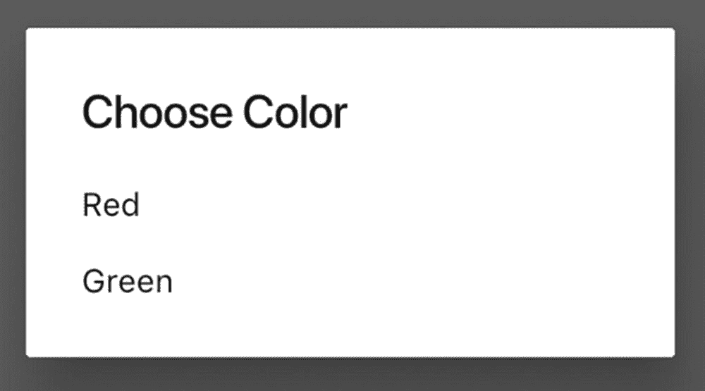
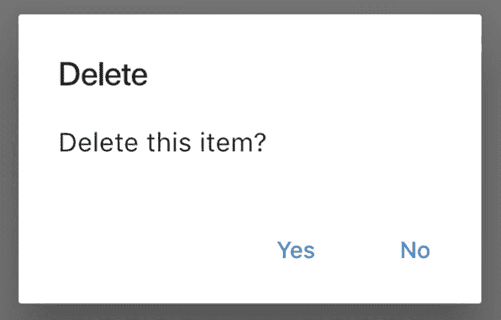
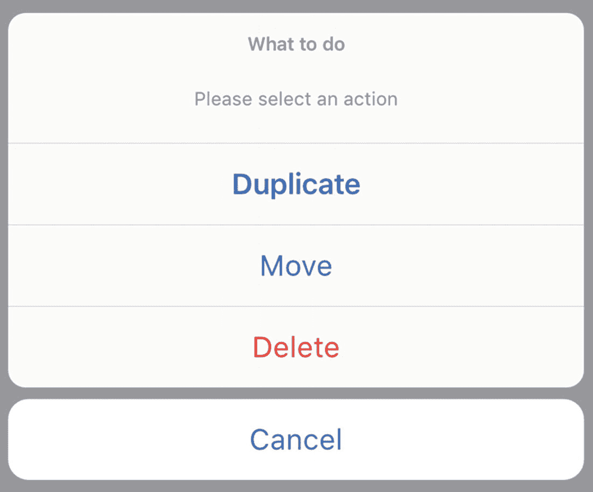
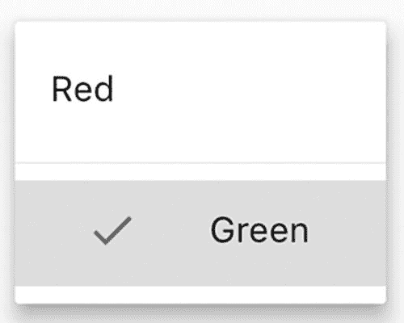
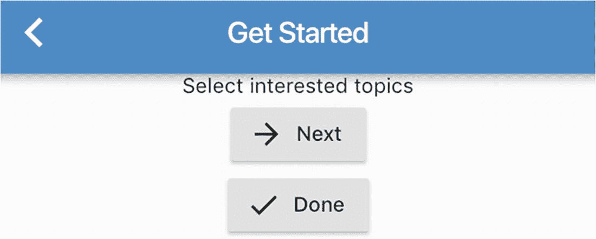

# 8. 页面导航

Flutter 应用可能有多个屏幕或页面。页面是功能的集合。用户在页面之间进行导航以使用不同的功能。像页面这样的概念在 Flutter 中被称为路由。路由不仅包括全屏页面，还包括模态对话框和弹出窗口。路由由 `Navigator` 组件管理。本章讨论与 Flutter 中页面导航相关的实用方案。

## 8.1 实现基本页面导航

### 问题

您希望拥有基本的页面导航支持。

### 解决方案

使用 `Navigator.push()` 导航到新路由，并使用 `Navigator.pop()` 返回上一个路由。

### 讨论

路由由 `Navigator` 组件管理。导航器管理着一个路由栈。可以使用 `push()` 方法将路由推入栈中，使用 `pop()` 方法将其从栈中弹出。栈顶元素是当前激活的路由。`Navigator` 是一个有状态组件，其状态为 `NavigatorState`。要与导航器交互，可以使用 `Navigator` 的静态方法，或者获取一个 `NavigatorState` 实例。通过使用 `Navigator.of()` 方法，可以获取给定构建上下文最近的 `NavigatorState` 实例。您可以显式创建 `Navigator` 组件，但大多数情况下，您会使用由 `WidgetsApp`、`MaterialApp` 或 `CupertinoApp` 组件创建的 `Navigator` 组件。

路由使用抽象类 `Route` 的实现来表示。例如，`PageRoute` 表示全屏模态路由，而 `PopupRoute` 表示在当前路由之上覆盖一个组件的模态路由。`PageRoute` 和 `PopupRoute` 类都是 `ModalRoute` 类的子类。对于 Material Design 应用，创建全屏页面最简单的方法是使用 `MaterialPageRoute` 类。`MaterialPageRoute` 使用 `WidgetBuilder` 函数来构建路由的内容。

在清单 8-1/#479501_1_En_8_Chapter.xhtml#PC1) 中，`Navigator.of(context)` 获取了要使用的 `NavigatorState` 实例。推送到导航器的新路由是一个 `MaterialPageRoute` 实例。这个新路由包含一个按钮，该按钮使用 `NavigatorState.pop()` 方法将当前路由从导航器中弹出。实际上，当使用 `Scaffold` 组件时，应用栏会自动添加一个返回按钮，因此无需使用显式的返回按钮。

```
class SimpleNavigationPage extends StatelessWidget {
@override
Widget build(BuildContext context) {
return Scaffold(
appBar: AppBar(
title: Text('Simple Navigation'),
),
body: Center(
child: RaisedButton(
child: Text('Show page'),
onPressed: () {
Navigator.of(context).push(MaterialPageRoute(builder: (context) {
return Scaffold(
appBar: AppBar(
title: Text('New Page'),
),
body: Center(
child: Column(
crossAxisAlignment: CrossAxisAlignment.center,
children: [
Text('A new page'),
RaisedButton(
child: Text('Go back'),
onPressed: () {
Navigator.of(context).pop();
},
),
],
),
),
);
}));
},
),
),
);
}
}
清单 8-1
使用 Navigator 进行页面导航
```

`Navigator` 类拥有诸如 `push()` 和 `pop()` 之类的静态方法，它们与 `NavigatorState` 类中的同名方法功能相同，但这些静态方法需要一个额外的 `BuildContext` 参数。`Navigator.push(context)` 实际上等同于 `Navigator.of(context).push()`。您可以选择使用其中任意一种方法。

## 8.2 使用命名路由

### 问题

您希望从不同位置导航到同一个路由。

### 解决方案

结合 `Navigator.pushNamed()` 方法使用命名路由。

### 讨论

当使用 `Navigator.push()` 方法将新路由推送到导航器时，新路由是通过构建器函数按需构建的。当路由可以从不同位置进行导航时，这种方法效果不佳，因为我们不想重复构建路由的代码。在这种情况下，使用命名路由是更好的选择。命名路由具有唯一的名称。`Navigator.pushNamed()` 方法使用该名称来指定要推送到导航器的路由。

命名路由在可以被导航之前需要先进行注册。注册命名路由最简单的方法是使用 `WidgetsApp`、`MaterialApp` 或 `CupertinoApp` 构造函数的 `routes` 参数。`routes` 参数是一个 `Map<String, WidgetBuilder>` 对象，其键是路由名称。路由名称通常采用以“/”开头的路径格式。这与 Web 应用组织页面的方式类似。例如，您可以使用诸如 `/log_in`、`/orders` 和 `/orders/1234` 之类的路由名称。

在清单 8-2/#479501_1_En_8_Chapter.xhtml#PC2) 中，按下“注册”按钮会将命名路由 `/sign_up` 推送到导航器。

```
class LogInPage extends StatelessWidget {
@override
Widget build(BuildContext context) {
return Scaffold(
appBar: AppBar(
title: Text('Log In'),
),
body: Center(
child: RaisedButton(
child: Text('Sign Up'),
onPressed: () {
Navigator.pushNamed(context, '/sign_up');
},
),
),
);
}
}
清单 8-2
使用命名路由
```

在清单 8-3/#479501_1_En_8_Chapter.xhtml#PC3) 中，两个命名路由在 `routes` 参数中注册了。

```
class PageNavigationApp extends StatelessWidget {
@override
Widget build(BuildContext context) {
return MaterialApp(
title: 'Page Navigation',
home: IndexPage(),
routes: {
'/sign_up': (context) => SignUpPage(),
'/log_in': (context) => LogInPage(),
},
);
}
}
清单 8-3
注册命名路由
```

## 8.3 在路由之间传递数据

### 问题

您希望在不同的路由之间传递数据。

### 解决方案

使用构造函数参数或 `RouteSettings` 对象将数据传递给路由，并使用 `Navigator.pop()` 方法的 `result` 参数从路由返回数据。


### 讨论

路由在构建内容时可能需要额外的数据。路由在弹出时也可能会返回一些数据。例如，编辑用户详细信息的路由可能需要当前的详细信息作为输入，并返回更新后的详细信息作为输出。根据路由导航方式的不同，在路由之间传递数据有不同方法。

使用 `Navigator.push()` 方法推入新路由时，最简单的方式是将数据作为 `WidgetBuilder` 函数返回的 widget 的构造函数参数传入。使用 `Navigator.pop()` 方法时，可以使用可选的 `result` 参数将返回值传递给前一个路由。`Navigator.push()` 方法的返回值是一个 `Future<T>` 对象。当新推入的路由被弹出时，这个 `Future` 对象会被解析。解析后的值就是调用 `Navigator.pop()` 方法时传入的返回值。如果路由是通过返回按钮弹出的，那么解析后的值为 `null`。

在代码清单 8-4 中，`UserDetails` 类包含用户的名和姓。`UserDetailsPage` 用于显示用户详情。当按下编辑按钮时，一个新路由被推入导航器。新路由的内容是一个 `EditUserDetailsPage` widget，其构造函数参数为 `UserDetails` 对象。新路由的返回值也是一个 `UserDetails` 对象，用于更新 `UserDetailsPage` 的状态。

```
class UserDetails {
UserDetails(this.firstName, this.lastName);
final String firstName;
final String lastName;
}
class UserDetailsPage extends StatefulWidget {
@override
_UserDetailsPageState createState() => _UserDetailsPageState();
}
class _UserDetailsPageState extends State {
UserDetails _userDetails = UserDetails('John', 'Doe');
@override
Widget build(BuildContext context) {
return Scaffold(
appBar: AppBar(
title: Text('User Details'),
),
body: Column(
children: [
Text('First name: ${_userDetails.firstName}'),
Text('Last name: ${_userDetails.lastName}'),
RaisedButton.icon(
label: Text('Edit (route builder)'),
icon: Icon(Icons.edit),
onPressed: () async {
UserDetails result = await Navigator.push(
context,
MaterialPageRoute(
builder: (BuildContext context) {
return EditUserDetailsPage(_userDetails);
},
),
);
if (result != null) {
setState(() {
_userDetails = result;
});
}
},
),
],
),
);
}
}
代码清单 8-4
用户详情页面
```

在代码清单 8-5 中，`EditUserDetailsPage` 使用两个 `TextFormField` widget 来编辑用户详情。当按下保存按钮时，通过 `Navigator.pop()` 方法返回更新后的 `UserDetails` 对象。

```
class EditUserDetailsPage extends StatefulWidget {
EditUserDetailsPage(this.userDetails);
final UserDetails userDetails;
@override
_EditUserDetailsPageState createState() =>
_EditUserDetailsPageState(userDetails);
}
class _EditUserDetailsPageState extends State {
_EditUserDetailsPageState(this._userDetails);
UserDetails _userDetails;
final GlobalKey<FormFieldState> _firstNameKey = GlobalKey();
final GlobalKey<FormFieldState> _lastNameKey = GlobalKey();
@override
Widget build(BuildContext context) {
return Scaffold(
appBar: AppBar(
title: Text('Edit User Details'),
),
body: Column(
children: [
TextFormField(
key: _firstNameKey,
decoration: InputDecoration(
labelText: 'First name',
),
initialValue: _userDetails.firstName,
),
TextFormField(
key: _lastNameKey,
decoration: InputDecoration(
labelText: 'Last name',
),
initialValue: _userDetails.lastName,
),
RaisedButton(
child: Text('Save'),
onPressed: () {
Navigator.pop(
context,
UserDetails(_firstNameKey.currentState?.value,
_lastNameKey.currentState?.value));
},
)
],
),
);
}
}
代码清单 8-5
编辑用户详情页面
```

如果使用命名路由，可以通过 `Navigator.pushNamed()` 方法的 `arguments` 参数将数据传递给路由。在代码清单 8-6 中，使用 `pushNamed()` 方法导航到 `/edit_user` 路由，并传入当前 `UserDetails` 对象。

```
UserDetails result = await Navigator.pushNamed(
context,
'/edit_user',
arguments: _userDetails,
);
代码清单 8-6
向命名路由传递数据
```

命名路由 `/edit_user` 在 `MaterialApp` 中注册。不能使用 `route` 参数，因为无法在构建函数中访问传递给路由的数据。应改用 `WidgetsApp`、`MaterialApp` 或 `CupertinoApp` 的 `onGenerateRoute` 参数。`onGenerateRoute` 参数的类型是 `RouteFactory`，它是函数类型 `Route (RouteSettings settings)` 的类型别名。`RouteSettings` 类包含创建 `Route` 对象时可能所需的数据。表 8-1 显示了 `RouteSettings` 类的属性。

**表 8-1** `RouteSettings` 的属性

| 名称 | 类型 | 描述 |
| --- | --- | --- |
| `name` | `String` | 路由的名称。 |
| `arguments` | `Object` | 传递给路由的数据。 |
| `isInitialRoute` | `bool` | 此路由是否是推入导航器的第一个路由。 |

在实现 `onGenerateRoute` 函数时，需要根据提供的 `RouteSettings` 对象返回路由。在代码清单 8-7 中，首先检查 `name` 属性，然后返回一个包含 `EditUserDetailsPage` 内容的 `MeterialPageRoute`。`RouteSettings` 的 `arguments` 属性在 `EditUserDetailsPage` 的构造函数中使用。`arguments` 属性的值就是代码清单 8-6 中传入的 `UserDetails` 对象。

```
MaterialApp(
onGenerateRoute: (RouteSettings settings) {
if (settings.name == '/edit_user') {
return MaterialPageRoute(
settings: settings,
builder: (context) {
return EditUserDetailsPage(settings.arguments);
},
);
}
},
);
代码清单 8-7
使用 onGenerateRoute
```

## 8.4 实现动态路由匹配

### 问题

您想使用复杂的逻辑来匹配路由名称。

### 解决方案

使用 `onGenerateRoute` 参数。

### 讨论

当使用 `WidgetsApp` 的 `routes` 参数注册命名路由时，只能使用完整的路由名称来匹配 `Route` 对象。如果您想使用复杂的逻辑来将 `Route` 对象与路由名称匹配，可以使用 `onGenerateRoute` 参数和 `RouteSettings` 对象。例如，您可以将所有以 `/order` 开头的路由名称匹配到同一个 `Route` 对象。

在代码清单 8-8 中，所有以 `/order` 开头的路由名称都将导航到一个使用 `OrderPage` 的路由。

```
MaterialApp(
onGenerateRoute: (RouteSettings settings) {
if (settings.name.startsWith('/order')) {
return MaterialPageRoute(
settings: settings,
builder: (context) {
return OrderPage();
},
);
}
},
);
代码清单 8-8
路由匹配
```

## 8.5 处理未知路由

### 问题

您想处理导航到未知路由的情况。

### 解决方案

使用 `Navigator`、`WidgetsApp`、`MaterialApp` 和 `CupertinoApp` 的 `onUnknownRoute` 参数。

### 讨论

导航器有可能被要求导航到一个未知路由。这可能是由应用程序中的编程错误或外部路由导航请求引起的。如果 `onGenerateRoute` 函数为给定的 `RouteSettings` 对象返回 `null`，则会调用 `onUnknownRoute` 函数来提供一个后备路由。这个 `onUnknownRoute` 函数通常用于错误处理，就像 Web 应用中的 404 页面一样。`onUnknownRoute` 的类型也是 `RouteFactory`。

在代码清单 8-9 中，`onUnknownRoute` 函数返回一个显示 `NotFoundPage` widget 的路由。

```
MaterialApp(
onUnknownRoute: (RouteSettings settings) {
return MaterialPageRoute(
settings: settings,
builder: (BuildContext context) {
return NotFoundPage(settings.name);
},
);
},
);
代码清单 8-9
使用 onUnknownRoute
```

## 8.6 显示 Material Design 对话框

### 问题

您想显示 Material Design 对话框。

### 解决方案

使用 `showDialog()` 函数以及 `Dialog`、`SimpleDialog` 和 `AlertDialog` widget。


### 讨论

要使用 Material Design 对话框，你需要创建对话框小部件并显示它们。`Dialog` 类及其子类 `SimpleDialog` 和 `AlertDialog` 可用于创建对话框。

`SimpleDialog` 小部件向用户提供多个选项。选项通过 `SimpleDialogOption` 类表示。一个 `SimpleDialogOption` 小部件可以拥有一个子小部件和一个 `onPressed` 回调。创建 `SimpleDialog` 时，你可以提供一个子列表和一个可选标题。`AlertDialog` 小部件向用户呈现内容和一个操作列表。`AlertDialog` 用于通知用户或请求确认。

要显示对话框，应使用 `showDialog()` 函数。调用此函数会将对话框路由推送到导航器中。对话框使用 `Navigator.pop()` 方法关闭。`showDialog()` 函数使用一个 `WidgetBuilder` 函数来构建对话框内容。`showDialog()` 函数的返回值是一个 `Future<T>` 对象，它实际上是 `Navigator.push()` 方法的返回值。

在代码清单 8-10 中，按下按钮会显示一个带有两个选项的简单对话框。

```
RaisedButton(
child: Text('显示 SimpleDialog'),
onPressed: () async {
String result = await showDialog(
context: context,
builder: (BuildContext context) {
return SimpleDialog(
title: Text('选择颜色'),
children: [
SimpleDialogOption(
child: Text('红色'),
onPressed: () {
Navigator.pop(context, '红色');
},
),
SimpleDialogOption(
child: Text('绿色'),
onPressed: () {
Navigator.pop(context, '绿色');
},
),
],
);
});
print(result);
},
);
代码清单 8-10
显示简单对话框
```

图 8-1 显示了代码清单 8-10 的截图。



图 8-1

Material Design 简单对话框

在代码清单 8-11 中，按下按钮会显示一个带有两个操作的提示对话框。

```
RaisedButton(
child: Text('显示 AlertDialog'),
onPressed: () async {
bool result = await showDialog(
context: context,
builder: (BuildContext context) {
return AlertDialog(
title: Text('删除'),
content: Text('删除此项目？'),
actions: [
FlatButton(
child: Text('是'),
onPressed: () {
Navigator.pop(context, true);
},
),
FlatButton(
child: Text('否'),
onPressed: () {
Navigator.pop(context, false);
},
),
],
);
},
);
print(result);
},
);
代码清单 8-11
显示提示对话框
```

图 8-2 显示了代码清单 8-11 的截图。



图 8-2

Material Design 提示对话框

## 8.7 显示 iOS 对话框

### 问题

你想要显示 iOS 对话框。

### 解决方案

使用 `showCupertinoDialog()` 函数以及 `CupertinoAlertDialog` 和 `CupertinoPopupSurface` 小部件。

### 讨论

对于 iOS 应用，你可以使用 `showCupertinoDialog()` 函数以及诸如 `CupertinoAlertDialog` 和 `CupertinoPopupSurface` 之类的小部件来显示对话框。`showCupertinoDialog()` 函数与 Material Design 的 `showDialog()` 函数类似。此函数也使用 `Navigator.push()` 方法将对话框路由推送到导航器。`CupertinoAlertDialog` 是一个内置的对话框实现，用于通知用户或请求确认。一个 `CupertinoAlertDialog` 可以包含标题、内容和一个操作列表。操作通过 `CupertinoDialogAction` 小部件表示。表 8-2 显示了 `CupertinoDialogAction` 构造函数的参数。

表 8-2

`CupertinoDialogAction` 的参数

| 名称 | 类型 | 描述 |
| --- | --- | --- |
| `child` | `Widget` | 操作的内容。 |
| `onPressed` | `VoidCallback` | 操作按下的回调。 |
| `isDefaultAction` | `bool` | 此操作是否为默认操作。 |
| `isDestructiveAction` | `bool` | 此操作是否具有破坏性。具有破坏性的操作有不同的样式。 |
| `textStyle` | `TextStyle` | 应用于操作的文本样式。 |

在代码清单 8-12 中，按下按钮会显示一个 iOS 风格的提示对话框。

```
CupertinoButton(
child: Text('显示提示对话框'),
onPressed: () async {
bool result = await showCupertinoDialog(
context: context,
builder: (BuildContext context) {
return CupertinoAlertDialog(
title: Text('删除'),
content: Text('删除此项目？'),
actions: [
CupertinoDialogAction(
child: Text('删除'),
onPressed: () {
Navigator.pop(context, true);
},
isDestructiveAction: true,
),
CupertinoDialogAction(
child: Text('取消'),
onPressed: () {
Navigator.pop(context, false);
},
),
],
);
},
);
print(result);
},
);
代码清单 8-12
显示 iOS 提示对话框
```

图 8-3 显示了代码清单 8-12 的截图。


图 8-3

iOS 提示对话框

如果你想创建自定义对话框，可以使用 `CupertinoPopupSurface` 小部件，它会创建一个圆角矩形表面。

## 8.8 显示 iOS 操作面板

### 问题

你希望在 iOS 应用中为用户提供一组可供选择的操作。

### 解决方案

使用 `showCupertinoModalPopup()` 函数和 `CupertinoActionSheet` 小部件。

### 讨论

如果你希望在 iOS 应用中为用户提供一组可供选择的操作，可以使用 `showCupertinoModalPopup()` 函数来显示 `CupertinoActionSheet` 小部件。一个 `CupertinoActionSheet` 可以包含标题、消息、一个取消按钮以及一个操作列表。操作表示为 `CupertinoActionSheetAction` 小部件。`CupertinoActionSheetAction` 构造函数的参数包括 `child`、`onPressed`、`isDefaultAction` 和 `isDestructiveAction`，这些参数的含义与表 8-2 中所示的 `CupertinoDialogAction` 构造函数中的相同。

在代码清单 8-13 中，按下按钮会显示一个包含三个操作和一个取消按钮的操作面板。

```
CupertinoButton(
child: Text('显示操作面板'),
onPressed: () async {
String result = await showCupertinoModalPopup(
context: context,
builder: (BuildContext context) {
return CupertinoActionSheet(
title: Text('要做什么'),
message: Text('请选择一个操作'),
actions: [
CupertinoActionSheetAction(
child: Text('复制'),
isDefaultAction: true,
onPressed: () {
Navigator.pop(context, 'duplicate');
},
),
CupertinoActionSheetAction(
child: Text('移动'),
onPressed: () {
Navigator.pop(context, 'move');
},
),
CupertinoActionSheetAction(
isDestructiveAction: true,
child: Text('删除'),
onPressed: () {
Navigator.pop(context, 'delete');
},
),
],
cancelButton: CupertinoActionSheetAction(
child: Text('取消'),
onPressed: () {
Navigator.pop(context);
},
),
);
},
);
print(result);
},
);
代码清单 8-13
显示 iOS 操作面板
```

图 8-4 显示了代码清单 8-13 的截图。



图 8-4

iOS 操作面板

## 8.9 显示 Material Design 菜单

### 问题

你想要在 Material Design 应用中显示菜单。

### 解决方案

使用 `showMenu()` 函数以及 `PopupMenuEntry` 类的实现。


### 讨论

要使用`showMenu()`函数，你需要有一个`PopupMenuEntry`对象列表。`PopupMenuEntry`有不同的实现类型：

* `PopupMenuItem` – 用于单个值的菜单项
* `CheckedPopupMenuItem` – 带有复选标记的菜单项
* `PopupMenuDivider` – 菜单项之间的水平分隔线

`PopupMenuItem`是一个泛型类，其类型由值类型决定。表 8-3 显示了`PopupMenuItem`构造函数的参数。`CheckedPopupMenuItem`是`PopupMenuItem`的子类，它具有`checked`属性，用于指定是否显示复选标记。

**表 8-3** `PopupMenuItem`构造函数的参数

| 名称 | 类型 | 描述 |
| --- | --- | --- |
| `child` | `Widget` | 菜单项的内容。 |
| `value` | `T` | 菜单项的值。 |
| `enabled` | `bool` | 此菜单项是否可被选中。 |
| `height` | `double` | 菜单项的高度。默认为`48`。 |

`showMenu()`函数返回一个`Future<T>`对象，该对象解析为所选菜单项的值。该函数还使用`Navigator.push()`方法显示菜单。表 8-4 显示了`showMenu()`函数的主要参数。当指定了`initialValue`时，具有匹配值的第一个项目会被高亮显示。

**表 8-4** `showMenu()`的参数

| 名称 | 类型 | 描述 |
| --- | --- | --- |
| `items` | `List<PopupMenuEntry<T>>` | 菜单项的列表。 |
| `initialValue` | `T` | 用于高亮显示菜单项的初始值。 |
| `position` | `RelativeRect` | 显示菜单的位置。 |

清单 8-14 中的菜单包含一个`PopupMenuItem`、一个`PopupMenuDivider`和一个`CheckedPopupMenuItem`。

```dart
RaisedButton(
  child: Text('Show Menu'),
  onPressed: () async {
    String result = await showMenu(
      context: context,
      position: RelativeRect.fromLTRB(0, 0, 0, 0),
      items: [
        PopupMenuItem(
          value: 'red',
          child: Text('Red'),
        ),
        PopupMenuDivider(),
        CheckedPopupMenuItem(
          value: 'green',
          checked: true,
          child: Text('Green'),
        )
      ],
      initialValue: 'green',
    );
    print(result);
  },
);
```
*清单 8-14 显示菜单*

使用`showMenu()`函数的主要难点在于为`position`参数提供合适的值。如果菜单是通过按下按钮触发的，那么使用`PopupMenuButton`是更好的选择，因为菜单位置会根据按钮位置自动计算。表 8-5 显示了`PopupMenuButton`构造函数的主要参数。`PopupMenuItemBuilder`函数接受一个`BuildContext`对象作为参数，并返回一个`List<PopupMenuEntry<T>>`对象。

**表 8-5** `PopupMenuButton`的参数

| 名称 | 类型 | 描述 |
| --- | --- | --- |
| `itemBuilder` | `PopupMenuItemBuilder<T>` | 用于创建菜单项的构建器函数。 |
| `initialValue` | `T` | 初始值。 |
| `onSelected` | `PopupMenuItemSelected<T>` | 选中菜单项时的回调。 |
| `onCanceled` | `PopupMenuCanceled` | 菜单被取消（无选择）时的回调。 |
| `tooltip` | `String` | 按钮的工具提示。 |
| `child` | `Widget` | 按钮的内容。 |
| `icon` | `Icon` | 按钮的图标。 |

清单 8-15 展示了如何使用`PopupMenuButton`实现与清单 8-14 相同的菜单。

```dart
PopupMenuButton(
  itemBuilder: (BuildContext context) {
    return [
      PopupMenuItem(
        value: 'red',
        child: Text('Red'),
      ),
      PopupMenuDivider(),
      CheckedPopupMenuItem(
        value: 'green',
        checked: true,
        child: Text('Green'),
      )
    ];
  },
  initialValue: 'green',
  child: Text('Select color'),
  onSelected: (String value) {
    print(value);
  },
  onCanceled: () {
    print('no selections');
  },
);
```
*清单 8-15 使用 PopupMenuButton*

图 8-5 展示了在清单 8-14 和 8-15 中创建的菜单截图。



*图 8-5 Material Design 菜单*

## 8.10 使用嵌套导航器管理复杂的页面流程

### 问题

你想要实现复杂的页面流程。

### 解决方案

使用嵌套的`Navigator`实例。


### 讨论

`Navigator`实例管理自己的路由栈。对于简单的应用，通常一个`Navigator`实例就足够了，并且可以直接使用由`WidgetsApp`、`MaterialApp`或`CupertinoApp`创建的`Navigator`实例。如果应用具有复杂的页面流程，可能需要使用嵌套导航器。由于`Navigator`本身也是一个 widget，因此可以像创建普通 widget 一样创建`Navigator`实例。由`WidgetsApp`、`MaterialApp`或`CupertinoApp`创建的`Navigator`实例成为根导航器。所有导航器都按层级结构组织。要获取根导航器，可以在调用`Navigator.of()`方法时将`rootNavigator`参数设为`true`。表 8-6 展示了`Navigator`构造函数的参数。

**表 8-6**
**`Navigator` 的参数**

| 名称 | 类型 | 描述 |
| --- | --- | --- |
| `onGenerateRoute` | `RouteFactory` | 为给定的`RouteSettings`对象生成一个路由。 |
| `onUnknownRoute` | `RouteFactory` | 处理未知路由。 |
| `initialRoute` | `String` | 第一个路由的名称。 |
| `observers` | `List<NavigatorObserver>` | 导航器状态变化的观察者。 |

让我们用一个具体例子来说明如何使用嵌套导航器。假设你正在构建一个社交新闻阅读应用，在新用户注册后，你希望向用户展示一个可选的引导页面。这个引导页面有几个步骤需要用户完成。用户可以来回切换，只完成感兴趣的步骤。用户也可以跳过此页面并返回应用的主页。引导页面有自己的导航器来处理步骤间的导航。

在列表 8-16 中，导航器有两个命名路由。初始路由设置为`on_boarding/topic`，因此首先显示`UserOnBoardingTopicPage`。

```
class UserOnBoardingPage extends StatelessWidget {
@override
Widget build(BuildContext context) {
return Scaffold(
appBar: AppBar(
title: Text('Get Started'),
),
body: Navigator(
initialRoute: 'on_boarding/topic',
onGenerateRoute: (RouteSettings settings) {
WidgetBuilder builder;
switch (settings.name) {
case 'on_boarding/topic':
builder = (BuildContext context) {
return UserOnBoardingTopicPage();
};
break;
case 'on_boarding/follower':
builder = (BuildContext context) {
return UserOnBoardingFollowPage();
};
break;
}
return MaterialPageRoute(
builder: builder,
settings: settings,
);
},
),
);
}
}
```
**列表 8-16**
**用户引导页面**

在列表 8-17 中，按下“Next”按钮会导航到路由名为`on_boarding/follower`的下一步。按下“Done”按钮则会使用根导航器弹出引导页面。

```
class UserOnBoardingTopicPage extends StatelessWidget {
@override
Widget build(BuildContext context) {
return Column(
children: [
Text('Select interested topics'),
RaisedButton.icon(
icon: Icon(Icons.arrow_forward),
label: Text('Next'),
onPressed: () {
Navigator.pushNamed(context, 'on_boarding/follower');
},
),
RaisedButton.icon(
icon: Icon(Icons.check),
label: Text('Done'),
onPressed: () {
Navigator.of(context, rootNavigator: true).pop();
},
)
],
);
}
}
```
**列表 8-17**
**选择话题步骤**

图 8-6 展示了列表 8-17 中代码的截图。


**图 8-6**
**选择话题步骤**

`CupertinoTabView`拥有自己的导航器实例。创建`CupertinoTabView`时，可以提供`routes`、`onGenerateRoute`、`onUnknownRoute`和`navigatorObservers`参数。这些参数用于配置`Navigator`实例。当使用`CupertinoTabScaffold`创建标签布局时，每个标签视图都有自己的导航状态和历史记录。

使用嵌套导航器时，确保使用正确的导航器实例非常重要。如果要显示和关闭全屏页面或模态对话框，应该使用通过`Navigator.of(context, rootNavigator: true)`获取的根导航器。调用`Navigator.of(context)`只能获取最近封闭的`Navigator`实例。在层级结构中无法获取中间的`Navigator`实例。你需要在 widget 树的正确位置使用`BuildContext`对象。像`showDialog()`和`showMenu()`这样的函数内部总是使用`Navigator.of(context)`。你只能通过传入的`BuildContext`对象来控制这些函数使用哪个`Navigator`实例。

## 8.11 观察导航器状态变化

### 问题

当导航器状态发生变化时，你希望收到通知。

### 解决方案

使用`NavigatorObserver`。


### 讨论

有时，你可能希望在导航器的状态发生变化时收到通知。例如，你想分析用户使用应用时的页面流转情况，从而改进用户体验。在创建 `Navigator` 实例时，你可以提供一个 `NavigatorObserver` 对象的列表，作为导航器状态变化的观察者。表 8-7 展示了 `NavigatorObserver` 接口的方法。

**表 8-7** `NavigatorObserver` 的方法

| 名称 | 描述 |
| --- | --- |
| `didPop(Route route, Route previousRoute)` | `route` 被弹出，`previousRoute` 是新的活动路由。 |
| `didPush(Route route, Route previousRoute)` | `route` 被推入，`previousRoute` 是之前的活动路由。 |
| `didRemove(Route route, Route previousRoute)` | `route` 被移除，`previousRoute` 是紧挨在已移除路由下方的路由。 |
| `didReplace(Route newRoute, Route oldRoute)` | `oldRoute` 被 `newRoute` 替换。 |
| `didStartUserGesture(Route route, Route previousRoute)` | 用户开始使用手势移动 `route`。紧挨在 `route` 下方的路由是 `previousRoute`。 |
| `didStopUserGesture()` | 用户停止使用手势移动路由。 |

在代码清单 8-18 中，`LoggingNavigatorObserver` 类在路由被推入和弹出时记录消息。

```
class LoggingNavigatorObserver extends NavigatorObserver {
@override
void didPush(Route route, Route previousRoute) {
print('push: ${_routeName(previousRoute)} -> ${_routeName(route)}');
}
@override
void didPop(Route route, Route previousRoute) {
print(' pop: ${_routeName(route)} -> ${_routeName(previousRoute)}');
}
String _routeName(Route route) {
return route != null
? (route.settings?.name ?? route.runtimeType.toString())
: 'null';
}
}
```

**代码清单 8-18** 日志记录导航器观察者

当你想为导航器中的所有状态变化设置一个全局处理器时，`NavigatorObserver` 接口非常有用。如果你只对与特定路由相关的状态变化感兴趣，那么使用 `RouteObserver` 类是更好的选择。`RouteObserver` 类也是 `NavigatorObserver` 接口的一个实现。

为了收到与 `Route` 对象相关的状态变化通知，你的类需要实现 `RouteAware` 接口。表 8-8 展示了 `RouteAware` 接口的方法。

**表 8-8** `RouteAware` 的方法

| 名称 | 描述 |
| --- | --- |
| `didPop()` | 当前路由被弹出时的回调。 |
| `didPopNext()` | 在顶部路由被弹出后，当前路由变为活动状态时调用。 |
| `didPush()` | 在当前路由被推入时调用。 |
| `didPushNext()` | 在新路由被推入后，当前路由不再活动时调用。 |

为了实际收到针对某个 `Route` 对象的通知，你需要使用 `RouteObserver` 的 `subscribe()` 方法，将一个 `RouteAware` 对象订阅到该 `Route` 对象。当不再需要此订阅时，应使用 `unsubscribe()` 方法取消 `RouteAware` 对象的订阅。

在代码清单 8-19 中，`_ObservedPageState` 类实现了 `RouteAware` 接口，并重写了 `didPush()` 和 `didPop()` 方法来打印一些消息。`ModalRoute.of(context)` 从构建上下文中获取最近的封闭 `ModalRoute` 对象，也就是 `ObservedPage` 所在的路由。通过使用 `ModalRoute.of(context)`，无需显式传递 `Route` 对象。当前的 `_ObservedPageState` 对象使用传入的 `RouteObserver` 对象的 `subscribe()` 方法，订阅当前路由的状态变化。当 `_ObservedPageState` 对象被释放时，该订阅被移除。

```
class ObservedPage extends StatefulWidget {
ObservedPage(this.routeObserver);
final RouteObserver<ModalRoute<void>> routeObserver;
@override
_ObservedPageState createState() => _ObservedPageState(routeObserver);
}
class _ObservedPageState extends State<ObservedPage> with RouteAware {
_ObservedPageState(this._routeObserver);
final RouteObserver<ModalRoute<void>> _routeObserver;
@override
void didChangeDependencies() {
super.didChangeDependencies();
_routeObserver.subscribe(this, ModalRoute.of(context));
}
@override
void dispose() {
_routeObserver.unsubscribe(this);
super.dispose();
}
@override
void didPush() {
print('pushed');
}
@override
void didPop() {
print('popped');
}
@override
Widget build(BuildContext context) {
return Scaffold(
appBar: AppBar(
title: Text('Observed (Stateful)'),
),
);
}
}
```

**代码清单 8-19** 使用 `RouteObserver`

## 8.12 阻止路由被弹出

### 问题

你想阻止路由从导航器中被弹出。

### 解决方案

将 `WillPopCallback` 与 `ModalRoute` 对象一起使用。

### 讨论

当一个路由被推入导航器后，该路由可以通过 `Scaffold` 中的返回按钮或 Android 系统中的返回按钮被弹出。有时你可能希望阻止该路由被弹出。例如，如果页面中有未保存的更改，你可能想先显示一个警报对话框来请求确认。当使用 `Navigator.maybePop()` 方法而不是 `Navigator.pop()` 方法时，你有机会决定是否应该执行弹出路由的请求。

`ModalRoute` 类有一个 `addScopedWillPopCallback()` 方法，用于添加一个 `WillPopCallback 函数，该函数决定路由是否应该被弹出。`WillPopCallback` 是一个函数类型 `Future<bool> ()` 的别名。如果返回的 `Future<bool>` 对象解析为 `true`，则路由可以被弹出。否则，路由不能被弹出。你可以向一个 `ModalRoute` 对象添加多个 `WillPopCallback` 函数。如果其中任何一个 `WillPopCallback` 函数否决了请求，路由将不会被弹出。

在代码清单 8-20 中，将一个 `WillPopCallback` 函数添加到了当前路由。`WillPopCallback` 函数的返回值是由 `showDialog()` 返回的 `Future<bool>` 对象。

```
class VetoPopPage extends StatelessWidget {
@override
Widget build(BuildContext context) {
ModalRoute.of(context).addScopedWillPopCallback(() {
return showDialog(
context: context,
builder: (BuildContext context) {
return AlertDialog(
title: Text('Exit?'),
actions: [
FlatButton(
child: Text('Yes'),
onPressed: () {
Navigator.pop(context, true);
},
),
FlatButton(
child: Text('No'),
onPressed: () {
Navigator.pop(context, false);
},
),
],
},
);
});
return Scaffold(
appBar: AppBar(
title: Text('Veto Pop'),
),
body: Container(),
);
}
}
```

**代码清单 8-20** 否决路由弹出请求

## 8.13 总结

在 Flutter 应用中拥有多个页面是很常见的。本章讨论了在 Flutter 中实现页面导航的基本概念。本章还涵盖了对话框、菜单和操作面板。在下一章中，我们将讨论 Flutter 中的后端服务交互。

