# 第 4 天：从通讯录和 Facebook 导入生日

## 第 10 章：从通讯录导入生日

### 增强空数据库状态下的主视图


在故事板中识别视图控制器场景

访问和筛选通讯录联系人

通讯录数据隐私

处理通讯录数据

创建生日导入值对象

将联系人照片和数据加载到表格视图中

创建用于导入生日的多选表格视图

将通讯录生日导入 Core Data 存储

激活电话、短信和电子邮件

多任务应用间的 URL 方案与跳转链接

从数据存储中删除生日

总结

第 11 章：使用 Facebook 与 iOS 6 社交框架

在 Facebook.com 注册新应用

创建 Facebook 导入视图控制器

使用 Accounts 框架通过 Facebook 进行身份验证

获取 Facebook 生日

将 Facebook 好友加载到表格视图中

将 Facebook 生日导入 Core Data 存储

加载并显示远程图片

在好友的 Facebook 墙发帖

创建 Facebook 墙发帖视图控制器

总结

第 12 章：设置与本地通知

使用静态表格视图控制器

构建设置单例类

用户默认设置：iOS 中的 Cookies

更新生日信息

安排并触发提醒本地通知

重置图标徽章

总结

第 5 天：收尾工作

第 13 章：发布之前：提高 App Store 成功几率

获取更多 App Store 五星评价

配置 Appirater

在 Facebook、Twitter 和电子邮件上分享

使用 UIActivityViewController 实现五分钟分享集成

使用 SLComposeViewController 在 Facebook 上分享

使用 SLComposeViewController 在 Twitter 上分享

使用 MFMailComposeViewController 发送电子邮件

使用 MFMessageComposeViewController 发送信息

总结

第 14 章：提交我们的应用

通过 iTunes Connect 创建新的应用提交

设置默认语言

输入应用名称

输入 SKU 编号

关联 Bundle Identifier

安排应用发布时间与定价

延迟应用发布

为你的应用定价

将你的应用限制在特定国家/地区

配置版本信息

选择 App Store 类别

设置应用评分等级

添加描述和元数据

添加关键词

上传屏幕截图和 iTunes 插图

应用名称已确认，获得 iTunes App ID

为 App Store 提交准备我们的应用

为我们的项目创建归档构建版本

签名并上传构建版本

但如果我在待审核的应用中发现了一个 Bug 该怎么办？

总结

索引

## 关于作者


`Nick Kuh` 是一位常驻英国的 iOS 顾问和开发者，拥有 14 年为 BBC、ESPN、Channel 4、Pearson 和 Novartis 等客户开发移动、桌面和网络应用的经验。他既参与大型商业 iOS 项目，也帮助初创公司在 App Store 上发布应用。

Nick 在商业工作之余，还开发了自己成功的独立应用，例如 *Tap to Chat*、*Poker Royale* 和 *Portfolio Pro*。

你可以在 Twitter 上通过 @nickkuh 找到 Nick，或访问他的网站 [www.nickkuh.com](http://www.nickkuh.com)。

## 关于技术审校


`Felipe Laso Marsetti` 是一位自学成才的软件开发者，专攻 iOS 开发，目前受雇于 Lextech Global Services 担任系统工程师。尽管他职业生涯中使用过多种语言，但没有什么比在 iPhone 和 iPad 项目上工作更让他开心。Felipe 拥有超过 2 年的专业 iOS 开发经验。他喜欢在 [`iFe.li`](http://iFe.li) 上写博客，作为 [`www.raywenderlich.com`](http://www.raywenderlich.com) 的成员制作 iOS 教程和文章，或担任 Objective-C 及 iOS 相关书籍的技术审校。你可以在 Twitter 上通过 @Airjordan12345 找到 Felipe，在 Facebook 上通过他的姓名找到他，或在 App.net 上通过 @iFeli 找到他。当不工作或不编程时，Felipe 喜欢阅读、学习新语言和技术、观看体育比赛、烹饪或弹吉他和拉小提琴。

## 关于封面图片作者


`Corné van Dooren` 设计了本书的封面图片。在暂时离开 friends of ED 为基础系列设计新封面后，他致力于将技术形态与有机形态相结合，其成果现在出现在本书及其他书籍的封面上。

Corné 的童年是在随手可得的东西上涂鸦中度过的，随后他开始探索多媒体的无限世界——而他的发现之旅自此从未停止。他的座右铭始终是“多媒体的唯一限制是想象力”，这句话不断推动他前进。

Corné 为众多国际客户工作，为多媒体杂志撰写特稿、评测和测试软件、编写多媒体研究文章，并参与许多其他 friends of ED 的图书项目。如果你喜欢 Corné 的作品，一定要看看他在《New Masters of Photoshop: Volume 2》（friends of ED，2004）中的章节。你可以在他的网站 [www.cornevandooren.com](http://www.cornevandooren.com) 上看到他的更多作品（并联系他）。

## 引言

我的编程根源始于 1999 年的 Flash，当时我开始用 ActionScript 编写面向对象的游戏和应用。后来在 2009 年，Apple 推出 App Store 并向第三方开放其激动人心的新移动平台后不久，我决定转行成为一名 iPhone 开发者。

从 Flash Player 开发过渡到 iPhone 开发并非一帆风顺，但对我帮助最大的一个关键因素是：Flash 面向对象编程的相同基础原则，也正是 Objective-C 和 iOS SDK 的核心。

如果你已经在使用另一种面向对象语言，那么你应该能够将这些知识应用到 Objective-C 中，并很快上手为 iPhone 构建应用。


#### 谁应该购买这本书

你是 Flash 或 Java 开发者吗？是 PHP 或 Ruby 程序员吗？你已经精通至少一门面向对象编程语言，并希望将自己的技能扩展到广受欢迎的 iOS 平台。这本书就是为你准备的。

或者，你是一位初级的 iPhone 开发者。你已经完成过其他书籍提供的许多代码示例。现在，你希望学习如何构建一款更大规模的应用程序，并将从这些示例代码片段中学到的知识整合起来，而这并不容易。

如果你完全是编程新手，你可能会觉得这本书相当有挑战性。不过，我总认为，即使是从深水区开始，勇敢面对困难，往往也是迎接新挑战的好方法。如果你是新手但学习能力很快，那么欢迎加入！在我们的旅程中，我会考虑到你。

我的书将帮助你克服上手 `Objective-C` 的挑战。我会帮助你有效利用面向对象编程的知识，编写出优秀的 iOS 应用程序。不过，如果你的面向对象代码有些不连贯，也别担心。在本书中，我会定期强调 iOS 是如何应用模型-视图-控制器（`MVC`）范式的。

从一开始，我就会让你亲手实践 `Xcode`。这将是一本非常注重实操的书。毕竟，我们只有 5 天时间来构建一个应用！

你甚至可以立即下载我们将要开发的应用，它已经在 App Store 上架，名为 `*Birthday Reminder for Facebook*`。

#### 这本书将教你什么

其他书籍会为你提供 iOS SDK 中各种框架的一章接一章的代码示例，但当你要构建自己的应用时，你还需要弄清楚如何最好地将这些概念组合起来。

本书采用了一种截然不同的学习方法。我将教你如何在短短 5 天内，构建一款专业、定制化、面向对象的 iPhone 应用。

我们将从一个 Photoshop PSD 设计图和一个应用创意开始。然后，在本书的剩余部分，我将引导你完成构建这款应用的每个阶段。但真正构建应用的人是你。你将学习如何像应用开发者一样思考，如何将一个创意转变为精美的 iPhone 应用，并在此过程中掌握大量技巧和诀窍。

你将学习我过去 3 年多时间里总结出的一套开发流程，完成课程后，你就可以将其应用于你自己的应用。

你将要开发的应用表面上相当简单，但它所引入的开发原则同样适用于开发更大、更复杂的应用。

随着时间的推移，我发现，在构建 iOS 应用时，日常面临的编程挑战往往有许多不同的解决方法。例如：

*   将远程图片加载到滚动列表视图中的最佳方式，同时不阻塞用户界面并保持应用优化。
*   如何持久化存储用户数据（如文本和图片），并方便用户编辑和修改这些数据，或者撤销他们的更改。
*   如何实现自定义应用设计，而无需构建自定义的 iOS 视图组件。

本书将用我在自身商业项目中使用的解决方案来处理这类挑战。这些解决方案将为你节省数天、数月甚至数年的投入时间！

我将用来教你 iOS 应用编程技能的过程，会是一个循序渐进的过程。我们将从一个概念开始，直到完成应用的构建。*你*将构建这个应用！在此过程中，你将学到：

*   如何充分利用苹果在所有新款 iPhone 和 iPod Touch 设备上的高分辨率 Retina 显示屏，让你的精美应用设计更加引人注目
*   如何利用 `Xcode` 和 iOS 6 中的 Storyboard 快速绘制/模拟出应用的所有视图
*   如何利用面向对象继承构建视图控制器——集中核心、可复用的方法。代码更少。错误更少。未来修改更容易。
*   Core Data 将如何解决应用的所有数据持久化需求。虽然这是一个比较高级的话题，但我会为你提供一个易于理解的 Core Data 入门介绍，这将为更复杂的项目奠定基础。和 Core Data 做朋友吧，它值得！（图片来源：images/smile.jpg）
*   如何使用苹果在 iOS 6 中引入的最新的 Social 框架，深度集成 Facebook 的 Graph API。
*   如何利用应用内的社交网络营销——让用户向他们的朋友推广你的优秀应用！

这里涵盖的内容很多！

#### 这本书不会教你什么

这不是一本 iOS SDK 的参考书。我不会提供每个 iOS 框架的示例。有很多其他优秀的书籍已经做到了这一点。

（图片来源：images/ch.jpg）

## 第 1 天

## Objective C、Xcode 和 iOS SDK 基础工作

（图片来源：images/ch.jpg）

## 第 1 章

## 设计和规划我们的应用

作者：在本书的课程中，你将从一个概念到完成，构建一个应用！

你：是的，师傅！

作者：我希望你自己来构建这个应用。这是你学习的唯一途径！

你：是的，师傅！

好了，不再引用过多的《龙威小子》台词了（嗯，后面可能还会偶尔出现一些！图片来源：images/smile.jpg）。我想说明的是，通过一步一步、一章一章的过程，我将成为你的导师——但是*你*必须投入艰苦的努力。你需要为这个应用编写每一行代码。你需要为这个应用创建每一个类和视图。

我会为你提供这个项目所需的所有设计素材。我甚至已经将它们切割成了实际的图片资源文件，你可以直接嵌入到自己的应用中。

如果你想真正挑战自己，那就干脆不要看分阶段的源代码——直接扔掉它们！只使用导出的图片资源文件，然后自己编写所有代码。

我还会为你提供应用开发旅程中每一章的起始和完成源代码。所以，如果你卡住了，或者想直接跳到应用的某个特定部分，那就直接去吧。反正师傅又怎么会知道呢？

在本章中，我们将重点放在构建新 iPhone 应用的初始规划和设计阶段：当你有了应用创意后如何起步，了解你的应用面临的竞争，以及一些能帮助你的应用从苹果 App Store 成千上万的应用中脱颖而出的技巧和诀窍。

### 应用创意

我们都曾忘记过某人的生日，对吧？

你要构建的应用是一款生日提醒应用。`*Birthday Reminder*` 将确保我们的用户永远不会再忘记任何生日！这是一个简单但实用的创意，正是成为一个好 iPhone 应用创意的那类东西。

通过 `*Birthday Reminder*`，你所有朋友和家人的生日都存储在一个地方。你会在每个生日当天或之前收到通知提醒。再也不会有尴尬的迟到贺卡和礼物了。我们的应用将为用户解决这个核心问题。这是一个应用能无缝完成的单一任务——让用户的生活更轻松一些。

一些应用开发者常有的误解是，认为为应用添加更多功能会增加其人气和 App Store 排名。相反，请保持你的应用创意简单——并提供美观、直观的用户体验。专注于把一件事做到极致，而不是把十件事做得一团糟。

这款应用将在竞争中脱颖而出。它的图标和用户界面将非常精美，甚至让你想舔你的 iPhone！用户体验对新用户来说将是直观易懂的。应用还将会快速响应触摸操作——这正是 iOS 用户对优秀 iPhone 和 iPad 应用的期待。


### 添加与编辑生日

我们应用的用户将能够无限制地添加和编辑生日记录。我们还将提供通过 iPhone 相机或照片库为每个生日分配照片的选项。

所有生日数据将离线存储在 iPhone 本地的数据库中。我们将通过苹果的`Core Data`框架对数据库进行读写操作（你将在第 8 章中更深入地了解`Core Data`）。

### 从通讯录和 Facebook 导入生日

我们将在应用中编程实现一个导入机制，方便用户利用最新的 iOS 6 Facebook 社交集成和原生通讯录框架批量导入生日。不过，我们不会强迫用户导入其所有 Facebook 好友，而是允许他们自行选择。这正是创建自定义离线存储方案的巨大优势之一：由我们掌控数据。

将选定的生日持久保存在我们的应用中，还意味着即使操作系统关闭了应用（当然，因为我们正在构建一款经过优化的应用，这种情况绝不会发生），我们也不会丢失这些数据，无需重新与通讯录或 Facebook 同步。

### 笔记功能

我们将在应用中加入笔记功能——这是用户记录礼物灵感的完美方式。笔记同样会保存并存储在我们的离线`Core Data`存储中。

### 提醒通知

我们的应用将利用 iOS SDK 中的本地通知功能。在应用代码中，我们将安排这些通知提醒，它们会在用户的 iPhone 上按时触发每个生日提醒——即使我们的应用并未运行。我们还会在生日提醒中播放一小段《生日快乐》铃声。

### Facebook 社交集成与应用内营销

我们不会仅仅止步于将 Facebook 生日导入应用。我们将学习如何深度集成 Facebook 的 Graph API 和苹果的 iOS 6 社交框架，让用户无需离开应用即可直接在其好友的 Facebook 墙上发帖。除了对用户来说是一项实用功能外，我们也为*生日提醒*自动获得了免费广告。通过第三方应用发布的每条 Facebook 帖子都包含一个直接链接，指向源应用。这有助于在每次用户向 Facebook 好友发送生日快乐祝福时宣传*生日提醒*。

我们还会让用户轻松地向从通讯录导入的好友发送生日祝福电话、短信或电子邮件。

### 竞争分析

我们已经有了应用创意，但在进入设计与编码阶段之前，现在可能是审视竞争对手的好时机。

在项目开始时，研究应用最成功的竞争对手总是值得的。

在 App Store 中搜索你的目标关键词。哪些应用经常出现在搜索结果的前列？通常，这些是下载量最高的应用。这些成功的竞争对手做对了什么？可能包括以下因素的组合：

> *  他们拥有出色的图标。
> *  他们构建了一款优秀的应用。
> *  他们设计了精美的 UI（用户界面）。
> *  他们的应用易于使用，用户体验直观。
> *  他们将社交网络有效地集成到应用中。
> *  他们开展了强有力的营销活动。
> *  他们的应用被苹果在 App Store 中推荐。
> *  他们获得了大量 4 星和 5 星评价。
> *  他们率先有了这个想法，并抢在竞争对手之前发布。

列表中的最后一点通常是最常见的情况之一。许多早期带着好创意进入 App Store 的应用开发者，至今仍在他们的类别中占据强势地位。进入你所在类别的前 100 名，会为你的应用带来大量曝光。如果你幸运地达到这个位置，你的应用在 App Store 中的可见度将大大提高——从而获得更大的持续成功机会。

作为一名新的应用开发者，我建议你重点关注列表中的前六点（也是唯一受你控制的几点），进而通过良好的市场营销，你的辛勤工作可能会让你在排行榜上稳步上升。

在其巅峰时期，*Tap to Chat* 曾位列美国 App Store 免费社交网络应用的前 50 名——每天获得超过 4000 次下载。这种情况持续了相当长一段时间。随后，我的团队在一家新公司旗下发布了该应用的改进版本。然而，新版本从未幸运地达到与原版相同的排名位置。这并不重要，因为我们的第一个版本已经占据了强势地位，并保持了其受欢迎程度。

在准备这本书时，我只用了五天就构建了*生日提醒*的第一个版本。在此之前，我仔细研究了竞争对手的应用。我查看了搜索结果，还下载并付费购买了几款在众多应用中脱颖而出的其他生日提醒应用。实际上，我在“birthday reminder”的搜索结果中发现了 120 款 iPhone 竞争对手应用。不过，这并没有打消我的念头。首先，我有信心至少能实现列表中的前五点，从而取得成功：我能构建一款拥有直观用户体验的精美应用，出色地完成其核心任务——提醒用户所有朋友的生日。这款应用将以对用户有用的方式整合 Facebook 社交媒体，同时也能成为赋能点对点营销的有效方法。

实际上，搜索结果让我备受鼓舞。是的，有些竞争对手应用很不错，但毫不客气地说，大多数都不怎么样。

一些排名靠前的应用有数百条评分和评论。这也令人鼓舞，因为它表明，只要你能被注意到，生日提醒应用就有强劲的市场需求。

如果你想要亲自查看本书将从头到尾指导你构建的应用，现在就可以从 App Store 下载*Birthday Reminder for Facebook*。


### App Store 标题

已注册的 Apple 开发者（参见第 2 章）通过 `iTunes Connect` 网站（参见第 14 章）向 App Store 提交应用。如果标题已被占用，`iTunes Connect` 将不允许你为应用设置该 App Store 标题。你会看到有些开发者通过添加“+”或“Pro”或其他后缀来（大致）获得他们想要的 App Store 标题。

不要将你的 App Store 标题与*Bundle 显示名称*混淆，后者是你的应用在 iPhone 主屏幕上的标题。两者截然不同。显示名称在你的应用 bundle 的 `Info.plist`（参见第 3 章）中设置，且长度限制在约 12 个字符，超出部分会被截断。

与你的图标一样，App Store 标题将是应用销售/下载的主要切入点。潜在用户在浏览一排排的竞品应用时，只能看到你的图标和 App Store 标题的前几个词。

避免 App Store 标题过于晦涩。你应该包含你希望用户搜索并找到你的应用的关键词。App Store 的搜索算法非常重视应用标题中的词语。除非你已在 iTunes 之外建立了强大的品牌，否则你需要非常谨慎地选择标题中的词语。

标题中词语的顺序同样重要。在 iOS 6 中，当在 iPhone 上浏览时，你的标题大约有 40 个字符的空间，超过后 App Store 会截断标题。对于仍在使用 iOS 5 的用户，App Store 标题限制为单行，并在约 18 个字符后截断。充分利用这些字符！确保标题的前一两个词与你的图标结合，能够准确传达你的应用功能。

不要回避在 App Store 标题中使用其他相关关键词；例如，*Portfolio Pro for iPad — 可定制的照片和视频应用*。在标题中包含副标题可以提高你在相关 App Store 搜索中出现的机会。

我当初在构建 *Birthday Reminder for Facebook* 这个应用的第一个版本时，很幸运地抢到了这个标题。Facebook 用户在 App Store 中是一个庞大的市场。他们每次使用该应用在好友的墙上发布生日祝福时，都会帮助推广它。瞄准这些用户是非常值得的。

### 图标设计

或许你在制作 iPhone 应用方面是个多面手。你既能编写优秀的面相对象代码，又拥有设计精美用户界面的艺术眼光。那你可太幸运了！

对于我们大多数人来说，只能擅长其中一项。本书面向开发者，所以给个实用小提示：如果你想把应用的设计工作外包给一位才华横溢的 iOS 设计大师，我强烈推荐从 `www.dribbble.com` 开始。Dribbble 是一个寻找才华横溢的设计师的绝佳网站。它是一个设计师分享和评论最新作品的社交网站。尝试搜索“iOS”或“iPhone”，浏览相关设计的众多页面。这是发现与你应用创意风格相符的设计师的好方法。

通过 Dribbble，我找到了《生日提醒》应用图标和用户界面的设计师。

与你的 App Store 标题一样，你的图标是 iPhone 应用的第一印象。潜在用户会根据图标初步决定是否要进一步了解你的应用。所以，不要等到最后一刻才设计图标——它不是一个事后想法，它和应用本身一样重要！

新款 iPhone 和 iPod Touch 设备都配备了视网膜显示屏。因此，一个引人注目、设计精美并能充分利用视网膜屏幕上 114×114 像素图标尺寸的图标是必不可少的。

图 1-1 展示了我们应用的图标。一个设计感强、有趣且色彩丰富，并带有微妙 3D 效果的图标，将使我们在竞品图标中脱颖而出。


**图 1-1.** 《生日提醒》的图标：简洁、色彩丰富且引人注目

与你的 App Store 标题一样，不要试图把图标设计得过于花哨。重要的是你的潜在用户能够从图标设计中立即理解你的应用是做什么的。我为我们应用的图标选择了生日蛋糕设计，这一设计也延续到了我们应用的用户界面设计中。

### 用户界面设计

与我合作的大多数设计师在为 iOS 应用进行设计时，都使用 Photoshop 作为首选工具。感谢 Teehan+Lax 的才华横溢的团队，设计师们可以访问一个非常实用的 PSD 文件，该文件将所有原生 iOS 控件模拟成 Photoshop 图层，并整合在一个 iOS GUI（图形用户界面）PSD 文件中。这为 iOS 设计提供了一个理想的起点。该 PSD 文件可从 `www.teehanlax.com/downloads` 免费下载（参见图 1-2）。

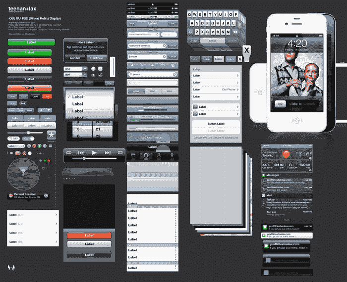

**图 1-2.** Teehan+Lax 制作的 iOS GUI PSD 文件

#### 视网膜显示屏、状态栏和 iPhone 5

iPhone 5 之前的 iPhone 屏幕大小为 320×480 *点*。视网膜屏幕和非视网膜屏幕都是如此。点与像素不同。在 Objective-C 中，所有对视图大小或位置的引用都是以点为单位测量的。iPhone 5 的屏幕是 320×568 点。

在 iPhone 4 之前，每个点由单个像素组成。然而，在视网膜显示屏上，每个点中挤入了四个像素（2×2 网格），导致 iPhone 4 或 iPhone 4s 视网膜显示屏的总尺寸为 640×960 像素（参见图 1-3）。iPhone 5 的屏幕则容纳了 640×1136 像素（参见图 1-3）。状态栏高度为 20 点，因此在视网膜显示屏上高度为 40 像素。

我建议始终在你的应用设计中包含 iOS 状态栏。默认情况下，应用内会显示状态栏，但开发者可以通过代码或 `Info.plist`（参见第 3 章）隐藏状态栏，让应用全屏显示。除非有非常充分的理由，比如过渡到全屏照片幻灯片放映，否则请避免这样做。

状态栏为用户提供了宝贵的信息，例如当前的手机信号和互联网信号强度、时间以及剩余电池电量。即使没有状态栏，你的应用视图仍然拥有高达 320×460 点（iPhone 5 上为 320×548 点！）的屏幕空间——这是黑莓开发者只能梦寐以求的空间！

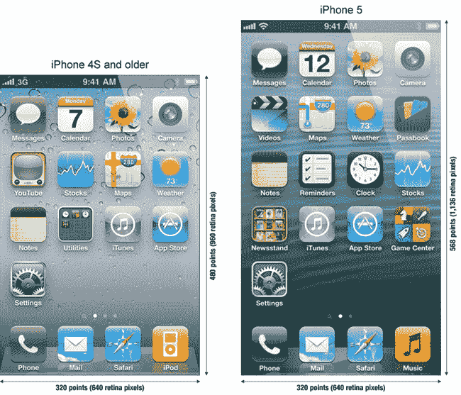

**图 1-3.** 视网膜显示屏的点与像素


### 纸上原型：从设计开始

我强烈建议在编写任何代码之前先完成应用的设计。我总是从铅笔和纸开始，勾勒出用户界面的每一个视图。这种方法应该能为应用中的每个视图生成一个经过深思熟虑的优秀设计布局，并降低未来代码重构的风险。

通常，我会为应用的每个视图绘制多个迭代版本，直到对布局满意为止。然后我会拍下结果，通过电子邮件发送给我的设计师，并附上详细说明，让他们在 Photoshop 中制作最终设计稿。设计师随后会为应用的每个视图创建 640×960 像素的视网膜屏幕就绪 PSD 文件。

在与客户合作时，坚持要求在开始编写他们的应用代码之前，设计方案必须获得批准。客户常常会抗拒这一要求，声称他们的应用是一个进行中的工作，因此设计可能随时更改。这其实只是他们规划不周的表现。

通过在编写代码前花时间勾勒出每个屏幕的设计，你的客户将为你节省大量浪费的开发时间——从而也节省了浪费的预算。如果他们在良好的规划上投入，他们就能省下钱！

令人惊讶的是，有多少潜在的 UI 设计问题可以在纸上解决。这种在编码前勾勒屏幕的过程也被称为*纸上原型*。它使个人和团队能够检查每个屏幕，并讨论一种布局相对于另一种布局的影响。

设计一个直观且吸引人的 UI 是一个本书会经常参考的过程，但如果你希望在这个阶段深入探索，那么还有谁比 UI 设计大师本人——苹果公司——更适合学习呢？

让我向你介绍 HIG——苹果的人机界面指南，你可以在苹果开发者网站上随意阅读，网址是 [`http://developer.apple.com/library/ios/#documentation/UserExperience/Conceptual/MobileHIG/Introduction/Introduction.html`](http://developer.apple.com/library/ios/#documentation/UserExperience/Conceptual/MobileHIG/Introduction/Introduction.html)。

HIG 非常清晰地引导你了解 iOS 应用优秀 UI 设计的各个方面。从按钮的最小点击区域（44×44 点）到每一种手指手势（点击、滑动、轻扫等），以及用户期望你的应用如何做出响应。

人们对应用和操作系统在智能手机上的功能变得非常熟悉。出乎意料的 UI 行为会导致用户不满。让他们满意并享受使用我们的应用并不那么困难。HIG 为你提供了做到这一点所需的一切。

### 应用设计逐一讲解

为了让你们熟悉 iOS SDK 的术语，我会将我们应用中的每个屏幕称为*视图*。我将在第 3 章中进一步深入探讨视图和视图控制器的细节，但在早期阶段认识到我们应用中的每个屏幕都是一个视图是很好的。

在 iOS 中，我们的每个主视图都有一个对应的视图控制器类。

这是我们首次接触到苹果在 iOS SDK 中实现 Model-View-Controller (MVC) 范式。如果你已经开始感到困惑，别担心。我将在第 4 章、第 5 章和第 6 章中进一步详细阐述视图、视图控制器以及 iOS 中的 MVC。

*生日提醒* 将包含以下主视图（每个视图由各自的视图控制器控制）：

> * 主视图（生日列表）
> * 生日详情视图
> * 生日备注视图
> * 添加或编辑生日视图
> * 从通讯录导入视图
> * 从 Facebook 导入视图
> * 设置视图及其子视图

#### 主视图

当我们的应用首次启动时，它将是一个空数据库。没有任何生日可以显示。因此，与其显示一个空的生日列表，我们将隐藏表格视图，并渲染两个大的行动号召按钮，以鼓励用户开始从他们的通讯录和 Facebook 导入生日（参见图 1-4a）。

只要应用中添加了一个或多个生日，我们就会显示填充了生日的表格视图。我们仍然会为用户提供访问通讯录和 Facebook 导入按钮的便捷途径，但它们在屏幕设计中的重要性会降低（参见图 1-4b）。

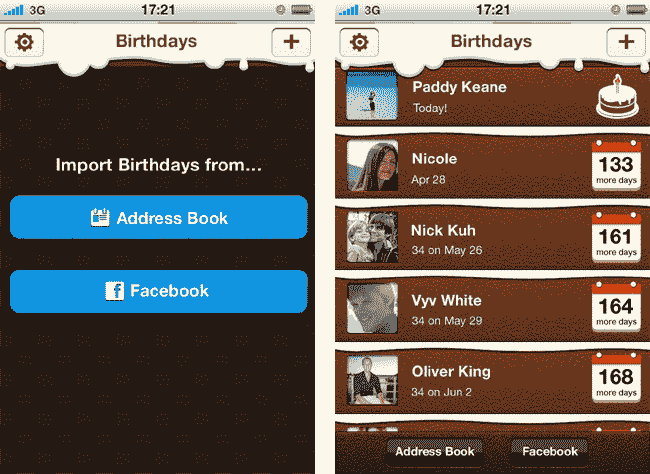

**图 1-4.** (**a**) 首次启动时的主视图 (**b**) 填充了生日的主视图

我们的主视图（图 1-4a 和 1-4b）包含了 iOS SDK 中的标准控件组件：导航栏（`UINavigationBar`）、标签（`UILabel`）、按钮（`UIButton`）、表格视图（`UITableView`）、表格视图单元格（`UITableViewCell`）、图像视图（`UIImageView`）、工具栏（`UIToolbar`）以及栏按钮项（`UIBarButtonItem`）。这些不是定制的组件。然而，你会注意到的是，我们可以在多大程度上重新“换肤”这些标准组件，以打造一个美观的 UI 设计。

在 iOS 5 中，苹果引入了外观 API，并且在 iOS 6 中继续发展。这些 API 使得为苹果的 UI 组件换肤比以往版本的 iOS SDK 容易得多。*生日提醒*将充分利用这些功能。

使用生日蛋糕作为我们图标的设计概念也在应用的主视图中随处可见，例如主视图和导入生日视图，其中每个生日都被表示为一个蛋糕层。这些蛋糕层中的每一个都将由我们应用中定制设计的表格单元格（`UITableViewCell`）来渲染。

在 iPhone 应用中，应用导航通常通过一种特殊类型的视图控制器来控制：一种管理多个子视图控制器的视图控制器。这些父视图控制器的主要例子是导航控制器（`UINavigationController`）和标签栏控制器（`UITabBarController`），它们以适用于小屏幕设备的方式管理子视图和视图控制器的流程。

我们主视图顶部的导航栏由应用的主导航控制器拥有。当填充了生日后，主视图会显示一个包含多个表格单元格的表格视图，以呈现每个生日的详细信息。

当用户点击表格视图中列出的某个生日时，我们的应用将响应点击手势，并创建生日详情视图的一个实例。生日详情视图将被“推入”主导航控制器。导航控制器将动画变换当前的主视图，将其滑向左侧，同时将新的详情视图从右侧滑入。毫无疑问，你在日常使用的许多 iPhone 应用中都见过这种行为。


##### 生日详情视图

当主视图控制器创建生日详情视图控制器和视图时，它还会将数据（生日数据）传递给生日详情视图控制器。生日详情视图控制器将动态更新其视图，以显示用户详细信息以及为此条目保存在数据库中的任何生日备忘。

`生日提醒` 需要聚合三种类型的生日，但它们都将显示在同一个详情视图中：

> - 从 iPhone 通讯录导入的生日
> - 从 Facebook 导入的生日
> - 手动添加到应用的生日

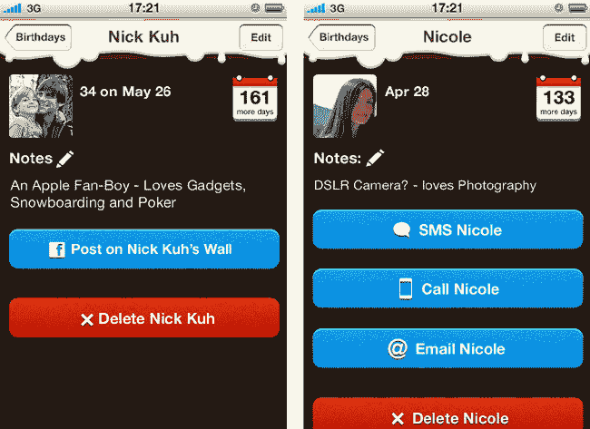

**图 1-5.** (a) 显示 Facebook 导入结果的生日详情视图 (b) 显示通讯录导入结果的生日详情视图

如果显示的生日是从 Facebook 导入的，那么 `生日提醒` 将允许用户在我们的应用内，直接使用 Apple 的社交框架和 Facebook 的 Graph API，在朋友的 Facebook 墙贴上一段生日祝福。

如果此生日是从用户的 iPhone 通讯录导入的，那么我们的应用也能获取与该联系人关联的电话号码和电子邮件。添加直接链接，让用户可以通过短信、电话或电子邮件向朋友发送生日祝福，这是充分利用我们应用已获得的用户通讯录原生访问权限的好方法。

##### 编辑生日与添加备忘：模态呈现

我们应用中的生日数据将保持可编辑状态。因此，当用户查看生日详情视图时，我们将在导航栏中包含一个“编辑”按钮。点击后，我们的应用将展示当前生日详情的一个可编辑版本，用户将能够进行修改（参见图 1-6 a）。

你看到图 1-5 所示屏幕中生日图片下方的备忘图标了吗？当用户点击铅笔图标时，生日详情视图控制器将通过展示我们的备忘视图来响应此操作（参见图 1-6 b）。

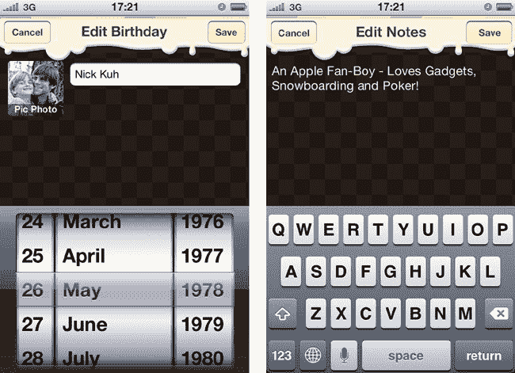

**图 1-6.** (a) 添加/编辑生日详情视图 (b) 编辑生日备忘视图

这两种选择都使用户能够*编辑*他们当前在应用中查看的数据。我们需要向用户非常清晰地表明这一点。我们通过以模态方式呈现这些编辑视图来实现。同样，是父导航控制器负责从 iPhone 屏幕底部以动画方式呈现这些模态视图。用户将看到“取消”和“保存”选项：两个非常清晰的选择，供他们操作数据模型。

我们将使用 Apple 的 Core Data 框架来处理应用中所有本地数据的持久化。这带来了许多优势，例如，允许直接在应用中编辑任何生日——无论它是手动添加的，还是从用户的通讯录或 Facebook 导入的。

Core Data 是 Apple 的一个框架，用于对象图管理和数据持久化。Core Data 默认使用的后端存储是 SQLite 数据库，但也有一些其他的存储选项可供选择。尽管 Core Data 通常被认为是一个高级主题，但我将向您介绍在应用中添加对象、文本和二进制数据持久化的基础知识；在我们的案例中，简单来说，就是能够在不同的使用会话之间保存和编辑生日（参见第 8 章）。

##### 原生 Facebook 集成

因为 `生日提醒` 会维护自己的生日数据存储，所以我们将允许用户从 Facebook 中挑选他们想要导入应用的朋友（参见图 1-7 b），然后将生日数据、朋友姓名和个人资料图标 URL 本地保存到我们的 Core Data 存储中。

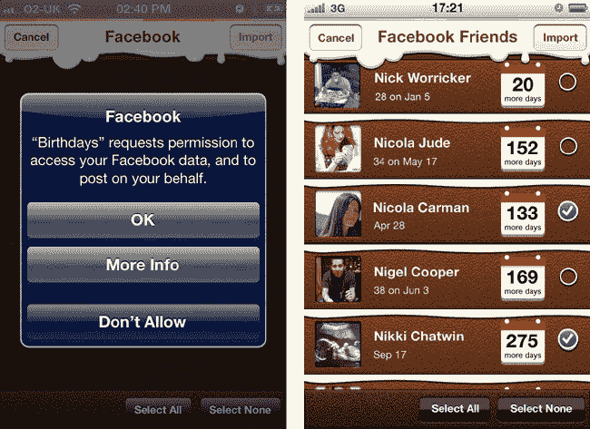

**图 1-7.** (a) 处理 Facebook 授权 (b) 准备从 Facebook 导入生日

在 iOS 6 之前，Facebook 就支持并鼓励 iOS 开发者将社交功能集成到 iOS 应用中。在 iOS 6 中，Apple 已与 Facebook 合作，将 Facebook 的单点登录机制直接集成到 iOS 平台中。

在 iOS 6 中，Apple 加强了数据隐私保护，以确保用户在分享来自 Facebook 或通讯录的数据时需要主动选择加入。我们将学习如何处理授权流程（参见图 1-7 a）。

从通讯录导入视图的外观将与从 Facebook 导入视图完全相同，并附带多选和全选/全不选快捷键按钮。这些导入视图将以模态方式呈现在我们的应用中。当用户点击按钮从 Facebook 好友列表或通讯录联系人导入时，他们将通过向存储中添加新生日来直接修改数据模型。以模态方式呈现这些导入视图，并为用户提供取消导入操作的选项，是合理的做法。

##### 设置视图

`生日提醒` 会根据其数据模型中存储的每个生日，在生日当天或之前触发本地的 iOS 通知。通过我们的设置视图，我们将允许用户设置何时想要收到提醒通知（参见图 1-8 a、b 和 c）。

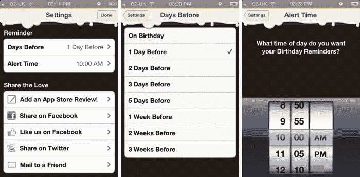

**图 1-8.** (a) 主设置视图 (b) 提前天数设置视图 (c) 提醒时间设置视图

设置视图也是添加推广链接的好地方。鼓励你的用户去撰写一个好评。增加你的 Facebook 点赞数，并让用户能够通过电子邮件、Twitter 或 Facebook 分享你的应用。你已经付出了所有艰辛努力让应用到达用户手中，不要错过这个绝佳的机会来提高你的应用在 App Store 中的流行度排名，并充分利用社交网络上的营销！


#### 导出设计图像资源

现在，我们已经对我们的设计 PSD 百分百满意了（好吧，我就假设你很满意！），我们可以开始分解并导出那些将要成为 Xcode 项目一部分的图标和背景图像了。

在本书的剩余部分，当项目各章和阶段需要时，我会为你提供已导出的 PNG 图像资源。

在第 1 章 的源代码设计/代码中，你还会找到七个用于我们应用中主要视图的视网膜设计的 Photoshop PSD 文件。包含这些设计文件为你提供了一个良好的起点，让你了解在为你的项目委托设计师时应该期待什么。

完成本书后，当你开始构建自己的应用时，你将需要自己经历创建资源 PNG 和 JPG 的过程。你无法总能预测切割设计 PSD 的最佳方式。这是一个我在开发过程中，当需要为我正在处理的视图创建资源时常采取的行动。

我们将要创建一个针对视网膜显示优化过的应用。由于视网膜显示器的像素是非视网膜的四倍，我们所有针对视网膜优化的图像在用户的 iPhone 上看起来都会平滑而清晰。

诀窍是为每个图标和背景图像创建两个版本：（1）一个用于非视网膜显示，（2）另一个是非视网膜大小的两倍，并且质量更高，用于视网膜屏幕。

只要你遵循以下命名约定，iOS SDK 将自动识别为视网膜准备的图像：

标准版本：`my-image.png`

视网膜版本：`my-image@2x.png`

在这个例子中，如果 `my-image.png` 的尺寸是 150×100 像素，那么 `my-image@2x.png` 的尺寸就是 300×200 像素，并且会被视网膜设备自动使用，以充分利所有额外的像素。

假设这个示例图像是不可拉伸的，那么在屏幕上渲染此图像的图像视图的尺寸是 150×100 *点*。

在本章的源代码中，你会发现我提供了一些已导出的示例 PNG 资源：`navigation-bar-background.png`（320×60 像素）和 `navigation-bar-background@2x.png`（640×120 像素）。像 iPhone 3G 这样的旧款非视网膜 iOS 设备会显示 `navigation-bar-background.png` 版本的图像。而在较新的视网膜设备上，`navigation-bar-background@2x.png` 会被 iOS 自动使用，从而得到一个更清晰、像素化更少的图像版本，但仍然显示在 320×60 点的矩形内。

我们的*生日提醒*应用的 PSD 文件都是按照视网膜屏幕的尺寸——640×960 像素来设计的。因此，在导出每个资源时，我首先使用 `[filename]@2x.[fileformat]` 的命名约定导出了所有的视网膜资源。然后，我将每个导出的图像压平并缩小到其视网膜尺寸的一半，并为旧款非视网膜屏幕导出了不带 `@2x` 的较小版本。

*提示：确保你的视网膜资源的像素宽度和高度都是偶数，这样当你将它们缩小一半时，得到的尺寸仍然是整数像素宽度和高度。*

### 一点额外帮助

在本书中，我会在旅程的每一个阶段引导并帮助你。然而，在课程结束后，当你开始自己的应用开发之旅时，你可能会偶尔遇到障碍。我们都会遇到。

也许你无法弄清楚如何让某个框架工作，或者你在为向 App Store 提交应用而进行配置时遇到困难。无论问题是什么，你都不太可能是第一个遇到它的人。求助就在眼前！

Apple 自己的文档非常详尽——你可以通过 iOS 开发者中心在线浏览文档。或者，Xcode 允许你通过 `^?` 键盘快捷键直接跳转到你所遇到问题的具体类、框架或方法。

当你在 iOS 代码中遇到特定的错误时，有一些非常方便的参考网站和博客可以去查阅。Stack Overflow (`stackoverflow.com`) 是我目前最喜欢的。这是一个面向所有编程语言的极客问答网站。其他极客会对发布的每个技术问题的最佳答案进行投票。如果你遇到问题，可以打赌 Stack Overflow 上已经有人提供了答案。

此外，iOS 开发者中心上的 Apple 开发者论坛是另一个很好的资源，开发者可以在这里发布和搜索特定于 iOS 问题的答案。有些问题甚至是由 Apple 自己的工程师回答的——直接来自源头的答案！

### 总结

我们现在知道我们要构建什么了。我们已经规划好了应用的所有屏幕。

我们了解到，开始制作应用的最佳方式是先用铅笔和画板勾勒出你的视图；在纸上确定最佳的用户体验和用户界面设计；并在编写代码之前解决设计挑战。这是构建应用并将未来的重构工作降至最低的最稳健的方法。

但我们还没有接触 Xcode 或编写任何代码。不幸的是，在我们可以开始编码之前，我们仍然有几个核心任务要完成。

让我们继续，注册成为 Apple 开发者并为我们的应用进行设备测试的配置吧！


## 第 2 章

## 为开发配置我们的应用

对某些人来说，这将是进展缓慢的一章。它涵盖了我们真正开始开发应用之前需要完成的所有任务。这些任务有点枯燥，但在它们完成之前，你无法取得太大进展。

成为 iOS 开发者计划中全额付费并注册会员的过程有点像一场艰苦的战斗，但一旦你通过了，你就能构建并向 App Store 提交尽可能多的应用，只要有时间去做！

一旦你完成了 iOS 开发者计划的注册，你就可以回到这一章，我们将详细探索 iOS 配置门户。我们还将逐步完成必要的流程，以便为在你的设备上测试应用准备你自己的配置环境。

### 免费下载 Xcode

要开始开发应用，我们只需要一个 Apple 软件：Xcode（见图 2-1）。


**图 2-1.** Xcode：用于创建 Mac 和 iOS 应用的 Apple 开发者工具

Xcode 由 Apple 通过 Mac App Store 免费分发。首先要做的是在你的 Mac 上打开 App Store，然后直接从商店下载并安装 Xcode。你需要使用一台运行 Lion 或 Mountain Lion 的基于 Intel 的 Mac 来安装 Xcode 4.5（或更高版本）。当 Xcode 在后台下载和安装时，你可以继续阅读。

以下是美国 Mac App Store 中 Xcode 的直接链接：

[`http://itunes.apple.com/us/app/xcode/id448457090?mt=12`](http://itunes.apple.com/us/app/xcode/id448457090?mt=12)

当 Apple 发布 Xcode 4.1 时，最初的下载大小高达 4GB！当时有很多不耐烦的开发者一次连续几小时——甚至几天——占用着他们的互联网连接，等待庞大的 Xcode 下载完成。安装过程也曾更加繁琐：Apple 分发的是一个安装程序，而不是通过商店分发一个应用，下载后，开发者还必须经历一个二级安装过程。该安装程序将文件和文件夹添加到硬盘的 Developer 目录中，以及许多独立的开发者工具，如 Instruments 和 Application Loader。

Xcode 4.5+ 的下载量不到 100MB，并且是作为一个单一应用分发的，在短暂的下载时间完成后会自动安装。像 Instruments 这样的调试工具现在打包在 Xcode 应用包内。各种版本的 iOS 模拟器会根据需要（例如，如果你的应用需要支持 iOS 4 或 5，Apple 会提供 iOS 模拟器，使你能够在旧版 iOS 中运行和检查你的应用）在后台下载。


### 注册成为苹果开发者

在将应用安装到 iPhone 上测试并提交至 App Store 之前，需要完成两个注册阶段：

> - 免费注册成为苹果开发者
> - 加入 iOS 开发者计划，费用为 99 美元

通过苹果开发者网站可免费注册：

[`http://developer.apple.com/programs/register/`](http://developer.apple.com/programs/register/)

注册后你可以访问示例代码、文档以及 WWDC（苹果全球开发者大会）教程视频。

要注册成为苹果开发者，你需要使用现有的 Apple ID 或创建一个新的。如果你曾在 iPhone 上从 App Store 下载过应用，那么你当时使用的就是自己的 Apple ID。或者，如果你用过 MobileMe、iCloud 或 Game Center，用的也是你的 Apple ID。

你还在等什么？现在就完成苹果开发者注册步骤，完成后返回即可！这不会花费太长时间。一旦完成，你就能立即访问 iOS 开发中心。图 2-2 展示了免费注册与 99 美元 iOS 开发者计划之间的区别。

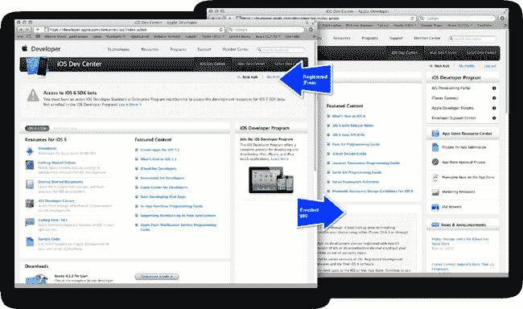

**图 2-2.** iOS 开发中心：左侧截图显示的是免费注册窗口；右侧截图显示的是已注册的开发者窗口。

在图 2-2 中，你会看到 iOS 开发中心右侧列最初显示的是 iOS 开发者计划的促销广告。一旦你完成开发者计划的注册申请，该列就会填满准备发布应用所需的所有额外资源（图 2-2 右侧截图显示的是已登录的付费会员）。

*注意：完成本书的课程并非 100% 必须成为 iOS 开发者计划的付费会员。你可以在 Mac 的 iOS 模拟器中测试代码。*

为了在 iPhone 上测试应用（并最终提交应用到 App Store），你需要成为苹果开发者计划的付费会员。接下来进入下一阶段。

### 加入 iOS 开发者计划

如果你打算开发自己的 App Store 或企业应用，需要完成申请流程并加入 iOS 开发者计划。

标准计划费用为每年 99 美元。还有一种更昂贵的版本：iOS 开发者企业计划，年费为 299 美元。选择企业计划的主要优势在于，你可以在公司内部发布应用，而无需通过 App Store。该计划针对大型企业，企业需要经过单独流程证明资格（这超出了本书的讨论范围）。

对我们大多数人来说，标准的 iOS 开发者计划就足够了。成为注册 iOS 开发者后，你可以访问：

> - iOS 配置门户
> - iTunes Connect
> - 苹果开发者论坛
> - 新的 iOS SDK 测试版。在编写本书时，iOS 6 仍处于测试阶段。如图 2-2 所示，在我成为 iOS 开发者计划的付费会员之前，无法访问新的测试版。

为了直接在 iPhone 上调试并分发应用，你需要创建配置文件。这些是 Xcode 在编译时嵌入应用的配置文件。配置文件决定了哪些设备可以安装你的应用。一旦可以访问 iOS 配置门户，我们就能生成并下载这些配置文件。

iTunes Connect（[`https://itunesconnect.apple.com`](https://itunesconnect.apple.com)）是用于管理 App Store 应用的内容管理系统。向 App Store 提交新应用和应用更新均由 iTunes Connect 处理。此外，开发者登录 iTunes Connect 可管理：

> - 银行与税务信息/合同
> - 销售趋势与报告

苹果开发者论坛为 iOS 和 Mac 软件编程问题提供了极好的在线资源。

在获得这些 iOS 开发者工具和资源的访问权限之前，你需要等待苹果批准你的 iOS 开发者计划申请（见图 2-3）。

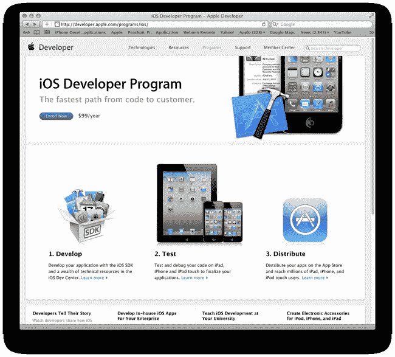

**图 2-3.** 加入 iOS 开发者计划

首先，通过苹果开发者网站完成注册流程：

[`http://developer.apple.com/programs/ios/`](http://developer.apple.com/programs/ios/)

这不会花费太长时间。不过之后，你可能要等待长达两周时间，直到苹果受理你的计划申请。需要走不少繁琐的程序。不过别担心。在此期间，你可以跳到第 3 章。一旦申请通过，再翻回本章，我会带你完成配置应用以在设备上测试的这个有些令人困惑的过程。

### iOS 配置门户

欢迎来到 iOS 配置门户（见图 2-4）。现在我们将一步步完成生成配置文件所需的所有流程。

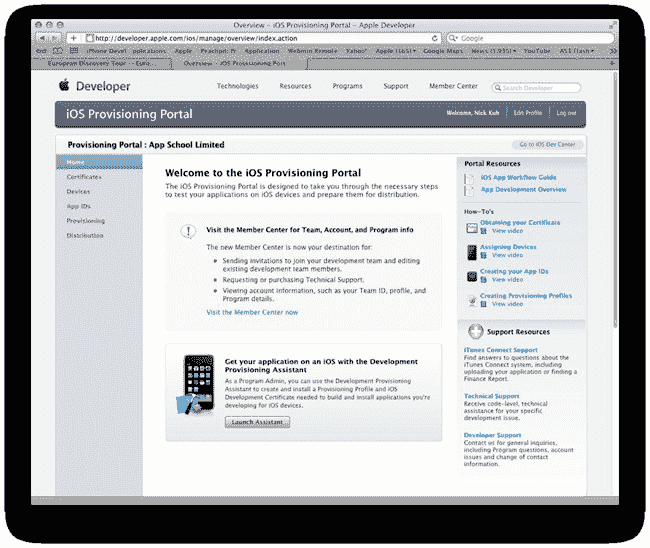

**图 2-4.** iOS 配置门户

请查看图 2-4 的左侧列。菜单按我们即将操作的顺序列出了以下配置阶段：

> - *证书*：你需要为当前应用及未来所有应用创建一个开发者证书和一个分发签名证书。
> - *设备*：在此处添加你希望测试应用的所有 iPhone、iPod 和 iPad 的唯一设备标识符（UDID）。
> - *应用 ID*：在创建配置文件之前，你需要为应用创建一个唯一标识符。Xcode 将使用该标识符，将你的编译项目与正确的配置文件关联起来。
> - *配置*：至此，你终于可以生成我前面一直提到的配置文件了。每个配置文件都关联了上述三个阶段创建的证书、设备和应用 ID。


#### 生成证书

首次访问预置门户的“证书”部分时，你会发现默认情况下没有任何签名证书。你需要生成一个证书，以便在 iPhone 或其他 iOS 设备上调试和安装应用。

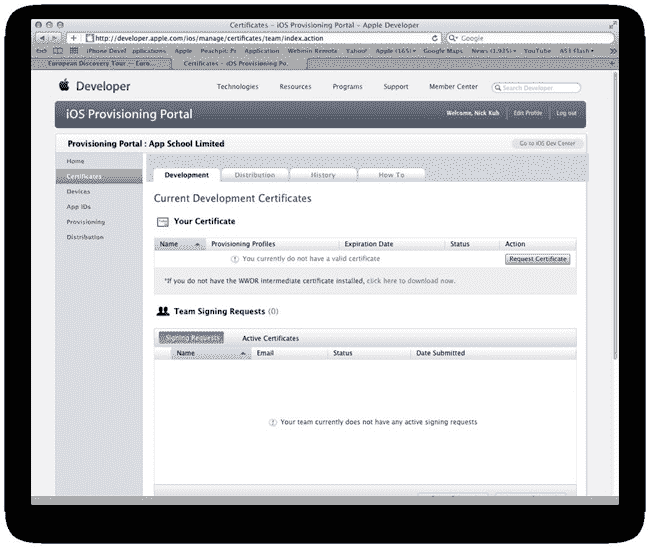

**图 2-5.** 生成证书前的预置门户“证书”部分

要生成证书，首先需要创建一个证书请求文件。该证书请求文件必须通过 Mac 生成。通过“应用程序”>“实用工具”>“钥匙串访问”打开钥匙串访问。在钥匙串访问中，你需要选择“从证书颁发机构请求证书...”菜单选项（参见 图 2-6）。

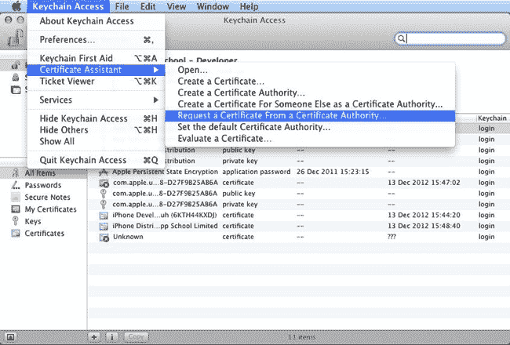

**图 2-6.** 在 OS X 上通过钥匙串访问发起证书请求

钥匙串访问会弹出一个对话框（参见 图 2-7），你需要在其中进行以下操作：

> 1.  输入你的电子邮件地址。
> 2.  输入常用名称。你输入的名称会在完成证书生成过程后显示在钥匙串访问中。当你准备将应用提交到 App Store 时，需要重复此证书生成过程，为你的 App Store 预置创建证书。请选择一个能标识此证书为开发版本的名称。
> 3.  选择“存储到磁盘”选项。
> 4.  点击“继续”并将证书请求保存到桌面。


**图 2-7.** 在钥匙串访问中设置开发证书请求的选项

最终桌面上的证书请求文件名为 `CertificateSigningRequest.certSigningRequest`。这只是一个临时文件，仅用于下一步操作。

切换回浏览器中的 iOS 预置门户。点击“请求证书”按钮（在浏览器窗口中）后，系统会要求你选择通过钥匙串访问生成的证书请求文件（参见 图 2-8）。

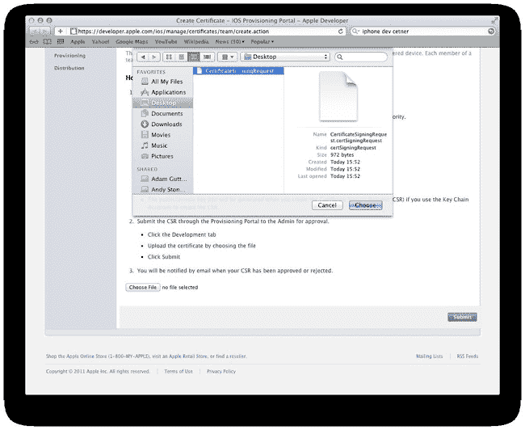

**图 2-8.** 浏览到桌面上的证书请求文件

提交你的证书请求。恭喜！你刚刚生成了第一个开发证书。现在应该可以在预置门户中看到它列出来了（参见 图 2-9）。

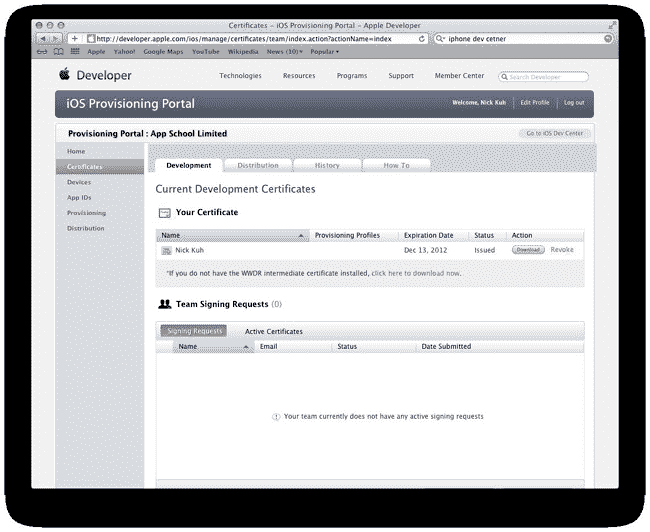

**图 2-9.** 已生成的开发证书

从预置门户下载证书。双击下载的 `developer_identity.cer` 文件。钥匙串访问会提示你添加证书（参见 图 2-10）。

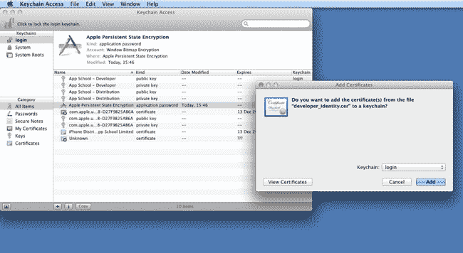

**图 2-10.** 添加并自动安装下载的证书

至此，你已经完成了开发的证书生成过程。Xcode 在编译应用的调试版本以在你已在预置门户中注册的设备上运行时，会使用你的开发签名证书。为了构建可以分享给 Beta 测试者并提交到 App Store 的应用发布版本，你还需要创建一个分发证书。创建过程与创建设开发证书完全相同，不同之处在于你需要先从预置门户“证书”部分选择“分发”标签。趁现在记忆犹新，你可能想立即重复整个证书生成过程来创建分发证书。

在预置门户的“证书”部分，你会看到 Apple 提供了一个下载 WWDR 中间证书的链接。下载并双击此证书，将其安装到 Mac 的钥匙串中。WWDR（Apple Worldwide Developer Relations Certification Authority）证书仅用于确认你的开发或分发配置文件证书是由 Apple 颁发的。

#### 添加设备

每部 iPhone、iPod 和 iPad 都有一个唯一的设备标识符。你需要为每个想在提交到 App Store 之前用于测试应用的设备提供此 UDID。

将你的 iPhone 连接到 Mac，打开 Xcode 并切换到“管理”窗口（“窗口”>“管理”或 `2`）。在“设备”下，你应该能看到你的 iPhone 列出。选择你的手机，详细信息视图会显示你的 iPhone 标识符以及其他信息（参见 图 2-11）。UDID 是一个 40 位的字母数字字符串。

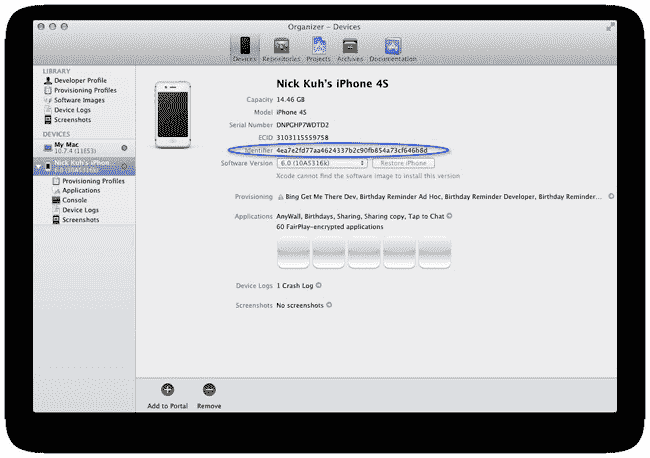

**图 2-11.** 通过 Xcode 的管理器访问你的 iPhone UDID

向预置门户添加设备的过程相当简单。浏览到预置门户的“设备”部分。点击“添加设备”，然后输入你 iPhone 的 UDID。一旦设备保存到预置门户，它就会出现在与你开发者账户关联的设备列表中（参见 图 2-12）。

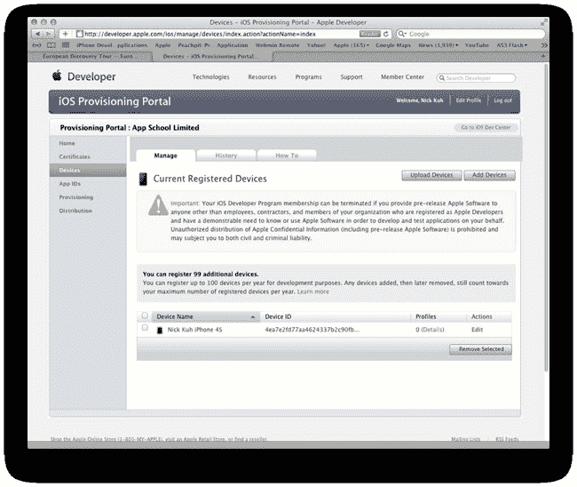

**图 2-12.** 添加了一台设备（我的 iPhone）后的预置门户

*注意：当你的设备通过 USB 连接到 Mac 时，也可以在 iTunes 中访问设备 UDID。不过，在向客户索取 UDID 时，我通常只要求他们下载 App Store 中列出的众多免费 UDID 发送应用之一。可以尝试搜索 **UDID**。*

#### 创建 App ID

对于你开发的每个应用，只需创建一个 App ID。你会为每个应用创建多个预置配置文件，但只有一个 App ID（参见 图 2-13）。

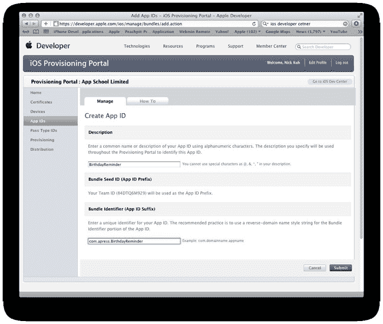

**图 2-13.** 通过预置门户创建 App ID

要创建 App ID，我们需要提供以下两项输入：

> *   *描述*。我输入了 **BirthdayReminder**——你也可以这样做。
> *   *捆绑标识符*。这必须是一个唯一的字符串，App Store 和 iOS 设备将用它来从成千上万个其他应用中识别你的应用。如 图 2-13 所示，通常提供你网站的反向域名路径，例如 `com.domainname.BirthdayReminder`。预置门户不允许你使用示例中所示的 `com.apress.BirthdayReminder`，因为该标识符已被我使用！
> *   在你的捆绑标识符中，更改 `com` 和 `domainname` 占位符，但保留 `BirthdayReminder`（区分大小写）部分。这确保在第 3 章中，Xcode 能够自动检测到我们应用项目的正确预置配置文件，该文件也名为 `BirthdayReminder`（区分大小写）。


### 生成配置文件

在设备上直接运行应用前的最后一步，是生成配置文件。

配置文件是一个连接前述所有三个步骤的文件：

> - 签名证书
> - 设备 UDID
> - App ID/包标识符

选中 `Provisioning` 菜单选项后，你将创建一个可用于调试 *Birthday Reminder* 的配置文件。你需要执行以下步骤（参见图 2-14）：

> 1. 点击 `New Profile` 按钮。
> 2. 将配置文件命名为 `Birthday Reminder Developer`。
> 3. 选择你的开发证书。
> 4. 从下拉菜单中选择 `BirthdayReminder`。
> 5. 选择你在上一步中添加的所有设备。

将来，每当你创建新应用时，都需要为应用的开发创建新的 App ID 和新的配置文件，但无需生成新的签名证书。

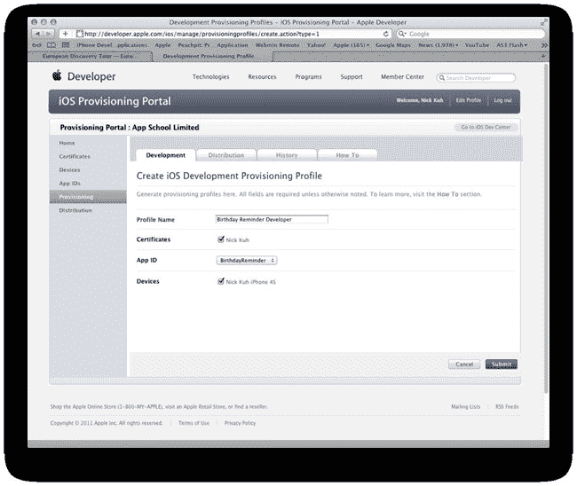

**图 2-14.** 为 *Birthday Reminder* 开发生成配置文件

默认情况下，`iOS Provisioning Portal` 显示的是*开发*配置文件（参见图 2-15）。

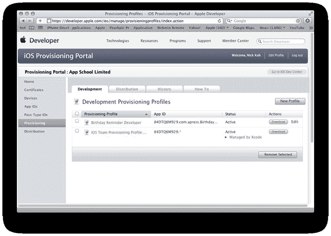

**图 2-15.** 生成的配置文件

如果新配置文件最初显示为 `Pending`，只需刷新页面几次，直到显示为可下载状态即可。

你会注意到，在图 2-15 中的 `Provisioning Portal` 里，我还有一个名为 `iOS Team Provisioning Profile` 的开发者配置文件。这是 Xcode 自动为我创建的通用配置文件。一旦你开始使用 Xcode 的 Organizer，系统会提示你登录 Apple Developer 账户。之后，Xcode 会询问你是否希望它创建一个团队配置文件。我建议你这样做。团队配置文件由 Xcode 管理。每次你将新开发设备连接到 Mac 时，Xcode 的 Organizer 会自动将设备 UDID 添加到你的 `Provisioning Portal` 和团队配置文件中。这意味着你无需为每个应用单独创建开发配置文件，就能直接从 Xcode 在开发设备上快速构建和运行 iOS 测试项目。这是 Xcode 4 中一个非常实用的功能。

生成的配置文件是一个文件，你将其下载到 Mac 上，双击即可自动安装。安装过程会打开 Xcode。切换到 Xcode 的 Organizer 窗口（`Window` > `Organizer` 或 ```2``），然后在左侧栏的 `Library` 下选择 `Provisioning Profiles`，应能显示你新安装的开发配置文件（参见图 2-16）。

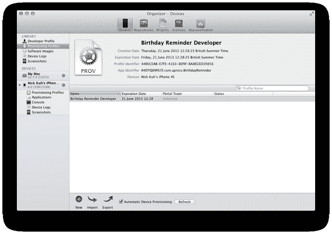

**图 2-16.** Xcode 的 Organizer 窗口中已安装的 *Birthday Reminder* 配置文件

现在你已经创建了开发配置文件，在下一章中就可以在 iPhone 上运行 *Birthday Reminder* 了。该配置文件只允许 *Birthday Reminder* 在你已添加并通过 `iOS Provisioning Portal` 关联到配置文件的设备上运行。

如果你购买了另一台 iPhone，需要注意的是，这个生成的配置文件不允许 *Birthday Reminder* 在新设备上运行。同样，除非你已将朋友的 UDID 添加到 `iOS Provisioning Portal` 中，否则 *Birthday Reminder* 也无法在他朋友的 iPhone 上运行。

向已安装的配置文件中添加新设备，你需要：

> 1. 通过 `iOS Provisioning Portal` 编辑和修改配置文件。
> 2. 将更新后的配置文件下载到 Mac 上。
> 3. *在*双击安装之前，先在 Xcode 的 Organizer 中删除过时的配置文件。
> 4. 双击新下载的配置文件以自动安装。

至此，如果你正在创建一个计划通过 App Store 分发或给 Beta 测试者测试的应用，那么为你的应用再重复生成两个额外的配置文件，将为你将来节省时间：

> - Ad Hoc 配置文件
> - App Store 配置文件（应用提交流程参见第 14 章）

### Ad Hoc 分发

Ad Hoc 分发的目的是在开发过程中构建应用的内部发布版本。例如，如果你将应用分发给 Beta 测试者，那么你可以根据 Ad Hoc 配置文件来生成这些 Beta 版本。

你仍然需要添加所有希望参与 Beta 测试的设备的 UDID。在 `iOS Provisioning Portal` 中，你最多拥有 100 个设备名额。

### 总结

如果你已经跟上了本章中配置的复杂流程，那么请为自己鼓掌！这个过程在刚起步时确实有些麻烦。

但我向你保证，这是值得的。现在我们已经准备好开始使用 Xcode 了。那么，让我们从设置项目开始吧。


## 第 3 章

## 设置我们的 Xcode 项目

欢迎使用 Xcode！是时候动手实践了。

到目前为止，我们还没有犯过任何会搞砸应用的错误。让我们努力保持这个状态吧！

在本章中，你将熟悉如何与 Xcode 协作。你将直接上手，为你的 *Birthday Reminder* 应用创建一个新的 iOS 项目。我会教你如何嵌入和指定图标，以及为应用设置启动画面。到了上午结束时，我们将探讨如何将你的项目部署和调试为一个可在 iPhone 或 iPod Touch 上运行的应用。


### 开始上手

首次启动 `Xcode` 时，您会看到一个“欢迎使用 Xcode”窗口，其中提供了一些初始选项（参见图 3-1）。

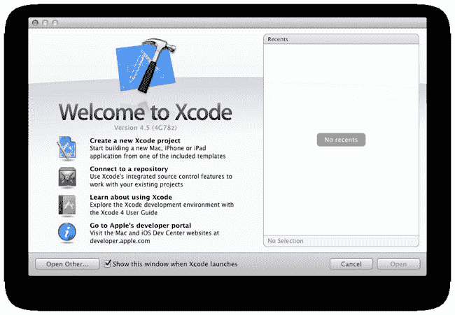

**图 3-1.** “欢迎使用 Xcode”窗口

您随时可以通过 `Window > Welcome to Xcode` 或按 `` 1 快捷键重新打开 Xcode 的欢迎窗口。欢迎窗口中提供的选项包括：

- **创建新 Xcode 项目**：这将是我们入门的起点。
- **连接到仓库**：Xcode 内置了对 Git 和 Subversion 的版本控制兼容性。如果您像我一样，希望您的编码 IDE（集成开发环境）专注于本职工作（编码），那么也没问题。我本人不使用 Xcode 的这一功能，而是更喜欢通过命令行运行 Git。如果您想在 Xcode 中直接使用 Git 或 Subversion，也可以——尽管深入探讨此内容超出了本书的范围。
- **了解 Xcode**：此选项会打开 Organizer 窗口的文档部分。值得先浏览一下“关于 Xcode”的文档。第一个屏幕包含一张图表，高亮显示了 Xcode 工作区的各个区域和面板，这些内容将在本书中反复用到（参见图 3-2）。
- **前往 Apple 开发者门户**：一个跳转到 Apple 开发者网站的快捷链接。

首先选择第三个选项：**了解 Xcode**。您将进入 Organizer 内的 Xcode 文档部分。图 3-2 截取自文档的第一页。值得先查看一下 Xcode 用户界面各部分对应的 IDE 面板。我会在本书的后续章节中多次提及它们。

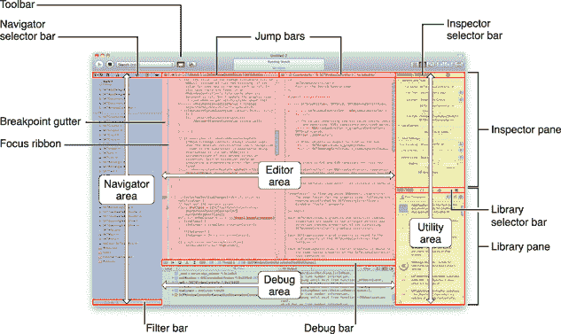

**图 3-2.**：Xcode 文档中的 IDE 分解图

请注意左侧的导航区；在这里，您通常可以通过项目导航器窗格访问项目层级结构中的任何文件。中央的编辑区是您编写类代码文件或使用 Storyboard 文件创建用户界面的地方。IDE 的右侧称为实用工具区；它由检查器和资料库窗格组成。例如，当处理 Storyboard 或定义 Core Data 实体的 UML（统一建模语言）时，您可以在这里使用属性检查器修改所选对象的属性。IDE 底部的窗格是调试区，在应用调试会话期间，日志和错误会输出到控制台。

让我们创建一个新项目！从菜单中选择 `File > New > Project` 或按 `` N 快捷键。Xcode 随即会提供一系列项目模板供您选择作为起点（参见图 3-3）。

对于某些项目，特定模板可以节省您的开发时间。例如，**Master-Detail** 模板会生成一个包含导航控制器和嵌入式根视图控制器的项目——然后您就可以直接开始工作了。

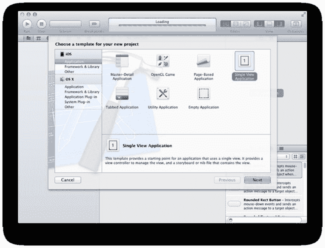

**图 3-3.** 选择起始项目模板

您可以说我吹毛求疵（好吧，尽管说吧！），但我喜欢尽可能多地控制应用中的代码。有些 Xcode 模板——尤其是那些包含 Core Data 模型的——会在您的项目中注入大量初始代码。您可以在项目生成后进行清理。但对于我们的项目，我希望您选择最简单的模板之一：**Single View Application**。

接下来，Xcode 会要求您为我们的新项目填写一些额外选项（参见图 3-4）。

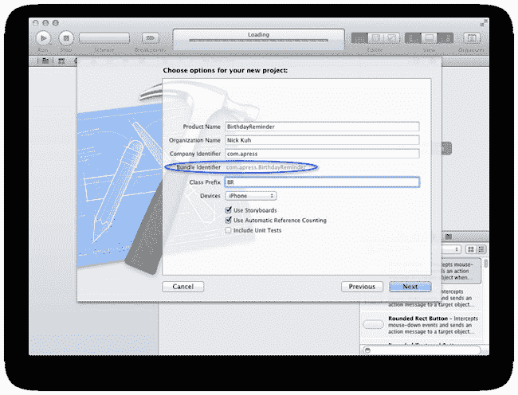

**图 3-4.** 为 *Birthday Reminder* 设置项目选项会动态生成应用的包标识符。

- **Product Name**：输入 `BirthdayReminder`（区分大小写，无空格）。我们需要此项与开发配置文件（在第 2 章中设置）中嵌入的应用包标识符的最后一部分匹配。
- **Organization Name**：Xcode 会使用作者/公司的详细信息预填充任何新类文件，这些信息设置在代码上方的注释中。如果我在此字段中输入“Nick Kuh”，那么我在项目中创建的每个新类都会在其头部注释中包含 Copyright (c) Nick Kuh。对于您的项目，请输入您的姓名或公司名称。
- **Company Identifier**：您需要输入与您在第 2 章中为配置文件使用的相同反向域名路径：`[com/co.uk/etc].[your_domainname]`。
- **Class Prefix**：输入 `BR`，这是 *Birthday Reminder* 的缩写。您会发现，大多数第三方 Objective-C 代码库都会使用两到三个首字母作为其类的前缀。对于我自己的可重用类库，我使用 `NK`（Nick Kuh）。对于您不打算在项目之外重用的项目特定类，请使用合适的前缀。类前缀并非强制要求，但作为良好实践，现在实施是值得的。

您还可以指定应用的目标设备是 iPhone、iPad 还是通用应用：一个带有两个用户界面（一个用于 iPhone，一个用于 iPad）的应用。对于我们的项目，我们仅选择 iPhone。

最后，确保选中 **Storyboarding** 和 **ARC**（自动引用计数）。然后我们就可以开始了。

在接下来的屏幕上，选择硬盘上的一个位置来保存新的 *Birthday Reminder* 项目。取消选中 **Create Local Git Repository** 选项，除非您希望 Xcode 为您初始化一个 Git 源代码仓库。

### 分解项目结构

因为我们选择了 **Single View Application** 项目模板，所以 Xcode 已自动向我们的项目添加了一个包含单个视图的 Storyboard。正如我在第 1 章中提到的，应用中的每个主视图都应始终由一个视图控制器类控制。Xcode 生成了 `BRViewController` 来控制当前项目中的单个视图。

默认情况下，Xcode 左侧的导航面板显示项目导航器。项目导航器列出了我们项目中包含的所有文件、组和框架（参见图 3-5）。

*注意：在项目导航器中选择文件会在 Xcode 的编辑区显示该文件。*

当 iOS 尝试加载我们的 *Birthday Reminder* 应用时，它会期望找到一个名为 `main.m` 的 Objective-C 文件作为入口点。对于此应用或任何其他应用，您都不需要修改 `main.m`，因此请不要进一步触碰此文件！

您会注意到 `main.m` 引用了 `BRAppDelegate` 类。`main.m` 包含一个函数，当 iOS 启动我们的应用时，该函数会生成应用代理类的一个实例。

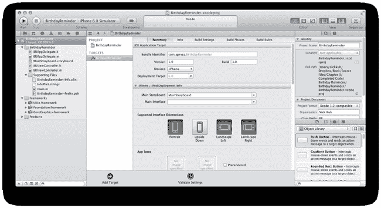

**图 3-5.** 初始生成的项目结构


#### 应用程序委托

应用程序委托（Application Delegate）是一个你可以修改的类。`BRAppDelegate` 继承自 `UIResponder`，并实现了 `UIApplicationDelegate` 协议中的方法。

你会看到 Xcode 已经自动填充了一些主要的 `UIApplicationDelegate` 方法。`UIApplicationDelegate` 协议中的主要方法用于响应关键的应用事件，例如：

> - `application:didFinishLaunchingWithOptions`：在你的应用首次启动时立即执行一次。
> - `applicationDidEnterBackground`：每当用户通过点击 iPhone 主页按钮等方式退出应用时执行。此时应用仍然存活，但处于冻结的非活跃状态。在此之后，其他应用代码将不会执行。当委托方法被调用时，我们可以在这里执行代码，但主要用于数据保存或释放内存。
> - `applicationDidBecomeActive`：当用户通过主屏幕或多任务栏重新启动应用时，应用变为活跃状态。

*注意：要了解某个方法（或类）的更多信息，请高亮该方法并使用 `^?` 快捷键，以显示所选内容的快速帮助（参见 图 3-6）。*

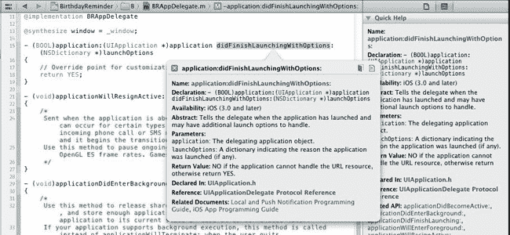

**图 3-6.** 快速帮助。点击链接可访问完整文档。

#### Info.plist

选择并查看 `BirthdayReminder-Info.plist`。你会在 Supporting Files 组中找到这个重要文件。这是 Xcode 打包到我们应用中的配置文件。`Info.plist` 文件中的设置决定了 iOS 如何实例化我们的应用。

因为在选择项目设置选项时我们选择了使用故事板（Use Storyboard），项目模板已经创建了一个故事板，并设置了主故事板文件基名（Main Storyboard File Base Name）配置属性（参见 图 3-7）。

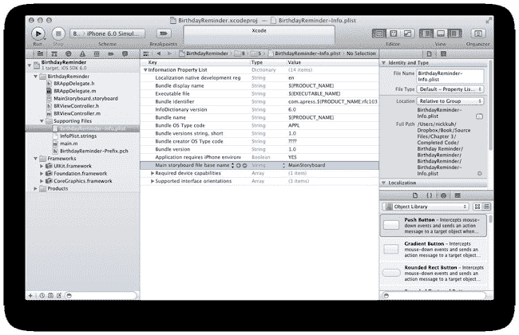

**图 3-7.** 由 Xcode 项目模板自动生成并在 `Info.plist` 中定义的主故事板

你可以在 `Info.plist` 中分配许多配置设置，包括嵌入的字体列表；状态栏的显示或隐藏；以及 URL 类型（iOS 关联并链接到你的应用的其他应用的本地 URL 方案）。

#### 前缀头文件

Xcode 还在我们的项目中添加了一个 `BirthdayReminder-Prefix.pch` 文件。这是一个全局文件头，Xcode 编译器会将其预编译到项目中每一个 Objective-C 源类中。你可以在前缀头文件中定义全局函数或导入常见类的声明，以避免在各个类中重复导入声明。

#### 故事板

故事板是 iOS 开发者工作流程中的一个关键工具。Apple 在 iOS 5 中为 Xcode 添加了故事板，并在 iOS 6 中对其进行了改进。根据 Apple 文档的定义，“故事板是 iOS 应用程序用户界面的可视化表示，显示了内容屏幕以及这些屏幕之间的连接。”

我们的 *Birthday Reminder* 项目将包含一个单一的故事板，该故事板定义了应用中的每一个屏幕，以及这些屏幕之间的连接和转场。使用 Xcode 的编辑器，我们将在故事板的每个屏幕中布置按钮、标签和其他子视图，并创建屏幕之间的连接。

Xcode 中的故事板使得构建 iOS 应用的速度比 iOS 5 之前快得多。在第 5 章和第 6 章中，我们将为应用中的每个视图构建故事板。

按照代码学习的传统，我认为是时候写一个 Hello World 示例了。

### Hello World

让我们来看看 Xcode 自动生成的故事板。从项目导航器（Project Navigator）的文件中选择 `MainStoryboard.storyboard`。编辑器区域将显示两个子面板：文档大纲面板（Document Outline panel）和故事板面板（Storyboard panel）。如果文档大纲面板被隐藏，你可以按照我在图 3-8 中所示的方法将其打开。

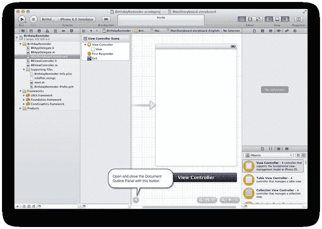

**图 3-8.** 查看故事板文件时，你可以隐藏/显示文档大纲面板。

我们的主视图（也是唯一视图）应该会显示在故事板上。点击并选择该视图。文档大纲面板应会更新以高亮当前选择。注意到视图下方那个深色条了吗？这代表分配给该视图的视图控制器。点击并选择这个深色条。文档大纲的选择应该会更新，表明你已经选中了视图控制器。

保持视图控制器被选中的状态，将顶部的实用工具面板（Utilities pane）切换到第三个标签页，这会显示身份检查器（identity inspector）（参见 图 3-9）。

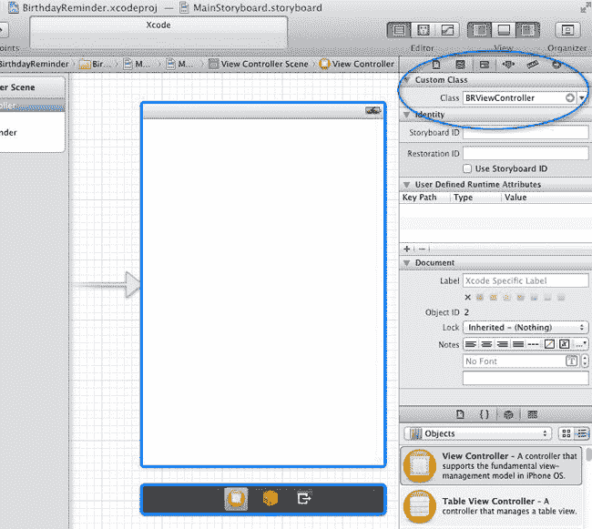

**图 3-9.** 通过身份检查器查看所属的视图控制器类

身份检查器会显示当前在故事板中选择的自定义类：`BRViewController`。在第 5 章中，我们将学习如何使用身份检查器为视图控制器和视图分配自定义类。

如果还未选择，则将底部的实用工具面板切换到第三个标签页，即对象库（Object Library），如图 3-9 所示。

*提示：根据你的偏好设置 Xcode 的面板布局。你会在工具栏右侧找到三个切换按钮，用于隐藏/显示导航器（Navigator）、调试（Debug）和实用工具（Utilities）区域。*

在故事板中选中视图（而非视图控制器）后，向下滚动对象库。你会看到 iOS SDK 中列出的所有用户界面组件。找到标签（label）对象。从库中拖出一个标签实例，并将其放置在主视图的中央。双击标签，将文本改为 **Hello World**（参见 图 3-10）。

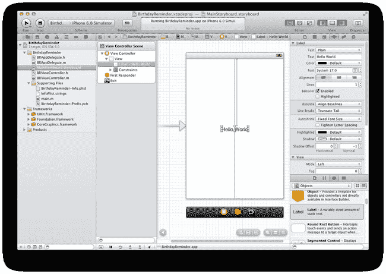

**图 3-10.** Hello World

注意在图 3-10 中，我已将右上角的实用工具面板切换到了属性检查器（attributes inspector），它会显示文本、字体名称和大小、文本颜色、对齐方式等属性。

现在你已将标签添加到视图中，就成功地在主视图中创建了一个子视图。如果再次选择主视图，你便可以修改视图属性，例如背景颜色。

如果你还没发现的话，Xcode 工具栏左侧的构建并运行（Build and Run）按钮会编译我们的项目，并在 iOS 模拟器中启动它（参见 图 3-11）。你可以通过“活动方案”（Active Scheme）下拉栏在 iPhone 和 iPad 模拟器之间切换目标。

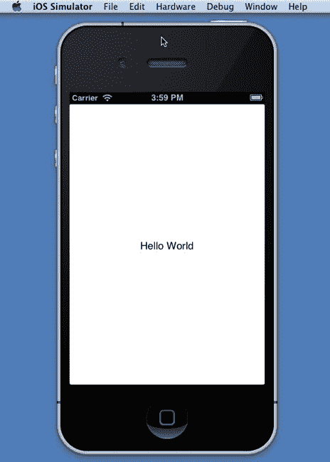

**图 3-11.** 在 iOS 模拟器中运行的应用

你应该能看到你的项目启动，并显示你添加到视图中的 Hello World 标签。

你可以使用 `` 和 `` 键盘快捷键，或通过“硬件 `` 向左旋转”/“硬件 `` 向右旋转”菜单，在模拟器中模拟设备旋转。


### 设置应用方向与自动布局

`Birthday Reminder`不打算为此项目支持多方向，因此我们现在将应用的支持界面方向设置为仅“竖屏”。在项目导航器中选择`BirthdayReminder`项目，然后选择`BirthdayReminder`目标。您将看到一个摘要屏幕，其中包含“支持的界面方向”部分。取消选中“横向左”和“横向右”选项，如图 3-12 所示。这样，我们的应用将不再旋转到横向方向。构建并运行以测试。

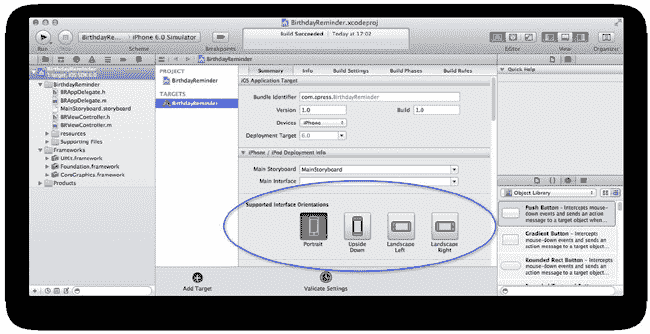

**Figure 3-12.** 配置应用支持的界面方向

我还希望您关闭苹果在 iOS 6 中引入的一项新技术——`Auto Layout`。`Auto Layout`是一个强大的工具包，它将处理应用的所有视图位置和大小变化。对于有经验的 iOS 开发者来说，这也是一个高级主题；由于我们不支持多方向，我向您保证，它带来的麻烦将多于其价值！

在项目导航器中选择您的故事板，然后在实用工具面板中选择文件检查器的第一个标签，取消选中`Use Autolayout`，如图 3-13 所示。

*注意：如果您想了解更多关于`Auto Layout`的信息，我建议查看 Matthijs Hollemans 的教程：[`www.raywenderlich.com/20881/beginning-auto-layout-part-1-of-2`](http://www.raywenderlich.com/20881/beginning-auto-layout-part-1-of-2)。*

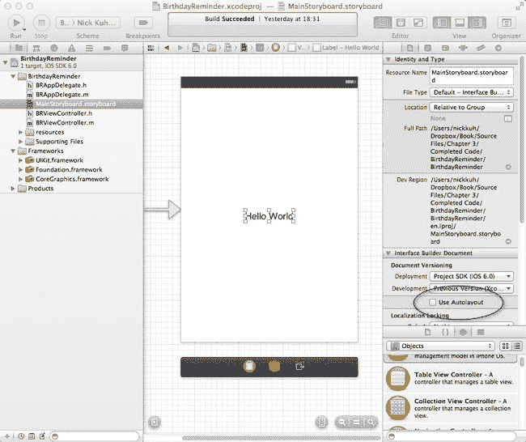

**Figure 3-13.** 为应用关闭`Auto Layout`

### 添加图标和启动屏幕

当我们创建新项目时，Xcode 创建了三个默认的纯黑色启动屏幕图像。我们很快将了解每个默认图像，但现在，我希望您从 Xcode 中删除这些文件。打开“支持文件”组，多选`Default.png`、`Default@2x.png`和`Default-568h@2x.png`。按 Delete 键，然后选择“移到废纸篓”按钮。

Xcode 的项目导航器列出了文件和组的层次结构。组与 Finder 中的文件夹不同。您可以在 Xcode 中创建组和子组，并在组层次结构中拖放类文件。然而，您修改后的结构不会在 Finder 中镜像；也就是说，您可以在 Xcode 中拥有复杂的组和文件层次结构，但在 Finder 中，所有类文件可能都位于根项目级别。

我最初觉得这个组概念相当令人困惑。一种解决方案是先在 Finder 中创建新文件夹，然后将这些文件夹作为组添加到 Xcode 项目中。这有点奇怪，但有效。

现在我们将在项目中添加本章源代码中包含的图标和启动屏幕图像。为此，在 Finder 中打开项目文件夹，创建一个名为`resources`的新文件夹。在`resources`中，创建一个名为`images`的子文件夹。现在将提供的源代码中`assets`文件夹中的所有图像复制到新的`images`目录中（见图 3-14）。

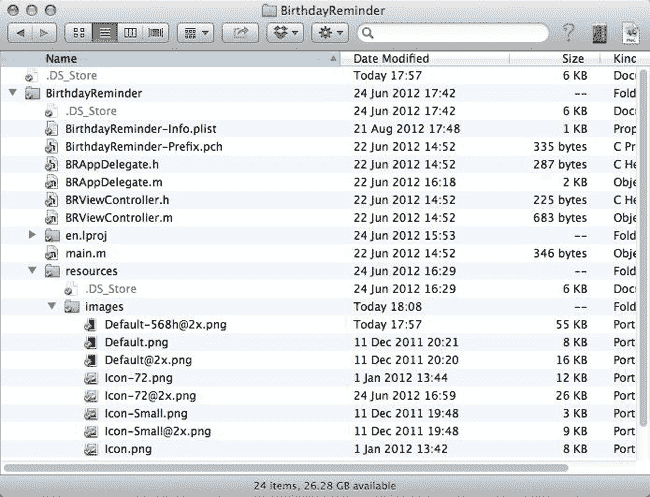

**Figure 3-14.** 通过 Finder 添加项目的所有图像资源

现在切换回 Xcode。注意到这里没有任何变化吗？我们在 Finder 中向`BirthdayReminder`目录添加了目录和文件，但除非我们通过 IDE 将这些文件添加到 Xcode 项目中，否则它们将保持被忽略状态。

在项目导航器中选择主`BirthdayReminder`组。然后使用键盘快捷键A 或文件 > 添加文件到“BirthdayReminder”，导航到我们的`resources`目录。

确保选中“为添加的文件夹创建组”（见图 3-15），然后点击“添加”按钮。

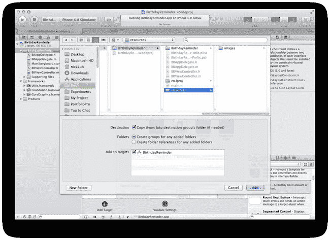

**Figure 3-15.** 将所有图像资源添加到 Xcode 项目

将 Finder 文件夹和文件添加到 Xcode 项目的另一种方法是：将新文件夹从 Finder 直接拖入 Xcode IDE，然后将文件夹直接放入项目导航器。Xcode 将弹出一个对话框。除非您更喜欢在主项目目录之外引用新文件，否则请选中“将项目复制到目标组的文件夹中”复选框和“为添加的文件夹创建组”选项，然后点击“添加”按钮。

运行并调试。您是否注意到应用有任何新变化？如果您眼疾手快，会看到新的启动图像在屏幕上显示了几毫秒，然后才出现“Hello World”视图。点击模拟器上的主页按钮，查看主屏幕上的`Birthday Reminder`图标。如果它仍然是一个白色圆角矩形，则通过按住图标并点击“删除”按钮，从模拟器中移除`Birthday Reminder`。然后再次构建并运行。现在您应该看到白色主屏幕图标已变成`Birthday Reminder`图标（见图 3-16）。神奇吧？

*提示：如果 Xcode 未能显示应用中的预期更改（例如替换图标），请始终尝试产品  清理以清除调试缓存。*

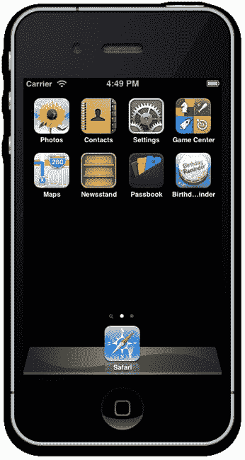

**Figure 3-16.** 在 iOS 模拟器中显示的`Birthday Reminder`图标


图标和启动画面能够被自动检测的原因，在于你为项目中某些图像设置的文件名。iOS 会自动为你的应用绘制视网膜和非视网膜图标与启动图像，并根据设备自动选用尺寸最合适的版本。

虽然还有其他方法可以为视网膜和非视网膜的 iPhone 及 iPad 指定图标，但这是最简单的方式。创建符合以下尺寸和命名规则的图标及启动画面，你会发现它们适用于任何 iOS 项目：

> *   `Default.png` 和 `Default@2x.png`：这是你的启动图像。如果你的应用是全屏应用，那么 `Default.png` 的尺寸应为 320×480 像素，`Default@2x.png` 应为 640×960 像素。*Birthday Reminder* 允许显示 iOS 状态栏，因此我们需要从启动图像的高度中扣除 20 点。因此，`Default.png` 应为 320×460 像素，`Default@2x.png` 应为 640×920 像素。
> *   `Default-568h@2x.png`：这是针对 iPhone 5 屏幕的启动图像。尺寸应为 640×1136 像素，因为所有 iPhone 5 都支持视网膜显示屏。如果你不包含此文件，iOS 会认为你的应用不支持更高的原生 iPhone 5 屏幕，并会以信箱模式（屏幕顶部和底部显示黑条）显示你的应用。
> *   `Icon.png` 和 `Icon@2x.png`：这是显示在 iPhone 主屏幕上的应用图标 PNG。`Icon.png` 应为 57×57 像素，`Icon@2x.png` 应为 114×114 像素。
> *   `Icon-72.png` 和 `Icon-72@2x.png`：这是为安装你 iPhone 应用的 iPad 用户显示的图标（即使目标设备仅为 iPhone）。如果你不包含此版本的图标，则将使用默认的 57×57 iPhone 图标；在 iPad 上调整大小时，它会显得像素化且丑陋。`Icon-72.png` 应为 72×72 像素，显示在非视网膜 iPad 上；`Icon-72@2x.png` 应为 114×114 像素，显示在视网膜 iPad 上。
> *   `Icon-Small.png` 和 `Icon-Small@2x.png`：这是在 iOS 设置、通知屏幕以及聚焦搜索中显示的图标。同样，如果你不提供此图标，iOS 将使用你主要的 57×57 图标并将其调整为 29×29 点。

在 Photoshop 或预览中仔细查看我们的图标图形。圆角和光泽效果是由 iOS 动态添加的。我们的图标设计延伸到了每个角落和边缘。

*Birthday Reminder* 图标在没有 iOS 光泽效果时看起来更好。没问题——我们可以通过项目的 `Info.plist` 配置文件轻松解决此问题（见图 3-17）。

虽然默认未列出，但有一个名为“图标已包含光泽效果”的设置，我们可以将其作为新行添加到 `.plist` 文件中。在项目导航器中选中 `BirthdayReminder-Info.plist`，按住 Control 键单击编辑器区域，然后从上下文菜单中选择“添加行”。一个新行会添加到 `.plist` 中，你就能找到图标光泽设置。你还需要将该值更改为“是”。保存更改，然后构建并运行。你的图标应该会失去光泽效果，在模拟器主屏幕上看起来更干净。

*提示：图标更改有时需要多次构建和运行或清理产品才能生效。*

我们还需要对应用图标做一项外观调整。默认情况下，`Info.plist` 会将项目名称指定为 iPhone 主屏幕上图标下方显示的标题。`BirthdayReminder` 超过了 12 个字符的显示标题限制，因此 iOS 会对其进行截断。通过将 `Info.plist` 中的“Bundle 显示名称”属性更改为 `Birthdays`，可以轻松修复此问题（见图 3-17）。构建并运行。不再截断了——太好了！

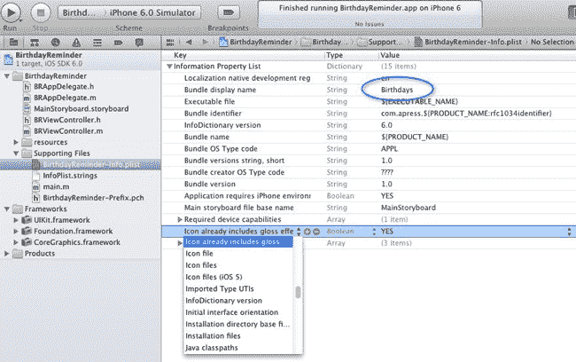

**图 3-17.** 更改 Bundle 显示名称并移除图标光泽

### 在你的 iPhone 上运行应用

要使你的项目能够在 iPhone 上运行和调试，你需要按照第 2 章中的步骤成功创建一个开发预置描述文件。

你为预置描述文件设置的应用 Bundle ID 需要与 Xcode 项目中列出的 Bundle 标识符匹配。

在我的项目中，Bundle 标识符是 `com.apress.BirthdayReminder`。对于你的预置描述文件和项目，这应为 `[com/co.uk/etc].[domainname].BirthdayReminder`。

*提示：如有需要，你可以修改目标摘要面板或项目 `Info.plist` 文件中的 Bundle 标识符。*

通过 USB 数据线将 iPhone 连接到 Mac。

几秒钟后，Xcode 应能识别该设备，并将你的 iPhone 添加为“活动方案”下拉菜单（位于“运行”按钮左侧，顶部）中的一个可选目标。

将目标设置从模拟器切换到你的 iPhone，然后你就可以直接在设备上运行你的项目了。试试看！

如果失败，可能是由于以下一个或多个原因：

> *   你的签名证书有问题。
> *   你的预置描述文件有问题，例如嵌入的应用 Bundle ID 与项目 Bundle ID 不匹配；你的证书未添加到预置描述文件中；或者你的 iPhone UDID 未添加到预置描述文件中。
> *   你的项目应命名为 `BirthdayReminder`（区分大小写）。如果你选择了不同的名称，可能需要重新开始本章。不幸的是，在 Xcode 中重命名项目并非易事！

在 Xcode 的项目导航器中选择你的 `BirthdayReminder` 项目。然后选择 `BirthdayReminder` 目标。接着，依次选择“构建设置”  “全部”  “代码签名”  “调试”  “iPhone 开发者”。如果一切设置正确，你会发现 Xcode 已经识别并将项目的调试构建与你开发的预置描述文件关联起来（见图 3-18）。此连接使你能够成功地在 iPhone 上运行你的 *Birthday Reminder* 版本。

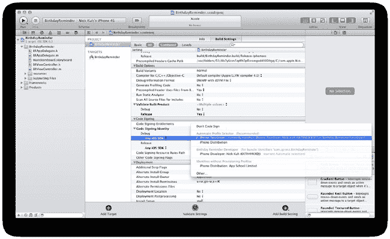

**图 3-18.** 将活动方案的目标更改为你的 iPhone，并检查项目与预置描述文件之间的连接

### 总结

现在你应该熟悉 Xcode 中 iOS 项目的结构了。

> *   你已经使用 Xcode 的单视图应用项目模板生成了 `BirthdayReminder` 项目。
> *   你已经修改了 `Info.plist`（应用的配置设置），并在 iOS 模拟器中查看了结果。
> *   我们初步了解了故事板和对象库。现在我们知道如何通过拖放将 iOS SDK UI 组件视图添加到故事板。
> *   我们学会了如何将外部资源文件夹添加到 Xcode 项目。同样的过程也适用于添加其他文件类型，如第三方代码库。
> *   我们学会了如何为应用添加多个优化的图标和启动图像。
> *   你（希望如此）已经成功在 iPhone 上运行和调试了你的应用。

我们还未开始做的一件事是编写代码。好吧，我想我们已经推迟得够久了。让我们开始认真学习 Objective-C 吧！


## 第 4 章

## Objective-C 和 Xcode：开发一个二十一点游戏

在本章中，你将学习 Objective-C！按照本书的实践性特点，你将边做边学，构建一个实现 MVC（模型-视图-控制器）范式的面向对象二十一点游戏。

这里的目标是熟悉 Objective-C 的结构和语法：如何创建类；方法语法；指针和基本类型——以及更多内容。


### 游戏规则

我们将构建一个简化版的二十一点游戏，因此有以下几点说明：

> * 玩家在游戏中只有两个选项：停牌或拿牌。
> * 不涉及下注（抱歉！）。
> * 我们将实现每位玩家最多持有五张牌的上限。

#### 游戏玩法

对于不熟悉该游戏的读者，二十一点是一种玩家与庄家对战的纸牌游戏。

游戏的目标是让手中的牌点数尽可能接近 21 点。

你必须击败庄家才能获胜。游戏结束时，如果你的点数与庄家相同或更少，则你输（这是我们即将构建的版本）。

如果你手中的牌点数超过 21 点，则爆牌——你也输了。

游戏开始时，每位玩家和庄家各发两张牌：即底牌。你可以看到自己的两张底牌。在某些游戏版本中，你只能看到庄家的一张牌，而看不到另一张，这样你就能对庄家手牌的强弱有所了解。这正是我们将要构建的版本。

在二十一点中，每张牌都有相应的点数，具体如下：

> * *A 牌*：可以是 11 点或 1 点，以不爆牌为前提，取更有利于你的分数
> * *人头牌（J、Q、K）*：均为 10 点
> * *其他牌*：按牌面数字计算

所有决策都必须在庄家之前完成。你需要反复决定是“拿牌”——从牌堆中再拿一张牌加入手牌，还是“停牌”——当你对手牌满意时（即你认为点数已接近 21 点且愿意承担风险），轮到庄家行动。庄家打出自己的手牌，只需点数不低于你的牌即可获胜。

游戏还有其他规则，但我想现有内容已足够构建一个出色的演示应用。

准备开始了吗？首先，从第 4 章的源文件中复制一份起始代码项目文件夹，作为你的工作基础。

你会发现我已经为我们的项目嵌入了图片和图标资源。按照第 3 章的做法，我选择了“单视图应用程序”模板作为本项目的起点。

我们的二十一点游戏中只有一个视图和视图控制器，因此请选择主故事板文件，我们开始构建视图。

### 创建视图

在二十一点游戏开发的第一阶段，我们将学习如何在 Xcode 中创建基本的用户界面：包括如何在视图中添加和配置按钮、标签和图片，以及如何建立到这些子视图的连接，以便在运行时通过代码控制它们。

#### 设置视图的背景颜色

打开二十一点项目的故事板文件，并确保文档大纲窗格可见；这在处理用户界面时能更简单、更精确地选择视图。

使用大纲检查器，选择故事板中的主视图，然后通过属性检查器将背景颜色更改为合适的二十一点绿色，如图 4-1 所示。

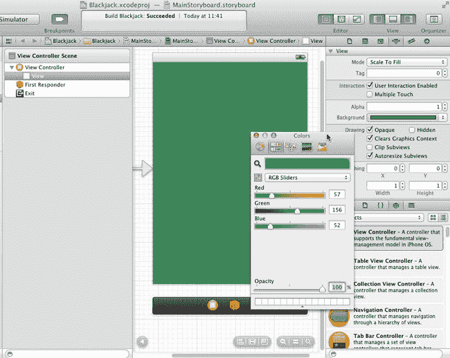

**图 4-1. 设置视图的背景颜色**

#### 添加标签、图片和按钮

接下来，从对象库中拖拽两个标签视图（`UILabel`）到主视图上：一个显示在庄家牌的上方，另一个显示在玩家牌的上方（参见图 4-2）。

再次使用属性检查器，将标签的字体和字号更改为系统粗体/17 磅，并分别输入文本**庄家**和**玩家**。

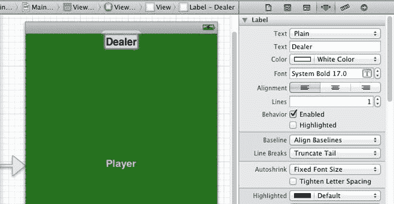

**图 4-2. 添加标签视图（`UILabel`）**

现在，将一个图片视图（`UIImageView`）拖拽到主视图上。使用大小检查器，将图片视图的尺寸设置为 118×176 磅。这些是我已添加到二十一点项目中的牌面与牌背图片资源的固定尺寸（我同时添加了非视网膜版本（118×176 像素）和视网膜版本（236×352 像素））。

在编辑器中保持图片视图被选中状态，切换回属性检查器，选择`card-back.png`图片资源来设置图片视图的图片属性（参见图 4-3）。

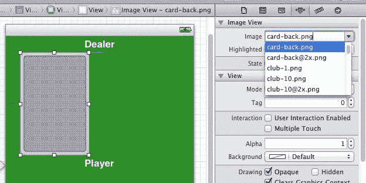

**图 4-3. 添加图片视图（`UIImageView`）并设置其图片属性**

*提示：选择* `card-back.png` *而非* `card-back@2x.png`，*iOS SDK 会自动在视网膜设备上使用* `card-back@2x.png`，*在非视网膜设备（如 iPhone 3GS）上使用* `card-back.png`。

在编辑器中选中牌面图片视图后，创建九个额外的副本：⌘D 或 编辑  复制。将这些牌分层排列成两手牌，每手五张，每手牌从左到右叠放（参见图 4-4）。要调整牌的叠放次序，请使用 编辑  排列  置于顶层。

从对象库中拖拽两个圆角矩形按钮（`UIButton`）到主视图上。

*提示：在对象库中，* `UIButton` *被令人困惑地命名为“Round Rect button”。然而，这* 就是 *iOS 的主要按钮组件，它也可以用于带有图形皮肤图片的自定义按钮。*

按照图 4-4 所示，调整每个按钮的大小、位置并输入标题。

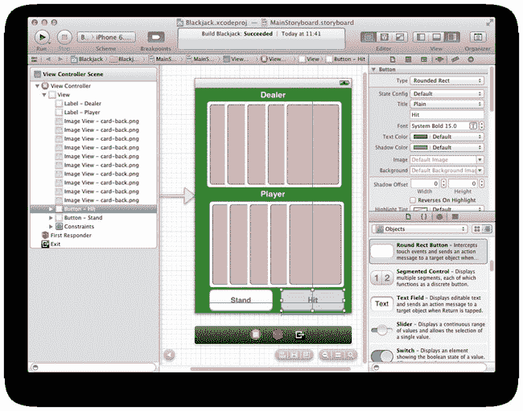

**图 4-4. 最终视图布局**

你现在应该得到了一个类似图 4-4 的最终视图布局。

我们已在故事板的主视图中添加了标签、图片视图和按钮。在 iOS 中，每个视图或屏幕由一个视图控制器类实例控制。我们二十一点主视图的视图控制器是项目中`BJViewController`类的一个实例。目前，我们尚未对视图控制器本身进行任何修改：这个视图控制器对这些新添加的子视图一无所知。


#### 输出口：连接视图

为了澄清这一点，视图和视图控制器不是同一个东西。视图控制器拥有视图。用 MVC 术语来说，视图控制器是控制器，而视图正如你所料，就是视图本身！

视图不应该知晓其所属的视图控制器，而视图控制器则可以根据需要，对其拥有的视图了解或多或少的信息。

在我们的二十一点应用中，需要保留对所有牌和按钮的引用。我们将要隐藏和显示牌，并更改每张牌关联的图片，以模拟发牌过程。保留对 `Hit` 和 `Stand` 按钮的引用，可以让我们开启或关闭用户交互。例如，当轮到庄家时，我们不想让玩家能够点击 `Hit` 或 `Stand` 按钮。

那么，我们如何将视图与其视图控制器连接起来呢？

首先，同时查看故事板和 `BJViewController` 类会很有帮助。Xcode 通过分割编辑器面板实现了这一点。在 Xcode 工具栏的右侧，切换选中的 Editor 选项，选择 Assistant Editor。这将使编辑器布局变为分割面板。如果右侧跳转栏尚未设置为 `Automatic`，请选择此选项。Xcode 现在应该会自动选择定义 `BJViewController` 类公共接口的头文件（参见图 4-5）。

你也可以通过 Editor 按钮旁边的 View 切换按钮，修改 Xcode 的视图布局，并隐藏 Navigator、Inspector 和 Debug 区域。

这样一来，你会得到一个更适合连接视图和视图控制器的工作区布局，如图 4-5 所示。

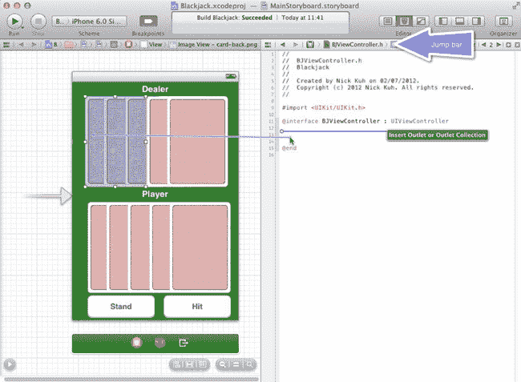

**图 4-5.** 在视图和视图控制器之间 Ctrl+拖动以创建输出口和操作连接

回到正题：我们想在 `BJViewController` 中为视图里的每张牌图片视图以及 `Hit` 和 `Stand` 按钮创建引用。为此，我们将从每个图片视图和按钮 Ctrl+拖动到视图控制器接口，如图 4-5 所示。起初这看起来有点奇怪，但一旦你习惯了这个过程，就会发现它非常酷。释放鼠标时，Xcode 会提供选项，让你在 `BJViewController` 中创建一个输出口。假设你从第一张庄家牌拖出，将输出口命名为 `dealerCard1`（参见图 4-6）。确保 Storage 设置为 `Weak`，然后点击 Connect。

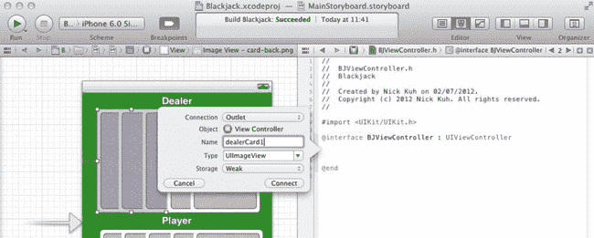

**图 4-6.** 在视图和视图控制器之间 Ctrl+拖动以创建输出口和操作连接

Xcode 会自动在 `BJViewController` 头文件中为我们的新输出口生成以下 Objective-C 代码：

```
@property (weak, nonatomic) IBOutlet UIImageView *dealerCard1;
```

对其余的庄家牌图片视图重复此过程，将输出口命名为 `dealerCard1`、`dealerCard2`，依此类推。然后对玩家牌重复相同操作，同样将它们命名为 `playerCard1`、`playerCard2`，等等。

现在为 `Stand` 和 `Hit` 按钮创建输出口，分别命名为 `standButton` 和 `hitButton`。`BJViewController.h` 接口中生成的代码最终应如下所示：

```
#import <UIKit/UIKit.h>

@interface BJViewController : UIViewController

@property (weak, nonatomic) IBOutlet UIImageView *dealerCard1;
@property (weak, nonatomic) IBOutlet UIImageView *dealerCard2;
@property (weak, nonatomic) IBOutlet UIImageView *dealerCard3;
@property (weak, nonatomic) IBOutlet UIImageView *dealerCard4;
@property (weak, nonatomic) IBOutlet UIImageView *dealerCard5;

@property (weak, nonatomic) IBOutlet UIImageView *playerCard1;
@property (weak, nonatomic) IBOutlet UIImageView *playerCard2;
@property (weak, nonatomic) IBOutlet UIImageView *playerCard3;
@property (weak, nonatomic) IBOutlet UIImageView *playerCard4;
@property (weak, nonatomic) IBOutlet UIImageView *playerCard5;

@property (weak, nonatomic) IBOutlet UIButton *standButton;
@property (weak, nonatomic) IBOutlet UIButton *hitButton;

@end
```

#### 操作：响应控件

我们已经创建了对所有牌图片视图和按钮的引用，现在可以在 `BJViewController` 实现文件的代码中，在运行时访问和控制它们的属性：设置图片视图的图片属性和可见性，以及启用和禁用按钮。

有没有注意到我们还遗漏了什么？我们的视图控制器类将如何捕获按钮点击事件？

我们只在视图控制器和视图之间指定了一个方向的输出口。因此，视图并不知道其所属的视图控制器。我们的视图控制器类需要知道用户何时点击了 `Stand` 或 `Hit` 按钮。

按钮是控件。`UIButton` 不仅继承自 `UIView`，而且像 iOS SDK 中所有其他用户界面控件一样，`UIButton` 直接继承自 `UIControl`。因为 Xcode 将 `UIButton` 的实例识别为 `UIControl` 的子类，所以它会自动为我们提供一个额外的连接类型：`Action`。

用于处理用户交互事件并将其从用户界面控件传递给任何 Objective-C 类类型方法的机制，称为目标-动作。当按钮被点击时，点击事件可以传递给一个方法。我们将在视图控制器中创建两个新方法，它们将响应 `Hit` 或 `Stand` 按钮的 `Touch Up Inside` 事件而被触发。`Touch Up Inside` 事件在用户触摸控件并在其上抬起手指时触发。这相当于计算机上的鼠标弹起事件。

Xcode 可以使用与创建输出口时类似的 Ctrl+拖动过程，自动生成目标-动作代码。从每个按钮 Ctrl+拖动到 `BJViewController.h` 接口，但将连接类型更改为 `Action`，确保 `Touch Up Inside` 是选中的事件类型，然后重复此过程，在你的视图控制器接口头文件中创建以下两个操作方法处理器（参见图 4-7）：

```
- (IBAction)didTapStandButton:(id)sender;
- (IBAction)didTapHitButton:(id)sender;
```

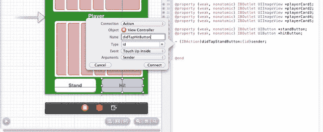

**图 4-7.** 将按钮控件的操作连接到 `BJViewController`

*注意：Xcode 也可以通过 Control+点击视图，然后从上下文菜单中拖出输出口和操作来创建它们。*

我们基本的二十一点游戏的视图部分就完成了。我们已经学习了使用 Xcode 内置的 UI 布局工具添加和排列标签、按钮以及图片视图来创建视图的基础知识。借助故事板，Xcode 使我们能够布局应用中的视图，并在它们之间创建连接。我们将在明天的第 5 章和第 6 章中学习更多关于故事板的知识，但现在，我们将继续学习 Objective-C 类、属性、方法和对象类型的基础知识。

### Objective-C 基础

Xcode 不仅在 `BJViewController.h` 头文件中自动生成了输出口声明，还在 `BJViewController.m` 源文件中添加了代码。

保持 Assistant Editor 布局，在主左侧分割面板中选择 `BJViewController.h`，这样我们就可以同时查看视图控制器的头文件和实现文件（参见图 4-8）。有几种方法可以做到这一点：

> *   使用左侧跳转栏，导航到 `BJViewController.h`。
> *   临时显示导航面板，选择 `BJViewController.h`，然后再次隐藏导航面板。

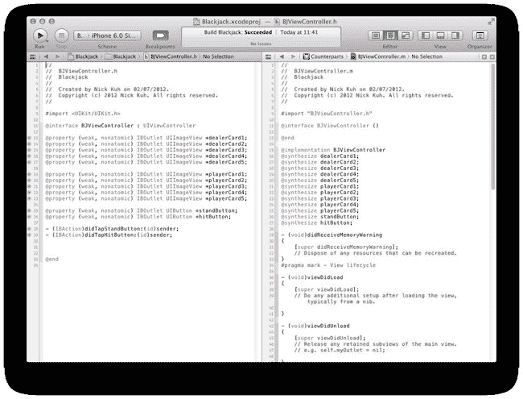

**图 4-8.** Xcode 已为我们的输出口和操作连接自动生成了 Objective-C 代码

那么，头文件和源文件是什么呢？问得好！


### 理解头文件和源文件

Objective-C 类通常由两个文件组成：头文件和源文件。头文件使用扩展名 `.h`，源文件使用扩展名 `.m`。头文件是类的公共接口：即其 API（应用程序编程接口）。源文件则用于定义类属性和方法的实现。

其他类若想引用或创建你的类的实例，需要导入 `YourClass.h` 文件。你会在图 4-8 中看到 `BJViewController.m` 也导入了 `BJViewController.h`。任何 Objective-C 实现文件在呈现类属性和方法的实现之前，都会先导入对应的头文件。

### 属性和实例变量 (iVars)

Objective-C 中的类属性必须在类的接口中声明。默认情况下，属性是可读写的。一个读/写属性包含两个访问方法：一个用于获取属性的值，另一个用于设置属性的值。属性的实际值存储在*实例变量*（iVar）中。

例如，一个类的头文件接口可能如下所示：

```
#import <Foundation/Foundation.h>

@interface Person : NSObject
{
        NSString *personName;
}
@property (strong, nonatomic) NSString *personName;
@end
```

在头文件的示例中，我们声明了一个新的自定义类：`Person`。`Person` 继承自父类 `NSObject`。`Person` 包含一个名为 `personName` 的属性，该属性设置或返回一个 `NSString` 值。示例头文件还声明了一个名为 `personName` 的 iVar。尽管这两个声明的名称相同，但一个是属性名，另一个是 iVar 名。iVar 是 `Person` 类用于存储字符串指针的私有变量。当访问 `personName` 属性时，属性的 getter 方法被调用，并返回对 `personName` iVar 的引用。

现在我们已经声明 `Person` 有一个名为 `personName` 的字符串属性，Xcode 编译器期望我们创建该属性的 getter 和 setter 访问方法。在源文件 `Person.m` 中，实现如下所示：

```
#import "Person.h"
@implementation Person
//personName 属性的 setter
-(void) setPersonName:(NSString *)personNameNew
{
    personName = personNameNew;
}

//personName 属性的 getter
-(NSString *)personName
{
    return personName;
}
@end
```

哇，仅仅为了获取和设置一个字符串就要写这么多代码！幸运的是，Xcode 可以通过在类实现文件中使用 `synthesize` 指令来自动化创建 getter 和 setter 的过程，如下所示：

```
#import "Person.h"

@implementation Person

@synthesize personName;

@end
```

`synthesize` 指令会自动生成 getter/setter 代码，就像第一个更冗长的实现示例一样。Xcode 的编译器也能识别出我们声明的同名 iVar，并将其分配为属性 `personName` 的私有存储变量。

但*并不理想*的是，我们的属性和 iVar 使用了相同的名称：就像我们刚刚看到的示例那样！幸运的是，编译器允许我们在 `synthesize` 指令中直接为属性存储声明一个私有的 iVar。操作方法如下：

`@synthesize personName = _personName;`

我们不必使用下划线，但这是 Cocoa 开发者之间一种常用的约定，用于区分属性和 iVar 的名称。

在 2012 年的 WWDC 上，Apple 宣布了对现代 Objective-C 中属性和 iVar 声明的改进。使用 Xcode 4.5+ 后，*不再需要向类实现中添加 `synthesize` 声明*。编译器现在会自动为你完成这一操作。然而，理解编译器自动生成的代码非常重要。

如果你不进行合成，那么你的实现代码将如下所示：

```
Person.m:
#import "Person.h"
@implementation Person
@end
```

简洁且干净。Xcode 会自动添加以下合成代码：

`@synthesize personName = _personName;`

所以，如果你不进行合成，那么 Xcode 现在会*自动为你创建一个带下划线的 iVar*。

如果你像这样进行合成：

```
Person.m:
#import "Person.h"
@implementation Person
@synthesize personName;
@end
```

那么你的 iVar 将被命名为 `personName` 而不是 `_personName`。因此，考虑到我们本章前面添加的二十一点 outlets 案例，Xcode 自动向 `BJViewController.m` 添加了合成代码：

`@synthesize dealerCard1;`

由此产生的 iVar 被命名为 `dealerCard1` 而不是 `_dealerCard1`。这种 iVar 命名行为差异的主要原因是为了确保与 Apple 2012 年修改 Objective-C 之前的旧代码保持向后兼容性。

### 创建私有类接口：类扩展

在 `BJViewController.m` 中，注意 Xcode 在实现代码之前添加的代码：

```
@interface BJViewController ()

@end
```

这在 Objective-C 中被称为*类扩展*。类扩展使我们能够定义私有属性。因此，在我们的二十一点应用中，我们可以在 `BJViewController.m` 的类扩展中声明属性，这些属性仅能被 `BJViewController.m` 源文件内部访问。其他类只导入 `BJViewController.h` 头文件，因此该接口对外部访问保持隐藏，但在我们的源实现中对此类可用。让我们向 `BJViewController.m` 添加几个私有属性：

```
@interface BJViewController ()

@property (nonatomic,strong) NSArray *dealerCardViews;
@property (nonatomic,strong) NSArray *playerCardViews;

@end
```

你注意到类名后面的括号了吗？这向编译器表明我们正在声明一个类扩展。

我们不需要对这两个新的数组属性进行合成；Xcode 的编译器会为我们自动完成。


### Arrays

注意，声明类扩展的语法与公共接口类似，但不完全相同：

```
@interface BJViewController ()
@property (nonatomic,strong) NSArray *dealerCardViews;
@property (nonatomic,strong) NSArray *playerCardViews;
@end
```

我们正在创建两个数组，一个用于保留对庄家卡视图的引用，另一个用于保留对玩家卡视图的引用。这两个数组将用于索引显示的卡片；也就是说，`dealerCardViews` 数组的第一个元素是对 `dealerCard1` 的引用。

默认情况下，Objective-C 将所有指针合成为 `nil`。那么什么时候是实例化这两个数组的好时机呢？在视图生命周期的哪个时间点，我们才能访问已配置的卡片图像视图输出口？

有人知道吗？有人吗？……Bueller？……Bueller？……Bueller？……

你在 `BJViewController.m` 中发现了 `viewDidLoad` 方法吗？这是视图控制器能够访问其视图的第一个时间点。此时，编译器已经为我们连接好了所有输出口。因此，`viewDidLoad` 是实例化新的 `dealerCardViews` 和 `playerCardViews` 数组的理想位置。以下是需要添加的代码：

```
- (void)viewDidLoad
{
    [super viewDidLoad];
    self.dealerCardViews =
@[self.dealerCard1,self.dealerCard2,self.dealerCard3,self.dealerCard4,self.dealerCard5];
    self.playerCardViews =
@[self.playerCard1,self.playerCard2,self.playerCard3,self.playerCard4,self.playerCard5];
}
```

在 Xcode 4.5 之前，我们会使用更冗长的 `[NSArray arrayWithObjects:]` 语法来定义数组，如下所示：

```
- (void)viewDidLoad
{
    [super viewDidLoad];

    self.dealerCardViews = [NSArray
arrayWithObjects:self.dealerCard1,self.dealerCard2,self.dealerCard3,self.dealerCard4,self.dealerCard5, nil];
    self.playerCardViews = [NSArray
arrayWithObjects:self.playerCard1,self.playerCard2,self.playerCard3,self.playerCard4,self.playerCard5, nil];

}
```

这两种实现方式的效果完全相同，但第一种方式需要的代码更少——在我看来，少即是多！在第一个示例中，我们使用了新的 Objective-C 字面量语法。本书中我们将大量使用字面量，因为它更简洁、更清晰且更易读。

Objective-C 中有两种数组类型：`NSArray` 和 `NSMutableArray`。正如类名所示，一个是可变的，另一个是不可变的。一旦 `NSArray` 被实例化，它就不能被修改，也就是说，你不能向数组中添加或移除元素。对于索引卡视图的目的来说，一个不可变的 `NSArray` 完全适用于这些属性：我们不会移除或添加卡视图，只会显示和隐藏它们。

### Init、初始化器和指定初始化器（构造器）

Objective-C 类结构中与构造函数最接近的是被称为初始化器的方法。这个初始化器是类的一个方法，在类实例化时只调用一次。回到我们的 `Person` 示例，如果我们不对该类做进一步修改，那么我们就可以像这样实例化 `Person` 的新实例：

```
Person *p = [[Person alloc] init];
```

`alloc` 是一个底层类方法，你永远不需要覆盖它。当 `alloc` 被调用时，内存被分配给该类，并且（如我们示例中的情况）会实例化一个 `Person` 实例，然后在该实例上调用 `init`。

目前，我们还没有为 `Person` 创建初始化器。但是 `Person` 继承自 `NSObject`，而 `NSObject` 有一个名为 `init` 的初始化器。所以我们仍然需要调用超类的初始化器。

在源文件 `Person.m` 中，我们可以像这样覆盖 `init`：

```
-(id)init
{
    self = [super init];
    if (self) {
        //设置一些默认属性值？
    }
    return self;
}
```

初始化器方法应该始终返回对自身的引用。我们使用通用对象类型 `id` 来使初始化器能够被子类化。`id` 仅仅意味着返回值将是一个对象。

在不进行子类化的情况下，还有其他创建初始化器的方法；例如，我们可能希望向 `Person` 类的初始化器中传递一个自定义参数：

```
-(id)initWithName:(NSString *)name
{
    self = [super init];
    if (self) {
        self.personName = name;
    }
    return self;
}
```

注意到我们的自定义初始化器是如何在超类 `NSObject` 上调用 `init` 的吗？`init` 也是 `NSObject` 的*指定初始化器*——所有子类在其自身的初始化方法中都必须调用的初始化器。这有点令人困惑，所以我再强调一下：*指定初始化器*是在直接实例化一个类或通过其子类实例化时，必须首先调用的初始化方法。

在我们的示例中，如果我们决定强制 `Person` 的每个实例在实例化时都设置其 `personName` 属性，那么 `initWithName` 就可以是 `Person` 的指定初始化器。

*提示：像 `NSObject` 这样的顶层类有一个名为 `init` 的初始化方法。由于 Cocoa 中几乎所有类都继承自 `NSObject`，通常的做法是让你的类初始化器在其自身的初始化器中调用 `[super init]`。*

有些类有多个初始化器：例如数组：

- `initWithArray:`
- `initWithArray:copyItems:`
- `initWithContentsOfFile:`
- `initWithContentsOfURL:`
- `initWithObjects:`
- `initWithObjects:count:`

因此，由你来选择最合适的初始化器。


### 工厂方法/便捷方法

部分 Objective-C 类包含*工厂方法*或*便捷方法*。这些类方法负责处理 `alloc init` 的实例化流程，并返回新的类实例。以下是数组的工厂方法：

`+ array`
`+ arrayWithArray:`
`+ arrayWithContentsOfFile:`
`+ arrayWithContentsOfURL:`
`+ arrayWithObject:`
`+ arrayWithObjects:`
`+ arrayWithObjects:count:`

我通常使用工厂方法来创建数组和字典（哈希表）。

`NSMutableArray *arr = [NSMutableArray arrayWithObjects:@"one",@"two",@"three", nil];`

`NSMutableArray *arrWithOneObject = [NSMutableArray arrayWithObject:@"one"];`

`NSMutableDictionary *dictionary = [NSMutableDictionary dictionaryWithObjectsAndKeys:@"value1",@"key1","value2",@"key2", nil];`

`NSMutableDictionary *dictionaryWithOneObject = [NSMutableDictionary dictionaryWithObject:@"myValue" forKey:@"myKey"];`

*注意：在这些示例中，我们也可以使用字面量来简化数组和字典的创建。然而，字面量创建的是不可变对象，因此我们还需要额外调用* `mutableCopy` *来生成字典和数组的可变副本。*

让我们回到二十一点游戏。

还记得我之前说过视图和视图控制器并不相同吗？在某些情况下，你的视图可能会被 iOS 丢弃，但视图控制器仍然保留。考虑一个复杂的导航控制器：用户深入导航到应用层级中，导航堆栈中第一个视图控制器所控制的视图已不再可见。如果你的应用内存不足，那么所有视图控制器都可能通过 `UIViewController` 的 `didReceiveMemoryWarning` 方法间歇性收到内存警告。默认情况下，如果视图不再拥有父视图，`didReceiveMemoryWarning` 会释放其主视图以释放不必要的内存。`UIViewController` 自身则不会从内存中释放，因为它仍是导航控制器的视图控制器之一。

我们将在第 5 章中进一步探讨视图生命周期的细节，但现阶段只需注意视图控制器的视图属性可能会被 iOS 释放并重新加载。

在 `BJViewController` 的 `viewDidUnload` 方法中，我们指向图像视图的输出口将被置空，因此清除之前创建的两个数组（用于引用所有庄家和玩家的牌）非常重要。如果不处理，这些卡牌会因数组保留对其元素的引用而继续留在内存中，从而导致内存泄漏。

在 `viewDidUnload` 方法中调用 `[super viewDidUnload]` 之后，添加以下代码：

```
- (void)viewDidUnload
{
    [super viewDidUnload];
    self.dealerCardViews = nil;
    self.playerCardViews = nil;
}
```

请注意，以下代码产生的结果完全相同：

```
- (void)viewDidUnload
{
    [super viewDidUnload];
    [self setDealerCardViews:nil];
    [self setPlayerCardViews:nil];
}
```

在 Objective-C 中，你可以使用点语法通过属性引用 setter，也可以像第二个示例那样直接调用合成的 setter 方法。

这段代码调用了 `dealerCardViews` 和 `playerCardViews` 属性的合成 setter，并释放了实例变量存储引用 `_dealerCardViews` 和 `_playerCardViews`，这进而释放了每个卡牌视图的数组元素引用，从而避免了潜在的内存泄漏。

*注意：数组和字典会保留对指针的引用。为避免内存泄漏，管理好你的数组和字典属性是你的责任。*

### 开启/关闭多方向支持

现在，让我们也为应用关闭多方向支持。我们的二十一点游戏仅需在竖屏模式下查看。

向下滚动 `BJViewController.m` 文件，并重写以下视图控制器方法：

```
- (NSUInteger)supportedInterfaceOrientations
{
    // 我们不会为这个游戏支持多设备方向
    return UIInterfaceOrientationMaskPortrait;
}
```

除了像我们在第 3 章中学习的在目标摘要面板中定义支持的方向外，我们还可以选择直接在视图控制器子类中定义支持的方向。我们可以返回以下方向选项：

`UIInterfaceOrientationMaskPortrait`
`UIInterfaceOrientationMaskLandscapeLeft`
`UIInterfaceOrientationMaskLandscapeRight`
`UIInterfaceOrientationMaskPortraitUpsideDown`
`UIInterfaceOrientationMaskLandscape`
`UIInterfaceOrientationMaskAll`
`UIInterfaceOrientationMaskAllButUpsideDown`

在 iPhone 上，默认情况下视图控制器返回 `UIInterfaceOrientationMaskAllButUpsideDown`，因此除倒置方向外，所有方向都受支持。现在你会发现应用将不再旋转。

正如我们在第 3 章中学到的，我们可以在 Xcode 中通过选择项目导航器中的 Blackjack 项目，然后选择 Blackjack 目标，在全局范围内关闭应用的多方向支持。接着，在目标的“摘要”选项卡中，切换“支持的方向”部分下的“左横屏”和“右横屏”开关，如图 4-9 所示。

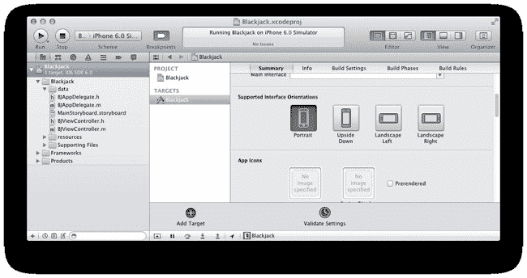

**图 4-9.** 关闭设备方向支持

我已经向你介绍了 Objective-C 类、属性、实例变量、初始化方法、类方法和实例方法的结构。这虽然只是一个简要介绍，但应该为你在动手开发二十一点和*生日提醒*应用时所需的基础理解打下基础。

### 模型

在本章的下一节中，我们将学习面向对象的 Objective-C。我们将学习 `NSObject`（核心基础对象类）以及如何对其子类化并扩展。我们将进一步开发二十一点游戏，并学习如何在 Objective-C 中实现基本 MVC 模式。

我们尚未完全完成控制器的开发，但现在我们将转向模型。应用的模型将由两个自定义类组成：一个卡牌值对象类和一个游戏模型。我们可以进一步拆分模型，为玩家和庄家添加模型类，但出于演示目的，两个类就足够了。

#### 卡牌模型

我们将创建一个类，用于表示一副牌中每张牌的数据。这是一个单副牌的二十一点游戏，因此在每手牌开始时，我们的卡牌类会实例化 52 个对象。别担心，我们会确保牌被洗乱。在创建模型类时，继承 Apple 的 `NSObject` 类是一个好做法，因为我们可以免费继承一些基本方法。让我们开始吧。


```markdown
##### 子类化 NSObject

我们已经见过一个基本示例，通过之前的`Person`示例来演示如何创建`NSObject`的子类。我还没展示的是在 Xcode 中创建新自定义类的流程。

打开项目导航面板，同样通过 Xcode 工具栏右上角的切换按钮操作。然后在项目层次结构中选择`data`组。

*提示：在 Xcode 项目中创建新类或添加文件时，始终先在项目导航器中为新文件选择目标位置。*

使用` N`键盘快捷键或`File` > `New` > `File`，系统会呈现新文件模板选择界面。如果尚未选中，则从 Cocoa Touch 集合中选择`Objective-C Class`选项（参见图 4-10）。

``

**图 4-10.** 创建一个新的 Objective-C 类

在下一屏幕中，确保子类选项设置为`NSObject`，并将你的类命名为`BJDCard`。这里引入另一个常见命名约定。通过在 BJ 类前缀中添加`D`，表示这是一个数据类，我们将对其他数据或值对象模型类使用此约定。

Xcode 会询问你保存新类文件的位置。由于`data`组映射到 Xcode 项目中一个同样名为`data`的文件夹，默认情况下，你应该会自动看到正确的保存位置。如果没有，则导航到你所操作的 Xcode 项目中的`data`文件夹，然后点击“Create”按钮（参见图 4-11）。

``

**图 4-11.** 将新的`BJDCard`类保存到 data 文件夹

如果尚未选择，请在项目导航器中选择新生成的`BJDCard`头文件，然后再次关闭导航器。现在你应该在 Xcode 的助理编辑器布局中同时看到新`BJDCard`类的头文件和源文件。

我们将开始向`BJDCard`添加几个属性。

头文件：

```
#import <Foundation/Foundation.h>

@interface BJDCard : NSObject

@property (nonatomic) int digit;
@property (nonatomic) BOOL isFaceUp;

@end
```

你暂时不需要对源文件做任何更改，因为 Xcode 的编译器会自动合成我们的两个新属性。结果应如图 4-12 所示。

``

**图 4-12.** 向`BJDCard`添加属性和合成的实例变量

##### 声明指针和基本类型

属性声明语法应该与我们之前在`BJViewController`中的工作非常相似。然而，我们之前的属性声明语法看起来略有不同。例如，`BJViewController`中的`dealerCardViews`数组是这样声明的：

```
@property (nonatomic,strong) NSArray *dealerCardViews;
```

而`BJDCard`中的`digit`是这样声明的：

```
@property (nonatomic) int digit;
```

这两个属性之间的区别在于：数组是指向对象的指针（引用），而整数是基本数据类型，基本类型的实际值就是属性本身。在像 ActionScript 这样的面向对象语言中，指针和基本类型的声明方式相同。在 Objective-C 中，你需要适应语法上的差异。

所有作用域中的指针声明都在属性或变量名之前使用`*`。而像整数、浮点数和布尔值这样的基本类型声明则不需要。数组、字典以及对任何 Objective-C 类实例的引用都是指针。

##### 保留与释放，以及 ARC（自动引用计数）

在 iOS 中，对指针的引用要么是弱引用，要么是强引用。iOS 中的内存管理会跟踪一个对象的强指针引用数量，一旦强引用计数降为零，系统就会判定该对象不再被你的应用需要，释放对象占用的所有内存，并销毁该对象。

在过去（iOS 5 之前），开发者需要自行管理所有强引用计数。旧的语法如下：

```
[myObject retain]; // 将对象的强引用计数增加 1
// 执行某些操作
[myObject release]; // 将强引用计数减少 1
```

开发者必须非常小心，确保当一个对象不再需要时，其强引用计数降为零，以防止应用出现内存泄漏。当应用消耗的内存超过系统可接受的范围时，系统会终止内存泄漏的应用。

苹果在 2011 年发布的 Xcode 4.2 中引入了一项广受好评的新技术，称为自动引用计数，简称 ARC。在编译时，ARC 会自动在所有`retain`和`release`引用处添加代码，这使得开发者现在可以更轻松地专注于编写优秀的代码，而无需花费大量时间跟踪强对象引用。

然而，了解应用底层发生了什么仍然非常重要。

让我们重新审视我们在`BJViewController`中创建的两个指针引用：

```
@property (nonatomic, weak) IBOutlet UIImageView *dealerCard1;
@property (nonatomic,strong) NSArray *dealerCardViews;
```

我想提醒你注意的两个属性指针声明之间的主要区别在于关键字`weak`和`strong`。这些关键字指示编译器如何处理这些属性的指针引用。默认情况下，指针属性引用是`strong`的。这对于像我们的`dealerCardViews`数组这样的属性是有意义的。这个数组是在视图控制器类中创建的，并且在应用的其他地方没有引用。如果我们向编译器暗示该属性是`weak`的，那么一旦应用执行了`viewDidLoad`，`dealerCardViews`属性就会被编译器设置为`nil`。由于没有其他对该数组的强引用，一旦我们离开了`viewDidLoad`的作用域，编译器就会认为该对象不再需要，可以被释放。

然而，对于像`dealerCard1`这样的 Interface Builder 输出口，引用应该是`weak`的。通过简单地将`dealerCard1`图像视图添加到其父视图中，我们已经在父视图和子视图之间创建了一个强引用。我们不希望视图控制器中对`dealerCard1`的引用是强引用，因为如果主视图被卸载，其子视图将不再可用，我们希望系统能够释放这些被移除视图所占用的内存。因此，我们对子视图的输出口使用弱引用。

这条规则也有例外。可以将视图和其他对象添加到故事板场景的顶层，即那些不是视图子视图的对象。在这种情况下，你需要从视图控制器类建立一个强输出口引用，以确保对象不会因为零强引用而被系统销毁。
```


#### 枚举器

Apple 在 Cocoa Touch 和 iOS SDK 中使用了大量枚举器。我们已经遇到过设备方向枚举器 `UIInterfaceOrientation`，在我们的应用中只支持方向枚举值 `UIInterfaceOrientationPortrait`。

创建我们自己的自定义枚举器也很简单。现在我们就在 `BJDCard.h` 中来实现。

```
typedef enum : int
{
    BJCardSuitClub = 0,
    BJCardSuitSpade,
    BJCardSuitDiamond,
    BJCardSuitHeart
} BJCardSuit;
```

将这段代码输入到 `BJDCard` 类的头文件中，要放在接口声明*之前*。我们的自定义枚举器是一个我们定义为 `BJCardSuit` 的 Objective-C 新类型。通过在接口声明之外的头文件中定义花色，我们就能让其他类使用这个枚举器。`BJDCard` 实际上只是一个值对象，因此我们应该允许外部类改变我们卡片的花色。我们声明枚举器中的每个元素都应为整数，并且列出的第一个 `enum` 值 (`BJCardSuitClub`) 等于 0。`BJCardSuitSpade` 等于 1，`BJCardSuitDiamond` 等于 2，以此类推。

现在我们已经定义了自定义的花色枚举器，可以为 `BJDCard` 创建一个名为 `suit` 的新属性，如下所示：

`@property (nonatomic) BJCardSuit suit;`

最终你对 `BJDCard` 所做的修改应如图 4-13 所示。

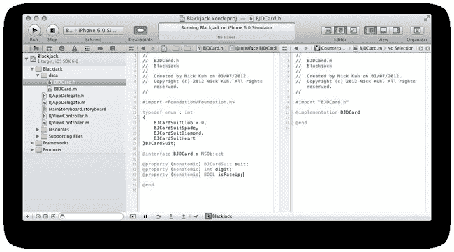

**图 4-13.** 添加了新的花色枚举器属性的 BJDCard

#### 方法

让我们为 `BJDCard` 添加几个公开方法。与公开属性类似，如果我们想为类添加公开方法，首先要将方法签名声明在头文件的类公开接口中。因此，在 `BJDCard.h` 的接口声明中，添加以下三个方法签名：

`-(BOOL) isAnAce;`
`-(BOOL) isAFaceOrTenCard;`
`-(UIImage *)getCardImage;`

我们已经为类添加了三个实例方法签名。在我们的应用中，只要存在 `BJDCard` 的实例，应用就会假定这三个方法中的任何一个都有可能在该实例上被调用。虽然我们还没有真正定义这些方法的实现，但编译器现在允许我们尝试调用这些方法。实际上，这会在运行时导致应用崩溃。编译器还会警告我们，尚未实现已声明签名的方法。

现在是时候实现前两个方法了。在实现源文件中，添加以下代码：

```
-(BOOL) isAnAce
{
    if (self.digit == 1) return YES;
    return NO;
}

-(BOOL) isAFaceOrTenCard
{
    if (self.digit > 9) return YES;
    return NO;
}
```

正如我在本章开头所述，在二十一点中，A 牌和人头牌的点数不同，因此我们创建了几个有用的方法，供游戏模型逻辑使用，以判断 `BJDCard` 的实例是否为 A 牌或人头牌。`BJDCard` 实例的 `digit` 属性是介于 1 到 13 之间的值：1 代表 A，11 代表 J，12 代表 Q，13 代表 K。

这些方法会检查 `digit` 属性的值，然后返回一个布尔值，在 Objective-C 中定义为 `YES`（真）或 `NO`（假）。

`BJDCard` 的这些方法没有实现任何参数，但现在是让我们熟悉 Objective-C 中方法声明语法的最好时机。以下是 Apple 官方文档中的图示：

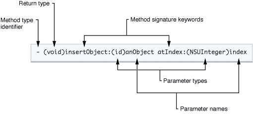

**图 4-14.** Objective-C 方法声明语法

至少可以说，Objective-C 中的方法声明相当冗长！每个参数都有一个*方法签名关键字*和一个*参数名称*（参见 图 4-14）。注意，对每个参数的实际引用是在参数类型之后定义的。因此，如果你在前面的示例中实现 Apple 的方法，`anObject` 和 `index` 关键字将是传入参数的名称。

我们会在本书中反复讨论方法语法，所以如果这个示例让你完全摸不着头脑，也不必过于担心！

现在来实现我们的第三个 `BJDCard` 方法 `getCardImage`。每当视图控制器想要在屏幕上正面渲染一张牌时，就会调用这个方法。在内部，该方法会检查牌的花色（得益于我们的自定义枚举器 `BJCardSuit`），并动态生成一个字符串，该字符串与我已经为您链接到此项目中的视网膜和非视网膜 PNG 文件库中正确图片的文件名相匹配。代码如下：

```
-(UIImage *)getCardImage
{
    NSString *suit;

    switch (self.suit) {
        case BJCardSuitClub:
            suit = @"club";
            break;
        case BJCardSuitSpade:
            suit = @"spade";
            break;
        case BJCardSuitDiamond:
            suit = @"diamond";
            break;
        case BJCardSuitHeart:
            suit = @"heart";
            break;

        default:
            break;
    }

    NSString *filename = [NSString stringWithFormat:@"%@-%d.png", suit, self.digit];

    return [UIImage imageNamed:filename];
}
```

我们在 `BJDCard` 实例的 `suit` 属性上使用了 switch 语句，并将该值转换后填入一个名为 `suit` 的局部字符串变量。注意，我们必须使用 `self.suit` 语法来引用该属性。不带 `self` 直接调用 `suit` 会导致编译器错误，因为编译器会认为你试图调用一个实例变量。还记得编译器是如何为我们合成 `suit` 属性并创建名为 `_suit` 的 iVar 的吗？因此，我们也可以对 `_suit` 执行 switch 语句，得到的结果相同。

`getCardImage` 方法最终会生成一个字符串，包含该牌对应正面图片的完整文件名。我们使用了一个 `NSString` 的工厂方法来实现这一点。在 `NSString` 的 `stringWithFormat` 初始化器中，它会自动将声明格式中的占位变量替换为我们作为额外参数传入的变量。若要声明格式中的字符串变量，请使用 `%@` 语法。若要声明整型变量，请使用 `%d` 语法。当替换任何对象，如 `NSString`、`NSNumber`、`NSArray` 等时，请使用 `%@`。这对于调试非常有用。例如，如果需要在调试器中打印数组的内容，可以使用以下代码：

`NSLog(@"My arr contents: %@", myAppVariable);`

最后，我们使用 `UIImage` 的工厂方法 `imageNamed` 生成一个新的图像实例，并传入应用包中图像的文件名：

`[UIImage imageNamed:filename];`

我们返回这个图像实例。

我们已经学习了如何在 Xcode 中创建继承自 `NSObject` 的新类。还学习了向类添加属性和方法的语法，以及如何引用属性和其底层的 iVar。事情正在升温。如果你觉得我讲得太快，别慌，我正在快速向你介绍代码和语法，在读完本章之后的主项目——*生日提醒* 应用中，你还将有很多机会重新回顾它们。


### 游戏模型

我们先暂时把 `BJDCard` 放在一边，但在继续之前，请确保应用能正常编译。构建并运行应用，你应该只会看到我们在章节开头创建的视图布局。只要你的应用版本没有崩溃，那就一切正常！

恐怕我在准备这个应用时稍微偷了点懒。我已经为你写好了一些代码。本章的目标是向你介绍 Objective-C，如果我逐行讲解黑杰克应用的每一行代码，本章恐怕会写得像一本书那么厚！

现在为我们的应用添加一个新类。我已经写好了大部分新的 `BJDGameModel` 类，因此你只需将实际的类文件添加到项目中，而无需从头创建文件。

首先，在项目导航器中选择 `data` 组，使用  键盘快捷键或通过 File  Add Files to “Blackjack”，导航到 `BJDGameModel` 的头文件和源文件，将它们一并选中，然后添加到你的项目中（参见图 4-15）。

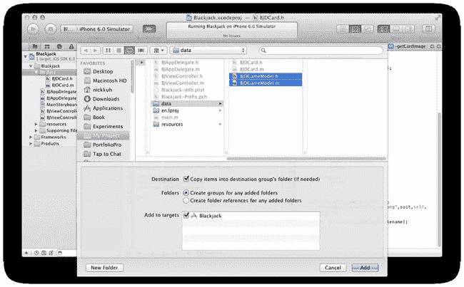

**图 4-15.** 向 Xcode 项目添加 `BJDGameModel` 头文件和源文件

`BJDGameModel` 引用了 `BJDCard`，所以为了检查在开发 `BJDCard` 过程中是否遗漏了什么，值得再次构建并运行，以确保项目仍然能无错误地编译。

让我们看看我在 `BJDGameModel` 中为你提供的代码。保持在助理编辑器布局中，我们可以快速浏览头文件中的公共接口属性和方法（参见图 4-16）。`BJDGameModel` 是一个管理一副牌以及庄家和玩家手牌的类；每个数组包含多个 `BJDCard` 实例。`BJDGameModel` 还管理游戏阶段。在黑杰克的每一局游戏中，玩家先行动，接着庄家行动，然后游戏结束。因此你会看到我创建了另一个自定义枚举来追踪这三个游戏阶段：

```
typedef enum : int
{
    BJGameStagePlayer,
    BJGameStageDealer,
    BJGameStageGameOver
}BJGameStage;
```

我们的游戏模型暴露了一个公共的 `gameStage` 属性。我们的视图控制器 `BJViewController` 可以访问模型，因此能够在任何时刻检查游戏阶段，并根据模型决定如何渲染视图。

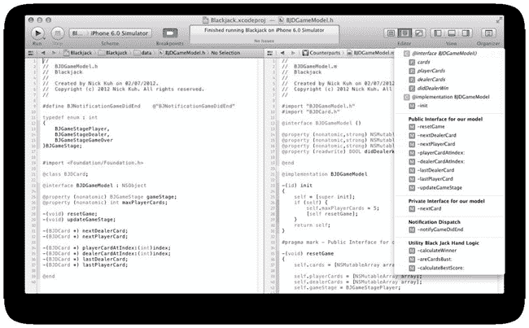

**图 4-16.** 分析 `BJDGameModel`

*注意**：你可以使用跳转栏快速查找头文件和源文件中的方法和属性声明及实现（参见图 4-16）。*

模型中还有另一个属性：`maxPlayerCards`。正如我在本章前面提到的，这是黑杰克实现中的一个注意事项：我们允许庄家或玩家手牌最多五张。如果玩家手牌达到五张且尚未爆牌，那么他的回合结束，游戏阶段进入庄家回合。

你是否在头文件中注意到了这段代码：

```
@class BJDCard;
```

这就是所谓的向前类声明。`BJDGameModel` 中的一些公共方法会返回 `BJDCard` 的实例。如果我们不在头文件中像这样导入 `BJDCard`：

```
#import "BJDCard.h"
```

或者像我这样添加一个向前类声明，编译器就会报错。向前类声明让编译器知道，虽然我们尚未声明 `BJDCard` 类，但它将会被声明——请相信我们，编译器！你会看到，我实际上在 `BJDGameModel.m` 的源实现中导入了 `BJDCard.h`。一般来说，这是在头文件中引用其他类的最佳方式，即通过向前类声明。然后确保在源文件中导入头文件。

尽管这次在 `BJDGameModel.h` 头文件中导入 `BJDCard.h` 没有问题，但如果继续这样操作，将来可能会遇到可怕的编译器错误。如果两个类在头文件中相互引用，就会出错。它们都依赖编译器先导入对方文件，这会让编译器陷入混乱！解决方案：在头文件中使用向前类声明，而不是导入声明。

### 我们的 MVC 黑杰克实现

我们的游戏运行方式为：`BJViewController` 是 MVC 实现中的控制器。控制器可以访问模型，但模型对控制器一无所知。类似地，控制器与视图之间也是单向关系。

`BJViewController` 将控制整个流程：当应用首次加载时，`BJViewController` 调用模型的 `resetGame` 方法，然后渲染视图以显示模型状态。在玩家回合中，`BJViewController` 监听“停牌”和“要牌”按钮的“内部触摸事件”动作，并告知模型发一张新牌。接着，`BJViewController` 再次渲染视图。`BJViewController` 还会调用模型的 `updateGameStage` 方法，该方法检查玩家是否爆牌或达到五张手牌上限，并相应地推进游戏阶段。

一旦进入庄家回合，`BJViewController` 将第二张牌正面朝上渲染，并通过 `updateGameStage` 方法询问模型庄家是否应该停牌。如果庄家需要要牌，那么 `BJViewController` 会设置一个延迟计时器来模拟第三张牌的发放。`BJViewController` 再次调用 `updateGameStage`，然后继续发放延迟牌，直到庄家爆牌或获胜。


#### 类方法

在 `BJDGameModel` 源文件中，你会发现一个名为 `cards` 的私有属性，它是一个可变数组，用于存储由 52 个 `BJDCard` 实例组成的牌组。我们将该数组声明为可变的，因为当牌被发到 `playerCards` 和 `dealerCards` 这两个可变数组中时，我们需要从该数组中弹出（pop）牌。不过，我并未提供预先生成牌组的代码。那么，现在我们就来实现它！

控制器会调用 `BJDGameModel` 的 `resetGame` 方法。这正是我们需要生成一副牌的地方。目前，`cards` 被设置为一个空数组：

```
self.cards = [NSMutableArray array];
```

我们可以直接在 `BJDGameModel` 类中编写一个循环，但在其他纸牌游戏中，我们可能也需要生成一副 52 张的牌。在我看来，为 `BJDCard` 类本身创建一个便捷方法会更合适。我们已经看到一些类，比如 `NSArray` 和 `NSDictionary`，如何通过工厂/便捷方法来生成自身的实例。在本例中，我们将在 `BJDCard` 上创建一个类方法，用于生成一个包含 52 个 `BJDCard` 实例的可变数组！

切换到助理编辑器，开始处理 `BJDCard` 类。你是否发现，在 Xcode 中，你可以同时打开多个 Objective-C 文件？你甚至可以设置多个文件全部使用助理编辑器布局。在 Xcode 中，默认情况下，双击项目导航器中的文件会打开一个新窗口。我更喜欢使用多个标签页而非窗口。要将 Xcode 设置为打开新标签页而非新窗口，请进入 Xcode 的通用偏好设置，在“双击导航”下，将所选选项更改为“使用单独的标签页”。

现在查看 `BJDCard.h`，让我们在头文件中声明这个新的类方法：

```
+(NSMutableArray *) generateAPackOfCards;
```

你是否注意到类方法与实例方法（该类中的其他三个方法）在语法上的细微差别？声明类方法的语法是在声明开头使用“`+`”而不是“–”。现在切换到源文件中的 `BJDCard.m`，并添加以下代码：

```
+(NSMutableArray *) generateAPackOfCards
{
    NSMutableArray *arr = [NSMutableArray array];

    BJDCard *card;

    int suit,digit;

    for (suit=0;suit<4;suit++) {
        for (digit=1;digit<=13;digit++)
        {
            card = [[BJDCard alloc] init];
            card.suit = suit;
            card.digit = digit;
            [arr addObject:card];
        }
    }

    return arr;
}
```

浏览这段代码，你会发现我们建立了一个嵌套循环。第一个外层循环迭代四次：每种花色一次。因此，生成牌的四分之一的花色设为 0，四分之一的花色设为 1，以此类推。你还记得我们自定义的花色枚举器 `BJCardSuit` 吗？以下是帮助回想的代码：

```
typedef enum : int
{
    BJCardSuitClub = 0,
    BJCardSuitSpade,
    BJCardSuitDiamond,
    BJCardSuitHeart
}BJCardSuit;
```

通过这种声明语法，编译器将整数 0 分配为 `BJCardSuitClub`，整数 1 分配为 `BJCardSuitSpade`，依此类推。因此，在我们的 `generateAPackOfCards` 方法中，这些花色值将与原始枚举声明中的枚举值相匹配。

回到 `generateAPackOfCards` 的分析，你会看到我们首先声明了一个空的局部作用域可变数组：

```
NSMutableArray *arr = [NSMutableArray array];
```

然后，在我们循环的核心部分，我们 `alloc`/`init` 了新的 `BJDCard` 实例，设置其花色和数字，然后通过可变数组的实例方法 `addObject:` 将它们添加到局部数组中。

完成后，我们返回该数组。

编译并运行你的应用，确认仍然没有错误！

我们完成了二十一点游戏中 `BJDCard` 类的开发。现在，我们将对 `BJDGameModel` 进行一些修改，以利用刚刚编写的新的 `generateAPackOfCards` 方法。

在 `BJDGameModel` 中，将 `resetGame` 方法实现中的这行代码：

```
self.cards = [NSMutableArray array];
```

替换为：

```
self.cards = [BJDCard generateAPackOfCards];
```

太好了，我们的数组里有了 52 张牌！唯一的问题是牌没有洗过。嗯……这样的二十一点游戏会相当无聊。解决方案是什么呢？

#### 洗牌：Objective-C 类别

遗憾的是，Objective-C 的 `NSMutableArray` 类没有洗牌方法。因此，我们需要自己编写一个。但是，对于可变数组来说，洗牌不是一种非常有用的附加方法吗？如果能把我们的方法添加到 `NSMutableArray` 类中，是不是很酷？猜猜怎么着？我们可以通过 Objective-C 类别来实现！

向现有类添加类别通常需要创建一个新的 Objective-C 头文件和源文件。我们将文件添加到 `data` 组中，因此打开项目导航器并确保选中了 `data`。现在，再次使用 N 快捷键或 文件  新建  新建文件，从 Cocoa Touch 文件模板中选择 Objective-C 类别选项。在下一个屏幕中，在“类别”文本字段中输入 **Shuffle**，在“类别于”文本字段中输入 **NSMutableArray**（参见图 4-17）。

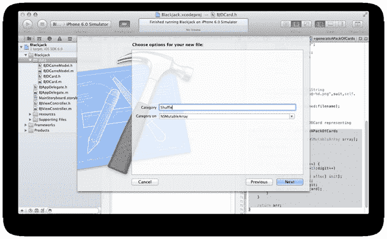

**图 4-17.** 向 NSMutableArray 添加 Objective-C 类别

在 Finder 的 data 文件夹中创建新文件。确保你在助理编辑器布局中查看新创建的 `NSMutableArray+Shuffle` 头文件和源文件。

*提示：偶尔 Xcode 不会在助理布局中自动显示对应的头文件/源文件。要解决此问题，请点击跳转栏，并将所选选项更改为“对应文件”。*

你会看到，类别文件的布局与类文件类似，但请注意，在接口关键字后的括号内添加了类别名称。按如下方式修改类别头文件：

```
#import <Foundation/Foundation.h>
@interface NSMutableArray (Shuffle)

- (void) shuffle;

@end
```

现在修改源实现，包含新的洗牌方法：

```
#import "NSMutableArray+Shuffle.h"

@implementation NSMutableArray (Shuffle)

- (void)shuffle
{
    int count = [self count];

    NSMutableArray *dupeArr = [self mutableCopy];
    count = [dupeArr count];
    [self removeAllObjects];

    for (int i = 0; i < count; ++i) {
        // 选择一个介于 i 和数组末尾之间的随机元素进行交换。
        int nElements = count - i;
        int n = (arc4random() % nElements);
        [self addObject:dupeArr[n]];
        [dupeArr removeObjectAtIndex:n];
    }

}

@end
```

我们的自定义洗牌方法执行以下过程：

> * 创建可变数组的副本。
> * 清空数组。
> * 循环遍历副本数组，随机抽取元素（在我们的应用中，这些是 `BJDCard` 的实例），将它们重新添加到可变数组中，并从副本中移除它们。

洗牌类别创建完毕：现在回到 `BJDGameModel`。

为了让编译器允许我们在 `NSMutableArray` 上调用新的洗牌类别方法，我们需要导入刚刚创建的文件。因此，在 `BJDGameModel.m` 的顶部添加 import 声明：

```
#import "NSMutableArray+Shuffle.h"
```

现在，你应该能够在生成牌组后，直接在 `self.cards` 上调用 `shuffle` 方法。因此，`resetGame` 方法最终应如下所示：

```
-(void) resetGame
{
    self.cards = [BJDCard generateAPackOfCards];

    [self.cards shuffle];

    self.playerCards = [NSMutableArray array];
    self.dealerCards = [NSMutableArray array];
    self.gameStage = BJGameStagePlayer;
}
```

很酷，对吧？


### 在我们的二十一点游戏中

在我们的二十一点游戏中，由模型来决定游戏何时结束。游戏结束可能有几种原因：玩家点数爆掉、庄家点数爆掉、庄家拿到第五张牌达到上限、或者庄家停牌。控制器 `BJViewController` 需要在游戏结束时更新视图，告知用户谁赢了，并允许他重新开始游戏。然而，根据 MVC 模式的规则，模型必须对视图和控制器保持无知。那么，我们该如何向 `BJViewController` 发出游戏结束的事件警报呢？

答案是苹果的 `NSNotificationCenter`。

### 在类之间分发通知

苹果友好地为 Cocoa 开发者提供了 `NSNotificationCenter`，这消除了使用任何第三方架构框架的大部分理由。我记得过去，成为一名优秀的 Flash 和 Flex 开发者不仅仅在于知道如何编写优秀的 ActionScript，还在于在构建复杂的 Web 应用和游戏时，该从众多第三方框架中选择哪一个——例如 PureMVC、Cairngorm、Swiz 和 Robotlegs。

不过，对于 iOS SDK 应用开发来说，忘掉那些第三方架构框架吧；通知中心为所有 Objective-C 对象添加了原生的广播和观察者机制。我们的模型将能够向程序的无尽深处发送一个通知。只要我们的视图控制器（或任何其他对象）已注册为自定义通知的观察者，我们就可以放心，视图控制器会捕获该事件，做出响应，并相应地更新视图。

那么，让我们从模型中添加一个通知分发。

每个分发的通知必须是 `NSNotification` 的一个实例，它有一个 `name` 属性，供观察类在注册通知时使用。因此，我们需要在常量字符串中定义游戏结束通知的名称。

就在 `BJDGameModel.h` 头文件的顶部，定义通知名称：

`#define BJNotificationGameDidEnd    @"BJNotificationGameDidEnd"`

有些开发者会单独用一个文件来存放常量声明。在声明通知名称的情况下，另一种常见的做法是将通知名称声明添加到分发类的头文件中，就像我们刚刚做的那样。

现在，切换到 `BJGameModel` 的源文件，找到 `notifyGameDidEnd` 方法。该方法目前是空的。不过，`BJDGameModel` 已经在游戏结束的所有节点调用了这个方法。在发送通知时，我们需要实现两个目标：提醒所有观察对象游戏已结束，并让他们知道谁赢了。按照以下方式更新 `notifyGameDidEnd`：

```
-(void) notifyGameDidEnd
{
    NSNotificationCenter *notificationCenter = [NSNotificationCenter defaultCenter];

    // 使用字面量语法将布尔值包装成 NSNumber 对象
    NSNumber *didDealerWin = @(self.didDealerWin);

    // 使用字面量语法创建字典
    NSDictionary *dict = @{@"didDealerWin": didDealerWin};

    [notificationCenter postNotificationName:BJNotificationGameDidEnd object:self
userInfo:dict];
}
```

我知道这包含了很多新代码需要消化，让我们一步步来理解。通知广播是通过 `NSNotificationCenter` 的一个实例发送的。我们甚至不需要担心实例化这个类，因为 Cocoa 已经在后台创建了一个默认的单一实例，我们可以通过 `NSNotificationCenter` 的便捷方法 `defaultCenter` 来访问它。

接下来，我们需要在通知中包含庄家或玩家是否获胜的详细信息。我们要发送的通知对象允许我们在其 `userInfo` 属性中包含一个 `NSDictionary` 实例。这就是我们在下一行代码中创建 `NSDictionary` 的原因。

问题在于 `self.didDealerWin` 属性是一个布尔型原始值。原始数据类型不能直接作为字典或数组中的值来设置。解决方案是将布尔型原始值包装在一个对象中，并将指针传递给字典。我们通过创建 `NSNumber` 类的一个实例来实现这一点。

**注意：** 原始数据类型不能直接作为字典或数组中的值来设置。请将原始值包装在 `NSNumber` 类的实例中。你可以在 `NSNumber` 实例中包装浮点数、整数和布尔值。

最后，我们通过单一的默认 `NSNotificationCenter` 发布通知：

```
[notificationCenter postNotificationName:BJNotificationGameDidEnd object:self userInfo:dict];
```

此方法使用给定的名称（`BJNotificationGameDidEnd` 常量字符串）、发送者（我们的 `BJDGameModel` 类实例）和信息（我们的字典实例及获胜者数据）创建一个通知，并将其发布给已注册的通知观察者。

构建并运行，然后检查你的代码是否能成功编译。我们的模型部分已经完成：现在回到 `BJViewController` 来将所有内容串联起来！


### 串联所有组件

剩下的工作都在 `BJViewController` 的源实现文件中。我们终于能看到在视图中构建模型所付出的辛勤劳动的成果了！

关闭所有模型类，在标准编辑器中仅打开 `BJViewController.m`。首先导入 `BJDGameModel.h` 和 `BJDCard.h`：

```
#import "BJViewController.h"
#import "BJDGameModel.h"
#import "BJDCard.h"
```

现在向 `BJViewController.m` 源文件的私有类扩展中添加新的私有模型属性：

```
@interface BJViewController ()

@property (nonatomic,strong) NSArray *dealerCardViews;
@property (nonatomic,strong) NSArray *playerCardViews;
@property (nonatomic,strong) BJDGameModel *gameModel;
@end
```

在 `BJViewController.m` 的实现中，为两个新的私有方法添加占位符：

```
- (void)renderCards
{

}

- (void)restartGame
{

}
```

*注意：为避免在 Xcode 4.5 之前的版本中产生编译器警告，你需要在类扩展中声明私有方法签名，或者将方法实现放在实现文件的高处并位于所有调用者之前。现在这已成为过去式，你可以按照自己的喜好排列私有方法顺序，无需声明方法签名。*

此外，我们将在子类中重写 `UIViewController` 的指定初始化方法，如下所示：

```
-(id) initWithCoder:(NSCoder *)aDecoder
{
    self = [super initWithCoder:aDecoder];
    if (self) {
        self.gameModel = [[BJDGameModel alloc] init];
        [[NSNotificationCenter defaultCenter] addObserver:self
                                                selector:@selector(handleNotificationGameDidEnd:)
                                                    name:BJNotificationGameDidEnd
                                                  object:self.gameModel];
    }
    return self;
}
```

`UIViewController` 有多个指定初始化方法：`initWithCoder:` 和 `initWithNibName:bundle:`。然而，当从故事板实例化时，`initWithCoder:` 是自动调用的初始化方法。

在我们的 `BJViewController` 指定初始化方法中，我们做了两件事：实例化 `BJDGameModel` 的实例，并注册在游戏结束时接收来自模型的通知。我们已经为游戏结束通知进行了注册，以便触发我们在视图控制器中尚未编写的方法：`handleNotificationGameDidEnd:`。

在 `NSNotificationCenter` 的 `addObserver` 方法中使用 `@selector` 指令，类似于本章开头介绍的 Interface Builder 中 `UIControl` 目标-动作机制。当游戏结束时，`BJDGameModel` 通过通知中心发送一条新通知，该通知进而调用观察类 `BJViewController` 中的 `handleNotificationGameDidEnd` 方法。

我们将在本章末尾实现 `handleNotificationGameDidEnd` 方法。接下来，请你为新方法 `restartGame` 添加完整代码：

```
- (void)restartGame
{
    [self.gameModel resetGame];
    BJDCard *card;

    card = [self.gameModel nextPlayerCard];
    card.isFaceUp = YES;
    card = [self.gameModel nextDealerCard];
    card.isFaceUp = YES;

    card = [self.gameModel nextPlayerCard];
    card.isFaceUp = YES;

    [self.gameModel nextDealerCard];

    [self renderCards];

    self.standButton.enabled = self.hitButton.enabled = YES;
}
```

`restartGame` 方法首先调用模型的 `resetGame` 方法。我们最近在 `BJDGameModel` 中完成了 `resetGame` 方法——我们生成了一个新的洗牌牌组，并清空用于跟踪庄家和玩家手牌的数组。

接下来，我们指示模型向庄家和玩家各发两张牌。请注意，我们仅将庄家的第一张牌设置为正面朝上，而不是第二张。这一指令将在我们尚未编写的 `renderCards` 方法中渲染到视图中。

我们还启用了玩家的停牌和要牌按钮，因为在二十一点中玩家先出牌。当轮到庄家出牌时，我们将禁用这些按钮。


在我们的视图控制器中，有两个地方需要调用`restartGame`：1）当游戏结束且玩家希望重新游戏时，2）视图首次显示在屏幕上时。为了适应第二种场景，我们需要在`BJViewController`的哪个方法中添加对`restartGame`的调用？你还记得本章开头介绍的视图生命周期吗？我们之前在`viewDidLoad`方法中初始化了`dealerCardViews`和`playerCardViews`数组属性。对于我们的应用来说，这个方法非常适合调用`[self restartGame]`。另一个同样合适的方法是`viewWillAppear:`。`viewWillAppear:`在视图显示在屏幕上的前一刻被调用。我们将在应用显示视图之前重启游戏并渲染视图：

```
- (void)viewWillAppear:(BOOL)animated
{
    [super viewWillAppear:animated];
    [self restartGame];
}
```

准备好了吗？现在让我们实现`renderCards`方法：

```
- (void)renderCards
{
    int maxCard = self.gameModel.maxPlayerCards;

    BJDCard *dealerCard;
    BJDCard *playerCard;
    UIImageView *dealerCardView;
    UIImageView *playerCardView;

    for (int i=0; i<maxCard; i++) {
        dealerCardView = self.dealerCardViews[i];
        playerCardView = self.playerCardViews[i];

        dealerCard = [self.gameModel dealerCardAtIndex:i];
        playerCard = [self.gameModel playerCardAtIndex:i];

        dealerCardView.hidden = (dealerCard == nil);
        if (dealerCard && dealerCard.isFaceUp) {
            dealerCardView.image = [dealerCard getCardImage];
        }
        else {
            dealerCardView.image = [UIImage imageNamed:@"card-back.png"];
        }

        playerCardView.hidden = (playerCard == nil);
        if (playerCard && playerCard.isFaceUp) {
            playerCardView.image = [playerCard getCardImage];
        }
        else {
            playerCardView.image = [UIImage imageNamed:@"card-back.png"];
        }
    }
}
```

好，激动人心的时刻到了。首先，我们在本地方法作用域中声明了一些变量：`maxCard`（每位玩家五张牌）；`dealerCard`和`playerCard`（`BJDCard`的实例）；以及`dealerCardView`和`playerCardView`（我们在本章开头添加到故事板中的`UIImageView`实例）。

我们循环执行主代码块五次，在每次迭代中，为卡牌模型和视图变量赋值。请注意，我们直接从`BJDGameModel`类的公开方法`dealerCardAtIndex`和`playerCardAtIndex`中获取`dealerCard`和`playerCard`的卡牌模型。如果你研究这些方法，会发现它们要么返回`BJDCard`实例，要么在索引大于玩家卡牌数组最高索引时返回`nil`，例如`[self.gameModel dealerCardAtIndex:2]`在庄家只有两张牌（索引 0 和 1）时会返回`nil`。

如果返回的卡牌是`nil`，我们就简单地隐藏对应的卡牌视图，因为这表示该牌尚未被发放：

```
dealerCardView.hidden = (dealerCard == nil);
```

以及

```
playerCardView.hidden = (playerCard == nil);
```

如果对应的卡牌不是`nil`，我们还会检查`BJDCard`实例是否是正面朝上的。如果是正面朝上，我们会使用我们编写的`getCardImage`方法来获取一张图片，并设置到`UIImageView`上。如果卡牌是背面朝上的，我们将`UIImageView`中显示的图片默认设置为卡牌背面图片：

```
dealerCardView.image = [UIImage imageNamed:@"card-back.png"];
```

一旦你将这些代码全部添加到`renderCards`方法中，你会发现当你构建并运行应用时，发给庄家和玩家的卡牌将会被渲染出来（参见图 4-18）。

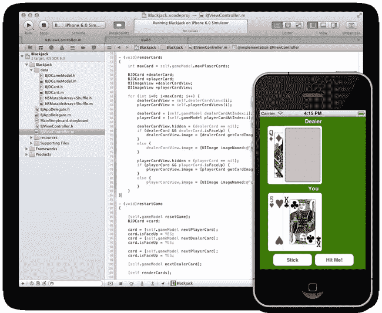

**图 4-18.** 嗯……我应该停牌还是叫牌？

事情开始有眉目了！我想玩游戏，但“停牌”和“叫牌”按钮目前什么都没做。让我们来改变这一点。

好吧，我又作弊了，行吗？我预先编写了一些用于自动化庄家回合的代码，所以首先，向下滚动`BJViewController`并取消注释以下三个私有庄家方法：

```
#pragma mark - Automated Dealer Play

-(void) showSecondDealerCard
{
    BJDCard *card = [self.gameModel lastDealerCard];
    card.isFaceUp = YES;
    [self renderCards];
    [self.gameModel updateGameStage];
    if (self.gameModel.gameStage != BJGameStageGameOver) {
        [self performSelector:@selector(showNextDealerCard) withObject:nil afterDelay:0.8];
    }

}

-(void) showNextDealerCard
{
    //next card
    BJDCard *card = [self.gameModel nextDealerCard];
    card.isFaceUp = YES;
    [self renderCards];
    [self.gameModel updateGameStage];
    if (self.gameModel.gameStage != BJGameStageGameOver) {
        [self performSelector:@selector(showNextDealerCard) withObject:nil afterDelay:0.8];
    }
}

- (void)playDealerTurn {
    self.standButton.enabled = self.hitButton.enabled = NO;
    [self performSelector:@selector(showSecondDealerCard) withObject:nil afterDelay:0.8];
}
```

`showSecondDealerCard`、`showNextDealerCard`和`playDealerTurn`都是我编写的用于自动化庄家回合的方法。因此，一旦玩家的回合结束，想法是首先调用`playDealerTurn`。这个方法做的第一件事是通过禁用“停牌”和“叫牌”按钮来阻止任何按钮交互。

接下来，我们利用`NSObject`中非常方便的`performSelector:withObject:afterDelay`方法，该方法支持延迟方法调用。延迟以秒为单位定义，因此我们在每次发牌和渲染给庄家之间设置了 0.8 秒的延迟。

`showNextDealerCard`和`playDealerTurn`几乎完全相同。唯一的区别在于，当庄家的第二张牌被翻开时，它已经被发过了，所以我们调用：

```
BJDCard *card = [self.gameModel lastDealerCard];
```

而不是：

```
BJDCard *card = [self.gameModel nextDealerCard];
```

每张牌发完后并渲染后，控制器还会让模型更新游戏阶段；也就是说，如果庄家达到了五张牌的上限或爆牌，游戏结束。


#### 响应用户交互

在庄家行动之前，我们需要编写`Hit`和`Stand`按钮的操作方法代码。`Stand`方法很直接：

```
- (IBAction)didTapStandButton:(id)sender {
    self.gameModel.gameStage = BJGameStageDealer;
    [self performDealerTurn];
}
```

控制器告知模型游戏阶段已推进到庄家回合，随后我们将调用`performDealerTurn()`方法。

`Hit`方法稍复杂一些：

```
- (IBAction)didTapHitButton:(id)sender {
    BJDCard *card = [self.gameModel nextPlayerCard];
    card.isFaceUp = YES;
    [self renderCards];

    [self.gameModel updateGameStage];
    if (self.gameModel.gameStage == BJGameStageDealer) {
        [self performDealerTurn];
    }
}
```

首先，控制器请求模型发一张玩家牌。控制器在视图中正面朝上渲染这张牌。接着控制器告知模型更新游戏阶段——即游戏可能已结束，因为玩家爆牌或摸到五张牌的上限。`BJViewController`通过检查确认玩家回合是否结束，若是则执行自动庄家方法：

```
if (self.gameModel.gameStage == BJGameStageDealer) {
    [self performDealerTurn];
}
```

太棒了！现在你可以完整玩一局二十一点了！构建并运行试试看。

哎呀，你的应用是不是在游戏结束时崩溃了？我们遗漏了什么？

啊对了，我们从未在`BJViewController`中实现`handleNotificationGameDidEnd:`方法。还记得我们在该类的指定初始化方法中订阅的那个通知吗？我们需要添加那个方法！代码如下：

```
-(void) handleNotificationGameDidEnd:(NSNotification *)notification
{
    NSDictionary *userInfo = notification.userInfo;

    NSNumber *num = userInfo[@"didDealerWin"];

    NSString *message = [num boolValue] ? @"庄家赢了！" : @"你赢了！";

    UIAlertView *alert = [[UIAlertView alloc] initWithTitle:@"游戏结束" message:message
    delegate:nil cancelButtonTitle:nil otherButtonTitles:@"再来一局", nil];
    [alert show];
}
```

在我们的通知处理程序中，通过`userInfo`属性就能提取获胜者信息。我们预期得到一个字典，其中包含包装了布尔基本类型的`NSNumber`属性。因此我们还需提取基本布尔值来判断庄家是否获胜：

```
NSString *message = [num boolValue] ? @"庄家赢了！" : @"你赢了！";
```

最终得到获胜信息，并在警告视图中显示（参见图 4-19）。

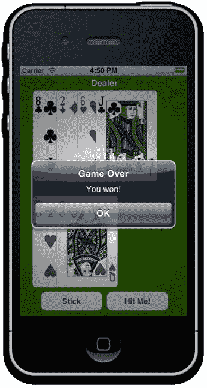

**图 4-19** 耶！我花了五次构建运行才截到一张获胜截图！

#### 协议与委托模式

不过我们还没完全完成。应用不再崩溃，但一旦关闭警告视图，游戏就结束了。按钮被禁用，我们无法重新开始游戏。这可不行！我们要将确定按钮改为"再来一局"，并在按钮按下时重新开始游戏。

如何知道按钮被按下？`UIAlertView`类并未暴露其按钮属性，因此我们无法在此实例中利用目标-动作机制。相反，与 Apple iOS SDK 的许多组件一样，`UIAlertView`采用了委托模式。

`UIAlertView`有一个名为**委托**的弱引用属性。只要对象实现了`UIAlertViewDelegate`协议，`UIAlertView`不关心哪个对象想成为其委托。**协议**类似于类接口：它定义了协议将要实现的一组方法签名。但协议也可以定义*可选*方法签名。为了让`BJViewController`将自己设为警告视图的委托，它需要先声明实现了`UIAlertViewDelegate`协议。为此，我们暂时切换到`BJViewController`的头文件。

将接口声明的第一行从

`@interface BJViewController : UIViewController`

改为

`@interface BJViewController : UIViewController <UIAlertViewDelegate>`

如果你查看`UIAlertViewDelegate`的头文件，会发现其所有方法都是可选的。因此即使我们尚未添加任何`UIAlertViewDelegate`协议方法，编译器也不会生成任何关于代码的警告。

**注：**当一个类声明实现包含必需方法的协议时，如果类没有实际实现这些方法，编译器会显示警告。

现在回到`BJViewController`的源文件。我们需要对`handleNotificationGameDidEnd:`方法中显示警告的代码做一点小改动：

```
UIAlertView *alert = [[UIAlertView alloc] initWithTitle:@"游戏结束" message:message
    delegate:self cancelButtonTitle:nil otherButtonTitles:@"再来一局", nil];
[alert show]
```

注意到我们现在已将自身设为警告视图的委托了吗？

最后，我们要向`BJViewController`的实现中添加一个`UIAlertViewDelegate`方法：

```
- (void)alertView:(UIAlertView *)alertView clickedButtonAtIndex:(NSInteger)buttonIndex
{
    [self restartGame];
}
```

**提示：**添加委托方法时，快速实现方法代码的方式是从 Organizer 文档中直接复制并粘贴到你的类中。

就是这样，我们完成了！现在你应该可以构建并运行游戏——并且一遍又一遍地玩二十一点了。

### 本章小结

这是一段史诗般的旅程！在本章中我们接触了 Objective-C 的许多部分。我相信其中一些部分仍然令人困惑。不过，这正是你继续阅读本书剩余内容的原因：随着我们推进*生日提醒*应用，Objective-C 方法、属性、实例变量、协议、选择器、Interface Builder 输出口、动作等的语法声明和实现会变得越来越熟悉。

第一天到此结束！明天我们将回到主项目*生日提醒*。如果你觉得我们涉及了大量代码且有些迷失方向，请不要担心，我们将在明天全天投入第 5 章和第 6 章，为应用的用户界面绘制故事板。虽然会有编码，但绝不会像本章这样信息过载。


## 第二天

## 故事板绘制用户界面


## 第 5 章

## iPhone 应用导航、视图与视图控制器

今天是第二天，阳光灿烂（至少布莱顿这里是这样！）。我们回到主项目*生日提醒*。今天全天，我们将百分之百地致力于应用的用户界面工作。

今天上午（本章），我们将探讨视图与视图控制器之间的关系，以及如何为应用的导航绘制故事板：在导航堆栈上推入、弹出、呈现和关闭视图控制器。

今天下午（第 6 章），我们将享受视图和用户界面控件的乐趣，在*生日提醒*应用的几个主要屏幕中实现并处理交互性。最后，我们将花一些时间将 iPhone 的照片库和相机直接集成到项目中，以此结束今天的工作。


### 多视图应用

到目前为止，我们在*生日提醒*和二十一点应用中都只包含了一个视图和一个视图控制器。对于某些应用，例如简单的游戏，单个视图就足够了。然而，多视图应用能够通过小屏幕设备以清晰且结构化的形式向用户呈现大量内容。

*生日提醒*就是一个多视图应用。我们模型中的每个生日对象都包含姓名、出生日期、个人资料照片、礼物备注，以及指向 Facebook 用户详细信息的链接，或从原生通讯录导入的电话和电子邮件详细信息。对于可能数百个生日来说，要在单个视图中清晰显示如此多的数据，工作量巨大！通过在首页视图上创建多视图应用，我们的用户将只看到每个已存储生日的摘要信息，例如一张小尺寸个人资料照片、姓名以及距离每个生日的天数。当用户点击某个特定的生日时，它会在导航中深入一层，显示生日详情视图，其中包含一张更大的个人资料照片以及关于我们的朋友及其生日的完整详细信息（参见图 5-1）。

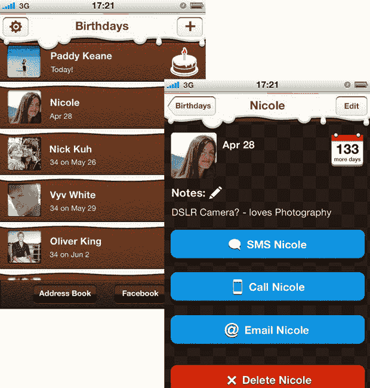

**图 5-1.** 多视图应用非常适合在小屏幕设备上呈现大量内容。

在本书的剩余部分，我们将继续开发我们的主要*生日提醒*应用。请打开你在第 3 章中构建的*生日提醒* Xcode 项目。或者，打开本章的起始源代码。

*注意：如果你决定在书中的任何时刻从源代码开始工作，请务必将 `Info.plist` 中的包标识符从 `com.apress.BirthdayReminder` 更新为 `com.yourdomain.BirthdayReminder`。*

### 掌握视图和视图控制器

在本章的前半部分，我将带你了解视图和视图控制器的基础知识。通过使用故事板，你将学会在应用的不同屏幕之间构建导航层级结构是多么容易。你还将理解视图的生命周期，以及何时何地向视图控制器添加代码以响应用户在你的应用中的导航操作。

打开你的*生日提醒*项目后，首先删除之前在 Hello World 示例中添加到主视图的任何标签或其他子视图。

#### 添加导航控制器

为了添加生日详情场景，我们首先要在故事板中添加一个导航控制器实例。导航控制器管理多个视图控制器的深入堆栈。当一个新视图控制器被推入导航控制器堆栈时，导航控制器会将当前视图以动画方式移出屏幕左侧，并从右侧滑入新视图。

目前，我们的故事板中只有一个视图控制器和一个视图。我希望你选择视图控制器，而不是视图。为此，请点击视图下方和左侧的橙色圆形图标（参见图 5-2）。

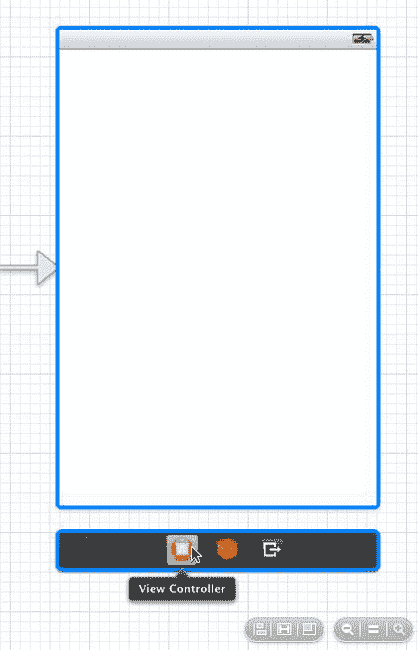

**图 5-2.** 选择视图控制器

在故事板中选中视图控制器后，从 Xcode 的菜单栏添加一个新的父导航控制器就很简单了：Editor  Embed In  Navigation Controller。结果应类似于图 5-3。

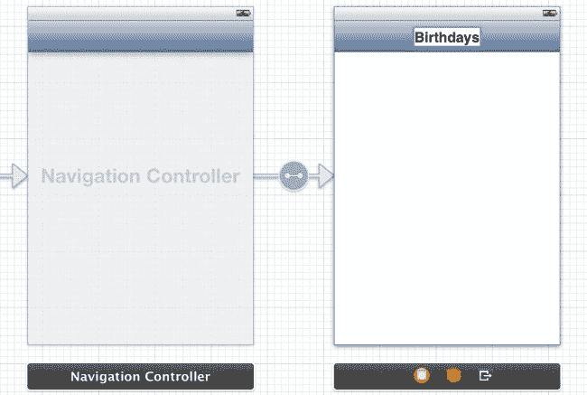

**图 5-3.** 嵌入在导航控制器中的视图控制器

一旦嵌入到导航控制器中，视图控制器就会从其新的父容器视图控制器继承一个导航栏。双击视图控制器的模拟导航栏，输入导航标题 **Birthdays**（参见图 5-3）。

#### 故事板场景和根视图控制器

iOS 应用中的每个主视图或屏幕通常由 Apple 的 `UIViewController` 类的一个实例拥有和管理。为了创建我们的多视图应用，我们将向故事板添加额外的视图控制器，每个控制器将管理自己的视图。视图和视图控制器的组合在故事板术语中被称为*场景*。

你的应用所呈现的第一个视图控制器被称为*根视图控制器*。你注意到我们故事板中的新导航控制器左侧有一个指向它的箭头吗？这是 Xcode 指示此视图控制器为根视图控制器的方式。请务必不要从故事板中删除根视图控制器，否则 Xcode 的编译器将无法再解析你的故事板。

尽管我们的首页视图控制器现在已嵌入导航控制器中，但我们的应用中仍然只有一个场景，尽管它带有导航栏。现在我们要向故事板添加第二个场景，它最终将成为生日详情视图。我们通过将新的视图控制器实例从对象库拖放到故事板上来添加新场景。我发现将故事板稍微缩小一些会更方便操作。为此，点击故事板上的减号放大镜按钮一次（编辑器窗格的右下角）。然后从对象库中拖放一个新的视图控制器（`UIViewController`）实例到故事板上（参见图 5-4）。

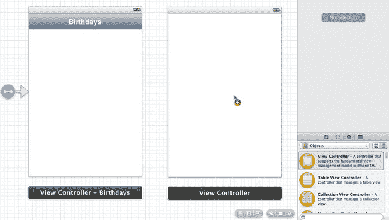

**图 5-4.** 添加新的视图控制器场景

你注意到新的视图控制器没有像我们的第一个视图控制器那样添加导航栏吗？那是因为我们还没有将它连接到我们的导航控制器。除了在视图切换时，导航控制器一次只显示其堆栈中的一个视图控制器：即位于顶部的那个。要将我们的新视图控制器推入导航控制器，我们需要创建一个*转场*连接。

#### 通过转场推入视图控制器

转场或 `UIStoryboardSegue` 是一个定义从一个视图控制器到另一个视图控制器的视觉过渡的对象。在你的第一个视图控制器上添加一个按钮，将其命名为 Push Birthday Detail View Controller（嗯，挺朗朗上口的！），然后通过按住 Control 键从该按钮拖拽到第二个视图控制器，创建一个从按钮到第二个视图控制器的转场（参见图 5-5）。

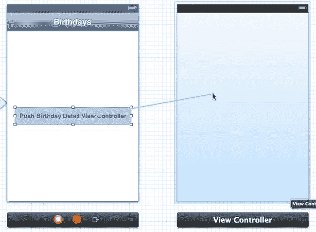

**图 5-5.** Control-拖拽以创建转场

一个上下文菜单会向你显示三种类型的转场：Push、Modal 和 Custom。选择 Push。Xcode 会自动将继承自我们导航控制器的导航栏添加到新的视图控制器，并显示一个指向第一个和第二个视图控制器之间的箭头，以指示新的转场连接（参见图 5-6）。

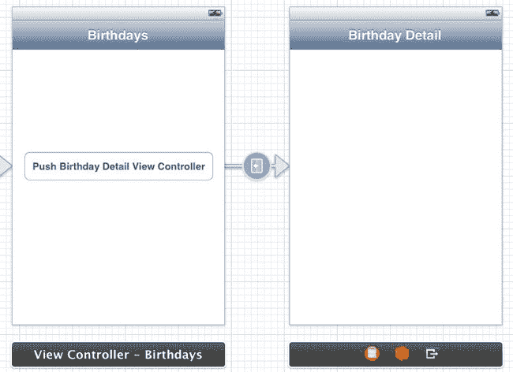

**图 5-6.** 新的转场连接

为第二个视图控制器添加标题：Birthday Detail。构建并运行你的应用。你应该能够使用第一个控制器上的按钮和第二个控制器上的动态生成的返回按钮，在第一个和第二个视图控制器之间导航。非常简单，对吧？


### 创建视图控制器类

至此，我们可以愉快地继续向故事板中添加新的视图控制器场景，并根据需要将它们与 Segue 连接起来。故事板会越来越庞大，但项目中不会新增任何 Objective-C 类。故事板有其局限性，如果我们无法在适当的时候为视图控制器添加特定代码，应用就会显得单调乏味。解决方案是创建 `UIViewController` 的子类，并通过身份检查器将其分配给故事板中的每个视图控制器。

在创建 `UIViewController` 的新子类之前，让我们先整理一下 Xcode 项目，将用户界面类与数据类分开。在访达中，于项目目录下创建一个名为 `user-interface` 的新文件夹，并在该文件夹内创建一个名为 `view-controllers` 的子文件夹。然后在 Xcode 中选择顶层的 `BirthdayReminder` 组，并将这些文件夹作为新分组添加到项目中：文件  添加到 "BirthdayReminder"（参见 图 5-7）。

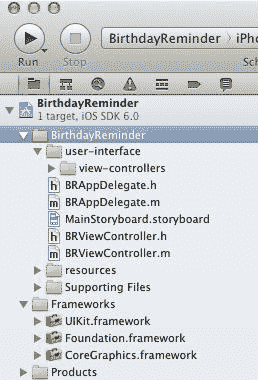

**图 5-7.** 保持项目整洁有序

在项目导航器中，选择新添加的 `view-controllers` 组，然后使用 N 快捷键或通过文件  新建  文件，从 Cocoa Touch 文件模板中选择 `Objective-C class` 选项。将新类命名为 `BRHomeViewController`，并将父类改为 `UIViewController`。如图 图 5-8 所示，取消勾选 "Targeted for iPad" 和 "With XIB for User Interface"。

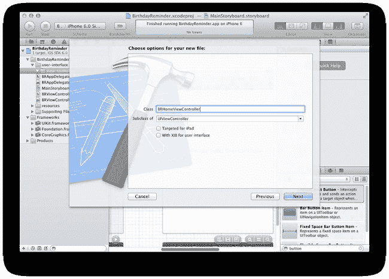

**图 5-8.** 创建 UIViewController 的子类

创建完 `BRHomeViewController` 的头文件和源文件后，重复此过程，再创建一个名为 `BRBirthdayDetailViewController` 的 `UIViewController` 子类。

现在，我们需要将新建的视图控制器子类连接到故事板中的两个视图控制器。为此，选择第一个视图控制器，通过身份检查器将其自定义类改为 `BRHomeViewController`（参见 图 5-9）。

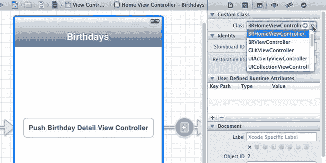

**图 5-9.** 设置首页视图控制器的自定义类

对生日详情视图控制器重复此操作，将其自定义类改为 `BRBirthdayDetailViewController`。

`BRViewController` 的头文件和源文件现在已是冗余文件。这是 Xcode 在最初创建项目时为我们生成的默认视图控制器类。默认情况下，`BRViewController` 被分配给了第一个视图控制器；我们刚刚修改了这一设置，将第一个视图控制器重新分配给了新的 `BRHomeViewController` 类。现在让我们清理项目，删除冗余的 `BRViewController` 头文件和源文件。在项目导航器中多选 `BRViewController.h` 和 `BRViewController.m` 文件，然后按下 Delete 键。接着，在弹出的对话框窗口中点击 "Move to Trash" 按钮（参见 图 5-10）。

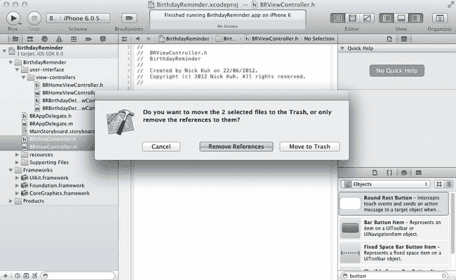

**图 5-10.** 删除冗余的 BRViewController 文件

### 视图与视图控制器的生命周期

要成为一名优秀的 iOS 程序员，理解视图和视图控制器的生命周期至关重要。在我们的应用中，当前有一个导航控制器负责管理子视图控制器及其视图的流程。当导航控制器从首页视图控制器跳转到详情视图控制器时，它会将首页视图移出屏幕，并将详情视图滑入屏幕。在此过程中，导航控制器会在我们的两个视图控制器子类中调用以下重要的视图控制器方法：

- `(void)viewWillAppear:(BOOL)animated;`
- `(void)viewDidAppear:(BOOL)animated;`
- `(void)viewWillDisappear:(BOOL)animated;`
- `(void)viewDidDisappear:(BOOL)animated;`

如果生日详情视图控制器被推入导航控制器，那么在其视图开始动画移出屏幕之前，首页视图控制器上会调用 `viewWillDisappear:` 方法。动画一完成，该视图会自动从视图层次结构中移除，并在首页视图控制器上调用 `viewDidDisappear:` 方法。

同样地，在生日详情视图控制器被动画推入导航控制器栈之前，会在该视图控制器上调用 `viewWillAppear:` 方法。一旦滑入推行动画完成，便会触发 `viewDidAppear:` 方法。

当点击返回按钮时，生日详情视图控制器会从导航栈中弹出。该视图控制器会先收到 `viewWillDisappear:` 回调，紧接着是 `viewDidDisappear:`。

让我们亲自尝试一下。用以下代码替换 `BRBirthdayDetailViewController.m` 源文件的当前实现：

```
#import "BRBirthdayDetailViewController.h"

@implementation BRBirthdayDetailViewController

-(id) initWithCoder:(NSCoder *)aDecoder
{
    self = [super initWithCoder:aDecoder];
    if (self) {
        NSLog(@"initWithCoder");
    }
    return self;
}

-(void) dealloc
{
    NSLog(@"dealloc");
}

-(void) viewDidLoad
{
    [super viewDidLoad];
    NSLog(@"viewDidLoad");
}

-(void) viewWillAppear:(BOOL)animated
{
    [super viewWillAppear:animated];
    NSLog(@"viewWillAppear");
}

-(void) viewDidAppear:(BOOL)animated
{
    [super viewDidAppear:animated];
    NSLog(@"viewDidAppear");
}

-(void)viewWillDisappear:(BOOL)animated
{
    [super viewWillDisappear:animated];
    NSLog(@"viewWillDisappear");
}

-(void)viewDidDisappear:(BOOL)animated
{
    [super viewDidDisappear:animated];
    NSLog(@"viewDidDisappear");
}

@end
```

*注意：覆写 `UIViewController` 的方法时，务必调用父类的实现，以避免运行时出现任何问题。*

构建并运行项目，在推入和弹出 `BRBirthdayDetailViewController` 时查看调试日志。

请熟悉这些方法的调用顺序。新代码中还有一些其他的视图控制器方法，你也应当了解。

#### `viewDidLoad`

`viewDidLoad` 是 `UIViewController` 的所有子类中，在其主视图首次加载时触发的方法；此时，视图控制器代码中的任何故事板输出口都已可用。但请注意 `viewDidLoad`。它并不是视图控制器的初始化方法。实际上，在视图控制器的生命周期内，`viewDidLoad` 可能会被多次调用。如果系统内存不足，`UIViewController` 实例的默认行为是释放不在屏幕上的视图。如果系统触发了内存警告，且当前屏幕显示的是生日详情视图，那么 `BRHomeViewController` 的视图被移除是完全合理的。但请注意，内存警告不会将 `BRHomeViewController` 实例从导航栈中移除，只会移除其视图。如果用户随后导航回首页视图控制器，iOS 会从故事板中重建首页视图，并且首页视图控制器上的 `viewDidLoad` 会被第二次调用。

*提示：`viewDidLoad` 是访问 Interface Builder 输出口的第一个时机。因此，当调用 `viewDidLoad` 时，你应该执行所有视图自定义代码。*


#### 视图控制器初始化方法

在整个生命周期中由视图控制器持有的模型数据，最佳创建时机是在实例化时，而非调用 `viewDidLoad` 的时候。iOS 新手程序员常犯的错误，就是在 `viewDidLoad` 方法里初始化所有内容。

接入 `UIViewController` 的初始化方法并不像看起来那么直观。有两个重要的初始化方法需要了解：`initWithNibName:bundle:` 和 `initWithCoder:`。通常，视图控制器要么通过 NIB/XIB 文件进行初始化，要么通过故事板文件进行初始化。在 *Birthday Reminder* 中，我们将始终使用故事板进行所有初始化，因此在实例化模型或映射字典时，应该接入的是 `initWithCoder:` 初始化方法。

## `dealloc`

`dealloc` 是任何 `NSObject` 子类实例在从内存释放前调用的最后一个方法。因此你可以看到，当你将生日详情视图控制器从导航栈中弹出时，它会被 iOS 丢弃而不再持有，从而使我们应用的内存占用保持在最低水平。

得益于 ARC，对属性 iVar 的所有强引用都会自动释放，因此不再需要直接在 `dealloc` 中将 iVar 设为 `nil`。在 ARC 和 iOS 5 出现之前，这曾是导致内存泄漏的主要原因。

**注意：** 编译器不允许直接调用 `[super dealloc]`。但你完全可以保证，`dealloc` 会被继承树中所有 `NSObject` 的子类所调用。

### 导航视图控制器

在接下来的上午时间里，我们将加快速度实现应用的导航功能。你将学习如何用栏按钮项填充导航栏和工具栏，以及如何在应用中呈现和关闭模态视图控制器。

今天上午我们将继续使用故事板，并发现通过 Xcode 故事板的所见即所得拖放 UI，构建 *Birthday Reminder* 导航层级是多么简单。

### 栏与栏按钮项

导航栏和工具栏出现在成千上万的 iPhone 和 iPad 应用中。正如我们将在第 9 章中学到的，它们易于定制，并且 iOS 用户能立即识别。

你将在本章剩余部分发现，在 iOS 中用按钮填充导航栏和工具栏非常容易——这些按钮不是我们之前使用的标准按钮，而是 iOS 中的一种称为**栏按钮项**（`UIBarButtonItem`）的组件。

#### 导航栏

导航栏位于屏幕顶部，通常包含一个标题和栏按钮项：在居中标题的左侧和右侧各有一个或多个按钮。默认情况下，由导航控制器控制的导航栏会自动在标题左侧显示一个返回按钮项，使用户能够轻松地通过他们在应用层级中深入浏览的一系列屏幕返回。

我们的导航控制器标配包含一个导航栏（`UINavigationBar`）。我们已经知道如何通过故事板修改导航中每个视图控制器的标题。现在，让我们在主视图导航栏上添加几个栏按钮项。操作简单，只需将它们从对象库拖到导航栏的左侧和右侧即可（参见图 5-11）。

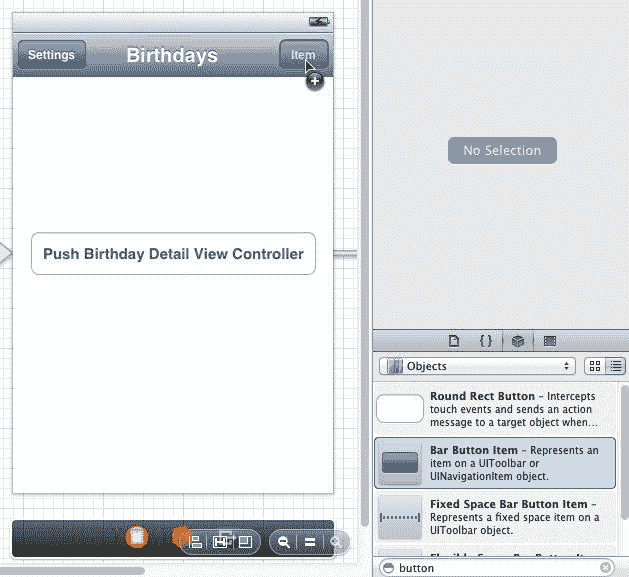

**图 5-11.** 向导航栏添加栏按钮项

栏按钮项（`UIBarButtonItem`）与常规按钮（`UIButton`）不同；它们只能存在于导航栏和工具栏中。栏按钮项可以显示文本标题、图像图标或自定义视图。当我们进入第 9 章讨论外观皮肤时，会探索这些选项。现在，我们将坚持使用文本，因此为左侧按钮输入**设置**，为右侧按钮输入**添加生日**。

**注意：** 在早期版本的 iOS 中，导航栏仅限于三个项目：一个标题以及单个左侧和右侧栏按钮项。在 iOS 5 和 6 中，我们有更多的灵活性。我们可以添加多个左侧和右侧栏按钮项，但由于空间限制，在 iPhone 上我不建议每侧超过一个项目。

#### 工具栏

我们已经知道，当我们将视图控制器嵌入导航控制器时，会自动生成一个导航栏。导航控制器还免费附带一个工具栏。默认情况下，它是隐藏的，但我们可以更改这一点。选择导航控制器，然后打开“显示工具栏”选项（参见图 5-12）。瞧！所有视图控制器的工具栏都出现了！

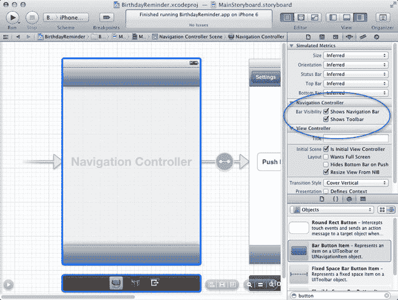

**图 5-12.** 通过导航控制器开启工具栏

现在，导航栈中的所有视图控制器都将继承父导航控制器的工具栏。这正是我们希望主视图拥有的，但详情视图除外。解决这个问题很简单。在故事板中选择详情视图控制器，然后打开“推送时隐藏底部栏”属性。构建并运行，你应该会看到第一个视图有工具栏，而第二个视图没有。

现在，为主视图控制器（Home view controller）的工具栏添加一些栏按钮项。在故事板中选择主视图控制器，然后从对象库中拖入两个栏按钮项实例。分别将它们命名为“通讯录”和“Facebook”。注意工具栏与导航栏的不同之处：新的栏按钮项向左对齐，而不是像导航栏标题那样分布在两侧。我们可以通过添加三个灵活间距栏按钮项实例来使这两个按钮居中（参见图 5-13）。

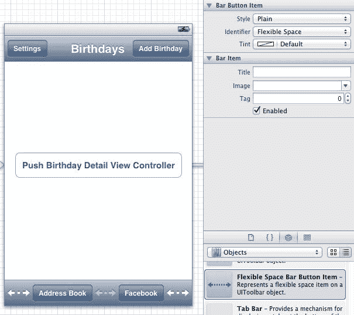

**图 5-13.** 使工具栏栏按钮项居中


#### 呈现模态视图控制器

在本章前面，我们学习了如何使用视图控制器和转场过渡*推入*一个视图控制器到导航控制器栈中。另一种改变当前可见视图控制器的常见方法是通过*呈现*一个模态视图控制器。

模态视图控制器不会添加到导航栈中，而是放置在顶层视图控制器之前：在*Birthday Reminder*应用中，它被放置在导航控制器本身的前面。

现在我们即将呈现一个新的 `Edit Birthday` 视图控制器，当用户添加或编辑生日时，它会在应用中显示。设置并呈现模态视图控制器的过程与设置并推入新视图控制器非常相似。首先，从对象库中拖拽一个新的视图控制器实例到故事板。你可以将新的故事板场景放置在任何你喜欢的位置，但为了保持项目组织有序，请将新的 `Edit Birthday` 视图控制器放置在 `Birthday Detail` 视图控制器的上方。

现在创建一个新的转场过渡，并将新的视图控制器连接到我们的层级结构中。从 `Birthday Detail` 视图中的 `Add Birthday` 按钮按住 Control 键拖拽到新的 `Edit Birthday` 视图控制器。在故事板转场的选择中，这次选择 `Modal`。结果应如图 5-14 所示。

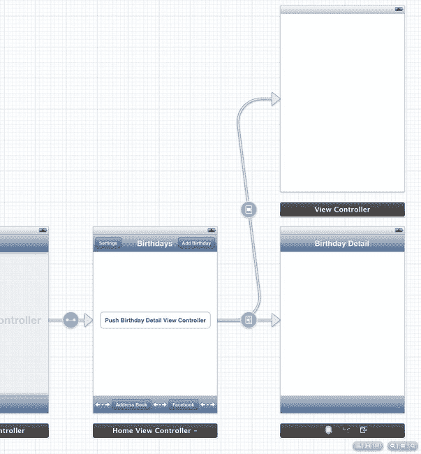

**图 5-14.** 创建模态转场

尝试构建并运行。当点击 `Add Birthday` 按钮时，你应该会看到新视图控制器从屏幕底部动画呈现。你认为为什么新视图不像应用中其他视图那样有导航栏？因为新的模态视图控制器没有导航控制器作为其父容器：它只是简单地呈现在现有导航的前面。为了解决这个问题，我们需要将 `Edit Birthday` 视图控制器放入它自己的导航控制器中。我们之前做过这个操作。只需选择新的 `Edit Birthday` 视图控制器，然后从 Xcode 菜单中选择：`Editor`  `Embed In`  `Navigation Controller`。`Edit Birthday` 视图控制器会在故事板中滑动，为新添加的导航控制器腾出空间（见图 5-15）。

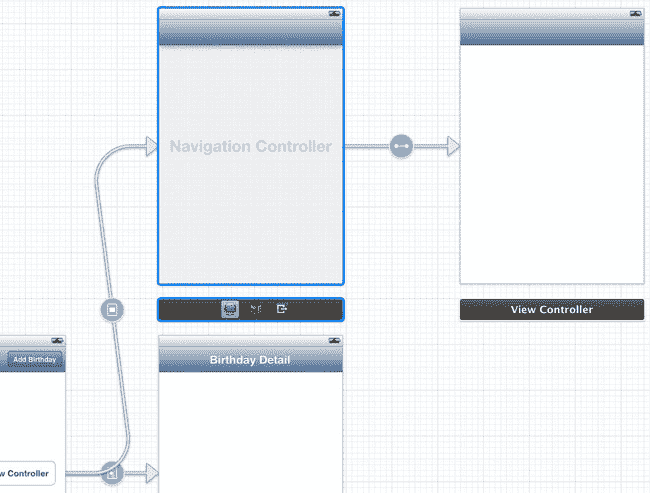

**图 5-15.** 模态呈现的导航控制器

Xcode 足够智能，会将 `Edit Birthday` 视图控制器替换为其新的导航控制器。这个导航控制器成为了点击 `Add Birthday` 时实际呈现的视图控制器。在故事板中，再次选择 `Edit Birthday` 视图控制器，输入标题 `Edit Birthday`，并在标题两侧添加 `Cancel` 和 `Save` 栏按钮项（见图 5-16）。

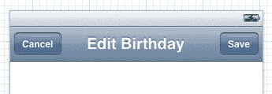

**图 5-16.** `Edit Birthday` 栏按钮项和标题

### 关闭模态视图控制器

现在我们遇到了一个小障碍：当点击 `Cancel` 按钮时，我们如何关闭模态导航控制器？答案不是从 `Cancel` 按钮拖拽一个新的转场到根导航控制器。你可以这样做来创建一个新转场，但结果是故事板会创建一个根视图控制器的副本，并将其推入或呈现在现有模态视图控制器的顶部。这不是我们想要的结果。

有两种方法可以关闭我们的模态视图控制器，这两种方法都需要我们编写代码。让我们逐步了解选项 1，即创建一个*展开转场*（iOS 6 新增）。

##### 展开转场

只要在你希望展开（导航回）到的视图控制器中创建了一个*展开动作*，就可以在故事板中创建展开转场。编译器通过以下方法签名格式来识别展开动作：

`-(IBAction)unwindActionMethodName:(UIStoryboardSegue *)segue;`

方法名可以是任何我们喜欢的名称，只要它符合这个签名格式。在我们的应用中，当点击 `Cancel` 按钮时，我们希望展开回 `Home` 视图控制器，所以我们要在那里声明并实现一个展开动作。

将以下方法声明添加到 `BRHomeViewController.h` 中：

`-(IBAction)unwindBackToHomeViewController:(UIStoryboardSegue *)segue;`

切换到 `BRHomeViewController.m` 源文件并实现展开动作：

```
-(IBAction)unwindBackToHomeViewController:(UIStoryboardSegue *)segue
{
    NSLog(@"unwindBackToHomeViewController!");
}
```

回到故事板中，聚焦于 `Edit Birthday` 视图控制器，从 `Cancel` 按钮按住 Control 键拖拽到 Exit 视图控制器下方和右侧的 Exit 图标。应该会弹出一个上下文菜单，让你选择 `unwindBackToHomeViewController:` 展开动作，如图 5-17 所示。你刚刚创建了一个展开转场！

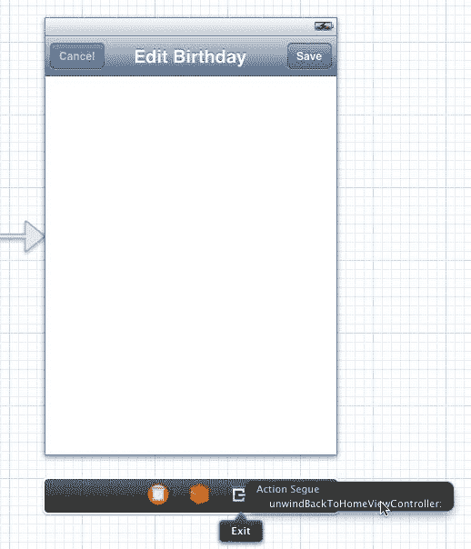

**图 5-17.** 创建展开转场

构建并运行。现在当你点击 `Cancel` 栏按钮项时，应该能够关闭模态呈现的 `Edit Birthday` 视图控制器。

当执行展开转场时，iOS 会自动将现有的视图控制器展开到拥有展开动作的视图控制器。这就是为什么我们不必编写任何执行代码来处理关闭模态视图控制器的原因。但等等，如果我们想用代码关闭模态视图控制器呢？很高兴你问到这个问题！

#### 用代码关闭模态视图控制器

在你的故事板中，删除你刚刚创建的退出转场。为此，按住 Control 键点击 `Cancel` 按钮，然后点击 `unwindBackToHomeViewController:` 动作旁边的 X 按钮。

现在为你的 `Edit Birthday` 场景创建一个新的视图控制器子类，命名为 `BRBirthdayEditViewController`，并使用身份检查器将其分配到故事板上的 `Edit Birthday` 视图。如果你需要帮助，请翻回本章的“创建视图控制器类”部分查看逐步说明。

使用助理编辑器布局，从 `Cancel` 按钮按住 Control 键拖拽到 `BRBirthdayEditViewController.h` 头文件，创建一个名为 `cancelAndDismiss` 的新 `action`（见图 5-18）。

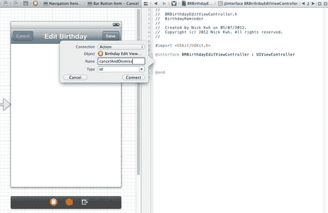

**图 5-18.** 添加 `cancelAndDismiss:` 动作

切换到在 `BRBirthdayEditViewController.m` 源文件中实现新的 `cancelAndDismiss:` 动作，我们通过调用 `UIViewController` 的 `dismissModalViewControllerAnimated:completion:` 方法来关闭模态视图控制器。

```
- (IBAction)cancelAndDismiss:(id)sender {
    NSLog(@"Cancel!");
    [self dismissViewControllerAnimated:YES completion:^{
        //我们放在这个块中的任何代码
        //都将在视图控制器被关闭后运行
        NSLog(@"Dismiss complete!");
    }];
}
```

在 Objective-C 中，块是一段像变量一样传递的代码。`UIViewController` 的 `dismissModalViewControllerAnimated:completion:` 方法的第二个参数就是一个块。当关闭动画完成时，我们的代码块就会执行。

构建并运行。你应该能够关闭 `Birthday Edit` 视图控制器，并看到 `Cancel!` 和 `Dismiss Complete!` 调试日志之间的延迟。

但是，如果我们想在应用中呈现其他模态视图控制器呢？我们最终将不得不将 `cancelAndDismiss:` 方法复制粘贴到其他视图控制器子类中。重复代码对于一个优秀的程序员来说从来都不是好事！幸运的是，Objective-C 是一种面向对象的语言，所以我们可以通过继承和子类化来解决这个问题。


### 子类化：创建核心视图控制器

现在我们的项目中有了三个自定义视图控制器。每个视图控制器都是苹果 `UIViewController` 类的子类。接下来我要介绍一个非常实用的技巧：我们可以创建一个 `UIViewController` 的核心子类，然后调整所有独立的视图控制器类，让它们继承这个核心视图控制器，而不是直接继承 `UIViewController`。这样做的好处是，我们可以将公共/共享的方法和属性添加到核心视图控制器类中，而所有独立的视图控制器将自动继承这些方法和属性。

有点困惑？还是觉得完全合理？等我们进入代码环节后，一切就会变得更清晰。

首先，创建新的核心视图控制器类。在项目导航器中选择 `view-controllers` 组，然后依次点击 File  New  File，从 Cocoa Touch 文件模板中选择 Objective-C 类选项。将新类命名为 `BRCoreViewController`，并确保父类设置为 `UIViewController`。

将以下两个 Interface Builder 操作方法签名直接输入到 `BRCoreViewController.h` 头文件中：

```
#import <UIKit/UIKit.h>

@interface BRCoreViewController : UIViewController

- (IBAction)cancelAndDismiss:(id)sender;
- (IBAction)saveAndDismiss:(id)sender;

@end
```

切换到 `BRCoreViewController.m`，开始删除 Xcode 从文件模板中添加的所有默认方法代码，并用以下实现替换：

```
#import "BRCoreViewController.h"

@interface BRCoreViewController ()

@end

@implementation BRCoreViewController

- (void)viewDidLoad
{
    [super viewDidLoad];
    self.view.backgroundColor = [UIColor grayColor];
}

- (IBAction)cancelAndDismiss:(id)sender
{
    NSLog(@"Cancel");
    [self dismissViewControllerAnimated:YES completion:^{
        //视图控制器解除动画完成
    }];
}

- (IBAction)saveAndDismiss:(id)sender
{
    NSLog(@"Save");
    [self dismissViewControllerAnimated:YES completion:^{
        //视图控制器解除动画完成
    }];
}

@end
```

除了 `cancelAndDismiss:` 和 `saveAndDismiss:` 这两个操作方法外，我们还通过 `viewDidLoad` 方法将视图的背景色设置为灰色；这样一来，任何 `BRCoreViewController` 的子类都会自动继承这段代码，并将自己的视图背景设为灰色。非常巧妙！

打开我们已经创建的视图控制器的头文件：`BRHomeViewController.h`、`BRBirthdayDetailViewController.h` 和 `BRBirthdayEditViewController.h`。目前这三个类都直接继承自 `UIViewController`。请修改它们，使其分别继承自 `BRCoreViewController`：

对于 `BRHomeViewController.h`：

```
#import <UIKit/UIKit.h>
#import "BRCoreViewController.h"

@interface BRHomeViewController : BRCoreViewController

@end
```

对于 `BRBirthdayDetailViewController.h`：

```
#import <UIKit/UIKit.h>
#import "BRCoreViewController.h"

@interface BRBirthdayDetailViewController : BRCoreViewController

@end
```

对于 `BRBirthdayEditViewController.h`：

```
#import <UIKit/UIKit.h>
#import "BRCoreViewController.h"

@interface BRBirthdayEditViewController : BRCoreViewController
- (IBAction)cancelAndDismiss:(id)sender;

@end
```

请注意，我们还应该从 `BRBirthdayEditViewController.h` 中删除 `cancelAndDismiss:` 操作方法，因为该操作现在由父类 `BRCoreViewController` 处理。切换到 `BRBirthdayEditViewController.m`，删除 `cancelAndDismiss:` 的整个实现。

我们还没有将生日编辑视图中的“保存”按钮连接到新添加的 `saveAndDismiss:` 操作。从“保存”按钮按住 Control 键拖动到其视图控制器的所有者，如图 Figure 5-19 所示。系统会提示你所有 Interface Builder 的出口和操作连接。选择 `saveAndDismiss` 操作。你是否看到了它是如何从核心视图控制器继承而来的？

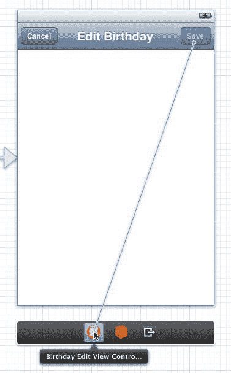

**图 5-19.** 将“保存”栏按钮项连接到 `saveAndDismiss:` 操作

构建并运行（参见 Figure 5-20）。嘿，每个视图都变成灰色了吗？！现在你应该（希望如此）恍然大悟了。通过利用添加核心视图控制器子类的方式，我们只需在一个地方——核心视图控制器类的代码中——就能修改所有继承核心视图控制器的视图控制器的每个实例。目前，每个视图控制器都继承了灰色背景视图颜色的设置代码。你能看出我们如何将这一技巧进一步扩展到 *Birthday Reminder* 中吗？在我们设计中，所有视图都有自定义的背景图片，就像启动画面一样的棋盘格背景。在一个方便的位置，我们将能够为应用中所有继承核心视图控制器的视图添加此背景图片。我们会在关于界面皮肤化的章节中实现这个功能，但现在，我们还有一堆场景需要添加到故事板中。

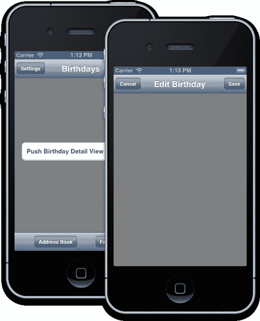

**图 5-20.** 视图控制器子类化的好处——如果你喜欢灰色的话

我们的编辑生日视图控制器既用于添加生日也用于编辑生日。因此，我们将创建第二个到编辑生日导航控制器的 Segue 连接。在生日详情导航栏的右侧添加一个编辑栏按钮项，然后从新按钮按住 Control 键拖动到编辑生日导航控制器。从故事板 Segue 转换选项中选择 Modal（参见 Figure 5-21）。

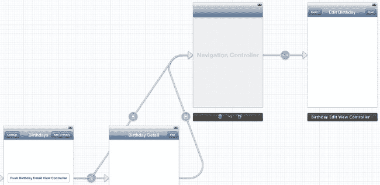

**图 5-21.** 到编辑生日导航控制器的多个 Segue 连接


#### 添加备注视图控制器

当用户在“生日详情”视图中查看好友的生日时，他们将能够编辑好友的备注，例如礼物建议。作为一般规则，我建议在应用程序允许用户编辑或添加数据时，使用模态视图控制器。这种技术能够清晰区分“查看已保存数据”与“编辑已保存数据”两种操作。

在故事板中，于“生日详情”场景右侧添加一个新的视图控制器场景。由于我们将以模态方式呈现新的备注编辑视图控制器，我们需像处理“编辑生日”视图控制器一样，将其嵌入到自己的导航控制器中。选中新视图控制器，在菜单栏中选择`Editor` -> `Embed In` -> `Navigation Controller`。现在，将新的备注视图控制器标题命名为`编辑备注`，并像处理“编辑生日”视图控制器那样添加“取消”和“保存”按钮（参见图 5-22）。

从对象库中拖拽一个“圆角矩形按钮”（注意不要与栏按钮项混淆）到“生日详情”视图中，并将其标题设置为`编辑备注`。

新的视图控制器和导航控制器应类似于图 5-22。

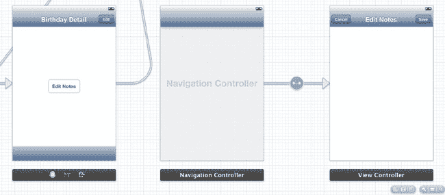

**图 5-22.** 添加备注视图

现在，通过按住 Control 键从“编辑备注”按钮拖拽到新的导航控制器，来连接新的视图控制器与模态转场。选择`Modal`选项。

接下来，为“编辑备注”场景创建一个视图控制器类。在`view-controllers`组中创建并添加一个新类，命名为`BRNotesEditViewController`。这次，我们不继承`UIViewController`，而是直接继承`BRCoreViewController`（参见图 5-23）。

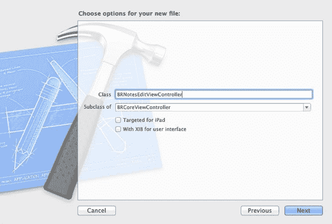

**图 5-23.** `BRNotesEditViewController` 继承自 `BRCoreViewController`

回到故事板，选中新的“编辑备注”视图控制器，使用身份检查器将自定义类更改为`BRNotesEditViewController`。然后，按住 Control 键从“取消”和“保存”栏按钮项拖拽，分别创建界面生成器连接到所属视图控制器的`cancelAndDismiss:`和`saveAndDismiss:`动作方法。

构建并运行，确认现在可以打开并关闭新的“编辑备注”视图控制器。

#### 翻转至设置视图

让我们继续构建视图控制器导航网络。在故事板中，“生日详情”视图控制器下方添加一个新的视图控制器。将其嵌入导航控制器。添加标题`设置`，并在标题右侧添加一个“完成”栏按钮项（参见图 5-24）。

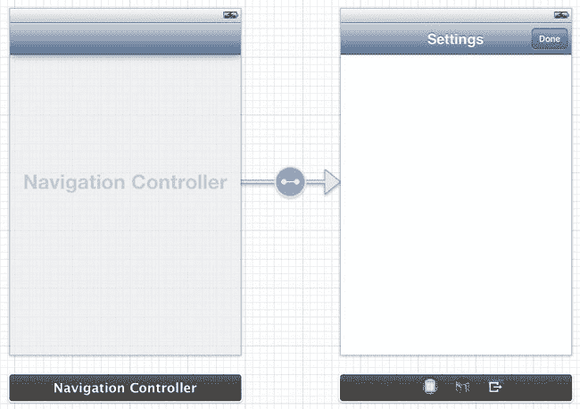

**图 5-24.** 嵌入导航控制器的新“设置”视图控制器

按住 Control 键从主页视图上的“设置”栏按钮项拖拽到“设置”导航控制器，创建一个新的模态转场连接。

iOS SDK 在推送和呈现视图控制器时内置了多种转场动画选项。我们不使用默认的从屏幕底部滑入动画，而是将新转场设置为翻转进入“设置”导航控制器。如图 5-25 所示，您可以点击并选中该新转场，然后使用属性检查器将`Transition`设置更改为`Flip Horizontal`。

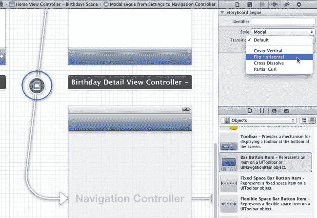

**图 5-25.** 将模态转场的过渡样式更改为`Flip Horizontal`

构建并运行——然后试试看（双关语，意为“试试它的旋转效果”）。

为了关闭“设置”视图控制器，我们需要在`view-controller`组中添加一个`BRCoreViewController`子类，并命名为`BRSettingsViewController`。然后，在故事板中选中“设置”视图控制器，使用身份检查器指定新的`BRSettingsViewController`类。接着，按住 Control 键将“完成”按钮拖拽连接到视图控制器的`saveAndDismiss:`动作方法。

在我们处理“设置”视图控制器的同时，让我们再添加一个由“设置”场景链接的视图控制器。新的通知时间视图控制器允许用户更改生日提醒的默认通知时间。

首先，在“设置”视图中添加一个“圆角矩形按钮”，并将其标题设置为`设置提醒时间`。然后，在“设置”场景右侧添加一个新的视图控制器场景。将其标题设置为`提醒时间`，接着按住 Control 键从“设置提醒时间”按钮拖拽到新添加的视图控制器，创建一个推送转场。这应该会为新的视图控制器添加一个模拟导航栏。输入标题`提醒时间`，如图 5-26 所示。

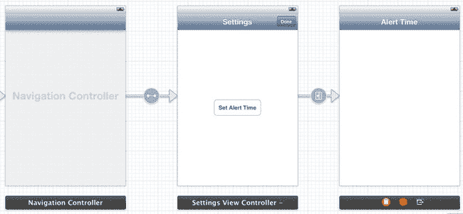

**图 5-26.** 将视图控制器推送到模态呈现的“设置”视图控制器上

按照目前所有视图控制器的做法，我们创建另一个`BRCoreViewController`的子类，命名为`BRNotificationTimeViewController`。在故事板中选中通知时间视图控制器，使用身份检查器指定新创建的`BRNotificationTimeViewController`类。

构建并运行。如果所有视图显示为灰色，则说明视图控制器类的关联已按预期生效。

### 总结

本章我们取得了长足的进步。

我们探索了如何使用 Xcode 的拖放式故事板技术构建复杂的导航层级。您现在应该熟悉故事板的局限性：我们需要继承`UIViewController`并将子类分配给故事板视图控制器，才能对用户界面进行任何有趣的操作。

我们提到了添加共享核心视图控制器的好处。随着应用程序的增长，项目中的视图和视图控制器数量也会增加。通过使用核心视图控制器方法，您可以集中管理许多可重用的方法和属性。除了编写更少代码的好处外，这意味着错误可以在一个地方解决，而无需在每个视图控制器类中修复。视图的皮肤化也变成了集中化的流程：更清晰、更易于管理，正如我们将在第 9 章中看到的那样。

#### 一项挑战

这里有一个挑战来测试您新学到的故事板知识。使用`Single View Application` Xcode 项目模板从头构建一个新应用。将默认视图控制器嵌入导航控制器。添加一个按钮或栏按钮项，将另一个视图控制器推送到第一个视图控制器上。最后，尝试创建一个可被关闭的模态呈现视图控制器。请告诉我效果如何。


## 第 6 章

## 视图、控件、相机、行动！

现在，是时候开始使用用户界面控件并学习如何处理视图交互了。今天剩下的时间里，我们将开发编辑生日、编辑备注和通知时间视图的用户界面。这三个目标视图使用了 iOS SDK 中的多个控件（如日期选择器、开关和文本字段），我们将把它们添加到视图中，并编写代码来处理控件交互。

到本章结束时，我们将进一步使用手势识别器来捕捉手指交互事件。我们甚至将学习如何直接在应用中使用 iPhone 的相机和照片库。这里有很多东西要学，所以我们最好现在就开始！


### 用户界面控件与组件

作为开发者，在视图上添加用户界面实例组件时有两种选择：通过代码创建并添加，或通过拖放操作添加到 nib 文件和 Storyboard 文件中。在开发*生日提醒*应用的过程中，我们主要采用更简单的拖放方式，直接在 Storyboard 文件中设计用户界面。

随着你成长为更资深的 iOS 开发者，你可能会发现有些时候通过代码创建组件是更好或唯一的选择。Storyboard 永远有其局限性。不过，对于*生日提醒*应用来说，绝大多数用户界面设计和布局都能完美地通过 Storyboard 实现。

### 编辑生日视图：日期选择器、开关和文本字段

在 Xcode 中打开你的*生日提醒*项目，选择编辑生日视图，然后从对象库中向该视图添加以下每个组件的一个实例（参见图 6-1）。使用尺寸检查器设置列出的位置和尺寸值。

> * 一个文本字段（`UITextField`）：x=89，y=22，宽度=221。
> * 一个标签（`UILabel`）：将文本改为**包含年份**，然后定位并设置尺寸（x=125，y=165，宽度=99，高度=27）。
> * 一个开关（`UISwitch`）：x=231，y=165。
> * 一个日期选择器（`UIDatePicker`）：x=0，y=200，宽度=320。

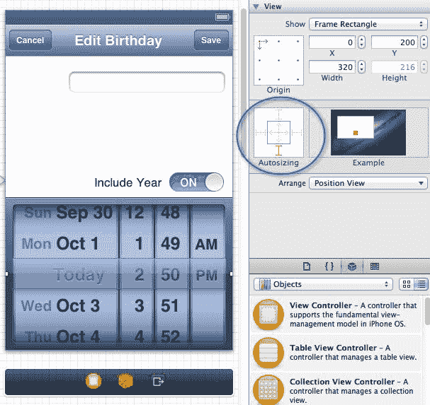

**图 6-1.** 已填入文本字段、标签、开关和日期选择器的编辑生日视图

根据我们目前对该视图的实现，日期选择器、“包含年份”标签和开关会悬浮在较长的 iPhone 5 屏幕上 88 点高的空白区域上方。然而，通过使用自动调整尺寸，我们可以改变这一情况，强制这些组件固定对齐到用户界面的底部。在这三个组件上，通过修改图 6-1 所示的自动尺寸蒙版值，将下边距设置为固定。依次选中每个组件以应用新的自动调整尺寸值。

接下来，我们要在 `BRBirthdayEditViewController` 中为四个新的用户界面组件创建界面构建器（Interface Builder）输出口，并为“保存”栏按钮项创建一个输出口。

确保在你的 Storyboard 中选中了“编辑生日”视图控制器场景，隐藏右侧的检查器面板，并将 Xcode 切换到助理编辑器模式（参见图 6-2）。

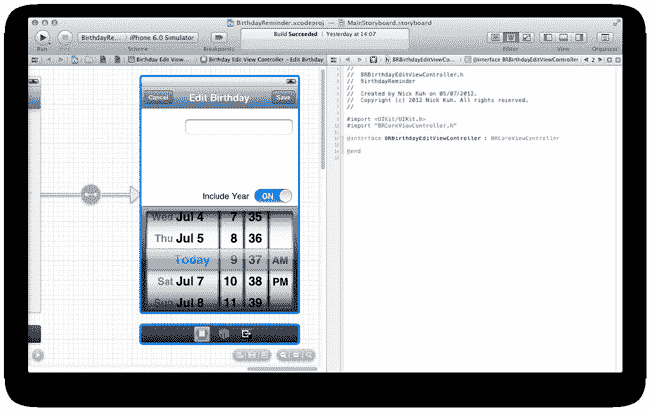

**图 6-2.** Xcode 的助理编辑器布局：非常适合创建界面构建器连接

按住 Control 键从“保存”栏按钮项、名称文本字段、年份标签、开关和日期选择器拖拽，在 `BRBirthdayEditViewController.h` 头文件中创建五个弱引用输出口，名称分别为：`saveButton`、`nameTextField`、`includeYearLabel`、`includeYearSwitch` 和 `datePicker`。最终结果会向头文件添加如下代码：

```objc
#import <UIKit/UIKit.h>
#import "BRCoreViewController.h"

@interface BRBirthdayEditViewController : BRCoreViewController

@property (weak, nonatomic) IBOutlet UIBarButtonItem *saveButton;
@property (weak, nonatomic) IBOutlet UITextField *nameTextField;
@property (weak, nonatomic) IBOutlet UILabel *includeYearLabel;
@property (weak, nonatomic) IBOutlet UISwitch *includeYearSwitch;
@property (weak, nonatomic) IBOutlet UIDatePicker *datePicker;

@end
```

#### 配置文本字段并响应文本变化

回到 Storyboard 中，让我们为名称文本字段设置几个属性。选中该文本字段，使用属性检查器，首先输入占位文本 **名称**。当文本字段为空时，占位文本会以浅灰色显示。这是一种极好的方式来提示用户输入文本，而无需在文本输入字段上方或旁边添加另一个标签。

将清除按钮属性更改为“编辑时出现”。这会让 iOS 在文本字段内部右侧显示一个方便的 X 按钮，以便用户只需轻点一下即可轻松清除名称文本并输入新名称。

##### 隐藏键盘

我们要修改的最后一个属性是回车键。将默认值更改为“完成”。当用户轻点名称文本字段并开始输入文本时，键盘会自动出现，覆盖日期选择器。我们需要考虑到这一点，并确保为用户提供关闭键盘并修改生日日期的方法。通过将回车键值更改为“完成”，我们向用户提示轻点回车键将关闭键盘。要在文本字段的回车按钮被轻点时关闭键盘，需要我们的视图控制器订阅为文本字段的委托。

在 `BRBirthdayEditViewController.h` 头文件中，我们必须声明此类实现了 `UITextFieldDelegate` 协议：

```objc
@interface BRBirthdayEditViewController : BRCoreViewController <UITextFieldDelegate>
```

现在，在 Storyboard 中按住 Control 键从文本字段拖拽到视图控制器，以将“编辑生日”视图控制器指定为文本字段的委托（参见图 6-3）。从弹出的输出口列表中选择“Delegate”。

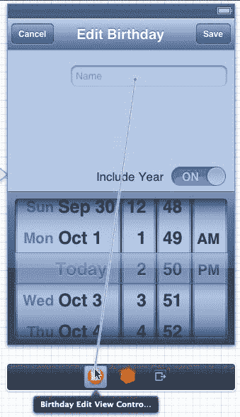

**图 6-3.** 从文本字段按住 Control 键拖拽到视图控制器以连接委托输出口

`UITextFieldDelegate` 协议中没有必须实现的方法，所以此时编译器应该不会报错或警告。不过，如果我们要捕捉用户轻点“完成”按钮的操作，就需要将 `textFieldShouldReturn:` `UITextFieldDelegate` 方法添加到视图控制器类中。在 `BRBirthdayEditViewController.m` 源文件中添加以下代码：

```objc
#pragma mark UITextFieldDelegate

- (BOOL)textFieldShouldReturn:(UITextField *)textField
{
    [self.nameTextField resignFirstResponder];
    return NO;
}
```

你不需要添加 pragma 标记，但这是一个划分代码区块并保持整洁的便捷方法：我喜欢保持井井有条！Pragma 标记会被 Xcode 的跳转栏识别并高亮显示，以帮助你浏览类方法和属性组：聪明的注释。

在 iOS 中，设置和移除可编辑文本组件的焦点分别通过 `becomeFirstResponder` 和 `resignFirstResponder` 方法实现。构建并运行你的应用。你现在应该会发现，轻点名称文本字段会自动弹出一个带有“完成”按钮的键盘，并且轻点“完成”会关闭键盘。

##### 跟踪并响应文本变化

现在来跟踪用户何时在名称文本字段中输入或清除文本。就像所有其他按钮和控件组件一样，`UITextField` 是 `UIControl` 的子类。任何 `UIControl` 的子类都实现了目标-动作设计模式。我们将视图控制器设置为文本字段的目标，指定我们想要响应哪个动作事件，以及当该事件发生时调用我们类的选择器方法。

通过从文本字段拖拽到 `BRBirthdayEditViewController.h` 头文件接口，创建一个界面构建器动作连接。将连接类型更改为 Action，输入名称 `didChangeNameText`，并将事件类型更改为 Editing Changed（参见图 6-4）。点击 Connect！

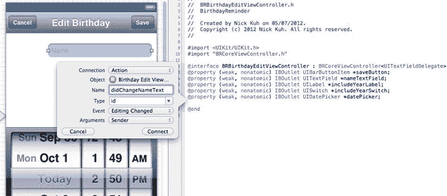

**图 6-4.** 创建用于检测文本编辑变化的动作

Xcode 应该会生成我们的 `didChangeNameText:` 动作方法签名：

```objc
- (IBAction)didChangeNameText:(id)sender;
```

切换到 `BRBirthdayEditViewController.m`，为该方法输入以下实现代码：

```objc
- (IBAction)didChangeNameText:(id)sender {
    NSLog(@"文本已被更改: %@",self.nameTextField.text);
}
```

构建并运行。当你在名称字段中输入和修改文本时，你应该会在调试面板中看到你的更改被打印出来。太棒了！


##### 启用和禁用保存按钮

更好的用户体验通常意味着更少的选择，保持事情简洁。我们不希望用户在没有提供姓名的情况下尝试保存新增或编辑的生日信息。当保存条件未全部满足时显示警告消息错误是一种不必要的、带有攻击性的用户体验（参见图 6-5）。

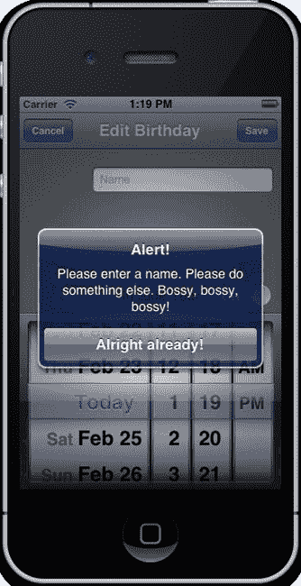

**图 6-5.** 警告视图并非总是最佳解决方案。

另一种（在我看来更好的）解决方案是禁用保存栏按钮项，并在用户向姓名文本字段中输入一个或多个字符后自动启用它。我们首先在 `BRBirthdayEditViewController.m` 中添加一个私有方法，用于检查是否已输入文本，并相应地启用或禁用保存按钮。在 `BRBirthdayEditViewController.m` 中添加一个名为 `updateSaveButton` 的新方法。我们不会在头文件中声明 `updateSaveButton` 的方法签名，因为它是私有方法，仅用于 `BRBirthdayEditViewController` 类代码内部：

```
-(void) updateSaveButton
{
    self.saveButton.enabled = self.nameTextField.text.length > 0;
}
```

现在，何时调用我们的新方法 `updateSaveButton` 呢？有两个地方需要更新保存按钮：当视图即将显示时，以及当姓名文本字段被编辑时。我们确切知道这些事件发生的时间：在 `viewWillAppear:` 方法中，以及当我们的新自定义操作方法 `didChangeNameText:` 被触发时。以下是需要添加到 `BRBirthdayEditViewController.m` 中的代码：

```
-(void) viewWillAppear:(BOOL)animated
{
    [super viewWillAppear:animated];
    [self updateSaveButton];
}
```

```
- (IBAction)didChangeNameText:(id)sender {
    NSLog(@"文本已更改: %@",self.nameTextField.text);
    [self updateSaveButton];
}
```

构建并运行。你会发现，当你在姓名文本字段中开始输入时，保存按钮会自动启用。很酷吧？

#### 捕获开关切换

有些人并不想分享自己的实际年龄，只想分享生日。我们将尊重他们的意愿，通过一个开关让出生年份变为可选。但是，你认为我们如何能在开关被切换时立即捕获到事件呢？“目标-动作”这个词有没有让你想到什么？`UISwitch` 也是 `UIControl` 的子类，所以我们只需要知道开关被切换时分发了哪个事件。

与我们之前将文本字段的“编辑已更改”动作连接到 `BRBirthdayEditViewController.h` 的方式类似，我们对开关执行相同的 Control-拖拽操作，将其连接到 `BRBirthdayEditViewController.h` 接口。将新连接更改为动作（Action）。Xcode 通常会根据当前选中的 `UIControl` 自动选择最典型的事件类型。对于开关来说，我们需要的正是“值已更改”事件。将新动作命名为 `didToggleSwitch` 并点击连接（参见图 6-6）。

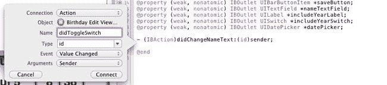

**图 6-6.** 创建新的开关值已更改动作回调

现在实现新的动作方法：

```
- (IBAction)didToggleSwitch:(id)sender {
    if (self.includeYearSwitch.on) {
        NSLog(@"当然，我愿意和你分享我的年龄！");
    }
    else {
        NSLog(@"我更愿意对我的出生年份保密，非常感谢！");
    }
}
```

构建并运行，然后试试看。

#### 监控日期选择器更新

日期选择器（`UIDatePicker`）控件有多种不同的模式：时间、日期、日期和时间以及倒计时器。你可以随意尝试这四种不同的选项，但为了《生日提醒》这个应用，请在故事板中选择日期选择器，并通过属性检查器将模式更改为“日期”。

与开关控件类似，日期选择器也支持“值已更改”事件。所以，按照你操作开关时的方式，Control-拖拽从日期选择器创建一个新的“值已更改”动作，并将其命名为 `didChangeDatePicker`。现在在 `BRBirthdayEditViewController.m` 中实现新的动作方法：

```
- (IBAction)didChangeDatePicker:(id)sender {
    NSLog(@"已选择新出生日期: %@",self.datePicker.date);
}
```

构建并运行。小菜一碟，对吧？


### 多行文本视图（编辑笔记视图）

我们已探讨如何处理文本字段交互，但文本字段仅允许输入单行文本。对于我们的笔记编辑器，仅用一行文本来记下礼物创意显然是不够的！

如果需要多行文本输入字段，你需要在应用中添加一个可编辑的文本视图（`UITextView`）组件。

在故事板中，将注意力移至编辑笔记视图控制器。将一个文本视图实例拖到视图上，并设置其位置：`x=0`、`y=10`、`width=320`、`height=190`（参见图 6-7）。

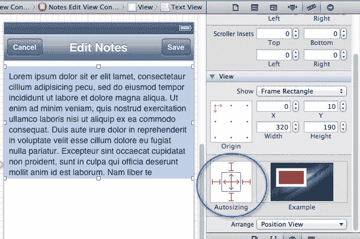

**图 6-7.** 在编辑笔记视图中添加文本视图

将文本视图设置为这个位置和大小是出于充分理由的。它正好在文本视图下方留下 216 点的屏幕空间。在竖屏方向下，键盘高度为 216 点，因此我们确保当用户输入生日礼物备注时，键盘不会遮挡视图中的任何重要元素。

尽管我们的 190 点高文本视图在 iPhone 4S 上看起来很棒，但在 iPhone 5 屏幕上，文本视图底部与键盘之间会有 88 点的空白空间。我们可以通过将文本视图的自动调整遮罩设置为灵活的宽度和高度，但固定上、下、左、右值来解决这个问题。更改自动调整属性以匹配图 6-7 中高亮显示的内容。

保持文本视图处于选中状态，切换到属性检查器。你将会注意到（并非双关！）文本视图可以包含可编辑和不可编辑的多行文本。我们可以根据需要切换可编辑属性。使用属性检查器删除 *lorem ipsum* 文本。

使用辅助编辑器布局，通过 Control-拖拽技术在`BRNotesEditViewController.h`中为“保存”栏按钮项和文本视图创建插座。将新插座分别命名为`saveButton`和`textView`。你的头文件最终应包含以下代码：

```
#import "BRCoreViewController.h"

@interface BRNotesEditViewController : BRCoreViewController

@property (weak, nonatomic) IBOutlet UIBarButtonItem *saveButton;
@property (weak, nonatomic) IBOutlet UITextView *textView;

@end
```

文本视图允许用户输入无限量的文本。如果文本高度超过其边界，文本会自动变为可滚动。因此，`UITextView`是`UIScrollView`的子类。`UITextView`不是`UIControl`的子类，所以我们没有像添加`UITextField`时那样的目标-动作事件可用。要在`UITextView`实例中捕获文本变化，我们需要订阅为文本视图的委托，并实现`UITextViewDelegate`协议。修改`BRNotesEditViewController.h`的接口声明，在尖括号中包含`UITextViewDelegate`协议引用：

```
@interface BRNotesEditViewController : BRCoreViewController <UITextViewDelegate>
```

从文本视图 Control-拖拽到编辑笔记视图控制器，以将文本视图的委托插座属性分配给编辑笔记视图控制器（参见图 6-8）。

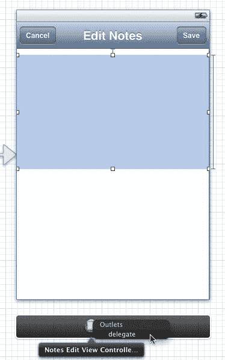

**图 6-8.** 分配文本视图委托插座

我们感兴趣的`UITextViewDelegate`协议方法是`textViewDidChange:`回调。每当文本视图中的文本发生变化时，该方法都会被触发。以下是添加到`BRNotesEditViewController.m`中的实现：

```
#pragma mark UITextViewDelegate

- (void)textViewDidChange:(UITextView *)textView
{
    NSLog(@"User changed the notes text: %@",self.textView.text);
}
```

构建并运行。检查你对笔记文本字段所做的更改是否打印到 Xcode 的调试器中。

#### 显示文本控件和视图的键盘

理想情况下，我们希望不必等到用户点击文本视图才显示键盘。最好是在编辑笔记视图一出现时，键盘就立即显示在屏幕上。添加一个`viewWillAppear:`回调即可通过一行代码实现：

```
-(void) viewWillAppear:(BOOL)animated
{
    [super viewWillAppear:animated];
    [self.textView becomeFirstResponder];
}
```

与在编辑生日视图控制器中点击回车键时调用`resignFirstResponder`来关闭键盘类似，我们也可以通过调用`becomeFirstResponder`方法来聚焦文本字段和可编辑文本视图。

### 准备通知时间视图控制器

通知时间视图控制器显示一个子设置视图，用户可以在其中选择希望生日提醒触发的时间。

#### 多行居中标签

首先，在故事板的通知时间视图中添加一个标签和一个日期选择器组件。在标签中输入以下文本：

**你希望生日提醒在一天的什么时间触发？**

设置标签的位置和大小（`x=20`、`y=20`、`width=280`、`height=87`）。默认情况下，标签组件只显示单行垂直居中的文本。你可能还会发现文本被缩小以适应你刚设置的新尺寸。使用属性检查器，你可以将“行数”值增加到 3，并将“对齐”值更改为居中对齐标签文本（参见图 6-9）。

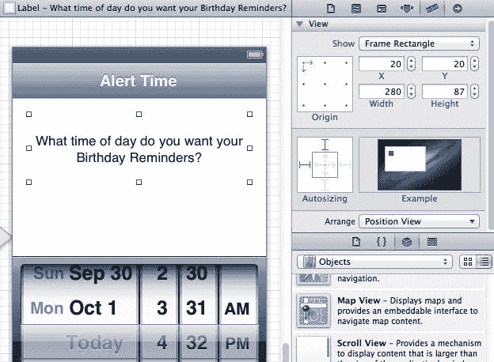

**图 6-9.** 添加文本居中显示的多行`UILabel`


### 使用日期选择器作为时间设置控件

确保日期选择器固定在视图底部（就像你为“编辑生日”视图所做的那样），然后将其`Mode`属性更改为`Time`。将日期选择器的`Interval`属性设置为五分钟（参见图 6-10）。

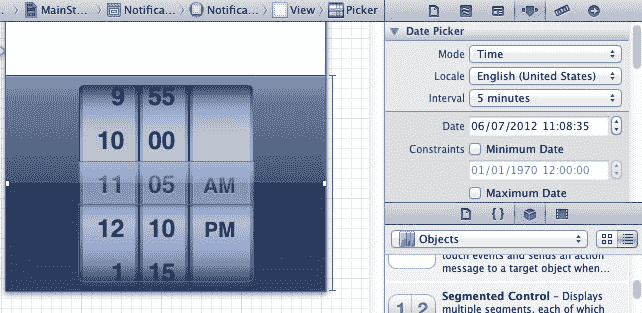

**图 6-10.** 将日期选择器配置为时间设置控件

按住 Control 键拖拽，在`BRNotificationTimeViewController.h`头文件中分别为标签和日期选择器创建输出口：分别命名为`whatTimeLabel`和`timePicker`。再次按住 Control 键从日期选择器拖拽到`BRNotificationTimeViewController.h`，为“值已更改”（Value Changed）事件创建一个界面构建器操作，并将该操作命名为`didChangeTime:`。`BRNotificationTimeViewController.h`最终应如下所示：

```
#import "BRCoreViewController.h"

@interface BRNotificationTimeViewController : BRCoreViewController
@property (weak, nonatomic) IBOutlet UILabel *whatTimeLabel;
@property (weak, nonatomic) IBOutlet UIDatePicker *timePicker;
- (IBAction)didChangeTime:(id)sender;

@end
```

现在，当用户更改日期选择器上显示的时间时，我们的新`didChangeTime:`操作将被调用。这使我们能够获取`UIDatePicker`的日期值，但我们如何提取用户设置的仅小时和分钟呢？以下是添加到`didChangeTime:`实现中的代码：

```
- (IBAction)didChangeTime:(id)sender {
    NSDateComponents *components = [[NSCalendar currentCalendar]
        components:NSHourCalendarUnit|NSMinuteCalendarUnit fromDate:self.timePicker.date];

    NSLog(@"Changed time to: %d:%d",components.hour,components.minute);  
}
```

在接下来的几天里，我们将与`NSDateComponents`成为最好的朋友。它是一个非常强大的类，用于操作日期并将其分解为单独的年、月、日、分钟和秒组件。我们从用户设备的当前日历实例化一个`NSDateComponents`实例，并传入单位标志，指定我们感兴趣的组件——本例中仅为小时和分钟。我们还会传入日期选择器中的日期。然后，我们可以直接访问`NSDateComponents`实例的小时和分钟属性。我们将在后续章节中探讨`NSDateComponents`的更多用法，届时我们需要计算每个已保存生日剩余的天数、用户下一个生日时的年龄，以及其他许多与日期相关的值。

### 使用相机和相册增强用户界面交互

添加或导入到*Birthday Reminder*应用中的任何生日都可以附带一张照片。不过，照片是可选的。如果某个生日有关联的照片，我们将在主屏幕的生日列表中显示它。在生日详情和编辑屏幕中，它会显示得更大。如果没有照片与生日关联，那么我们将显示一个生日蛋糕。

让我们开始这个照片功能，首先在故事板中的编辑生日视图中添加一些新的子视图。从对象库中将一个新的视图（`UIView`）实例拖到编辑生日视图上。使用尺寸检查器将子视图定位（x=10, y=20）。将视图大小调整为宽度=71，高度=71（参见图 6-11）。

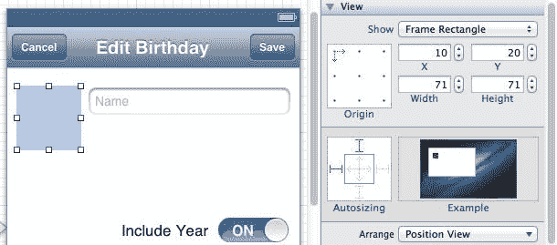

**图 6-11.** 添加图像视图容器

新添加的视图是一个容器视图，用于容纳缩略图背景图像、生日照片和“Pic Photo”标签。默认情况下，Xcode 会在添加到故事板的任何新视图上设置不透明的白色背景色。我们的容器需要是透明的，但不能不可见，因为它最终将具有圆角矩形。保持容器视图处于选中状态，使用属性检查器将视图的背景色更改为 Apple 内置的透明颜色（参见图 6-12）。

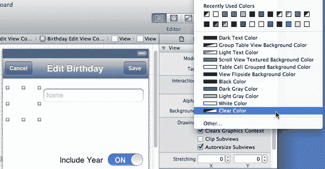

**图 6-12.** 使用透明颜色使视图背景透明

在本章的源代码中，您会找到四个新的 Retina 和非 Retina 图像资源，需要添加到您的项目中。将这些图像拖拽、放置并添加到您的 Xcode 项目中的`resources/images`组中（参见图 6-13）。

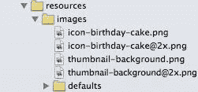

**图 6-13.** 项目中添加的生日蛋糕和缩略图背景图像资源

回到我们的编辑生日视图，从对象库中将一个新的图像视图（`UIImageView`）拖到容器视图中。然后将其定位（x=0, y=0, width=71, height=71）以匹配其父视图。选中您的新图像视图后，使用属性检查器将其`image`属性更改为`thumbnail-background.png`，这是我们刚刚添加到项目中的图像资源之一。显示的图像应该是一个圆角缩略图背景 PNG。

再次重复添加、定位和调整新图像视图大小的过程；但这次，选择`icon-birthday-cake.png`图像，使其位于缩略图背景的前面（参见图 6-14）。

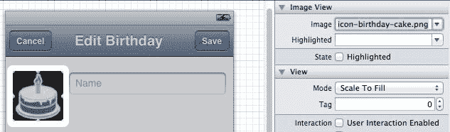

**图 6-14.** 一个容器视图，包含两个子视图：缩略图背景和生日蛋糕图像视图

向容器视图添加第三个子视图。这次是一个新的标签（`UILabel`）实例。使用属性检查器，将标签的对齐方式更改为居中，字体大小更改为系统 12，文本颜色更改为浅色文本颜色，并将其文本更改为`Pic Photo`。滚动属性检查器到标签的视图属性，点击背景颜色色板。使用灰度滑块，创建一个新的黑色颜色，并将 50%的不透明度应用到标签上（参见图 6-15）。

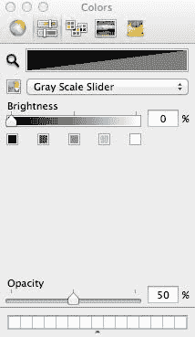

**图 6-15.** 创建一个具有 50%不透明度的新半透明颜色

最后，定位新标签（x=0, y=56, width=71, height=15）。结果应类似于图 6-16。

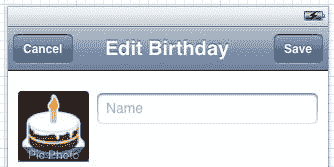

**图 6-16.** 我们的容器视图已完成，包含图像和标签

使用助理编辑器布局，在`BRBirthdayEditViewController.h`中为容器视图、带有蛋糕的图像视图和标签视图创建新的输出口，分别命名为`photoContainerView`、`photoView`和`picPhotoLabel`。当视图相互叠放时，确保您按住 Control 键从正确视图拖拽的最准确方法是打开文档大纲窗格，然后直接从文档大纲中的视图层次结构拖拽到头文件中（参见图 6-17）。

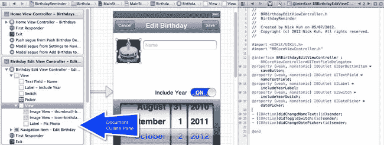

**图 6-17.** 从文档大纲窗格按住 Control 键拖拽以创建新的输出口

`BRBirthdayEditViewController.h`头文件中生成的输出口代码如下：

```
@property (weak, nonatomic) IBOutlet UIView *photoContainerView;
@property (weak, nonatomic) IBOutlet UILabel *picPhotoLabel;
@property (weak, nonatomic) IBOutlet UIImageView *photoView;
```


### 手势识别器

我们将提示用户使用相机拍摄新照片，或从 iPhone 照片库中选择一张照片，分配给其正在添加或编辑的生日。我们的“点击照片”标签已经表明，用户需要点击图像图标来替换默认的蛋糕图像。

我们的应用需要响应用户点击照片容器视图的操作。我们无法使用“目标-动作”模式，因为 `UIView` 并非 `UIControl` 的子类。因此，我们需要添加一个点击手势识别器来捕捉用户用手指点击视图的操作。

向下滚动对象库，直到找到点击手势识别器（`UITapGestureRecognizer`）对象。将一个新实例拖放到文档大纲中的照片容器视图上（请参见图 6-18）。

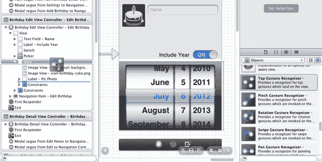

**图 6-18.** 将新的点击手势识别器拖放到文档大纲窗格的容器视图上

Xcode 会在文档大纲窗格（对象列表底部）显示新添加的点击手势识别器实例。按住 Control 键单击添加的手势识别器以打开其上下文菜单。您会看到一个新的 `gestureRecognizers` 出口集合，它将识别器连接到照片容器视图。

我们已经做了足够的工作来检测照片容器视图上的点击，但我们还需要从点击手势识别器创建一个动作连接至 `BRBirthdayEditViewController.h`。

使用辅助编辑器，在右侧窗格中显示 `BRBirthdayEditViewController.h`，在左侧窗格中显示故事板，然后按住 Control 键从点击手势识别器拖拽到 `BRBirthdayEditViewController.h`，以创建一个名为 `didTapPhoto` 的新动作，如图 图 6-19 所示。

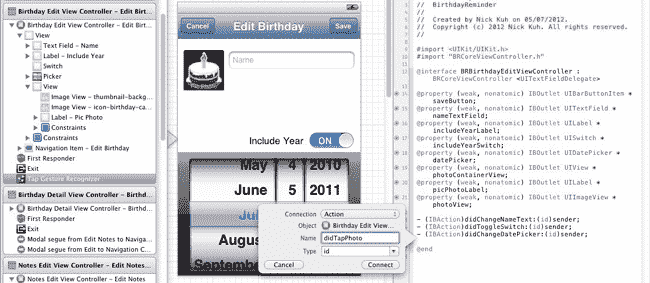

**图 6-19.** 从点击手势识别器创建名为 `didTapPhoto:` 的动作

跳转到 `BRBirthdayEditViewController.m` 并添加一个 `NSLog` 调用来检查点击照片是否工作：

```
- (IBAction)didTapPhoto:(id)sender {
    NSLog(@"Did Tap Photo!");
}
```

构建并运行。每次点击蛋糕时，调试区是否都会打印“Did Tap Photo!”？太棒了。

### 实现操作列表

我们希望为用户提供从相册选择照片*或*用相机拍照的选项。我们将通过一个操作列表来呈现这两个选项。在扩展 `didTapPhoto:` 方法之前，我们需要在头文件中声明 `BRBirthdayEditViewController` 实现了 `UIActionSheetDelegate` 协议：

```
@interface BRBirthdayEditViewController : BRCoreViewController<UITextFieldDelegate, UIActionSheetDelegate>
```

现在来完成 `didTapPhoto:` 方法：

```
- (IBAction)didTapPhoto:(id)sender {
    NSLog(@"Did Tap Photo!");
    if (![UIImagePickerController
isSourceTypeAvailable:UIImagePickerControllerSourceTypeCamera]) {
        NSLog(@"No camera detected!");
        return;
    }
    
    UIActionSheet *actionSheet = [[UIActionSheet alloc] initWithTitle:nil delegate:self
cancelButtonTitle:@"Cancel" destructiveButtonTitle:nil otherButtonTitles:@"Take a
Photo",@"Pick from Photo Library", nil];
    [actionSheet showInView:self.view];
}
```

构建并运行。您是否看到了像图 6-20 中显示的操作菜单？没有？您是在 iOS 模拟器上运行的吗？您确实是在模拟器上运行的？好吧，这就是原因了。iOS 模拟器没有摄像头，所以它会被我们的条件语句拦截；也就是说，没有可用的摄像头源类型，因此不要给用户提供用相机拍照的选项：

```
if (![UIImagePickerController isSourceTypeAvailable:UIImagePickerControllerSourceTypeCamera])
{
            NSLog(@"No camera detected!");
            return;
        }
``` 
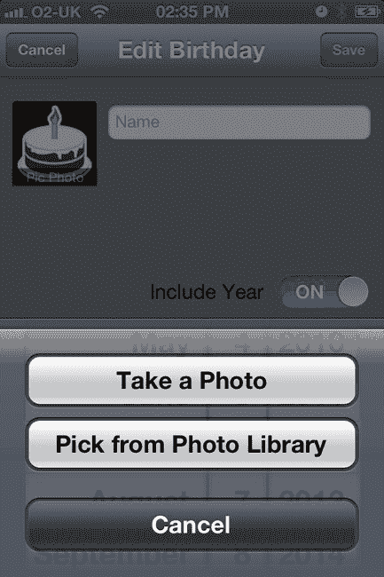

**图 6-20.** 显示一个操作列表

您需要在带有摄像头的设备上运行该应用，才能拥有用相机拍照的选项。


