# `UIImagePickerController`：拍照与浏览照片库

iOS 应用有多种方式通过 iPhone 摄像头拍照并访问用户的照片库。最简单的方法莫过于使用 iOS SDK 中的 `UIImagePickerController` 组件。它替我们完成了所有复杂的工作。我们将在 `BRBirthdayEditViewController` 中懒加载一个 Apple 的 `UIImagePickerController` 类的实例，并创建两个新的私有方法：一个用于拍照，另一个用于从照片库中选择照片。

`BRBirthdayEditViewController` 将自己设置为`UIImagePickerController` 的代理。因此，首先更新我们的接口头文件：

```
@interface BRBirthdayEditViewController : BRCoreViewController<UITextFieldDelegate,
UIActionSheetDelegate, UIImagePickerControllerDelegate, UINavigationControllerDelegate>
```

`UIImagePickerController` 的代理属性被定义为实现了 `UIImagePickerControllerDelegate` 和 `UINavigationControllerDelegate` 协议的对象。因此，即使我们不会实现任何 `UINavigationControllerDelegate` 方法签名，仍然需要在 `BRBirthdayEditViewController` 头文件中包含该协议，以避免编译器警告。

切换回 `BRBirthdayEditViewController.m` 源文件，并添加以下私有属性声明：

```
@interface BRBirthdayEditViewController()

@property (nonatomic, strong) UIImagePickerController *imagePicker;

@end;
```

我们可以重写新图片选择器属性的 getter 方法，仅在第一次引用时才实例化图片选择器控制器的一个实例。这被称为*懒加载*。在 `BRBirthdayEditViewController.m` 的实现中添加该访问器方法：

```
-(UIImagePickerController *) imagePicker
{
    if (_imagePicker == nil) {
        _imagePicker = [[UIImagePickerController alloc] init];
        _imagePicker.delegate = self;
    }
    return _imagePicker;
}
```

现在实现我们的两个新方法，用于拍照和浏览照片：

```
-(void) takePhoto
{
    self.imagePicker.sourceType = UIImagePickerControllerSourceTypeCamera;
    [self.navigationController presentViewController:self.imagePicker animated:YES completion:nil];
}

-(void) pickPhoto
{
    self.imagePicker.sourceType = UIImagePickerControllerSourceTypePhotoLibrary;
    [self.navigationController presentViewController:self.imagePicker animated:YES completion:nil];
}
```

与关闭模态视图控制器类似，我们可以将一个代码块作为 `presentViewController:animated:completion:` 视图控制器方法的第三个参数传入。不过，由于我们没有任何需要在呈现动画完成后运行的代码，因此直接传入 `nil` 即可。

为了调用我们的 `takePhoto` 和 `pickPhoto` 方法，需要从 `UIActionSheetDelegate` 协议中添加一个代理方法到我们的类中，以便响应用户从操作表中选择两个操作选项之一：

```
#pragma mark UIActionSheetDelegate

- (void)actionSheet:(UIActionSheet *)actionSheet
didDismissWithButtonIndex:(NSInteger)buttonIndex
{
    if (buttonIndex == actionSheet.cancelButtonIndex) return;

    switch (buttonIndex) {
        case 0:
            [self takePhoto];
            break;
        case 1:
            [self pickPhoto];
            break;   
    }
}
```

构建并运行。现在您应该能够通过 `UIImagePickerController` 浏览、选择并拍照，如图 6-21 所示。


**图 6-21。** 状态并非最佳！

如果您在模拟器上运行应用，仍然无法看到 `UIImagePickerController`。不过，模拟器确实包含照片库，因此如果没有检测到摄像头，我们就不显示带有选项的操作表，而是直接向用户展示照片库：

将 `didTapPhoto:` 方法修改如下：

```
- (IBAction)didTapPhoto:(id)sender {
    NSLog(@"已点击照片！");
    if (![UIImagePickerController
isSourceTypeAvailable:UIImagePickerControllerSourceTypeCamera]) {
        NSLog(@"未检测到摄像头！");
        [self pickPhoto];
        return;
    }
    UIActionSheet *actionSheet = [[UIActionSheet alloc] initWithTitle:nil delegate:self
cancelButtonTitle:@"取消"    destructiveButtonTitle:nil    otherButtonTitles:@"拍照",@"从照片库选取", nil];
    [actionSheet showInView:self.view];
}
```

我们刚刚添加了一个直接调用，如果设备未检测到摄像头，则直接调用新的 `pickPhoto` 方法。

我们还没完全完成。`UIImagePickerController` 似乎正在拍照，但如何在完成时获取照片数据呢？当然是通过代理回调方法！我们已经声明了 `BRBirthdayEditViewController` 实现了 `UIImagePickerControllerDelegate` 协议，因此添加以下代码来从 `UIImagePickerController` 实例中获取图像数据：

```
#pragma mark UIImagePickerControllerDelegate

- (void)imagePickerController:(UIImagePickerController *)picker
didFinishPickingMediaWithInfo:(NSDictionary *)info {

    [picker dismissViewControllerAnimated:YES completion:nil];

    UIImage *image = info[UIImagePickerControllerOriginalImage];

    self.photoView.image = image;
}
```

通过定义 `UIImagePickerControllerDelegate` 协议方法 `imagePickerController:didFinishPickingMediaWithInfo:`，我们从 `UIImagePickerController` 中获取到了图像数据，该数据作为参数传入的回调方法中的 `info` `NSDictionary` 的一个属性。我们设置了 `photoView` 图像视图的 image 属性，将生日蛋糕图片替换为新拍摄或选择的照片。


#### 调整图像视图渲染

根据你用图像选择器拍摄或选取的照片尺寸，你可能会注意到生成的图像没有保持其宽高比。相反，图像会被压缩或拉伸以适应图像视图的边界。在我刚开始学习 iOS 并遇到这个问题时，我的第一反应是要么调整图像视图的大小并使其居中，要么生成一张新的裁剪图像来匹配图像视图的尺寸。结果发现，解决方案比这两种方法都要简单得多。`UIView` 有一个名为 `contentMode` 的属性，它决定了视图内容如何渲染。`contentMode` 默认为 `UIViewContentModeScaleToFill`，即它会简单地拉伸或压缩其绘制的内容，以适应视图边界的尺寸。如果我们将 `contentMode` 属性值改为 `UIViewContentModeScaleAspectFill`，图像的宽高比会得到保留，并且图像会填满它被渲染到的图像视图的边界。

回到故事板中，选中 `photoView` 图像视图。使用属性检查器将模式（Mode）设置改为 Aspect Fill。构建并运行。这次，你应该会发现选中的照片现在会调整大小以填满图像视图的边界，而不会使图像变形。唯一的问题是，图像重叠的侧边或顶部和底部没有被裁剪。不过，这也很容易解决。保持图像视图选中状态，在属性检查器中你会找到一个名为 Clip Subviews（`UIView.clipsToBounds`）的属性。打开 Clip Subviews 的开关。构建并运行。怎么样？完美裁剪并居中的方形缩略图，正好匹配图像视图的边界（参见图 6-22）！这多简单啊？！

*注：目前，我们是在用一个可能非常大的照片来填充一个小缩略图图像视图。在开发后期，我们会从大图中生成缩略图；否则，我们的应用会因渲染不必要的大图而迅速消耗大量内存。*


**图 6-22.** 差，较好，最好！

### 总结

你已经完成了第二天的学习！今天的内容全是关于构建基本的 iOS 用户界面和导航。你学到了

> *   如何在故事板中构建由视图控制器场景组成的导航层级。
> *   如何创建视图控制器子类并将它们分配给故事板中的视图控制器。
> *   如何通过 Interface Builder 的 Outlet 和 Action 将我们的视图和子视图与自定义视图控制器连接起来。
> *   如何理解委托模式，在我们的视图控制器中实现协议，并响应协议方法的回调。
> *   如何将原生的 iPhone 相机和相册库集成到我们的应用中。

我们在导航和用户界面上有了一个很好的开始，但我们还没有处理 iOS 中的数据。猜猜我们明天要做什么？没错，*处理数据*。睡个好觉。


## 第三天

## 处理数据


## 第 7 章

## 表格视图、数组和字典——天哪！

第三天是数据日！到目前为止，我们一直专注于*生日提醒*应用的用户界面和导航。今天，我们将学习如何将数据集成到我们的应用中。

在本章中，我们将学习如何创建和操作一个字典数组，并根据数据填充我们的应用。在第 8 章中，我们将修改数据实现，使用苹果的 Core Data 框架来提供持久化存储解决方案。

### 表格视图

表格视图是许多 iPhone 应用的核心组件——*生日提醒*也不例外。表格视图使 iPhone 应用能够在小型屏幕设备上以长滚动列表的形式显示大量内容。

图 7-1 展示了我们最终将在应用主屏幕上呈现的表格视图——列出了用户所有亲朋好友的生日！用户还可以选择列表中的任意生日，应用将导航到显示所选生日的详细信息，将表格视图向左滑出，并让生日详情视图从右侧滑入替换它。

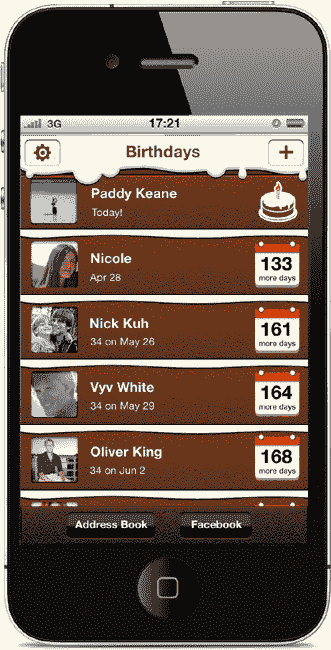

**图 7-1.** `UITableView`：*生日提醒*应用的核心组件

我们要掌握的首要挑战是，从项目中的本地属性列表文件加载一个名人生日数组，存入一个原生的生日字典数组中。我们将在一个表格视图中显示名人姓名、生日和本地存储的照片。

从本章源代码附带的 assets 文件夹开始，将 `birthdays.plist` 文件和 Celebrity Pics 文件夹导入到你 Xcode 项目的 `resources` 组中，如图 7-2 所示。

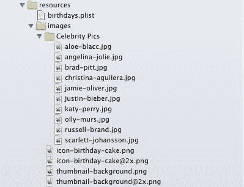

**图 7-2.** 添加到项目中的名人图片和 `birthdays.plist` 资源

将故事板的焦点放在 Home 视图控制器上。首先，删除 Push Birthday Detail View Controller 按钮。这会自动删除从 Home 视图控制器到 Birthday Detail 视图控制器的临时 Segue。现在，从对象库中拖拽一个新的表格视图实例（不要与表格视图控制器实例混淆）到主视图上（参见图 7-3）。该表格视图成为我们主视图的一个子视图（不要替换你的主视图！）。

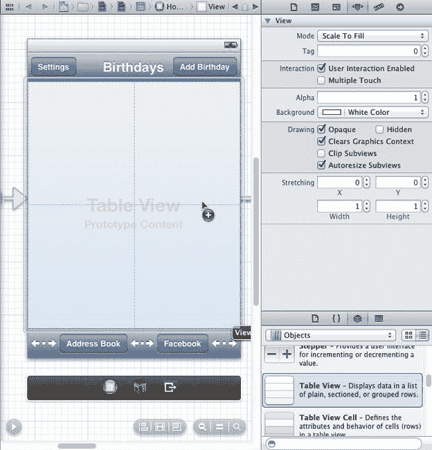

**图 7-3.** 向主视图添加表格视图

选中新的表格视图，使用属性检查器将原型单元格（Prototype Cells）设置增加到 1，这会为表格视图添加一个新的原型单元格供我们使用（参见图 7-4）。

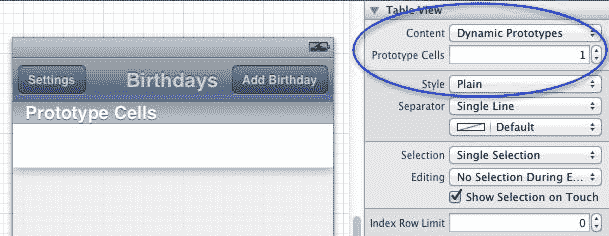

**图 7-4.** 向表格视图添加原型单元格

我们可以从苹果设计的表格单元格样式列表中选择样式来设计我们的原型单元格，或者我们可以直接自定义原型表格视图单元格，添加子视图、设置背景颜色等等。我们将在第 9 章中学习创建自定义表格视图单元格；但现在，选择原型单元格，使用属性检查器将其样式改为 Subtitle（参见图 7-5）。副标题样式的表格单元格提供了粗体标题和副标题标签，我们可以在运行时为它们设置文本。

现在，在属性检查器的 Identifier 文本字段中输入一个重用标识符值。输入 `Cell` 作为文本（参见图 7-5）。

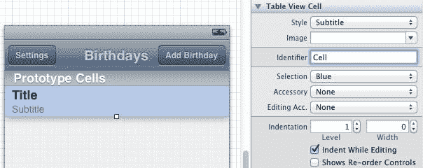

**图 7-5.** 设置可重用的原型表格单元格

苹果设计的表格视图非常优化。重用标识符的目的是使 `UITableViewCell` 的实例能够被多个表格行重用；例如，如果你的表格高度为 416 点，并且每个表格单元格的高度为 100 像素，那么表格视图只需要生成五个 `UITableViewCell` 实例就能显示成百上千行！如果你不提供重用标识符，那么为我们的表格视图生成的每个 `UITableViewCell` 实例将只会被使用一次，这可能导致应用非常占用内存，更不用说性能方面的影响了。

此时你应该能够构建并运行你的应用，尽管表格视图暂时只会显示空行。


在 Storyboard 中选中 Home 视图控制器场景后，从 `BRHomeViewController.h` 头文件新建一个指向表格视图的 Interface Builder 输出口，并将其命名为 `tableView`。

`BRHomeViewController.h` 现在应如下所示：

```
#import <UIKit/UIKit.h>
#import "BRCoreViewController.h"

@interface BRHomeViewController : BRCoreViewController

-(IBAction)unwindBackToHomeViewController:(UIStoryboardSegue *)segue;
@property (weak, nonatomic) IBOutlet UITableView *tableView;

@end
```

### 表格数据源与委托协议

在第 4 章中，我们首次学习了警告视图组件（`UIAlertView`），并了解到为了捕获 Alert 按钮的点击事件，需要让视图控制器订阅为其委托。同样的委托模式也适用于表格视图，只是表格视图拥有两种类型的委托：一种用于控制器，另一种用于数据模型。

我们将把表格视图的视图控制器同时设置为数据源和委托。为此，我们必须在 `BRHomeViewController.h` 头文件中指明该类将遵循 `UITableViewDataSource` 和 `UITableViewDelegate` 两个协议。通过添加委托和数据源实现声明来修改头文件：

`@interface BRHomeViewController : BRCoreViewController <UITableViewDelegate, UITableViewDataSource>`

接下来，我们需要将表格视图的委托和 `dataSource` 输出口分配给 `BRBirthdayTableViewController`。我们将通过 Storyboard 来操作：按住 Control 键从表格视图拖拽至视图下方栏中的视图控制器对象，系统会提示你选择 `dataSource` 或 delegate 属性。将两者都分配给 Home 视图控制器（如下图所示）。

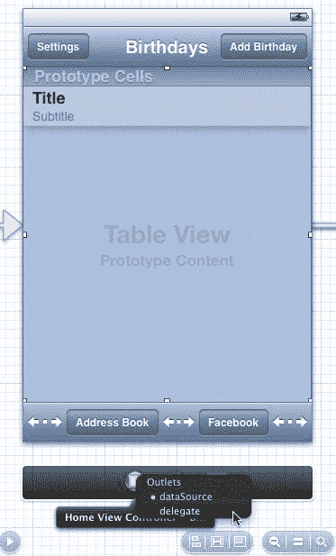

**图 7-6.** 将表格视图的 `dataSource` 和 delegate 设置为 `BRHomeViewController`

表格视图的已分配 `dataSource` 对象必须实现 `UITableViewDataSource` 协议。当表格视图加载时，它会向 `dataSource` 请求表格的分区数量以及每个分区中的行数。指定的 `dataSource` 对象还会根据表格视图的请求生成 `UITableViewCell` 实例。`UITableViewDataSource` 协议有两个必需的方法签名，如果你未实现它们，编译器会发出警告：

```
- (NSInteger)tableView:(UITableView *)tableView numberOfRowsInSection:(NSInteger)section;
- (UITableViewCell *)tableView:(UITableView *)tableView cellForRowAtIndexPath:(NSIndexPath *)indexPath;
```

因此，我们最好将这些方法添加到 `BRHomeViewController` 的源实现中：

```
#pragma mark UITableViewDataSource

- (UITableViewCell *)tableView:(UITableView *)tableView cellForRowAtIndexPath:(NSIndexPath *)indexPath
{
    UITableViewCell *cell = [self.tableView dequeueReusableCellWithIdentifier:@"Cell"];
    return cell;
}

- (NSInteger)tableView:(UITableView *)tableView numberOfRowsInSection:(NSInteger)section
{
    return 100;
}
```

你是否注意到我们是如何引用 `Cell` 重用标识符，从 Storyboard 中获取表格单元格原型的可重用实例的？表格视图直接管理重用过程：一旦表格单元格滚动到可见视图之外，它就会被添加到单元格的重用堆栈中，并在我们调用 `dequeueReusableCellWithIdentifier:` 时由表格视图返回。

我们对 `tableView:numberOfRowsInSection:` 的实现返回了一个整数 100。我们让表格视图知道表格中应该有 100 行。

构建并运行你的应用。你应该会看到大量的表格行，采用我们之前设置的副标题样式（如下图所示）。

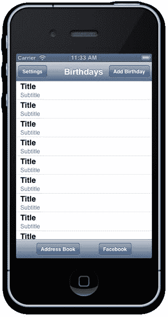

**图 7-7.** 一百个表格行！

如果你在模拟器或设备上选中任意表格行，会发现选中的行会变为蓝色并保持选中状态。我们将通过在 Home 视图控制器中实现一个 `UITableViewDelegate` 方法来修改选中处理逻辑：

```
#pragma mark UITableViewDelegate

- (void)tableView:(UITableView *)tableView didSelectRowAtIndexPath:(NSIndexPath *)indexPath
{
    [self.tableView deselectRowAtIndexPath:indexPath animated:YES];
}
```

现在运行应用时，你会发现这些行在触摸时会优雅地淡出，表明用户交互已被识别。

我们的 *Birthday Reminder* 单元格的行高为 72 点。表格单元格的默认高度仅为 44 点。选中表格视图后，我们可以在 Storyboard 中使用尺寸检查器，将行高增加至 72 来修改单元格高度（如下图所示）。

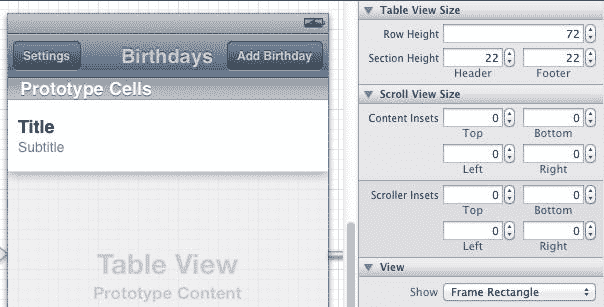

**图 7-8.** 修改表格视图的默认行高

*注意：表格视图也支持可变行高。你可以通过实现 `UITableViewDelegate` 协议的 `tableView:heightForRowAtIndexPath` 方法来确定各个行的行高。*

我认为我们需要从 `birthdays.plist` 中加载一些真实数据。让我们开始着手将动态数据加载到表格中吧。


### 使用数组和 plist 填充表格视图

我们在本章开始时添加到项目中的 `birthdays.plist` 文件包含一个由十个名人生日字典组成的数组。Plist（或称*属性列表*）是遵循某种格式的 XML 文件，Objective-C 可以理解该格式并将其转换为原生对象：数组、字典、数字、字符串等等。

*提示：您可以通过“文件  → 新建  → 文件”来创建自己的 `plist`。从资源模板中选择“属性列表”选项。*

当我们的主页视图控制器实例化时，我们将从 `birthdays.plist` 加载数据，创建一个生日字典数组。在 `BRHomeViewController.m` 的私有接口中声明一个新的 `birthdays` 数组属性：

```
@interface BRHomeViewController()
@property (nonatomic,strong) NSMutableArray *birthdays;
@end
```

现在来实例化我们的 `birthdays` 数组。正如我们在第 5 章中学到的，从故事板实例化的视图控制器有一个指定的初始化方法 `initWithCoder:`。因此，我们将重写该指定初始化方法来生成新数组：

```
- (id) initWithCoder:(NSCoder *)aDecoder
{
    self = [super initWithCoder:aDecoder];

    if (self) {
        NSString* plistPath = [[NSBundle mainBundle] pathForResource:@"birthdays" ofType:@"plist"];
        NSArray *nonMutableBirthdays = [NSArray arrayWithContentsOfFile:plistPath];

        self.birthdays = [NSMutableArray array];

        NSMutableDictionary *birthday;
        NSDictionary *dictionary;
        NSString *name;
        NSString *pic;
        UIImage *image;
        NSDate *birthdate;

        for (int i=0;i<[nonMutableBirthdays count];i++) {
            dictionary = [nonMutableBirthdays objectAtIndex:i];
            name = dictionary[@"name"];
            pic = dictionary[@"pic"];
            image = [UIImage imageNamed:pic];
            birthdate = dictionary[@"birthdate"];
            birthday = [NSMutableDictionary dictionary];
            birthday[@"name"] = name;
            birthday[@"image"] = image;
            birthday[@"birthdate"] = birthdate;

            [self.birthdays addObject:birthday];
        }
    }

    return self;
}
```

`birthdays.plist` 文件的根节点是一个数组：由字典对象组成的数组。`NSArray` 有一个便捷方法 `arrayWithContentsOfFile:`，它可以创建一个不可变数组，并从 `plist` 文件中填充不可变对象。但是，我们希望 `birthdays` 数组中的字典是可变的，因为我们后续将允许用户通过编辑生日视图来更改名人的姓名和照片。要将这些不可变字典变为可变，唯一的办法就是基于不可变版本创建新的可变版本。因此，我们遍历所有不可变字典，并创建新的可变生日字典：

```
birthday = [NSMutableDictionary dictionary];
birthday[@"name"] = name;
birthday[@"image"] = image;
birthday[@"birthdate"] = birthdate;
[self.birthdays addObject:birthday];
```

请注意，我们还根据从 `plist` 加载的每个生日字典中的 `pic` 字符串值，初始化了新的 `UIImage` 实例：

```
pic = dictionary[@"pic"];
image = [UIImage imageNamed:pic];
```

最终得到的 `self.birthdays` 数组是可变的，其中包含可变的生日字典，这些字典拥有 `name`、`birthdate` 和 `image` 属性，我们将用它们来填充表格视图中的每个单元格。

检查你的应用能否正常编译和运行。如果 `plist` 数据加载和解析无误，就不应该出现任何错误或警告。

*注意：你的故事板可能会显示“生日详情场景不可达”的警告，我们稍后会修复这个问题。这不会影响项目的编译。*

目前，我们告诉表格视图它包含 100 行。现在，将返回值修改为数组中生日的数量：

```
- (NSInteger)tableView:(UITableView *)tableView numberOfRowsInSection:(NSInteger)section
{
    return [self.birthdays count];
}
```

现在来填充表格视图单元格。每当表格视图从其数据源（我们的主页视图控制器）请求一个表格视图单元格实例时，它都会传入一个对自身和单元格索引路径的引用。一个索引路径包含两个值：*section（分区）*和*row（行）*。在本例中，行值等同于 `birthdays` 数组中生日对象的索引。在我们的应用中，分区值始终为 0，因为我们只实现一个分区的表格视图。

以下是主页视图控制器中 `tableView:cellForRowAtIndexPath:` 的新实现：

```
- (UITableViewCell *)tableView:(UITableView *)tableView cellForRowAtIndexPath:(NSIndexPath
*)indexPath
{
    UITableViewCell *cell = [self.tableView dequeueReusableCellWithIdentifier:@"Cell"];

    NSMutableDictionary *birthday = self.birthdays[indexPath.row];

    NSString *name = birthday[@"name"];
    NSDate *birthdate = birthday[@"birthdate"];
    UIImage *image = birthday[@"image"];

    cell.textLabel.text = name;
    cell.detailTextLabel.text = birthdate.description;
    cell.imageView.image = image;

    return cell;
}
```

利用 `indexPath.row` 值，我们可以获取与所请求的表格单元格行相关联的可变生日字典。表格视图单元格（`UITableViewCell`）有两个默认的标签属性：`textLabel` 和 `detailTextLabel`，我们分别用 `name` 和 `birthdate` 字符串值来填充它们。表格视图单元格还包含一个图像视图属性（`imageView`），我们将其设置为生日字典中存储的图像（`UIImage`）属性的值。

构建并运行。你应该会看到填充了名人数据的表格视图，如图 7-9 所示。

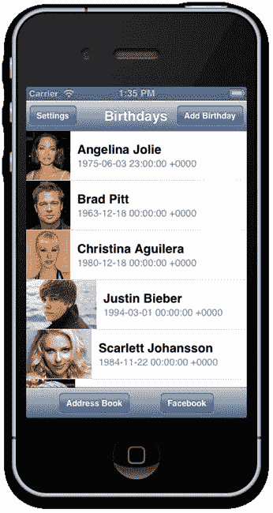

**图 7-9.** 我们的第一个动态生成数据的表格视图！


### 使用 Segue 传递数据

我们的下一个挑战是，当点击某个名人生日的单元格时，将`生日详情`视图控制器推送到主导航控制器上。有两种典型方式可以实现这一点。一种方法是在`tableView:didSelectRowAtIndexPath:`方法中扩展代码，创建一个新的视图控制器实例，然后将其推送到包含`主页`视图控制器的导航控制器上：

```
[self.navigationController pushViewController:myViewControllerInstance animated:YES];
```

然而，我们将坚持使用在第 5 章中学到的更直观的方法：通过故事板 Segue 推送视图控制器。从`主页`视图控制器中的原型表格单元格按住 Control 键拖动到`生日详情`视图控制器，然后释放并选择*推送* Segue 选项（参见图 7-10）。

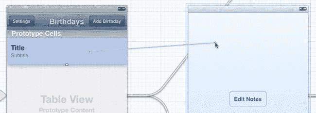

**图 7-10.** 从原型表格单元格创建推送 Segue

Xcode 会创建新的推送 Segue，并为我们之前在第 5 章中设置的`生日详情`视图控制器重新应用推断出的导航栏。现在，当原型表格单元格的任何实例被选中时，它都会将我们的`生日详情`视图控制器推送到导航栈中。

在`生日详情`视图控制器中添加一个新的图像视图（`UIImageView`）实例，将其位置设为 x=10, y=20，大小设为 71x71 点。保持新图像视图的选中状态，使用属性检查器，将视图模式更改为“Aspect Fill”，并开启“Clip Subviews”（剪裁子视图），如图 7-11 所示。这样，当为该图像视图分配图片时，会得到一个裁剪工整的正方形缩略图，就像我们在第 6 章中为编辑生日视图实现的那样。

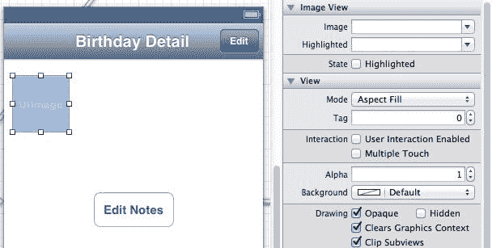

**图 7-11.** 在生日详情视图中添加并配置用于显示正方形缩略图的图像视图

继续使用故事板，并借助助理编辑器布局，从新的图像视图按住 Control 键拖动，在`BRBirthdayDetailViewController.h`头文件中创建一个名为`photoView`的新输出口：

```
#import <UIKit/UIKit.h>
#import "BRCoreViewController.h"

@interface BRBirthdayDetailViewController : BRCoreViewController

@property (weak, nonatomic) IBOutlet UIImageView *photoView;

@end
```

我们还要给`生日详情`视图控制器添加一个新的可变生日字典属性。当用户点击表格视图中的某个生日时，该属性由`主页`视图控制器进行设置。更新`BRBirthdayDetailViewController.h`，添加新的可变字典属性：

```
#import <UIKit/UIKit.h>
#import "BRCoreViewController.h"

@interface BRBirthdayDetailViewController : BRCoreViewController

@property(nonatomic,strong) NSMutableDictionary *birthday;
@property (weak, nonatomic) IBOutlet UIImageView *photoView;

@end
```

现在切换到`BRBirthdayDetailViewController.m`源码，扩展`BRBirthdayDetailViewController.m`中现有的`viewWillAppear:`方法，使其在每次详情视图出现时读取并渲染新生日字典属性的详细信息：

```
-(void) viewWillAppear:(BOOL)animated
{
    [super viewWillAppear:animated];
    NSLog(@"viewWillAppear");
    NSString *name = self.birthday[@"name"];
    self.title = name;
    UIImage *image = self.birthday[@"image"];
    if (image == nil) {
        //如果生日图片不存在，默认使用生日蛋糕图片
        self.photoView.image = [UIImage imageNamed:@"icon-birthday-cake.png"];
    }
    else {
        self.photoView.image = image;
    }
}
```

设置视图控制器的`title`属性，当视图控制器在导航控制器内显示时，会更新导航栏上居中的文本。我们还会将新图像视图的图片值设为生日字典中包含的图片，如果没有图片，则回退使用蛋糕图片。

至此，我们已经完成了`生日详情`视图接收数据的准备工作。现在，我们把注意力转回`主页`视图控制器，并编写代码，以便在通过 Segue 转换将选中的生日字典推送到导航栈时，将其传递给`生日详情`视图控制器。


### 理解 Segue 标识符

除了视图生命周期方法（`viewDidLoad`、`viewWillAppear:` 等）之外，Apple 的 `UIViewController` 类的子类还可以重写与转场过渡（segue）相关的回调方法。这正是我们接下来要做的事情——在 Home 视图控制器类中重写 `prepareForSegue:sender:` 方法。将以下新代码添加到 `BRHomeViewController.m` 的实现中：

```
#pragma mark 转场

-(void) prepareForSegue:(UIStoryboardSegue *)segue sender:(id)sender
{
    NSLog(@"prepareForSegue!");
}
```

如果你构建并运行这个应用，每次从主屏幕选择一个名人的生日时，都会看到新添加的日志语句 `prepareForSegue!` 出现；也就是说，正好在调用转场过渡的时刻。

在 `prepareForSegue:sender:` 方法中，我们获得了一个指向 storyboard 中添加的转场（segue）的引用。然而，我们添加到 `prepareForSegue:sender:` 中的任何代码都会在 *任意* 从主屏幕到其他屏幕的转场过渡中被调用——例如我们的添加生日转场！我们需要能够识别当前正在执行的是哪个转场过渡，并据此确定将要过渡到屏幕上的视图控制器以及如何处理该事件。

在你的 storyboard 中，选择连接 Home 视图控制器到 Birthday Detail 视图控制器的转场，使用属性检查器为该转场添加一个字符串标识符。将转场标识符命名为 `BirthdayDetail`（请参见 图 7-12）。

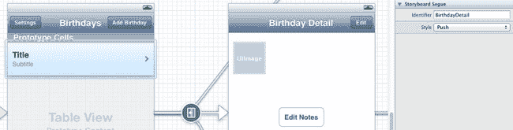

**图 7-12.** 添加转场标识符

现在我们有了一个方法来识别哪个视图控制器正在被推入或呈现，我们可以扩展 `BRHomeViewController.m` 实现中的 `prepareForSegue:sender:` 方法：

```
-(void) prepareForSegue:(UIStoryboardSegue *)segue sender:(id)sender
{
     //NSLog(@"prepareForSegue!");
     NSString *identifier = segue.identifier;

     if ([identifier isEqualToString:@"BirthdayDetail"]) {
         //首先获取数据
         NSIndexPath *selectedIndexPath = self.tableView.indexPathForSelectedRow;
         NSMutableDictionary *birthday = self.birthdays[selectedIndexPath.row];

         BRBirthdayDetailViewController *birthdayDetailViewController = segue.destinationViewController;
         birthdayDetailViewController.birthday = birthday;

     }
}
```

在我深入讲解这段代码的细节之前，你首先需要将 `BRBirthdayDetailViewController.h` 导入到 `BRHomeViewController.m` 中。滚动到 `BRHomeViewController.m` 源文件的顶部，并添加导入语句：

```
#import "BRBirthdayDetailViewController.h"
```

探究 `prepareForSegue:sender:` 代码，我们的从主页到生日详情的转场有一个 `BirthdayDetail` 标识符。我们可以通过 `segue.identifier` 属性来检查并访问这个字符串。如果标识符匹配 `BirthdayDetail` 字符串，那么我们就知道当前的转场过渡发生在 Home 和 Birthday Detail 视图控制器之间，因此新的视图控制器必须是 `BRBirthdayDetailViewController` 的一个实例。

我们可以通过获取当前选中表格行的索引路径来抓取选中的生日字典：

```
NSIndexPath *selectedIndexPath = self.tableView.indexPathForSelectedRow;
```

从选中的索引路径中，我们可以提取 `row` 属性，该属性对应于 `self.birthdays` 数组中相关生日字典的索引。

转场还通过其 `destinationViewController` 属性暴露了一个指向 Birthday Detail 视图控制器的引用。

最后，我们设置详情视图控制器的 `birthday` 字典属性：

```
BRBirthdayDetailViewController *birthdayDetailViewController = segue.destinationViewController;
birthdayDetailViewController.birthday = birthday;
```

这段代码在 Birthday Detail 视图控制器被添加到导航堆栈之前执行，因此当 `viewWillAppear:` 在详情视图控制器中被调用时，它已经可以访问 `birthday` 字典，并能够分别更新其标题和 `photoView` 图片属性。

构建并运行。Birthday Detail 视图会更新，在其导航栏标题中显示选定的名人姓名，并在图片视图中显示图像（请参见 图 7-13）。

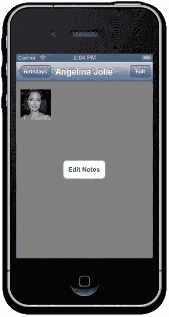

**图 7-13.** 将数据传递到更新中的 Birthday Detail 视图


### 添加新生日

在 Xcode 中打开 `BRBirthdayEditViewController.h` 头文件，然后像我们之前对生日详情视图控制器所做的那样，添加一个新的生日字典属性：

`@property (nonatomic, strong) NSMutableDictionary *birthday;`

在 `BRBirthdayEditViewController.m` 源文件中，修改 `viewWillAppear:` 的实现，使其根据 `birthday` 字典中的键值更新子视图：

```
-(void) viewWillAppear:(BOOL)animated
{
    [super viewWillAppear:animated];

    NSString *name = self.birthday [@"name"];
    NSDate *birthdate = self.birthday[@"birthdate"];
    UIImage *image = self.birthday[@"image"];

    self.nameTextField.text = name;
    self.datePicker.date = birthdate;
    if (image == nil) {
        //如果没有生日图片，默认使用生日蛋糕图片
        self.photoView.image = [UIImage imageNamed:@"icon-birthday-cake.png"];
    }
    else {
        self.photoView.image = image;
    }

    [self updateSaveButton];
}
```

回到故事板中，选择主页视图与编辑生日导航控制器之间的转场（segue），然后为其指定一个 `AddBirthday` 标识符。

在 `BRHomeViewController.m` 源文件中，首先导入 `BRBirthdayEditViewController.h`：

`#import "BRBirthdayEditViewController.h"`

现在我们将完成 `prepareForSegue:sender:` 的实现，并处理当用户点击“添加生日”栏按钮项时所调用的转场：

```
-(void) prepareForSegue:(UIStoryboardSegue *)segue sender:(id)sender
{
    NSString *identifier = segue.identifier;

    if ([identifier isEqualToString:@"BirthdayDetail"]) {
        //首先获取数据
        NSIndexPath *selectedIndexPath = self.tableView.indexPathForSelectedRow;
        NSMutableDictionary *birthday = self.birthdays[selectedIndexPath.row];

        BRBirthdayDetailViewController *birthdayDetailViewController = segue.destinationViewController;
        birthdayDetailViewController.birthday = birthday;
    }
    else if ([identifier isEqualToString:@"AddBirthday"]) {
        //向生日数组添加一个新的生日字典

        NSMutableDictionary *birthday = [NSMutableDictionary dictionary];

        birthday[@"name"] = @"我的朋友";
        birthday[@"birthdate"] = [NSDate date];
        [self.birthdays addObject:birthday];

        UINavigationController *navigationController = segue.destinationViewController;

        BRBirthdayEditViewController *birthdayEditViewController = (BRBirthdayEditViewController *)
navigationController.topViewController;
        birthdayEditViewController.birthday = birthday;
    }
}
```

当用户从主页视图控制器点击“添加生日”并且我们的 `prepareForSegue:sender:` 方法被调用时，我们会立即创建一个新的可变生日字典，为其分配默认的名称和生日日期值，并将其添加到 `self.birthdays` 数组中：

```
NSMutableDictionary *birthday = [NSMutableDictionary dictionary];

birthday[@"name"] = @"我的朋友";
birthday[@"birthdate"] = [NSDate date];
[self.birthdays addObject:birthday];
```

由于我们的“编辑生日”视图控制器是一个以模态方式呈现的导航视图控制器的子控制器，因此转场的 `destinationViewController` 属性就是该导航控制器。通过该导航控制器的引用，我们还可以获取对编辑生日视图控制器的引用，并最终在编辑视图控制器上设置新的生日属性：

```
BRBirthdayEditViewController *birthdayEditViewController = (BRBirthdayEditViewController *)
navigationController.topViewController;
birthdayEditViewController.birthday = birthday;
```

尽管我们已经修改了模型（生日数组），但主页视图控制器中的表格视图并不会自动刷新。由于我们通过主页视图控制器持有了表格视图的出口引用，因此修复起来很容易。在 `BRHomeViewController.m` 源文件中，重写 `viewWillAppear:` 以确保每次主页视图控制器即将出现时表格视图都会重新加载：

```
-(void) viewWillAppear:(BOOL)animated
{
    [super viewWillAppear:animated];
    [self.tableView reloadData];
}
```

构建并运行。现在你可以添加生日了（参见图 7-14）！

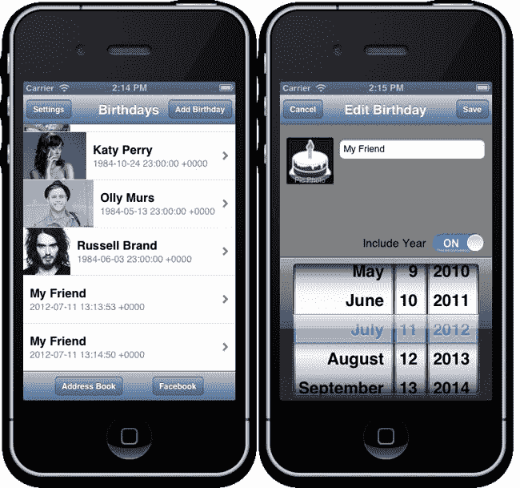

**图 7-14.** 添加朋友和生日！

好吧，你现在可以多次添加名为“我的朋友”的人，但仅此而已！我们稍后会对此进行改进。

请注意，在当前实现中，“保存”和“取消”按钮的功能完全相同：什么都不做！新的生日字典由主页视图控制器创建并添加到 `birthdays` 数组中。

为了实现“取消”功能，我们可以考虑两种方案：

> *   将生日数组以及选中的 `birthday` 字典都传递给编辑视图控制器，并设置 `cancelAndDismiss:` 方法从数组中删除该生日对象：`[self.birthdays removeObject:self.birthday]`。
> *   为生日编辑创建你自己的委托协议，让主页视图控制器成为编辑生日视图控制器的委托，并在主页视图控制器的代码中，响应委托回调方法，将生日字典从 `birthdays` 数组中移除。

不过，我们不会在本章中实现“取消”和“保存”按钮，因为这些功能将在下一章中结合 Core Data 来实现。


#### 编辑现有生日

在故事板中，找到`Birthday Detail`和`Edit Birthday`视图控制器之间的转场，并将其标识符设置为`EditBirthday`。正如我们为`Home`视图控制器所做的那样，现在将在`BRBirthdayDetailViewController.m`源文件中实现`prepareForSegue:sender:`方法。首先，导入`BRBirthdayEditViewController.h`：

```
#import "BRBirthdayEditViewController.h"
```

然后添加自定义的`prepareForSegue:sender:`方法：

```
-(void) prepareForSegue:(UIStoryboardSegue *)segue sender:(id)sender
{
    NSString *identifier = segue.identifier;

    if ([identifier isEqualToString:@"EditBirthday"]) {
        //编辑此生日
        UINavigationController *navigationController = segue.destinationViewController;

        BRBirthdayEditViewController *birthdayEditViewController =
(BRBirthdayEditViewController *) navigationController.topViewController;
        birthdayEditViewController.birthday = self.birthday;
    }
}
```

我们将`Birthday Detail`视图控制器中对`birthday`字典的引用传递给`Edit Birthday`视图控制器。其余代码应该看起来很熟悉！

构建并运行。现在你可以选择名人生日，在`Birthday Detail`视图控制器中显示它们，然后点击编辑按钮，将选中的生日传递并显示在`Edit Birthday`视图控制器中。

我们最后的挑战是，通过`Edit Birthday`视图控制器更新应用中传递的可变生日字典。

重新打开`BRBirthdayEditViewController.m`源文件。首先更新名称文本字段和日期选择器交互的目标-动作处理器：

```
- (IBAction)didChangeNameText:(id)sender {
    NSLog(@"The text was changed: %@",self.nameTextField.text);
    self.birthday[@"name"] = self.nameTextField.text;
    [self updateSaveButton];
}
```

以及……

```
- (IBAction)didChangeDatePicker:(id)sender {
    NSLog(@"New Birthdate Selected: %@",self.datePicker.date);
    self.birthday[@"birthdate"] = self.datePicker.date;
}
```

每当用户编辑生日名称文本字段时，我们都会更新所引用生日字典的`name`键值。同样，如果用户在日期选择器中更改了所选日期，我们也会更新`birthdate`。

最后，我们还将允许用户更改生日字典中存储的照片图像：

```
- (void)imagePickerController:(UIImagePickerController *)picker
didFinishPickingMediaWithInfo:(NSDictionary *)info {

    [picker dismissViewControllerAnimated:YES completion:nil];

    UIImage *image = info[UIImagePickerControllerOriginalImage];

    self.photoView.image = image;

    self.birthday[@"image"] = image;
}
```

构建并运行。

现在你可以添加新的生日，并设置名称、出生日期和照片。你甚至可以编辑现有的名人生日（参见图 7-15）！

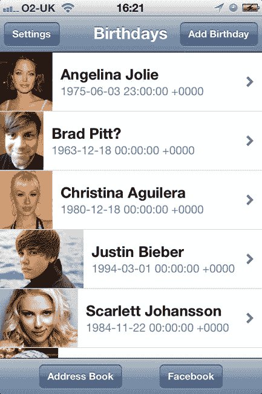

**图 7-15.** 这张图哪里不对劲？！

### 总结

在本章中，我们学习了如何处理基本的表视图和表视图单元格。我们发现了如何使用自定义字典对象数组动态填充表视图是多么容易。

我们还学习了如何允许一个视图控制器修改另一个视图控制器也引用的数据，并在`viewWillAppear:`被调用时（就在视图控制器被你的应用呈现之前）刷新显示。

我们学习了如何接入视图控制器子类的`prepareForSegue:sender:`方法，并在视图控制器之间传递数据对象。

你可能已经注意到我们的应用有一个显著的缺陷：会话之间没有任何数据是持久的。一旦你重新运行应用，它会重新加载`birthdays.plist`并清除所有数据修改。别担心，年轻的丹尼尔桑。接下来，我们将解锁 Core Data 持久化的奥秘。


## 第 8 章

## **使用 Core Data 实现数据持久化**

继续我们的数据发现之旅，你将学习如何使用 Core Data 构建数据存储解决方案：Apple 用于将数据持久化到文件系统的强大框架。当你读完本章时，你的应用将能够使用 Core Data 将生日对象读写到磁盘。即使你的应用因任何原因关闭，生日对象也会保持可用。

Core Data 为你许多喜爱的应用提供数据管理支持，从 Twitter 和 Instagram 到 Apple 的邮件和日历应用。这些应用让你即使 iPhone 离线也能查看数据：日历中的日记条目、最近收到的电子邮件、之前下载的推文。让你的应用能够存储数据以供离线使用，可以极大地改善用户体验，实现快速数据访问，并且无需保持持久的互联网连接。

*Birthday Reminder*将向用户提供三种添加新生日的方式：从 Facebook 导入、从 iPhone 通讯录导入，或通过编辑生日视图控制器手动添加。一旦生日被导入，就不再需要访问其原始来源；换句话说，从 Facebook 导入的生日不需要我们的应用持续连接 Facebook，它将在我们的应用中独立持久化，即使我们的用户离线。

尽管 Core Data 的初始学习曲线相当陡峭，但我还是想在这本书中向你介绍它，因为一旦你掌握了基础知识，它就会为你的应用中的持久数据管理带来各种可能性。我们为*Birthday Reminder*编写的代码只是触及了 Core Data 的皮毛，使我们的应用能够读取、写入和更新包含文本、数字、日期和二进制（图像缩略图）属性的生日模型对象。然而，如果你未来的应用需要更复杂的数据模型，请放心，Core Data 将成为你最好的朋友，并且你将拥有可以继续构建的基础知识。

### Core Data 简介

Core Data 是 Apple 为本地数据存储提供的对象关系映射（ORM）解决方案。这意味着，作为 Cocoa 开发者，我们可以用我们的原生编程语言 Objective-C 生成和操作数据对象。然后 Core Data 负责将这些数据对象和关系转换为可以保存到磁盘的另一种形式。默认情况下，Core Data 的底层存储是一个 SQLite 数据库。然而，我们的应用永远不需要直接连接到底层数据库。Core Data 充当通往文件存储系统的网关，并包含我们的应用程序代码为了创建、编辑和删除模型类实例以及保存持久更改而需要访问的管理和模型类。

为了向你介绍 Core Data，让我们从 Apple 的项目模板开始创建一个示例项目。


### 创建 Core Data 应用程序

Apple 在其许多 Xcode 模板中将 Core Data 作为一个选项提供，现在让我们来查看一个模板。启动 Xcode，并基于 Master-Detail 模板创建一个新的 iPhone 项目，如 图 8-1 所示。

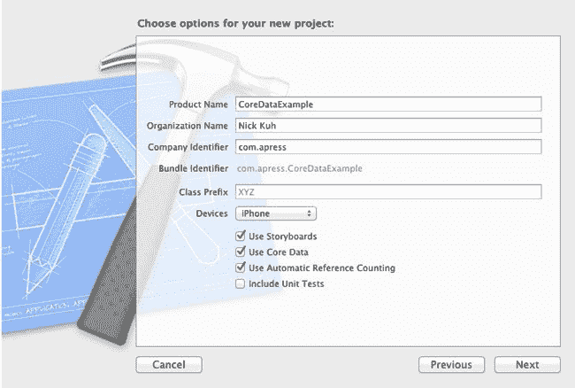

**图 8-1.** 新的 Master-Detail Core Data 示例项目选项

将项目命名为 `CoreDataExample`，并确保选中“使用 Core Data”选项。在模拟器中构建并运行新项目。点击“添加”按钮几次，然后点击“编辑”按钮；您应该会看到类似 图 8-2 的结果。

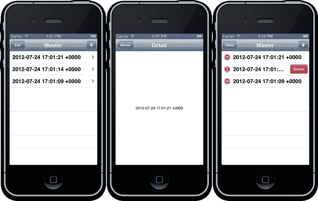

**图 8-2.** 正在运行的 Master-Detail Core Data 项目

如 图 8-2 所示，从使用 Core Data 的 Master-Detail 模板生成的 iPhone 应用程序允许用户创建、查看和删除包含时间戳属性的数据模型对象。重新构建并运行该应用程序。您会发现数据模型对象仍然显示；它们是持久的，并且已通过 Core Data 的神奇功能保存到了磁盘。然而，更重要的是，我们需要对 Core Data 的工作原理以及这种神奇功能背后的机制有更多了解。

### 持久化存储

在底层，Core Data 会将所有保存的数据更改翻译并存储到*持久化存储*中。持久化存储可以设置为以下三种存储类型之一：

> *   *内存存储* (`NSInMemoryStoreType`)：如果应用程序被强制退出，这种存储类型实际上并不持久。它通常用于数据对象的运行时缓存。
> *   *平面二进制文件* (`NSBinaryStoreType`)：在某些情况下，使用平面二进制文件可能会提高数据检索的性能；但缺点是随着存储数据的增长，二进制文件的大小和初始加载时间也会增加。
> *   *SQLite 数据库* (`NSSQLiteStoreType`)：这是 Core Data 驱动的应用程序中最常见的存储类型，也是 Apple 项目模板使用的默认类型。

我们将选择 SQLite 数据库存储类型。这应确保我们的应用程序在处理大型数据集时保持可扩展性。我通常建议在大多数基于 Core Data 的应用程序中坚持使用这个默认选择。

在运行时，初始化一个 Core Data 驱动的应用程序涉及创建一个持久化存储协调器实例 (`NSPersistentStoreCoordinator`)，以建立 Core Data 与持久化存储的连接。

让我们快速查看 `CoreDataExample` 项目中 `AppDelegate.m` 文件里的这段代码：

```
- (NSPersistentStoreCoordinator *)persistentStoreCoordinator
{
    if (_persistentStoreCoordinator != nil) {
        return _persistentStoreCoordinator;
    }

    NSURL *storeURL = [[self applicationDocumentsDirectory] URLByAppendingPathComponent:@"CoreDataExample.sqlite"];

    NSError *error = nil;
    _persistentStoreCoordinator = [[NSPersistentStoreCoordinator alloc] initWithManagedObjectModel:[self managedObjectModel]];
    if (![_persistentStoreCoordinator addPersistentStoreWithType:NSSQLiteStoreType configuration:nil URL:storeURL options:nil error:&error]) {
        NSLog(@"Unresolved error %@, %@", error, [error userInfo]);
        abort();
    }    

    return _persistentStoreCoordinator;
}
```

在高亮代码中，您可以看到我们定义了一个指向 SQLite 数据库文件的本地 URL。同时，我们还将实例化的持久化存储协调器连接到持久化存储，并传入 `NSSQLiteStoreType` 作为存储类型。这些是我们对底层数据库进行的唯一引用：其余工作将由 Core Data 处理。Core Data 会在指定位置创建 SQLite 数据库（如果它在之前的会话中尚未创建），并为我们管理该数据库。将来，如果我们的数据模型发生变化并需要迁移，在大多数情况下，Core Data 可以自动为我们更新和修改数据库。

*注意：我建议研究用于初始化持久化存储协调器的 Core Data 迁移选项。通过对大多数项目启用轻量级迁移，您将确保将来对数据模型所做的更改能由 Core Data 自动迁移。*

您可能还注意到，在前面的代码中，持久化存储协调器是使用对*托管对象模型*的引用进行实例化的，该模型是您的自定义模型对象图：模型中每个数据对象的定义、每个对象的属性以及对象之间的关系。但这些对象到底是什么呢？

### 实体与托管对象

在 Core Data 中，被创建、编辑和修改的原生 Objective-C 数据对象由称为*实体*的类描述来定义。根据这些实体描述，Core Data 会生成称为*托管对象*的对象实例，这些实例可以包含字符串、数字和日期等属性类型。托管对象还可以与模型中的其他托管对象建立关系。所有托管对象要么是 `NSManagedObject` 类的实例，要么是其子类。

我们使用键值方法来访问托管对象的属性。深入查看 `MasterViewController.m` 源文件，我们可以看到如何设置托管对象属性：

```
[newManagedObject setValue:[NSDate date] forKey:@"timeStamp"];
```

以及如何检索托管对象属性的值：

```
[object valueForKey:@"timeStamp"];
```

正如我们将在本章后面发现的，我们还可以对 `NSManagedObject` 进行子类化，这是键值编码的升级，因为它使我们能够对属性进行强类型化。

但是，我们如何定义实体并创建托管对象呢？Xcode 包含一个面向开发者的 UML 建模工具，接下来我们将介绍它。

### Core Data 模型文件

让我们更仔细地查看来自 Master-Detail 项目模板的 Core Data 模型。模型文件将与项目同名，因此在项目导航器中选择 `CoreDataExample.xcdatamodeld`（参见 图 8-3）。

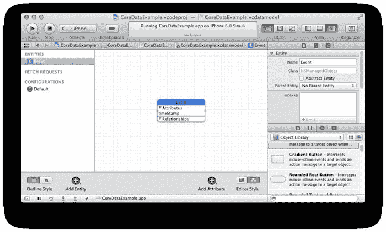

**图 8-3.** 一个基本的 Core Data 模型

在 图 8-3 中，您可以看到我让实用工具面板保持打开，因为当处理 Core Data 模型文件时，它包含数据模型检查器，这样我们就可以根据主编辑器面板中的选择来查看实体和属性的详细信息。您可以切换数据模型的 UML 图形化显示和表格化显示，如 图 8-4 所示。

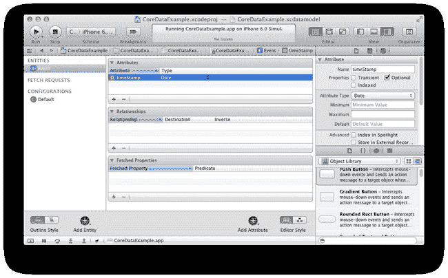

**图 8-4.** 使用表格式编辑器查看数据模型

如 图 8-3 和 8-4 所示，我们的模型只有一个名为 `Event` 的实体。`Event` 实体有一个名为 `timeStamp` 的属性。在 图 8-3 中，选中 `Event` 实体后，我们可以看到基于该实体的托管对象将自动分配给默认的 `NSManagedObject` 类。

在 图 8-4 中，使用表格式编辑器选项查看数据模型时，我选中了 `Event` 实体，编辑器列出了 `Event` 实体的属性（类似于属性）。在 Apple 的示例项目中，`Event` 只有一个属性：`timeStamp`。在编辑器中选择 `timeStamp` 还会显示该实体属性的详细信息：它是一个可选的属性，数据类型为 `NSDate`。因此，每次点击“添加”按钮时，主视图控制器都会创建一个新的 `Event` 实例，并将其 `timeStamp` 值设置为当前日期。然后它会保存 Core Data 上下文。

好的，作为一名高级文档工程师和翻译员，我将严格按照注意事项和示例格式，将您提供的英文文本翻译成中文。


#### 初始化 Core Data 模型

总结来说，Core Data 堆栈的结构可以如图 8-5 所示。

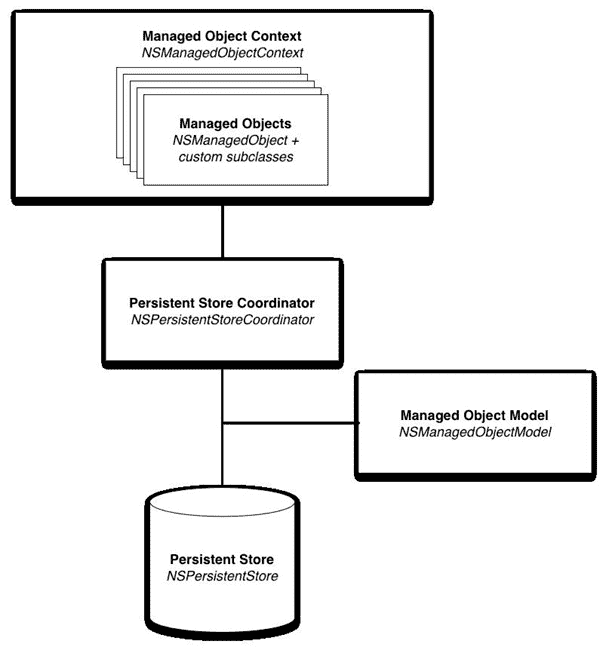

**图 8-5.** Core Data 堆栈的结构

在堆栈的底部是持久化存储区（默认为 SQLite 数据库）。我们将持久化存储区添加到持久化存储协调器中，该协调器通过一个托管对象模型进行初始化。这个托管对象模型基于我们刚刚在 Xcode 中看到的 `xcdatamodeld` 文件。最后，我们创建一个托管对象上下文（`NSManagedObjectContext`）实例，通过它我们既可以创建也可以访问应用中的托管对象实例。但什么是托管对象上下文呢？

一旦我们的 Core Data 模型在程序首次运行时初始化完毕，`NSManagedObjectContext` 将是唯一真正需要关心的类。添加、编辑和删除实体将直接通过托管对象上下文完成。

有点困惑吗？别担心，对于像 *Birthday Reminder* 这样相当简单的应用程序，用于初始化 Core Data 存储区和模型的代码几乎可以与你构建的每个应用完全相同。现在感觉好多了吗？很好！

#### 什么是托管对象上下文？

*托管对象上下文* 是应用程序中所有 Core Data 对象及其相互关系的表示。尽管在 *Birthday Reminder* 应用中我们只使用单个托管对象上下文，但在 iOS 应用中创建多个托管对象上下文的情况并不少见。多个托管对象上下文可以共享一个持久化存储区。但是，如果我们在一个托管对象上下文中对实体进行了更改，除非我们保存并合并上下文，否则这些更改不会反映在另一个上下文中。

通过 Core Data 模型中的单个托管对象上下文，我们将能够添加新实体、更改属性，并在需要时删除实体。当我们要将托管对象上下文的更改写入磁盘时，我们需要保存该上下文。

#### 添加、编辑、删除和保存实体

在 Master-Detail 示例应用中，一旦 `AppDelegate` 初始化了模型、存储区和托管对象上下文，它就会将托管对象上下文的引用传递给主视图控制器：

`controller.managedObjectContext = self.managedObjectContext;`

现在，主视图控制器可以通过其对托管对象上下文的引用来添加、编辑、删除和保存 Core Data 实体。

为了理解添加、编辑、删除和保存 Core Data 实体所需的代码，我们可以将 Apple 主视图控制器中的大量代码简化为以下示例：

##### 添加

```
NSManagedObject *newManagedObject = [NSEntityDescription
insertNewObjectForEntityForName:@”Event” inManagedObjectContext:self.managedObjectContext];
```

所有 Core Data 实体都是 `NSManagedObject` 类的实例或子类实例。然而，与大多数其他 Objective-C 类不同，我们不会通过 `alloc init` 创建 `NSManagedObject` 的实例。取而代之，我们调用 `NSEntityDescription` 的类方法，并传入我们的实体名称和托管对象上下文的引用。

##### 编辑

默认情况下，在我们的 Core Data 模型中定义的实体是 Apple 的 `NSManagedObject` 类的实例。为了设置属性，我们调用 `NSManagedObject` 的 `setValue:forKey:` 方法：

```
[aManagedObject setValue:[NSDate date] forKey:@"timeStamp"];
```

然而，通过数据模型检查器，我们还可以为实体指定自定义值对象类，Xcode 可以构建这些类供我们的应用使用。这样做的好处是严格的数据类型化；因此前面的代码将变为：

```
aManagedObject.timeStamp = [NSDate date];
```

当我们在本章后面将一个新的 Core Data 模型集成到 *Birthday Reminder* 应用中时，我们将学习更多关于自定义实体类的知识。

##### 删除

删除 Core Data 实体非常简单：

```
[self.managedObjectContext deleteObject:aManagedObject];
```

##### 保存

当我们准备好让 Core Data 将更改写入磁盘（持久化存储区）时，我们在托管对象上下文上调用 `save:` 方法：

```
NSError *error = nil;
    if ([self.managedObjectContext hasChanges]) {
        if (![self.managedObjectContext save:&error]) {//保存失败
            NSLog(@"保存失败: %@",[error localizedDescription]);
        }
        else {
            NSLog(@"保存成功");
        }
    }
```

调用保存的时机示例包括用户点击编辑生日视图控制器中的保存按钮时，或者在我们完成导入一批生日之后。

### 在 Birthday Reminder 中实现 Core Data

在我们开始在 *Birthday Reminder* 应用中实现 Core Data 之前，我们需要将 Core Data 框架添加到项目的 target 中。target 是当我们构建项目时 Xcode 为我们编译生成的 iPhone 应用程序。

#### 添加 Core Data 框架

要向我们的项目添加 Apple 框架，首先在项目导航器中选择 `BirthdayReminder` 项目，然后选择 `BirthdayReminder` target，最后选择“构建阶段”选项卡，如图 8-6 所示。

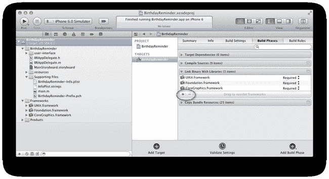

**图 8-6.** 准备添加新框架

展开“将二进制文件与库链接”窗格，您将看到已链接到项目中的框架：`UIKit`、`Foundation` 和 `CoreGraphics`。要添加 Core Data，点击突出显示的 + 按钮，然后在模态窗口中双击列出的 `CoreData.framework`。太好了，Core Data 框架已添加！我们现在可以在应用中引用 Core Data 类。不过在此之前，有一种简单的方法可以为应用中的所有类导入 Core Data 框架头文件：在我们的项目前缀文件中定义导入声明。找到并在项目导航器中选择 `BirthdayReminder-Prefix.pch`。现在，在 `Foundation` 和 `UIKit` 导入声明旁边添加 Core Data 导入声明：

```
#ifdef __OBJC__
    #import <UIKit/UIKit.h>
    #import <Foundation/Foundation.h>
#import <CoreData/CoreData.h>
#endif
```

现在，我们将能够引用 Core Data 框架类，而无需重复导入主要的 Core Data 框架头文件。

接下来，我们为应用创建一个 Core Data 模型。

#### 创建 Core Data 模型

到目前为止，我们主要关注应用的用户界面。现在将注意力转向黑暗的数据侧，让我们创建一个新文件夹来存储所有 Core Data 和模型类。在您的 *Birthday Reminder* 项目的根目录中添加一个名为 `data` 的新文件夹，然后将新 `data` 文件夹作为新组添加到您的 Xcode 项目中（见图 8-7）。

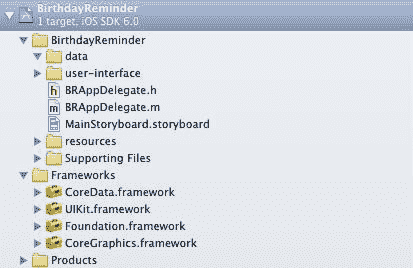

**图 8-7.** 添加到项目目录的新数据组

在项目导航器中，选择新添加的 `data` 组，然后使用 N 键盘快捷键或 文件  新建  文件，从 Core Data 文件模板中选择“数据模型”选项。将新的数据模型命名为 `BirthdayReminder.xcdatamodeld` 并点击“创建”按钮，如图 8-8 所示。

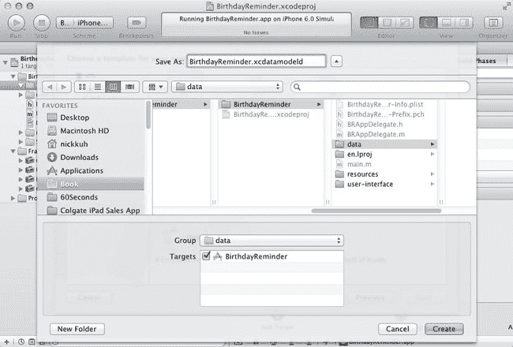

**图 8-8.** 创建新的 Core Data 模型


