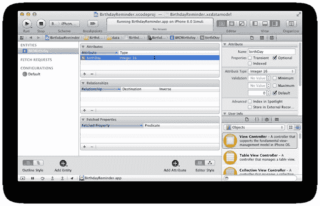
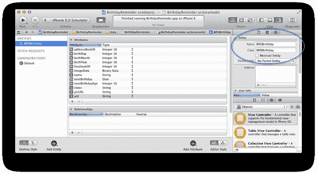
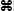
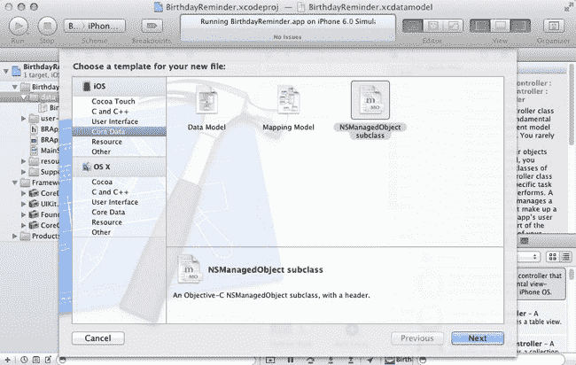

# 定义核心数据实体

我们已经创建了一个 Core Data 模型文件。接下来，我们将在模型中创建一个生日实体。在项目导航器中选中新的 `BirthdayReminder.xcdatamodeld` 文件，点击编辑器中的添加实体按钮，并将新实体命名为 `BRDBirthday`。

现在选中新的 `BRDBirthday` 实体，我们将通过点击编辑器面板底部的添加属性按钮来添加第一个属性 `birthDay`，然后输入 `birthDay` 作为属性名称。选中新的 `birthDay` 属性后，确保工具面板已打开，如果当前不可见，请切换到数据模型检查器面板。然后将属性类型设置为 Integer 16（参见 图 8-9）。



**图 8-9.** 定义 Core Data 实体属性

现在让我们为 `Birthday` 实体添加其余属性，如下所示。请务必注意大小写：

- `addressBookID` Integer 16
- `birthDay` Integer 16
- `birthMonth` Integer 16
- `birthYear` Integer 16
- `facebookID` String
- `imageData` Binary Data
- `name` String
- `nextBirthday` Date
- `nextBirthdayAge` Integer 16
- `notes` String
- `picURL` String
- `uid` String

注意到我们也可以在 Core Data 实体属性中存储二进制数据了吗？这对于存储图像图标数据非常理想。`picURL` 将专门用于 Facebook 生日的个人资料照片 URL。Facebook 用户会定期更换他们的个人资料照片，因此我们不会缓存他们的照片，而是确保定期下载最新的 Facebook 个人资料照片。

我有意避免包含出生日期属性。正如我们明天将发现的，Facebook 和通讯录中的生日通常不包括出生年份，因此我们实际上并不总是知道生日的完整日期，在某些情况下只知道月份和日期。

现在选择 `BRDBirthday` 实体而不是它的属性。数据模型检查器应该会更新，并允许您修改 `BRDBirthday` 实体当前分配的默认 `NSManagedObject` 类。将其更改为 `BRDBirthday`（参见 图 8-10）。



**图 8-10.** 将 `BRDBirthday` 实体分配给 `BRDBirthday` 类

Xcode 将为我们生成一个名为 `BRDBirthday` 的 `NSManagedObject` 子类，其中包含我们指定的所有生日属性。

在项目导航器中选中 `data` 组，使用  键盘快捷键或通过 文件  新建  文件，并从 Core Data 集合中选择 `NSManagedObject` 子类，开始为生日创建新的 `NSManagedObject` 子类的过程（参见 图 8-11）。



**图 8-11.** 创建 `NSManagedObject` 子类

在下一个对话框屏幕上，在 Finder 中选择 `data` 文件夹作为新类的目标位置。保持“为原始数据类型使用标量属性”选项未选中，然后点击创建。

查看 Xcode 为我们生成的 `BRDBirthday` 类。注意到我们所有的整数现在都是 `NSNumber` 对象而不是基本类型了吗？与字典和数组一样，Core Data 不能使用基本类型作为属性；这就是为什么它们被包装在 `NSNumber` 实例中。

#### 扩展实体

将 `BRDBirthday` 创建为 `NSManagedObject` 的子类还有额外的好处。我们可以直接向 `BRDBirthday` 子类添加新的方法和非持久化属性。我们存储中的生日将按照主视图控制器中下一个即将到来的生日顺序列出。我们已经在 `BRDBirthday` 上创建了属性来存储下一个生日日期和下一个生日年龄，但我们尚未设置它们的值。

> **注意：** 向 `NSManagedObject` 子类添加代码的一个注意事项是，如果您对 Core Data 模型做了更改，需要确保不会覆盖 Xcode 生成的实体类。您只需手动添加/删除对实体子类的更改。

打开 `BRDBirthday.h` 头文件，并添加以下新的公共方法和属性声明：

```
@property (nonatomic,readonly) int remainingDaysUntilNextBirthday;
@property (nonatomic,readonly) NSString *birthdayTextToDisplay;
@property (nonatomic,readonly) BOOL isBirthdayToday;

-(void)updateNextBirthdayAndAge;
-(void)updateWithDefaults;
```

以下是对这些新属性和方法在 *Birthday Reminder* 中如何使用的简要说明：

- `remainingDaysUntilNextBirthday`：为用户提供每个朋友下一个生日前的天数倒计时。
- `birthdayTextToDisplay`：人类可读的文本字符串，例如“还有 44 天”或“5 月 26 日，34 岁”。
- `isBirthdayToday`：如果今天是用户的生日，我们将显示生日蛋糕图像，而不是生日倒计时（参见 第 9 章）。
- `updateNextBirthdayAndAge`：我们将使用此方法来更新 `nextBirthday` 和 `nextBirthdayAge`。
- `updateWithDefaults`：当点击**添加生日**按钮时，我们将调用此方法来设置 `BRDBirthday` 实体所需的基本属性，即 `birthdayDay` 和 `birthMonth`。

切换到 `BRDBirthday.m` 源文件，让我们添加这些新实例方法和属性的实现：

```
-(void)updateNextBirthdayAndAge
{
    NSDate *now = [NSDate date];

    NSCalendar *calendar = [NSCalendar currentCalendar];

    NSDateComponents *dateComponents = [[NSCalendar currentCalendar]
components:NSYearCalendarUnit|NSMonthCalendarUnit|NSDayCalendarUnit fromDate:now];
    NSDate *today = [calendar dateFromComponents:dateComponents];

    dateComponents.day = [self.birthDay intValue];
    dateComponents.month = [self.birthMonth intValue];

    NSDate *birthdayThisYear = [calendar dateFromComponents:dateComponents];

    if ([today compare:birthdayThisYear] == NSOrderedDescending) {
        //今年的生日已过，所以下一个生日是明年
        dateComponents.year++;
        self.nextBirthday = [calendar dateFromComponents:dateComponents];
    }
    else {
        self.nextBirthday = [birthdayThisYear copy];
    }

    if ([self.birthYear intValue] > 0) {
        self.nextBirthdayAge = [NSNumber numberWithInt:dateComponents.year - [self.birthYear intValue]];
    }
    else {
        self.nextBirthdayAge = [NSNumber numberWithInt:0];
    }

}
```

我们的代码假设 `BRDBirthday` 实例的 `birthDay` 和 `birthMonth` 属性始终被设置。这为我们提供了足够的信息来计算朋友今年的生日。我们使用当前日期创建一个 `NSDateComponents` 实例。这确保了 `NSDateComponents` 实例的年份属性自动设置为当前年份。然后，我们用朋友生日的日期和月份覆盖 `NSDateComponents` 的日期和月份属性。现在我们的 `NSDateComponents` 实例拥有了足够的数据来计算朋友今年生日的日期。根据 `birthdayThisYear` 的值，我们可以判断日期是否已过，并将 `BRDBirthday` 的 `nextBirthday` 值设置为朋友今年或明年的生日。


*注意：通过从 `NSDateComponents` 实例中提取 `nextBirthday`（我们已使用单位标志 `NSYearCalendarUnit`、`NSMonthCalendarUnit` 和 `NSDayCalendarUnit` 初始化该实例），我们将获取一个对应于生日当天凌晨 00:00 的日期。理解这一点很重要，因为进行日期比较时，我们比较的是年中的天数，而非小时、分钟和秒。*

如果生日实体已设置出生年份，则将 `nextBirthdayAge` 设置为朋友的出生年份与其下一个生日（今年或明年）年份之间的差值。或者，如果朋友对其出生年份保密，则我们将 `nextBirthdayAge` 默认为 0。

让我们来实现 `updateWithDefaults` 方法：

```
-(void) updateWithDefaults
{
    NSDateComponents *dateComponents = [[NSCalendar currentCalendar]
components:NSYearCalendarUnit|NSMonthCalendarUnit|NSDayCalendarUnit fromDate:[NSDate date]];

    self.birthDay = @(dateComponents.day);
    self.birthMonth = @(dateComponents.month);
    self.birthYear = @0;

    [self updateNextBirthdayAndAge];
}
```

现在，我们来添加三个 `readonly` getter 方法：`remainingDaysUntilNextBirthday`、`birthdayTextToDisplay` 和 `isBirthdayToday`：

```
-(int) remainingDaysUntilNextBirthday
{
    NSDate *now = [NSDate date];
    NSCalendar *calendar = [NSCalendar currentCalendar];
    NSDateComponents *componentsToday = [calendar
components:NSYearCalendarUnit|NSMonthCalendarUnit|NSDayCalendarUnit fromDate:now];
    NSDate *today = [calendar dateFromComponents:componentsToday];

    NSTimeInterval timeDiffSecs = [self.nextBirthday timeIntervalSinceDate:today];

    int days = floor(timeDiffSecs/(60.f*60.f*24.f));

    return days;
}

-(BOOL) isBirthdayToday
{
    return [self remainingDaysUntilNextBirthday] == 0;
}

-(NSString *) birthdayTextToDisplay {

    NSDate *now = [NSDate date];
    NSCalendar *calendar = [NSCalendar currentCalendar];
    NSDateComponents *componentsToday = [calendar
components:NSYearCalendarUnit|NSMonthCalendarUnit|NSDayCalendarUnit fromDate:now];
    NSDate *today = [calendar dateFromComponents:componentsToday];

    NSDateComponents *components = [calendar components:NSMonthCalendarUnit|NSDayCalendarUnit
fromDate:today toDate:self.nextBirthday options:0];

    if (components.month == 0) {
        if (components.day == 0) {
            //今天！

            if ([self.nextBirthdayAge intValue] > 0) {
                return [NSString stringWithFormat:@"%@ 今天！",self.nextBirthdayAge];
            }
            else {
                return @"今天！";
            }
        }
        if (components.day == 1) {
            //明天！
            if ([self.nextBirthdayAge intValue] > 0) {
                return [NSString stringWithFormat:@"%@ 明天！",self.nextBirthdayAge];
            }
            else {
                return @"明天！";
            }
        }
    }

    NSString *text = @"";

    if ([self.nextBirthdayAge intValue] > 0) {
        text = [NSString stringWithFormat:@"%@ 在 ",self.nextBirthdayAge];
    }

    static NSDateFormatter *dateFormatterPartial;

    if (dateFormatterPartial == nil) {
        dateFormatterPartial = [[NSDateFormatter alloc] init];
        [dateFormatterPartial setDateFormat:@"MMM d"];
    }

    return [text stringByAppendingFormat:@"%@",[dateFormatterPartial
stringFromDate:self.nextBirthday]];
}
```

你应该能够通读并理解 `remainingDaysUntilNextBirthday` 和 `isBirthdayToday` 方法的代码，但 `birthdayTextToDisplay` 需要额外解释。其中最重要的代码行如下：

```
NSDateComponents *components = [calendar components:NSMonthCalendarUnit|NSDayCalendarUnit
fromDate:today toDate:self.nextBirthday options:0];
```

`NSDateComponents` 类也可用于计算两个日期之间的差值。通过使用 `NSMonthCalendarUnit` 和 `NSDayCalendarUnit` 单位标志初始化 `NSDateComponents` 实例，我们可以获取今天与朋友下一个生日之间的月数和天数。如果这两个值都等于 0，那么朋友的生日必定是今天！或者，如果月份差值为 0 而天数为 1，则朋友的下一个生日就在一天后——也就是明天！

请确保你的应用版本仍能正常编译。目前你在应用中还看不到任何差异，因为我们尚未将生日数组数据模型转换为新的 Core Data 存储模型。我们甚至还没有在代码中初始化 Core Data 模型。这正是我们的下一步任务。


