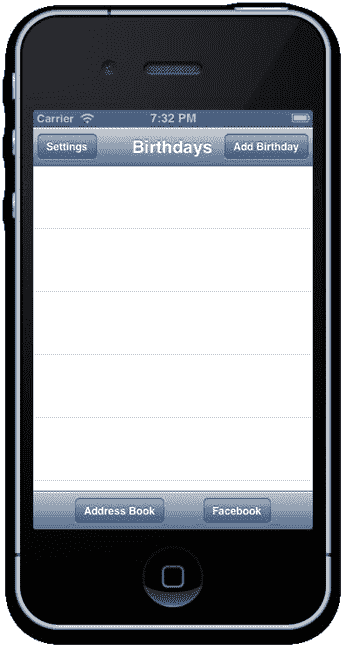
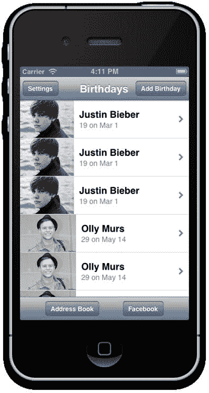

# 使用 `NSFetchedResultsController` 将表格视图与结果集关联

为了检索 Core Data 实体的存储结果集，Apple 提供了一个名为 `NSFetchedResultsController` 的便捷抓取类。获取的结果控制器不仅能根据查询对 Core Data 实体执行有初始顺序的抓取，还提供了委托回调方法，以提醒其委托结果集发生了变化。例如新增、修改或删除托管对象等变更。这是一个非常强大的类，我们将使用它来追踪 Core Data 存储中 `BRDBirthday` 实体列表，并在主页视图控制器中显示它们。

打开 `BRHomeViewController.h` 的头文件，声明我们的主页视图控制器实现了 `NSFetchedResultsControllerDelegate` 协议：

`@interface BRHomeViewController :`
`BRCoreViewController<UITableViewDelegate,UITableViewDataSource,`
`NSFetchedResultsControllerDelegate>`

打开 `BRHomeViewController.m` 源文件，导入新的 `BRDBirthday.h` 和 `BRDModel.h` 头文件，并在主页视图控制器中声明一个新的获取结果控制器私有属性：

```
#import "BRHomeViewController.h"
#import "BRBirthdayDetailViewController.h"
#import "BRBirthdayEditViewController.h"
#import "BRDBirthday.h"
#import "BRDModel.h"

@interface BRHomeViewController()
@property (nonatomic, strong) NSFetchedResultsController *fetchedResultsController;
@property (nonatomic,strong) NSMutableArray *birthdays;

@end
```

我们将对获取结果控制器进行懒加载；也就是说，只有在代码中首次需要它时才会实例化。为此，我们重写了 `self.fetchedResultsController` 的 getter 访问方法。在创建存储的获取结果控制器实例之前，我们会检查实例变量 `_fetchedResultsController` 是否尚未实例化。在 `BRHomeViewController.m` 中添加 `fetchedResultsController` 的新访问方法：

```
#pragma mark 用于追踪 Core Data 中 BRDBirthday 托管对象的获取结果控制器

- (NSFetchedResultsController *)fetchedResultsController {
    if (_fetchedResultsController == nil) {

        NSFetchRequest *fetchRequest = [[NSFetchRequest alloc] init];

        // 通过模型单例访问唯一的托管对象上下文
        NSManagedObjectContext *context = [BRDModel sharedInstance].managedObjectContext;

        // 获取请求需要实体描述——我们只对 BRDBirthday 托管对象感兴趣
        NSEntityDescription *entity = [NSEntityDescription entityForName:@"BRDBirthday" inManagedObjectContext:context];
        fetchRequest.entity = entity;

        // 目前我们将按名称排序顺序排列 BRDBirthday 对象
        NSSortDescriptor *sortDescriptor = [[NSSortDescriptor alloc]
initWithKey:@"nextBirthday" ascending:YES];
        NSArray *sortDescriptors = [[NSArray alloc] initWithObjects:sortDescriptor, nil];
        fetchRequest.sortDescriptors = sortDescriptors;

        self.fetchedResultsController = [[NSFetchedResultsController alloc]
initWithFetchRequest:fetchRequest managedObjectContext:context sectionNameKeyPath:nil
cacheName:nil];
        self.fetchedResultsController.delegate = self;
        NSError *error = nil;
        if (![self.fetchedResultsController performFetch:&error]) {

            NSLog(@"未解决的错误 %@, %@", error, [error userInfo]);
            abort();
        }

    }

        return _fetchedResultsController;
}
```

获取结果控制器需要一个获取请求：它需要知道应获取的托管对象类型以及应返回结果的顺序。因此，我们首先创建一个 `NSFetchRequest` 实例，然后将其传递给新的 `NSFetchedResultsController`。我们将获取请求的实体设置为唯一的实体 `BRDBirthday`，并指定结果应按 `BRDBirthday` 的 `nextBirthday` 字符串属性顺序返回。

最后，我们调用结果控制器通过 `performFetch:` 方法执行获取请求，从而用存储中所有的 `BRDBirthday` 托管对象填充获取结果控制器（目前还没有！）。

将主页视图控制器设置为获取结果控制器的委托有一个很好的理由：我们希望通过保留的获取结果控制器捕获结果集发生的任何变更，例如新增或编辑的生日托管对象。Apple 的开发者文档指出：*委托必须至少实现一个变更跟踪委托方法，才能启用变更跟踪。* 提供 `controllerDidChangeContent:` 的空实现就足够了。^(1)

因此，为了确保获取结果控制器保持最新，我们将在 `BRHomeViewController.m` 类中实现一个空的 `NSFetchedResultsControllerDelegate` 协议方法：

```
#pragma mark NSFetchedResultsControllerDelegate

- (void)controllerDidChangeContent:(NSFetchedResultsController *)controller {
    // 获取的结果已更改
}
```

找到用于填充表格视图的两个 `UITableViewDataSource` 协议方法（`tableView:cellForRowAtIndexPath:` 和 `tableView:numberOfRowsInSection:`），并将其替换为以下内容：

```
- (UITableViewCell *)tableView:(UITableView *)tableView cellForRowAtIndexPath:(NSIndexPath
*)indexPath
{
    UITableViewCell *cell = [self.tableView dequeueReusableCellWithIdentifier:@"Cell"];

    BRDBirthday *birthday = [self.fetchedResultsController objectAtIndexPath:indexPath];

    cell.textLabel.text = birthday.name;
    cell.detailTextLabel.text = birthday.birthdayTextToDisplay;
    cell.imageView.image = [UIImage imageWithData:birthday.imageData];
    return cell;
}

- (NSInteger)tableView:(UITableView *)tableView numberOfRowsInSection:(NSInteger)section
{
    id <NSFetchedResultsSectionInfo> sectionInfo = [[self.fetchedResultsController sections] objectAtIndex:section];
    return [sectionInfo numberOfObjects];
}
```

____________________

¹ iOS 开发者库，“NSFetchedResultsController 类参考”，
[`http://developer.apple.com/library/ios/#DOCUMENTATION/CoreData/Reference/NSFetchedResultsController_Class/Reference/Reference.html`](http://developer.apple.com/library/ios/#DOCUMENTATION/CoreData/Reference/NSFetchedResultsController_Class/Reference/Reference.html)。

我们通过 `objectAtIndexPath:` 方法访问获取结果控制器结果集中的实体。与表格类似，获取结果控制器可以有多个分区。在我们的案例中，只有一个分区包含 Core Data 存储中的所有 `BRDBirthday` 实体。

你的应用现在将尝试初始化新的空 Core Data 模型。如果运气好的话，你现在应该能够构建并运行应用而不会出错。但是，如果编译成功但崩溃，请确保你将从 Apple 示例 Master-Detail 模板项目复制的代码中所有 `CoreDataExample` 引用都替换为 `BirthdayReminder`。此外，新的 Core Data 模型可能未被复制到目标包中；这可以通过尝试以下一种或两种方法轻松解决：

> * 使用快捷键 K 或菜单 Product  Clean 执行产品清理。
> * 如果清理失败，则从模拟器或设备中删除 Birthday Reminder，然后重新构建并运行。

假设你现在可以构建并运行，那么我们的应用目前没有生日数据（参见图 8-12）。



**图 8-12.** 已连接到 Core Data 模型，但没有任何生日数据


#### 填充 Core Data 存储

在开始从 Core Data 模型创建新的 `BRDBirthday` 实例之前，我们将在 `BRDModel` 中添加一个新的 `saveChanges` 方法。这是一个公共实例方法，因此需要在 `BRDModel.h` 中添加声明：

`- (void)saveChanges;`

然后在 `BRDModel.m` 源文件中实现：

```
- (void)saveChanges
{
    NSError *error = nil;
    if ([self.managedObjectContext hasChanges]) {
        if (![self.managedObjectContext save:&error]) {//保存失败
            NSLog(@"保存失败: %@",[error localizedDescription]);
        }
        else {
            NSLog(@"保存成功");
        }
    }
}
```

接下来，我们将名人生日数据导入 Core Data 模型，从而填充 Home 视图控制器中的数据库和生日表格视图。删除并替换 `BRHomeViewController.m` 中当前版本的 `initWithCoder:` 方法，替换为以下内容：

```
- (id) initWithCoder:(NSCoder *)aDecoder
{
    self = [super initWithCoder:aDecoder];

    if (self) {
        NSString* plistPath = [[NSBundle mainBundle] pathForResource:@"birthdays" ofType:@"plist"];
        NSArray *nonMutableBirthdays = [NSArray arrayWithContentsOfFile:plistPath];

        BRDBirthday *birthday;
        NSDictionary *dictionary;
        NSString *name;
        NSString *pic;
        NSString *pathForPic;
        NSData *imageData;
        NSDate *birthdate;
        NSCalendar *calendar = [NSCalendar currentCalendar];

        NSManagedObjectContext *context = [BRDModel sharedInstance].managedObjectContext;

        for (int i=0;i<[nonMutableBirthdays count];i++) {
            dictionary = nonMutableBirthdays[i];

            birthday = [NSEntityDescription insertNewObjectForEntityForName:@"BRDBirthday"
inManagedObjectContext:context];

            name = dictionary[@"name"];
            pic = dictionary[@"pic"];
            birthdate = dictionary[@"birthdate"];
            pathForPic = [[NSBundle mainBundle] pathForResource:pic ofType:nil];
            imageData = [NSData dataWithContentsOfFile:pathForPic];
            birthday.name = name;
            birthday.imageData = imageData;
            NSDateComponents *components = [calendar
components:NSYearCalendarUnit|NSMonthCalendarUnit|NSDayCalendarUnit fromDate:birthdate];
            //新的字面量语法，等同于
            //birthday.birthDay = [NSNumber numberWithInt:components.day];
            birthday.birthDay = @(components.day);
            birthday.birthMonth = @(components.month);
            birthday.birthYear = @(components.year);
            [birthday updateNextBirthdayAndAge];
        }
        [[BRDModel sharedInstance] saveChanges];
    }

    return self;
}
```

目前，我们只是创建新的 Core Data `BRDBirthday` 实体，并为每个名人生日设置属性 `name`、`imageData`、`birthDay`、`birthMonth` 和 `birthYear`。我们还在每个新建的生日托管对象上调用了扩展的 `updateNextBirthdayAndAge` 方法，该方法会填充 `nextBirthday` 和 `nextBirthdayAge` 属性。遍历完生日字典的 `plist` 并为每个字典插入一个新的生日实体后，我们在模型上调用新的 `saveChanges` 方法。

现在构建并运行。你应该能看到名人列表。再构建并运行几次。你是否注意到任何异常，例如图 8-13 所示的情况？



**图 8-13.** 太多比伯了？

每次我们重建并运行应用时，都会在 Home 视图控制器的 `initWithCoder:` 初始化方法中创建并保存一批新的 `BRDBirthday` 托管对象。只要我们在之前的应用会话中至少保存了一次 Core Data，我们就能在从名人 `plist` 生日数据导入之前预先填充获取结果控制器的结果集。所以数据确实按预期持久化了。问题在于，每次运行应用时，我们都在不断创建新的重复生日实例并将它们添加到数据存储中。我们需要添加一种方法来避免导入重复数据。

### 重复实体与同步

避免添加重复生日托管对象的一个有效方法是在 `BRDBirthday` 实例上引用唯一标识符，以检查我们是否已在存储中创建了匹配的生日。这就是我们在定义 Core Data 模型中的 `BRDBirthday` 实体时创建 `uid` 字符串属性的原因。

我们将使用名人姓名作为唯一标识符（当后续从 Facebook 或通讯录导入时，我们会使用唯一的个人资料标识符）。在创建新的生日托管对象之前，我们将遍历 `plist` 中的生日字典，并将所有姓名拼接成一个唯一 ID 数组。然后，使用该 ID 数组创建一个 Core Data 获取请求，返回具有匹配 `uid` 的任何现有 `BRDBirthday` 实体。我们将在 `BRDModel` 单例类的新方法中创建用于检查现有生日的获取请求，因为这种重复检查功能在我们开始从其他来源（如 Facebook 和通讯录）导入时也会派上用场。

切换到 `BRDModel`。

在 `BRDModel.h` 中添加一个新的公共方法声明：

`-(NSMutableDictionary *) getExistingBirthdaysWithUIDs:(NSArray *)uids;`

切换到 `BRDModel.m` 源文件并导入 `BRDBirthday`：

`#import "BRDBirthday.h"`

然后实现该方法：

```
-(NSMutableDictionary *) getExistingBirthdaysWithUIDs:(NSArray *)uids
{
    NSFetchRequest *fetchRequest = [[NSFetchRequest alloc] init];

    NSManagedObjectContext *context = self.managedObjectContext;

    //NSPredicate 用于过滤结果集。
    //此谓词指定结果中的 uid 属性必须匹配 uids 数组中的一个或多个值
    NSPredicate *predicate = [NSPredicate predicateWithFormat:@"uid IN %@", uids];
    fetchRequest.predicate = predicate;

    NSEntityDescription *entity = [NSEntityDescription entityForName:@"BRDBirthday"
inManagedObjectContext:context];
    fetchRequest.entity = entity;

    NSSortDescriptor *sortDescriptor = [[NSSortDescriptor alloc] initWithKey:@"uid"
ascending:YES];
    NSArray *sortDescriptors = [[NSArray alloc] initWithObjects:sortDescriptor, nil];
    fetchRequest.sortDescriptors = sortDescriptors;

    NSFetchedResultsController *fetchedResultsController = [[NSFetchedResultsController alloc]
initWithFetchRequest:fetchRequest managedObjectContext:context sectionNameKeyPath:nil
cacheName:nil];

    NSError *error = nil;
    if (![fetchedResultsController performFetch:&error]) {

        NSLog(@"未解决的错误 %@, %@", error, [error userInfo]);
        abort();
    }

    NSArray *fetchedObjects = fetchedResultsController.fetchedObjects;

    NSInteger resultCount = [fetchedObjects count];

        if (resultCount == 0) return [NSMutableDictionary dictionary];//Core Data 存储中没有数据

    BRDBirthday *birthday;

        NSMutableDictionary *tmpDict = [NSMutableDictionary dictionary];

    int i;

    for (i = 0; i < resultCount; i++) {
        birthday =  fetchedObjects[i];
        tmpDict[birthday.uid] = birthday;
    }

    return tmpDict;
}
```

我们创建了另一个获取结果控制器，但仅用于新的 `getExistingBirthdaysWithUIDs:` 方法临时作用域。从托管对象上下文中检索到结果后，它们会被打包成一个字典，使用 `uid` 属性作为键，`BRDBirthday` 托管对象作为值。

请注意，我们现在创建了一个 `NSPredicate` 实例，以便获取请求仅限制为匹配谓词查询的 `BRDBirthday` 实体：

```
NSPredicate *predicate = [NSPredicate predicateWithFormat:@"uid IN %@", uids];
fetchRequest.predicate = predicate;
```


