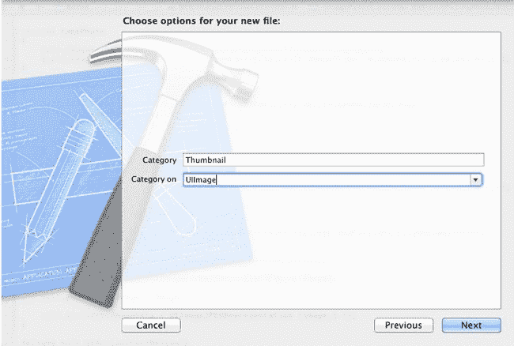
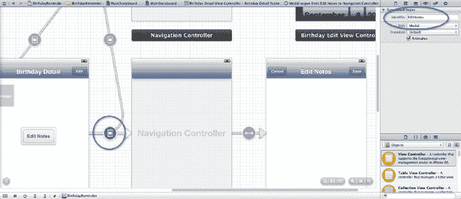

# NSPredicate 与生日提醒优化

`NSPredicate` 类用于过滤结果集。此代码应优化结果集以实现可扩展性，因为我们仅请求结果集中那些 `uid` 属性与 `uids` 数组参数中一个或多个值匹配的 `BRDBirthday` 托管对象。

#### 更新主视图控制器

回到主视图控制器中，我们现在将在 `initWithCoder:` 方法中添加代码，以利用我们模型的 `getExistingBirthdaysWithUIDs:` 方法：

```
- (id) initWithCoder:(NSCoder *)aDecoder
{
    self = [super initWithCoder:aDecoder];

    if (self) {
        NSString* plistPath = [[NSBundle mainBundle] pathForResource:@"birthdays" ofType:@"plist"];
        NSArray *nonMutableBirthdays = [NSArray arrayWithContentsOfFile:plistPath];

        BRDBirthday *birthday;
        NSDictionary *dictionary;
        NSString *name;
        NSString *pic;
        NSString *pathForPic;
        NSData *imageData;
        NSDate *birthdate;
        NSCalendar *calendar = [NSCalendar currentCalendar];

        NSString *uid;
        NSMutableArray *uids = [NSMutableArray array];
        for (int i=0;i<[nonMutableBirthdays count];i++) {
            dictionary = [nonMutableBirthdays objectAtIndex:i];
            uid = dictionary[@"name"];
            [uids addObject:uid];
        }
        NSMutableDictionary *existingEntities = [[BRDModel sharedInstance] getExistingBirthdaysWithUIDs:uids];

        NSManagedObjectContext *context = [BRDModel sharedInstance].managedObjectContext;

        for (int i=0;i<[nonMutableBirthdays count];i++) {
            dictionary = nonMutableBirthdays[i];

            uid = dictionary[@"name"];

            birthday = existingEntities[uid];

            if (birthday) {//生日已存在

            }
            else {//生日不存在，因此创建它
                birthday = [NSEntityDescription insertNewObjectForEntityForName:@"BRDBirthday" inManagedObjectContext:context];
                existingEntities[uid] = birthday;
                birthday.uid = uid;

            }

            name = dictionary[@"name"];
            pic = dictionary[@"pic"];
            birthdate = dictionary[@"birthdate"];
            pathForPic = [[NSBundle mainBundle] pathForResource:pic ofType:nil];
            imageData = [NSData dataWithContentsOfFile:pathForPic];
            birthday.name = name;
            birthday.imageData = imageData;
            NSDateComponents *components = [calendar components:NSYearCalendarUnit|NSMonthCalendarUnit|NSDayCalendarUnit fromDate:birthdate];
            //新字面量语法，等同于
            //birthday.birthDay = [NSNumber numberWithInt:components.day];
            birthday.birthDay = @(components.day);
            birthday.birthMonth = @(components.month);
            birthday.birthYear = @(components.year);
            [birthday updateNextBirthdayAndAge];
        }
        [[BRDModel sharedInstance] saveChanges];
    }

    return self;
}
```

在测试新代码之前，你需要从模拟器或设备中删除旧版本的 *生日提醒*，因为我们还没有编写任何代码来清除现有的重复项。这只是为了确保在导入新生日时不会出现重复。现在构建并运行几次。你应该不会再看到表格视图中列出重复的名人。

我们模型的 `getExistingBirthdaysWithUIDs:` 方法返回一个可变字典，其中包含现有生日实体，其唯一 ID 作为键。对于要导入的每个生日字典，我们可以引用这个可变字典：

```
birthday = existingEntities[uid];
if (birthday) {
      //生日已存在
}
else {
      //生日不存在
}
```

如果生日实体不存在，我们就创建它。如果它已经存在，我们就不创建新的，只更新其属性。

#### 从字典过渡到实体

我们现在要将项目中当前对生日字典的引用替换为对我们新的 `BRDBirthday` 托管对象的引用。我们将修改生日详情和编辑视图控制器，然后解决主视图控制器中的 `prepareForSegue:sender:` 方法，使其解析托管生日对象而不是字典。让我们开始吧！

##### 生日详情视图控制器

修改 `BRBirthdayDetailViewController.h` 接口：

```
#import <UIKit/UIKit.h>
#import "BRCoreViewController.h"
@class BRDBirthday;

@interface BRBirthdayDetailViewController : BRCoreViewController

@property(nonatomic,strong) BRDBirthday *birthday;
@property (weak, nonatomic) IBOutlet UIImageView *photoView;

@end
```

切换到 `BRBirthdayDetailViewController.m` 源文件并导入 `BRDBirthday`：

```
#import "BRDBirthday.h"
```

然后修改 `viewWillAppear:` 方法，使标题和图像直接从 `BRDBirthday` 实体属性更新：

```
-(void) viewWillAppear:(BOOL)animated
{
    [super viewWillAppear:animated];
    NSLog(@"viewWillAppear");
    self.title = self.birthday.name;
    UIImage *image = [UIImage imageWithData:self.birthday.imageData];
    if (image == nil) {
        //如果没有生日图片，则默认使用生日蛋糕图
        self.photoView.image = [UIImage imageNamed:@"icon-birthday-cake.png"];
    }
    else {
        self.photoView.image = image;
    }
}
```

通过这些更改，你应该能够顺利构建并运行，但编译器会在主视图控制器和生日详情视图控制器中生成几个与 `prepareForSegue: sender:` 实现相关的警告。暂时忽略这些警告。只要你能成功构建应用程序，就没问题。


##### 生日编辑视图控制器

通过为我们的 `BRDBirthday` 实体添加一个前向类声明，来修改 `BRBirthdayEditViewController.h` 接口（正如你刚才对 `BRBirthdayDetailViewController.h` 接口所做的那样）：

```
#import <UIKit/UIKit.h>
#import "BRCoreViewController.h"
@class BRDBirthday;
```

并将生日类类型替换为 `BRDBirthday`：

```
@property (nonatomic, strong) NSMutableDictionary *birthday;
```
```
@property(nonatomic,strong) BRDBirthday *birthday;
```

不用担心 `BRBirthdayEditViewController.m` 中新的编译器错误。接下来我们将一步步解决它们。

切换到 `BRBirthdayEditViewController.m` 源文件，并导入 `BRDBirthday.h` 和 `BRDModel.h` 头文件：

```
#import "BRDBirthday.h"
#import "BRDModel.h"
```

首先，添加一个新的私有方法，用于拆分日期选择器所选中的日期：

```
- (void)updateBirthdayDetails {
    NSCalendar *calendar = [NSCalendar currentCalendar];
    NSDateComponents *components = [calendar components:NSYearCalendarUnit |
NSMonthCalendarUnit |NSDayCalendarUnit fromDate:self.datePicker.date];
    self.birthday.birthMonth = @(components.month);
    self.birthday.birthDay = @(components.day);
    if (self.includeYearSwitch.on) {
        self.birthday.birthYear = @(components.year);
    }
    else {
        self.birthday.birthYear = @0;
    }
    [self.birthday updateNextBirthdayAndAge];
}
```

在操作选中的日期时，我们使用了一个名为 `NSDateComponents` 的 Objective-C 类。Apple 的 `NSDateComponents` 类是一个工具类，它使我们能够将 `NSDate` 实例拆分为各个独立的组成部分——年、月、日等。

我们需要确保每当用户更改日期选择器的值或“包含年份”开关时，都能调用我们新的 `updateBirthdayDetails` 方法，因此让我们相应地修改这些方法：

```
- (IBAction)didChangeDatePicker:(id)sender {
NSLog(@"已选中新的出生日期: %@",self.datePicker.date);
    self.birthday[@"birthdate"] = self.datePicker.date;
[self updateBirthdayDetails];
}
```

```
- (IBAction)didToggleSwitch:(id)sender {
    if (self.includeYearSwitch.on) {
        NSLog(@"当然，我会和你分享我的年龄！");
    }
    else {
        NSLog(@"我更倾向于保密我的出生年份，非常感谢！");
    }
    [self updateBirthdayDetails];
}
```

接下来，让我们消除当用户修改姓名字段时出现的错误：

```
- (IBAction)didChangeNameText:(id)sender {
NSLog(@"文本已被更改: %@",self.nameTextField.text);
    self.birthday[@"name"] = self.nameTextField.text;
self.birthday.name = self.nameTextField.text;
    [self updateSaveButton];
}
```

我们还需要修改 `viewWillAppear:animated:` 方法，以适应 `BRDBirthday` 将生日存储为其日、月、年组成部分（而不是日期）的变更。删除并替换 `viewWillAppear:` 的当前实现，改为以下代码：

```
-(void) viewWillAppear:(BOOL)animated
{
    [super viewWillAppear:animated];

    self.nameTextField.text = self.birthday.name;

    NSCalendar *calendar = [NSCalendar currentCalendar];
    NSDateComponents *components = [calendar components:NSYearCalendarUnit |
NSMonthCalendarUnit | NSDayCalendarUnit fromDate:[NSDate date]];

    if ([self.birthday.birthDay intValue] > 0) components.day = [self.birthday.birthDay
intValue];
    if ([self.birthday.birthMonth intValue] > 0) components.month = [self.birthday.birthMonth
intValue];
    if ([self.birthday.birthYear intValue] > 0) {
        components.year = [self.birthday.birthYear intValue];
        self.includeYearSwitch.on = YES;
    }
    else {
        self.includeYearSwitch.on = NO;
    }
    [self.birthday updateNextBirthdayAndAge];
    self.datePicker.date = [calendar dateFromComponents:components];

    if (self.birthday.imageData == nil)
    {
        self.photoView.image = [UIImage imageNamed:@"icon-birthday-cake.png"];
    }
    else {
        self.photoView.image = [UIImage imageWithData:self.birthday.imageData];
    }

    [self updateSaveButton];
}
```


##### 创建图片缩略图

我们的生日编辑视图控制器中，在 `imagePickerController:didFinishPickingMediaWithInfo` 的实现里仍然存在一个编译错误。接下来我们通过如下修改来修复它：

```
- (void)imagePickerController:(UIImagePickerController *)picker
didFinishPickingMediaWithInfo:(NSDictionary *)info {
    [picker dismissModalViewControllerAnimated:YES];
    UIImage *image = info[UIImagePickerControllerOriginalImage];
    self.photoView.image = image;
    // [self.birthday setObject:image forKey:@"image"];
    self.birthday.imageData = UIImageJPEGRepresentation (image,1.f);
}
```

Core Data 允许我们为实体存储二进制数据属性。但这并不意味着我们可以直接将 `UIImage` 的实例传递给 `BRDBirthday.imageData` 属性。相反，我们需要传递一个 `NSData` 的实例。`UIKit` 包含一个实用方法，可以将 `UIImage` 实例转换为 JPG 格式的 `NSData` 表示——`UIImageJPGRepresentation`，并可设置 0 到 1 之间的 JPG 压缩质量（1 表示百分之百质量）。

这里我们存在一个小问题。目前我们正在将 iPhone 相机拍摄的、可能非常大的图片保存到 Core Data 模型中。而这些图片在应用中仅会显示在小型缩略图图像视图中。在小型图像视图中显示非常大的图片是一种不良实践。iOS 在绘制小缩略图之前，仍然需要遍历大图片中的每一个像素。如果用户开始添加和编辑生日并选择大尺寸照片文件，我们的应用将遭受显著的性能损失。我们需要为添加到生日的任何照片生成优化后的较小版本。我们将通过创建一个新的 Objective-C 类别文件，并在 `UIImage` 上添加自定义的 `createThumbnailToFillSize:` 方法来实现这一点。

在你的 `user-interface` 文件夹中添加一个 `categories` 文件夹，然后将该 `categories` 文件夹作为新组添加到你的 Xcode 项目中。在项目导航器中，选择新添加的 `categories` 组；然后使用  N 键盘快捷键或 文件  新建  文件，从 Cocoa Touch 文件模板中选择 Objective-C 类别选项。在“类别”文本框中输入 `Thumbnail`，在“类别于”文本框中输入 `UIImage`（参见图 8-14）。



**图 8-14.** 在 UIImage 上创建 Objective-C 类别

接下来是代码。在 `UIImage+Thumbnail.h` 中，我们添加新的自定义方法 `createThumbnailToFillSize:` 的声明：

```
@interface UIImage (Thumbnail)
-(UIImage *) createThumbnailToFillSize:(CGSize)size;
@end
```

切换到 `UIImage+Thumbnail.m`，添加实现代码：

```
#import "UIImage+Thumbnail.h"
@implementation UIImage (Thumbnail)
-(UIImage *) createThumbnailToFillSize:(CGSize)size
{
    CGSize mainImageSize = self.size;
    UIImage *thumb;
    CGFloat widthScaler = size.width / mainImageSize.width;
    CGFloat heightScaler = size.height / mainImageSize.height;
    CGSize repositionedMainImageSize = mainImageSize;
    CGFloat scaleFactor;
    // 判断是否应基于宽度或高度进行缩小
    if(widthScaler > heightScaler)
    {
        // 基于宽度缩放因子进行计算
        scaleFactor = widthScaler;
        repositionedMainImageSize.height = ceil(size.height / scaleFactor);
    }
    else {
        // 基于高度缩放因子进行计算
        scaleFactor = heightScaler;
        repositionedMainImageSize.width = ceil(size.width / heightScaler);
    }
    UIGraphicsBeginImageContext(size);
    CGFloat xInc = ((repositionedMainImageSize.width-mainImageSize.width) / 2.f) *scaleFactor;
    CGFloat yInc = ((repositionedMainImageSize.height-mainImageSize.height) / 2.f) *scaleFactor;
    [self drawInRect:CGRectMake(xInc, yInc, mainImageSize.width * scaleFactor,
mainImageSize.height * scaleFactor)];
    thumb = UIGraphicsGetImageFromCurrentImageContext();
    UIGraphicsEndImageContext();
    return thumb;
}
@end
```

我们新的 `UIImage` 类别将创建一个经过裁剪和调整大小、并填满传递给 `createThumbnailToFillSize:` 方法尺寸的图片。通过将这一功能实现在类别中，我们只需将我们的类别文件导入到任何需要创建优化图片的文件中。然后，我们就能在任何 `UIImage` 实例上调用 `createThumbnailToFillSize:` 来创建符合我们指定尺寸的缩略图。这太酷了，不是吗？！

现在让我们尝试一下。首先，将新类别导入到 `BRBirthdayEditViewController.m` 中：

```
#import "UIImage+Thumbnail.h"
```

现在将 `imagePickerController:didFinishPickingMediaWithInfo:` 的实现修改如下：

```
- (void)imagePickerController:(UIImagePickerController *)picker
didFinishPickingMediaWithInfo:(NSDictionary *)info {
    [picker dismissViewControllerAnimated:YES completion:nil];
    UIImage *image = info[UIImagePickerControllerOriginalImage];
    CGFloat side = 71.f;
    side *= [[UIScreen mainScreen] scale];
    UIImage *thumbnail = [image createThumbnailToFillSize:CGSizeMake(side, side)];
    self.photoView.image = thumbnail;
    self.birthday.imageData = UIImageJPEGRepresentation (thumbnail,1.f);
    // self.photoView.image = image;
    // self.birthday.imageData = UIImageJPEGRepresentation (image,1.f);
}
```

71 点是我们应用中方形缩略图侧边的最大长度。然而，我们还需要支持视网膜显示屏。为此，我们将 71 点乘以屏幕缩放值；在视网膜显示屏上，屏幕缩放值为 2；在非视网膜显示屏上，屏幕缩放值为 1。

##### 取消 Core Data 更改

在上一章中，我们在核心视图控制器中实现了 `cancelAndDismiss:` 和 `saveAndDismiss:` 方法，使得任何子类视图控制器在以模态方式呈现时都能轻松地自行消失。对于我们的生日编辑视图控制器，当点击“保存”和“取消”按钮时，我们需要添加进一步的功能。我们需要取消或保存对 Core Data 存储的更改。我们已经为模型添加了一个 `saveChanges` 公共方法来实现这一点，所以首先让我们从 `BRBirthdayEditViewController.m` 中调用 `saveChanges`：

```
- (IBAction)saveAndDismiss:(id)sender
{
    [[BRDModel sharedInstance] saveChanges];
    [super saveAndDismiss:sender];
}
```

你将会高兴地发现，取消对 `CoreData` 的更改比保存更改更简单。以下是添加到 `BRDModel` 的新公共方法：

`BRDModel.h`：

```
- (void)cancelChanges;
```

`BRDModel.m`：

```
- (void)cancelChanges
{
    [self.managedObjectContext rollback];
}
```

调用托管对象上下文的 `rollback` 方法将移除自上次保存以来对 Core Data 模型所做的所有更改。这包括从未保存/写入持久化存储的新插入的 `BRDBirthday` 实体。这非常方便，因为它意味着当用户点击“添加生日”按钮时，我们可以在主视图控制器中创建一个新的 `BRDBirthday` 实体；并且借助 Core Data 的神奇力量，当通过生日编辑视图控制器点击“取消”按钮时，只需回滚托管对象上下文，这个临时实体就会被丢弃。

回到 `BRBirthdayEditViewController.m` 中，让我们覆写 `cancelAndDismiss:` 的实现：

```
- (IBAction)cancelAndDismiss:(id)sender {
    [[BRDModel sharedInstance] cancelChanges];
    [super cancelAndDismiss:sender];
}
```


##### 返回主视图控制器

回到我们的 `BRHomeViewController.m` 源文件，现在我们要修改 `prepareForSegue:sender:` 方法，使其能够处理生日托管对象，而非上一章节中的字典。以下是代码改动：

```
-(void) prepareForSegue:(UIStoryboardSegue *)segue sender:(id)sender
{
    NSString *identifier = segue.identifier;

    if ([identifier isEqualToString:@"BirthdayDetail"]) {
        //首先获取数据
        NSIndexPath *selectedIndexPath = self.tableView.indexPathForSelectedRow;
        BRDBirthday *birthday = [self.fetchedResultsController objectAtIndexPath:selectedIndexPath];
        //NSMutableDictionary *birthday = [self.birthdays objectAtIndex:selectedIndexPath.row];

        BRBirthdayDetailViewController *birthdayDetailViewController =
segue.destinationViewController;
        birthdayDetailViewController.birthday = birthday;

    }
    else if ([identifier isEqualToString:@"AddBirthday"]) {
        //添加新生日

        NSManagedObjectContext *context = [BRDModel sharedInstance].managedObjectContext;
        BRDBirthday *birthday = [NSEntityDescription
insertNewObjectForEntityForName:@"BRDBirthday" inManagedObjectContext:context];
        [birthday updateWithDefaults];
        //NSMutableDictionary *birthday = [NSMutableDictionary dictionary];

        //        [birthday setObject:@"My Friend" forKey:@"name"];
        //        [birthday setObject:[NSDate date] forKey:@"birthdate"];
        //        [self.birthdays addObject:birthday];

        UINavigationController *navigationController = segue.destinationViewController;

        BRBirthdayEditViewController *birthdayEditViewController =
(BRBirthdayEditViewController *) navigationController.topViewController;
        birthdayEditViewController.birthday = birthday;
    }
}
```

当用户点击“添加生日”按钮时，我们在 Core Data 托管对象上下文中创建一个新的 `BRDBirthday` 实体，但并不会保存该上下文。这样一来，如果用户取消创建新生日的操作，托管对象上下文将回滚，新的生日实体也会被清除。

编译并运行！现在你应该能够添加和编辑生日，并且所有更改在多次运行之间都会保持持久化。

### 保存备注

既然 Core Data 保存模型已经正常运行，接下来让我们保存用户可编写的生日备注。打开 `BRNotesEditViewController.h` 头文件，首先为 `BRDBirthday` 实体添加一个前置类声明，并新增一个 `birthday` 属性：

```
#import <UIKit/UIKit.h>
#import "BRCoreViewController.h"
@class BRDBirthday;

@interface BRNotesEditViewController : BRCoreViewController <UITextViewDelegate>

@property(nonatomic,strong) BRDBirthday *birthday;
@property (weak, nonatomic) IBOutlet UIBarButtonItem *saveButton;
@property (weak, nonatomic) IBOutlet UITextView *textView;

@end
```

在 `BRNotesEditViewController.m` 中导入 `BRDBirthday` 和 `BRDModel`，并合成新的 `birthday` 属性：

```
#import "BRNotesEditViewController.h"
#import "BRDModel.h"
#import "BRDBirthday.h"
```

与生日编辑和详情视图控制器类似，我们将在视图即将显示时，根据生日实体内容更新视图：

```
-(void) viewWillAppear:(BOOL)animated
{
    [super viewWillAppear:animated];
    self.textView.text = self.birthday.notes;
    [self.textView becomeFirstResponder];
}
```

当用户修改生日备注时，我们将同步更新生日实体：

```
- (void)textViewDidChange:(UITextView *)textView
{
    //NSLog(@"用户修改了备注文本: %@",textView.text);
    self.birthday.notes = self.textView.text;
}
```

最后，与编辑生日视图控制器一样，当用户点击“取消”或“保存”按钮时，我们会调用模型单例来保存或取消用户的修改：

```
- (IBAction)cancelAndDismiss:(id)sender {
    [[BRDModel sharedInstance] cancelChanges];
    [super cancelAndDismiss:sender];
}

- (IBAction)saveAndDismiss:(id)sender
{
    [[BRDModel sharedInstance] saveChanges];
    [super saveAndDismiss:sender];
}
```

为了让我们的辛勤工作得以体现，我们仍需在通过转场呈现备注编辑器时，将生日详情视图控制器中正在查看的生日实体引用传递进去。打开你的故事板，找到生日详情视图控制器与编辑生日导航视图控制器之间的转场。选中该转场，然后输入标识符 `EditNotes`（见图 8-15）。



**图 8-15.** 为备注编辑器导航控制器添加转场标识符

现在打开 `BRBirthdayDetailViewController.m`，并导入备注编辑器视图控制器：

```
#import "BRNotesEditViewController.h"
```

然后更新 `prepareForSegue:sender:` 方法，使其在呈现备注编辑器时传递其生日实体的引用：

```
-(void) prepareForSegue:(UIStoryboardSegue *)segue sender:(id)sender
{
    NSString *identifier = segue.identifier;

    if ([identifier isEqualToString:@"EditBirthday"]) {
        //编辑此生日
        UINavigationController *navigationController = segue.destinationViewController;

        BRBirthdayEditViewController *birthdayEditViewController =
(BRBirthdayEditViewController *) navigationController.topViewController;
        birthdayEditViewController.birthday = self.birthday;
    }
    else if ([identifier isEqualToString:@"EditNotes"]) {
        //编辑此生日
        UINavigationController *navigationController = segue.destinationViewController;

        BRNotesEditViewController *birthdayNotesEditViewController = (BRNotesEditViewController *) navigationController.topViewController;
        birthdayNotesEditViewController.birthday = self.birthday;
    }
}
```

编译并运行。选择一个名人或你自己添加的生日。编辑与该生日关联的备注并保存。重复此过程几次。你会发现备注在多次运行之间依然保持。

#### 清理工作

既然我们已经完成了 Core Data 存储的实现，可以移除 `BRHomeViewController.m` 中冗余的生日数组属性：

```
@interface BRHomeViewController ()

//@property (nonatomic,strong) NSMutableArray *birthdays;
@property (nonatomic, strong) NSFetchedResultsController *fetchedResultsController;

@end
```

就这样。Core Data 部分大功告成！编译并运行。现在你应该能够添加和编辑生日、照片以及备注。所有修改会立即在所有视图控制器中反映，即使关闭了 *Birthday Reminder* 应用也不受影响。这就是 Core Data 的魅力所在。


**图 8-16.** 生日快乐凯蒂！

### 总结

恭喜你顺利完成了 Core Data 章节！这是本书中最难的部分之一。因为 Core Data 是一个相当高级的 iOS 框架，你今天上午消化了大量新知识。我们只是浅尝了其能力的一角，但对于持久化存储生日数据——乃至其他任何数据类型——Core Data 确实是首选方案。

今天下午，我们将探讨 iOS 界面美化的方法，以及如何让 *Birthday Reminder* 变得更美观。所以快去快速吃个午饭——一小时后我们继续！


## 第 9 章


