# iOS 界面美化：让你的应用“秀色可餐”

到今天结束时，我们的*生日提醒*应用将非常接近最终产品。今天下午我们不会添加大量新功能；相反，我们的工作将集中在改进用户界面的外观和感觉上，让它从 App Store 中成百上千个其他生日提醒应用中脱颖而出。

但在深入代码之前，让我们从忙碌的 iPhone 开发者日程中抽点时间，听我讲一个小故事。去年一个美丽的春日，我和九岁的儿子在公园里，沐浴着阳光吃冰淇淋。冰淇淋出了点小意外，一大块掉在了我的 iPhone 上。就像现代世界的惯例一样，我的 Twitter 粉丝们很快就收到了这条爆炸性新闻：我刚刚舔了我的 iPhone（见图 9-1）。

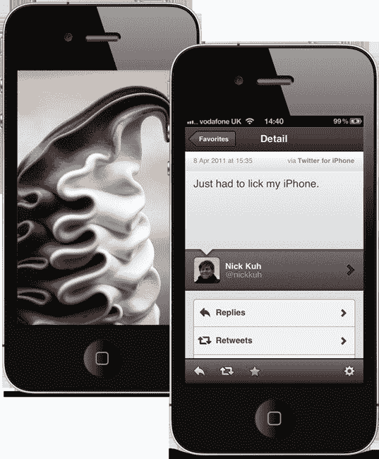

**图 9-1.** 冰淇淋和 iPhone 真的不搭！

没有上下文。我就是不得不舔了我的 iPhone。撇开冰淇淋不谈，如今我们 iOS 用户享受到的漂亮用户界面设计越来越多。我认为有些 iPhone 应用实在太美，用户体验打磨得如此精致，以至于你会忍不住想抓住这些应用狠狠舔上一口！还是只有我这样想？所以从现在开始，我们就称它们为*秀色可餐*的应用吧！

我希望我的应用也具有这种“秀色可餐”的品质。是什么让这些应用脱颖而出？是什么让一个应用“秀色可餐”？

## 是什么让一个应用“秀色可餐”？

伟大的设计受到个人偏好的影响，以下是我最喜欢的一些 iPhone 应用用户界面设计（见图 9-2）。我选择了 AirBnB、Jamie's Recipes、Momento 和 Path。这些应用都拥有漂亮的用户界面设计和图标。它们从 iPhone 用户可以挑选的成千上万个应用中脱颖而出。仅仅为应用拥有一个好主意已经不够了。你的应用需要达到这些排行榜领先应用所带来的那种精致水平和质量。

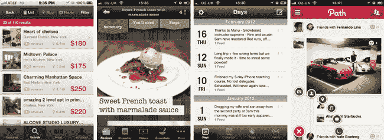

**图 9-2.** 一系列“秀色可餐”的应用：AirBnB、Jamie's Recipes、Momento、Path

那么，让我们更仔细地看看这些示例应用。是什么让它们“秀色可餐”？从设计来看，这四个应用有什么共同点？以下是我的观察。它们都广泛使用了苹果在 iOS SDK 中包含的通用用户界面组件。比如导航栏、工具栏、表格视图、图像视图等等。尽管这些应用各有独特、精美的设计，但 iPhone 用户能立即认出那些我们在大多数其他 iPhone 应用中每天使用的通用用户控件。我们知道如何轻拂和滚动表格视图——这几乎是本能，因为它已经深植于苹果 iOS 用户体验中。我们知道所有这些应用的导航栏会告知我们在应用层级中的当前位置。我们知道前三个应用底部的标签栏是干什么用的——我们可以愉快地在顶层部分之间切换，而不会迷失方向或被应用导航搞糊涂。

这些应用都有漂亮且独特的设计，同时对于普通 iOS 用户来说又非常友好。作为一名用户，我不想费劲去学习如何使用你的应用。我不想翻阅任何帮助页面才能开始使用，我只希望体验是直观的。苹果自己的应用有多少包含“帮助”部分？零个，没错就是零！

这里的教训是：你可以制作出漂亮的应用，而不必为了追求原创而试图创造一种新的用户体验，从而打破 HIG（苹果人机界面指南）的规则。这不值得！iPhone 取得如此巨大成功的主要原因之一，在于苹果发明并随后向第三方开发者开放的那些软件和用户体验惯例。我们已经拥有了制作出色用户界面的工具，而现在通过 iOS 5 和 6，我们有了许多重新定义现有`UIKit`组件外观的新方法，可以非常高效地制作出漂亮、“秀色可餐”的应用。

*提示：我建议你阅读并学习 HIG，即苹果的 iOS 人机界面指南文档。你可以在苹果网站上找到它：* [`http://developer.apple.com/library/ios/#DOCUMENTATION/UserExperience/Conceptual/MobileHIG/Introduction/Introduction.html`](http://developer.apple.com/library/ios/#DOCUMENTATION/UserExperience/Conceptual/MobileHIG/Introduction/Introduction.html)`.`

如果你不是设计师，那么我建议你稍后翻回第 1 章，重新阅读一下我对我为每个应用构建时所采用的设计流程的描述。

> 1.  在纸上草绘出每一个屏幕。
> 2.  在 dribbble.com 上找一位设计师，将你的草图变成漂亮的 Retina 级别 Photoshop 设计图。
> 3.  开始美化界面。我们将在本章详细讨论。

## 让我们开始美化界面吧！

iOS 应用界面美化的规则并非一成不变。没有 CSS。没有 XML 用户界面布局语言或类似的东西。用于美化 iOS 组件外观的代码就是：代码。Objective-C 代码。

#### 创建核心视图控制器

还记得我们在第 5 章中是如何创建核心视图控制器的吗？我们应用中的每个视图控制器都继承自`BRCoreViewController`，而`BRCoreViewController`又继承自苹果的`UIViewController`。我们这样做是为了利用面向对象编程的优势，通过将通用代码和逻辑集中到核心视图控制器中。这就是我们让应用中每个视图的背景都成为灰色的方法。`BRCoreViewController`中已有的这段代码使每个主屏幕视图都变成灰色。

```
-(void) viewDidLoad
{
    [super viewDidLoad];

    self.view.backgroundColor = [UIColor grayColor];
}
```

*生日提醒*用户界面设计大量使用了一种深色的棋盘格背景图像。那么，让我们将这个背景图像添加到所有由`BRCoreViewController`子类控制的视图中。

将`app-background.png`和`app-background@2x.png`图像文件添加到你的项目中。你可以在本章源代码的 assets 文件夹中找到它们。现在，在`BRCoreViewController`的`viewDidLoad`方法中添加两行代码：

```
-(void) viewDidLoad
{
    [super viewDidLoad];
    self.view.backgroundColor = [UIColor grayColor];
    UIImageView *backgroundView = [[UIImageView alloc] initWithImage:[UIImage
imageNamed:@"app-background.png"]];
    [self.view insertSubview:backgroundView atIndex:0];
}
```

构建并运行。现在我们的背景图像已设置在每个屏幕上（见图 9-3）。这有多酷？！

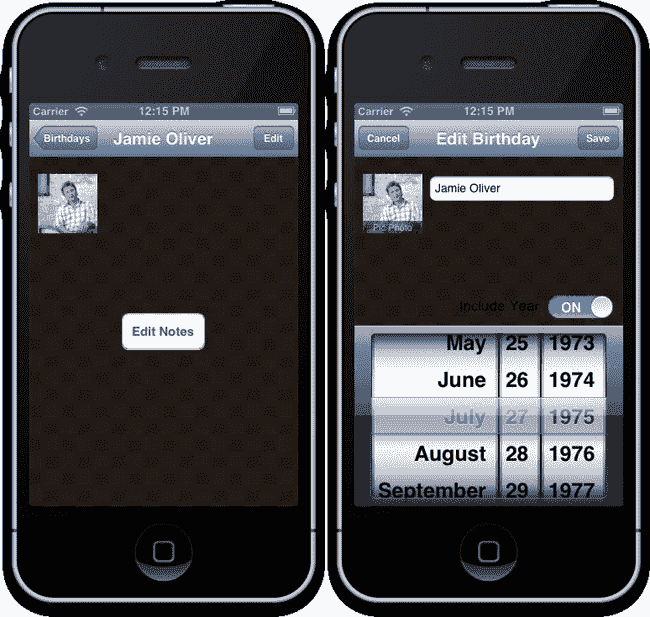

**图 9-3.** 仅通过添加两行代码，棋盘格背景图像现在出现在我们应用中每个`BRCoreViewController`子类视图控制器的视图中。

*注意：苹果的* `UIImageView` *类会缓存通过`imageNamed:`类方法生成的图像，所以即使这个方法会被我们应用中的每个视图控制器调用，iOS 也只会将图像加载到内存一次。*

在 Retina 设备上，`UIImageView`会自动加载背景图像的`app-background@2x.png`版本，这仅仅是因为`@2x`命名约定。你需要确保你的`@2x`图像的宽度和高度恰好是非 Retina 图像的两倍。因此，对于这张图片，非 Retina 的`app-background.png`图像文件大小为 320×460 像素，而 Retina 版本为 640×920 像素，以填充 iPhone 屏幕（减去状态栏）。


#### 自定义表格视图单元格

让我们仔细看看主屏幕生日列表的 Photoshop 设计（参见图 9-4）。

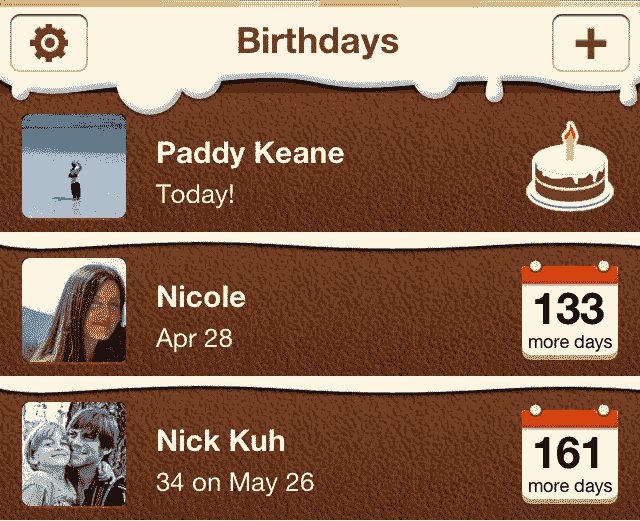

**图 9-4.** 自定义表格单元格设计特写

标准的 Apple 表格单元格样式最多支持两个标签：一个图片视图和一个位于表格单元格右侧的附件视图。这不足以满足我们自定义设计的需求（参见图 9-5）。看看 Nicole 和 Nick Kuh 的生日提醒单元格。每个单元格包含四个标签：一个用于朋友姓名，一个用于生日文本，一个用于距离下一个生日的天数，以及一个用于显示*更多天*或*更多天*的文本。此外，每位朋友的头像图片视图都带有圆角，并能很好地将横向和纵向图片居中并裁剪。这不是 `UITableViewCell` 类的 `imageView` 属性的默认行为。我们需要创建 `UITableViewCell` 的子类，并创建一个可复用的自定义表格单元格来显示生日。

在 Xcode 中打开 Storyboard 文件，然后居中并聚焦于主页视图控制器场景。选择原型表格单元格。使用属性检查器，将单元格样式更改为自定义。将“选择”参数更改为“无”。将附件设置更改为“无”，以移除披露指示器（右箭头）。

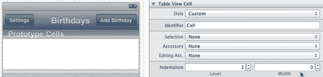

**图 9-5.** 创建自定义表格视图单元格

通过从对象库中拖放两个图片视图到自定义表格单元格中。使用尺寸检查器，将第一个图片视图定位（x=11 点，y=13 点），并设置其宽度和高度均为 52 点。这将用作显示朋友照片的图标视图。保持图标图片视图处于选中状态，使用属性检查器将视图的“模式”值更改为“Aspect Fill”，并开启“裁剪子视图”选项（参见图 9-6）。

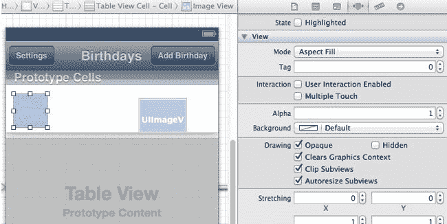

**图 9-6.** 配置图标图片视图

现在，选择你添加的第二个图片视图。我们将使用这个图片视图来显示剩余天数标签后面的日历图标背景，或者如果是朋友的生日，则显示生日蛋糕图片。将第二个图片视图定位（x=261 点，y=14 点），并设置其宽度为 48 点，高度为 50 点。我们将直接在 Storyboard 中设置此图片的默认背景。从源代码的资源文件夹中，找到并将 `icon-days-remaining.png` 和 `icon-days-remaining@2x.png` 图片文件添加到你的项目中。然后，使用属性检查器将右侧图片视图的“Image”属性设置为新添加的 `icon-days-remaining.png` 文件，如图 9-7 所示。

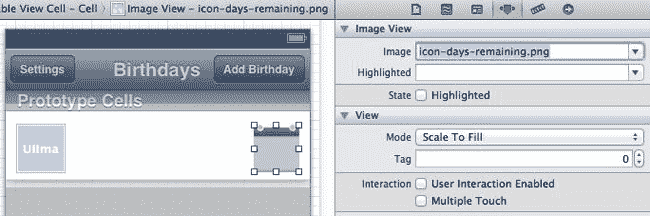

**图 9-7.** 配置剩余天数背景图片视图

将四个标签视图实例拖放到你的自定义表格视图单元格上。结合使用属性检查器设置字体属性，尺寸检查器设置位置和大小，按照表 9-1 所示配置这四个标签。

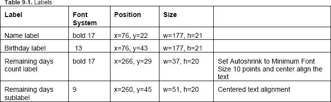

最终结果应类似于图 9-8。

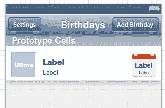

**图 9-8.** 配置原型单元格的标签和图片视图

我们已为生日表格视图单元格添加并配置了所有必需的自定义子视图，但在将这些子视图连接到输出口之前，我们没有任何方法来定位和样式化标签或图片视图。问题在于我们在哪里定义这些输出口？不是在主页视图控制器中。我们正在处理的自定义原型单元格将成为 iOS 在生成 Apple 的 `UITableViewCell` 类可复用实例时使用的视图布局。因此，创建带有自定义子视图的自定义表格视图单元格的逻辑方法是通过创建 `UITableViewCell` 的子类。

在 Finder 中，向你的 `user-interface` 文件夹添加一个 `components` 文件夹，然后在你的 Xcode 项目中将 `components` 文件夹添加为一个新组。在项目导航器中，选择新添加的 `components` 组，并在其中创建一个新的 Objective-C 类文件。将你的子类命名为 `BRBirthdayTableViewCell`，并在“Subclass of”文本字段的下拉菜单中选择 `UITableViewCell`（参见图 9-9）。

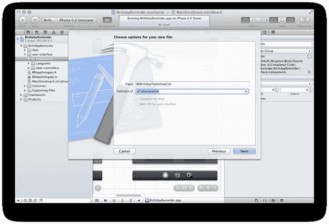

**图 9-9.** 创建 `UITableViewCell` 的子类

创建新的 `BRBirthdayTableViewCell` 类后，在 Assistant Editor 布局中打开头文件和源文件，并为每个文件添加以下代码：

`BRBirthdayTableViewCell.h:`

```
#import <UIKit/UIKit.h>
@class BRDBirthday;
@interface BRBirthdayTableViewCell : UITableViewCell
@property(nonatomic,strong) BRDBirthday *birthday;
@property (nonatomic, weak) IBOutlet UIImageView* iconView;
@property (nonatomic, weak) IBOutlet UIImageView* remainingDaysImageView;
@property (nonatomic, weak) IBOutlet UILabel* nameLabel;
@property (nonatomic, weak) IBOutlet UILabel* birthdayLabel;
@property (nonatomic, weak) IBOutlet UILabel* remainingDaysLabel;
@property (nonatomic, weak) IBOutlet UILabel* remainingDaysSubTextLabel;
@end
```

源文件：

```
#import "BRBirthdayTableViewCell.h"
#import "BRDBirthday.h"
@implementation BRBirthdayTableViewCell
-(void) setBirthday:(BRDBirthday *)birthday
{
    _birthday = birthday;
    self.nameLabel.text = _birthday.name;
    int days = _birthday.remainingDaysUntilNextBirthday;
    if (days == 0) {
        //今天是生日！
        self.remainingDaysLabel.text = self.remainingDaysSubTextLabel.text = @"";
        self.remainingDaysImageView.image = [UIImage imageNamed:@"icon-birthday-cake.png"];
    }
    else {
        self.remainingDaysLabel.text = [NSString stringWithFormat:@"%d",days];
        self.remainingDaysSubTextLabel.text = (days == 1) ? @"more day" : @"more days";
        self.remainingDaysImageView.image = [UIImage imageNamed:@"icon-days-remaining.png"];
    }
    self.birthdayLabel.text = _birthday.birthdayTextToDisplay;
}
@end
```

表格视图单元格会被复用。这使得滚动长表格非常高效，因为表格视图通过复用少量表格单元来营造出拥有超长行数表格的视觉效果。我们在自定义表格视图单元格上创建了一个 `birthday` 属性。当主页视图控制器配置每个表格视图单元格时，它会通过 `cell.birthday = aBirthday` 将 `birthday` 实体传递给表格视图单元格。通过重写表格视图单元格的 birthday setter 方法，我们可以在设置 birthday 属性时更新表格单元格的标签和图片。

暂时离开 `BRBirthdayTableViewCell` 类文件，返回 Storyboard。选中自定义表格视图单元格后，我们可以使用身份检查器更改原型单元格的类。Xcode 会自动识别 `BRBirthdayTableViewCell`，因为它是 `UITableViewCell` 的子类（参见图 9-10）。

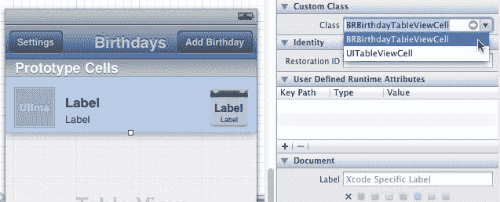

**图 9-10.** 使用身份检查器将自定义类分配给表格视图单元格原型


现在来连接表格单元格的出口。从原型表格单元格的背景按住 Control 键拖拽到每个添加的子视图上。你会发现 Xcode 已经识别了 `BRBirthdayTableViewCell` 代码中的出口，并允许你将它们连接到子视图（见图 9-11）。太棒了！

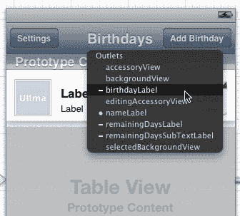

**图 9-11.** 连接 `BRBirthdayTableViewCell` 中的标签和图像视图出口。

按以下方式连接出口：

- `iconView`: 表格单元格左侧的图像视图
- `remainingDaysImageView`: 表格单元格右侧的图像视图
- `nameLabel`: 左上角的标签
- `birthdayLabel`: 左下角的标签
- `remainingDaysLabel`: 右上角的标签
- `remainingDaysSubTextLabel`: 右下角的标签

现在，先不管这个视图，对 `BRHomeViewController.m` 源文件做一些修改。

将 `BRBirthdayTableViewCell.h` 导入到 `BRHomeViewController.m` 中。然后浏览实现文件，并如下修改 `tableView:cellForRowAtIndexPath:`：

```
- (UITableViewCell *)tableView:(UITableView *)tableView cellForRowAtIndexPath:(NSIndexPath *)indexPath
{
    UITableViewCell *cell = [tableView dequeueReusableCellWithIdentifier:@"Cell"];

    BRDBirthday *birthday = [self.fetchedResultsController objectAtIndexPath:indexPath];

    BRBirthdayTableViewCell *brTableCell = (BRBirthdayTableViewCell *)cell;
    brTableCell.birthday = birthday;
    if (birthday.imageData == nil)
    {
        brTableCell.iconView.image = [UIImage imageNamed:@"icon-birthday-cake.png"];
    }
    else {
        brTableCell.iconView.image = [UIImage imageWithData:birthday.imageData];
    }
    cell.textLabel.text = birthday.name;
    cell.detailTextLabel.text = birthday.birthdayTextToDisplay;
    cell.imageView.image = [UIImage imageWithData:birthday.imageData];

    return cell;
}
```

构建并运行。你应该会看到类似图 9-12 的效果。

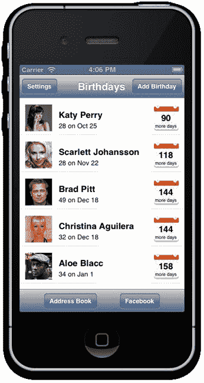

**图 9-12.** 裁剪得当的方形缩略图和显示生日数据的自定义标签

#### 表格视图单元格背景图像

现在该为我们的表格视图添加定制的巧克力海绵蛋糕和糖霜了。这应该是小菜一碟（双关语）！将 `table-row-icing-background.png`、`table-row-icing-background@2x.png`、`table-row-background.png` 和 `table-row-background@2x.png` 图像文件添加到你的项目中。`UITableViewCell` 的实例有一个 `backgroundView` 属性，我们可以将其设置为任何 `UIView` 实例。因此，我们将创建一个图像和一个用于显示该图像的图像视图，然后将该图像视图设置为单元格的背景视图。除非这是蛋糕的顶层，否则我们将使用新添加的、包含一层糖霜的表格行背景图像。如果是蛋糕的顶层（第一行），则使用不带糖霜的表格行背景图像。

我们将直接把代码添加到 `BRHomeViewController.m` 源文件中的 `tableView:cellForRowAtIndexPath:` 方法里，因为在这里我们才能知道正在设置样式的具体表格行。在该方法的末尾，但倒数第一个 `return cell;` 行之前，添加以下代码：

```
    UIImage *backgroundImage = (indexPath.row == 0) ? [UIImage imageNamed:@"table-row-background.png"] : [UIImage imageNamed:@"table-row-icing-background.png"];
    brTableCell.backgroundView = [[UIImageView alloc] initWithImage:backgroundImage];
```

构建并运行。漂亮的蛋糕层次出现了（见图 9-13）。

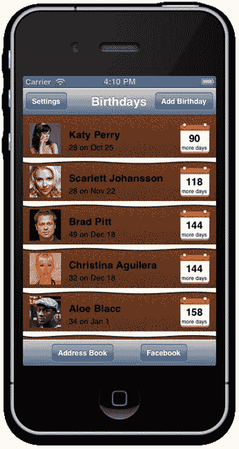

**图 9-13.** 添加了糖霜的表格单元格蛋糕层！

#### 创建“样式表”

正如我之前指出的，iOS 的皮肤设置不像 CSS 那样工作，所以我们不会创建一个传统的样式表文件。我们将创建一个单独的 Objective-C 类，在一个集中的位置负责处理我们应用的所有样式需求。我们的样式表类将像一个工具类一样工作，我们会调用样式方法，传递标签和视图的引用，然后由工具类负责添加圆角、设置字体和颜色等。

选择 `user-interface` Xcode 组，并在其中创建一个新的 Objective-C 类文件。将子类命名为 `BRStyleSheet`，并在“Subclass of”文本字段中输入 `NSObject`。

将以下代码写入新的 `BRStyleSheet.h` 头文件中：

```
#import <Foundation/Foundation.h>

typedef enum : int {
    BRLabelTypeName = 0,
    BRLabelTypeBirthdayDate,
    BRLabelTypeDaysUntilBirthday,
    BRLabelTypeDaysUntilBirthdaySubText,
    BRLabelTypeLarge
}BRLabelType;

@interface BRStyleSheet : NSObject

+(void)styleLabel:(UILabel *)label withType:(BRLabelType)labelType;
+(void)styleRoundCorneredView:(UIView *)view;

@end
```

注意到我们新样式表类的两个公开方法都是类方法了吗？我们不会实例化 `BRStyleSheet` 的实例，而会像使用工具类一样，在我们的应用中对标签或视图进行样式设置时随时随地调用它。

我们在第 4 章中拼凑 21 点应用时就创建过自定义枚举。当时我们用一个枚举器来跟踪游戏状态。这里我们创建一个标签类型枚举器，这样每当我们将标签视图的引用传递给 `styleLabel:withType:` 方法时，也会传递一个类型参数，该参数决定了样式表方法将应用的字体、文本颜色等。我们为每种不同的样式创建一个不同的枚举器标签类型。因此，如果我们希望对两个不同的标签应用相同的样式，就可以为它们传递相同的 `BRLabelType` 值。

我们的样式代码将利用 Core Animation 层的属性来添加阴影和圆角。本书不会详细讲解 Core Animation，但值得注意的一点是，在 iOS 中，每个 `UIView` 实际上都是在 Core Animation 层中渲染的，而 `CALayers` 具有阴影和圆角半径属性。为了给我们的标签和视图设置阴影和圆角半径值，首先需要导入 Apple 的 QuartzCore 框架，否则 Xcode 将无法识别我们在样式代码中访问的 `CALayer` 属性。

我们将像导入 Core Data 框架一样导入 QuartzCore 框架。在项目导航器中选择你的 `BirthdayReminder` 项目，然后选择 `BirthdayReminder` 目标。接着在编辑器中选择“Build Phases”选项卡。展开“Link Binary With Libraries”集合。点击 + 按钮，然后在 iOS 文件夹中找到 `QuartzCore.framework` 并将其添加到你的项目中。

回到 `BRStyleSheet.m` 源文件中，我们将为样式表定义一些字体和颜色。这些是我们在样式方法中使用的字体和颜色，因此如果将来需要更改某种字体或颜色，我们只需在这个单一的样式类中进行操作，过程将快速又简单。我们将按如下方式定义这些样式值常量：

```
#import "BRStyleSheet.h"
#import <QuartzCore/QuartzCore.h>

#define kFontLightOnDarkTextColour [UIColor colorWithRed:255.0/255 green:251.0/255 blue:218.0/255 alpha:1.0]
#define kFontDarkOnLightTextColour [UIColor colorWithRed:1.0/255 green:1.0/255 blue:1.0/255 alpha:1.0]
```


```c
#define kFontNavigationTextColour [UIColor colorWithRed:106.f/255.f green:62.f/255.f blue:39.f/255.f alpha:1.f]
#define kFontNavigationDisabledTextColour [UIColor colorWithRed:106.f/255.f green:62.f/255.f blue:39.f/255.f alpha:0.6f]
#define kNavigationButtonBackgroundColour [UIColor colorWithRed:255.f/255.f green:245.f/255.f blue:225.f/255.f alpha:1.f]
#define kToolbarButtonBackgroundColour [UIColor colorWithRed:39.f/255.f green:17.f/255.f blue:5.f/255.f alpha:1.f]
#define kLargeButtonTextColour [UIColor whiteColor]

#define kFontNavigation [UIFont fontWithName:@"HelveticaNeue-Bold" size:18.f]
#define kFontName [UIFont fontWithName:@"HelveticaNeue-Bold" size:15.f]
#define kFontBirthdayDate [UIFont fontWithName:@"HelveticaNeue" size:13.f]
#define kFontDaysUntilBirthday [UIFont fontWithName:@"HelveticaNeue-Bold" size:25.f]
#define kFontDaysUntillBirthdaySubText [UIFont fontWithName:@"HelveticaNeue" size:9.f]
#define kFontLarge [UIFont fontWithName:@"HelveticaNeue-Bold" size:17.f]
#define kFontButton [UIFont fontWithName:@"HelveticaNeue-Bold" size:30.f]
#define kFontNotes [UIFont fontWithName:@"HelveticaNeue" size:16.f]
#define kFontPicPhoto [UIFont fontWithName:@"HelveticaNeue-Bold" size:12.f]
#define kFontDropShadowColour [UIColor colorWithRed:1.0/255 green:1.0/255 blue:1.0/255 alpha:0.75]
```

```objectivec
@implementation BRStyleSheet
@end
```

现在，我们需要在`BRStyleSheet`的实现中添加两个样式类方法：

```objectivec
@implementation BRStyleSheet

+(void)styleLabel:(UILabel *)label withType:(BRLabelType)labelType
{
    switch (labelType) {
        case BRLabelTypeName:
            label.font = kFontName;
            label.layer.shadowColor = kFontDropShadowColour.CGColor;
            label.layer.shadowOffset = CGSizeMake(1.0f, 1.0f);
            label.layer.shadowRadius = 0.0f;
            label.layer.masksToBounds = NO;
            label.textColor = kFontLightOnDarkTextColour;
            break;
        case BRLabelTypeBirthdayDate:
            label.font = kFontBirthdayDate;
            label.textColor = kFontLightOnDarkTextColour;
            break;
        case BRLabelTypeDaysUntilBirthday:
            label.font = kFontDaysUntilBirthday;
            label.textColor = kFontDarkOnLightTextColour;
            break;
        case BRLabelTypeDaysUntilBirthdaySubText:
            label.font = kFontDaysUntillBirthdaySubText;
            label.textColor = kFontDarkOnLightTextColour;
            break;
        case BRLabelTypeLarge:
            label.textColor = kFontLightOnDarkTextColour;
            label.layer.shadowColor = kFontDropShadowColour.CGColor;
            label.layer.shadowOffset = CGSizeMake(1.0f, 1.0f);
            label.layer.shadowRadius = 0.0f;
            label.layer.masksToBounds = NO;
            break;
        default:
            label.textColor = kFontLightOnDarkTextColour;
            break;
    }
}

+(void)styleRoundCorneredView:(UIView *)view
{
    view.layer.cornerRadius = 4.f;
    view.layer.masksToBounds = YES;
    view.clipsToBounds = YES;
}

@end
```

在样式化标签时，我们直接访问标签视图的图层（`CALayer`）属性，以定义图层上的阴影设置。同样，对于视图的样式化，我们设置视图底层核心动画图层的`cornerRadius`属性。

是时候测试我们的样式表类了！打开`BRBirthdayTableViewCell.m`源文件。首先在文件顶部导入`BRStyleSheet.h`。`BRBirthdayTableViewCell`是`UITableViewCell`的子类。因此，这个类是一个视图类，而不是视图控制器类。与我们之前的视图控制器输出口不同，我们无法通过钩入`viewDidLoad`方法来修改 Interface Builder 输出口属性。在样式化自定义表格视图单元格中的图像视图和标签时，我们只需在 iOS 首次生成输出口时运行一次这段代码。因此，覆盖输出口访问器的设置器并在其中添加样式代码是一个理想的位置。以下是需要添加到`BRBirthdayTableViewCell.m`中的代码：

```objectivec
-(void) setIconView:(UIImageView *)iconView
{
    _iconView = iconView;
    if (_iconView) {
        [BRStyleSheet styleRoundCorneredView:_iconView];
    }
}

-(void) setNameLabel:(UILabel *)nameLabel
{
    _nameLabel = nameLabel;
    if (_nameLabel) {
        [BRStyleSheet styleLabel:_nameLabel withType:BRLabelTypeName];
    }
}

-(void) setBirthdayLabel:(UILabel *)birthdayLabel
{
    _birthdayLabel = birthdayLabel;
    if (_birthdayLabel) {
        [BRStyleSheet styleLabel:_birthdayLabel withType:BRLabelTypeBirthdayDate];
    }
}

-(void) setRemainingDaysLabel:(UILabel *)remainingDaysLabel
{
    _remainingDaysLabel = remainingDaysLabel;
    if (_remainingDaysLabel) {
        [BRStyleSheet styleLabel:_remainingDaysLabel withType:BRLabelTypeDaysUntilBirthday];
    }
}

-(void) setRemainingDaysSubTextLabel:(UILabel *)remainingDaysSubTextLabel
{
    _remainingDaysSubTextLabel = remainingDaysSubTextLabel;
    if (_remainingDaysSubTextLabel) {
        [BRStyleSheet styleLabel:_remainingDaysSubTextLabel withType:BRLabelTypeDaysUntilBirthdaySubText];
    }
}
```

构建并运行。你应该会看到标签样式和图片圆角效果被应用，就像图 9-14 中所示。当 iOS 连接每个标签输出口时，我们将标签引用传递给`BRStyleSheet`的`styleLabel:withType:`类方法，该方法会依次设置字体、文本颜色、阴影等。

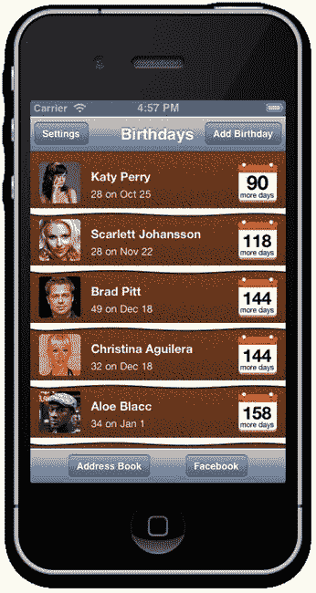

**图 9-14.** 样式化文本和圆角图像视图

### 自定义导航栏和工具栏外观

我们对主屏幕导航栏做的第一个修改是，将左右两侧的栏按钮项改为显示图标而不是文本。从本章源文件夹中的资源中，将`icon-add-new.png`、`icon-add-new@2x.png`、`icon-settings.png`和`icon-settings@2x.png`图像文件添加到你的项目中。在故事板中选择主视图控制器场景，删除左侧栏按钮项的标题，然后从`Image`属性下拉菜单中选择`icon-settings.png`文件。对右侧栏按钮项重复此过程，这次选择`icon-add-new.png`图像文件（参见图 9-15）。

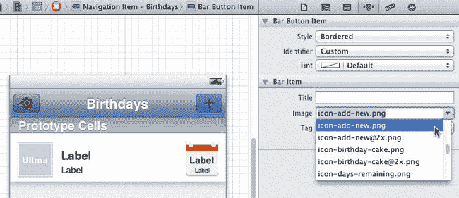

**图 9-15.** 为 UIBarButtonItems 分配图像图标

在我们进一步操作之前，如果你还没有将本章源代码资源文件夹中的剩余图像添加到项目中，请立即添加：`button-blue.png`、`button-blue@2x.png`、`button-red.png`、`button-red@2x.png`、`icon-call.png`、`icon-call@2x.png`、`icon-delete.png`、`icon-delete@2x.png`、`icon-email.png`、`icon-email@2x.png`、`icon-facebook.png`、`icon-facebook@2x.png`、`icon-notes.png`、`icon-notes@2x.png`、`navigation-bar-background.png`、`navigation-bar-background@2x.png`、`icon-sms.png`、`icon-sms@2x.png`、`tool-bar-background.png`和`tool-bar-background@2x.png`。


#### 外观 API：简洁而强大

Apple 在 iOS 5.0 版本的 SDK 中引入了外观 API。在 iOS 5 之前，要更改导航栏、工具栏和栏按钮项等常见用户界面组件的设计，哪怕只是稍微调整一下色调，都是一个相当复杂的过程。

当 iOS 5 发布时，Apple 为许多 iOS UI 组件添加了大量新的公开方法，这些方法专门用于修改组件外观：更换背景图片，并为像 `UISlider` 或 `UIProgressBar` 这样复杂的 UI 组件中的各个部分设置色调。

在 iOS 5 之前，如果我们希望导航栏的标题使用自定义字体或添加阴影，我们是无法直接访问导航栏中的标签的。相反，我们必须实现一种变通方法，包括创建一个新标签、动态调整其大小，然后将该自定义标签设置为每个导航栏的 `titleView` 属性。真是麻烦！值得庆幸的是，Apple 通过 iOS 5 的外观 API 向前迈出了一大步。现在，我们不仅对大多数 UI 组件有了更多自定义选项，甚至可以在全局级别定义我们的外观设置。例如，我们可以在代码中声明，每个导航栏实例都应使用特定的自定义背景图片，或者每个栏按钮项都应使用某种颜色并采用某种字体样式。这意味着，我们实际上可以在一个地方定义所有的外观 API。你认为哪里是合适的地方呢？我们的全局样式表类怎么样？

现在，让我们切换到 `BRStyleSheet.h` 头文件。我们将再声明一个公开类方法：

`+(void)initStyles;`

在 `BRStyleSheet.m` 源文件中，暂时为我们的新 `initStyles` 方法添加一个空实现：

```
+(void) initStyles
{

}
```

我们将在应用首次启动时仅调用一次 `initStyles`。打开你的应用委托类 `BRAppDelegate.m` 源文件。导入 `BRStyleSheet.h`，然后在 `application:didFinishLaunchingWithOptions:` 方法中添加一行代码：

```
- (BOOL)application:(UIApplication *)application didFinishLaunchingWithOptions:(NSDictionary*)launchOptions
{
    [BRStyleSheet initStyles];
    return YES;
}
```

`application:didFinishLaunchingWithOptions:` 方法是程序中第一个执行的代码，并且只会运行一次。这是初始化所有全局自定义外观样式的地方。那么，现在让我们切换回 `BRStyleSheet.m`，看看外观 API 究竟能做什么。以下是添加到 `initStyles` 中的前几行样式代码：

```
//导航栏
    NSDictionary *titleTextAttributes = [NSDictionary dictionaryWithObjectsAndKeys:
                                         kFontNavigationTextColour, UITextAttributeTextColor,
                                         [UIColor whiteColor], UITextAttributeTextShadowColor,
                                         [NSValue valueWithUIOffset:UIOffsetMake(0, 2)], UITextAttributeTextShadowOffset,
                                         kFontNavigation, UITextAttributeFont,nil];
    [[UINavigationBar appearance] setTitleTextAttributes:titleTextAttributes];

    //设置带有生日蛋糕糖霜的背景图片
    [[UINavigationBar appearance] setBackgroundImage:[UIImage imageNamed:@"navigation-bar-background.png"] forBarMetrics:UIBarMetricsDefault];
```

在 iOS 5 中，Apple 为 `UINavigationBar` 添加了一个新的 `titleTextAttributes` 属性，使我们能够传入一个包含导航栏标题可选样式属性的字典：文本颜色、阴影颜色、阴影偏移量和字体。请注意，`titleTextAttributes` 是 `UINavigationBar` 的一个属性。然而，我们并非逐个为应用中的每个导航栏设置样式，而是可以通过 `UINavigationBar` 类的外观代理（即 `[UINavigationBar appearance]`）在全局级别设置 `titleTextAttributes` 属性。同样地，`UINavigationBar` 有另一个实例方法 `setBackgroundImage:forBarMetrics:`，我们可以通过 `UINavigationBar` 类的外观代理在全局范围内访问它。构建并运行你的项目（参见图 9-16）。

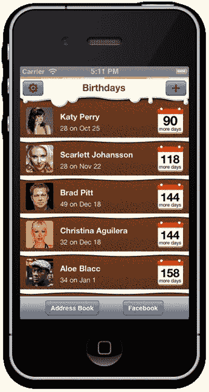

**图 9-16.** 样式化的导航栏标题和背景糖霜图片

我们的 `navigation-bar-background.png` 图片比默认的 44 点导航栏高度要高。我们定制的滴落糖霜图片高度为 60 点，并包含 alpha 透明度。这在 iOS 中运行良好。现在，你的糖霜应该漂亮地滴落在表格视图上了！


##### 容器的外观样式

很好。让我们继续处理 `BRStyleSheet.m` 中的 `initStyles` 方法。添加下一个外观 API 样式代码块：

```
NSDictionary *barButtonItemTextAttributes;
```

```
//导航按钮

    //导航按钮背景的色调
    [[UIBarButtonItem appearanceWhenContainedIn:[UINavigationBar class],nil]
setTintColor:kNavigationButtonBackgroundColour];

    barButtonItemTextAttributes = [NSDictionary dictionaryWithObjectsAndKeys:
                                  kFontNavigationTextColour, UITextAttributeTextColor,
                                   [UIColor whiteColor], UITextAttributeTextShadowColor,
                                   [NSValue valueWithUIOffset:UIOffsetMake(0, 1)],
UITextAttributeTextShadowOffset,nil];
    [[UIBarButtonItem appearanceWhenContainedIn:[UINavigationBar class], nil]
setTitleTextAttributes:barButtonItemTextAttributes forState:UIControlStateNormal];

    NSDictionary *disabledBarButtonItemTextAttributes = [NSDictionary
dictionaryWithObjectsAndKeys:
                                    kFontNavigationDisabledTextColour,
UITextAttributeTextColor,
                                   [UIColor whiteColor], UITextAttributeTextShadowColor,
                                   [NSValue valueWithUIOffset:UIOffsetMake(0, 1)],
UITextAttributeTextShadowOffset,nil];
    [[UIBarButtonItem appearanceWhenContainedIn:[UINavigationBar class], nil]
setTitleTextAttributes:disabledBarButtonItemTextAttributes forState:UIControlStateDisabled];
```

构建并运行。结果应该会显示带有色调的栏按钮项，如图 9-17 所示。

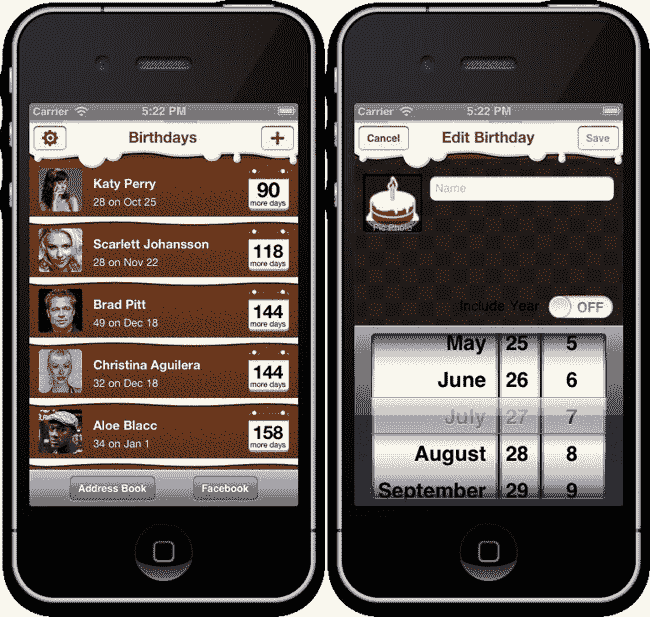

**图 9-17.** 带有色调的栏按钮项

在最新的代码中，我引入了 `appearanceWhenContainedIn:` 样式方法。这种第二种外观 API 的重要性在于，我们可以指定 iOS 仅将奶油色样式应用于出现在 `UINavigationBar` 容器类中的 `UIBarButtonItem` 实例。如果我们坚持对所有 `UIBarButtonItem` 类的实例设置全局样式，那么我们的样式也会被应用到工具栏中的“通讯录”和“Facebook”栏按钮项实例上。我们的应用设计对工具栏及其栏按钮项采用了截然不同的皮肤，因此这并不理想。现在让我们为 `initStyles` 方法添加工具栏样式：

```
//工具栏

    //工具栏背景图片（蛋糕风格）
    [[UIToolbar appearance] setBackgroundImage:[UIImage imageNamed:@"tool-bar-background.png"]
forToolbarPosition:UIToolbarPositionAny barMetrics:UIBarMetricsDefault];

    //工具栏按钮
    //工具栏按钮的深色背景
    //工具栏按钮背景的色调
    [[UIBarButtonItem appearanceWhenContainedIn:[UIToolbar class],nil]
setTintColor:kToolbarButtonBackgroundColour];

    //UIBarButtonItem 上的白色文字
    barButtonItemTextAttributes = [NSDictionary dictionaryWithObjectsAndKeys:[UIColor
whiteColor], UITextAttributeTextColor,nil];
    [[UIBarButtonItem appearanceWhenContainedIn:[UIToolbar class], nil]
     setTitleTextAttributes:barButtonItemTextAttributes forState:UIControlStateNormal];
```

构建并运行。此时，你的主屏幕应该看起来与我们的主屏幕设计几乎完全相同（见图 9-18）。

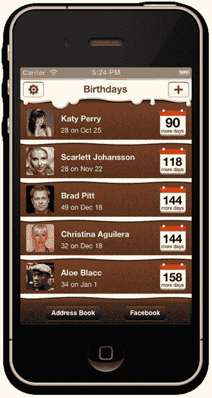

**图 9-18.** 经过样式化的工具栏及其中的栏按钮项

##### 将样式表应用到应用的其他部分

我们的样式表类几乎完成了，但我们需要将标签和图片样式应用到应用的其他屏幕中，所以现在就来完成这部分工作。

###### 样式化提醒时间视图

导航栏和自定义视图背景样式会自动应用到应用的所有屏幕上，但 `BRNotificationTimeViewController` 中的说明文字在棋盘格背景下显得太暗，因此请打开 `BRNotificationTimeViewController.m`，导入 `BRStyleSheet.h`，并添加一个 `viewDidLoad` 实现：

```
-(void) viewDidLoad
{
    [super viewDidLoad];
    [BRStyleSheet styleLabel:self.whatTimeLabel withType:BRLabelTypeLarge];
}
```

构建并运行。说明文字现在应该已经应用了样式，如图 9-19 所示。

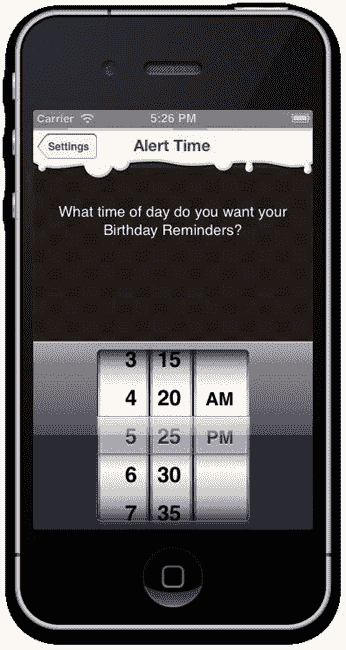

**图 9-19.** 经过样式的提醒时间设置视图

###### 样式化生日编辑视图

我们将对生日编辑视图控制器应用相同的样式流程。打开 `BRBirthdayEditViewController.m`，导入 `BRStyleSheet.h`，然后通过添加 `viewDidLoad` 实现来样式化“包含年份”文本标签和照片容器：

```
-(void)viewDidLoad
{
    [super viewDidLoad];
    [BRStyleSheet styleLabel:self.includeYearLabel withType:BRLabelTypeLarge];
    [BRStyleSheet styleRoundCorneredView:self.photoContainerView];
}
```

构建并运行（见图 9-20）。

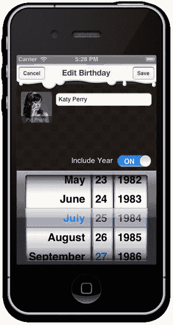

**图 9-20.** 经过样式的生日编辑视图

###### 样式化备注编辑视图

备注编辑视图控制器显示的是一个文本视图而不是标签，因此我们需要在样式表中添加一个新的文本视图样式方法。在 `BRStyleSheet.h` 头文件中声明新方法：

```
+(void)styleTextView:(UITextView *)textView;
```

然后在 `BRStyleSheet.m` 源文件中实现新的 `styleTextView:` 类方法：

```
+(void)styleTextView:(UITextView *)textView
{
    textView.backgroundColor = [UIColor clearColor];
    textView.font = kFontNotes;
    textView.textColor = kFontLightOnDarkTextColour;
    textView.layer.shadowColor = kFontDropShadowColour.CGColor;
    textView.layer.shadowOffset = CGSizeMake(1.0f, 1.0f);
    textView.layer.shadowRadius = 0.0f;
    textView.layer.masksToBounds = NO;
}
```

打开 `BRNotesEditViewController.m`，导入 `BRStyleSheet.h`，然后在 `viewDidLoad` 实现中样式化文本视图：

```
-(void) viewDidLoad
{
    [super viewDidLoad];
    [BRStyleSheet styleTextView:self.textView];
}
```

构建并运行（见图 9-21）。

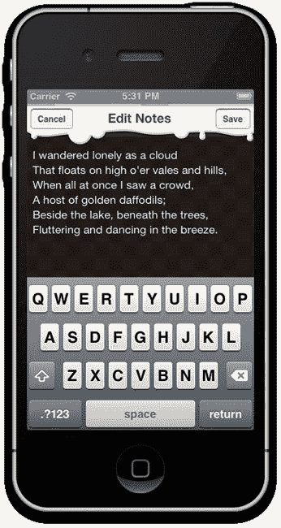

**图 9-21.** 经过样式的编辑备注视图

###### 创建并样式化生日详情视图

目前，我们的生日详情视图内容显得很空，但我们很快就会解决这个问题（见图 9-22）。

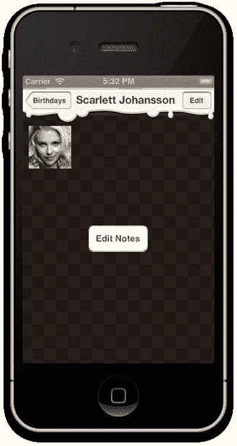

**图 9-22.** 生日详情视图：修改前


#### 滚动视图与可滚动内容

当生日详情视图的内容高度超过可用视图高度时，我们将使其支持滚动。该屏幕的内容高度会变化，因为我们会显示用户生成的生日备注和按钮，让用户能在朋友生日时在其 Facebook 墙上发帖、发送电子邮件、短信或拨打电话。内容高度会随用户备注文本长度变化，因此需要在视图控制器中**运行时**计算内容高度。

在故事板中，从对象库拖一个滚动视图到生日详情视图上。调整滚动视图大小以适配生日详情视图的边界。利用文档大纲面板，多选按钮和图片视图，将其拖入滚动视图中。Xcode 会将按钮和图片视图移动为滚动视图的子视图（而非主视图），如图 9-23 所示。

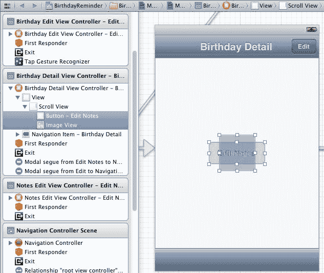

**图 9-23.** 按钮和图片视图，现为滚动视图的子视图

我们希望滚动视图始终填充其父视图的可用空间。虽然我们的应用不支持横屏方向，因此这一点不会改变，但仍有必要将滚动视图的自动调整大小设置为：宽度灵活、高度灵活，以及顶部、底部和两侧固定，如图 9-24 所示。

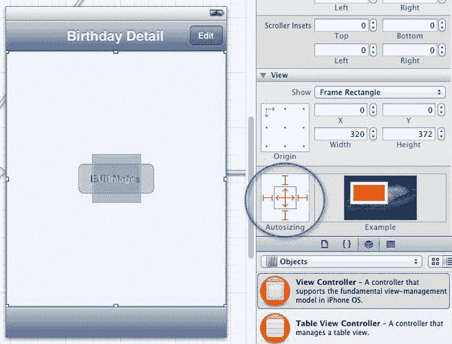

**图 9-24.** 配置滚动视图的自动调整大小设置

在固定子视图位置之前，我们先在滚动视图中添加两个图片视图。按表 9-2 所示，对图片视图进行定位、调整大小和配置。

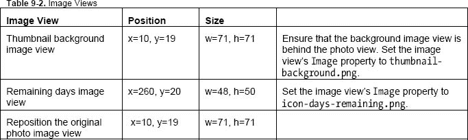

视图布局应类似于图 9-25。

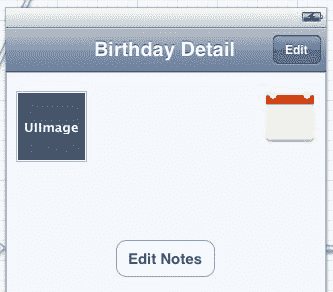

**图 9-25.** 图片视图已配置并定位

现在添加五个标签视图。按表 9-3 所示，对标签视图进行定位、调整大小和配置。

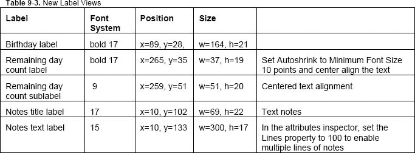

视图布局现在应类似于图 9-26。

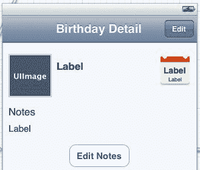

**图 9-26.** 标签已配置并定位

我们要修改“编辑备注”按钮，将其变为铅笔图标。删除“编辑备注”文本。使用属性检查器，将`Image`属性设置为`icon-notes.png`。将按钮类型改为自定义以移除圆角矩形边框。现在定位按钮（x=51, y=91）并调整其大小（宽=44，高=44）。

接下来是按钮。在滚动视图中添加五个按钮，按表 9-4 所示，对其进行定位、调整大小和配置。

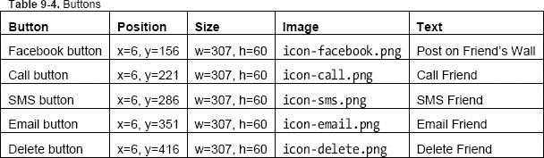

即使电子邮件和删除按钮移出了视野，你也可以通过文档大纲面板选中它们，然后使用属性检查器和尺寸检查器进行配置。最终布局应如图 9-27 所示。

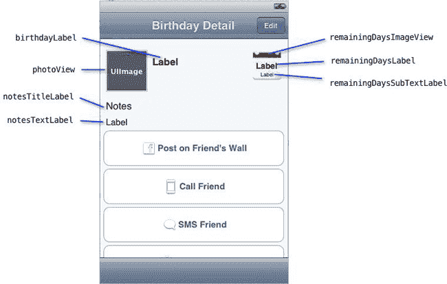

**图 9-27.** 按钮已配置并定位

使用助理编辑器布局，请按住 Control 键拖拽，为我们在生日编辑视图中新增的视图和按钮，在`BRBirthdayDetailViewController.h`中创建新的输出口和操作方法。如果你无法访问被其他视图遮挡的视图，也可以从文档大纲面板拖拽到`BRBirthdayDetailViewController.h`。以下是已添加新输出口和操作方法的`BRBirthdayDetailViewController.h`文件结果。请确保你的文件与之匹配：

```
#import <UIKit/UIKit.h>
#import "BRCoreViewController.h"
@class BRDBirthday;

@interface BRBirthdayDetailViewController : BRCoreViewController

@property(nonatomic,strong) BRDBirthday *birthday;
@property (weak, nonatomic) IBOutlet UIImageView *photoView;
@property (weak, nonatomic) IBOutlet UIScrollView *scrollView;
@property (weak, nonatomic) IBOutlet UILabel *birthdayLabel;
@property (weak, nonatomic) IBOutlet UILabel *remainingDaysLabel;
@property (weak, nonatomic) IBOutlet UILabel *remainingDaysSubTextLabel;
@property (weak, nonatomic) IBOutlet UILabel *notesTitleLabel;
@property (weak, nonatomic) IBOutlet UILabel *notesTextLabel;
@property (weak, nonatomic) IBOutlet UIImageView *remainingDaysImageView;
@property (weak, nonatomic) IBOutlet UIButton *facebookButton;
@property (weak, nonatomic) IBOutlet UIButton *callButton;
@property (weak, nonatomic) IBOutlet UIButton *smsButton;
@property (weak, nonatomic) IBOutlet UIButton *emailButton;
@property (weak, nonatomic) IBOutlet UIButton *deleteButton;

- (IBAction)facebookButtonTapped:(id)sender;
- (IBAction)callButtonTapped:(id)sender;
- (IBAction)smsButtonTapped:(id)sender;
- (IBAction)emailButtonTapped:(id)sender;
- (IBAction)deleteButtonTapped:(id)sender;

@end
```

使用常规编辑器，切换到`BRBirthdayDetailViewController.m`，首先导入`BRStyleSheet.h`。与之前一样，我们在`viewDidLoad`实现中添加标签和圆角样式：

```
-(void) viewDidLoad
{
    [super viewDidLoad];

    [BRStyleSheet styleRoundCorneredView:self.photoView];

    [BRStyleSheet styleLabel:self.birthdayLabel withType:BRLabelTypeLarge];
    [BRStyleSheet styleLabel:self.notesTitleLabel withType:BRLabelTypeLarge];
    [BRStyleSheet styleLabel:self.notesTextLabel withType:BRLabelTypeLarge];
    [BRStyleSheet styleLabel:self.remainingDaysLabel withType:BRLabelTypeDaysUntilBirthday];
    [BRStyleSheet styleLabel:self.remainingDaysSubTextLabel
withType:BRLabelTypeDaysUntilBirthdaySubText];
}
```

构建并运行。标签和图片视图应已应用了美观的样式，如图 9-28 所示。

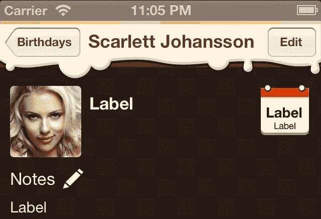

**图 9-28.** 生日详情视图中的标签和图片视图已应用样式

为了将生日内容添加到详情视图中，我们首先将高亮显示的代码添加到`BRBirthdayDetailViewController.m`的`viewWillAppear:`方法中：

```
-(void) viewWillAppear:(BOOL)animated
{
    [super viewWillAppear:animated];

    self.title = self.birthday.name;
    UIImage *image = [UIImage imageWithData:self.birthday.imageData];
    if (image == nil) {
        //如果没有生日图片，则默认使用生日蛋糕图片
        self.photoView.image = [UIImage imageNamed:@"icon-birthday-cake.png"];
    }
    else {
        self.photoView.image = image;
    }

    int days = self.birthday.remainingDaysUntilNextBirthday;

    if (days == 0) {
        //今天就是生日！
        self.remainingDaysLabel.text = self.remainingDaysSubTextLabel.text = @"";
        self.remainingDaysImageView.image = [UIImage imageNamed:@"icon-birthday-cake.png"];
    }
    else {
        self.remainingDaysLabel.text = [NSString stringWithFormat:@"%d",days];
        self.remainingDaysSubTextLabel.text = (days == 1) ? @"more day" : @"more days";
        self.remainingDaysImageView.image = [UIImage imageNamed:@"icon-days-remaining.png"];
    }

    self.birthdayLabel.text = self.birthday.birthdayTextToDisplay;
}
```

这段代码与我们之前在`BRBrithdayTableViewCell.m`中使用的代码几乎相同。效果应如图 9-29 所示。

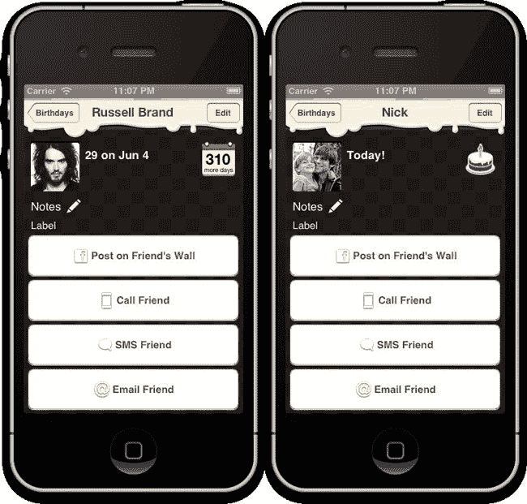

**图 9-29.** **(a)** 显示天数倒计时 **(b)** 如果当天是朋友生日，则显示蛋糕图标


### 计算文本尺寸

生日详情视图控制器也应显示用户生成的任何备注。我们希望备注显示在“备注”标题标签的正下方，然后备注之后出现一排按钮。因此，我们需要根据备注文本的高度，动态调整滚动视图的内容布局。我们允许用户编写多行备注，因此需要动态测量备注文本标签所需的高度。`NSString` 有一个方法 `sizeWithFont:constrainedToSize:lineBreakMode:`，非常适合计算所需高度。现在，我们将通过在 `BRBirthdayDetailViewController.m` 的 `viewWillAppear:` 实现末尾添加以下代码来整合此功能：

```
    NSString *notes = (self.birthday.notes && self.birthday.notes.length > 0) ?
self.birthday.notes : @"";

    CGFloat cY = self.notesTextLabel.frame.origin.y;

    CGSize notesLabelSize = [notes sizeWithFont:self.notesTextLabel.font
constrainedToSize:CGSizeMake(300.f, 300.f) lineBreakMode:NSLineBreakByWordWrapping];

    CGRect frame = self.notesTextLabel.frame;
    frame.size.height = notesLabelSize.height;
    self.notesTextLabel.frame = frame;

    self.notesTextLabel.text = notes;

    cY += frame.size.height;
    cY += 10.f;

    CGFloat buttonGap = 6.f;

    cY += buttonGap * 2;

    NSMutableArray *buttonsToShow = [NSMutableArray
arrayWithObjects:self.facebookButton,self.callButton, self.smsButton, self.emailButton,
self.deleteButton, nil];

    UIButton *button;

    int i;

    for (i=0;i<[buttonsToShow count];i++) {
        button = [buttonsToShow objectAtIndex:i];
        frame = button.frame;
        frame.origin.y = cY;
        button.frame = frame;
        cY += button.frame.size.height + buttonGap;
    }

    self.scrollView.contentSize = CGSizeMake(320, cY);
```

构建并运行。现在您应该能看到，我们的备注文本标签尺寸会根据输入的文本自动调整，最大高度为 300 点。五个按钮也整齐地排列在文本下方，并且滚动视图会精确滚动到内容的高度，如图 9-30 所示。

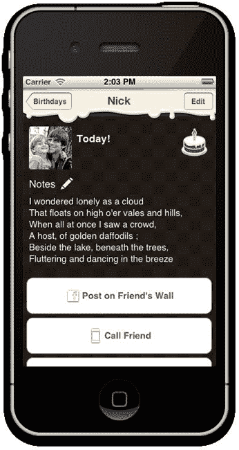

**图 9-30.** 通过代码动态计算备注文本高度，按钮整齐地排列在备注文本视图下方

让我们检查一下代码的工作原理。我们创建了一个名为 `cY` 的临时变量，用于在备注文本标签下方布局每个按钮时跟踪当前的 y 值。看看我们的最后一行代码：

```
self.scrollView.contentSize = CGSizeMake(320, cY);
```

我们使用 `cY` 值来确定滚动视图内容的总高度。

我们将 `cY` 初始化为备注文本标签的左上角点（原点）：

```
CGFloat cY = self.notesTextLabel.frame.origin.y;
```

之所以这样做，是因为备注文本标签上方的内容无需动态布局，只有它下方的所有内容才需要。

还剩下一点外观美化工作：那些难看的白色按钮需要改造！

### 美化按钮

这是我最后一条 iOS 美化技巧。我们想为生日详情视图中的按钮创建两种按钮样式：一种是大蓝色按钮样式，一种是大红色删除按钮样式。我们可以使用外观 API 来定义按钮样式。太棒了。然而，有一个问题：我们希望同一容器类中的按钮具有不同的样式。Apple 的 `appearanceWhenContainedIn:` 方法在这种场景下行不通。针对这个问题，我找到的最佳解决方案是创建 `UIButton` 的多个子类，并对不同的子类应用不同的外观样式。

在你的 Xcode 项目中，选择 `user-interface/components` 分组，并在此创建一个新的 Objective-C 类文件。将你的类命名为 `BRBlueButton`，并设置其父类为 `UIButton`。都完成了？太棒了。现在重复这个过程，在同一个 `components` 分组中添加一个名为 `BRRedButton` 的新类，但这次将其父类设置为你刚刚创建的 `BRBlueButton`。我们不需要向这些新类添加任何代码，因为创建它们仅用于美化目的。

回到你的故事板中的生日详情视图控制器场景，在文档大纲窗格中选择每个按钮。使用标识检查器，将前四个按钮的自定义类更改为 `BRBlueButton`，将最后一个（删除）按钮更改为 `BRRedButton`（参见 图 9-31）。

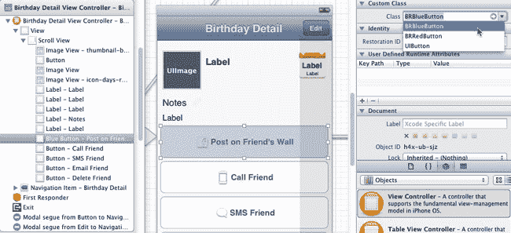

**图 9-31.** 在标识检查器中选择按钮子类

打开 `BRStyleSheet.m`，在导入 `BRBlueButton.h` 和 `BRRedButton.h` 之后，将以下代码添加到 `initStyles` 方法的末尾：

```
     //按钮
    [[BRBlueButton appearance] setBackgroundImage:[UIImage imageNamed:@"button-blue.png"]
forState:UIControlStateNormal];
    [[BRBlueButton appearance] setTitleColor:kLargeButtonTextColour
forState:UIControlStateNormal];
    [[BRBlueButton appearance] setFont:kFontLarge];

    [[BRRedButton appearance] setBackgroundImage:[UIImage imageNamed:@"button-red.png"]
forState:UIControlStateNormal];
    [[BRRedButton appearance] setTitleColor:kLargeButtonTextColour
forState:UIControlStateNormal];
    [[BRRedButton appearance] setFont:kFontLarge];
```

构建并运行。神奇吧！我们现在有了诱人的蓝色和红色按钮，并且有了一种非常简单的方法可以在我们应用的任何其他视图中创建新的蓝色或红色按钮（参见 图 9-32）！

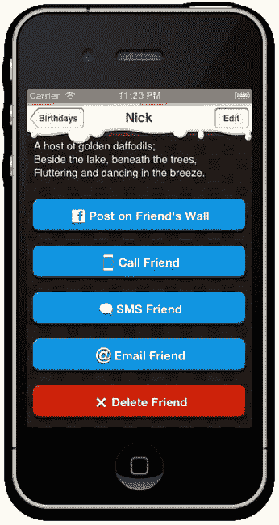

**图 9-32.** 诱人的蓝色和红色按钮！

在样式代码中，注意到我们只对蓝色按钮应用了标题颜色，但它仍然被红色按钮样式继承了吗？子类也会从其父类继承外观样式。

你可能注意到或没注意到最后一个样式小问题：主屏幕上的表格视图有白色背景。当表格视图在其可滚动内容区域的顶部和底部弹动时，你会注意到这一点。我们可以修复这个问题，并通过在 `initStyles` 方法中添加以下代码，使所有表格视图的表格视图背景颜色变为透明：

```
    //表格视图
    [[UITableView appearance] setBackgroundColor:[UIColor clearColor]];
    [[UITableViewCell appearance] setSelectionStyle:UITableViewCellSelectionStyleNone];
    [[UITableView appearance] setSeparatorStyle:UITableViewCellSeparatorStyleNone];
```

我还顺便添加了几行代码，以确保在我们的表格视图单元格中永远不会看到 Apple 的默认蓝色选中样式或线条分隔符样式，因为这与 *Birthday Reminder* 的设计不协调。

### 总结

第 3 天到此结束。恭喜！我们的 iPhone 应用现在已初具雏形，看起来像最初的 Photoshop 设计稿了。我想蛋糕设计本身就很诱人吧！

今天下午我们学到了很多关于如何美化和设计 iPhone 应用样式的知识。*Birthday Reminder* 看起来不再像一个 Apple 示例测试项目，而是一个很酷的应用。它的核心功能也已启动并运行。今天上午我们掌握了 Core Data 的基础知识，现在我们可以添加、编辑和保存生日或任何其他类型的数据实体了。

明天上午，我们将开始探索如何通过从用户的 iPhone 通讯录和 Facebook 批量导入生日来填充我们的应用。我们还将学习如何在应用未运行时安排本地通知。

明早见，精神饱满！


## 第 4 天

### 从通讯录和 Facebook 导入生日


## 第 10 章


