# 从通讯录导入生日

我们的项目已经进行到一半了。今天是第 4 天，大部分繁重的工作已经完成。今天我们将专注于从通讯录导入亲朋好友的生日到*生日提醒*中。我们会让这个过程对用户来说超级简单。只需轻点几下，他们的应用里就会装满生日提醒。

在构建任何应用时，设计简单易用的用户体验至关重要。我们要避免让用户经历手动将每个朋友的生日逐一输入应用的繁琐过程。那样很快就会让他们感到厌倦！苹果的电话通讯录应用（即地址簿）除了电话号码、电子邮件等信息外，还为每个联系人提供了多种字段。其中一项允许 iPhone 用户为每个联系人输入生日，如图 10-1 所示。

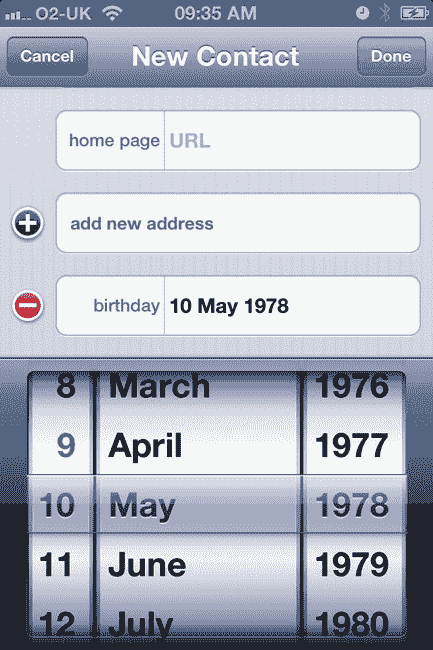

**图 10-1.** 苹果电话通讯录应用：为联系人指定生日

为联系人指定生日可能是某些用户会做、而另一些用户不会做的操作。因此，直接从地址簿导入到*生日提醒*是一个只有部分用户会使用的功能。

作为开发者，我们需要测试这个功能是否正常工作，所以在这个阶段，我建议你在 iPhone 通讯录中添加几个生日。

## 优化空数据库的主页视图

是时候和我们的名人说再见了。我们不会在发布的应用中预填充随机名人列表，所以让我们先移除应用中的测试功能。

打开`BRHomeViewController.m`源文件，删除整个`initWithCoder:`方法。如果你之前已将*生日提醒*安装到模拟器或 iPhone 上，现在将其删除。构建并运行。你的应用应该看起来像图 10-2 那样。当*生日提醒*首次启动时，一个空白的生日屏幕对新用户来说并不是最吸引人的启动画面。

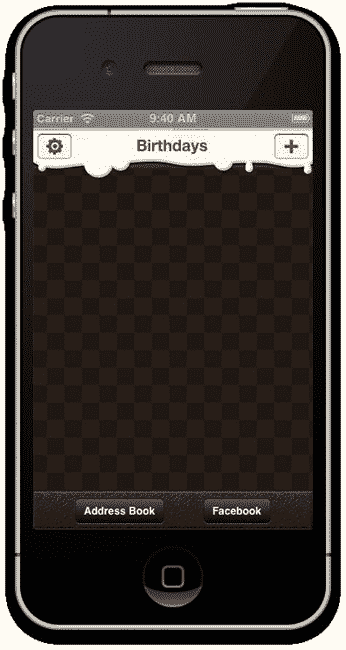

**图 10-2.** 生日数据库为空的主页视图

当用户首次启动*生日提醒*并面对空数据库时，我们希望邀请并鼓励他们添加或导入一些生日来开始使用。还记得我们昨天在“生日详情”视图中设计的那些漂亮的大蓝色按钮吗？我认为我们应该在空主页的中心添加几个这样的按钮，邀请用户从通讯录和 Facebook 导入生日。

为此，我们将向主页视图添加一个子视图。这个子视图显示文字“从……导入生日”，并附带两个大蓝色按钮，一个用于从通讯录导入，另一个用于从 Facebook 导入。

在我们开始修改故事板布局之前，先将另外两个图片资源导入到 Xcode 项目的`resources/images`分组中：`icon-addressbook.png` 和 `icon-addressbook@2x.png`。

在 Xcode 中打开故事板，并聚焦于主页视图控制器场景。确保文档大纲面板已打开，然后从对象库中拖拽一个新的视图实例，直接放到文档大纲面板中的主屏幕视图上，如图 10-3 高亮所示。

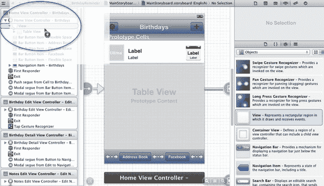

**图 10-3.** 将子视图拖放至主页视图

你的新子视图不应是表格视图的子视图，而应是主视图的子视图。这有点麻烦，但如果你的子视图放错了位置，可以使用文档大纲面板重新定位。此外，在文档大纲面板中将新子视图移到表格视图下方，这样它会显示在表格视图的前面，让你更容易操作。

保持新子视图选中状态，使用尺寸检查器来定位和调整大小（x=0, y=0, width=320, height=372）。我们还将使用属性检查器将子视图的背景设为透明。打开背景下拉菜单，从苹果默认颜色列表中选择清除颜色（见图 10-4）。

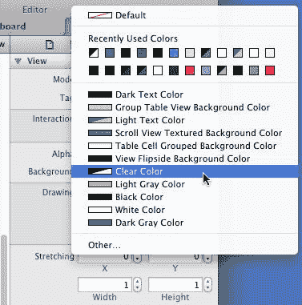

**图 10-4.** 使用苹果的清除颜色使视图透明

接下来，向子视图中添加一个标签和两个按钮，并按以下列表设置位置、大小和额外的属性值：

*   标签（`UILabel`）：x=14, y=92, width=293, height=21，文本对齐：居中，字体系统：17，文本：**从……导入生日**
*   按钮 1（`UIButton`）：将文本改为**通讯录**，然后定位并调整大小（x=7, y=127, width=307, height=60）。将`Image`属性设置为`icon-addressbook.png`。使用身份检查器将按钮的自定义类更改为`BRBlueButton`，就像我们昨天做的那样。
*   按钮 2（`UIButton`）：将文本改为**Facebook**，然后定位并调整大小（x=7, y=202, width=307, height=60）。将`Image`属性设置为`icon-facebook.png`。使用身份检查器将按钮的自定义类更改为`BRBlueButton`。

构建并运行（见图 10-5）。

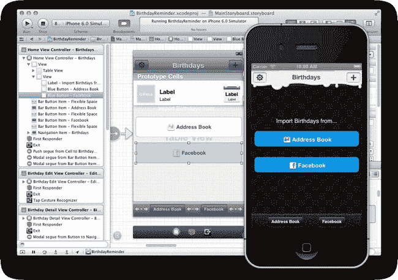

**图 10-5.** 得益于昨天的样式表类，创建大蓝色按钮简直是小菜一碟。


```markdown

在 storyboard 中保持选中 Home 视图控制器场景，激活 Xcode 的 Assistant Editor 布局。当右侧面板中显示`BRHomeViewController.h`时，导入`BRBlueButton.h`，然后在`BRHomeViewController.h`中为标签、按钮和 holder 视图创建新的 Interface Builder 插座，分别命名为`importLabel`、`addressBookButton`、`facebookButton`和`importView`。我们需要透明 holder 视图（`importView`）的插座来根据生日数据库是否为空隐藏或显示它：

```
#import <UIKit/UIKit.h>
#import "BRCoreViewController.h"
#import "BRBlueButton.h"

@interface BRHomeViewController : BRCoreViewController <UITableViewDelegate, UITableViewDataSource,NSFetchedResultsControllerDelegate>

-(IBAction)unwindBackToHomeViewController:(UIStoryboardSegue *)segue;
@property (weak, nonatomic) IBOutlet UITableView *tableView;
@property (weak, nonatomic) IBOutlet UILabel *importLabel;
@property (weak, nonatomic) IBOutlet BRBlueButton *addressBookButton;
@property (weak, nonatomic) IBOutlet BRBlueButton *facebookButton;
@property (weak, nonatomic) IBOutlet UIView *importView;

@end
```

除了新插座外，还要从 Address Book 和 Facebook 按钮创建 Touch Up Inside 操作到`BRHomeViewController.h`，如下所示：

```
- (IBAction)importFromAddressBookTapped:(id)sender;
- (IBAction)importFromFacebookTapped:(id)sender;
```

请注意，目前应用程序工具栏中有两个用于 Address Book 和 Facebook 的 Import 按钮（见图 10-5）。执行相同功能的重复按钮不是良好的用户界面设计，因此我们将修复此问题，使用户只看到一个 Address Book 按钮和一个 Facebook 按钮。在此之前，通过 Control 拖拽到我们刚刚设置的`importFromAddressBookTapped:`和`importFromFacebookTapped:`操作，为这些工具栏按钮添加 Interface Builder 操作。这样，两个 Address Book 按钮都应调用`importFromAddressBookTapped:`操作，两个 Facebook 按钮都应调用`importFromFacebookTapped:`操作。

至此，storyboard 的工作暂告一段落，让我们将注意力转移到`BRHomeViewController.m`源文件。首先，为“Import Birthdays from…”标签应用样式表。导入`BRStyleSheet.h`，然后添加`viewDidLoad`实现：

```
-(void) viewDidLoad
{
    [super viewDidLoad];
    [BRStyleSheet styleLabel:self.importLabel withType:BRLabelTypeLarge];
}
```

这会将奶油色文本和大型 Helvetica Neue 字体应用于指令标签。

新的导入子视图仅在 Core Data 存储中没有生日时显示。同样，带有 Address Book 和 Facebook 栏按钮项的工具栏仅在 Core Data 存储中有一个或多个生日时显示。有一种简洁的方法可以在代码中实现这一点。我们将向 Home 视图控制器添加一个名为`hasFriends`的私有布尔属性。如果没有生日，则将`hasFriends`设置为 false；如果有一个或多个生日，则将`hasFriends`设置为 true。我们将重写`hasFriends`的设置器，并在每次设置私有属性时隐藏或显示导入子视图和工具栏。

继续处理`BRHomeViewController.m`，在私有接口中定义新的私有属性：

```
@interface BRHomeViewController()

@property (nonatomic, strong) NSFetchedResultsController *fetchedResultsController;
@property (nonatomic) BOOL hasFriends;

@end
```

现在重写`hasFriends`的设置器：

```
-(void) setHasFriends:(BOOL)hasFriends
{
    _hasFriends = hasFriends;
    self.importView.hidden = _hasFriends;
    self.tableView.hidden = !_hasFriends;

    if (self.navigationController.topViewController == self) {
        [self.navigationController setToolbarHidden:!_hasFriends animated:NO];
    }
}
```

我们只是根据`hasFriends`设置为 true 或 false 来隐藏或显示导入视图、表视图和工具栏。但应该在何处设置`hasFriends`的值呢？

最简单的解决方案是每当 Home 视图控制器即将出现时设置`hasFriends`：

```
-(void) viewWillAppear:(BOOL)animated
{
    [super viewWillAppear:animated];
    [self.tableView reloadData];
    self.hasFriends = [self.fetchedResultsController.fetchedObjects count] > 0;
}
```

构建并运行。现在，我们有了一个主屏幕，它会根据生日数据库是否为空而更新并呈现不同的内容。尝试轻点“+”按钮添加生日（见图 10-6）。

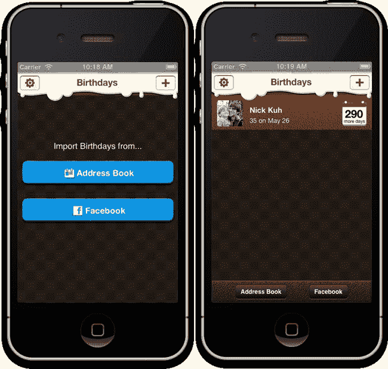

**图 10-6.** 根据是否有已保存的生日来隐藏或显示表视图、导入视图和工具栏

我们将创建一个新的视图和视图控制器场景，以便在从 Home 视图轻点任一 Address Book 按钮时以模态方式显示。回忆一下第 1 章/第 1 天，图 10-7 展示了我们的 Facebook 导入视图设计最终应该是什么样子。

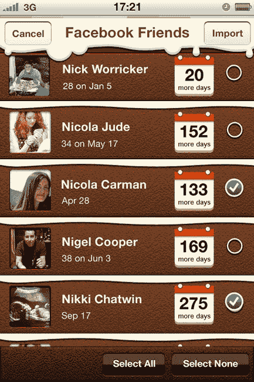

**图 10-7.** 我们计划构建的 Facebook 生日导入视图

除了标题，从 Address Book 导入的视图与从 Facebook 导入的视图看起来完全相同。在底层，获取要导入的生日列表的过程截然不同，但视图渲染是相同的。

我们已经在中心超视图控制器类中为应用程序中的每个视图设置背景时看到了创建核心视图控制器类的好处。Address Book 和 Facebook 导入屏幕似乎也应该共享一个超视图控制器类来集中共享的 UI 功能，因为它们非常相似。因此，首先我们将创建一个核心导入视图控制器。

在 Project Navigator 中选择`view-controllers`组，然后创建`BRCoreViewController`的一个新子类，并将其命名为`BRImportViewController`。可以取消选中 Targeted for iPad 和 With XIB for User Interface。

回到 storyboard，添加一个新的视图控制器场景。由于我们要以模态方式呈现 Address Book 导入视图控制器，因此将其嵌入到自己的导航控制器中，就像之前处理其他模态视图控制器一样。选择新的视图控制器，然后从菜单栏：Editor → Embed In → Navigation Controller。现在将新的导入视图控制器命名为 **Address Book**，并添加 Cancel 和 Import 按钮，如图 10-8 所示。

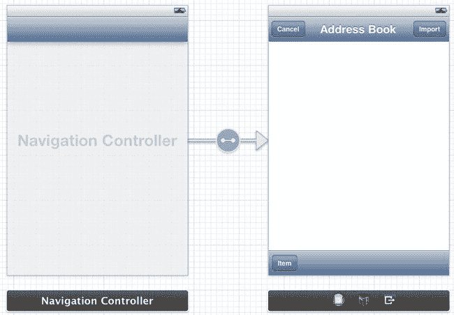

**图 10-8.** 将 Address Book 视图控制器嵌入新的导航控制器

选择刚刚创建的父导航控制器。使用属性检查器，在 Bar Visibility 选项下打开 Shows Toolbar。

导入的 Address Book 视图控制器场景中应该会出现一个工具栏，Xcode 可能已经添加了一个栏按钮项。按以下顺序在工具栏中设置项：一个 Flexible Space 栏按钮项、一个标题为 Select All 的栏按钮项和一个标题为 Select None 的栏按钮项（见图 10-9）。

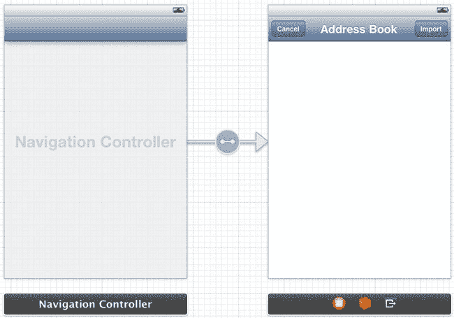

**图 10-9.** 配置 Address Book 导入工具栏

将新的表视图拖到 Address Book 视图上。在释放鼠标之前，让 Xcode 自动调整表视图大小以填充其父视图。选中新表视图后，使用大小检查器将行高修改为 72 磅，就像主屏幕表视图一样。

```


当用户从通讯录导入时，我们的导入视图会显示一个联系人列表，其中包含已分配的生日。用于显示每个联系人的表格单元格还会显示距离生日的天数，以及联系人照片（如果存在）。实际上，其布局与我们在主屏幕表格视图中创建的自定义表格单元格几乎相同。

由于表格单元格几乎完全相同，我们将复制主屏幕中的表格单元格原型，并将其粘贴到新的导入屏幕表格视图中。这很容易出错，所以请集中注意力。

如图 Figure 10-10 所示，确保在 storyboard 中能同时看到主场景和新的通讯录场景。确保文档大纲窗格已打开。在文档大纲窗格中，展开表格视图层次结构，以便看到列出的生日表格视图单元格原型。我们将按住 Alt 键，将此表格单元格原型从主视图控制器拖放到通讯录场景中的表格视图上（参见 Figure 10-10）。通讯录场景可能位于文档大纲窗格的下方，但拖动时窗格会滚动。

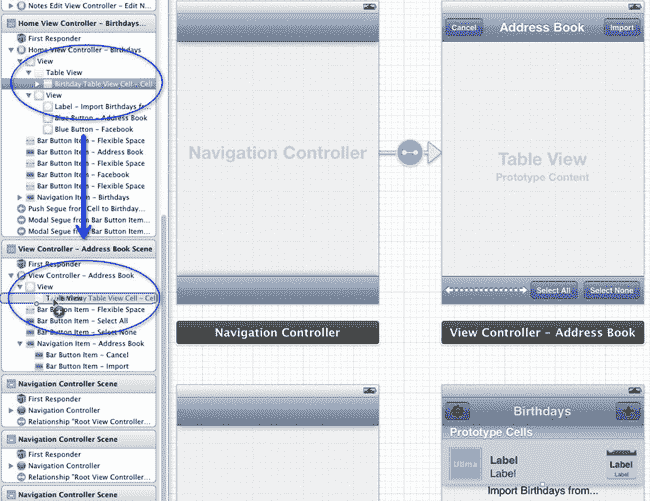

**Figure 10-10.** 将一个原型表格单元格从一个表格复制到另一个表格

放下自定义表格单元格原型（保持 Alt 键选中）后，通讯录表格视图中应出现一个重复的表格单元格原型（参见 Figure 10-11）。

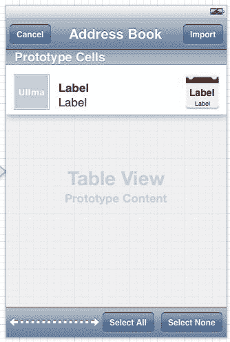

**Figure 10-11.** 在通讯录场景中复制原型表格单元格

我们将暂时将`BRImportViewController`作为通讯录视图控制器的自定义类。这使我们能够通过拖放直接创建连接到`BRImportViewController`类的 Outlet 和 Action：这些共享的 Outlet 和 Action 最终将被通讯录导入和 Facebook 导入两个视图控制器使用。

选择通讯录视图控制器场景，并使用身份检查器将类更改为`BRImportViewController`，如图 Figure 10-12 所示。

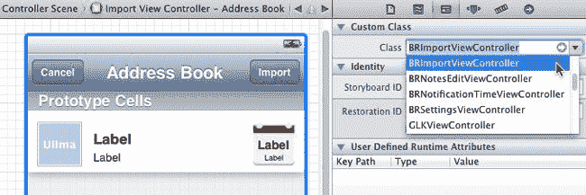

**Figure 10-12.** 将导入视图控制器类分配给 storyboard 中的视图控制器

在 storyboard 中选中通讯录视图控制器后，激活 Xcode 的助理编辑器布局。当`BRImportViewController.h`显示在助理编辑器的右侧面板中时，为导入按钮创建一个名为`importButton`的 Outlet，为表格视图创建一个名为`tableView`的 Outlet。

此外，为导入、全选和取消全选按钮创建 Action，如下代码所示：

```
#import "BRCoreViewController.h"

@interface BRImportViewController : BRCoreViewController

@property (weak, nonatomic) IBOutlet UITableView *tableView;
@property (weak, nonatomic) IBOutlet UIBarButtonItem *importButton;

- (IBAction)didTapImportButton:(id)sender;
- (IBAction)didTapSelectAllButton:(id)sender;
- (IBAction)didTapSelectNoneButton:(id)sender;

@end
```

从取消按钮拖线到视图控制器，如图 Figure 10-13 所示，将取消按钮连接到`BRCoreViewController`中的`cancelAndDismiss:`操作。

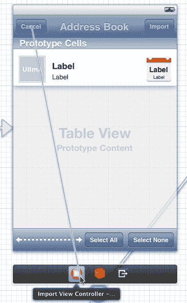

**Figure 10-13.** 设置取消按钮以关闭模态视图控制器

两个导入屏幕都将显示一个待导入的生日列表。我们将此列表的数据存储在每个导入视图控制器的数组属性中。让我们在`BRImportViewController.h`头文件中定义该数组：

```
@property (strong, nonatomic) NSArray *birthdays;
```

通过在导入视图控制器的公共接口中定义`birthdays`数组，其子类能够访问该数组并设置其数据。

在`BRImportViewController.h`头文件中，我们的导入视图控制器实现了`UITableViewDelegate`和`UITableViewDataSource`协议：

```
@interface BRImportViewController : BRCoreViewController<UITableViewDelegate, UITableViewDataSource>
```

从表格视图拖线到 storyboard 中的视图控制器，以连接表格视图的`dataSource`和`delegate`属性，如图 Figure 10-14 所示。

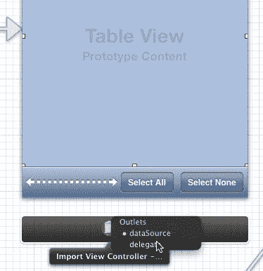

**Figure 10-14.** 从表格视图分配 dataSource 和 delegate Outlet

我们需要在`BRImportViewController.m`中添加两个来自`UITableViewDataSource`协议的必需方法：

```
#pragma mark UITableViewDataSource

- (NSInteger)tableView:(UITableView *)tableView numberOfRowsInSection:(NSInteger)section
{
    return [self.birthdays count];
}

- (UITableViewCell *)tableView:(UITableView *)tableView cellForRowAtIndexPath:(NSIndexPath *)indexPath
{
    UITableViewCell *cell = [self.tableView dequeueReusableCellWithIdentifier:@"Cell"];
    return cell;
}
```

### 在 storyboard 中标识视图控制器场景

当点击主视图中的任意一个通讯录按钮时，我们将显示通讯录视图。我将展示另一种在运行时访问 storyboard 中视图控制器场景的方法，而不是创建两个 Segue。我们将为新的通讯录视图控制器的导航控制器父级添加一个标识符。选择导航控制器。使用属性检查器，输入`ImportAddressBook`场景的标识符，如图 Figure 10-15 所示。

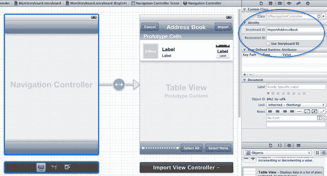

**Figure 10-15.** 为 storyboard 场景分配标识符

将注意力转向`BRHomeViewController.m`，滚动到`importFromAddressBookTapped:`操作方法，并添加以下代码：

```
- (IBAction)importFromAddressBookTapped:(id)sender {
    UINavigationController *navigationController = [self.storyboard instantiateViewControllerWithIdentifier:@"ImportAddressBook"];
    [self.navigationController presentViewController:navigationController animated:YES completion:nil];
}
```

我们使用标识符`ImportAddressBook`来实例化一个导航控制器和通讯录视图控制器的实例，然后以模态方式呈现它，使其从主视图控制器上方滑入。

构建并运行。您应该能够点击通讯录按钮来呈现我们的新场景，如图 Figure 10-16 所示。点击取消按钮应关闭模态视图控制器。

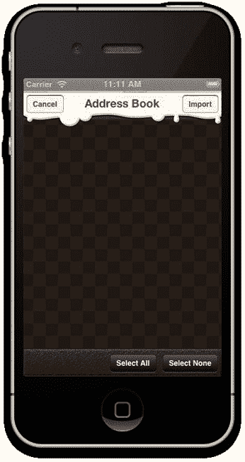

**Figure 10-16.** 以模态方式呈现的通讯录视图控制器

此时，我们将子类化核心导入视图控制器，以创建通讯录导入视图控制器。在项目导航器中选择`view-controllers`组，然后创建一个`BRImportViewController`的子类，并将其命名为`BRImportAddressBookViewController`。同样，取消选中 Targeted for iPad 和 With XIB for User Interface。

在 storyboard 中再次选中通讯录视图控制器，使用身份检查器将其自定义类更改为我们新的`BRImportAddressBookViewController`类。


### 访问并过滤通讯录联系人

接下来我们将把注意力转向数据模型，以实现访问 iPhone 通讯录联系人并仅筛选出那些已设定生日的联系人。由于这是一项数据功能，我们将把通讯录查询代码添加到主模型类 `BRDModel` 中。

在编写代码之前，我们需要先将 Apple 的通讯录框架添加到 Xcode 项目中。添加新框架的方法与我们在第 8 章中添加 Core Data 框架时相同。在项目导航器中选择 `BirthdayReminder` 项目，然后选择 `BirthdayReminder` 目标，最后选择“构建阶段”标签页，如图 10-17 所示。

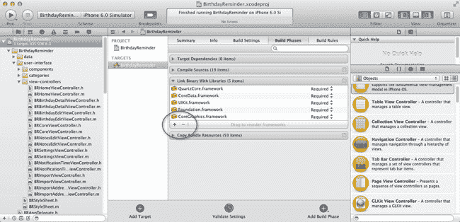

**图 10-17.** 准备添加新框架

点击图 10-17 中高亮显示的“+”按钮，并从列表中选择 `AddressBook.framework`。

#### 通讯录数据隐私

在 iOS 6 中，Apple 收紧了数据隐私限制。iOS 6 之前的应用可以无限制地读写用户的通讯录。虽然在 iOS 6 中仍然可以做到这一点，但我们的应用首先需要通过系统提示视图向用户请求访问权限。提示视图仅在应用首次请求通讯录访问权限时显示，因此一旦用户授权了我们的应用，就不会再提示他们重新授权。

从应用架构的角度来看，这意味着我们首次请求用户授权通讯录访问权限时会产生延迟。

让我们编写一些代码来观察实际效果。打开 `BRDModel.h` 并向我们的模型单例类添加一个新的获取方法：

`- (void)fetchAddressBookBirthdays;`

我们的通讯录导入视图控制器会调用模型上的这个新方法，该方法随后会检查通讯录访问权限。一旦用户授予访问权限，模型就会从 iPhone 获取所有包含生日信息的通讯录记录，并通过通知将其分发出去，通讯录视图控制器将订阅此通知并相应地更新其视图。

切换到 `BRDModel.m` 源文件。导入新添加的通讯录框架：

`#import <AddressBook/AddressBook.h>`

通讯录框架是用 C 语言编写的，而不是 Objective-C，因此没有 ARC（自动引用计数）。这意味着作为开发者，我们需要避免造成内存泄漏，并且需要手动处理 C 对象的保留和释放。以下是添加到 `BRDModel.m` 中的初始 `fetchAddressBookBirthdays` 代码：

```
- (void)fetchAddressBookBirthdays
{
    ABAddressBookRef addressBook = ABAddressBookCreateWithOptions(NULL, NULL);

    switch (ABAddressBookGetAuthorizationStatus()) {
        case kABAuthorizationStatusNotDetermined:
        {
            ABAddressBookRequestAccessWithCompletion(addressBook, ^(bool granted, CFErrorRef error) {
                if (granted) {
                    NSLog(@"已授予通讯录访问权限");
                }
                else {
                    NSLog(@"通讯录访问权限已被拒绝");
                }
            });
            break;
        }
        case kABAuthorizationStatusAuthorized:
        {
            NSLog(@"用户已授予通讯录访问权限");
            break;
        }
        case kABAuthorizationStatusRestricted:
        {
            NSLog(@"用户因家长控制等原因限制了通讯录访问权限");
            break;
        }
        case kABAuthorizationStatusDenied:
        {
            NSLog(@"用户已拒绝通讯录访问权限");
            break;
        }
    }

    CFRelease(addressBook);
}
```

如代码所示，通讯录授权状态有四种可能情况。如果用户尚未允许或拒绝我们的应用访问其通讯录，那么授权状态将为 `kABAuthorizationStatusNotDetermined`，我们将向系统请求访问权限，系统会显示一个提示，让用户允许或拒绝访问（参见图 10-18）。

在 switch 语句中，我们还可以判断用户之前是已授权还是已拒绝访问。还有另一种可能性：用户限制了对系统的访问（例如当家长控制启用时），因此将无权向我们的应用提供通讯录访问权限。

打开 `BRImportAddressBookViewController.m` 源文件，让我们的通讯录视图控制器调用 `BRDModel` 的新方法 `fetchAddressBookBirthdays`。首先，导入 `BRDModel.h`，然后添加如下所示的 `viewWillAppear:` 方法：

```
-(void) viewWillAppear:(BOOL)animated
{
    [super viewWillAppear:animated];
    [[BRDModel sharedInstance] fetchAddressBookBirthdays];
}
```

构建并运行。从主屏幕点击“导入通讯录”按钮。系统应会提示您允许/拒绝访问您的联系人，如图 10-18 所示。

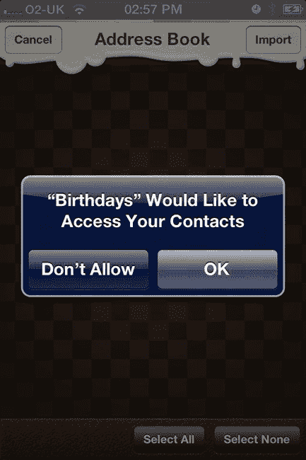

**图 10-18.** 向用户请求通讯录访问权限


### 处理通讯录数据

回到 `BRDModel.h`。首先，我们来声明一个通知名称，当模型单例成功处理用户通讯录中有关联生日的好友和家人时，我们会通过这个通知进行分发。在 `BRDModel.h` 文件顶部、任何其他代码或导入声明之前添加以下定义：

```
#define BRNotificationAddressBookBirthdaysDidUpdate
@"BRNotificationAddressBookBirthdaysDidUpdate"
```

现在切换到 `BRDModel.m`，添加一个新的空私有方法，我们稍后完成它：

```
-(void) extractBirthdaysFromAddressBook:(ABAddressBookRef)addressBook
{
    
}
```

我们将在用户授予访问权限时调用新的 `extractBirthdaysFromAddressBook:` 方法，或者在调用 `fetchAddressBookBirthdays:` 时立即调用——前提是用户之前已经授予过访问权限。用下面高亮的两行代码更新 `fetchAddressBookBirthdays:`：

```
- (void)fetchAddressBookBirthdays
{
    ABAddressBookRef addressBook = ABAddressBookCreateWithOptions(NULL, NULL);

    switch (ABAddressBookGetAuthorizationStatus()) {
        case kABAuthorizationStatusNotDetermined:
        {
            ABAddressBookRequestAccessWithCompletion(addressBook, ^(bool granted, CFErrorRef error) {
                if (granted) {
                    NSLog(@"Access to the Address Book has been granted");
                    dispatch_async(dispatch_get_main_queue(), ^{
                        // completion handler can occur in a background thread and this call will update the UI on the main thread
                        [self extractBirthdaysFromAddressBook:ABAddressBookCreateWithOptions(NULL, NULL)];
                    });
                }
                else {
                    NSLog(@"Access to the Address Book has been denied");
                }
            });
            break;
        }
        case kABAuthorizationStatusAuthorized:
        {
            NSLog(@"User has already granted access to the Address Book");
            [self extractBirthdaysFromAddressBook:addressBook];
            break;
        }
        case kABAuthorizationStatusRestricted:
        {
            NSLog(@"User has restricted access to Address Book possibly due to parental controls");
            break;
        }
        case kABAuthorizationStatusDenied:
        {
            NSLog(@"User has denied access to the Address Book");
            break;
        }
    }

    CFRelease(addressBook);
}
```

以下是添加到 `BRDModel.m` 中的 `extractBirthdaysFromAddressBook:` 方法的初始实现：

```
-(void) extractBirthdaysFromAddressBook:(ABAddressBookRef)addressBook
{
    NSLog(@"extractBirthdaysFromAddressBook");
    CFArrayRef people = ABAddressBookCopyArrayOfAllPeople(addressBook);

    CFIndex peopleCount = ABAddressBookGetPersonCount(addressBook);

    //this is just a placeholder for now - we'll get the array populated later in the chapter
    NSMutableArray *birthdays = [NSMutableArray array];

    for (int i = 0; i < peopleCount; i++)
    {
        ABRecordRef addressBookRecord = CFArrayGetValueAtIndex(people, i);
        CFDateRef birthdate  = ABRecordCopyValue(addressBookRecord, kABPersonBirthdayProperty);
        if (birthdate == nil) continue;
        CFStringRef firstName = ABRecordCopyValue(addressBookRecord, kABPersonFirstNameProperty);
        if (firstName == nil) {
            CFRelease(birthdate);
            continue;
        }
        NSLog(@"Found contact with birthday: %@, %@",firstName,birthdate);
        CFRelease(firstName);
        CFRelease(birthdate);
    }

    CFRelease(people);

    //dispatch a notification with an array of birthday objects
    NSDictionary *userInfo = [NSDictionary dictionaryWithObjectsAndKeys:birthdays,@"birthdays", nil];

    [[NSNotificationCenter defaultCenter] postNotificationName:BRNotificationAddressBookBirthdaysDidUpdate object:self userInfo:userInfo];
}
```

通讯录框架是 Core Foundation 的一部分，任何包含 `Copy` 或 `Create` 的 C 函数都要求你在使用完毕后释放对象引用。因此，函数末尾出现了 `CFRelease(object)` 代码。上述代码目前还不完整，但它展示了如何访问用户的通讯录并遍历联系人记录。每条联系人记录都有一组可选属性，我们可以尝试访问这些属性。在我们的示例中，`kABPersonBirthdayProperty` 属性指的是分配给联系人的任何生日，因此我们用它来只提取那些已分配生日的联系人。

目前，我们的代码即使找到了分配了生日的联系人，也会分发一个包含空数组的通知。我们稍后会解决这个问题，但现在我们只是想让这段代码跑起来，并让调试器打印出 `Found contact with birthday: [Name], [Birthday]`。

打开 `BRImportAddressBookViewController.m` 源文件，并将其关联起来，以观察和处理 `BRNotificationAddressBookBirthdaysDidUpdate` 通知。

以下是 `BRImportAddressBookViewController.m` 类的完整代码：

```
#import "BRImportAddressBookViewController.h"
#import "BRDModel.h"

@interface BRImportAddressBookViewController ()

@end

@implementation BRImportAddressBookViewController

-(void) viewWillAppear:(BOOL)animated
{
    [super viewWillAppear:animated];
    [[NSNotificationCenter defaultCenter] addObserver:self selector:@selector(handleAddressBookBirthdaysDidUpdate:) name:BRNotificationAddressBookBirthdaysDidUpdate object:[BRDModel sharedInstance]];
    [[BRDModel sharedInstance] fetchAddressBookBirthdays];
}

- (void) viewWillDisappear:(BOOL)animated
{
    [super viewWillDisappear:animated];
    [[NSNotificationCenter defaultCenter] removeObserver:self name:BRNotificationAddressBookBirthdaysDidUpdate object:[BRDModel sharedInstance]];
}

-(void)handleAddressBookBirthdaysDidUpdate:(NSNotification *)notification
{
    NSDictionary *userInfo = [notification userInfo];

    self.birthdays = [userInfo objectForKey:@"birthdays"];
    [self.tableView reloadData];

    if ([self.birthdays count] == 0)
    {
        UIAlertView *alert = [[UIAlertView alloc] initWithTitle:nil message:@"Sorry, No birthdays found in your address book" delegate:nil cancelButtonTitle:nil otherButtonTitles:@"OK", nil];
        [alert show];
    }
}

@end
```

构建并运行。当你启动通讯录导入视图控制器时，你应该会反复看到“抱歉，在你的通讯录中未找到生日”的提示，因为我们的模型目前正在分发一个空数组。然而，假设你已经授予了*生日提醒*访问通讯录的权限，那么每次你打开通讯录导入视图控制器时，模型的 `extractBirthdaysFromAddressBook:` 方法应该会将任何通讯录中的生日记录到调试器中。如果你在调试器中没有看到这些信息，那么现在正是为你的朋友分配一些生日的好时机，这样你就可以测试这段代码了！

**注意：** 你可以通过设置  通用  还原  还原位置与隐私来重置 iPhone 上的隐私权限，以测试应用对通讯录的允许和阻止访问。


#### 创建生日导入值对象

在 `BRDModel` 中，我们的 `addressBookBirthdays` 方法会遍历用户的通讯录。我们需要决定如何处理和格式化返回的联系人记录。通讯录视图控制器将像主页视图表格一样显示导入生日的列表；也就是说，包含距离朋友生日的天数、用户友好的日期格式、照片等信息。

我们将创建一个新的 `BRDBirthdayImport` 类，作为 `NSObject` 的子类。在项目导航器中选择 `data` 分组，然后创建一个新的 `NSObject` 子类，命名为 `BRDBirthdayImport`。`BRDBirthdayImport` 将与我们 Core Data 管理的 `BRDBirthday` 对象非常相似。然而，我们不能直接继承 `BRDBirthday`，因为 Core Data 的 `NSManagedObject` 是一个特殊类，只能通过托管对象上下文来实例化。

让我们添加 `BRDBirthdayImport.h` 接口：

```
#import <Foundation/Foundation.h>
#import <AddressBook/AddressBook.h>

@interface BRDBirthdayImport : NSObject

@property (nonatomic, strong) NSNumber *addressBookID;
@property (nonatomic, strong) NSNumber *birthDay;
@property (nonatomic, strong) NSNumber *birthMonth;
@property (nonatomic, strong) NSNumber *birthYear;
@property (nonatomic, strong) NSString *facebookID;
@property (nonatomic, strong) NSData *imageData;
@property (nonatomic, strong) NSString *name;
@property (nonatomic, strong) NSDate *nextBirthday;
@property (nonatomic, strong) NSNumber *nextBirthdayAge;
@property (nonatomic, strong) NSString *picURL;
@property (nonatomic, strong) NSString *uid;

@property (nonatomic,readonly) int remainingDaysUntilNextBirthday;
@property (nonatomic,readonly) NSString *birthdayTextToDisplay;
@property (nonatomic,readonly) BOOL isBirthdayToday;

-(id)initWithAddressBookRecord:(ABRecordRef)addressBookRecord;

@end
```

除了 `notes` 属性外，我们创建了一组与 `BRDBirthday` 实体相同的属性。我们还创建了一个初始化方法 `initWithAddressBookRecord:`，以便我们能够使用通讯录记录初始化器来生成并填充 `BRDBirthdayImport` 的实例。

现在切换到 `BRDBirthdayImport.m` 的实现，首先导入我们在第 8 章中为 `UIImage` 编写的缩略图类别：

```
#import "BRDBirthdayImport.h"
#import "UIImage+Thumbnail.h"

@implementation BRDBirthdayImport

@end
```

你可以从 `BRDBirthday.m` 中复制粘贴下一段代码。尽管代码重复并不是一个好习惯，但在这种情况下很难避免：

```
-(void)updateNextBirthdayAndAge
{
    NSDate *now = [NSDate date];

    NSCalendar *calendar = [NSCalendar currentCalendar];

    NSDateComponents *dateComponents = [[NSCalendar currentCalendar] components:NSYearCalendarUnit|NSMonthCalendarUnit|NSDayCalendarUnit fromDate:now];
    NSDate *today = [calendar dateFromComponents:dateComponents];

    dateComponents.day = [self.birthDay intValue];
    dateComponents.month = [self.birthMonth intValue];

    NSDate *birthdayThisYear = [calendar dateFromComponents:dateComponents];

    if ([today compare:birthdayThisYear] == NSOrderedDescending) {
        //今年的生日已经过去，所以下一个生日将在明年
        dateComponents.year++;
        self.nextBirthday = [calendar dateFromComponents:dateComponents];
    }
    else {
        self.nextBirthday = [birthdayThisYear copy];
    }

    if ([self.birthYear intValue] > 0) {
        self.nextBirthdayAge = [NSNumber numberWithInt:dateComponents.year - [self.birthYear intValue]];
    }
    else {
        self.nextBirthdayAge = [NSNumber numberWithInt:0];
    }

}

-(void) updateWithDefaults
{
    NSDateComponents *dateComponents = [[NSCalendar currentCalendar] components:NSYearCalendarUnit|NSMonthCalendarUnit|NSDayCalendarUnit fromDate:[NSDate date]];

    self.birthDay = @(dateComponents.day);
    self.birthMonth = @(dateComponents.month);
    self.birthYear = @0;

    [self updateNextBirthdayAndAge];
}

-(int) remainingDaysUntilNextBirthday
{
    NSDate *now = [NSDate date];
    NSCalendar *calendar = [NSCalendar currentCalendar];
    NSDateComponents *componentsToday = [calendar components:NSYearCalendarUnit|NSMonthCalendarUnit|NSDayCalendarUnit fromDate:now];
    NSDate *today = [calendar dateFromComponents:componentsToday];

    NSTimeInterval timeDiffSecs = [self.nextBirthday timeIntervalSinceDate:today];

    int days = floor(timeDiffSecs/(60.f*60.f*24.f));

    return days;
}

-(BOOL) isBirthdayToday
{
    return [self remainingDaysUntilNextBirthday] == 0;
}

-(NSString *) birthdayTextToDisplay {

    NSDate *now = [NSDate date];
    NSCalendar *calendar = [NSCalendar currentCalendar];
    NSDateComponents *componentsToday = [calendar components:NSYearCalendarUnit|NSMonthCalendarUnit|NSDayCalendarUnit fromDate:now];
    NSDate *today = [calendar dateFromComponents:componentsToday];

    NSDateComponents *components = [calendar components:NSMonthCalendarUnit|NSDayCalendarUnit fromDate:today toDate:self.nextBirthday options:0];

    if (components.month == 0) {
        if (components.day == 0) {
            //今天！

            if ([self.nextBirthdayAge intValue] > 0) {
                return [NSString stringWithFormat:@"%@ 今天！",self.nextBirthdayAge];
            }
            else {
                return @"今天！";
            }
        }
        if (components.day == 1) {
            //明天！
            if ([self.nextBirthdayAge intValue] > 0) {
                return [NSString stringWithFormat:@"%@ 明天！",self.nextBirthdayAge];
            }
            else {
                return @"明天！";
            }
        }
    }

    NSString *text = @"";

    if ([self.nextBirthdayAge intValue] > 0) {
        text = [NSString stringWithFormat:@"%@ 在 ",self.nextBirthdayAge];
    }

    static NSDateFormatter *dateFormatterPartial;

    if (dateFormatterPartial == nil) {
        dateFormatterPartial = [[NSDateFormatter alloc] init];
        [dateFormatterPartial setDateFormat:@"M 月 d 日"];
    }

    return [text stringByAppendingFormat:@"%@",[dateFormatterPartial stringFromDate:self.nextBirthday]];
}

@end
```

现在来点新内容。我们将编写新的 `BRDBirthdayImport.m` 初始化方法 `initWithAddressBookRecord:`。我在代码中添加了注释，帮助你理解逻辑：

```
-(id)initWithAddressBookRecord:(ABRecordRef)addressBookRecord
{
    self = [super init];
    if (self) {
        CFStringRef firstName = nil;
        CFStringRef lastName = nil;
        ABRecordID recordID;
        CFDateRef birthdate = nil;
        NSString *name = @"";

        //尝试填充核心基础字符串和日期引用
        recordID = ABRecordGetRecordID(addressBookRecord);
        firstName = ABRecordCopyValue(addressBookRecord, kABPersonFirstNameProperty);
        lastName  = ABRecordCopyValue(addressBookRecord, kABPersonLastNameProperty);
        birthdate  = ABRecordCopyValue(addressBookRecord, kABPersonBirthdayProperty);

        //将名和姓合并为一个字符串
        if (firstName != nil) {
            name = [name stringByAppendingString:(__bridge NSString *)firstName];
            if (lastName != nil) {
                name = [name stringByAppendingFormat:@" %@",lastName];
            }
        }
        else if (lastName != nil) {
            name = (__bridge NSString *)lastName;
        }

        self.name = name;
```


```objective-c
//我们将使用这个唯一标识来确保在 Core Data 存储中不会创建重复的导入记录
//防止用户尝试重新导入此生日通讯录联系人
self.uid = [NSString stringWithFormat:@"ab-%d",recordID];
self.addressBookID = [NSNumber numberWithInt:recordID];

NSDateComponents *dateComponents = [[NSCalendar currentCalendar] components:NSYearCalendarUnit|NSMonthCalendarUnit|NSDayCalendarUnit fromDate:(__bridge NSDate *)birthdate];

self.birthDay = @(dateComponents.day);
self.birthMonth = @(dateComponents.month);
self.birthYear = @(dateComponents.year);

[self updateNextBirthdayAndAge];

//这只是为了防止生日日期被设置为 150 年以前的预防措施！
if ([self.nextBirthdayAge intValue] > 150) {
    self.birthYear = [NSNumber numberWithInt:0];
    self.nextBirthdayAge = [NSNumber numberWithInt:0];
}

//检查用户关联的图像数据
if (ABPersonHasImageData(addressBookRecord)) {
    CFDataRef imageData = ABPersonCopyImageData(addressBookRecord);

    UIImage *fullSizeImage = [UIImage imageWithData:(__bridge NSData *)imageData];

    CGFloat side = 71.f;
    side *= [[UIScreen mainScreen] scale];

    UIImage *thumbnail = [fullSizeImage createThumbnailToFillSize:CGSizeMake(side, side)];

    self.imageData = UIImageJPEGRepresentation(thumbnail, 1.f);

    CFRelease(imageData);
}

if (firstName) CFRelease(firstName);
if (lastName) CFRelease(lastName);
if (birthdate) CFRelease(birthdate);
}
return self;
}
```

使用我们新的 `initWithAddressBookRecord:` 初始化方法，我们将从每个生日通讯录记录中创建 `BRDBirthdayImport` 实例。我们的模型会生成一个 `BRDBirthdayImport` 实例数组，并按名称的字母顺序通过通知分发它们。通讯录视图控制器将捕获所观察到的通知，并显示用户的联系好友，同时借助我们在导入值对象类中刚刚编写的代码，轻松显示计算出的生日数据。

回到 `BRDModel.m`。首先，导入新的 `BRDBirthdayImport.h` 头文件，然后完成 `extractBirthdaysFromAddressBook:` 的实现，如下所示：

```objective-c
-(void) extractBirthdaysFromAddressBook:(ABAddressBookRef)addressBook
{
    NSLog(@"extractBirthdaysFromAddressBook");
    CFArrayRef people = ABAddressBookCopyArrayOfAllPeople(addressBook);

    CFIndex peopleCount = ABAddressBookGetPersonCount(addressBook);

    BRDBirthdayImport *birthday;

    //这只是一个占位符——我们将在本章稍后填充该数组
    NSMutableArray *birthdays = [NSMutableArray array];

    for (int i = 0; i < peopleCount; i++)
    {
        ABRecordRef addressBookRecord = CFArrayGetValueAtIndex(people, i);
        CFDateRef birthdate  = ABRecordCopyValue(addressBookRecord, kABPersonBirthdayProperty);
        if (birthdate == nil) continue;
        CFStringRef firstName = ABRecordCopyValue(addressBookRecord, kABPersonFirstNameProperty);
        if (firstName == nil) {
            CFRelease(birthdate);
            continue;
        }
        //NSLog(@"找到有生日的联系人：%@, %@",firstName,birthdate);

        birthday = [[BRDBirthdayImport alloc] initWithAddressBookRecord:addressBookRecord];
        [birthdays addObject: birthday];

        CFRelease(firstName);
        CFRelease(birthdate);
    }

    CFRelease(people);

    //按名称字母顺序对生日进行排序
    NSSortDescriptor *sortDescriptor = [[NSSortDescriptor alloc] initWithKey:@"name" ascending:YES];
    NSArray *sortDescriptors = [NSArray arrayWithObject:sortDescriptor];
    [birthdays sortUsingDescriptors:sortDescriptors];

    //发送包含生日对象数组的通知
    NSDictionary *userInfo = [NSDictionary dictionaryWithObjectsAndKeys:birthdays,@"birthdays", nil];

    [[NSNotificationCenter defaultCenter] postNotificationName:BRNotificationAddressBookBirthdaysDidUpdate object:self userInfo:userInfo];
}
```

当 `BRDModel` 遍历生日通讯录联系人时，它会创建 `BRDBirthdayImport` 的新实例，并将通讯录联系人的 C 引用（`ABRecordRef`）传入。结果是 `extractBirthdaysFromAddressBook` 构建了一个 `BRDBirthdayImport` 实例的可变数组，该数组将被我们的通讯录视图控制器用于渲染生日表格单元格。在 `extractBirthdaysFromAddressBook` 方法的末尾，我们创建了一个排序描述符，并使用它通过 `name` 属性/排序键对 `BRDBirthdayImport` 实例进行重新排序。

此时，你应该能够构建并运行你的应用了。如果你的 iPhone 上有任何包含生日的联系人，那么启动“从通讯录导入”视图控制器时，应该会显示一个表格单元格，代表 iPhone 中每个联系人的生日（见图 10-19）。

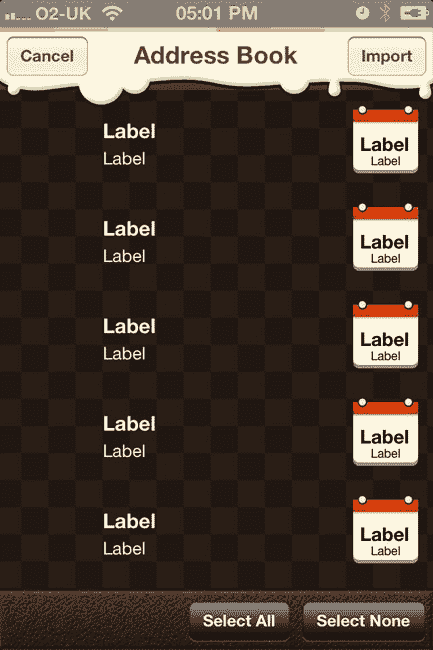

**图 10-19.** 看起来我们有一些通讯录联系人需要导入。


### 将联系人照片和数据加载到表格视图中

如图 10-19 所示，我们需要在通讯录视图控制器中填充表格单元格。我们将在共享的父类`BRImportViewController`中完成填充。这样，在后续构建从 Facebook 视图控制器导入的功能时，父类中已包含此逻辑，从而节省时间。

表格视图中的每个表格单元格都是自定义表格视图单元格类`BRBirthdayTableViewCell`的实例。我们已经编写了在该类中直接显示`BRDBirthday`实体的渲染逻辑，因此首先在 Xcode 中打开`BRBirthdayTableViewCell.h`，并将以下代码添加到接口代码中：

```
@class BRDBirthday;
@class BRDBirthdayImport;

@interface BRBirthdayTableViewCell : UITableViewCell

@property(nonatomic,strong) BRDBirthday *birthday;
@property(nonatomic,strong) BRDBirthdayImport *birthdayImport;
```

切换到`BRBirthdayTableViewCell.m`源文件，导入`BRDBirthdayImport.h`，然后按如下方式重写`birthdayImport`的 setter 方法：

```
-(void) setBirthdayImport:(BRDBirthdayImport *)birthdayImport
{
    _birthdayImport = birthdayImport;
    self.nameLabel.text = _birthdayImport.name;

    int days = _birthdayImport.remainingDaysUntilNextBirthday;

    if (days == 0) {
        //生日就在今天！
        self.remainingDaysLabel.text = self.remainingDaysSubTextLabel.text = @"";
        self.remainingDaysImageView.image = [UIImage imageNamed:@"icon-birthday-cake.png"];
    }
    else {
        self.remainingDaysLabel.text = [NSString stringWithFormat:@"%d",days];
        self.remainingDaysSubTextLabel.text = (days == 1) ? @"more day" : @"more days";
        self.remainingDaysImageView.image = [UIImage imageNamed:@"icon-days-remaining.png"];
    }

    self.birthdayLabel.text = _birthdayImport.birthdayTextToDisplay;

}
```

这段代码再次与`birthday`托管对象的 setter 方法几乎完全相同。

回到`BRImportViewController.m`，导入`BRBirthdayTableViewCell.h`和`BRDBirthdayImport.h`，然后修改`tableView:cellForRowAtIndexPath:`方法：

```
- (UITableViewCell *)tableView:(UITableView *)tableView cellForRowAtIndexPath:(NSIndexPath *)indexPath
{
    UITableViewCell *cell = [self.tableView dequeueReusableCellWithIdentifier:@"Cell"];

    BRDBirthdayImport *birthdayImport = self.birthdays[indexPath.row];

    BRBirthdayTableViewCell *brTableCell = (BRBirthdayTableViewCell *)cell;

    brTableCell.birthdayImport = birthdayImport;

    if (birthdayImport.imageData == nil)
    {
        brTableCell.iconView.image = [UIImage imageNamed:@"icon-birthday-cake.png"];
    }
    else {
        brTableCell.iconView.image = [UIImage imageWithData:birthdayImport.imageData];
    }

    UIImage *backgroundImage = (indexPath.row == 0) ? [UIImage imageNamed:@"table-row-background.png"] : [UIImage imageNamed:@"table-row-icing-background.png"];
    brTableCell.backgroundView = [[UIImageView alloc] initWithImage:backgroundImage];

    return cell;
}
```

这段代码与主屏幕表格视图单元格的渲染代码非常相似，因此应该看起来很熟悉。构建并运行。现在应该能看到通讯录联系人的姓名、生日和照片（参见图 10-20）。

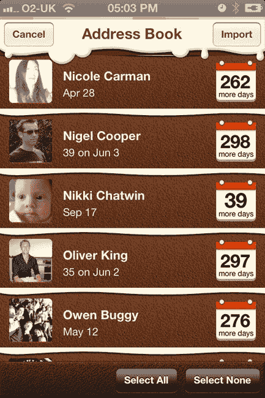

**图 10-20.** 这是我的通讯录联系人——看起来更棒了！

### 创建用于导入生日的多选表格视图

我们已经创建了一个“导入通讯录”视图，其中包含一个表格视图，用于显示通讯录中的联系人及其生日，但我们如何实现多选呢？我们的表格视图会显示一个空心圆圈或一个带对勾的圆圈，具体取决于该联系人当前是否被选中用于导入。让我们将这些图片资源添加到项目的`resources/images`目录中：`icon-import-not-selected.png`、`icon-import-not-selected@2x.png`、`icon-import-selected.png`和`icon-import-selected@2x.png`。

首先，在自定义表格视图单元格的右侧显示未选中的空心圆圈图片。在`BRImportViewController.m`的`tableView:cellForRowAtIndexPath:`方法末尾，但在返回单元格之前，添加以下两行代码：

```
    UIImageView *imageView = [[UIImageView alloc] initWithImage:[UIImage imageNamed:@"icon-import-not-selected.png"]];
    brTableCell.accessoryView = imageView;
```

表格视图单元格的实例具有一个`accessoryView`属性，我们可以将其设置为任何视图实例，我们指定的视图将显示在表格单元格的右侧。构建并运行，测试空心圆圈是否出现（参见图 10-21）。


**图 10-21.** 每个表格单元格都显示了一个圆圈，但它被日历图标遮挡了。

虽然在图 10-21 中可能看不太清楚，但空心圆圈是可见的，只是被其后面的日历图标遮挡了。我们可以在故事板中解决这个问题。聚焦通讯录视图控制器的原型单元格，然后多选日历图标和两个标签。使用大小检查器，更改这些子视图的自动调整大小属性，使得只有右侧的空间固定，而左侧不固定，如图 10-22 中突出显示的那样。

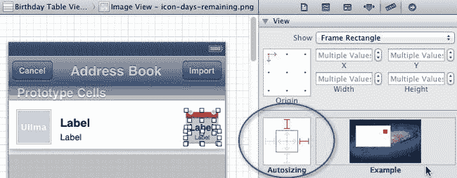

**图 10-22.** 更改日历图标和标签的自动调整大小掩码

构建并运行。结果应类似于图 10-23。

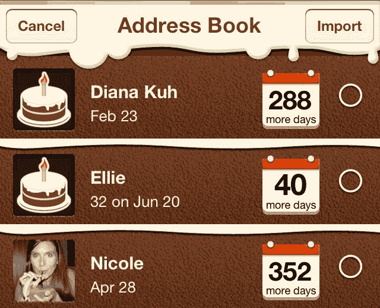

**图 10-23.** 好多了！

我们可以随时更新每个表格单元格的`accessoryView`属性。如果用户选中了一个联系人，我们将在`accessoryView`中显示一个绿色的对勾图片。否则，我们显示一个空心圆圈。

我们将使用一个可变字典来跟踪要导入的已选生日。确保你在`BRImportViewController.m`中工作。首先，在类实现代码的上方，为`BRImportViewController`的私有接口添加一个新属性：

```
@interface BRImportViewController()

//跟踪已选行的字典
@property (nonatomic, strong) NSMutableDictionary *selectedIndexPathToBirthday;

@end
```

我们将使用这个新的`selectedIndexPathToBirthday`字典来跟踪哪些行被选中，哪些未被选中。随着选择的变化，我们还将更新“导入”按钮，如果没有行被选中，则将其禁用。

现在，重写新属性`selectedIndexPathToBirthday`的 getter 方法，以确保它在首次访问时自动进行懒加载：

```
-(NSMutableDictionary *) selectedIndexPathToBirthday
{
    if (_selectedIndexPathToBirthday == nil) {
        _selectedIndexPathToBirthday = [NSMutableDictionary dictionary];
    }
    return _selectedIndexPathToBirthday;
}
```

接下来，实现两个新的私有方法：`updateImportButton`和`isSelectedAtIndexPath:`：

```
//如果没有选中的行，则启用/禁用导入按钮
- (void) updateImportButton
{
    self.importButton.enabled = [self.selectedIndexPathToBirthday count] > 0;
}

//检查某一行是否被选中的辅助方法
-(BOOL) isSelectedAtIndexPath:(NSIndexPath *)indexPath
{
    return self.selectedIndexPathToBirthday[indexPath] ? YES : NO;
}
```


`updateImportButton`方法检查选择字典中是否有任何键/值。如果有，则启用导入按钮。`isSelectedAtIndexPath:`方法检查是否已为索引路径的行存储了导入生日对象。如果已存储，则该行已被选中。

为了确保视图首次显示时禁用导入按钮，我们只需在`viewWillAppear:`实现中调用`updateImportButton`：

```
-(void) viewWillAppear:(BOOL)animated
{
    [super viewWillAppear:animated];
    [self updateImportButton];
}
```

现在，通过将辅助视图设置为勾选或空圆圈图像，使表格单元格选择动态化。添加最后一个新的私有方法：

```
//Refreshes the selection tick of a table cell
- (void)updateAccessoryForTableCell:(UITableViewCell *)tableCell atIndexPath:(NSIndexPath *)indexPath
{
    UIImageView *imageView;
    if ([self isSelectedAtIndexPath:indexPath]) {
        imageView = [[UIImageView alloc] initWithImage:[UIImage imageNamed:@"icon-import-selected.png"]];
    }
    else {
        imageView = [[UIImageView alloc] initWithImage:[UIImage imageNamed:@"icon-import-not-selected.png"]];
    }
    tableCell.accessoryView = imageView;
}
```

重新访问`tableView:cellForRowAtIndexPath:`方法，并按如下方式修改`accessoryView`设置代码：

~~`UIImageView *imageView = [[UIImageView alloc] initWithImage:[UIImage imageNamed:@"icon-import-not-selected.png"]];`~~
~~`brTableCell.accessoryView = imageView;`~~
```
[self updateAccessoryForTableCell:cell atIndexPath:indexPath];
```

为确保代码正常工作，请构建并运行。假设一切编译正常，唯一明显的变化是导入按钮被禁用。每个表格视图单元格应显示一个空圆圈作为其辅助视图。

我们的导入表格视图的预期行为是，点击任意行可以切换其选择状态。导入视图控制器已分配为表格视图的委托，因此通过实现`UITableViewDelegate`协议的`tableView:didSelectRowAtIndexPath:`方法，我们可以在点击行时更新选择：

```
#pragma mark UITableViewDelegate

-(void)tableView:(UITableView *)tableView didSelectRowAtIndexPath:(NSIndexPath *)indexPath
{

    BOOL isSelected = [self isSelectedAtIndexPath:indexPath];

    BRDBirthdayImport *birthdayImport = self.birthdays[indexPath.row];

    if (isSelected) {//already selected, so deselect
        [self.selectedIndexPathToBirthday removeObjectForKey:indexPath];
    }
    else {//not currently selected, so select
        [self.selectedIndexPathToBirthday setObject:birthdayImport forKey:indexPath];
    }

    //update the accessory view image
    [self updateAccessoryForTableCell:[self.tableView cellForRowAtIndexPath:indexPath] atIndexPath:indexPath];

    //enable/disable the import button
    [self updateImportButton];
}
```

构建并运行以测试。

接下来，实现“全选”和“全不选”按钮操作：

```
- (IBAction)didTapSelectAllButton:(id)sender {

    BRDBirthdayImport *birthdayImport;

    int maxLoop = [self.birthdays count];

    NSIndexPath *indexPath;

    for (int i=0;i<maxLoop;i++) {//loop through all the birthday import objects
        birthdayImport = self.birthdays[i];
        indexPath = [NSIndexPath indexPathForRow:i inSection:0];
        //create the selection reference
        self.selectedIndexPathToBirthday[indexPath] = birthdayImport;
    }

    [self.tableView reloadData];
    [self updateImportButton];
}

- (IBAction)didTapSelectNoneButton:(id)sender {
    [self.selectedIndexPathToBirthday removeAllObjects];
    [self.tableView reloadData];
    [self updateImportButton];
}
```

构建并运行（参见 Figure 10-24）。

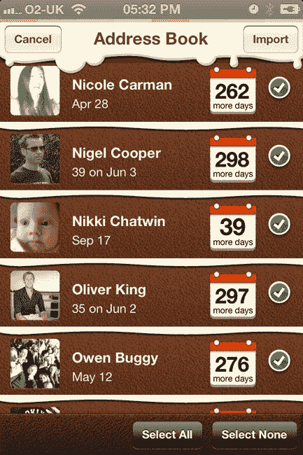

**图 10-24.** 点击“全选”后的效果。


### 将通讯录生日导入 Core Data 存储

现在，用户已经能够从通讯录中多选生日联系人，下一步就是在点击“导入”按钮时，将所选联系人的数据导入到 *Birthday Reminder* 中。让我们将注意力转回主模型类 `BRDModel`，并添加一个方法，用于将多个 `BRDBirthdayImport` 实例导入到 `BRDBirthday` Core Data 实体中。

在 `BRDModel.h` 中定义一个 `importBirthdays:` 公共方法：

```
- (void)importBirthdays:(NSArray *)birthdaysToImport;
```

昨天，在第 8 章的“重复实体与 Core Data 持久化同步”一节中，我们在模型中创建了一个实用方法，用于检索 Core Data 模型中所有与任何生日 ID 列表中的唯一 ID 匹配的现有生日实体。我们将在 `BRDModel.m` 中新的 `importBirthdays:` 实现里使用相同的逻辑：

```
- (void)importBirthdays:(NSArray *)birthdaysToImport
{
    int i;
    int max = [birthdaysToImport count];

    BRDBirthday *importBirthday;
    BRDBirthday *birthday;

    NSString *uid;
    NSMutableArray *newUIDs = [NSMutableArray array];

    for (i=0;i<max;i++)
    {
        importBirthday = birthdaysToImport[i];
        uid = importBirthday.uid;
        [newUIDs addObject:uid];
    }

    //使用 BRDModel 的实用方法，根据要导入的生日数组检索具有匹配 ID 的现有生日
    NSMutableDictionary *existingBirthdays = [self getExistingBirthdaysWithUIDs:newUIDs];

    NSManagedObjectContext *context = [BRDModel sharedInstance].managedObjectContext;

    for (i=0;i<max;i++)
    {
        importBirthday = birthdaysToImport[i];
        uid = importBirthday.uid;

        birthday = existingBirthdays[uid];
        if (birthday) {
            // Core Data 中已存在具有此 UDID 的生日，不创建重复项
        }
        else {
            birthday = [NSEntityDescription insertNewObjectForEntityForName:@"BRDBirthday" inManagedObjectContext:context];
            birthday.uid = uid;
            existingBirthdays[uid] = birthday;
        }

        //更新新建或之前保存的生日实体
        birthday.name = importBirthday.name;
        birthday.uid = importBirthday.uid;
        birthday.picURL = importBirthday.picURL;
        birthday.imageData = importBirthday.imageData;
        birthday.addressBookID = importBirthday.addressBookID;
        birthday.facebookID = importBirthday.facebookID;

        birthday.birthDay = importBirthday.birthDay;
        birthday.birthMonth = importBirthday.birthMonth;
        birthday.birthYear = importBirthday.birthYear;

        [birthday updateNextBirthdayAndAge];
    }

    //将新建和更新后的更改保存到 Core Data 存储中
    [self saveChanges];

}
```

以下是导入代码的逻辑：

> 1. 遍历要导入的生日，收集它们的唯一 ID。
> 2. 将唯一 ID 传递给 `getExistingBirthdaysWithUIDs:`，以获取包含匹配 ID 的现有生日实体的可变字典。
> 3. 再次遍历要导入的生日，创建或更新已存储的 Core Data 生日实体。
> 4. 保存更新内容。

让我们测试一下导入代码。回到 `BRImportViewController.m`，导入 `BRDModel.h`，然后实现 `didTapImportButton:` 操作方法：

```
- (IBAction)didTapImportButton:(id)sender {
    NSArray *birthdaysToImport = [self.selectedIndexPathToBirthday allValues];
    [[BRDModel sharedInstance] importBirthdays:birthdaysToImport];
    [self dismissViewControllerAnimated:YES completion:nil];
}
```

构建并运行。现在你应该能够从 iPhone 通讯录中挑选生日并将其导入到 *Birthday Reminder* 中（参见图 10-25）。

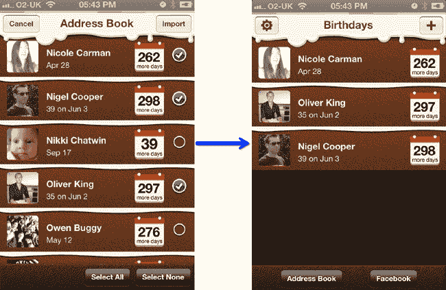

**图 10-25.** 从通讯录导入生日功能已全面运行

### 启用电话、短信和电子邮件功能

*Birthday Reminder* 的用户现在可以导入通讯录中任何已分配生日的联系人。但为什么要止步于此呢？我们已经将每个导入联系人的唯一 `ABRecordID` 属性保存在 `BRDBirthday.addressBookID` 中。我们可以利用苹果为每个导入生日提供的唯一联系人记录 ID，来访问联系人的其他信息，例如电话号码和电子邮件地址。

我们将在生日详情视图中使用这段检测代码。如果生日信息是从通讯录导入的，那么我们将检查 iPhone 是否存储了该联系人的电话号码，如果是，则显示按钮，以便用户通过电话或短信向朋友发送生日祝福！同样，如果我们检测到该通讯录联系人拥有电子邮件地址，那么我们将为用户提供通过电子邮件发送生日祝福的选项。

打开 `BRBirthdayDetailViewController.m` 源文件，首先导入 `AddressBook`：

```
#import <AddressBook/AddressBook.h>
```

我们将在 `BRBirthdayDetailViewController.m` 中创建私有辅助方法，用于生成启动电话、短信和电子邮件的 iOS 链接。首先添加一个 `telephoneNumber` 方法，该方法获取当前联系人的通讯录记录引用，并检查 `kABPersonPhoneProperty`（电话号码）属性是否存在：

```
#pragma mark Address Book contact helper methods

- (NSString *)telephoneNumber
{
    ABAddressBookRef addressBook = ABAddressBookCreateWithOptions(NULL, NULL);

    ABRecordRef record =  ABAddressBookGetPersonWithRecordID (addressBook,(ABRecordID)[self.birthday.addressBookID intValue]);

    ABMultiValueRef multi = ABRecordCopyValue(record, kABPersonPhoneProperty);

    NSString *telephone = nil;

    if (ABMultiValueGetCount(multi) > 0) {
        telephone = (__bridge_transfer NSString*)ABMultiValueCopyValueAtIndex(multi, 0);
        telephone = [telephone stringByReplacingOccurrencesOfString:@" " withString:@""];
    }
    CFRelease(multi);
    CFRelease(addressBook);

    return telephone;
}
```

如果我们的新方法找到了与该联系人关联的电话号码，它会移除号码中的所有空格，因为这是在激活电话或短信时，创建指向苹果电话和短信应用的应用内链接所必需的。如果我们的方法找不到与该联系人关联的电话号码，则返回 `nil`。


### 多任务应用中的 URL 方案与跨应用链接

iOS 原生应用支持多种 URL 方案，使开发者能够创建按钮或链接，以打开用户 iPhone 上的其他应用（如电话应用或 Safari）。许多应用还支持通过 URL 字符串传递额外参数，例如链接应用可识别的 ID，从而将用户直接导航到特定内容。你可以在以下网页中找到苹果自家应用所支持的 URL 方案列表：

`http://developer.apple.com/library/ios/#featuredarticles/iPhoneURLScheme_Reference/Introduction/Introduction.html`

访问该页面后，你会发现 `tel:` URL 方案可在 iPhone 上启动苹果的电话应用，而 `sms:` 方案则可启动信息应用。

**提示：** 你也可以通过 info plist 为自己的应用定义自定义 URL 方案，以实现其他应用到你的应用的直接链接。

接下来，我们在 `BRBirthdayDetailViewController.m` 中创建电话和短信链接的获取方法。这两个方法几乎完全相同，并且都使用了我们的 `telephoneNumber` 方法：

```
-(NSString *)callLink
{
    if (!self.birthday.addressBookID || [self.birthday.addressBookID intValue]==0) return nil;
    NSString *telephoneNumber = [self telephoneNumber];
    if (!telephoneNumber) return nil;

    NSString *callLink = [NSString stringWithFormat:@"tel:%@",telephoneNumber];

    if ([[UIApplication sharedApplication] canOpenURL:[NSURL URLWithString:callLink]]) return callLink;

    return nil;
}
```

```
-(NSString *)smsLink
{
    if (!self.birthday.addressBookID || [self.birthday.addressBookID intValue]==0) return nil;
    NSString *telephoneNumber = [self telephoneNumber];
    if (!telephoneNumber) return nil;

    NSString *smsLink = [NSString stringWithFormat:@"sms:%@",telephoneNumber];

    if ([[UIApplication sharedApplication] canOpenURL:[NSURL URLWithString:smsLink]]) return smsLink;

    return nil;
}
```

注意，在这两个方法中，我们都可以通过 `UIApplication` 的 `canOpenURL:` 方法，实际检查所创建的系统链接是否与设备兼容。这非常实用，因为它使我们能够检查用户是否安装了我们的应用已知且可直连的其他包含 URL 方案的应用。

`emailLink` 方法与我们之前编写的 `telephoneNumber` 方法非常相似。与电话号码一样，一个联系人也可以关联多个电子邮件地址。我们将检查该联系人是否存在 `email` 属性（`kABPersonEmailProperty`），如果存在，则检查是否关联了一个或多个电子邮件地址，并默认返回第一个：

```
-(NSString *)emailLink
{
    if (!self.birthday.addressBookID || [self.birthday.addressBookID intValue]==0) return nil;

    ABAddressBookRef addressBook = ABAddressBookCreateWithOptions(NULL, NULL);

    ABRecordRef record =  ABAddressBookGetPersonWithRecordID (addressBook,(ABRecordID)[self.birthday.addressBookID intValue]);

    ABMultiValueRef multi = ABRecordCopyValue(record, kABPersonEmailProperty);

    NSString *email = nil;
    if (ABMultiValueGetCount(multi) > 0) {//检查该联系人是否分配了一个或多个电子邮件地址
         email = (__bridge_transfer NSString*)ABMultiValueCopyValueAtIndex(multi, 0);
    }
    CFRelease(multi);
    CFRelease(addressBook);

    if (email) {
        NSString *emailLink = [NSString stringWithFormat:@"mailto:%@",email];
        //我们可以预填充邮件主题为“生日快乐”
        emailLink = [emailLink stringByAppendingString:@"?subject=Happy%20Birthday"];
        if ([[UIApplication sharedApplication] canOpenURL:[NSURL URLWithString:emailLink]]) return emailLink;
    }

    return nil;
}
```

现在我们已经创建了用于检测是否可以向生日联系人拨打电话、发送短信或邮件的工具方法，我们将在布局按钮列表时检查这些方法。只有当朋友有电话号码且当前设备允许使用 `tel:` URL 方案时，我们才会显示“拨打电话”按钮。*生日提醒* 应用可能安装在 iPod Touch 上，例如，在该设备上操作系统无法识别 `tel:` URL 方案；因此，我们不会在 iPod Touch 上显示“拨打电话”按钮。

导航到 `BRBirthdayDetailViewController.m` 的 `viewWillAppear:` 方法实现，并按照以下突出显示的更改修改方法代码的最后部分：

```
NSMutableArray *buttonsToShow = [NSMutableArray arrayWithObjects:self.facebookButton,self.callButton, self.smsButton, self.emailButton, self.deleteButton, nil];

NSMutableArray *buttonsToHide = [NSMutableArray array];

    if (self.birthday.facebookID == nil) {
        [buttonsToShow removeObject:self.facebookButton];
        [buttonsToHide addObject:self.facebookButton];
    }

    if ([self callLink] == nil) {
        [buttonsToShow removeObject:self.callButton];
        [buttonsToHide addObject:self.callButton];
    }

    if ([self smsLink] == nil) {
        [buttonsToShow removeObject:self.smsButton];
        [buttonsToHide addObject:self.smsButton];
    }

    if ([self emailLink] == nil) {
        [buttonsToShow removeObject:self.emailButton];
        [buttonsToHide addObject:self.emailButton];
    }

    UIButton *button;

for (button in buttonsToHide) {
        button.hidden = YES;
    }

    int i;

    for (i=0;i<[buttonsToShow count];i++) {
        button = [buttonsToShow objectAtIndex:i];
button.hidden = NO;
        frame = button.frame;
        frame.origin.y = cY;
        button.frame = frame;
        cY += button.frame.size.height + buttonGap;
    }

    self.scrollView.contentSize = CGSizeMake(320, cY);
```

在这段代码中，我们现在有两个数组：一个包含应在详情视图中显示的按钮引用，另一个包含针对该生日应隐藏的按钮引用。如果我们能通过通讯录框架找到生日联系人的电子邮件地址，则显示“发送邮件”按钮。如果找不到，则不显示发送邮件按钮（参见图 10-26）。

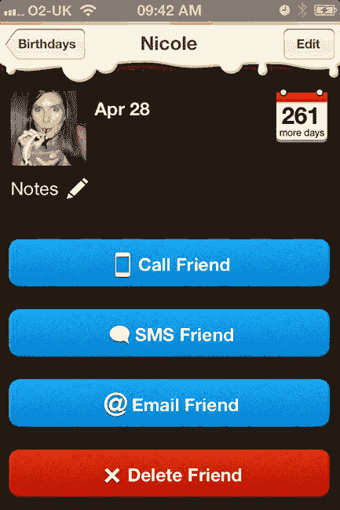

**图 10-26.** 这个朋友的所有通话/短信/邮件按钮都显示出来了，因为信不信由你，我手机里存了我妻子的所有联系方式！

知道我们可以给联系人发送邮件、拨打电话或发送短信固然很好，但目前，我们的按钮操作还没有任何实际功能。让我们来实现操作代码：

```
- (IBAction)callButtonTapped:(id)sender {
NSString *link = [self callLink];
    [[UIApplication sharedApplication] openURL:[NSURL URLWithString:link]];
}

- (IBAction)smsButtonTapped:(id)sender {
NSString *link = [self smsLink];
    [[UIApplication sharedApplication] openURL:[NSURL URLWithString:link]];
}

- (IBAction)emailButtonTapped:(id)sender {
NSString *link = [self emailLink];
    [[UIApplication sharedApplication] openURL:[NSURL URLWithString:link]];
}
```

构建并运行。太棒了，我们现在可以从应用内拨打电话、触发短信并发送“生日快乐”祝福了。

**注意：** 我们也可以使用苹果的 `MessageUI` 框架，直接在应用内创建邮件和短信。个人而言，我更倾向于充分利用多任务功能，但也可以查阅 `MessageUI` 框架文档，在应用内部处理完整的体验。


### 从数据存储中删除生日

在详细视图控制器中实现按钮功能时，让我们让“删除生日”按钮运转起来。在执行永久操作之前，请求用户确认删除是一种良好做法。现在切换到 `BRBirthdayDetailViewController.h` 头文件，声明生日详细控制器实现了 `UIActionSheetDelegate` 协议：

```
@interface BRBirthdayDetailViewController : BRCoreViewController <UIActionSheetDelegate>
```

现在回到 `BRBirthdayDetailViewController.m`，实现 `deleteButtonTapped:` 操作并显示一个“删除 [姓名]”操作表单：

```
- (IBAction)deleteButtonTapped:(id)sender {
    UIActionSheet *actionSheet = [[UIActionSheet alloc] initWithTitle:nil delegate:self cancelButtonTitle:@"取消" destructiveButtonTitle:[NSString stringWithFormat:@"删除 %@",self.birthday.name] otherButtonTitles:nil];
    [actionSheet showInView:self.view];
}
```

构建并运行后，结果应如图 10-27 所示。

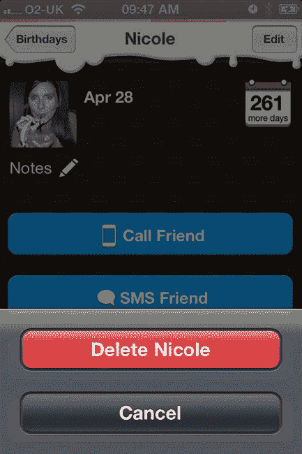

**图 10-27.** 我正在删除老婆，但这事只有你知我知！

最后，如果用户按下了那个大红按钮，我们将执行删除指令。首先，将 `BRDModel.h` 导入 `BRBirthdayDetailViewController.m`。

现在是时候在 `BRBirthdayDetailViewController.m` 中实现 `UIActionSheetDelegate` 协议的 `actionSheet:willDismissWithButtonIndex:` 方法了：

```
#pragma mark - UIActionSheetDelegate

- (void)actionSheet:(UIActionSheet *)actionSheet willDismissWithButtonIndex:(NSInteger)buttonIndex
{
    //检查用户是否通过操作表单的取消按钮取消了删除指令
    if (buttonIndex == actionSheet.cancelButtonIndex) return;

    //获取 Core Data 托管对象上下文的引用
    NSManagedObjectContext *context = [BRDModel sharedInstance].managedObjectContext;
    //从托管对象上下文中删除此生日实体
    [context deleteObject:self.birthday];
    //将删除更改保存到持久化 Core Data 存储中
    [[BRDModel sharedInstance] saveChanges];

    //将此视图控制器从导航堆栈中弹出，并滑动返回主屏幕
    [self.navigationController popViewControllerAnimated:YES];
}
```

删除一个 Core Data 实体在它与其他实体没有关系时相当简单。我们只需获取 Core Data 托管对象上下文的引用，然后将生日实体的引用传递给上下文的 `deleteObject:` 方法。我们通过 `BRDModel` 的 `saveChanges` 工具方法将删除更改保存到 Core Data 持久化存储中。最后，我们将详细视图控制器从导航堆栈中弹出，并指示导航控制器滑动回主视图控制器。你会看到主页表格视图自动更新。

### 总结

第 4 天 真是一个好的开始！我们已经探索了苹果提供给第三方应用访问权限的通讯录框架的一些特性。

能够访问用户的联系人列表赋予了我们应用巨大的责任，以及用户信任我们不会分享或滥用这些敏感数据。像 *Path* 这样非常成功的应用在 2012 年遭遇了大量负面报道，当时发现它们将用户联系人传递给服务器端系统。诸如此类的事件促使苹果在 iOS 6 中加强了隐私保护，让用户能够控制允许或不允许应用访问的数据。这是 iOS 的一项重大改变，因为它将权力交到了用户手中，解决了数据隐私滥用问题，并使私有数据访问对数据所有者——也就是你的用户——更加透明。

只要不滥用这种信任，能访问用户的联系人列表，我们就可以在应用中构建真正有用的功能，实现快速简便的个性化和数据导入，让应用用户的生活更轻松。

接下来，我们将学习如何使用苹果在 iOS 6 中新增的社交框架，让用户能够导入他们 Facebook 好友的生日信息。很快，我们将展示所有用户 Facebook 好友的导入列表。最棒的是，得益于面向对象代码设计的奇妙之处，我们在本章中已经编写了大部分用于从 Facebook 导入数据的用户界面代码。

喝杯咖啡，我们五分钟后见！


## 第 11 章：使用 Facebook 和 iOS 6 社交框架

今天早些时候，我们成功设置了 *生日提醒* 应用，从 iPhone 通讯录批量导入了生日信息。但真正能增强我们应用对数百万潜在用户吸引力的，是让他们能够从 Facebook 账户导入朋友的生日。

在本章中，我们将利用 iOS 6 原生的 Facebook 集成功能。通过使用苹果的账户框架，你将学习如何让用户使用 Facebook 认证 *生日提醒*。在此基础上，你将发现如何使用新的社交框架访问 Facebook 的 Graph API，并让用户导入 Facebook 好友的生日。

但我们不会止步于此。我将向你展示如何创建你自己的自定义视图控制器，用于直接向好友的 Facebook 动态发布消息。这对我们的用户来说是一个有用的功能，并且还有一个额外的好处：每个分享的生日快乐帖子旁会自动生成一个回到 *生日提醒* Facebook 页面的链接！

Facebook 有自己的 iOS SDK，但我们完全不会用到它。我们与 Facebook Graph API 集成所需的一切都已内置于 iOS 6 中。

### 在 Facebook.com 上注册新应用

为了创建任何能够集成 Facebook 功能（例如发布到好友的 Facebook 动态、访问用户的 Facebook 好友、读取用户的 Facebook 新闻推送等）的应用（无论是 iOS 还是其他平台），你需要拥有自己的 Facebook.com 账户。你还需要在 [`www.facebook.com/developer`](http://www.facebook.com/developer) 注册成为 Facebook 开发者。

一旦你成为注册开发者并访问 Facebook 的开发者网站，你将能够导航到主应用部分。点击“创建新应用”按钮。系统会提示你输入一个新的应用名称（参见图 11-1）。

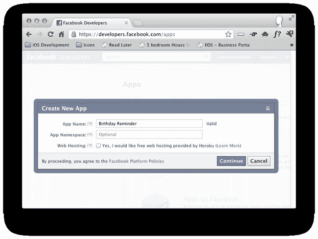

**图 11-1.** 在 Facebook.com 上创建新的 Facebook 应用

应用命名空间是可选的，因此一旦你输入了一个未被占用的有效应用显示名称，就一切就绪了。Facebook 会立即为你的应用提供一个新应用 ID。

你不必使用 *生日提醒* 这个名称，但无论你使用什么名称，当新用户在将 Facebook 好友导入你的应用之前进行认证时，Facebook 都会向用户显示这个名称。

为了让苹果原生的账户认证代码能与 Facebook 协同工作，你需要对你的新 Facebook.com 应用进行一项必要的修改：将你的 iOS 应用包标识符添加到你的 Facebook 应用设置中。点击“编辑设置”链接，滚动到标题为“原生 iOS 应用”的选项卡。打开该选项卡，在第一个文本字段中输入你应用的包标识符。就我而言，它是 `com.apress.BirthdayReminder`；但对你来说，*这必须与你应用的包标识符匹配*（参见图 11-2）。

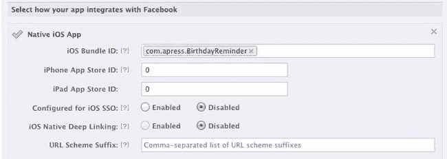

**图 11-2.** 为我们的应用在 Facebook.com 设置中添加 iOS 包标识符

这个包标识符与你应用的原生包标识符匹配非常重要，因为在单点登录认证过程中，账户框架会自动检查并引用它。


### 创建 Facebook 导入视图控制器

在之前的章节（第 10 章）中，我们投入了大量精力创建通讯录导入视图控制器。在此过程中，我们创建了 `BRImportViewController` 类，通讯录和 Facebook 导入视图控制器都将继承这个基类。现在我们将看到，这些开发步骤如何帮助我们在项目现阶段快速创建 Facebook 导入视图控制器。打开你的故事板。使用鼠标多选通讯录视图控制器及其父导航控制器场景，如图 11-3 所示。

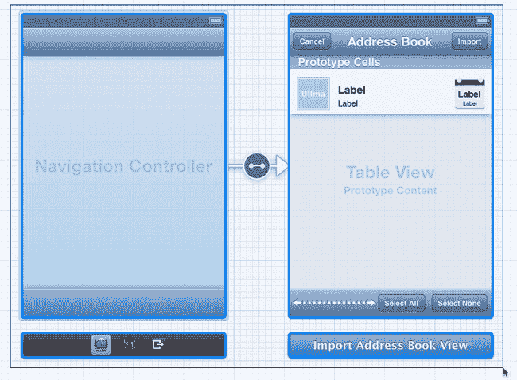

**图 11-3.** 多选故事板场景

使用键盘快捷键 C 或依次点击 Edit  Copy，再使用快捷键 V 或依次点击 Edit  Paste。你应该能在故事板中复制这两个视图控制器。将复制的视图控制器拖到故事板中的新位置，并将导航栏标题改为 **Facebook**。选中新的导航控制器，在属性检查器中将 `Identifier` 属性改为 `ImportFacebook`。

打开 `BRHomeViewController.m`，像呈现通讯录视图控制器那样，实现 `importFromFacebookTapped:` 操作方法：

```
- (IBAction)importFromFacebookTapped:(id)sender {
    UINavigationController *navigationController = [self.storyboard
        instantiateViewControllerWithIdentifier:@"ImportFacebook"];
    [self.navigationController presentViewController:navigationController animated:YES
        completion:nil];
}
```

现在创建核心导入视图控制器的子类，作为 Facebook 导入视图控制器。在项目导航器中选择 `view-controllers` 组，然后创建 `BRImportViewController` 的新子类，命名为 `BRImportFacebookViewController`。

在故事板中选择你的 Facebook 导入视图控制器，使用标识检查器将其自定义类改为我们新建的 `BRImportFacebookViewController` 类，如图 11-4 所示。

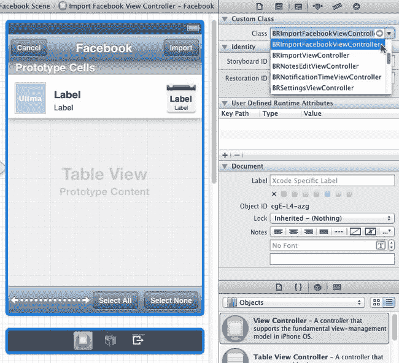

**图 11-4.** 在故事板中将自定义类更改为新的 Facebook 子类

构建并运行。现在你应该能在应用中呈现和关闭（Cancel）Facebook 视图控制器了（参见 图 11-5）。

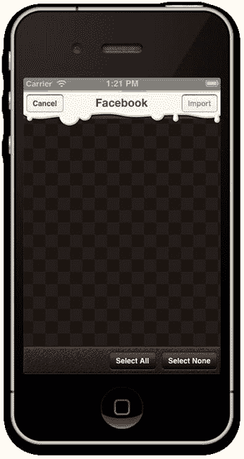

**图 11-5.** 模态呈现的空 Facebook 导入视图控制器

### 使用账户框架进行 Facebook 身份验证

为了让 *Birthday Reminder* 能够获取 Facebook 好友的生日信息，用户需要先授权我们的应用代表他们与 Facebook 的 API 通信。我们将通过模型单例类 `BRDModel` 处理所有 Facebook 身份验证流程。

首先，在项目中添加 Accounts 和 Social 框架。按照前几章的操作，在项目导航器中选择 `BirthdayReminder` 项目，接着选择 `BirthdayReminder` 目标，然后选择 Build Phases 标签页。点击 Link Binary with Libraries 下的 Add Framework 按钮，添加 Accounts 和 Social 框架。将这两个框架添加到项目后，将它们拖放到项目导航器的 `Frameworks` 组中，如图 11-6 所示。

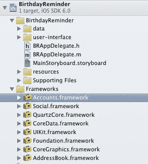

**图 11-6.** 添加到项目中的 Accounts 和 Social 框架

现在打开 `BRDModel.h`，声明一个新的公共方法 `fetchFacebookBirthdays`，我们的 Facebook 导入视图控制器将在其出现时调用该方法：

```
- (void)fetchFacebookBirthdays;
```

切换到 `BRDModel.m` 源文件，导入 Accounts 和 Social 框架：

```
#import <Social/Social.h>
#import <Accounts/Accounts.h>
```

一旦用户成功通过 Facebook 验证，我们将获得已验证账户的引用。通过在模型中保留该 Facebook 账户引用，我们就能调用 Facebook 的 API、在 Facebook 墙上发帖，或使用 Facebook Graph API 提供的其他功能。

在 `BRDModel.m` 的最顶部，类实现之前，添加一个新的 Facebook 动作枚举器和 `BRDModel` 的私有接口，该接口声明两个新的私有属性：`facebookAccount`（已验证 Facebook 账户的引用）和 `currentFacebookAction`（用于追踪当前正在处理的 Facebook Graph API 动作的属性）：

```
typedef enum : int
{
    FacebookActionGetFriendsBirthdays = 1,
    FacebookActionPostToWall
}FacebookAction;

@interface BRDModel()

@property (strong) ACAccount *facebookAccount;
@property FacebookAction currentFacebookAction;

@end
```

在本章后面，我们将编写代码在好友的 Facebook 墙上发帖；所以此处我们为多个 Facebook 处理流程预先做了规划。

现在我们编写 `BRDModel.m` 中的 Facebook 身份验证方法。我对代码做了详细注释：

```
- (void)authenticateWithFacebook {

    // iOS 中的 Twitter、Facebook 和 Sina Weibo 等中央账户由应用通过 ACAccountStore 访问
    ACAccountStore *accountStore = [[ACAccountStore alloc] init];

    ACAccountType *accountTypeFacebook = [accountStore
        accountTypeWithAccountTypeIdentifier:ACAccountTypeIdentifierFacebook];

    // 替换为你的 Facebook.com 应用 ID
    NSDictionary *options = @{ACFacebookAppIdKey: @"125381334264255",
        ACFacebookPermissionsKey:
        @[@"publish_stream",@"friends_birthday"],ACFacebookAudienceKey:ACFacebookAudienceFriends};

    [accountStore requestAccessToAccountsWithType:accountTypeFacebook options:options
        completion:^(BOOL granted, NSError *error) {
        if(granted) {
            // 完成处理程序可能不在主线程中触发，由于我们要
            NSLog(@"Facebook 授权成功！");
            NSArray *accounts = [accountStore accountsWithAccountType:accountTypeFacebook];
            self.facebookAccount = [accounts lastObject];
```


```objectivec
// 通过检查用户在进行授权前尝试执行哪种 Facebook 操作，
// 我们可以在授权成功后完成该 Facebook 操作
switch (self.currentFacebookAction) {
    case FacebookActionGetFriendsBirthdays:
        [self fetchFacebookBirthdays];
        break;
    case FacebookActionPostToWall:
        // TODO - 在朋友的 Facebook 墙上发帖
        break;
}
} else {

    if ([error code] == ACErrorAccountNotFound) {
        NSLog(@"未找到 Facebook 账户");
    }
    else {
        NSLog(@"Facebook SSO 认证失败: %@",error);
    }
}
}];
}
```

在上面的代码中，请确保已将我的 Facebook 应用 ID `125381334264255` 替换为你自己的 Facebook 应用 ID。

苹果在 iOS 6 中原生支持三种社交网络账户类型：Twitter、Facebook 和新浪微博。为了检查和访问这些社交网络账户，我们的代码会查询`ACAccountStore`，并传入我们感兴趣访问的账户的社交网络类型；在我们的例子中，这是一个标识符为`ACAccountTypeIdentifierFacebook`的账户类型。

既然我们已经声明正在检查 Facebook 账户，我们还需要让 iOS 了解我们请求访问数据的意图。对于 Facebook，我们需要传入一个选项字典，其中包含 Facebook 应用 ID 以及我们需要访问的 Facebook 权限。对于某些 Facebook 功能，必须指定一个*扩展权限*数组：获取朋友生日需要`friends_birthday`权限。关于扩展权限的完整列表，请访问以下网页：[`http://developers.facebook.com/docs/reference/api/permissions/`](http://developers.facebook.com/docs/reference/api/permissions/)。

`ACAccountStore`的方法`requestAccessToAccountsWithType:`要求我们传入一个完成代码块，当用户点击"不允许"或"好"以响应账户访问请求时，该代码块会被调用。

现在让我们开始在`BRDModel.m`中实现`fetchFacebookBirthdays`：

```objectivec
- (void)fetchFacebookBirthdays
{
    NSLog(@"fetchFacebookBirthdays");
    if (self.facebookAccount == nil) {
        self.currentFacebookAction = FacebookActionGetFriendsBirthdays;
        [self authenticateWithFacebook];
        return;
    }
    // 如果代码执行到这里，说明我们已有经过验证的 Facebook 账户
}
```

我们的 Facebook 导入视图控制器不需要了解授权过程的任何细节；它只需要知道导入哪些生日以及列表何时更新。每次 Facebook 导入视图控制器出现时，我们都会设置它调用模型上的`fetchFacebookBirthdays`方法，该方法首先检查`self.facebookAccount`是否存在（即是否已由用户授权）。如果不存在，此时我们的模型将通过执行我们刚编写的`authenticateWithFacebook`方法来启动单点登录过程。

打开`BRImportFacebookViewController.m`，导入`BRDModel`，然后在 Facebook 导入视图出现时添加`fetchFacebookBirthdays`方法调用，如下所示：

```objectivec
#import "BRImportFacebookViewController.h"
#import "BRDModel.h"
@interface BRImportFacebookViewController ()

@end

@implementation BRImportFacebookViewController

-(void) viewWillAppear:(BOOL)animated
{
    [super viewWillAppear:animated];
    [[BRDModel sharedInstance] fetchFacebookBirthdays];
}

@end
```

尝试编译并运行。点击 Facebook 按钮。只要你的设备或模拟器上关联了 Facebook 账户，你就能看到数据隐私提示，如图 Figure 11-7 所示。

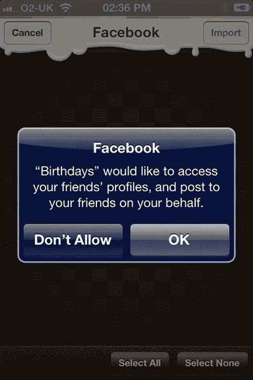

**图 11-7.** 苹果的 Accounts 框架提示用户允许访问其 Facebook 账户

来自 Facebook 导入的视图控制器在出现时调用了模型的`fetchFacebookBirthdays`方法。`BRDModel.m`检查其私有属性`facebookAccount`是否存在，如果未设置，则调用我们之前编写的`authenticateWithFacebook`方法。

在权限提示视图中点击"好"会触发`authenticateWithFacebook`方法中的完成代码块运行，该代码块将`facebookAccount`存储到模型中，然后重新调用`fetchFacebookBirthdays`，这样我们获取 Facebook 生日的代码现在就可以在授权下运行了。我们还没有编写获取生日的代码，所以现在开始编写。


### 获取 Facebook 生日信息

当用户完成 Facebook 单点登录流程，并授权*生日提醒*应用代表他们与 Facebook 通信后，我们就能实现这一功能了！因此，让我们扩展 `BRDModel.m` 中的 `fetchFacebookBirthdays` 方法，使其能够发起 Facebook API 请求，以获取用户 Facebook 好友的生日详情：

```
- (void)fetchFacebookBirthdays
{
    NSLog(@"fetchFacebookBirthdays");
    if (self.facebookAccount == nil) {
        self.currentFacebookAction = FacebookActionGetFriendsBirthdays;
        [self authenticateWithFacebook];
        return;
    }
    //如果代码执行到这里，说明我们已经有了经过认证的 Facebook 账户
    NSURL *requestURL = [NSURL URLWithString:@"https://graph.facebook.com/me/friends"];
    NSDictionary *params = @{ @"fields" : @"name,id,birthday"};
    SLRequest *request = [SLRequest requestForServiceType:SLServiceTypeFacebook requestMethod:SLRequestMethodGET URL:requestURL parameters:params];
    request.account = self.facebookAccount;
    [request performRequestWithHandler:^(NSData *responseData, NSHTTPURLResponse
*urlResponse, NSError *error) {
        if (error != nil) {
            NSLog(@"Error getting my Facebook friend birthdays: %@",error);
        }
        else
        {
            // Facebook 的 me/friends Graph API 返回一个根字典
            NSDictionary *resultD = (NSDictionary *) [NSJSONSerialization
JSONObjectWithData:responseData options:0 error:nil];
            NSLog(@"Facebook returned friends: %@",resultD);
        }
    }];
}
```

这段新代码使用了 Apple 社交框架中的 `SLRequest` 类，来调用 Facebook Graph API 的 `me/friends` 路径，并且只请求返回的好友字典数组中每个好友的 `name`、`id` 和 `birthday` 字段。如需查看完整的用户字段列表，请访问以下网页：

[`developers.facebook.com/docs/reference/api/user/`](http://developers.facebook.com/docs/reference/api/user/).

深入探讨 Facebook 的 Graph API 超出了本书的范围。但如果你想了解你的应用可以原生访问的所有 Facebook API，可以查看 Facebook 官方的 API 文档：[`developers.facebook.com/docs/reference/api/`](http://developers.facebook.com/docs/reference/api/)。

现在你应该能够构建并运行你的应用了。尝试从 Facebook 导入数据，调试器会打印出 Facebook API 请求返回的所有 JSON 数据。

请注意，我们将 `SLRequest` 实例的 `account` 属性赋值为已授权的 Facebook `ACAccount`。

发向 Facebook 的 HTTP 请求由 `SLRequest` 的 `performRequestWithHandler` 方法执行，该方法运行在后台线程中。当请求收到来自 Facebook 的响应时，会执行一个完成的代码块。

*注意：Apple 的所有用户界面代码都在主线程上运行。通过在后台线程上运行 HTTP 请求等进程，我们可以确保即使请求仍在运行，应用的用户界面也能保持响应。*

接下来，我们将处理返回的 Facebook 生日数据。就像第 10 章中导入通讯录生日那样，`BRDModel` 将生成一个 `BRDBirthdayImport` 对象的数组。创建好生日导入对象数组后，我们将从模型中发送通知，告知 Facebook 生日列表已更新。在第 4 章构建二十一点应用时，以及上一章发送从通讯录导入的生日数组时，我们都了解过 Objective-C 的通知/观察者特性。基本的 MVC 规则规定，我们的模型不能直接访问视图。相反，模型在其数据发生变化时会发送通知，而我们的 Facebook 导入视图控制器能够捕获该通知并更新其视图。

在开始处理 Facebook 返回的数据之前，让我们在 `BRDModel.h` 头文件的顶部定义一个通知名称常量，就像之前为通讯录生日所做的那样：

```
#define BRNotificationFacebookBirthdaysDidUpdate
@"BRNotificationFacebookBirthdaysDidUpdate"
```

现在，继续完善 `fetchFacebookBirthdays` 方法，使其能够处理、加工数据并通知观察者，提供完整的 Facebook 生日列表以供显示，我们的用户将能够从中进行挑选。

```
- (void)fetchFacebookBirthdays
{
    NSLog(@"fetchFacebookBirthdays");
    if (self.facebookAccount == nil) {
        self.currentFacebookAction = FacebookActionGetFriendsBirthdays;
        [self authenticateWithFacebook];
        return;
    }
    //如果代码执行到这里，说明我们已经有了经过认证的 Facebook 账户
    NSURL *requestURL = [NSURL URLWithString:@"https://graph.facebook.com/me/friends"];
    NSDictionary *params = @{ @"fields" : @"name,id,birthday"};
    SLRequest *request = [SLRequest requestForServiceType:SLServiceTypeFacebook requestMethod:SLRequestMethodGET URL:requestURL parameters:params];
    request.account = self.facebookAccount;
    [request performRequestWithHandler:^(NSData *responseData, NSHTTPURLResponse *urlResponse,
NSError *error) {
        if (error != nil) {
            NSLog(@"Error getting my Facebook friend birthdays: %@",error);
        }
        else
        {
            // Facebook 的 me/friends Graph API 返回一个根字典
            NSDictionary *resultD = (NSDictionary *) [NSJSONSerialization JSONObjectWithData:responseData options:0 error:nil];
            NSLog(@"Facebook returned friends: %@",resultD);
// 带有一个 'data' 键 - 它是一个由 Facebook 好友字典构成的数组
            NSArray *birthdayDictionaries = resultD[@"data"];
            int birthdayCount = [birthdayDictionaries count];
            NSDictionary *facebookDictionary;
            NSMutableArray *birthdays = [NSMutableArray array];
            BRDBirthdayImport *birthday;
            NSString *birthDateS;
            for (int i = 0; i < birthdayCount; i++)
            {
                facebookDictionary = birthdayDictionaries[i];
                birthDateS = facebookDictionary[@"birthday"];
                if (!birthDateS) continue;
                //创建一个 BRDBirthdayImport 实例
                NSLog(@"Found a Facebook Birthday: %@",facebookDictionary);
                //TODO - 创建 BRDBirthdayImport 实例
            }
            //按姓名对生日进行排序
            NSSortDescriptor *sortDescriptor = [[NSSortDescriptor alloc]
initWithKey:@"name" ascending:YES];
            NSArray *sortDescriptors = [NSArray arrayWithObject:sortDescriptor];
            [birthdays sortUsingDescriptors:sortDescriptors];
            dispatch_sync(dispatch_get_main_queue(), ^{
                //在主线程上更新视图
                NSDictionary *userInfo = @{@"birthdays":birthdays};
                [[NSNotificationCenter defaultCenter] postNotificationName:BRNotificationFacebookBirthdaysDidUpdate object:self
userInfo:userInfo];
            });
        }
    }];
}
```

Graph API 返回的是 JSON 格式数据，我们使用一个名为 `NSJSONSerialization` 的便捷工具类来解析它，这个类是 Apple 在 iOS 5 中为 JSON 读取和序列化而添加的。然后，我们从中提取出一个由 Facebook 好友字典构成的 `data` 数组，遍历列表，并检查每个元素是否包含有效的 `birthday` 键值。Facebook 用户会选择他们想要分享的信息，因此我们无法保证结果集中每个好友都有生日数据。


在 `SLRequest` 响应处理器的末尾，有一段新代码，即 `dispatch_sync` 函数调用。`SLRequest` 实例经过优化，会在后台线程执行请求，以避免运行时阻塞用户界面。然而，通过以这种方式分发 `BRNotificationFacebookBirthdaysDidUpdate` 通知，我们利用了 Apple 的 Grand Central Dispatch，通知将在主线程上触发。这是必要的，因为我们的 Facebook 导入视图控制器会响应通知而重绘自身，而所有用户界面渲染必须在主线程上完成。

你还会注意到，在代码循环中我们有一个 `TODO` 注释，我们将在其中创建 `BRDBirthdayImport` 的实例。我们的生日导入类已经有一个 `initWithAddressBookRecord:` 初始化方法，现在我们将编写另一个初始化方法，用于根据 Facebook 用户字典创建 `BRDBirthdayImport` 实例。打开 `BRDBirthdayImport.h`，并将新的初始化方法签名添加到接口中：

`-(id)initWithFacebookDictionary:(NSDictionary *)facebookDictionary;`

现在切换到 `BRDBirthdayImport.m` 并实现这个新的初始化方法。我对整个代码添加了注释：

```
-(id)initWithFacebookDictionary:(NSDictionary *)facebookDictionary
{
    self = [super init];
    if (self) {
        self.name = [facebookDictionary objectForKey:@"name"];
        self.uid = [NSString stringWithFormat:@"fb-%@",facebookDictionary[@"id"]];
        self.facebookID = [NSString stringWithFormat:@"%@",facebookDictionary[@"id"]];

        //Facebook 提供了一个便捷的 URL 用于获取 Facebook 个人资料图片，只要你有 Facebook ID
        self.picURL = [NSString
stringWithFormat:@"http://graph.facebook.com/%@/picture?type=large",self.facebookID];

        // Facebook 以 [月]/[日]/[年] 或 [月]/[日] 的字符串格式返回生日
        NSString *birthDateString = [facebookDictionary objectForKey:@"birthday"];
        NSArray *birthdaySegments = [birthDateString componentsSeparatedByString:@"/"];

        self.birthDay =  [NSNumber numberWithInt:[birthdaySegments[1] intValue]];
        self.birthMonth = [NSNumber numberWithInt:[birthdaySegments[0] intValue]];

        if ([birthdaySegments count] > 2) {//包含年份
            self.birthYear = [NSNumber numberWithInt:[birthdaySegments[2] intValue]];
        }

        [self updateNextBirthdayAndAge];
    }
    return self;
}
```

Facebook 的 Graph API 请求返回的 Facebook 用户表示形式是字典，其键和值与发起请求时传递的参数中列出的 Facebook 用户字段对应：`name`、`id` 和 `birthday`。正如前面代码注释中所记录的，Facebook 会以 `[月]/[日]/[年]` 或 `[月]/[日]` 的字符串格式返回生日，因此我们甚至不需要使用 `NSDateComponents` 来拆分生日；我们只需拆分字符串即可提取月、日和可选的年份值。

大多数 Facebook 用户都有个人资料照片。我们将每个用户的个人资料照片引用存储在生日导入对象的 `picURL` 中。值得庆幸的是，只要你有用户的 Facebook ID（我们当然有！），Facebook 就会为 Facebook 个人资料照片提供一个便捷的 URL。

让我们回到 `BRDModel.m`，完成 `fetchFacebookBirthdays` 方法，并填补 `TODO` 代码注释：

```
//TODO - 创建 BRDBirthdayImport 的实例
birthday = [[BRDBirthdayImport alloc] initWithFacebookDictionary:facebookDictionary];
[birthdays addObject: birthday];
```

### 将 Facebook 好友加载到表格视图中

是时候在我们的 Facebook 导入表格视图中显示那些 Facebook 好友及其生日了。Facebook 用户的生日由模型处理并转换为生日导入实例。然后，生日导入对象数组通过通知分发到任何观察对象。因此，我们需要将 Facebook 导入视图控制器指定为 `BRNotificationFacebookBirthdaysDidUpdate` 通知的观察者。我们将在视图控制器出现时将其添加为观察者，并在其消失时移除它。

打开 `BRImportFacebookViewController.m`，并用高亮显示的新代码完善该类：

```
#import "BRImportFacebookViewController.h"
#import "BRDModel.h"

@interface BRImportFacebookViewController ()

@end

@implementation BRImportFacebookViewController

-(void) viewWillAppear:(BOOL)animated
{
    [super viewWillAppear:animated];
    [[NSNotificationCenter defaultCenter] addObserver:self
                                             selector:@selector(handleFacebookBirthdaysDidUpdate:)
                                                 name:BRNotificationFacebookBirthdaysDidUpdate
                                               object:[BRDModel sharedInstance]];
    [[BRDModel sharedInstance] fetchFacebookBirthdays];
}

- (void) viewWillDisappear:(BOOL)animated
{
    [super viewWillDisappear:animated];
    [[NSNotificationCenter defaultCenter] removeObserver:self
                                                    name:BRNotificationFacebookBirthdaysDidUpdate
                                                  object:[BRDModel sharedInstance]];
}

-(void)handleFacebookBirthdaysDidUpdate:(NSNotification *)notification
{
    NSDictionary *userInfo = [notification userInfo];

    self.birthdays = userInfo[@"birthdays"];
    [self.tableView reloadData];
}

@end
```

当我们把 Facebook 导入视图控制器添加为通知观察者时，必须在 `handleFacebookBirthdaysDidUpdate:` 中指定一个方法处理程序——这是我们的 Facebook 生日更新通知处理类。当 `BRDModel.m` 发布通知时，它还会将 `birthdays` 数组打包到通知的 `userInfo` 字典中。以下是之前编写的 `BRDModel` 代码的回顾：

```
NSDictionary *userInfo = @{@"birthdays":birthdays};
[[NSNotificationCenter defaultCenter] postNotificationName:BRNotificationFacebookBirthdaysDidUpdate
                                                    object:self
                                                  userInfo:userInfo];
```

在视图控制器中，我们可以从 `userInfo` 字典中检索 `birthdays` 数组，将其赋值给控制器的本地 `birthdays` 数组，然后重新加载表格视图。接下来，`BRImportViewController` 父类会为我们完成其余的工作！

构建并运行。在对 Facebook 进行授权并等待 Graph API 请求完成几秒钟后返回应用，你的 Facebook 好友应该会出现在 Facebook 导入表格视图中，并且你应该能够多选他们（参见 图 11-8）。

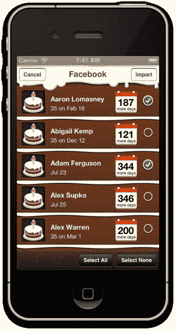

**图 11-8.** 显示返回生日的 Facebook 导入视图控制器

### 将 Facebook 生日导入 Core Data 存储

但还有更多……尝试导入几个 Facebook 好友……哇，你猜怎么着——它竟然能正常工作！我们在第 10 章中编写的 `importBirthdays:` 代码就是用来导入 `BRDBirthdayImport` 实例的。我们已经将 Facebook 生日字典转换为 `BRDBirthdayImport` 实例，并且所有生日的导入视图渲染都已由 `BRImportViewController` 父视图控制器类处理。你看到我们仅仅通过使用父类和一个通用的生日导入类节省了多少时间和精力吗？

唯一缺失的功能是，我们有 Facebook 好友图片的远程 URL，但目前我们还没有编写表格视图来下载和渲染远程图片。那么我们现在就来完成这项工作！


#### 加载与显示远程图片

遗憾的是，苹果并未在 iOS SDK 中将远程图片加载功能纳入`UIImageView`或任何其他类。要实现高效下载、缓存和渲染远程图片文件，需要编写相当多的复杂代码。不过，我们将编写一些可复用的图片下载与渲染代码，一旦攻克这个难题，你会发现这些代码也能用于其他 iPhone 开发项目。

我们将通过创建一个 Objective-C 分类，并在`UIImageView`上新增`setImageWithRemoteFileURL:placeholderImage:`方法，来扩展苹果`UIImageView`的功能，使其支持远程图片显示。

在项目导航器中，选择`user-interface`/`categories`分组，然后使用快捷键`N`或者依次点击文件``新建``文件，从 Cocoa Touch 文件模板中选择 Objective-C 分类选项。创建一个名为`RemoteFile`的`UIImageView`分类，如图 11-9 所示。

``

**图 11-9.** 在`UIImageView`上创建新的`RemoteFile`分类

在 Xcode 中打开`UIImageView+RemoteFile.h`，我们将为`UIImageView`添加一个新方法：

```
#import <UIKit/UIKit.h>

@interface UIImageView (RemoteFile)
- (void)setImageWithRemoteFileURL:(NSString *)urlString placeHolderImage:(UIImage *)placeholderImage;

@end
```

我们正在为图像视图创建一个新方法`setImageWithRemoteFileURL:placeHolderImage:`，它接受一个 URL 字符串和一个占位图像实例。当从远程图片 URL 下载图像数据时，图像视图会显示占位图像。下载完成后，图像视图会用下载的图像替换占位图像。

同时，我们希望图片加载过程是优化过的。如果用户有数百个 Facebook 好友，并且他滚动浏览一个包含数百行的表格视图，那么我们必须小心，不要同时尝试下载数百张图片：否则，随着下载队列的增长，新图片出现所需的时间会越来越长。

切换到`UIImageView+RemoteFile.m`。我们将编写大约 250 行代码来实现新的`RemoteFile`图像视图分类。原因在于，除了实现我们的公共方法`setImageWithRemoteFileURL:placeHolderImage`之外，我们还会在分类实现文件中包含一些私有类。

首先，我们将创建一个类，用于在可变字典中缓存已下载的图像。这个缓存类将作为单例创建，并且所有图像视图实例均可访问。

在新的`ImageCache`类的接口和实现代码上方，添加以下内容，位于空的`UIImageView (RemoteFile)`实现之上：

```
//一个单例缓存类，用于存储已下载图片的 URL 键和 UIImage 值，这些图片之前已被下载
@interface ImageCache : NSObject

@property (nonatomic,strong) NSMutableDictionary *cache;

-(UIImage *) cachedImageForURL:(NSString *)url;
-(void) storeCachedImage:(UIImage *)image forURL:(NSString *)url;

@end

@implementation ImageCache

@synthesize cache = _cache;

-(id) init
{
    self = [super init];
    if (self) {
        //如果应用收到内存警告，缓存字典将被清空
        [[NSNotificationCenter defaultCenter] addObserver:self
                                                 selector:@selector(clearCache)
                                                     name:UIApplicationDidReceiveMemoryWarningNotification
                                                   object:nil];

    }
    return self;
}

-(void) dealloc
{
    [[NSNotificationCenter defaultCenter] removeObserver:self
name:UIApplicationDidReceiveMemoryWarningNotification object:nil];
}

-(NSMutableDictionary *) cache
{
    if (_cache == nil) {
        _cache = [NSMutableDictionary dictionary];
    }
    return _cache;
}

- (void)clearCache
{
    [self.cache removeAllObjects];
}

-(void) storeCachedImage:(UIImage *)image forURL:(NSString *)url
{
    self.cache[url] = image;
}

-(UIImage *) cachedImageForURL:(NSString *)url
{
    return self.cache[url];
}
```

我们的图像视图分类将能够通过调用`cachedImageForURL:`并传入远程 URL 来检查之前缓存的图像。同样，当远程图像下载完成时，我们将使用`ImageCache`的`storeCachedImage:forURL:`方法缓存它们。

接下来要添加的封装类是`DownloadHelper`类及其委托协议。同样，将此代码添加到`UIImageView (RemoteFile)`实现之上——紧接在`ImageCache`类声明之后：

```
//一个用于处理数据下载事件并逐步存储图像文件下载数据的辅助类

@protocol DownloadHelperDelegate <NSObject>

-(void)didCompleteDownloadForURL:(NSString *)url withData:(NSMutableData *)data;

@end

@interface DownloadHelper : NSObject

@property (nonatomic,strong) NSString *url;
@property (nonatomic,strong) NSMutableData *data;
@property (nonatomic,strong) NSURLConnection *connection;
@property (nonatomic,assign) id<DownloadHelperDelegate> delegate;

@end

@implementation DownloadHelper

@synthesize url = _url;
@synthesize data = _data;
@synthesize connection = _connection;
@synthesize delegate = _delegate;

- (void) connection: (NSURLConnection*) connection didReceiveData: (NSData*) data
{
    //将新接收的数据字节追加到现有的可变数据容器中
    [self.data appendData:data];
}

- (void)connectionDidFinishLoading:(NSURLConnection *)connection
{
    //数据下载完成 - 处理完成！
    [self.delegate didCompleteDownloadForURL:self.url withData:self.data];
}

-(void) cancelConnection
{
    if (self.connection) {
        [self.connection cancel];
        [self setConnection:nil];
    }
}

-(void) dealloc
{
    [self cancelConnection];
}

@end
```

每当图像视图需要开始下载新的远程图像文件时，我们将创建这个新的`DownloadHelper`类的实例。每个`DownloadHelper`实例将由一个`UIImageView`实例拥有。iOS SDK 包含一个名为`NSURLConnection`的类，我们将用它通过 HTTP 请求下载远程图像数据。通过将我们的`DownloadHelper`实例设置为`NSURLConnection`实例的委托，我们将能够通过`connection:didReceiveData:`和`connectionDidFinishLoading:`事件处理程序捕获数据下载更新和完成事件。

`DownloadHelper`将通过委托回调方法`didCompleteDownloadForURL:withData:`通知其所属的图像视图。

现在我们将向`UIImageView`添加另一个分类。这个新分类将对其他类隐藏，因为它仅用于我们远程图像下载和缓存逻辑的内部使用。正如注释所述，创建这个`UIImageView(RemoteFileHidden)`分类的主要目的是为苹果的`UIImageView`类添加两个额外属性：`url`和`downloadHelper`。在 Objective-C 中，实际上无法通过分类为类添加合成的属性。相反，我们将通过使用动态属性来解决这个问题，这些属性将在运行时创建并添加到`UIImageView`类中。在运行时添加存储属性是相当高级的技术，但为了创建有用的可复用代码，这是满足我们需求的最佳方式。首先，滚动到`UIImageView+RemoteFile.m`的顶部，并导入运行时库：

```
#import <objc/runtime.h>
```

继续在`UIImageView+RemoteFile.m`中工作，在`UIImageView (RemoteFile)`的实现之前，添加隐藏的`UIImageView(RemoteFileHidden)`分类：


```objectivec
//UIImageView 上一个额外的、隐藏的依赖分类。主要用于为 UIImageView 添加两个动态属性：url 和 downloadHelper

@interface UIImageView(RemoteFileHidden) <DownloadHelperDelegate>

@property (nonatomic,strong,setter = setUrl:) NSString *url;
@property (nonatomic,strong,setter = setDownloadHelper:) DownloadHelper *downloadHelper;

@end

@implementation UIImageView(RemoteFileHidden)

@dynamic url;
@dynamic downloadHelper;

static char kImageUrlObjectKey;
static char kImageDownloadHelperObjectKey;

+ (ImageCache *)imageCache {
    static ImageCache *_imageCache;

    //返回 UIImageCache 的单例实例
    if (_imageCache == nil) {
        _imageCache = [[ImageCache alloc] init];
    }
    return _imageCache;
}

- (NSString *)url {
    return (NSString *)objc_getAssociatedObject(self, &kImageUrlObjectKey);
}

- (void)setUrl:(NSString *)url {
    objc_setAssociatedObject(self, &kImageUrlObjectKey, url,
OBJC_ASSOCIATION_RETAIN_NONATOMIC);
}

- (DownloadHelper *)downloadHelper {

    DownloadHelper *helper = (DownloadHelper *)objc_getAssociatedObject(self, &kImageDownloadHelperObjectKey);

    if (helper == nil) {//helper 类的懒加载
        helper = [[DownloadHelper alloc] init];
        //当 helper 完成远程图片数据下载后，会调用其代理（即该 image view）
        helper.delegate = self;
        self.downloadHelper = helper;
    }

    return helper;
}

- (void)setDownloadHelper:(DownloadHelper *)downloadHelper {
    objc_setAssociatedObject(self, &kImageDownloadHelperObjectKey, downloadHelper, OBJC_ASSOCIATION_RETAIN_NONATOMIC);
}

-(void) dealloc
{
    if (self.url != nil) [self.downloadHelper cancelConnection];
}

#pragma mark DownloadHelperDelegate

-(void)didCompleteDownloadForURL:(NSString *)url withData:(NSMutableData *)data
{
    //处理下载的图片数据，将其转换为图片实例，并保存到 ImageCache 单例中。

    UIImage *image = [UIImage imageWithData:data];

    if (image == nil) {//可能有问题——数据可能已损坏或 url 无效
        return;
    }

    //缓存图片
    ImageCache *imageCache = [UIImageView imageCache];
    [imageCache storeCachedImage:image forURL:url];

    //更新此 UIImageView 的占位图片显示
    self.image = image;

}

@end
```

除了为 `UIImageView` 添加动态的 `url` 和 `downloadHelper` 属性外，这段代码还为 `UIImageView` 的实例新增了一个类访问器方法 `imageCache`。调用 `imageCache` 会返回一个指向我们 `ImageCache` 类单例实例的引用。当 `DownloadHelper` 实例从 `NSURLConnection` 收到 `connectionDidFinishLoading:` 回调时，它会通过 `didCompleteDownloadForURL: withData:` 方法调用其代理（即 image view），并传入从服务器连接获取的完整数据。`UIImageView` 的 `didCompleteDownloadForURL: withData:` 方法随后会根据这些数据创建一张图片，并使用远程 URL 作为访问键，将其存储到单例图片缓存中。占位图片也会被替换为新的缓存数据图片。

最后，让我们实现主要的分类方法 `setImageWithRemoteFileURL:placeHolderImage:`。

```objectivec
@implementation UIImageView (RemoteFile)

- (void)setImageWithRemoteFileURL:(NSString *)urlString placeHolderImage:(UIImage
*)placeholderImage
{

    if (self.url != nil && [self.url isEqualToString:urlString]) {
        //如果 url 与现有 url 相同，则忽略
        return;
    }

    [self.downloadHelper cancelConnection];

    self.url = urlString;

    //获取图片缓存单例的引用
    ImageCache *imageCache = [UIImageView imageCache];

    UIImage *image = [imageCache cachedImageForURL:urlString];
    //检查是否已有该图片的缓存版本
    if (image) {
        self.image = image;
        return;
    }

    //没有缓存版本，因此开始下载远程文件
    self.image = placeholderImage;

    NSURL *url = [NSURL URLWithString:urlString];
    NSURLRequest *request = [NSURLRequest requestWithURL:url];

    self.downloadHelper.url = urlString;
    //将 download helper 设置为数据下载更新的代理
    self.downloadHelper.connection =(NSURLConnection *)[[NSURLConnection alloc]
initWithRequest:request delegate:self.downloadHelper startImmediately:YES];
    if (self.downloadHelper.connection) {
        //创建一个空的可变数据容器来添加数据字节
        self.downloadHelper.data = [NSMutableData data];
    }
}

@end
```

假设我们的 Facebook 好友表格视图显示了 500 行好友及其远程照片。你还记得表格视图是如何高效渲染这么多行的吗？它只创建足够填满可见区域所需的表格视图单元格。当用户向下滚动表格时，它会重复使用那五六个表格单元格。这意味着 `iconView` 图片视图也被重复使用。因此，当调用 `setImageWithRemoteFileURL:placeHolderImage:` 方法时，我们做的第一件事就是取消任何现有的文件下载：

```objectivec
[self.downloadHelper cancelConnection];
```

正是这行代码阻止了我们的应用程序尝试同时下载数百张 Facebook 好友照片。在我们的方法启动新的文件下载之前，它会检查是否已有该 URL 对应的缓存图片：

```objectivec
UIImage *image = [imageCache cachedImageForURL:urlString];
```

如果我们已有缓存版本，那么就会使用现有的缓存图片，而不是尝试重新下载远程图片。如果这是我们的程序首次尝试下载该远程图片，那么我们会创建一个新的 URL 连接，并将 download helper 实例设置为数据连接更新的代理，例如数据下载完成事件：

```objectivec
self.downloadHelper.connection =(NSURLConnection *)[[NSURLConnection alloc]
initWithRequest:request delegate:self.downloadHelper startImmediately:YES];
```

我们还会创建一个可变数据容器，用于存储远程文件的增量数据下载：

```objectivec
self.downloadHelper.data = [NSMutableData data];
```

我们已经完成了 `UIImageView` 分类，现在来测试一下。打开 `BRBirthdayTableViewCell.m`，导入 `UIImageView+RemoteFile.h`，然后在 `setBirthdayImport:` 方法末尾添加以下代码：

```objectivec
if (_birthdayImport.imageData == nil)
    {
        if ([_birthdayImport.picURL length] > 0) {
            [self.iconView setImageWithRemoteFileURL:birthdayImport.picURL
placeHolderImage:[UIImage imageNamed:@"icon-birthday-cake.png"]];
        }
        else self.iconView.image = [UIImage imageNamed:@"icon-birthday-cake.png"];
}
else {
        self.iconView.image = [UIImage imageWithData:birthdayImport.imageData];
}
```

在此处，在 `setBirthday:` 方法末尾添加以下类似代码：

```objectivec
if (_birthday.imageData == nil)
    {
        if ([_birthday.picURL length] > 0) {
            [self.iconView setImageWithRemoteFileURL:_birthday.picURL
placeHolderImage:[UIImage imageNamed:@"icon-birthday-cake.png"]];
        }
        else self.iconView.image = [UIImage imageNamed:@"icon-birthday-cake.png"];
    }
else {
        self.iconView.image = [UIImage imageWithData:_birthday.imageData];
}
```

这段代码会检查生日实体和生日导入对象是否存在远程图片 URL（`picURL`）。如果存在图片 URL，那么表格单元格就会调用我们分类的 `setImageWithRemoteFileURL:placeHolderImage:` 远程图片显示方法。


在测试代码之前，我们还有最后一步操作。打开 `BRImportViewController.m`，向下滚动到 `tableView:cellForRowAtIndexPath:` 方法。移除用于设置 `iconView` 图像属性的旧代码：

```
if (birthdayImport.imageData == nil)
{
        brTableCell.iconView.image = [UIImage imageNamed:@"icon-birthday-cake.png"];
}
else {
        brTableCell.iconView.image = [UIImage imageWithData:birthdayImport.imageData];
}
```

现在，在 `BRHomeViewController.m` 的 `tableView:cellForRowAtIndexPath:` 方法中执行相同的操作：

```
if (birthday.imageData == nil)
    {
        brTableCell.iconView.image = [UIImage imageNamed:@"icon-birthday-cake.png"];
    }
    else {
        brTableCell.iconView.image = [UIImage imageWithData:birthday.imageData];
    }
```

构建并运行。远程的 Facebook 个人资料照片现在应该会下载并出现在主页和 Facebook 导入页面中（参见图 11-10）。

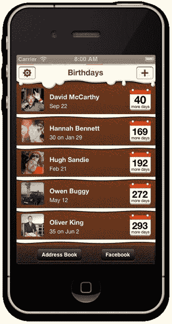

**图 11-10.** 得益于新的 `UIImageView` 类别，远程图像得以下载并渲染

如果你在编写 `UIImageView+RemoteFile.m` 的 250 行代码时遇到任何困难，可以从本章的源代码中获取类别文件并覆盖你的版本。

我们也可以在生日详情和生日编辑视图中使用新的类别。首先从 `BRBirthdayEditViewController.m` 开始。导入 `UIImageView+RemoteFile.h`，然后更新 `viewWillAppear:` 中的 `photoView.image` 设置代码。

```
if (self.birthday.imageData == nil)
    {
        self.photoView.image = [UIImage imageNamed:@"icon-birthday-cake.png"];
    }
    else {
        self.photoView.image = [UIImage imageWithData:self.birthday.imageData];
    }
```

```
if (self.birthday.imageData == nil)
    {
        if ([self.birthday.picURL length] > 0) {
            [self.photoView setImageWithRemoteFileURL:self.birthday.picURL
placeHolderImage:[UIImage imageNamed:@"icon-birthday-cake.png"]];
        }
        else self.photoView.image = [UIImage imageNamed:@"icon-birthday-cake.png"];
    }
    else {
        self.photoView.image = [UIImage imageWithData:_birthday.imageData];
    }
```

现在，需要对 `BRBirthdayDetailViewController.m` 的 `viewWillAppear:` 中的 `photoView.image` 设置代码进行类似的更改。确保导入 `UIImageView+RemoteFile.h`，否则编译器将无法识别 `setImageWithRemoteFileURL:placeHolderImage:` 是 `UIImageView` 的方法。

```
UIImage *image = [UIImage imageWithData:self.birthday.imageData];
if (image == nil) {
        //如果没有生日图片，则默认使用生日蛋糕图片
        self.photoView.image = [UIImage imageNamed:@"icon-birthday-cake.png"];
    }
    else {
        self.photoView.image = image;
    }
```

```
    if (self.birthday.imageData == nil)
    {
        if ([self.birthday.picURL length] > 0) {
            [self.photoView setImageWithRemoteFileURL:_birthday.picURL
placeHolderImage:[UIImage imageNamed:@"icon-birthday-cake.png"]];
        }
        else self.photoView.image = [UIImage imageNamed:@"icon-birthday-cake.png"];
    }
    else {
        self.photoView.image = [UIImage imageWithData:_birthday.imageData];
    }
```

朋友的 Facebook 个人资料照片现在应该会显示在编辑视图和生日详情视图中。

### 在朋友的 Facebook 墙上发帖

在生日详情视图控制器中，我们目前为从 Facebook 导入的生日显示了一个*在好友墙上发帖*按钮。当用户点击此按钮时，我们将展示一个模态视图控制器，以便我们应用的用户可以直接从 *Birthday Reminder* 向朋友的墙上发帖。

正如我在本章开头提到的，我将向你展示如何创建自定义的视图控制器和视图，用于直接向朋友的 Facebook 墙上发送消息。Apple 确实提供了一个更通用的视图控制器类 `SLComposeViewController`，你可以用它来在自己的墙上发帖，我们将在第 13 章中了解这一点（参见图 11-11）。


**图 11-11.** Apple 的 `SLComposeViewController` 类可用于更新你的 Facebook 状态、发送推文或发布到新浪微博

然而，我们希望能够让一个朋友直接写到另一个朋友的 Facebook 墙上。虽然未来 Apple 可能会将这个功能添加到 `SLComposeViewController` 类中，但截至 iOS 6.0 发布时，你只能使用此类写到自己的时间线。图 11-11 中模态视图右下角的*好友*按钮允许你选择哪些好友群组可以看到状态更新，但这不足以满足我们的需求。


### 创建 Facebook 动态发布视图控制器

打开你的故事板，首先在故事板中添加一个新的视图控制器，然后将其嵌入到一个新的导航控制器中：编辑器  嵌入于  导航控制器。将新的视图控制器标题设为 Facebook，并在导航栏中添加两个栏按钮项，一个命名为“取消”，一个命名为“发布”，如图 11-12 所示。

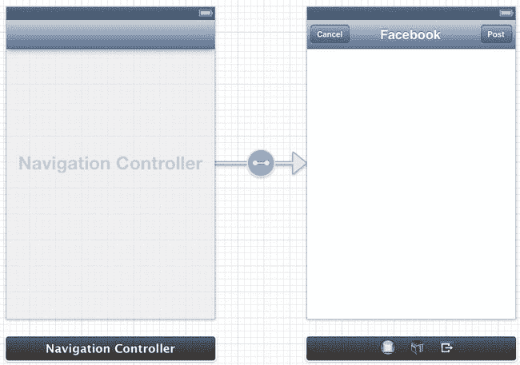

**图 11-12.** 添加新的视图控制器和栏按钮项

选择 `user-interface/view-controllers` Xcode 组，并在其中创建一个新的 Objective-C 类文件。将你的类命名为 `BRPostToFacebookWallViewController`，并在“子类化”文本框中输入 `BRCoreViewController`。

回到你的故事板，选择你刚刚创建的新导航控制器，使用身份检查器，在故事板 ID 中输入 `PostToFacebookWall`，如图 11-13 所示。

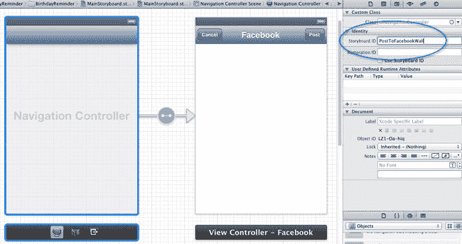

**图 11-13.** 在故事板中标识新的导航控制器

在故事板中选择新的“发布到 Facebook 动态”视图控制器，并使用身份检查器将视图控制器的自定义类更改为你的新 `BRPostToFacebookWallViewController` 类。

打开 `BRBirthdayDetailViewController.m`，并按如下方式修改现有的 `facebookButtonTapped:` 操作方法：

```
- (IBAction)facebookButtonTapped:(id)sender
{
    UINavigationController *navigationController = [self.storyboard instantiateViewControllerWithIdentifier:@"PostToFacebookWall"];
    [self.navigationController presentViewController:navigationController animated:YES completion:nil];
}
```

回到故事板，切换到助理编辑器模式，并确保已选中你的“发布到 Facebook 动态”视图控制器。按住 Control 键从“取消”按钮拖拽到视图控制器，并从上下文菜单中选择继承的操作方法 `cancelAndDismiss:`。

按住 Control 键从“发布”按钮拖拽到 `BRPostToFacebookWallViewController.h` 公开接口，以添加一个名为 `postToFacebook` 的新操作方法。然后再次按住 Control 键从“发布”按钮拖拽，为该按钮创建一个输出口引用，并将其命名为 `postButton`。最终的头部文件应与我的匹配，如下所示：

```
#import "BRCoreViewController.h"

@interface BRPostToFacebookWallViewController : BRCoreViewController
- (IBAction)postToFacebook:(id)sender;
@property (weak, nonatomic) IBOutlet UIBarButtonItem *postButton;

@end
```

构建并运行。要测试新功能，你首先需要确保已从 Facebook 导入至少一个生日。从“主页”视图控制器中点击一个生日，然后在“详情”视图控制器中，你应该能找到“发布到朋友动态”按钮。点击该按钮应展示你的新“发布到 Facebook 动态”视图控制器，如图 11-14 所示。

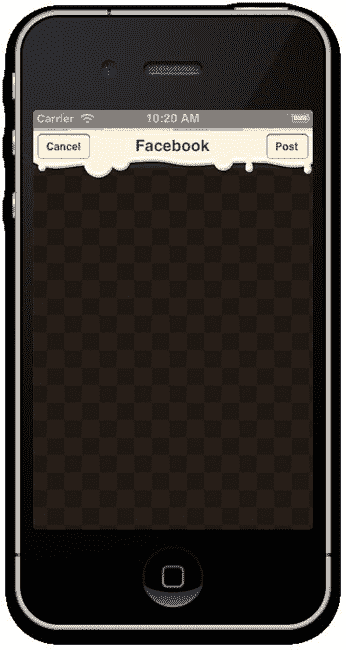

**图 11-14.** 以模态方式呈现的“发布到 Facebook 动态”视图控制器

回到你的故事板，让我们完成“发布到 Facebook 动态”视图控制器视图的剩余工作。添加一个文本视图和两个图像视图，并按如下方式进行设置：

> *   文本视图：x=0，y=10，宽度=235，高度=190
> *   两个图像视图：x=238，y=10，宽度=71，高度=71

将底部图像视图的图像属性设置为 `thumbnail-background.png`。最终视图应如图 11-15 所示。

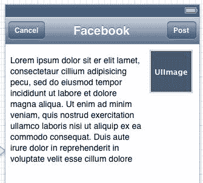

**图 11-15.** 包含文本和图像视图的“发布到 Facebook 动态”视图

为前面的图像视图创建一个名为 `photoView` 的输出口，为文本视图创建一个名为 `textView` 的输出口。声明你的 `BRPostToFacebookWallViewController` 实现了 `UITextViewDelegate` 协议，然后按住 Control 键从文本视图拖拽到视图控制器，将视图控制器指定为文本视图的委托。

`BRPostToFacebookWallViewController.h` 现在应如下所示：

```
#import "BRCoreViewController.h"

@interface BRPostToFacebookWallViewController : BRCoreViewController <UITextViewDelegate>

- (IBAction)postToFacebook:(id)sender;
@property (weak, nonatomic) IBOutlet UIBarButtonItem *postButton;
@property (weak, nonatomic) IBOutlet UIImageView *photoView;
@property (weak, nonatomic) IBOutlet UITextView *textView;

@end
```

在我们把注意力转向 `BRPostToFacebookWallViewController` 的实现之前，让我们在 `BRPostToFacebookWallViewController.h` 中再声明两个公共属性：

```
@property (strong, nonatomic) NSString *facebookID;
@property (strong, nonatomic) NSString *initialPostText;
```

当我们初始化“发布到 Facebook 动态”视图控制器时，我们将设置文本视图中要显示的初始文本，并传递一个 Facebook ID，以便我们的代码知道要写入哪个 Facebook 动态，并且还可以使用 Facebook ID 和标准的 Facebook 个人资料照片 URL 格式来显示该 Facebook 好友的照片。

现在让我们从“生日详情”视图控制器中设置这些值。打开 `BRBirthdayDetailViewController.m`，在完成 `facebookButtonTapped` 方法之前导入 `BRPostToFacebookWallViewController.h`：

```
- (IBAction)facebookButtonTapped:(id)sender
{
    UINavigationController *navigationController = [self.storyboard instantiateViewControllerWithIdentifier:@"PostToFacebookWall"];
    BRPostToFacebookWallViewController *facebookWallViewController = (BRPostToFacebookWallViewController *) navigationController.topViewController;
    facebookWallViewController.facebookID = self.birthday.facebookID;
    facebookWallViewController.initialPostText = @"Happy Birthday!";
    [self.navigationController presentViewController:navigationController animated:YES completion:nil];
}
```

你可以构建并运行应用程序来检查一切编译是否正常，然而，你的“发布到 Facebook 动态”视图控制器由于未设置样式的文本视图会显得有些简陋。现在让我们来实现 `BRPostToFacebookWallViewController.m`：

```
#import "BRPostToFacebookWallViewController.h"
#import "BRStyleSheet.h"
#import "UIImageView+RemoteFile.h"

@interface BRPostToFacebookWallViewController ()

@end

@implementation BRPostToFacebookWallViewController

- (void)viewDidLoad
{
    [super viewDidLoad];

    [BRStyleSheet styleRoundCorneredView:self.photoView];
    [BRStyleSheet styleTextView:self.textView];
}

- (void)viewWillAppear:(BOOL)animated
{
    [super viewWillAppear:animated];

    NSString *facebookPicURL = [NSString
stringWithFormat:@"http://graph.facebook.com/%@/picture?type=large",self.facebookID];

    [self.photoView setImageWithRemoteFileURL:facebookPicURL placeHolderImage:[UIImage imageNamed:@"icon-birthday-cake.png"]];
    self.textView.text = self.initialPostText;

    [self.textView becomeFirstResponder];

    [self updatePostButton];
}

- (IBAction)postToFacebook:(id)sender {
}

- (void)updatePostButton
{
    self.postButton.enabled = self.textView.text.length > 0;
}

#pragma mark UITextViewDelegate

- (void)textViewDidChange:(UITextView *)textView
{
    [self updatePostButton];
}

@end
```

这段代码中不应该有什么你不熟悉的地方，因为它实际上是你贯穿本书学到的几种编码技术的融合。当视图加载我们的 `BRStyleSheet` 类时，会将样式代码应用到文本和图像视图：

```
[BRStyleSheet styleRoundCorneredView:self.photoView];
[BRStyleSheet styleTextView:self.textView];
```

在 `viewWillAppear:` 方法中，我们使用 Facebook ID 生成指向该 Facebook 用户个人资料照片的链接，然后利用我们的远程图像视图文件加载分类方法，在文本视图旁边显示个人资料图片。


`NSString *facebookPicURL = [NSString`  
`stringWithFormat:@"http://graph.facebook.com/%@/picture?type=large",self.facebookID];`  

```
    [self.photoView setImageWithRemoteFileURL:facebookPicURL placeHolderImage:[UIImage
imageNamed:@"icon-birthday-cake.png"]];
```

与编辑视图控制器类似，我们采用相似的方法来启用/禁用“发布”按钮：通过一个私有的 `updatePostButton` 方法，该方法在视图出现以及用户编辑文本时被调用：

```
-(void) updatePostButton
{
    self.postButton.enabled = self.textView.text.length > 0;
}
```

如果你构建并运行，结果应类似于图 11-16。

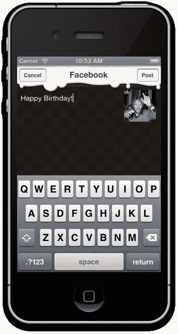

**图 11-16.** 优化后的“发布到 Facebook 墙”视图，包含可启用/禁用的“发布”按钮

太好了，我们自定义的“发布到 Facebook 墙”视图和视图控制器的 UI 已经完成。现在，我们来实际向 Facebook 发送一条帖子！

我们将所有 Facebook API 调用集中在 `BRDModel` 单例中。因此，打开 `BRDModel.h` 并声明一个新的公有方法 `postToFacebookWall:withFacebookID:`：

```
- (void)postToFacebookWall:(NSString *)message withFacebookID:(NSString *)facebookID;
```

在实现该方法之前，跳转到 `BRPostToFacebookWallViewController.m` 文件，导入 `BRDModel.h`，并完成 `postToFacebook` 动作方法：

```
- (IBAction)postToFacebook:(id)sender {
    [[BRDModel sharedInstance] postToFacebookWall:self.textView.text withFacebookID:self.facebookID];
    [self dismissViewControllerAnimated:YES completion:nil];
}
```

现在，我们将发布逻辑添加到模型中。打开 `BRDModel.m`。我们将对“发布到 Facebook”流程应用与获取 Facebook 好友生日非常相似的逻辑。也就是说，我们不会假设用户已经通过了 Facebook 认证。基于这一点，我们可能需要等待认证流程完成才能发布。因此，如果用户当前会话中认证流程尚未完成，我们将把要发布的 Facebook ID 和消息存储到几个新的私有属性中。在 `BRDModel.m` 的私有接口中添加以下私有属性：

```
@interface BRDModel()

@property (strong) ACAccount *facebookAccount;
@property FacebookAction currentFacebookAction;
@property (nonatomic,strong) NSString *postToFacebookMessage;
@property (nonatomic,strong) NSString *postToFacebookID;

@end
```

现在来实现新方法 `postToFacebookWall` 的第一部分：

```
- (void)postToFacebookWall:(NSString *)message withFacebookID:(NSString *)facebookID
{
    NSLog(@"postToFacebookWall");

    if (self.facebookAccount == nil) {
        //我们尚未获得授权，因此存储 Facebook 消息和 ID，并启动认证流程
        self.postToFacebookMessage = message;
        self.postToFacebookID = facebookID;
        self.currentFacebookAction = FacebookActionPostToWall;
        [self authenticateWithFacebook];
        return;
    }

    NSLog(@"我们已获得授权，开始发布到 Facebook！");

}    
```

这段代码看起来与最初的 `fetchFacebookBirthdays` 代码非常相似。如果我们需要授权 `facebookAccount` 属性，则存储消息和 Facebook ID，并将当前 Facebook 动作设置为枚举值 `FacebookActionPostToWall`。

在完成 `postToFacebookWall` 方法之前，首先找到 `authenticateWithFacebook` 方法，并补全用户认证完成后 switch 语句中的 `TODO` 部分：

```
switch (self.currentFacebookAction) {
                case FacebookActionGetFriendsBirthdays:
                    [self fetchFacebookBirthdays];
                    break;
                case FacebookActionPostToWall:
                    [self postToFacebookWall:self.postToFacebookMessage
withFacebookID:self.postToFacebookID];
                    break;
            }
```

很好。让我们回到 `postToFacebookWall:withFacebookID` 方法中完成发布逻辑：

```
- (void)postToFacebookWall:(NSString *)message withFacebookID:(NSString *)facebookID
{
    NSLog(@"postToFacebookWall");

    if (self.facebookAccount == nil) {
        //我们尚未获得授权，因此存储 Facebook 消息和 ID，并启动认证流程
        self.postToFacebookMessage = message;
        self.postToFacebookID = facebookID;
        self.currentFacebookAction = FacebookActionPostToWall;
        [self authenticateWithFacebook];
        return;
    }

    NSLog(@"我们已获得授权，开始发布到 Facebook！");

    NSDictionary *params = @{@"message":message};

    //使用用户的 Facebook ID 调用发布到好友动态的 Graph API 路径
    NSString *postGraphPath = [NSString
stringWithFormat:@"https://graph.facebook.com/%@/feed",facebookID];

    NSURL *requestURL = [NSURL URLWithString:postGraphPath];

    SLRequest *request = [SLRequest requestForServiceType:SLServiceTypeFacebook requestMethod:SLRequestMethodPOST URL:requestURL parameters:params];
    request.account = self.facebookAccount;

    [request performRequestWithHandler:^(NSData *responseData, NSHTTPURLResponse
*urlResponse, NSError *error) {
        if (error != nil) {
            NSLog(@"发布到 Facebook 时出错：%@",error);
        }
        else
        {
            //Facebook 返回一个包含新帖子 ID 的字典——这对其他项目可能有用
            NSDictionary *dict = (NSDictionary *) [NSJSONSerialization JSONObjectWithData:responseData options:0 error:nil];
            NSLog(@"成功发布到 Facebook！帖子 ID：%@",dict);
        }
    }];

}
```

构建并运行。你应该能够直接从 *生日提醒* 应用发布到好友的 Facebook 动态！

尝试修改代码中传递给 `SLRequest` 实例的 `params` 字典。你可以添加其他参数，例如链接或图片的 URL，以包含在动态帖子中。一旦你达到这一步，你就拥有了一个功能强大的社交组件基础。你可以在 [`http://developers.facebook.com/docs/reference/api/post/`](http://developers.facebook.com/docs/reference/api/post/) 上阅读关于 Facebook 在 `post` 对象中接受的不同参数值的所有内容。

我强烈建议你在启用好友间 Facebook 动态发布功能时要谨慎行事，并确保你使用此功能的方式符合用户期望。由于我们正在帮助用户发送生日祝福消息，我特意避免了在 `post` 对象中添加任何应用广告，因为我们不希望用户指责我们向其好友发送垃圾信息！


### 总结

今天，我们学习了如何将 Facebook 的 Graph API 与 Apple 的 Accounts 和新 Social 框架相结合，形成强大组合，从而将各种 Facebook 功能原生集成到你的应用中。我们仅使用了 Facebook API 中的两个方法（获取好友列表和向好友墙发文），但还有很多其他可访问的方法，可用于增强各类 iPhone 和 iPad 应用的内容与社交功能。

例如，我的一个应用 *Portfolio Pro for iPad* 是为摄影师和设计师设计的，让他们可以离线展示作品集，并用于客户演示。除了核心功能外，其离线展示特性还允许摄影师登录 Facebook，并直接将任何照片上传到他们已有的任意 Facebook 相册。这一功能极大地简化了许多摄影师的工作流程，因为他们可以从 Flickr、Dropbox 或 iPad 导入照片，并轻松地将其添加到 Facebook 相册并上传。这样做有双重好处：应用让摄影师的工作更轻松，而 Facebook 则会在我的用户发布的每张照片旁添加“来自 Portfolio Pro for iPad”的链接。这样一来，我的应用获得了微妙的推广链接，指向应用本身的 Facebook 页面，同时也让摄影师的 Facebook 好友更多地接触到该应用。

作为开发者，在为自己的应用添加 Facebook 功能时，面临的挑战是找到平衡点：既要提供帮助，又要善用社交分享和广告。主要的关注点应是创建与应用核心功能相关的特性，并帮助用户——而不是成为他们的障碍！


## 第 12 章

## 设置与本地通知

我们即将结束第 4 天的学习。从功能和感觉上，我们的应用几乎已经完成。但还缺少一个关键特性：生日提醒通知！在本章中，我们将开发应用内的设置功能，让用户可以定义生日提醒需要提前多少天，以及希望在哪一时间收到提醒。然后，我们将根据这些设置自动为用户安排生日提醒通知。

### 使用静态表格视图控制器

首先，我们将把主设置界面替换为一个表格视图控制器，其中包含两个表格单元格，以便用户更改默认的提醒时间和生日提醒通知的提前天数。

当前实现中，空的设置视图控制器只有一个孤零零的“设置提醒时间”按钮，这需要被替换掉。所以，首先，我们将完全移除当前的设置视图控制器——但别担心，有时候“慈不带兵，义不掌财”。

打开你的故事板，选择设置视图控制器场景（如图 12-1 高亮所示）。然后按退格键从故事板中删除该场景。此时，左侧应该留下一个导航控制器，右侧是提醒时间视图控制器，中间有一个大空档！现在，在项目导航器中多选 `BRSettingsViewController.h` 和 `BRSettingsViewController.m`（同样如图 12-1 高亮所示）。删除这些文件！删除时务必选择“移到废纸篓”选项，以便我们稍后能够重新创建同名的文件。

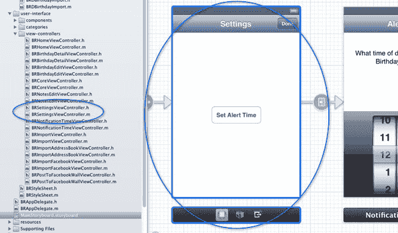

**图 12-1.** 删除高亮显示的故事板场景和设置视图控制器类文件

现在，替换旧的设置视图控制器。我们将使用静态表格单元格来构建新的设置视图控制器：这些单元格会保留在内存中，不会被其表格视图重用。为了使用静态表格单元格，Xcode 要求我们继承表格视图控制器（而非标准视图控制器）来创建新的设置视图控制器。表格视图控制器是一种以表格视图作为其主视图的视图控制器，并且默认情况下，该控制器被设置为表格视图的委托和数据源。

将一个表格视图控制器（`UITableViewController`）对象拖到故事板上。从设置导航控制器按住 Control 键拖拽到故事板中的新表格视图控制器，并从上下文菜单中选择“根视图控制器关系”选项（见图 12-2）。

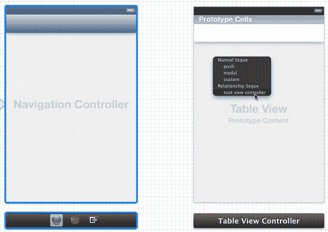

**图 12-2.** 通过故事板定义根视图控制器关系

导航控制器与新设置控制器场景之间应出现一条连接线。将新设置场景的导航栏标题设为“设置”（Settings），并在导航栏右侧添加一个栏按钮项。将其标题设为“完成”（Done）（见图 12-3）。

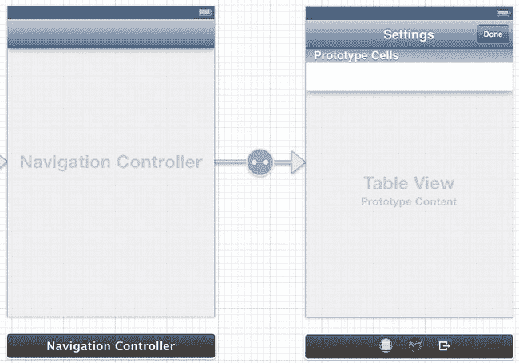

**图 12-3.** 绘制新设置场景的故事板

选择新设置场景中的表格视图。在属性检查器中，将表格视图样式从 Plain 改为 Grouped。将表格视图的内容设置从 Dynamic Prototypes 改为 Static Cells。向下滚动属性检查器到视图属性，将视图背景颜色改为 Clear Color。

Xcode 会自动为你生成三个静态表格单元格。选中并删除其中两个。对于剩下的一个静态表格单元格，将其样式改为 Right Detail（`UITableViewCellStyleValue1`），输入标题**提前天数**，并将详细文本设为“生日当天”（见图 12-4）。

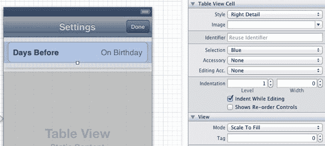

**图 12-4.** 创建一个采用 Right Detail（`UITableViewCellStyleValue1`）样式的静态表格单元格

现在，在编辑器的文档大纲窗格中选择表格视图节。在属性检查器中，将表格视图节的行数增加到 2。Xcode 会自动对第二个静态表格单元格应用与第一个相同的样式和文本。

将第二个表格单元格的标题修改为“提醒时间”，并将其详细文本改为“上午 9:00”（见图 12-5）。

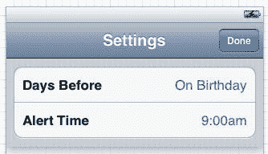


### `Figure 12-5.` 修改静态表格视图分区的行

将另一个新的表格视图控制器拖到故事板中，它将作为“提前天数”表格视图控制器。

使用静态表格单元格，可以直接从表格单元格到其他视图控制器场景创建转场连接。从主设置视图的第一个静态表格单元格按住 Control 键拖拽至新的“提前天数”表格视图控制器，并在转场选项中选择 `Push`。将新表格视图控制器的导航栏命名为**提前天数**。

重复创建转场的过程，为第二个静态表格单元格创建一个推送到“通知时间”视图控制器的转场（参见 `Figure 12-6`）。

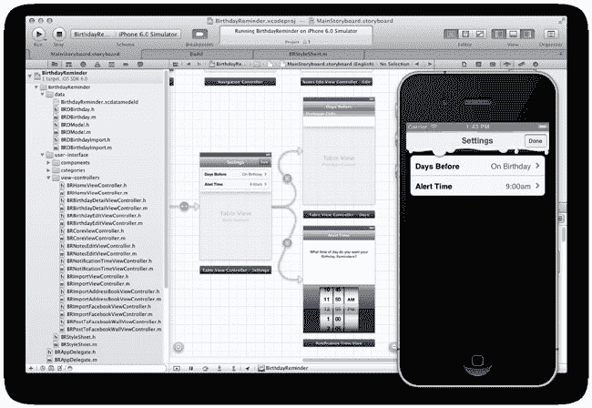

### `Figure 12-6.` 从静态表格视图单元格创建转场导航

至此，你应该能够构建并运行应用了：可以显示设置表格视图，并在“提前天数”和“通知时间”两个视图控制器之间导航。

目前，当前设置视图存在几个问题：

> * 无法关闭该视图。
> * 当用户在“通知时间”屏幕更改设置时，设置屏幕中的“提醒时间”不会更新。
> * 表格视图的背景是透明的，但仍然需要应用自定的屏幕背景。

我们需要创建 `UITableViewController` 的子类来修复这些问题。

在 Xcode 项目的设置 `user-interface/view-controllers` 组中创建一个名为 `BRSettingsViewController` 的新类。从 Cocoa Touch 模板中选择 `Objective-C` 类，在下一个屏幕的“Class”文本框中输入 `BRSettingsViewController`，“Subclass”文本框中输入 `UITableViewController`。确保**不选中**“Targeted for iPad”和“With XIB for User Interface”，然后创建新类。

由于 `BRSettingsViewController` 是 `UITableViewController` 的子类，Xcode 会自动向实现源文件添加大量表格控制委托方法。我们需要移除大部分此类代码，因为我们构建的是静态表格视图，大部分 UI 工作直接在故事板中完成。因此，打开 `BRSettingsViewController.m` 并将其精简为以下内容：

```
#import "BRSettingsViewController.h"

@interface BRSettingsViewController ()

@end

@implementation BRSettingsViewController

@end
```

只保留一个空的私有接口和类实现。

在故事板中选择主设置视图控制器。使用身份检查器将视图控制器的自定义类更改为刚创建的 `BRSettingsViewController` 类（参见 `Figure 12-7`）。

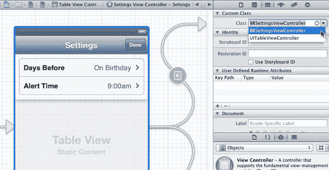

### `Figure 12-7.` 在故事板中将 `BRSettingsViewController` 分配给主设置视图控制器

使用助理编辑器布局，并通过按住 Control 键从单元格拖拽，为两个静态表格单元格建立插座连接：

```
@property (weak, nonatomic) IBOutlet UITableViewCell *tableCellDaysBefore;
@property (weak, nonatomic) IBOutlet UITableViewCell *tableCellNotificationTime;
```

我们还要为**完成**按钮创建界面生成器操作，以关闭模态视图。要创建新操作，请按住 Control 键从“完成”按钮拖拽至 `BRSettingsViewController.h` 头文件接口中。确保将连接类型切换为 `Action`，并将新操作命名为 `didClickDoneButton`：

```
- (IBAction)didClickDoneButton:(id)sender;
```

现在开始实现 `BRSettingsViewController.m`。`didClickDoneButton:` 的实现只是简单地调用关闭视图控制器的方法：

```
- (IBAction)didClickDoneButton:(id)sender {
    [self dismissViewControllerAnimated:YES completion:nil];
}
```

现在 `BRSettingsViewController` 可以被关闭了——构建并运行。

### 构建设置单例类

我们将构建一个新的抽象数据类，通过单例实例进行访问。该设置单例为用户提供几个访问器属性和方法，用于全局生日提醒通知设置：提前多少天接收生日通知，以及这些提醒的时和分。


#### 用户默认设置：iOS 的 Cookies

在 iOS 中存储偏好设置数据的最简单方法是使用苹果的 `NSUserDefaults` 类。它相当于 iOS 中的 HTML Cookies。我们可以使用 `NSUserDefaults` 存储字符串和数字等数据对象类型。保存字符串的语法如下所示：

```
NSUserDefaults *userDefaults = [NSUserDefaults standardUserDefaults];
[userDefaults setObject:@"Nick Kuh" forKey:@"name"];
[userDefaults synchronize];
```

调用 `synchronize` 会将你的更改写入磁盘，因此如果你要保存多个属性，可以在设置完所有键值后再调用 `synchronize`。

要访问并检查保存到 `NSUserDefaults` 中的属性，上述示例的代码如下：

```
NSUserDefaults *userDefaults = [NSUserDefaults standardUserDefaults];
NSString *name = [userDefaults objectForKey:@"name"];
if (name == nil) {
    NSLog(@"没有保存过名字");
}
else {
    NSLog(@"已保存的名字: %@",name);
}
```

接下来，让我们创建新的设置单例类，并将这个逻辑应用到我们的应用程序中。在 Xcode 项目的 *data* 组中，创建一个名为 `BRDSettings` 的 `NSObject` 子类。我们先从头文件开始：

```
#import <Foundation/Foundation.h>

typedef enum : int {
    BRDaysBeforeTypeOnBirthday = 0,
    BRDaysBeforeTypeOneDay,
    BRDaysBeforeTypeTwoDays,
    BRDaysBeforeTypeThreeDays,
    BRDaysBeforeTypeFiveDays,
    BRDaysBeforeTypeOneWeek,
    BRDaysBeforeTypeTwoWeeks,
    BRDaysBeforeTypeThreeWeeks
}BRDaysBeforeType;

#import <Foundation/Foundation.h>

@interface BRDSettings : NSObject

+ (BRDSettings*)sharedInstance;

@property (nonatomic) int notificationHour;
@property (nonatomic) int notificationMinute;
@property (nonatomic) BRDaysBeforeType daysBefore;

-(NSString *) titleForNotificationTime;
-(NSString *) titleForDaysBefore:(BRDaysBeforeType)daysBefore;

@end
```

就像 `BRDModel` 一样，我们将通过 `sharedInstance` 类方法提供对 `BRDSettings` 单例实例的访问。通知的小时和分钟以整数形式返回：在设置数据类的实现中，我们将检查用户是否之前设置了提醒的小时/分钟通知时间，如果没有，则返回一个默认时间——也许是上午 9:00？

我们将为用户提供一组“提前天数”选项，范围从生日当天提醒到每个生日前三周提醒。我们创建了一个自定义枚举类型，用于提供这个范围内的不同选项，而无需创建从 0 到 21 天的选项，那样在应用中会显得杂乱。`titleForDaysBefore:` 方法会为每个选项返回一个人类可读的字符串，例如“生日当天”或“提前 3 周”。

切换到 `BRDSettings.m` 源文件，并添加我们在头文件中声明的方法和属性的实现：

```
#import "BRDSettings.h"

@implementation BRDSettings

static BRDSettings *_sharedInstance = nil;
static NSDateFormatter *dateFormatter;

@synthesize notificationHour;
@synthesize notificationMinute;

//单例实例的访问方法
+ (BRDSettings*)sharedInstance {
    if( !_sharedInstance ) {
        _sharedInstance = [[BRDSettings alloc] init];
    }
    return _sharedInstance;
}

-(int) notificationHour
{
    //检查用户是否保存了通知小时数——如果没有，则默认为上午 9 点
    NSUserDefaults *userDefaults = [NSUserDefaults standardUserDefaults];
    NSNumber *hour = [userDefaults objectForKey:@"notificationHour"];
    if (hour == nil) {
        return 9;
    }
    return [hour intValue];
}

-(void) setNotificationHour:(int)notificationHourNew
{
    NSUserDefaults *userDefaults = [NSUserDefaults standardUserDefaults];
    [userDefaults setObject:[NSNumber numberWithInt:notificationHourNew] forKey:@"notificationHour"];
    [userDefaults synchronize];
}
```


```objective-c
-(int) notificationMinute
{
    //检查用户是否保存了通知分钟数——如果未保存，则默认为整点 0 分钟
    NSUserDefaults *userDefaults = [NSUserDefaults standardUserDefaults];
    NSNumber *hour = [userDefaults objectForKey:@"notificationMinute"];
    if (hour == nil) {
        return 0;
    }
    return [hour intValue];
}

-(void) setNotificationMinute:(int)notificationMinuteNew
{
    NSUserDefaults *userDefaults = [NSUserDefaults standardUserDefaults];
    [userDefaults setObject:[NSNumber numberWithInt:notificationMinuteNew] forKey:@"notificationMinute"];
    [userDefaults synchronize];
}

-(BRDaysBeforeType) daysBefore
{
    NSUserDefaults *userDefaults = [NSUserDefaults standardUserDefaults];
    NSNumber *daysBefore = [userDefaults objectForKey:@"daysBefore"];
    if (daysBefore == nil) {
        return BRDaysBeforeTypeOnBirthday;
    }
    return [daysBefore intValue];
}

-(void) setDaysBefore:(BRDaysBeforeType)daysBeforeNew
{
    NSUserDefaults *userDefaults = [NSUserDefaults standardUserDefaults];
    [userDefaults setObject:[NSNumber numberWithInt:daysBeforeNew] forKey:@"daysBefore"];
    [userDefaults synchronize];
}

-(NSString *) titleForDaysBefore:(BRDaysBeforeType)daysBefore
{
    switch (daysBefore) {
        case BRDaysBeforeTypeOnBirthday:
            return @"生日当天";
        case BRDaysBeforeTypeOneDay:
            return @"1 天前";
        case BRDaysBeforeTypeTwoDays:
            return @"2 天前";
        case BRDaysBeforeTypeThreeDays:
            return @"3 天前";
        case BRDaysBeforeTypeFiveDays:
            return @"5 天前";
        case BRDaysBeforeTypeOneWeek:
            return @"1 周前";
        case BRDaysBeforeTypeTwoWeeks:
            return @"2 周前";
        case BRDaysBeforeTypeThreeWeeks:
            return @"3 周前";
    }
    return @"";
}

-(NSString *) titleForNotificationTime
{
    int hour = [BRDSettings sharedInstance].notificationHour;
    int minute = [BRDSettings sharedInstance].notificationMinute;

    NSDateComponents *components = [[NSCalendar currentCalendar] components:NSHourCalendarUnit|NSMinuteCalendarUnit fromDate:[NSDate date]];

    components.hour = hour;
    components.minute = minute;

    NSDate *date = [[NSCalendar currentCalendar] dateFromComponents:components];

    if (dateFormatter == nil) {
        //创建单个日期格式化器，用于返回 9:00 上午、2:00 下午等格式
        dateFormatter = [[NSDateFormatter alloc] init];
        [dateFormatter setDateFormat:@"h:mm a"];
    }

    return [dateFormatter stringFromDate:date];
}

@end
```

我们的 `BRDSettings` 类提供了一个易用的接口，用于在我们的应用中访问自定义用户偏好设置。现在我们不仅拥有一个能将偏好设置读取和保存到磁盘的类，它还处理了人类可读的语言，为提醒时间返回了格式友好的字符串，例如上午 9:30 或下午 2:05 等。

跳回到 `BRSettingsViewController.m`。现在我们要让两个静态设置表格单元格右侧的数值变为动态。首先，导入 `BRDSettings.h`。接下来，添加以下 `viewWillAppear:` 方法：

```objective-c
-(void) viewWillAppear:(BOOL)animated
{
    [super viewWillAppear:animated];

    self.tableCellNotificationTime.detailTextLabel.text = [[BRDSettings sharedInstance] titleForNotificationTime];
    self.tableCellDaysBefore.detailTextLabel.text =  [[BRDSettings sharedInstance] titleForDaysBefore:[BRDSettings sharedInstance].daysBefore];
}
```

Xcode 允许我们直接访问通过 Interface Builder 连接创建的静态表格单元格。因此，在设置视图即将显示时，我们可以更新这两个静态单元格的 `detailTextLabel` 值，以反映 `BRDSettings` 单例中当前的用户设置。

设置视图控制器并非我们核心视图控制器的子类，因此它不会继承 `viewDidLoad` 中添加自定义背景图片的代码。我们需要直接添加该代码以显示棋盘格背景：

```objective-c
- (void)viewDidLoad
{
    [super viewDidLoad];
    UIImageView *backgroundView = [[UIImageView alloc] initWithImage:[UIImage imageNamed:@"app-background.png"]];
    self.tableView.backgroundView = backgroundView;
}
```

设置视图控制器还将在两行表格上方显示一个风格化的奶油色标题标签“提醒事项”。我们将使用样式表类以及 `BRSettingsViewController` 实现源码中的一个新的私有方法来实现这一点。首先，导入 `BRStyleSheet.h`，然后添加以下代码：

```objective-c
-(UIView *) createSectionHeaderWithLabel:(NSString *)text
{
    UIView *view = [[UIView alloc] initWithFrame:CGRectMake(0, 0, 320, 40.f)];
    UILabel *label = [[UILabel alloc] initWithFrame:CGRectMake(10.f, 15.f, 300.f, 20.f)];
    label.backgroundColor = [UIColor clearColor];
    [BRStyleSheet styleLabel:label withType:BRLabelTypeLarge];
    label.text = text;
    [view addSubview:label];
    return view;
}

- (CGFloat)tableView:(UITableView *)tableView heightForHeaderInSection:(NSInteger)section
{
    return 40.f;
}

- (UIView *)tableView:(UITableView *)tableView viewForHeaderInSection:(NSInteger)section
{
    return [self createSectionHeaderWithLabel:@"提醒事项"];
}
```

`tableView:heightForHeaderInSection:` 和 `tableView:viewForHeaderInSection:` 是 `UITableViewDelegate` 协议中的方法，它们使我们能够为表格视图的节标题定义自定义视图和视图高度。自定义方法 `createSectionHeaderWithLabel:` 创建了一个透明视图来填充标题部分，以及一个带有透明背景的 `UILabel` 子视图。它根据传入的字符串参数设置标签文本。在模拟器中运行时，结果应类似于图 12-8。

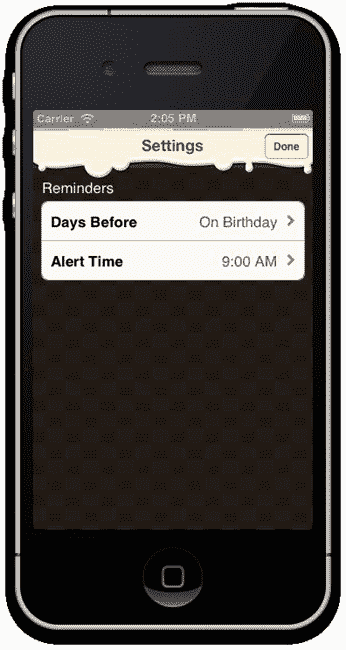

**图 12-8.** 为表格视图添加风格化的自定义标签标题

接下来我们完成 `BRNotificationTimeViewController.m` 的实现。首先，导入 `BRDSettings.h`，然后添加一个新的 `viewWillAppear:` 实现：

```objective-c
-(void) viewWillAppear:(BOOL)animated
{
    [super viewWillAppear:animated];

    //检索存储的用户设置中的通知小时和分钟
    int hour = [BRDSettings sharedInstance].notificationHour;
    int minute = [BRDSettings sharedInstance].notificationMinute;

    //使用 NSDateComponents 创建当前日期，并设置小时/分钟为存储的用户通知设置
    NSDateComponents *components = [[NSCalendar currentCalendar] components:NSHourCalendarUnit|NSMinuteCalendarUnit fromDate:[NSDate date]];
    components.hour = hour;
    components.minute = minute;
    //更新日期/时间选择器，使其显示与存储用户设置匹配的小时/分钟
    self.timePicker.date = [[NSCalendar currentCalendar] dateFromComponents:components];
}
```

每当通知时间视图控制器出现时，它会根据存储的用户设置的生日通知提醒时间更新所显示的时间。我们现在需要确保当用户在此视图中更改时间时，我们相应地更新存储的设置。按如下方式完成 `didChangeTime:` 方法：

```objective-c
- (IBAction)didChangeTime:(id)sender {
    NSDateComponents *components = [[NSCalendar currentCalendar] components:NSHourCalendarUnit|NSMinuteCalendarUnit fromDate:self.timePicker.date];
    //NSLog(@"时间已更改为：%d:%d",components.hour,components.minute);

    [BRDSettings sharedInstance].notificationHour = components.hour;
    [BRDSettings sharedInstance].notificationMinute = components.minute;
}
```


构建并运行。你会发现，不仅更改通知提醒时间时设置会保存，而且主设置视图控制器中的时间也会更新，因为我们的设置视图控制器每次视图出现时都会更新其静态表格视图单元格。

为了完成*生日提醒*的设置，我们现在需要为“天数提前”视图控制器创建一个类。在项目导航器中选中 `user-interface/view-controllers` 这个 Xcode 组，然后创建一个新的 Objective-C 类，命名为 `BRDaysBeforeViewController`，它应继承自 Apple 的 `UITableViewController`。在你的故事板中，选中“天数提前”表格视图控制器，然后使用标识检查器，将自定义类改为你的新 `BRDaysBeforeViewController` 类。

当我们处理故事板时，选中“天数提前”场景的原型表格单元格，将其样式改为 Basic，并将其复用标识符设置为 `Cell`。最后，选中表格视图，将其样式改为 Grouped。

清空所有 Xcode 的存根代码，并将其替换为以下带有注释的 `BRDaysBeforeViewController.m` 实现：

```
#import "BRDaysBeforeViewController.h"
#import "BRDSettings.h"

@implementation BRDaysBeforeViewController

-(void) viewDidLoad
{
    [super viewDidLoad];
    UIImageView *backgroundView = [[UIImageView alloc] initWithImage:[UIImage
imageNamed:@"app-background.png"]];
    [self.tableView setBackgroundView:backgroundView];
}

#pragma mark - UITableViewDataSource

-(UITableViewCell *) tableView:(UITableView *)tableView cellForRowAtIndexPath:(NSIndexPath
*)indexPath
{
    UITableViewCell *cell = [tableView dequeueReusableCellWithIdentifier:@"Cell"];
    cell.textLabel.text = [[BRDSettings sharedInstance] titleForDaysBefore:indexPath.row];
    // 如果当前索引路径的行是存储的天数提前设置，则在表格单元格中显示勾选标记
    cell.accessoryType = ([BRDSettings sharedInstance].daysBefore == indexPath.row) ? UITableViewCellAccessoryCheckmark : UITableViewCellAccessoryNone;
    return cell;
}

- (NSInteger)tableView:(UITableView *)tableView numberOfRowsInSection:(NSInteger)section
{
    // 我们也可以直接返回总行数 8，但这利用了最后一个枚举值来获取总数
    return BRDaysBeforeTypeThreeWeeks + 1;
}

#pragma mark - UITableViewDelegate

- (void)tableView:(UITableView *)tableView didSelectRowAtIndexPath:(NSIndexPath *)indexPath
{

    if (indexPath.row == [BRDSettings sharedInstance].daysBefore) {
        // 如果它是当前勾选的行，则忽略
        [tableView deselectRowAtIndexPath:indexPath animated:YES];
        return;
    }

    NSIndexPath *oldIndexPath = [NSIndexPath indexPathForRow:[BRDSettings sharedInstance].daysBefore inSection:0];
    // 为用户更新存储的天数提前设置
    [BRDSettings sharedInstance].daysBefore = indexPath.row;
    // 用户更改了选中的天数提前行，因此我们需要重新加载旧行和新行的表格单元格
    [tableView reloadRowsAtIndexPaths:@[oldIndexPath,indexPath] withRowAnimation:UITableViewRowAnimationNone];
}

@end
```

构建并运行。你应该能够修改“天数提前”设置，并再次看到更改反映在主设置屏幕上，如图 12-9 所示。

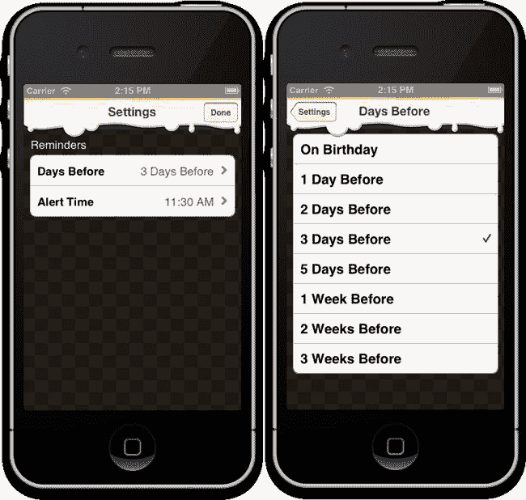

**图 12-9.** 用户控制的天数提前设置

### 更新生日

我们再次将注意力转向应用的数据模型。目前，我们在生日实体中存储了两个不会随时间保持不变的持久化属性：`nextBirthday` 和 `nextBirthdayAge`。因此，在应用完成之前，我们需要解决的一个任务是，当 `nextBirthday` 属性过期并变成朋友的上一个生日时，定期更新任何缓存的生日！

我们将在模型单例中创建一个公开方法，用于遍历生日实体数据库，更新任何过期的 `nextBirthday` 值。

在 Xcode 中打开 `BRDModel.h`，并将新的公开方法声明添加到接口中：

`-(void) updateCachedBirthdays;`

每次更新缓存的生日时，我们还会分发一个通知，以便当下次生日的顺序发生变化时，任何视图控制器都能更新其视图。在 `BRDModel.h` 的顶部、接口声明之上，为此通知名称添加一个新的常量字符串声明：

`#define BRNotificationCachedBirthdaysDidUpdate @"BRNotificationCachedBirthdaysDidUpdate"`

切换到 `BRDModel.m` 实现，并添加以下生日实体更新代码 `updateCachedBirthdays`：

```
-(void) updateCachedBirthdays
{

    NSFetchRequest *fetchRequest = [[NSFetchRequest alloc] init];

    NSManagedObjectContext *context = self.managedObjectContext;

    NSEntityDescription *entity = [NSEntityDescription entityForName:@"BRDBirthday" inManagedObjectContext:context];
    fetchRequest.entity = entity;

    // 按下一次生日的顺序获取所有生日实体
    NSSortDescriptor *sortDescriptor = [[NSSortDescriptor alloc] initWithKey:@"nextBirthday" ascending:YES];
    NSArray *sortDescriptors = [[NSArray alloc] initWithObjects:sortDescriptor, nil];
    fetchRequest.sortDescriptors = sortDescriptors;

    NSFetchedResultsController *fetchedResultsController = [[NSFetchedResultsController alloc] initWithFetchRequest:fetchRequest managedObjectContext:context sectionNameKeyPath:nil cacheName:nil];

    NSError *error = nil;
    if (![fetchedResultsController performFetch:&error]) {

        NSLog(@"Unresolved error %@, %@", error, [error userInfo]);
        abort();
    }

    NSArray *fetchedObjects = fetchedResultsController.fetchedObjects;
    NSInteger resultCount = [fetchedObjects count];

    BRDBirthday *birthday;

    NSDate *now = [NSDate date];
    NSDateComponents *dateComponentsToday = [[NSCalendar currentCalendar] components:NSYearCalendarUnit|NSMonthCalendarUnit|NSDayCalendarUnit fromDate:now];
    // 这会创建一个时间为今天 00:00 的日期
    NSDate *today = [[NSCalendar currentCalendar] dateFromComponents:dateComponentsToday];

    for (int i = 0; i < resultCount; i++) {
        birthday = (BRDBirthday *) fetchedObjects[i];
        // 如果下一次生日已经过去，那么我们需要更新生日实体
        if ([today compare:birthday.nextBirthday] == NSOrderedDescending) {
            // 下一次生日现在不正确，并且已经过去了...
            [birthday updateNextBirthdayAndAge];
        }
    }

    [self saveChanges];

    // 让所有观察者知道我们数据库中的生日已更新
    [[NSNotificationCenter defaultCenter] postNotificationName:BRNotificationCachedBirthdaysDidUpdate object:self userInfo:nil];
}
```

该方法首先从缓存存储中检索所有 Core Data 生日实体。结果集按 `nextBirthday` 属性排序。我们遍历结果集，并将 `nextBirthday` 值与今天日期的午夜时间进行比较。如果下一次生日现在是用户最近的生日，那么我们在过期的生日实体上调用 `updateNextBirthdayAndAge`，它会相应地更新自身。


