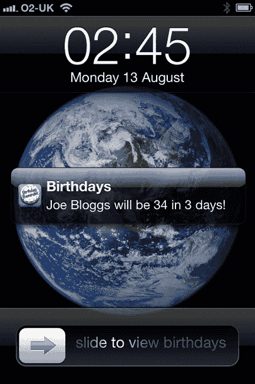
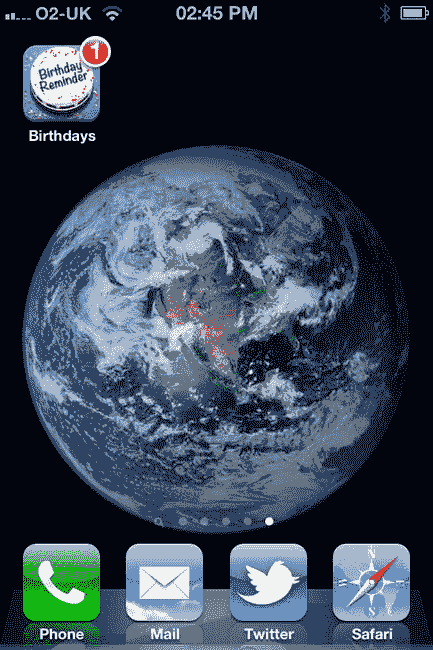

# 排版后

我们应在何时何地调用新的 `updateCachedBirthdays` 方法？至少，每次用户将 *Birthday Reminder* 应用带到前台时都应调用它。也就是说，每当我们的应用成为活跃的多任务应用，或者用户重新启动应用时，都需要调用。应用可能在后台停留数天甚至数周（具体取决于其内存占用），因此我们需要应对这种情况。

打开 `BRAppDelegate.m` 源文件。首先导入 `BRDModel.h`，然后修改 `applicationDidBecomeActive:` 方法如下：

```
- (void)applicationDidBecomeActive:(UIApplication *)application
{
    [[BRDModel sharedInstance] updateCachedBirthdays];
}
```

当缓存更新时，如果我们的主页视图控制器（Home view controller）的表格视图当前处于最前，则需要更新它。每次最近的生日过去时，有序的生日表格就会发生变化。那个已经过去的生日需要被更新，并移动到表格的末尾，成为最远（即最后一个）生日。我们通过观察 `BRNotificationCachedBirthdaysDidUpdate` 通知来处理这种情况，并简单地重新加载主页屏幕上的表格视图。打开 `BRHomeViewController.m`，并添加以下高亮显示的代码更改：

```
-(void) viewWillAppear:(BOOL)animated
{
    [super viewWillAppear:animated];
    [self.tableView reloadData];
    self.hasFriends = [self.fetchedResultsController.fetchedObjects count] > 0;
    [[NSNotificationCenter defaultCenter] addObserver:self
                                             selector:@selector(handleCachedBirthdaysDidUpdate:)
                                                 name:BRNotificationCachedBirthdaysDidUpdate object:nil];
}

-(void) viewWillDisappear:(BOOL)animated
{
    [super viewWillDisappear:animated];
    [[NSNotificationCenter defaultCenter] removeObserver:self name:BRNotificationCachedBirthdaysDidUpdate object:nil];
}

-(void) handleCachedBirthdaysDidUpdate:(NSNotification *)notification
{
    //如果缓存更新，只需重新加载表格视图
    [self.tableView reloadData];
}
```

我们只需要在主页视图控制器已经显示时处理缓存更新通知，因为我们的主页表格视图在现有 `viewWillAppear:` 方法中每次即将出现时都会重新加载。因此，我们在主页视图控制器出现时将其添加为 `BRNotificationCachedBirthdaysDidUpdate` 通知的观察者，并在其消失时移除观察者。

此时检查一下，确保应用仍能正常编译。任何之前缓存的、*下一个生日* 已过去的生日应该会被更新，并且主页视图控制器现在会将它们移动到表格底部。

### 调度和触发提醒本地通知

我们还将为即将到来的最近几个生日实现调度的本地通知提醒。在 iOS 中，本地通知的显示方式与推送通知相同：即使我们的应用未运行，操作系统也会触发它们（请参见 图 12-10）。



**图 12-10.** 一个调度的本地通知

iOS 允许每个第三方应用最多调度 64 个本地通知。如果超过此限制，额外的通知将被忽略。对我们来说，64 个生日提醒绰绰有余；事实上，20 个应该就足够了。只要我们有规律地重置并重新调度最近的 20 个生日，就足以让 *Birthday Reminder* 实现其核心提醒功能。

与推送通知一样，本地通知在触发时可以播放自定义声音。我实际上使用苹果的 Garage Band 软件创建了一个 `HappyBirthday.m4a` 声音文件。至少可以说它有点业余——但也挺有趣的。 将 `HappyBirthday.m4a` 文件添加到你的项目资源中，你可以在本章的资源文件中找到它。

稍后，我们将扩展模型单例中新的 `updateCachedBirthdays` 方法的代码，以调度接下来的 20 个生日提醒。在此之前，我们将为 `BRDSettings` 类添加几个辅助方法，用于两个目的：

> *   根据用户偏好计算生日的提醒日期/时间。
> *   根据提醒日期与朋友下一个生日之间的差异，配置提醒的通知文本。

打开 `BRDSettings.h`，并向其头文件添加以下修改：

```
@class BRDBirthday;

@interface BRDSettings : NSObject

+ (BRDSettings*)sharedInstance;

@property (nonatomic) int notificationHour;
@property (nonatomic) int notificationMinute;
@property (nonatomic) BRDaysBeforeType daysBefore;

-(NSString *) titleForNotificationTime;
-(NSString *) titleForDaysBefore:(BRDaysBeforeType)daysBefore;

-(NSDate *) reminderDateForNextBirthday:(NSDate *)nextBirthday;
-(NSString *) reminderTextForNextBirthday:(BRDBirthday *)birthday;

@end
```

我们为 `BRDBirthday` 实体类添加了一个向前类声明，以便能够在新的 `reminderTextForNextBirthday:` 方法中引用生日实体。切换到这两个新公共方法的实现。在 `BRDSettings.m` 中，导入 `BRDBirthday.h`，然后实现 `reminderDateForNextBirthday:` 方法，注释如下：

```
-(NSDate *) reminderDateForNextBirthday:(NSDate *)nextBirthday
{
    NSTimeInterval timeInterval;
    NSTimeInterval secondsInOneDay = 60.f * 60.f * 24.f;

    // 计算应从朋友的下一个生日中减去多少天，以得到提醒日期
    switch (self.daysBefore) {
        case BRDaysBeforeTypeOnBirthday:
            timeInterval = 0.f;
            break;
        case BRDaysBeforeTypeOneDay:
            timeInterval = secondsInOneDay;
            break;
        case BRDaysBeforeTypeTwoDays:
            timeInterval = secondsInOneDay * 2.f;
            break;
        case BRDaysBeforeTypeThreeDays:
            timeInterval = secondsInOneDay * 3.f;
            break;
        case BRDaysBeforeTypeFiveDays:
            timeInterval = secondsInOneDay * 5.f;
            break;
        case BRDaysBeforeTypeOneWeek:
            timeInterval = secondsInOneDay * 7.f;
            break;
        case BRDaysBeforeTypeTwoWeeks:
            timeInterval = secondsInOneDay * 14.f;
            break;
        case BRDaysBeforeTypeThreeWeeks:
            timeInterval = secondsInOneDay * 21.f;
            break;
    }

    // 这将创建时间为 00:00 的提醒日期
    NSDate *reminderDate = [nextBirthday dateByAddingTimeInterval:-timeInterval];
```


```objectivec
NSDateComponents *components = [[NSCalendar currentCalendar] components:NSYearCalendarUnit
| NSMonthCalendarUnit | NSDayCalendarUnit | NSHourCalendarUnit | NSMinuteCalendarUnit
fromDate:reminderDate];

// 更新提醒时间的小时和分钟
components.hour = self.notificationHour;
components.minute = self.notificationMinute;

return [[NSCalendar currentCalendar] dateFromComponents:components];
```

例如，如果生日是 6 月 5 日星期二，而用户设置的提前提醒天数为一天，提醒时间为上午 9:00，那么此方法将返回 6 月 4 日星期一上午 9:00 的日期，以便模型类可以据此安排提醒日期/时间。

接下来，让我们添加 `reminderTextForNextBirthday:` 的实现，该方法返回生日提醒消息，用于我们即将安排的本地通知：

```objectivec
-(NSString *) reminderTextForNextBirthday:(BRDBirthday *)birthday
{
    NSString *text;

    if ([birthday.nextBirthdayAge intValue] > 0)
    {
        if (self.daysBefore == BRDaysBeforeTypeOnBirthday) {
            // 如果朋友的生日与提醒日期相同，例如“Joe 今天 30 岁”
            text = [NSString stringWithFormat:@"%@ 是 %@ ",birthday.name,birthday.nextBirthdayAge];
        }
        else {
            // 提醒在生日之前，例如“Joe 明天将 30 岁”
            text = [NSString stringWithFormat:@"%@ 将 %@ ",birthday.name,birthday.nextBirthdayAge];
        }
    }
    else {
        text = [NSString stringWithFormat:@"今天是 %@ 的生日 ",birthday.name];
    }

    switch (self.daysBefore) {
        case BRDaysBeforeTypeOnBirthday:
            return [text stringByAppendingFormat:@"今天！"];
        case BRDaysBeforeTypeOneDay:
            return [text stringByAppendingFormat:@"明天！"];
        case BRDaysBeforeTypeTwoDays:
            return [text stringByAppendingFormat:@"两天后！"];
        case BRDaysBeforeTypeThreeDays:
            return [text stringByAppendingFormat:@"三天后！"];
        case BRDaysBeforeTypeFiveDays:
            return [text stringByAppendingFormat:@"五天后！"];
        case BRDaysBeforeTypeOneWeek:
            return [text stringByAppendingFormat:@"一周后！"];
        case BRDaysBeforeTypeTwoWeeks:
            return [text stringByAppendingFormat:@"两周后！"];
        case BRDaysBeforeTypeThreeWeeks:
            return [text stringByAppendingFormat:@"三周后！"];
    }

    return @"";
}
```

回到 `BRDModel.m`。首先导入 `BRDSettings.h`。我们将修改 `updateCachedBirthdays`，以安排前 20 个提醒通知。由于此方法会定期运行，我们需要小心避免创建重复的本地通知。确保不会发生这种情况的最简单方法是，在 `updateCachedBirthdays` 方法开头先清除所有先前安排的本地通知：

```objectivec
[[UIApplication sharedApplication] cancelAllLocalNotifications];
```

现在，为接下来最近的 20 个生日安排提醒通知。向下滚动到 `updateCachedBirthdays` 方法的后半部分，并添加以下高亮显示的更改：

```objectivec
    NSDate *now = [NSDate date];
    NSDateComponents *dateComponentsToday = [[NSCalendar currentCalendar] components:NSYearCalendarUnit|NSMonthCalendarUnit|NSDayCalendarUnit fromDate:now];
    // 这将创建一个时间为今天 00:00 的日期
    NSDate *today = [[NSCalendar currentCalendar] dateFromComponents:dateComponentsToday];
    UILocalNotification *reminderNotification;
    int scheduled = 0;
    NSDate *fireDate;

    for (int i = 0; i < resultCount; i++) {
        birthday = (BRDBirthday *) fetchedObjects[i];

        // 如果下一个生日已过去，则需要更新生日实体
        if ([today compare:birthday.nextBirthday] == NSOrderedDescending) {
            // 下一个生日现在不正确，且已过去...
            [birthday updateNextBirthdayAndAge];
        }

        if (scheduled < 20) {
            // 从设置中获取此生日的计划提醒日期
            fireDate = [[BRDSettings sharedInstance] reminderDateForNextBirthday:birthday.nextBirthday];
            if([now compare:fireDate] != NSOrderedAscending) {
                // 此提醒原定于今天，但提醒时间已过 - 不安排提醒！
            }
            else {
                // 创建新的本地通知进行安排
                reminderNotification = [[UILocalNotification alloc] init];
                // 设置计划的提醒日期
                reminderNotification.fireDate = fireDate;
                reminderNotification.timeZone = [NSTimeZone defaultTimeZone];
                reminderNotification.alertAction = @"查看生日";
                reminderNotification.alertBody = [[BRDSettings sharedInstance] reminderTextForNextBirthday:birthday];
                // 为本地通知播放自定义声音
                reminderNotification.soundName = @"HappyBirthday.m4a";
                // 更新生日提醒图标上的标记数
                reminderNotification.applicationIconBadgeNumber = 1;
                // 安排通知！
                [[UIApplication sharedApplication] scheduleLocalNotification:reminderNotification];
                scheduled++;

            }
        }
    }

    [self saveChanges];

    // 通知所有观察者数据库中的生日已更新
    [[NSNotificationCenter defaultCenter] postNotificationName:BRNotificationCachedBirthdaysDidUpdate object:self userInfo:nil];
```

我们从最近即将到来的 20 个生日中生成最多 20 个计划的 `UILocalNotification` 实例。想象一个场景：生日是今天，但通知的计划日期已过；也就是说，用户希望在每位朋友生日当天上午 9:00 收到提醒——而现在是上午 10:00。我们不希望为这些已过期的生日安排通知，因此我们将触发日期与 `now` 日期变量进行比较：

```objectivec
if([now compare:fireDate] != NSOrderedAscending) {
                // 此提醒原定于今天，但提醒时间已过 - 不安排提醒！
            }
```

至于创建 `UILocalNotification` 实例，我们设置了通知日期（`fireDate`）、通知文本（`alertBody`）、*生日提醒*主屏幕图标标记上显示的数字，以及通知触发时播放的自定义生日快乐声音。

应用已在每次启动或返回前台时调用 `[[BRDModel sharedInstance] updateCachedBirthdays]`。然而，在其他情况下，我们也需要更新计划的提醒：

> *   当用户点击“完成”并关闭设置屏幕时，因为他们可能更新了生日提醒时间偏好。
> *   当用户完成导入生日过程时，因为数据库中现在有了新生日。
> *   当用户编辑并保存生日时，因为他们可能修改了朋友的生日。

现在让我们在 `updateCachedBirthdays` 中添加这些调用：

在 `BRDModel.m` 中，在 `importBirthdays:` 实现的末尾添加以下最后一行代码：

`[self updateCachedBirthdays];`

打开 `BRSettingsViewController.m`，导入 `BRDModel.h`，并修改 `didClickDoneButton:` 实现：


`- (IBAction)didClickDoneButton:(id)sender {`
```
    [[BRDModel sharedInstance] updateCachedBirthdays];
    [self dismissViewControllerAnimated:YES completion:nil];
}
```

在设置界面点击“完成”时调用`updateCachedBirthdays`的逻辑是：如果用户更改了生日通知的提醒时间或提前天数，那么这些更改会在他们关闭主设置界面后立即应用到日程提醒中。

打开`BRBirthdayEditViewController.m`，对`saveAndDismiss:`方法进行如下修改：

`- (IBAction)saveAndDismiss:(id)sender`
`{`
`    [[BRDModel sharedInstance] saveChanges];`
```
    [[BRDModel sharedInstance] updateCachedBirthdays];
```
`    [super saveAndDismiss:sender];`
`}`

### 重置应用角标

在你的设备上，你可以通过手动添加或从 Facebook、通讯录导入几个生日来测试通知提醒。例如，如果下一个朋友的生日是明天，那么将“提前天数”设置为 1 天，并将提醒时间设置为从现在起 5 到 10 分钟后。如果一切正常，在第一个测试生日提醒通知触发后，你会看到*生日提醒*应用图标上显示一个未读角标数字 1，如图 12-11 所示。



**图 12-11.** 主屏幕图标上的角标

唯一的问题是，即使你进入*生日提醒*应用，角标也不会消失。这个问题很容易解决。打开`BRAppDelegate.m`，将`applicationDidBecomeActive:`的实现修改为以下内容：

`- (void)applicationDidBecomeActive:(UIApplication *)application`
`{`
```
    //重置应用角标计数
    [[UIApplication sharedApplication] setApplicationIconBadgeNumber:0];
    [[BRDModel sharedInstance] updateCachedBirthdays];
}
```

现在，每当应用启动时，主屏幕上的角标就会被重置。搞定！

### 总结

恭喜！你已经构建了你的第一个 iPhone 应用！虽然才到第四天结束，但我们已经拥有一个功能完备的*生日提醒*应用了。在本章中，我们学习了如何在 iOS 中安排本地通知提醒，即使应用未运行也能显示。从用户角度来看，本地通知在外观和功能上都与推送通知完全相同。

我们还创建了一个应用内设置界面，让用户能够控制何时接收生日提醒通知。

但是等等，这本书不是教你如何在五天内（而不是四天！）构建一个 iPhone 应用吗？没错，Daniel 同学。虽然我们已经构建了一个应用，但作为 iPhone 开发者的工作并未就此结束。如果我们想在 App Store 数十万款 iPhone 应用中被用户发现，就必须非常认真地考虑市场推广策略。

明天我们将专注于如何通过应用内营销来推广我们的新 iPhone 应用，赋予*生日提醒*用户通过社交网络传播我们应用的能力。我们还会直接在应用内鼓励用户提供良好的 App Store 评价和评分。这需要我们在向苹果提交应用之前进行额外的工作。我们还将学习 iTunes Connect 的提交流程，以及如何确保我们的应用在 App Store 中有最大的被发现机会！

明天见，我的朋友。在此与你道别，*再会*。


