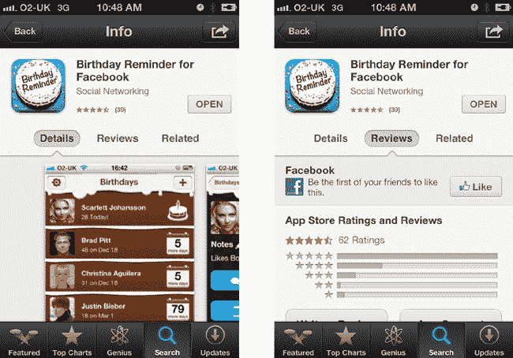
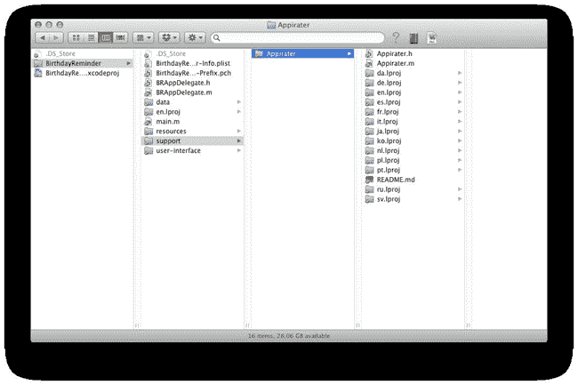
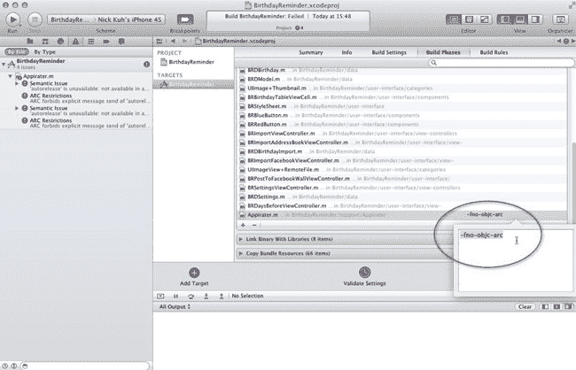
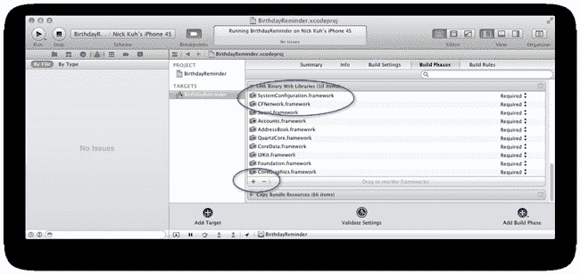
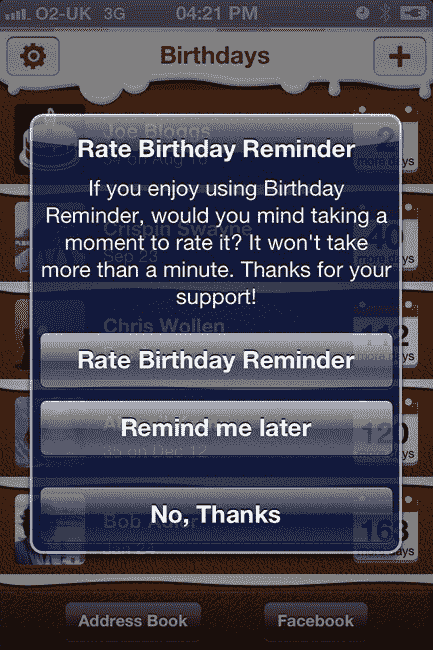
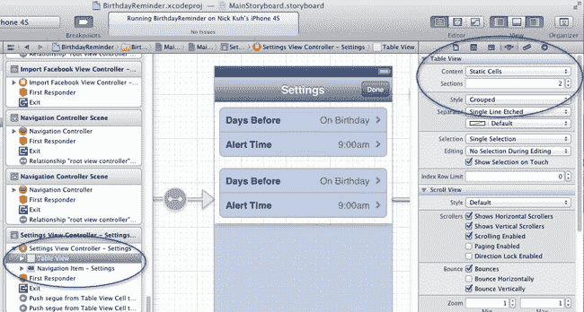
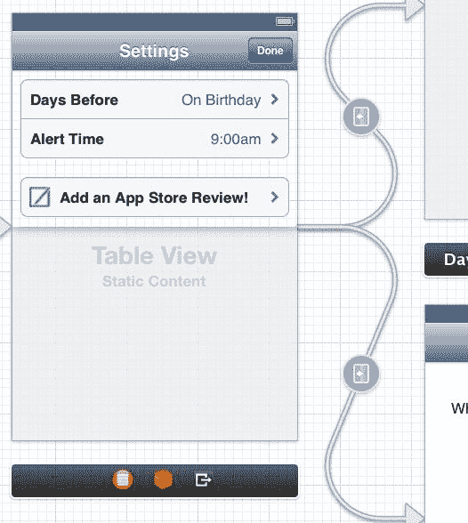

# 发布前：提高在 App Store 成功的机会

恭喜，你已经坚持到了第五天！事实上，你不仅坚持到了第五天，而且还已经构建了一个完整的 iPhone 应用。

但工作尚未结束。如果你像许多其他应用开发者一样，错误地认为一旦构建了一个好应用、提交到 App Store 后，就可以坐等收钱——那么，哦，孩子，你还没开始就已经失败了。

你的应用只是 App Store 海洋中的一条小鱼。无论你的应用有多出色，如果人们无法发现它，那么前方的旅程注定令人沮丧！仅仅做出优秀的产品远远不够，你还需要花更多时间进行市场营销。这在 App Store 并非独特的概念，但在苹果生态系统中确实普遍存在。

我们可以在*生日提醒*中添加什么，来利用数百万潜在用户？答案是应用内营销：鼓励并让现有用户传播他们发现了一款出色应用的消息。

在一个由互联网驱动通信、社交网络为王的世界里，如果我们不至少利用 Twitter 和 Facebook 集成来让用户与朋友和关注者分享*生日提醒*的详细信息，那我们就太傻了。

在昨天的第 11 章中，我们学习了如何将 Facebook 深度集成到应用中。在分享方面，我们还可以利用强大的 Graph API 做更多事情。当 Chris 和我构建*Tap to Chat*（一款用于 Facebook Chat 和 Google Talk 的即时通讯应用）时，我们在第一年就实现了超过一百万次下载。*Tap to Chat*成功的原因之一（除了它本身就是一款出色的应用！）是我们在应用中构建了一个自定义分享组件，使用户能够非常、非常轻松地发布到多个好友墙。由于大量用户直接将应用详情分享到好友墙，朋友的朋友发现了我们的应用，我们的用户群因此迅速增长。如果你的目标用户是重度 Facebook 使用者，这种应用内营销可以非常强大：而我们的用户正是如此。


### 获取更多 5 星 App Store 评分

在第 1 章中，我谈到了获得良好 App Store 评价的重要性。你的应用获得的五星好评越多越好（参见图 13-1）。



**图 13-1.** *生日提醒*在美国 App Store 的正式版本

浏览 App Store 的用户更倾向于下载那些拥有大量好评和高星级评分的应用，而不是那些充斥着 1 星差评和负面评价的应用。这是显而易见的道理。

不过，你需要了解许多关于 App Store 的事实。每个国家都有自己的 App Store。用户浏览的 App Store 版本直接与其 Apple 账户挂钩：如果用户在美国注册了 Apple 账户，那么他默认会浏览美国的 App Store。如果用户的 Apple ID 是在英国注册的，那么她就会浏览英国的 App Store。这意味着所有的评价、评分和排行榜位置都是针对具体国家的。你的应用可能在英国表现极佳，但如果在美国的下载量很少，那么完全相同的应用在美国就可能毫无踪影（没错，我就遇到过这种情况！）。关于这一点，还需注意，通常一个应用在其类别中攀升至英国、法国、德国等国榜首时，其收入远低于攀升至美国排行榜榜首的应用。美国 iOS 用户在付费应用上的花费超过其他任何国家。但这并不意味着你应该只针对美国用户；你的目标市场取决于你开发的应用类型。

不过有一件事是确定的：如果你的应用获得了下载量，你需要确保那些满意的用户对你的应用进行评分和评价。为了让用户评分和评价你的应用，他们要么需要（a）足够喜爱（或憎恨）你的应用而愿意付出努力，然后（b）在评价之前，需要访问 App Store 搜索并找到你的应用。那么，为什么不让他们轻松一些呢？可以在用户使用应用几天后（想必是愉快的几天！）鼓励他们对应用进行评分。有一个适用于 iOS 应用的优秀开源 Objective-C 类库，名为`Appirater`，正是为此而设。你可以从 GitHub 下载`Appirater`，地址是：[`https://github.com/arashpayan/appirater`](https://github.com/arashpayan/appirater)。

到目前为止，我们还没有使用任何第三方代码或库，但既然有经过验证的方法可以鼓励用户对 iOS 应用进行评分，我认为没必要为我们的项目重新发明轮子。

在 Finder 中，于项目的根层级创建一个名为`support`的新文件夹。添加一个名为`Appirater`的子文件夹，然后将你刚从 GitHub 下载的文件复制进去，如图 13-2 所示。`Appirater`很可能在我撰写本章后有所变化，因此我也在源代码中包含了当时使用的版本。



**图 13-2.** 添加`Appirater`，将第三方代码单独放在`support`文件夹中

现在，将`support`文件夹及其内容添加到你的*生日提醒*项目中。此时，你可能会发现项目无法编译，并出现编译器错误。这是因为我们的应用使用了 ARC（自动引用计数），而`Appirater`没有。别慌，年轻的 Daniel-san。幸运的是，苹果公司已有先见之明，认识到有时兼容 ARC 的项目也可能需要包含不兼容 ARC 的类。以下是消除这些编译器错误的方法。选择你的*BirthdayReminder*项目，然后选择`BirthdayReminder`目标。选择“Build Phases”标签，并打开“Compile Sources”部分。我们将为问题文件`Appirater.m`添加一个编译器标志，该文件应列在“Compile Sources”列表的末尾。双击该类文件，并输入`-fno-objc-arc`编译器标志，如图 13-3 所示。



**图 13-3.** 将非 ARC 文件集成到 ARC 项目中

这应该能解决与 ARC 相关的错误，并产生一些新的错误。好耶！这些新错误与`Appirater`依赖的缺失框架有关。我们需要将苹果的`CFNetwork`和`SystemConfiguration`框架添加到我们的项目中。还记得怎么做吗？停留在目标项目设置的“Build Phases”标签，并打开“Link Binary Files with Libraries”面板。点击+按钮添加`CFNetwork.framework`和`SystemConfiguration.framework`，如图 13-4 所示。



**图 13-4.** 向我们的项目添加`CFNetwork.framework`和`SystemConfiguration.framework`

现在你应该能够毫无问题地构建和运行你的应用了。

按照`Appirater`的 README 文件中的*入门*说明，接下来我们需要打开`BRAppDelegate.m`并导入`Appirater.h`。然后找到`application:didFinishLaunchingWithOptions:`方法，并修改它，让`Appirater`知道应用已启动：

```
- (BOOL)application:(UIApplication *)application didFinishLaunchingWithOptions:(NSDictionary *)launchOptions
{
    [BRStyleSheet initStyles];
    [Appirater appLaunched:YES];
    return YES;
}
```

现在，对委托的`applicationWillEnterForeground:`方法进行以下修改：

```
- (void)applicationWillEnterForeground:(UIApplication *)application
{
    [Appirater appEnteredForeground:YES];
}
```


### 配置 Appirater

要配置 `Appirater`，你需要手动编辑 `Appirater.h` 头文件。

首先需要修改的是将 `APPIRATER_APP_ID` 常量声明替换为你的应用的数字 ID。这是一个数字 ID，只有在你创建了要提交到 iTunes Connect 的新应用后才能获取。我们将在第 14 章中介绍 iTunes Connect，所以现在只需使用 *生日提醒* 的正式 App ID：

```
#define APPIRATER_APP_ID                   489537509
```

接着，更改提示框引用我们应用时使用的名称：

```
#define APPIRATER_APP_NAME                 @"生日提醒"
```

默认情况下，`Appirater` 使用我们应用的项目名称，即不带空格的 `BirthdayReminder`：这样对用户不太友好。

如果尚未开启，请打开 `Appirater` 的调试模式：

```
#define APPIRATER_DEBUG                 YES
```

在 iPhone 或 iPod Touch 上构建并运行 *生日提醒*，因为指向 App Store 的链接在 iOS 模拟器中无法使用。

由于我们已经开启了 `Appirater` 的调试模式，可以立即看到评分提示最终向用户显示时的效果（参见图 13-5）。



**图 13-5.** 用户友好的 `Appirater` 提示框

以前，点击“评分生日提醒”会直接将用户链接到 App Store 中你应用的“撰写评论”界面。然而，在 iOS 6 中，苹果重新设计了 App Store，据我所知，已经无法直接链接到应用的评论撰写界面了。因此，我们只能选择将用户引导至应用在 App Store 的主页。要在 `Appirater` 中解决这个问题，请切换到 `Appirater.m`，并将 `templateReviewURL` 的值修改如下：

```
NSString *templateReviewURL =
@"http://itunes.apple.com/WebObjects/MZStore.woa/wa/viewSoftware?id=APP_ID&mt=8";
```

构建并运行。测试“评分生日提醒”按钮链接。你应该会进入 *生日提醒* 在 App Store 的主界面。

首次提交应用时使用 `Appirater` 可能会有些不安，因为当你的应用尚未上线时，链接无法工作。但只要应用通过苹果审核，链接就会生效——只要别搞错你的 App ID 就行！请反复检查、再检查。

在 `Appirater.h` 中，将 `APPIRATER_DEBUG` 常量恢复为 `NO`。默认情况下，`Appirater` 至少会在 30 天过去或用户运行应用 20 次后才会向用户显示评分请求。这些参数我们都可以更改。我个人倾向于在使用一周后请求评分：

```
#define APPIRATER_DAYS_UNTIL_PROMPT        7        // double
#define APPIRATER_USES_UNTIL_PROMPT        5        // integer
```

此外，在我们的设置界面中添加一个手动选项来鼓励用户为 *生日提醒* 评分也很有价值。打开你的故事板，在主设置视图控制器中选择表格视图，如图图 13-6 所示。使用属性检查器，将 Sections 值增加到 2。这会在表格视图的第一个分区中创建一个重复的表格单元格组。



**图 13-6.** 创建新的静态表格分区

删除第二个表格视图分区中的一个单元格。对于剩下的单元格，将其样式改为 Basic，并将文本改为**添加 App Store 评论！**（参见图 13-7）。

我在源代码的 `assets` 文件夹中包含了一些免费可用的图标。将所有这些图标添加到你的 Xcode 项目的 `resources/images` 组中。现在选择新的表格单元格，并将 image 属性设置为 `icon-compose.png`。结果应类似于图 13-7。



**图 13-7.** 给用户一个微妙的提示总是没错的...

我们需要添加用于评论我们应用的超链接。打开 `BRSettingsViewController.m` 源文件，导入 `Appirater.h`，然后实现 `tableView:didSelectRowAtIndexPath:` `UITableViewDelegate` 协议方法：

```
-(void) tableView:(UITableView *)tableView didSelectRowAtIndexPath:(NSIndexPath *)indexPath
{
    //如果用户点击了“提前天数”或“提醒时间”表格单元格，则忽略
    if (indexPath.section == 0) return;

    //我们将使用 switch 语句，以便将来可以处理项目中更多的行点击事件
    switch (indexPath.row) {
        case 0: //添加 App Store 评论！
            [Appirater rateApp];
            break;
        default:
            break;
    }  
}
```

我们为表格添加了第二个分区。目前，我们显示了一个标题为“提醒”的分区头部。在当前实现中，两个分区会显示相同的头部文本，因此我们也需要在 `BRSettingsViewController.m` 中修复这个问题：

```
- (UIView *)tableView:(UITableView *)tableView viewForHeaderInSection:(NSInteger)section
{
    return section == 0 ? [self createSectionHeaderWithLabel:@"提醒"] : [self createSectionHeaderWithLabel:@"分享关爱"];
}
```

和之前一样，你需要在 iPhone 或 iPod Touch 上运行应用才能看到 App Store 链接生效。

除了调用简单的 `rateApp` `Appirater` 方法带来的便利之外，这种链接方式的另一个好处是，在这个版本的应用中，`Appirater` 不会再自动向用户显示评分提示。你不想惹恼那些已经评分和评论了的满意用户。

### 在 Facebook、Twitter 和邮件上分享

正如本书中学到的，苹果通过将社交网络深度集成到 iOS 6 中做出了巨大改进。同时，他们也使得发推文、更新 Facebook 状态、或通过邮件和短信分享变得异常简单。


