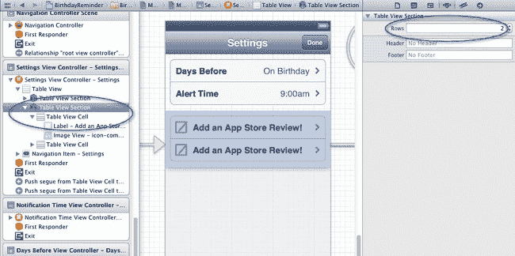
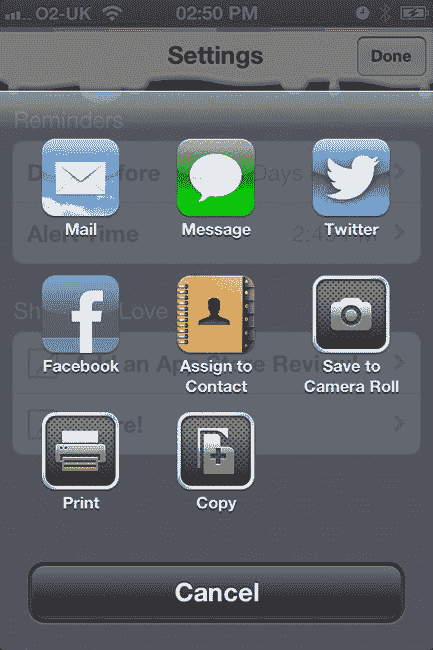
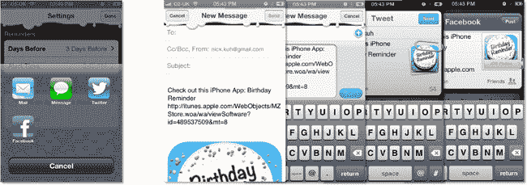
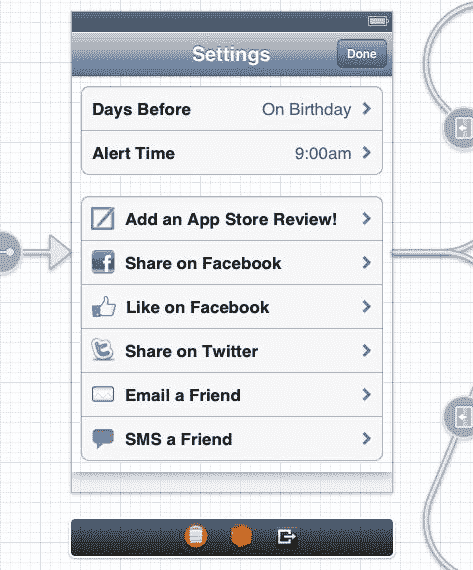
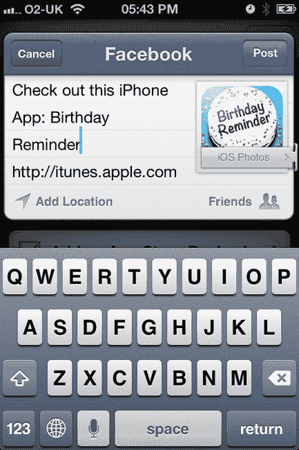
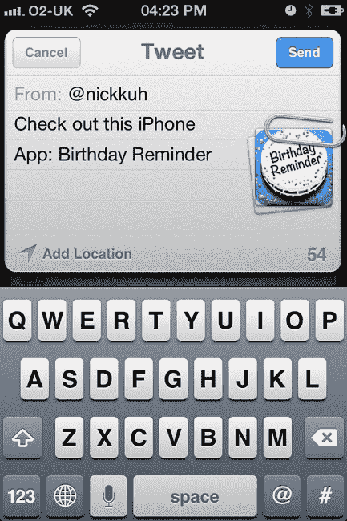
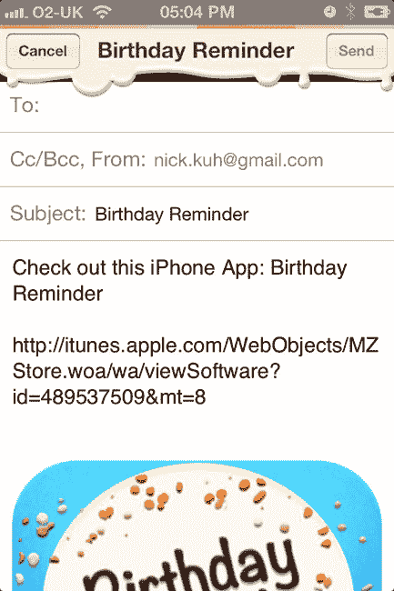
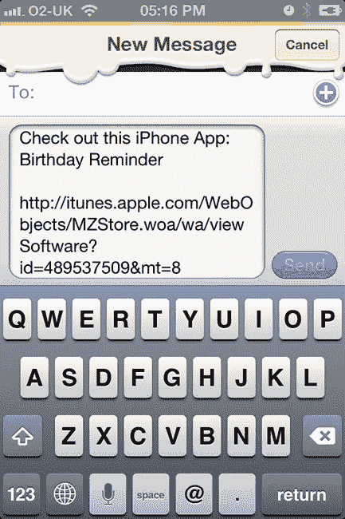

# 使用 `UIActivityViewController` 实现五分钟分享集成

我将向你展示，仅在任意 iOS 6 应用中添加一个分享链接是多么简单，从而让用户能够通过多种方式进行分享。在文档大纲面板中，通过 storyboard 选择设置视图控制器中的第二个表格视图分区。将该分区的行数增加，如图 13-8 高亮所示。



**图 13-8.** 增加静态表格视图分区的行数

将第二个单元格中的文本改为 `Share!`，然后切换回 `BRSettingsViewController.m`。接下来，修改 `tableView:didSelectRowAtIndexPath:` 方法，添加高亮部分的变化：

```
-(void) tableView:(UITableView *)tableView didSelectRowAtIndexPath:(NSIndexPath *)indexPath
{
    //如果用户点击了“提醒前一天”或“提醒时间”表格单元格，则忽略操作
    if (indexPath.section == 0) return;

    NSString *text = @"Check out this iPhone App: Birthday Reminder";
    UIImage *image = [UIImage imageNamed:@"icon300x300.png"];
    NSURL *facebookPageLink = [NSURL
URLWithString:@"http://www.facebook.com/apps/application.php?id=123956661050729"];
    NSURL *appStoreLink = [NSURL URLWithString:@"http://itunes.apple.com/WebObjects/MZStore.woa/wa/viewSoftware?id=4895375
09&mt=8"];

    switch (indexPath.row) {
        case 0: //添加 App Store 评分！
            [Appirater rateApp];
            break;
        case 1: //分享！
        {
            NSArray *activityItems = @[text,image,appStoreLink];

            UIActivityViewController *activityViewController = [[UIActivityViewController
alloc] initWithActivityItems:activityItems applicationActivities:nil];
            [self presentViewController:activityViewController animated:YES
                             completion:nil];
            break;
        }
        default:
            break;
    }
}
```

构建并运行。尝试在设置视图中点击新的 `Share!` 表格单元格。此时应出现一个活动视图控制器，如图 13-9 所示。



**图 13-9.** 活动视图控制器：Apple 用于内容分享的首选组件

`UIActivityViewController` 类是在 iOS 6 中被添加到 `UIKit` 中的。仅用六行代码，我们就让用户能够通过 Twitter、Facebook、电子邮件和短信分享文本、图片以及指向我们 *生日提醒* iTunes 页面的链接。在我看来，活动视图控制器中的通讯录、相机胶卷、打印和剪贴板选项对于我们的目的来说有些多余，但我们可以轻松移除它们。尝试设置活动视图控制器的 `excludedActivityTypes` 属性：

```
            UIActivityViewController *activityViewController = [[UIActivityViewController
alloc] initWithActivityItems:activityItems applicationActivities:nil];
            activityViewController.excludedActivityTypes =
@[UIActivityTypePostToWeibo,UIActivityTypePrint,UIActivityTypeCopyToPasteboard,UIActivity
TypeAssignToContact,UIActivityTypeSaveToCameraRoll];
            [self presentViewController:activityViewController animated:YES
                             completion:nil];
```

构建并运行。现在你应该只看到电子邮件、短信、Twitter 和 Facebook 分享选项。如图 13-10 所示，活动视图控制器提供了一种非常强大的方式，用于添加文本、链接和图片的多种内容分享选项。



**图 13-10.** 一个活动视图控制器，多种分享选项

我们已经看到集成活动视图控制器是多么简单，但如果我们想在表格单元格中显示自己的 Facebook、Twitter、电子邮件和短信链接，以便分别启动每个示例分享模态视图，又该怎么做呢？我们可以实现这一点，但需要多花些功夫。听我说：我会向你展示如何操作！

首先，让我们设置一些新的分享表格单元格。和之前一样，通过 storyboard 选择设置视图控制器中的第二个表格视图分区。将该分区的行数增加到 6，并按如下方式配置每个表格单元格（参见图 13-11）：

> *   第二个表格单元格（文本：`Share on Facebook`，图片：`fbicon24x24.png`）
> *   第三个表格单元格（文本：`Like on Facebook`，图片：`like-icon.png`）
> *   第四个表格单元格（文本：`Share on Twitter`，图片：`icon-twitter.png`）
> *   第五个表格单元格（文本：`Email a Friend`，图片：`mail-icon.png`）
> *   第六个表格单元格（文本：`SMS a Friend`，图片：`sms-icon.png`）



**图 13-11.** 设置带有分享选项的表格单元格


好的，作为一名高级文档工程师和翻译员，我将严格遵循您的注意事项和示例，对给定英文文本进行翻译。以下是翻译后的中文内容：


#### 使用 `SLComposeViewController` 在 Facebook 上分享

我们已经完成了故事板的工作，现在打开 `BRSettingsViewController.m` 并导入社交框架：

`#import <Social/Social.h>`

找到 `tableView:didSelectRowAtIndexPath:` 方法，并用以下高亮显示的代码替换 Activity 视图控制器的代码：

```
-(void) tableView:(UITableView *)tableView didSelectRowAtIndexPath:(NSIndexPath *)indexPath
{
    // 忽略用户点击“前一天”或“提醒时间”表格单元格的情况
    if (indexPath.section == 0) return;

    NSString *text = @"快来看看这个 iPhone 应用：生日提醒";
    UIImage *image = [UIImage imageNamed:@"icon300x300.png"];
    NSURL *facebookPageLink = [NSURL
URLWithString:@"http://www.facebook.com/apps/application.php?id=123956661050729"];
    NSURL *appStoreLink = [NSURL
URLWithString:@"http://itunes.apple.com/WebObjects/MZStore.woa/wa/viewSoftware?id=489537509&mt
=8"];
    SLComposeViewController *composeViewController;

    switch (indexPath.row) {
        case 0: // 添加 App Store 评论！
            [Appirater rateApp];
            break;
        case 1: // 在 Facebook 上分享
        {
            if (![SLComposeViewController
isAvailableForServiceType:SLServiceTypeFacebook])
            {
                NSLog(@"用户没有可用的 Facebook 账户");
                return;
            }
            composeViewController = [SLComposeViewController
composeViewControllerForServiceType:SLServiceTypeFacebook];
            [composeViewController addImage:image];
            [composeViewController setInitialText:text];
            [composeViewController addURL:appStoreLink];
            [self presentViewController:composeViewController animated:YES
                             completion:nil];
            break;
        }
        default:
            break;
    }
}
```

构建并运行。点击“在 Facebook 上分享”表格单元格应显示一个撰写视图控制器，如图 13-12 所示。



**图 13-12.** 使用撰写视图控制器在 Facebook 上分享

如您刚刚添加的新代码所示，我们通过撰写视图控制器的 `composeViewControllerForServiceType:` 类方法创建了 `SLComposeViewController` 实例。同样重要的是，通过调用另一个 `SLComposeViewController` 类方法 `isAvailableForServiceType:` 来检查用户是否已配置 Facebook 账户，该方法可传入 Facebook、Twitter 或新浪微博等社交网络类型。

接下来是关于 Facebook 上的“赞”号召性用语。我们在这里要做的就是链接到我们的*生日提醒* Facebook 页面，然后让用户登录并处理其余操作。你可能会惊讶于这有多么有效——通过简单地在应用内链接到页面，我们就在短时间内为我们的 *Tap to Chat* 页面获得了成千上万的 Facebook 点赞。

在 `tableView:didSelectRowAtIndexPath:` 的 switch 语句中添加一个新的 case：

```
case 2: // 在 Facebook 上点赞
            [[UIApplication sharedApplication] openURL:facebookPageLink];
            break;
```

构建并运行以测试链接。简洁明了！

#### 使用 `SLComposeViewController` 在 Twitter 上分享

你觉得使用 `SLComposeViewController` 以与 Facebook 相同的方式在 Twitter 上分享会有多复杂？代码实际上是相同的，我们只需要将两个 `SLServiceTypeFacebook` 引用替换为 `SLServiceTypeTwitter`。在 `tableView:didSelectRowAtIndexPath:` 的 switch 语句中添加另一个 case：

```
    case 3:// 在 Twitter 上分享
        {
            if (![SLComposeViewController isAvailableForServiceType:SLServiceTypeTwitter])
            {
                NSLog(@"用户没有可用的 Twitter 账户");
                return;
            }
            composeViewController = [SLComposeViewController
composeViewControllerForServiceType:SLServiceTypeTwitter];
            [composeViewController addImage:image];
            [composeViewController setInitialText:text];
            [composeViewController addURL:appStoreLink];
            [self presentViewController:composeViewController animated:YES
                             completion:nil];
            break;
        }
```

很简单，对吧？我不是告诉过你，苹果用 iOS 6 让我们的生活变得更简单了！构建并运行。点击“在 Twitter 上分享”表格单元格应显示一个模态弹出的推文表单，就像图 13-13 中显示的那样。



**图 13-13.** 使用撰写视图控制器在 Twitter 上分享

**注意：** 如果您尚未将 Twitter 或 Facebook 账户添加到 iOS，那么 `isAvailableForServiceType:` 将返回 false，并且不会显示模态视图控制器。


#### 使用 `MFMailComposeViewController` 发送电子邮件

自 iOS 3 起，我们就能够在 iOS 中发送电子邮件。因此，应用内发送邮件对 iOS SDK 来说并非新鲜事。不过，要发送电子邮件和短信，我们还需遵循几个额外步骤。这比使用 `SLComposeViewController` 稍微繁琐一些。

首先，我们必须将 `MessageUI` 框架添加到项目中。本书中我们已经添加了许多框架，所以希望你对此操作已经驾轻就熟，能顺利添加 `MessageUI.framework`。

准备好了吗？那就跳转到 `BRSettingsViewController.h` 头文件，导入 `MessageUI.h`：

```
#import <MessageUI/MessageUI.h>
```

我们将这个框架导入设置头文件的原因是，我们的设置视图控制器需要订阅为即将创建的 `MFMailComposeViewController` 实例的委托。所以现在就来做这件事：

```
@interface BRSettingsViewController : UITableViewController
<MFMailComposeViewControllerDelegate>
```

现在切换到 `BRSettingsViewController.m`，在 `tableView:didSelectRowAtIndexPath:` 方法的 switch 语句中添加另一个 case：

```
case 4://发送邮件给朋友
        {
            if (![MFMailComposeViewController canSendMail]) {
                NSLog(@"无法发送邮件");
          return;
            }
            MFMailComposeViewController *mailViewController = [[MFMailComposeViewController alloc] init];

            //添加附件时，需要将图片转换为原始的 NSData 表示
            [mailViewController addAttachmentData:UIImagePNGRepresentation(image)
mimeType:@"image/png" fileName:@"pic.png"];
            [mailViewController setSubject:@"生日提醒"];

            //组合文本和应用商店链接，创建邮件正文
            NSString *textWithLink = [NSString
stringWithFormat:@"%@\n\n%@",text,appStoreLink];

            [mailViewController setMessageBody:textWithLink isHTML:NO];
            mailViewController.mailComposeDelegate = self;
            [self presentViewController:mailViewController animated:YES
                             completion:nil];
            break;
        }
```

我之前提到过会有几个额外步骤，对吧？要将我们的 *生日提醒* 标志作为邮件附件添加，我们需要将 `UIImage` 实例转换为 `NSData` 实例。Apple 提供了 `UIImagePNGRepresentation` 和 `UIImageJPEGRepresentation` 函数，正是用于此目的。

正如你在代码中可能已经注意到的，可以通过邮件视图控制器的 `setMessageBody:isHTML:` 方法在邮件中设置 HTML，因此你可以选择使用 HTML 在邮件正文中创建超链接。

尝试构建并运行。你应该能够点击“发送邮件给朋友”单元格，并看到一个弹出的邮件模态视图控制器，如图 13-14 所示。



**图 13-14.** 使用邮件撰写视图控制器通过电子邮件分享

在设备上测试应用时，尝试点击邮件撰写视图控制器的“取消”按钮。什么也没发生，对吧？这是因为邮件撰写视图控制器期望其委托来处理视图控制器的关闭。这很容易解决，只需将 `MFMailComposeViewControllerDelegate` 的 `mailComposeController:didFinishWithResult:error:` 方法添加到 `BRSettingsViewController.m` 中：

```
#pragma mark MFMailComposeViewControllerDelegate

- (void)mailComposeController:(MFMailComposeViewController*)controller
didFinishWithResult:(MFMailComposeResult)result error:(NSError*)error
{
    switch (result)
    {
        case MFMailComposeResultCancelled:
            NSLog(@"邮件撰写已取消");
            break;
        case MFMailComposeResultSaved:
            NSLog(@"邮件撰写已保存");
            break;
        case MFMailComposeResultSent:
            NSLog(@"邮件撰写已发送");
            break;
        case MFMailComposeResultFailed:
            NSLog(@"邮件撰写失败");
            break;
    }

    [controller dismissViewControllerAnimated:YES completion:nil];

}
```

这样就应该解决问题了！

#### 使用 `MFMessageComposeViewController` 发送短信

自 iOS 4 起，我们也能够在应用内创建短信撰写面板。其实现与我们刚刚完成的发送电子邮件过程非常相似。

切换到 `BRSettingsViewController.h`，声明你的设置视图控制器也实现 `MFMessageComposeViewControllerDelegate` 协议：

```
@interface BRSettingsViewController : UITableViewController
<MFMailComposeViewControllerDelegate, MFMessageComposeViewControllerDelegate>
```

现在回到 `BRSettingsViewController.m`，在 `tableView:didSelectRowAtIndexPath:` 的 switch 语句中添加最后一个 case：

```
case 5://发送短信给朋友
        {
            if (![MFMessageComposeViewController canSendText]) {
                NSLog(@"无法发送消息");
          return;
            }
            MFMessageComposeViewController *messageViewController =
[[MFMessageComposeViewController alloc] init];

            //组合文本和应用商店链接，创建邮件正文
            NSString *textWithLink = [NSString
stringWithFormat:@"%@\n\n%@",text,appStoreLink];

            [messageViewController setBody:textWithLink];
            messageViewController.messageComposeDelegate = self;
            [self presentViewController:messageViewController animated:YES
                             completion:nil];
            break;
        }
```

正如你从代码中看到的，它与 `MFMailComposeViewController` 的实现非常相似。在测试新的短信撰写视图控制器之前，将 `MFMessageComposeViewControllerDelegate` 的 `messageComposeViewController:didFinishWithResult:` 协议方法添加到 `BRSettingsViewController.m` 中：

```
#pragma mark MFMessageComposeViewControllerDelegate
- (void)messageComposeViewController:(MFMessageComposeViewController *)controller
didFinishWithResult:(MessageComposeResult)result
{
    switch (result)
    {
        case MessageComposeResultCancelled:
            NSLog(@"短信撰写已取消");
            break;
        case MessageComposeResultFailed:
            NSLog(@"短信撰写已保存");
            break;
        case MessageComposeResultSent:
            NSLog(@"短信撰写已发送");
            break;
    }

    [controller dismissViewControllerAnimated:YES completion:nil];

}
```

构建并运行。结果应如图 13-15 所示。



**图 13-15.** 使用短信撰写视图控制器通过 SMS 分享

现在你可能已经意识到，之前花五分钟添加活动视图控制器的过程，带来了我们在本章中实现的所有其他分享内容视图控制器。区别在于，我们可以根据分享类型对分享的内容进行更精细的控制。例如，通过电子邮件分享时，我希望能利用正文中的 HTML 兼容性，在我的内容中添加多个超链接。同样，通过 Twitter 分享时，我们必须注意字符数量。

Apple 在 iOS 6 中构建的新活动视图控制器很棒，但有时将所有分享功能抽象成一段文本和一两个图片是不够的，我们需要更精细的控制。


### 摘要

今天上午开发社交分享功能的时间花得很值。我向你展示的分享和应用评分代码可以应用于任何项目（只需确保更新文本、图片和链接！）。如果你将应用内营销工作推迟到应用 1.1 或 2.0 版本，那就犯了一个新手级的错误！苹果公司一直在让 iOS 应用实现社交功能变得越来越简单。你实在没有理由不利用它们那些易于实现的功能。

你已经完成了 iPhone 应用的开发阶段！你走过了一段多么重要的旅程。

在过去的四天半时间里，我们涵盖了 iOS SDK 的大量内容。你已经吸收了作为一名 iOS 开发者日常工作中所需的技能和代码。虽然`Birthday Reminder`只是一个为期五天的小型应用，但我在课程中向你介绍的众多技术可以应用于更大的项目。

那么还有什么要做的？当然是提交我们的应用！在我们旅程的最后一章，我将带你了解 iTunes Connect，并指导你完成向 App Store 提交应用的步骤。我们一会儿见。


