# 提交我们的应用

你已经构建了你的 iPhone 应用，并准备上线！那么……具体该怎么做呢？答案是：使用 iTunes Connect。iTunes Connect 是苹果公司为 iOS 和 Mac 开发者提供的基于 Web 的工具，用于通过 App Store 提交和分发他们的应用。

应用提交流程主要有两个步骤：

> 1.  通过 iTunes Connect 网站创建一个新的应用提交。
> 2.  直接从 Xcode 构建并上传你的应用的 release 二进制文件到 iTunes Connect。

完成第一步后，你将立即获得应用的 iTunes Apple ID，正如我们在第 13 章中学到的，该 ID 可用于在 App Store 中直接链接到你的应用。

苹果允许你在完成初始的 iTunes Connect 应用提交表格后，有长达六个月的时间来上传你的应用二进制文件。因此，你完全可以在最终完成应用构建之前，提前预订一个 App Store 名称。

### 使用 iTunes Connect 创建新的应用提交

只有付费注册的 iOS 开发者才能访问 iTunes Connect。正如我在第 2 章中提到的，要成为一名注册的 iOS 开发者，首先需要处理很多繁琐的手续，所以如果你还没有完成第一步——那就回到第 2 章去看看吧！

那么，现在房间里只剩下已注册的 iOS 开发者了吗？启动 Safari，将浏览器指向 iTunes Connect 的网址 [`http://itunesconnect.apple.com`](http://itunesconnect.apple.com)。

首先，使用你的 iOS 开发者 Apple ID 和密码登录（见图 14-1）。

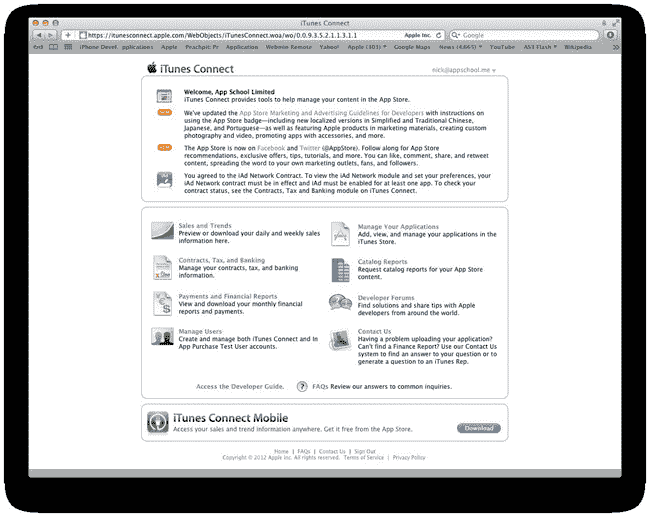

**图 14-1.** iTunes Connect 首页

除了向苹果提交新应用和应用更新，你还可以使用 iTunes Connect 查看你的销售和下载统计数据；填写合同、税务和账单表格；以及如果你使用苹果的 iAd 平台，还可以管理和追踪广告收入。

我们将专注于提交流程，因此请点击“管理你的应用”链接开始。接下来，点击蓝色的大“添加新应用”按钮。

如图 14-2 所示，下一步是添加一些基本的应用信息。

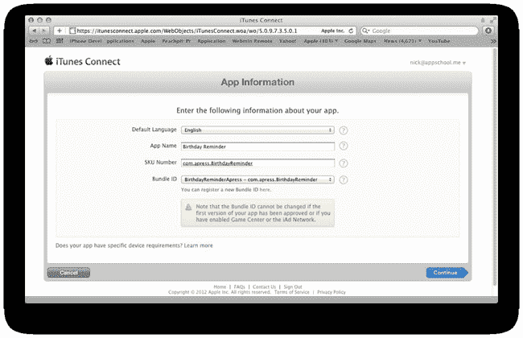

**图 14-2.** 设置基本应用信息，例如 App Store 名称

#### 设置默认语言

如果你的应用的基础语言是法语，那么现在是时候告诉苹果了！无论你选择哪种语言，它都将成为 App Store 关联到你应用的主要语言。另外值得注意的是，你可以在之后添加本地化的 App Store 描述，甚至是一个本地化的名称。

#### 输入应用名称

App 名称是显示在你应用图标旁边的名称，用户在浏览 App Store 时会看到它。不要将其与你的应用显示名称混淆——后者是显示在 iPhone 主屏幕上应用下方的名称。与显示名称不同，App Store 名称可以相当长——最多 255 个字节，这大约相当于相同数量的常规字符。就 App Store 搜索优化而言，我建议你利用这些额外的字符，并在你的 App Store 标题中包含相关关键词。这可以提高你的应用在 App Store 常规搜索和预测搜索结果中被发现或展示的机会。

你可以等到填写完此表单中的所有四个字段后再提交，也可以点击“继续”来检查你输入的 App 名称是否已被 App Store 占用（见图 14-3）。

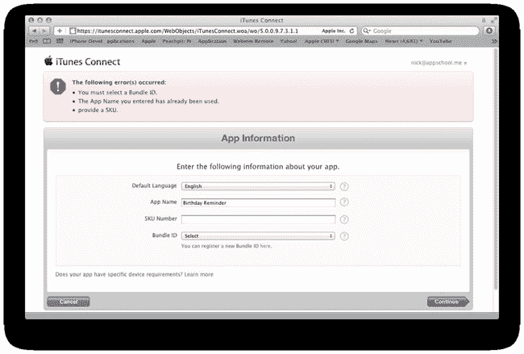

**图 14-3.** 检查 App 名称是否已存在

在图 14-3 中，请注意“您输入的 App 名称已被使用”这条错误信息。继续尝试不同的名称，直到不再出现该错误，这时你就知道你选择了一个唯一的 App Store 名称。

#### 输入 SKU 编号

苹果关于处理 SKU 字段的在线文档如下：

> 在 SKU 字段中，输入你的应用的唯一 UTF-8 字母数字标识符。SKU 可以是任何你希望用来在我们的系统中唯一标识你的字母和数字序列。只要该字符串对你的开发者账户是唯一的，你可以创建任何由 UTF-8 字母和数字组成的字符串。此 SKU 仅限内部使用，用户在任何时候都不会看到。在你提交元数据后，此 SKU 将不可编辑。

我倾向于简单地将我的应用的 bundle identifier 用作 SKU 编号（见图 14-2）。

#### 关联 Bundle Identifier

在配置门户中，iTunes Connect 会自动检测你所有尚未被你的 App Store 在线应用使用的有效 bundle identifier。你早在第 2 章中就设置了一个 bundle identifier，因此使用下拉菜单，你应该能够选择你的 bundle identifier。当你选择一个有效的 bundle identifier 时，iTunes Connect 会提醒你“如果应用的第一版已获批准，则无法更改 Bundle ID”——所以请确保在点击“继续”按钮之前，你已经选择了正确的 bundle identifier。

### 安排应用的上架时间和定价

在应用提交表格的下一页，你需要设置应用的发布可用日期和价格（见图 14-4）。

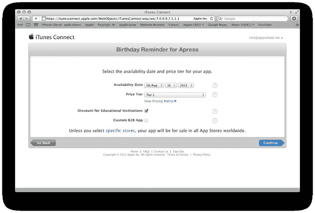

**图 14-4.** 设置应用的发布可用日期和价格

#### 延迟应用发布

如果你希望你的应用在苹果批准后立即上线，那么只需将可用日期保留为默认值（即今天日期）。然而，这是另一个营销你的应用的绝佳机会。在应用发布之前，没有人能公平地评判它是成功还是失败。根据我的经验，一旦你上传了二进制文件，苹果通常需要大约七天时间来进行审查，然后批准或拒绝一个应用。如果你将应用的可用日期安排在提交后的两周，那么一旦你的应用获得批准，你就能掌控它在 App Store 上线的时机。充分利用这个主动权！一旦我知道某个应用已被苹果批准，我就会开始通过电子邮件通知记者们关于我应用发布的消息。此时，我确切地知道我的应用何时会在 App Store 上线：因为苹果已经批准了提交，所以不存在任何不确定性。因此，我可以给记者们提供一条消息：我的酷应用将于 8 月 24 日星期五（或我选择的任何日期）发布。你看到这样发布的好处了吗？保持控制权，延迟你的应用发布。按*你*的条件发布，而不是按苹果的！

#### 为你的应用定价

要通过 App Store 销售应用，你可以选择免费分发应用，或者选择一个定价等级。定价等级基于美元计算。等级 1 为 $0.99，等级 2 为 $1.99，等级 3 为 $2.99，以此类推。每个等级都对应着不同货币的等级价格，你可以通过“定价矩阵”链接进行查询。我截取了当前定价矩阵的示意图（参见图 14-5）。Apple 会不定期更新定价矩阵，尤其是在汇率发生显著波动之后。

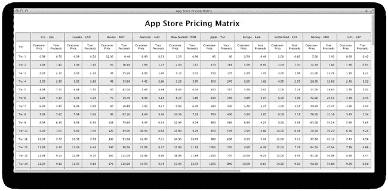

**图 14-5.** Apple 的 App Store 定价矩阵

根据当前的定价矩阵，如果一位美国客户以 $0.99 的价格购买了一款应用，那么同样这款应用，英国客户需支付 £0.69，而通过欧洲 App Store 购买的客户则需支付 €0.79。

定价矩阵还会显示你从 Apple 获得的每笔应用销售的收益金额（以各国家/地区货币计）。例如，在美国每售出一款 $0.99 的应用，你将收到 Apple 支付的 $0.70。

#### 将应用限制在特定国家/地区销售

默认情况下，Apple 会在其所有 App Store 中分发你的应用，但你可以根据需要更改此设置。点击“特定商店”链接，即可选择在哪些国家/地区销售你的应用（参见图 14-6）。

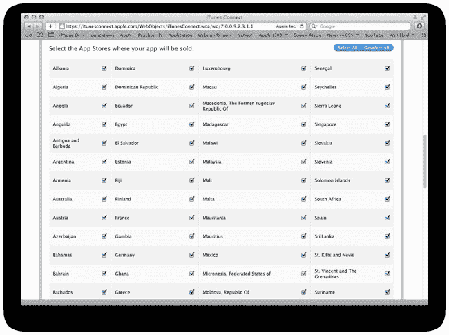

**图 14-6.** 为你的应用选择特定的 App Store

*提示：如果出于任何原因，你需要将应用暂时下架，无需从商店中删除它。只需点击“权限和定价”链接编辑你的应用，即可回到可用性和定价页面。取消选择所有商店并保存。这样，你的应用就会从所有 App Store 中移除，直到你返回此页面并将其重新上架销售为止。*

有许多开发者曾在提交一个出色的应用更新后，等到 Apple 审核通过并在商店上线时，才发现自己忽略了测试从旧版本升级的用户的数据迁移过程。结果就是“崩溃之城”降临。一旦应用更新获得批准，就无法回退到旧版本。依我看，最好的解决方案是暂时将应用下架，然后提交另一个更新。好吧，实际上最理想的方案是在新用户和更新应用的现有用户中彻底进行测试。只要确保永不犯错就行，对吧？

我们假设你愿意在全球所有 App Store 中销售你的应用。

你为应用选择好定价等级了吗？之后是可以更改的。

我还建议勾选“为教育机构提供折扣”。Apple 为学校和大学提供批量购买折扣。如果有教育机构一次性购买你的应用超过 30 份，那么它们理应获得折扣，不是吗？

点击“继续”按钮。

### 配置版本信息

接下来，我们需要为应用提供版本号、版权文本，以及主要和次要的 App Store 类别（参见图 14-7）。

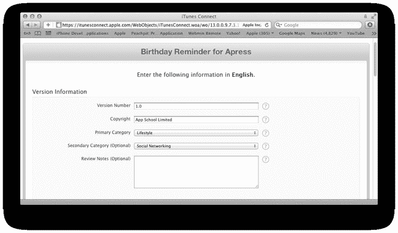

**图 14-7.** 为我们的应用设置版本号、版权信息和类别

提交应用时，请使用常规的版本号格式。避免使用诸如 alpha、beta 等词语；而是坚持使用 1.0、1.20、2.0 等格式。由于这是我们发布应用的首次提交，我建议使用 1.0。我们在 iTunes Connect 中设置的版本号需要与 Xcode 项目中 `Info.plist` 文件里的 `Bundle versions string, short` 值保持一致，该值默认也是 1.0。

#### 选择 App Store 类别

你必须为应用选择一个主要类别，并可以选择一个次要类别。如果你的应用可以合理地归入多个类别，那么我建议你查看 148Apps 网站提供的最新 App Store 指标：[`http://148apps.biz/app-store-metrics`](http://148apps.biz/app-store-metrics)。

148Apps 的 App Store 指标包含许多其他有用的统计数据，例如按类别划分的应用数量统计（参见图 14-8）。

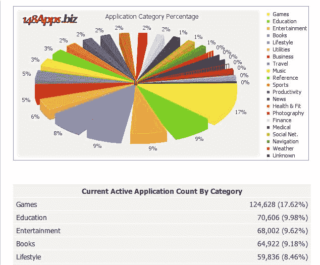

**图 14-8.** 148Apps 提供的 App Store 指标揭示了最受欢迎且竞争最激烈的类别

从图 14-8 中我们可以看到，游戏类之后，第二受欢迎（因此竞争也最激烈）的类别是教育类，第三受欢迎的是娱乐类。这是非常有价值的信息，因为你在所属类别中排名越高，你在 App Store 中的曝光度就越好。因此，如果可能的话，选择一个竞争不那么激烈的类别吧！

148Apps 的 App Store 指标还包括应用价格分布。你知道吗？App Store 中大约 50% 的应用是免费的。许多免费应用通过应用内购买和广告盈利，但了解竞争激烈这一点非常有用——即使你选择免费分发你的应用！

提交过程中的“审核备注”部分可以留空，但如果你的应用要求用户拥有第三方网站的账户，那么你应该在审核备注中包含一个测试账户的用户名和密码，以帮助 Apple 的审核人员。

### 设置应用评级

接下来的一系列选择与你的应用内容有关。为每项选择最适用的单选按钮，表单将自动生成 Apple 认为适用于你应用的应用年龄评级（参见图 14-9）。

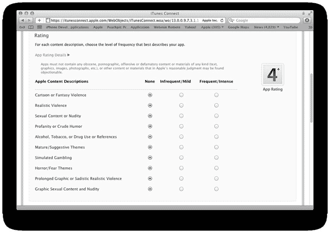

**图 14-9.** 我认为我们的 Apple 用户不会在 *生日提醒* 应用中发现任何过于争议的内容！

### 添加描述和元数据

当用户第一次阅读你的应用描述时，你已经吸引他进门了——凭借精美的图标和有力、信息丰富的应用名称，诱使他进一步了解你的应用。此时距离成交仅有一步之遥，因此请务必确保你的描述清晰、简洁地总结了你应用的功能（参见图 14-10）。

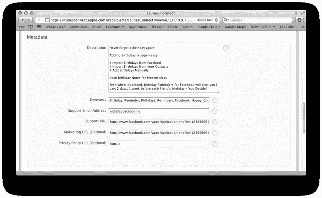

**图 14-10.** 输入描述性文本、关键词和其他元数据

描述的第一行最为重要。App Store 的描述会在 iPhone、iPad、iTunes 和网络上显示。在许多情况下，描述只会显示前几行，因此请务必在第一句话中概括你的应用。

另外请注意，你的描述文本和截图一旦应用上线，就会被诸如 App Shopper（[`www.appshopper.com`](http://www.appshopper.com)）之类的网站汇总抓取，所以不要写类似“描述稍后补充”这样愚蠢的内容，并且在应用发布前忘记填写一些有用的细节信息！

#### 添加关键词

关键词最多支持 100 个字节（大约 100 个字符）——请充分利用。Apple 的搜索算法会检查应用标题、关键词和描述以查找搜索结果。关键词比描述更重要，因此请谨慎选择！用逗号分隔你的关键词。

请注意，一旦 Apple 批准了你的应用提交，你将无法再编辑应用的关键词。这同样适用于你的 App Store 标题。你只能在提交未来应用更新时编辑这些详细信息。

好的，作为一名高级文档工程师和翻译员，我将严格遵循您提供的注意事项和示例，将给定的英文文本翻译成中文。

### 上传截图和 iTunes 作品图

为了完成 App Store 提交的第一步，我们需要上传一个大型版本的应用程序图标，以及至少一张应用程序截图（参见图 14-11）。

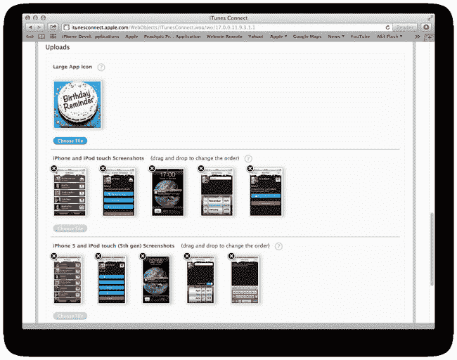

**图 14-11.** 大型应用程序图标及每个设备最多五张已上传截图

Apple 规定，iTunes 的大型应用程序图标现在需要是 1024×1024 像素。这个非常大的图标将会在 Retina iPad 和 iOS 6 的 App Store 中弹出来。

就像应用程序二进制文件中的图标一样，请确保您的 iTunes 图标的边角完全延伸到边缘，并且不要添加您自己的圆角——Apple 会为您处理。

您可以选择上传 iPhone/iPod Touch、iPhone 5/iPod Touch（第 5 代）和 iPad 的截图。在 *Birthday Reminder* 中，我们只针对 iPhone 和 iPod Touch 设备，因此我们只应上传 iPhone 的截图。iPhone 和 iPod Touch 的截图应针对以下 Retina 尺寸：竖屏截图 640×960 像素，横屏截图 960×640 像素。20 点的 iOS 状态栏是可选的，因此您也可以上传 640×920 或 960×600 像素的截图。我们支持 iPhone 5 的 4 英寸显示屏，因此我们还必须上传原生 640x1136 像素的 iPhone 5 截图（参见图 14-11）。

如果您要上传仅限 iPad 的应用程序或通用应用程序（一个应用程序同时为 iPhone 和 iPad 提供原生用户界面），那么您还需要为 iPad 上传至少一张截图。

实际上，您可以随时更改截图和编辑描述文本——即使在您的应用程序上线后也是如此；您无需等待 Apple 批准您的更改。

保存您的 App Store 提交内容。别担心，这实际上并不会启动 App Store 的提交流程。毕竟，您还没有上传应用程序。

### 应用程序名称已锁定，并且我们获得了 iTunes 应用程序 ID

完成 Apple 的提交表格后，您应该会收到一封来自 Apple 的自动电子邮件，确认您的提交，并告知您的应用程序状态为 `Waiting for Upload`。

此时，您还将获得我们应用程序的 Apple ID，如图 14-12 中突出显示的那样。

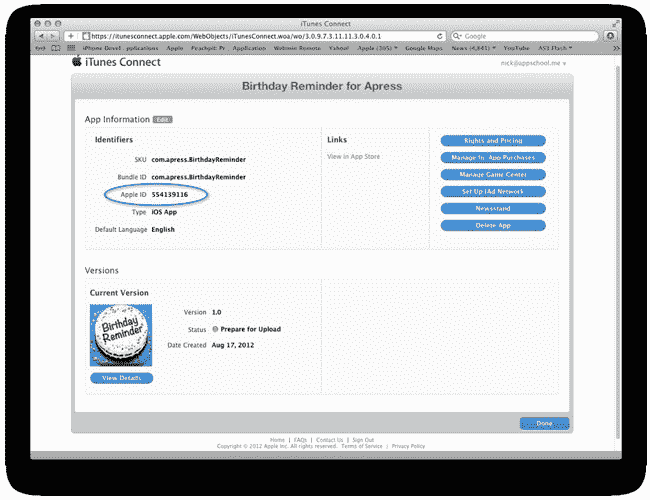

**图 14-12.** 我们的应用程序现在有了 Apple ID，且我们的应用程序提交通道处于 `Prepare for Upload` 状态

在我们能安坐并等待应用程序送达 Apple 审核员之前，我们还有一些工作要做。点击图 14-12 中显示的 `View Details` 按钮，将带您进入您在应用程序提交表格中输入的所有详细信息（参见图 14-13）。

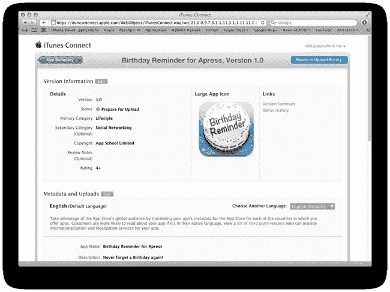

**图 14-13.** 关于我们应用程序 1.0 版本的详细信息

现在点击 `Ready to Upload Binary` 按钮。您首先需要回答“否”，确认您的应用程序没有集成或包含密码学功能，但是一旦您点击 `Save` 按钮，您就完成了在 `iTunes Connect` 中提交应用程序到 Apple 队列之前所需的所有步骤。您的应用程序状态将变为 `Waiting For Upload`。

### 准备应用程序以提交至 App Store

为了编译一个准备分发的、符合 App Store 要求的应用程序，您首先需要像在第 2 章中那样访问 Apple 的配置门户网站（[`https://developer.apple.com/ios/manage/overview/index.action`](https://developer.apple.com/ios/manage/overview/index.action)）。

在第 2 章中，我们创建了一个**开发证书**和一个**开发配置文件**。既然我们已经准备好将应用程序提交到 App Store，如果您还没有的话，现在您需要重复完全相同的流程，但这次要生成一个用于 App Store 提交的**分发证书**和一个**分发配置文件**。在配置门户中，您会发现 `Certificates` 和 `Provisioning` 部分都有一个 `Distribution` 选项卡。生成分发证书和 App Store 配置文件的流程与第 2 章中描述的流程几乎完全相同，只是设备选择在 App Store 配置文件中被禁用了（参见图 14-14）。

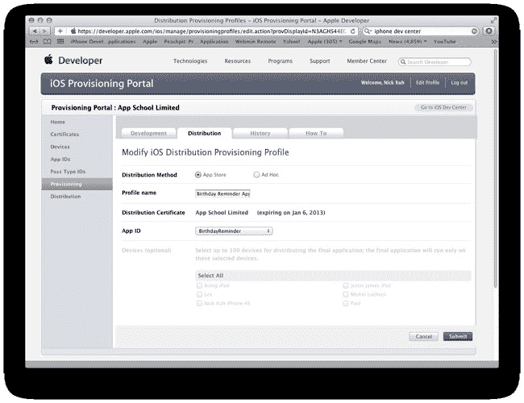

**图 14-14.** 为我们的应用程序创建 App Store 配置文件

您创建了您的分发证书和 App Store 配置文件了吗？请确保您已下载并双击这两个文件进行安装。

将应用程序二进制文件提交到 App Store 的流程要求我们归档我们的 *Birthday Reminder* 项目，然后用我们的分发证书和 App Store 配置文件对归档构建进行签名。所有归档构建都可以通过 `Xcode` 的 `Organizer` 窗口访问。

不幸的是，只有当我们通过 `BirthdayReminder-Info.plist` 文件添加对图标的引用时，`Xcode` 的 `Organizer` 才会识别并在应用程序归档旁显示我们的应用程序图标。因此，我们打算对项目做一个小改动，通过 `plist` 文件来引用图标。最简单的方法是让 `Xcode` 为我们完成。首先，打开 `resources/images` `Xcode` 组，滚动到我们项目中图片资源列表的底部。多选 `Icon.png` 和 `Icon@2x.png`，然后按键盘上的 `Delete` 键。从对话框中选择 `Move to Trash` 选项，如图 14-15 所示。

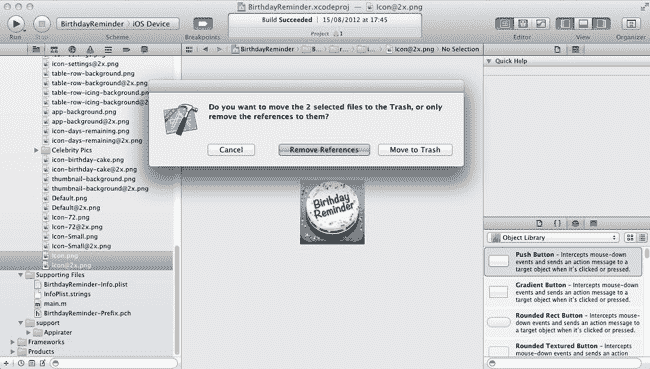

**图 14-15.** 从项目中临时删除图标

现在，在 `Xcode` 的项目导航器中选择您的 *Birthday Reminder* 项目，然后选择 *Birthday Reminder* 目标。向下滚动摘要面板，直到到达 `App Icons` 部分（参见图 14-16）。在访达中，打开本章源文件的 `assets` 文件夹，然后将 `Icon.png` 拖放到第一个图标托盘中，将 `Icon@2x.png` 拖放到第二个图标托盘中，如图 14-16 所示。

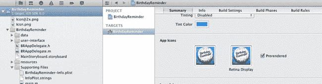

**图 14-16.** 将图标导入到我们的项目中，这些图标将出现在 `info plist` 中

正如您在图 14-17 中看到的，这个导入过程自动在我们的项目的 `info plist` 中生成了新的数据条目，引用了这两个主要的图标。

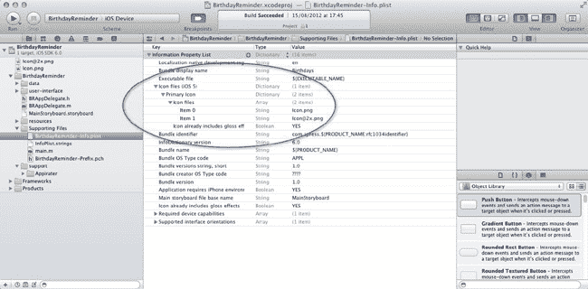

**图 14-17.** 主图标文件引用已自动添加到 `BirthdayReminder-Info.plist`

### 创建项目的归档构建

为了创建您的 *Birthday Reminder* 项目的归档构建，您需要将活动方案设置为您的 iPhone 设备，而不是模拟器，如图 14-18 所示。

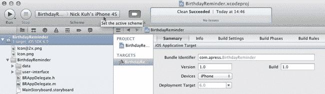

**图 14-18.** 将活动方案设置为“iOS Device”，或者如果您的 iPhone/iPod 已连接到 Mac，则设置为您的设备

现在，使用菜单命令 `Product -> Archive` 创建一个归档构建。当归档构建完成后，`Xcode` 会自动打开 `Organizer` 窗口并显示“Archives”选项卡（参见图 14-19）。

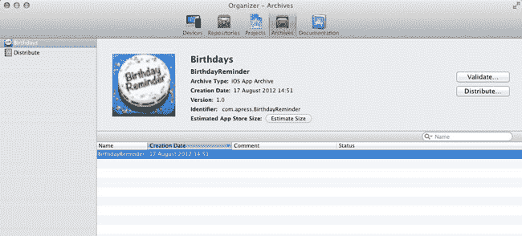

**图 14-19.** `Xcode` 的 `Organizer` 窗口中的项目归档

`Xcode` 会存储您所有的归档项目。这意味着，如果您出于测试目的需要访问某个项目的旧版本构建，您可以通过 `Organizer` 访问它。

准备好上传并提交您的应用程序了吗？还有最后一步！

### 签名并上传构建版本

在归档构建窗口中选中你的`Birthday Reminder`应用后，点击`Distribute`按钮。系统将显示三个选项，如图 14-20 所示。

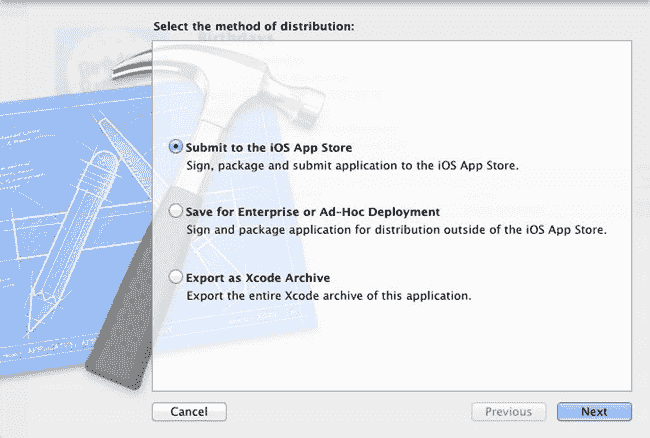

**图 14-20.** 导出 App Store 构建、Ad-Hoc 构建或 Xcode 归档

你的项目有以下三种分发选项：

> - **提交至 iOS App Store**：接下来我们将学习此流程的具体运作方式。
> - **保存用于企业或 Ad-Hoc 部署**：你可以创建并分发应用的发布构建版本，无需经过 App Store。企业应用可安装到任何 iOS 设备，但需要使用 iOS 企业许可证证书签名。Ad-Hoc 构建是一种发布版本，用于分发到已添加到 Ad-Hoc 分发配置文件中的设备。你可能有一群 Beta 测试人员，希望在提交 App Store 之前先向他们分发应用。
> - **导出为 Xcode 归档**：导出 Xcode 归档会将你的应用与一个`dSYM`文件打包在一起，使团队中的其他开发者能够测试你的应用、获得调试访问权限，以及分析详细的崩溃报告。有些第三方系统（如 Test Flight）要求你导出并上传 Ad-Hoc 应用的`dSYM`文件，以便在所有 Beta 测试者运行你的应用时进行远程调试。

我们将保留默认选项`提交至 iOS App Store`，然后点击`Next`按钮。Xcode 会要求你登录你的 iOS 开发者账户。完成登录后再次点击`Next`。

只要你已从配置门户成功安装了有效的 iOS 分发证书和 App Store 配置文件，此时你应该会看到一个与图 14-21 相似的屏幕。

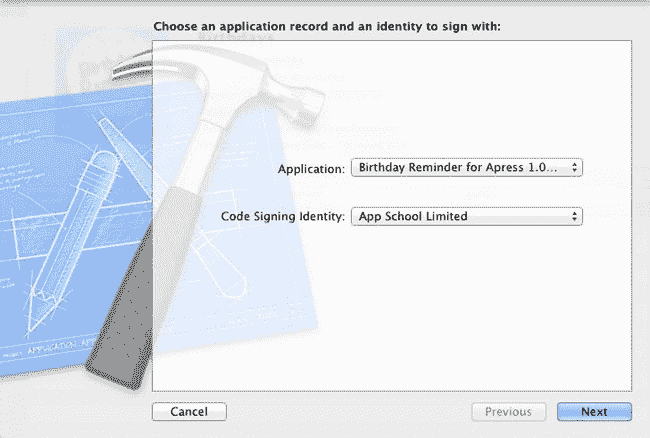

**图 14-21.** 准备对归档构建进行签名

第一个下拉菜单列出了待处理的 iTunes Connect 应用提交，这些应用与我们应用的捆绑标识符和捆绑版本相匹配。太好了！我们的`Birthday Reminder` 1.0 版本提交就在其中！

第二个下拉菜单应自动查找并自动选中你的分发证书。

点击`Next`进行提交。

我们的应用捆绑包将首先通过验证流程，检查配置文件及签名证书是否有效，以及我们是否包含了有效的应用图标。若验证失败，Xcode 将提供错误信息和修复建议。

假设一切正常，Xcode 随后会直接从 Organizer 窗口开始将你的应用上传到 iTunes Connect（见图 14-22）。

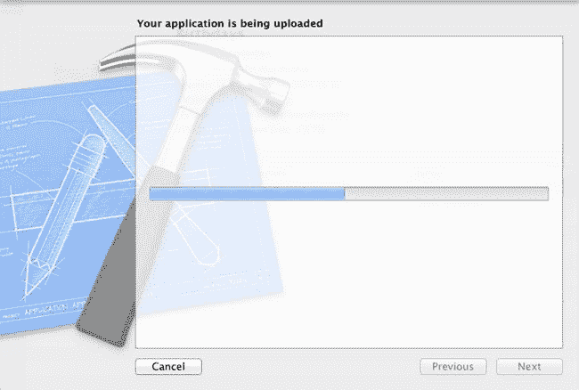

**图 14-22.** 将验证后的应用捆绑包从 Xcode 上传到 iTunes Connect

几分钟后（取决于应用的文件大小），上传应会完成。不久之后，你将收到一封来自 iTunes Connect 的自动邮件，主题为：Your App Status is Waiting for Review。

此时，你的应用已进入 App Store 提交队列。根据我的经验，每次新应用提交或更新等待 Apple 审核（批准或拒绝）的时间通常为连续七个工作日。有时我比较幸运，等待时间较短，偶尔也会超过第七天。

请注意：在圣诞节前夕提交应用时需谨慎——预计等待时间会更长，可能长达 14 天——因为 Apple 在节日前会收到大量新应用和应用更新。开发者们都希望在圣诞节当天新 iOS 设备用户激增之际从中获利！

### 但如果我在待审核的应用中发现了一个 Bug 怎么办？

这种情况经常发生。尤其如果你像我一样有点完美主义的话。你已经在提交队列中等待了三天，但你当然还在测试你的应用。突然，你发现了一个之前未曾注意到的 Bug。你在 Xcode 项目中修复了这个 Bug。很好。

但现在你面临一个两难境地：为了提交替换的二进制文件，你必须拒绝现有的二进制文件，上传新版本，然后不幸地再次回到 App Store 提交队列的最末尾。

要替换当前处于提交队列中的应用的二进制文件，你首先需要登录 iTunes Connect，访问应用详情页面，并点击`Binary Details`链接。二进制详情页面提供了一个`Reject this Binary`按钮链接，使你可以删除带有 Bug 的应用二进制文件，然后上传修复后的新应用。

### 总结

虽然我们现在已经完成了五天的课程，但对于应用开发者来说，真正的激动人心的时刻才刚刚开始。你构建了一个出色的应用。你已经提交了应用。大约一周后，你的应用将在 App Store 上线——可供数百万潜在 iPhone 用户下载。这是多么令人振奋的前景啊！

在第 13 章中，我们添加了许多应用内营销功能，以帮助推广我们的应用。但一旦应用公开上线，你还可以做更多事情：联系记者、告诉所有朋友、为你的应用创建 Facebook 页面和 Twitter 账户——仅举几例营销策略。

一旦应用上线，你还想跟踪应用的下载量、评分、评论，以及如果你创造了真正酷炫且原创的内容，Apple 可能给予的任何推荐。试试 AppAnnie.com，这是一个出色的 App Store 分析工具，可以跟踪你所有应用并每天通过邮件发送报告。或者，如果你是那种喜欢实时查看 App Store 分类排名的开发者，可以尝试 AppViz，这是一个出色的桌面工具，用于跟踪和缓存你所有的应用销售报告、统计数据及评论。

至此，我要向大家道别，并祝愿你们未来的 iPhone 开发者生涯好运。希望你们喜欢本书。你可以在 Twitter 上通过`@nickkuh`或我的网站[`www.nickkuh.com`](http://www.nickkuh.com)找到我。

## 索引

### A

应用开发，21

Apple 开发者论坛，24

Apple 开发者注册，22–24

设计与规划：
- 应用创意，4–5
- App Store 标题，6–7
- 竞品应用，5–6
- 图标设计，7–8
- 用户界面设计，8–18

iOS 开发者计划注册，24–25

iOS 配置门户，26
- App ID 创建，34–35
- 证书生成，27–32
- 配置文件生成，36–39
- 配置阶段，26–27
- UDID，32–34

iTunes Connect，24

Xcode，21–22

App Store，395
- Appirater 配置，399
  - 数字 ID，399
  - 静态表格章节创建，401
  - `tableView:didSelectRowAtIndexPath:` `UITableViewDelegate` 协议方法，402–403
  - 用户友好的 Appirater 提醒，400
- 评分，396
  - Appirater 插入，397
  - 自动引用计数，398
  - 生日提醒正式版，396
  - `CFNetwork.framework` 和 `SystemConfiguration.framework`，399
- 发送邮件，使用 `MFMailComposeViewController`，411–414
- 发送信息，使用 `MFMessageComposeViewController`，414–416
- `SLComposeViewController`，407
  - Facebook 分享，407–409
  - Twitter 分享，410–411
- 标题，6–7
- `UIActivityViewController` 分享集成，403
  - 多种分享选项，406
  - 分享内容，405
  - 静态表格视图章节，404
  - 表格单元格设置，407

自动引用计数 (ARC)，85, 398

### B

从通讯录导入生日，277
- `ABRecordID` 属性，317
- 访问和过滤联系人，293
- 通讯录数据隐私，294–296
- 创建生日导入值对象，300–307
- 联系人照片和数据加载，307–309
- 数据处理，296–300
- 插入新框架，294

通讯录应用，278
- Core Data 存储，314–317
- 删除操作，323
  - `actionSheet:willDismissWithButtonIndex:` 方法，324–325
  - `UIActionSheetDelegate` 协议，323–324
- 主页视图增强，278
  - 通讯录视图控制器，286–288
  - Apple 的 Clear 颜色，281
  - 属性，281
  - 创建大蓝色按钮，282
  - `BRHomeViewController.h`，282–284
  - 取消按钮，模态视图控制器，290
  - `dataSource` 和 `delegate` 输出口，291
  - 拖放子视图，280
  - 空数据库，279
  - Facebook 生日导入，286
  - 导入视图控制器，289
  - 原型表格单元格副本，288
  - 表格视图、导入视图和工具栏，285
- 导入代码逻辑，316
  - `kABPersonPhoneProperty` 属性，317
- 多选表格视图，309
  - `accessoryView` 属性，310
  - 自动大小遮罩，310
  - `isSelectedAtIndexPath:` 方法，312
  - 全选和取消全选按钮操作，313
  - `selectedIndexPathToBirthday` 属性，311
  - `tableView:didSelectRowAtIndexPath:` 方法，313
  - `updateImportButton` 方法，312
- 多任务应用，URL 方案和链接，318
  - 呼叫/短信/邮件按钮，322
  - `emailLink` 方法，319–320
  - `telephoneNumber` 方法，318
  - `viewWillAppear:` 方法，320–321
- 故事板中的视图控制器标识符，292–293

生日提醒应用，4, 144, 201
- 添加和编辑生日，4
- 通讯录和 Facebook 导入，4
- 数组释放，233
- 相机和相册，156
  - 操作表实现，162–163
  - 手势识别器，160–162
  - 图片视图容器，157
  - 图片视图渲染，167–168
  - `UIImagePickerController`，163–167
- 日期选择器更新监控，151
- 数据存储，216–219
- 重复实体与同步，219–222
- 编辑生日视图，144
- 实体

定义，204–206

扩展，206–210

框架插入，201–202

图标设计，7–8

模型创建，202–206

模型初始化，210–213

多行文本视图，151–154

笔记保存，231–233

笔记记录选项，4

通知时间视图控制器，154

日期选择器，作为时间设置控件，155–156

多行居中标签，154

属性和方法，207

提醒通知，5

表视图连接，使用 `NSFetchedResultsController`，213–216

文本字段配置，146

启用和禁用保存按钮，149–150

键盘，146–148

跟踪和响应文本更改，148

切换开关，150

从字典过渡到实体，222

`Birthday` 详情视图控制器，223

`Birthday` 编辑视图控制器，223–225

取消 `Core Data` 更改，229

主视图控制器，230

创建图像缩略图，226–229

用户界面设计，8

应用设计，11–17

导出设计图像资源，17–18

`iOS GUI` `PSD` 文件，9

纸质原型设计，10–11

视网膜显示屏，9–10

`Xcode` 的 `Assistant Editor` 布局，145

二十一点游戏，63，111

向 `BJViewController` 添加按钮控件，71

卡片模型，82

`ARC`，85

枚举器，87–88

方法，88–91

`NSObject` 子类，82–85

声明指针和原始类型，85

注意事项，63

游戏模型，91

`BJDGameModel`，91–93

`BJViewController`，93

类方法，94–95

`MVC` 实现，93

通知中心，98–99

`Objective-C` 类别，95–98

`getCardImage` 方法，90

实现，99

模型表示，99–105

协议和委托模式，107–108

用户交互响应，105–106

`notifyGameDidEnd` 方法，98–99

`Objective-C`，72

数组，76–77

`Assistant Editor` 布局，72

工厂/便捷方法，79–80

头文件和源文件，73

初始化器和指定初始化器，77–78

方法声明语法，89

创建私有类接口，75

属性和 `iVars`，74–75

开关多方向支持，80–81

目标-动作，71

游戏流程，63–64

`UIAlertView`，107

视图创建，64

动作，71–72

背景颜色，64–65

最终布局，67

图像视图，66

标签视图，65–66

输出口连接，68–70

`Xcode`

自动生成的 `Objective-C` 代码，73

目标-动作代码，71

`BRHomeViewController`，表视图，175–176

`BRSettingsViewController`，静态表视图控制器，372

### C

`Card` 模型，二十一点游戏，82

`ARC`，85

枚举器，87–88

`getCardImage` 方法，90

方法，88–91

`NSObject` 子类，82–85

Objective-C，方法声明语法，89

指针和原始类型声明，85

`Core Data`，193

应用程序创建，194–195

基本模型，197

`Birthday Reminder` 应用，201

数组处理，233

数据存储，216–219

重复实体与同步，219–222

实体扩展，206–210

框架引入，201–202

模型创建，202–206

模型初始化，210–213

笔记保存，231–233

表格视图连接，使用 `NSFetchedResultsController`，213–216

从字典到实体的转换，222–230

描述，194

实体，200

删除，201

编辑，200

插入，200

以及托管对象，197

保存，201

初始化，198–199

托管对象上下文，200

持久化存储，195–196

存储类型，195

扁平二进制文件，195

内存中，195

SQLite 数据库，195

表格样式编辑器视图，198

`Core view controller`，iOS 皮肤定制，238–239

### D, E

`Dealloc`，124

`Designated initializer`，77–78

### F

Facebook 应用，327

账户框架，332

`BRDModel.m` 认证方法，334–335

授权访问，336

社交框架，333

社交网络账户类型，335

Facebook 主页发布视图控制器，355

`authenticateWithFacebook` 方法，363

栏按钮项，356

`BRDModel` 单例，362

`BRPostToFacebookWallViewController` 类，357–361

`BRStyleSheet` 类，361

启用/禁用“发布”按钮，362

导航控制器标识，357

`postToFacebookWall` 方法：，363

`postToFacebookWall:withFacebookID` 方法：，364–365

`viewWillAppear:` 方法，361

获取生日信息，337

`BRDBirthdayImport` 对象，338

`fetchFacebookBirthdays` 方法，334–335

`NSJSONSerialization` 类，340

登录过程，337

`SLRequest` 类，337

用户字典，340

用户表示形式，341

导入到 Core Data 存储，343

导入视图控制器，329

空的 Facebook 导入视图控制器，332

多选分镜场景，330

子类，331

新应用注册，327–329

在好友主页上发布的按钮，354–355

远程图片，344

`DownloadHelper` 类，346–349

`RemoteFile` 类别，344

`setImageWithRemoteFileURL:placeHolderImage:`，350–352

`UIImageView` 类，344–346

表格视图好友列表，341–343

### G

游戏模型，二十一点游戏，91

`BJDGameModel`，91–93

`BJViewController`，93

类方法，94–95

MVC 实现，93

通知中心，98–99

Objective-C 类别，95–98

### H

Hello World 分镜，50–55

主页视图控制器，230

### I, J, K, L

`Initializer`（初始化器），77–78

`iOS Developer Program`（iOS 开发者计划）注册，24–25

`iOS Provisioning Portal`（iOS 配置门户），26

- `App ID`（应用标识符）创建，34–35
- 证书生成，27–32
- 配置描述文件生成，36
- `Ad Hoc`（临时）分发，39
- `Birthday Reminder`（生日提醒）开发，36–38
- 配置阶段，26–27
- `UDID`（唯一设备标识符），32–34

`iOS`（iOS 系统）界面美化，235

- 按钮，266–267
- `Core Animation`（核心动画）图层属性，249
- 核心视图控制器创建，238–239
- 自定义表格视图单元格，239
- 创建，240
- 裁剪方形缩略图与自定义标签，247
- 剩余天数背景图像视图配置，241
- 图标图像视图配置，241
- 身份检查器，245
- 标签，242
- 插座变量，245
- `Photoshop`（设计软件）设计，240
- 原型单元格、标签与图像视图，242
- 子类化 `UITableViewCell`（表格视图单元格），243

自定义导航栏与工具栏外观，253

- `Appearance APIs`（外观 API），254–256
- 容器样式，256–258
- `UIBarButtonItems`（工具栏按钮项）图像图标，254
- `Image Views`（图像视图），265
- `Label Views`（标签视图），265–266
- 可点击应用，236–238
- `QuartzCore`（核心图形）框架，249
- 美化按钮，272
- 蓝色与红色按钮，273
- 子类、身份检查器，272
- 样式表，259
- 提醒时间视图样式，259
- 生日详情视图，262
- 生日编辑视图样式，260
- 创建，248–253
- 备注编辑视图样式，260–262
- 滚动视图与可滚动内容，263–269
- 样式化文本与圆角图像视图，253
- 表格视图单元格背景图像，247–248
- 文本大小计算，270–272
- 着色栏按钮项，257

`iPhone`（iPhone 手机）应用导航，111

- 多视图应用，111–112
- 视图控制器，113
- 栏与栏按钮项，124–127
- 类创建，117–121
- 生命周期，121–124
- 模态视图控制器，127–133
- 导航控制器，113–114
- 笔记视图，137–139
- 根视图控制器，114–115
- 转场，115–117
- 设置视图，139–141
- 子类化，133–137

`iPhone`（iPhone 手机）应用。*另请参阅* `iTunes`（iTunes 应用）应用

- 应用评分，425–426
- `App Store`（应用商店）提交
  - 删除图标，431–432
  - 导入图标，432
  - 主图标文件引用，433
  - 配置描述文件，430–431
- 归档构建项目
  - `iOS`（iOS 系统）设备，433
  - `Xcode`的`Organizer`（组织器）窗口，434
- 配置版本信息
  - `App Store`（应用商店）类别，424
  - 选择，424–425
- 描述与元数据
  - 输入数据，426–427
  - 关键词，427
- 排期与定价应用
  - 应用表单，421
  - 延迟，422
  - 矩阵链接，422
  - 特定商店链接启用，422–424
- 截图与`iTunes`（iTunes 应用），427–429
- 签名与上传应用
  - 分发选项，435
  - 待处理应用，437
  - 签名，436
  - `Xcode` `Archive`（Xcode 归档），435
  - `Xcode`-`iTunes Connect`（Xcode 与 iTunes Connect），436–437
- 步骤，417

`iTunes`（iTunes 应用）应用

- `App Name`（应用名称），419–420
- `App Store`（应用商店）名称，418–419
- `Apple ID`（苹果账户），429–430
- 基础语言，419
- 包标识符（Bundle Identifier），420
- 主屏幕，417–418
- `SKU`（库存单位）字段，420
- `Upload`（上传）状态，429
- `iTunes Connect`（iTunes Connect 平台），6–7, 24

### M

`Managed object context`（托管对象上下文），200

`MFMailComposeViewController`（邮件撰写视图控制器），411–414

`MFMessageComposeViewController`（信息撰写视图控制器），414–416

`Modal`（模态）视图控制器

- 关闭，130
- 反向往转场（Unwind Segues），130–131
- 通过代码实现，131–133
- 呈现，127–129

`Multiview`（多视图）应用，111–112

### N

`Notification time view controller`（通知时间视图控制器），154, 379

- 日期选择器（作为时间设置控件），155–156
- 多行居中标签，154

`NSFetchedResultsController`（获取结果控制器），213–216

### O

Objective-C，72  
二十一点游戏，72  
数组，76–77  
辅助编辑器布局，72  
工厂/便捷方法，79–80  
头文件和源文件，73  
初始化方法和指定初始化方法，77–78  
私有类接口创建，75  
属性和实例变量，74–75  
关闭/开启多方向支持，80–81  
方法声明语法，89

### P, Q

前缀头文件，49  
项目结构，Xcode，46–47  
应用委托，47–48  
`Info.plist`，48–49  
前缀头文件，49  
故事板，49

### R

根视图控制器，114–115，369

### S

Segue 标识符，184–186  
设置视图控制器，377–378  
`SharedInstance` 类方法，374  
单例类，373  
`BRDaysBeforeViewController.m`，379–381  
`BRDSettings.m` 源文件，374–377  
创建，374  
描述，373  
通知时间视图控制器，379  
`NSUserDefaults` 类，373  
设置视图控制器，377–378  
`sharedInstance` 类方法，374  
Xcode，377  
`SLComposeViewController`  
Facebook 分享，407–409  
Twitter 分享，410–411  
静态表格视图控制器，367  
生日更新，381–384  
`BRSettingsViewController`，372  
单元格创建，370  
本地通知，384  
头文件修改，385  
辅助方法，385  
图标徽章重置，390  
`reminderDateForNextBirthday:` 方法，385–386  
`reminderTextForNextBirthday`，386–387  
计划显示，384  
`UILocalNotification` 实例，388–389  
`updateCachedBirthdays` 方法，387–388  
行修改，370  
Segue 导航创建，371  
设置视图问题，371  
单例类，373  
`BRDaysBeforeViewController.m`，379–381  
`BRDSettings.m` 源文件，374–377  
创建，374  
描述，373  
通知时间视图控制器，379  
`NSUserDefaults` 类，373  
设置视图控制器，377–378  
`sharedInstance` 类方法，374  
Xcode，377  
故事板，367  
新建设置场景，369  
根视图控制器关系，369  
设置视图控制器类文件，368  
故事板，49  
Hello World，50–55  
静态表格视图控制器，367  
新建设置场景，369  
根视图控制器关系，369  
设置视图控制器类文件，368  
样式表，iOS 界面定制，259  
提醒时间视图样式，259  
生日详情视图，262  
生日编辑视图样式，260  
备注编辑视图样式，260–262  
滚动视图与可滚动内容，263–269

### T

表格视图，171  
数组与属性列表，178  
生日插入，186–189  
通过 Segue 传递数据，182–184  
指定初始化方法，179–180  
动态生成数据，181  
编辑已有生日，190–191  
行值，180  
Segue 标识符，184–186  
`self.birthdays` 数组，180  
生日提醒应用，172  
名人图片与`birthdays.plist`资源，173  
单元格背景图片，iOS 界面定制，247–248  
通过 `NSFetchedResultsController` 连接，213–216  
数据源与委托协议，175  
`BRHomeViewController`，175–176  
行高修改，178  
表格行，177  
主视图，173  
原型单元格设置，174  
可复用原型表格单元格设置，174

### U

唯一设备标识符（`UDID`），32–34

用户界面设计，8

- 应用设计，11
  - 添加/编辑生日详情视图，14–15
  - 生日详情视图，13–14
  - Facebook 集成，15–16
  - 主页视图，12–13
  - 设置视图，16
- 相机和照片库，156
  - 操作表实现，162–163
  - 背景设置，157–159
  - 手势识别器，160–162
  - 图像视图容器，157
  - 图像视图渲染，167–168
  - `UIImagePickerController`，163–167
- 控件与组件，143
  - 编辑生日视图，144–151
  - 多行文本视图，151–154
- 设计图片资源导出，17–18
- iOS GUI PSD 文件，9
- 纸质原型设计，10–11
- Retina 显示屏，9–10

### V, W

视图控制器，113

- 栏与栏按钮项，124
  - 导航栏，124–125
  - 工具栏，125–127
- 类创建，117
  - `BRViewController` 文件，121
  - 自定义类设置，120
  - 继承 `UIViewController`，117–119
- 生命周期，121
  - 生日详情视图控制器，122–123
  - `dealloc`，124
  - 初始化器，123
  - 方法，121
  - `viewDidLoad` 方法，123
- 模态视图控制器
  - 关闭，130–133
  - 呈现，127–129
- 导航控制器，113–114
- 笔记视图，137–139
- 根视图控制器，114–115
- 转场，115–117
- 设置视图，139–141
- 子类化，133
  - 优势，136
  - 多转场连接，137
  - 保存栏按钮项，135
  - 两个界面构建器操作方法，133–135

### X, Y, Z

`Xcode` 项目，21–22

- Apple 开发者门户，42
- 二十一点游戏
  - 自动生成的 Objective-C 代码，73
  - 目标-动作代码，71
- 文档，42、43
- Hello World 故事板，50–55
- 图标与启动画面，55
  - 捆绑显示名称属性，60
  - 图片资源插入，55–57
  - iOS 模拟器，“生日提醒”图标，58
  - Retina 与非 Retina 版 iPhone，58
- 新建项目，42、43–46
- 项目结构解析，46–47
  - 应用程序委托，47–48
  - `Info.plist`，48–49
  - 前缀头文件，49
  - 故事板，49
- 仓库，42
- 在 iPhone 上运行应用程序，60–61
- 单例类，377
- “欢迎使用 Xcode”窗口，42
