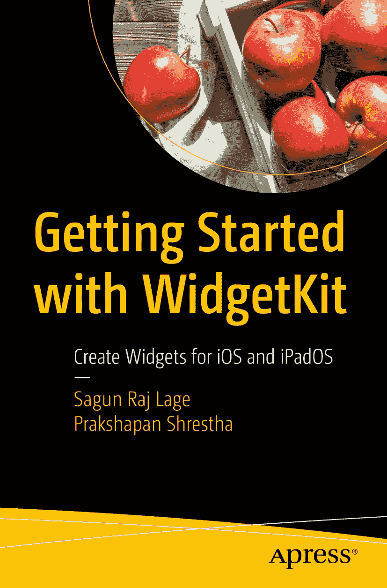

ISBN 978-1-4842-7041-7 e-ISBN 978-1-4842-7042-4 [`doi.org/10.1007/978-1-4842-7042-4`](https://doi.org/10.1007/978-1-4842-7042-4)

Apress 标准版

© Sagun Raj Lage 与 Prakshapan Shrestha 2021 本作品受版权保护。所有权利均独家授权予出版社，无论涉及材料整体或部分，具体包括翻译权、重印权、插图再利用权、引用权、广播权、微缩胶片或其他物理形式的复制权，以及信息存储与检索的传输权、电子改编权、计算机软件权，或目前已知或未来开发的类似或不同方法论。在本出版物中使用通用描述性名称、注册商标、商标、服务标记等，即使未作明确声明，也不意味着此类名称不受相关保护性法律法规的约束，因此可自由用于一般用途。出版商、作者及编辑可以合理假设，本书中的建议和信息在出版之日是真实准确的。出版商、作者及编辑均不对本文所含内容或可能存在的任何错误或疏漏提供明示或暗示的担保。出版商对已出版地图中的管辖权主张及机构隶属关系保持中立。

本 Apress 印记由注册公司 APress Media, LLC（Springer Nature 的一部分）出版。

注册公司地址为：1 New York Plaza, New York, NY 10004, U.S.A.

谨以此书献给我的父亲，已故的 Shree Ram Lage，我的榜样、我的灵感、我的骄傲，他教会了我责任与担当的意义。希望我能让您感到骄傲，爸爸。

献给我的母亲 Jamuna Laxmi Sitikhu (Lage)，我的支持系统，她与困境为友，教会我勇敢面对挑战。我知道您为了成就今天的我付出了许多牺牲，妈妈。

献给我的妹妹 Sarina Lage，无论高潮低谷、喜悦悲伤，她始终陪伴在我身边。我知道未来的日子里你也会一如既往地支持我。我爱你们。

献给我的祖父母 Ganga Laxmi Sitikhu 和 Narayan Bhakta Sitikhu，他们始终用珍贵的祝福和无条件的爱滋养着我。

献给我的叔叔和阿姨们：Narayan Prasad Sitikhu 与 Ram Devi Sitikhu，Sunil Kharbuja 与 Srijana Kharbuja，Krishna Prasad Bohaju 与 Rejina Bohaju，感谢他们全心全意给予我指引和关爱。

献给从小点燃我对电脑、电子设备和技术兴趣的人——我的叔叔 Jibesh Sitikhu。没有您的奉献、教导、谈话以及多次拆坏您的电脑，就不会有今天的我。也献给我的阿姨 Rajyashwori Sitikhu，您是仁慈与爱的典范。

献给我可爱的堂表亲们：Bigyan Sitikhu, Sachin Bohaju, Binam Sitikhu, Salin Bohaju, Shrijal Kharbuja, Jibisha Sitikhu, Swornim Kharbuja, Jibika Sitikhu, Raunak Sitikhu, 和 Raunika Sitikhu。你们让我的生活充满欢乐。我爱你们大家。

献给我情同手足的兄弟 Kshitij Raj Lohani，他始终无私地帮助我，并允许我远在尼泊尔使用他在美国的个人 MacBook Pro 将近一年。正是因为他让我使用他的电脑（而我当时买不起），我才得以参加 iOS 训练营、撰写 iOS 开发博客并完成本书。

献给我所有的老师、前辈、导师、朋友和后辈们。你们是我的珍宝。能拥有你们是我人生的福气。感谢一切！

—*Sagun Raj Lage*

献给我亲爱的母亲。

—*Prakshapan Shrestha*

