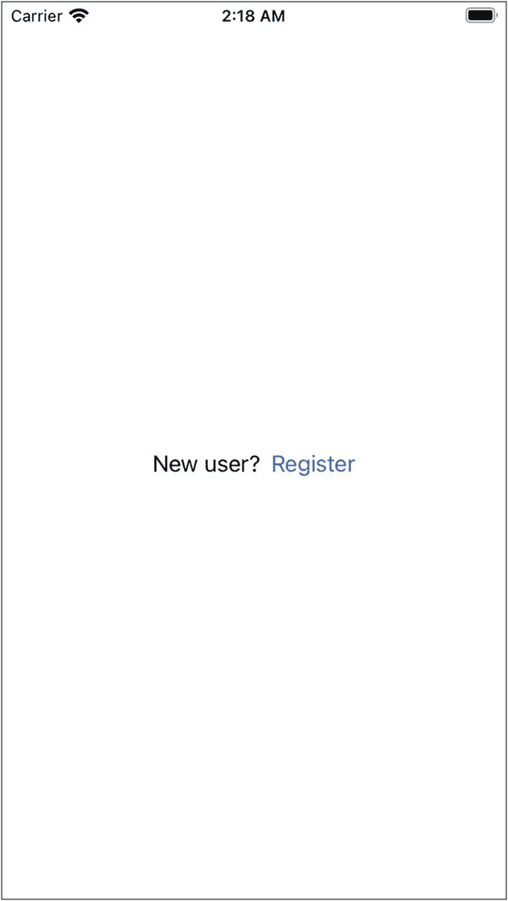
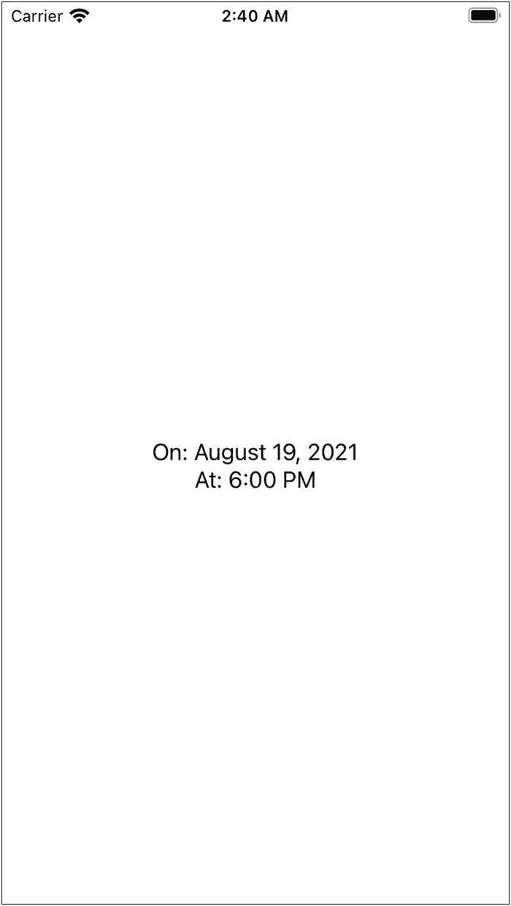

# 2. SwiftUI、人机界面指南和小组件系列

既然你对 `WidgetKit` 有了大致了解，就可以继续学习小组件的一些基本构建块了。在本章中，你将学习一些作为小组件构建块的 `SwiftUI` 视图。然后，你将了解 Apple 的《人机界面指南》中关于创建直观、易学且一致的小组件用户界面的概述。除此之外，你还将进一步了解 `WidgetFamily`，它使你能创建各种尺寸的小组件。

## SwiftUI

在 2019 年全球开发者大会上，Apple 推出了 `SwiftUI`——一个为 iOS App 开发方式带来重大变革的框架。在 `SwiftUI` 引入之前，开发者们一直在争论应该使用 Storyboard 还是以编程方式开发 App 界面。`SwiftUI` 平息了这场争论，带来了一种新的、更简单的方法，通过赏心悦目的动画和过渡来创建美观且交互式的用户界面。请注意“新的、更简单的方法”这个说法。使用 `SwiftUI` 开发 App 之所以更简单，主要有三个原因：

1.  **`SwiftUI` 采用声明式编程方法**：声明式方法允许你描述 App 的用户界面是什么样子，以及当状态改变时你希望 App 做什么，而无需涉及太多细节。这减少了代码量，使其更易于阅读、理解和修改。在 `SwiftUI` 之前，我们使用命令式编程方法，这意味着我们必须编写详细的分步指令来布局用户界面和控制状态。这通常会导致代码量庞大。有了 `SwiftUI`，事情变得简单多了。

2.  **告别 Storyboard 和 Auto Layout**：在 `SwiftUI` 之前，不喜欢以编程方式开发用户界面的开发者使用 Storyboard。使用 Storyboard 是一种不错的方式，但使用 Auto Layout 来使 App 界面在所有屏幕尺寸上看起来一致是一件麻烦事。但现在，`SwiftUI` 引入了许多视图（如堆栈和间距器）及其属性（如内边距），使得以更少的精力就能让用户界面看起来一致。

3.  **一次学习，随处应用**：`SwiftUI` 是一个统一的用户界面框架，用于为所有类型和尺寸的 Apple 设备构建用户界面。这意味着你可以将为 iOS 编写的界面代码轻松移植到 macOS 或 watchOS 上，而无需修改或只需进行极少的修改。在 `SwiftUI` 推出之前，我们必须使用不同的框架来为不同平台开发 App——`UIKit` 用于 iOS，`AppKit` 用于 macOS，`WatchKit` 用于 watchOS，以及 `TVUIKit` 用于 tvOS。

基于这些原因，我们认为 `SwiftUI` 值得被称为“救星”。

在 `SwiftUI` 中，视图充当 App 用户界面的可视构建块。它们用于在 App 中显示文本、图像、形状和图形。一些视图如 `TextField`、`Button`、`Slider` 和 `Picker` 甚至允许用户与之交互以操纵数据和用户界面。更有趣的是，你可以组合两个或更多视图来创建复杂的视图。

小组件也是使用 `SwiftUI` 开发的。因此，你将使用 `SwiftUI` 的视图来让你的小组件栩栩如生。有各种各样的视图可用于开发小组件。不过，了解一些更常用的基本视图就足够了。

### 用于小组件的基本 SwiftUI 视图

让我们来了解一下常用于创建小组件的一些基本 `SwiftUI` 视图。

#### Text

你可以使用 `Text` 在 App 或小组件中显示一行或多行只读文本。例如，如果你希望 App 或小组件显示文本“SwiftUI is fun!”，你可以编写 `Text("SwiftUI is fun!")`。你还可以通过使用其方法（如 `font()`、`italic()`、`bold()`、`lineLimit()` 等）来修改文本和视图的外观及大小。

#### Button

`Button` 是用户界面中最常用的组件之一。它能够在通过事件触发时执行一个操作。它的初始化器接受两个参数——一个操作和一个标签。让我们编写一些代码来创建一个打印“Buttons are good!”的按钮。

在清单 2-1 中，按钮包含一个在触发时打印“Buttons are good!”的操作。

```
Button(action: {
print("Buttons are good!")
}) {
Text("Tap me")
}
清单 2-1
SwiftUI 中的按钮
```

第二个参数是一个 `Text` 视图，它为按钮提供了标题。但是，你可以在这里使用其他视图来改变按钮的构成，并利用按钮提供的各种方法来改变其外观和大小。

你在想哪里可以在小组件中使用按钮吗？假设你有一个待办事项列表 App，你的小组件需要显示尚未完成的项目。你计划用每个项目由一个空复选框后跟文本表示。那么，在这种情况下，你可以使用一个按钮来创建复选框，点击该复选框即可将该项目从待办事项列表中移除。很简单，对吧？


### 图像

`Image`视图的名称直观地表明了它的用途：在应用或小组件中展示图片。在后续课程中，你将创建显示足球俱乐部标志的小组件，届时就会用到`Image`视图。

`Image`视图提供了多种方法来设置它所持有图片的样式。

你可以通过`Image(uiImage: UIImage)`初始化器加载存储在`Assets.xcassets`文件夹中的图片。例如，如果图片名为"background"，你可以在`Image`视图中这样加载它：`Image(uiImage: #imageLiteral(resourceName: "background"))`。

`Image`视图初始化器还有另一种变体，它允许你加载 Apple 提供的系统符号图片。该初始化器接受一个`String`参数，即你想要使用的系统符号图片的名称。

例如，如果你想加载垃圾桶图标，可以使用其系统符号名称`"trash"`，并通过编写`Image(systemName: "trash")`将其传入初始化器。

**提示**

你可以使用 SF Symbols³ 应用查找系统符号图片的名称。

### HStack

`HStack`是一种将其子视图水平排列的视图。它允许你创建一个水平堆栈，将视图并排放置。在后续章节中，你将使用`HStack`创建横向并排显示足球俱乐部名称和标志的视图。在代码清单 2-2 中，你将创建一个包含`Text`和`Button`的`HStack`。

```
HStack {
    Text("New user?")
    Button(action: {
        print("Register button is tapped.")
    }) {
        Text("Register")
    }
}
代码清单 2-2
HStack 的使用示例
```

代码清单 2-2 展示了`HStack`的使用实例。该`HStack`包含一个显示"New user?"的`Text`视图，后跟一个显示"Register"的按钮。图 2-1 展示了代码清单 2-2 的运行结果截图。


图 2-1
一个显示`Text`和`Button`的`HStack`

`HStack`允许你更改项目之间的间距和项目的对齐方式。

### VStack

`VStack`使你能够创建垂直堆叠的视图。在后续章节中，你将使用`VStack`垂直显示即将到来的足球比赛的日期和时间。你编写的代码将与代码清单 2-3 中的代码类似。

```
VStack {
    Text("On: August 19, 2021")
    Text("At: 6:00 PM")
}
代码清单 2-3
VStack 的使用示例
```

代码清单 2-3 是创建垂直堆栈以显示即将举行的比赛日期和时间的代码。图 2-2 展示了代码清单 2-3 的运行结果截图。


图 2-2
一个显示两个`Text`视图的`VStack`

与`HStack`类似，`VStack`也允许你更改项目之间的间距和项目的对齐方式。

### ZStack

假设你想在图片上放置一些文本，这时`ZStack`就派上用场了！`ZStack`是 SwiftUI 中一种特殊的、用于重叠视图的堆栈。代码清单 2-4 展示了创建一个`ZStack`的代码，该`ZStack`将文本"Welcome"放置在图片上方。

```
ZStack {
    Image(uiImage: #imageLiteral(resourceName: "welcome-bg"))
    Text("Welcome")
}
代码清单 2-4
ZStack 的使用示例
```

在代码清单 2-4 中，我们将`Image`视图写在`Text`视图之前，因为我们希望`Text`视图显示在`Image`视图之上。图 2-3 展示了代码清单 2-4 的运行结果截图。


图 2-3
一个在`Image`视图上显示`Text`视图的`ZStack`

**注意**

你希望显示在前景的视图应写在`ZStack`代码块的最后一行。

`ZStack`允许你更改其中包含的子视图的对齐方式。但是，你无法更改项目之间的间距，因为这没有意义。

## 人机界面指南

人机界面指南（HIG）⁴ 是 Apple 为开发者提供的建议，用于开发具有直观、易于学习和一致用户界面的应用。你可以将 HIG 视为一本包含 Apple 平台用户界面开发“注意事项”的操作手册。

Apple 也为开发小组件准备了人机界面指南，它帮助你理解优秀小组件应具备的特质以及如何开发此类小组件。简而言之，人机界面指南建议如下：

*   让你的小组件专注于特定的想法或目的，并用于展示相关内容，以便用户无需启动应用即可一目了然地获取有用信息。同时，避免创建仅仅用于启动应用的小组件，因为应用图标已经具有此功能。此外，WidgetKit 允许你开发各种尺寸的小组件，但这并不意味着你总是应该开发所有尺寸的小组件。仅在能为你的应用增加价值时才这样做。

*   你可以允许小组件可配置。但仅当你的小组件需要用户配置以便提供最佳输出时，才使其可配置。关于小组件的另一个有趣特性是，你可以向其中添加点击目标，以便从小组件导航到相关屏幕。但是，避免添加过多的点击目标，因为这可能会导致糟糕的用户体验。

*   小组件的主要功能是显示新鲜内容。因此，务必通过分析数据变化频率以及估算用户查看小组件中更新数据的频率，来确定合适的更新频率。

*   你可以通过使用品牌颜色、字体和图标，让你的小组件在应用图标和小组件中脱颖而出。然而，在大多数情况下，在小组件中展示你的 Logo、文字商标或应用图标并无意义。同样，要确保内容密度看起来不拥挤，并且你的设计元素和颜色不会使用户难以查看小组件试图传达的信息。此外，支持深色模式、提供小组件真实的预览效果并附上恰当描述，以及使用占位内容来提升用户体验，都能在用户面前留下良好印象。

*   由于使用不同尺寸设备的用户会安装你的应用和小组件，因此你必须确保它们能很好地适应这些屏幕尺寸。为此，请根据人机界面指南中“Size images to look great on large devices and at high scale factors”标题下的尺寸表，调整你在小组件中使用的图片尺寸。⁵ 同时，确保你的文本和字形在各种屏幕尺寸下都能良好适配。并使用`ContainerRelativeShape`来确保小组件内容在其圆角内看起来美观。


## 小组件家族

至此，你一定已经知道 `WidgetKit` 框架允许你创建各种尺寸的小组件——小号、中号和大号。为此，你可以使用一个特殊的枚举 `WidgetFamily`。它包含三个成员——`systemSmall`、`systemMedium` 和 `systemLarge`。通过查看这些成员的名称，你可以轻松猜出哪个尺寸对应哪个成员。

这种多样的小组件尺寸赋予用户自由，让他们能够以自己喜欢的方式放置和配置小组件。由于每种尺寸的小组件内部可容纳不同的内容和信息量，因此像你这样的开发者可以自行决定要显示多少内容和信息。

为了让你大致了解如何利用 `WidgetFamily` 的三个成员来支持不同的小组件尺寸，我们从官方文档¹借用了部分代码并粘贴在代码清单 2-5 中。

```
struct GameStatusWidget: Widget {
    var body: some WidgetConfiguration {
        StaticConfiguration(
            kind: "com.mygame.game-status",
            provider: GameStatusProvider(),
            placeholder: GameStatusPlaceholderView()
        ) { entry in
            GameStatusView(entry.gameStatus)
        }
        .configurationDisplayName("Game Status")
        .description("Shows an overview of your game status")
        .supportedFamilies([.systemSmall, .systemMedium, .systemLarge])
    }
}
```
代码清单 2-5  
支持所有三种小组件家族的组件

你可以在代码清单 2-5 中看到，创建了一个名为 `GameStatusWidget` 的小组件。你可以忽略其他行，只需关注 `.supportedFamilies([.systemSmall, .systemMedium, .systemLarge])` 这一行。这行代码定义了你应用应支持哪些尺寸的小组件。

`supportedFamilies(_:)` 是 `WidgetConfiguration` 协议的一个实例方法。它接受一个 `WidgetFamily` 成员数组作为参数，用于设置小组件支持的尺寸。由于代码清单 2-5 中使用的 `StaticConfiguration` 结构体遵循 `WidgetConfiguration` 协议，因此它可以访问 `supportedFamilies(_:)` 来设置小组件尺寸。

因此，在代码清单 2-5 中，数组 `[.systemSmall, .systemMedium, .systemLarge]` 作为参数传递给了 `supportedFamilies(_:)`，从而将支持的尺寸设置为小、中、大号。

**提示**

我们知道，你在尝试理解我们之前描述的内容时可能会遇到困难。但别担心，因为我们将在后续章节的练习中使用它们。目前，你已经做得很棒了！

如果你希望你的应用只支持一种单一尺寸的小组件，这也是可行的。假设你希望应用只支持中号小组件，那么你可以创建一个包含 `.systemMedium` 成员的数组，并通过编写 `.supportedFamilies([.systemMedium])` 将其传递给 `supportedFamilies(_:)`。就这么简单！

## 总结

通过学习本章，你了解了哪些 SwiftUI 视图可以作为构建块来为你的应用创建小组件。同样，你了解了苹果针对小组件的《人机界面指南》，这让你熟悉了小组件的设计目的，并为你提供了开发直观、易学且一致性好的小组件用户界面的技巧。除此之外，你还进一步了解了 `WidgetFamily`，它使你能够创建各种尺寸的小组件。

下一章将教你一些重要的小组件概念——时间线与链接。但别担心——我们会全程指导你！

脚注  
1   2   3   4

