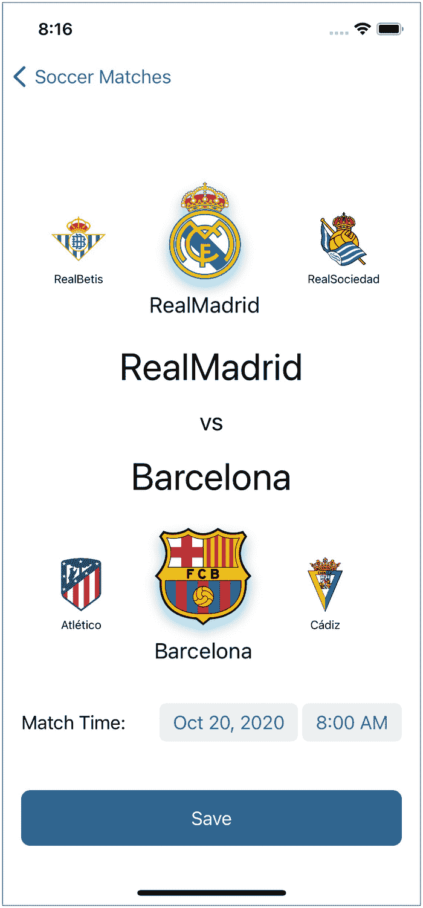
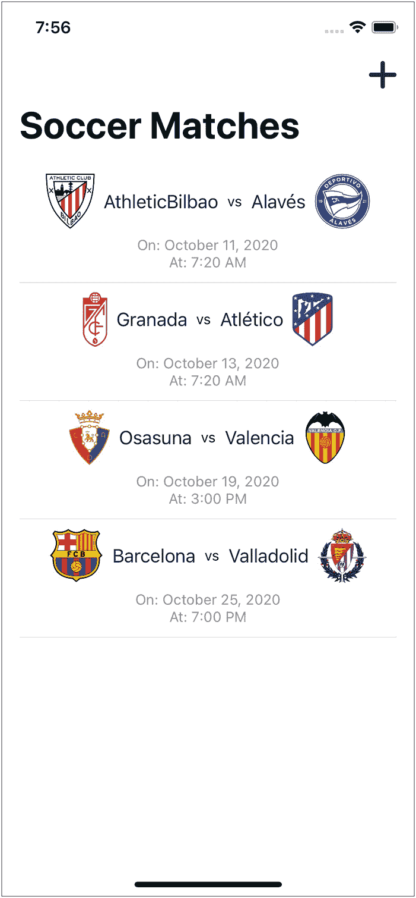
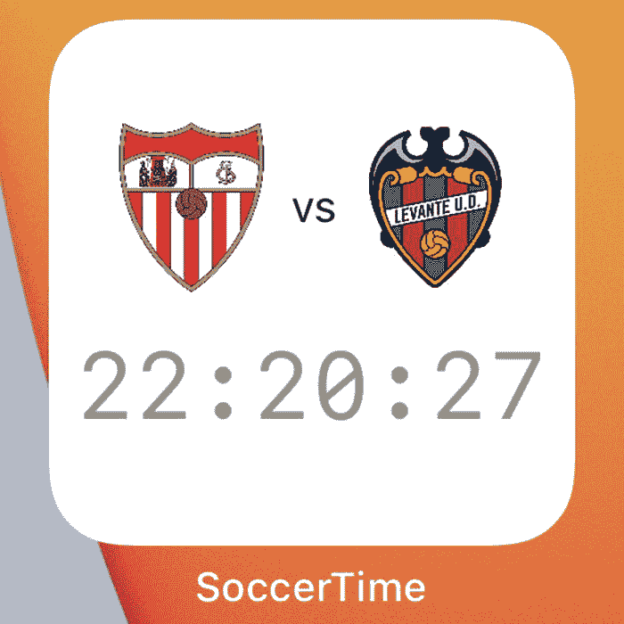
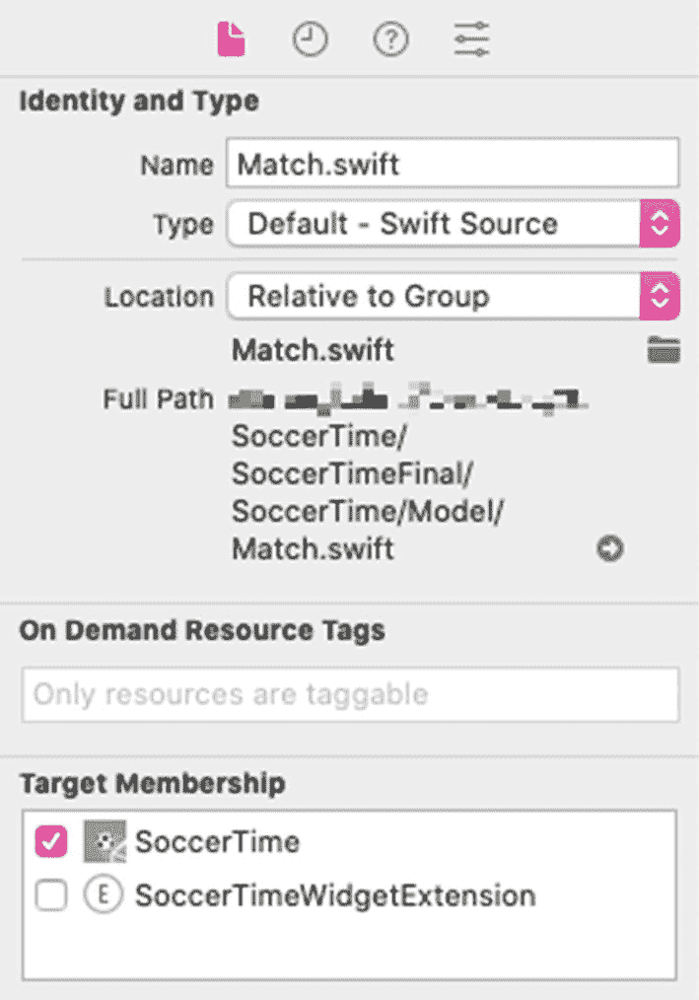
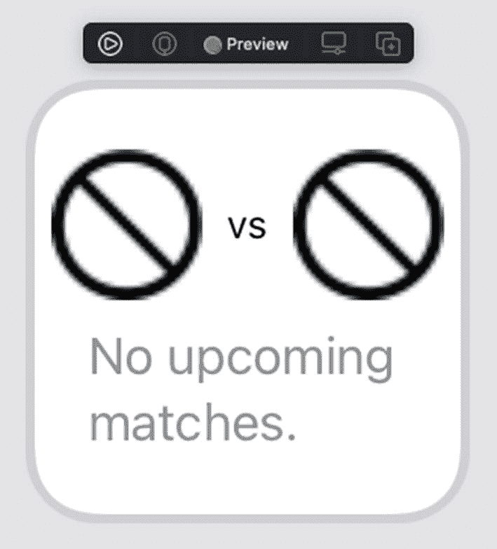
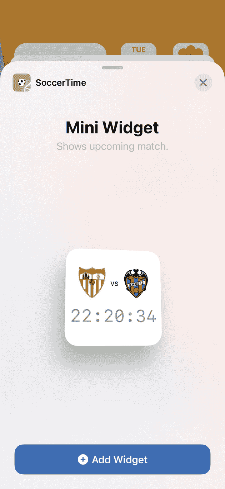
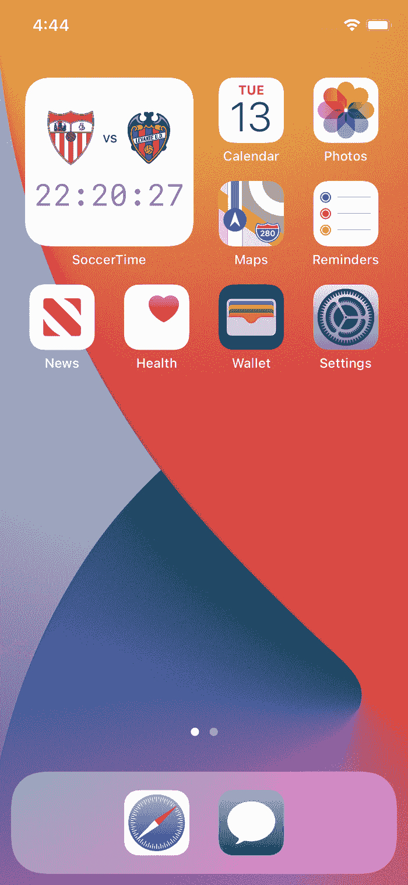

# 3. 编写你的第一个小组件

现在终于来到本章，你将通过实际操作一个项目来大展身手。在本章中，你将为一个现有项目创建小组件扩展，并拆解该扩展以了解其构成——时间线、时间线提供器、小组件视图、占位视图、快照和小组件配置。

我们准备了一个入门项目，以便你可以直接开始创建其小组件。找到名为 `SoccerTimeStarter.zip` 的压缩文件并解压，即可开始处理该项目。

如果你已经成功解压并打开了 `SoccerTimeStarter` 文件夹中的 `SoccerTime.xcodeproj` 文件，你会知道 `SoccerTime` 就是我们将要操作的项目。`SoccerTime` 是一个显示你喜爱球队即将进行的足球比赛详情的应用。它包含两个界面——一个用于添加即将到来的比赛（图 3-1），另一个用于显示你添加的比赛列表（图 3-2）。启动应用以更清晰地了解其功能。

  
图 3-2  
用户添加他们喜爱的即将到来比赛的界面

  
图 3-1  
显示 `SoccerTime` 中即将到来比赛列表的界面

现在有趣的部分来了——你将创建 `SoccerTime` 的小组件，它将显示你在应用中添加的即将到来比赛的信息。你将创建一个**小尺寸**的小组件，显示距离最近比赛的两队队徽以及比赛开始前的倒计时。该小组件将如图 3-3 所示。

  
图 3-3  
`SoccerTime` 的小尺寸小组件

因此，第一步是向项目添加一个小组件扩展，下一节将详细描述所有步骤。


## Widget 扩展

Widget 扩展是一个模板，提供基础结构和样板代码，帮助你开始创建应用的小组件。它容纳你创建的小组件。苹果建议开发者将应用的所有小组件包含在单个 Widget 扩展中。不过，如有必要，也可以创建多个 Widget 扩展。

请按照以下步骤为 `SoccerTime` 创建 Widget 扩展：


图 3-4

显示 `SoccerTimeWidgetExtension` 为所选方案的截图

1.  打开 `SoccerTime.xcodeproj`。
2.  前往 **文件** ➤ **新建** ➤ **Target** ➤ **iOS**。
3.  你可以向下滚动或使用筛选器找到 **Widget Extension**，然后双击它。
4.  此时会出现一个对话框，你需要执行以下操作：
    1.  将**产品名称**设为 `SoccerTimeWidget`。
    2.  将**团队**设为**无**或选择你的团队。
    3.  取消勾选**包含配置意图**。
    4.  确保 `SoccerTime` 是选中的**项目**。
    5.  确认在**嵌入到应用程序**字段中，`SoccerTime` 是选中的应用。
    6.  点击**完成**。
5.  点击完成后，Widget 扩展即可生成，Xcode 会询问最后一个问题：“激活‘SoccerTimeWidgetExtension’方案？”。点击**同意**激活该方案。之后你在 Xcode 屏幕中看到的变化如图 3-4 所示。

完成上述步骤后，你首先会注意到项目中新增了 `SoccerTimeWidget` 文件夹。所有与小组件相关的内容都保存在这里。

从 `SoccerTimeWidget` 文件夹中打开 `SoccerTimeWidget.swift`，即可查看小组件构建块的样板代码。你将在此文件中进行修改以自定义小组件。接下来，我们将为你概述 `SoccerTimeWidget.swift` 中的所有构建块，并指导你对该文件进行修改，以便创建允许用户在主页面上查看即将到来比赛详情的小组件。

**注意：** 请注意文件检查器的目标成员资格部分中，`SoccerTimeWidget.swift` 的目标已设置为 `SoccerTimeWidgetExtension`，而非 `SoccerTime`。

## TimelineEntry

`TimelineEntry` 是一个协议，用于指定小组件的显示时机。它包含一个 `date` 属性来指示这一点。此外，它还能帮助系统判断小组件内容的相关性。`TimelineProvider` 通过管理一个或多个时间线条目来利用 `TimelineEntry` 的这些能力，从而告知 `WidgetKit` 何时显示小组件。随后，`WidgetKit` 通过执行小组件配置的 `content` 块，并传入相应的时间线条目来渲染小组件。

**注意：** 我们明白你目前还不熟悉 `TimelineProvider` 和 `WidgetConfiguration`，但你将在后续章节中了解它们。目前你只需记住，`TimelineProvider` 管理时间线条目，而 `WidgetConfiguration` 是配置小组件的地方。

要使用 `TimelineEntry` 的特性，你需要创建一个符合该协议的结构体。由于它是 `WidgetConfiguration` 渲染小组件所需的一种模型类型，你必须确保添加 `WidgetConfiguration` 需要的所有属性。

在当前项目中，如果你前往 `SoccerTime` ➤ `Model` ➤ `Match.swift`，会看到一个应用用于存储比赛详情的模型。由于你的小组件将显示 `Match` 存储的相同详情，你可以直接使用这个模型。

查看 `Match` 的结构，你会发现它符合 `Codable` 和 `Identifiable` 协议。现在，为了让它也能用作时间线条目，需要使其符合 `TimelineEntry` 协议。为此，需要先导入 `WidgetKit`。因此，在 `Match.swift` 中，将 `import WidgetKit` 这一行添加到代码的第一行（如代码清单 3-1 所示）。

然后，通过修改 `Match` 使其遵循 `TimelineEntry`，使其像代码清单 3-1 所示。

```swift
struct Match: Codable, Identifiable, TimelineEntry {
    var id = UUID()
    var primaryClub: String
    var secondaryClub: String
    var date: Date
}
```

*代码清单 3-1：使模型符合 `TimelineEntry`*

如果此时构建项目，你会遇到一个错误，提示“Match does not conform to protocol 'TimelineEntry'。”这是因为符合 `TimelineEntry` 的结构体必须拥有一个 `Date` 类型的 `date` 属性。仔细查看 `Match`，你会发现已经有一个 `Date` 类型的属性，即 `time`。因此，你可以将其重命名为 `date`，因为 `time` 属性原本就是为了存储日期而存在的。

现在构建项目，你会看到重命名影响了整个项目。在 `ListMatchView`、`MatchCell` 和 `AddMatchView` 中会出现错误。将所有这些位置中的 `time` 重命名为 `date`，然后再次构建项目，你会发现所有错误都已消失。


## TimelineProvider

`TimelineProvider` 可视为小组件的驱动力。它是一个协议，能让 WidgetKit 知道何时更新小组件的显示内容。该协议会获取 `TimelineEntry` 类型的条目，并在每个条目 `date` 属性中存储的时间点显示对应的条目。

现在，你需要创建一个遵循 `TimelineProvider` 的结构体。但在此之前，先在 `SoccerTimeWidget` 文件夹中创建一个名为 `SmallWidget` 的文件夹，用于存放与小组件小尺寸变体相关的所有文件。

随后，在 `SmallWidget` 文件夹中创建一个 Swift 文件，并将其命名为 `SmallWidgetDataProvider`。在点击“创建”之前，请确保在“Targets”部分勾选 `SoccerTimeWidgetExtension`，这样 `SmallWidgetDataProvider` 也能在小组件扩展中使用。

现在，打开 `SmallWidgetDataProvider.swift`，并将文件中的现有代码替换为代码清单 3-2 中的内容。

```
import SwiftUI
import WidgetKit
struct SmallWidgetDataProvider: TimelineProvider {
}
代码清单 3-2
创建 SmallWidgetDataProvider
```

代码清单 3-2 导入了 `SwiftUI` 和 `WidgetKit`，并创建了一个名为 `SmallWidgetDataProvider` 且遵循 `TimelineProvider` 协议的结构体。

现在，你会看到一个错误提示：“Type `SmallWidgetDataProvider` does not conform to protocol `TimelineProvider`”。这是因为你尚未实现该协议的方法。目前你可以先忽略这个错误。

接下来，在 `SmallWidgetDataProvider` 中添加一行代码 `typealias Entry = Match`。这行代码实现了 `TimelineProvider` 协议中的 `Entry` 类型别名属性。如前所述，通过这种方式，你为 `SmallWidgetDataProvider`（一个时间线提供者）提供了一条时间线条目（`Match`）。构建项目。

现在，你一定会看到一个全新的错误：“Cannot find type `Match` in scope.”。出现这个错误的原因是 `Match.swift` 不属于 `SoccerTimeWidgetExtension` 目标的一部分，因此它无法在小组件扩展中使用。如果打开 `Match.swift`，你会在文件检查器的“Target Membership”部分看到，只有 `SoccerTime` 被勾选了，而 `SoccerTimeWidgetExtension` 没有被勾选。目前，“Target Membership”部分的状态如图 3-5 所示。



图 3-5

显示 `Match.swift` 目标成员归属的截图

由于你在 `SoccerTimeWidgetExtension` 中也需要使用 `Match`，请勾选它。

现在该解决剩下的唯一错误了：“Type `SmallWidgetDataProvider` does not conform to protocol `TimelineProvider`”。点击错误提示，然后点击**修复**。接着，Xcode 会生成 `TimelineProvider` 方法的模板代码，代码看起来会与代码清单 3-3 类似。

```
import WidgetKit
import SwiftUI
struct SmallWidgetDataProvider: TimelineProvider {
typealias Entry = Match
func placeholder(in context: Context) -> Match {

}
func getSnapshot(in context: Context, completion: @escaping (Match) -> Void) {

}
func getTimeline(in context: Context, completion: @escaping (Timeline) -> Void) {

}
}
代码清单 3-3
SmallWidgetDataProvider 的模板代码
```

代码清单 3-3 展示了 `SmallWidgetDataProvider` 的代码。其中包含了 `TimelineProvider`（`SmallWidgetDataProvider` 所遵循的协议）三个方法的模板代码，而编写这些方法的具体实现则是开发者的任务。下面给出这些方法的基本概述，并为你提供一些动手实践。

### placeholder(in:)

占位符会在小组件首次加载（添加到主屏幕后）时显示小组件视图的通用表示形式。在小组件正在检索新数据的过程中，也可能显示该占位符。

在 WidgetKit 中，`TimelineProvider` 的 `placeholder(in:)` 方法负责返回一个占位符时间线条目。

让我们来尝试一下。在 `SmallWidgetDataProvider` 中的 `typealias Entry = Match` 这一行之后，创建一个 `Match` 类型的变量 `placeholderEntry`，用于返回一个占位符时间线条目。如代码清单 3-4 所示。

```
var placeholderEntry: Match {
return Match(primaryClub: "none",
secondaryClub: "none",
date: Date())
}
代码清单 3-4
声明 placeholderEntry 变量
```

如前所述，代码清单 3-4 声明了一个 `Match` 类型的变量 `placeholderEntry`，并返回一个 `Match` 对象（遵循 `TimelineEntry` 协议），其中 `primaryClub` 和 `secondaryClub` 的值均设为 `"none"`，日期为当前日期。

**注意：** 并非强制要求创建 `placeholderEntry` 变量，但由于你会在多个地方使用同一个对象，因此创建并将该对象存储在变量中是个好主意。

现在，你可以更新 `placeholder(in:)` 方法，使其如代码清单 3-5 所示。

```
func placeholder(in context: Context) -> Match {
return placeholderEntry
}
代码清单 3-5
placeholder(in:) 方法
```

在代码清单 3-5 中，`placeholder(in:)` 方法已被修改，使其返回你在代码清单 3-4 中声明的 `placeholderEntry` 变量。


### `getSnapshot(in:completion:)`

iOS 14 配备了一个小组件图库，用于展示设备中所有应用的小组件预览。用户可以在图库中选择要在主屏幕上显示的小组件。对于小组件而言，小组件图库是一个展示其真实预览、突显其美观与功能的平台，从而帮助用户做出明智的决定——是否将其添加到主屏幕上。

`TimelineProvider` 的 `getSnapshot(in:completion:)` 方法，在 `context.isPreview` 设置为 `true` 时，为小组件提供在图库中展示其预览的功能。每当小组件处于过渡状态（例如出现在小组件图库中或等待数据）时，系统都会调用此方法。因此，务必确保此方法不包含繁重的计算。

除此之外，`getSnapshot(in:completion:)` 提供了一条表示小组件当前时间和状态的时间线条目。因此，使用此方法，你将获取要在小组件中显示的最新即将到来的比赛。为此，你需要使用一个新方法来获取小组件的当前状态，并执行计算以获取最新的即将到来的比赛。因此，在 `SmallWidgetDataProvider` 中，在占位变量下方定义 `getLatestUpcomingMatch()` 方法，并编写清单 3-6 中的代码。

```
func getLatestUpcomingMatch() -> Match {
if let matches: [Match] = AppUtils.fetchDataWith(fileName: "Matches.json") {
let upcomingMatches = matches.filter({ $0.date > Date() })
let sortedMatches = upcomingMatches.sorted(by: { $0.date < $1.date })
if let firstUpcomingMatch = sortedMatches.first {
return firstUpcomingMatch
}
}
return placeholderEntry
}
```

**清单 3-6** `getLatestUpcomingMatch()` 方法的定义

清单 3-6 定义了 `getLatestUpcomingMatch()` 方法，其中执行了以下操作：

1. 当你在应用中保存比赛时，所有数据都以 JSON 格式存储在名为 `Matches.json` 的文件中。因此，在这一步中，你使用 `AppUtils` 的 `fetchDataWith(filename:)` 方法来检查该文件是否存在。需要注意的是，JSON 文件可以存储在应用的文档目录中。但由于多个目标（`SoccerTime` 和 `SoccerTimeWidget`）需要访问该文件，它必须存储在一个容器中。因此，为了访问容器中的文件，在 `AppUtils` 中创建了 `getSharedDocumentsDirectory()` 方法，并由 `fetchDataWith(filename:)` 调用。所以，如果 JSON 文件存在，则继续执行；否则返回 `placeholderEntry`。

   **注意：**由于你将在小组件扩展中使用 `AppUtils`，请确保同时将其 **Target Membership** 更新为 `SoccerTimeWidgetExtension`。

2. 在第二步中，你正在筛选出未来日期的比赛。
3. 现在，比赛按时间升序排序。因此，日期最接近当前日期的比赛位于第一个索引，日期最远的比赛位于最后一个。
4. 最后，从排序后的比赛数组中获取第一场比赛并返回。

现在，更新 `getSnapshot(in:completion:)` 方法，如清单 3-7 所示，以完成最终调整。

```
func getSnapshot(in context: Context, completion: @escaping (Match) -> Void) {
completion(getLatestUpcomingMatch())
}
```

**清单 3-7** `getSnapshot(in:completion:)` 方法的修改

清单 3-7 修改了 `getSnapshot(in:completion:)` 方法，使其返回最近的即将到来的比赛，从而在小组件图库的预览中显示它。如果应用中没有添加即将到来的比赛，小组件预览将显示“没有即将到来的比赛”。

### `getTimeline(in:completion:)`

`getTimeline(in:completion:)` 是 `TimelineProvider` 的大脑。它提供一组时间线条目，用于当前时间以及（可选）任何未来时间，以更新小组件。此外，它将小组件的时间线重载策略设置为用户偏好的时间。重载策略决定了何时更新时间线以刷新小组件中显示的内容。有三种可用的重载策略：

1. `never`：此策略在可用新时间线时更新小组件。
2. `atEnd`：在最后一个时间线指定的日期过后请求一个新的时间线。
3. `after`：此策略在指定日期请求一个新的时间线。

当无法预测刷新小组件内容的日期时，可以使用 `never` 刷新策略。在这种情况下，WidgetKit 不会请求新的时间线，当新时间线在某个时间点可用时，它会调用 `WidgetCenter` 类的 `reloadTimelines(of Kind:)` 方法。例如，当小组件的内容依赖于用户是否登录到账户，而用户未登录时，使用 `never` 是合理的。

但 `atEnd` 和 `after` 的情况则不同。当未来事件可预测且你知道何时更新小组件内容时，可以使用它们。为了解释这一点，官方文档给出了一个显示股票市场详情的小组件示例。⁷ 它指出，在这种情况下使用 `atEnd` 或 `after` 是一个好主意，因为你可以指定下一个开市或闭市的日期，并且信息通常不会在夜间或周末发生变化。

解释得够多了。现在，修改 `getTimeline(in:completion:)` 方法，如清单 3-8 所示。

```
func getTimeline(in context: Context, completion: @escaping (Timeline) -> Void) {
// 1
let entry = getLatestUpcomingMatch()
// 2
let refresh = Calendar.current.date(byAdding: .second, value: 1, to: entry.date)
// 3
let timeline = Timeline(entries: [entry],
policy: .after(refresh!))
// 4
completion(timeline)
}
```

**清单 3-8** `getTimeline(in:completion:)` 方法的修改

在清单 3-8 的代码中，执行了以下任务：

1. 使用 `getLatestUpcomingMatch()` 获取最近的即将到来的比赛，并将获取的值存储在 `entry` 中。
2. 然后，将下次刷新时间设置为比 `entry` 的日期晚一秒。
3. 在第三步中，使用 `entry` 和 `after` 刷新策略创建一个时间线。刷新策略设置为在我们第二步中设置的时间之后。
4. 最后，将时间线交给小组件。

这样，`SmallWidgetDataProvider`（一个符合 `TimelineProvider` 协议的类）的配置就完成了。现在，是时候使用 SwiftUI 来开发小组件的用户界面了。


## 开发小组件的用户界面

前几节内容都围绕配置小组件的工作机制展开。在本节中，您将最终着手设计小组件的用户界面。您将制作一个小尺寸小组件，其视图与通常用 SwiftUI 创建的视图基本相同，但会做一些小幅调整。该小组件将显示最近一场即将开始的比赛中两支对战球队的队徽，以及比赛开始前的倒计时。

首先，创建一个 SwiftUI 文件。导航至 `SmallWidget` 文件夹，然后通过 **文件** ➤ **新建** ➤ **文件…** ➤ **SwiftUI 视图**，创建一个名为 `SmallWidgetView` 的 `SwiftUI View`。设置文件名并选择位置后，在点击 **创建** 之前，请记得勾选对话框底部 `SoccerTimeWidgetExtension` 目标旁边的复选框。

创建 `SmallWidgetView.swift` 后，用清单 3-9 中的代码替换其内容。

```
// 1
import SwiftUI
import WidgetKit
struct SmallWidgetView: View {
// 2
var match: SmallWidgetDataProvider.Entry
var body: some View {
// 3
VStack(alignment: .center) {
HStack() {
Club(value: match.primaryClub)
.logo.resizable()
.aspectRatio(contentMode: .fit)
Text("vs").font(.footnote)
Club(value: match.secondaryClub)
.logo.resizable()
.aspectRatio(contentMode: .fit)
}.frame(height: 50)
if match.date > Date() {
Text(match.date, style: .timer)
.font(.system(.title,
design: .monospaced))
.foregroundColor(Color.gray)
.multilineTextAlignment(.center)
} else {
Text("暂无即将开始的比赛。")
.foregroundColor(.gray)
}
}
}
}
清单 3-9
SmallWidgetView.swift
```

清单 3-9 中的代码用于布局小尺寸小组件的用户界面。然而，粘贴代码后，您可能会看到一个错误提示：“在‘Club’作用域中找不到‘Club’”。要解决此问题，您需要使 `Club` 在 `SoccerTimeWidgetExtension` 目标中可用，现在您应该至少模糊地知道如何操作了。不过，如果您还没弄清楚也没关系。只需前往 `Clubs.swift` 文件，在文件检查器的**目标成员**中勾选 `SoccerTime` 和 `SoccerTimeWidgetExtension` 两个复选框。同时，对 `ImageExtension.swift`（位于 `Extensions` 文件夹中）执行相同操作，通过勾选 `SoccerTimeWidgetExtension` 来更新其目标成员，以避免出现诸如“类型‘Image’没有成员‘alavés’”之类的错误。

现在，让我们解释一下清单 3-9 中代码的作用：

1.  导入 `SwiftUI` 和 `WidgetKit`。

2.  声明一个名为 `match` 的变量，用于向视图提供数据。在当前情况下，数据来自 `SmallWidgetDataProvider` 的 `TimelineEntry` 值。

3.  使用 `VStack` 和 `HStack` 准备视图，以显示比赛提供的信息。如果条目的日期不晚于当前时间，则显示“暂无即将开始的比赛。”而不是计时器。

到目前为止，`SmallWidgetView` 的**画布**窗口应该显示“无预览”。这是因为在将内容替换为清单 3-9 的代码时，您移除了 `SmallWidgetView` 的预览结构体。现在，通过将清单 3-10 中的代码粘贴到文件底部来修复此问题。

```
struct SmallWidgetView_Previews: PreviewProvider {
static var previews: some View {
SmallWidgetView(match: Match(primaryClub: "", secondaryClub: "", date: Date()))
.previewContext(WidgetPreviewContext(family:
.systemSmall))
}
}
清单 3-10
SmallWidgetView 的预览结构体
```

清单 3-10 中的代码创建了 `SmallWidgetView` 的预览。一旦粘贴并点击**画布**窗口中的**继续**按钮，就会显示如图 3-6 所示的预览。



图 3-6

显示小尺寸小组件预览的截图


## WidgetConfiguration（小组件配置）

现在是时候将所有内容整合起来，让小组件正常工作了。为此，你需要添加一个入口点，即一个符合`Widget`协议并使用`@main`属性包装器标记的结构体。该结构体将包含一个带有`WidgetConfiguration`实例的 body，在这里你将把所有部分组合在一起并配置你的小组件。

要创建这个入口点，请导航至 **SmallWidget** 文件夹，创建一个名为 **SmallWidget** 的 **SwiftUI View**，同时确保在创建该文件之前，在 Targets 中勾选了 **SoccerTimeWidgetExtension**。此外，在 Targets 中，如果 **SoccerTime** 被勾选，请取消勾选。

> **提示**  
> 如果在创建 SwiftUI View 时遇到困惑，请参考“开发小组件 UI”部分的第二段。

现在，用清单 3-11 中给出的代码替换 **SmallWidget** 的内容。

```
import WidgetKit
import SwiftUI
// 1
@main
struct SmallWidget: Widget {
    // 2
    let widgetKind: String = "SmallSoccerTimeWidget"
    // 3
    var body: some WidgetConfiguration {
        StaticConfiguration(kind: widgetKind,
                            provider: SmallWidgetDataProvider()) { match
            in
            // 4
            SmallWidgetView(match: match)
        }
        // 5
        .configurationDisplayName("迷你小组件")
        .description("显示即将到来的比赛。")
        .supportedFamilies([.systemSmall])
    }
}
```

*清单 3-11*  
*SmallWidget.swift*

在清单 3-11 中，完成了以下操作：



*图 3-7*  
*SoccerTime 小组件在组件库中的小型组件预览*

1.  导入了 SwiftUI 和 WidgetKit，并创建了一个符合 `Widget` 协议的结构体 `SmallWidget`。然后，使用 `@main` 属性包装器标记 `SmallWidget`，让系统知道它是该目标的入口点。换句话说，渲染小组件的代码执行从此处开始。

2.  使用一个唯一的字符串定义了 `widgetKind`。它用于描述你的小组件。

3.  `Widget` 的 body 应为一个 `WidgetConfiguration` 实例。由于 `StaticConfiguration` 和 `IntentConfiguration`（稍后讨论）都符合 `WidgetConfiguration`，因此可以使用其中任何一个。现在，你使用了 `StaticConfiguration`，为其提供了 `widgetKind` 作为 `kind`，以及 `SmallWidgetDataProvider` 作为 `provider`。

4.  在此步骤中，已编写 `SmallWidgetView` 将充当小组件的视图，并为其提供了一个时间线条目 `match`。

5.  在第五步中，为小组件提供了配置显示名称和描述，当用户在小组件库中查看时，它们会显示在小组件上方。小组件在组件库中的预览如图 3-7 所示。此外，由于目标仅是支持小型组件，因此将仅包含 `WidgetFamily` 的 `systemSmall` 类型的数组传递给 `supportedFamilies()` 方法。

至此，小组件的设置完成。现在构建并运行，查看你的工作成果。

> **注意**  
> 在运行之前，请确保当前选定的方案是 **SoccerTimeWidgetExtension**。作为参考，请参见图 3-3。如果选定的方案是 **SoccerTime**，则运行的是应用，而不是小组件。

但它并没有运行，对吗？这是因为你的小组件目前有两个入口点。删除由 Xcode 在你首次生成小组件扩展时创建的样板文件 **SoccerTimeWidget.swift**。现在再次构建并运行。

现在它应该可以运行了，你的模拟器应在主屏幕上显示小型组件，并且看起来应该类似于图 3-8。



*图 3-8*  
*主屏幕上小型组件的截图*

你可以随意操作小组件和应用。目前，你可能会看到一些错误和限制，但我们将在后续章节中逐一解决。

## 总结

恭喜你走到这一步！这对你来说可能是一个充满挑战的章节，但无论多么困难，你都挺过来了。通过完成本章，你已使用 SwiftUI 为 iOS 创建了你的第一个小组件。同时，你也熟悉了小组件的构建模块，如时间线、时间线提供程序、小组件视图、占位视图、快照和小组件配置。总而言之，小组件由三个核心组件组成：

1.  **视图**：由 `WidgetKit` 用作用户界面的 SwiftUI 视图
2.  **TimelineProvider**：一个协议，负责根据在指定日期传递的上下文更新小组件内容
3.  **WidgetConfiguration**：将小组件的所有构建模块绑定在一起并配置小组件

你可能仍然对某些事情感到困惑，但请保持耐心并多加练习。请参考 **SoccerTime.zip** 文件的 **SoccerTimeFinal** 文件夹中的项目最终代码。此外，你不用担心，因为在接下来的章节中你也会用到这些概念。

下一章将教你关于链接的知识，这将使用户能够点击你的小组件并导航到应用中的相关屏幕，以获取关于小组件中显示内容的更多详细信息。在此之前，请继续保持良好的工作！

---

