# 4. 让小组件可配置和可交互

小组件的一个特别之处在于，用户可以在一定程度上配置它们并与它们进行交互。在本章中，你将学习如何使你的小组件可配置和可交互，以便用户爱上你的小组件。为了使你的小组件可配置，你将使用 `IntentConfiguration`。并且你将使小组件中的视图可点击，以便用户可以点击它们并使用深层链接导航到不同的屏幕。由于本章需要涵盖很多重要内容，你可能会发现它比本书的其他章节更长。因此，最好花几天时间来学习本章，甚至进行复习。


## 让我们开始吧

要开始工作，你可以解压名为 `OnThisDay.zip` 的文件。如果解压成功，请打开 `OnThisDayStarter` 文件夹，并运行 `OnThisDay.xcodeproj` 以查看 `OnThisDay` 的实际效果。`OnThisDay` 是一个应用程序，它通过调用维基百科的“历史上的今天 REST API”^(⁸)，展示系统日期当天发生的历史事件。它会在各自的分区标题下，列出各种类型的事件，例如出生、逝世、事件、节假日和精选事件。图 4-1 和图 4-2 展示了该应用的实际外观。

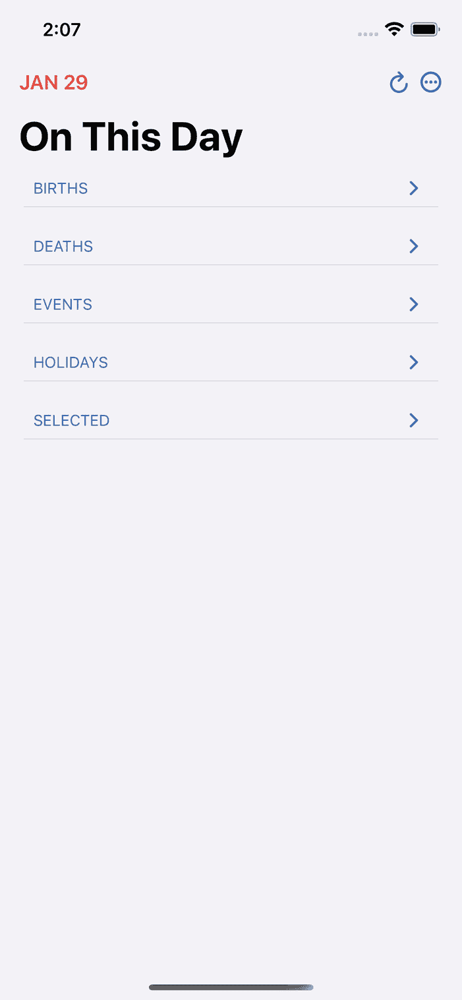

图 4-2

`OnThisDay` 的主屏幕，显示分区标题列表

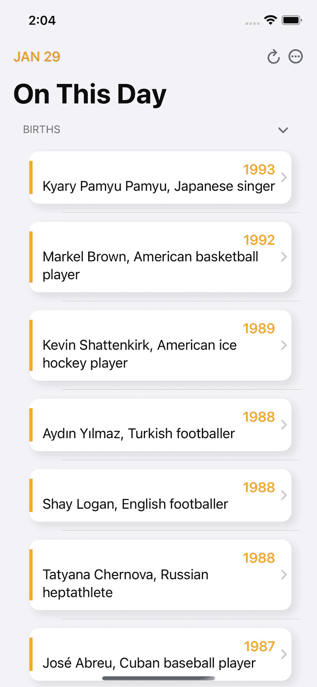

图 4-1

`OnThisDay` 的主屏幕，显示生日列表

`OnThisDay` 的另一个有趣特性是，你可以选择事件类型，从而获得该特定类型事件的筛选列表。而且，即使你关闭并重新运行应用，这个选择也会保持不变——这意味着，如果你从菜单中选择`Selected`，即使关闭并重新运行应用，列表中只会显示`Selected`事件。这多亏了 `UserDefaults`^(⁹) 才能实现！图 4-3 显示了一个菜单，你可以从中选择事件类型或类别。

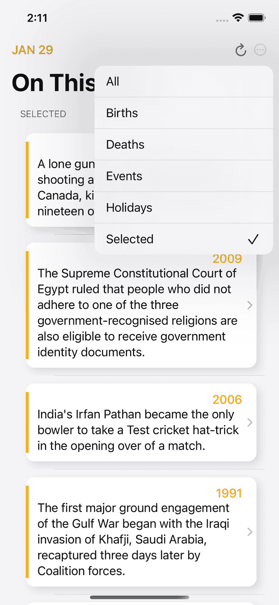

图 4-3

从菜单中选择“Selected”事件

此外，你可以点击一个事件来查看与该事件相关的更多详情和照片。请参考图 4-4 查看事件详情屏幕的截图。`OnThisDay` 还会显示与该事件相关的页面，你可以点击这些页面跳转到它们的维基百科页面。该屏幕如图 4-5 所示。


图 4-5

在详情屏幕中点击“相关页面”后加载的维基百科页面

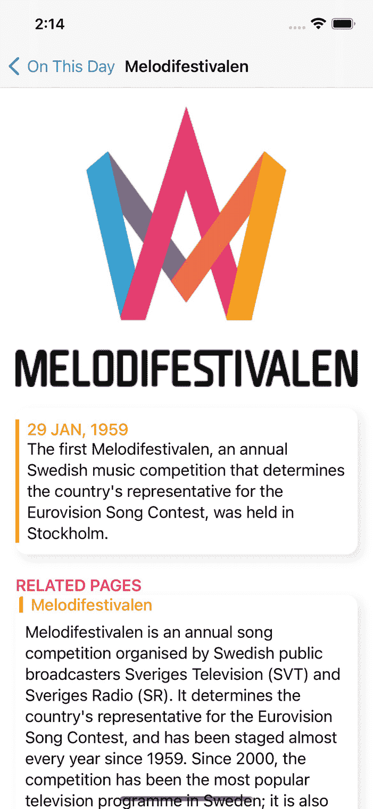

图 4-4

在主屏幕上点击一个事件后显示的详情屏幕

现在你肯定已经推断出 `OnThisDay` 是一个功能完整的应用。是的，没错。但是，为什么不为其创建小组件，并在用户的主屏幕上显示一些信息呢？小组件无疑能让你的应用对用户来说显得更有用。这就是为什么我们已经为你完成了部分工作。我们已经为 `OnThisDay` 创建了一个小组件扩展，名为 `OnThisDayWidgetExtension`，并为 `OnThisDay` 编写了所有三种尺寸家族的小组件。选择 `OnThisDayWidgetExtension` 方案并运行代码，即可在模拟器或设备的主屏幕上看到 `OnThisDay` 的小型小组件（图 4-6）。


图 4-6

显示 `OnThisDayWidgetExtension` 为选中方案的截图

长按主屏幕的空白区域，然后点击“**+**”图标，将另外两种尺寸家族的小组件也添加到你的主屏幕上。然后，从应用列表中点击 `OnThisDay`，滚动到你想要的小组件家族，并点击**添加小组件**。

目前，小组件显示的是占位数据，但稍后你将集成维基百科的“历史上的今天 REST API”来显示最新信息。

现在，让我们来看看小组件的外观。小型小组件（图 4-7）由于空间较小，仅显示系统日期当天发生的历史事件数量。

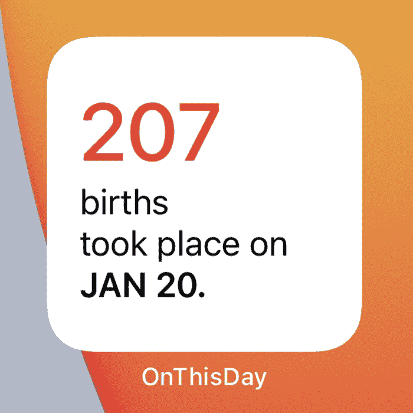

图 4-7

`OnThisDay` 的小尺寸小组件

而中型小组件（图 4-8）可以容纳更多视图，因此它不仅显示系统日期当天发生的历史事件数量，还显示一些关于个别事件的信息。

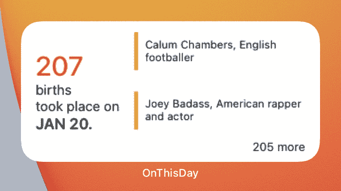

图 4-8

`OnThisDay` 的中尺寸小组件

大型小组件（图 4-9）显示与中型小组件相同的信息，但信息量更大，排列方式也不同。

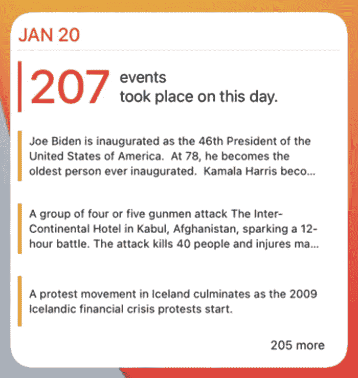

图 4-9

`OnThisDay` 的大尺寸小组件

除此之外，在本章的后面部分，你将让你的小组件变得可配置——这意味着用户可以长按你的小组件，然后点击**编辑小组件**，来选择他们希望小组件显示其信息的事件类型/类别。因此，如果用户选择了 `Holidays`，那么小组件中将只显示属于“Holidays”类别的事件信息。图 4-10 是长按小组件时显示选项列表的截图，图 4-11 是点击**编辑小组件**后显示配置选项的截图。除此之外，图 4-12 显示了用户可以选择的事件类别，以便让小组件显示相关信息。

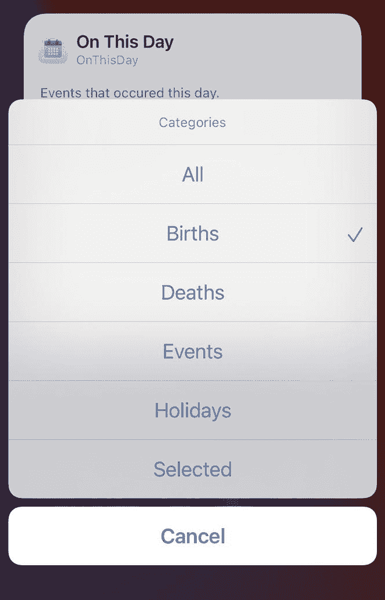

图 4-12

用户可以选择的事件类别，以便让小组件显示相关信息

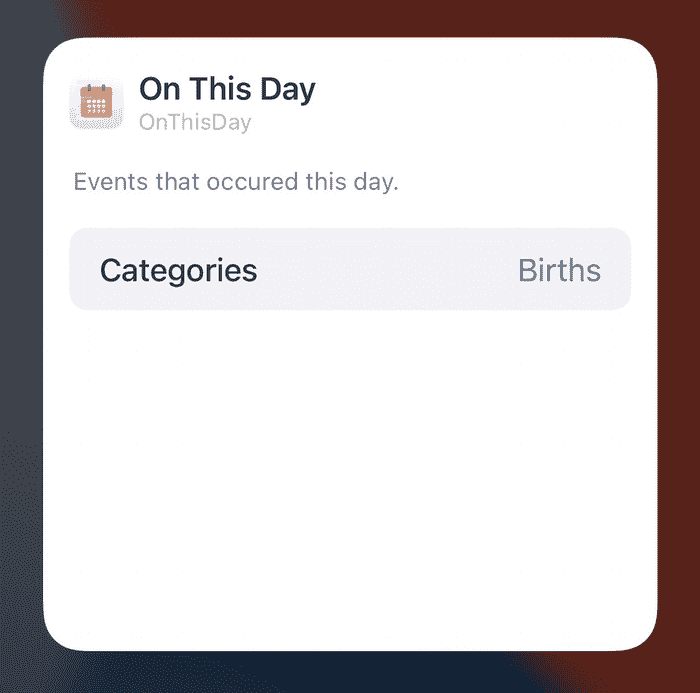

图 4-11

在图 4-10 中点击**编辑小组件**后显示的配置选项

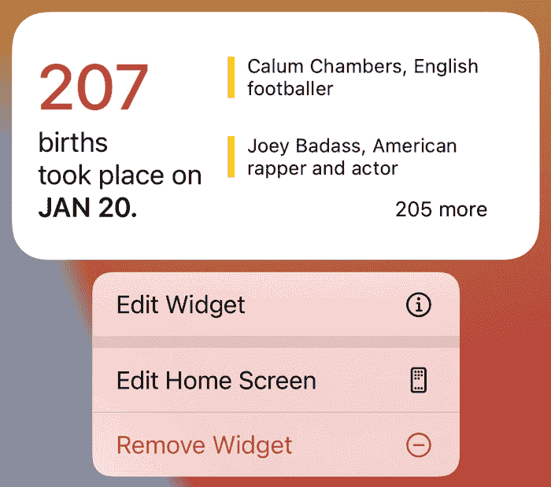

图 4-10

长按小组件时显示的选项列表

现在，是时候看看已有的代码了。正如我们之前所述，我们已经设置了一些基本内容。

如果你前往**项目导航器**并打开 `OnThisDay` 项目，你会找到两个主文件夹，即 `OnThisDay` 和 `OnThisDayWidget`。`OnThisDay` 文件夹包含与应用相关的文件和文件夹，而 `OnThisDayWidget` 文件夹包含与小组件相关的文件和文件夹。还有一些文件是应用和小组件共用的，这些文件通过**目标成员资格**进行共享。

打开 `OnThisDay` 项目中的 `OnThisDay` 文件夹，可以看到以下文件夹结构：

```
OnThisDay
├── Assets.xcassets
├── Extensions
│   ├── URL.swift
│   └── View.swift
├── Info.plist
├── Models
│   ├── ContentURL.swift
│   ├── EventData.swift
│   ├── EventType.swift
│   ├── OTDResponse.swift
│   ├── OriginalImage.swift
│   ├── Page.swift
│   └── URLData.swift
├── OnThisDayApp.swift
├── Preview\ Content
├── Utilities
│   ├── DateHelper.swift
│   └── WebView.swift
├── ViewModels
│   └── OTDViewModel.swift
└── Views
├── Custom\ Views
│   ├── DetailRowView.swift
│   ├── HomeRowView.swift
│   ├── RelatedPageRowView.swift
│   └── TrailingNavView.swift
├── DetailView.swift
└── HomeView.swift
```


在该文件夹中，你会看到`Assets.xcassets`和`Info.plist`。同样，还有一个名为`Extensions`的文件夹，用于存储各种结构体的扩展。

除此之外，还有一个`Models`文件夹，其中包含用于解析调用 Wikipedia API 端点后接收到的响应数据的文件。

`OnThisDayApp.swift`是您应用的主入口点，而`Preview Content`文件夹是 Xcode 生成的，用于存储开发所用的资源。Xcode 在发布构建中不会包含此文件夹中的文件。

有一个`Utilities`文件夹，其中包含应用用于服务目的的各种实用工具，例如处理日期和加载 Web 视图。

而`ViewModel`文件夹包含`OTDViewModel.swift`，这是应用的视图模型。

最后，`Views`文件夹包含多个文件和文件夹。`Custom Views`文件夹中存储了各种小型视图，这些视图被包含应用用户界面的`HomeView.swift`和`DetailView.swift`所使用。

这就是对`OnThisDay`文件夹中文件夹和文件的描述。

现在，打开`OnThisDayWidget`文件夹，可以看到以下文件夹结构：

```
OnThisDayWidget
├── Assets.xcassets
├── Info.plist
├── Model
│   └── WidgetEventData.swift
├── Provider
│   └── Provider.swift
├── Views
│   ├── LargeWidgetView.swift
│   ├── MediumWidgetView.swift
│   ├── SmallWidgetView.swift
│   └── WidgetView.swift
└── Widget
    └── OnThisDayWidget.swift
```

除了`Assets.xcassets`文件夹和`Info.plist`文件之外，你还会看到一个名为`Model`的文件夹，其中包含`WidgetEventData.swift`。这个模型包含一个名为`WidgetEvent`的`TimelineEntry`，这对于您的 widget 正常工作至关重要。

同样，有一个名为`Provider`的文件夹，其中包含`Provider.swift`，即 widget 的`TimelineProvider`。如果你还记得，它通过获取`TimelineEntry`值来驱动 widget。

接下来你可以看到的是`Views`文件夹，它包含`LargeWidgetView.swift`、`MediumWidgetView.swift`、`SmallWidgetView.swift`和`WidgetView.swift`。这些文件包含了你的 widget 的用户界面。`WidgetView.swift`文件是主文件，它决定了当用户选择某个特定的 widget 族时应渲染哪个视图。

最后，`Widget`文件夹包含了`OnThisDayWidget.swift`文件，它是`OnThisDayWidgetExtension`目标的入口点。它当前使用的是`StaticConfiguration`，你将要将其替换为`IntentConfiguration`，以使你的 widget 可配置。

## 赋予 Widget 与 API 通信的能力

在本节中，你将移除 widget 中的虚拟数据，并赋予它们调用 Wikipedia 的“On This Day API”来获取新鲜数据并显示最新信息的能力。目前，无需担心事件的类别/类型，因为你将使 widget 获取并显示所有类型事件的信息。

1.  在`OnThisDayWidget`的`Provider`文件夹中创建一个名为`OnThisDayAPI.swift`的新文件。创建此文件时，请确保选中`OnThisDayWidgetExtension`目标。

2.  将代码清单 4-1 中的代码复制并粘贴到该文件中，以创建一个包含静态方法`fetchOnThisDayData(with:)`的`OnThisDayAPI`结构体。

```
struct OnThisDayAPI {
    static func fetchOnThisDayData(with completion: @escaping ([WidgetEventData]) -> Void) {
        guard let today = DateHelper.getDayAndMonthInNumbers(),
              let url = URL(string: "https://en.wikipedia.org/api/rest_v1/feed/onthisday/all/\(today.month)/\(today.day)") else { return }
        let task = URLSession.shared.dataTask(with: url) { data, response, _ in
            if let data = data,
               let response = response as? HTTPURLResponse,
               response.statusCode == 200 {
                do {
                    let otdResponse = try JSONDecoder().decode(OTDResponse.self, from: data)
                    var responses: [EventData] = []
                    responses = otdResponse.selected + otdResponse.births + otdResponse.deaths + otdResponse.events + otdResponse.holidays
                    completion(responses.map({ WidgetEventData(text: $0.text) }))
                } catch {
                    completion([])
                    print("JSON Decoding Error.")
                }
                completion([])
            }
        }
        task.resume()
    }
}
代码清单 4-1
包含一个静态方法用于调用 Wikipedia API 的 OnThisDayAPI 结构体
```

代码清单 4-1 由`OnThisDayAPI`结构体组成，其中包含一个名为`fetchOnThisDayData(with:)`的静态方法。该方法调用 Wikipedia API 来获取系统日期（由`DateHelper.getDayAndMonthInNumbers()`方法返回并存储在`today`变量中）发生的所有类型的事件。然后，对响应进行解码，并通过其完成处理程序将其返回给调用方，该处理程序接受一个`WidgetEventData`数组作为参数。

现在，既然你已经准备好了`fetchOnThisDayData(with:)`，是时候调用它了。转到`Provider.swift`，并将`getTimeline(in:completion:)`替换为代码清单 4-2 中给出的代码。

```
func getTimeline(in context: Context, completion: @escaping (Timeline) -> Void) {
    // 1
    OnThisDayAPI.fetchOnThisDayData { widgetData in
        // 2
        let currentDate = Date()
        // 3
        let refreshDate = Calendar.current.date(byAdding: .day, value: 1, to: currentDate)!
        // 4
        let entry = WidgetEvent(date: currentDate, events: widgetData)
        // 5
        let timeline = Timeline(entries: [entry], policy: .after(refreshDate))
        // 6
        completion(timeline)
    }
}
代码清单 4-2
`getTimeline(in:completion:)` 方法，通过调用 `fetchOnThisDayData(with:)` 执行 API 调用
```

在代码清单 4-2 的代码中，发生了以下事情：

1.  调用了`OnThisDayAPI`结构体的静态方法`fetchOnThisDayData(with:)`。

2.  一旦`fetchOnThisDayData(with:)`的完成处理程序将结果作为`widgetData`返回后，当前日期就被存储在`currentDate`中。

3.  现在，下一天的日期被存储在`refreshDate`中。稍后将用它来设置 widget 的刷新策略。

4.  由于 widget 依赖于时间线条目来创建时间线，因此创建了一个`WidgetEvent`时间线条目并存储在`entry`中。并且，将`currentDate`的值以及作为 API 调用响应接收到的`widgetData`传递给`WidgetEvent`构造函数。

5.  既然至少有一个时间线条目，是时候创建一个时间线了。因此，通过传递一个包含`entry`的数组来创建一个时间线，并将其存储在`timeline`中。同时，刷新策略被设置为让 widget 在`refreshDate`之后请求新的时间线。这样，widget 被设置为每天刷新。

现在，选择`OnThisDayWidgetExtension`方案（如果你还没有选择的话），然后运行代码，看看你的 widget 从 Wikipedia API 获取数据。目前，你的 widget 将显示所有事件的信息（而不是某个特定类别的事件）。最初，widget 可能需要一些时间来加载更新后的数据。所以，请耐心等待，享受你的成果。你的小、中、大尺寸 widget 应该分别类似于图 4-7、图 4-8 和图 4-9。

你已经成功赋予了你的 widget 从 API 加载事件信息的能力。干得好！但是事件可能属于不同类别，用户可能只想要与特定事件类别相关的信息。在接下来的部分中，你将添加功能，允许用户配置你的 widget，使其仅显示与某个特定类别相关的信息。


好的，作为高级文档工程师和翻译员，我将严格遵循您的格式要求，完成本次翻译任务。

***


## 允许用户配置小组件

本节将介绍如何让你的小组件变得可配置。目前，你的小组件正在显示所有事件信息，而不论其类别如何。但也许有些用户希望这样配置他们的组件：他们只想获取特定类别的事件信息。也许有人想追踪历史名人的生日，或者有人喜欢获取有关发生的特殊历史事件的信息。为了满足这一目的，你可以开发你的小组件，让用户能够选择他们偏好的事件类别，并配置它们以显示与该特定事件类别相关的信息。

现在，`IntentConfiguration` 就该登场了。到目前为止，你只使用了 `StaticConfiguration`，因为你之前不需要允许用户根据自己的偏好来配置小组件。如果你不记得在哪里使用过 `StaticConfiguration`，请打开 **OnThisDayWidget** 文件夹。在那里，你会看到一个名为 **Widget** 的文件夹。打开它，找到 `OnThisDayWidget.swift`，这是你小组件的入口点。正是在这里，你创建了一个 `StaticConfiguration`。在 `OnThisDayWidget.swift` 中，你应该会看到一段类似于代码清单 4-3 的代码块。

```
var staticConfiguration: some WidgetConfiguration {
StaticConfiguration(kind: kind, provider: Provider()) { entry in
WidgetView(events: entry.events)
}
.supportedFamilies([.systemSmall, .systemMedium, .systemLarge])
.configurationDisplayName("On This Day")
.description("Events that occured this day.")
}
Listing 4-3
OnThisDayWidget.swift 中的 StaticConfiguration
```

稍后，你将把这个配置改为 `IntentConfiguration`，并做一些其他更改，以使你的小组件可配置。现在是时候按照以下步骤开始工作了。

### 创建并配置 SiriKit Intent 定义文件

首先，你将创建一个意图定义文件，因为它允许你为小组件定义可自定义或可配置的属性。要创建该文件并进行配置，请遵循以下步骤：

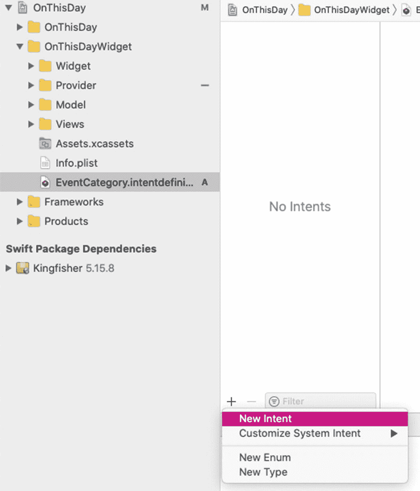

图 4-13

在意图定义文件中创建一个新意图

1.  右键单击项目中的 **OnThisDayWidget** 文件夹，然后单击 **新建文件…**。
2.  在出现的对话框中，选择 **SiriKit Intent 定义文件**，将其命名为 `EventCategory.intentdefinition`，然后创建该文件。创建文件时，请确保在对话框底部同时勾选了 **OnThisDayWidgetExtension** 和 **OnThisDay** 两个目标。如果在创建此文件时没有勾选 **OnThisDay** 目标，那么你的配置选项（在你的案例中是类别选择字段）将不会出现在小组件的配置界面中。
3.  现在，打开 `EventCategory.intentdefinition`。单击意图文件左下角的 "**+**" 图标，然后从选项列表中单击 **新意图**（图 4-13）。

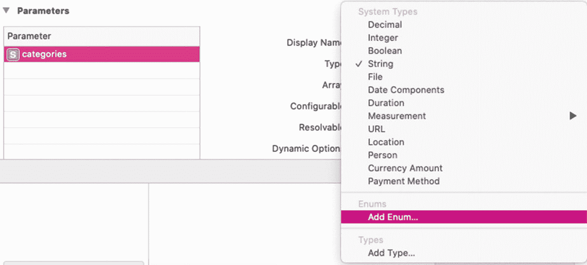

图 4-14

创建一个名为 “categories” 的参数并将其 “类型” 更改为 “添加枚举…”

1.  将你的意图命名为 `EventCategory`。然后，转到文件的右侧，将 **类别** 设置为 **视图**。
2.  由于你仅将意图用于小组件，请勾选 **意图适用于小组件**，并取消勾选 **意图在快捷指令 App 中可由用户配置并添加到 Siri** 和 **意图适用于 Siri 建议**。
3.  现在，通过点击 **参数** 部分下方的 "**+**" 按钮，添加一个名为 `categories` 的参数。在 **参数** 部分添加的参数是用户将在小组件配置界面中看到并与之交互的可配置属性。当你输入完名称后，你会看到显示名称被设置为 **类别**。该显示名称将显示在小组件的配置界面中（图 4-11）。
4.  然后，将 `categories` 参数的类型更改为 **添加枚举…**，因为你希望在图 4-11 和图 4-12 所示的小组件配置界面中向用户显示一个可选择的类别列表。为了方便你理解，此步骤如图 4-14 所示。

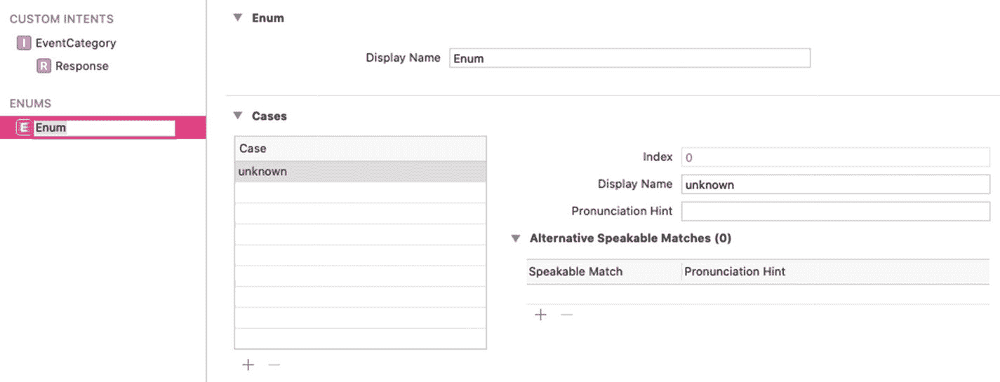

图 4-15

点击 “添加枚举…” 后显示的界面

1.  点击 **添加枚举…** 后，会显示一个类似于图 4-15 的新界面。然后，通过在左侧 **ENUMS** 标题下的项目中输入，将枚举的名称更改为 `Categories`。

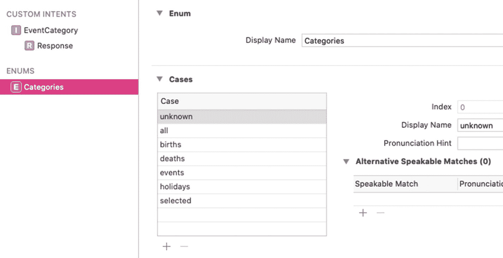

图 4-16

Categories 枚举的最终外观

1.  现在，返回到 `EventCategory` 自定义意图并选择 `categories` 参数。然后，取消勾选 **Siri 可在运行时询问取值**，因为我们不想与 Siri 交互。
2.  再次打开 **ENUMS** 标题下方显示的 `Categories` 枚举。现在，通过点击 **用例** 部分下方的 "**+**" 图标来添加用例。将用例的名称分别设置为 `all`、`births`、`deaths`、`events`、`holidays` 和 `selected`，并将它们的显示名称分别设置为 **全部**、**生日**、**逝世**、**事件**、**节假日** 和 **已选**。这些显示名称会显示给配置界面中的用户（图 4-12）。如果你注意了每个用例的索引，你会发现 `unknown` 的索引被设置为 0，且无法修改。但是，其他用例的索引是按数字顺序设置的，并且 Xcode 允许你修改它们。最后，你的枚举将如图 4-16 所示。

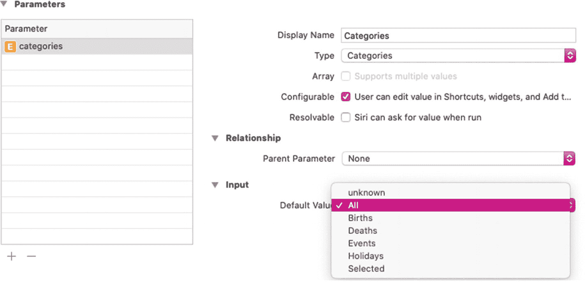

图 4-17

将 “categories” 的 “默认值” 设置为 “全部”。

1.  现在，进行最后一步，打开 `EventCategory` 自定义意图，在 **参数** 部分选择 `categories` 参数以查看其配置。在窗口右侧的 **输入** 部分下，将 **默认值** 设置为 **全部**，这样即使用户从未配置你的小组件来获取特定类别事件的信息，你的小组件也会显示所有类别事件的信息（图 4-17）。

至此，你已经完成了意图定义文件的创建和设置。恭喜！现在，你离让小组件可配置又近了一步。


### 切换到 `IntentConfiguration`

如前所述，你之前一直使用 `StaticConfiguration`，因为那时还无需让你的小组件支持用户配置。但现在，你希望让它们可被用户配置，并且已经完成了设置的第一步。接下来，就该切换到 `IntentConfiguration` 了。为此，你需要遵循以下步骤：

1.  右键点击 **OnThisDayWidget** 文件夹中的 **Provider** 文件夹，选择 **New File…**，然后创建一个名为 `IntentProvider.swift` 的新 Swift 文件。在创建文件前，务必确认对话框底部的 **OnThisDayWidgetExtension** 目标已被勾选。

**注意** 你也可以使用现有的 `Provider.swift` 文件，而非创建 `IntentProvider.swift`，但为了更清晰，我们建议你创建 `IntentProvider.swift`。

2.  打开 `IntentProvider.swift` 文件，并将其中的现有代码替换为代码清单 4-4 中给出的代码。

1.  在代码清单 4-4 中，创建了一个遵循 `IntentTimelineProvider` 协议、名为 `IntentProvider` 的结构体。当你添加这些代码后，Xcode 会询问你是否要添加协议存根。点击 **Fix** 并添加它们，你会看到结构体中添加了两个类型别名：`Entry` 和 `Intent`。

2.  在 `IntentProvider` 结构体中，将 `Entry` 的类型占位符替换为 `WidgetEvent`（一种时间线条目类型）。同时，将 `Intent` 的类型占位符替换为 `EventCategoryIntent`。`EventCategoryIntent` 这个名称源于你之前在意图定义文件（即 `EventCategory.intentdefinition`）中创建的自定义意图 `EventCategory`。

**提示** 在 `IntentProvider` 中将 `Intent` 的类型占位符替换为 `EventCategoryIntent` 时，最好亲自输入 `EventCategoryIntent` 来检查 Xcode 是否会给出自动补全。这有助于你确认 `EventCategoryIntent` 是否已被 Xcode 生成。

```
import SwiftUI
import WidgetKit
struct IntentProvider: IntentTimelineProvider {
}
代码清单 4-4
创建遵循 IntentTimelineProvider 的 IntentProvider
```

现在，你的代码应该类似于代码清单 4-5 中的代码。

1.  此时，Xcode 应该仍在提示你添加协议存根。也请添加这些存根，你会发现生成了 `placeholder(in:)`、`getSnapshot(for:in:completion:)` 和 `getTimeline(for:in:completion:)` 方法。

2.  现在，你可以通过从 `Provider.swift` 的方法中复制粘贴代码来填充这些方法，使 `IntentProvider` 看起来像代码清单 4-6 所示。

**注意** 请记住，`IntentProvider` 中的方法与 `Provider` 中的不同。`Provider` 拥有类似 `getSnapshot(in:completion:)` 和 `getTimeline(in:completion:)` 的方法，而 `IntentProvider` 拥有类似 `getSnapshot(for:in:completion:)` 和 `getTimeline(for:in:completion:)` 的方法。

因此，在从 `Provider` 复制代码时，请确保不要复制整个方法，而只复制这些方法花括号内的行。为简便起见，你可以直接复制代码清单 4-6 中的代码。

```
import SwiftUI
import WidgetKit
struct IntentProvider: IntentTimelineProvider {
typealias Entry = WidgetEvent
typealias Intent = EventCategoryIntent
}
代码清单 4-5
添加 Entry 和 Intent 类型后的 IntentProvider
```

1.  由于小组件中的时间线条目需要知道所选的事件类别，因此你必须修改时间线条目模型。在 **Model** 中找到 `WidgetEventData.swift`，并向 `WidgetEvent` 结构体添加一个 `Categories` 类型的新属性 `category`。`Categories` 是你之前在 `EventCategory.intentdefinition` 中定义的枚举。同时，将其默认值设置为 `.all`，作为默认选中的类别。现在，`WidgetEvent` 应该类似于代码清单 4-7。

```
import SwiftUI
import WidgetKit
struct IntentProvider: IntentTimelineProvider {
typealias Entry = WidgetEvent
typealias Intent = EventCategoryIntent
func placeholder(in context: Context) -> WidgetEvent {
WidgetEvent(date: Date(), events: WidgetEventData.events)
}
func getSnapshot(for configuration: EventCategoryIntent, in context: Context, completion: @escaping (WidgetEvent) -> Void) {
let entry = WidgetEvent(date: Date(), events: WidgetEventData.events)
completion(entry)
}
func getTimeline(for configuration: EventCategoryIntent, in context: Context, completion: @escaping (Timeline) -> Void) {
OnThisDayAPI.fetchOnThisDayData { widgetData in
let currentDate = Date()
let refreshDate = Calendar.current.date(byAdding: .day, value: 1, to: currentDate)!
let entry = WidgetEvent(date: currentDate, events: widgetData)
let timeline = Timeline(entries: [entry], policy: .after(refreshDate))
completion(timeline)
}
}
}
代码清单 4-6
实现必要方法后的 IntentProvider
```

1.  现在回到 `IntentProvider.swift`。除了 `getTimeline(for:in:completion:)` 的实现外，`placeholder(in:)` 和 `getSnapshot(for:in:completion:)` 的实现无需修改。

`getTimeline(for:in:completion:)` 中的 `configuration` 参数存储了用户设置的所有小组件配置值。因此，它也包含了用户设置的类别值。这个类别值需要传递给每一个时间线条目，以便小组件能获取与特定事件类别相关的事件数据。你可以通过在第 7 步中刚刚添加到 `WidgetEvent` 的 `category` 属性，将类别值传递给每个时间线条目。如果你查看 `getTimeline(for:in:completion:)` 的实现，会找到如代码清单 4-8 所示的代码行。

```
struct WidgetEvent: TimelineEntry {
var date: Date
var events: [WidgetEventData]
var category: Categories = .all
}
代码清单 4-7
添加 category 属性后的 WidgetEvent 结构体
```

```
let entry = WidgetEvent(date: currentDate, events: widgetData)
代码清单 4-8
getTimeline(for:in:completion:) 中创建 WidgetEvent 时间线条目的代码行
```

代码清单 4-8 展示了 `getTimeline(for:in:completion:)` 中创建 `WidgetEvent` 时间线条目并将其存储到 `entry` 中的代码行。现在，将该行替换为代码清单 4-9 中给出的代码行。

```
let entry = WidgetEvent(date: currentDate, events: widgetData, category: configuration.categories)
代码清单 4-9
创建将类别作为参数的 WidgetEvent 时间线条目
```

代码清单 4-9 创建了一个 `WidgetEvent` 时间线条目，该条目从配置数据中获取类别作为参数。至此，`IntentProvider` 的设置完成。

1.  在这一步中，你将最终使用刚刚配置好的 `IntentProvider`。打开 **Widget** 文件夹中的 `OnThisDayWidget.swift`，并将 `OnThisDayWidget` 的内容体替换为代码清单 4-10 中的代码。

```
var body: some WidgetConfiguration {
IntentConfiguration(kind: kind,
intent: EventCategoryIntent.self,
provider: IntentProvider()) { entry in
WidgetView(events: entry.events)
}
.supportedFamilies([.systemSmall, .systemMedium, .systemLarge])
.configurationDisplayName("On This Day")
.description("Events that occured this day.")
}
代码清单 4-10
使用 IntentConfiguration 的 OnThisDayWidget 内容体
```


如果你查看[4-10]清单中的代码，会发现 `OnThisDayWidget` 主体使用的是 `IntentConfiguration` 初始化器，而非 `StaticConfiguration` 初始化器。两者唯一区别在于 `IntentConfiguration` 接受一个 `intent` 参数（值为 `EventCategoryIntent.self`，即你在 `EventCategory.intentdefinition` 中自定义的意图）和另一个 `provider` 参数（使用 `IntentProvider` 初始化器）。其余代码与之前使用的 `StaticConfiguration` 初始化器完全相同。同时，删除 `staticConfiguration` 变量，因为你不再需要它。

至此，你已完成从 `StaticConfiguration` 到 `IntentConfiguration` 的切换。现在该调用 API 并在视图中展示结果了。

### 与 API 通信并在小组件中展示最新信息

打开 `OnThisDayAPI.swift`（包含负责执行 API 调用的 `OnThisDayAPI` 结构体），查看其静态方法 `fetchOnThisDayData(with:)`，你会发现它尚未实现根据选定事件类别获取和返回数据的功能。该方法仅向维基百科 REST API 端点发起调用，该端点会以不同键返回各类事件数据。随后方法将每个类别的数据存入名为 `response` 的变量并返回。因此，当前该方法仅返回 `all` 类别的结果。现在修改该方法，使其能够过滤并返回 `all` 之外其他类别的事件。用[4-11]清单中的代码替换 `fetchOnThisDayData(with:)` 方法。

```swift
static func fetchOnThisDayData(for type: Categories, completion: @escaping ([WidgetEventData]?) -> Void) {
guard let today = DateHelper.getDayAndMonthInNumbers(),
let url = URL(string: "https://en.wikipedia.org/api/rest_v1/feed/onthisday/all/\(today.month)/\(today.day)") else { return }
let task = URLSession.shared.dataTask(with: url) { data, response, _ in
if let data = data,
let response = response as? HTTPURLResponse,
response.statusCode == 200 {
do {
let otdResponse = try JSONDecoder().decode(OTDResponse.self, from: data)
var responses: [EventData] = []
switch type {
case .births: responses = otdResponse.births
case .deaths: responses = otdResponse.deaths
case .events: responses = otdResponse.events
case .holidays: responses = otdResponse.holidays
case .selected: responses = otdResponse.selected
default: responses = otdResponse.selected
+ otdResponse.births + otdResponse.deaths + otdResponse.events + otdResponse.holidays
}
completion(responses.map({ WidgetEventData(text: $0.text) }))
} catch {
completion(nil)
print("JSON Decoding Error.")
}
}
}
task.resume()
}
清单 4-11
fetchOnThisDayData(for:completion:) 方法
```

[4-11]清单中的代码替换了旧的 `fetchOnThisDayData(with:)` 方法。新方法 `fetchOnThisDayData(for:completion:)` 除了完成处理闭包外，还新增了一个名为 `for`（类型为 `Categories`）的参数。该 `for` 参数在根据选定类别过滤数据时起到关键作用，这体现在代码中使用的 switch 语句中。switch 语句作用于 `type` 变量（即之前的 `for` 变量），当选择除默认类别 `all` 外的其他类别时，该方法仅返回特定类别的结果。例如，若选定的 `type`/类别为 `births`，则方法仅返回 API 响应中 `births` 键对应的数据。

现在构建代码，查看此修改影响的位置。第一个受影响的是 `Provider.swift`。由于该文件中的结构体之前被 `StaticConfiguration` 使用，而你现在不再使用 `StaticConfiguration`，请删除 `Provider.swift`。之后唯一受影响的部分将是 `IntentProvider.swift`。Xcode 应该会提示“调用中缺少参数‘for’”。点击 **修复** 让 Xcode 添加必要的 `for` 参数，并将占位符替换为 `configuration.categories`，以从小组件配置中获取选定的类别。现在，`getTimeline(for:in:completion:)` 中对 `fetchOnThisDayData(for:completion:)` 方法的调用应如[4-12]清单所示。


```swift
func getTimeline(for configuration: EventCategoryIntent, in context: Context, completion: @escaping (Timeline) -> Void) {
    OnThisDayAPI.fetchOnThisDayData(for: configuration.categories) { widgetData in
        let currentDate = Date()
        let refreshDate = Calendar.current.date(byAdding: .day, value: 1, to: currentDate)!
        let entry = WidgetEvent(date: currentDate, events: widgetData, category: configuration.categories)
        let timeline = Timeline(entries: [entry], policy: .after(refreshDate))
        completion(timeline)
    }
}
```
代码清单 4-12 从 Widget 配置中获取类别后，`fetchOnThisDayData(for:completion:)` 方法的实现

不过，你一定又看到了 Xcode 报出的另一个错误。这次错误信息应该是：“可选类型`'[WidgetEventData]?'`的值必须解包为`'[WidgetEventData]'`类型”。要解决此问题，需要使用`guard-let`来解包从`fetchOnThisDayData(for:completion:)`方法的完成处理器中接收到的可选`widgetData`值。使用`guard-let`后，`getTimeline(for:in:completion:)`中对`fetchOnThisDayData(for:completion:)`的函数调用应如代码清单 4-13 所示。

```swift
func getTimeline(for configuration: EventCategoryIntent, in context: Context, completion: @escaping (Timeline) -> Void) {
    OnThisDayAPI.fetchOnThisDayData(for: configuration.categories) { widgetData in
        guard let widgetData = widgetData else { return }
        let currentDate = Date()
        let refreshDate = Calendar.current.date(byAdding: .day, value: 1, to: currentDate)!
        let entry = WidgetEvent(date: currentDate, events: widgetData, category: configuration.categories)
        let timeline = Timeline(entries: [entry], policy: .after(refreshDate))
        completion(timeline)
    }
}
```
代码清单 4-13 使用`guard-let`解包`widgetData`后的`fetchOnThisDayData(for:completion:)`方法

如图 4-13 所示，使用`guard-let`解包`widgetData`后，错误信息应该消失。请构建项目以验证。

现在还剩一件事，即设置 widget 视图来显示选中的类别。如果查看 widget 的外观，你会发现如果选中的事件类别是`births`，日期是 1 月 20 日，且`births`类别中的事件数量为 200，则会显示文本“1 月 20 日发生了 200 起出生事件”。那么，我们开始设置视图。

首先，在`WidgetView`、`SmallWidgetView`、`MediumWidgetView`和`LargeWidgetView`中添加代码清单 4-14 中的一行代码来设置视图。

```swift
var category: Categories
```
代码清单 4-14 创建一个`Categories`类型的变量`category`

在所有视图中创建完该变量后，你会立即在`SmallWidgetView`、`MediumWidgetView`和`LargeWidgetView`的预览中看到错误，因为预览中没有为参数`category`传递实参。点击**修复**以添加`category`参数，并将实参设置为`.all`。例如，对于`SmallWidgetView`，可以像代码清单 4-15 那样操作。

```swift
struct SmallWidget_Previews: PreviewProvider {
    static var previews: some View {
        SmallWidgetView(eventCount: 5, category: .all)
            .previewContext(WidgetPreviewContext(family: .systemSmall))
    }
}
```
代码清单 4-15 通过传递`category`来修复`SmallWidgetView`的预览

在`MediumWidgetView`和`LargeWidgetView`的预览中传递`category`实参，以消除错误信息。

现在，如果你构建项目，仍然会看到更多错误。这次错误出现在`WidgetView.swift`中，因为在`switch`语句中`SmallWidgetView`、`MediumWidgetView`和`LargeWidgetView`的初始化器没有传递`category`实参。请传递`category`实参，使你的`WidgetView`的`body`看起来类似于代码清单 4-16。

```swift
@ViewBuilder
var body: some View {
    switch family {
    case .systemSmall: SmallWidgetView(eventCount: events.count, category: category)
    case .systemMedium: MediumWidgetView(events: events, category: category)
    case .systemLarge: LargeWidgetView(events: events, category: category)
    default: EmptyView()
    }
}
```
代码清单 4-16 向所有 widget 家族传递`category`后的`WidgetView`的`body`

在代码清单 4-16 中，`WidgetView`的`category`变量作为实参传递给了所有 widget 家族视图的`category`参数。

现在，错误只存在于`OnThisDayWidget.swift`中。在`WidgetView`的初始化器中添加`category`参数，并传递`entry.category`作为其实参，以消除该错误。之后，`OnThisDayWidget`的`body`将如代码清单 4-17 所示。

```swift
var body: some WidgetConfiguration {
    IntentConfiguration(kind: kind,
                        intent: EventCategoryIntent.self,
                        provider: IntentProvider()) { entry in
        WidgetView(events: entry.events, category: entry.category)
    }
    .supportedFamilies([.systemSmall, .systemMedium, .systemLarge])
    .configurationDisplayName("On This Day")
    .description("Events that occured this day.")
}
```
代码清单 4-17 向`WidgetView`的初始化器传递`category`后的`OnThisDayWidget`的`body`

如果你已经完成了上述所有操作，但还是不明白发生了什么，我们来解释一下。你将从`OnThisDayWidget`（widget 的入口点）中`IntentConfiguration`初始化器的完成处理器的`entry`变量接收到的选中`category`，传递给了主 widget 视图`WidgetView`。然后，从`WidgetView`，`category`被进一步传递给了`SmallWidgetView`、`MediumWidgetView`和`LargeWidgetView`。

现在，`SmallWidgetView`、`MediumWidgetView`和`LargeWidgetView`已经准备好使用它们的`category`变量在 widget 中显示选中的类别。但在那之前，我们还需要做一些必要的设置。

创建一个新文件夹 `Intent`，并将 `EventCategory.intentdefinition` 移动到该文件夹中。然后，在 `Intent` 文件夹中创建一个新的 Swift 文件，并将其命名为 `CategoriesExtension.swift`。确保在创建该文件时选中了 `OnThisDay` 和 `OnThisDayWidgetExtension` 目标。现在，复制代码清单 4-18 中的代码，并粘贴到 `CategoriesExtension.swift` 中。

```swift
extension Categories {
    var detail: String {
        switch self {
        case .births: return "births"
        case .all: return "historic events"
        case .events: return "events"
        case .deaths: return "deaths"
        case .holidays: return "holidays"
        case .selected: return "special events"
        default: return "historic events"
        }
    }
}
```
代码清单 4-18 创建`Categories`的扩展

在代码清单 4-18 中，创建了`Categories`的一个扩展。它包含一个`String`类型的`detail`变量。通过`switch`语句，它根据选中的类别返回要在 widget 中显示的字符串。

现在，在`SmallWidgetView`、`MediumWidgetView`和`LargeWidgetView`中，找到文本`Text("events")`并将其替换为`Text(category.detail)`，以便在 widget 上显示选中事件的类别。

最后，是时候测试你的 widget 了！


### 是时候测试你的小组件了！

在模拟器或真机上，先卸载已安装的 `OnThisDay` 应用及其任何现有小组件。接着，选择并运行 `OnThisDay` 目标以将其安装到模拟器或真机上。然后，选择并运行 `OnThisDayWidgetExtension` 目标来安装小组件。当小组件在主屏幕上显示后，尝试进入其配置界面并选择不同的类别。你可以参考图 4-10、4-11 和 4-12。选择新类别后，与该类别事件相关的信息应显示在你的小组件中。

干得漂亮！你已成功让小组件支持用户自定义配置了。

## 通过点击跳转目标导航到应用的相关界面

你试过点击上一节创建的小组件中的不同元素吗？目前，无论点击小组件的哪个位置，应用都会启动并显示主屏幕。这需要改变，因为你的小组件不仅仅是应用图标，它的功能远不止于此。如果你查阅本书第 2 章的“人机界面指南”部分，你会在“点击小组件应打开应用的正确位置”这一标题下找到以下说明：

> *当用户点击应用图标时，应用应启动并显示主屏幕。但当用户点击小组件时，应用应启动并显示包含与该小组件内容相关且有用的详细信息和操作的屏幕。*

因此，在本节中，你将定义点击跳转目标，点击这些目标将通过深层链接实现导航到应用的不同相关界面。

**注意**：深层链接是一种技术，它可以使链接或 URL 不仅能打开你的应用，还能自动导航到应用中的指定位置。这种技术目前非常流行，已被各种公司和组织应用于他们的应用和服务中。

一个巧妙运用深层链接的公司例子是 Medium。如果你在手机浏览器中打开 Medium 网站并阅读一篇文章，你会看到页面顶部有一个“在应用中打开”的按钮。点击该按钮后，如果你使用的是 iOS 设备且未安装 Medium 应用，App Store 会在你设备上启动并显示 Medium 应用的安装页面；但如果你使用的是已安装 Medium 应用的 iOS 设备，它则会启动并将你带到应用内你正在阅读的同一篇文章。这就是一些神奇的深层链接魔法！

例如，看一下你的中等尺寸小组件（图 4-18），你会发现有多个区域和元素可以作为点击跳转目标，从而实现导航到包含与点击目标内容相关的详细信息和操作的屏幕。图 4-18 中使用红色边框的矩形高亮显示了潜在的点击跳转目标。

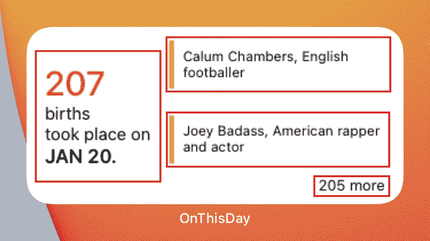

图 4-18

高亮显示可点击的元素

在图 4-18 中，第一个潜在的点击跳转目标是显示“1 月 20 日发生了 207 起出生事件”的区域。由于当前选定的事件类别是 **出生**，你可以将该区域设为可点击，从而将用户导航到仅显示 **出生** 类别事件的应用主屏幕。

另外，你可以看到小组件右侧列出了几项出生事件。因此，你可以为列表中的每个事件定义点击跳转目标，直接将用户导航到被点击事件的详情界面。这一次，显示的屏幕将不再是主屏幕，而是包含与小组件中被点击事件相关的内容和操作的详情界面。例如，在图 4-18 中，如果用户点击显示“卡卢姆·钱伯斯，英格兰足球运动员”的事件，那么用户就应该看到包含“卡卢姆·钱伯斯”详细信息的详情界面。

还有一个潜在的点击跳转目标，它告知用户还有更多事件无法在小组件中列出。在图 4-18 中，它显示“还有 205 个”。因此，显而易见，用户点击它会期望进入显示所有 **出生** 类别事件的应用主屏幕。

由于大尺寸小组件与中等尺寸小组件类似，其潜在的点击跳转目标也是相同的。

但对于小尺寸小组件而言，`WidgetKit` 只允许你定义一个单一的点击跳转目标，因为它的空间有限，容纳的内容较少。因此，在你创建的小尺寸小组件中，你可以定义一个点击跳转目标，将用户带到显示选定类别事件列表的主屏幕。


### 在小部件中添加点击目标

在小尺寸部件中，您可以使用 `widgetURL(_:)` 方法来添加点击目标。它是 `View` 的一个实例方法，用于设置在用户点击部件时要在应用中打开的 URL。另一个 `View` 方法 `onOpenURL(perform:)` 用于检测是否有深层链接试图打开应用，您可以在该方法中执行必要操作，从而实现对不同屏幕的导航。因此，在小尺寸部件的场景下，这两个方法在实现导航功能中起着关键作用。

现在，让我们开始设置吧！

`widgetURL(_:)` 方法接受一个 URL 作为参数，以便设置当小部件被点击时打开应用的 URL。因此，有必要为 `widgetURL(_:)` 方法创建一个 URL（您稍后将实现该方法）。但您将使用什么来生成 URL 呢？您肯定需要一个名称或其他字符串。使用所选类别本身的名称怎么样？这将是一个好方法，因为您既可以得到 URL，又可以得到所选类别的值，您可以在应用的主屏幕中使用该值来显示该类别中的事件。现在，请按照以下步骤开发用于生成 URL 的机制：

1.  从 **OnThisDayWidget** 的 **Intent** 文件夹中打开 **CategoriesExtension.swift**。

2.  在 `Categories` 的扩展中，复制代码清单 4-19 中的代码并粘贴到此处，定义一个类型为 `EventType` 的属性 `eventType`。

```
var eventType: EventType {
    switch self {
    case .unknown, .all: return .all
    case .births: return .births
    case .deaths: return .deaths
    case .events: return .events
    case .holidays: return .holidays
    case .selected: return .selected
    }
}
代码清单 4-19
在 Categories 扩展中创建 eventType 属性
```

之所以在 `Categories` 扩展中创建 `eventType`，是因为您需要从 `Categories` 类型的选定类别中生成一个 `String` 来创建 URL。由于 `EventType` 遵循 `String` 协议，并且可以访问其 `rawValue` 属性来获取所选类别的字符串，因此您创建了 `eventType`，将 `Categories` 的所有 case 与 `EventType` 进行映射，并获取字符串形式的 `rawValue`。

3.  之后，从 **OnThisDayWidget** 文件夹的 **Views** 文件夹中打开 **SmallWidgetView.swift**。

4.  用代码清单 4-20 中给出的代码替换 `SmallWidgetView` 的主体。

```
var body: some View {
    HStack {
        VStack(alignment: .leading) {
            Text(eventCount.description)
                .font(.system(size: 40,
                              weight: .medium))
                .foregroundColor(.red)
            Text(category.detail)
                .font(.body)
            Text("took place on")
                .font(.body)
            Text(DateHelper.today + ".")
                .font(.headline)
        }
        Spacer()
    }
    .padding([.leading, .top, .bottom])
    .widgetURL(URL(string: category.eventType.rawValue))
}
代码清单 4-20
添加 widgetURL(_:) 后的 SmallWidgetView 主体
```

在代码清单 4-20 中，通过传递一个使用 `category` 的 `eventType` 属性的 `rawValue` 属性创建的 URL 作为参数来调用 `widgetURL(_:)` 方法。

5.  从 **OnThisDay** 的 **Views** 文件夹中打开 **HomeView.swift**。在 HomeView 中，创建一个方法 `handleLinks(for:)` 来处理深层链接，并复制代码清单 4-21 中的代码粘贴到此处。

```
func handleLinks(for url: URL) {
    if let type = EventType(rawValue: url.absoluteString) {
        self.type = type
    }
}
代码清单 4-21
实现 handleLinks(for:)
```

在代码清单 4-21 中，实现了 `handleLinks(for:)` 方法。访问 `url` 的 `absoluteString`^((10)) 属性以获取其字符串值，然后将该字符串值传递给接受 `rawValue` 作为参数并尝试将其转换为 `EventType` case 的 `EventType` 初始化器。如果生成了有效的 `EventType` case，则将其存储在 `type` 变量中。最后，将 `HomeView` 的 `type` 变量设置为 `if-let` 条件中 `type` 变量的值。此处，`HomeView` 的 `type` 变量是一个 `@State` 变量，用于存储选定的事件类别/事件类型并相应地显示事件。

6.  现在，转到 `HomeView` 的 `body`。您将在此处调用 `onOpenURL(perform:)` 来检测是否有深层链接正试图启动您的应用。在 `HomeView` 的 `body` 中的 `onAppear(perform:)` 函数调用下方，添加对 `onOpenURL(perform:)` 的函数调用，并按照代码清单 4-22 所示进行更改。

```
var body: some View {
    NavigationView {
        // 为便于查看，已删除部分代码行
    }
    // 为便于查看，已删除部分代码行
    .onAppear(perform: initiateDataFetch)
    .onOpenURL { url in
        handleLinks(for: url)
    }
}
代码清单 4-22
调用 onOpenURL(perform:) 后的 HomeView 主体
```

在代码清单 4-22 中，调用了 `onOpenURL(perform:)` 方法，其完成处理器提供了一个参数 `url`。该参数被传递给 `handleLinks(for:)`，后者执行数据过滤工作，并设置视图以显示与所选事件类别/类型相关的事件。

**注意**

对 `onOpenURL(perform:)` 的调用是在 `HomeView` 的 `body` 中执行的，因为 `HomeView` 是从应用入口点（即 `OnThisDayApp`）加载的主视图。如果您打开 **OnThisDay** 文件夹中的 **OnThisDayApp.swift** 文件，就会看到这一点。

但是，您也可以使用 `HomeView` 的实例从 `OnThisDayApp` 结构体中调用 `onOpenURL(perform:)`。但由于执行必要操作所需数据的可用性原因，您是从 `HomeView` 的 `body` 中调用它的。

SwiftUI 允许您根据偏好和便利性，从这些位置中的任意一处调用 `onOpenURL(perform:)`。

现在，构建并运行项目。尝试通过长按小部件、点击 **编辑小部件** 并修改 **类别** 字段的值来更改事件的选定类别。然后，等待小部件显示选定类别事件的信息。当小部件显示更新后的信息后，点击小部件即可看到应用主屏幕显示与所选类别相关的事件列表。

干得好！您已成功在小尺寸部件中添加了点击目标，并利用深层链接的强大功能使您的应用能够显示相关信息。


### 在中号组件中添加点击目标

如图 4-18 所示，你可以在中号和大号组件中放置多个点击目标。因此，在本节中，你将在中号组件中添加点击目标。

在中号组件中，有三个区域可以添加点击目标。打开并预览 `MediumWidgetView`，以便你能更好地理解。

第一个区域/视图是 `eventCountView`，它显示特定日期发生的事件数量。它类似于你之前制作的小号组件。

第二个区域是列出两个事件的位置。`eventDetail(with:)` 方法负责显示该区域。这两个事件各自都可以拥有自己的点击目标，引导用户进入其详情页面。

在该区域下方，有一个 `todayEvents` 视图，显示那些无法在组件视图中完全显示，但会在应用启动时展示的剩余事件数量。

你一定注意到了，唯一会执行不同功能的点击目标位于 `eventDetail(with:)` 方法中。否则，无论你在中号组件的哪个位置点击，用户都会被带到应用的主屏幕，显示与当前选中类别相关的事件列表。因此，就像在小号组件中一样，你可以在中号组件的某个视图中调用 `widgetURL(_:)`。随后，为了在 `eventDetail(with:)` 方法中添加点击目标，你将使用 `widgetURL(_:)` 之外的其他方法。

由于你已经在“在小号组件中添加点击目标”（从步骤 5 开始）中完成了处理深度链接所需的设置，现在你只需从 `eventCountView` 和 `todayEvents` 中的任意一个视图调用 `widgetURL(_:)` 即可使其工作。我们选择从 `eventCountView` 调用 `widgetURL(_:)`。代码清单 4-23 展示了在 `eventCountView` 中添加 `widgetURL(_:)` 调用的过程。

```swift
var eventCountView: some View {
HStack {
VStack(alignment: .leading) {
Text(events.count.description)
.font(.system(size: 40,
weight: .medium))
.foregroundColor(.red)
Text(category.detail)
.font(.body)
Text("took place on")
.font(.body)
Text(DateHelper.today + ".")
.font(.headline)
}
}
.padding(.trailing)
.widgetURL(URL(string: category.eventType.rawValue))
}
```

在代码清单 4-23 中，通过在 `eventCountView` 中调用 `widgetURL(_:)`，并传入通过访问选中类别 `category` 的 `eventType` 属性的 `rawValue` 属性生成的字符串所创建的 URL。

添加完代码清单 4-23 中的代码后，构建并运行该组件。现在，如果你点击中号组件的任意位置，你将被带到应用的主屏幕，其中列出了与选中类别相关的事件。

然而，如果你还记得，组件右侧显示两个事件简要信息的区域，本应引导用户进入应用中的详情页面，以提供更相关的信息。是时候进行设置了。

对于小号组件，让应用显示选中类别的事件列表，你只需要选中类别本身的名称。然后你使用该类别名称创建了一个 URL，并通过 `widgetURL(_:)` 进行设置。当组件被点击时，`onOpenURL(perform:)` 会检测到深度链接，应用随之启动并显示带有列表的主屏幕。

但是，你需要一种不同的机制来处理在中号（或大号）组件中点击事件的情况：应用应启动并打开该特定事件的详情页面。与小号组件不同，这里你既需要事件信息（用于详情页面），也需要选中的类别（用于当用户决定返回应用主屏幕时显示该类别的列表）。

由于你在此场景中也将使用深度链接，你当然需要创建一个 URL。那么，为什么不生成一个既包含选中类别又包含事件文本的 URL 呢？并且，为了让应用在检测到特定深度链接时确定应导航到哪个屏幕，为什么不也包含一些关于该屏幕的信息呢？虽然目前这可能不是非常有用，但在你的应用可能需要深度链接导航到各种屏幕的场景中，它肯定会派上用场。

因此，让我们创建一个机制，生成包含选中类别、事件文本以及应用应导航到的屏幕名称的 URL：

1.  在 **OnThisDayWidget** 文件夹中，创建一个新文件夹 **Constants**。
2.  在 **Constants** 中，创建一个名为 **LinkConstants.swift** 的新 Swift 文件。创建该文件时，请确保同时选中 **OnThisDay** 和 **OnThisDayWidgetExtension** 两个目标。
3.  复制代码清单 4-24 中的代码，并将其粘贴到 **LinkConstants.swift** 中。

```swift
struct LinkConstants {
// a
static let detailScheme = "detail"
// b
static func detail(with text: String, category: Categories) -> URL? {
// c
let queryItem = URLQueryItem(name: "text", value: text)
// d
var urlComponents = URLComponents()
urlComponents.scheme = Self.detailScheme
urlComponents.host = category.eventType.rawValue
urlComponents.queryItems = [queryItem]
// e
if let url = urlComponents.url {
return url
}
return nil
}
}
```

在代码清单 4-24 中，创建了 `LinkConstants` 结构体，其中进行了以下操作：

1.  定义了一个静态属性 `detailScheme`，并将其值设置为 `"detail"`。你将使用此属性让应用知道深度链接希望它导航到事件的详情页面。
2.  创建了一个静态方法 `detail(with:category:)`。这是生成 URL 的地方。
3.  定义了一个 `URLQueryItem`，其 `name` 参数为 `text`，`value` 参数设置为从 `detail(with:category:)` 接收的 `text` 参数，并将其存储在 `queryItem` 中。
4.  通过创建 `URLComponents` 的实例并将其存储在 `urlComponents` 中，开始 URL 的创建工作。将 `scheme` 设置为 `detailScheme`，`host` 设置为 `category` 的字符串形式，`queryItems` 设置为一个包含你在步骤 “a” 中创建的 `queryItem` 变量的数组。
5.  使用 `if-let` 语句检查是否生成了有效的 URL。如果生成了有效的 URL，则将其存储在 `url` 中并返回。否则，该方法返回 `nil`。创建的 URL 示例如下：`detail://births?text=Cory%20Paix,%20Australian%20rugby%20league%20player`。

这样，你就开发了一个使用选中类别、事件文本和目标屏幕名称来生成 URL 的机制。

现在，让我们使用刚刚在 `LinkConstants` 中创建的 `detail(with:category:)` 方法，并设置中号组件的视图以实现导航功能：

1.  打开 `MediumWidgetView`，并将 `todayEvents` 替换为代码清单 4-25 中给出的代码。

```swift
var todayEvents: some View {
VStack(spacing: 0) {
ForEach(events.prefix(2)) { event in
// a
if let url = LinkConstants.detail(with: event.text, category: category) {
Link(destination: url, label: {
eventDetail(with: event)
})
} else {
eventDetail(with: event)
}
}
if events.count > 2 {
HStack {
Spacer()
Text("\(events.count - 2) more")
.font(.footnote)
.padding(.trailing)
.padding(.bottom, 8)
}
}
}
}
```


好的，作为一名高级文档工程师和翻译员，我将严格按照您提供的注意事项和示例格式，将给定的英文文本翻译成准确、专业的中文。


在清单 4-25 中，通过使用 `LinkConstants` 的静态方法 `detail(with:category:)`，并传入当前迭代 `events` 的文本（即 `event`）以及当前选中的类别（即 `category`），生成一个 URL。如果 `detail(with:category:)` 返回一个有效的 URL，则将其存储在 `url` 中，并创建一个 `Link` 视图，其 `destination` 设置为 `url`，`label` 设置为 `eventDetail(with:)` 方法。因此，显示事件简要信息的视图将成为指向您所生成 URL 的可点击链接。如果 `detail(with:category:)` 未生成有效的 URL，则仅显示由 `eventDetail(with:)` 方法生成的视图。

**提示**

您可以通过在 `HomeView` 的 `onOpenURL(perform:)` 方法中设置断点来检查 `Link` 视图是否正常工作。然后，构建并运行项目，在模拟器或设备的桌面上添加中等尺寸的小部件。当更新后的信息加载到小部件中后，点击任意事件，您的应用将会启动，并且断点将暂停在 `onOpenURL(perform:)` 内部的执行。现在，通过在 Xcode 的 **调试控制台** 中输入 `po url` 来检查传递的深层链接 URL。如果打印出的 URL 包含您所点击事件的相关数据，则可以断定 `Link` 视图正在正常工作。

1.  打开 `HomeView`，并定义两个 `State` 变量：`deepLinkEvent`（类型为 `EventData?`）和 `deepLinkActive`（类型为 `Bool`）。清单 4-26 展示了实现此操作的代码。

```
@State var deepLinkEvent: EventData?
@State var deepLinkActive: Bool = false
清单 4-26
定义 deepLinkEvent 和 deepLinkActive
```

在清单 4-26 中定义的 `deepLinkEvent` 变量将在稍后用于存储在小部件中被点击事件的数据。同样，在清单 4-26 中声明的 `deepLinkActive` 变量将用于激活/停用负责导航到事件详情屏幕的 `NavigationLink`。您将在稍后添加它。

2.  让我们在 `HomeView` 中创建一个方法 `handleLinkForDetail(with:)`，以处理仅与检测到深层链接时导航到事件详情屏幕相关的操作。使用清单 4-27 中给出的代码来完成此操作。

```
func handleLinkForDetail(with url: URL) {
// a
guard let urlScheme = url.scheme,
urlScheme == LinkConstants.detailScheme else { return }
// b
guard let urlType = url.host else { return }
// c
type = EventType(rawValue: urlType)!
// d
if let firstElement = url.queryParams.first {
for eventType in otdViewModel.events {
for event in eventType.value where event.text == firstElement.value {
deepLinkEvent = event
deepLinkActive = true
}
}
}
}
清单 4-27
创建 handleLinkForDetail(with:)
```

在清单 4-27 中，发生了以下事情：

a.  `handleLinkForDetail(with:)` 接收一个 URL 作为参数并将其存储在 `url` 中。使用 `guard-let`，检查 `url` 是否包含 scheme。如果存在 scheme，则将其存储在 `urlScheme` 中，并检查 `urlScheme` 是否与 `LinkConstants.detailScheme`（其值为 `"detail"`）匹配。这有助于验证深层链接是否旨在让应用导航到详情屏幕（我们在清单 4-24 的步骤“a”中讨论过这一点）。否则，该方法将返回且不执行任何操作。

b.  在此步骤中，检查 `url` 是否包含 host。如果包含 host，则将其存储在 `urlType` 中；否则，该方法将返回且不执行任何操作。您已经以某种方式设置了 URL，使得 `urlType` 将包含所选事件类别的字符串值。

c.  现在，将 `urlType` 的值传递给 `EventType` 初始化器，以将其转换为一个 `EventType` 枚举值。由于您可以确信传入的是可以转换为 `EventType` 枚举值的 `String`，因此您可以使用强制解包运算符（`!`）对结果进行强制解包，并将其存储在 `type` 中，该变量存储所选的事件类别/事件类型并相应地显示事件。

d.  在此步骤中，仅使用 `if-let` 提取 `url` 中传递的第一个查询参数，因为您只传递了一个包含事件文本的查询参数。

现在，由于 `firstElement` 包含被点击事件的文本，您可以将其与 `otdViewModel` 的 `events` 变量中的文本进行匹配，以找出该被点击事件的事件数据。然后，可以使用这些事件数据来启动导航到被点击事件的详情页面。`events` 变量是应用使用 API 获取所有事件后存储它们的地方。

因此，对 `otdViewModel` 的 `events` 变量运行一个 `for` 循环，将迭代变量设置为 `eventType`。再次对 `eventType.value` 运行另一个 `for` 循环，以找出与 `firstElement` 文本匹配的事件文本。一旦找到事件，就将它的值存储在 `deepLinkEvent` 中，这将使该值在整个 `HomeView` 中可用。并且，由于已验证这是导航到详情页面的有效深层链接操作，因此将 `deepLinkActive` 标志设置为 `true`。

3.  现在是调用您刚刚创建的 `handleLinkForDetail(with:)` 方法的时候了。由于与深层链接相关的操作主要由 `HomeView` 中的 `handleLinks(for:)` 方法处理，请转到那里，使用清单 4-28 中的代码替换它，以赋予 `handleLinks(for:)` 更多职责。

```
func handleLinks(for url: URL) {
deepLinkEvent = nil
deepLinkActive = false
if let type = EventType(rawValue: url.absoluteString) {
self.type = type
} else {
handleLinkForDetail(with: url)
}
}
清单 4-28
增加职责后的 handleLinks(for:)
```

清单 4-28 包含了 `handleLinks(for:)` 方法的更新版本。无论接收到什么 `url`，初始时都将 `deepLinkEvent` 设置为 `nil`，`deepLinkActive` 设置为 `false`。然后，如果 `url` 包含可以转换为 `EventType` 枚举值的 `String`，则将其存储在 `type` 变量中。之后，将 `type` 变量的值存储在 `HomeView` 的 `type` 变量中，该变量负责设置所选的事件类别/事件类型，并在主屏幕上相应地显示事件列表。您之前已经为小尺寸小部件和中等尺寸小部件的一部分使用了此条件。

但如果 `url` 不包含这样的 `String`，则可以推断出是时候处理用于导航到事件详情屏幕的深层链接了。因此，在 `else` 条件中，调用了 `handleLinkForDetail(with: url)`。

4.  现在，剩下的最后一件事情是创建一个 `NavigationLink`，该链接根据 `HomeView` 的 `deepLinkActive` 状态变量进行激活和停用。当它被激活时，应用会自动导航到事件的详情屏幕。为此，使用清单 4-29 中给出的代码创建一个名为 `navigateToDetail` 的变量。

```
var navigateToDetail: some View {
return self.deepLinkEvent.map({ event in
NavigationLink(destination: DetailView(event: event), isActive: $deepLinkActive) {
EmptyView()
}.hidden()
})
}
清单 4-29
定义 navigateToDetail 变量
```


在`Listing [4-29]`中，创建了`navigateToDetail`变量，其功能是返回`some View`。它首先通过运行`map`检查`deepLinkEvent`值是否可用，如果值存在，则创建一个`NavigationLink`，其`destination`设置为`DetailView`并携带`event`数据，`isActive`参数设置为`$deepLinkActive`。这里，`deepLinkActive`前面的“`$`”符号表示它是一个绑定。因此，如果`deepLinkActive`的值发生任何变化，`HomeView`的整个`body`会自动重新加载，因此如果`deepLinkActive`的值变为`true`，则`NavigationLink`会导航到其目标，即`DetailView`。同时，`NavigationLink`的`label`是一个`EmptyView()`，并且整个`NavigationLink`是`hidden()`，因为你不希望它在屏幕上的任何位置可见，只希望它正常工作。

1.  为了使`NavigationLink`工作，它必须被包裹在`NavigationView`中。因此，最后一步是以某种方式将存储你的`NavigationLink`的`navigateToDetail`包裹在`HomeView`的`body`中的`NavigationView`里。所以，将`navigateToDetail`设置为`HomeView`的`body`中由`NavigationView`包裹的`List`的背景。这如`Listing [4-30]`所示。

```
var body: some View {
    NavigationView {
        List {
            if type == .all {
                eventListWhenAllChecked
            } else {
                Group { eventView(for: type) }
            }
        }
        .background(navigateToDetail)
        .navigationTitle("On This Day")
        .navigationBarItems(leading: Text("\(today?.month ?? "JANUARY") \(today?.day ?? 1)")
            .fontWeight(.semibold)
            .font(.body)
            .foregroundColor(.red),
            trailing: TrailingNavView(homeView: self))
    }
    .alert(isPresented: $isAlertDisplayed,
           content: {
        Alert(title: Text("Oops!"),
              message: Text("An error occurred. Please try reloading the data."),
              dismissButton: .cancel(Text("OK")))
    })
    .onAppear(perform: initiateDataFetch)
    .onOpenURL { url in
        handleLinks(for: url)
    }
}
// Listing 4-30
// 将 navigateToDetail 设置为 HomeView 的 body 中 List 的背景
```

如果你在`Listing [4-30]`中看到，在`List`的右大括号之后，添加了`.background(navigateToDetail)`，以便将`navigateToDetail`作为其背景。这样，你就成功地将`navigateToDetail`存储的`NavigationLink`包裹在了`HomeView`的`body`的`NavigationView`中。

1.  最后，构建并运行项目，点击中等尺寸小组件的任意事件，即可看到应用程序启动并自动导航到该特定事件的详情页面。如果你点击**Back**按钮，你将在应用程序的主屏幕上看到仅与所选类别相关的事件列表。

至此，你已完成在中等尺寸小组件中添加点击目标的操作。现在，唯一尚未设置点击目标的小组件是大尺寸小组件。你将在下一节中完成此操作。

### 在大尺寸小组件中添加点击目标

在前面的章节中，你已经完成了创建和处理深层链接所需的设置。这使得在大尺寸小组件中添加点击目标更加容易。现在，你只需要修改`LargeWidgetView`文件，使其中的点击目标生效。

由于`LargeWidgetView`与`MediumWidgetView`非常相似，你可以做的第一件事是调用`widgetURL(_:)`方法。这将在整个视图中创建一个点击目标，该目标将导航到显示所选类别事件列表的应用程序主屏幕。用`Listing [4-31]`中给出的代码替换`LargeWidgetView`的`body`。

```
var body: some View {
    VStack(alignment: .leading, spacing: 0) {
        today
        Divider().padding(.vertical, 4)
        count
        todayEvents
        Spacer()
    }
    .padding(8)
    .widgetURL(URL(string: category.eventType.rawValue))
}
// Listing 4-31
// 从 LargeWidgetView 的 body 中调用 widgetURL(_:)
```

`Listing [4-31]`通过在`LargeWidgetView`的`body`中添加对`widgetURL(_:)`的调用来修改它。作为参数传入的 URL 是通过使用`category`的`eventType`属性的`String rawValue`创建的。由于你已经设置好处理此深层链接的所有内容，如果构建并运行项目，并且点击大尺寸小组件的任意位置，应用程序将启动并显示所选类别的事件列表。

现在，为了添加导航到小组件中列出的事件的详情屏幕的功能，你必须在`todayEvents`中进行修改。首先，使用`Listing [4-32]`中给出的代码在`LargeWidgetView`中创建一个`eventDetail(with:)`方法。

```
func eventDetail(with event: WidgetEventData) -> some View {}
// Listing 4-32
// 创建 eventDetail(with:)
```

`Listing [4-32]`创建了一个返回`some View`的`eventDetail(with:)`方法。现在，转到`todayEvents`，剪切其中的`HStack`（`ForEach`循环内的所有内容），并将其粘贴到`eventDetail(with:)`中，使其看起来像`Listing [4-33]`中给出的代码。

```
func eventDetail(with event: WidgetEventData) -> some View {
    HStack(spacing: 0) {
        Color.init(UIColor.systemYellow)
            .frame(width: 4)
            .padding(.vertical, 12)
        VStack {
            Text("\(event.text)")
                .font(.caption)
                .padding(.trailing, 8)
                .frame(maxWidth: .infinity, alignment: .leading)
        }.padding(8)
    }
}
// Listing 4-33
// 向 eventDetail(with:)添加代码
```

`Listing [4-33]`创建了一个返回`HStack`的`eventDetail(with:)`方法。如果你现在查看`todayEvents`的代码，你将只会看到`Listing [4-34]`中显示的代码。

```
var todayEvents: some View {
    VStack(spacing: 0) {
        ForEach(events.prefix(3)) { event in
            // HStack was here
        }
        if events.count > 3 {
            HStack() {
                Spacer()
                Text("\(events.count - 3) more")
                    .font(.footnote)
                    .padding(.trailing)
            }
        }
    }
}
// Listing 4-34
// todayEvents 的剩余部分
```

在`Listing [4-34]`中，先前存在`HStack`的那一行已被标记为注释`// HStack was here`。现在，将写着`// HStack was here`的那一行替换为`Listing [4-35]`中给出的代码。

```
if let url = LinkConstants.detail(with: event.text, category: category) {
    Link(destination: url) {
        eventDetail(with: event)
    }
} else {
    eventDetail(with: event)
}
// Listing 4-35
// 替换 HStack 的代码
```

你在`MediumWidgetView`中也使用了`Listing [4-35]`中的代码。给定的代码通过将`event.text`和`category`传递给`LinkConstants.detail(with:category:)`方法，并使用`if-let`解包该方法返回的值，来检查是否生成了有效的 URL。如果生成了有效的 URL，则将其存储在`url`中，并且一个`destination`设置为`url`的`Link`包裹了对`eventDetail(with:)`的调用，该调用负责生成显示事件详细信息的`HStack`。否则，仅调用`eventDetail(with:)`方法。

现在，如果你运行项目并测试你的大尺寸小组件，你将看到，如果你点击任何事件，你将被带到其详情屏幕。如果你从详情屏幕点击**Back**，应用程序将显示列出所选类别事件的主屏幕。

这样，你已成功在大尺寸小组件中添加了点击目标。做得好！


## 总结

恭喜你完成了这一章！在本章中，你学习了如何让你的小组件变得可配置且具有交互性，从而提升用户体验。你使用了 `IntentConfiguration` 来让组件可配置，为其添加了点击目标，并利用深度链接实现了应用内不同屏幕的导航。如果遇到任何困惑，请打开 `OnThisDay.zip` 中名为 `OnThisDayFinal` 的最终项目文件夹，查看代码的最终版本。

本章教你如何为组件配置提供硬编码数据。在下一章中，你将更进一步，为组件配置提供动态数据（从 API 获取），让你的组件更加强大。听起来是不是很激动？继续前进吧！

脚注 1 2 3

