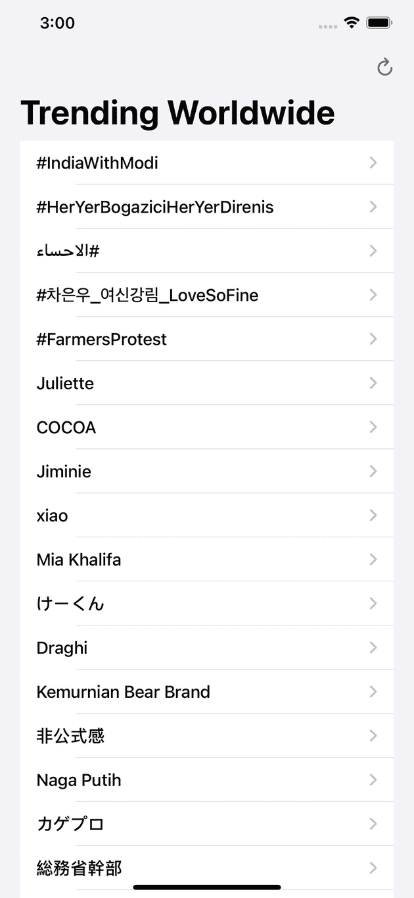
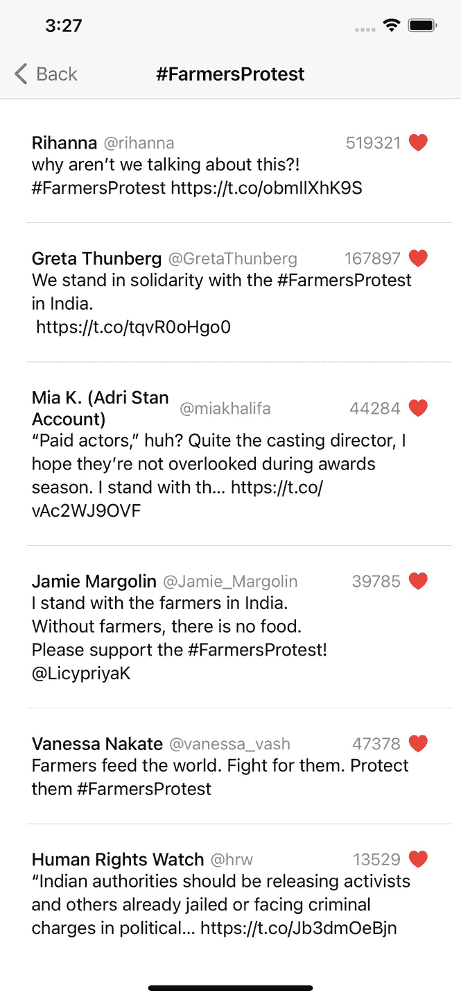
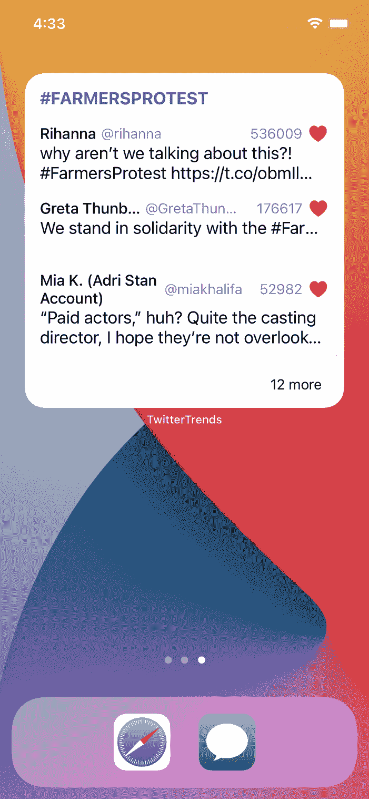
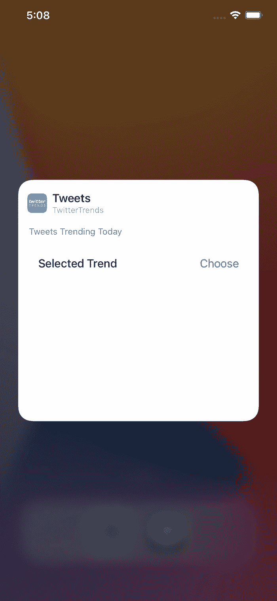
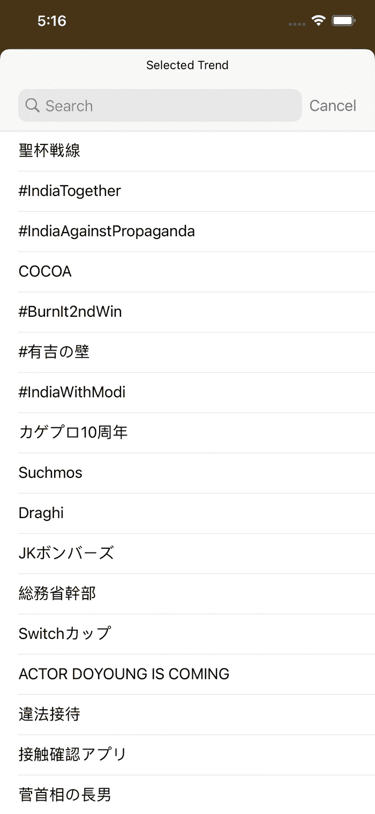
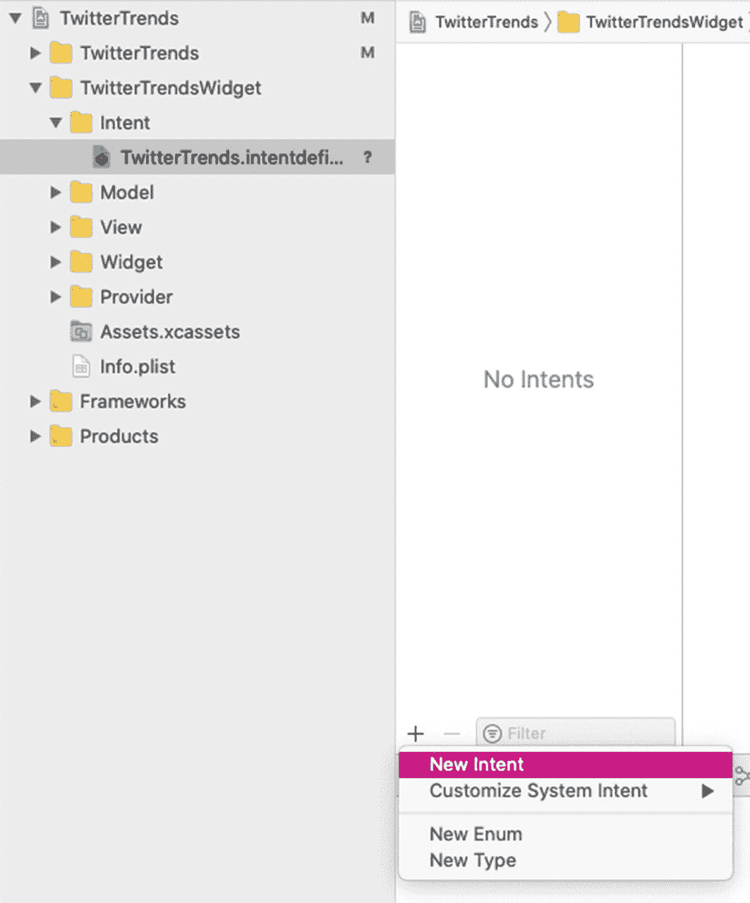
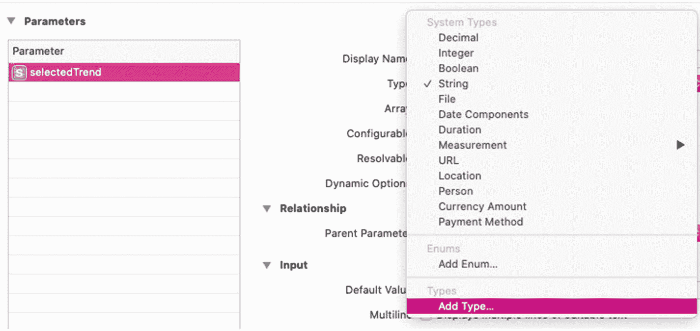
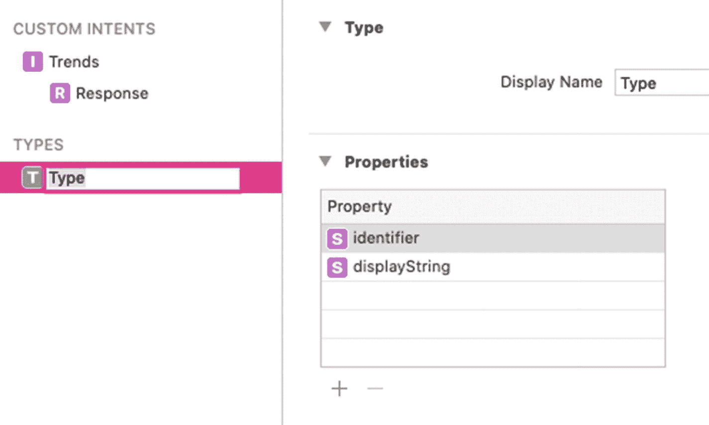
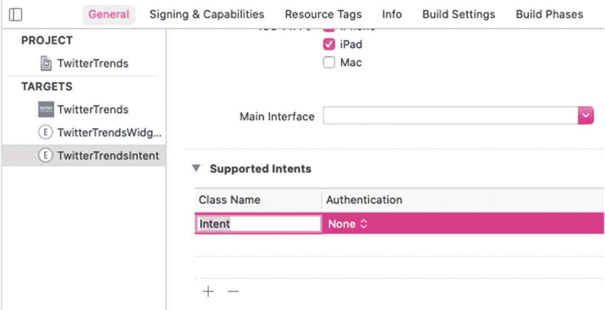

# 5. 抓取配置选项

如果你已经读到了本书的这一章，那么到现在为止，你已基本了解如何开发不同尺寸的组件，这些组件不仅能显示静态数据，还能在指定时间间隔从服务器获取新数据。此外，你还学会了如何为组件添加交互目标，并使其可配置。

通过遵循上一章给出的步骤，你开发的组件为用户提供了一个硬编码配置选项列表，用户可据此配置自己的组件。具体来说，在 `OnThisDay` 应用的组件中，用户可以从组件配置屏幕中选择一个事件类别，从而让组件只显示与该类别相关的事件信息。你硬编码了所有可供用户选择的类别。这正是本章与上一章的区别所在。

在本章中，你将学习如何从服务器获取数据，以便将这些数据用作可配置组件参数的配置选项。如果你将本章所学应用到 `OnThisDay` 应用中，你就能用从服务器获取的动态类别选项，替换之前硬编码的类别选项。

现在，我们理解你可能已经对同一个应用感到厌倦了。因此，在本章中，你将使用一个新应用 `TwitterTrends`（喜欢推特的朋友们会喜欢的）。

## 开始上手

要开始使用 `TwitterTrends`，请解压名为 `TwitterTrends.zip` 的文件，然后从 `TwitterTrendsStarter` 文件夹中打开 `TwitterTrends.xcodeproj`。由于该项目需要使用推特的 API 端点，因此必须生成一个 bearer token。你需要在每次请求或 API 调用的头部传递这个 bearer token，推特会对其验证。如果传递了有效的 bearer token，推特会返回你所请求的数据。否则，推特将拒绝你的访问。

如果你已经拥有推特开发者账号，你应该可以生成自己的 bearer token。但如果你没有开发者账号，你首先需要从推特的开发者账号页面申请。^(¹¹) 通常，推特需要一到两天甚至更长时间来审核你的申请。

如果你的推特开发者账号已准备就绪，请通过阅读此链接的文章生成自己的 bearer token。^(¹²) 然后，打开项目中 `TwitterTrends` 文件夹下的 `TwitterTrendsAPI.swift`，将内容为 "Your bearer token here" 的字符串替换为你自己的 bearer token 字符串。最后，你就可以运行应用了。

现在，选择 `TwitterTrends` 方案并运行项目，你将看到如图 5-1 所示的屏幕截图。



图 5-1

`TwitterTrends` 的主屏幕，显示推特上全球流行的趋势列表

图 5-1 展示了 `TwitterTrends` 应用的主屏幕，其中显示了推特上全球流行的热门趋势列表。`TwitterTrends` 通过使用推特的 `GET trends/place`^(¹³) API 端点来实现此功能。如果你试用一下这个应用，你会发现你可以点击每个趋势，进入一个显示与该趋势相关推文的屏幕（图 5-2）。



图 5-2

`TwitterTrends` 显示关于趋势 `#FarmersProtest` 的推文列表

图 5-2 展示了在 `TwitterTrends` 主屏幕点击 `#FarmersProtest` 趋势后显示的推文列表屏幕。该推文列表是通过使用推特的 `GET search/tweets`^(¹⁴) API 端点获取的。

总之，`TwitterTrends` 让用户了解推特上的热门趋势，并获取与这些趋势相关的推文。但是，等等，你看了 `TwitterTrends` 的组件了吗？`TwitterTrends` 有一个大尺寸组件（图 5-3），它显示的是与推特 `GET trends/place` API 端点返回的数组中的第一个趋势相关的推文。



图 5-3

`TwitterTrends` 的大尺寸组件

在图 5-3 中，你可以看到 `TwitterTrends` 大尺寸组件的外观。大尺寸组件是 `TwitterTrends` 拥有的唯一组件类型。在组件顶部，显示了趋势名称。其下方列出了与该趋势相关的推文，以及每条推文的一些附加信息。如果推文超过三条，则会显示一个 `Text`，注明组件未能容纳的推文数量。


当前，如果你尝试编辑小组件并配置它，你会发现并没有相关的选项。但在后续章节中，你将让你的应用变得可配置（如图 5-4 所示）。用户将能够从 Twitter API 接口获取的趋势列表（而非硬编码的趋势列表）中选择一个趋势，然后小组件将显示与该趋势相关的推文。这正是本章与前文的不同之处——从服务器获取配置选项，而非硬编码。



**图 5-4**  
TwitterTrends 小组件的配置界面

图 5-4 展示了你将在后续章节中开发的 TwitterTrends 小组件的配置界面。配置界面包含一个参数“**Selected Trend**”，当前它要求用户“**Choose**”（选择）一个趋势，因为尚未选定任何趋势。点击“**Choose**”后，用户将看到一个列出全球热门 Twitter 趋势的屏幕（图 5-5）。这些趋势将从 Twitter 的`GET trends/place`API 端点获取。



**图 5-5**  
用户可从中选择并设置为“Selected Trend”的趋势列表

从图 5-5 所示的屏幕中，用户可以选择任意一个趋势，随后小组件将显示与该选定趋势相关的推文。

听起来是不是很有趣？现在让我们看看已有的代码。我们已经在 TwitterTrends 中为你设置了一些基础内容。

如果你进入 **Project Navigator** 并打开 **TwitterTrends** 项目，你会看到两个主文件夹，即 **TwitterTrends** 和 **TwitterTrendsWidget**。**TwitterTrends** 文件夹包含与应用相关的文件和文件夹，**TwitterTrendsWidget** 文件夹包含与小组件相关的文件和文件夹。此外，还有一些文件通过 **Target Membership** 在两个文件夹间共享。

如果打开 **TwitterTrends** 项目中的 **TwitterTrends** 文件夹，你将看到以下文件夹结构：

```
TwitterTrends
├── Assets.xcassets
├── Extensions
│   └── View.swift
├── Info.plist
├── Models
│   ├── TrendTweets.swift
│   ├── Trends.swift
│   └── Tweets.swift
├── Preview\ Content
├── TwitterTrendsAPI.swift
├── TwitterTrendsApp.swift
├── ViewModel
│   └── TTViewModel.swift
└── Views
    ├── TrendsView.swift
    └── TweetsView.swift
```

在 **TwitterTrends** 文件夹中，除了 **Assets.xcassets** 和 **Info.plist**，你还会看到 **Extensions** 文件夹，其中包含一个名为 **View.swift** 的文件。该文件包含 `View` 的一个扩展，用于处理 `redacted(reason:)` 视图修饰符。

**Models** 文件夹包含 **TrendTweets.swift**、**Trends.swift** 和 **Tweets.swift**，这些是用于解码从 Twitter API 接收的响应数据的模型。这些文件同时被应用和小组件使用。

**Preview Content** 文件夹是 Xcode 自动生成的，用于存储开发所需的资源。Xcode 在发布构建中不会包含此文件夹中的任何资源。

下一个文件是 **TwitterTrendsAPI.swift**。它负责处理与 Twitter API 端点的通信。该文件同时被应用和小组件用于从 Twitter 获取推文和趋势。

还有一个名为 **TwitterTrendsApp.swift** 的文件，它是应用的入口点。

现在，剩下的文件夹只有 **ViewModel** 和 **Views**。**ViewModel** 文件夹包含 **TTViewModel.swift**，其中包含了应用所使用的视图模型。**Views** 文件夹包含 **TrendsView.swift** 和 **TweetsView.swift**，它们分别包含显示热门趋势和与这些趋势相关的推文的屏幕的用户界面。

以上就是对 **TwitterTrends** 文件夹中文件和文件夹的描述。

项目中还有一个名为 **TwitterTrendsWidget** 的文件夹。如果打开它，你将看到如下文件夹结构：

```
TwitterTrendsWidget
├── Assets.xcassets
├── Info.plist
├── Model
│   └── TweetWidgetEntry.swift
├── Provider
│   └── TwitterProvider.swift
├── View
│   └── LargeWidgetView.swift
└── Widget
    └── TwitterTrendsWidget.swift
```

目前，**TwitterTrendsWidget** 中的文件和文件夹较少。除了 **Assets.xcassets** 和 **Info.plist**，还有一个名为 **Model** 的文件夹，其中包含 **TweetWidgetEntry.swift**。该文件包含一个名为 `TweetWidgetEntry` 的 `TimelineEntry`，这对于小组件的正常运行至关重要。

**Provider** 文件夹包含 **TwitterProvider.swift**，它是小组件的 `TimelineProvider`。

同样，你可以看到另一个文件夹 **View**。它包含 **LargeWidgetView.swift**，其中包含小组件的用户界面。

最后，还有一个名为 **Widget** 的文件夹，它包含 **TwitterTrendsWidget.swift**。这是小组件的入口点。

在本章中，你将向小组件文件夹添加更多文件和文件夹，并赋予小组件从远程服务器获取配置选项的能力。

现在，终于到了开始工作的时候了：让小组件具备与 Twitter API 通信的能力，以获取热门趋势，并允许用户选择其中任意一个趋势，在小组件中查看与该特定趋势相关的推文。


## 创建 SiriKit 意图定义文件

此步骤与上一章的步骤类似。在此步骤中，您将创建一个意图定义文件，并使用该文件为您的 widget 定义可配置属性。请按照以下步骤创建该文件：



图 5-6：在意图定义文件中创建新意图

1.  右键点击项目中的 **TwitterTrendsWidget** 文件夹，点击 **New Group** 创建一个新文件夹，并将其命名为 **Intent**。
2.  现在，右键点击 **Intent** 文件夹，点击 **New File…**。
3.  在出现的对话框中，选择 **SiriKit Intent Definition File**，将其命名为 `TwitterTrends.intentdefinition`，并创建该文件。创建文件时，请确保对话框底部勾选了 **TwitterTrendsWidgetExtension** 和 **TwitterTrends** 这两个目标。
4.  打开 `TwitterTrends.intentdefinition`，点击意图文件左下角的“**+**”图标，然后从选项列表中点击 **New Intent**（图 5-6）。



图 5-7：创建名为“selectedTrend”的参数，并将其“类型”更改为“添加类型…”

5.  将意图命名为 **Trends**，并修改该意图的一些配置。由于您仅将意图用于 widget，请勾选 **Intent is eligible for widgets**，并取消勾选 **Intent is user-configurable in the Shortcuts app and Add to Siri** 和 **Intent is eligible for Siri Suggestions**。
6.  现在，点击 **Parameters** 部分下方的“**+**”按钮，添加一个名为 `selectedTrend` 的参数。参数是用户将在 widget 配置界面中看到并修改的属性，用以配置您的 widget。在 widget 配置界面（图 5-4）中显示的显示名称会自动设置为 **Selected Trend**。
7.  然后，将 `selectedTrend` 参数的类型更改为 **添加类型…**（图 5-7）。



图 5-8：点击“添加类型”后显示的界面

8.  点击 **添加类型…** 后，会立即显示一个新界面，如图 5-8 所示。在左侧 **TYPES** 标题下的项目中输入名称，将新类型更名为 `SelectedTrend`。
9.  再次回到 **Trends** 自定义意图，选中 `selectedTrend` 参数，并勾选 **Options are provided dynamically**，这是因为您希望通过从远程服务器获取数据来动态提供该参数的选项。同时，取消勾选 **Siri can ask for value when run**，因为您不需要与 Siri 协作。

通过这种方式，您便创建了一个意图定义文件，并添加了参数 `selectedTrend`，用户将在 widget 的配置界面中使用该参数选择他们喜欢的趋势。

## 设置 IntentHandler 以获取热门趋势并发送至 Widget

现在，您需要添加一个机制，以便在创建时间线时使用 `selectedTrend` 参数。在上一章中，这个过程简单直接，因为您有一个包含一组已定义或硬编码值的 `enum`。但这次您将使用一个 `class`，情况会有所不同。

因此，首先您需要为 widget 提供 `SelectedTrend` 类型的 `selectedTrend` 参数可以持有的值。为此，您需要一个意图处理器（intent handler），它负责从服务器获取这些值并提供给您的 widget。



图 5-9：点击“支持的意图”下方的“+”图标后显示的界面

1.  在 Xcode 中，转到 **File** ➤ **New** ➤ **Target** 创建一个新目标。在出现的对话框中，选择 **Intents Extension**，然后点击 **Next**。
2.  在显示的对话框中，将 **Product Name** 设置为 `TwitterTrendsIntent`，**Language** 设置为 **Swift**，**Starting Point** 设置为 **None**。确保 **Include UI Extension** 未被勾选。将 **Project** 设置为 `TwitterTrends`，**Embed in Application** 的值设置为 `TwitterTrends`。然后点击 **Finish**。如果被询问是否要 **Activate “TwitterTrendsIntent” scheme**，请点击 **Cancel**，因为后续运行 widget 或 App 时无需激活该 scheme。

现在，您的项目中创建了一个名为 `TwitterTrendsIntent` 的新文件夹，其中包含 `IntentHandler.swift` 和 `Info.plist`。您将在 `IntentHandler.swift` 文件中编写代码，从 Twitter 服务器获取热门趋势并将其发送到您的 widget。

3.  现在，打开 `TwitterTrendsWidget` 的 **Intent** 文件夹中的 `TwitterTrends.intentdefinition` 文件，通过勾选 `TwitterTrendsIntent` 来更新其 **Target Membership**。现在，该文件可以从 `TwitterTrends`、`TwitterTrendsWidget` 和 `TwitterTrendsIntent` 访问。
4.  需要注意的是，`TwitterTrendsIntent` 目标需要知道它可以支持的意图类型。为此，选择位于 **Project Navigator** 顶部的 `TwitterTrends` 项目（而不是 `TwitterTrends` 文件夹）以进入项目设置。现在，在 **TARGETS** 部分中选择 `TwitterTrendsIntent` 目标，并进入其 **General** 标签页。
5.  在 `TwitterTrendsIntent` 的 **General** 标签页中，转到 **Supported Intents** 部分，点击其下方的“**+**”号新增一个支持的意图。此时的界面将如图 5-9 所示。
6.  在 **Class Name** 标题下输入 `TrendsIntent`。由于您在步骤 3 中已将 `TwitterTrends.intentdefinition` 设为 `TwitterTrendsIntent` 目标的成员，因此开始输入时便会看到建议。`TrendsIntent` 这个名称是由 Xcode 根据您在**创建和配置 SiriKit 意图定义文件** 的步骤 5 中添加到 `TwitterTrends.intentdefinition` 的自定义意图名称 **Trends** 自动生成的。最后，让 `TrendsIntent` 的 **Authentication** 保持为 **None**。
7.  现在，打开 `TwitterTrendsIntent` 文件夹中的 `IntentHandler.swift`。目前，`IntentHandler` 类继承自 `INExtension` 类。现在让 `IntentHandler` 遵循 Xcode 自动生成的 `TrendsIntentHandling` 协议。完成此操作后，`IntentHandler.swift` 中的代码将如代码清单 5-1 所示。
8.  一旦您使 `IntentHandler` 遵循 `TrendsIntentHandling`，Xcode 将显示一条错误消息：“类型‘IntentHandler’不符合协议‘TrendsIntentHandling’。是否要添加协议存根？”这是因为您尚未在 `IntentHandler` 中实现 `TrendsIntentHandling` 协议的属性。


2.  单击 **Fix**，让 Xcode 生成 `provideSelectedTrendOptionsCollection(for:with:)` 的实现。你将在此处通过 `TwitterTrendsAPI` 与 Twitter 服务器通信，获取热门趋势。但目前 `IntentHandler.swift` 无法访问 `TwitterTrendsAPI`，因此你需要更新其 **Target Membership**。

3.  打开 **TwitterTrends** 文件夹中的 **TwitterTrendsAPI.swift**，然后更新其 **Target Membership**，为 **TwitterTrendsIntent** 添加勾选标记。现在你就能从 `IntentHandler.swift` 中访问它了。

4.  打开 `IntentHandler.swift`，通过将当前实现替换为代码清单 5-2 中的代码来实现 `provideSelectedTrendOptionsCollection(for:with:)`。

```swift
import Intents
class IntentHandler: INExtension, TrendsIntentHandling {
    override func handler(for intent: INIntent) -> Any {
        return self
    }
}
// 代码清单 5-1
// 符合 TrendsIntentHandling 协议后的 IntentHandler
```

```swift
func provideSelectedTrendOptionsCollection(for intent: TrendsIntent, with completion: @escaping (INObjectCollection?, Error?) -> Void) {
    // a
    TwitterTrendsAPI.getAvailableTrends { response in
        // b
        switch response {
            // c
        case .success(let trends):
            // d
            if let firstTrend = trends.first {
                // e
                let availableTrends = firstTrend.trends
                // f
                let usableTrends: [SelectedTrend] = availableTrends.map { element in
                    return SelectedTrend(identifier: element.query, display: element.name)
                }
                // g
                let inObjectCollection: INObjectCollection = INObjectCollection(items: usableTrends)
                completion(inObjectCollection, nil)
            }
        case .failure(let error):
            // h
            print(error.localizedDescription)
        }
    }
}
// 代码清单 5-2
// provideSelectedTrendOptionsCollection(for:with:) 的实现
```

粘贴代码清单 5-2 的代码后，你一定会看到大量错误。因此，在描述代码清单 5-2 的内容之前，我们先消除这些错误。浏览错误信息后，你会发现 Xcode 提示找不到类型 `Trends`、`TrendTweets`、`Trend` 和 `Tweets`。这是因为 `TwitterTrendsAPI` 现在也是 **TwitterTrendsIntent** 目标的成员，但它使用的结构体（`TrendTweets`、`Trend` 和 `Tweets`）却不是该目标的成员。因此，你需要将这些结构体设为 **TwitterTrendsIntent** 的成员。

从 **TwitterTrends** 的 **Models** 文件夹中打开 `TrendTweets.swift`，并更新其 **Target Membership**，为 **TwitterTrendsIntent** 添加勾选标记。对 `Trends.swift` 和 `Tweets.swift` 重复同样的操作。

1.  现在构建你的项目，你会发现所有错误都已消失。接下来，我们回到代码清单 5-2 来了解其具体内容。
    1.  由于 `provideSelectedTrendOptionsCollection(for:with:)` 方法是你获取 Twitter 热门趋势并将其作为 `selectedTrend` 参数的选项进行传递的位置，因此你通过调用 `TwitterTrendsAPI` 的 `getAvailableTrends(id:completion:)` 方法来开始实现。

2.  `getAvailableTrends(id:completion:)` 通过其完成处理器返回 `response`。`response` 可以是 `.success` 或 `.failure`，因此使用 `switch` 语句进行处理。

3.  如果 `response` 的值为 `.success`，则它包含 `trends`，即热门趋势的数据。

4.  如果你研究一下 Twitter 的 **GET trends/place** API 端点的响应格式，就会发现它返回一个包含单个对象的数组。通过 `trends.first` 访问该对象，并将其存储在 `firstTrend` 中。

5.  现在，所有已获取的趋势都存储在 `firstTrend` 的 `trends` 属性中。因此，通过 `firstTrend.trends` 访问它们，并存储在 `availableTrends` 中。

6.  由于你在 `TwitterTrends.intentdefinition` 中已将 `selectedTrend` 参数的数据类型定义为 `SelectedTrend`，因此现在需要将从 Twitter API 获取的趋势转换为该类型。为此，对 `availableTrends` 数组中的所有值运行 `map`，每次迭代使用 `query` 和 `name` 创建新的 `SelectedTrend` 实例。然后将它们存储在 `usableTrends` 数组中，该数组用于存储 `SelectedTrend` 值。

7.  在此步骤中，将 `usableTrends` 传递给 `INObjectCollection` 初始化器，并存储在 `inObjectCollection` 中。然后，通过将 `inObjectCollection` 作为参数传递给完成处理器来调用它。这样，从 Twitter 服务器获取的热门趋势就会被发送到 widget 的 `selectedTrend` 参数。

8.  如果 `response` 包含 `.failure`，则访问其 `error` 属性并将其打印到控制台。

通过这种方式，你从 Twitter API 获取了趋势，将它们转换为你在 `TwitterTrends.intentdefinition` 中创建的 `selectedTrend` 参数的类型，并传递给了 `selectedTrend`。

## 切换到 IntentConfiguration

目前，如果你构建并运行项目，会发现长按 widget 并不会显示 **Edit Widget** 选项。这是因为你尚未做好必要的准备，将 `StaticConfiguration` 替换为 `IntentConfiguration`。而要使用 `IntentConfiguration`，你需要一个与当前不同的时间线提供器。只需按照以下步骤进行，即可完成向 `IntentConfiguration` 的“大迁移”。


### 创建 `IntentTimelineProvider`

如前所述，切换到 `IntentConfiguration` 的第一步是设置一个 `IntentTimelineProvider`。请按照以下步骤进行设置：

1.  右键点击 **TwitterTrendsWidget** 文件夹中的 **Provider** 文件夹，点击 **新建文件...**，然后创建一个名为 `TwitterTrendsIntentProvider.swift` 的新 Swift 文件。在创建文件之前，请确保对话框底部的 **TwitterTrendsWidgetExtension** 目标已被勾选。

**注意**：你也可以使用现有的 `TwitterProvider.swift` 文件，而不是创建 `TwitterTrendsIntentProvider.swift`，但为了清晰起见，我们建议你创建 `TwitterTrendsIntentProvider.swift`。

2.  打开 `TwitterTrendsIntentProvider.swift`，并将现有代码内容替换为代码清单 5-3 中给出的代码。

1.  在代码清单 5-3 中，创建了一个遵循 `IntentTimelineProvider` 协议的名为 `TwitterTrendsIntentProvider` 的结构体。一旦你添加了代码，Xcode 会询问是否要添加协议存根（protocol stubs）。点击 **Fix** 并添加它们，你会看到 `Entry` 和 `Intent` 这两个 `typealias` 被添加到了结构体中。

2.  在 `TwitterTrendsIntentProvider` 中，将 `Entry` 的类型占位符替换为 `TweetWidgetEntry`（一种时间线条目类型）。同时，将 `Intent` 的类型占位符替换为 `TrendsIntent`，该名称源自你在 `TwitterTrends.intentdefinition` 中创建的自定义意图 `Trends`。

现在你的代码应类似于代码清单 5-4 中的代码。

```
import SwiftUI
import WidgetKit

struct TwitterTrendsIntentProvider: IntentTimelineProvider {
}
代码清单 5-3
创建遵循 IntentTimelineProvider 的 TwitterTrendsIntentProvider
```

1.  你仍会看到 Xcode 要求你添加协议存根。同样添加它们。然后，`placeholder(in:)`、`getSnapshot(for:in:completion:)` 和 `getTimeline(for:in:completion:)` 方法就会生成。

2.  要实现 `TwitterTrendsIntentProvider` 的 `placeholder(in:)` 和 `getSnapshot(for:in:completion:)` 方法，你可以从 `TwitterProvider.swift` 中 `TwitterProvider` 的 `placeholder(in:)` 和 `getSnapshot(for:in:completion:)` 方法复制代码，因为相同的实现是可用的。

3.  `TwitterTrendsIntentProvider` 的 `getTimeline(for:in:completion:)` 方法与 `TwitterProvider` 的 `getTimeline(in:completion:)` 方法不同，因为 `TwitterTrendsIntentProvider` 遵循 `IntentTimelineProvider`，而 `TwitterProvider` 遵循 `TimelineProvider`。`TwitterTrendsIntentProvider` 的 `getTimeline(for:in:completion:)` 方法允许你从 widget 的配置中访问数据。

在当前场景中，你将访问 widget 配置中选中的趋势（trend），并使用它来执行 API 调用，以获取与该选中趋势相关的推文。如果没有选中的趋势，你将让 widget 获取与从 Twitter API 获取的趋势数组中第一个趋势相关的推文。所有这些操作都将在 `getTimeline(for:in:completion:)` 中完成。

在开始处理 `getTimeline(for:in:completion:)` 之前，我们先创建一个方法 `createTimelineFromTweets(response:)`，用于从 API 获取的推文中创建时间线。然后，你可以从 `getTimeline(for:in:completion:)` 中调用此方法。这将使代码更具可读性和易于理解。复制代码清单 5-5 中给出的代码，并将其粘贴到 `TwitterTrendsIntentProvider` 中。

```
import SwiftUI
import WidgetKit

struct TwitterTrendsIntentProvider: IntentTimelineProvider {
    typealias Entry = TweetWidgetEntry
    typealias Intent = TrendsIntent
}
代码清单 5-4
添加 Entry 和 Intent 类型后的 TwitterTrendsIntentProvider
```

```
func createTimelineFromTweets(response: Result) -> Timeline {
    // a
    let currentDate = Date()
    // b
    let refreshDate = Calendar.current.date(byAdding: .minute, value: 30, to: currentDate)!
    // c
    var entry = TweetWidgetEntry(date: refreshDate, statuses: Tweets.dummyTweets, trendTitle: "")
    // d
    var timeline = Timeline(entries: [entry], policy: .after(refreshDate))
    // e
    switch response {
    case let .success(tweets):
        // f
        entry = TweetWidgetEntry(date: refreshDate, statuses: tweets.statuses, trendTitle: tweets.title)
        timeline = Timeline(entries: [entry], policy: .after(refreshDate))
        return timeline
    case let .failure(error):
        // g
        print(error.localizedDescription)
        return timeline
    }
}
代码清单 5-5
创建 createTimelineFromTweets(response:) 方法
```

在代码清单 5-5 中，你创建了一个方法 `createTimelineFromTweets(response:)`，它有一个参数 `response` 并返回一个时间线。在该方法中，完成了以下工作：

1.  现在是时候开始在 `getTimeline(for:in:completion:)` 方法中工作了。将现有的 `getTimeline(for:in:completion:)` 方法替换为代码清单 5-6 中给出的代码。

1.  首先，当前日期被存储在 `currentDate` 中。

2.  接着，生成在 `currentDate` 基础上增加 30 分钟后的日期，并存储在 `refreshDate` 中。稍后你将使用它来设置 widget 的刷新策略。

3.  在此步骤中，通过将 `refreshDate`、虚拟推文和一个空标题字符串传递给初始化器，创建了 `TweetWidgetEntry` 时间线条目，并将其存储在 `entry` 中。

4.  现在，使用 `entry` 并设置刷新策略为 30 分钟后让 widget 请求新的时间线，从而创建了一个时间线。这样就完成了时间线的创建。

5.  由于 `response` 可能携带 `.success` 值或 `.failure` 值，因此通过 `switch` 分支来处理。如果 `response` 携带 `.success` 值，则使用 `.success` 中接收到的 `tweets`，并利用 `tweets` 的 `title` 和 `statuses` 属性创建一个新的 `TweetWidgetEntry`。然后，`entry` 变量的值被这个新条目替换。同时，`timeline` 变量的值也被替换为使用 `entry` 的新值创建的新时间线，并返回该 `timeline`。

6.  如果 `response` 携带 `.failure`，则访问 `error` 变量，并将其值输出到控制台。同时，由于方法必须返回一个时间线，因此返回包含虚拟推文和空标题的 `timeline` 变量（在步骤 "c" 和 "d" 中创建）。

```
func getTimeline(for configuration: TrendsIntent, in context: Context, completion: @escaping (Timeline) -> Void) {
    // a
    if let trend = configuration.selectedTrend {
        let selectedTrend = Trend(name: trend.displayString, query: trend.identifier!)
        TwitterTrendsAPI.getTweets(on: selectedTrend) { response in
            completion(createTimelineFromTweets(response: response))
        }
    } else { // b
        TwitterTrendsAPI.getLatestTweets { response in
            completion(createTimelineFromTweets(response: response))
        }
    }
}
代码清单 5-6
getTimeline(for:in:completion:) 方法的实现
```

在代码清单 5-6 中，给出了 `getTimeline(for:in:completion)` 方法的实现。代码清单 5-6 中完成了以下工作：

1.  此方法检查两种情况——第一种是 `configuration` 中存在 `selectedTrend` 的值，第二种是 `selectedTrend` 不包含任何值。`selectedTrend` 属性是你在本章前几节中在 `TwitterTrends.intentdefinition` 中创建的参数。


在当前步骤中，代码会检查用户是否已从配置屏幕中选择了趋势。因此，如果用户已选择一个趋势（即`selectedTrend`中存有值），该值会被存储到`trend`中，并通过使用该趋势的`displayString`和`identifier`创建一个新的`Trend`实例。

然后，调用`TwitterTrendsAPI`的`getTweets(on:completion:)`方法来获取与该趋势相关的推文。当收到`response`时，会通过将`createTimelineFromTweets(response:)`的调用作为参数传入，来调用`getTimeline(for:in:completion:)`方法的完成处理器。

`createTimelineFromTweets(response:)`将从 API 调用中收到的`response`作为参数，生成一个时间线并返回。最后，`getTimeline(for:in:completion:)`的完成处理器会使用该时间线，从而为小组件创建一个时间线。

但如果用户尚未选择任何趋势（或`configuration`的`selectedTrend`属性中没有值），则会调用`TwitterTrendsAPI`的`getLatestTweets(completion:)`方法。该方法首先从 Twitter 的 API 获取所有趋势，从 API 响应中选择第一个趋势，获取与该趋势相关的推文，并将其作为`response`返回。收到响应后，通过将`createTimelineFromTweets(response:)`的调用作为参数传入，来调用`getTimeline(for:in:completion:)`方法的完成处理器。

然后，`createTimelineFromTweets(response:)`将从 API 调用中收到的`response`作为参数，生成一个时间线并返回。最后，`getTimeline(for:in:completion:)`的完成处理器会使用该时间线，从而为小组件创建一个时间线。

通过这种方式，你创建了一个`IntentTimelineProvider`，这是切换到`IntentConfiguration`所必需的。

### 切换到`IntentConfiguration`

现在你已经准备好切换到`IntentConfiguration`了。如果你打开`TwitterTrendsWidget`文件夹中的`Widget`文件夹里的`TwitterTrendsWidget.swift`文件，你会看到目前`TwitterTrendsWidget`的`body`中使用了`StaticConfiguration`。

在`TwitterTrendsWidget`中，使用列表 5-7 中的代码创建一个名为`dynamicConfiguration`的变量。

```
var dynamicConfiguration: some WidgetConfiguration {
    IntentConfiguration(kind: kind, intent: TrendsIntent.self, provider: TwitterTrendsIntentProvider()) { entry in
        LargeWidgetView(tweets: entry.statuses, title: entry.trendTitle)
    }
    .supportedFamilies([.systemLarge])
    .configurationDisplayName("Tweets")
    .description("Tweets Trending Today")
}
```
列表 5-7 创建`dynamicConfiguration`变量

在列表 5-7 中，创建了一个名为`dynamicConfiguration`的变量，它返回一个`IntentConfiguration`初始化器。它使用了`TwitterTrendsWidget`的`kind`变量的值、`TrendsIntent`作为其意图，以及`TwitterTrendsIntentProvider`的初始化器作为其时间线提供者。其他所有代码行与`TwitterTrendsWidget`的`body`中现有的`StaticConfiguration`类似。

现在，将`TwitterTrendsWidget`的`body`替换为列表 5-8 中的代码。

```
var body: some WidgetConfiguration {
    dynamicConfiguration
}
```
列表 5-8 在`TwitterTrendsWidget`的`body`中使用`dynamicConfiguration`

列表 5-8 中的代码将`StaticConfiguration`替换为包含`IntentConfiguration`的`dynamicConfiguration`变量。

干得好！你已经切换到了`IntentConfiguration`。

## 测试——测试——再测试！

卸载设备或模拟器上所有现有的**TwitterTrends**安装。然后，选择**TwitterTrends**方案并运行它。要测试你的小组件，请将 TwitterTrends 小组件添加到主屏幕并尝试编辑它。你应该会看到一个类似于图 5-4 所示的配置屏幕。点击**选择**，查看一个显示从 Twitter 获取的趋势列表的屏幕。这个屏幕将类似于图 5-5。从该屏幕中，选择任何趋势并返回主屏幕。现在，在你的小组件中，你应该会看到与你选择的特定趋势相关的推文。

太棒了！希望你觉得这个过程很有趣。

## 总结

恭喜你走到了这一步！在本章中，你学习了如何让你的小组件从服务器获取数据，以便将这些数据用作可配置小组件中参数的配置选项。本章的某些部分对你来说可能像是前几章的复习。我们希望你喜欢跟着学习。如果你有任何困惑，请打开`TwitterTrends.zip`中名为`TwitterTrendsFinal`的最终项目文件夹，查看代码的最终版本。

现在你已经能够创建任何类型的小组件——无论是可以或不可以配置的小组件，还是参数具有硬编码配置选项或从服务器获取的动态配置选项的小组件。你已经完全掌握了它们。

祝你未来好运。编码愉快！

脚注 [1] [2] [3] [4] 索引 A, B, C `CategoriesExtension.swift` `createTimelineFromTweets(response:)` 方法 D, E `DateHelper.getDayAndMonthInNumbers()` 方法 深度链接 `detail(with:category:)` 方法 F `fetchOnThisDayData(for:completion:)` 方法 `fetchOnThisDayData(with:)` 方法 G `getSnapshot(in:completion:)` 方法 `getTimeline(for:in:completion:)` 方法 H, I, J, K, L `handleLinks(for:)` 方法 `HStack` 人机界面指南 (HIG) M, N `@main` 属性 O `onOpenURL(perform:)` 方法 `OnThisDay` API 详情屏幕 文件夹结构 主屏幕 大尺寸小组件 中等尺寸小组件 选项 `Provider.swift` 截图 显示 选择事件 小尺寸小组件 事件类型 用户 `OnThisDayApp.swift` `OnThisDayWidgetExtension` `OnThisDayWidget.swift` API 创建变量 `WidgetView` `IntentConfiguration` category 属性 intent 类型 方法 `WidgetEvent` 时间线条目 `StaticConfiguration` `Categories` 枚举 intent 定义文件 参数 `SiriKit` P, Q, R `placeholder(in:)` 方法 `provideSelectedTrendOptionsCollection(for:with:)` 方法 S `supportedFamilies(_:)` `SwiftUI` 声明式方法 定义 救星 视图 按钮 `HStack` 图像 文本 `VStack` `ZStack` T, U, V 点击目标 大号小组件 中等小组件 小号小组件 `TimelineEntry` `TimelineProvider` date 属性 定义 `getSnapshot` `getTimeline` placeholder `SmallWidgetDataProvider` `TrendsView.swift` `TweetsView.swift` `TwitterTrends` 创建文件 创建参数 `dynamicConfiguration` 文件夹结构 主屏幕 `IntentConfiguration` intent 定义文件 `IntentTimelineProvider` 大尺寸 推文列表 `selectedTrend` 参数 `TrendsIntentHandling` 用户 `TwitterTrendsWidget.swift` W, X, Y, Z 小组件 组件 扩展 `SoccerTime` 的 UI `WidgetConfiguration` `WidgetFamily` `WidgetKit` Apple 框架 定义 特性 `widgetURL(_:)` 方法 `WidgetView.swift` 文件
