# 第 1 章


## Android 应用 GUI 设计，第 1 部分：总览

自 20 世纪 80 年代问世以来，*图形用户界面*（GUI）的概念已成为*人机交互*（HCI）中不可或缺的一部分。随着嵌入式系统的发展，它也逐步采纳了这一概念。运行在英特尔凌动硬件平台上的 Android 嵌入式操作系统正引领着这一潮流。

由于资源有限，Android 系统的 GUI 设计比桌面系统更具挑战性。此外，用户对高质量用户体验有着更严格的要求和期望。界面设计已成为决定系统和应用在市场上成败的关键因素之一。本章介绍如何为 Android 嵌入式系统开发适合典型用户交互的用户界面。

### 嵌入式应用 GUI 概述


### Android 用户界面与用户体验设计

如今，软件的用户界面（UI）和用户体验（UX）正日益成为决定软件能否被用户接受并取得市场成功的关键因素。UX 设计需基于输入/输出或交互设备的类型，并必须符合其特性。与桌面计算机系统相比，Android 系统拥有不同的交互设备和交互方式。如果盲目照搬桌面系统的 UI 设计，Android 设备将呈现糟糕的 UI 和难以忍受的 UX，令用户无法接受。此外，随着用户对出色用户体验的期望越来越高，开发者在设计系统 UI 和 UX 时必须更加细致和谨慎，使其符合嵌入式应用的特点。

本章首先介绍桌面系统通用的 GUI 设计方法，然后阐述嵌入式系统的 UI 设计有何不同，旨在帮助你快速掌握 Android 应用 GUI 设计的通用方法和原则。

### Android 设备交互方式的特点

通用的桌面计算机拥有强大的输入/输出（或称交互）设备，例如大尺寸高分辨率屏幕、完整键盘和鼠标，以及多种交互方式。典型的桌面计算机屏幕至少 17 英寸，分辨率至少为 1280 × 960 像素。键盘通常是完整键盘或增强型键盘。在完整键盘上，字母、数字和其他字符位于对应的按键上——即完整键盘提供了对应所有字符的按键。增强型键盘则带有额外的按键。完整键盘上按键间距约为 19 毫米，便于用户进行选择。

基于屏幕、键盘和鼠标的桌面计算机 GUI 交互模式被称为 WIMP（窗口、图标、菜单和指针），这是一种使用这些元素以及按钮、工具栏和对话框等交互元素的 GUI 风格。WIMP 依赖屏幕、键盘和鼠标设备来完成交互。例如，鼠标（或类似鼠标的设备，如光笔）用于定位，键盘用于输入字符，屏幕显示输出。

除了屏幕、键盘、鼠标等标准交互硬件外，桌面计算机还可以配备操纵杆、头盔、数据手套等多媒体交互设备，以实现多媒体计算功能。通过安装摄像头、麦克风、扬声器等设备，并借助其强大的计算能力，用户可以通过语音、手势、面部表情等方式与桌面计算机进行交互。

桌面计算机通常还配备 CD-ROM/DVD 等大容量便携式外部存储设备。借助这些外部存储设备，桌面计算机可以通过 CD/DVD 发布软件并验证所有权和证书。

由于嵌入式系统的嵌入性和资源有限性，以及用户对便携性和移动性的需求，Android 系统的交互方式、方法和能力与桌面系统截然不同。受这些特性和条件影响，Android 系统上的交互比桌面系统要求更高，实现难度也更大。

接下来将介绍 Android 设备与桌面计算机的主要区别。

#### 多种尺寸、密度和规格的屏幕

与桌面计算机的大尺寸高分辨率屏幕不同，Android 设备屏幕更小，且具有多种尺寸和密度（以每英寸点数 DPI 衡量）。例如，K900 智能手机的屏幕为 5.5 英寸，分辨率为 1920×1080 像素，而有些智能手机的屏幕仅为 3.2 英寸。

Android 设备屏幕的宽高比并非桌面计算机常用的 16:9 或 4:3。如果 Android 设备沿用桌面计算机的交互模式，将会导致许多问题，例如显示模糊和选择目标时出现错误。

#### 键盘与特殊按键

桌面计算机拥有完整键盘，每个字符对应一个按键，且按键间距宽敞，便于打字。如果 Android 设备配有键盘，通常是小键盘而非完整键盘。小键盘的按键比完整键盘少；通常多个字符共用一个按键。小键盘的按键比完整键盘更小、排列更紧密，导致选择和输入字符更加困难。因此，小键盘使用起来不如完整键盘方便。此外，某些小键盘还提供标准完整键盘上没有的特殊按键，因此用户必须在 Android 设备上调整输入方式。

一般而言，在 Android 设备上，按键和按钮是统一的概念。无论按下按钮还是按键，该操作都会以具有统一编号方案的键盘事件方式处理。Android 中的键盘事件对应 `android.view.KeyEvent` 类。图 1-1 中的按钮/按键标识对应着表 1-1 中列出的事件信息。

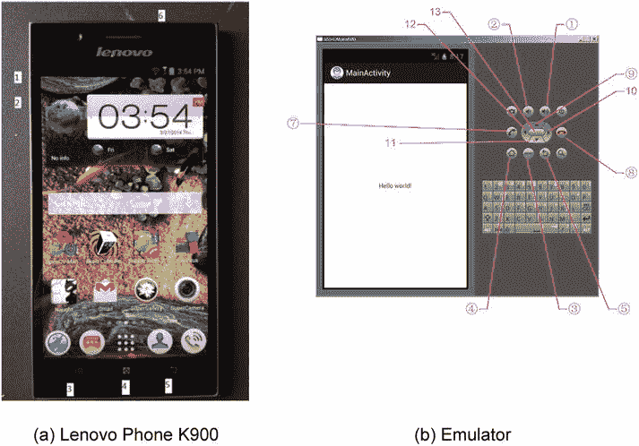

图 1-1. Android 手机的键盘与按钮

表 1-1. 按键与按钮事件对应的 Android 事件信息

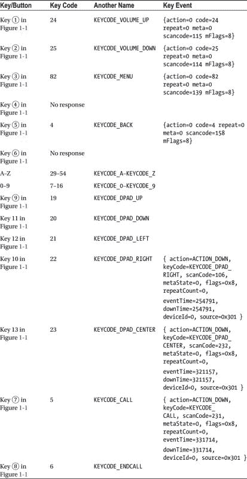

详细信息请参阅 `android.view.KeyEvent` 等帮助文档。表 1-1 的内容为摘录。

#### 触摸屏与触控笔替代鼠标

*触摸屏*是一种覆盖在显示设备上、用于记录触摸位置的输入设备。通过使用触摸屏，用户可以对显示的信息做出更直观的反应。触摸屏广泛应用于 Android 设备，并取代鼠标进行用户输入。最常见的触摸屏类型有电阻式触摸屏、电容式触摸屏、表面声波触摸屏和红外触摸屏，其中电阻式和电容式触摸屏最常应用于 Android 设备。用户可以直接点击屏幕上的视频和图像进行观看。

触控笔可用于实现类似触摸的功能。某些触控笔是触摸屏的辅助工具，替代手指，帮助用户完成精细的定位、选择、画线等操作，尤其是在触摸屏较小时。另一些触控笔则与其他系统组件共同实现触摸和输入功能。对于第一类辅助工具型触控笔，用户可以用手指进行触摸和字符输入。但第二类触控笔是不可或缺的输入工具，用于替代手指。

触摸和触控笔可以执行大多数鼠标的典型功能，例如点击和拖拽，但无法实现鼠标的所有功能，例如右键单击以及同时左键/右键单击。在设计嵌入式应用时，应将交互方式控制在触摸屏或触控笔能够提供的功能范围内，并避免使用不可用的操作。

#### 屏幕键盘

*屏幕键盘*，也称为*虚拟键盘*或*软键盘*，通过软件显示在屏幕上。用户像敲击物理键盘上的按键一样点击虚拟按键。

#### 有限的多模态交互

*多模态交互*指涉及人类五种感官模式的人机交互。它允许用户通过语音、手写、手势等输入方式与系统交互。由于计算能力有限，Android 设备通常不采用多模态交互。


### 少数大容量便携式外部存储设备

大多数 Android 设备没有 CD-ROM/DVD 驱动器、硬盘或其它大容量便携式存储外设（例如固态硬盘，SSD），而这些通常是台式计算机的标准配置。这些设备无法在 Android 设备上用于安装软件或验证所有权和证书。然而，Android 设备通常支持容量高达 128 GB 的 microSD 卡；并且越来越多基于云的存储解决方案（如 Dropbox、One Drive 和 Google Drive）正在为 Android 设备开发，其兼容的 Android 客户端应用程序可从 Google Play Store 下载。

### 嵌入式系统的 UI 设计原则

本节介绍将传统桌面应用程序转换为嵌入式应用程序时的交互设计问题及纠正措施。

#### 屏幕尺寸的考量

与台式计算机系统相比，Android 系统的屏幕较小，且具有不同的显示密度和纵横比。这种屏幕差异导致将应用程序从桌面系统迁移到 Android 系统时出现许多问题。如果开发者按比例缩小桌面系统的屏幕，图形元素会变得太小而无法清晰可见。特别是，通常难以看清文本和图标、选择和点击某些按钮，以及将某些应用程序图片适当地放置在屏幕上。如果开发者在不改变尺寸的情况下将应用程序的图形元素迁移到 Android 系统，屏幕空间有限，只能容纳少量图形元素。

#### 文本和图标的大小

另一个问题是文本和图标的大小。当应用程序从典型的 15 英寸台式机屏幕缩小到典型的 5 英寸或 7 英寸手机或平板电脑屏幕时，其文本会变得太小而无法看清。除了文本字体的大小，文本窗口（例如聊天窗口）也会变得太小而无法阅读文本。试图缩小字体大小以适配更小的窗口会使文本难以识别。

因此，嵌入式系统的设计应尽可能少地使用文本提示信息；例如，用图形或声音信息替代文本。此外，在必要使用文本的地方，文本大小应可调整。在 Android 上，`res`目录中提供了一些预定义的字体和图标，例如`drawable-hdpi`、`drawable-mdpi`和`drawable-xhdpi`。

#### 按钮及其它图形元素的可点击性

与文本过小的问题类似，按钮和其它图形元素在迁移应用程序时也会带来交互问题。在桌面系统上，按钮的大小是为鼠标点击设计的，而在 Android 系统上，按钮的大小应适合手指（在触摸屏上）或触控笔。因此，在移植基于 Windows 的应用程序以支持 Android 设备时，需要重新设计应用 UI；并且应选择 Android SDK 提供的预定义可绘制对象，以适应手指或触控笔。

开发者应使用更大、更清晰的按钮或图形元素来避免此类问题，并在图形元素之间留出足够的间隙以避免错误——这些错误在使用小型触摸屏通过手指或触控笔进行选择时很常见。此外，如果应用程序在按钮附近有文本标签，这些标签应是按钮所连接的可点击区域的一部分，以便按钮更易于点击。

#### 应用程序窗口的大小

许多应用程序（例如游戏）使用固定大小的窗口，而不是自动调整以填满任何尺寸屏幕的窗口。当这些应用程序迁移到 Android 系统时，由于屏幕的纵横比与其分辨率不匹配，部分图片可能无法显示，或部分区域可能无法触及。

这些问题在智能手机和平板电脑上可能更加复杂，因为它们的屏幕具有各种密度，例如 small（426 dp × 320 dp）、normal（470 dp × 320 dp）、large（640 dp × 480 dp）和 extra large（960 dp × 720 dp）。它们的纵横比多种多样，且与桌面系统常用的纵横比不同。

解决此类问题的一个好方法是，将整个应用程序窗口按比例放置在智能手机或平板电脑屏幕上，例如 large 和 extra large 屏幕（通常为 640 × 480 像素和 960 × 720 像素）；或者重新排列 UI 以充分利用整个宽屏区域；或者使整个应用窗口成为可滚动视图。此外，您可以允许用户使用多点触控手指来放大、缩小或在屏幕上移动应用程序窗口。

#### 由触摸屏和触控笔引发的考量

如前所述，许多 Android 系统使用触摸屏和触控笔来执行一些传统的鼠标功能。此类输入设备被称为*仅轻触式触摸屏*。然而，仅轻触式触摸屏无法提供所有鼠标功能。没有右键，并且当屏幕未被触摸时，无法捕获当前手指/触控笔的位置。因此，允许诸如无点击移动光标、左键点击与右键点击的不同操作等功能的桌面应用程序，无法在使用触摸屏和触控笔的 Android 系统上实现。

以下部分讨论了将应用程序从桌面系统迁移到使用仅轻触式触摸屏的 Android 系统时常见的几个问题。

##### 在仅轻触式触摸屏上正确解释光标（鼠标）的移动和输入

许多应用程序在未按下鼠标键时需要鼠标移动信息。此操作称为*无点击移动光标*。例如，许多 PC 射击游戏¹模拟用户的视野，使得无点击移动鼠标被解释为移动游戏玩家的视野；但光标应始终位于新视野的中央。然而，配备仅轻触式触摸屏的嵌入式设备不支持无点击移动光标的操作。一旦用户的手指触摸屏幕，就会触发一个轻触事件。当用户在屏幕上移动手指时，会触发一系列不同位置的轻触事件；这些事件被现有游戏代码解释为额外的交互事件（即移动游戏玩家枪支的瞄准位置）。

在将此类型应用程序迁移到 Android 系统时，需要修改原始的交互模式。例如，可以将此问题修改为点击操作：一旦用户触摸屏幕，游戏屏幕应立即切换到光标位于屏幕中央的视野。这样，光标始终显示在屏幕中央，而不是用户实际触摸的位置。在移动平台上您受益的一个优势是，市面上的大多数智能手机和平板电脑都配备了加速计、陀螺仪、GPS 传感器和指南针等传感器，并且允许应用程序从传感器读取数据。因此，开发者除了触摸输入之外还有更多选择。

更一般地，如果应用程序需要跟踪光标从点 A 到点 B 的移动，仅轻触式触摸屏可以将此输入定义为用户先点击点 A，然后点击点 B，而无需跟踪点 A 与点 B 之间的移动。

##### 正确设置屏幕映射

许多应用程序以全屏模式运行。如果此类应用程序不能完美地填满整个仅轻触式触摸屏（即，它们比屏幕小或大），则会导致输入映射错误：显示位置与点击位置之间存在偏差。


在将全屏应用程序迁移到低宽高比的纯触摸屏时，一种常见情况是应用程序窗口在屏幕上居中显示，两侧出现空白区域。例如，当一个分辨率为`640 × 480`（或`800 × 600`）像素的桌面应用程序窗口被迁移到分辨率为`960 × 720`（或`1280 × 800`，即戴尔 Venue 8 上的 WXGA）像素的纯触摸屏时，其在屏幕上的显示效果如图 1-2 所示。由此产生的映射错误会导致应用程序无法正确响应用户交互。当用户点击黄色箭头（目标）的位置时，应用程序识别到的位置是红色爆炸图标所在的点。当用户点击按钮时，也会出现类似的错误。

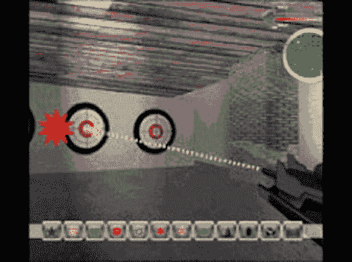

图 1-2. 低宽高比导致的屏幕映射错误

即使空白区域不属于迁移应用程序的窗口，您也应考虑位置映射逻辑并将此空白区域纳入考量。通过进行这些更改，纯触摸屏可以正确映射触摸位置。

另一种情况发生在桌面全屏窗口迁移到较高宽高比的纯触摸屏时。原始应用程序窗口的高度无法适配纯触摸屏，映射错误会发生在垂直方向而非水平方向。

图 1-3 展示了原始应用程序窗口在水平方向上填满屏幕，但在较高宽高比的纯触摸屏上垂直方向未能填满的情况。此时，当用户点击黄色箭头（目标）的位置时，应用程序识别到的位置是红色爆炸图标所在的点。这些错误是由物理显示屏与应用程序窗口之间的形状差异造成的。


图 1-3. 高宽高比导致的屏幕映射错误

一种解决方案是确保操作系统能够将纯触摸屏准确映射到屏幕的整个可视区域。操作系统提供特殊服务来完成屏幕拉伸和鼠标位置映射。另一种解决方案是在应用程序开发之初，就考虑允许配置选项以支持 Android SDK 提供的预置显示密度和宽高比，例如分辨率为`640 × 480`、`960 × 720`或`1,080 × 800`像素的屏幕。这样，如果最终尺寸变形在可接受范围内，应用程序可以自动拉伸窗口以覆盖整个屏幕。

#### 如何解决悬停问题

许多应用程序支持悬停操作：即用户可以将鼠标悬停在某个对象上，或将鼠标定位在应用程序图标上，以触发动画项目或显示工具提示。此操作通常用于为游戏中的新玩家提供指导；但它与纯触摸屏的特性不兼容，因为纯触摸屏不支持鼠标悬停操作。

您应考虑选择替代事件来触发动画或提示。例如，当用户触摸应用程序的操作时，相关的动画主题和提示会自动触发。另一种方法是设计一种界面交互模式，将触摸事件临时解释为鼠标悬停事件。例如，按下某个按钮并移动光标的操作将不会被解释为点击操作。

#### 提供右键单击功能

如前所述，纯触摸屏通常不支持鼠标右键单击操作。一种常用的替代方案是使用延迟触摸（比点击时间长得多）来表示右键单击。如果用户过早松开手指，这可能导致错误的操作。此外，这种方法无法同时执行左键单击和右键单击（也称为*双击*）。

您应提供一个可以替代右键单击功能的用户交互界面：例如，使用双击或在屏幕上安装一个可点击控件来替代右键单击。

#### 键盘输入问题

如前所述，台式计算机使用全尺寸键盘，而 Android 系统通常拥有更简单的键盘、按钮面板、用户可编程按钮以及有限数量的其他输入设备。这些限制在嵌入式应用程序设计时导致了一些在桌面系统中不会出现的问题。

##### 限制各种命令的输入

Android 系统上的键盘限制使用户难以输入大量字符。因此，要求用户输入大量字符的应用程序，特别是那些依赖于命令输入的应用程序，在迁移到 Android 系统时需要进行适当的调整。

一种解决方案是提供一种输入模式，通过减少命令数量或选择性地使用便捷工具（如菜单项快捷键）来限制字符数量。一种更灵活的解决方案是在屏幕上创建命令按钮，尤其是上下文相关按钮（即仅在需要时才出现的按钮）。

##### 满足键盘需求

应用程序需要键盘输入，例如命名文件、创建个人数据、保存进度以及支持在线聊天。大多数应用程序倾向于使用屏幕键盘输入字符，但屏幕键盘并不总是在应用程序界面前端运行或显示，这使得字符输入问题难以解决。

一种解决方案是为应用程序设计一种与屏幕键盘应用程序没有明显冲突的模式（例如，不使用全屏默认操作模式），或者在 UI 中提供一个仅在需要时出现的屏幕键盘。另一种减少键盘输入的简单方法是提供默认文本字符串值，例如个人数据的默认名称和已保存文件的默认名称，并允许用户通过触摸来选择。要获取文本字符串所需的其他信息（例如，文件名的前缀和后缀），可以添加一个选择按钮，该按钮提供您已建立的字符串列表，用户可从中选择。保存文件的名称也可以通过组合从屏幕提取的各种用户信息项来唯一获取，甚至可以使用日期时间戳。某些文本输入服务（如聊天服务）如果并非应用程序的核心功能，则应禁用。这不会对用户体验造成负面影响。

### 软件分发和版权保护问题

台式计算机通常配备 CD-ROM/DVD 驱动器，其软件通常通过 CD/DVD 分发。此外，出于反盗版目的，CD/DVD 安装通常要求用户验证光盘所有权或从 CD/DVD 动态加载内容，尤其是视频文件。然而，Android 系统（例如智能手机和平板电脑）通常没有 CD-ROM/DVD 驱动器；Android 确实支持外部 microSD 卡，但仍不支持从中直接安装应用程序。


一个不错的方案是允许用户通过互联网下载或安装应用，而非使用 CD/DVD 安装。消费者可以直接从应用商店（如 Apple App Store、Google Play 和 Amazon Appstore）购买和安装应用程序。这种流行的软件发布模式允许移动开发者使用证书、在线账户或其他基于软件的方式来验证所有权，而无需使用实体 CD/DVD。同样，您应考虑提供将内容放置于在线云服务的选项，而非要求用户从 CD/DVD 下载视频和其他内容。

### Android 应用概述

以下章节描述了 Android 应用的文件框架和组件结构。

#### 应用文件框架

图 1-4 展示了`HelloAndroid`应用生成后的文件结构（这是 Eclipse 的截图）。

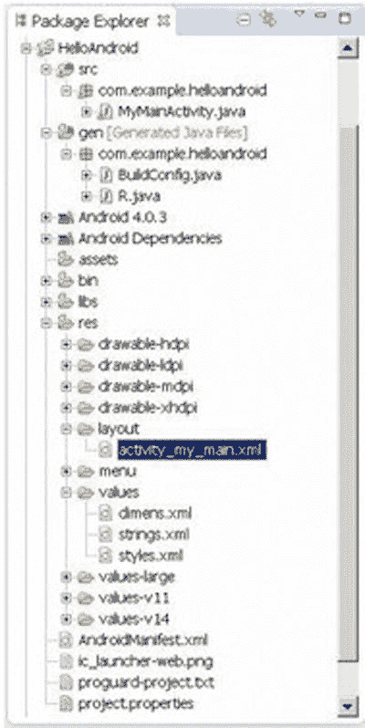

图 1-4 一个 Android 项目的示例文件结构

即使您不使用 Eclipse，也可以直接访问项目文件夹，看到相同的文件结构，如下所列：

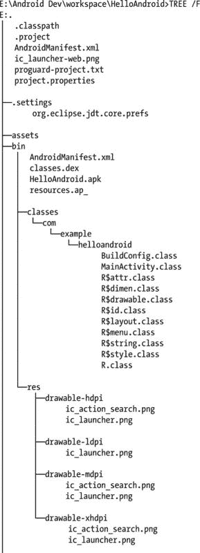

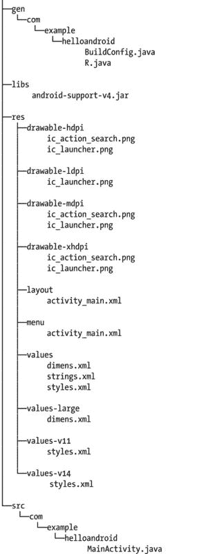

下面我们来解释这个 Android 项目文件结构的特点：

*   `src`目录：包含所有源文件。
*   `R.java`文件：由 Eclipse 集成的 Android SDK 自动生成。您无需修改其内容。
*   Android 库：Android 应用使用的一组 Java 库。
*   `assets`目录：主要存储多媒体文件和其他文件。
*   `res`目录：存储预配置的资源文件，如应用使用的`drawable`布局。
*   `values`目录：主要存储`strings.xml`、`colors.xml`和`arrays.xml`。
*   `AndroidManifest.xml`：相当于应用配置文件。包含应用的名称、活动、服务、提供者、接收器、权限等。
*   `drawable`目录：主要存储应用使用的图像资源。
*   `layout`目录：主要存储应用使用的布局文件。这些布局文件是 XML 文件。

与常规的 Java 项目类似，`src`文件夹包含项目的所有`.java`文件；`res`文件夹包含所有项目资源，如应用图标（`drawable`）、布局文件和常量值。

接下来的章节将介绍每个 Android 项目必需的`AndroidManifest.xml`文件，以及`gen`文件夹中的`R.java`文件（该文件也包含在其他 Java 项目中）。

#### `AndroidManifest.xml`

`AndroidManifest.xml`文件包含对 Android 系统至关重要的应用信息，系统在运行任何应用代码之前必须先获得这些信息。这些信息包括项目中使用的活动、服务、权限、提供者和接收器。示例如图 1-5 所示。

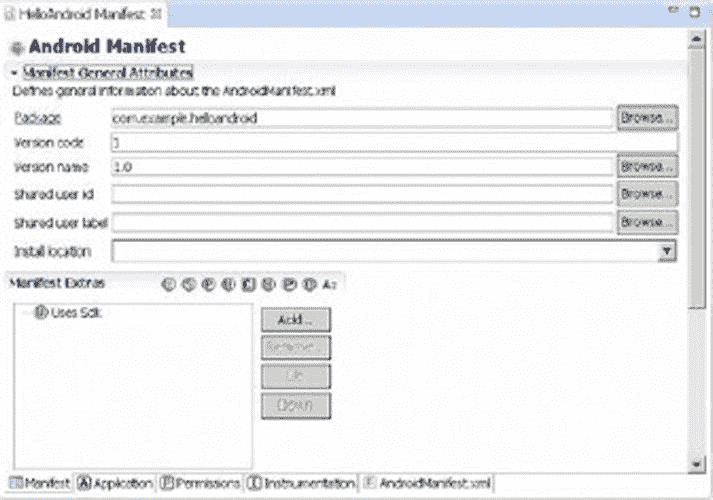

图 1-5 在 Eclipse 中显示的`AndroidManifest.xml`内容

该文件的代码如下：

```
<manifest xmlns:android="http://schemas.android.com/apk/res/android"
    package="com.example.helloandroid"
    android:versionCode="1"
    android:versionName="1.0" >
    <uses-sdk
        android:minSdkVersion="8"
        android:targetSdkVersion="15" />
    <application
        android:icon="@drawable/ic_launcher"
        android:label="@string/app_name"
        android:theme="@style/AppTheme" >
        <activity
            android:name=".MyMainActivity"
            android:label="@string/title_activity_my_main" >
            <intent-filter>
                <action android:name="android.intent.action.MAIN" />
                <category android:name="android.intent.category.LAUNCHER" />
            </intent-filter>
        </activity>
    </application>
</manifest>
```

`AndroidManifest.xml`文件是一个 XML 格式的文本文件，每个属性由`name = value`对定义。例如，在 Android 中，`label = "@ string / title_activity_my_main"`，`label`表示 Android 应用的名称`activity_my_main`。

一个元素由一个或多个属性组成，每个元素由开始标签（`<`）和结束标签（`/>`）包围：

```
<Type Name [attribute set]> Content </ type name>
<Type Name Content />
```

格式`[attribute set]`可以省略；例如，`<intent-filter> ... </ intent-filter>`文本段对应于元素的活动内容，`<action... />`对应于`action`元素。

如前面的示例所示，XML 元素以层级方式嵌套以表示其从属关系。`action`元素嵌套在`intent-filter`元素内，这说明了`intent-filter`的某些属性或设置方面。关于 XML 的详细信息超出了本书的范围，但市面上有许多优秀的 XML 书籍可供参考。

在该示例中，`intent-filter`描述了活动启动的位置和时间，每当一个活动（或操作系统）要执行操作时，会创建一个`intent`对象。`intent`对象携带的信息可以描述您想做什么、要处理的数据及数据类型等信息。Android 会对比每个应用暴露的`intent-filter`数据，并找到最合适的活动来处理调用者指定的数据和操作。

`AndroidManifest.xml`文件中主要属性条目的描述列于表 1-2 中。

表 1-2 `AndroidManifest.xml`文件中的主要属性条目

| 参数 | 描述 |
| --- | --- |
| `Manifest` | 根节点，包含包中的所有内容。 |
| `xmlns:android` | 包含清单的命名空间。`xmlns:android=``http://schemas.android.com/apk/res/android`。使得文件中可以使用各种标准属性，并为大多数元素提供数据。 |
| `package` | 清单应用的包。 |
| `Application` | 包含包中应用级组件清单的根节点。该元素也可以包含应用的某些全局和默认属性，如`label`、`icon`、`theme`和必要的权限。一个清单可以包含零个或一个（不超过一个）该元素。 |
| `android:icon` | 应用的图标。 |
| `android:label` | 应用的名称。 |
| `Activity` | 用户启动应用时加载的初始页面名称。它是用户交互的重要工具。大多数其他页面是在执行其他活动或由其他活动标记显示时呈现的。注意：每个活动，无论它在外部使用还是在其自身包中使用，都必须有一个对应的`<activity>`标记。如果某个活动没有对应的标记，则无法操作它。此外，为了支持搜索活动，一个活动可以包含一个或多个`<intent-filter>`元素来描述它支持的操作。 |
| `android:name` | 应用启动的默认活动。 |
| `intent-filter` | 通过声明指定组件支持的`intent`值形成。除了指定不同类型的值外，`intent-filter`还可以指定属性来描述唯一的标签、图标或操作所需的其他信息。 |
| `Action` | 组件支持的 Intent 动作。 |
| `Category` | 组件支持的 Intent 类别。应用启动的默认活动在此处指定。 |
| `uses-sdk` | 与应用使用的 SDK 版本相关。 |

#### `R.java`

`R.java`文件在创建项目时自动生成。它是一个只读文件，无法修改。`R.java`是一个索引文件，定义了项目的所有资源。例如：


```java
/* 自动生成的文件。请勿修改。
    ... ...
 */
package com.example.helloandroid;
public final class R {
    public static final class attr {
    }
    public static final class dimen {
        public static final int padding_large=0x7f040002;
        public static final int padding_medium=0x7f040001;
        public static final int padding_small=0x7f040000;
    }
    public static final class drawable {
        public static final int ic_action_search=0x7f020000;
        public static final int ic_launcher=0x7f020001;
    }
    public static final class id {
        public static final int menu_settings=0x7f080000;
    }
    public static final class layout {
        public static final int activity_my_main=0x7f030000;
    }
    public static final class menu {
        public static final int activity_my_main=0x7f070000;
    }
    public static final class string {
        public static final int app_name=0x7f050000;
        public static final int hello_world=0x7f050001;
        public static final int menu_settings=0x7f050002;
        public static final int title_activity_my_main=0x7f050003;
    }
    public static final class style {
        public static final int AppTheme=0x7f060000;
    }
}
```
可以看到，在此代码中定义了很多常量。这些常量名与 `res` 文件夹中的文件名相同，这证明了 `R.java` 文件存储了项目所有资源的索引。借助该文件，在应用程序中使用资源以及识别所需资源变得更加方便。由于此文件不允许手动编辑，因此在添加新资源时，只需刷新项目即可。`R.java` 文件会自动生成所有资源的索引。

#### 常量定义文件

项目的 `values` 子目录包含用于定义字符串、颜色和数组常量的文件；其中字符串常量定义位于 `strings.xml` 文件中。这些常量被 Android 项目中的其他文件所使用。

Eclipse 为 `strings.xml` 文件提供了两个图形化视图标签：Resources 和 strings.xml。Resources 标签提供了 `名称-值` 的结构化视图，而 strings.xml 标签则直接显示文本格式的文件内容。HelloAndroid 示例的 `strings.xml` 文件如图 1-6 所示。

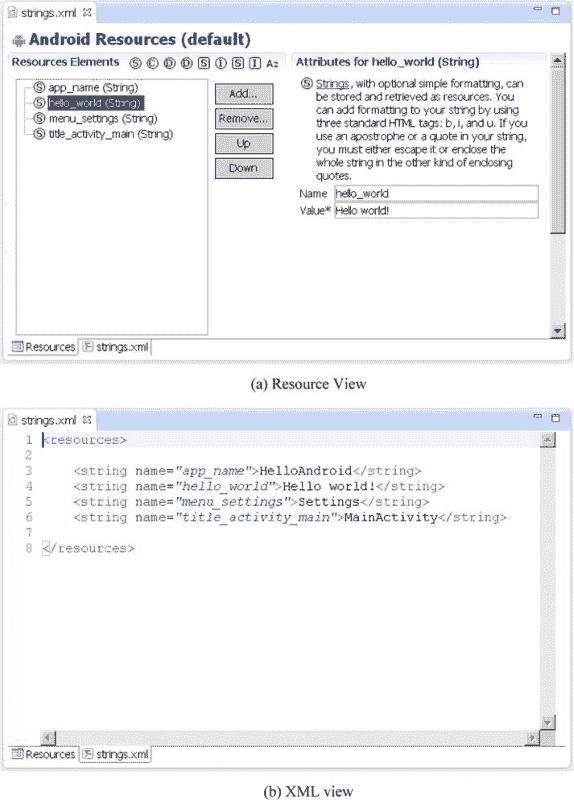

图 1-6. HelloAndroid 的 `strings.xml` 文件的 IDE 图形化视图

文件内容如下：

```xml
<resources>

<string name="app_name">HelloAndroid</string>
    <string name="hello_world">Hello world!</string>
    <string name="menu_settings">Settings</string>
    <string name="title_activity_main">MainActivity</string>

</resources>
```
这段代码非常简单，仅定义了四个字符串常量（资源）。

#### 布局文件

布局文件描述每个屏幕*组件*（*窗口*和*小工具*的组合）的大小、位置和排列方式。布局文件是应用程序的“面子”。布局文件是 XML 格式的文本文件。

组件是可视化的 UI 元素，例如按钮和文本框。它们相当于 Windows 系统术语中的控件和容器。按钮、文本框、滚动条等都属于组件。在安卓操作系统中，组件通常属于 `View` 类及其子类，并存储在 `android.widget` 包中。

每个应用程序都有一个与启动时屏幕显示对应的主布局文件。例如，HelloAndroid 示例的布局文件和主界面如图 1-7 所示。创建应用程序时，Eclipse 会自动为该应用程序的主屏幕显示生成布局文件。该文件位于项目文件夹的 `res\layout` 目录中。在生成的应用程序项目中，文件名由下一节指定：在本例中，源代码文件名对应 `[布局名称]` 键，因此文件被命名为 `activity_main.xml`。

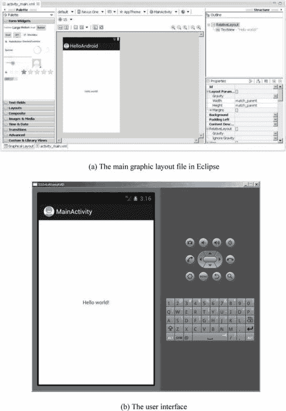

图 1-7. 主图形布局和用户界面

当您点击设计窗口（在本例中为 `activity_main.xml`）时，可以看到相应的 XML 格式文本文件内容，如图 1-8 所示。

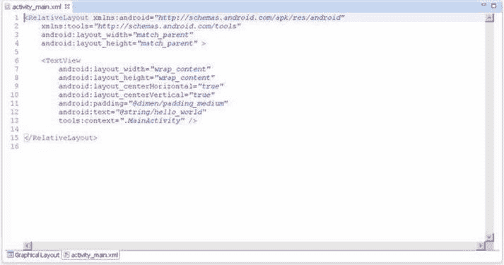

图 1-8. HelloAndroid 示例的主布局文件

文件内容如下：

```xml
<RelativeLayout xmlns:android="http://schemas.android.com/apk/res/android"
    xmlns:tools="http://schemas.android.com/tools"
    android:layout_width="match_parent"
    android:layout_height="match_parent" >

<TextView
        android:layout_width="wrap_content"
        android:layout_height="wrap_content"
        android:layout_centerHorizontal="true"
        android:layout_centerVertical="true"
        android:padding="@dimen/padding_medium"
        android:text="@string/hello_world"
        tools:context=".MainActivity" />

</RelativeLayout>
```
在这段代码中，有几个布局参数：

*   `<RelativeLayout>`：相对位置的布局配置。
*   `android:layout_width`：自定义当前视图的屏幕宽度；`match_parent` 表示与父容器（此处为 activity）匹配；`fill_parent` 表示填充整个屏幕；`wrap_content` 对于文本字段而言，表示根据此视图的宽度或高度而变化。
*   `android:layout_height`：自定义当前视图占据的屏幕高度。

此布局文件中未显示的其他两个常见参数如下：

*   `android:orientation`：此处表示布局是水平排列的。
*   `android:layout_weight`：为线性布局中的多个视图分配重要性权重值。所有视图都被赋予一个 `layout_weight` 值，默认值为零。

尽管布局文件是一个 XML 文件，但您无需理解其格式或直接编辑它，因为安卓开发工具和 Eclipse 提供了可视化设计界面。您只需在 Eclipse 中拖放组件并设置相应属性，您的操作会自动记录在布局文件中。在接下来的几节中，当您逐步完成应用程序开发示例时，会看到其工作原理。

#### 源代码文件

构建项目时，Eclipse 会生成一个默认的 `.java` 源代码文件，其中包含项目应用程序的基本运行时代码。它位于项目文件夹下的 `src\com\example\XXX` 目录中（其中 `XXX` 是项目名称）。在本例中，生成的应用程序项目的文件名是源代码文件名，对应 `[Activity 名称]` 键，因此文件被命名为 `MainActivity.java`。

`MainActivity.java` 的内容如下：

```java
package com.example.flashlight;

import android.os.Bundle;
import android.app.Activity;
import android.view.Menu;
import android.view.MenuItem;
import android.support.v4.app.NavUtils;
```

```java
public class MyMainActivity extends Activity {
    @Override
    public void onCreate(Bundle savedInstanceState) {
        super.onCreate(savedInstanceState);
        setContentView(R.layout.activity_my_main);
    }
    @Override
    public boolean onCreateOptionsMenu(Menu menu) {
        getMenuInflater().inflate(R.menu.activity_my_main, menu);
        return true;
    }
}
```

### 应用的组件结构

Android 应用程序框架为开发者提供了 API。由于应用程序是用 Java 构建的，程序的第一层包含了 UI 所需的各种控件。例如，视图（`View` 组件）包含列表、网格、文本框、按钮，甚至嵌入式 Web 浏览器。

一个 Android 应用程序通常由以下五个部分组成：

*   Activity（活动）
*   Intent Receiver（意图接收器）
*   Service（服务）
*   Content Provider（内容提供器）
*   Intent 与 Intent Filters（意图与意图过滤器）

以下章节将对每个组件进行更详细的讨论。

#### Activity（活动）

具有可视 UI 的应用程序是通过活动来实现的。当用户从主屏幕或应用程序启动器中选择一个应用程序时，它会启动一个动作或一个活动。每个活动程序通常以独立的界面（屏幕）形式出现。每个活动都是一个独立的类，它继承并实现了活动基类。该类以 UI 的形式呈现，由响应事件的 `View` 组件组成。

大多数程序都有多个活动（换句话说，一个 Android 应用程序由一个或多个活动组成）。切换到另一个界面会加载一个新的活动。在某些情况下，前一个活动可能会返回一个值。例如，一个让用户选择照片的活动会将照片返回给调用者。

当用户打开一个新界面时，旧界面会被挂起并放入历史堆栈（界面切换历史堆栈）中。用户可以通过历史堆栈界面返回到已打开的活动。没有历史价值的堆栈可以从历史堆栈界面中移除。Android 会在历史堆栈中保留运行应用程序所生成的所有界面，从第一个界面到最后一个界面。

活动是一个容器，它本身不会显示在 UI 中。你可以将活动大致想象为 Windows 操作系统中的一个窗口，但视图窗口不仅用于显示，还用于完成任务。

#### Intent（意图）与 Intent Filters（意图过滤器）

Android 通过一个名为`intent`的特殊类来实现界面切换。一个`intent`描述了程序要做什么。该数据结构最重要的两个部分是动作和按照既定规则处理的数据（`data`）。典型的操作有 `MAIN`（活动入口）、`VIEW`（查看）、`PICK`（选取）和 `EDIT`（编辑）。操作中要使用的数据使用通用资源标识符（URI）来表示。例如，要查看一个人的联系信息，你需要使用 `VIEW` 操作创建一个`intent`，而数据则是指向此人 URI 的指针。

与`intent`相关联的一个类称为`IntentFilter`。`intent`将一个请求封装为一个对象；而`IntentFilter`则描述某个活动（或者说，意图接收器，稍后解释）可以处理哪些意图。在前面的例子中，显示某个人联系信息的活动使用了一个`IntentFilter`，它知道如何处理应用于这个人的数据 `VIEW` 操作。在`AndroidManifest.xml`文件中使用`IntentFilter`的活动通常是通过解析`intent`的活动切换来完成的。首先，它使用`startActivity(myIntent)`函数启动新活动，接着系统会检查所有已安装程序的`IntentFilter`，然后找到与`myIntent`对应的`IntentFilter`最匹配的活动。这个新活动接收来自`intent`的消息并启动。意图解析过程在`startActivity`调用时实时发生。这个过程有两个优点：

*   活动只需发出一个`intent`请求，就能重用其他组件的功能。
*   该活动始终可以被一个具有相同`IntentFilter`的新活动所替代。

#### Service（服务）

*服务*是一种没有 UI 的常驻系统程序。对于任何需要持续运行的应用程序，例如网络监控或检查应用程序更新，都应使用服务。

使用服务的两种模式是*启动-停止模式*和*绑定-解绑模式*。其流程和功能说明见表 1-3。

**表 1-3.** 服务的使用模型

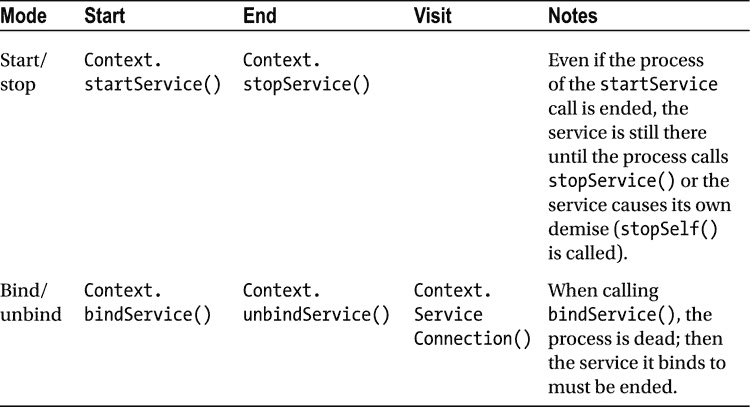

当两种模式混合使用时——例如，一种模式调用了`startService()`，而其他模式调用了`bindService()`——则只有当`stopService`调用和`unbindService`调用都发生时，服务才会被终止。

服务进程有其自身的生命周期，Android 会尽量保持已启动或已绑定的服务进程。服务进程描述如下：

*   如果服务是方法 `onCreate()`、`onStart` 或 `onDestroy()` 的执行进程，那么主进程会变为前台进程，以确保这些代码不被停止。
*   如果服务已启动，其重要性低于可见进程，但高于所有不可见进程。由于只有少数进程对用户是可见的，只要内存不是特别低，服务就不会停止。
*   如果多个客户端已绑定到该服务，只要其中任何一个客户端对用户是可见的，那么该服务就是可见的。

#### Broadcast Intent Receiver（广播意图接收器）

当你希望执行一些与外部事件相关的代码时，例如在半夜执行某项任务或响应电话响铃，请使用 `IntentReceiver`。意图接收器没有 UI，它使用 `NotificationManager` 来通知用户其事件已发生。意图接收器在 `AndroidManifest.xml` 文件中声明，但也可以使用 `Context.registerReceiver()` 来声明。程序不必持续运行等待 `IntentReceiver` 被调用。当意图接收器被触发时，系统会启动你的程序。程序也可以使用 `Context.broadcastIntent()` 将它们的意图广播发送给其他程序。

Android 应用程序可用于处理一个数据元素或响应一个事件（例如接收短信）。Android 应用程序会与一个 `AndroidManifest.xml` 文件一起部署到设备上。`AndroidManifest.xml` 包含必要的配置信息，以便应用程序能够在设备上正确安装。`AndroidManifest.xml` 还包含必要的类名、应用程序可以处理的事件类型，以及运行应用程序所需的权限。例如，如果一个应用程序需要访问网络——比如下载一个文件——那么清单文件中必须明确列出该许可。许多应用程序可能会启用这个特定的许可。这种声明式安全性有助于降低恶意应用程序对设备造成损害的可能性。

#### Content Provider（内容提供器）

你可以将内容提供器视为数据库服务器。内容提供器的任务是管理持久化数据的访问，例如 SQLite 数据库。如果应用程序非常简单，你可能不需要创建内容提供器应用程序。如果你要构建一个较大的应用程序，或者需要构建应用程序来为多个活动或应用程序提供数据，那么你可以使用内容提供器进行数据访问。

如果你希望其他程序使用自己程序的数据，内容提供器就非常有用。内容提供器类实现了一系列标准方法，允许其他程序存储和读取内容提供器可以处理的数据。

#### Android Emulator（Android 模拟器）
```


### Android 与 Dalvik 虚拟机

Android 不使用普通的 Java 虚拟机（JVM），而是使用 Dalvik 虚拟机（DVM）。DVM 与 JVM 有根本性的不同。DVM 占用内存更少，专门针对移动设备进行了优化，更适合嵌入式环境中的手机使用。其他差异如下：

- 普通 JVM 基于栈式虚拟机，而 DVM 是基于寄存器的虚拟机。后者更优，因为应用程序可以基于硬件实现最大程度的优化，这更符合移动设备的特点。
- DVM 可以在有限的内存中同时运行多个虚拟机实例，使得每个 DVM 应用作为独立的 Linux 进程执行。在普通 JVM 中，所有应用运行在共享的 JVM 中，因此单个应用不作为独立进程运行。由于每个应用作为独立进程运行，DVM 可以防止在虚拟机崩溃时关闭所有程序。
- DVM 提供比普通 JVM 限制更少的许可平台。DVM 和 JVM 支持不同的通用代码。DVM 不运行标准 Java 字节码，而是运行 Dalvik 可执行格式（`.dex`）。Android 应用的 Java 代码编译实际上包含两个过程。第一步是将 Java 源代码编译为普通 JVM 可执行代码，使用文件名后缀`.class`。第二步是将字节码编译为 Dalvik 执行代码，使用文件名后缀`.dex`。第一步将项目目录中`src`子目录下的源代码文件编译为`bin\class`目录中的`.class`文件；第二步将文件从`bin\class`子目录迁移到`bin`目录中的`classes.dex`文件。编译过程集成在 Eclipse 构建过程中；不过，你也可以使用命令行手动编译。

#### 引入 Android 运行时（ART）

ART 是一种 Android 运行时，首次作为预览功能出现在 Google Android KitKat（4.4）中。它也被称为 Dalvik 版本 2，目前在 Android 开源项目（AOSP）中处于活跃开发状态。所有搭载 Android KitKat 的智能手机和平板电脑仍将 Dalvik 作为默认运行时。这是因为一些原始设备制造商（OEM）在 Android 实现中仍未支持 ART，且大多数第三方应用仍基于 Dalvik 构建，尚未添加对 ART 的支持。

正如 Google 在 Android 开发者网站上所述，大多数现有应用在使用 ART 运行时应当可以正常工作。然而，一些在 Dalvik 上可行的技术在 ART 上无法工作。Dalvik 与 ART 的差异如表 1-4 所示。

**表 1-4 Dalvik 与 ART 对比**

|          | Dalvik                              | ART                                          |
| -------- | ----------------------------------- | -------------------------------------------- |
| 应用     | 包含 DEX 类文件的 APK 包                | 与 Dalvik 相同                                 |
| 编译类型 | 动态编译（JIT）                     | 预编译（AOT）                                |
| 功能性   | 稳定且经过全面质量保证测试          | 基本功能和稳定性                             |
| 安装时间 | 较快                                | 较慢（由于编译过程）                         |
| 应用启动时间 | 通常较慢（由于 JIT 编译和解释执行） | 通常较快（由于 AOT 编译）                      |
| 存储占用 | 较小                                | 较大（包含预编译二进制文件）                 |
| 内存占用 | 较大（由于 JIT 代码缓存）             | 较小                                         |

ART 提供了一些新特性来帮助应用开发、性能优化和调试，例如支持采样分析器以及监控和垃圾回收等调试功能。从 Dalvik 向 ART 的过渡可能需要一段时间，Android 将同时提供 Dalvik 和 ART，以允许智能手机和平板电脑用户选择和切换。然而，未来的 64 位 Android 将基于 ART。

### 总结

本章介绍了桌面系统的一般 GUI 设计方法，然后展示了嵌入式系统的 UI 和 UX 设计有何不同。现在你应该了解 Android 应用 GUI 设计的一般方法和原则，并准备好学习 Android 特有的 GUI。下一章将描述活动的状态转换、`Context`类、意图以及应用与活动之间的关系。

_____________________

¹一个典型例子是游戏《反恐精英》（CS）。

# 第二章


## Android 应用 GUI 设计，第二部分：Android 特有的 GUI

本章描述活动的状态转换，并讨论`Context`类、意图以及应用与活动之间的关系。

## 活动的状态转换

如第一章所述，活动是最重要的组件。活动有其自身的状态和转换规则，它们是理解如何编写 Android 应用的基础。

### 活动状态

当活动被创建或销毁时，它们进入或退出活动栈。在此过程中，它们在四种可能的状态之间转换：

- **活跃（Active）**：处于活跃状态的活动在栈顶时可见。通常，它是响应用户输入的前台活动。Android 将确保其以最高优先级执行。如有需要，Android 会销毁栈中更靠下的活动，以确保为活跃活动提供所需资源。当另一个活动变为活跃时，当前活动被暂停。
- **暂停（Paused）**：在某些情况下，活动可见但没有焦点。此时它被挂起。当前台活动是完全透明的或非全屏活动时，其下方的活动进入此状态。暂停的活动被视为活跃，但不接受用户输入事件。在极端情况下，Android 会杀死暂停的活动以恢复资源给活跃活动。当活动完全不可见时，它变为停止状态。
- **停止（Stopped）**：当活动不可见时，它被停止。此活动保留在内存中以保存所有状态和成员信息。但当系统需要内存时，此活动会被“移除”。当活动停止时，保存数据和当前 UI 状态非常重要。一旦活动退出或关闭，它变为非活跃状态。
- **非活跃（Inactive）**：当活动被杀死时，它变为非活跃状态。非活跃活动会从活动栈中移除。当你需要使用或显示该活动时，需要重新启动它。

活动状态转换图如图 2-1 所示。

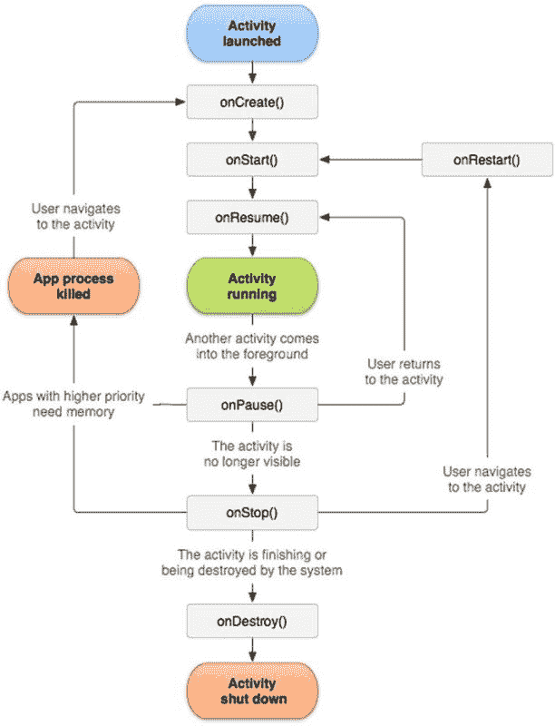

**图 2-1 Android 活动状态转换图**

状态变化并非人为控制，而是完全由 Android 内存管理器控制。Android 首先关闭包含非活跃活动的应用，然后是那些包含停止活动的应用。在极端情况下，它会移除暂停的活动。

为了确保无瑕疵的用户体验，这些状态的转换对用户是不可见的。当活动从暂停、停止或非活跃状态恢复到活跃状态时，UI 必须保持一致。因此，当活动停止时，保存 UI 状态和数据非常重要。一旦活动变为活跃，它需要恢复已保存的值。

## 活动的重要函数


### Activity 生命周期与状态转换函数

Activity 状态转换会触发相应 `activity` 类的函数（即 Java 方法）。Android 会调用这些函数；开发者无需显式调用它们。这些函数被称为*状态转换函数*。您可以重写状态转换函数，使其在指定时间完成相应工作。还有一些函数用于控制 activity 的状态。这些函数构成了 activity 编程的基础。让我们来了解这些函数。

#### `onCreate` 状态转换函数

`onCreate` 函数原型如下：

```
void  onCreate(Bundle savedInstanceState);
```

该函数在 Activity 首次加载时运行。当您启动一个新程序时，其主 Activity 的 `onCreate` 事件会被执行。如果 Activity 被销毁（`OnDestroy`，后文会详述）后又重新加载到任务中，其 `onCreate` 事件参与者会重新执行。

Activity 很可能会被强制切换到后台。（切换到后台的 Activity 对用户不再可见，但它仍然存在于任务中，例如当启动一个新的 Activity 来“覆盖”当前 Activity 时；或者用户按下 Home 键返回主屏幕时；或者当前 Activity 之上出现新 Activity 的其他事件，如来电界面。）如果用户在一段时间后不再查看该 Activity，该 Activity 可能会随任务和进程一起被系统自动销毁。如果您再次查看该 Activity，则必须重新运行 `onCreate` 事件来初始化 Activity。

有时，您可能希望用户能够从 Activity 上次打开时的操作状态继续，而不是从头开始。例如，当用户在编辑短信时突然接到电话，用户可能在通话后需要立即做其他事情，比如将来电号码保存到联系人。如果用户没有立即返回短信编辑界面，该编辑界面就会被销毁。因此，当用户返回短信程序时，可能希望从上次编辑处继续。在这种情况下，您可以重写 Activity 的 `void onSaveInstanceState(Bundle outState)` 事件，通过 `outState` 写入您希望在 Activity 状态销毁前保存的数据或信息，这样当 Activity 再次执行 `onCreate` 事件时，会通过 `savedInstanceState` 传递之前保存的信息。此时，您可以选择性地使用这些信息来初始化 Activity，而不是从头开始。

#### `onStart` 状态转换函数

`onStart` 函数原型如下：

```
void onStart();
```

`onStart` 函数在 `onCreate` 事件之后，或者当前 Activity 被切换到后台后执行。当用户通过切换面板选择返回此 Activity 时，如果它尚未被销毁，且仅执行了 `onStop` 事件，那么 Activity 会跳过 `onCreate` 事件活动，直接执行 `onStart` 事件。

#### `onResume` 状态转换函数

`onResume` 函数原型如下：

```
void onResume()
```

`onResume` 函数在 `OnStart` 事件之后，或者当前 Activity 被切换到后台后执行。当用户再次查看此 Activity 时，如果它尚未被销毁，且 `onStop` 事件未被执行（Activity 继续存在于任务中），那么 Activity 会跳过 `onCreate` 和 `onStart` 事件活动，直接执行 `onResume` 事件。

#### `onPause` 状态转换函数

`onPause` 函数原型如下：

```
void onPause()
```

`onPause` 函数在当前 Activity 被切换到后台时执行。

#### `onStop` 状态转换函数

`onStop` 函数原型如下：

```
void onStop()
```

`onStop` 函数在 `onPause` 事件之后执行。如果用户在一段时间内不再查看该 Activity，则会执行该 Activity 的 `onStop` 事件。如果用户按下返回键，并且该 Activity 从当前任务列表中被移除，`onStop` 事件也会被执行。

#### `onRestart` 状态转换函数

`onRestart` 函数原型如下：

```
void onRestart()
```

在 `onStop` 事件执行后，如果 Activity 及其所在的进程尚未被系统销毁，或者用户再次查看该 Activity，则会执行该 Activity 的 `onRestart` 事件。`onRestart` 事件会跳过 `onCreate` 事件活动，直接执行 `onStart` 事件。

#### `onDestroy` 状态转换函数

`onDestroy` 函数原型如下：

```
void onDestroy()
```

在 Activity 的 `onStop` 事件之后，如果用户不再查看该 Activity，则它会被销毁。

### `finish` 函数

`finish` 函数原型如下：

```
void finish()
```

`finish` 函数会关闭 Activity 并将其从栈中移除，这会导致调用 `onDestroy()` 状态转换函数。解决此问题的一种方法是让用户使用返回按钮导航到上一个 Activity。

除了 Activity 切换之外，`finish` 函数还会触发 Activity 的状态转换函数，而上下文类（将在后续章节中介绍）的 `startActivity` 和 `startActivityForResult` 方法也会触发这些函数。像 `Context.startActivity` 这样的函数也会导致 `activity` 对象的构造（即创建新的对象）。

典型的触发原因及对应函数列于表 2-1。

表 2-1. 触发原因及其对应函数

| 典型触发原因 | 执行的 Activity 对应方法 | 说明 |
| --- | --- | --- |
| `Context.startActivity[ForResult]()` 注意：只要 Activity 在屏幕上显示并可见，此方法就会被调用。 | `new Activity()`<br>`onCreate()` | 完成构造函数，将 `activity` 对象保存到应用程序对象，并初始化各种控件（如 `View`）。 |
| | `onStart()` | 类似于 `View.onDraw()`。 |
| `Activity.finish()` | `onDestroy()` | 完成构造函数，例如从应用程序中移除 `activity` 对象。 |

表 2-1 中的 `Context.startActivity` 等函数会触发三个动作：构造新的 `Activity` 对象、`onCreate` 和 `onStart`。当一个从屏幕外移入到屏幕顶层显示的 Activity（即显示在用户面前）时，通常只包含由 `onStart` 调用的函数。

### `Context` 类

`Context` 类是一个需要了解的 Android 重要概念。该类继承自 `Object` 函数，其继承关系如下：

```
java.lang.Object
    android.content.Context
```

*上下文*的字面意思是邻近区域中的文本，它位于框架包中的 `android.content.Context` 中。`Context` 类是一个 `LONG` 类型，类似于 Win32 中的 `Handle` 处理器。`Context` 提供了关于应用程序环境的全局信息接口。它是一个抽象类，其执行由 Android 系统提供。它允许访问资源以及应用程序的特征类型。同时，它可以启动应用级操作，例如启动 Activity 以及广播和接收 Intent。


许多方法需要通过上下文实例来识别调用者。例如，`Toast`的第一个参数是`Context`；通常你会使用`this`来代替活动（Activity），这表明调用者的实例是一个活动。但其他方法，例如按钮的`onClick`（`View` view），如果使用`this`会导致错误。在这种情况下，你可以使用`ActivityName.this`来解决此问题，因为该类实现了几个主要的 Android 特定模型的上下文，例如活动、服务和广播接收器。

如果参数——特别是类的构造函数参数（如`Dialog`）——是`Context`类型，那么实际参数通常是活动对象，一般来说是`[this]`。例如，`Dialog`构造函数的原型是

```
Dialog.Dialog(Context context)
```

示例如下：

```
public class MyActivity extends Activity{
    Dialog d = new Dialog(this);
```

`Context`是 Android 大多数类的祖先，例如广播、意图等，它提供了全局信息应用环境的接口。表 2-2 列出了`Context`的重要子类。你可以在 Android `Context`类的帮助文档中找到详细描述。

表 2-2. `Context`的重要子类

| 子类 | 说明 |
| --- | --- |
| `Activity` | 用户友好的界面类 |
| `Application` | 提供全局应用状态维护的基类 |
| `IntentService` | 用于处理服务的异步请求（以`Intent`方式表示）的基类 |
| `Service` | 应用程序的一个组件，代表要么是与用户无交互的耗时操作，要么是为其他应用程序任务提供功能的任务 |

这些类被称为*后代类*，因为它们是`Context`的直接或间接子类，并具有像活动一样的继承关系：

```
java.lang.Object
    android.content.Context
      android.content.ContextWrapper
        android.view.ContextThemeWrapper
          android.app.Activity
```

`Context`可用于 Android 中的许多操作，但其主要功能是加载和访问资源。有两种常用的上下文：应用上下文和活动上下文。活动上下文通常在各类和方法之间传递，类似于活动的`onCreate`代码，如下所示：

```
protected void onCreate(Bundle state) {
    super.onCreate(state);
    TextView label = new TextView(this); // 将上下文传递给视图控件
    setContentView(label);
}
```

当活动上下文被传递给视图时，意味着该视图拥有一个指向活动的引用，并引用了该活动占用的资源：视图层次结构、资源等。

你也可以使用应用上下文，它始终伴随应用程序的生命周期，但与活动生命周期无关。应用上下文可以通过`Context.getApplicationContext`或`Activity.getApplication`方法获取。

Java 通常使用静态变量（单例等）在活动之间（程序内部的类之间）同步状态。Android 更可靠的方法是使用应用上下文来关联这些状态。

每个活动都有一个上下文，其中包含运行时状态。同样，应用程序也有一个上下文，Android 用它来确保该上下文是唯一的实例。

如果你需要自定义应用上下文，首先必须定义一个继承自`android.app.Application`的自定义类；然后在应用的`AndroidManifest.xml`文件中描述这个类。Android 会自动创建该类的实例。通过使用`Context.getApplicationContext()`方法，你可以在每个活动内部获取应用上下文。以下示例代码演示了如何在活动中获取应用上下文：

```
class MyApp extends Application {
// MyApp 是一个继承自 android.app.Application 的自定义类
    public String aCertainFunc () {
        ......
    }
}

class Blah extends Activity {
      public void onCreate(Bundle b){
        ... ...
      MyApp appState = ((MyApp)getApplicationContext());
// 获取应用上下文
        appState.aCertainFunc();
//使用应用的属性和方法
        ... ...
      }
}
```

你可以使用`Context`的`get`函数获取应用环境的全局信息。主要函数如表 2-3 所示，它们要么是`ContextWrapper`的方法，要么是直接上下文的方法。

表 2-3. 获取上下文的常用方法

| 函数原型 | 功能 |
| --- | --- |
| `abstract Context ContextWrapper.getApplicationContext ()` | 返回当前进程对应的单个应用的全局上下文。 |
| `abstract ApplicationInfo ContextWrapper.getApplicationInfo ()` | 返回上下文包对应的整个应用的信息。 |
| `abstract ContentResolver ContextWrapper.getContentResolver ()` | 返回对应应用包的内容解析器实例。 |
| `abstract PackageManager ContextWrapper.getPackageManager ()` | 返回用于查找所有包信息的包管理器实例。 |
| `abstract String ContextWrapper.getPackageName ()` | 返回当前包名。 |
| `abstract Resources ContextWrapper.getResources ()` | 返回（用户）应用包的资源实例。 |
| `abstract SharedPreferences ContextWrapper.getSharedPreferences (String name, int mode)` | 查找并保存由参数 name 指定名称的首选项文件的内容。返回你可以查找和修改的共享首选项（`SharedPreferences`）的值。使用正确的名称时，只会向调用者返回一个`SharedPreferences`实例，这意味着一旦修改完成，结果将在各调用者之间共享。 |
| `public final String Context.getString (int resId)` | 从应用包的默认字符串表中返回本地化的字符串。 |
| `abstract Object ContextWrapper.getSystemService (String name)` | 根据变量 name 指定的名称返回处理系统级服务的对象。返回的对象类因请求的名称而异。 |

### Intent 介绍

`Intent` 可以作为一种消息传递机制，允许你声明执行某项操作的意图，通常带有特定数据。你可以使用意图来实现 Android 设备上任何应用组件之间的交互。`Intent` 将一组独立的组件转化为具有一对一交互的系统。

它也可用于广播消息。任何应用都可以注册广播接收器来监听并响应这些意图广播。`Intent` 可用于创建内部、系统或第三方事件驱动的应用程序。

`Intent` 负责描述一个操作以及该操作的应用数据。Android 负责在子意图描述下找到相应的组件，将意图传递给被调用的组件，并完成组件调用。`Intent` 在调用者和被调用者之间起到了解耦作用。


```markdown
`Intent` 是一种运行时绑定的机制；它能在程序运行过程中连接两个不同的组件。通过 `intent`，程序可以向 Android 发出请求或表达意愿；Android 会根据 `intent` 的内容选择合适的组件来处理该请求。例如，假设一个活动想要打开一个网页浏览器来查看页面内容；这个活动只需向 Android 发出一个 `WEB_SEARCH_ACTION` 请求。Android 会根据内容请求，检查组件注册声明中的 intent 过滤器，并找到一个用于网页浏览器的活动。

当发出一个 `intent` 时，Android 会找到一个或多个精确匹配的活动、服务或 `broadcastReceiver` 作为响应。因此，不同类型的 intent 消息不会重叠，也不会同时发送给一个活动或服务，因为 `startActivity()` 消息只能发送给活动，而 `startService()` 的 intent 只能发送给服务。

### Intent 的主要作用

`intent` 的主要作用如下。

#### 触发新活动或让现有活动执行新操作

在 Android 中，`intent` 直接与活动进行交互。`intent` 最常见的用途是绑定应用组件。`intent` 用于启动、停止和传输应用活动。换句话说，`intent` 可以激活一个新的活动，或者让一个现有的活动执行新的操作。这可以通过调用 `Context.startActivity()` 或 `Context.startActivityForResult()` 方法来实现。

要在应用中打开一个不同的界面（对应一个活动），可以调用 `Context.startActivity()` 函数来传递一个 `intent`。`Intent` 既可以显式指定要打开的特定类，也可以包含实现目标所需的操作。在后一种情况下，运行时会使用一个众所周知的 intent 解析过程来选择要打开的活动，在此过程中，`Context.startActivity()` 会找到并启动一个与 `intent` 最佳匹配的单个活动。

#### 触发新服务或向现有服务发送新请求

打开一个服务或向现有服务发送请求也是通过 `intent` 类完成的。

#### 触发 BroadcastReceiver

可以通过三种不同的方法发送 `BroadcastIntent`：`Context.sendBroadcast()`、`Context.sendOrderedBroadcast()` 和 `Context.sendStickyBroadcast()`。

### Intent 解析

intent 传递过程有两种方式将目标消费者（例如另一个活动、`IntentReceiver` 或服务）与 `intent` 的响应者进行匹配。

第一种是*显式匹配*，也称为*直接 intent*。在构造 `intent` 对象时，必须将接收者指定为 `intent` 的组件属性之一（通过调用 `setComponent(ComponentName)` 或 `setClass(Context, Class)`）。通过指定组件类，应用程序通知启动相应的组件。这种方法类似于普通的函数调用，但在粒度的复用方面有所不同。

第二种是*隐式匹配*，也称为*间接 intent*。`intent` 的发送者在构造 `intent` 对象时不知道也不关心接收者是谁。组件的 intent 属性中未指定该属性。这种 intent 需要包含足够的信息，以便系统能够从所有可用的组件中确定使用哪些组件来满足该 intent。这种方法与函数调用有显著区别，有助于减少发送者和接收者之间的耦合。隐式匹配会解析为单个活动。如果有多个活动可以基于特定数据执行给定的操作，Android 会选择最佳的一个来启动。

对于直接 intent，Android 无需进行解析，因为目标组件非常明确。然而，Android 需要解析间接 intent。通过分析，它将间接 intent 映射到处理该 intent 的活动、`IntentReceiver` 或服务。

intent 解析机制主要包括以下内容：

*   查找所有注册在 `AndroidManifest.xml` 中的 `<intent-filter>` 以及这些过滤器定义的 intent
*   通过 `PackageManager`（`PackageManager` 可以获取当前设备上安装的应用程序包的信息）查找并处理该 intent 的组件

Intent 过滤器非常重要。一个未声明 `<intent-filter>` 的组件只能响应组件名称匹配的显式 intent 请求，但不能响应隐式 intent 请求。一个声明了 `<intent-filter>` 的组件既可以响应显式 intent 请求，也可以响应隐式 intent 请求。在解析隐式 intent 请求时，Android 使用 intent 的三个属性——action、type 和 category 来进行解析。具体的解析方法如下所述。

#### 操作测试

一个 `<intent-filter>` 元素应至少包含一个 `<action>`，否则没有 intent 请求能够匹配该 `<intent-filter>`。如果一个 intent 请求的操作与 `<intent-filter>` 中的至少一个 `<action>` 匹配，则该 intent 通过了此 `<intent-filter>` 的操作测试。

如果 intent 请求或 `<intent-filter>` 中没有描述特定的操作类型，则适用以下两种测试之一：

*   如果 `<intent-filter>` 不包含任何操作类型，无论 intent 请求是什么，都无法匹配此 `<intent-filter>`。
*   如果 intent 请求没有设置操作类型，只要 `<intent-filter>` 包含一个操作类型，该 intent 请求就会成功通过 `<intent-filter>` 的操作测试。

#### 类别测试

要使一个 intent 通过类别测试，Intent 中的每个类别都必须与过滤器中的某个类别匹配。当 intent 请求的每个类别都与某个组件的 `<intent-filter>` 的 `<category>` 精确匹配时，该 intent 请求通过测试。`<intent-filter>` 中多余的 `<category>` 声明不会导致匹配失败。任何未指定类别测试的 `<intent-filter>` 仅匹配未设置类别配置的 intent 请求。

#### 数据测试

`<data>` 元素指定了你想要接收的 intent 请求的数据 URI 和数据类型。一个 URI 分为三个匹配部分：scheme、authority 和 path。通过 `setData()` 设置的互联网请求的 URI 数据类型和 scheme 必须与 `<intent-filter>` 中指定的一致。如果 `<intent-filter>` 还指定了 authority 或 path，它们也必须匹配才能通过测试。

这个决策过程可以表示如下：

*   如果 intent 指定了操作，那么目标组件的 `<intent-filter>` 的操作列表必须包含此操作。否则，认为不匹配。
*   如果 intent 没有提供类型，系统会从数据中获取数据类型。并且对于某些操作方法，目标组件的数据类型列表必须包含 intent 的数据类型。否则无法匹配。
*   如果 intent 的数据不是 content 的 URI，并且类别和 intent 也没有指定其类型，则匹配基于 intent 的数据 scheme（例如 `http:` 或 `mailto:`），并且 intent 的 scheme 必须出现在目标组件的 scheme 列表中。
*   如果 intent 指定了一个或多个类别，这些类别必须全部出现在目标组件的类别列表中。例如，如果 intent 包含两个类别，`LAUNCHER_CATEGORY` 和 `ALTERNATIVE_CATEGORY`，那么通过解析得到的目标组件必须至少包含这两个类别。

## 应用与活动之间的关系
```


### 初学者困惑：应用程序与 Activity

初学者往往容易混淆应用程序与 Activity——特别是主 Activity（即应用程序启动时发生的那些）。实际上，它们是两个完全不同的对象，其行为、属性等均不相同。以下是应用程序与 Activity 之间的一些区别：

*   无论应用程序启动多少次，只要不被关闭，它的值（即对象）就是恒定的。它只拥有一个实例。
*   无论应用程序从哪里启动，只要不被关闭，它的值（即对象）就是恒定的。它只拥有一个实例。
*   当一个 Activity 未结束时，它的值（即对象）是恒定的。每次调用`onStart()`时，该 Activity 都会显示在屏幕前端。
*   `startActivity`启动的对象每次都不相同。可以说，`startActivity`实际上包含了新的对象。
    *   虽然你在`startActivity`之后无法获取新的 Activity 对象，但 Android 框架可以在`startActivity`启动其对应的 Activity 对象时传递参数值（类似于函数调用的实际参数）。
    *   更令人惊讶的是，Android 可以让一个 Activity 以多个对象的形式共存。当一个 Activity 关闭时，Android 会将结果返回给通过`startActivity`启动的主 Activity。因此，它会自动调用启动其 Activity 对象的`onActivityResult()`方法，从而可以避免随机分配。
*   一个应用程序可以拥有一个 Activity 的多个对象。

### 基本的 Android 应用程序界面

在本节中，你将通过一个示例了解如何使用集成在 Eclipse IDE 中的 Android SDK 进行 Android 开发。你将使用 Android SDK 创建一个名为`GuiExam`的应用程序，并通过遵循流程步骤来了解 Android 界面设计。

### GuiExam 应用程序代码分析

本节将对`GuiExam`示例应用程序进行分析。首先，在 Eclipse 中使用 Android SDK 创建`GuiExam`应用程序。应用程序名称输入`GuiExam`。对于 Build SDK，选择 API 19，它包含 x86 指令。如图 2-2 所示，所有其他条目选择系统默认配置。

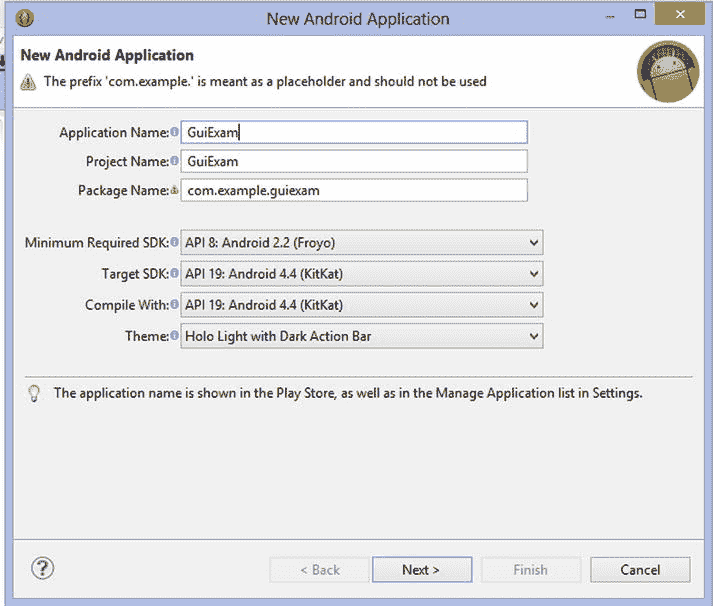

图 2-2. 生成 GuiExam 项目时的初始设置

项目的文件结构如图 2-3 所示，用户界面如图 2-4 所示。

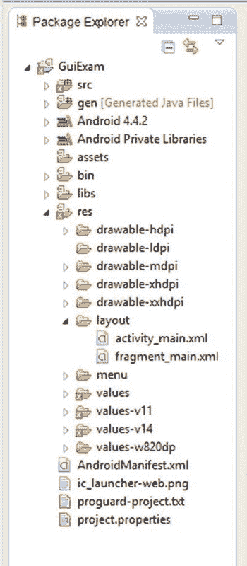

图 2-3. GuiExam 应用程序的文件结构

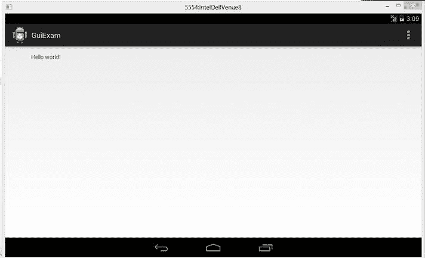

图 2-4. GuiExam 的应用程序界面

该应用程序唯一的 Java 文件（`MainActivity.java`）的源代码如图 2-5 所示：

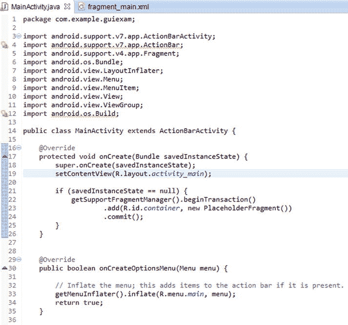

图 2-5. Java 文件 MainActivity.java 中的典型源代码

你知道，当事件被创建时会调用`MainActivity.OnCreate()`函数。该函数的源代码非常简单。第 12 行调用了父类函数，第 13 行调用了`setContentView`函数。此函数设置了 Activity 的 UI 显示。在 Android 项目中，大多数 UI 由视图及视图子类实现。`View`代表一个可以处理事件并对该区域进行渲染的区域。

第 13 行的代码表明视图是`R.layout.activity_main`。项目`gen`目录下自动生成的`R.java`文件包含如下代码（节选）：

```
行号    源代码
......
8 package com.example.guiexam;

10 public final class R {
    ......
26     public static final class layout {
27         public static final int activity_main=0x7f030000;
28     }
29     public static final class id {
30         public static final int menu_settings=0x7f080000;
31     }
32     public static final class string {
33         public static final int app_name=0x7f050000;
34         public static final int hello_world=0x7f050001;
35         public static final int menu_settings=0x7f050002;
36         public static final int title_activity_main=0x7f050003;
37    }
    ......
41    }
```

你可以看到，`R.layout.activity_main`是主布局文件`activity_main.xml`的资源 ID。该文件内容如下：

```
行号    源代码
1 <RelativeLayout xmlns:android="http://schemas.android.com/apk/res/android"
2     xmlns:tools="http://schemas.android.com/tools"
3     android:layout_width="match_parent"
4     android:layout_height="match_parent" >

6     <TextView
7         android:layout_width="wrap_content"
8         android:layout_height="wrap_content"
9         android:layout_centerHorizontal="true"
10         android:layout_centerVertical="true"
11         android:padding="@dimen/padding_medium"
12         android:text="@string/hello_world"
13         tools:context=".MainActivity" />14
15 </RelativeLayout>
```

这段代码的第一行表明内容是`RelativeLayout`类。通过查阅 Android 帮助文档，可以看到`RelativeLayout`的继承关系是：

```
java.lang.Object
    android.view.View
      android.view.ViewGroup
        android.widget.RelativeLayout
```

这个类确实被视为一个视图类。该布局包含一个`TextView`类，它也是视图的子类。第 12 行表明其`text`属性为`@string/hello_world`，其显示文本是`strings.xml`中变量`hello_world`的内容：“Hello world!”

作为布局的父类，`ViewGroup`是一种特殊的视图，它可以包含其他视图对象，甚至`ViewGroup`本身。换句话说，`ViewGroup`对象将其他视图或`ViewGroup`的对象作为成员变量（在 Java 中称为*属性*）。`ViewGroup`对象中包含的内部视图对象被称为*控件*。由于`ViewGroup`的特殊性，Android 使得应用程序的各种复杂界面能够自动设置。

### 使用布局作为界面

你可以修改或设计布局，作为应用程序界面设计的一部分。例如，你可以如下修改`activity_main.xml`文件：

1.  将`TextView`的`Text`属性更改为“Type Here”。
2.  从“Form Widgets”栏目中选取一个按钮控件，将其拖放到`activity_main`屏幕上。将其`Text`属性设置为“Click Me”，如图 2-6 所示。

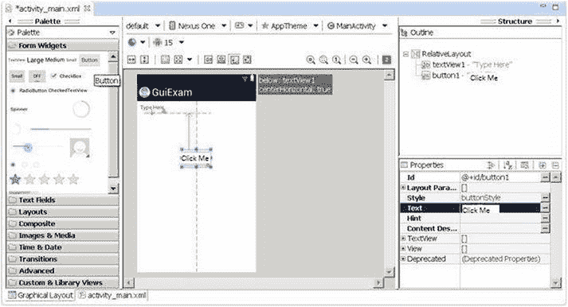

图 2-6. 修改 GuiExam 布局以添加按钮

3.  从左侧栏的“Text Fields”部分拖拽一个纯文本控件，并将其放入`activity_main`屏幕。将布局参数分支下的`Width`属性更改为`fill_parent`，然后拖拽纯文本直到它填满整个布局，如图 2-7 所示。

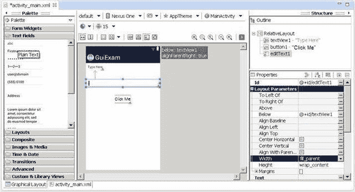

图 2-7. 修改 GuiExam 布局以添加文本编辑控件

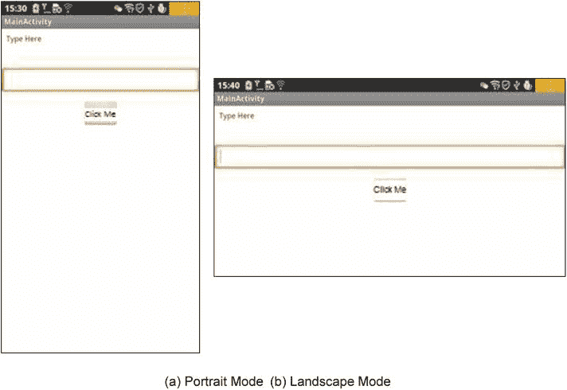

图 2-8. 布局修改后的 GuiExam 用户界面

通过这些示例，你可以看到界面的一般结构。通过`setContentView`（布局文件资源 ID）设置的 Activity 是：Activity 包含一个布局，布局包含各种控件，如图 2-9 所示。

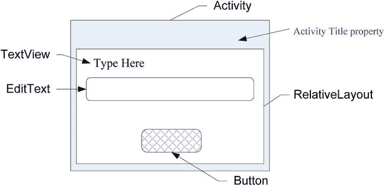


好的，作为高级文档工程师和翻译员，我将遵循您的注意事项和示例，将给定的英文文本翻译成中文。


图 2-9. 活动的界面结构

您可能会好奇为什么 Android 要引入布局这个理念。实际上，相比 Windows 微软基础类库（MFC）的编程接口，这是 Android 深受开发者喜爱的一个特性。布局隔离了设备屏幕大小、方向和其他细节上的差异，使得界面屏幕能够自适应各种设备。因此，运行在不同设备平台上的应用程序可以自动调整控件的大小和位置，无需用户干预或修改代码。

例如，您创建的应用程序可以运行在不同的 Android 手机、平板电脑和电视设备平台上，而无需您更改任何代码。控件的位置和大小会自动调整。甚至当您将手机旋转 90 度时，竖屏或横屏模式的界面也会自动调整大小并保持其相对位置。布局还允许根据当地国家习惯来排列控件（大多数国家从左到右排列，但有些国家从右到左排列）。界面设计需要考虑的细节都由布局来完成。您可以想象一下，如果没有布局类会发生什么——您将不得不为每个设备上的每个 Android 界面布局编写代码。这种工作量的复杂性是难以想象的。

### 直接使用 View 作为界面

前面您看到了活动的界面结构和代码框架。您也看到大多数 UI 是由视图及视图子类实现的。因此，您可以使用 `setContentView` 函数来指定一个视图对象，而不是一个布局。活动类 `setContentView` 函数的原型包括以下内容。

该函数将一个布局资源设置为活动的界面：

```
void setContentView(int layoutResID)
```

第一种类型的函数将一个显式的视图设置为活动的界面：

```
void setContentView(View view)
```

第二种类型的函数根据指定的格式，将一个显式的视图设置为活动的界面：

```
setContentView(View view, ViewGroup.LayoutParams params)
```

这里我们通过一个应用程序示例来实践直接使用视图作为活动界面的方法，使用第二种函数 `setContentView()`。您可以修改 `MainActivity.java` 文件的代码如下：

```
......
import android.widget.TextView;

public class MainActivity extends Activity {
    @Override
    public void onCreate(Bundle savedInstanceState) {
        super.onCreate(savedInstanceState);
        TextView tv = new TextView(this);    // 创建一个属于当前 Activity 的 TextView 对象
        tv.setText("Hello My friends!");     // 设置 TextView 的显示文本
        setContentView(tv);                  // 将 View 设置为 Activity 的主显示
}
```

应用程序界面如 图 2-10 所示。

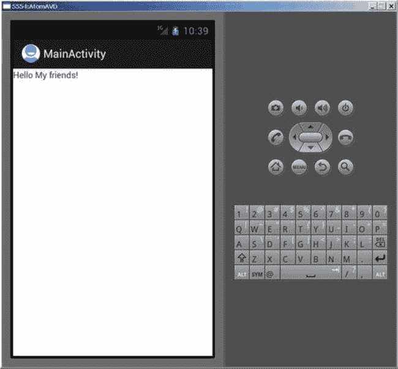

图 2-10. GuiExam 直接设置视图作为界面

在这个例子中，我们将 `TextView` 控件（视图的直接子类）作为应用程序界面；它们直接被设置在 `setContentView` 函数中。这样，`TextView` 显示的文本就成为应用程序界面的输出。要使用 `TextView` 类，您需要在文件开头使用 `import android.widget.TextView` 语句来导入该类的包。

### 组件 ID

现在，让我们回过头来看看 图 2-6 中显示的应用程序布局。布局中添加的文本编辑控件的 ID 属性是 `@+id/editText1`，按钮的 ID 属性是 `@+id/button1`（如 图 2-5 所示）。这是什么意思呢？

让我们看看 `R.java` 文件（节选）：

```
行号    源代码
    ......
8 package com.example.guiexam;

10 public final class R {
    ......
22     public static final class id {
23         public static final int button1=0x7f080001;
24         public static final int editText1=0x7f080002;
25         public static final int menu_settings=0x7f080003;
26         public static final int textView1=0x7f080000;
27     }
28     public static final class layout {
29         public static final int activity_main=0x7f030000;
30     }
    ......
43 }
```

与“GuiExam 应用程序”一节中的 `R.java` 文件相比，您可以看到第 23 和 24 行是新增的；它们是新添加的按钮和文本编辑框的资源 ID 编号。类型是 `int`，对应于这些控件的 ID 属性值。从 `R.java` 文件中，您可以找到这些控件的 ID——静态常量 `R.id.button1` 是 ID 属性值为 `@+id/button1` 的控件（按钮）的资源 ID，静态常量 `R.id.editText1` 是 ID 属性值为 `@+id/editText1` 的控件（文本编辑框）的资源 ID。这是为什么呢？让我们来看看。

Android 组件（包括控件和活动）需要使用 `int` 类型的值作为标签。这个值就是组件标签的 ID 属性值。ID 属性只能接受 `resources` 类型的值。也就是说，这个值必须以 `@` 开头；例如，`@id/abc`、`@+id/xyz` 等等。

`@` 符号用于提示 XML 文件的解析器解析 `@` 后面的名称。例如，对于 `@string/button1`，解析器会从 `values/string.xml` 中读取这个变量的 `button1` 值。

如果在 `@` 后面紧接着使用 `+` 符号，则意味着当您修改并保存布局文件时，系统会在 `R.java` 中自动生成相应的 `int` 类型变量。变量名是 `/` 符号后面的值；例如，`@+id/xyz` 会在 `R.java` 中生成 `int xyz = value`，其中 `value` 是一个十六进制数。如果 `R.java` 中已经存在相同的变量名 `xyz`，则系统不会生成新变量；相反，组件会使用这个已存在的变量。

换句话说，如果您使用 `@+id/name` 格式，并且 `R.java` 中存在名为 `name` 的变量，则组件会使用该变量的值作为标识符。如果该变量不存在，系统会添加一个新变量，并为该变量分配相应的值（不重复）。

因为组件的 ID 属性可以是一个资源 ID，所以您可以设置任何现有的资源 ID 值：例如，`@drawable/icon`、`@string/ok` 或 `@+string/`。当然，您也可以设置 Android 系统中已存在的资源 ID，例如 `@id/android:list`，其中的 `android:` 修饰符指明了系统 R 类所在的包（在 `R.java` 文件中）。您可以在 Java 代码编辑区输入 `android.R.id`，它会列出相应的资源 ID。例如，您可以这样设置 ID 属性值。

基于上述原因，通常将 Android 组件（包括控件、活动等）的 ID 属性设置为 `@+id/XXX` 格式。并且在程序中使用 `R.id.XXX` 来表示该组件的资源 ID 编号。

### 按钮和事件

在“使用布局作为界面”一节的示例中，您创建了一个包含 `Button`、`EditText` 等控件的应用程序，但是点击按钮时没有任何反应。这是因为您没有为 `click` 事件分配响应。本节首先介绍 Android 事件和监听器函数的基础知识。在后续关于 Android 多线程设计的章节中，您将回顾并进一步探索与事件相关的更高级知识。


在 Android 中，每个应用都维护着一个事件循环。当应用启动时，它完成必要的初始化，然后进入事件循环状态，等待用户操作，例如点击触摸屏、按键（按钮）或其它输入操作。用户操作会触发程序生成对*事件*的响应；系统会根据事件位置（如`Activity`或`View`）生成并分发相应的事件类来处理。回调方法被整合到一个名为*事件监听器*的接口中。你可以通过重写该接口的抽象函数来实现指定的事件响应。

不同类接收事件的作用域各不相同。例如，`Activity`类可以接收`keypress`事件，但不能接收`touch`事件；而`View`类既能接收`touch`事件也能接收`keypress`事件。此外，不同类接收到的事件属性细节也有所不同。例如，`View`类接收的`touch`事件包含触摸点数量、坐标值等信息，并可细分为按下、弹起和移动事件。但`View`类的子类`Button`只检测按下动作，且事件不提供触摸点坐标等信息。换句话说，`Button`处理了视图的原始事件，并将所有触摸事件整合为一个仅记录是否被*点击*的事件。

`View`类的大部分事件响应接口都以`Listener`为后缀，因此很容易记住它们与事件监听器接口的关联。表 2-4 展示了一些类及其事件响应函数的示例。

表 2-4. 类及其事件响应函数示例

| 类 | 事件 | 监听器接口与函数 |
| --- | --- | --- |
| `Button` | 点击 | `onClickListener`接口的`onClick()`函数 |
| `RadioGroup` | 点击 | `onCheckChangeListener`接口的`onCheckChange()`函数 |
| `View` | 下拉列表 | `TouchListener`接口的`onTouch()`函数 |
| | 输入焦点变化 | `onFocusChangeListener`接口的`onFocusChange()`函数 |
| | 按键 | `onKeyListener`接口的`onKey()`函数 |

响应事件的流程如下：首先，定义监听器接口的实现类并重写抽象函数。其次，调用如`set ... Listener()`之类的函数。然后，将自定义监视器接口的实现类设置为对应对象的事件监听器。

例如，你可以修改应用源码来执行事件响应。实现 Java 接口有多种编码风格。接下来的部分将讨论几种方式，这些方式下代码运行的结果是相同的。

### 内部类监听器

修改`MainActivity.java`代码如下（粗体部分为新增或修改的内容）：

```
行号    源代码
1 package com.example.guiexam;
2 import android.os.Bundle;
3 import android.app.Activity;
4 import android.view.Menu;
5 import android.view.MenuItem;
6 import android.support.v4.app.NavUtils;
7 import android.widget.TextView;

8 import android.widget.Button;                // 使用 Button 类

10 import android.view.View;                  // 使用 View 类
11 import android.view.View.OnClickListener;  // 使用 View.OnClickListener 类
12 import android.util.Log;
13 // 使用 Log.d 调试函数
   public class MainActivity extends Activity {
14     private int iClkTime = 1;

16 // Button 点击次数

@Override
18     public void onCreate(Bundle savedInstanceState) {
19         super.onCreate(savedInstanceState);
20         setContentView(R.layout.activity_main);

22          Button btn = (Button) findViewById(R.id.button1);
23 // 根据资源 ID 编号获取 Button 对象
24         final String prefixPrompt ="This is No. ";
25 // 定义并设置传递变量的值
26         final String suffixPrompt ="time(s) that Button is clicked";

27 // 定义并设置传递变量的值
28         btn.setOnClickListener(new /*View.*/OnClickListener(){
29 // 设置 Button 点击事件响应类

31             public void onClick(View v) {
32                 Log.d("ProgTraceInfo",prefixPrompt + (iClkTime++) + suffixPrompt);

}
        });
    }

@Override
    public boolean onCreateOptionsMenu(Menu menu) {
        getMenuInflater().inflate(R.menu.activity_main, menu);
        return true;
    }
}
```

在第 18-22 行，你分别根据`EditText`和`TextView`的资源 ID 获取了对应的对象。要将`OnClickListener`用作内部类，需要在变量前添加`final`修饰符。在第 23 和 24 行，作为`Button`点击的响应代码，你首先使用`EditText.getText()`获取`EditText`的内容。由于该函数返回`Editable`类型的值，你需要通过`CharSequence.toString()`函数将`Editable`类型转换为`String`类型（`CharSequence`是`Editable`的超类）。然后，调用`TextView.setText(CharSequence text)`函数来刷新`TextView`的显示。

在 Android 中，类属性的访问器函数通常以`set`/`get`开头，例如`EditText`内容的读写函数：

```
Editable  getText()
void  setText(CharSequence text, TextView.BufferType type)
```

该应用的界面如图 2-11 所示；(a) 是启动屏幕，(b) 是在编辑文本框中输入文本后的屏幕，(c) 是点击按钮后的应用屏幕。

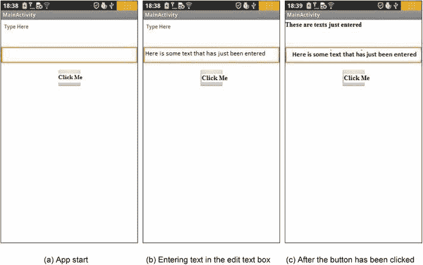

图 2-11. 包含`TextView`、`Button`和`EditText`的应用界面

### 使用`ImageView`

前几节讨论了小部件的典型用法，并展示了小部件编程的基本概念。图像是多媒体应用的基础，因此也是 Android 应用的主要组成部分。本节介绍图像/图片显示小部件`ImageView`的使用。通过本节中的示例，你将学习如何使用`ImageView`以及如何将文件添加到项目的资源中。

以下示例最初是在创建`GuiExam`应用时开发的。请按照以下步骤将图片文件添加到项目中：

1. 将图片文件（本例中为`morphing.png`）复制到相应的`/res/drawable-XXX`项目目录（用于存储不同分辨率图像项目文件的目录），如图 2-12 所示。

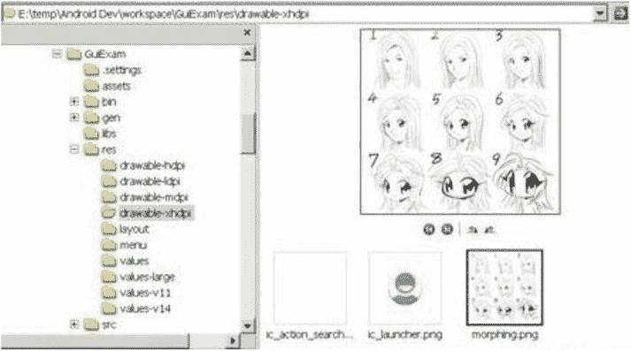

图 2-12. 将图片文件复制到项目的`res`目录中

2. 在 Eclipse 中打开项目，按 F5 键刷新项目。你可以在 Package Explorer 中看到添加到项目中的文件（本例中为`morphing.png`），如图 2-13 所示。

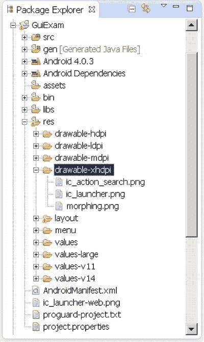

图 2-13. 添加图像后的 Package Explorer 窗口

要放置`ImageView`小部件到布局中，请按照以下步骤操作：


1.  点击选择“Hello world!”项目中的 `TextView` 控件，然后按 Del 键将其从布局中移除。
2.  在 `layout.xml` 的编辑窗口中，找到 Image & Media 分支，将该分支下的 `ImageView` 拖放至布局文件。当资源选择器对话框弹出时，点击并选择项目资源，在项目下选择刚导入的图片文件，点击确定完成操作。该过程如图 2-14 所示。

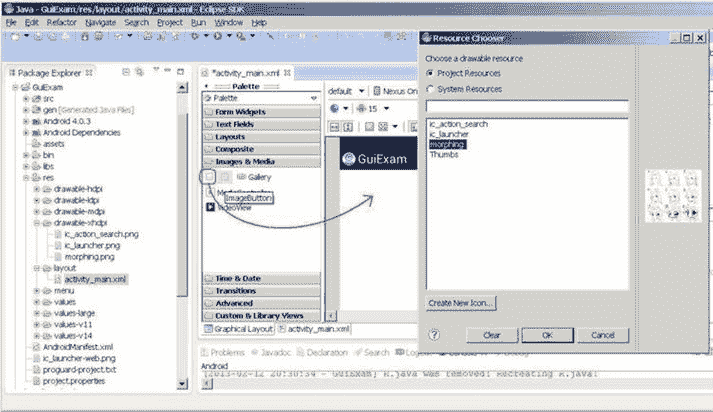

图 2-14 将 `ImageView` 控件放入布局中

3.  调整 `ImageView` 的大小和位置，并设置其属性。此步骤可使用图 2-15 所示的默认值。

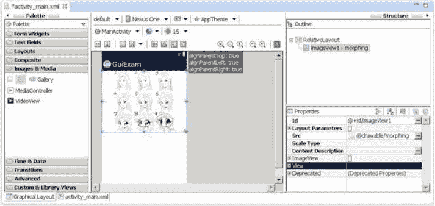

图 2-15 `ImageView` 的属性设置

4.  保存布局文件。

通常，此时需要编译 Java 代码。不过，在本例中无需编译。图 2-16 展示了该应用的界面。

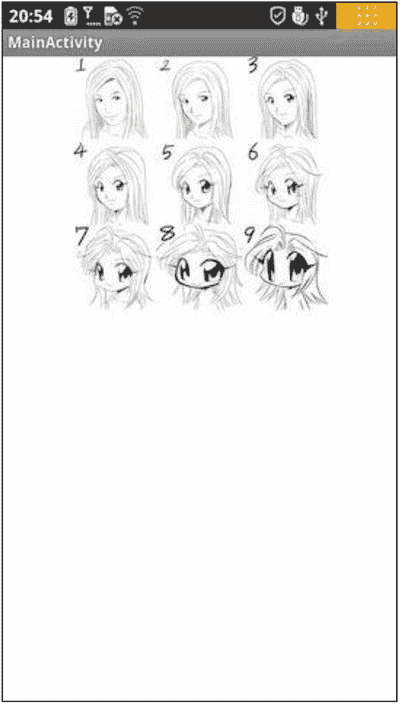

图 2-16 `ImageView` 的应用界面

### 退出活动与应用程序

在上一个示例中，你可以按手机的返回键来隐藏活动，但这并不会关闭活动。正如你在“活动的状态转换”一节中所见，当按下返回键时，已启动的活动只会从活动状态变为非活动状态，并保留在系统栈中。要关闭这些活动并将其从栈中移除，应使用 `Activity` 类的 `finish` 函数。

然而，关闭活动并不意味着应用程序进程结束。即使应用程序的所有组件（活动、服务、广播意图接收器等）都已关闭，应用程序进程仍然存在。退出应用程序进程主要有两种方法。

一种是 Java 提供的静态函数 `System.exit`，用于强制结束进程；另一种是 Android 提供的静态函数 `Process.killProcess(pid)`，用于终止指定的进程 ID (PID)。你可以通过 `Process.myPid()` 静态函数获取应用程序的进程 ID。

你可以将上述方法用于“使用 ImageView”一节中的示例。具体步骤如下：

1.  在布局文件中添加两个按钮，`Text` 属性分别设置为“关闭活动”和“退出应用程序”，ID 属性分别设置为 `@+id/closeActivity` 和 `@+id/exitApplication`。调整按钮的大小和位置，如图 2-17 所示。

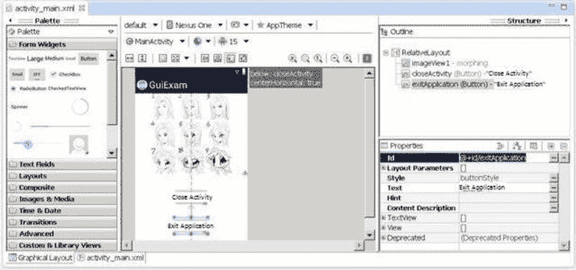

图 2-17 在布局中添加“关闭活动”和“退出应用程序”按钮

2.  按如下方式修改 `MainActivity.java` 文件的源代码（粗体代码为新增或修改部分，带删除线的行表示已删除的代码）：

```
    行号    源代码
    1  package com.example.guiexam;
    2  import android.os.Bundle;
    3  import android.app.Activity;
    4  import android.view.Menu;
    5  //import android.view.MenuItem;
    6  //import android.support.v4.app.NavUtils;
    7  import android.widget.Button;            //使用 Button 类
    8  import android.view.View;                //使用 View 类
    9  import android.view.View.OnClickListener;
       // 使用 View.OnClickListener 类
    10 import android.os.Process;
       // 使用 killProcess 方法

11 public class MainActivity extends Activity {
    12     @Override
    13     public void onCreate(Bundle savedInstanceState) {
    14         super.onCreate(savedInstanceState);
    15         setContentView(R.layout.activity_main);
    16         Button btn = (Button) findViewById(R.id.closeActivity);
    17 // 获取 <关闭活动> 的 Button 对象
    18         btn.setOnClickListener(new /*View.*/OnClickListener(){
    19 // 设置点击响应代码
    20             public void onClick(View v) {
    21                 finish();
       // 关闭主活动
    22             }
    23         });
    24         btn = (Button) findViewById(R.id.exitApplication);
    25 // 获取 <退出应用程序> 的 Button 对象
    26 // 设置点击响应代码
    27             public void onClick(View v) {
    28                 finish();
       // 关闭主活动
    29                 Process.killProcess(Process.myPid());
       // 退出应用程序进程

30             }

35         });
        }

@Override
        public boolean onCreateOptionsMenu(Menu menu) {
            getMenuInflater().inflate(R.menu.activity_main, menu);
            return true;
        }
    }
```

在第 5 行和第 6 行，移除了未使用的 `import` 语句。在第 16 至 21 行中，为“关闭活动”按钮设置了响应代码，并在第 22 至 28 行中，为“退出应用程序”按钮设置了响应代码。两者的唯一区别在于，后者新增了退出应用程序的代码 `Process.killProcess(Process.myPid())`。两个按钮均使用 `Activity` 类中相同的 `finish()` 函数来关闭活动。第 7 至 10 行的代码导入了相关类。

应用程序界面如图 2-18 所示。

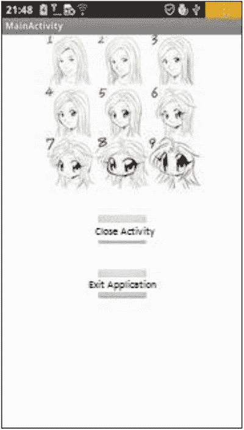

图 2-18 应用程序的“关闭活动”和“退出应用程序”界面

当你点击“关闭活动”或“退出应用程序”按钮时，应用程序的主界面会被关闭。区别在于，点击“关闭活动”时，应用程序进程（`com.example.guiexam`）不会退出；而点击“退出应用程序”时，进程会被关闭。这在 Eclipse 中 DDMS 视图的 Devices 面板中清晰可见，你可以在此查看目标机器上的进程列表，如图 2-19 所示。

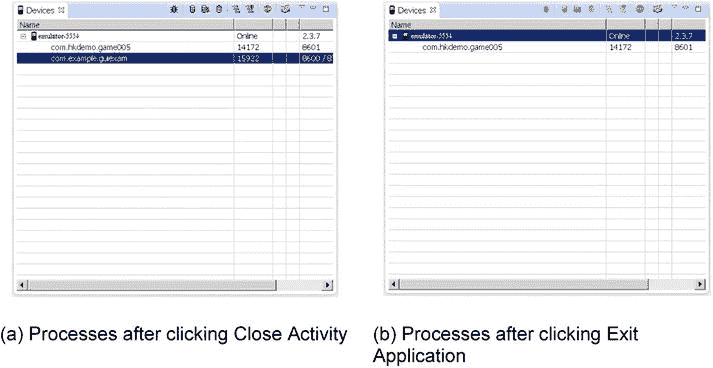

图 2-19 “关闭活动”与“退出应用程序”应用运行时 DDMS 中的进程

### 本章小结

本章通过创建一个名为 GuiExam 的简单应用，介绍了 Android 界面设计。你了解了活动的状态转换、`Context` 类、意图以及应用程序与活动之间的关系。你还学习了如何通过修改布局文件 `activity_main.xml` 将布局用作界面，并了解了按钮、事件和内部事件监听器的工作方式。下一章将介绍如何使用活动-意图机制创建包含多个活动的应用，并展示 `AndroidManifest.xml` 文件中所需进行的更改。

# 第 3 章


Android 应用的 GUI 设计，第 3 部分：设计复杂应用程序


## 多活动应用与 Intent 机制

在上一章中，您通过创建一个名为`GuiExam`的简单应用程序学习了 Android 界面设计。该章节还涵盖了活动的状态转换、`Context`类、以及 Intent 的介绍和应用程序与活动之间的关系。您学习了如何使用布局作为界面，以及按钮、事件和内部事件监听器的工作原理。在本章中，您将学习如何创建包含多个活动的应用程序；示例将介绍活动的显式和隐式触发机制。您将看到一个由不同应用程序中的活动触发的带有参数的应用程序示例，这将帮助您理解活动参数的交换机制。

## 包含多个活动的应用程序

上一示例中的应用程序只有一个活动：主活动，它在应用程序启动时显示。本章将演示一个包含多个活动的应用程序，使用活动-Intent 机制，并展示`AndroidManifest.xml`文件中所需的更改。

如前所述，活动由 Intent 触发。有两种 Intent 解析方法：*显式匹配*（也称为*直接 Intent*）和*隐式匹配*（也称为*间接 Intent*）。触发活动也可以带有参数和返回值。此外，Android 自带了许多内置活动，因此被触发的活动可以来自 Android 本身，也可以是自定义的。基于这些情况，本章使用四个示例来说明不同的活动。对于显式匹配，您将看到带有或不带参数和返回值的应用程序。对于隐式匹配，您将看到使用来自 Android 系统或用户定义的活动。

## 触发不带参数的显式匹配活动

使用不带参数的显式匹配是最简单的活动 Intent 触发机制。本节首先通过一个示例介绍这种机制，然后在后续部分介绍更复杂的机制。

显式匹配的活动-Intent 触发机制的代码框架包括两个部分：被调用者（被触发）的活动和调用者（触发）的活动。触发器不仅限于活动；它也可以是服务，例如广播 Intent 接收器。但由于您目前只接触了活动的使用，本节中所有示例的触发器都是活动。

1.  被调用者活动的源代码框架执行以下操作：
    1.  定义一个继承自`Activity`的类。
    2.  如果需要传递参数，则在`onCreate`函数中调用`Activity.getIntent()`函数来获取触发此活动的`Intent`对象，然后通过`Intent.getData()`、`Intent.getXXXExtra()`、`Intent.getExtras()`等函数获取传递的参数。
    3.  编写正常活动模式的代码。
    4.  如果需要向触发器返回值，则在退出活动前执行以下操作：
        1.  定义一个`Intent`对象
        2.  使用`Intent.putExtras()`等函数为 Intent 设置数据值
        3.  调用`Activity.setResult()`函数设置活动的返回码
    5.  在`AndroidManifest.xml`文件中添加被调用者活动的代码。
2.  调用者活动的代码框架执行以下操作：
    1.  定义`Intent`对象，并指定触发器的上下文和触发活动的`class`属性。
    2.  如果需要向活动传递参数，则通过调用 Intent 的`setData()`、`putExtras()`等函数为`Intent`对象设置参数。
    3.  调用`Activity.startActivity(Intent intent)`函数触发不带参数的活动，或调用`Activity.startActivityForResult(Intent intent, int requestCode)`触发带参数的活动。
    4.  如果需要通过返回值触发活动，则代码框架重写`Activity`类的`onActivityResult()`函数，该函数根据请求码（`requestCode`）、结果码（`resultCode`）和 Intent 值采取不同的操作。

在步骤 2a 中，使用了被触发活动的`class`属性，这涉及一种称为*反射*的 Java 机制。这种机制可以根据类名创建并返回该类的对象。被触发活动的对象在触发之前不会被构造；因此触发活动也意味着创建该类的对象，以便后续操作可以继续。也就是说，触发活动包括新创建类对象的操作。

以下两个示例详细说明了代码框架。本节描述第一个示例。在这个示例中，被触发的活动与触发活动属于同一个应用程序，并且被触发的活动不需要任何参数，也不返回任何值。新活动通过按钮触发，其活动界面类似于第 2 章中“退出活动和应用程序”部分的示例界面（图 2-16）。整个应用程序界面如图 3-1 所示。

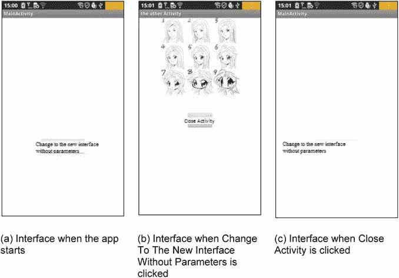

图 3-1. 同一应用程序中不带参数的多个活动界面

应用程序启动后，显示应用程序的主活动，如图 3-1(a)所示。当点击“切换到不带参数的新界面”按钮时，应用程序显示新活动，如图 3-1(b)所示。点击“关闭活动”按钮会使界面返回应用程序的主活动，如图 3-1(c)所示。

通过修改和重写第 2 章中`GuiExam`部分的示例来创建此示例，具体如下：


1. 为触发的 Activity 生成相应的布局文件：
    1. 在应用程序的`res\layout`子目录中右键单击快捷菜单，选择 New  Other Items。弹出 New 对话框。选择`\XML\XML File`子目录，然后单击 Next 继续。在 New XML File 对话框中，输入文件名（此处为`noparam_otheract.xml`），然后单击 Finish。整个过程如图 3-2 所示。

    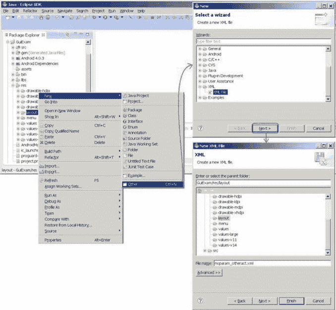

    Figure 3-2. 触发的 Activity 的布局文件

     **注意**：文件名是布局文件的名称。编译时必须仅使用小写字母，否则将出现错误“Invalid file name: must contain only a-z0-9_.”

    您可以在项目的 Package Explorer 中看到新添加的`xxx.xml`文件（此处为`noparam_otheract.xml`），如图 3-3 所示。

    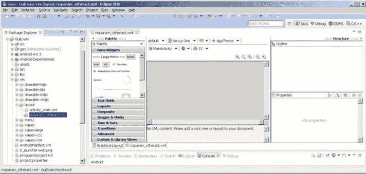

    Figure 3-3. 应用程序新添加的布局文件的初始界面

     **注意**：右侧的布局编辑器窗口仍然是空的，目前没有可见的界面。

    2. 选择左侧面板中的`Layouts`子目录，然后将布局控件（此处为`RelativeLayout`）拖到右侧面板的窗口中。您会立即看到一个可见的（手机屏幕形状的）界面，如图 3-4 所示。

    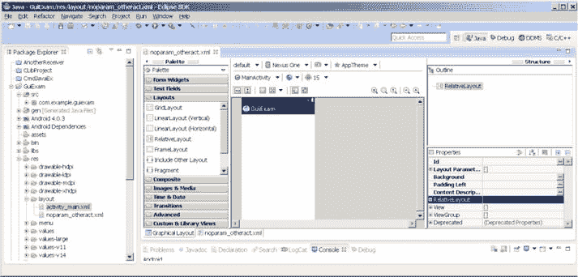

    Figure 3-4. 新添加布局文件的拖放布局

    3. 基于第 2 章“使用 ImageView”一节中描述的相同方法，在新的布局文件中放置一个`ImageView`和一个按钮。将`ImageView`控件的`ID`属性设置为`@+id/picture`，将`Button`控件的`ID`属性设置为`@+id/closeActivity`。`Text`属性设置为“Close Activity”，如图 3-5 所示。最后，保存布局文件。

    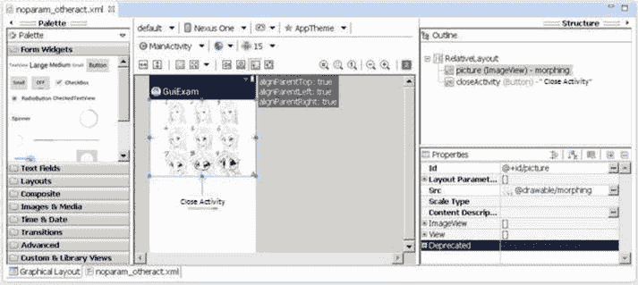

    Figure 3-5. 新添加布局文件的最终配置

2. 为布局文件添加相应的`Activity`类（Java 源文件）。为此，右键单击项目目录下的`\src\com.example.XXX`，然后选择 New  Class。在 New Java Class 对话框中，在 Name 处输入与新布局文件对应的`Activity`类名（此处为`TheNoParameterOtherActivity`）。单击 Finish 关闭对话框。整个过程如图 3-6 所示。

    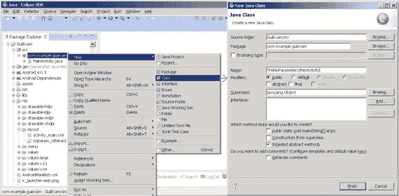

    Figure 3-6. 新添加布局文件对应的类

    您可以看到新添加的 Java 文件（此处为`TheNoParameterOtherActivity.java`）和初始代码，如图 3-7 所示。

    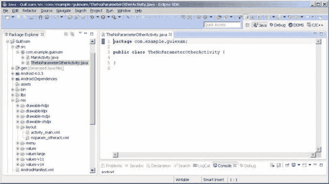

    Figure 3-7. 新添加布局对应的类和初始源代码

3. 编辑新添加的`.java`文件（`TheNoParameterOtherActivity.java`）。此类执行被触发的 Activity（被调用者）的活动。其源代码如下（粗体文本为添加或修改的内容）：

    ```
        Line #        Source Code
        1  package com.example.guiexam;
        2  import android.os.Bundle;                 // 使用 Bundle 类
        3  import android.app.Activity;              // 使用 Activity 类
        4  import android.widget.Button;             // 使用 Button 类
        5  import android.view.View;                 // 使用 View 类
        6  import android.view.View.OnClickListener; // 使用 OnClickListener 类

        7  public class TheNoParameterOtherActivity extends Activity {
        8  // 定义 Activity 子类
        9     @Override
        10 protected void onCreate(Bundle savedInstanceState) {
        11 // 定义 onCreate 方法
        12        super.onCreate(savedInstanceState);
        13 // 调用父类的 onCreate 方法
        14        setContentView(R.layout.noparam_otheract);
        15 // 设置布局文件
        16        Button btn = (Button) findViewById(R.id.closeActivity);
        17 // 为 <Close Activity> 按钮设置响应代码
        18        btn.setOnClickListener(new /*View.*/OnClickListener(){
        19          public void onClick(View v) {
                   finish();
           // 关闭此 Activity
              }
              });
           }
           }
    ```

    在第 7 行，您为新创建的类添加了父类`Activity`。第 8 到 18 行的代码与应用程序的主 Activity 类似。请注意，在第 14 行，代码调用`setContentView()`函数来设置`Activity`的布局，其参数是在第一步中创建的新布局 XML 文件的前缀名称。

4. 编辑触发器（调用者）Activity 的代码。触发器 Activity 是应用程序的主 Activity。源代码是`MainActivity.java`，布局文件是`activity_main.xml`。编辑步骤如下：
    1. 编辑布局文件，删除原始的`TextView`控件，并添加一个按钮。将其`ID`属性设置为`@+id/goTONoParamNewAct`，`Text`属性设置为“Change to interface without Parameter”，如图 3-8 所示。

    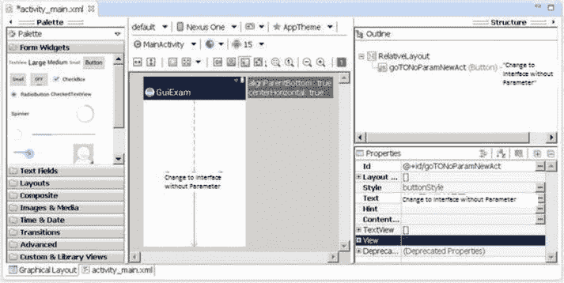

    Figure 3-8. 触发器 Activity 的布局配置

    2. 编辑触发器 Activity 的源代码文件（此处为`MainActivity.java`），如下所示（粗体文本为添加或修改的内容）：

    ```
            Line #        Source Code
            1  package com.example.guiexam;
            2  import android.os.Bundle;
            3  import android.app.Activity;
            4  import android.view.Menu;
            5  import android.content.Intent;            // 使用 Intent 类
            6  import android.widget.Button;             // 使用 Button 类
            7  import android.view.View.OnClickListener;
            8  import android.view.View;

            9  public class MainActivity extends Activity {
            10     @Override
            11     public void onCreate(Bundle savedInstanceState) {
            12         super.onCreate(savedInstanceState);
            13         setContentView(R.layout.activity_main);
            14     Button btn = (Button) findViewById(R.id.goTONoParamNewAct);
            15     btn.setOnClickListener(new /*View.*/OnClickListener(){
            16         public void onClick(View v) {
            17             Intent intent = new Intent(MainActivity.this,
                                               TheNoParameterOtherActivity.class);
            18             startActivity(intent);
            19         }
            20     });
            21     }
            22     @Override
            23     public boolean onCreateOptionsMenu(Menu menu) {
            24         getMenuInflater().inflate(R.menu.activity_main, menu);
            25         return true;
            26     }
            27 }
    ```

    第 17 行的代码定义了一个意图。此处的构造函数原型为：

    ```
            Intent(Context packageContext, Class<?> cls)
    ```


第一个参数是触发活动（trigger activity），在本例中为主活动；`this`由于在内部类中使用，因此需要加上类名修饰符。第二个参数是被触发活动（callee activity）的类。它使用`.class`属性来构造对象（所有 Java 类都有`.class`属性）。

第 18 行调用`startActivity`来运行该意图（intent）。该函数不会向被触发活动传递任何参数。函数原型如下：

`void Activity.startActivity(Intent intent)`

5.  编辑`AndroidManifest.xml`文件。为被触发活动添加描述性信息（添加的文本以粗体显示），以注册新的`Activity`类：

```
Line #        Source Code
1  <manifest xmlns:android="http://schemas.android.com/apk/res/android"
2      package="com.example.guiexam"
3      android:versionCode="1"
4      android:versionName="1.0" >
...      ... ...
10     <application
11         android:icon="@drawable/ic_launcher"
12         android:label="@string/app_name"
13         android:theme="@style/AppTheme" >
14         <activity
15             android:name=".MainActivity"
16             android:label="@string/title_activity_main" >
17             <intent-filter>
18                 <action android:name="android.intent.action.MAIN" />

20                 <category android:name="android.intent.category.LAUNCHER" />
21             </intent-filter>
22         </activity>
23         <activity android:name=".TheNoParameterOtherActivity"
            android:label="the other Activity"/>
24         </application>

26 </manifest>
```

你也可以用以下方法替换这段 XML 代码：

*   方法 1：

```
    <activity android:name="TheNoParameterOtherActivity" android:label=" the other Activity"> </activity>
    ```

*   方法 2：

```
    <activity android:name=".TheNoParameterOtherActivity " />
    ```

*   方法 3：

```
    <activity android:name=".TheNoParameterOtherActivity"></activity>
    ```

`android:name`文本字段的内容是被触发活动的类名：`TheNoParameterOtherActivity`。

请注意，如果在`Activity`类`android:name`的名称前加上句点（`.`），编译器会在 XML 文件的这一行给出以下警告（仅是警告，不是编译错误）：

```
Exported activity does not require permission
```

### 触发不同应用程序中带参数活动的显式匹配

前面几节介绍了在同一应用程序中触发不带参数的活动。触发活动的特点是被触发活动允许参数交换：触发活动可以向被触发活动指定某些参数，而被触发活动在退出时可以将这些参数值返回给触发活动。此外，被触发活动和触发活动可以位于完全不同的应用程序中。本节展示了一个示例，该示例中的活动被不同应用程序中的活动触发并带有参数。本示例将帮助你理解活动参数的交换机制。

使用第 2 章中相同的`GuiExam`应用程序。界面如图 3-9 所示。

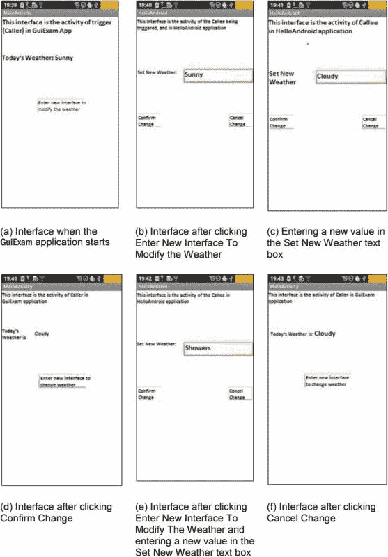

图 3-9. 不同应用程序中多个活动的界面

如图 3-9 所示，触发活动位于`GuiExam`应用程序中，其中有一个变量用于接收天气状况输入。打开`GuiExam`应用程序时，显示的是图 3-9(a)中的界面。点击“Enter New Interface To Modify The Weather”框，会触发`HelloAndroid`中的活动。当该活动启动时，它会显示传入“Set New Weather”文本框的新天气状况，如图 3-9(b)所示。现在，在“Set New Weather”中输入一个新的天气状况值，然后点击“OK Change”关闭触发活动。从“Set New Weather”返回的新值会刷新触发活动中的`Weather`变量，如图 3-9(d)所示。如果点击“Cancel Change”，它会执行相同操作并关闭活动，但`Weather`的值不会改变，如图 3-9(f)所示。

正在执行的应用程序的进程列表如图 3-10 所示（显示在 Eclipse 主机机器的 DDMS 窗口中）。

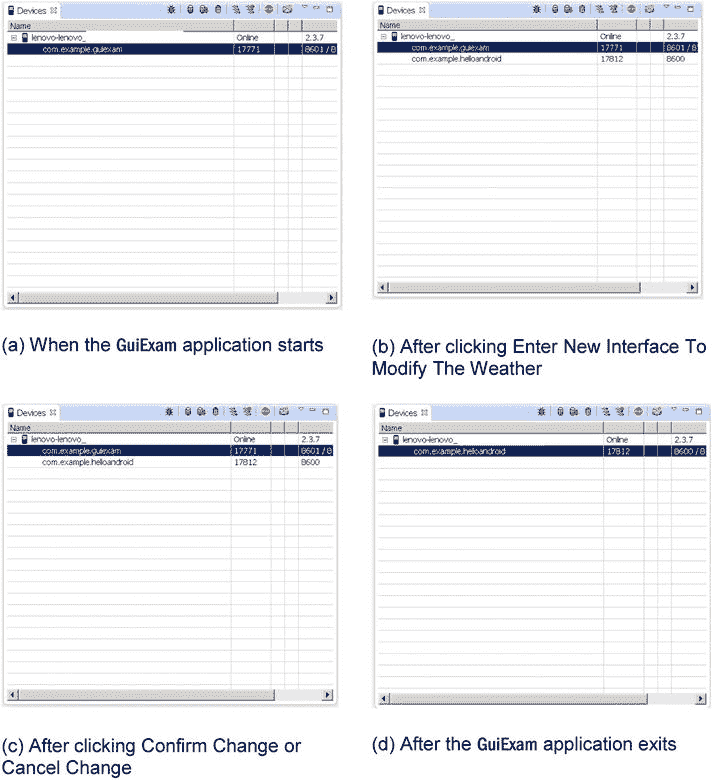

图 3-10. 多活动应用程序在 DDMS 中的进程列表

图 3-10 显示，当应用程序启动时，只有触发活动`GuiExam`的进程在运行。但是，当你点击“Enter New Interface To Modify The Weather”时，新活动被触发，新活动`HelloAndroid`的进程也开始运行，如图 3-10(b)所示。当你点击“Confirm Change”或“Cancel Change”时，被触发活动关闭，但`HelloAndroid`进程并未退出，如图 3-10(c)所示。有趣的是，即使`GuiExam`触发进程退出，被触发活动所属的`HelloAndroid`进程仍然处于运行状态。

构建步骤如下：

1.  修改触发应用程序的`GuiExam`代码：
    1.  编辑主布局文件（本例中为`activity_main.xml`），删除原始的`TextView`小部件；然后添加三个新的`TextView`小部件和一个按钮。按如下方式设置它们的属性：将两个`TextView`的`Text`属性分别设置为“This interface is the activity of the Caller in GuiExam application”和“Today’s Weather:”。将第三个`TextView`的`ID`属性设置为`@+id/weatherInfo`。按钮的`Text`属性为“Enter New Interface to Change Weather”，其`ID`属性为`@+id/modifyWeather`。调整每个小部件的大小和位置，如图 3-11 所示。

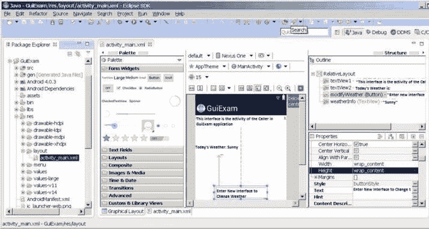

图 3-11. `GuiExam`触发应用程序的主布局设计

2.  修改`MainActivity.java`的内容，如下所示：

```
        Line#        Source Code
        1  package com.example.guiexam;
        2  import android.os.Bundle;
        3  import android.app.Activity;
        4  import android.view.Menu;
        5  import android.widget.Button;             // Use Button class
        6  import android.view.View;                 // Use View class
        7  import android.view.View.OnClickListener; // Use View.OnClickListener class
        8  import android.widget.TextView;           // Use TextView class
        9  import android.content.Intent;            // Use Intentclass
```


### 代码示例与解释

```java
public class MainActivity extends Activity {
    public static final String INITWEATHER = "Sunny"; // /初始天气
    public static final int MYREQUESTCODE = 100; // 触发活动的请求码
    private TextView tv_weather; // 显示天气信息的 TextView 控件

    @Override
    public void onCreate(Bundle savedInstanceState) {
        super.onCreate(savedInstanceState);
        setContentView(R.layout.activity_main);
        tv_weather = (TextView) findViewById(R.id.weatherInfo);
        tv_weather.setText(INITWEATHER);
        Button btn = (Button) findViewById(R.id.modifyWeather); // 根据资源 ID 获取按钮对象
        btn.setOnClickListener(new /* View.*/ OnClickListener() { // 设置点击事件响应代码
            public void onClick(View v) {
                Intent intent = new Intent();
                intent.setClassName("com.example.helloandroid", // 被触发的 Activity 所在的应用（包）
                    "com.example.helloandroid.TheWithParameterOtherActivity"); // 被触发的类（完整名称）
                String wthr = tv_weather.getText().toString(); // 获取天气 TextView 的值
                intent.putExtra("weather", wthr); // 设置要传递给 Activity 的参数
                startActivityForResult(intent, MYREQUESTCODE); // 触发 Activity
            }
        });
    }

    @Override
    protected void onActivityResult(int requestCode, int resultCode, Intent data) { // 触发的 Activity 结束返回
        super.onActivityResult(requestCode, resultCode, data);
        if (requestCode == MYREQUESTCODE) { // 判断是否是指定的 Activity 运行结束
            if (resultCode == RESULT_CANCELED) {
                // 选择“取消”退出代码，此情况为空
            } else if (resultCode == RESULT_OK) { // 选择<确定>退出代码
                String wthr = null;
                wthr = data.getStringExtra("weather"); // 获取返回值
                if (wthr != null)
                    tv_weather.setText(wthr); // 更新 TextView 显示的天气内容
            }
        }
    }

    @Override
    public boolean onCreateOptionsMenu(Menu menu) {
        getMenuInflater().inflate(R.menu.activity_main, menu);
        return true;
    }
}
```

代码中的第 23–28 行触发了其他应用程序中带参数的活动。第 23–25 行建立了触发意图，它使用了`Intent.setClassName()`函数。其原型如下：

```java
Intent Intent.setClassName(String packageName, String className);
```

第一个参数是被触发活动所在包的名称，第二个参数是被触发活动的类名（需使用完整名称）。通过使用`startActivityForResult()`函数触发活动，系统可以准确定位应用程序和活动类。

第 28 行将参数作为附加数据附加到`Intent`中。`Intent`有一系列`putExtra()`函数用于附加数据，以及另一系列`getXXXExtra()`函数用于从`Intent`中提取数据。附加数据也可以通过`Bundle`类来组装。`Intent`提供了`putExtras()`函数来添加数据，以及`getExtras()`函数来获取数据。`putExtra()`使用“属性-值”数据配对或“变量名-值”数据配对来添加和检索数据。在本例中，`Intent.putExtra("weather", "XXX")`保存了由`weather`变量名称和值“XXX”组成的数据对，作为意图的附加数据。

代码中的`Intent.getStringExtra("weather")`从附加的意图数据中获取`weather`变量的值，并返回字符串类型。

关于这些函数和`Bundle`类的更多详细信息，可在 Android 官方网站的文档中找到，此处不再深入讨论。

在第 33–46 行中，重写了`Activity`类的`onActivityResult()`函数。当被触发的活动关闭时，会调用此函数。在第 36 行中，首先根据请求码确定是哪个活动关闭并返回。然后根据结果码和请求码判断是通过“确定”还是“取消”按钮返回的。第 40–50 行从返回的意图中获取协商好的变量值。第 42 行根据变量的返回值更新界面。在此函数中，如果用户点击“取消”返回，则不做任何操作。

#### 修改调用方应用程序`HelloAndroid`的代码

修改调用方应用程序`HelloAndroid`的代码，如图 3-12 所示：

1. 使用本章前面“触发不同应用程序中带有参数的活动的显式匹配”一节中描述的方法，添加一个布局文件（本例中命名为`param_otheract.xml`），并将一个`RelativeLayout`布局拖放到该文件中。
2. 编辑此布局文件，添加两个`TextView`小部件、一个`EditText`和两个`Button`小部件。设置它们的属性如下：
   - 两个`TextView`小部件的`Text`属性：“This interface is the activity of the caller in HelloAndroid application”和“Set new weather as:”
   - `EditText`的`ID`属性：`@+id/editText_NewWeather`
   - 两个`Button`的`Text`属性：“Confirm Changes”和“Cancel Changes”
   - 两个`Button`的`ID`属性：`@+id/button_Modify`和`@+id/button_Cancel`

   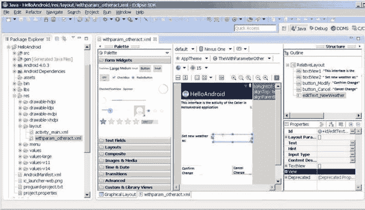

   **图 3-12.** 被触发（被调用方）应用程序`HelloAndroid`的新布局设计

   然后调整它们的大小和位置。

3. 按照“触发不同应用程序中带有参数的活动的显式匹配”一节中的描述，为新的布局文件添加相应的类（本例中为`TheWithParameterOtherActivity`），如图 3-13 所示。

   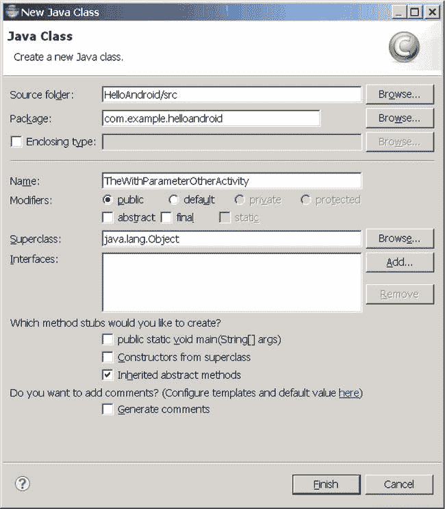

   **图 3-13.** 在`HelloAndroid`项目中为新添加的布局文件添加相应的类

4. 编辑新布局文件的类文件（本例中为`TheWithParameterOtherActivity.java`）。内容如下：

```java
Line#        Source Code
1  package com.example.helloandroid;
2  import android.os.Bundle;                // 使用 Bundle 类
3  import android.app.Activity;             // 使用 Activity 类
4  import android.content.Intent;           // 使用 Intent 类
5  import android.widget.Button;            // 使用 Button 类
6  import android.view.View;                // 使用 View 类
7  import android.view.View.OnClickListener; // 使用 OnClickListener 类
8  import android.widget.EditText;          // 使用 EditText 类
```


```java
public class TheWithParameterOtherActivity extends Activity {
    private String m_weather;
    // 保存新的天气变量
    @Override
    protected void onCreate(Bundle savedInstanceState) {
        // 定义 onCreate 方法
        super.onCreate(savedInstanceState);
        // 调用父类的 onCreate 方法
        setContentView(R.layout.withparam_otheract); // 设置布局文件
        Intent intent = getIntent();
        // 获取触发此 Activity 的 Intent
        m_weather = intent.getStringExtra("weather");
        // 从 Intent 中获取附加数据
        final EditText et_weather = (EditText)
                findViewById(R.id.editText_NewWeather);
        et_weather.setText(m_weather,null);
        // 根据 Intent 的附加数据设置"新天气"编辑框的初始值
        Button btn_modify = (Button) findViewById(R.id.button_Modify);
        btn_modify.setOnClickListener(new /*View.*/OnClickListener(){
            // 设置<确认修改>对应的代码
            public void onClick(View v) {
                Intent intent = new Intent();
                // 创建并返回用于存储数据的 Intent
                String wthr = et_weather.getText().toString();
                // 从编辑框中获取新的天气值
                intent.putExtra("weather",wthr);
                // 将新的天气值放入返回的 Intent
                setResult(RESULT_OK, intent);
                // 设置<确认>并返回数据
                finish(); // 关闭 Activity
            }
        });
        Button btn_cancel = (Button) findViewById(R.id.button_Cancel);
        btn_cancel.setOnClickListener(new /*View.*/OnClickListener(){
            // 设置<取消修改>对应的代码
            public void onClick(View v) {
                setResult(RESULT_CANCELED, null);
                // 设置<取消>的返回值
                finish(); // 关闭此 Activity
            }
        });
    }
}
```

这段代码遵循 Activity 的框架。它在第 11 行设置了 Activity 的布局，布局名称与第 1 步中创建的布局文件名相同（无扩展名）。在第 19-22 行，它首先构建了一个用于返回的 Intent，然后将附加数据添加到 `Intent` 对象中作为返回数据。在第 21 行，它设置了 Activity 的返回值，并以该 Intent 作为返回数据的载体。`setResult` 函数的原型为：

```java
final void Activity.setResult(int resultCode, Intent data);
```

如果 `resultCode` 为 `RESULT_OK`，表示用户单击了确认返回；如果为 `RESULT_CANCELLED`，表示用户单击了取消返回。在这种情况下，返回数据载体 intent 可以为 null，如第 27 行所示。

3.  使用以下代码修改 `AndroidManifest.xml`，该文件由应用程序触发：

```xml
    行号        源代码
    1  <manifest xmlns:android="http://schemas.android.com/apk/res/android"
    2      package="com.example.helloandroid"
    3      android:versionCode="1"
    4      android:versionName="1.0" >

6      <uses-sdk
    7          android:minSdkVersion="8"
    8          android:targetSdkVersion="15" />

10     <application
    11         android:icon="@drawable/ic_launcher"
    12         android:label="@string/app_name"
    13         android:theme="@style/AppTheme" >
    14         <activity
    15             android:name=".MainActivity"
    16             android:label="@string/title_activity_main" >
    17             <intent-filter>
    18                 <action android:name="android.intent.action.MAIN" />

20                 <category android:name="android.intent.category.LAUNCHER" />
    21             </intent-filter>
    22         </activity>
    23         <activity
    24             android:name="TheWithParameterOtherActivity">
    25             <intent-filter>
    26                 <action android:name="android.intent.action.DEFAULT" />
    27                </intent-filter>
    28         </activity>
    29     </application>

31 </manifest>
```

4.  第 24-29 行是新添加的内容。与之前几节类似，你需要添加一个额外的 Activity 描述，并指定其类名，即第二步中生成的要被触发的 Activity 的类名。有关修改 `AndroidManifest.xml` 文件的详细信息，请参阅“触发无参数 Activity 的显式匹配”一节。与那一节不同，这里不仅添加一个 Activity 及其 `name` 属性的文档，还添加了 `intent-filter` 指令和状态，以接受 `Action` 元素中描述的默认操作，并触发此 `Activity` 类。如果缺少该 Activity 的 `intent-filter` 描述，则该 Activity 无法被激活。
5.  运行被调用应用程序以注册 Activity 的组件。只有在被调用应用程序 `HelloAndroid` 执行一次之后，对 `AndroidManifest.xml` 文件的修改才会注册到 Android 系统中。因此，这是完成其包含的 Activity 注册的必要步骤。

## 内置 Activity 的隐式匹配

在前两节的示例中，在你通过 `Activity.startActivity()` 函数或 `Activity.startActivityForResult()` 函数触发同一应用程序或不同应用程序的 Activity 之前，`Intent` 对象的构造函数会显式指定类，要么通过 `.class` 属性，要么通过字符串形式的类名。这样，系统就能找到要触发的类。这种方法称为*显式 Intent 匹配*。下一个示例展示了如何触发一个未被指定的类。相反，系统会使用一种称为*隐式 Intent 匹配*的方法来找到它。

此外，Android 内置了许多已经实现好的 Activity，例如拨号、发送短信等。本节中的示例说明了如何使用隐式匹配来触发这些内置的 Activity。应用程序界面如 图 3-14 所示。

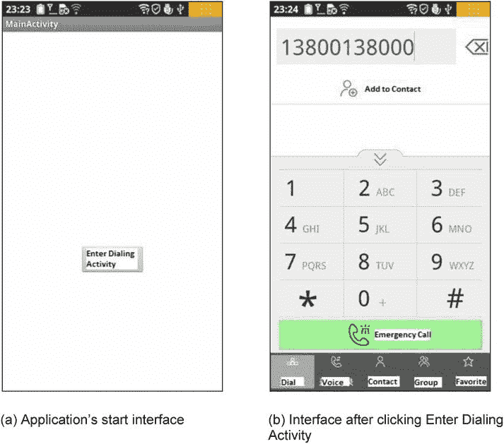

图 3-14. 使用隐式 Intent 触发内置 Activity 时的应用程序界面

用户启动 `GuiExam` 应用程序，并单击屏幕上的“进入拨号 Activity”按钮。这将触发系统自带的拨号 Activity。

在这种情况下，你需要修改 `GuiExam` 项目，并将此应用程序作为触发器。隐式匹配触发的 Activity 是拨号 Activity。构建此示例的步骤如下：

1.  在 `GuiExam` 应用程序的布局文件（`activity_main.xml`）中，删除原有的 `TextView` 控件，添加一个按钮，并将其 `ID` 属性设置为 `@+id/goTODialAct`，`Text` 属性设置为“进入拨号 Activity”。调整其大小和位置，如 图 3-15 所示。

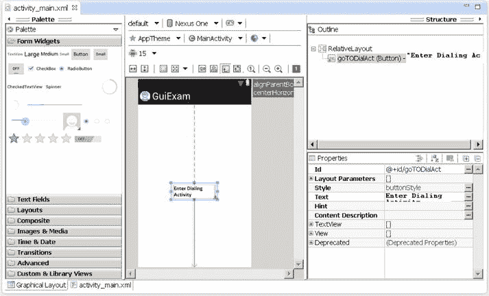

图 3-15. 用于隐式匹配内置 Activity 的应用程序布局文件

2.  按如下方式修改源代码文件（`MainActivity.java`）：


```java
Line#        Source Code
1  package com.example.guiexam;
2  import android.os.Bundle;
3  import android.app.Activity;
4  import android.view.Menu;
5  import android.widget.Button;            // 使用 Button 类
6  import android.view.View;                // 使用 View 类
7  import android.view.View.OnClickListener; // 使用 View.OnClickListener 类
8  import android.content.Intent;           // 使用 Intent 类
9  import android.net.Uri;                  // 使用 URI 类

10 public class MainActivity extends Activity {
11     @Override
12     public void onCreate(Bundle savedInstanceState) {
13         super.onCreate(savedInstanceState);
14         setContentView(R.layout.activity_main);
15         Button btn = (Button) findViewById(R.id.goTODialAct);
16         btn.setOnClickListener(new /*View.*/OnClickListener(){
17 // 设置点击活动对应的代码
18             public void onClick(View v) {
19                 Intent intent = new Intent(Intent.ACTION_DIAL,
                   Uri.parse("tel:13800138000"));
20                 startActivity(intent); // 触发相应的活动
21             }
22         });
       }

24     @Override
25     public boolean onCreateOptionsMenu(Menu menu) {
26         getMenuInflater().inflate(R.menu.activity_main, menu);
27         return true;
28     }
   }
```

第 16 行的代码定义了一个*间接意图*（即隐式匹配的意图）。之所以称之为间接意图，是因为在对象的构造函数中没有指定需要触发的类；构造函数仅描述了需要触发以完成拨号功能的类。间接意图的构造函数如下所示：

```java
Intent(String action)
Intent(String action, Uri uri)
```

这些函数要求其被调用时，能够找到可以完成指定动作的类（活动）。两者的唯一区别在于，第二个函数还附带了数据。

本例使用了第二个构造函数，它要求找到一个能够完成拨号功能并附带电话号码字符串作为额外数据的活动。由于应用程序未指定触发类型，Android 会从已注册的类列表中查找能够处理此动作的类（例如 `Activity`），并触发该事件的启动。

如果有多个类可以处理指定的动作，Android 会弹出一个选择菜单，供用户选择运行哪一个。

`action` 参数可以使用系统预定义的字符串。在前面的示例中，`Intent.ACTION_DIAL` 是 `ACTION_DIAL` 的字符串常量，由 `Intent` 类定义。表 3-1 展示了一些系统预定义的 `ACTION` 示例。

表 3-1. 部分系统预定义的 `ACTION` 常量

| `ACTION` 常量名 | 值 | 描述 |
| --- | --- | --- |
| `ACTION_MAIN` | `android.intent.action.MAIN` | 作为任务的初始活动启动，无数据输入和返回输出。 |
| `ACTION_VIEW` | `android.intent.action.VIEW` | 显示意图 URI 中的数据。 |
| `ACTION_EDIT` | `android.intent.action.EDIT` | 请求一个活动来编辑数据。 |
| `ACTION_DIAL` | `android.intent.action.DIAL` | 启动电话拨号器，并使用数据中预设的号码进行拨号。 |
| `ACTION_CALL` | `android.intent.action.CALL` | 发起电话呼叫，并立即使用数据 URI 中的号码进行呼叫。 |
| `ACTION_SEND` | `android.intent.action.SEND` | 启动一个活动以发送特定数据（接收方由活动解析选择）。 |
| `ACTION_SENDTO` | `android.intent.action.SENDTO` | 通常启动一个活动以向 URI 中指定的联系人发送消息。 |
| `ACTION_ANSWER` | `android.intent.action.ANSWER` | 打开一个活动来处理来电。目前由本地电话拨号工具处理。 |
| `ACTION_INSERT` | `android.intent.action.INSERT` | 打开一个活动，该活动可以在特定数据字段的添加光标处插入新项目。当作为子活动调用时，它必须返回新插入项目的 URI。 |
| `ACTION_DELETE` | `android.intent.action.DELETE` | 启动一个活动，删除 URI 位置的数据端口。 |
| `ACTION_WEB_SEARCH` | `android.intent.action.WEB_SEARCH` | 打开一个活动，并根据 URI 数据中的文本运行网页搜索。 |

`ACTION` 常量名是隐式匹配意图构造函数中使用的第一个参数。`ACTION` 常量的值用于接收此动作的活动在 `AndroidManifest.xml` 声明中，在本节中不会用到，而是在下一节中使用。你可以在 `android.content.Intent` 帮助文档中找到更多关于预定义 `ACTION` 值的信息。

## 使用自定义活动的隐式匹配

前面的示例使用了隐式匹配来触发 Android 系统自带的的活动。在本节中，你将看到一个使用隐式匹配触发自定义活动的示例。

此示例应用程序的配置与“触发不同应用程序带参数活动的显式匹配”一节中的配置类似。触发应用程序位于 `GuiExam` 项目中，而由隐式匹配触发的自定义活动位于 `HelloAndroid` 应用程序中。其界面如 图 3-16 所示。

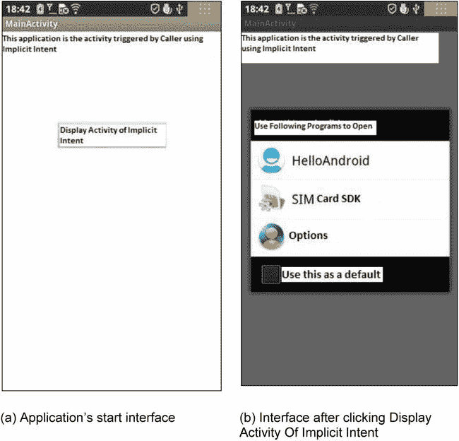

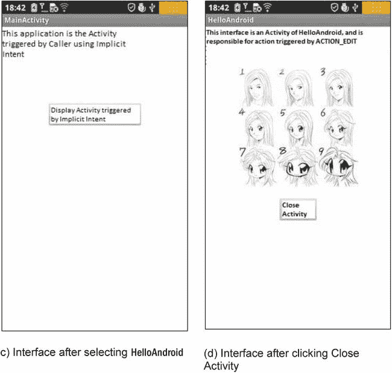

图 3-16. 使用自定义活动的隐式匹配界面

图 3-16(a) 显示了 `GuiExam` 触发器应用程序启动时的界面。当点击“显示隐式意图的活动”按钮时，系统会根据 `ACTION_EDIT` 动作的要求查找符合条件的候选活动，并显示这些候选活动的列表 (b)。当选中用户自定义的 `HelloAndroid` 应用程序时，会显示声明了能够接收 `HelloAndroid` 应用程序中 `intent-filter` 中的 `ACTION_EDIT` 动作的活动 (c)。点击“关闭活动”按钮时，应用程序会返回到原始的 `GuiExam` 活动界面 (d)。

与前面的示例类似，本示例也基于修改 `GuiExam` 项目。步骤如下：


### 使用隐式意图设计安卓应用

1.  编辑主布局文件（`activity_main.xml`）。删除原有的 `TextView` 控件，然后添加一个 `TextView` 和一个按钮。将 `TextView` 的 `Text` 属性设置为“此应用是由调用者通过隐式意图触发的活动”。将按钮的 `Text` 属性设置为“显示由隐式意图触发的活动”，并将其 `ID` 属性设置为 `@+id/goToIndirectAct`，如图 3-17 所示。

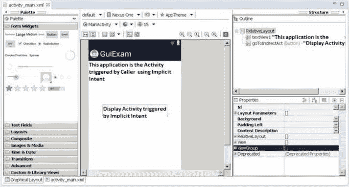

图 3-17。`GuiExam` 触发应用的主布局设计

2.  按如下方式编辑 `MainActivity.java`：

```
    行号        源码
    1  package com.example.guiexam;
    2  import android.os.Bundle;
    3  import android.app.Activity;
    4  import android.view.Menu;
    5  import android.widget.Button;            // 使用按钮类
    6  import android.view.View;                // 使用视图类
    7  import android.view.View.OnClickListener; // 使用 View.OnClickListener 类
    8  import android.content.Intent;           // 使用意图类

    9  public class MainActivity extends Activity {
    10     @Override
    11     public void onCreate(Bundle savedInstanceState) {
    12         super.onCreate(savedInstanceState);
    13         setContentView(R.layout.activity_main);
    14         Button btn = (Button) findViewById(R.id.goToIndirectAct);
    15         btn.setOnClickListener(new /*View.*/OnClickListener(){
    16 // 为按钮点击事件设置响应代码
    17             public void onClick(View v) {
    18                 Intent intent = new Intent(Intent.ACTION_EDIT);
    19 //构建隐式意图
    20                 startActivity(intent); // 触发活动
    21             }
             });
    22     }

    24     @Override
    25     public boolean onCreateOptionsMenu(Menu menu) {
    26         getMenuInflater().inflate(R.menu.activity_main, menu);
    27         return true;
           }
       }
    ```

第 16 和 17 行的代码定义了隐式意图并触发相应的活动，这与之前触发隐式活动的代码基本相同，但这里使用了不带数据的意图构造函数。

3.  修改包含自定义活动及其对应隐式意图的 `HelloAndroid` 应用：
    1.  根据本章前面“触发不带参数的活动显式匹配”一节中描述的方法，向项目中添加一个布局文件（`implicit_act.xml`），并将一个 `RelativeLayout` 布局拖放到该文件中。
    2.  编辑布局文件，并添加 `TextView`、`ImageView` 和 `Button` 控件。按如下方式设置属性：

        *   `TextView` 的 `Text` 属性：“此界面是 HelloAndroid 的一个活动，负责处理由 ACTION_EDIT 触发的操作”
        *   `ImageView`：按照第 2 章中“使用 ImageView”一节的说明进行设置。
        *   `Button` 的 `Text` 属性：“关闭活动”
        *   `Button` 的 `ID` 属性：`@+id/closeActivity`。

    然后调整它们各自的大小和位置，如图 3-18 所示。

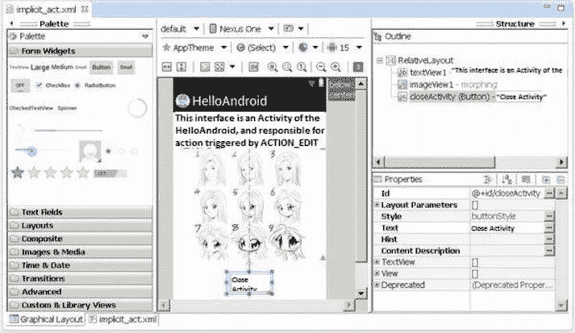

图 3-18。对应隐式意图的自定义活动的布局文件

4.  类似于本章“触发不带参数的活动显式匹配”一节中描述的过程，为新的布局文件（`TheActivityToImplicitIntent`）向项目中添加对应的类，如图 3-19 所示。

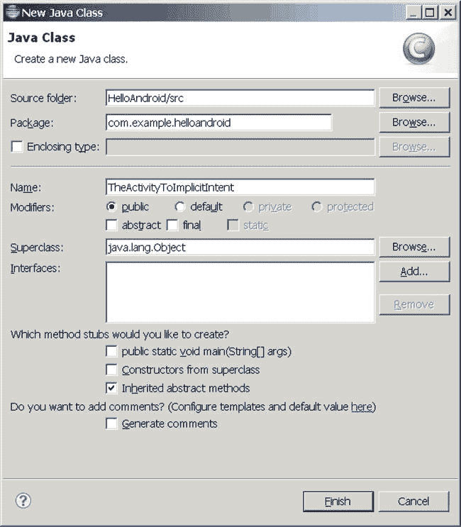

图 3-19。对应隐式意图的自定义活动的新类

5.  编辑新添加的布局文件的类文件（`TheActivityToImplicitIntent.java`），内容如下：

```
    行号        源码
    1  package com.example.helloandroid;
    2  import android.os.Bundle;
    3  import android.app.Activity;
    4  import android.widget.Button;           // 使用按钮类
    5  import android.view.View;               // 使用视图类
    6  import android.view.View.OnClickListener; // 使用 View.OnClickListener 类

    7  public class TheActivityToImplicitIntent extends Activity {
    8  @Override
    9  public void onCreate(Bundle savedInstanceState) {
    10         super.onCreate(savedInstanceState);
    11         setContentView(R.layout.implicit_act);
    12         Button btn = (Button) findViewById(R.id.closeActivity);
    13         btn.setOnClickListener(new /*View.*/OnClickListener(){
    14 // 为 <关闭活动> 点击设置响应代码
    15             public void onClick(View v) {
    16                 finish();
    17             }
    18         });
    19     }
       }
    ```

6.  修改包含对应隐式意图的自定义应用 `HelloAndroid` 的 `AndroidManifest.xml` 文件，如下所示：

```
    行号        源码
    1  <manifest xmlns:android="http://schemas.android.com/apk/res/android"

    3      package="com.example.helloandroid"

    5      android:versionCode="1"

    7      android:versionName="1.0" >

    9      <uses-sdk
    10         android:minSdkVersion="8"
    11         android:targetSdkVersion="15" />

    13     <application
    14         android:icon="@drawable/ic_launcher"
    15         android:label="@string/app_name"
    16         android:theme="@style/AppTheme" >
    17         <activity
    18             android:name=".MainActivity"
    19             android:label="@string/title_activity_main" >
    20             <intent-filter>
    21                 <action android:name="android.intent.action.MAIN" />

    23                 <category android:name="android.intent.category.LAUNCHER" />
    24             </intent-filter>
    25         </activity>
    26         <activity
    27             android:name="TheActivityToImplicitIntent">
    28             <intent-filter>
    29                 <action android:name="android.intent.action.DEFAULT" />
    30                 <action android:name="android.intent.action.EDIT" />
    31                 <category android:name="android.intent.category.DEFAULT" />
    32             </intent-filter>
    33         </activity>
           </application>

</manifest>
    ```

第 24 至 32 行（粗体部分）的代码提供了接收隐式意图的活动信息。第 26 行指定了可以接收 `android.intent.action.EDIT` 操作。该值对应于触发器的意图构造函数（`GuiExam` 的 `MainActivity` 类）中 `ACTION` 参数 `Intent.ACTION_EDIT` 的常量值。这是触发方与被调用方之间预定的联系信号。第 27 行进一步指定了也可以接收默认数据类型。

7.  运行 `HelloAndroid` 应用，该应用现在包含一个对应隐式意图的自定义活动，并将其 `AndroidManifest.xml` 文件注册到系统中。

到目前为止，前三章已经涵盖了安卓界面设计。简单的 `GuiExam` 应用演示了活动的状态转换、`Context` 类、意图以及应用与活动之间的关系。你还学习了如何使用布局作为界面，以及按钮、事件和内部事件监听器的工作原理。包含多个活动的示例介绍了活动的显式和隐式触发机制。你看到了一个由不同应用中的活动触发带参数的应用示例，并且现在了解了活动参数的交换机制。


## 安卓应用 GUI 设计（第四部分）：图形界面与触摸屏输入

到目前为止，我们已经用了三章的篇幅来讨论安卓的界面设计。之前讨论的应用界面类似于对话框界面。这种模式的缺点在于难以获取精确的触摸屏输入信息，因此也就很难根据输入接口显示准确的图像。下一章作为安卓界面设计的最后一部分，将介绍基于视图的交互式风格界面。在这种界面中，您可以利用精确的触摸屏输入来录入信息，并显示详细的图像，这正符合许多游戏应用的需求。

## 显示输出框架

与由 `TextView`、`EditText`、`Button` 等窗口组件构成的对话框风格界面不同，交互式 UI 显示直接使用 `View` 类。本节介绍在视图中绘图（即显示图像或图形）的基本框架。

要在视图中显示图像和图形，需要将绘制代码放入其 `onDraw` 函数中。每当需要重新绘制视图中的图像时（例如，应用程序启动时视图显示、图形视图顶部的覆盖对象（如视图、事件或对话框）被移开、底层视图随 Activity 移至顶层等类似情况），都会调用 `onDraw` 函数。建议将绘制代码放在 `View.onDraw` 函数中，这样可以确保在需要向用户显示视图时，视图窗口也能立即显示其全部输出；否则，某些图形视图区域可能无法刷新或重绘。

安卓的绘图函数，如绘制矩形、绘制椭圆、绘制直线和显示文本，通常都集成在 `Canvas` 类中。当 `View.onDraw` 回调执行时，会携带一个 `Canvas` 参数，用于获取 `Canvas` 对象。

安卓使用 `Paint` 类来绘制各种图形。`Paint` 包含了多种画笔属性，例如颜色、填充样式、字体和字体大小。

正如本书前面所述，在 Eclipse 中生成的应用程序代码，其界面配置风格如下：一个 Activity 包含布局，而布局又包含两层小部件结构。因此，您在 Activity 的 `onCreate` 函数中将参数设置为布局，并传递给 `setContentView` 函数，以实现这种效果。要使用基于视图的界面，您需要将 `setContentView` 函数的默认参数布局更改为自定义的视图类。

以下是一个说明该过程的示例。按照以下步骤修改 `GuiExam` 示例项目：

1. 采用与第 3 章中“触发无参数 Activity 的显式匹配”部分相同的步骤，创建一个新类（`MyView`），如图 4-1 所示。

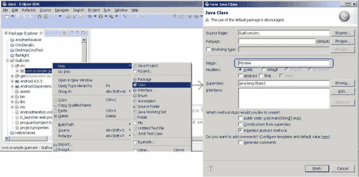

图 4-1. 在项目中创建一个新类

2. 编辑新添加的类（`MyView.java`）的源代码。内容如下所示。

```
    行号        源代码
    1 package com.example.guiexam;

    3 import android.view.View;
    4 import android.graphics.Canvas;
    5 import android.graphics.Paint;
    6 import android.content.Context;

    7 import android.graphics.Color;
    8 import android.graphics.Paint.Style;
    9 import android.graphics.Rect;
    10 import android.graphics.Bitmap;
    11 import android.graphics.BitmapFactory;
    12 import android.graphics.Typeface;

    13 public class MyView extends View {
    14    MyView(Context context) {
    15        super(context);
    16    }

    17    @Override
    18    public void onDraw(Canvas canvas) {
    19    Paint paint = new Paint();
    20    paint.setAntiAlias(true); // 设置抗锯齿
    21 // paint.setColor(Color.BLACK);  // 设置颜色为黑色
    22 // paint.setStyle(Style.FILL);  // 设置填充样式
    23    canvas.drawCircle(250, 250, 120, paint); // 绘制圆形

    24    paint.setColor(Color.RED); // 设置颜色为红色
    25    paint.setStyle(Style.STROKE); // 设置样式为描边（无填充）
    26    canvas.drawRect(new Rect(10, 10, 120, 100), paint); // 绘制矩形

    27    paint.setColor(0xff0000ff /*Color.BLUE*/ );
    28    String str = "Hello!";
    29    canvas.drawText(str, 150, 20, paint);        // 显示文本

    30    paint.setTextSize(50); // 设置文本大小
    31    paint.setTypeface(Typeface.SERIF);    // 设置字体：衬线体
    32    paint.setUnderlineText(true); // 设置文本下划线
    33    canvas.drawText(str, 150, 70, paint);        // 显示文本

    Bitmap bitmap = BitmapFactory.
          decodeResource(getResources(),R.drawable.ic_launcher);
          canvas.drawBitmap(bitmap, 0, 250, paint);   // 显示图像
                }
            }
```

第 13 行代码添加了 `extends View`，这使得自定义类（此处为 `MyView`）继承自 `View` 类别。第 13 至 16 行创建了一个自定义类构造函数，该函数调用父类。此构造函数对于避免以下编译错误至关重要：

```
Implicit super constructor View() is undefined. Must explicitly invoke another constructor
```

第 17 至 34 行重写了 `View.onDraw` 函数，以编写各种绘制代码。您在第 16 行构造了一支画笔——即一个 `Paint` 对象——并在第 17 行设置以消除锯齿。第 23 行绘制了一个圆形（x = 250, y = 250）；第 24 行将画笔颜色设置为红色，依此类推。

`setColor` 函数的原型是：

```
void Paint.setColor(int color);
```

在安卓中，使用一个四字节整数来表示颜色，基于α、红、绿、蓝。该整数数据格式如下所示：

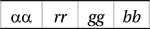

从左到右，前四个字节分别代表α、红、绿、蓝的值。例如，蓝色是 `0xff0000ff`，这也在第 27 行中有所体现。此外，安卓的 `Color` 类也为某些颜色定义了常量，例如 `BLACK`、`RED`、`GREEN`、`BLUE` 等，如第 24 行所示。

`setStyle` 函数设置画笔的填充模式。函数原型是：

```
void Paint.setStyle(Paint.Style style)
```

参数 `style` 可以取 `Paint.Style.STROKE`（空心填充）、`Paint.Style.FILL`（实心填充）或 `Paint.Style.FILL_AND_STROKE`（实心加描边）。这些值是在 `Paint.Style` 类中定义的常量；它们对应的显示样式如表 4-1 所示。

表 4-1. 填充模式参数及示例

| 显示图像 | 图形函数参数设置 |
| --- | --- |
|  | `Color=BLACK, Style=FILL` |
|  | `Color=BLACK, Style=STROKE` |
|  | `Color=BLACK`, `Style=FILL_AND_STROKE` |

3. 按如下方式修改主 `Activity` 类（`MainActivity.java`）：


```java
          Line#        Source Code
          1 package com.example.guiexam;
          2 import android.os.Bundle;
          3 import android.app.Activity;
          4 import android.view.Menu;
          5 public class MainActivity extends Activity {
          6     @Override
          7     public void onCreate(Bundle savedInstanceState) {
          8          super.onCreate(savedInstanceState);
          9 //        setContentView(R.layout.activity_main);
          10         setContentView(new MyView(this));
          11 }
          12 ......
```

系统会自动将第 7 行的代码覆盖为第 8 行的代码，这样可以自定义视图类来代替默认布局，作为活动界面的接口。

应用程序界面如图 4-2 所示；(a)显示的是整个界面，(b)是图形显示的放大区域。

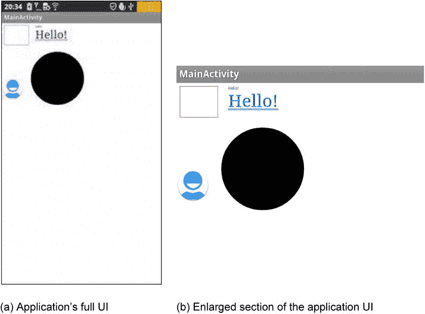

图 4-2. `GuiExam` 应用程序显示输出框架的界面

## 响应触摸屏输入的绘图框架

前面的示例应用程序仅显示图像/图形，无法响应触摸屏输入。在本节中，您将了解如何响应触摸屏输入并控制视图显示。

`View` 有一个 `onTouchEvent` 函数，其函数原型如下：

```
boolean View.onTouchEvent(MotionEvent event);
```

当用户在触摸屏上点击、释放、移动或执行其他交互操作时，会生成一个触摸输入事件。此触摸输入事件会触发对 `View.onTouchEvent` 的调用。为了让用户处理触摸屏输入，您需要重写此函数。响应代码需要写在函数体内。

`View.onTouchEvent` 有一个 `MotionEvent` 类型的参数，该参数定义了 `MotionEvent` 类的触摸点坐标位置、事件类型等。事件类型可以是 `MotionEvent.ACTION_DOWN`、`MotionEvent.ACTION_MOVE`、`MotionEvent.ACTION_UP` 或等效的常量，这些常量在 `MotionEvent` 类中定义。这些常量代表触摸屏按下、触摸屏移动、触摸屏抬起等交互操作。

如前所述，每当需要重绘视图时，都会调用 `View.onDraw` 函数，因此绘图代码需要放入该函数中。大多数情况下，系统可以自动触发重绘事件；但由于用户自定义重绘，系统并不知道何时需要触发这些事件。例如，用户可能更新了显示内容，但内容的位置、大小和层级没有改变；因此，系统不会触发重绘事件。在这种情况下，用户需要调用 `View` 类的类函数 `postInvalidate` 或 `invalidate` 来主动生成重绘事件。函数原型为：

```
void  View.invalidate(Rect dirty)
void  View.invalidate(int l, int t, int r, int b)
void  View.invalidate()
void  View.postInvalidate(int left, int top, int right, int bottom)
void  View.postInvalidate()
```

不带参数的 `postInvalidate` 和 `invalidate` 函数会重绘整个视图；带参数的 `postInvalidate` 和 `invalidate` 函数会重绘视图的指定区域（或特定区域）。`postInvalidate` 和 `invalidate`（无论是否带常量）之间的区别在于：前一种情况需要事件循环直到下一个周期才产生重绘事件，而后一种情况会立即发出重绘指令。

以下示例说明了响应触摸屏输入的绘图代码框架。应用程序的界面如图 4-3 所示。

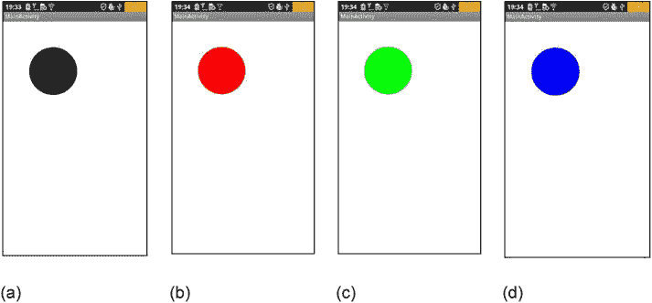

图 4-3. 响应触摸屏的 `GuiExam` 输入图形框架界面

应用程序启动时如图 4-3(a)所示。当用户点击圆形内部（在圆形区域内触摸屏幕）时，圆的颜色会发生变化：它会按黑色、红色、绿色、蓝色的顺序循环变化，如图 4-3(a)–(d)所示。如果在圆形外部点击，圆不会改变颜色。

使用与上一节相同的示例，修改自定义视图类 `MyView.java` 如下：

```
Line#        Source Code
1  package com.example.guiexam;

3  import android.view.View;
4  import android.graphics.Canvas;
5  import android.graphics.Paint;
6  import android.content.Context;

8  import android.graphics.Color;
9  import android.view.MotionEvent;
10 import java.lang.Math;

11 public class MyView extends View {
12      private float cx = 250;        // 圆的默认 X 坐标
13      private float cy = 250;        // 圆的默认 Y 坐标
14      private int radius = 120;      // 半径
15      private int colorArray[] = {Color.BLACK, Color.RED, Color.GREEN,
                                    Color.BLUE };
16 // 定义颜色数组
17      private int colorIdx = 0;     // 自定义颜色下标
        private Paint paint;          // 定义画笔

19      public MyView(Context context) {
20          super(context);
21          paint = new Paint();      // 初始化画笔
22          paint.setAntiAlias(true); // 设置抗锯齿
23          paint.setColor(colorArray[colorIdx]);
                                      // 设置画笔颜色
   }

25   @Override
26   protected void onDraw(Canvas canvas) {
27       canvas.drawCircle(cx, cy, radius, paint);
   }

29   @Override
30   public boolean onTouchEvent(MotionEvent event) {
31       float px = event.getX();
32 // 定义触摸点的 X、Y 坐标
33       float py = event.getY();
34       switch (event.getAction()) {
35       case MotionEvent.ACTION_DOWN:
36 // 触摸屏按下
37  if (Math.abs(px-cx) < radius && Math.abs(py-cy) < radius){
38 // 触摸位置在圆内
39      colorIdx = (colorIdx + 1) % colorArray.length;
40               paint.setColor(colorArray[colorIdx]);
41 // 设置画笔颜色
42                        }
43                    postInvalidate();
   // 重绘
44                    break;
45                case MotionEvent.ACTION_MOVE:
   // 屏幕触摸并移动
46                    break;
47                case MotionEvent.ACTION_UP:
   // 屏幕触摸抬起
                    break;
                }
                return true;
       }
   }
```

第 15 和 16 行定义了一个颜色数组和颜色索引，第 17 行定义了画笔变量。构造函数中的第 20-22 行完成了画笔属性设置的初始化。没有将画笔属性设置的代码放在 `View.Ondraw` 中的原因是为了避免每次重绘时重复计算。`onDraw` 函数的唯一工作是显示圆形。

在第 28-46 行中，您创建了新的触摸输入事件响应函数 `onTouchEvent`。在第 30 和 32 行，您首先使用 `MotionEvent` 类的 `getX` 和 `getY` 函数获取触摸点的 X、Y 坐标。然后，在第 34 行通过 `MotionEvent` 类的 `getAction` 函数获取输入动作类型，接着使用 `case` 语句来完成不同的输入动作。对触摸屏按下动作的响应在第 37-43 行。您在第 37 行判断触摸点是否在圆内。然后，在第 39-40 行修改设置颜色和更改画笔颜色的代码。您在第 43 行调用 `postInvalidate` 函数通知重绘，并为其提供了最终的点睛之笔。

## 多点触摸代码框架


大多数 Android 设备都支持多点触控触摸屏。好消息是，Android 系统软件也提供了多点触控支持。本节将介绍多点触控代码框架。

触控事件类 `MotionEvent` 有一个 `getPointerCount()` 函数，用于返回当前屏幕上的触摸点数量。该函数原型如下：

```
final int MotionEvent.getPointerCount();
```

你还可以使用前面讨论过的 `getX` 和 `getY` 函数来获取触摸点的坐标。其原型如下：

```
final float  MotionEvent.getX(int pointerIndex)
final float  MotionEvent.getX()
final float  MotionEvent.getY(int pointerIndex)
final float  MotionEvent.getY()
```

在上一节中，你使用了无参数的函数来获取单个触摸点的坐标。带参数的 `getX`/`getY` 函数用于获取多点触摸情况下触摸点的位置，其中参数 `pointerIndex` 是触摸点的索引编号。这是一个从 0 开始的整数。

下面是一个示例，用于说明多点触控编程框架。该示例是一个双点触控应用，用于放大和缩小一个圆形。应用界面如图 4-4 所示。

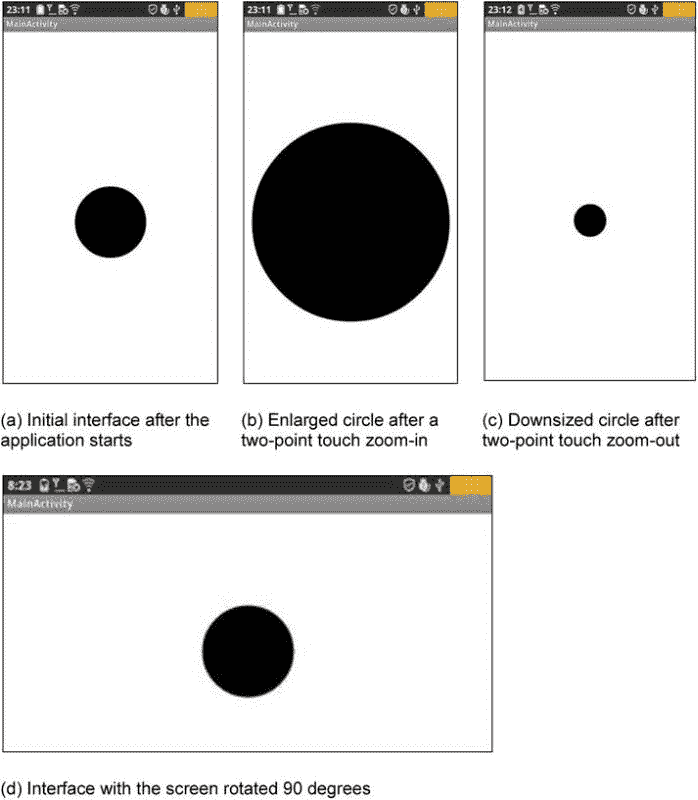

**图 4-4.** 双点触控缩放 GuiExam 图形应用的界面

应用的启动界面如图 4-4(a) 所示。圆形始终位于视图的中心，但其大小（半径）可以通过双点触控来控制。这里的中心指的是视图的中心，而不是 Activity 的中心或屏幕的中心。所谓的双点触控屏幕，意味着有两个触摸点，或者两根手指同时在屏幕上移动，可以是展开手势（圆形变大，如图 b），也可以是捏合手势（圆形变小，如图 c）。代码如下：

```
Line#        Source Code
1   package com.example.guiexam;

3   import android.view.View;
4   import android.graphics.Canvas;
5   import android.graphics.Paint;
6   import android.content.Context;

8   import android.view.MotionEvent;
9   import java.lang.Math;

10  public class MyView extends View {
11     private static final int initRadius = 120; // 半径初始值
12     private float cx;                     // 圆心的 X 坐标
13     private float cy;                     // 圆心的 Y 坐标
14     private int radius = initRadius;      // 设置半径初始值
15     public float graphScale = 1;          // 为一次双点触控移动设置缩放因子
16     private float preInterPointDistance;  // 两触摸点之间的前一次距离
17     private boolean bScreenPress = false; // 屏幕被按下的标志
18     private Paint paint;                  // 定义画笔

19     public MyView(Context context) {
20      super(context);
21      paint = new Paint();                // 初始化画笔
22      paint.setAntiAlias(true);           // 设置抗锯齿
   }

24     @Override
25     protected void onDraw(Canvas canvas) {
26      cx = canvas.getWidth()/2;           // 让圆心位于屏幕中心
27      cy = canvas.getHeight()/2;
28      canvas.drawCircle(cx, cy, radius*graphScale, paint);
   }

30     @Override
31     public boolean onTouchEvent(MotionEvent event) {
32        float px1, py1;          // 定义第一个触摸点的 X、Y 坐标
33        float px2, py2;          // 定义第二个触摸点的 X、Y 坐标
34        float interPointDistance;       // 两个触摸点之间的距离
35        switch (event.getAction()) {
36        case MotionEvent.ACTION_DOWN:          // 屏幕触摸按下
37                                                break;
38        case MotionEvent.ACTION_MOVE:          // 屏幕触摸移动
39            if (event.getPointerCount() == 2 ) {
40                px1 = event.getX(0);     // 获取第一个触摸点的 X、Y 坐标
41                py1 = event.getY(0);
42                px2 = event.getX(1);         // 获取第二个触摸点的 X、Y 坐标
43                py2 = event.getY(1);
44                interPointDistance = (float) Math.sqrt((px6-px2)*(px6-
                  px2)+(py1 - py2)*(py1 - py2));
45                if (!bScreenPress){
46                    bScreenPress = true;
47                    preInterPointDistance = interPointDistance;
48                } else {
49                    graphScale = interPointDistance
                                        // preInterPointDistance;
50                    invalidate();      // 重绘图形
51                }
52                } else {
53                bScreenPress = false;
54                radius = (int)(radius * graphScale);
55 // 一次缩小/放大圆形结束。记录最终缩放因子
56            }
57            break;
58        case MotionEvent.ACTION_UP:            // 屏幕触摸抬起
59            bScreenPress = false;
60            radius = (int)(radius * graphScale);
61 // 一次缩小/放大圆形结束。记录最终缩放因子
62            break;
63        }
64        return true;
     }
   }
```

这段代码在第 15 行定义了用于双点触控的缩放因子 `graphScale`，并在第 16 行定义了变量 `preInterPointDistance` 来记录两个触摸点之间的距离。第 17 行定义了屏幕被按下时的标志变量 `bScreenPress`。

第 26 和 27 行在 `onDraw` 函数中调用了 `Canvas` 类的 `getWidth` 和 `getHeight` 方法，以获取视图的宽度和高度，然后将圆心设置在视图中心。这样做的优点在于，当屏幕旋转 90 度时，圆形仍保持在视图中心，如图 4-4(d) 所示。这些示例与之前示例的区别在于，这次绘制的圆形半径等于原始半径乘以缩放因子 `graphScale`。

第 32–61 行包含了基于上一节修改后的示例的 `onDraw` 内容。第 38–56 行是触摸移动事件的响应代码。第 39 行判断是否有两个触摸点；如果有，则执行第 40–51 行的代码；否则，执行第 53–54 行。在双点首次按下时，你将标志 `bScreenPress` 设为 `false`，然后将最终半径记录为当前半径值乘以缩放因子 `graphScale`。你在第 40–43 行获取两个触摸点的位置坐标。第 44 行计算两个触摸点之间的距离。第 45 行判断是否为首次按下；如果是，则执行第 46 和 47 行，并记录两个触摸点之间的距离；否则，执行第 49–50 行的代码。在这里，你根据当前两点的距离与上一次移动时的距离来计算缩放因子。之后，图形会被重绘。


为了处理`bScreenPress`标志的位置，你在第 58-60 行执行了屏幕触摸抬起活动的响应代码，这与第 53 和 54 行中非两点触摸的代码类似。

## 响应键盘输入

大多数 Android 设备都有许多硬件按钮，例如音量+、音量-、电源、主页、菜单、返回、搜索等。一些 Android 设备还配备了键盘。键盘（包括设备的硬件按钮）是 Android 应用程序的重要输入方法。键盘输入对应于键盘事件，名为`KeyEvent`（也称为*按键事件*）。在本节中，你将学习响应键盘输入的方法。

在 Android 中，`Activity`和`View`类都可以接收按键事件。按键事件会触发调用`Activity`或`View`类的`onKeyDown`函数。函数原型为：

```
boolean    Activity.onKeyDown(int keyCode, KeyEvent event);
boolean    View.onKeyDown(int keyCode, KeyEvent event);
```

`keyCode`参数是所按下按键的索引代码。Android 中的每个按键都有一个唯一的编号，即`keyCode`。部分按键代码已在表 1-1 中描述。按键事件`KeyEvent`包含与按钮相关的属性，例如其被按下的频率。要处理按键事件，你需要重写`onKeyDown`函数并添加你自己的响应处理代码。

有趣的是，尽管`Activity`和`View`类都可以接收按键事件，但视图通常包含在活动中。当按下按钮时，事件首先发送给外部活动；也就是说，活动会更早地接收到事件。以下示例展示了如何通过重写活动的`onKeyDown`函数来响应按钮按下。

本示例演示了如何使用方向键在应用程序中移动圆形。应用程序界面如图 4-5 所示。

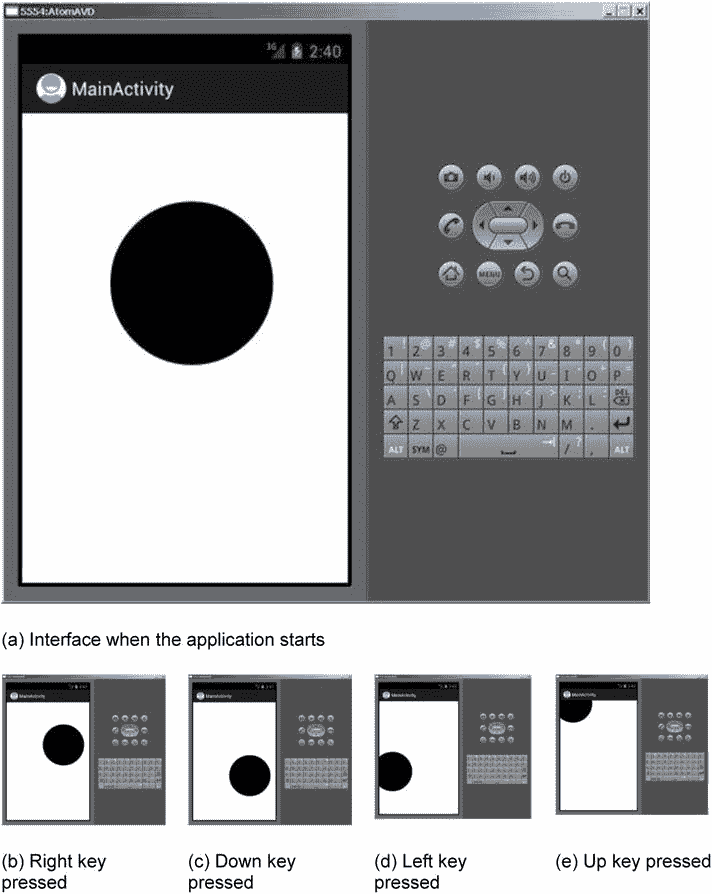

图 4-5. 使用按键控制应用程序界面中圆形的移动

我们测试用的联想手机没有键盘，因此我们选择在虚拟机上运行该应用程序。虚拟机具有左、下、右、上方向键来实现这些圆形移动。应用程序启动界面如图 4-5(a)所示。按下左、下、右或上按钮会使圆形向相应方向移动。界面示例如图 4-5(b)至(e)所示。

此应用程序基于本章开头创建的示例（图 4-1），并按以下步骤进行了修改：

4. 修改`MyView.java`的源代码，如下所示：

```
          Line#        Source Code
          1  package com.example.guiexam;

3  import android.view.View;
          4  import android.graphics.Canvas;
          5  import android.graphics.Paint;
          6  import android.content.Context;

7  public class MyView extends View {
          8      private float cx = 250;      // X coordinate of the circle
          9      private float cy = 250;      // Y coordinate of the circle
          10     private static final int radius = 120; // Radius of the circle
          11     private Paint paint;                 // define paint brush
          12     private static final int MOVESTEP = 10;    // the step
                 length for pressing direction key

13     public MyView(Context context) {
          14        super(context);
          15         paint = new Paint();                // Paint brush
                     initialization
          16         paint.setAntiAlias(true);           // Set Anti Alias
          17     }

18     @Override
          19     protected void onDraw(Canvas canvas) {
          20         canvas.drawCircle(cx, cy, radius, paint);
          21     }

22     ////// Self-define function:press key to move graphic
                 (circle) //////
          23     public void moveCircleByPressKey(int horizon, int
                 vertical){
          24         if (horizon < 0)                // horizontal move
          25             cx -= MOVESTEP;
          26         else if (horizon > 0)
          27             cx += MOVESTEP;
          28          if (vertical < 0)
          29             cy += MOVESTEP;            // vertical move
          30         else if (vertical > 0)
          31             cy -= MOVESTEP;
          32         postInvalidate();              // note to repaint
          33     }
          34  }
```

在第 23－33 行中，你向视图类添加了一个函数，通过按水平或垂直方向键来移动图像（圆形）。该函数接受两个参数：`horizon`和`vertical`。如果`horizon`小于 0，则减小圆形的 X 坐标值，结果圆形向左移动。如果`horizon`大于 0，则增大圆形的 X 坐标值，这会使圆形向右移动。你对垂直参数执行类似的操作以向上和向下移动圆形。第 32 行用新参数更新图形例程并触发视图重绘。

5. 修改主活动类`MainActivity.java`的源代码，如下所示：

```
          Line#        Source Code
          1  package com.example.guiexam;
          2  import android.os.Bundle;
          3  import android.app.Activity;
          4  import android.view.Menu;
          5  import android.view.KeyEvent;     // Key press event class

6  public class MainActivity extends Activity {
          7      private MyView theView =null; // View object stored inside
                                                  the variable

8      @Override
          9      public void onCreate(Bundle savedInstanceState) {
          10         super.onCreate(savedInstanceState);
          11         theView = new MyView(this); // record the View class
                                                    of the Activity
          12         setContentView(theView);
          13     }

14     @Override
          15     public boolean onCreateOptionsMenu(Menu menu) {
          16         getMenuInflater().inflate(R.menu.activity_main, menu);
          17         return true;
          18     }

19     @Override        // Key down response function
          20     public boolean onKeyDown(int keyCode, KeyEvent event) {
          21         int horizon = 0; int vertical = 0;
          22         switch (keyCode)
          23         {
          24             case KeyEvent.KEYCODE_DPAD_LEFT:
          25                 horizon = -1;
          26                 break;
          27             case KeyEvent.KEYCODE_DPAD_RIGHT:
          28                 horizon = 1;
          29                 break;
          30             case KeyEvent.KEYCODE_DPAD_UP:
          31                 vertical = 1;
          32                 break;
          33             case KeyEvent.KEYCODE_DPAD_DOWN:
          34                 vertical = -1;
          35                 break;
          36             default:
          37               super.onKeyDown(keyCode, event);
          38         }
          39         if (!(horizon == 0 && vertical == 0))
          40            theView.moveCircleByPressKey(horizon,vertical);
          41        return true;
          42  }
          43 }
```


### 在这段代码中，你需要让 `Activity` 类接收并响应按键事件，因此在第 19–42 行重写了 `onKeyDown` 函数，并加入了按键响应代码。虽然按键响应函数位于 `Activity` 类中，但显示更新需要在视图 `MyView` 类中实现，所以必须让 `Activity` 类知晓其对应的视图对象。为此，你在第 7 行添加了一个记录视图对象的变量 `theView`。在第 11 和 12 行，你让 `theView` 在构造视图对象时记录下该对象。

在按键响应函数 `onKeyDown` 中，你使用了一个 `switchcase` 语句（第 22–38 行），根据不同的按键执行不同的操作。该函数的 `keyCode` 参数指定了所按下按键的键号。例如，第 24–26 行的代码是左键的处理代码。它将一个水平标志设置为“left”，然后在第 39 和 40 行调用视图类的自定义函数 `moveCircleByPressKey` 来移动圆圈。为了让其他按键事件也能得到处理，你在第 36 和 37 行调用了系统的默认处理器来处理其他按键。

## Android 中的对话框

Android 中有三种使用对话框的不同方式，本节将对此进行讨论。

### 使用 Activity 的对话框主题

`Dialog` 类实现了一个可在 Activity 中创建的简单浮动窗口。通过使用基本的 `Dialog` 类，你可以创建一个新实例，并设置其标题和布局。对话框主题可以应用于普通的 Activity ，使其外观类似对话框。

此外，`Activity` 类提供了一种便捷的机制来创建、保存和恢复对话框，例如 `onCreateDialog(int)`、`onPrepareDialog(int, Dialog)`、`showDialog(int)`、`dismissDialog(int)` 等函数。如果使用这些函数，Activity 可以通过 `getOwnerActivity()` 方法返回管理该对话框的 `Activity` 对象。

以下是使用这些函数的具体说明。

#### `onCreateDialog(int)` 函数

当你使用这个回调函数时，Android 会将此 Activity 设置为每个对话框的拥有者，这会自动管理每个对话框的状态，并将其锚定到该 Activity。这样，每个对话框都会继承此 Activity 的特定属性。例如，当对话框打开时，菜单按钮会显示为该 Activity 定义的选项菜单。再比如，你可以使用音量键修改该 Activity 所使用的音频流。

#### `showDialog(int)` 函数

当你想显示一个对话框时，可以调用 `showDialog(intid)` 方法，并通过此函数调用传入一个能唯一标识该对话框的整数。当对话框首次被请求时，Android 会从 Activity 调用 `onCreateDialog(intid)`。你应在此初始化这个对话框。这个回调方法会被传入与 `showDialog(intid)` 相同的 ID。当你创建了对话框后，该对象会在 Activity 结束时被返回。

#### `onPrepareDialog(int, Dialog)` 函数

在对话框显示之前，Android 还会调用可选的回调函数 `onPrepareDialog(int id, Dialog)`。如果你希望每次打开对话框时都更改其属性，可以定义此方法。与仅在第一次打开对话框时才会被调用的 `onCreateDialog(int)` 函数不同，此方法在每次打开对话框时都会被调用。如果你没有定义 `onPrepareDialog()`，那么对话框将保持与上次打开时相同的状态。此方法也可以接收对话框的 ID 和在 `onCreateDialog()` 中创建的对话框对象。

#### `dismissDialog(int)` 函数

当你准备关闭对话框时，可以通过此对话框方法调用 `dismiss()` 来消除它。如果需要，你也可以从 Activity 调用 `dismissDialog(int id)` 方法。如果你想使用 `onCreateDialog(int id)` 方法来保留对话框的状态，那么每次消除对话框时，该对话框对象的状态都会保持在 Activity 中。如果你决定不再需要此对象或想要清除其状态，则应调用 `removeDialog(intid)`。这会移除所有内部对象引用，即使对话框正在显示，也会被消除。

### 使用特定的 Dialog 类

Android 提供了多个 `Dialog` 类的扩展类，例如 `AlertDialog`、`ProgressDialog` 等。每个类都旨在提供特定的对话框功能。基于 `Dialog` 类的屏幕界面在所有调用该特定类的 Activity 中被创建。因此它不需要在清单文件中注册，其生命周期由调用该类的 Activity 控制。

### 使用 Toast 提醒

Toast 是一种特殊的、非模态的、短暂的提示信息对话框，通常用于广播接收器和后台服务中，用来提示用户事件。

### 对话框示例

在讨论的对话框方法中，如果从功能实现方式的角度来衡量，第一种方法功能最强大，其次是第二种和第三种。从实现代码的复杂程度来看，第三种方法最简单，第一种和第二种则更为复杂。

以下示例演示了第二种方法。请参阅 Android 的帮助文档和示例（位于 Android SDK 安装目录下的 `samples` 目录中），以了解有关其他实现方法的更多信息。

此示例应用程序使用的具体对话框类是 `AlertDialog` 的 `Builder` 内部类。当你按下返回键时，会弹出一个对话框，让你决定是否退出应用程序。应用程序界面如图 4-6 所示。通过本例中的 Android 对话框，你将更容易理解其用法。

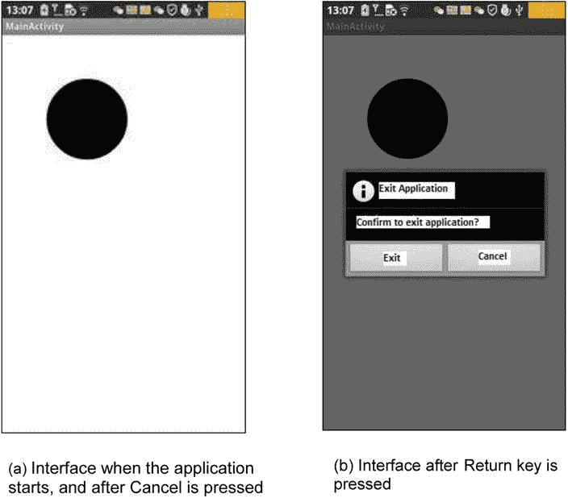

图 4-6. 带有退出对话框的应用程序界面

应用程序启动并显示主 Activity 界面，如图 4-6(a) 所示。当你按下设备的返回键时，会弹出退出对话框，如图 4-6(b) 所示。当你点击退出按钮时，应用程序退出，界面也随之关闭。当你点击取消按钮时，应用程序返回前一个屏幕，类似于图 4-6(a)。

修改 Activity 类 `MainActivity.java` 的源代码，内容如下：

```
行号        源代码
1  package com.example.guiexam;
2  import android.os.Bundle;
3  import android.app.Activity;
4  import android.view.Menu;
5  import android.view.KeyEvent;            // 按键事件类
6  import android.app.Dialog;               // 使用 Dialog 类
7  import android.app.AlertDialog;          // 使用 AlertDialog 类
8  import android.content.DialogInterface;  // 使用 DialogInterface 接口

9  public class MainActivity extends Activity {
10     private MyView theView = null;        // 存储视图对象的变量
11     private AlertDialog.Builder exitAppChooseDlg = null; // 退出应用
       对话框
12     private Dialog dlgExitApp = null;

13     @Override
14     public void onCreate(Bundle savedInstanceState) {
15         super.onCreate(savedInstanceState);
16         theView = new MyView(this); //记录 My Activity 的视图类
17         setContentView(theView);
```


```java
18         exitAppChooseDlg = new AlertDialog.Builder(this);
19         // 定义 AlertDialog.Builder 对象
20         exitAppChooseDlg.setTitle("退出选择");
21         // 定义对话框标题
            exitAppChooseDlg.setMessage("确认退出应用？");
22         // 定义对话框显示文本
23         exitAppChooseDlg.setIcon(android.R.drawable.ic_dialog_info);
24         // 定义对话框图标

26         // 设置最左侧按钮及点击响应类
27         exitAppChooseDlg.setPositiveButton("退出", new DialogInterface.
               OnClickListener() {
28               public void onClick(DialogInterface dialog, int which) {
29                   dialog.dismiss();          // 关闭对话框
                   /*MainActivity.*/finish();   // 退出（主）Activity
30                   System.exit(0);            // 退出应用
31               }
32           });

34         // 设置最右侧按钮及点击响应类
35         exitAppChooseDlg.setNegativeButton("取消",
               new DialogInterface.OnClickListener() {
36               public void onClick(DialogInterface dialog, int which)                
                 {
37                   dialog.cancel();        // 关闭对话框
               }
38           });
39         dlgExitApp = exitAppChooseDlg.create();
40         // 创建对话框退出对象
41     }

@Override
43     public boolean onCreateOptionsMenu(Menu menu) {
44         getMenuInflater().inflate(R.menu.activity_main, menu);
45         return true;
46     }

48     @Override        // 按键按下响应函数
49     public boolean onKeyDown(int keyCode, KeyEvent event) {
50         int horizon = 0; int vertical = 0;
51         switch (keyCode)
52         {
53             case KeyEvent.KEYCODE_DPAD_LEFT:
54                 horizon = -1;
55                 break;
56             case KeyEvent.KEYCODE_DPAD_RIGHT:
57                 horizon = 1;
58                 break;
59             case KeyEvent.KEYCODE_DPAD_UP:
60                 vertical = 1;
61                 break;
62             case KeyEvent.KEYCODE_DPAD_DOWN:
63                 vertical = -1;
64                 break;
65             case KeyEvent.KEYCODE_BACK:
66                 if (event.getRepeatCount() == 0) {
67                     dlgExitApp.show();
68                     // 显示 AlertDialog.Builder 对话框
69                 }
70                 break;
71             default:
72                 super.onKeyDown(keyCode, event);
           }
           if (!(horizon == 0 && vertical == 0))
               theView.moveCircleByPressKey(horizon,vertical);
           return true;
       }
   }
```

第 11 行和第 12 行在`Activity`类中定义了`Dialog`类的`AlertDialog.Builder`类及其关联变量。你修改了第 18–36 行中的`onCreate`函数代码，并定义了准备对话框的代码。在第 18 行中，你构造了`AlertDialog.Builder`类对象；该构造函数的原型是

```java
AlertDialog.Builder(Context context)
AlertDialog.Builder(Context context, int theme)
```

本示例使用第一个原型，传递`Activity`对象作为构造函数的上下文，从而构造对话框。接着，在第 19 行和第 21 行中，设置对话框的标题显示文本、图标等属性。

`AlertDialog.Builder`对话框最多可包含三个按钮：左、中、右。它们分别通过`setPositiveButton`、`setNeutralButton`和`setNegativeButton`函数进行设置。你可以根据需要指定对话框按钮的数量。本示例使用了两个按钮：左侧和右侧。

第 23–29 行设置了对话框的左侧按钮及点击响应代码。`AlertDialog.Builder`类的`setPositiveButton`函数的原型是

```java
AlertDialog.Builder  setPositiveButton(int textId, DialogInterface.OnClickListener listener)
AlertDialog.Builder  setPositiveButton(CharSequence text, DialogInterface.OnClickListener listener)
```

本示例使用第二个原型，其中第一个参数是按钮显示的文本，第二个参数是点击响应的接口对象。

在第 25 行中，你首先调用了`DialogInterface`类的解除或取消函数来关闭对话框。`DialogInterface`是对话框类（`AlertDialog`、`Dialog`等）的操作接口。第 25 行使用`dismiss`函数关闭对话框，第 33 行使用`cancel`函数关闭对话框。

第 26–27 行关闭了 Activity 和应用，具体描述见第 2 章中的图 2-16 的“退出 Activity 和应用”一节。有趣的是，内部类`DialogInterface.OnClickListener`使用了非点外部类`MainActivity`的成员函数，并且不需要在“类名”前面添加前缀。

你在第 36–35 行设置了对话框的右侧按钮及点击响应代码。点击响应代码相对简单，在第 33 行中使用了`DialogInterface`类的`cancel`函数来关闭对话框。

最后，第 36 行调用了`AlertDialog.Builder`类的`create`函数来创建退出对话框对象`dlgExitApp`。该函数返回一个`AlertDialog`对象，其原型为

```java
AlertDialog  create()
```

由于`AlertDialog`派生自`Dialog`类，返回值可以赋值给`Dialog`变量。

你在第 60–64 行为`OnKeyDown`响应函数添加了返回键响应代码。代码相对简单：在第 61 行判断是否按下重复键，然后调用`Dialog`类的`show`函数显示对话框。

### 应用属性设置

在 Android 设备上，有两个不同的地方可以找到已安装应用的信息。一个是菜单列表（按下设置按钮后的界面），另一个是通过进入设置  应用  管理应用  已下载菜单项。参见图 4-7：

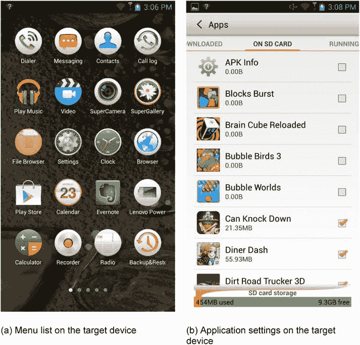

图 4-7. 目标设备上菜单列表与应用设置显示的区别

到目前为止，几乎所有示例都基于两个应用的代码框架：`GuiExam`和`HelloAndroid`。但在目标设备的菜单中，很难区分它们。这些应用在菜单列表中无法区分，因为你使用了默认设置，而不是应用各自的属性设置。本节将展示如何应用属性设置。

图 4-8 展示了应用属性设置前后的应用设置界面。

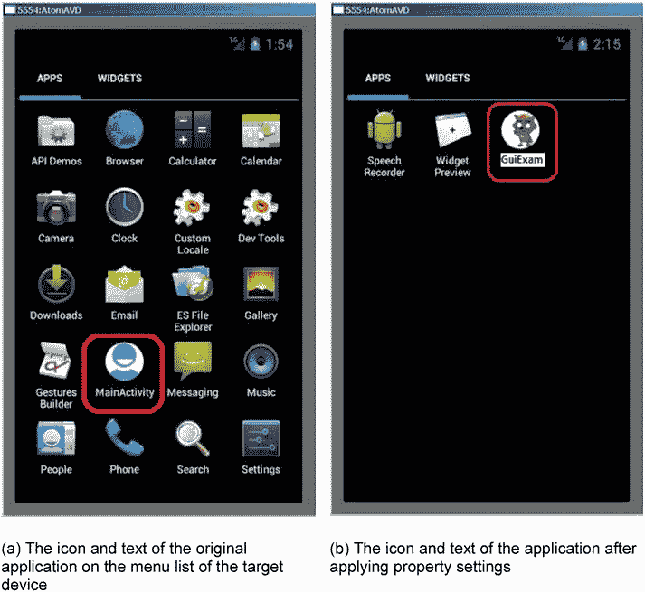

图 4-8. 目标设备上应用属性设置前后的应用显示

本示例使用`GuiExam`应用来演示更改应用设置的步骤：

1. 修改目标机器菜单中应用的图标。根据`res\drawable-XXX`目录下（其中`XXX`代表不同分辨率——例如`drawable-hdpi`代表高分辨率图像目录）的`ic_launcher.png`文件大小，编辑你的图像文件，并将其命名为`ic_launcher.png`。

Android 设备常见屏幕分辨率及应用图标文件存储目录见表 4-2。

表 4-2. 常见 Android 设备屏幕分辨率及包含应用图标大小的目录

好的，作为一名高级文档工程师和翻译员，我将严格遵循您的格式和风格要求，将给定的英文文本翻译成中文。


| 目录名称 | 尺寸 | 描述 |
| --- | --- | --- |
| `drawable-ldpi` | 36 × 36 dpi | 低分辨率屏幕 |
| `drawable-mdpi` | 48 × 48 dpi | 中分辨率屏幕 |
| `drawable-hdpi` | 72 × 72 dpi | 高分辨率屏幕 |
| `drawable-xhdpi` | 96 × 96 dpi | 超高分辨率屏幕 |
| `drawable-xxhdpi` | 144 × 144 dpi | 超超高分辨率屏幕 |

2.  将自定义图片文件放入对应的目录 `res\drawable-XXX` 中，并替换原始文件。例如，对于高分辨率屏幕的应用程序，将 `res\drawable-xhdpi` 目录下的 `ic_launcher.png` 文件替换为你自己的文件，如图 4-9 所示。

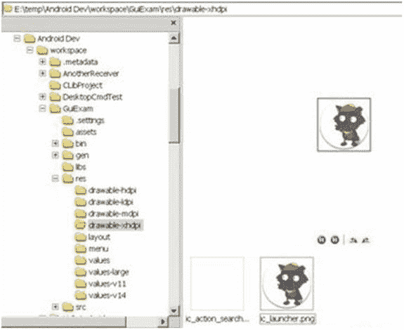

图 4-9. 替换应用程序图标

3.  修改目标机器上应用程序的菜单文本注释。

打开 `\res\values\strings.xml` 文件的 `Package Explorer` 窗格。将 `title_activity_my_main` 字符串的值设置为自定义字符串（此处为“GUI examples”），如图 4-10 所示。

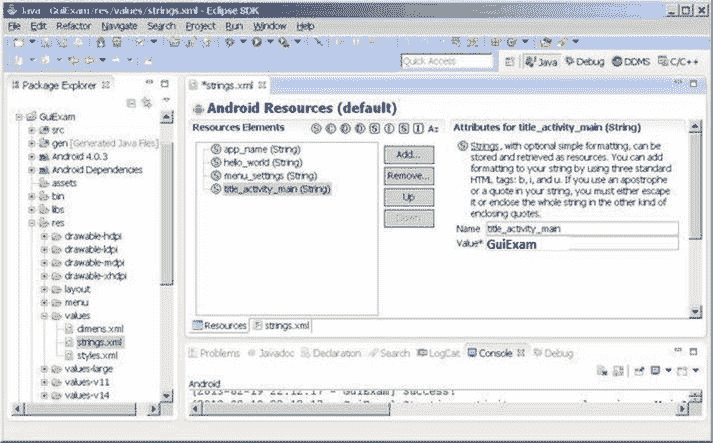

图 4-10. 修改应用程序的图标文字

完成这些修改后，您会看到目标应用程序菜单项的图标和文本标签已更改。

**注意：** 第一步也可以通过另一种方法实现，该方法可以在创建应用程序时生成其自己的一套图标。步骤如下：

1.  在 `配置启动器图标` 对话框中，点击 `Image` 按钮，然后点击 `Image File` 右侧的 `Browse` 按钮。
2.  在 `打开` 对话框中，选择图片文件作为应用程序图标（此处为 `graywolf.png`），如图 4-11 所示。

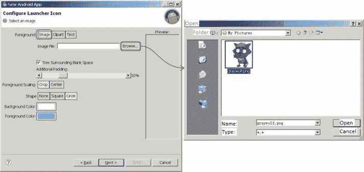

图 4-11. 生成应用程序时选择图标文件

`配置启动器图标` 对话框如图 4-12 所示。

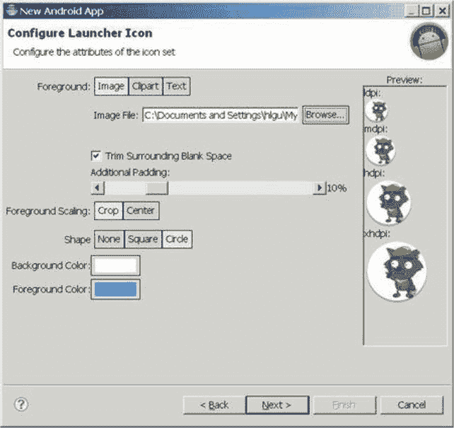

图 4-12. 生成应用程序时配置启动器图标

换句话说，`Eclipse` 可以根据用户指定的图片文件，在 `res\drawable-XXX` 目录下自动生成各种尺寸合适的 `ic_launcher.png` 文件。这样就无需手动编辑这些图片了。

在关于 Android GUI 设计的最后一章中，您将了解视图中的基本绘图框架、绘图框架如何响应触摸屏输入的概念，以及如何控制视图的显示和多点触控代码框架。您将通过一个示例来阐明多点触控编程框架和键盘输入响应。您将学习如何响应 Android 设备上可用的键盘输入和硬件按键，例如 `Volume +`、`Volume -`、`Power`、`Home`、`Menu`、`Back`、`Search` 等。您将了解 Android 的三种不同对话框，包括活动对话框主题、特定类对话框和 `Toast` 提醒。在本章末尾，您将学习如何更改应用程序属性设置。

**索引**

 A, B, C

Android 应用程序

ART

组件

- 活动
- 广播意图接收器
- 意图和意图过滤器
- 服务进程
- 内容提供者

Dalvik 虚拟机

文件结构

- AndroidManifest.xml


常量定义

布局文件

R.java 文件

源代码文件

Android 设备 *vs.* 桌面计算机

应用程序窗口

版权保护问题

键盘输入问题

命令输入限制

屏幕键盘应用程序

按键与按钮

多模态交互

屏幕键盘

屏幕尺寸

按钮与图形元素

像素密度

文本与图标尺寸

软件分发

存储设备

仅支持触摸的触摸屏

悬停操作

映射错误

无需点击即可移动光标

右键功能

触摸屏与手写笔

Android 界面设计 *另请参阅* GuiExam 应用程序

Android 运行时 (ART)

 D

Dalvik 虚拟机 (DVM)

 *与* ART 对比

 *与* JVM 对比

设计应用程序

显式匹配（*另请参阅* 直接意图触发机制）

隐式匹配（*另请参阅* 间接意图触发机制）

对话框

Activity 的主题对话框

AlertDialog 类

dismissDialog() 函数

onCreateDialog() 函数

onPrepareDialog() 函数

ProgressDialog 类

showDialog() 函数

Toast 提醒

AlertDialog.Builder 类

应用界面

代码实现

DialogInterface 类

OnKeyDown 响应函数

setPositiveButton 函数

直接意图触发机制

不带参数

Activity 类

应用界面

被调用 Activity

类名修饰符

构造函数

拖放式布局

最终配置

布局配置

布局文件

反射

setContentView() 函数

带参数

应用界面

被调用 Activity

正在执行的应用程序

Intent.setClassName() 函数


布局设计

布局文件

`onActivityResult` 函数

属性-值数据配对

`setResult` 函数

  E、F

嵌入式系统。*参见* Android 设备 *与* 桌面计算机

  G、H

`GuiExam` 应用程序

活动状态转换

活跃状态

`finish` 函数

非活跃状态

`onCreate` 函数

`onDestroy` 函数

`onPause` 函数

`onRestart` 函数

`onResume` 函数

`onStart` 函数

`onStop` 函数

暂停状态

示意图

停止状态

触发器

应用程序与活动

应用程序接口

DDMS 视图

`finish` 函数

`ImageView`

按钮与事件

代码实现

`Context` 类

活动上下文

上下文包装器/直接上下文方法

对话框构造器

子代类

子类

设计布局

界面结构

文本编辑控件

文本属性

用户界面

文件结构

ID 属性

`ImageView`

内部类监听器

`Intent`

动作测试

类别测试

组件

数据测试

显式匹配/直接意图

隐式匹配/间接意图

机制

角色

接口

`setContentView` 函数

触摸屏输入

代码实现

构造器函数

`setStyle` 函数

`View.onDraw` 函数

  I、J、K、L、M、N、O、P、Q、R、S

间接意图触发机制

内置活动

ACTION 常量

`Activity.startActivityForResult()` 函数

应用程序接口

构造器函数

布局文件

自定义活动

应用程序接口

`Intent.ACTION_EDIT`

布局设计

布局文件

  T、U、V、W、X、Y、Z

触摸屏输入

应用程序设置

应用属性

图标对话框

菜单列表

屏幕分辨率

目标设备

对话框

活动的对话框主题

`AlertDialog.Builder` 类

`AlertDialog` 类

应用程序接口

代码实现

`DialogInterface` 类

`OnKeyDown` 响应函数

`ProgressDialog` 类

`setPositiveButton` 函数

Toast 提醒

显示框架

应用程序接口

代码实现

填充模式参数

`GuiExam` 项目（*参见* `GuiExam` 应用程序）

`onDraw` 函数

`setContentView` 函数

绘图框架

应用程序接口

代码实现

`invalidate` 函数

`postInvalidate` 函数

`View.onDraw` 函数

`View.onTouchEvent`

键盘输入

应用程序接口

代码实现

`keyCode` 参数

`onKeyDown` 函数

虚拟机

多点触控代码框架

应用程序接口

代码实现

`getX`/`getY` 函数

`onDraw` 函数

触摸事件类
