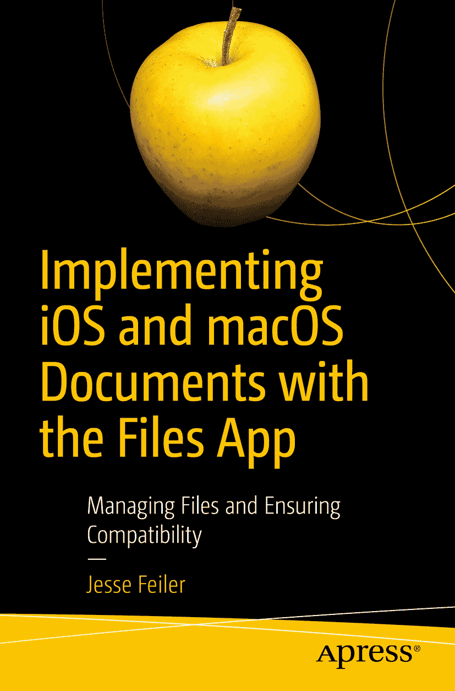

ISBN 978-1-4842-4491-3 e-ISBN 978-1-4842-4492-0 [`doi.org/10.1007/978-1-4842-4492-0`](https://doi.org/10.1007/978-1-4842-4492-0) © Jesse Feiler 2019 本作品受版权保护。出版商保留所有权利，无论是材料的全部或部分，特别是翻译、重印、重用插图、朗诵、广播、以缩微胶卷或任何其他物理方式复制，以及电子传输或信息存储和检索、电子适配、计算机软件，或现在已知或以后开发的类似或不同的方法。本书中可能出现商标名称、标识和图像。我们并非在每次出现商标名称、标识或图像时都使用商标符号，而是仅以编辑方式使用这些名称、标识和图像，以利于商标所有者，且无意侵犯商标权。本出版物中使用的商品名称、商标、服务标志和类似术语，即使未被明确标识，也不应被视为对其是否受专有权利的影响。尽管本书中的建议和信息在出版时被认为是真实和准确的，但作者、编辑或出版商均不对可能存在的任何错误或遗漏承担法律责任。出版商对本书所含内容不作任何明示或暗示的保证。本书通过 Springer Science+Business Media, New York, 233 Spring Street, 6th Floor, New York, NY 10013 在全球图书贸易中发行。电话：1-800-SPRINGER，传真：(201) 348-4505，电子邮件：orders-ny@springer-sbm.com，或访问 www.springeronline.com。Apress Media, LLC 是一家加利福尼亚有限责任公司，其唯一成员（所有者）是 Springer Science + Business Media Finance Inc (SSBM Finance Inc)。SSBM Finance Inc 是一家特拉华州公司。

## 关于作者和技术审阅者

### 关于作者

### 关于技术审阅者

