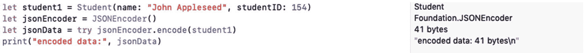
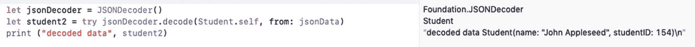

# 2. 深入文档内部

在第 1 章中，你已经学习了如何描述和构建文档。现在你明白，作为应用程序及其文档的设计者和开发者，你控制着哪些数据被存储、存储的位置和方式，以及如何识别和引用这些数据。

你可以决定将数据存储为整数序列或单个长字符串，这完全取决于你和你要使用的数据。实际上，在文档内部对数据进行结构化是有意义的，哪怕只是为了能够轻松访问。本章展示了如何使用 JSON 编码来组织文档内部的数据。这种结构和编码为依赖 Unicode 字符串的数据提供了一种易于使用的格式，这些字符串可以表示 JSON 所识别的基本类型。

## 使用 JSON 编码

对 JSON 而言，最重要的是其格式基于文本（与二进制或数字表示相反），并且每个元素都可以被命名（而不是通过位置或顺序来标识）。

基于位置或顺序的编码风格允许你在编码序列中指定每个元素的格式。了解元素的格式意味着你知道它将占用多少空间，这让你可以使用任何编程语言中的标准读/写语法来读取或写入数据。

基于顺序或位置的编码的缺点是，如果你更改了数据元素的顺序或数据元素的格式，就会破坏你已有的任何读/写代码。JSON 编码依赖于数据元素的名称，而不是它们的格式或顺序。因此，当你修改单个数据元素的格式或更改数据元素的顺序时，可以避免经常破坏读/写代码的问题。

## 介绍 JSON

JSON 最初是一种用于序列化结构化数据的文本格式。从这个意义上说，*序列化* 意味着将字符串或其他对象转换为可读或可写的格式。JSON 从四种基本类型开始，这些类型在许多编程语言中都有常见含义：

-   *字符串* 是 Unicode 字符的有序集合。
-   *数字* 就是数字；最基本的 JSON 数字是双精度浮点数。
-   *布尔值* 是 true 或 false。
-   JSON 中的最后一个基本值是 *null*，一个没有值的对象。

在 JSON 中，这些类型可以组合成 *对象*，对象是名称/值对的无序集合；JSON *数组* 是名称/值对的有序集合。

## JSON 与 Swift

Swift 通过其 `JSONSerialization` 类（属于 Foundation 框架的一部分）超越了基本的 JSON 类型。`JSONSerialization` 除了基本的 JSON 字符串、数字和布尔数据类型外，还将 JSON 转换为 Swift 数组和字典数据类型。

### 注意

Swift 将布尔和 bool（C 语言）类型桥接为布尔类型。这为你自动处理。

### 使用 Swift 结构体

JSON 是一种灵活且易于使用的标记工具。另一方面，Swift 被设计为构建应用程序的强大工具，特别是那些使用模型-视图-控制器（MVC）设计模式的应用程序，其复杂程度超过了 JSON。Swift 结构体类型就是一个很好的例子。你可能会在 Swift 中声明一些将在整个应用程序中使用（或根本不使用）的结构体。当你严格使用 JSON 时，声明一个不用于存储数据的结构体并不常见。本节将解释如何创建和将 Swift 结构体与 JSON 一起使用。

代码清单 2-1 展示了如何使用 playground 为 `Student` 对象或模型（本节中这两个术语可以互换）创建 Swift 结构体。

```
import Foundation
struct Student {
    var name: String
    var studentID: Int
}
// 代码清单 2-1
// Swift 结构体
```

这里重要的是 `Student` 结构体包含两个变量元素：`name` 和 `studentID`。同样值得注意的是，在这个 playground 中必须导入 Foundation 框架，因为它将用于处理 JSON 数据。结构体的其他元素是标准的 Swift 元素。

### 提示

请注意，Swift 的风格是结构体等对象名称的首字母大写，因此 `Student` 结构体的名称是大写的。

使用代码清单 2-1 中所示的结构体，你可以使用如下代码创建该结构体的实例：

```
let student1 = Student(name: "John Appleseed", studentID: 154)
```

你可以通过使用 `encode(to: encoder)` 函数来编码数据，以及使用 `init(from decoder:)` 函数来执行反向操作，从而将 JSON 与 Swift 集成。为此，你需要创建键来标识将要编码和解码的元素。第一步是声明编码键作为 `enum CodingKeys` 元素，如代码清单 2-2 所示。

```
enum CodingKeys: String, CodingKey {
    case studentID = "studentID"
    case name
}
}
// 代码清单 2-2
// 编码键的 Swift 扩展
```

请注意，这些是你将用来对 `name` 和 `studentID` 变量的数据进行编码和解码的键。在建立了键和变量之后，你现在可以创建一个 `encode(to: encoder)` 函数，如代码清单 2-3 所示。请注意，此扩展表明 `Student` 结构体遵循 `Encodable` 协议。

```
extension Student: Encodable {
    func encode(to encoder: Encoder) throws {
        var container = encoder.container(keyedBy: CodingKeys.self)
        try container.encode(name, forKey: .name)
        try container.encode(studentID, forKey: .studentID)
    }
}
// 代码清单 2-3
// 编码的 Swift 扩展
```

### 编码 JSON

你需要一个 `JSONEncoder` 对象来处理编码。这样的 `JSONEncoder` 对象通常命名为 `jsonEncoder`，但你可以使用任何你想要的名称。`JSONEncoder` 对象指定了编码数据的容器。

在代码清单 2-3 中，只有一个函数 `encode(to: encoder)`，它使用了一个 `jsonEncoder` 对象，该对象是包含从编码器获取的编码数据的容器。

`encode(to: encoder)` 函数的核心由三行编码结构体元素（`name` 和 `studentID`）的代码组成。

第一行代码尝试使用 `.name` 键编码 `name` 变量：

```
try container.encode(name, forKey: .name)
```

第二行代码尝试使用 `.studentID` 键编码 `studentID` 变量：

```
try container.encode(studentID, forKey: .studentID)
```

这几行代码经常出现在这类函数中。如果你想知道 `try` 是如何处理的，请注意 `func encode(to encoder: Encoder)` 函数可能会抛出错误。

### 提示

如果你正在调试这段代码，请在 `try` 语句处设置断点，以便查看导致问题的原因。你在此代码中可能遇到的典型问题是键名称的拼写错误。

一旦你创建了一个 `jsonEncoder`，你就可以引用它内部的容器，并将其与你在此函数的其他地方声明的键关联起来，使用的代码行如下：

```
var container = encoder.container(keyedBy: CodingKeys.self)
```


### 解码 JSON

清单 2-4 展示了执行反向操作以解码 JSON 代码的过程。

```
extension Student: Decodable {
init(from decoder: Decoder) throws {
let values = try decoder.container(keyedBy: CodingKeys.self)
name = try values.decode(String.self, forKey: .name)
studentID = try values.decode(Int.self, forKey: .studentID)
}
}
清单 2-4
解码扩展
```

这段代码的核心是 `init(from decoder: Decoder)` 方法，而不是 `encode(to: encoder:)` 函数。

你可以使用编码键从 `decoder` 容器中检索值，如下所示：

```
let values = try decoder.container(keyedBy: CodingKeys.self)
```

然后，你不是对每个变量和键进行编码，而是使用如下代码对其进行解码：

```
name = try values.decode(String.self, forKey: .name)
studentID = try values.decode(Int.self, forKey: .studentID)
```

### 整合编码与解码

你可以根据需要随意对数据进行编码和解码。为了调试的目的，你可以使用如下代码打印出编码后的数据：



你可以打印出一个显示 JSON 代码的字符串：


然后，你可以反转这个过程来打印解码后的数据，如下所示：



### 注意

为了调试，你可能希望将本节中的代码添加到你的应用中，这样你就可以使用断点来验证数据的编码和解码。通常，一旦代码正常工作且键值正确，你就可以禁用甚至移除这些断点。

## 总结

本章向你展示了如何对 JSON 数据和 Swift 结构体之间进行编码和解码。由于你将使用命名的 Swift 对象进行处理，因此无需担心数据的顺序或格式问题。

