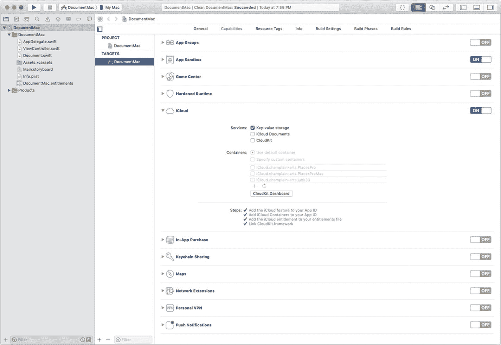
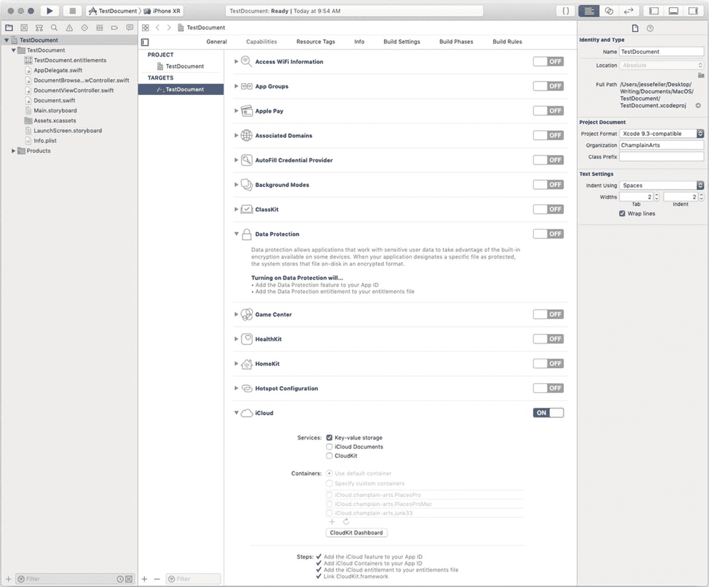
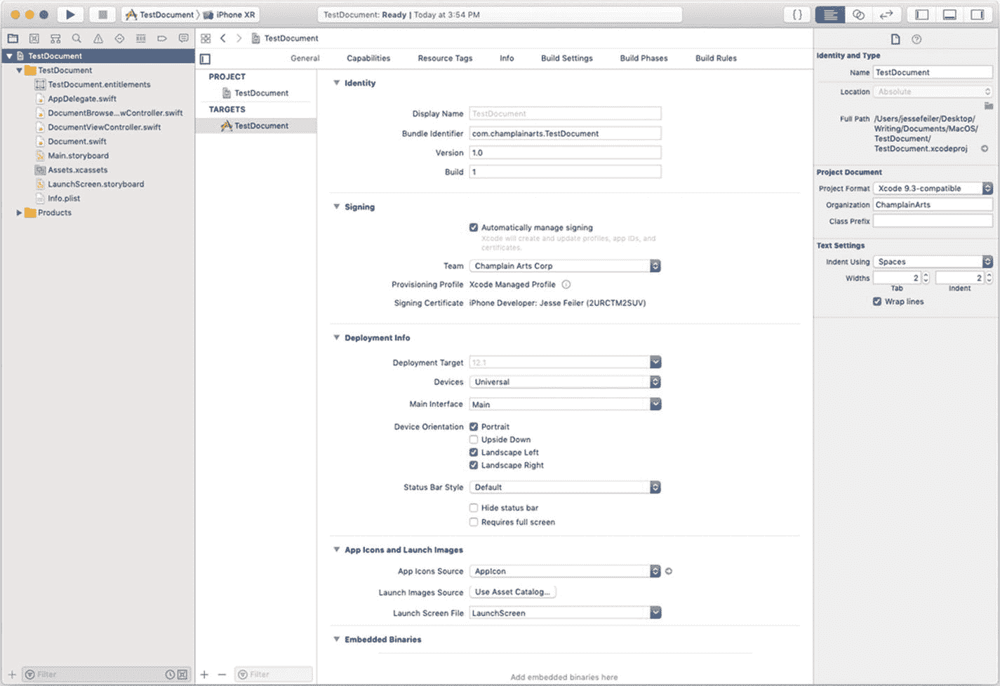
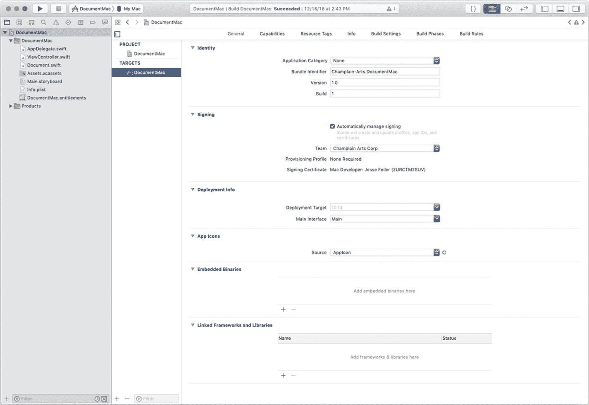
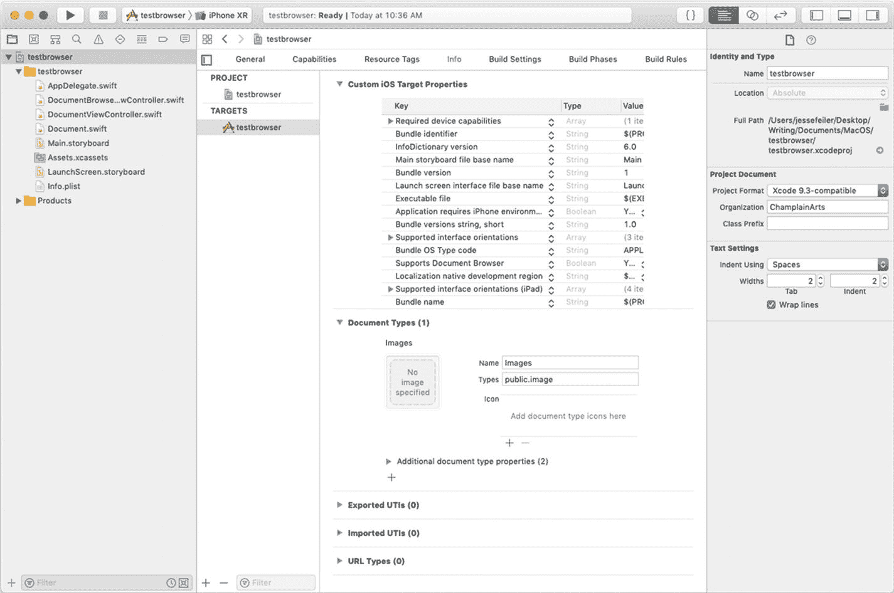
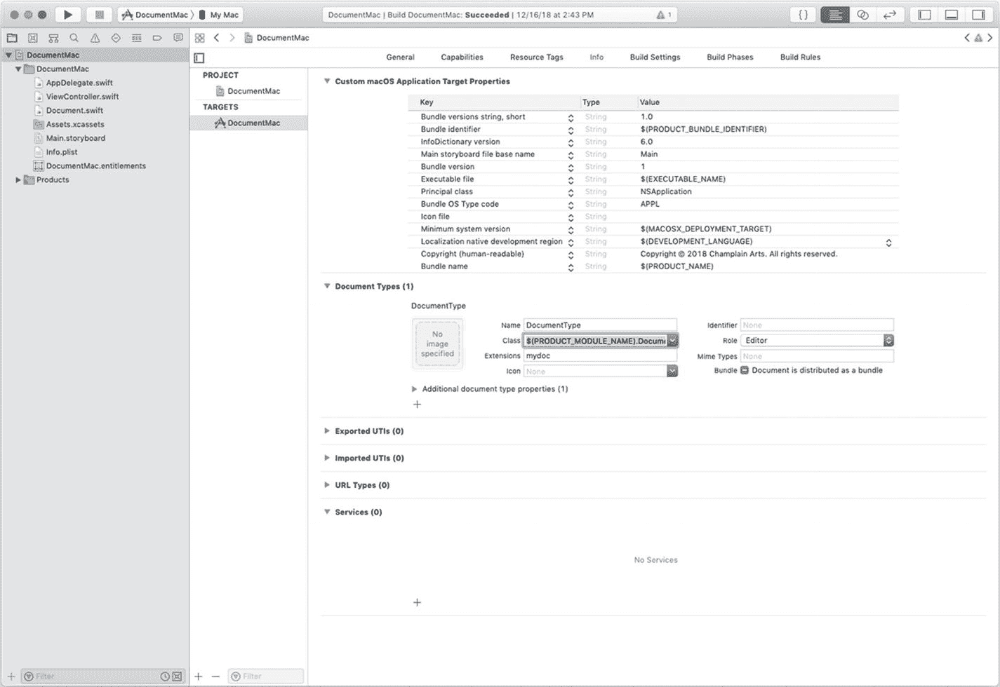
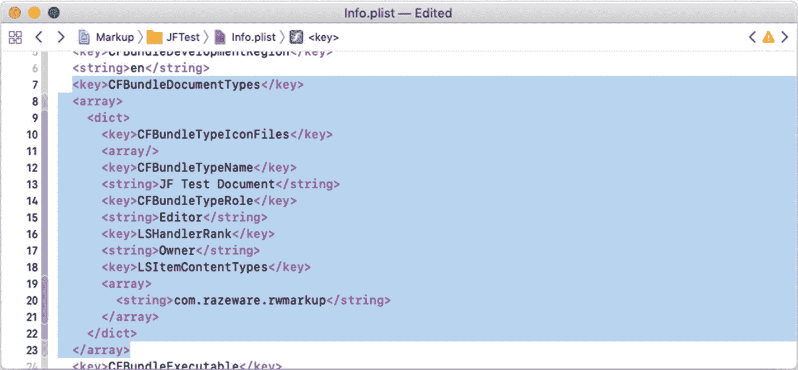
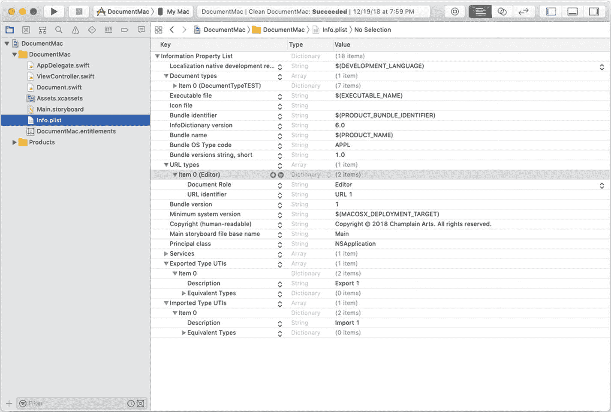
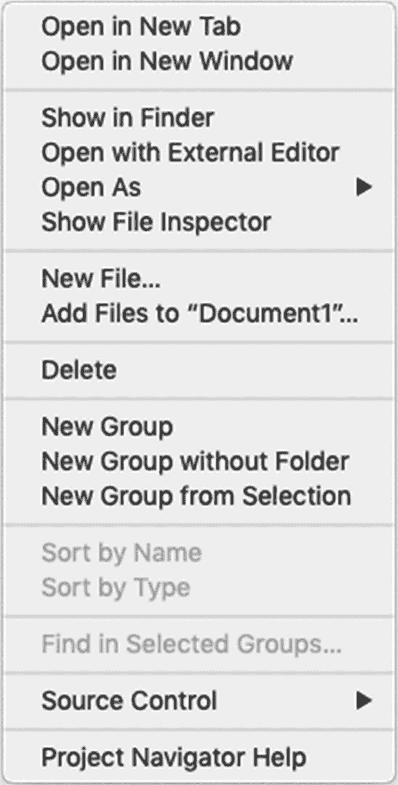
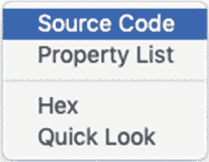

# 3. 将文档与文档格式匹配

在本章中，你将学习如何将应用代码中描述和定义的文档与实际运行的文档对象进行匹配。这是让文档发挥作用的核心。本章涵盖你需要处理的三个基本点：

-   为 iCloud 做准备
-   在你的应用中设置文档
-   管理文档类型

## 为 iCloud 做准备

你可能会想 iCloud 与文档有什么关系，但答案非常简单。随着你开始使用 iOS 和 macOS 的更多功能，你会发现网络连接和 iCloud 已不再是特例。你和你的用户将越来越多地发现，iCloud 和网络对于设备的正常运行至关重要。这花了很长时间，但现在可以肯定地说，我们确实拥有了网络连接。

我们不仅在大多数情况下拥有网络连接，而且用户和开发者也越来越习惯于管理这种连接。当出于某种原因需要离线时，开发者和用户都会切换到飞行模式。（这与过去需要分别调整蓝牙、数据访问和其他连接的常见做法相比，是一个巨大的简化。）

由于 iCloud 连接如今已非常普遍，许多开发者将其包含在应用的功能设置中。图 3-1 显示了一个 macOS 应用的 iCloud 功能。

图 3-1 为 macOS 应用设置 iCloud

iCloud 服务可以通过复选框开启或关闭。请注意，可以在此处启用 iCloud 文档。同样重要的是要注意，CloudKit 和键值存储都可以与文档一起使用。你将在第 9 章中了解更多关于文档与键值存储结合使用的知识。

对于一个 iOS 应用，图 3-2 显示了云功能设置。

图 3-2 为 iOS 应用设置 iCloud

请注意，尽管 iOS 应用有更多可用的选项，但 iCloud 选项的部分对于 iOS 和 macOS 应用来说是相同的。因此，iCloud 数据与这两个环境都兼容。

## 在你的应用中设置文档

在 iOS 和 macOS 中设置和使用文档存在差异；然而，图 3-3 和图 3-4 所示的基本设置非常相似。图 3-3 展示了 iOS 应用的文档设置，图 3-4 展示了 macOS 应用的文档设置。

图 3-3 在 iOS 中设置文档

在 macOS 中设置文档非常相似，如图 3-4 所示。

图 3-4 在 macOS 中设置文档

## 管理文档类型

一个应用可以打开许多不同的文档，具体取决于你构建应用和文档的方式。每种类型的文档（不是每个具体的文档）都在你的信息属性列表中定义为一个文档类型，如图 3-5 所示。

请注意，文档类型有一个名称。在图 3-5 中，该名称是“图像”；文档类型名称是描述性的，并由你的应用内部使用。

一个文档类型可以处理多种类型的内容。Apple 使用统一类型标识符 (UTI) 来标识标准类型。你也可以创建自己的类型。尽可能使用标准类型会让你的应用更易用，因为用户可以读取和写入任何符合支持的 UTI 标准的文件。

例如，图 3-5 显示，“图像”文档类型可以处理任何符合 `public.image` UTI 规范的文档。本章后面会有更多关于数据类型的内容。目前，只需知道在以此应用（使用“基于文档的 App iOS 项目”模板构建）中定义的“图像”数据类型符合一个名为 `public.image` 的标准图像格式，而该格式又符合 `public.data` 和 `public.content` 这两个 UTI。

图 3-5 iOS 的“图像”数据类型

思考 UTI 的最简单方式是：

-   **文档类型** 是你的应用可以打开的文档类型。
-   **导出的 UTI** 是你的应用控制并能导出的文档类型（简单来说，就是你的应用写入的 UTI）。
-   **导入的 UTI** 是你的应用读取的文档类型。它们由其他应用控制并由其导出。

图 3-5 显示了一个 iOS 应用的文档类型。macOS 中使用的文档类型有不同的设置。一些差异围绕这样一个事实：在 macOS 中，文档类型用于确定哪个应用打开该文档类型。在 iOS 中，处理方式有所不同。

图 3-6 显示了 macOS 的文档类型。

图 3-6 macOS 应用的文档类型与 iOS 应用不同

## 查看 `info.plist`

你在图 3-5 和图 3-6 中看到的内容较为复杂。在这两幅图左侧的项目导航器中，你可以看到项目文件。两幅图中都包含 Swift 文件，以及一个或多个故事板、授权文件和资源（具体内容因项目和设置而异）。目前最要紧的是 `info.plist` 文件，它是每个项目的属性列表。属性列表在 Cocoa 和 Cocoa Touch 中被广泛使用，由特定的数据类型（数组、字符串、数字、字典、日期、布尔值或 `NSData`）构成。属性列表是一种非常快速高效的数据存储和检索方式。每个应用都有一个基本属性列表（名为 `info.plist`），此外可能还有其他属性列表用于支持应用的其他部分。

属性列表由键值对组成，其中键是字符串，值则是上一段中提到的某一种数据类型。属性列表源码的开头部分如图 3-7 所示。

图 3-7

属性列表的源码

如图 3-7 所示，属性列表很容易以 XML 格式显示。你在图 3-7 中看到的格式是由 Xcode 生成的。属性列表也可以通过在 Excel 和 BBEdit 等工具中直接处理 XML 来设置格式。在 Xcode 中显示的属性列表可以格式化为如图 3-8 所示。

图 3-8

Xcode 中格式化后的属性列表

请注意，加上格式之后，属性列表会稍微更易于阅读，但请记住，它本质上仍然是先前在图 3-7 中展示的基于 XML 的属性列表。

当你查看项目导航器时，可以通过 Control-单击打开任意文件。对于属性列表，你可以选择如图 3-9 所示的格式选项。

图 3-9

在 Xcode 项目导航器中选择文件的格式选项

图 3-10 显示了“`Open As`”选项下的具体选择。

图 3-10

查看属性列表

属性列表的源码格式如图 3-7 所示；而属性列表格式则如图 3-8 所示。

如果回头再看图 3-5 和图 3-6，你会看到这两幅图的上方都有一个格式化后的属性列表（请记住，你可以通过在项目导航器中 Control-单击该属性列表来打开它）。

在图 3-5 和图 3-6 中，格式化属性列表的下方是属性列表的另一种表现形式：简单来说，可以称之为 UI 版本。它们是针对属性类型和其他设置所呈现的版本。

关键在于，你在图 3-5 和图 3-6 中看到的所有格式，都是基于原始属性列表的。不同的 UI 格式可以让你更轻松地处理希望在 macOS 或 iOS 中使用的文档。但是，请记住，底层的属性列表（`info.plist`）才是核心。虽然使用 UI 格式化版本通常更方便，但要绝对确定自己的操作无误，最安全的做法还是回到 `info.plist` 的源代码，查看具体发生了什么。

## 总结

文档类型用于将文档及其内容与 `UIDocument` 或 `NSDocument` 的子类相匹配。UTI 用于标识可能被各种应用和文档使用的文档。在本章中，你还学习了如何为文档构建和设置 iCloud，以及如何在文件和文档中使用属性列表。

