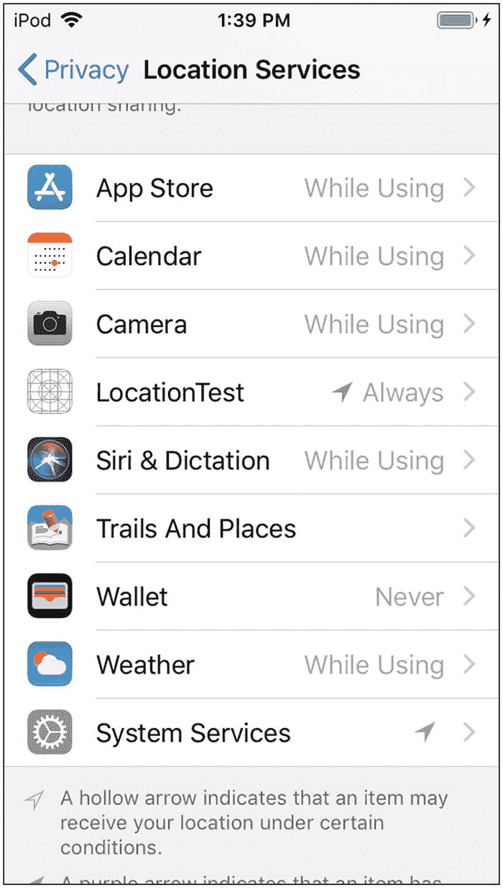
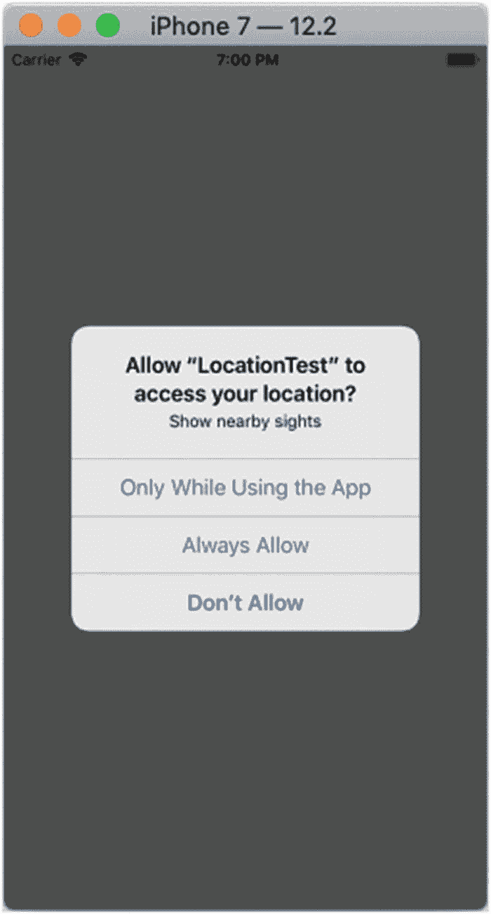
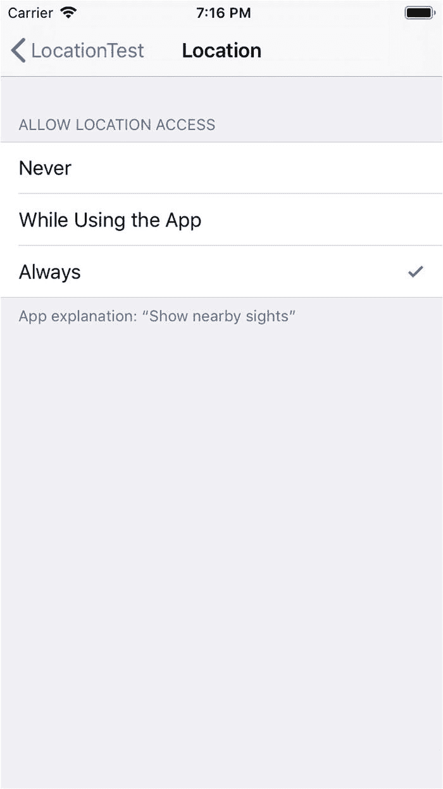
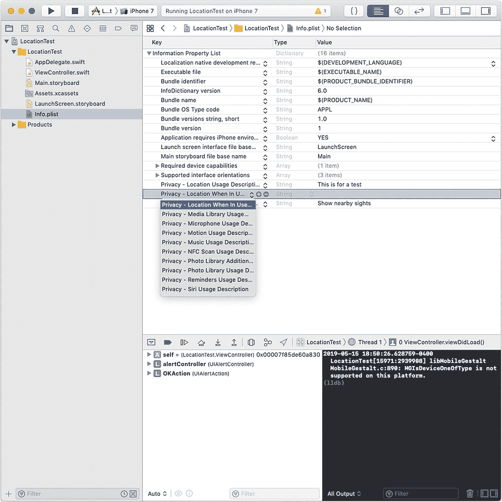
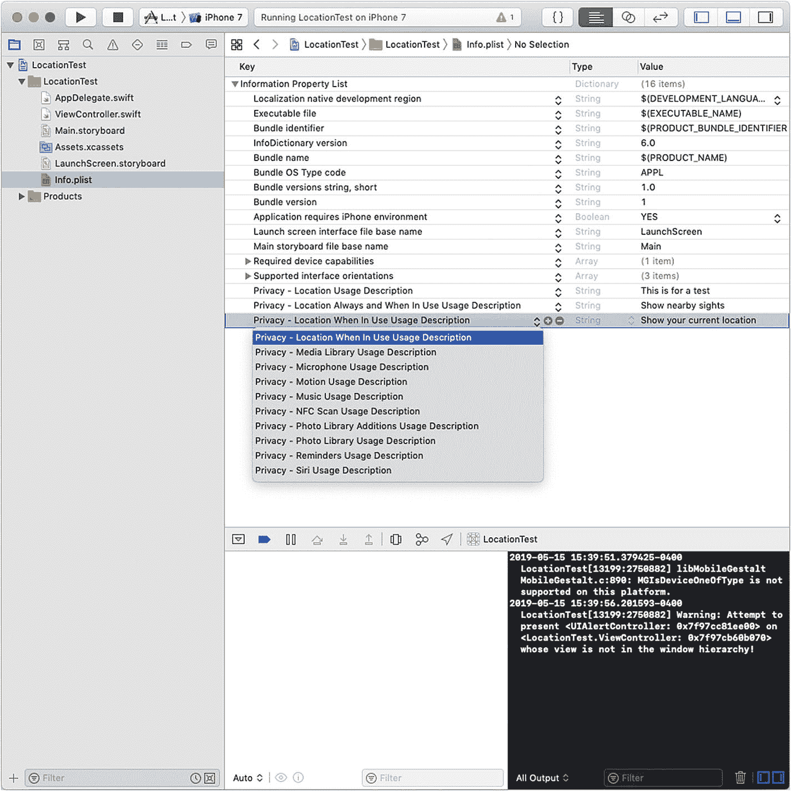
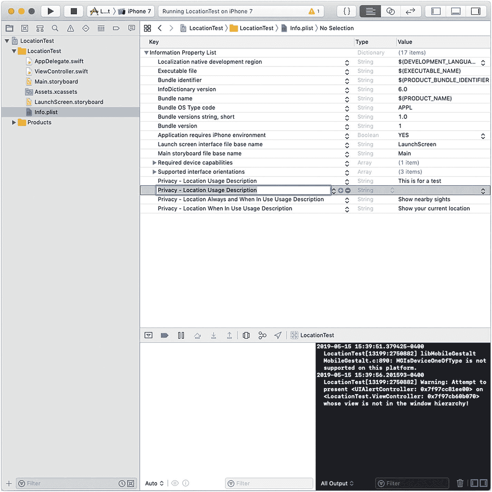

# 4. 保护数据安全

一旦你开始考虑保存数据，就应该同时考虑这些数据的安全性。从决定存储哪些数据，到制定保护这些数据的规则，过程中的每一步都需要仔细斟酌。本章就聚焦于这些问题。

## 安全与隐私概述

如第 1 章开头所述，我们使用文档来存储和组织在应用中使用数据。组织到文档中的数据有两种基本类型：随应用一起分发的数据，以及用户创建和修改的数据。第二种类型，即用户创建和修改的数据，可能包含随应用分发的那部分数据。

无论涉及何种数据类型，如果你正在构建或设计一款应用，就必须意识到可能出现的数据问题。直到不久以前，应用中的数据问题还相对简单。有些数据明显很敏感，但大多数应用中的数据并不需要特殊处理。用户和开发者常常以“没人会在意我们的数据”这种想法来自我安慰。像个人识别号码这类数据显然很敏感；开发者与用户处理此类数据安全的方式，通常只是在文档中添加一条免责声明或说明而已。

这一切随着各种系统中报告的大规模数据泄露事件而开始改变。处理敏感数据（或*可能*是或可能变得敏感的数据）的最佳实践也应运而生。

作为对媒体报道和数据安全意识普遍提高的回应，各种法律法规开始落地实施。例如，在欧盟（EU），《通用数据保护条例》（GDPR）于 2018 年 5 月 25 日生效。

随着新的法律法规和最佳实践开始生效并成为日常运作的一部分，处理数据的人有必要了解如何在现代数据环境中实施这些新实践。本章通过一个案例研究，展示了非常简单的私有数据使用方式，以及如何因简单或粗心的使用而意外导致其被破坏。你可以利用这个案例研究来指导自己在私有数据使用和隐私实现方面的工作。

## 案例研究：使用 Cocoa 定位服务

最重要的隐私问题之一与移动设备的位置有关。在移动设备普及之前，数据隐私主要关乎保护相对静态的信息，即使这些信息是通过互联网共享的。然而，有了移动设备，设备本身就可能产生机密的位置数据。这是任何需要定位自身以及用于拨打电话或执行其他必要功能的基础设施的设备的必要功能的一部分。

可以禁用移动设备上的部分或全部定位服务（例如，通过使用飞行模式），但这会限制或降低性能。苹果公司将定位服务设计为可以直接打开和关闭的功能，而无需禁用所有通信。为此，你需要使用 Cocoa 定位服务框架。

用户需要允许在其设备上使用定位服务。这通常发生在安装操作系统或设置设备时，但用户也可以通过“设置”来操作。图 4-1 展示了用户如何通过“设置”为某个应用配置隐私定位设置。

图 4-1. 定位服务设置

一旦你在“定位服务”部分找到了你的应用，就可以选择你想要的隐私设置。应用可以根据需要请求你的权限，如图 4-2 所示。（弹出窗口顶部的文本将在本章后面解释。）

图 4-2. 根据需要调整应用的定位隐私设置

当使用“设置”时，如图 4-1 所示，你可以通过图 4-3 所示的界面设置相同的选项。

图 4-3. 在“设置”应用中使用与来自应用的弹出窗口相同的设置

除了“设置”和应用的弹出窗口中的文本外，你还必须调整你的属性列表以支持这些界面。如图 4-4 所示，你的属性列表中有一些位置，用于描述如何使用用户的位置数据。

图 4-4. 调整隐私定位设置的属性列表

让用户知道你将如何使用收集到的位置数据非常重要。请注意，苹果的审核人员要求开发者在其对数据使用方式的描述中要具体明确。仅仅使用诸如“获取用户位置”这样的表述来解释你对位置数据的使用已经不够了。图 4-5 显示了一个描述不够具体的示例。

图 4-5. 确保描述你将如何使用数据

如果你未提供任何描述，你的应用会向控制台写入一条消息，如图 4-6 所示。

图 4-6. 缺少描述会阻止应用获取位置

定位服务是隐私和安全方面常见问题的一个典型例子。如果未提供位置数据使用方式的描述，控制台会显示一条运行时消息，但不会抛出错误，如图 4-6 所示。你可以争论这是否应该算作一个错误（就像苹果的工程师们很可能已经争论过的那样），但以下论点很有说服力：即使这可能是一个编程错误，它*不是*一个错误。

将这种类型的警告构建到应用中是一种常见且通常良好的设计。然而，图 4-5 展示了一个常见的错误。请注意描述是“这是一个测试。”由于没有抛出错误，这种描述位置数据将如何被使用的方式极易出现在最终发布的产品中。如果你浏览关于安全的媒体评论和文章，你会发现最大的抱怨之一是，当应用确实提供了数据使用方式的信息时，这些信息很可能是错误的。它通常是一个占位符（“这是一个测试”）或通过复制粘贴从另一个应用带来的描述。

## 总结

由于关于收集哪些数据以及如何使用这些数据的解释是用简单的语言编写的，而不是编译器或构建过程可以标记的代码，因此这些描述经常出错。现在，根据如 GDPR 等法规要求提供这些信息，这些错误比以往任何时候都更加重要。

关键在于，你应该确保面向用户的安全描述是正确的，以便用户能够信赖、理解并使用它们。

