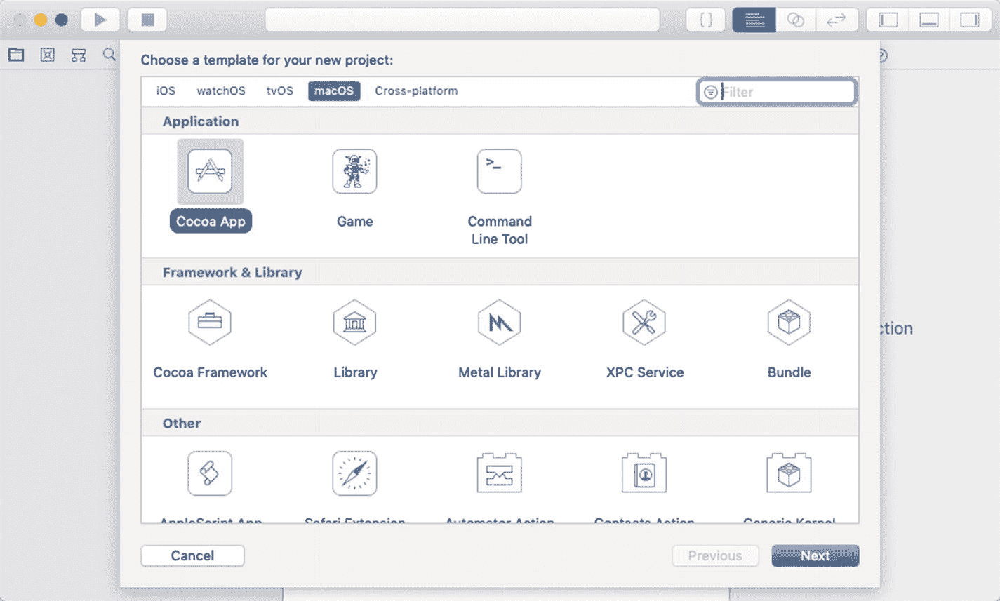
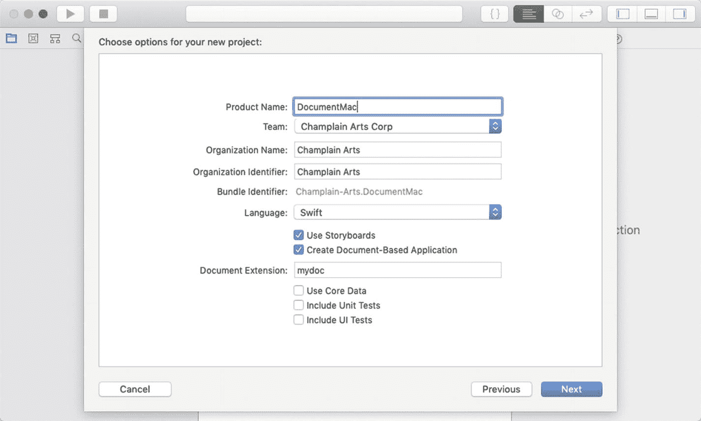
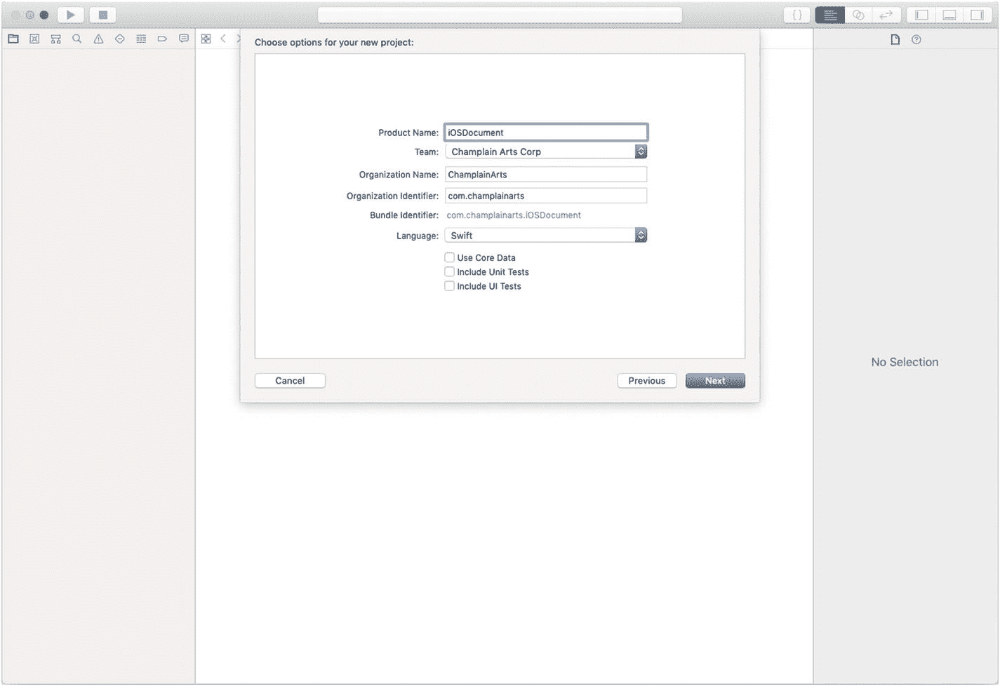
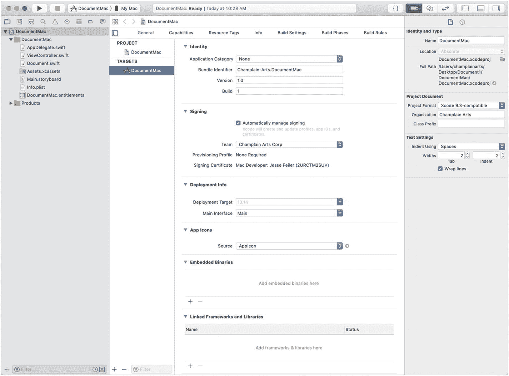
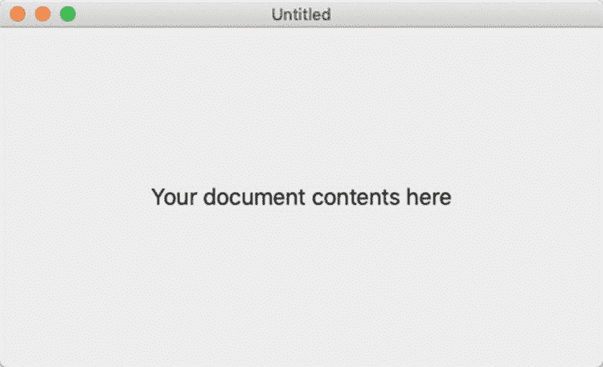
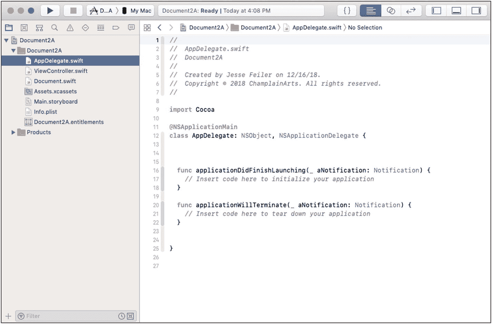
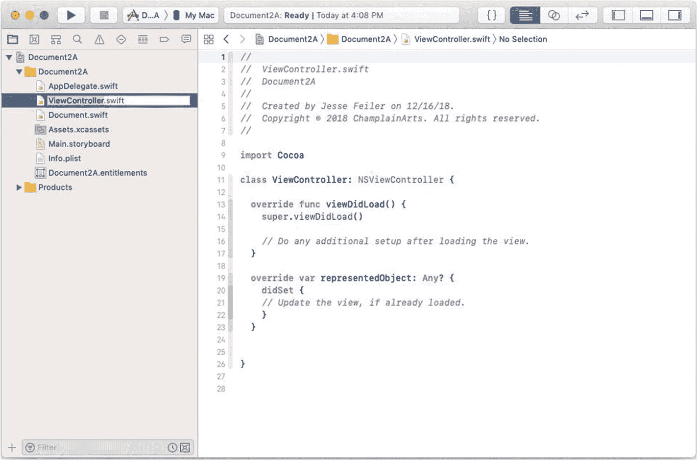
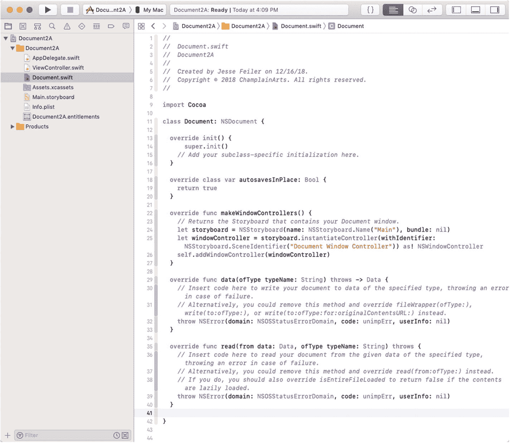
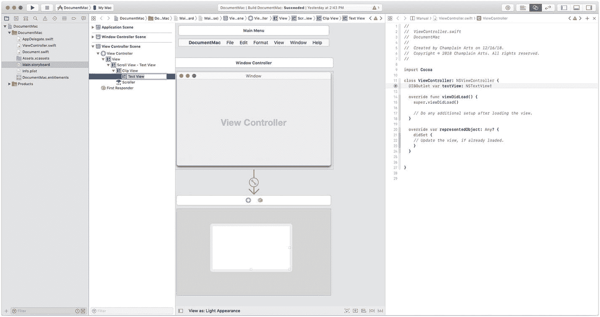

# 在 macOS 上创建基于文档的应用

通常情况下，开始构建新应用的最简单方法是使用 Xcode 内置的模板之一。创建基于文档的 macOS 应用也不例外。首先，使用 macOS Cocoa App 模板创建一个新项目，如图 5-1 所示。



图 5-1. 为 macOS 创建新的 Cocoa 应用

与 iOS 项目一样，命名 macOS 项目并提供可选信息，如图 5-2 所示。



图 5-2. macOS 应用的信息

相比之下，图 5-3 显示了 iOS 应用的选项。



图 5-3. iOS 应用的信息

macOS 项目有一些 iOS 应用中没有的选项。特别是，对于 macOS 项目模板，你会看到使用故事板和文档的选项。而对于 iOS 项目模板，有一个文档模板，并且默认使用故事板。

与从模板创建新项目时的情况一样，尝试运行它，如图 5-4 左上角带右箭头所示。（某些项目，特别是需要 iCloud 账户的项目，可能无法运行，但这个项目应该可以运行。）



图 5-4. 运行应用

项目运行时，它将使用你的 Mac 来运行，而不是使用 iOS 模拟器。基本应用应该会显示一个类似于图 5-5 所示的屏幕。



图 5-5. 运行你的新 macOS 应用

## 向 macOS 应用添加代码

查看你创建的应用内部以了解其工作原理是个好主意。（这将帮助你在开发应用时对其进行修改。）

从项目模板开始时，应用的主要组件如下：

* `AppDelegate`：功能上与你在 iOS 应用中使用的 `AppDelegate` 类似。
* `ViewController`：这是一个视图控制器（名为 `ViewController`），其工作方式与 iOS 应用中的视图控制器类似。
* `Document`：这是 `NSDocument` 类的一个子类。

以下各节展示了此项目的代码。

## AppDelegate

如图 5-6 所示，这与 iOS 应用中的应用代理类似（但要短得多，部分原因是操作系统内置了大部分文档处理工作）。



图 5-6. 使用 `AppDelegate`

项目模板中的基本代码如代码清单 5-1 所示。代码中的注释说明了你可以添加哪些内容。项目模板无需任何自定义即可运行，但在发布应用（即使仅用于测试）之前，你应该实现注释掉的代码或其变体。

```
import Cocoa
@NSApplicationMain
class AppDelegate: NSObject, NSApplicationDelegate {
func applicationDidFinishLaunching(_ aNotification: Notification) {
// 在此处插入代码以初始化你的应用
}
func applicationWillTerminate(_ aNotification: Notification) {
// 在此处插入代码以关闭你的应用
}
}
```

代码清单 5-1. `AppDelegate` 模板代码

## ViewController

`ViewController` 是 `NSViewController` 的实例，它允许你管理视图中的对象。基本的 `ViewController` 如图 5-7 和代码清单 5-2 所示。它将在本章后面的 "`Document`" 部分进行修改。



图 5-7. 创建 `ViewController`

```
//
//  ViewController.swift
//  Document2A
//
//
import Cocoa
class ViewController: NSViewController {
override func viewDidLoad() {
super.viewDidLoad()
// 在此处执行加载视图后的任何其他设置。
}
override var representedObject: Any? {
didSet {
// 如果视图已加载，则更新视图。
}
}
}
```

代码清单 5-2. `ViewController` 代码

## Document

`Document` 是 `NSDocument` 的子类，用于管理文档及其数据。基本代码如图 5-8 和代码清单 5-3 所示。需要注意的是，文档子类的 `makeWindowControllers` 方法包含了将故事板与 `Document` 类匹配的代码。



图 5-8. 管理你的文档

```
//
//  Document.swift
//  Document2A
//
//
import Cocoa
class Document: NSDocument {
override init() {
super.init()
// 在此处添加你的子类特定初始化代码。
}
override class var autosavesInPlace: Bool {
return true
}
override func makeWindowControllers() {
// 返回包含你的文档窗口的故事板。
let storyboard = NSStoryboard(
name: NSStoryboard.Name("Main"), bundle: nil)
let windowController =
storyboard.instantiateController(
withIdentifier:
NSStoryboard.SceneIdentifier(
"Document Window Controller"))
as! NSWindowController
self.addWindowController(windowController)
}
override func data(ofType typeName: String) throws -> Data {
// 在此处插入代码，将你的文档写入指定类型的数据，
// 如果失败则抛出错误。
// 或者，你可以移除此方法并覆盖
// fileWrapper(ofType:)、write(to:ofType:) 或
// write(to:ofType:for:originalContentsURL:)。
throw NSError(domain: NSOSStatusErrorDomain,
code: unimpErr, userInfo: nil)
}
override func read(from data: Data,
ofType typeName: String) throws {
// 在此处插入代码，从给定指定类型的数据中读取你的文档，
// 如果失败则抛出错误。
// 或者，你可以移除此方法并覆盖
// read(from:ofType:)。
// 如果你这样做，还应该覆盖 isEntireFileLoaded，
// 如果内容是懒加载的，则返回 false。
throw NSError(domain: NSOSStatusErrorDomain,
code: unimpErr, userInfo: nil)
}
}
```

代码清单 5-3. `Document` 代码

## Storyboard

图 5-9 展示了如何修改模板中的故事板以添加文本视图（操作方式与在 iOS 中相同）。在 `Document` 中，你可以使用文本视图来收集数据，然后进行处理。



图 5-9.


## macOS 与 iOS 开发概述

请注意，在 macOS 和 iOS 上管理文本视图中数据的细节有所不同。其中一个区别在于，在 macOS 中，函数会暴露滚动行为，而在 iOS 中这些行为是视图的属性。

请牢记 Cocoa 在 macOS 上的发展历史。在最早的文档中，OpenStep 及其前身 NeXTSTEP 是为在早期个人计算机上运行的商务应用世界而设计的。即使是早期版本也包含用于管理格式化表格和字符串的函数。Cocoa 和 Cocoa Touch 的开发路径之所以大相径庭，很大程度上是因为 Cocoa Touch 最初的目标平台是 iPhone。尽管当时（现在也）存在商务应用，但 iOS 设备的应用和用户与 NeXTSTEP 在 1989 年 9 月 18 日发布时的应用和用户截然不同。

### 注

如需了解 1989 年环境的有趣回顾，请参见计算机历史时间线 [`www.computerhistory.org/timeline/1989/`](http://www.computerhistory.org/timeline/1989/)。

## 总结

macOS 和 iOS 上读写数据的基本机制是相同的：你使用故事板中的对象来接收和发送数据。

请注意，故事板是 macOS 相对较新的补充，因此在旧代码示例中可能找不到它们。同样，请注意，在旧代码中可能会找到对绑定的引用。虽然它并未被弃用，但在现代 `macOS` 代码中并不常用。

