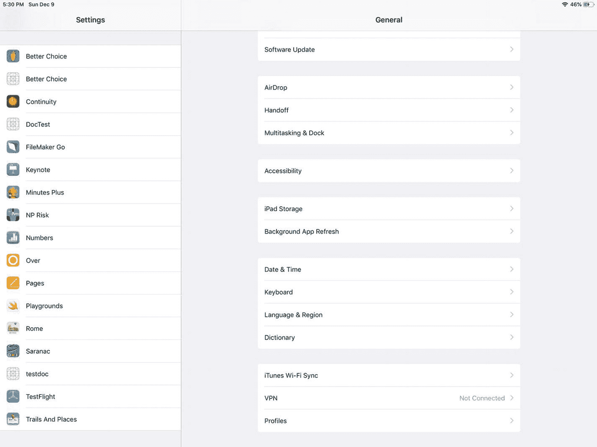
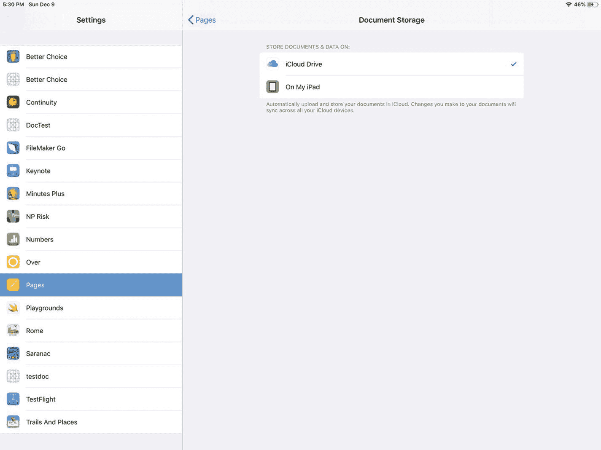
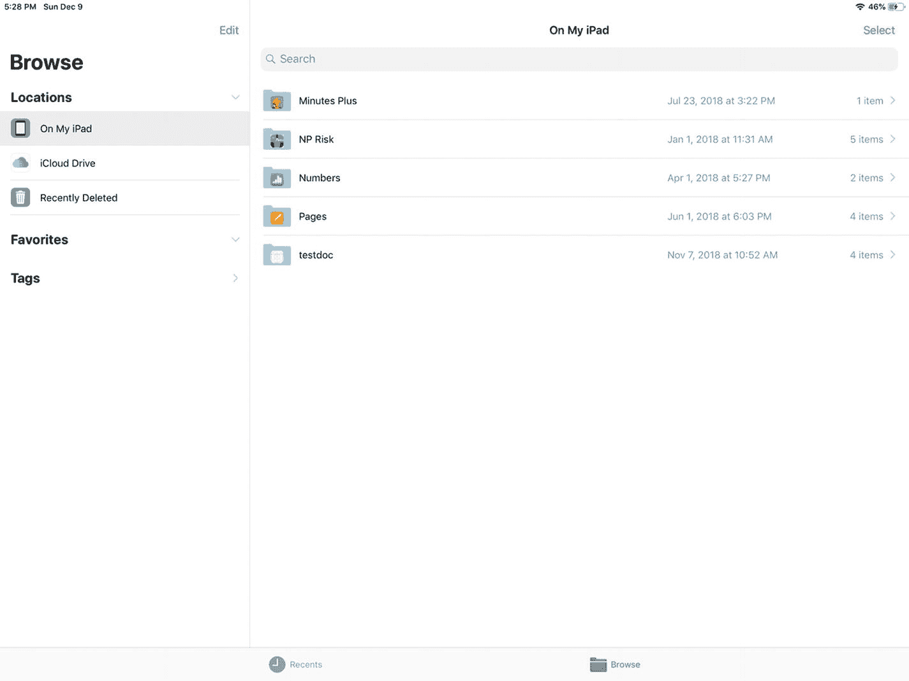
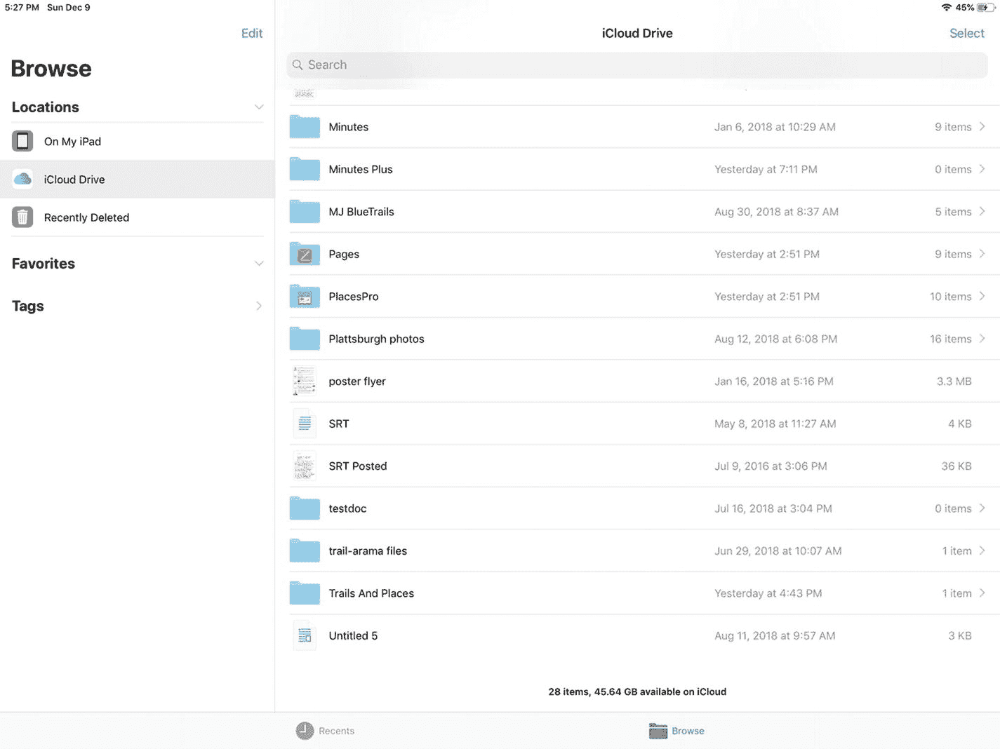
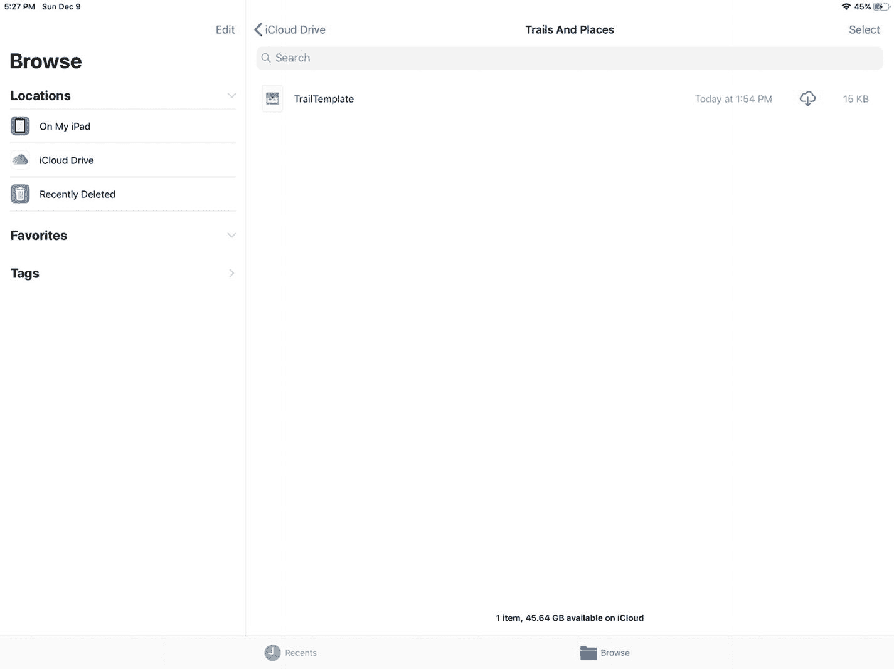
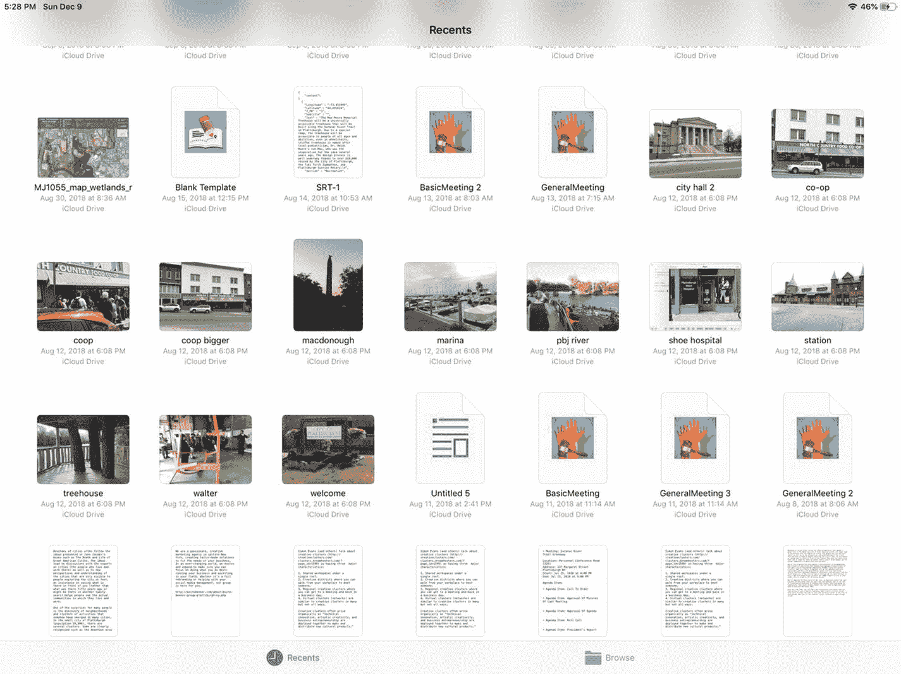
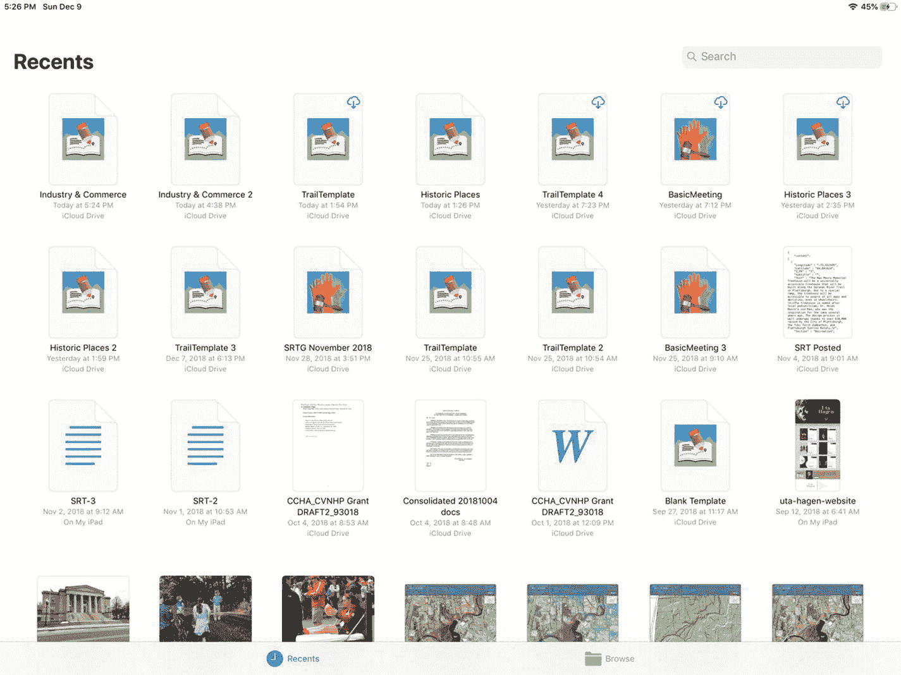
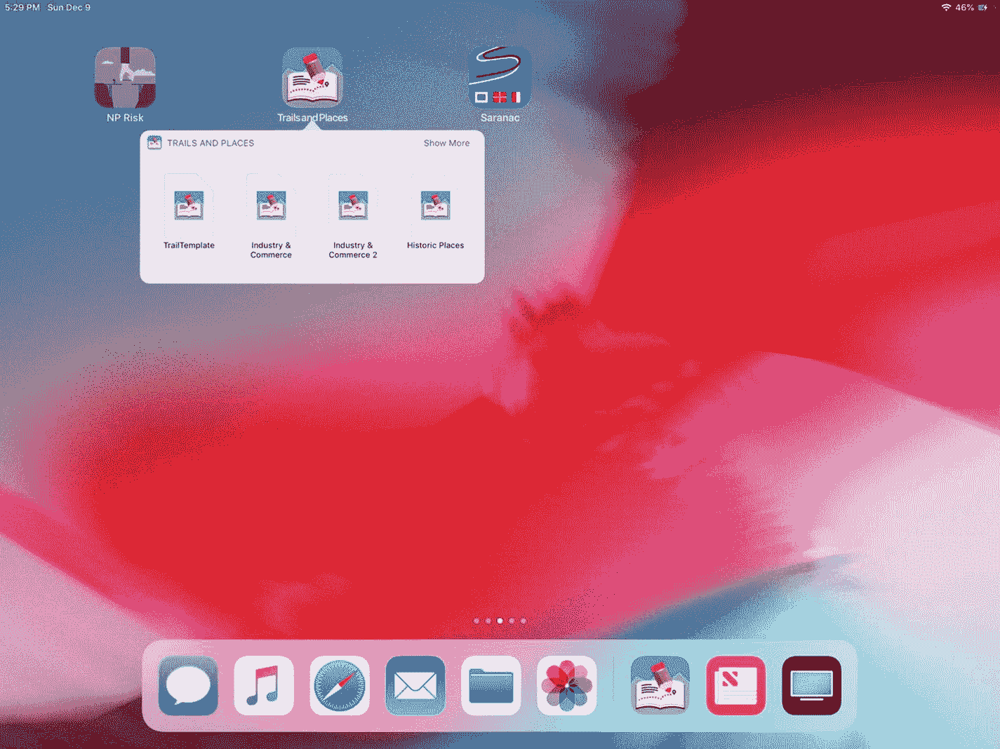
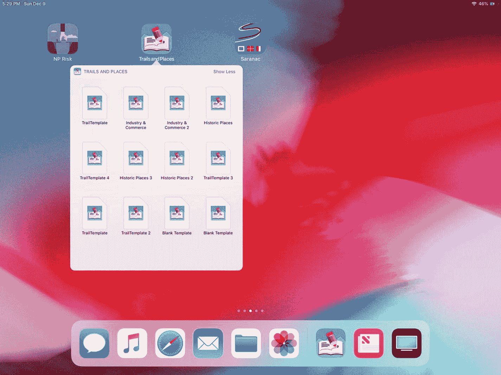
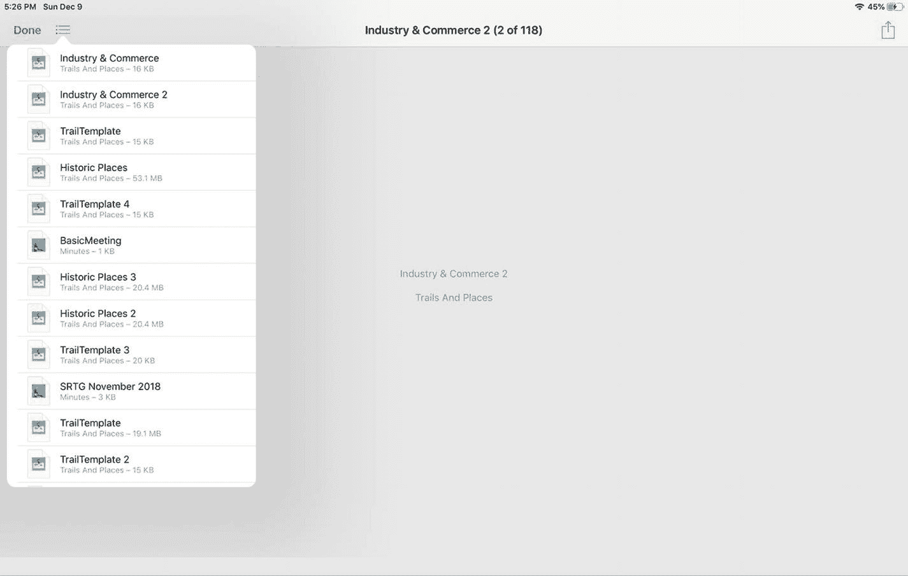

# 在 iOS 上实现文档

在 iOS 上实现文档时，你需要考虑三个主要问题：

* 随着 iOS 11 中 iOS 文件应用的问世，用户开始能够访问 iOS 的底层文件系统。
* iOS 文档的基础类是 `UIDocument`，它被设计为可以创建子类。
* `UIDocumentBrowserViewController` 是一个视图控制器，旨在实现 iOS 文件应用的用户界面。

本章重点讨论第一个问题：文件。

## 使用文件与 iOS 文件系统

当第一款 iPhone 发布时，它并非立竿见影的成功。事实上，如果你回顾并搜索当时的新闻文章，会发现一些对该产品的主要抱怨。其中最大的抱怨之一是缺少连接器（例如 USB），无法像用户习惯将设备连接到个人电脑那样，将其他设备连接到 iPhone。

整个 iPhone 文件系统对用户隐藏是常见的抱怨之一。隐藏的文件系统架构自有其原因，而在 iPhone 使用的十多年间，用户、开发者和分析师逐渐了解了这种架构的优点（有时也包含缺点）。

随着 2017 年 iOS 11 的发布，苹果推出了其文件应用，该应用以与人们自个人电脑时代初期就习惯的架构截然不同的方式处理文件管理问题。在基于传统 Unix 文件架构构建的基本个人电脑文件架构中，用户可以管理文件和文件夹，这些文件和文件夹可以放置在设备的几乎任何位置。文件应用则采取了一种不同的方法，文件只能从特定区域（通常与应用相关）进行访问。换句话说，用户现在被鼓励将文件视为可以在应用文件空间（通常称为*沙盒*）内任意移动，而不是像个人电脑磁盘上那样可以随意移动。

考虑到人们不再仅仅使用个人电脑上的磁盘空间，文件应用整合了对超越个人电脑的云存储服务的访问，例如 iCloud、Dropbox、Box、Google Drive 和 OneDrive。

对于习惯了旧有结构（用户可以将文件放在他们想放的地方）的人来说，这可能是一次重新学习的经历。或许需要考虑的最重要一点是，在旧有文件结构中，你根据电脑磁盘和其他存储位置的关系来放置文件。而使用 iOS 文件系统和文件时，你可以将文件放置在两个大类位置之一：

* 你可以将文件放置在特定应用的文件夹中。一个文件夹可以由多个相关应用共享。关于这种共享的好例子，可以使用内置的 Pages、Keynote 或 Numbers 应用，并尝试保存共享文件。
* 你可以将文件放置在云存储服务中，例如 iCloud 或 Dropbox。

以下是关于使用文件的一些细节。

## 选择文档存储位置

请记住，文件存储主要取决于文件关联的应用。选择存储位置的主要工具是在应用的“设置”中进行配置。例如，在“设置”中，你可以查看 iOS 设备上已安装应用的各种设置（图 6-1）。

图 6-1. 为你的应用选择设置

找到你的应用，然后选择存储位置，如图 6-2 所示。你的选择取决于你在 iOS 设备上安装的内容。如果你使用 iCloud（一个非常常见的选择），你可以选择将数据存储在那里。你也可以选择将其存储在本地设备上，或者使用 Dropbox、Box 或其他服务。

图 6-2. 选择文档存储位置

## 浏览文档

当你使用文件应用时，可以选择在特定位置浏览文件（这当然取决于你为位置选择了什么以及你拥有的文件）。理解文件应用向你显示的浏览数据很重要，因此以下图片显示了你可能会看到的内容。

如果你决定使用 iPad 进行存储，当你选择“我的 iPad 上”位置时，可能会看到如图 6-3 所示的浏览结果。

图 6-3. 浏览“我的 iPad 上”的文件

如果你使用 iCloud 云盘，你可能会看到一个类似图 6-4 所示的浏览窗口。

图 6-4. 浏览 iCloud 云盘上的文档和文件夹

请注意，浏览时，位置位于窗口左侧。当你选择特定文件或文件夹时，你会在左侧的“位置”中或右侧列表的顶部看到其容器指示，如图 6-5 所示。

图 6-5. 右侧窗格顶部的文件夹名称

## 查看最近文档

使用窗口底部的标签页，你可以在最近的文件和文件夹以及想要浏览的内容之间切换。图 6-6 展示了最近的文件和文件夹。

**图 6-6.** 最近的文件和文件夹

如果你的某些文档尚未从远程服务器下载，你会看到如图 6-7 所示的云图标，表示它们正在等待下载。如果你点按某个特定文件，可以加快其下载进程。

**图 6-7.** 正在下载文件

请注意，除了指示文件是否需要下载，你还可以看到它的位置。例如，在图 6-7 的右下角，你可以看到一个被标记为 `On My iPad` 而非 `iCloud Drive` 的文档。

### 提示

习惯使用“文件”App 并利用文件位置信息和下载状态。因为下载的调度和处理通常会有时间延迟，如果你知道哪些文件在何处，就能避免花时间去调试那些仅仅是时间同步问题导致的问题，从而节省时间。

## 查看某个 App 的文件和文件夹

当你在 iOS 设备上查看 App 时，可以长按一个应用图标来查看可能属于它的文件和文件夹，如图 6-8 所示。

**图 6-8.** 长按应用图标查看其文件

如有必要，右上角会出现一个“显示更多”按钮，如图 6-8 所示。当你使用“显示更多”时，会伴随出现一个“显示更少”按钮，如图 6-9 所示。

**图 6-9.** “显示更少”选项

当你在“文件”App 中查看应用时（图 6-7），你会看到文件和文件夹的列表，如图 6-10 所示。

**图 6-10.** 某个 App 的所有文件和文件夹列表

## 总结

使用“设置”来控制你存储某个 App 文件和文件夹的位置，使用“文件”App 来浏览文件和文件夹以及最近项。

请记住，你不是通过选择个人电脑上的位置，而是通过选择你当前使用的设备上或云端存储功能（如 `iCloud` 或 `Dropbox`）上的位置，来控制文件和文件夹的存放位置。

