# 7. 在 iOS 上实现文档：UIDocument 和 UIDocumentBrowserViewController

文档是许多 App 的关键组成部分，从个人电脑时代开始便是如此。许多人仍然认为文档是基于纸张的物件，但如今人们在 iOS 和 macOS 上处理的文档，远比其纸质前辈复杂得多。本章将介绍当今的文档及其结构，然后解释如何使用 `UIDocumentBrowserViewController` 来管理文档。

## 创建一个基于文档的 App

正如 Xcode 中框架的基本构建模块通常的情况一样，在 iOS 上开始使用文档的最简单方法是使用 Xcode 内置的“基于文档的 App”项目模板。首先创建一个新的 iOS 项目，如图 7-1 所示。

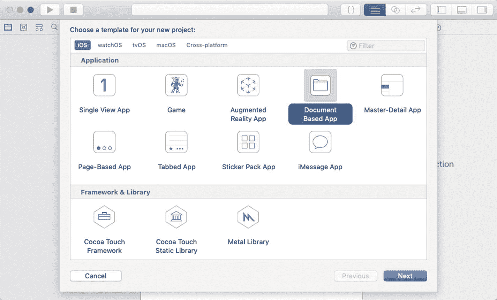

**图 7-1.** 在 Xcode 中选择“基于文档的 App”模板

按照图 7-2 所示的标准选项进行设置，以完成模板配置。

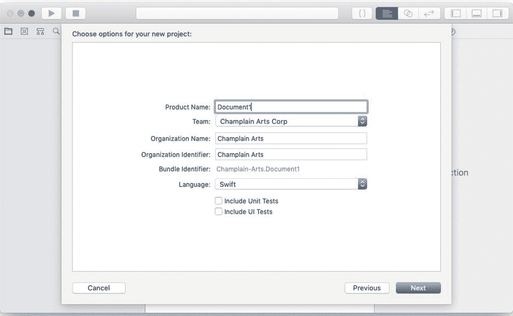

**图 7-2.** 为新项目设置选项

继续完成选项，直到项目模板设置完毕，如图 7-3 所示。

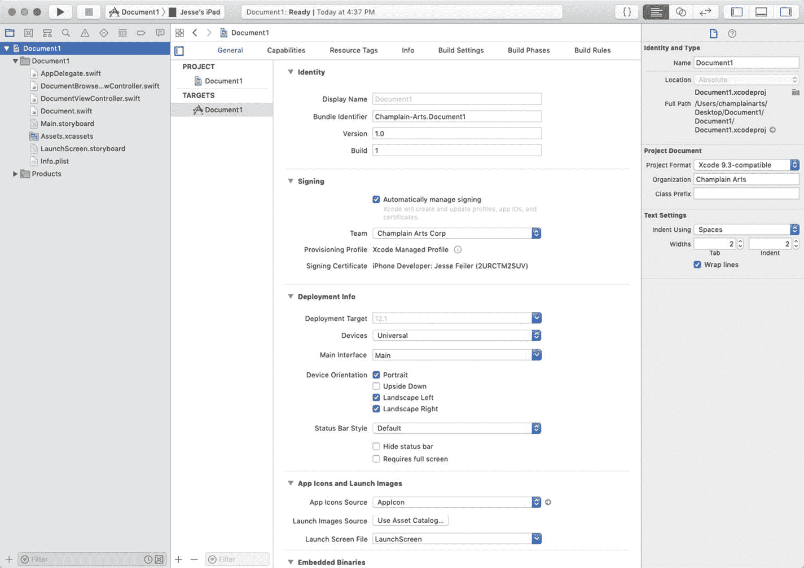

**图 7-3.** 查看新项目

完成后，运行该 App。（当你从模板创建新项目时，这是一个应始终执行的步骤。除了诸如网络可用性之类的问题外，你的新项目模板应该能够正常运行。）

如图 7-4 所示，你可以打开项目，看到包含两个视图控制器的 Storyboard。

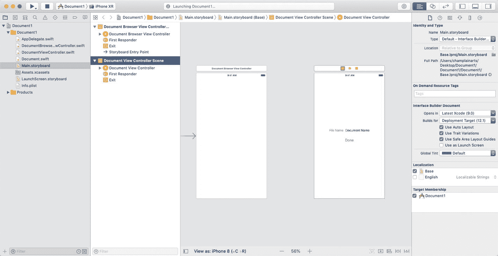

**图 7-4.** 查看 Storyboard

运行项目。你应该会看到模拟器，如图 7-5 所示。

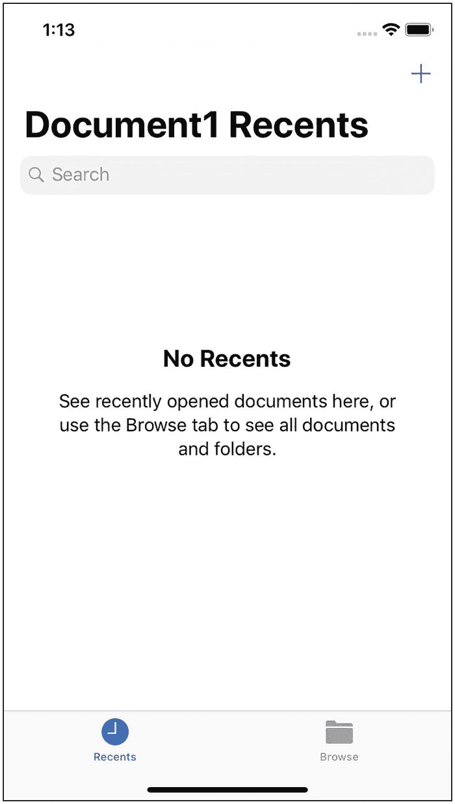

**图 7-5.** 运行 App

继续探索你的新 App。使用“浏览”标签页来浏览 App 沙盒中的文件，如图 7-6 所示。

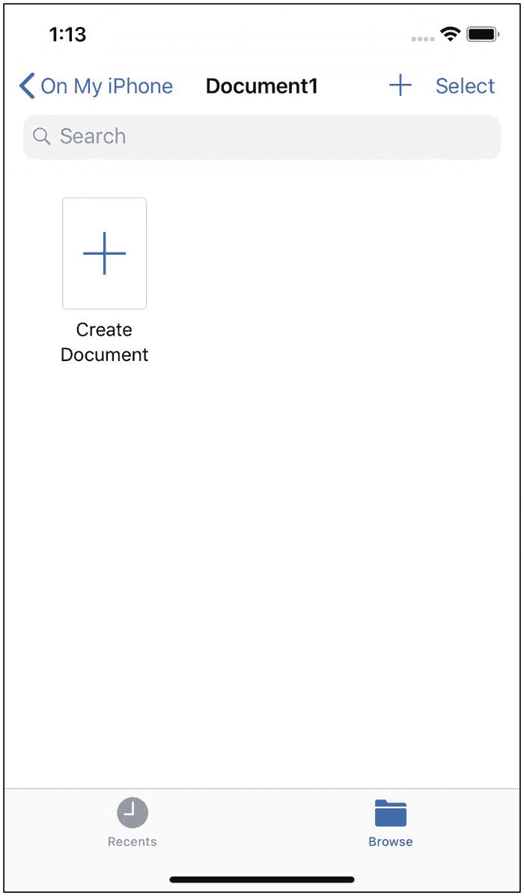

**图 7-6.** 在 App 中探索“浏览”标签页

目前那里没有文件，但有一个“创建文档”按钮。试试看！

什么也没发生。

是时候进入本章的下一节了，该节将介绍 `UIDocument`。除其他任务外，你将了解如何实现“创建文档”按钮。

### 介绍 UIDocument

iOS 中的基本文档类是 `UIDocument`。`UIDocument` 通过以下方式提供文档的基本功能：

* **fileURL**：`UIDocument` 使用文件 URL 来标识文档，以便你的 App 能够定位它进行读写。
* `UIDocument` 在后台队列上管理**异步读写**数据，而你只需付出极少的努力。
* `UIDocument` 还使用**云服务**（例如 `iCloud`）来协调文档文件的读写。
* `UIDocument` 还管理你文档的**冲突和版本变更**。

这些是 `UIDocument` 的基本组成部分。为了开始使用文档，你可以使用“基于文档的 App”模板中提供的基本代码。项目模板中的基本代码提供了 `fileURL`（文档标识）的功能，以及关键的读写特性、云服务以及冲突和变更的管理功能。


## 使用 UIDocument

使用 `UIDocument` 的关键组件包括负责读取、写入和创建文档的类 `UIDocument`，以及负责浏览和用户界面交互（即读取、写入和创建文档的界面部分）的类 `UIDocumentBrowserViewController`。要完善 `UIDocument` 的基本功能，还需要实现 `UIDocumentViewController`。

`UIDocument` 为你处理了大量文档管理工作，包括保存文档、管理变更等许多关键功能。你可以通过研究文档来了解其所有特性，但也可以使用本章基于文档的 App 模板中包含的 `UIDocument` 精简功能。实际上，该模板的基本代码（见图 7-7 和代码清单 7-1）是一个绝佳的起点。对于许多基础应用来说，只需这些代码，再加上一两行应用特定的代码，就完全足够了。

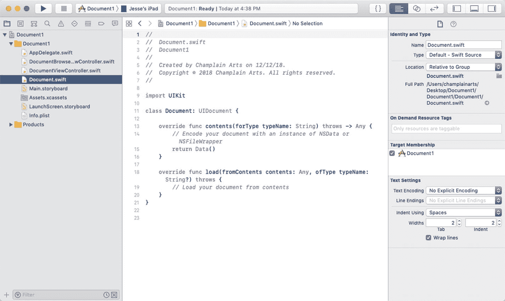

**图 7-7.** 基本的 `UIDocument` 功能

```
//
//  Document.swift
//  Document1
//
//
import UIKit

class Document: UIDocument {
    override func contents(forType typeName: String) throws -> Any {
        // 使用 NSData 或 NSFileWrapper 实例编码你的文档
        return Data()
    }
    override func load(fromContents contents: Any, ofType typeName: String?) throws {
        // 从 contents:ofType:) 加载你的文档
    }
}
```

**代码清单 7-1** 基本代码

你需要首先实现的函数是 `contents(forType:)`。当你确定文档中数据的格式后，需要指定其类型，该类型将用于读取和写入文档数据。通常，文档文件的类型是基本的 Swift 或 Objective-C 类型，例如 `NSData`。如果你使用 `NSData`，则需要负责将文档数据转换为 `NSData` 或你正在使用的任何其他类型。

其配套函数是 `load(fromContents:ofType:)`。这两个函数让你能够读取或写入通用格式的数据，然后将其转换为你的应用可以管理的数据。

如果你深入研究 `UIDocument` 的代码，你会发现它在这两个函数 `contents(forType:)` 和 `load(fromContents:ofType:)` 的基本结构内处理了异步读写、云数据协作以及变更管理等所有功能。

## 使用 UIDocumentViewController

一旦你设置好了文档，就需要添加一个视图控制器，以便查看和操作内容。在基于文档的 App 项目模板中，文档控制器是按照图 7-8 所示创建的。

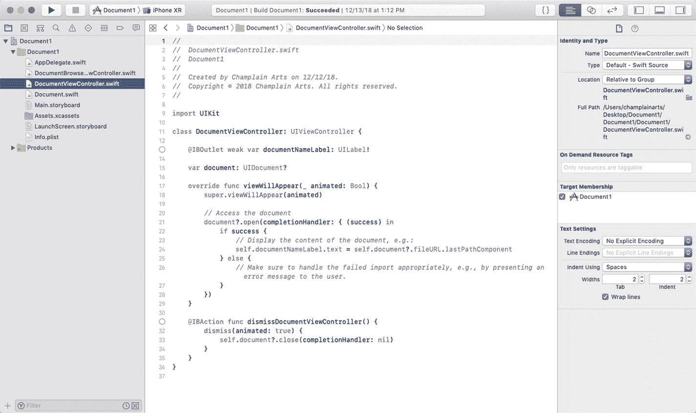

**图 7-8.** `DocumentViewController`

相关代码如代码清单 7-2 所示。

```
class DocumentViewController: UIViewController {
    @IBOutlet weak var documentNameLabel: UILabel!
    var document: UIDocument?

    override func viewWillAppear(_ animated: Bool) {
        super.viewWillAppear(animated)
        // 访问文档
        document?.open(completionHandler: { (success) in
            if success {
                // 显示文档内容，例如：
                self.documentNameLabel.text = self.document?.fileURL.lastPathComponent
            } else {
                // 务必妥善处理导入失败的情况，
                // 例如，向用户显示错误信息。
            }
        })
    }

    @IBAction func dismissDocumentViewController() {
        dismiss(animated: true) {
            self.document?.close(completionHandler: nil)
        }
    }
}
```

**代码清单 7-2** 文档视图控制器代码

`DocumentViewController` 类中有两个函数：`viewWillAppear(_:)` 和 `dismissDocumentViewController()`。前者负责打开文档，后者负责关闭文档。

### 打开文档

打开文档是使用完成处理器的 Swift 异步编程风格的一个很好的例子。代码如下：

```
document?.open(completionHandler: { (success) in
    if success {
        // 显示文档内容，例如：
        self.documentNameLabel.text = self.document?.fileURL.lastPathComponent
    } else {
        // 务必妥善处理导入失败的情况，
        // 例如，向用户显示错误信息。
    }
})
```

在文档对象上调用 `open` 方法（注意它是一个可选类型，用 `?` 进行解包）。完成处理器在 `open` 函数中声明，并在 `open` 操作完成时被调用。完成处理器接收一个参数。通常（但并非强制）这个参数被命名为 `success`，它是一个布尔值，用于指示 `open` 操作是否成功。

然后，完成处理器执行以下代码：

```
if success {
    // 显示文档内容，例如：
    self.documentNameLabel.text = self.document?.fileURL.lastPathComponent
} else {
    // 务必妥善处理导入失败的情况，例如，
    // 向用户显示错误信息。
}
```

如果文档成功打开，故事板中的一个标签会被赋予文件 URL 的 `lastPathComponent`。（你可以在图 7-4 的右侧看到这一点）。对于大多数应用，你实际上会在界面中显示文档的一些内容。

> **注意：** 打开文档的完成处理器是提升应用性能的一种重要方式。当你处理可能存储在云端的文档和文件时，执行完成处理器（无论成功与否）的延迟可能会很明显。在测试应用时请牢记这一点。

### 关闭文档

关闭文档使用了与 `dismissDocumentViewController` 类似的结构。然而，请注意应用中的完成处理器为 nil。如果你不需要处理已更改的数据，除了关闭文档之外，无需执行任何其他操作。

## 使用 UIDocumentBrowserViewController

`UIDocumentBrowserViewController` 是基于文档的应用的核心。本节将概述其工作流程。主要有两条路径：创建新文档或打开现有文档（你可能需要回看图 7-5 和 7-6）。

### 加载 UIDocumentBrowserViewController

使用 `UIDocumentBrowserViewController` 的第一步是加载它，如图 7-9 所示。

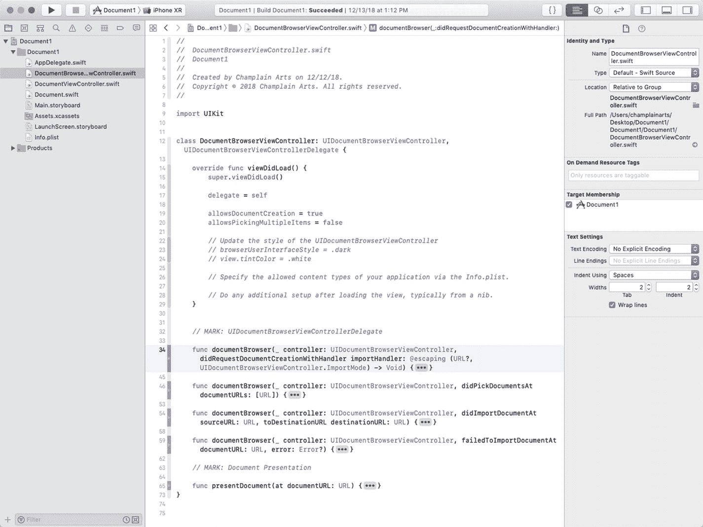

**图 7-9.** 加载 `UIDocumentBrowserViewController`

请注意，你的 `UIDocumentBrowserViewController` 子类还应遵守 `UIDocumentBrowserViewControllerDelegate` 协议。你可以在图 7-9 的第 12 行看到这一点。作为额外参考，代码如下：

```
delegate = self
```

你可以在此处设置浏览器可视样式的选项，使其与你的用户界面协调一致。其他初始化工作可以在你的 `info.plist` 中处理。

> **注意：** 关于 `info.plist` 的更多信息，请参阅第 3 章。

请注意，`viewDidLoad` 让你可以通过第 19 行来决定是否可以创建文档：

```
allowsDocumentCreation = // true 或 false
```

加载 `UIDocumentBrowserViewController` 后，你通常需要实现四个函数，这些函数在图 7-9 中显示为存根（stubs）。这些函数是：

- `documentBrowser(_:didRequestDocumentCreationWithHandler:)` 用于创建新文档
- `documentBrowser(_:didPickDocumentAt:)` 用于打开现有文档
- `documentBrowser(_:didImportDocumentAt:toDestinationURL:)` 用于在打开文档后，显示其内容
- `documentBrowser(_:failedToImportDocumentAt:error:)` 用于处理错误


### 创建文档

你可以使用模板来创建新文档。如文档所述，你可以让用户选择将几个基本文档中的哪一个作为模板。参见图 7-10。

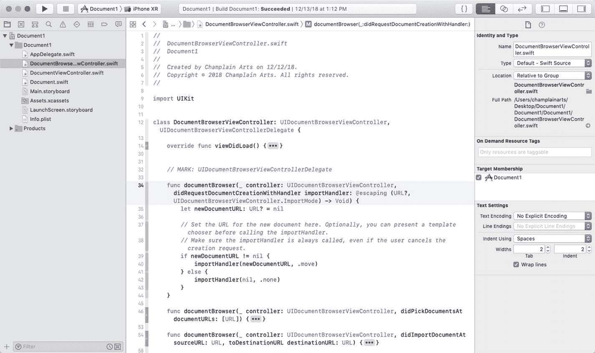

**图 7-10.** 创建文档

在许多旧的设计模式中，你会选择创建一个空白文档，然后可能用数据对其进行修改。iOS 中最常用的设计模式并非创建文档，而是从你的 bundle 中复制一个现有的模板文档，并将副本放置在你的应用的适当位置。这是一种不同的工作流程，但随着你不断创建和修改应用，它会变得更高效。

清单 7-3 展示了让用户从列表中选择模板的代码。关键代码行是：

```
let newDocumentURL = Bundle.main.url(forResource: "Template",
withExtension: DocumentBrowserViewController.documentExtension)
importHandler(newDocumentURL, .copy)
```

这行代码从你的 bundle 中获取一个名为 `Template` 且带有你的文档扩展名的文件，并将其复制到新位置。如果你不需要让用户从多个模板中选择，只需使用此代码，而无需弹出让用户选择的警告框。

```
let title = NSLocalizedString("Choose File Template", comment: "")
let cancelButtonTitle = NSLocalizedString("Cancel", comment: "")
let defaultButtonTitle = NSLocalizedString("Basic (Default) ", comment: "Default")
let generalButtonTitle = NSLocalizedString("Demo)", comment: "")
let alertController = UIAlertController(title: title, message: message, preferredStyle: .alert)
let newDocumentURL = Bundle.main.url(forResource: "Template",
withExtension: DocumentBrowserViewController.documentExtension)
importHandler(newDocumentURL, .copy)
// 创建动作。
let cancelAction = UIAlertAction(title: cancelButtonTitle,
style: .cancel) { action in
importHandler(nil, .none)
}
let defaultButtonAction = UIAlertAction(title: defaultButtonTitle,
style: .default) { _ in
let newDocumentURL = Bundle.main.url(forResource: "Template",
withExtension: DocumentBrowserViewController.documentExtension)
importHandler(newDocumentURL, .copy)
}
let generalButtonAction = UIAlertAction(title: generalButtonTitle,
style: .default) { _ in
let newDocumentURL = Bundle.main.url(forResource: "Template2",
withExtension: DocumentBrowserViewController.documentExtension)
importHandler(newDocumentURL, .copy)
}
// 添加动作。
alertController.addAction(cancelAction)
alertController.addAction(defaultButtonAction)
alertController.addAction(generalButtonAction)
present(alertController, animated: true, completion: nil)
**清单 7-3** 让用户选择模板
```

### 选取（打开）文档

图 7-11 展示了打开现有文档的代码。

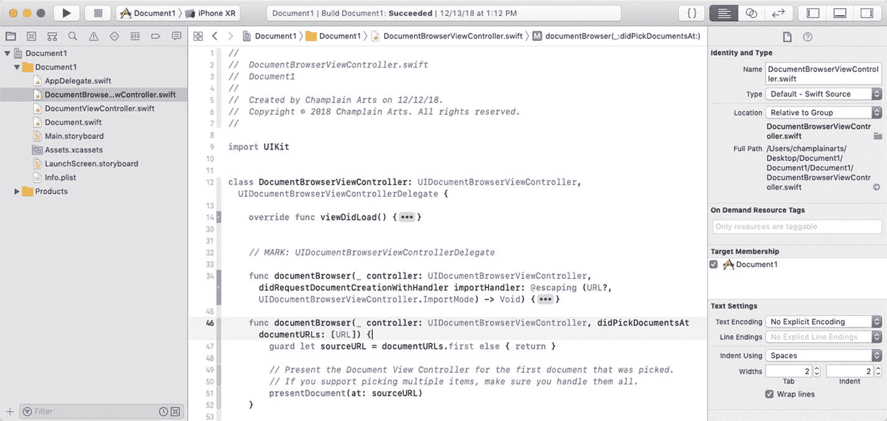

**图 7-11.** 打开现有文档

这里的关键代码行让你能够从多个现有文件中进行选择；你尝试打开列表中的第一个文件，如下所示：

```
guard let sourceURL = documentURLs.first else { return }
```

如图 7-9 所示，你可以在 `DocumentBrowserViewController` 的 `viewDidLoad` 中使用以下代码指定是否可以选择多个文件：

```
allowsPicking Multiple Items = // true 或 false
```

一旦你选取了一个文档，你请求 `DocumentBrowserViewController` 来呈现它，如图 7-12 所示。

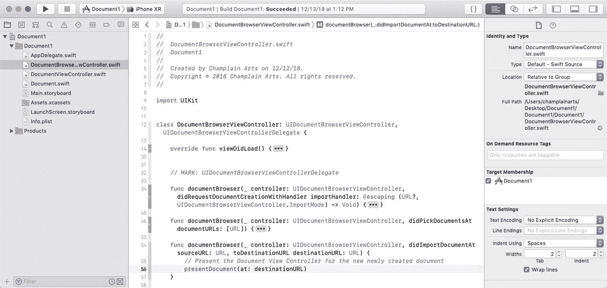

**图 7-12.** 呈现文档

或者你可以使用以下代码：

```
presentDocument (at:destinationURL)
```

典型的代码如清单 7-4 所示。

```
func presentDocument(at documentURL: URL) {
let storyBoard = UIStoryboard(name: "Main", bundle: nil)
let documentViewController =
storyBoard.instantiateViewController(withIdentifier:
"DocumentViewController") as! DocumentViewController
documentViewController.document =
Document(fileURL: documentURL)
present(documentViewController, animated: true,
completion: nil)
}
**清单 7-4** 呈现文档
```

请注意，此代码将文档视图控制器、故事板和一个文档结合在一起。所有这些组件必须匹配（这是调试问题的常见原因）。

代码也如图 7-13 所示。

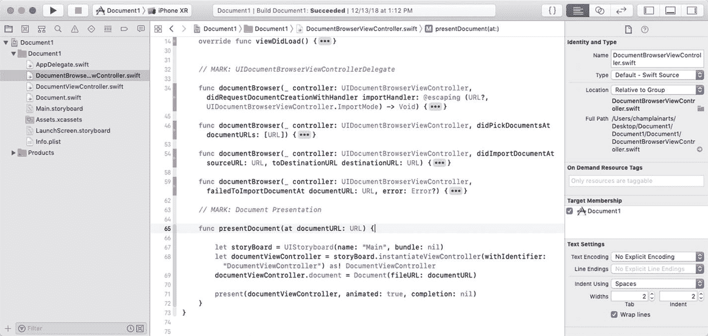

**图 7-13.** 呈现文档

### 处理错误

处理文档浏览器视图控制器的最后一部分是确保正确处理错误；参见图 7-14。

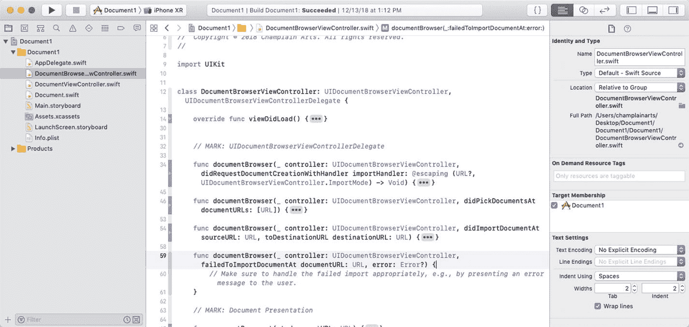

**图 7-14.** 正确处理错误

## 本章小结

本章展示了打开或创建文档所涉及的过程。最重要的收获是，最佳实践不是从头开始创建文档，而是将模板文档放入你的 bundle 中，这样打开和创建文档都可以使用相同的基础代码。

