# 8. 使用共享按钮共享文档

在前面的章节中，你了解了如何在 iOS 和 macOS 上实现文档以保存数据并在你的应用之间共享数据。在本章中，你将看到另一种使用共享按钮共享数据的方式，这样你就可以动态地从一个应用向另一个应用共享数据，而无需使用文档来存储和共享数据。

本章涵盖的主要内容有：

-   使用共享按钮（作为用户）
-   使用共享按钮（作为开发者）
-   管理共享数据

## 使用共享按钮（作为用户）

要共享数据，需要一个应用来共享数据（有时这个过程称为*提供*数据）以及另一个（或多个）应用来接收数据并按接收应用的需求使用数据。请注意，就像文档及其类型的情况一样，发送者和接收者（或提供者和接收者）之间的连接是动态的。两个应用都不需要了解对方。文档类型或共享信息让每个应用能够独立运行，这样你就不需要构建需要大量开发和维护成本的大型多用途应用。

共享是 Cocoa 和 Cocoa Touch 的一部分（从操作系统的原始 NeXTSTEP 和 Rhapsody 版本开始就已经存在了）。为了共享数据，发送者和接收者都需要有一个通用的格式可用。以下是一个基本结构的例子。

## 创建共享示例


### 注意

请记住，你可以将应用添加到模拟器中。邮件可能尚未为你配置。如果你有一台可用于测试的设备，最好使用它。你可以按照第 1 章所述下载 `ShareApp` 来进行测试。请查找第 8 章的版本。

用于共享数据的最简单示例是 Xcode 中的主从项目模板。它是许多示例（甚至是 App Store 中的应用）的基础。这是一个带有两个视图的简单应用。在 iPhone 上，一次只显示一个视图；在较大的设备上，两个视图会共享屏幕。无论你使用哪种设备，你都可以从一个允许你点击 + 来输入当前日期和时间的应用开始，如图 8-1 所示。

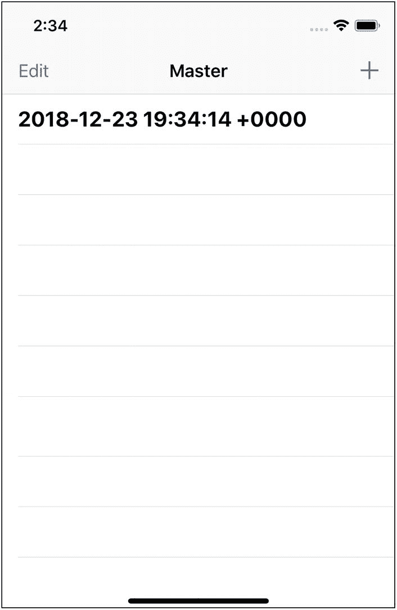

图 8-1. 创建新的时间戳记录

如果你点击在主视图中创建的时间戳，你将看到如图 8-2 所示的详细信息（一个格式更佳的时间戳）。

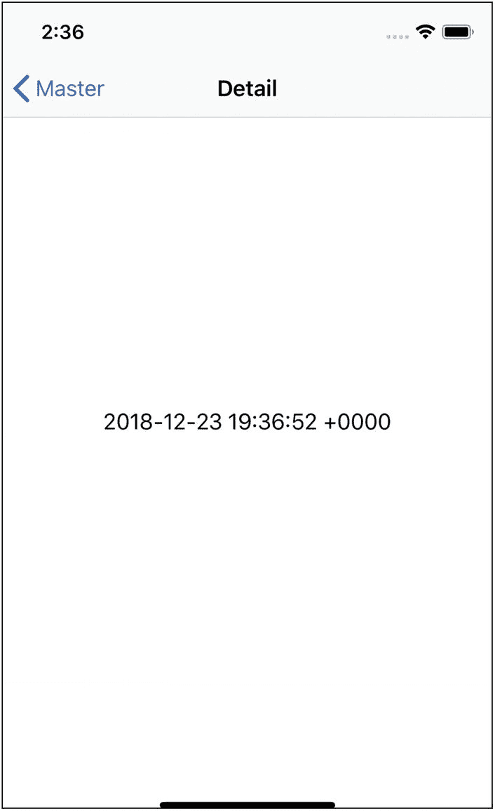

图 8-2. 详情视图

在图 8-3 中，你可以看到一个操作按钮被添加到了导航栏的右侧。（你将在本章中学习如何实现它）。通过该操作按钮，你可以从详情视图共享数据。

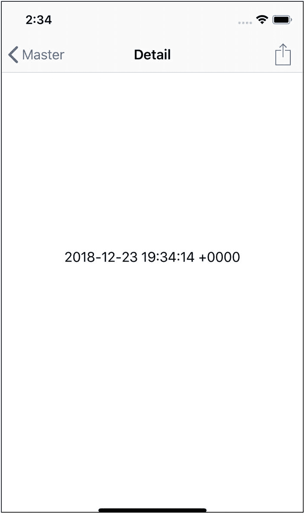

图 8-3. 添加操作按钮以共享数据

此处使用的示例名为 `ShareApp`。从如图 8-4 所示的主从应用模板开始。

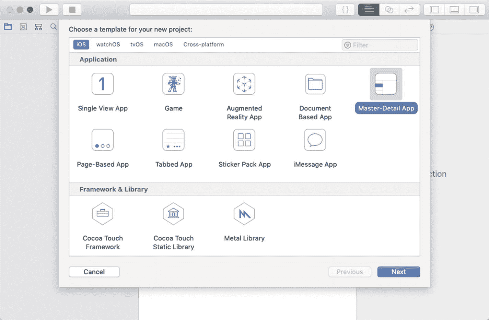

图 8-4. 从主从应用项目模板开始

创建你自己的应用版本，如图 8-5 所示。

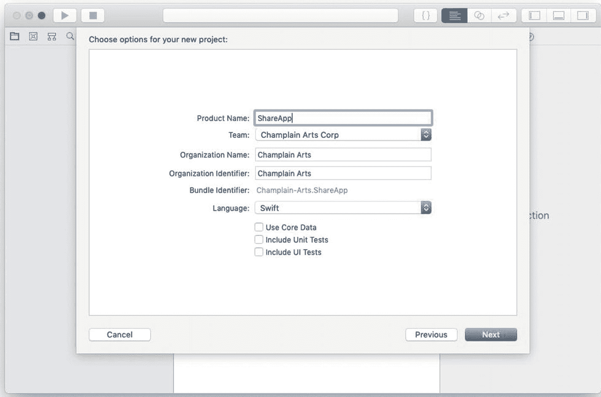

图 8-5. 构建你自己的项目

如图 8-6 所示，此时你无需担心任何设置，因为默认设置即可满足你的需求。

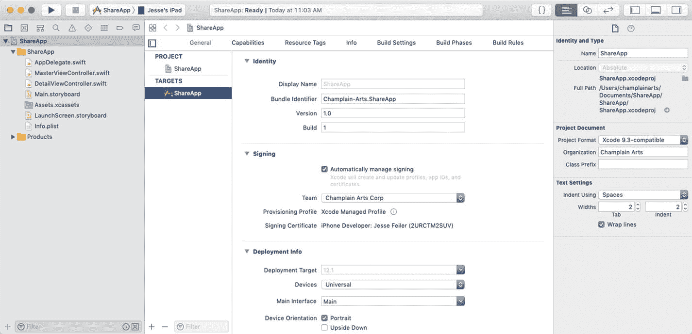

图 8-6. 使用默认的主从应用设置

打开故事板。你将看到如图 8-7 所示的两个主视图。

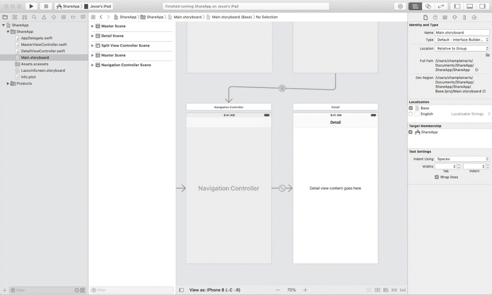

图 8-7. 打开故事板

打开工具面板顶部的对象库以查看库中的对象，如图 8-8 所示。

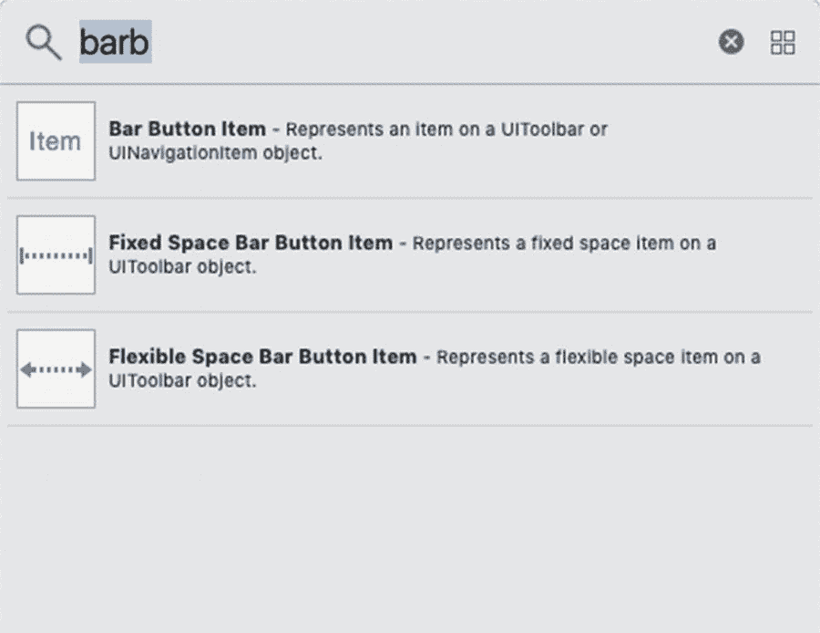

图 8-8. 选择要添加的栏按钮项

将一个栏按钮项拖拽到详情场景顶部栏的右侧，如图 8-9 所示。

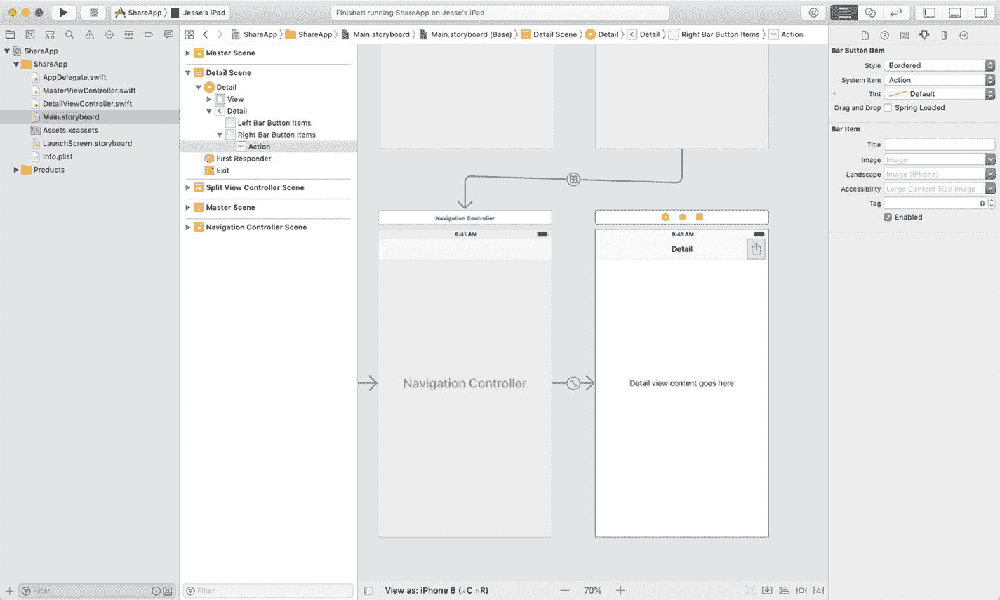

图 8-9. 添加栏按钮项

从属性检查器中，选择“操作”按钮，如图 8-10 所示。

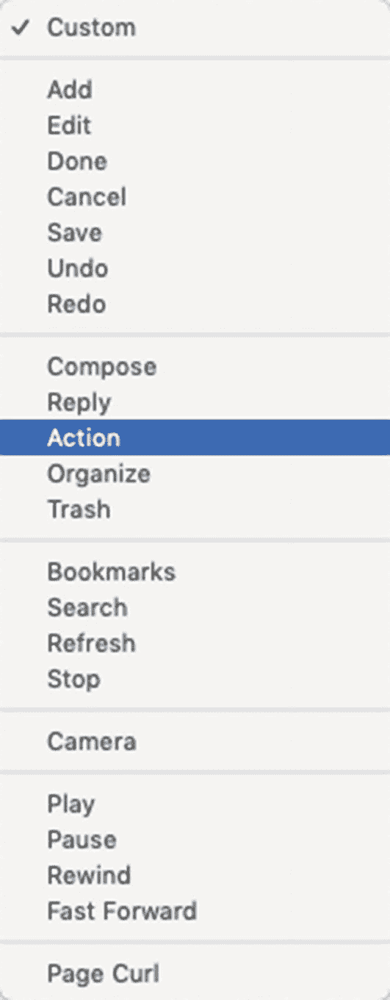

图 8-10. 选择操作按钮

通过使用辅助编辑器打开故事板来实现操作按钮，这样你就可以同时看到故事板和 `DetailViewController`，如图 8-11 所示。从故事板中的操作按钮按住 Control 键拖拽到 `DetailViewController` 中的代码，并将输出口命名为 `actionButton`。

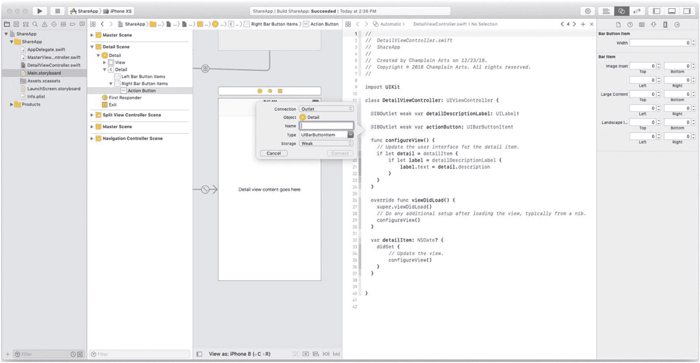

图 8-11. 连接 `actionButton` 的输出口

添加操作的代码，如图 8-12 所示。

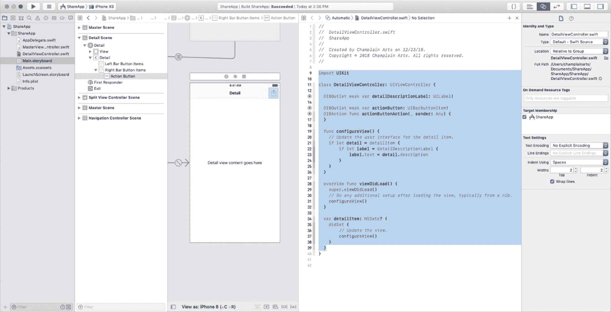

图 8-12. 准备按钮和操作

在 `actionButtonAction` 函数中设置一个断点，并测试你的操作按钮现在是否正常工作。

剩下的工作就是实现共享功能了。

### 共享数据

此处的目标是以其他应用可以识别的格式共享时间戳数据。这是通过实现 `UIActivityViewController` 来完成的，你将在此部分看到具体做法。你呈现的活动视图控制器将反映你可用于共享的数据类型以及该数据的可能接收者。由于这种动态机制，你无法确定应该看到什么，因此本节中的第一个示例将使用一种非常基本的共享类型：活动视图控制器将共享本节中包含的文本。对于大多数用户来说，此文本可以被内置应用（如邮件、备忘录和短信）接收。

你的活动视图控制器将呈现一个可供共享的项目列表。对于此示例，你可以使用清单 8-1 中所示的代码来实现。将此代码添加到 `DetailViewController` 中。

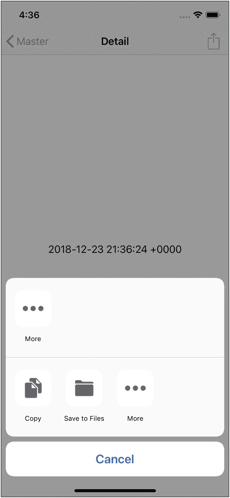

图 8-13. 尝试使用活动视图控制器

```
@IBAction func actionButtonAction(_ sender: Any) {
let sharedItems = "示例文本"
let activityViewController = UIActivityViewController(activityItems:
[textToShare], applicationActivities: nil)
// 相对于此视图定位弹出窗口
activityViewController.popoverPresentationController?.sourceView = self.view
// 呈现视图控制器
self.present(activityViewController, animated: true,
completion: nil)
}
}
清单 8-1
actionButtonAction
```

在此示例中，你需要一个能够处理纯文本的接收者。邮件、备忘录和短信可以做到这一点，但如果你没有安装它们，你的选择将仅限于“保存”或“拷贝”。否则，你将看到一个活动视图控制器，如图 8-14 所示。

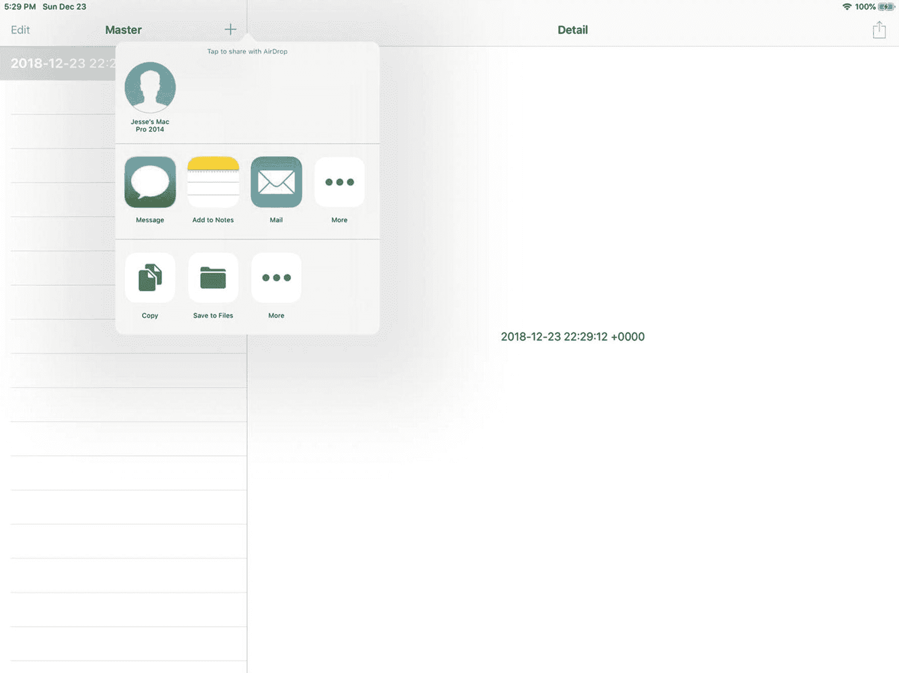

图 8-14. 使用活动视图控制器

如果你已经安装了邮件，你可以发送该文本，如图 8-15 所示。

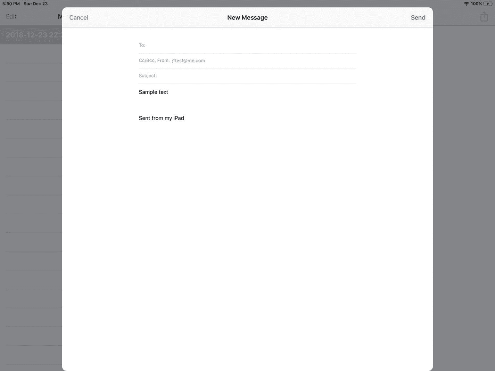

图 8-15. 你可以通过活动视图控制器通过电子邮件发送文本


## 摘要

尝试发送方与接收方的各种组合。传递给活动视图控制器的项目集合是一个类型为 `Any` 的集合。供参考，以下是 `UIActivityViewController` 中 `init` 的声明：

```
init(activityItems: [Any], applicationActivities: [UIActivity]?)
```

你会注意到，你可以将活动指定为可选类型；关于它们的更多信息可在文档中找到。

### 注意

严格来说，偏好设置是某个设置的值，例如绘制新线条时使用的颜色，其中 `lineColor` 偏好的值为蓝色。一旦设置了某个设置的值，该值就会持久化，并在每次应用运行时使用，直到被更改。在这种情况下，偏好设置也可称为默认值。在 iOS 中，内置的“设置”应用让用户可以控制偏好设置和配置。

Cocoa 中的偏好设置存储在 Cocoa 偏好设置系统（也称为用户默认值系统）中。如果你想对这些术语进行严格区分，那么在 iOS 中，内置的“设置”应用为用户控制这些值。在 Cocoa 和 Cocoa Touch 中，用户默认值系统管理一个包含这些值的数据库。有些人区分设置（用户界面的一部分）和用户默认值（Cocoa 框架的一部分）。

本章探讨了当今你可以用于这些数据工具的各种可能性。

## 审视数据结构

处理文档时，你可以控制数据的格式化和管理。你可以使用标准文档类型，该类型可能有关联的类（例如图像），但用于用户默认值、设置和偏好设置的数据则更为有限。具体来说，这些对象必须全部是属性列表元素。属性列表是一种键值结构，其中键是字符串，值是以下任何一种简单数据类型：

- 字符串
- 日期
- 整数
- 浮点数
- 布尔值

属性列表（扩展名为 `.plist`）专为高效的序列化而设计。`PropertyListSerialization` 类会为你处理此过程。属性列表在 Cocoa 中广泛使用；多年来，这段代码经过不断优化和测试，使其可以可靠地用于许多任务。

此外，`NSData` 类型可以存储在属性列表中。如果这样做，你必须处理该数据与你想要处理的对象之间的序列化和反序列化。一个非常常见的例子是将 `NSData` 类型转换为某种二进制格式，然后可以将其解释为图像或其他复杂的数据结构。

属性列表还可以包含数组和字典。这意味着你可以使用一个属性列表，该列表本身是一个包含字典的数组，而该字典又声明了另一个数组以及数字和其他简单对象。

在考虑用户默认值、设置和偏好设置时，需要牢记的另一个限制是，苹果公司的指导建议是，这些工具应仅用于有限的目的和相对少量的数据。

在考虑以这种方式存储数据时，不必过于担心可以存储多少数据作为用户默认值、设置或偏好设置，因为这并非真正的限制因素。如果你以这种方式用尽设备几乎所有的存储空间，远在你用尽空间之前，性能就会下降。

属性列表作为 `PropertyListSerialization` 类的实例存储。作为该类的实例，属性列表在读取或写入时会被完整地读取或写入。这可能意味着，为了访问一个单一的布尔值，你可能需要读取或写入一个包含几十、几百甚至上千个项目的完整属性列表。你可以通过将属性列表值存储在数组或字典中来集中读取或写入，但这并不能真正帮上什么大忙。你需要读取整个属性列表才能获取到数组或字典，然后才能精确定位到你想要的值。

存储为默认值、偏好设置和设置的数据可以是任何你想要存储的内容（前提是它是一个属性列表，并且不占用太多空间）。这些术语之间存在差异，这正是理解它们的一个很好起点。

### 提示

当你考虑使用这些工具存储自己的数据时，请记住，“设置”应用和用户默认值系统会管理这些数据。如果你希望完全控制数据、数据的存储方式以及数据的用户界面，你可能需要使用数据库或文档，由你自行控制这些特性。

## 理解用户默认值

用户默认值是应用某个方面的起始值（默认值）。例如，一个允许你存储班级中学生姓名的应用，可能会首先将学生标识为“学生 1”、“学生 2”，以此类推。用户添加的新学生可能被称为“新学生”。

在这样一个应用中，你可能希望让用户设置他们自己的默认值，例如：

- “学生”是应用中每个项目的名称，新项目被标记为“新学生”。
- 你可以将项目的默认值更改为“项目”，这样在应用运行时，你会看到“椅子”和“新椅子”。
- 稍微复杂一点的默认值可能允许用户在“新”和数字之间做选择，以标识新项目，例如“新椅子”或“椅子 3”。

像这样的默认值通常会对用户公开，以便他们可以选择。

### 提示

在这种情况下，空字符串可能是默认值。

## 探索设置

有一个用户默认值数据库，为每个应用存储类似这样的设置。设置值在应用的每次使用之间持久化。此外，用户可以直接使用内置工具更改设置，本章稍后会展示这一点。

## 添加设置束

要在 iOS 应用中实现“设置”功能，你需要做的是添加一个包含设置束的新文件。你可以在你的应用中使用“新建 ➤ 文件”来完成此操作，如图 9-4 所示。

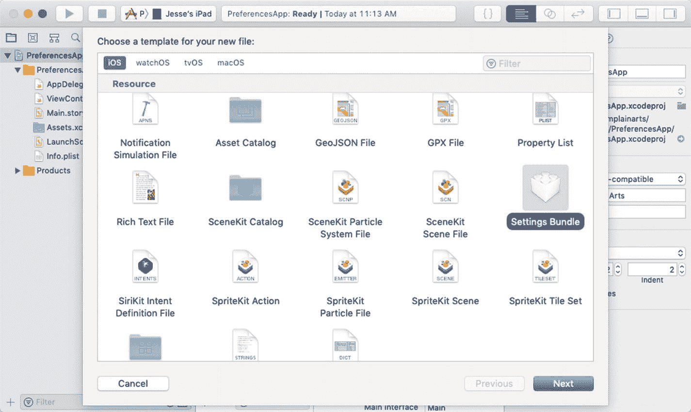

图 9-4. 向应用添加设置束


### 提示

向应用中添加设置包时，请务必选择正确的文件。其他设置包包括 WatchKit 设置包，并且未来很可能还会出现其他类型的设置包。

务必将新文件添加到应用中正确的目标（target）中，如图 9-5 所示。（将其放置在哪个组中对于组织文件很重要，但目标（target）设置是绝对必要的。）

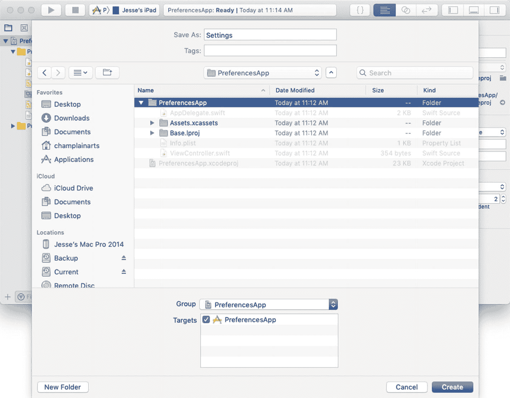

**图 9-5.** 将新设置包放置在正确的目标中

添加设置包后，您将在项目导航器中看到它，如图 9-6 所示。

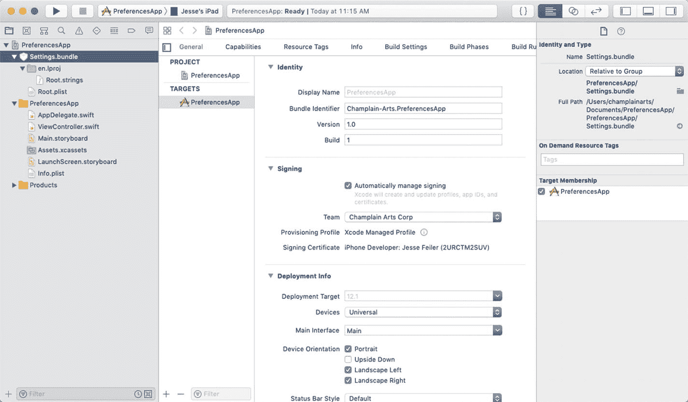

**图 9-6.** 确认设置包已添加到项目导航器

请注意，该包内包含一个组（`en.lproj`），其中包含针对包根目录的一些本地化字符串，以及一个根字符串的属性列表。您可以原样使用它们。默认值如图 9-7 所示。

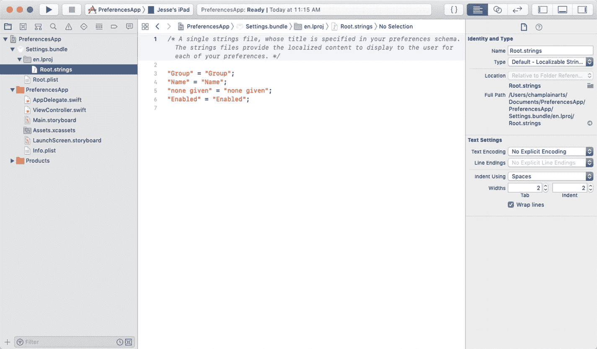

**图 9-7.** 您可以原样使用默认设置字符串

将设置包添加到应用后，您可以通过内置的“设置”应用进行尝试。在模拟器中运行应用并找到“设置”，如图 9-8 所示。

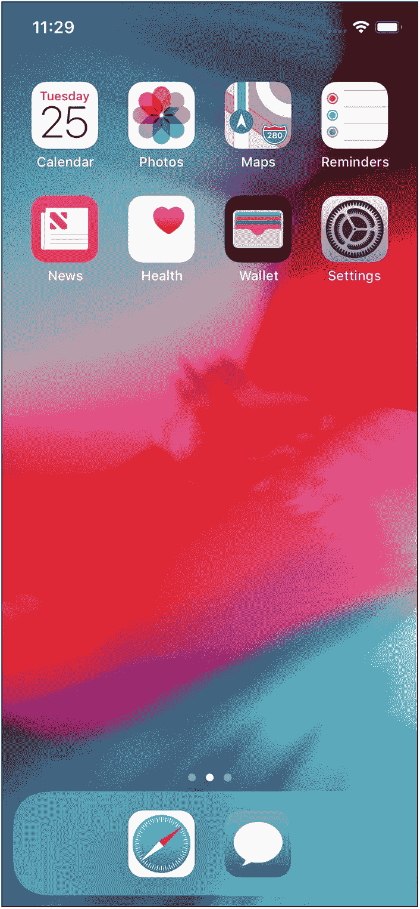

**图 9-8.** 在 iOS 中使用“设置”

向下滚动找到“PreferencesApp”，如图 9-9 所示。

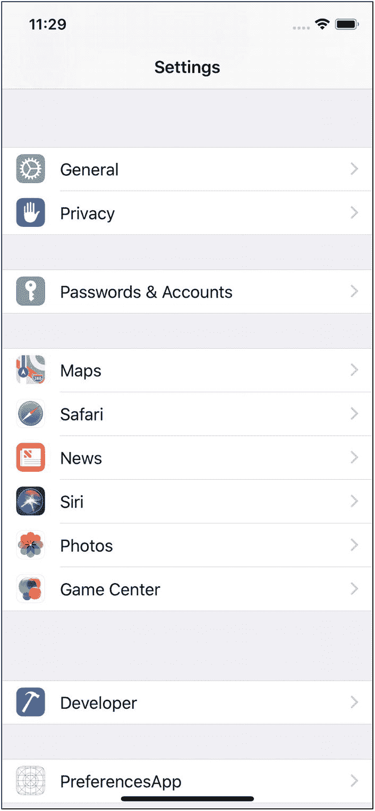

**图 9-9.** 在“设置”中点击“PreferencesApp”

打开设置包中的`Root.plist`。您将看到如图 9-10 所示的默认设置。

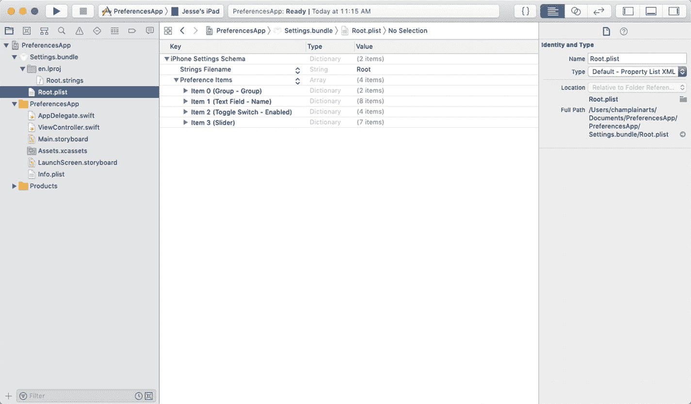

**图 9-10.** 初始设置

打开“文本字段”项以查看其值。将“默认值”的值更改为“Student”，如图 9-11 所示。

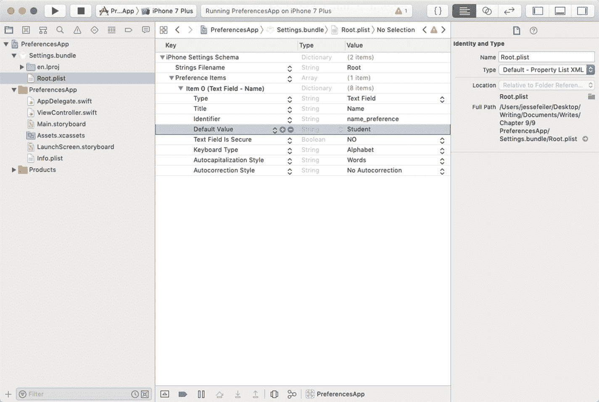

**图 9-11.** 将“默认值”更改为“Student”

您可以利用自动大写样式，如图 9-12 所示。这意味着输入的文本中的单词将首字母大写。尝试其他“设置”命令，您会发现其中内置了许多功能，无需您自己编写代码。

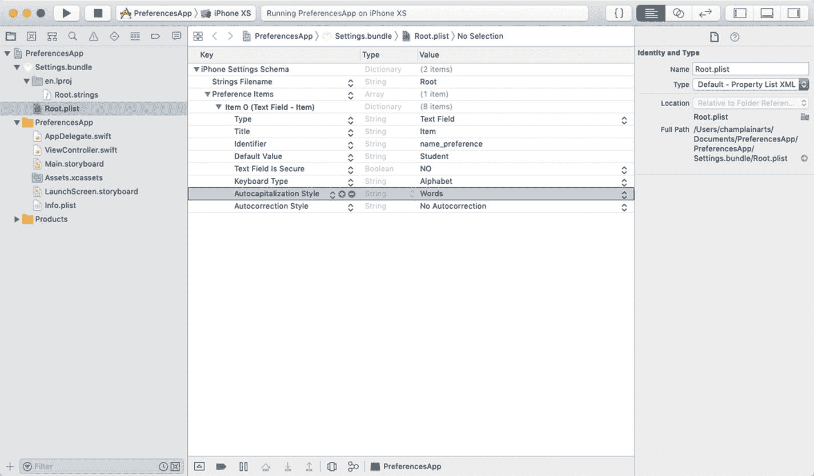

**图 9-12.** 调整您应用的设置

最后，在模拟器中测试“设置”，如图 9-13 所示。（您会注意到，应用中“设置”的某些项是由 iOS 自动添加的。“Siri 与搜索”设置就是一个例子。）

### 从代码访问设置包

当用户调整“设置”时，这仅仅是个开始。您需要能够在应用中访问这些设置值。本节将展示如何基于“设置”实现这一点，如图 9-13 所示。

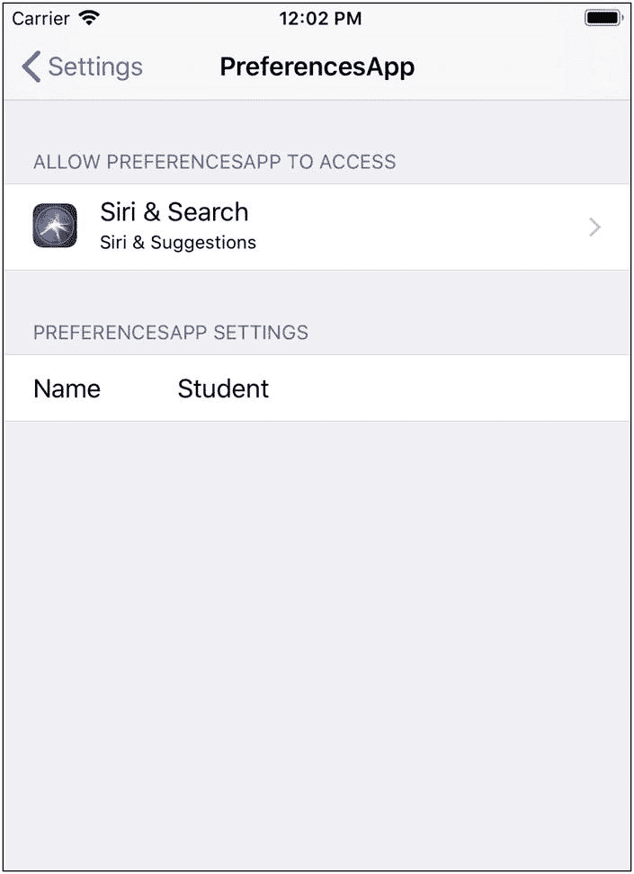

**图 9-13.** 测试设置

首先请记住，iOS 中的“设置”访问的是 Cocoa 内置的默认数据库。该数据库由`UserDefaults`类对象（不是实例，是类本身）管理。`UserDefaults`（类对象）有一个函数，可以通过`standard`属性返回共享的默认对象。如前所述，`UserDefaults`中的每个项都有一个键，您可以使用如下代码进行访问：

```
return UserDefaults.standard.bool (forKey: "name_preference")
```

这个键是属性列表中的标识符键。如图 9-14 所示，当您开始输入访问某个键的代码时，系统会自动补全。

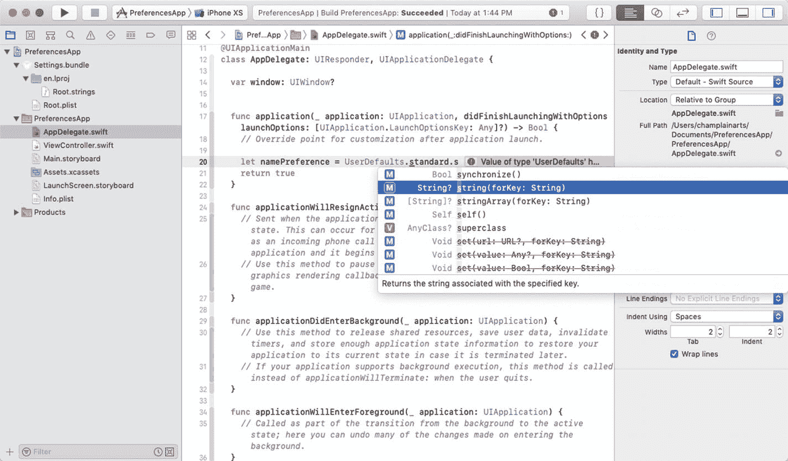

**图 9-14.** 使用标识符键访问用户默认属性

您可以通过在`appDelegate application(:didFinishLaunchingWithptions:)`中添加代码来测试这一点，如图 9-15 所示。

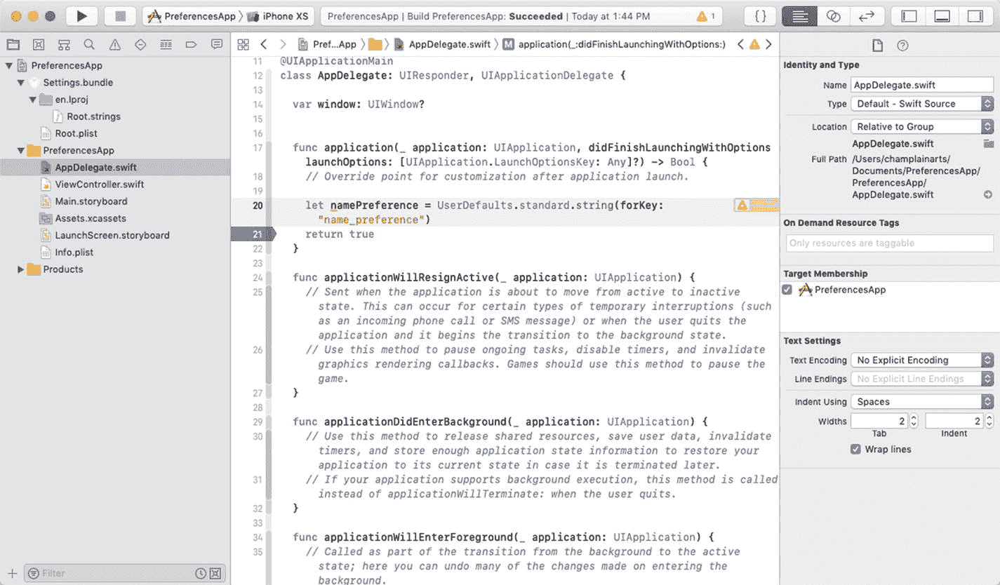

**图 9-15.** 在用户默认“设置”应用中访问属性

### 添加设置界面

图 9-15 所示的代码仅在应用启动时执行。您可以构建自己的界面，以便在任何时候显示用户默认属性。在主故事板的视图控制器中，添加一个按钮，如图 9-16 所示。（如果您使用的是本章所示的“单视图应用”项目模板，则要使用的视图控制器名为`ViewController`。）

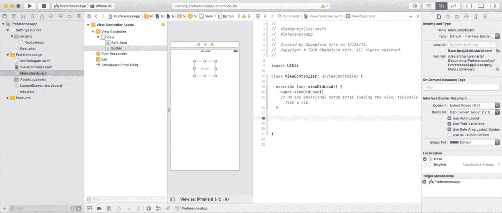

**图 9-16.** 向视图控制器添加按钮

记得将按钮连接到应用中的操作，如图 9-17 所示。

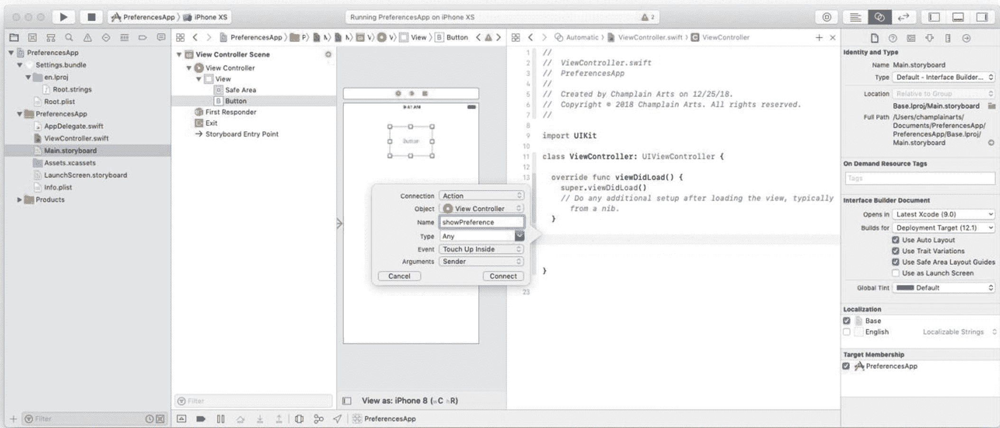

**图 9-17.** 将按钮连接到操作

在操作中添加断点，以便检查用户默认属性的值，如图 9-18 所示。

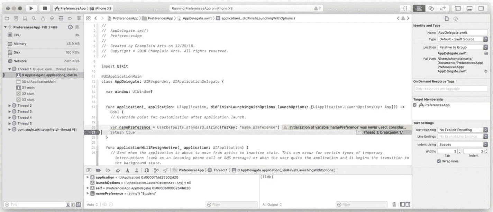

**图 9-18.** 使用断点检查值

## 总结

本章展示了如何使用内置的用户默认偏好设置和/或“设置”应用来存储应用的值。这些值必须能够存储在属性列表中，且不应是大型数据对象，但除了构建大规模数据管理器之外，您可以将它们用于多种目的。

