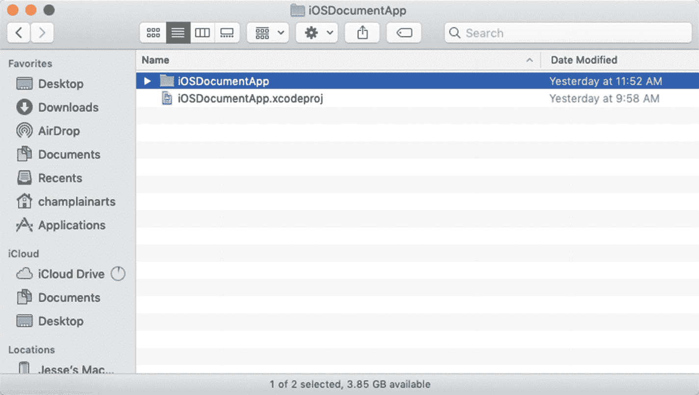
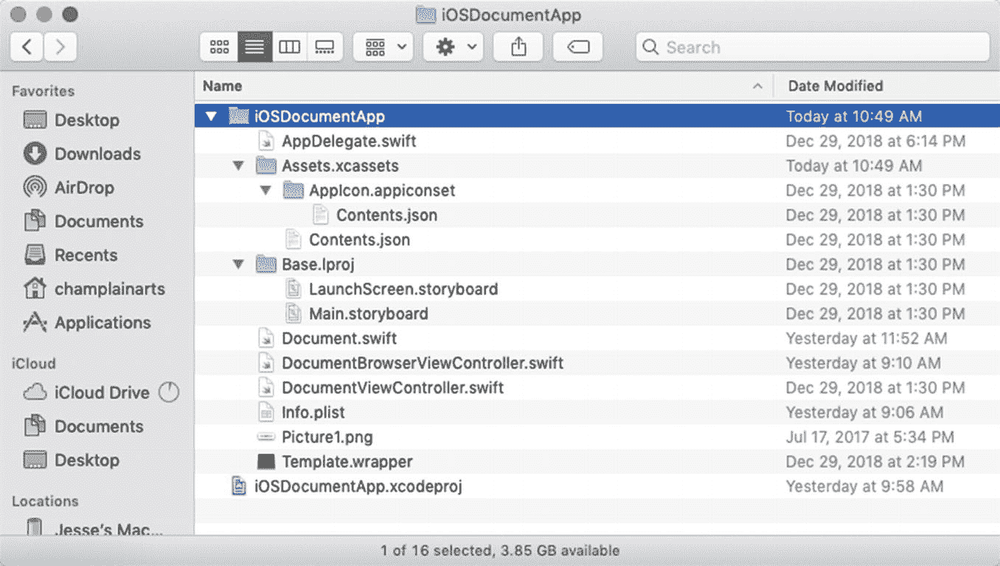
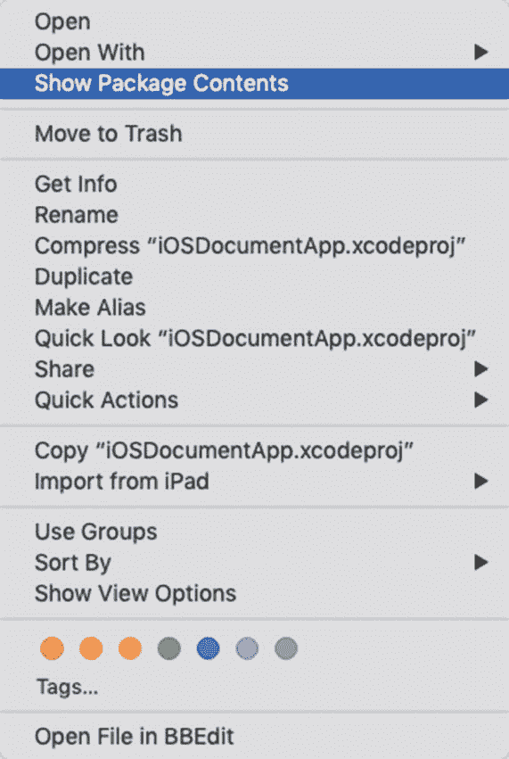
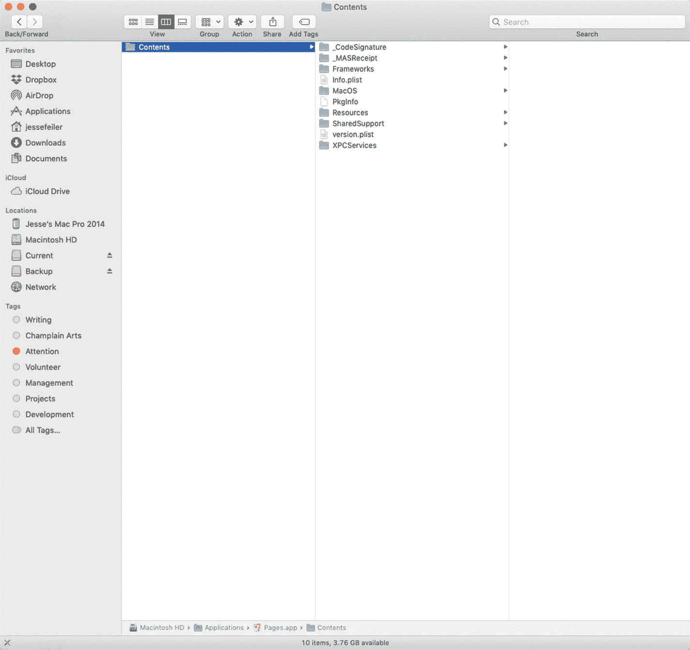
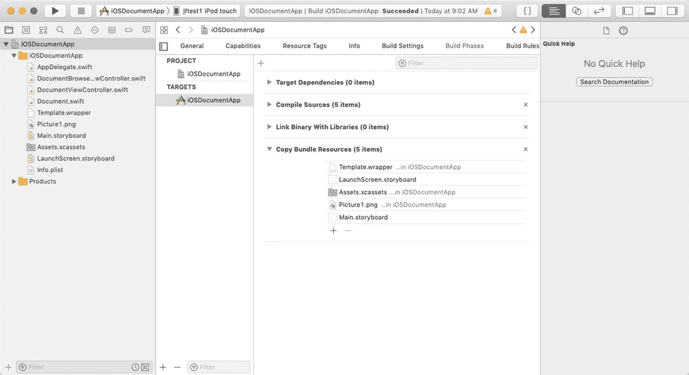
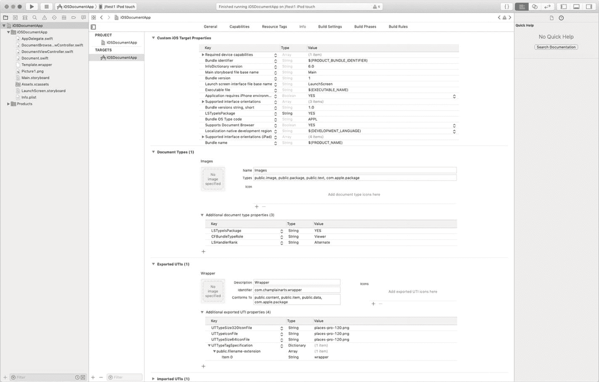

# 10. 使用文件封装和包

本节让您了解除文档之外的数据存储工具。与文档一样，它们都是持久化应用数据的方式，并且所有这些工具（包括文档）在 Cocoa 和 Cocoa Touch 上都受支持。许多工具（包括本书这一部分提到的）在 Cocoa 及其前身中都有着悠久的历史。如前所述，文档随着时间的推移不断发展，并且在许多方面发生了变化。本节中的工具当然也随着时间的推移发生了变化，但其基本结构却出奇地稳定，因此它们既用于许多遗留应用，也用于当今正在开发的应用。本章中的所有工具都允许您将文件组合成多文件结构，这些结构既可以作为单个结构，也可以作为其组成部分进行操控。


## 使用包

自麦金塔电脑早期起，多文件包就被用于管理文件。在最初的麦金塔文件系统中，文件包含两个称为分支的部分。几乎所有文件都有一个`data fork`（数据分支），许多文件还有一个`resource fork`（资源分支）。用户可见的文件主要是数据分支，而资源分支包含数据分支所使用的元素。这些元素通常是警告、图标以及其他可识别或可见的元素。资源分支中的每种元素都有一个名称，通常是四个字符的代码，例如 `ALRT`（表示警告）、`DLOG`（表示对话框）或 `ICON`。在容器中使用可识别且结构化的元素这一理念，至今仍是 Cocoa 的关键组成部分。

资源分支的缺点在于，当您将文件复制到其他平台时，资源分支通常会消失；数据分支包含数据，因此在大多数情况下这并非灾难。如今，Cocoa（以及 Cocoa Touch）采用了一种更复杂的方式，将数据封装成一个看似单一的文件。这些被称为包。

### 注意

Swift 包是用于组装代码和管理依赖项的清单。一个常用的工具是 CocoaPods（[`CocoaPods.org`](http://cocoapods.org)）。

您仍然可以随处见到包，尤其是在开发者工具中。当您在 Xcode 中创建项目时，通常会创建一个包含两个项目的文件夹，如图 10-1 所示。



图 10-1

一个 Xcode 项目包含一个文件和一个文件夹

在图 10-1 所示的示例中，项目名称为 `iOSDocumentApp`。项目本身位于一个 `xcodeproj` 文件中，该文件包含对 `iOSDocumentApp` 文件夹的引用。打开的文件夹如图 10-2 所示。请注意，该文件夹内包含单独的文件，以及包含更多文件和文件夹的子文件夹。



图 10-2

项目文件夹包含子文件夹和文件

如果您在 Finder 中按住 Control 键并点击某个文件或文件夹，您将看到该文件或文件夹作为包的内容。如图 10-3 所示。



图 10-3

使用 Control 键查看文件包内部

请注意，并非所有文件或文件夹都是包，因此 Control 键无法打开它们。然而，重要的是要了解您的 Xcode 项目是一个文件包。如果您将文件夹移开，使其与引用它的 `xcodeproj` 文件分离，将会破坏项目包。

在文件包内部，内容通常按结构组织，包含一个 `Contents` 文件夹，其中包含子文件夹，如图 10-4 所示。大多数应用程序都有一个 `Contents` 文件夹。



图 10-4

文件和文件夹可以在包内结构化组织

## 关于 Bundle

如果您查看 Xcode 应用程序中的构建阶段，会看到一个将文件移入应用程序 bundle 的步骤，如图 10-5 所示。



图 10-5

应用程序包含 bundle

当您在项目导航器中向应用程序添加文件时，它们通常会自动添加到“构建阶段”步骤中，以便在应用程序 bundle 中找到它们，并且您可以在代码中从那里检索它们。默认情况下，您的应用程序有一个包含已知内容的主 bundle（`bundle.main`）。您可以在 [`developer.apple.com`](http://developer.apple.com) 上搜索 `bundle` 找到其 API。

## 使用文件封装器

文件封装器与包有些相似，因为它们可以在单个对象中包含文件和文件夹。一个文件封装器通常至少包含一个文件，但也可以是空的。文件封装器最常用于作为文档中文件和文件夹的容器，而该文档本身就是一个文件封装器。图 10-6 展示了一个文件封装器文档。



图 10-6

声明一个文件封装器文档

请注意，您需要将 `LSTypeIsPackage` 属性设置为 YES，以便文档在用户看来是一个单一对象。文件类型应符合 `com.apple.package`。

您可以按照第 1 章所述下载 `WrapperPlaygroundDemo`，了解如何组装一个文件封装器文档。该过程将在下一节中描述。代码如代码清单 10-1 所示。

该过程很简单：

- 整理好将要被封装的各个文件。
- 将每个文件转换为 `Data` 类型（以前是 `NSData`）。Swift 中有实用方法可以轻松做到这一点。
- 将每个文件封装在一个封装器中。
- 在文档中创建一个根封装器。
- 将每个封装好的文件添加到根封装器中。

您可以按任意顺序执行这些步骤，并且有一些函数可以让您动态地添加和移除它们。文件封装器的一个常见用途是将多个相关文件（如媒体和文本）封装在一起。如果它们被封装在一个文件封装器中，您可以使用 `contents(forType:)` 和 `load(fromContents:ofType:)` 方法，就像处理由任何数据类型（如存档、单张图片或文本）组成的文档一样。

根文件封装器中的文件没有特定的顺序。出于效率考虑，最重要的一点是每个文件封装器是单独加载的，因此，如果单个对象中包含大量文件，您可以按需加载它们（Swift 和 Cocoa 会为您处理这一点）。

代码清单 10-1 展示了将名为 `testString` 和 `testImage` 的文件组装成一个文件封装器的代码；它们各自被封装在一个独立的封装器中（名称分别为 `stringDataWrapper` 和 `imageDataWrapper`）。此外，还有一个 `rootDirectoryWrapper`。如代码清单 10-1 末尾的代码注释所述，您可以使用 `contents(forType:)` 或 `load(fromContents:ofType:)` 来读取或写入被封装的这些文件。

```
import UIKit
import PlaygroundSupport
let testString = "Now is the time"
let testImage = UIImage(named:"mantegna.jpg")
// 转换为 Data
let imageData = testImage!.pngData()
let stringData = testString.data (using: .utf8)
// 构建目录封装器
let rootDirectoryWrapper = FileWrapper(directoryWithFileWrappers: [:])
// 封装字符串
let stringDataWrapper = FileWrapper(regularFileWithContents: stringData!)
stringDataWrapper.preferredFilename = "StringWrapper"
rootDirectoryWrapper.addFileWrapper(stringDataWrapper)
// 封装图片
let imageDataWrapper = FileWrapper(regularFileWithContents: imageData!)
imageDataWrapper.preferredFilename = "ImageWrapper"
rootDirectoryWrapper.addFileWrapper(imageDataWrapper)
print ("封装器", rootDirectoryWrapper)
print (rootDirectoryWrapper.fileWrappers)
for eachWrapper in rootDirectoryWrapper.fileWrappers! {
print (eachWrapper)
}
// 用于写入：如果在 contents(forType:) 中使用，则返回 rootDirectoryWrapper
// 用于读取：使用 load(fromContents:ofType:)
代码清单 10-1
在 Playground 中组装文件封装器文档
```


## 摘要

本章展示了如何将文件打包成捆绑包或文件封装器。使用文件封装器的优势在于，当管理根文件封装器时，只需更新必要的文件封装器。根据具体需求，能够灵活选择单独或统一处理文件，这是从封装器和捆绑包中需要掌握的核心思想。

