# 11. 使用文件归档

在第 7 章中，你学习了读取和写入文档数据的基础知识。其中一种常见做法是将你自己的数据从其结构和格式转换为`NSData`对象（现已变为`Data`对象），然后通过一条简单的语句进行读取或写入。唯一需要注意的是，你需要自行完成从数据类型到`Data`的转换。最简单且最常用的技术之一是使用 Cocoa 内置的归档技术。

### 注意

归档正在逐渐被`Codable`取代，但这一过渡仍在进行中。较旧的代码通常仍使用本章所述的归档方法。你可以在 [`https://developer.apple.com/documentation/foundation/archives_and_serialization`](https://developer.apple.com/documentation/foundation/archives_and_serialization) 找到 Apple 关于这两种技术的文档。此外，最新版本的 Swift 中`NSData`已变为`Data`。

本章概述了归档技术。示例展示了归档的常见用途：获取一些数据，将其归档为`Data`，然后（希望）解归档回原始值。这是一个非常有用的过程，许多开发者会在应用中保留这种代码，但将其注释掉，以便在调试时只需启用代码即可进行监控。

## 使用 Swift 统一日志系统

本章中的归档和调试代码使用 iOS 10、macOS 10、tvOS 10 和 watch OS 3（以及这些产品的后续版本）中提供的 Swift 统一日志系统实现。统一日志是一种现代化且高效的工具，取代了 Apple 系统日志 (ASL) 等旧工具。在编写新代码时，可以逐步迁移到统一日志，开发者目前也正在这样做。本节作为入门，快速介绍统一日志。更多信息，请访问 Apple 文档：[`https://developer.apple.com/documentation/os/logging`](https://developer.apple.com/documentation/os/logging)。

统一日志的核心是一个包含日志信息的数据类型（它取代了先前通过向函数传递参数来实现的日志记录方式）。如果你使用统一日志，你可以为日志记录构建自己的结构。第 11 章中的 ShareApp 示例（可按第 1 章所述下载）使用了一种常见版本。它是一个用清单 11-1 所示的代码定义的`struct`。

```
// 使用新的 Swift 统一日志系统
import os.log
struct Log {
static var general = OSLog(subsystem: "com.myapp.my_target",
category: "info")
}
清单 11-1
常用的日志结构
```

此代码如图 11-1 所示。

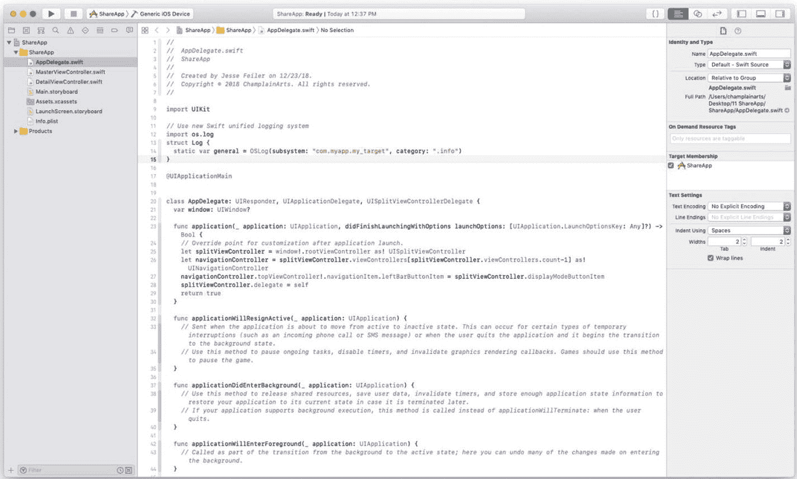

图 11-1. 导入`os.log`并定义`struct`

在该示例中，这段代码被放置在`AppDelegate.swift`文件的顶部。你可以在应用中需要的地方使用此代码，本节将会展示。最小版本的调用如下所示：

```
os_log("Row selected-%@",
indexPath.debugDescription)
```

除了这里展示的基本用法外，其他可记录的信息请参考前面提到的文档。执行此代码后，控制台将显示如下内容：

```
2018-12-26 14:51:09.777111-0500 ShareApp[6228:697878]
Row selected-[0, 0]
```

这会触发对`OSLog`的调用。除了此处显示的参数外，你还可以添加其他参数，例如`print`语句的标准格式化字符串，如

```
("Row selected-%@",
```

以及一个根据该命令动态生成并格式化的字符串。

你将在本章稍后部分看到其实际应用。

## 使用日志和断点归档数据

如果你使用归档来对`contents(forType:)`和`load(fromContents:, ofType:)`函数进行编码和解码数据，那么在断点处测试该代码会很有用。测试完成后，你便可以在实际函数中使用归档。

回到 ShareApp，你可以在主视图控制器中拦截对生成的时间戳的点击，并尝试对其进行编码。图 11-2 提醒你，主视图控制器中可以通过 + 按钮添加新的时间戳项。

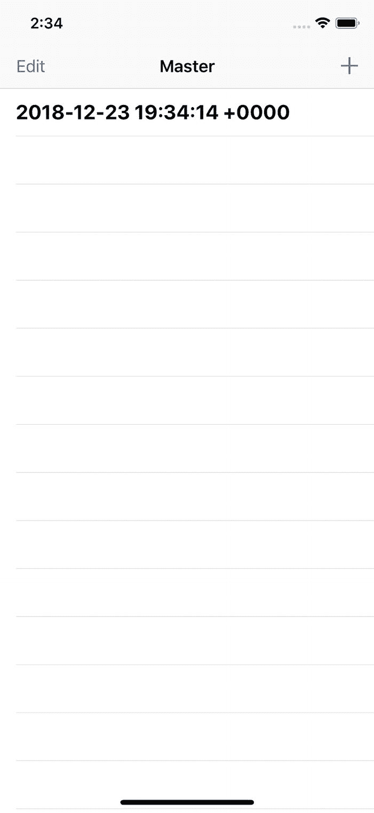

图 11-2. 使用 + 添加新时间戳

如前所述，以主从视图控制器作为许多应用的起点是很常见的。在主从模型中，你可以在主控制器或从控制器层面添加功能。用户习惯了这种界面，因此不要添加不熟悉的变体是合理的。如果你在主视图控制器上添加一个“分享”按钮，如图 11-3 所示，用户会期望能够分享主视图控制器的全部内容，即所有数据。

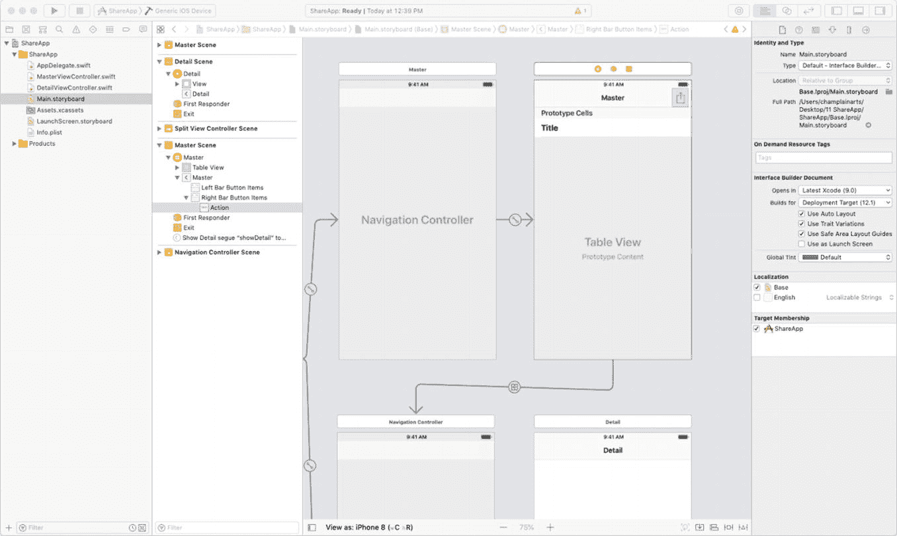

图 11-3. 分享主视图控制器数据

但是，如果你只想分享单个项目该怎么办？可以采用两种方法。一种方法是在从视图控制器上放置一个“分享”按钮，如图 11-4 所示。

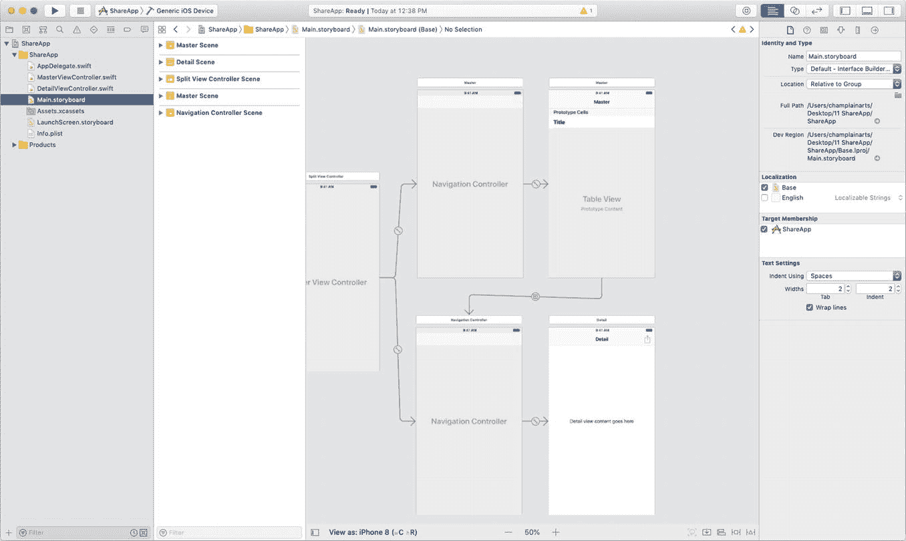

图 11-4. 从从视图控制器分享

使用主从模型时，你必须记住，是主控制器负责管理从控制器。这意味着，选择某个从控制器的控制权应属于主视图控制器，因为将由它来管理从控制器的选择。

如果由主控制器来处理选择，那么“分享”按钮应该放在哪里，才能避免与选择所有数据的“分享”按钮混淆？最常见的解决方案是直接点击或单击主视图控制器中从控制器的某一行来管理选择。这是一种高效的方法（并且利用了一个有用的函数）。

允许你从主视图控制器中选择单个从控制器项的函数是`UITableViewDelegate`协议中的`tableView(_:didSelectRowAt:)`方法。

图 11-5 展示了如何通过添加日志消息来重写该函数（日志消息在清单 11-1 的基础上增加了`log`和`type`变量）。

该代码会在控制台显示一条消息，标识出哪个从控制器项已被选中，如图 11-5 所示。

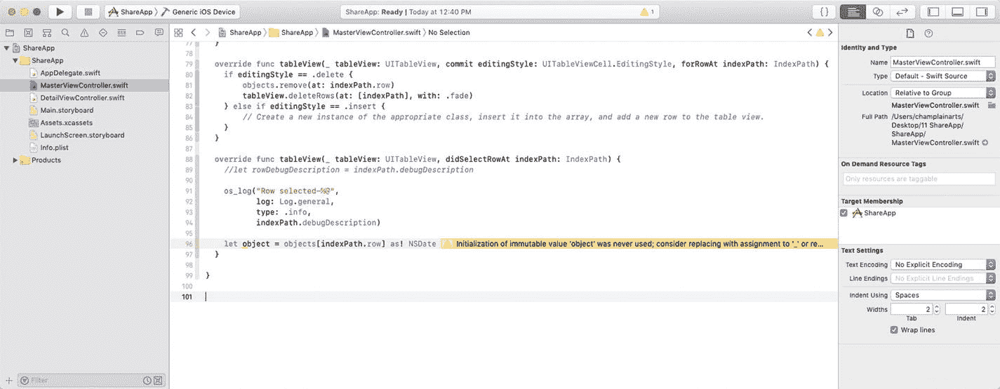

图 11-5. 记录从控制器项的选择


### 选择要归档的项目

要开始归档，请先创建一个断点，以便访问所选项目。在 `tableView(_:didSelectRowAt:)` 函数中执行此操作，如代码清单 11-2 所示。

```
override func tableView(_ tableView: UITableView,
didSelectRowAt indexPath: IndexPath) {
//let rowDebugDescription = indexPath.debugDescription
os_log("Row selected-%@",
type: .info,
indexPath.debugDescription)
// set a breakpoint here
let object = objects[indexPath.row] as! NSDate
}
代码清单 11-2
展示所选对象
```

图 11-6 展示了本次测试中的模拟器及其数据。

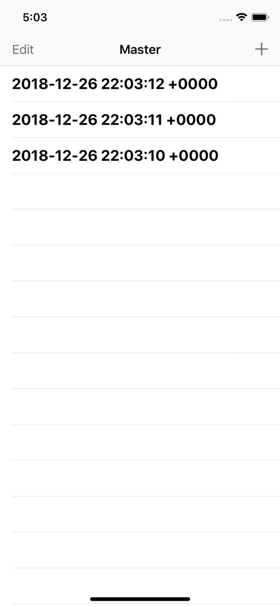

图 11-6. 用于测试的模拟器数据

当在模拟器中选中项目时，断点会被触发，如图 11-7 所示。

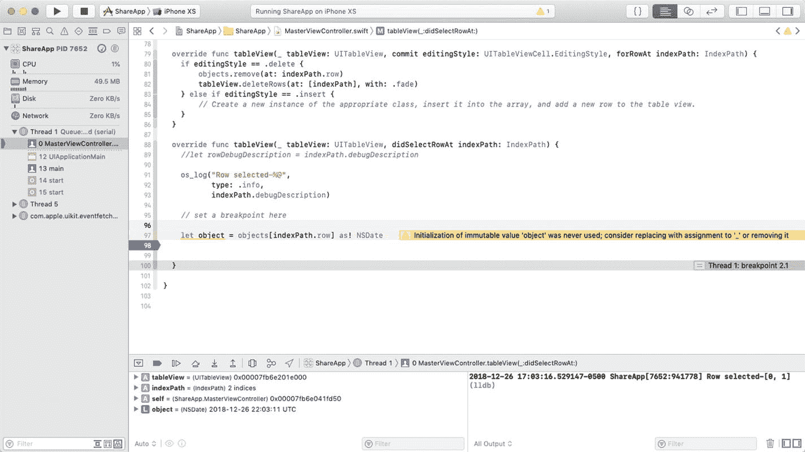

图 11-7. 确保你选中了正确的详情对象

此实验要求你正确捕获详情项目，因此请务必确认已成功捕获。（在此示例中，请确保已创建至少两个详情项目，以便使用时间戳区分它们。）

### 创建要归档的对象

`ShareApp` 在主视图控制器中创建新对象，然后由控制器显示。这些对象是带有当前时间戳的 `NSDate` 对象。当你开始考虑归档对象时，可以继续使用这些 `NSDate` 对象，但在实际应用中，你可能会使用自定义对象进行归档。为此，可以在这里创建一个新对象 (`ShareableObject`)，用于归档测试。`SharableObject` 实际上将封装一个 `NSDate` 对象，因此对应用的改动相对较少。（不仅改动较少，而且如果将此应用作为其他项目的基础，你还需要为每个项目重复这些修改。）

第一步是创建新的 `SharableObject` 类，它封装一个可称为 `sharableDate` 的 `NSDate` 对象。像往常一样，在 Xcode 中使用 File ➤ New ➤ File 创建新类，为 iOS 创建一个新的 Cocoa Touch 类，如图 11-8 所示。

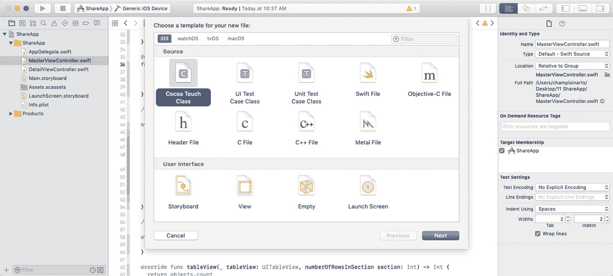

图 11-8. 为 `ShareableObject` 创建新类

将新类命名为 `SharableObject`，如图 11-9 所示。

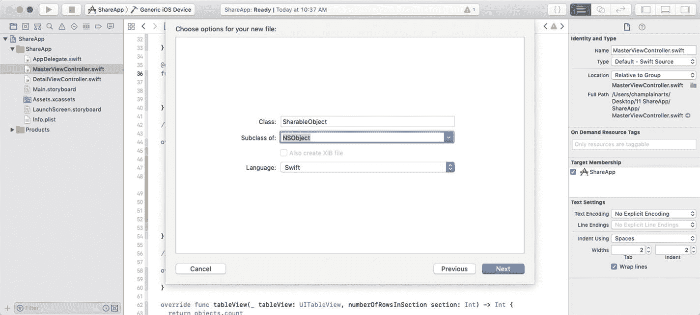

图 11-9. 该类需要是 `NSObject` 的子类

与往常一样，当向项目添加新类时，请确保它位于正确的目标中，如图 11-10 所示。

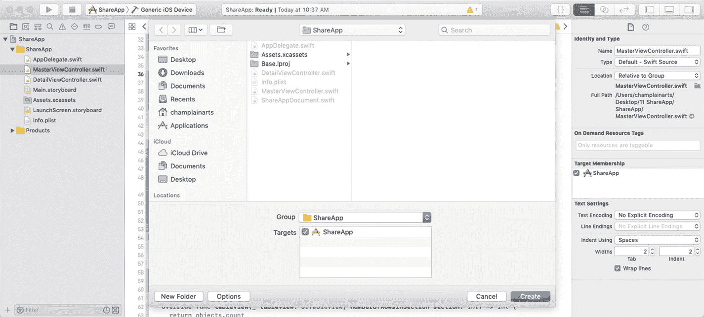

图 11-10. 将新类添加到目标中

向 `SharableObject` 添加 `sharableDate` 属性，如图 11-11 所示。

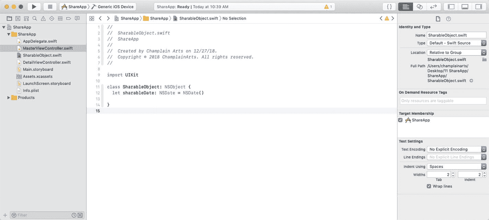

图 11-11. 创建类

做一些修改，使得在向应用添加对象时，不再创建新的 `NSDate`，而是创建一个新的 `ShareableObject`。类似地，更新界面以显示 `ShareableObject` 内部的日期。这些是常见的修改，将在下一节中快速展示。

在 `MasterViewController` 中，`insertNewObject` 将需要插入一个新的 `ShareableObject`。代码清单 11-3 展示了更新后的函数。

```
@objc
func insertNewObject(_ sender: Any) {
//objects.insert(NSDate(), at: 0)
objects.insert(SharableObject(), at: 0)
let indexPath = IndexPath(row: 0, section: 0)
tableView.insertRows(at: [indexPath], with: .automatic)
}
代码清单 11-3
插入新的 ShareableObject
```

按代码清单 11-4 所示修改 `MasterViewController`，以显示 `sharableDate` 对象的描述。

```
override func tableView(_ tableView: UITableView,
cellForRowAt indexPath: IndexPath) -> UITableViewCell {
let cell = tableView.dequeueReusableCell(withIdentifier: "Cell", for: indexPath)
let object = objects[indexPath.row] as! SharableObject
cell.textLabel!.text = object.sharableDate.description
return cell
}
代码清单 11-4
展示日期
```

尝试运行应用。它看起来应该与原始版本相同，但如果你设置一个断点，你应该能够看到展示的是 `sharableDate` 的描述。

### 执行归档

现在你有了要归档的项目，就可以进行归档并接着解归档以测试流程。要使用归档工具，你需要在要归档（或解归档）的类中实现 `NSCoder` 协议。这种结构意味着每个对象自行编码或解码。在 Cocoa 应用中你会反复看到这一点：每个对象尽可能自行完成工作。这意味着当你对应用进行修改时，可以最小化变更点。如果你回顾上一节中的修改，会发现将 `NSDate` 改为 `SharableObject`/`shareableDate` 并不需要重写大量代码。

#### 使类符合 `NSCoding` 协议

创建 `SharableObject` 类时，将其设置为 `NSObject` 的子类，并使其符合 `NSCoding` 协议，该协议负责归档。仅仅向类添加 `NSCoding` 就会产生一些错误。Xcode 会询问是否要自动为缺失的函数添加存根，如图 11-12 所示。

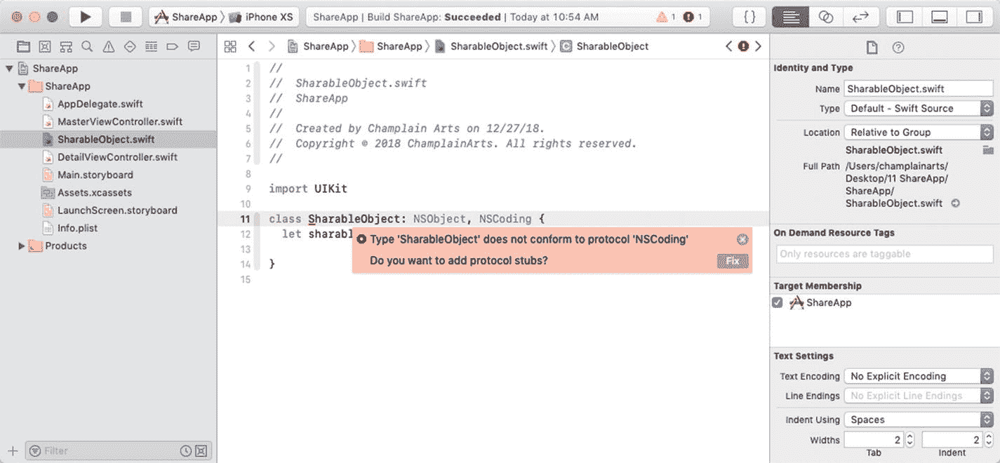

图 11-12. Xcode 可以为 `NSCoding` 函数添加存根

这将帮助你顺利完成应用的开发。

当你点击 Fix 时，存根将被添加，如图 11-13 所示。

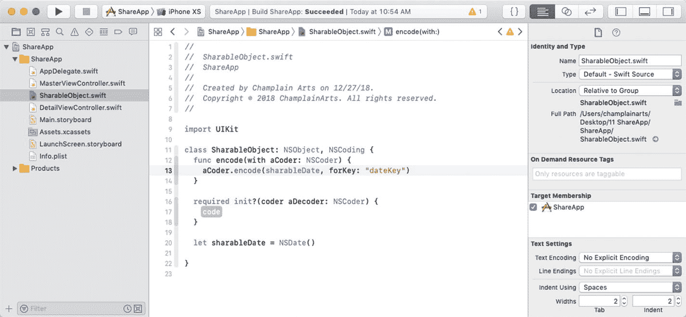

图 11-13. 让 Xcode 为 `NSCoding` 添加存根

使用代码清单 11-5 中的代码补全存根。

```
import UIKit
import os.log
class SharableObject: NSObject, NSCoding {
var sharableDate: NSDate=NSDate()
func encode(with aCoder: NSCoder) {
aCoder.encode(self.sharableDate, forKey: "dateKey")
}
required init?(coder aDecoder: NSCoder) {
guard (aDecoder.decodeObject(forKey: "dateKey") as? NSDate) != nil else
{
os_log ("Unable to decode sharableDate")
return
}
sharableDate = aDecoder.decodeObject(forKey: "dateKey") as? NSDate ?? NSDate()
}
override init() {
sharableDate = NSDate()
}
init(dateToInit: NSDate) {
sharableDate = dateToInit
}
}
代码清单 11-5
完整的 sharableObject
```

你添加的所有函数都以一个名为 `aCoder` 的 `NSCoder` 作为参数。它是被传入的，所以你无需声明。`encode(with:)` 函数允许你为归档编码数据。该函数的典型用法是编码类中的一个变量，并为其指定一个键名。通过这种方式，你可以通过键名访问归档中的每个变量，而无需担心文件中数据的顺序。在代码清单 11-5 中，第一个 encode 函数编码了 `sharableDate` 属性，并为其分配了键 `dateKey`。

配套函数 `init(coder:)` 接收一个 `Decoder` 对象，并逆转该过程。


### 实现示例

大多数归档过程都需要输入存根代码。在本示例中，你可以跳过`tableView(:didSelectRowAt:)`，以便能够归档和解归档数据进行测试。本节仅用于测试。示例代码如代码清单 11-6 所示。

```
override func tableView(_ tableView: UITableView, didSelectRowAt indexPath: IndexPath) {
os_log("Row selected-%@",
indexPath.debugDescription)
let object = objects[indexPath.row] as! SharableObject
var savedData: Data?
do {
let data = try NSKeyedArchiver.archivedData(withRootObject: object,
requiringSecureCoding: false)
try data.write(to: MasterViewController.ArchiveURL)
savedData = data as Data // 保留以备后续测试
} catch {
os_log ("无法写入文件")
}
do {
let debuggedUnArchive = try
NSKeyedUnarchiver.unarchiveTopLevelObjectWithData(savedData! as Data)
if let test = debuggedUnArchive as? SharableObject {
print ("\(test.sharableDate)")
}
} catch {
os_log ("无法读取文件")
}
代码清单 11-6
在示例中实现调试代码
```

归档代码的核心是这一行：

```
let data = try NSKeyedArchiver.archivedData(withRootObject: object,
```

它调用了你创建的存根，将该类归档为一个名为`data`的`Data`对象。这行代码将`Data`对象取出，并在代码清单 11-6 中将其解归档到名为`test`的变量中。

此处展示的解归档和归档数据过程，使用了你可以创建的临时文件。该文件在`MasterViewController`的顶部通过以下几行代码显示：

```
static let DocumentsDirectory = FileManager().urls(
for:.documentDirectory,
in: .userDomainMask).first!
static let ArchiveURL = DocumentsDirectory.appendingPathComponent("sharableObjectURL")
```

设置断点并尝试运行代码，观察其运作方式。这是你经常会用到的通用归档代码。

### 将归档迁移至文档

除了在文件之间来回移动数据，你通常更希望将数据移入或移出可以与其他用户共享的文档。只需修改`UIDocument`函数，使其执行归档和解归档操作即可。这意味着`contents(forType:)`将使用`NSKeyedArchiver.archivedData(withRootObject: requiringSecureCoding:)`将数据归档到`Data`对象中，而`load(fromContents:, ofType)`将使用`NSKeyedUnarchiver.unarchiveTopLevelObjectWithData()`来反向执行归档操作。

作为参考，代码清单 11-7 展示了将按此方式使用的`UIDocument`函数的存根。

```
import UIKit
class Document: UIDocument {
override func contents(forType typeName: String) throws -> Any {
// 使用 Data 或 NSFileWrapper 实例对文档进行编码
return Data()
}
override func load(fromContents contents: Any, ofType typeName: String?)
throws {
// 从 contents: ofType:) 加载文档
}
}
代码清单 11-7
请添加标题
```

## 总结

在本章中，你了解了如何将数据归档和解归档到文件中。你可以使用相同的过程来处理文档。请尝试本章描述的过程，并在测试时设置断点。虽然可能需要花一些时间来尝试，但一旦掌握了归档和解归档，你就可以准备好处理更复杂的文档了。

### 索引

#### A

- 应用委托
- Apple 系统日志记录器 (ASL)
- 归档数据
- 断点数据对象实现
- `NSCoding` aCoder
- sharableObject
- Xcode 对象创建
- `NSDate` 对象
- sharableDate
- `SharableObject`
- 选定对象模拟器
- `UIDocument` 函数

#### B

- 包，应用

#### C

- Cocoa 位置服务（案例研究）

#### D

- 数据分支
- 数据结构
- 基于文档的应用创建
  - 基础代码
  - 浏览标签
  - 新项目
  - 审查新项目
  - 在 Xcode 中设置选取
  - 运行
  - 故事板
  - `UIDocument` 函数介绍
  - 工作流程
- 基于文档的 macOS 应用
  - Cocoa 应用创建
  - 组件信息
  - 运行
- 文档匹配
  - `info.plist` 管理类型
  - 针对 iOS 应用
  - 针对 macOS 应用 UYIs
  - 准备 iCloud
  - 在 iOS 中设置
  - 在 macOS 中设置
- iOS 上文档 *vs.* 文件
  - 浏览文件
  - 选择存储位置
  - 文件系统问题
  - 最近文件
  - 查看文件
- 共享操作
  - 添加按钮
  - 栏按钮详细视图
  - `DetailViewController`
  - Master-Detail 应用模板
  - 构建自有项目
  - 选择栏按钮
  - 共享按钮（作为用户）
  - 创建故事板时间戳记录
  - `UIActivityViewController`
- 存储和检索数据
- 构造应用
- 跟踪变更版本

#### E

- `encode(with:)` 函数

#### F

- 文件包装器
  - 声明文档过程
- 分支

#### G, H

- 通用数据保护条例 (GDPR)

#### I

- `info.plist`
- iOS 文档 *vs.* macOS 文档

#### J, K

- JavaScript 对象表示法 (JSON)
  - 调试
  - 解码
  - 编码原始类型

#### L

- 日志与断点
- 日志消息
- 主从视图控制器
- 主视图控制器

#### M

- Macintosh 文件系统
- macOS *vs.* iOS
- 模型-视图-控制器 (MVC)

#### N, O

- `NSCoder` 协议
- `NSData` 对象
- `NSDocument` 类文档
- `NSKeyedArchiver.archivedData`
- `NSKeyedUnarchiver.unarchiveTopLevelObjectWithData()`

#### P, Q

- 包
  - 控制键
  - 文件和文件夹
  - Macintosh 文件系统
  - 项目文件夹 Xcode 项目
- 偏好设置应用创建过程
  - 设置特殊选项
  - 在“设置”中使用点击

#### R

- 资源分支

#### S, T

- 安全概览
- 设置 bundle
  - 通过代码访问
  - 添加到应用
  - 调整设置
  - 更改值
  - 访问 iOS 键的初始设置
  - 放置在正确目标中
  - 项目导航器
  - 根字符串
  - 测试设置
- `SharableObject`
- ShareApp
- 单视图应用
- 故事板
- Swift 结构体
  - 创建
  - 编码键的扩展
  - 编码的扩展
  - MVC
- Swift 统一日志系统

#### U

- `UIDocumentBrowserViewController`
  - 文档创建
  - 文档打开/选取
  - 文档呈现函数
  - 处理错误
  - 加载
- `UIDocumentViewController`
  - 代码创建
  - 文档关闭
  - 文档打开
  - `UITableViewDelegate` 函数
- 统一日志数据类型
  - `os.log`
- 用户默认

#### V, W

- 提供 ViewController
  - 添加按钮
  - 断点
  - 连接按钮

#### X, Y, Z

- Xcode
