# 目录

- 关于圆角矩形的一点说明
- 增强的用户交互
- 关于单元格视图自定义的说明
- 配方 9–2：编辑一个 UITableView
- UITableView 行动画
- 等等，还有更多！
- 配方 9–3：对 UITableView 重新排序
- 配方 9–4：创建一个分组的 UITableView
- 总结

第 10 章：数据存储配方
- 配方 10–1：使用 NSUserDefaults
- 配方 10–2：管理文件
- Core Data
- 配方 10–3：使用 iCloud 持久化
- 配方 10–4：在 iCloud 中存储键值数据
- 总结

第 11 章：Core Data 配方
- 什么是 Core Data？
- 配方 11–1：创建数据模型
- 配方 11–2：处理 NSManagedObjects
- 配方 11–3：子类化 NSManagedObject
- 配方 11–4：过滤你的获取请求
- 配方 11–5：版本控制
- 一个恼人的错误
- 总结

第 12 章：Core Motion 配方
- 配方 12–1：注册摇动事件
- 配方 12–2：访问原始 Core Motion 数据
- Core Motion 详解
- 姿态属性
- 配方 12–3：使用加速度计移动 UILabel
- 总结

第 13 章：数据传输配方
- 配方 13–1：编写短信
- 向邮件附加数据
- 配方 13–3：打印图片
- 配方 13–4：打印纯文本
- 配方 13–5：打印视图
- 配方 13–6：使用页面渲染器进行格式化打印
- 总结

第 14 章：Twitter 配方
- 配方 14–1：编写简单推文
- 配方 14–2：创建简单的 TWRequests
- 通过 TWRequest 发送推文
- 配方 14–3：检索推文
- 配方 14–4：过滤推文
- 总结

第 15 章：图像配方
- 配方 15–1：绘制简单形状
- 编程式截图
- 配方 15–2：使用 UIImageViews
- 配方 15–3：缩放图像
- 回顾
- 配方 15–4：使用滤镜处理图像
- 配方 15–5：检测特征
- 总结

第 16 章：Game Kit 配方
- 配方 16–1：Game Center 入门
- iTunes Connect 设置
- 项目设置
- 检查 Game Center 支持
- 玩家认证
- 配方 16–2：排行榜
- 设置 iTunes Connect
- 设置你的代码
- 显示高分
- 配方 16–3：成就
- 设置 iTunes Connect
- 设置你的代码
- 显示成就
- 配方 16–4：多人游戏
- 设置你的代码
- 总结

索引

## 关于作者

 2010 年，肖恩·格莱姆斯自学了`Objective-C`和 iOS 开发，并编写了他的第一个适用于 iPad 的 iOS 应用。来自马里兰州巴尔的摩的肖恩，曾就读于马里兰州劳雷尔的国会技术学院，并于 2003 年获得软件与互联网应用学士学位。他创立了 Shawn's Bits, LLC，以创建更多应用并为其他有抱负的 iOS 开发者举办研讨会。为了帮助当地开发者，他与克里斯·斯通共同运营着巴尔的摩移动开发者小组。肖恩和妻子斯蒂芬妮共同经营 Campfire Apps, LLC，这是一家专注于儿童应用开发的移动应用公司。

 科林·弗朗西斯是一位来自马里兰州盖瑟斯堡的 iOS 开发者。在深入学习计算机科学后，他自学了 iOS 开发，并与肖恩·格莱姆斯在巴尔的摩共事。如今他居住在迈阿密，独立开发 iOS 应用，专注方向为实用工具和音频软件应用。

## 关于技术审校

 安塞尔姆·布拉德福德是新西兰奥克兰理工大学（AUT）数字媒体专业的讲师，研究方向包括交互媒体、网络媒体和视觉传达。他与互联网相关的开发经验可以追溯到 1996 年，当时他手工编写了他的第一个网站。在 Twitter 上可以通过`@anselmbradford`找到他，偶尔他也会在 [AnselmBradford.com](http://AnselmBradford.com) 上写博客。

## 引言

一旦你对用于 iOS 开发的`Objective-C`编程语法结构有了理解，创建应用最重要的部分就是学习如何使用 Apple 提供的各种工具和框架。为了全面开发 iPhone 和 iPad 应用，你不仅要详细了解开发环境，还必须深入了解你能够使用的各种元素和功能。无论你的应用是用来播放音乐、拍照、打印文档还是过滤图像，本书都将指导你完成功能的设置与构建。


### 本书阅读指南

本书前几章将帮助你掌握开发环境的基本知识。你将学习在`Xcode`和`Interface Builder`中工作的多种方式，以及可用于构建应用的各种标准用户界面元素。其余 13 章则聚焦于不同应用的具体案例（即“秘诀”），以演示如何从头到尾实现每一项功能。

### 本书组织结构

本书基于案例的章节之间并无严格依赖关系，你可以直接跳转至任何感兴趣的章节，开始构建特定类型的应用。但强烈建议你（如果尚未阅读）先通读前三章，以扎实掌握`Xcode`和`Interface Builder`的操作。早期章节中使用的一些方法（例如创建属性的技术）会在全书中被反复引用，需确保充分理解。

本书假定读者使用的是撰写时的最新版本：iOS 5.0 和 Xcode 4.2。这意味着书中的所有秘诀都默认使用 ARC（自动引用计数），因此不会涉及大量内存管理内容。同时，由于你阅读时软件版本可能已更新，实际界面或许略有差异，但基本功能应保持一致。

本书的许多秘诀无法在 iOS 模拟器中完整测试，因此需要一台 Apple 设备和一份配置文件（可通过订阅 Apple iOS 开发者计划获取）。每个无法在模拟器中测试的秘诀都会特别说明。

### 源代码与勘误

本书所有源代码均可从[`www.apress.com`](http://www.apress.com)在线免费下载，且允许用于任何商业或个人应用。虽然多人已尽力确保代码完美无缺，但大量使用后仍可能发现少量笔误或错误。文本或代码的任何修正均可在本书的“勘误”部分找到，该部分同样位于[`www.apress.com`](http://www.apress.com)。

### 联系方式

如果您对本书或其源代码有任何疑问或建议，我们很乐意提供帮助。您可联系两位作者：

> Colin Francis:
> 邮箱：`cmfrancis24@gmail.com`
> 
> Shawn Grimes:
> 邮箱：`shawn@shawnsbits.com`
> 网址：[`www.shawnsbits.com`](http://www.shawnsbits.com)

## 第 1 章

## Xcode 4 技巧与提示

`Xcode 4` 对`Xcode`的外观和功能都带来了诸多变化。与任何颠覆性变革一样，它收获了褒贬不一的评价和一些抱怨。本章将避开`Xcode 4`的缺点，专注于其优势与改进——而它们不胜枚举。

### Xcode 4 简介

你首先会注意到`Xcode 4`的统一界面窗口。所有功能都整合到了一个窗口中，新界面引入了标签页这一通用元素，取代了之前的多个窗口。

图 1-1 展示了`Xcode`用户界面的示例，包含各种显示面板。这些面板帮助你导航、构建和调试应用。你可以通过右上角的“视图”按钮轻松调整它们的可见性，从而为编辑器腾出更多空间。

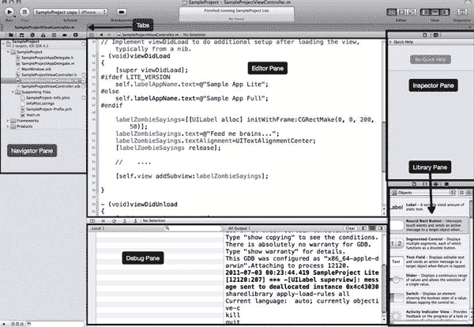

**图 1-1.** *Xcode 界面*

就连`Interface Builder`也已被整合到`Xcode 4`的单一窗口界面中。通过引入`Interface Builder`，Apple 构建了强大的功能，帮助你从可视化界面过渡到可运行的代码。图 1-2 展示了使用`Interface Builder`构建应用用户界面的场景，第 2 章将对此进行更详细的介绍。

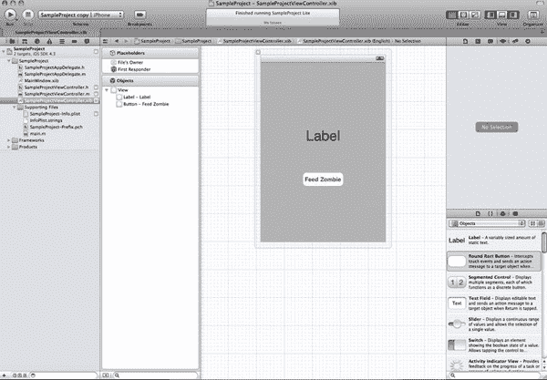

**图 1-2.** *Interface Builder*

借助助理编辑器，你可以轻松并排查看两个相关文件。这在处理类头文件和实现文件时非常有用，因为你可以在一个视图中同时修改两个文件。通过使用每个面板顶部的导航区域，你可以选择要同时显示的特定文件，或指定“对应文件”来自动显示相关的头文件或实现文件，如图 1-3 所示。

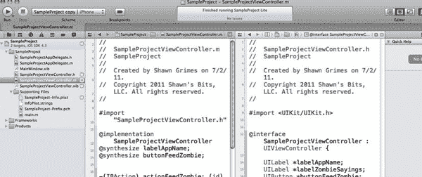

**图 1-3.** *助理编辑器*

`Xcode 4` 中一个一定能为你节省时间的功能是“Fix-It”。该功能会尝试检测常见编程错误，并给出修复建议。它在你编写代码时即时生效，而无需等待构建命令执行，从而为修复常见错误节省了大量时间。

`Xcode 4` 还改进了与 Git 的源代码控制集成。每次创建新项目时，你都可以选择创建一个本地 Git 仓库，修改过的文件会在导航面板中清晰标记。时间线编辑器视图甚至能显示自上次签入以来的更改，或将当前文件与仓库中的任何历史版本进行对比。这种回溯视图与 Snow Leopard 中的 Time Machine 备份界面非常相似，如图 1-4 所示。

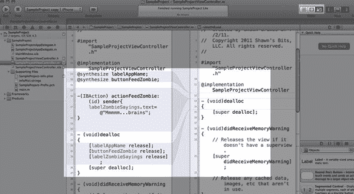

**图 1-4.** *显示最近修订的时间线编辑器*


### 在同一个 Xcode 项目中同时构建精简版和完整版

为你的应用提供一个精简版，是让客户在购买前有机会尝试应用的绝佳方式。然而，随着你不断为应用添加新功能，维护两个代码库会变得相当繁琐且难以控制。虽然在 Xcode 3 中已经可以维护两个构建目标，但 Xcode 4 让这一过程变得更加简单。

在导航器区域选择你的项目文件，然后选择项目的构建目标。现在按下 `D` 键来复制该目标。系统会提示你选择“仅复制”或“复制并过渡到 iPad”。点击“仅复制”创建一个用于精简版构建的新目标，如 图 1-5 所示。这样会生成一个独立的构建目标，你可以用它来实现第二个版本。

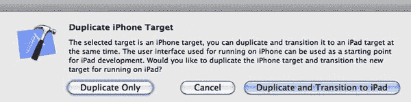

**图 1-5.** *项目复制选项*

将新目标重命名，追加“Lite”字样。你还需要进入“构建设置”选项卡，在“打包”标题下找到“产品名称”属性，以便在应用名称后追加“Lite”。现在构建名称已设置好，你需要一种方法在源代码中区分这两个构建。为此，向下滚动找到“预处理宏”，并添加一个名为 `LITE_VERSION` 的新宏。确保为 Debug 和 Release 构建设置都添加这个新宏。图 1-6 展示了这些更改的示例。

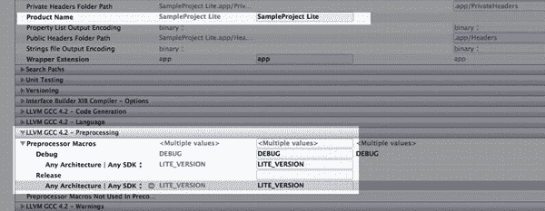

**图 1-6.** *“精简版”应用配置*

如果现在构建并运行，你的设备上会出现第二个应用，标题名为“SampleApp Lite”，但它运行的代码与普通版本相同，如 图 1-7 所示。请记住，这两个目标必须拥有独立的捆绑标识符，才能作为独立的应用显示。这是默认设置，但在进行更改时要小心。

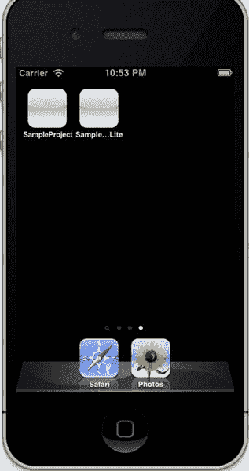

**图 1-7.** *同一应用的两个版本*

要为你的应用构建不同的功能，你需要利用你创建的那个预处理宏。在你代码中任何需要为精简版和完整版指定不同代码的地方，请使用以下 `#ifdef` 指令：

```
#ifdef LITE_VERSION
//精简版的内容
Self.labelAppName.text=@"Sample App Lite";
#else
//完整版的内容
Self.labelAppName.text=@"Sample App Full";
#endif
```

在模拟器上构建并编译这两个应用，你会看到应用会根据预处理宏以及 `#ifdef` 指令的强大功能，改变它们所编译和运行的代码。图 1-8 展示了这种配置的结果。

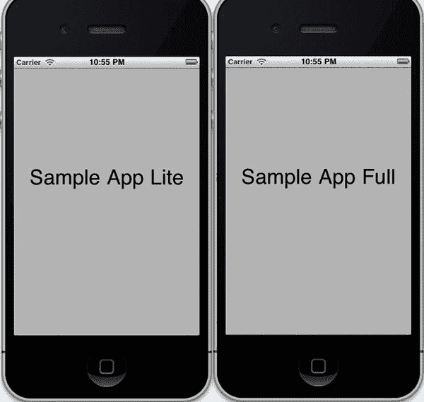

**图 1-8.** *完整版和“精简版”应用*

**注意：** 你还可以控制每个构建中包含哪些文件。例如，你可能不需要在精简版中包含完整版的素材。点击你的精简版项目目标，进入“构建阶段”选项卡。然后展开“复制捆绑资源”列表，移除或添加任何特定于精简版的文件。

### 僵尸猎人

有时，你会遇到一个仅描述为“`EXC_BAD_ACCESS`”的错误，不幸的是，它不会告诉你错误访问发生在哪一行。当你释放了一个变量，然后试图访问那个已释放的对象时，就会导致这个错误。当一个对象不再存在而你又试图访问它时，这个术语叫做僵尸对象。这时候就要用到僵尸猎人——`NSZombieEnabled` 标志。这在 Xcode 4 中并非新功能，但在 Xcode 4 中设置该标志的位置可能很难找到。前往“产品”菜单，选择“编辑方案…”。现在选择“运行”步骤，点击“参数”选项卡。在“环境变量”部分，添加 `NSZombieEnabled` 并将其值设置为 `YES`，如 图 1-9 所示。

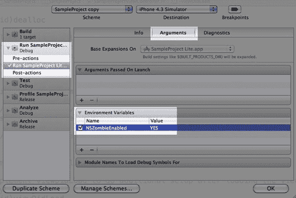

**图 1-9.** *启用 `NSZombieEnabled`*

下次你运行代码时，僵尸将在调试窗口中被识别出来。图 1-10 展示了一个被 Xcode 捕获的僵尸示例。

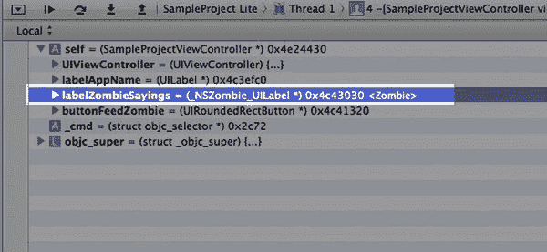

**图 1-10.** *识别出的一个僵尸*

### 使用 Xcode 4 进行版本控制

版本控制对于新开发者来说可能是一个令人生畏的概念，但它是值得学习的东西。一旦你开始使用版本控制，你会想不通没有它以前是怎么过来的。它对于开发团队的好处显而易见。团队成员可以各自处理应用的不同部分，而不会相互干扰代码。

个人开发者也能从版本控制中受益。通过多个分支，你可以在不干扰先前发布版本的情况下，为应用添加新功能。如果你在发布版本中发现了一个 bug，你可以切换分支并修复该 bug，而不会影响应用的未来版本。然后你可以合并两个版本，得到一个同时包含 bug 修复和新功能的新版本。自始至终，你都可以回溯到任何时间点，查看对代码所做的更改。

Xcode 4 将版本控制引入了 Xcode 环境。最初，它只支持本地 Git 仓库，但 Xcode 4.2 已将远程仓库引入了该环境。如果你是开发团队的一员，或者在多台机器上工作，这无疑是个好消息。远程仓库也为你的代码提供了一个安全的存储位置，以防电脑故障或丢失。


好的，作为一名高级文档工程师和翻译员，我将根据您提供的注意事项和示例，将给定的英文文本翻译成中文。


### 创建本地仓库

每当您在 Xcode 4 中开始一个新项目时，您都可以选择创建一个本地 Git 仓库，如图 1-11 所示。如果您选中此框，Xcode 将创建本地仓库并自动添加其认为必要的项目文件。

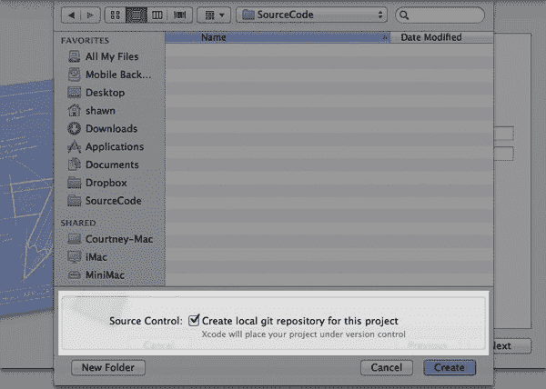

**图 1-11.** *创建一个 Git 仓库*

当您更改项目及其文件时，其源代码控制状态将显示在导航器窗口中。“A” 表示文件已添加到项目中，“M” 表示自上次签入以来已修改。图 1-12 显示了一个导航窗格，其中包含多个具有这些状态的文件。

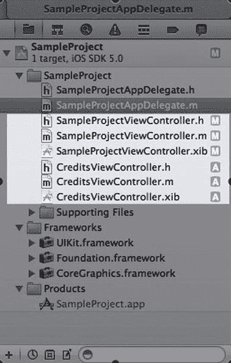

**图 1-12.** *已修改和已添加的项目文件*

您可以通过单击导航器窗格底部中间的图标来过滤导航器内容，以便仅查看源代码控制仓库中待更改的文件，如图 1-13 所示。

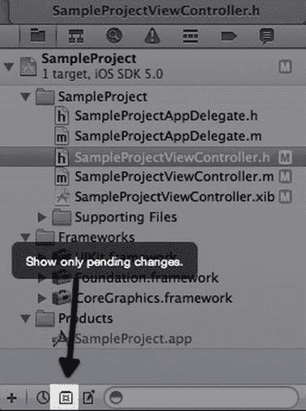

**图 1-13.** *已过滤的已修改文件*

要将您的更改提交回本地仓库，请转到 `File``Source Control` `Commit` 或按 `C`。将出现“提交”窗口。通过单击已修改的文件，您将在左侧窗格中看到您编辑后的版本，在右侧窗格中看到仓库中的当前版本。您的所有更改都将被高亮显示，以便您可以轻松地看到两个文件之间的差异。图 1-14 显示了这样一个窗口，其中包含高亮显示的更改。

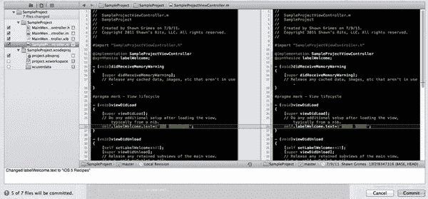

**图 1-14.** *查看待提交的文件更改*

值得一提的是，左侧窗格是一个实时编辑器，因此如果您发现某些不应该提交的内容，例如一条 `NSLog` 语句，这是您将其注释掉或进行必要更改的机会。

Xcode 在建议应提交哪些文件方面做得很好。您不希望将工作区文件（`*.xcworkspace`）或用户数据目录（`xcuserdata`）纳入版本控制。通常 Xcode 不会检入这些文件，您会注意到文件旁边有“?”标记图标。这意味着它们当前不受版本控制，也不应受版本控制。图 1-15 显示了这些不受版本控制的文件/目录。

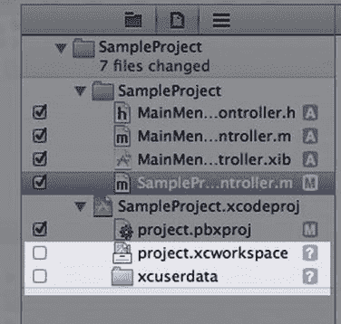

**图 1-15.** *为某些目录禁用了版本控制*

在提交窗口的底部，如图 1-16 所示，您需要在此输入关于所做更改的消息，然后再提交。您的提交消息应该是对代码所做更改的描述性摘要，例如“添加了某某功能”。

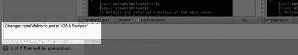

**图 1-16.** *提交消息*

### 分支与合并

分支是您项目的副本，您可以在其上工作而不会干扰主分支（也称为 master 分支）。它们允许您在不影响主版本的情况下添加功能和修复。

要管理您的仓库，您可以转到 `Window` `Organizer` 或按 2，然后单击“仓库”标签页。在此视图中，您将看到 Xcode 已知的仓库列表。如图 1-17 所示，您可以单击仓库下的 `Branches` 文件夹，以查看此仓库可供 Xcode 使用的分支列表。

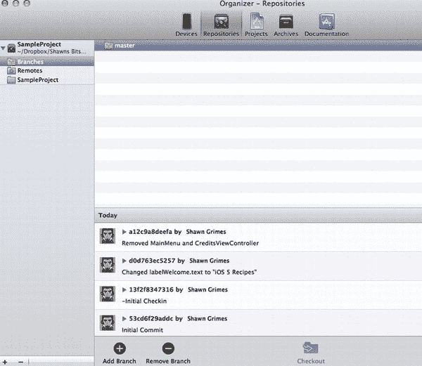

**图 1-17.** *Organizer 中的“仓库”标签页*

当您选择一个分支时，您将看到该分支的最新提交列表。信息包括谁进行了提交以及他们的提交消息。

创建一个新分支以开始向您的应用添加主菜单。单击 Organizer 窗口底部的“添加分支”按钮。在图 1-18 所示的窗口中，键入一个分支名称，并选中“自动切换到该分支”旁边的复选框。这会将 master 分支中的代码复制到一个名为“MainMenu”的新分支中，然后将您切换到该分支。

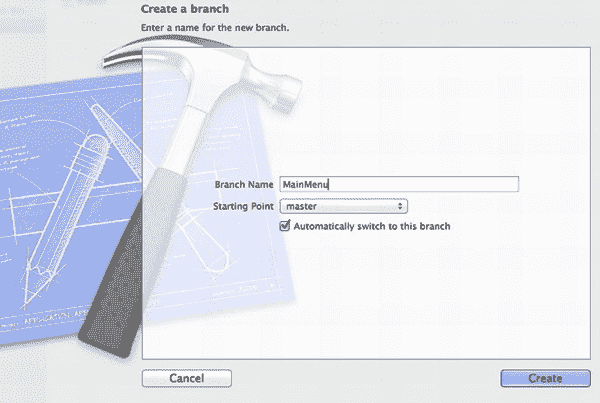

**图 1-18.** *创建分支*

现在，您正在 MainMenu 分支中工作，您可以为主菜单添加一个新的视图控制器，而不会影响应用的其余源代码。添加视图控制器并为其编码后，您可以将其提交回源代码仓库。同样，这只会影响 MainMenu 分支，而不会对 master 分支进行任何更改。

要合并这两个分支，您需要切换到要将更改合并到的目标分支。您已完成 MainMenu 的编码，并希望将其放入 master 分支，因此您将切换到 master 分支。这可以从 Organizer 窗口完成，请按 2。

单击项目文件夹，然后单击右下角的“切换分支”按钮。选择要切换到的分支（在本例中为 master），然后单击“确定”。这会将您的活动分支切换回 master 分支，现在您可以将这两个分支合并在一起。图 1-19 突出了这些步骤。

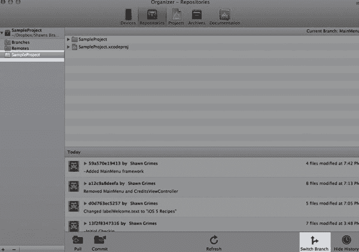

**图 1-19.** *切换分支*

返回到 Xcode 窗口，单击 `File` `Source Control`  `Merge`。系统将提示您选择要合并到当前分支（master）中的分支，如图 1-20 所示。单击“选择”后，您将看到提交更改窗口。

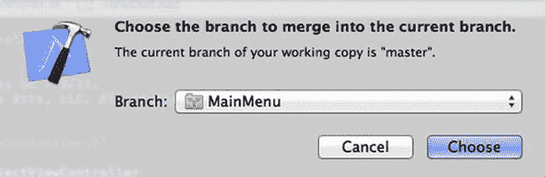

**图 1-20.** *将一个分支与当前分支合并*

这个提交更改窗口与您之前看到的非常相似，但有一个小的变化：在代码审阅窗格的底部，您会看到四个图标。如果每个分支都包含一个在两个分支中都被修改过的文件，这些图标将允许您决定哪个优先。这些图标从左到右依次是：“先合并左侧文件，再合并右侧文件”、“仅保留左侧文件更改”、“仅保留右侧文件更改”和“先合并右侧文件，再合并左侧文件”。这些图标显示在图 1-21 中。这对于解决两人对同一文件进行了更改或文件在两个分支中都被修改时的冲突非常有用。

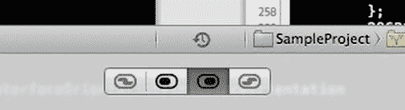

**图 1-21.** *指定合并时的更改优先级*

单击“合并”按钮将把 MainMenu 分支合并到 master 分支中。如果您在 Organizer 视图（2）中查看 master 分支的提交历史，您将看到来自 MainMenu 分支的提交已与 master 分支的提交合并在一起。


### 远程仓库

到目前为止，你一直在使用本地仓库。在 Xcode 4.2 中，增加了对远程仓库的支持。这使你能够将代码存储到线上，从而可以从任何计算机访问，并允许多个用户访问你的代码。远程仓库的另一个好处是，可以将源代码异地存储，以防设备突然故障或更糟的情况。

要添加远程仓库，请前往 `Organizer` 视图（2）中的 `Repositories` 标签页，选择你想要添加远程选项的仓库。点击项目仓库下的 `Remotes` 文件夹，然后点击底部的 `Add Remote`。这将弹出一个类似于 图 1-22 的视图。为你的远程仓库输入一个名称和位置，然后点击 `Create`。

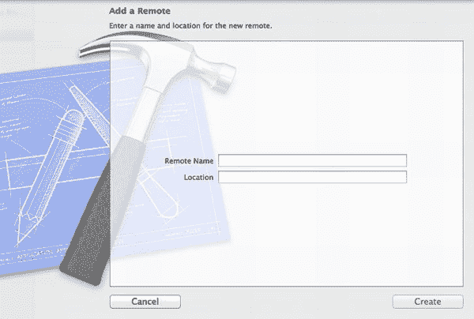

**图 1-22.** *添加远程仓库*

现在你已经有了一个远程仓库，你可以从远程仓库推送(`push`)和拉取(`pull`)代码，以保持代码更新。这与提交(`commit`)不同。提交或合并只会影响你的本地副本。你需要将代码推送到远程仓库来更新它。

### GitHub

一个非常流行的 Git 项目在线仓库是 GitHub，地址为 [`www.github.com`](http://www.github.com)。GitHub 提供将代码远程存储在公共或私有仓库中的能力。这允许小型开发团队协同处理一个项目，或单个开发者远程存储其代码仓库。在此之前，你必须使用第三方软件或 Git 命令行版本来将更改推送到远程仓库。Xcode 包含了远程仓库功能后，可以轻松地与 GitHub 协作并远程存储你的源代码。

在将项目添加到 Xcode 之前，你应该先在 GitHub 上创建一个仓库。你需要一个 GitHub 账户来完成此操作；请按照非常详细的说明设置你的账户。在 GitHub 上创建仓库后，复制 `Source` 标签页上的整个 HTTP 访问路径，如 图 1-23 所示。这将是你的远程仓库位置。

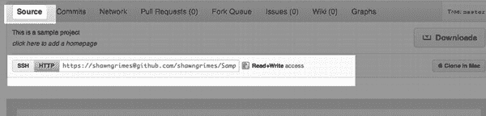

**图 1-23.** *查找仓库的 HTTP 访问路径*

在 Xcode 中设置 GitHub 与设置任何远程仓库非常相似。前往 `Organizer` 视图（2）中的 `Repositories` 标签页，选择你想要添加到 GitHub 仓库的仓库下方的 `Remotes` 文件夹。现在点击窗口底部的 `Add Remote`，将 HTTP 位置粘贴到位置字段中（如 图 1-24 所示），添加一个名称，然后点击 `Create`。

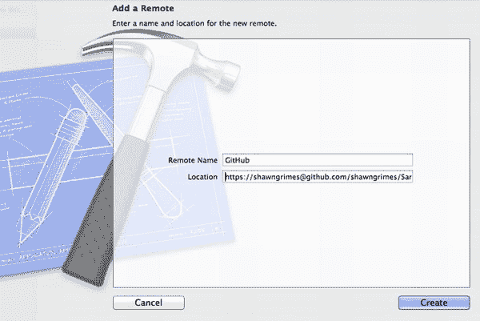

**图 1-24.** *配置 Git 仓库*

点击 `Create` 后，你将在 `Organizer` 窗口底部看到一个输入 GitHub 凭据的位置。你的用户名应该已经填好，因此你只需输入密码。现在返回你的主 Xcode 窗口，使用 `File`  `Source Control`  `Push`。在一个反映 图 1-25 的窗口中，系统将提示你选择要推送代码的远程仓库。选择 GitHub 仓库，然后点击 `Push`。Xcode 现在会将你的代码发送到你的 GitHub 项目仓库。使用 GitHub 的 Web 界面，验证你的更改和变更日志是否已正确上传。现在其他开发者可以使用他们自己的 GitHub 账户和 `File`  `Source Control`  `Pull...` 菜单选项来签出此代码。

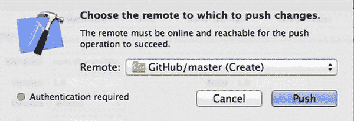

**图 1-25.** *指定 GitHub 仓库*

### 源代码管理最佳实践

以下是一些使用源代码管理仓库的技巧：

1.  尽量不要直接在 `master` 分支上工作。相反，在单独的分支上工作，准备就绪后再合并回 `master` 分支。
2.  使用远程分支时，在开始编码之前，始终对你的工作分支执行 `pull` 操作。这将确保你在最新的代码修订版上工作。
3.  尽量不要将无法编译的代码推送到远程仓库。虽然你需要经常检入以确保可用性，但最好在推送到远程仓库之前，确保你的代码至少没有错误地构建成功。
4.  使用描述你所做更改的提交消息。这不仅有助于你管理代码，还可以轻松查看你添加了哪些功能，并在提交应用以供审核时列出它们。

### Steve 和 ARC

Xcode 4.2 引入了自动引用计数（`ARC`），作为一种帮助开发者专注于编写优秀应用、减少内存管理时间的方式。对于任何刚接触 Objective-C 的开发者，以及一些已经接触了一段时间的开发者来说，你很可能会在内存管理概念上遇到困难。`Retain` 这个，`release` 那个，`autorelease` 什么？如果这三个方法让你感到困惑，那么别担心，Xcode 4.2 就是为你准备的！即使你熟悉内存管理，你也会看到将代码迁移到使用 `ARC` 的好处。

`ARC` 是一种编译时的内存管理方法。它不会为正在运行的应用增加性能开销，因为它是在构建之前编译到代码中的。这与垃圾回收（`Garbage Collection`）概念不同，后者是 Java 开发者熟悉的一种内存管理方法。使用 `ARC`，编译器（LLVM 版本 3.0）通过分析你的对象并确定对象何时不再被引用，来自动添加 `retain` 和 `release` 调用。只要存在指向对象的指针，该对象就会存在。在它系统地添加了内存管理方法之后，它会编译用于运行和部署的二进制文件。

如果没有 `ARC`，以下代码将产生内存泄漏，因为返回值没有被自动释放（`autorelease`）：

```
-(NSString *) cityStateZip {
    return [[NSString alloc] initWithFormat:@”%@, %@ %@”, self.city, self.state, self.zip];
}
```

在不对代码进行任何更改的情况下，`ARC` 将编译此方法，并在编译时添加 `autorelease` 以修复内存泄漏。

#### ARC 规则

以下是使用启用了 `ARC` 的项目时需要遵循的一些规则：

1.  你不能在代码中调用 `retain`、`release` 或 `autorelease`。你也不能覆盖或实现这些方法。
2.  由于不再需要 `release` 语句，你不能再在你的类中实现 `dealloc` 方法。
3.  你不能再创建 `structs`。相反，你必须使用自定义的 Objective-C 子类。
4.  你不能使用诸如以下的随意类型转换：

    ```
    NSString *B = (NSString *)A;
    ```

    解决方案是使用 `__bridge` 指令：

    ```
    NSString *B = (__bridge NSString *)b;
    ```

5.  你不能使用 `NSAutoreleasePool`；相反，你可以使用 `@autoreleasepool`。

#### 使用 ARC

Xcode 4.2 中的每个新项目模板默认使用 `ARC` 和 LLVM v3.0 编译器。你不需要做任何特殊的事情。启用了 `ARC` 的项目也与 iOS 4 兼容。


#### 将旧项目转换到 ARC

终有一天，回首望去，我们甚至不会记得曾写过带有 `retain`、`release` 和 `autorelease` 调用的代码。但在那一天到来之前，我们仍需处理现有项目，并将其迁移到 ARC 内存管理方法，以使它们保持最新，并充分利用性能提升。苹果强烈建议所有项目都迁移到 LLVM 3.0 和 ARC。他们提供了一种方法，可以将你的旧项目转换到使用 ARC。

打开你的旧项目，在进行任何更改之前，确保它能正确构建。

**注意：** 这也正是将你的更改提交到 Git 仓库，并将更改推送到远程仓库以妥善保存的好时机。

接下来，转到 `Edit`  `Refactor`  `Convert to Objective-C ARC`。 Xcode 会询问你要转换哪些目标。选择你的目标，然后点击 Precheck。图 1–26 显示了一个目标选择示例。

**注意：** 请确保你设置为构建设备，而非模拟器。

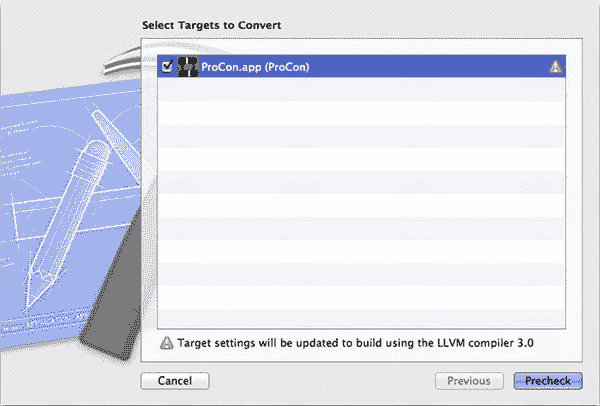

**图 1–26.** *选择要转换到 ARC 的目标*

预检查将开始，并分析你的代码，以查看在开始转换之前需要对项目进行哪些更改。如果存在问题，将显示一条通知，如图 1–27 所示；你可以在导航窗格的构建结果下看到它们，图 1–28 展示了一个示例。

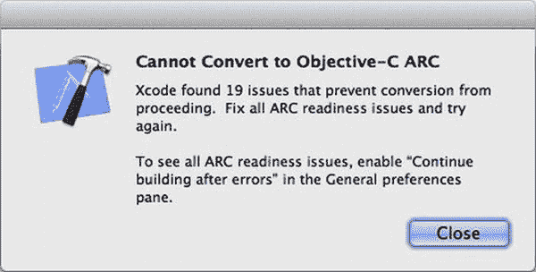

**图 1–27.** *必须纠正 ARC 转换问题。*

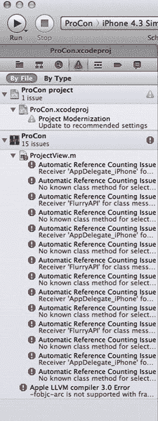

**图 1–28.** *ARC 转换问题列表*

在继续转换之前，你需要纠正所有问题。一旦问题得到纠正，系统将提示你开始转换。图 1–29 显示了一个详细说明转换过程的窗口。第一步是为你的应用程序源代码拍摄快照，以便你可以还原。下一个窗口将显示将要对你的代码进行的任何更改。这与你在向源代码控制仓库提交更改时看到的窗口相同。最常见的更改包括移除 `dealloc` 方法以及 `autorelease` 和 `retain` 语句。属性也被指定为 `strong` 或 `weak`。`Strong` 对应之前的 `retain` 语句，而 `weak` 则会导致一旦没有其他强指针引用对象，该对象就会立即被释放。

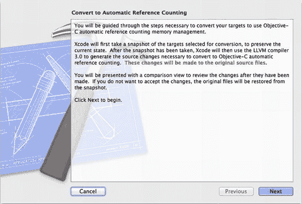

**图 1–29.** *转换到 ARC*

审查更改后，你可以点击 Accept，Xcode 将进行必要的更改。构建你的项目，并确保更改后项目能正确构建。

你可以通过检查目标编译器设置来验证你的项目是否正在使用 LLVM 3.0 编译器，如图 1–30 所示。

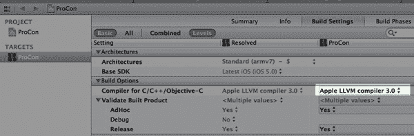

**图 1–30.** *验证 LLVM 3.0 编译器*

要验证你在项目中是否正在使用 ARC，请导航到你的目标 Build Settings，然后转到 `Apple LLVM compiler 3.0 – Language` 部分。你现在应该看到 `Objective-C Automatic Reference Counting` 设置等于 `Yes`。图 1–31 演示了此验证过程。

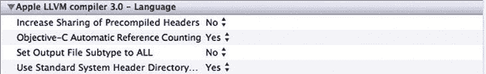

**图 1–31.** *验证 ARC*

### 快速技巧

Xcode 内置了许多复杂功能，可以极大地改善你的开发体验。本节列出了一些快捷方式，旨在加速常见任务，并使应用程序构建过程更简单。

#### 注释

要快速注释掉一段代码，请用鼠标选中代码，然后按下键盘上的 `/`；每一行都会被注释掉。需要取消注释吗？只需重复该操作，这些行就会被取消注释。

#### 自动完成

Xcode 4 在之前的自动完成功能基础上有了很大改进，它会在你输入时工作。这非常有助于让你了解哪些方法可用，并提高编码效率。如果没有显示自动完成，或者你想知道某个对象有哪些可用方法，请按 `Esc` 键调出可用方法列表。

#### 快速缩进/取消缩进

Xcode 4 在管理缩进方面做得相当不错，但如果你发现自己需要一些自定义缩进或管理自己的缩进，请使用 `` 来取消缩进，使用 ![图片`]` 来手动缩进。这对于代码块也同样有效；只需用鼠标选中代码块，然后使用键盘快捷键即可。

#### 在头文件和实现文件之间快速切换

你刚刚向类的头文件添加了一个新的属性或对象，现在想切换到实现文件开始为该对象编写代码。按 `^``+上/下方向键` 可以在两个文件之间切换。图 1–32 展示了助理编辑器的一个常见用途。

Xcode 4 还提供了一个新的拆分窗格视图，用于显示相关文件，称为助理视图。要启用此视图，你可以点击屏幕顶部的助理视图图标，或按 `⌥``+,`（option+command+逗号）来加载助理视图。

**注意：** 如果你正在查看实现文件，键盘快捷键效果最佳；执行命令，它会自动在右侧窗格中加载头文件。

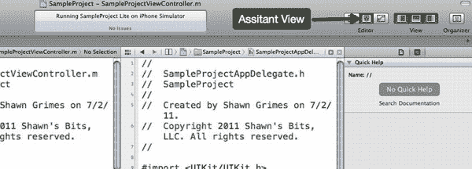

**图 1–32.** *选择助理编辑器*

#### 类文档

记不起一个类的所有属性或方法了？你可以通过 `^`-点击一个对象类型来获取提示，会弹出一个包含对象描述的弹出窗口，如图 1–33 所示。在此弹出窗口中，你还可以查看对象的文档或头文件。

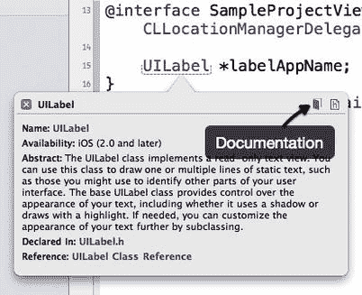

**图 1–33.** *访问类文档*

一个类似的快捷方式是 `⌘`-点击任何对象或类，以跳转到其定义。

#### 在助理编辑器中打开文件

你可以 `⌥`-点击导航窗格中的任何文件，以在助理编辑器中打开它。你也可以 `⌘⌥`-点击任何文件，会弹出一个类似 Xcode 界面的示意图，如图 1–34 所示。在示意图中选择一个区域，即可在 Xcode 中对应的窗格中打开该文件。

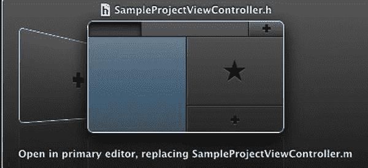

**图 1–34.** *配置助理编辑器*


### 行为

Xcode 4 在编辑界面中引入了行为功能。通过这些行为，你可以在 Xcode 中执行操作时运行自定义命令或脚本。访问行为的方式是进入 `Xcode`  `Behaviors`  `Edit Behaviors`。 图 1–35 展示了打开后的窗口。

你可以自定义左侧窗格中可用的操作，这些操作对应右侧窗格中的行为。例如，我喜欢使用的一个行为是打开一个包含构建错误的独立标签页。这样可以保留我的编辑标签页，让我能够在构建成功或失败（通常是后者）后，从上次中断的地方继续工作。图 1–35 中的行为将会创建或显示名为“Build Results”的标签页，显示问题导航器，显示调试器窗格，并导航到找到的第一个问题（如果有）。

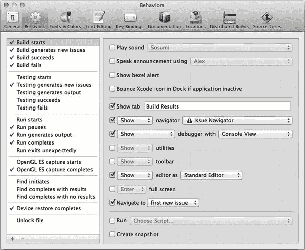

**图 1–35.** *配置行为*

你也可以添加通过快捷键触发的自定义行为。点击行为窗格底部的 `+`，为你的自定义行为设置一个名称。现在，点击该行末尾的命令键符号（）来设置你的键盘快捷键。

### 总结

Apple 通过 Xcode 4 为 iOS 开发者提供了一个更新的应用开发环境。虽然它并非完美无缺，但确实相比之前的版本带来了许多改进，值得称赞。从 Xcode 3 过渡到 Xcode 4 可能会很困难且耗时，但一旦你适应了，你将能够在新的界面中更高效、更轻松地编写代码。

新的增强功能，例如支持远程仓库的源代码控制，将使你的团队项目开发更加无缝，并为独立开发者提供远程存储源代码以确保安全的能力。

## 第 2 章：Interface Builder 简介

Xcode 4 引入的众多变化之一是将 Interface Builder 整合到主 Xcode 应用程序中。Interface Builder 成为了 Xcode 的一个核心组件，并且能够与 Xcode 在相同的窗口和标签页中运行。这一变化不仅仅是简单地将一个应用程序嵌入到另一个中。正如你将在本章中看到的，Interface Builder 与源代码交互的方式使其更像是与 Xcode 进行了深思熟虑的集成。

### Interface Builder 入门

当你在 Xcode 的导航器窗格中点击一个 `.xib`（用户界面）文件时，Interface Builder 将无缝加载到编辑器窗格中。通常，在处理 `.xib` 文件时，我会关闭导航器窗格并显示右侧的实用工具区域。这为我提供了最大的屏幕空间来直观地创建界面，如图 2–1 所示。

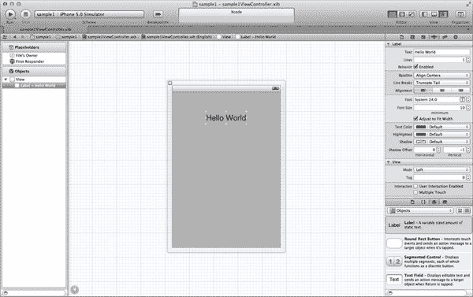

**图 2–1.** *使用中的 Interface Builder*

通过点击左侧大纲视图停靠栏中的对象，你可以在右侧的检查器窗格中查看该对象的属性和设置。对于任何之前使用过 Interface Builder 的人来说，检查器窗格应该非常熟悉。对象浏览器也已集成到检查器窗格下方的库窗格中。这为你的 `.xib` 设计需求提供了“一站式”服务。

### 我们的力量合而为一……

随着 Interface Builder 集成到 Xcode 中，这不仅仅是两个工具合二为一那么简单。就像在动画片《战神金刚》中，独立的机器老虎组合成强大的银河卫士一样，Interface Builder 与助理编辑器视图的结合为源代码创造了一个超级工具。图 2–2 展示了这一强大组合的绝佳示例。

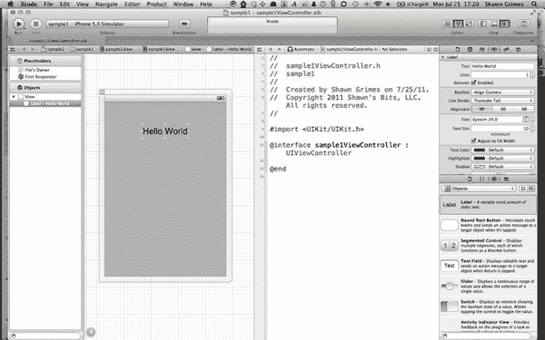

**图 2–2.** *将 Interface Builder 与助理编辑器结合使用*

当助理编辑器可见并且你选择了左侧 `.xib` 文件对象浏览器中的一个对象时，相关的视图控制器的任何现有头文件都会被加载。起初这看起来用处不大。你可以同时看到你的代码和 `.xib` 文件。真正的魔力在于，当你 `^`-点击并拖拽其中一个对象到接口（`.h`）文件时，如图 2–3 所示，一条蓝线会延伸到代码中。当你在助理编辑器的右侧窗格中释放鼠标时，系统会提示你创建一个输出口。

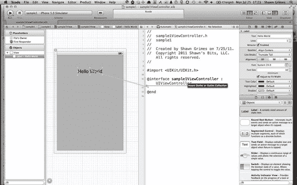

**图 2–3.** *自动连接输出口*

当你释放鼠标按钮时，Xcode 会提示你输入此输出口连接的名称，如图 2–4 所示。指定名称并点击“Connect”后，Xcode 将创建所有必要的代码，将 `.xib` 文件中的对象连接到你的接口（`.h`）文件和实现（`.m`）文件。

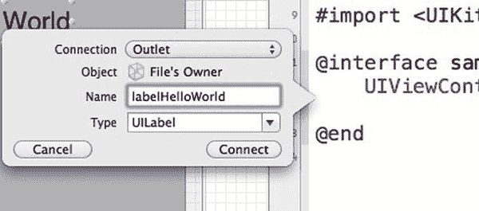

**图 2–4.** *配置输出口的创建*

现在头文件看起来像这样：

```
//
//  sample1ViewController.h
#import <UIKit/UIKit.h>
@interface sample1ViewController : UIViewController {
    UILabel *labelHelloWorld;
}

@property (strong, nonatomic) IBOutlet UILabel *labelHelloWorld;

@end
```

而实现（`.m`）文件中的相关代码现在看起来像这样：

```
//
//  sample1ViewController.m
#import "sample1ViewController.h"

@implementation sample1ViewController
@synthesize labelHelloWorld;

- (void)viewDidUnload
{
    [self setLabelHelloWorld:nil];
    [super viewDidUnload];
    // Release any retained subviews of the main view.
    // e.g. self.myOutlet = nil;
}

@end
```

你可以使用相同的步骤为按钮和其他对象创建 `IBAction`。从 `.xib` 文件中的按钮或类似对象 `^`-点击并拖拽到实现（`.h`）文件，然后释放。这一次，将 Connection 下拉菜单从 Outlet 改为 Action。如果此选项没有出现，说明选中的对象类型错误。图 2–5 和 2–6 详细展示了以这种方式配置操作的流程。

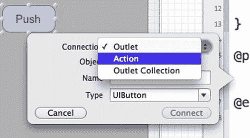

**图 2–5.** *创建操作*

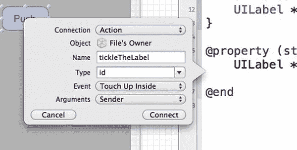

**图 2–6.** *配置操作*

你可以指定操作的名称、类型、触发操作的事件以及要发送的参数。与输出口连接一样，代码将更新为包含支持你新操作的占位符。

接口（`.h`）文件现在包含了 `IBAction` 声明：

```
//
//  sample1ViewController.h
#import <UIKit/UIKit.h>

@interface sample1ViewController : UIViewController {
    UILabel *labelHelloWorld;
}

@property (strong, nonatomic) IBOutlet UILabel *labelHelloWorld;
- (IBAction)tickleTheLabel:(id)sender;

@end
```

并且实现（`.m`）文件包含了一个供你完成的方法占位符：

```
- (IBAction)tickleTheLabel:(id)sender {
}
```

我打算用以下代码来完成 `tickleTheLabel` 方法：

```
- (IBAction)tickleTheLabel:(id)sender {
    self.labelHelloWorld.text=@"That tickled";
}
```

图 2–7 和 2–8 显示，现在当应用程序运行并且按钮被触摸时，`labelHelloWorld` 会更新。

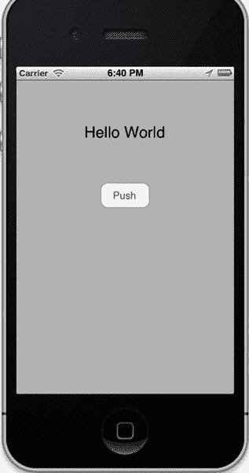

**图 2–7.** *原始视图*

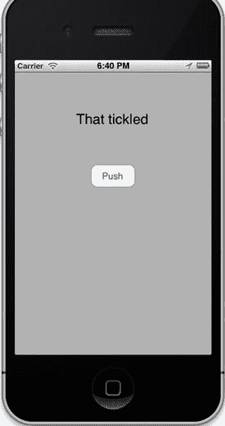

**图 2–8.** *执行操作后的视图*


### 触控手势

Interface Builder 新增的功能之一是能直接在界面生成器中为对象分配触摸手势识别器。Xcode 右下角区域提供了各种手势，其面板类似于图 2-9 所示。

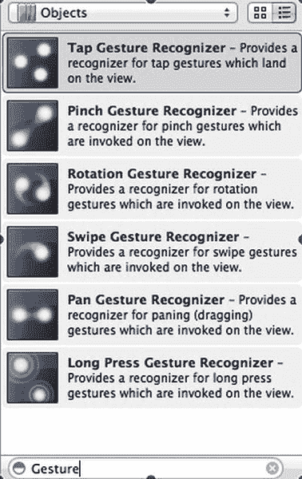

**图 2-9.** *可用的手势识别器*

要为`.xib`文件中的对象添加手势识别器，只需从对象浏览器中将手势识别器拖放到目标对象上，操作方式与图 2-10 所示类似。这会将该手势识别器添加到`.xib`项目文件的对象列表中，如图 2-11 所示。

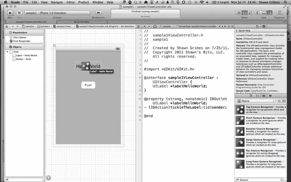

**图 2-10.** *为元素添加手势识别器*

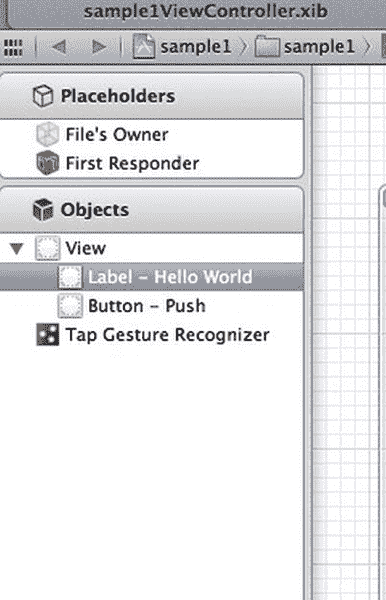

**图 2-11.** *大纲视图中生成的手势识别器*

继续操作前，务必确保目标对象已启用用户交互。在本例中，你将其附加到了“Hello World”标签上。点击该标签并转到属性检查器选项卡，即可将用户交互设置为`true`。在“视图”选项中，勾选“已启用用户交互”旁边的复选框，如图 2-12 所示。这将确保对象能响应手势识别器。

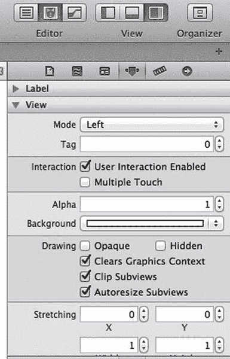

**图 2-12.** *属性检查器*

通过在`.xib`文件的停靠栏大纲视图中点击手势识别器，你可以在属性检查器面板中为其进行设置。图 2-13 展示了可应用于该识别器的各种配置。

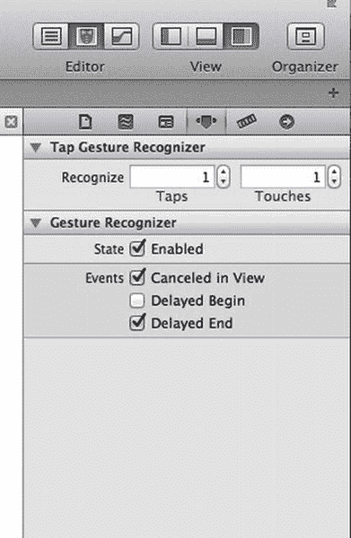

**图 2-13.** *调整手势识别器的属性*

设置完成后，你可以按照与之前相同的方法，从手势识别器对象按住 ^ 键拖拽到助理编辑器面板中的接口（`.h`）文件，从而将该手势连接到一个`IBAction`。在弹出的类似于图 2-14 的窗口中，指定名称并点击“连接”。该操作的占位符将像之前一样被添加到你的代码中。

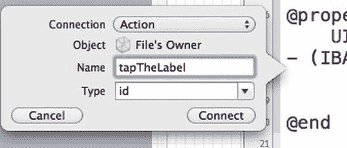

**图 2-14.** *将操作连接到标签*

现在，你的接口文件看起来像这样：

```
//
//  sample1ViewController.h
#import <UIKit/UIKit.h>

@interface sample1ViewController : UIViewController {
    UILabel *labelHelloWorld;
    UITapGestureRecognizer *tapTheLabel;
}

@property (strong, nonatomic) IBOutlet UILabel *labelHelloWorld;
- (IBAction)tickleTheLabel:(id)sender;
- (IBAction)tapTheLabel:(id)sender;

@end
```

我已经在实现（`.m`）文件中创建了新的`tapTheLabel`操作，如下所示：

```
- (IBAction)tapTheLabel:(id)sender {
    self.labelHelloWorld.text=@"Tap Tap Tap";
}
```

现在，当应用运行并点击标签时，你将看到图 2-15 和图 2-16 中展示的这两个界面。

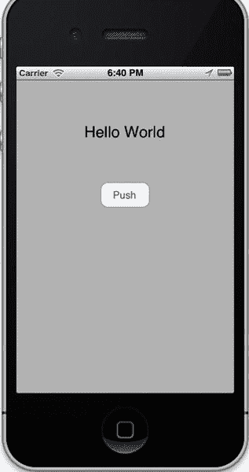

**图 2-15.** *应用的初始视图*


**图 2-16.** *标签点击后的视图*

### 调整色调

如果你想通过自定义导航栏或工具栏来赋予应用不同的外观和感觉，过去必须创建自己的自定义类；但在 Xcode 4.2 中，你现在可以通过新增的色调属性来自定义某些设计元素。`UINavigationBar`、`UIToolBar`、`UISearchBar`和`UISegmentedControl`都会响应此设置，并且这些设置可在 Interface Builder 中使用。其他控件也能响应色调设置，但该属性在 Xcode 中不可用，必须通过代码更改。要更新色调，请在`.xib`文件中选择一个支持色调属性的对象，然后在检查器面板中你应该能看到色调控件，如图 2-18 所示。图 2-17 展示了一个对多个元素进行了大幅度色调调整的视图。


**图 2-17.** *应用了色调的视图*


**图 2-18.** *在属性检查器中调整色调*

**注意：** `UISegmentedControl`仅在条形或斜面风格时支持在 Xcode 中设置色调。

### 使用故事板进行快速应用开发

还记得过去你必须用纸和笔来勾画应用的设计流程吗？后来有了流程图软件，你可以用数字方式记录工作流程和过程，但将这些工作流程转换为源代码仍需手动操作。苹果提供了一种名为故事板的新工具，它可以直观地展示应用的工作流，并能为你的应用生成一个可运行的框架。

#### 那么什么是故事板？

故事板是一系列`.xib`文件的集合，其中包含关于视图及其相互关系的元数据。这实现了自模型-视图-控制器（MVC）编程早期以来就广为流传的视图与模型、控制器的彻底分离。故事板有两个主要组成部分：场景和转场。

##### 场景

场景是任何填满设备屏幕的视图。它们包含 UI 对象，并由视图控制器（或视图控制器的子类）控制。这几乎与你熟悉并在 Interface Builder 中编辑的`.xib`文件完全相同。图 2-19 展示了你即将构建的故事板中的三个不同场景。


**图 2-19.** *编辑场景*

##### 转场

转场是在故事板中呈现后续视图的过渡方式。转场可以以推入、模态视图、弹出视图或自定义过渡的方式呈现视图。转场属于`UIStoryboardSegue`类，并包含三个属性：`sourceViewController`、`destinationViewController`和`identifier`。`identifier`是一个`NSString`，可用于验证转场是否是你期望的那个。

你通常根据用户的某个操作来启动转场。这可以是点击按钮或表格视图单元格，也可以是手势识别器的结果。转场在故事板上由连接两个场景的线条表示，如图 2-20 所示。


**图 2-20.** *连接两个场景的转场*


### 讲述故事

在 Xcode 4.2 中，除了空项目模板外，所有应用程序模板都提供了 Storyboard。创建新项目时，只需在设置新项目选项时选择“Use storyboard”即可。在本例中，您将把项目命名为 `"aboutUs"`，如图 2–21 所示。


**图 2–21.** *配置 Storyboard 的使用*

项目创建后，您会看到 Storyboard 选项已填充在目标摘要（Summary）选项卡中，并且信息（Info）选项卡中增加了一个字段（如图 2–22 和 2–23 所示），即“主 Storyboard 文件基本名称（Main storyboard file base name）”。


**图 2–22.** *主 Storyboard 信息*


**图 2–23.** *Storyboard 目标设置*

最后，在项目导航窗格中，您会看到 `MainStoryboard.storyboard` 文件，如图 2–24 所示。点击此文件将其加载到 Interface Builder 中，然后开始构建您的 Storyboard。


**图 2–24.** *Storyboard 文件*

在本示例中，您将构建一个简单的项目来显示您公司的信息。Storyboard 从一个视图开始，该视图由作为项目一部分创建的 `aboutUsViewController` 控制。我将向该视图中添加一些对象（`UILabel`、`UITextView` 和两个 `UIButton`），使其对用户更具信息性。请参考图 2–25 了解要构建的视图。


**图 2–25.** *`aboutUsViewController` 视图*

现在，我想将此视图嵌入到导航控制器中，而 Xcode 4.2 使这项任务变得简单。如图 2–26 所示，选中该视图，然后转到菜单选项 **Editor**  **Embed In**  **Navigation Controller**。这将创建一个导航控制器，将其添加到您的 Storyboard 中，并在导航视图和您的 `aboutUsView` 之间创建一个 Segue。生成的 Segue 将用一个箭头表示，如图 2–27 所示。


**图 2–26.** *在控制器中嵌入视图*


**图 2–27.** *生成的嵌入视图显示*

现在，我即将向 Storyboard 中添加一个新的 `UIViewController` 对象，您可以在其中放置您的联系信息。这就像从对象库中拖拽一个 `UIViewController` 对象以及一个 `UIView` 到 Storyboard 中一样简单。我通过添加一个 `UILabel` 作为标题，然后再添加几个 `UILabel` 用于联系信息来设置视图。图 2–28 显示了这些添加的结果。


**图 2–28.** *配置好的场景*

为了将新的联系信息视图连接到“关于我们”视图，您需要点击“关于我们”视图上的“联系我们”`UIButton`，然后 `^-click-drag`（按住 Command 键并点击拖拽）到联系信息视图。此操作与用于连接 Outlet 和 Action 的操作相同，而您接下来要做的正是如此。您要将“联系我们”按钮连接到 `performSegueWithIdentifier` 这个 Action。松开鼠标按钮时，会弹出一个对话框，询问您要连接到哪个 Action，您可以选择 `performSegueWithIdentifier:sender`。这些步骤以及生成的 Segue 如图 2–29 和 2–30 所示。


**图 2–29.** *配置 Segue Action*


**图 2–30.** *执行 Segue 弹出对话框*

连接建立后，`UINavigationBar` 会自动添加到视图中。如果您为每个视图指定了标题，结果将类似于图 2–31。


**图 2–31.** *通过 Segue 连接好的场景*

一个好的习惯是为您的 Segue 提供一个标识符（identifier）。如果您最终将多个 Segue 连接到同一个视图，这将有助于使您的应用程序经得起未来考验。您可以检查调用 Segue 的标识符，以了解用户到达该视图所走的路径并做出相应响应。您可以通过在 Storyboard 中选择 Segue 并检查其检查器窗格中的属性来设置 Segue 的标识符，如图 2–32 所示。


**图 2–32.** *设置 Segue 标识符*

如果您现在运行这个应用程序，图 2–33 和 2–34 会向您展示，“联系我们”按钮将正常工作并加载联系信息视图，而无需编写任何代码。


**图 2–33.** *主模拟视图*


**图 2–34.** *已执行的 Segue 结果*

那另一个按钮“我们的应用”呢？您想创建一个新视图来列出您的其他应用，以便进行一些交叉推广。当我听到“列表”这个词时，我首先想到的是 `UITableViewController`。而 Storyboarding 将 `UITableViewController` 的便捷性提升到了一个全新的水平。

我将拖拽一个 `UITableViewController` 到 Storyboard 中，创建一个“应用表格”视图。您首先会注意到，这看起来与 Interface Builder 中提供的常规 `UITableViewController` 略有不同。顶部有一些名为“原型单元格（Prototype Cells）”的东西，如图 2–35 所示。使用 Storyboards，您可以通过称为“原型（prototype）”的方式自定义 `UITableViewCell` 的布局和对象。我们稍后会进一步探讨这个问题。


**图 2–35.** *将 `UITableView` 插入到场景中*

选中表格视图，然后在属性检查器中，将 Content 从“动态原型（Dynamic Prototypes）”更改为“静态单元格（Static Cells）”。我还将样式改为“分组（Grouped）”，因为我喜欢单元格圆角边框的外观。图 2–36 和 2–37 展示了这些步骤及其结果。


**图 2–36.** *静态单元格配置*


**图 2–37.** *分组单元格*

由于每个单元格都将具有相同的布局，我将删除底部两个单元格，以便能够快速复制顶部单元格。现在，我将使用一个 `UIImageView`（用于存放应用图标）和两个 `UILabel`（用于应用名称和描述）来自定义剩余的单元格，如图 2–38 所示。


**图 2–38.** *自定义单元格*

现在，选中已按您规格设计好的剩余单元格，然后按住  键并 `-click-drag`（点击拖拽）以在其下方复制。重复此操作，为 `UITableView` 添加第三行，如图 2–39 所示。


**图 2–39.** *复制单元格*

现在，您可以自定义 `UITableView` 中的每个图像和标签，以列出您将展示的三个应用，最终得到类似于图 2–40 的视图。


**图 2–40.** *自定义复制的单元格*

剩下的就是将“关于我们”视图中的按钮连接到这个新视图。选中“关于我们”视图中的按钮，然后 `^-click-drag`（按住 Command 键并点击拖拽）到您刚刚创建的 `UITableView`。现在，您的 Storyboard 看起来类似于图 2–41 所示。


**图 2–41.** *新连接的表格控制器*


当您运行应用程序时，“关于我们”视图上的两个按钮现在都能正常工作，如图 2–42 所示。无需编写任何代码，您就可以加载这些页面。


**图 2–42.** *应用程序的三个结果视图*

### 在场景间传递数据

前面的应用部分无需任何代码就能很好地工作，但只需在后台添加少量代码，您就能在极短的时间内创建出功能更强大的界面。

当您看到`UITableView`时，几乎会本能地知道，当您触摸其中一个单元格时，很可能关联着一个详细视图。现在我们来添加这个详细视图。将名为`AppDetailsViewController`的新`UIViewController`对象拖放到故事板上，并向其中添加一个`UIImage`、一个`UILabel`、一个`UITextView`和两个`UIButton`，类似于图 2–43 所示。


**图 2–43.** *详细视图的用户界面*

您希望每个`UITableViewCell`在被触摸时都能跳转到这个 App 详细视图，因此按住 ^ 键并点击拖动，从`UITableViewCell`拖到详细视图。和之前一样，会弹出一个菜单显示可用的操作，您应该选择“`performSegueWithIdentifier:selector:`”，如图 2–44 和图 2–45 所示。


**图 2–44.** *将单元格连接到详细视图*


**图 2–45.** *选择跳转动作*

您将看到一条跳转线连接表格和 App 详细视图控制器。正如图 2–46 所示，选中该跳转线，并在属性检查器中为其输入一个标识符。


**图 2–46.** *配置详细视图跳转标识符*

对另外两个`UITableViewCell`重复此过程，并为每个连接使用相同的跳转标识符，因为您将对每个跳转执行相同的代码。现在您应该看到三条跳转线连接这两个视图，类似于图 2–47 所示。


**图 2–47.** *连接`UITableView`到视图控制器的多个跳转线*

到目前为止，您没有使用任何代码就完成了这些工作，但这种便利即将结束。您需要在 App 详细视图控制器上生成一些动态内容，因此需要深入编写一些代码。

首先，您将创建一个自定义类来保存应用的相关信息。由于目前应用的列表是静态的，我将创建一个`NSObject`的非常基础的子类来保存数据。使用菜单项 **文件** **新建**  **新建文件…**，并从 Cocoa Touch 模板中选择“Objective-C class”，如图 2–48 所示。


**图 2–48.** *选择“Objective-C class”模板来创建一个新的基础类*

现在，如图 2–49 所示，如果“Subclass of”下拉菜单中尚未指定，请从其中选择`NSObject`。


**图 2–49.** *确保“Subclass of”字段指定为`NSObject`，以创建一个`Object`子类*

最后，将类名设置为`MyAppClass`。如图 2–50 所示，但与之前一样，较新版本的 Xcode 可能会将此步骤与之前指定“Subclass of”字段的步骤合并。


**图 2–50.** *指定类名——在较新版本的 Xcode 中，此步骤可能已包含在前一个屏幕中。*

您希望这个类具有以下接口（`.h`）：

```
//  MyAppClass.h
#import <Foundation/Foundation.h>

@interface MyAppClass : NSObject

@property(strong, nonatomic) NSString *appName;
@property(strong, nonatomic) UIImage *iconImage;
@property(strong, nonatomic) NSString *appDescription;
@property(strong, nonatomic) NSURL *appStoreURL;
@property(strong, nonatomic) NSURL *webSiteURL;

+(MyAppClass *)appWithAppID:(int)appID;

@end
```


实现文件（`.m`）应如下所示：

```objc
#import "MyAppClass.h"

@implementation MyAppClass

@synthesize appName;
@synthesize iconImage;
@synthesize appDescription;
@synthesize appStoreURL;
@synthesize webSiteURL;

+ (MyAppClass *)appWithAppID:(int)appID {
    MyAppClass *newApp = [[MyAppClass alloc] init];
    newApp.appName = [NSString stringWithFormat:@"App %i Name", appID];
    newApp.iconImage = [UIImage imageNamed:[NSString stringWithFormat:@"app%iicon.png", appID]];
    newApp.appDescription = [NSString stringWithFormat:@"This is the description for App %i", appID];
    newApp.appStoreURL = [NSURL URLWithString:[NSString stringWithFormat:@"itms-apps://itunes.com/apps/%iappName", appID]];
    newApp.webSiteURL = [NSURL URLWithString:[NSString stringWithFormat:@"http://www.shawnsbits.com/apps/%iappName", appID]];
    return newApp;
}

- (id)init {
    self = [super init];
    if (self) {
        // Initialization code here.
    }
    return self;
}

@end
```

**注意：** 如果你想知道内存管理去了哪里，请参阅第 1 章中关于自动引用计数的部分，即“Steve and the ARC”。

这样就设置好了数据对象，但现在你需要编写详情视图控制器来显示`MyAppClass`对象的属性。你需要一个自定义视图控制器类来控制视图。通过 **File** > **New** > **New File…** 创建一个新文件，并从 Cocoa Touch 模板中选择“`UIViewController` subclass”，如图 2-51 所示。


**图 2-51.** *选择“`UIViewController` subclass”模板，创建预配置了重要`UIViewController`方法的文件*

现在，如图 2-52 所示，将其设置为`UIViewController`的子类（如果默认未指定），并确保**不**选中“With XIB for user interface”复选框。你将使用故事板来代替 XIB。


**图 2-52.** *配置`UIViewController`的子类*

将新类命名为`AppDetailsViewController`，并使用以下接口（`.h`）文件定义：

```objc
//  AppDetailsViewController.h

#import <UIKit/UIKit.h>
#import "MyAppClass.h"

@interface AppDetailsViewController : UIViewController

@property (strong, nonatomic) MyAppClass *selectedApp;
@property (strong, nonatomic) IBOutlet UILabel *labelAppName;
@property (strong, nonatomic) IBOutlet UIImageView *imageAppIcon;
@property (strong, nonatomic) IBOutlet UITextView *textViewAppDescription;
@property (strong, nonatomic) IBOutlet UIButton *buttonAppStore;
@property (strong, nonatomic) IBOutlet IButton *buttonWebSite;

- (IBAction) loadAppStore:(id)sender;
- (IBAction) loadWebSite:(id)sender;

@end
```

这个接口文件将创建视图所需的输出口，以及将分配给`UIButton`的两个`IBAction`。实现文件（`.m`）如下：

```objc
//  AppDetailsViewController.m

#import "AppDetailsViewController.h"

@implementation AppDetailsViewController

@synthesize selectedApp;
@synthesize labelAppName;
@synthesize imageAppIcon;
@synthesize textViewAppDescription;
@synthesize buttonAppStore;
@synthesize buttonWebSite;

- (IBAction) loadAppStore:(id)sender{
    [[UIApplication sharedApplication] openURL:self.selectedApp.appStoreURL];
}

- (IBAction) loadWebSite:(id)sender{
    [[UIApplication sharedApplication] openURL:self.selectedApp.webSiteURL];
}

- (void)viewDidLoad {
    [super viewDidLoad];
    self.labelAppName.text = selectedApp.appName;
    self.imageAppIcon.image = selectedApp.iconImage;
    self.textViewAppDescription.text = selectedApp.appDescription;
}

- (id)initWithNibName:(NSString *)nibNameOrNil bundle:(NSBundle *)nibBundleOrNil {
    self = [super initWithNibName:nibNameOrNil bundle:nibBundleOrNil];
    if (self) {
        // Custom initialization
    }
    return self;
}

- (void)didReceiveMemoryWarning {
    // Releases the view if it doesn't have a superview.
    [super didReceiveMemoryWarning];
    // Release any cached data, images, etc. that aren't in use.
}

- (void)viewDidUnload {
    [super viewDidUnload];
    self.labelAppName = nil;
    self.imageAppIcon = nil;
    self.textViewAppDescription = nil;
    self.buttonAppStore = nil;
    self.buttonWebSite = nil;
}

- (BOOL)shouldAutorotateToInterfaceOrientation:(UIInterfaceOrientation)interfaceOrientation {
    // Return YES for supported orientations
    return (interfaceOrientation == UIInterfaceOrientationPortrait);
}

@end
```

这个控制器类将使用`MyAppClass`对象“`selectedApp`”的属性填充视图。现在你需要将这个视图控制器附加到视图上，并连接输出口和`IBAction`。返回故事板编辑器，选择 App Details 视图底部的视图控制器对象，如图 2-53 所示。


**图 2-53.** *选择视图控制器*

现在，你可以在检查器选项卡中选择身份检查器，并将类设置为自定义的`AppDetailsViewController`类。图 2-54 演示了如何执行此操作。


**图 2-54.** *指定视图控制器*

按照图 2-55，将所有对象连接到对应的输出口。


**图 2-55.** *配置元素与属性*

要连接动作，你需要反向操作。从`UIButton`拖拽到视图或视图控制器对象，然后从弹出菜单中选择对应的`IBAction`，如图 2-56 所示。


**图 2-56.** *连接动作*

现在你可以接收一个`MyAppClass`对象并在 App Details 视图上正确显示它，但接下来你需要在加载此视图时发送该对象。为此，你将配置上一个视图（Apps Table View 列表），使其在执行跳转时发送该对象。事实证明，有一个专门的方法：`- (void)prepareForSegue:(UIStoryboardSegue *)segue sender:(id)sender;`。你可以在自定义的`UITableViewController`中重写此方法，以发送选中的对象。

首先，你需要一个新的自定义`UITableViewController`类。通过 **File** > **New** > **New File…** 创建一个新文件，并从 Cocoa Touch 模板中选择“`UIViewController` class”，如图 2-57 所示。


**图 2-57.** *指定`UIViewController`子类文件*

这次，你希望它成为`UITableViewController`的子类，并且同样确保不为新类创建 XIB，如图 2-58 所示。


**图 2-58.** *配置`UITableViewController`的子类*

将类命名为“`AppListTableViewController`”。接口文件（`.h`）无需更改，因此直接跳转到实现文件（`.m`）。你要做的第一件事是清除`tableView`数据源和`tableView`委托的方法，因为你在故事板中使用了静态定义的`UITableViewCell`。因此，请删除或注释掉以下方法：


`- (NSInteger)numberOfSectionsInTableView:(UITableView *)tableView`  
`- (NSInteger)tableView:(UITableView *)tableView numberOfRowsInSection:(NSInteger)section`  
`- (UITableViewCell *)tableView:(UITableView *)tableView cellForRowAtIndexPath:(NSIndexPath *)indexPath`  
`- (void)tableView:(UITableView *)tableView didSelectRowAtIndexPath:(NSIndexPath *)indexPath`

在实现文件的顶部，导入你创建的两个自定义类：

`#import "AppDetailsViewController.h"`  
`#import "MyAppClass.h"`

现在使用以下代码覆盖 `prepareForSegue` 方法：

`- (void)prepareForSegue:(UIStoryboardSegue *)segue sender:(id)sender {`  
`    if ([segue.identifier isEqualToString:@"AppDetailsLoadFromTableViewCell"]) {`  
`        AppDetailsViewController *appDetailsVC = segue.destinationViewController;`  
`        appDetailsVC.selectedApp = [MyAppClass appWithAppID:[[self.tableView indexPathForSelectedRow] row] + 1];`  
`    }`  
`}`

这段代码用于检查你正在响应的 segue 是否正确，以防将来添加额外的 segue。之后，它会获取 `tableView` 当前选中的行，并将其加 1（因为你的应用从 1 开始编号，而行计数从 0 开始）。接着，它会使用该 appID 和你创建的便捷方法 `appWithAppID:` 创建一个 `MyAppClass` 对象。这个新对象被赋值给 `destinationViewController`（一个 `AppDetailsViewController` 实例）的 `selectedApp` 属性。

在继续测试该应用之前，请确保 `AppListTableViewController` 已被设置为 App List 表格视图控制器的类。

如果你现在运行应用，你会看到每个 `UITableViewCell` 都会将不同的应用详情加载到 `detailsViewController` 中。图 2–59 展示了该应用的模拟运行结果。


**图 2–59.** *模拟应用中显示的详情视图*

### UITableViewCell 原型

到目前为止，应用按预期运行，但如果你向库存中添加新应用会怎样？在当前的应用布局下，这意味着必须为每个新应用项更新 `UITableView` 并添加新的单元格。如果动态加载 `UITableView`，这样每次有新应用时就不必更新故事板 XIB，岂不是更简单？

首先，你将创建一个自定义的 `UITableViewCell` 类，该类包含映射现有 `UITableViewCell` 的插座。使用菜单选项 **File**  **New**  **New File…**，并从 Cocoa Touch 模板中选择 "Objective-C class"。创建一个 `UITableViewCell` 的子类，并将其命名为 `AppUITableViewCellClass`，如图 2–60 所示。


**图 2–60.** *配置 `UITableViewCell` 子类*

在接口文件（`.h`）中，创建两个 `UILabel` 插座属性和一个 `UIImage` 插座属性。代码应如下所示：

```
//  AppUITableViewCellClass.h

#import <UIKit/UIKit.h>

@interface AppUITableViewCellClass : UITableViewCell

@property (strong, nonatomic) IBOutlet UILabel *labelAppName;
@property (strong, nonatomic) IBOutlet UIImageView *imageAppIcon;
@property (strong, nonatomic) IBOutlet UILabel *labelAppDescription;

@end
```

接下来要做的就是在实现文件（`.m`）中合成这些属性：

```
//  AppUITableViewCellClass.m

#import "AppUITableViewCellClass.h"

@implementation AppUITableViewCellClass

@synthesize labelAppName;
@synthesize imageAppIcon;
@synthesize labelAppDescription;

@end
```

切换回你的故事板视图，并使用属性检查器将 `UITableView` 的内容模式改为动态原型，如图 2–61 所示。


**图 2–61.** *重新选择动态原型*

你的表格视图现在应该看起来像图 2–62。你会注意到之前创建到 App 详情视图的 Segue 以及静态单元格布局都已经消失了。


**图 2–62.** *新的表格视图*

将 `UIImageView` 和 `UILabel` 对象拖拽到 `UITableViewCell` 原型上，并设置其内容为 "App Name Label" 和 "App Description"，如图 2–63 所示。然后，在身份检查器窗格中将 `UITableViewCell` 的类设置为你的自定义类 `AppUITableViewCellClass`。


**图 2–63.** *将单元格配置为 `UITableViewCell` 的自定义子类*

现在，按住 ^ 键并从 `UITableViewCell` 点击拖拽到 App Name 标签，当松开鼠标按钮时，会显示一个包含插座列表的弹出窗口。选择 `labelAppName` 插座。连接 `UITableViewCell` 中的其他对象。图 2–64 演示了这些步骤中的第一步。


**图 2–64.** *连接单元格元素到插座*

你还需要在属性检查器中设置表格视图单元格标识符字段，如图 2–65 所示。


**图 2–65.** *设置单元格标识符*

现在，按住 ^ 键并从 `UITableViewCell` 点击拖拽到 App Detail 视图控制器以创建 Segue，如图 2–66 所示。


**图 2–66.** *重新配置详情视图 Segue*

然后，通过选中 Segue 并在属性检查器中设置来为其设置标识符，如图 2–67 所示。


**图 2–67.** *设置新的 Segue 标识符*

现在你需要将 `AppUITableViewCellClass` 和数据源方法添加到 `AppListTableViewController` 的实现文件（`.m`）中。

```
//  AppListTableViewController.m
```


```objc
#import "AppListTableViewController.h"
#import "AppDetailsViewController.h"
#import "MyAppClass.h"
#import "AppUITableViewCellClass.h"

@implementation AppListTableViewController

- (void)prepareForSegue:(UIStoryboardSegue *)segue sender:(id)sender{
    if([segue.identifier isEqualToString:@"AppDetailsLoadFromTableViewCell"]){
        AppDetailsViewController *appDetailsVC = segue.destinationViewController;
        appDetailsVC.selectedApp=[MyAppClass appWithAppID:[[self.tableView indexPathForSelectedRow] row]+1];
    }
}

#pragma mark - 表格视图数据源
- (NSInteger)numberOfSectionsInTableView:(UITableView *)tableView
{
    return 1;
}
- (NSInteger)tableView:(UITableView *)tableView numberOfRowsInSection:(NSInteger)section
{
    return 3;
}

- (UITableViewCell *)tableView:(UITableView *)tableView cellForRowAtIndexPath:(NSIndexPath *)indexPath
{
    //设置你在故事板中指定的 CellIdentifier
    static NSString *CellIdentifier = @"appCell";

    AppUITableViewCellClass *cell = [tableView dequeueReusableCellWithIdentifier:CellIdentifier];
    if (cell == nil) {
        cell = [[AppUITableViewCellClass alloc] initWithStyle:UITableViewCellStyleDefault reuseIdentifier:CellIdentifier];
    }

    //配置单元格
    MyAppClass *appForCell=[MyAppClass appWithAppID:indexPath.row+1];
    cell.labelAppName.text=appForCell.appName;
    cell.labelAppDescription.text=appForCell.appDescription;
    cell.imageAppIcon.image=appForCell.iconImage;

    return cell;
}
```

现在运行应用时，`UITableView` 会像之前一样，使用那个原型单元格和数据源来加载。图 2–68 显示了应用最新更新后的模拟结果。在此例中，你仍在使用 `MyAppClass` 的静态数据，但该应用可以轻松扩展，使用 Core Data 对象模型，甚至从服务器上的远程 XML 文件中拉取应用列表，从而实现真正的动态效果。这些功能将在第 10 章（数据存储方案）和第 11 章（Core Data 方案）中进一步介绍。


**图 2–68.** *最新更改后的新应用视图*

### 向现有项目添加故事板

你已经创建了一个“关于我们”应用，它运行良好，但独立来看并不出彩。它的目的是被包含在你的其他应用中，以便你能够轻松地在任何应用中展示公司信息，并方便地交叉推广你的应用库。

苹果为故事板提供了 API，使它们可以轻松地集成到尚未使用故事板的现有应用中。`UIStoryboard` 类提供了方法 `+storyboardWithName:bundle:`，用于加载指定名称的故事板。然后，你可以通过方法 `– instantiateInitialViewController` 加载故事板中的初始视图控制器。

现在，我们创建一个不使用故事板的新项目，命名为“Chapter2Project”。使用菜单选项 **文件**  **新建**  **新建项目…** 来创建一个新的单视图应用程序。执行此操作的窗口将类似于图 2–69。


**图 2–69.** *选择单视图应用程序*

这次，你将项目命名为“Chapter2Project”，并确保未选中“使用故事板”，就像图 2–70 所示。如果你的 Xcode 版本包含该选项，也请确保勾选“使用自动引用计数”复选框。如果你的版本还包含“类前缀”字段，请将其设置为 Chapter2Project。


**图 2–70.** *配置不使用故事板的新项目*

使用该新项目的导航窗格，在项目下创建一个名为“AboutUsStoryBoard”的新分组，结果如图 2–71 所示。


**图 2–71.** *向项目添加子分组*

现在，选择 `Chapter2ProjectViewController.xib`，并添加一个 `UIButton`，在触摸它时启动“关于我们”视图。你的视图应类似于图 2–72 所示。


**图 2–72.** *已配置的视图控制器界面*

接下来，让我们通过使用助理编辑器并进行 `control-点击-拖拽` 操作，从 `UIButton` 到 `Chapter2ProjectViewController` 接口文件（`.h`），将该“关于我们”按钮连接到一个 `IBAction`。将连接类型更改为“动作”，并在“名称”字段输入 **showAboutUsView**，如图 2–73 所示。


**图 2–73.** *配置 `UIButton` 的动作*

在完成那个方法占位符之前，你需要将“关于我们”文件复制到此项目中。切换到“关于我们”项目，为了避免将“关于我们”故事板与你未来可能添加到项目中的任何其他故事板混淆，你应该重命名故事板。在项目导航窗格中，将 `MainStoryboard.storyboard` 的名称更改为 `AboutUs.storyboard`。如果你选择创建的是通用应用，它最初可能被命名为 `MainStoryboard_iPhone.storyboard`。在图 2–74 中，你可以看到故事板文件已被重命名为新名称。


**图 2–74.** *为新建项目重命名故事板文件*

现在，选择 AboutUs 组中除 `aboutUsAppDelegate.h`/`.m` 文件之外的所有文件，并将它们复制到你之前创建的 Chapter2Project 项目的 AboutUs 组中。如果通过“拖放”移动这些文件，请确保在出现的传输窗口中勾选“将项目复制到目标组的文件夹中”复选框。图 2–75 显示了从先前项目中复制文件后的导航窗格。


**图 2–75.** *将故事板文件复制到你的新项目中*


现在你可以在 `Chapter2ProjectViewController` 的实现文件（`.m`）中补全你之前创建的 `IBAction` 了。在项目导航面板中选择 `Chapter2ProjectViewController.m`，并导入 `aboutUsViewController.h` 头文件。然后向下滚动到代码底部 `IBAction` 方法占位符所在位置，补全该方法，使文件内容如下所示：

```
//  Chapter2ProjectViewController.m

#import "Chapter2ProjectViewController.h"
#import "aboutUsViewController.h"

@implementation Chapter2ProjectViewController
…
- (IBAction)showAboutUsView:(id)sender {
    UIStoryboard *aboutUsStoryboard=[UIStoryboard storyboardWithName:@"AboutUs"
bundle:nil];
    aboutUsViewController *aboutUsVC=[aboutUsStoryboard
instantiateInitialViewController];
    [self presentViewController:aboutUsVC animated:YES completion:nil];
}
@end
```

当项目运行并点击按钮时，你的故事板将会加载，所有后续视图也会随之加载，最终呈现的视图将类似于图 2–76 所示。


**图 2–76.** *加载故事板后的应用结果*

但存在一个问题。当你查看完“关于我们”视图控制器后，无法将其关闭。最简单的解决办法是在故事板中的该视图上添加一个“返回”按钮来关闭视图。

首先，在 `aboutUsViewController` 的接口文件（`.h`）中定义“返回”按钮将要触发的 `IBAction`：

```
//  aboutUsViewController.h

#import <UIKit/UIKit.h>

@interface aboutUsViewController : UIViewController

-(IBAction)closeAboutUs:(id)sender;

@end
```

然后在 `aboutUsViewController` 的实现文件（`.m`）中实现该方法：

```
//  aboutUsViewController.m

#import "aboutUsViewController.h"

@implementation aboutUsViewController

-(IBAction)closeAboutUs:(id)sender{
    [self dismissViewControllerAnimated:YES completion:nil];
}
```

打开 `AboutUs.storyboard`，在“关于我们”视图的 `UINavigationBar` 中添加一个标题为“返回”的 `UIBarButtonItem` 对象。然后通过按住 ^ 键并点击拖拽，从 `UIBarButtonItem` 连接到视图控制器的状态栏，并在弹出的菜单中选中 `closeAboutUs` 事件，从而将此 `UIBarButtonItem` 连接到 `IBAction closeAboutUs`。这些步骤在图 2–77 中进行了演示。


**图 2–77.** *将栏按钮连接到跳转动作*

现在，当你运行应用程序时，你将能够启动“关于我们”故事板，并返回到你的主应用。不要忘记，你应该将这个 `UIBarButtonItem` 和方法添加到主“关于我们”项目中，这样当你将其复制到未来的项目时，就不会遇到同样的问题了。

### 总结

你在 Xcode 4 中首先会注意到的是，Interface Builder 不再是一个独立的应用程序。然而，这些变化远不止于此，它带来了一种真正集成的体验。Interface Builder 将拖放式界面构建的便捷性扩展到了与 Assistant Editor 视图结合时的代码生成中。

故事板工具将你的界面构建推向了更高层次，使你能够快速构建应用程序的工作原型。你的故事板图表在编码开始时不再被丢弃，而是成为应用程序开发过程中不可或缺的一部分，并且可以被控制器所利用。这一新特性将“模型-视图-控制器”从一种抽象的最佳实践转变为切实的应用程序开发流程。

## 第 3 章

## 应用程序设计元素

每个行业都有其特定的一套材料、工具和方法，而一个人对这些设备的掌握程度和理解深度几乎决定了他在该领域能否取得成功。在 iOS 开发中，你拥有大量可用于组装应用程序的组件和功能。对这些工具有充分且实用的理解，能够让任何开发者显著提升其参与工作的质量。

在本章中，你将系统地了解 iOS 开发者最初可以使用的设计元素，讨论它们的目的、用途、实现方式、功能，以及如何从每个元素中获得最佳效果的一般指南。通过这种方式，你可以更好地理解如何充分利用这些工具，创建出更高质量的应用程序。

### Cocoa Touch 控件

Cocoa Touch 包含了一系列被称为“控件”的丰富元素，这些是应用程序用来与用户交互的主要对象。所有这些元素（其中一些是 iOS 5.0 全新引入的）让你能够构建一个更先进、更简单的用户界面来操作你的应用程序。


### `UILabel`

`UILabel` 类可谓是最基本、最基础的空间之一，你可以用它来向用户显示信息。许多其他元素都使用了`UILabel`，使其成为几乎所有用户界面的基础。图 3-1 是`UILabel`最简单的示例。


**图 3-1.** 一个简单的`UILabel`

处理`UILabel`的主要方法是通过`-setText:`方法或更简单的`text`属性来设置其文本。然而，该类还提供了许多其他属性供你自定义显示效果，包括：

*   `font`
*   `textColor`
*   `textAlignment`
*   `enabled`：通过此属性可以轻松地使标签变暗或取消变暗，因为禁用的`UILabel`会以变暗效果显示。

若要对文本显示进行更精确的控制，你还可以使用`shadowColor`和`shadowOffset`属性创建阴影。`shadowOffset`属性的类型是`CGSize`，你可以使用`CGSizeMake()`函数来创建。此函数接受两个参数，即宽度和高度，用于指定阴影相对于标签的位置。例如，如果使用以下代码配置阴影，则生成的`UILabel`将类似于图 3-2。

```
myLabel.shadowColor = [UIColor blackColor];
myLabel.shadowOffset = CGSizeMake(2.0, 2.0);
```


**图 3-2.** 带有深阴影的文本

将此与没有阴影的`UILabel`进行比较，如图 3-3 所示。


**图 3-3.** 没有阴影的标签

如你所见，将`shadowOffset`的宽度指定为 2.0，高度指定为 2.0，标签的阴影将相对于原始文本向右偏移 2 点并向下偏移 2 点。可以想象，这些值为负数将导致阴影分别向左和向上移动。

利用`UILabel`的阴影通常有助于应用程序的图形设计，但通常很难确定理想的规格。一般来说，可以说“少即是多”，一个非常细微的改变，例如使用偏移量为(1.0, 1.0)的灰色阴影，将有助于提升应用程序的视觉效果。图 3-4 展示了一个没有阴影的`UILabel`与一个具有灰色阴影且偏移量为(1.0, 1.0)的`UILabel`的对比，以展示视觉效果上的差异。


**图 3-4.** 一个没有阴影的标签与一个具有一个平方点阴影的标签的比较

`UILabel`还有属性`highlightedTextColor`（你可以指定）和`highlighted`（允许你专门高亮标签）。但是，除非使用`highlightedTextColor`属性指定了高亮颜色，否则不会应用任何高亮颜色。

与许多其他元素一样，`UILabel`有一个名为`userInteractionEnabled`的属性。必须将此属性设置为`YES`才能使任何手势（例如点击）对`UILabel`产生影响。

### `UIButton`

作为双向用户交互的基石，`UIButton`允许你在应用程序中为用户提供明确的选择。

有多种预定义的`UIButton`类型可供使用。你可以通过类方法`+buttonWithType:`设置按钮的类型，该方法接受以下可能的预定义值：

*   `UIButtonTypeCustom`
*   `UIButtonTypeRoundedRect`
*   `UIButtonTypeDetailDisclosure`
*   `UIButtonTypeInfoLight`
*   `UIButtonTypeInfoDark`
*   `UIButtonTypeContactAdd`

如果没有为该属性指定值，则默认为自定义类型，让你在自定义按钮视图方面拥有最大的自由度。

一般而言，如果你只是想创建一个简单的带文本的按钮，可能会使用`UIButtonTypeRoundedRect`按钮；但如果需要一个更复杂的按钮（包括基于图像的按钮），则可能会使用`UIButtonTypeCustom`选项。这样，你可以更轻松地控制按钮的背景设置，确保视觉主题保持一致。

每当处理`UIButton`时，你必须始终考虑按钮可能处于的“状态”（即当前是否被选中）。因此，大多数`UIButton`方法都包含一个`UIControlState`参数。例如，要设置`UIButton`的文本，而不是访问`titleLabel`属性，你应该使用`-setTitle:forState:`方法。例如，你可以像这样配置一个`UIButton`：

```
UIButton *button = [UIButton buttonWithType:UIButtonTypeRoundedRect];
[button setTitle:@"Test" forState:UIControlStateNormal];
[button setTitle:@"Selected" forState:UIControlStateHighlighted];
```

请记住，当你以编程方式创建视图元素时，应设置其`frame`以指定位置，然后将其添加为相应视图的子视图。

```
[button setFrame:CGRectMake(10, 10, 100, 44)];
[self.view addSubview:button];
```

`UIButton`上的按钮标题本质上是一个`UILabel`，因此你可以使用`titleColorForState:`和`titleShadowColorForState:`等非常方法轻松自定义字体和阴影。

`UIButton`还允许在内部放置两种不同的图像：背景图像和前景图像。你可以使用`-setBackgroundImage:forState:`和`setImage:forState:`方法轻松设置这些图像。

为了以编程方式为`UIButton`添加操作，请使用`-addTarget:action:forControlEvents:`方法。

```
[button addTarget:self action:@selector(buttonPressed:)
forControlEvents:UIControlEventTouchUpInside];
```

然后，你可以定义`-buttonPressed:`方法来执行任何你喜欢的操作。如果以这种方式实现操作，对`UIButton`的引用将作为第一个参数传递给该方法。这使你能够通过检查“发送者”元素的属性并相应地采取相应操作，从而以单个方法响应大量不同事件。作为一个简单的例子，以下实现将在日志中显示被按下的按钮的文本。

```
-(void)buttonPressed:(UIButton *)sender
{
    NSLog(@"%@", sender.titleLabel.text);
}
```


### `UISegmentedControl`

`UISegmentedControl`类本质上是`UIButton`的扩展。它不仅允许你进行选择，还能无限期地保留这些选择，直到做出另一个选择。它专为那些始终需要从多个选项中选择一个的场景而设计，比如在地图应用中选择显示类型，或者在游戏中配置设置。

`UISegmentedControl`元素由多个“分段”（segments）组成，每个分段内可以包含一个字符串或一张图片，如图 3–5 所示。


**图 3–5.** *一个简单的`UISegmentedControl`*

每个分段都有一个与之对应的索引，第一个分段的索引为 0。

与`UIButton`类似，你可以为`UISegmentedControl`添加动作，以便在选中的分段发生改变时执行。使用`-addTarget:action:forControlEvents:`方法即可，示例如下：

`[self.segCon addTarget:self action:@selector(segmentChanged:) forControlEvents:UIControlEventValueChanged];`

当构建`UISegmentedControl`实例时，你可以在分配对象后，使用`-initWithItems:`方法指定一组初始显示项。之后，你可以使用`-insertSegmentWithImage:atIndex:animated:`和`-insertSegmentWithTitle:atIndex:animated:`方法来添加分段，并使用`-removeSegmentAtIndex:animated:`或`-removeAllSegments:`方法来移除分段。

在任何时候，你都可以通过`numberOfSegments`属性获取控件中当前项目的总数，并通过`selectedSegmentIndex`访问当前选中的索引。

一旦你有了想要访问的特定索引，可以使用`-setImage:forSegmentAtIndex:`、`imageForSegmentAtIndex:`、`setTitle:forSegmentAtIndex:`和`titleForSegmentAtIndex:`来根据需要修改或利用你的`UISegmentedControl`。以下是`UISegmentedControl`的一个动作示例，它将新选中分段的文本替换为其先前值的平方。

```
-(void)segmentChanged:(UISegmentedControl *)sender
{
    int index = sender.selectedSegmentIndex;
    NSString *title = [sender titleForSegmentAtIndex:index];
    int x = [title intValue]*[title intValue];
    NSString *newTitle = [[NSNumber numberWithInt:x] stringValue];
    [sender setTitle:newTitle forSegmentAtIndex:index];
}
```

### `UITextField`

`UITextField`是最易于定制的用户输入形式，也是使用最频繁的，因为它允许你轻松地获取用户输入并进行处理。你甚至可以对用户输入应用自动更正功能，但应谨慎使用，以避免不必要的更正。

如果你想在视图中添加一个`UITextField`，最简单的方法是在 XIB 文件中将其放置在视图中，如图 3–6 所示。然后，你可以将其作为属性连接到头文件，并在`-viewDidLoad`方法中进行配置。

无论何时处理`UITextField`（或之后你会遇到的其他基于文本的输入），最需要记住的一点是，键盘有时会遮挡屏幕的一半。作为设计者，你需要为此做好规划，确保你的`UITextField`位于屏幕的上半部分，或者在键盘出现时自动移动到上半部分。你可以通过注册以下通知，设置在键盘出现或消失时要执行的动作：

*   `UIKeyboardWillShowNotification`
*   `UIKeyboardDidShowNotification`
*   `UIKeyboardWillHideNotification`
*   `UIKeyboardDidHideNotification`


**图 3–6.** *在 XIB 界面中添加`UITextView`*

在 Interface Builder 中，你还可以轻松地对`UITextField`进行一些配置。你也可以通过`UITextField`的属性以编程方式实现所有这些更改，但 Interface Builder 能使其变得更容易，尤其是键盘设置，如自动大写和自动更正。图 3–7 是包含这些设置的属性检查器视图。如图所示，“更正”类型默认为“默认”，这会导致你在输入消息时常见的一般响应。


**图 3–7.** *在实用工具面板中配置`UITextField`*

通过使用`leftView`、`rightView`、`inputView`和`inputAccessoryView`属性，以编程方式自定义`UITextField`的视图也非常容易。

`UITextField`最重要的属性之一是`delegate`属性，它接收与`UITextField`动作相关的各种方法调用。被设置为`delegate`的对象（通常是显示`UITextField`的视图控制器）必须遵循`UITextFieldDelegate`协议。

`UITextFieldDelegate`协议指定了多种方法来管理`UITextField`的编辑。你可以使用`-textFieldShouldBeginEditing:`和`-textFieldShouldEndEditing:`方法来启用或禁用编辑的开始或结束。（在这两个方法中返回`NO`可禁用相应的动作。）

你还可以使用`-textFieldDidBeginEditing:`和`-textFieldDidEndEditing:`来移动周围的元素，确保键盘不会遮挡你的`UITextField`。

在编辑`UITextField`的文本方面，`UITextFieldDelegate`提供了一些方法来帮助你自定义文本字段的行为。`-textField:shouldChangeCharactersInRange:replacementString:`在主动解析输入的文本时非常有用。`-textFieldShouldClear:`方法也允许你决定是否清除`UITextField`的内容。

`UITextFieldDelegate`协议中最有用的方法可能是`-textFieldShouldReturn:`方法，它通常是实现关闭键盘的主要方法。大多数用户习惯于按回车键结束对`UITextField`的编辑，因此你可以像下面这样简单地实现这个方法：

```
-(BOOL)textFieldShouldReturn:(UITextField *)textField
{
    [textField resignFirstResponder];
    return YES;
}
```

通过使用`-resignFirstResponder`方法，你的`UITextField`放弃了作为当前关键元素的角色，从而关闭了键盘。如图 3–8 所示，模拟运行的应用将允许你通过按回车键来关闭键盘。


**图 3–8.** *一个启用了关闭键盘功能的应用*


