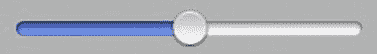

# UISlider

`UISlider` 提供了一个非常精美且简单的 UI 元素，用于让用户平滑地调整数值，如图 3-9 所示。

**图 3-9.** *一个简单的 `UISlider`*

这些滑块相当容易设置和配置。你可以使用 Interface Builder 完成大部分数值设置，也可以通过编程方式设置数值。需要配置的最重要的属性是 `minimumValue`、`maximumValue` 和初始值。你可以在设置 XIB 文件时设置初始值，也可以在代码中通过 `-viewDidLoad` 中直接设置滑块的 value 属性来实现。

除了这些基本属性，你还可以极大地自定义滑块的外观，包括指定自定义的轨道图像和滑块按钮图像。你还可以指定放置在 `UISlider` 两端的图像，通过 `minimumValueImage` 和 `maximumValueImage` 属性来帮助表示最大值和最小值。例如，如果你的 `UISlider` 用于调节音频播放器的音量，那么最小值图像可以是一个扬声器的图片，而最大值图像可以是同一个扬声器，但带有从它发出的声波。

你可以通过两种方法，为 `UISlider` 的值变化创建要执行的操作：

1.  在头文件中声明一个返回类型为（`IBAction`）的方法，然后在 XIB 文件中按住  并从滑块拖拽到该方法头，将 `UISlider` 连接到这个方法。
2.  使用 `-addTarget:action:forControlEvents:` 方法，如下所示：`[self.mySlider addTarget:self action:@selector(valueChanged:) forControlEvents:UIControlEventValueChanged]`。

`UISlider` 还有一个名为 `continuous` 的属性，它决定是否连续报告值的变化。如果不是，那么与滑块关联的操作只会在用户完成值调整时被调用，而不是在用户移动滑块按钮时反复调用。

如果你希望以编程方式（可能是由于其他某些事件）改变滑块的值，而不是让用户调整，你应该使用 `-setValue:animated:` 方法，而不是直接设置 `value` 属性，以便为用户提供更平滑的过渡。

