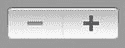
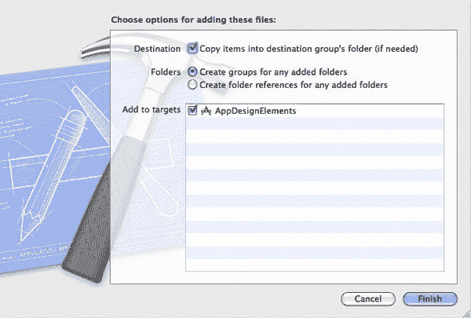
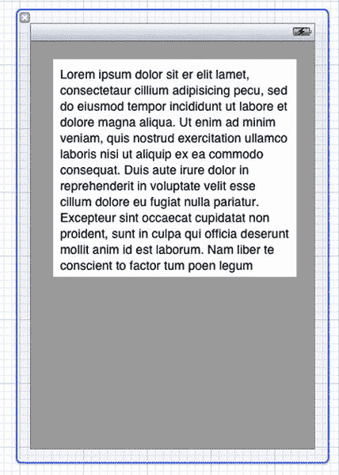
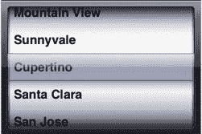
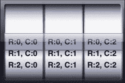
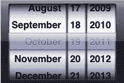

# UIProgressView

沿着 `UIActivityIndicatorView` 的思路，你还有 `UIProgressView`。它的作用与 `UISlider` 非常相似，都能显示一个值（尽管限制在 0 到 1 之间缩放），但不允许任何用户输入。这个元素最常用于显示任务完成的进度，如图 3-12 所示，作为简单地使用 `UIActivityIndicatorView` 来显示“正在处理”的一种替代方案。


**图 3-12.** *使用中的 `UIProgressView`*

与 `UIActivityIndicatorView` 一样，`UIProgressView` 可以带样式创建，通过 `progressViewStyle` 属性访问，该属性有以下可能的值：

* `UIProgressViewStyleDefault`：`UIProgressView` 的标准样式
* `UIProgressViewStyleBar`：常用于工具栏内部的样式

自然，`UIProgressView` 最重要的属性是进度值。这个值介于 0.0 和 1.0 之间，可以通过 `progress` 属性访问。你也可以使用 `-setProgress:animated:` 方法来设置这个属性，以提升应用界面的视觉效果。

除了 `progressViewStyle`，`UIProgressView` 还允许对已显示的进度条及其底部的轨道的着色颜色和图像进行相当不错的外观自定义。这些分别通过 `progressTintColor`、`progressImage`、`trackTintColor` 和 `trackImage` 属性来访问。


### UIPageControl

在处理具有“分页”功能的应用程序时，`UIPageControl`是一个非常有用的微型 UI 元素，如图 3-13 所示。该组件主要作为指示器向用户显示当前处于哪一页，尽管它也可以用于直接操作应用程序（通常是通过更改当前页面）。关于此实用性的一个绝佳示例，请查看设备上“天气”应用的底部。


**图 3-13.** `UIPageControl`

使用`UIPageControl`时，你可以通过`currentPage`和`numberOfPages`等属性轻松访问与其关联的多个值。如果你的应用程序在某些时候可能只有一个页面，你还可以使用`hidesForSinglePage`属性。

与`UISlider`和`UISwitch`一样，你可以使用`-addTarget:selector:forControlEvents:`方法结合`UIControlEventValueChanged`事件，向`UIPageControl`添加在`currentPage`值发生变化时要执行的操作。此方法理想情况下应处理应用程序显示的实际更改，以显示新选择的页面。

如果在`currentPage`发生变化时，你决定由于某些原因不希望`UIPageControl`的显示立即更新，可以将`defersCurrentPageDisplay`属性设置为`YES`，使其等待调用`-updateCurrentPageDisplay`方法后才调整显示。否则，此属性默认为`NO`。

不幸的是，在自定义`UIPageControl`的外观方面，你受到的限制非常大。不过，你可以使用一个非常有用的方法`-sizeForNumberOfPages:`，它能让你轻松找到显示任意指定页面数量的`UIPageControl`所需的最小尺寸。

任何时候使用`UIPageControl`元素，都要确保该指示器在视觉上不会干扰其所管理的页面。因此，根据苹果的界面指南，该元素应居中位于“页面”底部和屏幕底部之间。

### UIStepper

`UIStepper`是 iOS 5.0 中全新引入的元素，旨在简化应用程序对增量值的使用。它为用户配备了“+”和“-”按钮，但本身并不显示其关联的值，如图 3-14 所示。此任务留给开发者根据每个应用程序的具体情况来实现。



**图 3-14.** 全新的`UIStepper`

`UIStepper`的主要属性是它的`value`属性，你可以通过访问该属性来相应地更新显示。这个值可以通过多种属性轻松配置：

- `minimumValue`：`value`可以达到的最小数值
- `maximumValue`：`value`的最大值
- `stepValue`：使用步进按钮时`value`递增的量
- `wraps`：如果此属性设置为`YES`，你的最小值和最大值将循环衔接。因此，如果`value`递增超过`maximumValue`，它将回绕到`minimumValue`，反之亦然。
- `autorepeat`：此属性允许长按`UIStepper`按钮以重复递增`value`，而无需反复点击该元素。
- `continuous`：指定值更改事件是在`value`属性每次更改时发送，还是仅在用户完成更改值后才发送（与`autorepeat`属性配合使用）。

和之前一样，你可以使用`-addTarget:selector:forControlEvents:`方法配合`UIControlEventValueChanged`事件，为`value`属性的更改分配要执行的操作。

一旦你的`UIStepper`配置完毕，在设计应用程序时唯一需要记住的概念是，确保用户界面清晰地告知用户某个`UIStepper`更改的是哪个值。

### 数据视图

在 iOS 中，你可以访问各种`UIView`的子类，统称为“数据视图”，它们允许你根据应用程序的类型，以非常特定的方式轻松地在应用程序中放置内容。

#### UIImageView

Cocoa Touch 中最直观且重要的数据视图之一是`UIImageView`类。这个视图元素及其属性和方法经过优化，可帮助开发者在应用程序中显示和管理图像。

`UIImageView`的核心属性是其`image`和`highlightedImage`属性。这两个属性都是`UIImage`类的实例，其中`highlightedImage`仅在图像被选中时显示。你可以通过使用指定的初始化方法`-initWithImage:`或`-initWithImage:highlightedImage:`以编程方式创建并指定这些图像，或者直接单独设置这些属性。示例如下：

```objectivec
self.myImageView = [[UIImageView alloc] initWithImage:[UIImage imageNamed:@"myImage.png"]];
```

如果你使用`+imageNamed:`方法来创建`UIImage`，则需要确保你的实际图像文件已导入到项目中。你可以通过将文件从 Finder 拖入 Xcode 来实现。拖入时，会弹出一个对话框，你需要确保选中“将项目复制到目标组的文件夹（如果需要）”选项，如图 3-15 所示。



**图 3-15.** 向项目添加文件时的弹出对话框

`UIImageView`类还内置了通过使用以下属性来动画显示多个图像的功能：

- `animationImages`：此属性是一个包含`UIImage`对象的`NSArray`，指定了要动画显示的实际图像。
- `highlightedAnimationImages`：此属性作用与`animationImages`属性相同，但在`UIImageView`处于高亮状态时生效。
- `animationDuration`：此值作为`NSTimeInterval`创建，表示`animationImages`中所有图像完成一个循环所需的总时间。如果未指定，该值默认为图像数量乘以 1/30 秒。
- `animationRepeatCount`：简而言之，此值指定图像循环的重复次数。如果设置为 0（默认值），动画将无限重复。

配置好`UIImageView`的动画属性后，你可以使用`-startAnimating`、`-stopAnimating`和`isAnimating`方法来管理实际的动画。

在处理`UIImageView`时，需要牢记的最重要属性之一是`contentMode`属性。虽然这实际上是继承自`UIView`，但在处理图像时它变得非常重要。`contentMode`属性主要指定视图如何响应其内容宽高比与视图本身不匹配的情况，例如一个方形`UIImageView`显示一张矩形图像。此属性有多种选项，苹果文档中都有完整记录，但大多数时候你可能倾向于选择`UIViewContentModeScaleAspectFill`。此选项可能会裁剪掉图像的一部分，但会确保填满展示视图的整个空间，从而提高设计质量。如果由于任何原因，你要求图像不被裁剪并且更希望保留空白区域，可以使用`UIViewContentModeScaleAspectFit`值。


### UITextView

`UITextView`类与`UITextField`非常相似，都允许用户输入文本。然而，它的视觉设计允许容纳更大量的文本，如图 3-16 所示。



**图 3-16.** *在 XIB 中使用`UITextView`*

`UITextView`的大多数属性与`UITextField`非常相似，例如`text`、`font`和`textColor`。其他用于配置文本的有用属性包括`editable`（指定文本是否可编辑）以及`textAlignment`。你甚至可以使用`dataDetectorTypes`值来指定文本视图可以检测的数据类型，例如电话号码或电子邮件地址。

与`UITextField`一样，`UITextView`有一个`delegate`属性，该属性根据`UITextView`中发生的事件接收多个操作。此属性必须遵循`UITextViewDelegate`协议。

`UITextViewDelegate`中的大多数方法与之前讨论的`UITextFieldDelegate`协议中的方法完全相同。然而，`UITextViewDelegate`没有任何方法指示何时按下回车键，这使得使用`-resignFirstResponder`方法判断何时应该关闭键盘变得更加困难。相反，你可以实现`-textView:shouldChangeTextInRange:replacementText:`方法。

```
- (BOOL)textView:(UITextView *)textView shouldChangeTextInRange:(NSRange)range
 replacementText:(NSString *)text
{
    if ([text isEqualToString:@"\n"])
    {
        [textView resignFirstResponder];
        return FALSE;
    }
    return TRUE;
}
```

对于`UITextView`，按下回车键会导致文本“\n”被添加到当前文本中，因此你可以简单地让这个方法等待这样的输入，并相应地关闭键盘。在你的应用程序中，你可能希望允许用户在文本视图中换行，因此这个实现可能不是最理想的。

在自定义方面，你可以通过上述属性轻松自定义文本视图的文本属性，但你对视图本身也有一定程度的自定义能力。你可以使用`inputView`属性以及`inputAccessoryView`来访问实际的输入视图。当`UITextView`正在编辑时，如果此附件视图不为`nil`，它将显示在键盘上方，允许你在需要时将自定义工具栏附加到键盘上。

任何类也可以通过成为以下任一通知的观察者，来接收关于`UITextView`状态的通知：

- `UITextViewTextDidBeginEditingNotification`
- `UITextViewTextDidChangeNotification`
- `UITextViewTextDidEndEditingNotification`

与`UITextField`一样，`UITextView`最重要的设计方面之一是，要记住在任意给定时刻，一个巨大的键盘可能会占据屏幕的一半。作为开发者，你应该确保你的`UITextView`要么位于不会被键盘遮挡的区域，要么在键盘出现时移动到这样的区域。关于如何接收键盘出现和消失的通知的更多解释，请参见前面的“UITextField”部分。

### UIScrollView

`UIScrollView`类对于处理无法放入单个视图但都属于同一页的大量内容非常有用。这可以是待显示的图片列表，或者只是一个你想要能够缩放和滚动的非常大的图像。

`UIScrollView`的内容被定义为其内部的所有子视图，因此你可以简单地使用`-addSubview:`方法向`UIScrollView`添加内容。

任何时候使用`UIScrollView`，都必须设置`contentSize`属性。这向`UIScrollView`指定了在任何方向上允许滚动多少。通常，这将是你内容的大小，所以如果你的内容是一个尺寸为 800x640 的`UIImage`的`UIImageView`，你会希望内容大小相同。或者，如果你不希望`UIScrollView`能够在一个方向上滚动，你可以使该方向的`contentSize`更小。

你还可以调整`contentInset`和`contentOffset`，以进一步自定义内容的显示。后者甚至可以使用`-setContentOffset:animated:`方法进行动画。

`UIScrollView`的滚动属性在 XIB 文件中和通过编程方式都非常容易配置。其中最重要的属性如下：

- `scrollEnabled`：指定`UIScrollView`是否可以滚动；你可以使用此属性来“锁定”视图。
- `directionalLockEnabled`：此属性如果启用，会限制`UIScrollView`在任意给定时间内只能在一个方向上滚动（垂直或水平）。
- `scrollsToTop`：启用或禁用用户点击屏幕顶部状态栏以将`UIScrollView`滚动到其内容顶部的功能。
- `pagingEnabled`：如果启用此属性，滚动会吸附到视图边界的倍数位置，而不是允许在内容中持续滚动。结合`UIPageController`使用，对于使用`UIScrollView`显示多页内容非常有用。

`UIScrollView`最有用的方法之一是`-scrollRectToVisible:animated:`，它允许你根据应用程序的需要，滚动到内容的任意特定区域。

在许多其他属性中，也存在一些用于管理当用户将滚动视图轻拂过其边界时“弹跳”效果的属性，例如`bounces`、`alwaysBounceVertical`和`alwaysBounceHorizontal`属性。

开发者还可以控制“滚动指示器”，即底部或侧面的细条，显示视图滚动了多远。你可以使用`indicatorStyle`、`scrollIndicatorInsets`、`showsHorizontalScrollIndicator`和`showsVerticalScrollIndicator`属性来调整它们。你甚至可以使用`-flashScrollIndicators`方法手动闪烁指示器。

除了滚动和平移之外，`UIScrollView`还内置了缩放功能。为了实现此功能，你只需将`maximumZoomScale`和/或`minimumZoomScale`属性更改为 1.0 以外的值。

`UIScrollView`也有一个`delegate`属性，用于响应在`UIScrollView`内发生的各种事件。这个对象必须遵循`UIScrollViewDelegate`协议，它有多种方法来响应任何滚动、轻拂或缩放事件的开始和结束。有关所有这些方法的详细信息，请参考 Apple 文档。

### UIWebView

`UIWebView`类是一个用于“包装”某种 Web 应用程序的应用程序中的数据展示类。

你可以非常轻松地在视图控制器的 XIB 文件中创建一个`UIWebView`，这也允许你在属性检查器中轻松编辑`UIWebView`的大部分属性。这些属性，例如`dataDetectorTypes`（类似于`UITextView`中使用的那些），也可以通过编程方式访问。

`UIWebView`可以通过多种方式从网络加载数据，具体取决于你需要管理的内容类型。内容的加载通过多种方法管理，包括`-loadData:MIMEType:textEncodingName:baseURL:`、`-loadHTMLString:baseURL:`和`-loadRequest:`。其中最简单的`-loadRequest:`方法接受一个`NSURLRequest`类型的参数。这个类本质上是一个包装了`NSURL`的类，并带有专门用于访问在线内容的额外属性，例如`timeoutInterval`或`cachePolicy`。一旦你的内容开始加载，你也可以根据需要调用`-stopLoading`或`-reload`方法。


#### `MKMapView`

`MKMapView`是一个数据展示类，专门与 MapKit 框架配合使用，向用户呈现地图。有关此框架的更多信息（包括该视图的详细用法），请参阅第 5 章“MapKit 食谱”。

#### `UITableView`

`UITableView`是一个极其强大的数据展示类，其设计理念是基于相似格式呈现大量数据。我们在第 9 章“`UITableView`食谱”中详细介绍了该类的通用用法，并全面阐述了开发基于表格的应用程序的细微差别。

#### `UIPickerView`

`UIPickerView`与`UITableView`类似，但没那么复杂且可定制性稍低。它允许向用户展示多种格式相似的选项，并让用户通过旋转选择特定选项，如图 3–17 所示。



**图 3–17.** 默认的`UIPickerView`

`UIPickerView`的设置方式与`UITableView`类似，都通过使用`dataSource`属性和`delegate`属性来实现。这些属性必须分别遵循`UIPickerViewDataSource`和`UIPickerViewDelegate`协议，并且通常设置为将呈现该`UIPickerView`的`UIViewController`。

`UIPickerViewDataSource`协议仅要求实现两个方法，它们根据“行”和“列”来定义`UIPickerView`的物理配置。列是视图被分成的垂直部分，允许你同时轻松选择多个值。行包含每个列中用户可选择的具体选项。

你可以通过数据源方法`-numberOfComponentsInPickerView:`和`-pickerView:numberOfRowsInComponent:`来配置列的数量以及每个列的行数。

`UIPickerView`的视觉设置通过多个委托方法处理：

*   `pickerView:rowHeightForComponent:`：指定给定列中每行的高度。
*   `pickerView:widthForComponent:`：指定每个列的宽度；列不会自动适应`UIPickerView`的宽度，因此请确保所有列的总宽度不超过`UIPickerView`的宽度。
*   `pickerView:titleForRow:forComponent:`：使用此方法为每行提供要显示的简单文本。
*   `pickerView:viewForRow:forComponent:reusingView:`：如果你希望在某行中显示不止简单文本，可以使用此方法。尽量利用`reusingView:`参数以提高性能。
*   `pickerView:didSelectRow:inComponent:`：每次列停止旋转并落在某一行时，都会调用此方法，使你的应用程序能在其他位置正确更新。

以下是一个示例配置：

```
#pragma mark - Data Source methods
-(NSInteger)numberOfComponentsInPickerView:(UIPickerView *)pickerView
{
return 3;
}
-(NSInteger)pickerView:(UIPickerView *)pickerView
numberOfRowsInComponent:(NSInteger)component
{
return 3;
}
#pragma mark - Delegate methods
-(CGFloat)pickerView:(UIPickerView *)pickerView
rowHeightForComponent:(NSInteger)component
{
return 30;
}
-(CGFloat)pickerView:(UIPickerView *)pickerView widthForComponent:(NSInteger)component
{
return 100;
}
-(void)pickerView:(UIPickerView *)pickerView didSelectRow:(NSInteger)row inComponent:(NSInteger)component
{
NSLog(@"Selected. Row:%i, Component:%i", row, component);
}
-(NSString *)pickerView:(UIPickerView *)pickerView titleForRow:(NSInteger)row forComponent:(NSInteger)component
{
return [NSString stringWithFormat:@"R:%i, C:%i", row, component];
}
```

这将配置图 3–18 所示的`UIPickerView`，并记录每个列中所选的行。



**图 3–18.** 按行和列配置的`UIPickerView`

一旦`UIPickerView`配置完成，你可以使用`-selectedRowInComponent:`方法访问每个列中选中的行。

此外，你还可以通过`showsSelectionIndicator`属性来切换表示所选行的中心栏的显示与隐藏。

#### `UIDatePickerView`

`UIDatePickerView`是`UIPickerView`的一个特化版本，专门用于处理时间、日期或倒计时的选择，如图 3–19 所示。该类实际上并非`UIPickerView`的子类，而是将一个定制化的`UIPickerView`作为其子视图。



**图 3–19.** 特化的`UIDatePickerView`

此类有一个名为`datePickerMode`的属性，允许你从多个代表不同选择器类型的值中进行选择，以适配你的具体场景。

*   `UIDatePickerModeTime`：选择时间
*   `UIDatePickerModeDate`：选择日期
*   `UIDatePickerModeDateAndTime`：在一个选择器中同时选择日期和时间
*   `UIDatePickerModeCountDownTimer`：选择要设置的倒计时定时器

为了获知选中行的变化，请将某个方法添加为`UIDatePickerView`的动作，以便在`UIControlEventValueChanged`事件发生时被调用，这与前面讨论的多个元素类似。

你可以通过`maximumDate`、`minimumDate`、`minuteInterval`和`countDownDuration`等属性来配置`UIDatePickerView`的不同模式。

如果你希望以编程方式更改`UIDatePickerView`显示的日期，可以设置`date`属性，但这不会产生动画效果。如果`UIPickerView`是可见的，建议使用`-setDate:animated:`方法来进行此类更改。


#### 手势识别器

在 iOS 中，你可以通过向 `UIView` 的实例或子类添加“手势识别器”来增强应用的功能。“手势”指的是用户驱动的基于触摸的事件，例如点击、滑动或捏合。这些元素可以在应用中执行操作，从而扩展常规功能。虽然你可以创建自己的 `UIGestureRecognizer` 子类，但本文将重点介绍 iOS 5.0 中已集成的手势识别器。

使用 `UIGestureRecognizer` 时，务必记住大部分用户不会主动寻找你能实现的手势。因此，你应该仅在为了加快可经由其他途径执行的任务时，才实现一个 `UIGestureRecognizer`。除非明确告知用户，否则不应将关键功能构建在其中。

`UIGestureRecognizer` 类本身是一个抽象类，定义了多个子类的行为，每个子类代表不同的手势。但无论使用哪个子类，手势识别器都是通过 `-addGestureRecognizer:` 方法添加到任意 `UIView` 上的。例如，要将一个名为 `tapGesture` 的 `UITapGestureRecognizer` 实例添加到整个视图控制器的视图上，你可以编写如下代码：

`[self.view addGestureRecognizer:tapGesture];`

**提示：** `UIGestureRecognizer` 的任何子类均可被添加到 `UIView` 的任意实例或子类上，因此你可以轻松地为几乎任何元素构建自定义手势功能，从而打造出非常灵活的应用。

某些元素（例如 `UILabel`）不会响应任何 `UIGestureRecognizer`，除非其 `userInteractionEnabled` 属性被设置为 `YES`。

`UIGestureRecognizer` 的 `state` 属性允许你评估任何特定子类在手势被识别时的当前状态。它拥有多个不同的可能值，每个值代表手势识别过程中的一个阶段：

1. `UIGestureRecognizerStatePossible`：表示某个手势可能正在执行中，但尚未满足其识别条件。
2. `UIGestureRecognizerStateBegan`：表示一个持续手势已被识别并正在进行。
3. `UIGestureRecognizerStateChanged`：表示一个已开始的持续手势发生了变化。
4. `UIGestureRecognizerStateEnded`：表示手势已完成。
5. `UIGestureRecognizerStateCancelled`：手势识别器接收到触摸事件以取消一个持续手势。
6. `UIGestureRecognizerStateRecognized`：等同于 `UIGestureRecognizerStateEnded`。

特别是在处理持续手势时，你可能会遇到多个状态导致 `UIGestureRecognizer` 执行其动作的问题，从而不必要地重复调用某个方法。通过检查 `state` 属性中的特定状态，你可以避免这种情况。

理想情况下，你可以设置单个方法供所有 `UIGestureRecognizer` 子类的实例调用，并在方法内部简单地区分它们。你可以利用 `+isKindOfClass` 方法、每个子类的多个属性，甚至手势被识别的视图，来识别多个 `UIGestureRecognizer` 对象中哪一个执行了你的操作。该操作将包含如下处理器：

`-(void)handleGesture:(UIGestureRecognizer *)gestureRecognizer;`

另一个所有 `UIGestureRecognizer` 子类继承的有用功能是，能够通过 `-locationInView:` 和 `-locationOfTouch:inView:` 方法确定手势在视图中的确切位置。通过使用这些值，你可以根据触摸在单个视图内的具体位置轻松调整应用的行为。其中一个示例是在用户触摸点进行绘制，从而让用户本质上能在屏幕上涂鸦。

所有 `UIGestureRecognizer` 的子类都继承了 `delegate` 属性，该属性可以被设置为包含该识别器视图的视图控制器。这个属性遵循 `UIGestureRecognizerDelegate` 协议，允许视图控制器在响应手势时获得额外的控制权。

多个 `UIGestureRecognizer` 的子类支持需要多点触摸才能被识别的手势。在处理这些手势时，务必记住每台设备能处理的最大触摸数量。在编写本文时，iPhone 最多可处理五根手指的触摸，而 iPad 最多可处理十一根。

## UITapGestureRecognizer

正如你所猜测的，`UITapGestureRecognizer` 能识别用户在其分配视图上的点击操作。

你可以通过调整 `numberOfTapsRequired` 和 `numberOfTouchesRequired` 来创建非常具体的手势功能。例如，将两个属性都设置为 2，你可以专门检测用户用两根手指双击屏幕的事件。配置方式如下：

```
UITapGestureRecognizer *tapGesture = [[UITapGestureRecognizer alloc] initWithTarget:self
action:@selector(handleGesture:)];

tapGesture.numberOfTapsRequired = 2;
tapGesture.numberOfTouchesRequired = 2;
[self.view addGestureRecognizer:tapGesture];
```

实现 `handleGesture:` 时，你应确保针对任何 `UITapGestureRecognizer` 检测 `UIGestureRecognizerStateEnded` 状态。

## UISwipeGestureRecognizer

`UISwipeGestureRecognizer` 能识别用户用一根或多根手指在屏幕上滑动的操作。滑动是一个离散手势，因此其动作只会被调用一次。

`UISwipeGestureRecognizer` 类具有 `direction` 属性，该属性指定了滑动必须发生的方向才能被识别。可能的值包括 `UISwipeGestureRecognizerDirectionRight`、`UISwipeGestureRecognizerDirectionLeft`、`UISwipeGestureRecognizerDirectionUp` 和 `UISwipeGestureRecognizerDirectionDown`。

该类还有一个 `numberOfTouchesRequired` 属性，允许你在应用中指定多点触摸的滑动手势。

## UIPanGestureRecognizer

`UIPanGestureRecognizer` 类能识别“平移”手势，这是一种持续手势。因此，你通常会在响应 `UIGestureRecognizerStateChanged` 或 `UIGestureRecognizerStateEnded` 状态时通过它们执行操作。

平移手势可以通过设置最小和最大触摸数量来配置，从而允许你创建一系列可接受的触摸数值。使用 `maximumNumberOfTouches` 和 `minimumNumberOfTouches` 属性来实现此功能。

通过 `UIPanGestureRecognizer`，你可以使用 `-translationInView:` 和 `-velocityInView:` 方法获取移动的距离以及手势的速度。

在大多数使用 `UIPanGestureRecognizer` 的情况下，获取并使用平移手势的平移量和/或速度值后，将其重置是很重要的。如果不重置，这些值会累积，导致数值迅速变得异常巨大。

以下是一个示例实现，摘自你的 `-handleGesture:` 方法，用于拖放识别到平移手势的视图。

```
if ([gestureRecognizer isKindOfClass:[UIPanGestureRecognizer class]])
    {
UIPanGestureRecognizer *pan = (UIPanGestureRecognizer *)gestureRecognizer;
if (pan.state == UIGestureRecognizerStateChanged || pan.state == UIGestureRecognizerStateEnded)
        {
CGPoint movement = [pan translationInView:pan.view];
            [pan.view setCenter:CGPointMake(pan.view.center.x + movement.x, pan.view.center.y + movement.y)];
            [pan setTranslation:CGPointZero inView:pan.view];
        }
    }
```

如果在移动视图后没有将平移量重置为零，你的平移值会迅速累积，猛地把视图扔出屏幕。

如果使用 `CGPointZero` 值时遇到链接器错误，请将 `CoreGraphics.framework` 库添加到你的项目中。


