# UIRotationGestureRecognizer

此类识别一种相对不常见的手势：旋转。该手势由用户以圆周运动移动两根手指构成。

关于所执行手势的信息可以通过`rotation`和`velocity`属性访问，与`UIPinchGestureRecognizer`类似。

### 视图控制器

在设计 iOS 应用时，你通常会根据应用中数据的流向，以相当一致的方式组织视图控制器。Cocoa Touch 内置了多个`UIViewController`类的特殊子类，允许你根据应用类型轻松组织、定制和呈现数据。通过组合这些控制器，你可以为应用创建复杂的组织方案，以最优化的方式向用户展示信息。

### UINavigationController

`UINavigationController`无疑是工作流设计和视图呈现中最常用的类之一。它不仅有助于组织从一个视图到另一个视图的过渡，还在每个视图顶部提供了一个高度可定制的工具栏，以帮助呈现和管理应用的不同部分。这些类随后可以被放入其他组织控制器中，允许你创建从应用一个层级到另一个层级的嵌套信息流。

`UINavigationController`以一个“根视图控制器”开始，如果没有其他视图控制器被添加，则此视图控制器将是可见的。然后，其他视图控制器可以被“推入”控制器堆栈，或通过各种方法被“弹出”。`UINavigationController`堆栈中的视图从上到下显示，因此推入一个新的视图控制器会指示`UINavigationController`显示它。同样，当弹出当前视图控制器时，它会从视图中移除，露出堆栈中的下一个控制器。

创建`UINavigationController`就像创建其他任何类一样简单。你可以使用一个便捷的指定初始化方法`-initWithRootViewController:`来设置根视图，或者可以在分配后直接调用`-init`方法，然后使用`-pushViewController:animated:`方法推入根视图。

Figure 3–20 展示了一个配置了多个元素的`UINavigationController`。

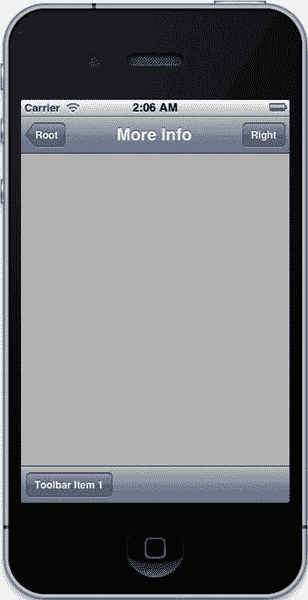

**Figure 3–20.** 一个`UINavigationController`，带有左右按钮和一个工具栏

在`UINavigationController`中呈现的此视图顶部边缘，设有导航栏。此区域旨在通过三个特性引导用户在整个应用中进行导航：

- **标题**：导航栏中央显示所呈现视图控制器的标题。这可以通过在每个`-viewDidLoad`方法中更改继承自`UIViewController`类的`title`属性轻松设置（例如，`self.title = @"More Info"`）。你也可以创建自定义标题视图。
- **返回按钮**：如果当前未显示根视图控制器，导航栏左侧会自动包含一个带箭头的按钮，默认情况下会显示先前视图控制器的标题，以帮助用户导航返回。
- **右侧栏项目**：导航栏右侧默认是空的，但可以使用`rightBarButtonItem`或`rightBarButtonItems`属性进行配置（后者用于添加多个项目）。在 iPhone 上，此位置通常不会放置超过一两个小按钮，但 iPad 有空间容纳更多数量。此位置的按钮通常提供操作或处理当前视图控制器中显示信息的选项，例如`UITableView`的编辑按钮或打开打印界面的按钮。上述属性通过导航项访问，即`self.navigationItem.rightBarButtonItem`。

Figure 3–20 中视图的底部边缘包含导航工具栏，该工具栏内置于`UINavigationController`中。此工具栏默认是隐藏的，但可以通过将`UINavigationController`上的`toolbarHidden`属性设置为`NO`，或使用`-setToolbarHidden:animated:`方法（以动画方式改变）轻松显示。然而，执行此操作时需谨慎，因为工具栏的状态（无论是隐藏还是显示）在视图控制器的推入和弹出过程中保持不变，直到再次设置该属性。这意味着你可能需要在每个视图控制器中使用`-viewWillAppear:animated:`和`-viewWillDisappear:animated:`方法来适当地显示或隐藏工具栏。

`UIToolbar`的内容不是由`UINavigationController`设置的，而是由堆栈顶部的`UIViewController`设置的。通过在`-viewDidLoad`方法中为每个视图控制器调用`-setToolbarItems:`，你可以轻松地实现每个视图控制器中配置不同的工具栏。以下示例取自一个视图控制器的`-viewDidLoad`，展示了如何轻松构建单个控制器的工具栏。

```
[self setToolbarItems:[NSArray arrayWithObject:[[UIBarButtonItem alloc]
initWithTitle:@"Toolbar Button "style:UIBarButtonItemStyleBordered target:nil
action:NULL]] animated:NO];
```

只需将`target`和`action`改为实际的值和选择器，你就可以轻松地在工具栏按钮中实现功能。

`UINavigationController`还有一个遵循`UINavigationControllerDelegate`协议的委托属性。利用此属性可以获得对视图控制器被推入或弹出堆栈前后执行操作的额外控制。


#### `UITabBarController`

另一个特殊视图控制器，其使用频率几乎与`UINavigationController`一样普遍，那就是`UITabBarController`。该类专门设计用于处理包含多个分区或“标签页”的应用程序，每个标签页都有自己的信息流。Twitter 应用程序是这种实现的一个绝佳示例。每个标签页都可以包含其他控制器，包括`UINavigationController`对象，从而允许构建更复杂的视图控制器网络。然而，`UITabBarController`不应被放置在任何其他控制器内部，因为 iOS API 不支持这样做。

在`UITabBarController`中，每个视图控制器都有一个标签页，默认情况下，该标签页会填充视图控制器的标题，并且没有图像。创建一个新的`UITabBarItem`实例并将其设置为视图控制器的`tabBarItem`属性将覆盖此默认行为，允许您添加图像并稍微自定义标签页。

每个视图控制器的`-viewDidLoad`方法实际上直到包含该视图控制器的特定标签页被选中时才会被调用，这意味着在此方法中进行的任何配置（例如设置标题）都不会立即生效，从而导致标签页在选中之前显示为无标签状态。当声明视图控制器时设置其标题可以轻松解决此问题，但将标题配置添加到视图控制器的指定初始化方法中也同样有效。

图 3–21 展示了一个简单的`UITabBarController`的屏幕截图，该控制器包含三个标签页，每个标签页都配置了标题和基于系统的图像，以及用于创建它的示例代码。

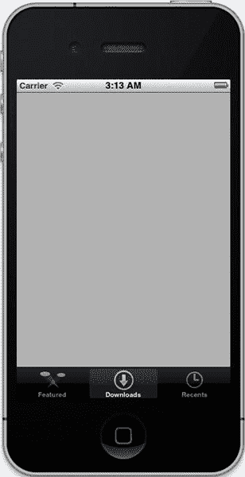

**Figure 3–21.** *一个配置了三个标签页的`UITabBarController`*

这使用了以下配置代码，取自`-application:didFinishLaunchingWithOptions:`方法，假设已经创建了两个`UIViewController`子类（`MainViewController`和`SecondViewController`）并将其导入到应用程序委托文件中。

```
self.viewController = [[MainViewController alloc] initWithNibName:@"MainViewController"
bundle:nil];
self.viewController.title = @"First";
self.viewController.tabBarItem = [[UITabBarItem alloc]
initWithTabBarSystemItem:UITabBarSystemItemFeatured tag:0];

__strong SecondViewController *second = [[SecondViewController alloc] init];
second.title = @"Second";
second.tabBarItem = [[UITabBarItem alloc]
initWithTabBarSystemItem:UITabBarSystemItemDownloads tag:1];

__strong SecondViewController *third = [[SecondViewController alloc] init];
third.title = @"third";
third.tabBarItem = [[UITabBarItem alloc]
initWithTabBarSystemItem:UITabBarSystemItemRecents tag:2];

__strong UITabBarController *tabcon = [[UITabBarController alloc] init];
[tabcon setViewControllers:[NSArray arrayWithObjects:self.viewController, second, third,
nil]];

self.window.rootViewController = tabcon;
```

#### `UISplitViewController`

`UISplitViewController`是另一个用于帮助组织其他视图控制器的元素。但是，此类仅在进行 iPad 开发时可用，因为它需要大量的屏幕空间才能发挥效用。它包含两个`UIViewController`：一个“主面板”和一个“详情面板”。主面板显示在屏幕左侧较窄的视图中，剩余空间由详情面板占据，如图 3–22 所示。通常，这种设置用于从主面板中选择一个项目，然后在详情面板中显示该项目的详细信息。

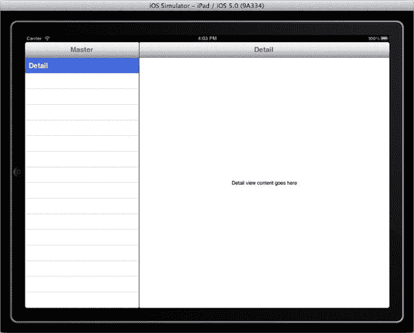

**Figure 3–22.** *适用于 iPad 的`UISplitViewController`*

图 3–22 展示了一个基于`UISplitViewController`的预配置应用程序，该程序是使用“Master-Detail Application”模板创建的。如果您希望使用此控制器构建应用程序，此模板可以帮助您快速上手。此选项可以在创建新项目时出现的第一个菜单中找到，如图 3–23 所示。与 Empty Application 模板一样，它也提供了包含 Core Data 框架和自动设置的选项。

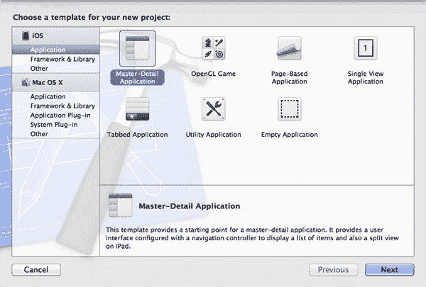

**Figure 3–23.** *使用 Master-Detail Application 模板创建预配置的`UISplitViewController`*

`UISplitViewController`类有两个属性：`viewControllers`和`delegate`。前者是一个`NSArray`，必须恰好包含两个控制器：首先是主面板控制器，然后是详情面板控制器。

默认情况下，如果 iPad 处于竖屏方向，主面板将不会显示。您可以通过`UISplitViewControllerDelegate`协议方法`-splitViewController:shouldHideViewController:inOrientation:`来调整此行为。通常，`UISplitViewController`的`delegate`属性会被设置为您的详情面板视图控制器，因为它包含应用程序的相关信息。

在使用`UISplitViewController`时，请务必确保视图的所有部分在其相关操作和控制器方面都清晰明了。避免在两个面板中都放置工具栏，以免它们看起来是相连的。同时，请确保您在主面板中所做的任何选择都可见地持续存在，以便用户始终能够判断当前视图显示的是哪个项目。


### UIPopoverController

`UIPopoverController`类是一个仅适用于 iPad 的 UI 元素。它用于在当前视图之上呈现信息，通常是为了向用户提供如何继续操作的选项。`UIPopoverController`的实现非常方便，因为其位置可以轻松指定到任意位置，从而改善应用的视觉流程。

图 3–24 来自第 13 章（数据传输配方），配方 13-2，涉及邮件和打印材料，其中你从一个`UIBarButtonItem`呈现了一个`UIPopoverController`，用于选择要显示的已保存图像。

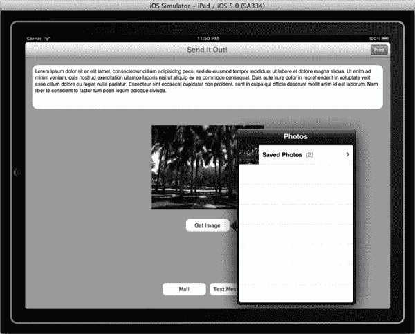

**图 3–24** *来自第 13 章（数据传输配方）的`UIPopoverController`示例*

`UIPopoverController`可以轻松地通过指定初始化方法`-initWithContentViewController:`来包含内容视图，并且可以通过`-setPopoverContentSize:animated:`来配置内容大小。如果你希望在`UIPopoverController`当前可见时更改其内容视图，可以使用`-setContentViewController:animated:`方法。

`UIPopoverController`类有一个包含`-popoverControllerShouldDismissPopover:`和`-popoverControllerDidDismissPopover:`方法的`delegate`协议。这些方法可以轻松用于确保在弹出视图被关闭之前保存所有用户数据。

在呈现弹出视图时，你可以使用`-presentPopoverFromRect:inView:permittedArrowDirections:animated:`方法或`-presentPopoverFromBarButtonItem:permittedArrowDirections:animated:`方法。前者通常用于从主视图中的任意元素呈现，而后者用于从工具栏中的任意项目呈现弹出视图。在正确的情境下使用这些方法将显著提高应用的视觉组织质量。

在设计使用`UIPopoverController`的 iPad 应用时，始终要考虑视图的整体视觉质量。确保你的弹出视图不会覆盖整个屏幕，并且其箭头指向触发它出现的元素。

通常，你应避免在`UIPopoverController`的内容视图中放置任何“关闭”按钮，因为用户只需点击弹出视图外部即可将其关闭。

如果你可以选择从单个视图中显示多个弹出控制器，请尽量将应用设计为打开一个弹出视图时关闭其他任何打开的弹出视图，以避免遮挡整个视图。

### UIPageViewController

`UIPageViewController`是 iOS 5.0 中新增的控制器，专门用于组织处理多个“页面”内容且在相同信息层级上排列的应用。

`UIPageViewController`的实例通过`-setViewControllers:direction:animated:completion:`来设置其内容视图。

`spineLocation`属性用于自定义页面翻页的视觉动画效果。你可以将应用想象成一本书，`spineLocation`指的是翻页的枢轴点。

该类还有两个属性，`delegate`和`dataSource`，用于配置页面视图控制器。`dataSource`遵循`UIPageViewControllerDataSource`协议，允许你通过`-pageViewController:viewControllerBeforeViewController:`和`-pageViewController:viewControllerAfterViewController:`方法特殊配置视图控制器的顺序。`delegate`属性则更多涉及控制器的视觉设置，通过`UIPageViewControllerDelegate`协议方法`-pageViewController:spineLocationForInterfaceOrientation:`实现。

#### 模态控制器

模态视图控制器是以“模态”方式呈现的任何视图控制器，意味着它要么显示在呈现它的控制器之上，要么取而代之。这些可以是普通的`UIViewController`子类，也可以是特定的视图元素。模态视图控制器的一般用途是向用户提供或请求特定信息，因此你通常不希望模态呈现实现应用主要功能的控制器。

模态视图控制器由其他视图控制器通过`-presentModalViewController:animated:`方法呈现。更改从`UIViewController`继承的`modalTransitionStyle`属性可以设置动画样式。该属性接受以下可能的值，其名称本身就能很好地描述其样式：

* `UIModalTransitionStyleCoverVertical`
* `UIModalTransitionStyleFlipHorizontal`
* `UIModalTransitionStyleCrossDissolve`
* `UIModalTransitionStylePartialCurl`

这些选项之间的差异通常只是外观上的，尤其是在 iPhone 上实现模态呈现时，尽管`UIModalTransitionStylePartialCurl`样式不会覆盖整个视图，而只会在模态视图控制器中显示底部区域。这对于提供少量信息（例如你的开发者信息）而不必填充整个视图非常有用。

如果你使用`UIModalTransitionStylePartialCurl`过渡样式，请避免在模态控制器中放置任何`UITextField`或`UITextView`元素，因为键盘最终会覆盖整个模态控制器，使用户无法看到他们正在输入的内容。

在 iPhone 上开发时，模态视图控制器始终需要占据整个屏幕。然而，在 iPad 上，你可以自定义控制器在视图中的外观。`modalPresentationStyle`属性定义了视图控制器在 iPad 上的呈现方式，接受以下可能的值：

* `UIModalPresentationFullScreen`：模态控制器覆盖整个设备屏幕
* `UIModalPresentationPageSheet`：控制器宽度设置为设备的竖屏宽度，呈现控制器在两侧可见；背景随后变暗以将焦点带到呈现的控制器上。
* `UIModalPresentationFormSheet`：模态控制器在 iPad 屏幕上居中，显示尺寸小于呈现控制器；如果键盘可见，视图会上移以保持可见，所有未覆盖区域变暗。
* `UIModalPresentationCurrentContext`：视图完全按照其呈现控制器的方式呈现。这在处理分屏控制器或其他不填充整个屏幕的视图时特别有用。

每当实现模态视图控制器时，你需要能够以编程方式将其关闭。关闭可以通过从模态控制器或呈现控制器调用`-dismissModalViewControllerAnimated:`方法来实现。如果你希望从呈现控制器中关闭视图，则需要为模态控制器定义一个委托方法，以便在准备好关闭时调用它。此方法还可用于将从模态控制器收集的信息传递回其父控制器。

### 临时用户界面元素

许多应用在处理需要用户输入的情境时，这种输入只在应用的某个特定点需要。对于这些情况，将元素直接作为永久元素嵌入视图中会浪费宝贵的空间。相反，你可以使用某些元素，这些元素在需要输入或输出时显示，并在之后被关闭。


#### `UIAlertView`

`UIAlertView` 是一个极其简单但有效的类。大多数情况下，它用于呈现信息，不过也可以配置为允许文本输入。

`UIAlertView` 有一个 `alertViewStyle` 属性，它指定了所呈现警报的类型，可选值包括：

- `UIAlertViewStyleDefault`
- `UIAlertViewStyleSecureTextInput`
- `UIAlertViewStylePlainTextInput`
- `UIAlertViewStyleLoginAndPasswordInput`

默认样式指的是一个呈现信息的简单警报，而其余三种样式都允许文本输入。它们的名称直接表明了其具体用途。

配置默认样式的 `UIAlertView` 最简单的方式是通过其指定的初始化方法 `-initWithTitle:message:delegate:cancelButtonTitle:otherButtonTitles:`。下一个示例演示了这些配置属性的用途。

以下代码将配置如图 3–25 所示的 `UIAlertView`。

```
UIAlertView *alert = [[UIAlertView alloc] initWithTitle:@"Title" message:@"This is our"
message delegate:self cancelButtonTitle:@"Ok" otherButtonTitles:@"Other Button", nil];
```

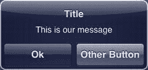

**图 3–25.** 呈现的 `UIAlertView`

一旦你的 `UIAlertView` 配置完成，只需调用 `-show` 方法即可非常简单地呈现它。

```
[alert show];
```

`UIAlertView` 还有一个 `delegate` 属性，正如你在初始化方法中设置的那样，在此示例中你将其设置为你的视图控制器。该属性遵循 `UIAlertViewDelegate` 协议。它包含多个方法，这些方法在呈现、取消或关闭 `UIAlertView` 时被调用。但更重要的是它的 `-alertView:clickedButtonAtIndex:` 方法，该方法允许你的应用程序对每个不同按钮的按下做出特定响应。

如果你希望手动关闭 `UIAlertView`，例如由于某些外部事件或在特定时间之后，你可以调用 `-dismissWithClickedButtonIndex:animated:` 方法。

通常，`UIAlertView` 用于响应特定事件来呈现或请求信息，例如影响应用程序的外部条件变化，或某些服务不可用。

#### `UIActionSheet`

`UIActionSheet` 类通常用于向用户提供多个选项以供选择，以便应用程序知道如何继续。它由一系列大型带标签的按钮组成，这些按钮可以根据其对应用程序影响的性质显示特定颜色，如图 3–26 所示。

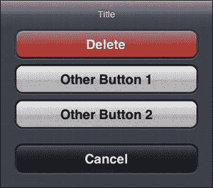

**图 3–26.** 配置了多个按钮的简单 `UIActionSheet`

`UIActionSheet` 有一个 `actionSheetStyle` 属性。与 `UIAlertView` 中的类似属性不同，这仅决定操作表的外观样式，可选值包括：

- `UIActionSheetStyleAutomatic`
- `UIActionSheetStyleDefault`
- `UIActionSheetStyleBlackTranslucent`
- `UIActionSheetStyleBlackOpaque`

如果指定了自动样式，它会模仿底部栏的视觉样式。否则，它将恢复为 `UIActionSheetStyleDefault` 值。

设置 `UIActionSheet` 最简单的方式是通过其指定的初始化方法 `initWithTitle:delegate:cancelButtonTitle:destructiveButtonTitle:otherButtonTitles:`。例如，以下代码行将重现图 3–26 中显示的 `UIActionSheet`。

```
UIActionSheet *actionSheet = [[UIActionSheet alloc] initWithTitle:@"Title" delegate:self
cancelButtonTitle:@"Cancel" destructiveButtonTitle:@"Delete" otherButtonTitles:@"Other
Button 1", @"Other Button 2", nil];
```

如你所见，“取消”按钮通常是较深的颜色以指示其结果，因为它最常用于实现某些行为的取消。而“破坏性”按钮是亮红色，以指示它通常实现某种会永久删除用户数据的方法。

在呈现 `UIActionSheet` 时，你必须考虑所使用的设备。由于 iPhone 的屏幕比 iPad 小，`UIActionSheet` 只能从视图底部呈现。然而，在 iPad 上，可以使用多种方法从任何指定的点、栏按钮项、工具栏、标签栏或视图呈现操作表。

所使用的设备也会带来关于按钮使用的某些考量。在 iPhone 上，点击 `UIActionSheet` 外部不会产生任何效果，因此“取消”按钮是绝对必要的。然而，在 iPad 上，用户通常可以通过点击操作表外部来关闭它。除非操作表是在 `UIPopoverController` 内部呈现的，否则“取消”按钮相当不必要，甚至可能造成困惑。

与 `UIAlertView` 一样，你可以使用 `-dismissWithClickedButtonIndex:animated:` 手动关闭 `UIActionSheet`。

最后，你的 `UIActionSheet` 的 `delegate` 属性（遵循 `UIActionSheetDelegate` 协议）允许你对操作表的呈现、取消和关闭以及每个按钮的选择做出响应。通过实现 `-actionSheet:clickedButtonAtIndex:` 方法，你可以根据每个选项的选择实现特定功能。

### 总结

至此，你应该对 iOS 设计和开发的各种元素有了极好的理解。我们已经回顾了最常用的设计对象及其通用指南，以及它们最常见的实现和使用中的细微差别。一旦你深入理解开发者在创建应用程序时所拥有的众多选项，设计和创建有用、设计精良且视觉上吸引人的产品就会变得轻而易举。

## Chapter 4

## 位置相关实践方案

Core Location 框架提供了一种向应用程序提供与设备地理定位相关信息的新方式。借助该框架的功能，你的应用程序可以精确地确定设备的位置，甚至知道它面向的方向。已有多种应用程序成功抓住了利用位置感知信息的机会，例如 Facebook 和 Foursquare。iOS 5 继续改进可用的可能性，并提供了将人类可读位置转换为地理位置的新功能。

在本章中，我们将处理三个主要能力：定位服务、GPS 和磁力计。定位服务是允许你的应用程序访问用户位置的基本功能。在此基础上，通过使用辅助 GPS，你可以极大地提高位置精度（但通常以牺牲电池寿命为代价）。某些较新设备包含磁力计，它允许应用程序访问设备的航向和方位。

### 支持的设备

当你计划将基于位置的服务整合到应用程序中时，首先需要考虑的是哪些设备将支持这些服务。并非所有 Apple 设备都生而平等，或者说并非所有设备都具备支持定位服务的能力。具体来说，所有 iPod Touch 都不包含 GPS，它们只能基于 WiFi 连接（如果可用且已连接）来提供设备位置。请参考表 4–1，查看当前 Apple 设备所支持的定位能力。

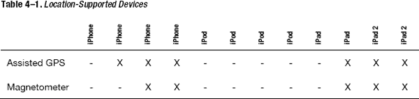


### 要求定位服务

如果你的应用完全依赖于定位服务，你可能希望阻止它加载到不支持定位服务的设备上。你可以要求设备具备 GPS、磁力计或常规定位服务。请仅在应用功能绝对需要这些能力时，才添加这些要求。要配置这些要求，请在导航窗格中点击项目，然后在编辑器窗口中选择项目目标。

如果你希望向现有项目添加这些要求，请选择“信息”标签，并在“自定义 iOS 目标属性”列表中添加一行。你可以通过点击键名右侧或任何现有行名称右侧的小“+”图标来添加一行。你要添加的键是“Required device capabilities”或`UIRequiredDeviceCapabilities`。这两个名称没有区别，因为后者会自动被前者替换。该键包含一个值数组，这些值引用了设备运行应用所需的设备能力。展开该键，并将所需能力作为该键中的项目添加，如图 4-1 中突出显示的那样。

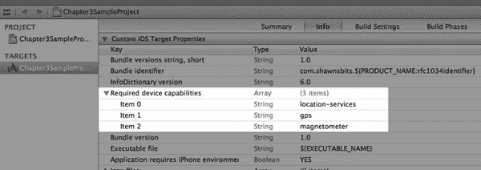

**图 4-1.** *指定应用的所需设备能力*

如果你只需要定位服务（即仅了解用户的大致位置，无需方向或 GPS 精度），则只需添加定位服务这一项即可。但如果你的应用需要 GPS 精度，那么你可能需要添加 GPS 要求。如果你包含了 GPS 项，也应该包含定位服务项。最后，如果你的设备需要了解设备的朝向，你可以将磁力计作为一个必需能力包含在内。

### 如何知道我在哪里？

查找设备位置主要有两种方法：标准定位服务和重大位置变化服务。使用哪种方法取决于你所需信息的精度以及你希望多频繁地收到设备位置变化的通知。

标准定位服务提供更精确的位置信息，如果所请求的精度需要，它将调用 GPS。这种更高的精度是以获取精确位置用时更长以及电池消耗增加为代价的。如果你打算使用标准定位服务，应当精确使用，并且只在必要时使用。我们将在本章后面讨论一些使用此服务的最佳实践和技术。

重大位置变化服务提供了一定的灵活性，推荐给大多数不需要高精度位置信息的应用使用。例如，如果你只需要知道某人所在的城镇或城市，重大位置变化服务就完全可以接受。你将获得快速响应，而不会消耗太多电量，因为它使用蜂窝信号来确定设备位置。重大位置变化服务的另一个好处是它能够在设备后台运行。你的应用不必在前台运行就能接收来自此服务的位置更新。

这两种服务的工作方式非常相似。它们都需要实例化一个`CLLocationManager`对象，该对象负责设置定位服务并指定其使用方式。`CLLocationManager`对象还定义了一个委托。该委托应至少响应两个方法：

```
- locationManager:didUpdateToLocation:fromLocation:
- locationManager:didFailWithError:
```

每种服务这些方法的实现将在随后的方案中讨论。

### 方案 4-1：获取设备位置信息

为了获取设备最精确的位置信息，你将使用标准定位服务。我们首先创建一个名为 Chapter4SampleProject 的新单视图应用来实现此功能。如果你的 Xcode 版本允许你指定类前缀，请再次输入`Chapter4SampleProject`。

在向应用添加定位服务时，首先要做的是将 Core Location 框架库添加到应用中。从 Xcode 3 到 Xcode 4，框架的位置略有变化。现在，当你在导航窗格中选择项目并选择项目目标时，就能找到它们。切换到“构建阶段”标签，展开“将二进制文件与库链接”区域以查看包含的框架，如图 4-2 所示。点击“+”按钮将允许你向项目添加 Core Location 框架，如图 4-3 所示。

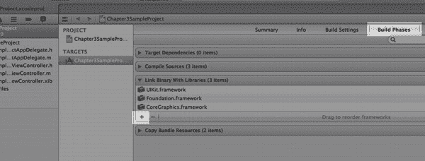

**图 4-2.** *点击“+”按钮添加框架*

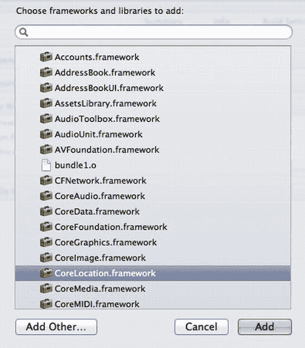

**图 4-3.** *选择`CoreLocation.framework`并将其添加到项目*

现在，你将设置 XIB 以显示位置信息。在导航窗格中点击`Chapter4SampleProject.xib`文件，Interface Builder 将被加载。你将把一个`UILabel`和一个`UISwitch`对象拖到 XIB 上。`UILabel`将用于显示位置信息，`UISwitch`将用于打开和关闭定位服务。你将在工具窗格的“属性检查器”标签中将`UISwitch`的初始状态设置为关闭。现在你的 XIB 如图 4-4 所示。

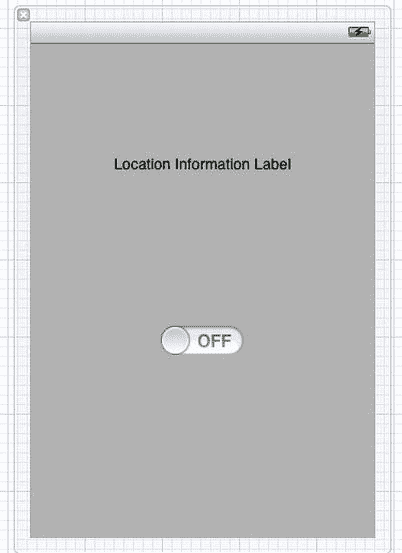

**图 4-4.** *用于显示简单位置信息的用户界面*

现在创建一些输出属性和操作。打开助理编辑器，并在 XIB 中选择`UIView`。按住^键并点击；从`UILabel`拖拽到接口文件（`.h`）以创建一个输出。在出现的弹出窗口中，将`UILabel`命名为“labelLocation”，如图 4-5 所示。

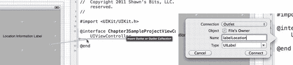

**图 4-5.** *将`UILabel`连接到输出口*

对`UISwitch`重复相同过程，但这次将连接类型更改为“操作”，并将操作命名为“toggleLocationServices”，参考图 4-6。

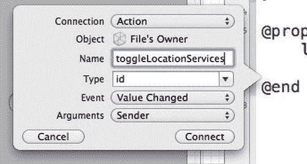

**图 4-6.** *创建由开关执行的操作*

通过将以下行放在接口文件的顶部，将 Core Location 框架导入到`Chapter4SampleProjectViewController`接口文件（`.h`）中：

```
#import <CoreLocation/CoreLocation.h>
```

此时，你还应定义一个`CLLocationManager`对象，为了方便起见，你将视图控制器也设置为`CLLocationManagerDelegate`。该对象将作为你处理所有基于位置服务的“行动中枢”。你的接口文件现在应如下所示：

```
//  Chapter4SampleProjectViewController.h

#import <UIKit/UIKit.h>
#import <CoreLocation/CoreLocation.h>

@interface Chapter4SampleProjectViewController : UIViewController
<CLLocationManagerDelegate> {
    UILabel *labelLocation;
    CLLocationManager *_locationManager;
}

@property (strong, nonatomic) IBOutlet UILabel *labelLocation;

- (IBAction)toggleLocationServices:(id)sender;
@end
```

现在接口已定义完毕，你可以转到实现文件（`.m`）并开始实现这些方法和对象。你首先要处理的是`toggleLocationServices:sender:`操作。当用户触摸此控件时，你需要检查定位服务是否可用。如果不可用，将显示一个警告视图，说明必须启用定位服务才能继续。


```objc
if(![CLLocationManager locationServicesEnabled]){
    UIAlertView *alertLocation = [[UIAlertView alloc] initWithTitle:@"Location
Error" message:@"Location services must be enabled for this feature to work"
delegate:nil cancelButtonTitle:@"OK" otherButtonTitles:nil];
    [alertLocation show];
    return;
}
```

如果位置服务可用，您需要检查控件的状态。如果其状态已设置为“开”，您需要检查`CLLocationManager`对象是否已被实例化。如果没有，您将需要实例化它并设置其属性和委托。对于标准的位置服务，您应当始终设置`CLLocationManager`对象的`desiredAccuracy`和`distanceFilter`属性。

`desiredAccuracy`属性告知 Core Location 框架您希望位置信息的精确程度（以米为单位）。然而，精确度不被保证，设备将尽力使用可用资源，尽可能接近您期望的精确度获取信息。Apple 建议对此设置尽可能保守。如果您不需要知道当前设备的街道地址，请使用更高的精确度设置。有许多常量可供您方便使用：

`kCLLocationAccuracyBestForNavigation`
`kCLLocationAccuracyBest`
`kCLLocationAccuracyNearestTenMeters`
`kCLLocationAccuracyHundredMeters`
`kCLLocationAccuracyKilometer`
`kCLLocationAccuracyThreeKilometers`

如您所见，这些指定距离的常量限于公制单位。如果您对这些距离单位不太熟悉，1 米比 1 码稍长，1 公里则略超半英里（6/10 英里）。

`distanceFilter`属性指定设备需要移动多远（同样以米为单位），以便您通过委托被通知其新位置。为此属性提供的唯一常量是`kCLDistanceFilterNone`，它将向委托报告所有位置变化。

使用定位服务时，您还应始终设置的另一个属性是`purpose`属性。当提示用户允许您的应用程序访问其位置时，`purpose`属性中的字符串会被显示，告知用户您计划如何使用设备的位置信息。

一旦您设置了属性和委托，可以通过调用`CLLocationManager`上的`startUpdatingLocation`方法来启动定位服务。

停止定位服务只需在`CLLocationManager`对象上调用`stopUpdatingLocation`。如果用户将`UISwitch`拨到关闭状态，您就需要这样做。在添加了启动和停止`CLLocationManager`的代码后，您的操作方法应如下所示：

```objc
- (IBAction)toggleLocationServices:(id)sender {
    // Display an UIAlertView if locationServices are not enabled and return
    if(![CLLocationManager locationServicesEnabled]){
        UIAlertView *alertLocation = [[UIAlertView alloc] initWithTitle:@"Location
Error" message:@"Location services must be enabled for this feature to work"
delegate:nil cancelButtonTitle:@"OK" otherButtonTitles:nil];
        [alertLocation show];
        return;
    }

    // Future Proof: Make sure it's a UISwitch calling this action
    if([sender isKindOfClass:[UISwitch class]]){
        UISwitch *locationSwitch=(UISwitch *)sender;
        // Check if switch is "on"
        if(locationSwitch.on){
            // Check if _locationManager has been instantiated yet
            if(_locationManager==nil){
                // Instantiate _locationManager
                _locationManager = [[CLLocationManager alloc] init];
                _locationManager.desiredAccuracy=kCLLocationAccuracyBest;
                _locationManager.distanceFilter=1;
_locationManager.purpose=@"We will only use your location information to display your
present location.  We will not send it or record it.";
_locationManager.delegate=self;
            }
            // Start updating location
            [_locationManager startUpdatingLocation];
        }else{
            // Check if _locationManager has been instantiated yet
            if(_locationManager!=nil){
                // Stop updating location
                [_locationManager stopUpdatingLocation];
            }
        }
    }
}
```

接下来需要设置委托方法。当接收到位置更新或获取位置出现错误时，会调用这些方法。您将首先处理错误委托方法。最常见的错误来源是当提示用户允许您的应用程序使用定位服务，而用户拒绝授权时。如果发生这种情况，您应通过调用`stopUpdatingLocation`方法停止请求位置更新：

```objc
-(void)locationManager:(CLLocationManager *)manager didFailWithError:(NSError *)error{
    if(error.code == kCLErrorDenied){
[manager stopUpdatingLocation];
    }
}
```

处理位置更新的委托方法稍微复杂一些。方法`- locationManager:didUpdateToLocation:fromLocation:`会传递三个对象：发起位置更新请求的`CLLocationManager`，`newLocation`，以及`oldLocation`。这两个位置对象属于`CLLocation`类。该对象包含大量有价值的信息，包括位置坐标、精确度信息以及位置更新的时间戳。您将按如下方式实现此方法：

```objc
-(void)locationManager:(CLLocationManager *)manager didUpdateToLocation:(CLLocation
*)newLocation fromLocation:(CLLocation *)oldLocation{
    // Check to make sure this is a recent location event
    NSDate *eventDate=newLocation.timestamp;
    NSTimeInterval eventInterval=[eventDate timeIntervalSinceNow];
    if(abs(eventInterval)<30.0){
        // Check to make sure the event is accurate
        if(newLocation.horizontalAccuracy>=0 && newLocation.horizontalAccuracy<20){
            self.labelLocation.text=newLocation.description;
        }
    }
}
```

在您的应用程序处理`CLLocation`对象之前，您应检查该位置对象的时间戳是否是最新的。Core Location 有一种习惯，在锁定新位置之前，会首先将上一次已知位置作为第一次调用传递给委托方法。当您需要知道设备当前的位置时，无需处理一个代表设备历史上某个时间点位置的对象。为此，您可以使用类似以下的代码，只处理当前时间 20 秒内发生的位置事件：

```objc
    // Check to make sure this is a recent location event
    NSDate *eventDate=newLocation.timestamp;
    NSTimeInterval eventInterval=[eventDate timeIntervalSinceNow];
    if(abs(eventInterval)<30.0){
        // …process event
    }
```


在处理事件之前，你需要检查的另一个属性是其准确性。同样，如果事件的准确性不在你期望的范围内，就没有必要处理它。与其向用户提供错误信息，不如等待设备获取更准确的读数。`CLLocation`对象包含两个准确性属性：`horizontalAccuracy`和`verticalAccuracy`。

`horizontalAccuracy`属性表示位置可能位于的圆的半径（以米为单位）。在显示你的位置时，可以在内置的“地图”应用中看到这个圆。负值表示坐标无效。

`verticalAccuracy`属性表示设备海拔可能偏差的范围（以米为单位，正负值）。同样，负值表示海拔读数无效。如果设备没有 GPS，`verticalAccuracy`属性将始终为负，因为需要 GPS 才能确定设备的海拔。

以下是一些处理`horizontalAccuracy`的示例代码：

```
if(newLocation.horizontalAccuracy>=0 && newLocation.horizontalAccuracy<20){
    //…处理事件
}
```

我想讨论的另一个属性是`description`属性。`description`属性以`NSString`格式返回`CLLocation`对象的位置信息。这是一种查看设备返回的位置信息的简便方法。我不建议直接向最终用户显示此字符串，因为它包含大量信息，因此格式不适合向用户展示，但对于调试和验证位置信息是否正在更新且正确/准确来说，它可能很有用。在本项目中，你将`labelLocation`文本设置为`newLocation.description`的值，从而完成了之前的委托方法。

借助 Xcode 4.2，你现在可以在 iOS 模拟器中模拟位置信息。在这个出色的功能出现之前，你需要将应用程序加载到测试设备上，然后跑到室外测试定位功能。大多数情况下，你可能会漏掉某些内容，不得不反复操作。然而，这无疑是一种让开发者离开椅子、走到阳光下的好方法。

在 iOS 模拟器中启动`Chapter4SampleProject`。当你将`UISwitch`触摸到“On”时，系统将提示你允许此应用程序访问设备的位置。你会在 Figure 4–7 中注意到，显示的是你在`CLLocationManager`的`purpose`属性中设置的字符串。点击“OK”继续。

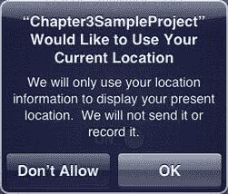

**Figure 4–7.** 你的应用程序请求位置权限

点击“OK”后，你会注意到即使`UISwitch`处于打开状态，`labelLocation`也没有更新，如 Figure 4–8 所示。

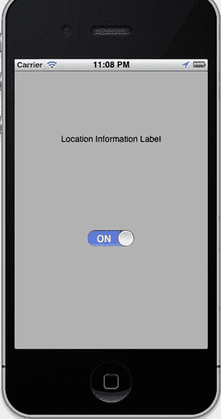

**Figure 4–8.** 没有任何位置数据的模拟应用程序

这是因为你还没有开始任何位置模拟。在 iOS 模拟器中，进入菜单 **Debug**  **Location**  **Freeway Drive**，`labelLocation`应该开始更新，显示 Apple 提供的预录行驶信息。Figure 4–9 显示了模拟行驶传递的信息示例。

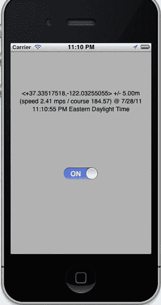

**Figure 4–9.** 显示模拟的位置信息

### Recipe 4–2: 重大位置变化

重大位置变化服务提供了两个重要优势：速度快，并且可以在后台运行。两种定位服务使用的大量代码是相同的，设置也几乎相同，但我将指出不同之处。让我们新建一个名为`Chapter4SignificantLocationTracker`的单视图项目，如果你的 Xcode 版本允许，类前缀也使用相同的名称。

首先，将 Core Location 框架添加到项目中。如果你需要关于如何添加此框架的提示，请返回上一节查看步骤。

要启用后台定位服务，你需要在`Info.plist`中添加一个键。在导航器窗格中选择项目，然后选择项目的目标。切换到“Info”选项卡，并在“Custom iOS Target Properties”列表中添加一行。你要添加的键是“Required background modes”或`UIBackgroundModes`。现在，将“App registers for location updates”添加到 Item 0。你的结果应该类似于 Figure 4–10。

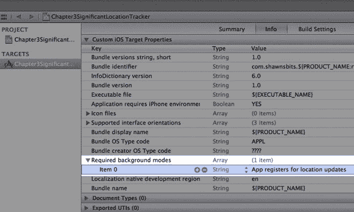

**Figure 4–10.** 将位置变化指定为必需的后台模式

你将像上一节一样设置`.xib`文件，如 Figure 4–11 所示。

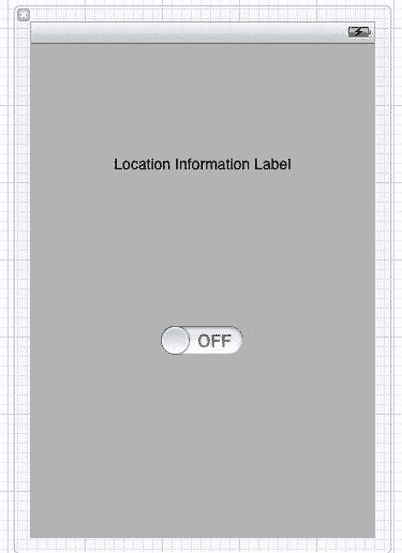

**Figure 4–11.** 熟悉的用户界面

将位置标签连接到名为`labelLocation`的出口，并将`UISwitch`连接到名为`toggleLocationServices`的操作，如 Figures 4–12 和 4–13 所示。

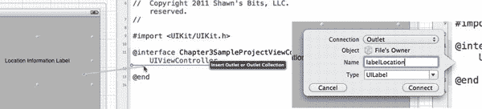

**Figure 4–12.** 将最新的`UILabel`连接到出口

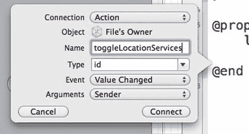

**Figure 4–13.** 创建切换操作

你的接口文件（`.h`）的设置将完全相同：

```
//  Chapter4SignificantLocationTrackerViewController.h

#import <UIKit/UIKit.h>
#import <CoreLocation/CoreLocation.h>

@interface Chapter4SignificantLocationTrackerViewController : UIViewController
<CLLocationManagerDelegate>{
    CLLocationManager *_locationManager;
    UILabel *labelLocation;
}
@property (strong, nonatomic) IBOutlet UILabel *labelLocation;
- (IBAction)toggleLocationServices:(id)sender;

@end
```

现在切换到你的实现文件（`.m`）并滚动到`- (IBAction)toggleLocationServices:(id)sender`方法。你将首先检查定位服务是否已启用，如果未启用，则显示`UIAlertView`：

```
    //检查定位服务是否已启用
    if(![CLLocationManager locationServicesEnabled]){
        UIAlertView *alertLocation = [[UIAlertView alloc] initWithTitle:@"需要定位服务" message:@"需要定位服务才能使此应用正常工作" delegate:nil cancelButtonTitle:@"确定" otherButtonTitles: nil];
        [alertLocation show];
        return;
    }
```

其余代码与你之前所做的非常相似，但有一些例外。首先，你不需要指定`desiredAccuracy`和`distanceFilter`属性。你仍然应该指定`purpose`属性，以便用户知道你将如何使用他们的位置。

```
if([sender isKindOfClass:[UISwitch class]]){
        UISwitch *locationSwitch=(UISwitch *)sender;
        if(locationSwitch.on){
            //检查 _locationManager 是否已实例化
            if(_locationManager==nil){
                //实例化 _locationManager
                _locationManager = [[CLLocationManager alloc] init];
                _locationManager.purpose=@"我们仅会在本地使用您的位置信息。我们不会记录或将其发送给任何人";
                _locationManager.delegate=self;
            }
….
```


另一个重大变化是：当准备好开始接收位置更新时，你需要在 `location manager` 上调用 `startMonitoringSignificantLocationChanges` 方法。现在，你的操作代码如下：

```
- (IBAction)toggleLocationServices:(id)sender {
    //Check if location services are enabled
    if(![CLLocationManager locationServicesEnabled]){
        UIAlertView *alertLocation = [[UIAlertView alloc] initWithTitle:@"Location Services Needed" message:@"Location services are needed to make this app functional" delegate:nil cancelButtonTitle:@"OK" otherButtonTitles: nil];
        [alertLocation show];
        return;
    }

    //Future proof, make sure sender is UISwitch
    if([sender isKindOfClass:[UISwitch class]]){
        UISwitch *locationSwitch=(UISwitch *)sender;
        if(locationSwitch.on){
            //Check if _locationManager has been instantiated
            if(_locationManager==nil){
                //Instantiate _locationManager
                _locationManager = [[CLLocationManager alloc] init];
                _locationManager.purpose=@"We will only use your location locally.  We will not record it or send it to anyone";
                _locationManager.delegate=self;
            }
            //Start updating location changes
            [_locationManager startMonitoringSignificantLocationChanges];
        }else{
            if(_locationManager!=nil){
                //Stop monitoring for location changes
                [_locationManager stopMonitoringSignificantLocationChanges];
            }
        }
    }
}
```

现在你需要设置委托方法。最简单的是定义 `- (void)locationManager:(CLLocationManager *)manager didFailWithError:(NSError *)error` 方法：

```
- (void)locationManager:(CLLocationManager *)manager didFailWithError:(NSError *)error{
    if(error.code==kCLErrorDenied){
        [manager stopMonitoringSignificantLocationChanges];
    }
}
```

对于 `- (void)locationManager:(CLLocationManager *)manager didUpdateToLocation:(CLLocation *)newLocation fromLocation:(CLLocation *)oldLocation` 方法，你会做一些不同的处理。除了更新位置标签外，你还会生成一个本地通知，以便在应用未运行时也能看到位置更新。

首先，你需要进行检查，确保 `newLocation` 的时间戳是最近的，并且其 `horizontalAccuracy` 为正数，以验证其有效性：

```
    NSDate *eventDate=newLocation.timestamp;
    NSTimeInterval eventInterval = [eventDate timeIntervalSinceNow];
    if(abs(eventInterval)<30.0){
        if(newLocation.horizontalAccuracy>=0){
        …
```

如果应用正在运行，除非在应用委托中实现了 `application:didReceiveLocalNotification:` 委托方法，否则你不会看到 `UILocalNotification`。现在不这样做，而是在应用打开时直接用 `self.labelLocation.text = newLocation.description;` 更新位置标签，显示新的位置描述。

要创建 `UILocalNotification`，请使用以下代码：

```
            UILocalNotification *locationNotification = [[UILocalNotification alloc] init];
            locationNotification.alertBody=[NSString stringWithFormat:@"New Location: %.3f, %.3f", newLocation.coordinate.latitude, newLocation.coordinate.longitude];
            locationNotification.alertAction=@"Ok";
            locationNotification.soundName = UILocalNotificationDefaultSoundName;
            //Increment the applicationIconBadgeNumber
            locationNotification.applicationIconBadgeNumber=[[UIApplication sharedApplication] applicationIconBadgeNumber]+1;
            [[UIApplication sharedApplication] presentLocalNotificationNow:locationNotification];
```

你的委托方法的完整代码如下：

```
- (void)locationManager:(CLLocationManager *)manager didUpdateToLocation:(CLLocation *)newLocation fromLocation:(CLLocation *)oldLocation{
    NSDate *eventDate=newLocation.timestamp;
    NSTimeInterval eventInterval = [eventDate timeIntervalSinceNow];
    NSLog(@"Event Interval: %f", eventInterval);
    NSLog(@"Accuracy: %f", newLocation.horizontalAccuracy);
    if(abs(eventInterval)<30.0){
        if(newLocation.horizontalAccuracy>=0){
            self.labelLocation.text = newLocation.description;
            UILocalNotification *locationNotification = [[UILocalNotification alloc] init];
            locationNotification.alertBody=[NSString stringWithFormat:@"New Location: %.3f, %.3f", newLocation.coordinate.latitude, newLocation.coordinate.longitude];
            locationNotification.alertAction=@"Ok";
            locationNotification.soundName = UILocalNotificationDefaultSoundName;
            //Increment the applicationIconBadgeNumber
            locationNotification.applicationIconBadgeNumber=[[UIApplication sharedApplication] applicationIconBadgeNumber]+1;
            [[UIApplication sharedApplication] presentLocalNotificationNow:locationNotification];
        }
    }
}
```

在这个新应用中，即使应用不在前台，你也能为每一次显著的位置变化接收到本地通知。这些变化会反映在应用图标的通知角标以及正常的设备通知上。


### 配方 4–3：确定磁方位角

现代 iPhone 和 iPad 2 现已内置磁力计硬件，可用于判断设备握持的方向。其测量基于设备相对于地球磁北极的位置。磁极与地球的地理极点并不相同。磁北极位于加拿大北部，并随着地核变化以每年约 55–60 公里的速度向西缓慢移动。

实现航向跟踪与我们目前讨论过的任何位置跟踪服务非常相似。你需要在项目中加入 Core Location 框架，创建一个 `CLLocationManager` 对象，并定义其委托及委托方法。

默认情况下，设备航向的测量假设设备以竖屏模式握持，且设备顶部远离用户。你可以通过设置 `CLLocationManager` 对象的 `headingOrientation` 属性来更改此设置。该属性的可选值如下：

`CLDeviceOrientationPortrait（默认）`
`CLDeviceOrientationPortraitUpsideDown`
`CLDeviceOrientationLandscapeLeft`
`CLDeviceOrientationLandscapeRight`

让我们先创建一个名为 `Chapter4HeadingTracking` 的单视图应用程序项目。如果你的 Xcode 版本允许指定类前缀，请再次填写“Chapter4HeadingTracking”。首先，通过在导航器窗格中选择项目并选择项目的目标，将 Core Location 框架加入你的项目中。按照本章开头的方法，将 Core Location 框架添加到项目中。

接下来，你可以设置 XIB 文件以显示航向。在导航器窗格中点击 `Chapter4HeadingTrackingViewController.xib` 文件，Interface Builder 将加载。与之前的配方类似，你将拖拽一个 `UILabel` 和一个 `UISwitch` 对象到 XIB 上。`UILabel` 用于显示航向信息，而 `UISwitch` 用于开启或关闭航向跟踪服务。你将在属性检查器窗格中将 `UISwitch` 的初始状态设置为“关”。此时你的 XIB 应如图 Figure 4–14 所示。

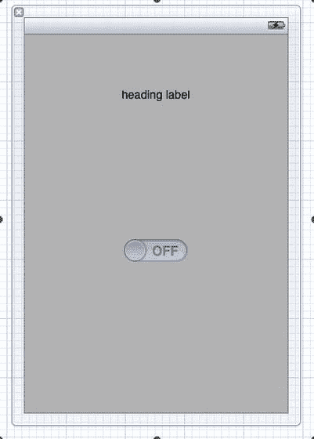

**图 4–14.** *你依然熟悉的用户界面设置*

布局完 `.xib` 文件后，让我们创建一些输出口属性和操作。打开助理编辑器，并在 XIB 中选择 `UIView`。按住 ^-点击并从 `UILabel` 拖拽到接口文件（`.h`）以创建一个输出口。在弹出的对话框中，将 `UILabel` 命名为“labelHeading”。这些步骤应如图 Figure 4–15 和 4–16 所示。

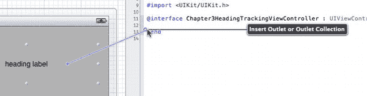

**图 4–15.** *连接 `UILabel` 输出口*

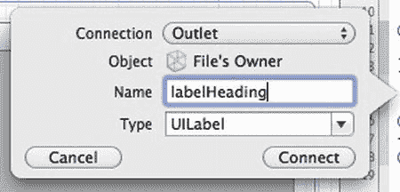

**图 4–16.** *配置标签的输出口*

对 `UISwitch` 重复相同过程，但这次将连接类型更改为“操作”，并将操作命名为“switchHeadingServices”，如图 Figure 4–17 所示。

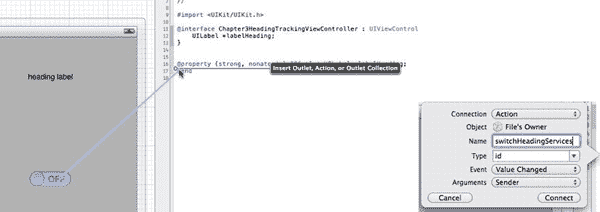

**图 4–17.** *创建开关的操作*

在 `Chapter4HeadingTrackingViewController` 的接口文件（`.h`）中，导入 Core Location 框架并设置视图控制器遵循 `CLLocationManagerDelegate` 协议。然后定义一个 `CLLocationManager` 实例变量。接口文件现在应如下所示：

```
//  Chapter4HeadingTrackingViewController.h

#import <UIKit/UIKit.h>
#import <CoreLocation/CoreLocation.h>

@interface Chapter4HeadingTrackingViewController : UIViewController <CLLocationManagerDelegate>{
    CLLocationManager *_locationManager;
    UILabel *labelHeading;
}

@property (strong, nonatomic) IBOutlet UILabel *labelHeading;
- (IBAction)switchHeadingServices:(id)sender;
@end
```

切换到实现文件（`.m`），滚动到底部开始定义 `switchHeadingService` 方法。与位置服务类似，你将首先通过检查 `[CLLocationManager headingAvailable]` 的返回值来确认航向服务是否可用。然后验证发送者是否为 `UISwitch`：

```
if([CLLocationManager headingAvailable]){
        if([sender isKindOfClass:[UISwitch class]]){
            UISwitch *headingSwitch=(UISwitch *)sender;
        …
```

如果 `headingSwitch` 处于“开”状态，你将检查实例变量 `_locationManager` 是否已实例化，如果未实例化则进行实例化。当创建用于跟踪航向变化的 `CLLocationManager` 实例时，应指定 `headingFilter` 属性。该属性指定航向变化多少度（以度为单位）后才会调用委托方法。然后，与其他位置跟踪服务一样，你需要指定 `purpose` 属性以告知用户你打算如何使用位置信息，最后指定 `CLLocationManager` 的 `delegate`。实例变量实例化后，你可以调用 `startUpdatingHeading` 来启动航向跟踪服务，同时更新标签以便查看进度：

```
if(headingSwitch.on){
                if(_locationManager==nil){
                    _locationManager=[[CLLocationManager alloc] init];
                    _locationManager.headingFilter=5;
                    _locationManager.purpose=@"我们将使用您的位置来告诉您前进的方向";
                    _locationManager.delegate=self;
                }
                [_locationManager startUpdatingHeading];
                self.labelHeading.text=@"正在开始航向跟踪…";
}else{
       ….
```

接下来，如果开关被拨到“关”位置，你将关闭航向跟踪服务。因此完整的方法如下所示：

```
- (IBAction)switchHeadingServices:(id)sender {
    if([CLLocationManager headingAvailable]){
        if([sender isKindOfClass:[UISwitch class]]){
            UISwitch *headingSwitch=(UISwitch *)sender;
            if(headingSwitch.on){
                if(_locationManager==nil){
                    _locationManager=[[CLLocationManager alloc] init];
                    _locationManager.headingFilter=5;
                    _locationManager.purpose=@"我们将使用您的位置来告诉您前进的方向";
                    _locationManager.delegate=self;
                }
                [_locationManager startUpdatingHeading];
                self.labelHeading.text=@"正在开始航向跟踪…";
            }else{
                self.labelHeading.text=@"已关闭航向跟踪";
                if(_locationManager!=nil){
                    [_locationManager stopUpdatingHeading];
                }
            }
        }
    }else{
        self.labelHeading.text=@"航向服务不可用";
    }
}
```

接下来需要定义委托方法。对于航向跟踪服务，需要定义三个委托方法：

- `locationManager:didFailWithError:`
- `locationManager:didUpdateHeading:`
- `locationManagerShouldDisplayHeadingCalibration:`

第一个方法 `didFailWithError` 与你之前实现位置跟踪服务中的委托方法相同。如果出现错误（很可能是因为用户未授权访问其位置服务），你需要关闭航向跟踪服务：

```
- (void)locationManager:(CLLocationManager *)manager didFailWithError:(NSError *)error{
    if(error.code==kCLErrorDenied){
        [manager stopUpdatingHeading];
        self.labelHeading.text=@"错误：航向跟踪被拒绝";
    }
}
```


`didUpdateHeading`方法处理设备朝向变化超过`headingFilter`属性设定的阈值时的逻辑。在此实例中，将检查时间戳以确保是最近读数，然后确保`headingAccuracy`属性为正值。若朝向无效，`headingAccuracy`属性将为负值。最后，将使用`magneticHeading`读数更新`labelHeading`。

```
- (void)locationManager:(CLLocationManager *)manager didUpdateHeading:(CLHeading *)newHeading{
    NSDate *headingDate=newHeading.timestamp;
    NSTimeInterval headingInterval=[headingDate timeIntervalSinceNow];
    if(abs(headingInterval)<30){
        if(newHeading.headingAccuracy<0)
            return;
        self.labelHeading.text=[NSString stringWithFormat:@"Your new heading is: %.1f°", newHeading.magneticHeading];
    }
}
```

**注意：** 使用 ++8 (Option+Shift+8) 插入度（°）符号。

需要实现的最后一个委托方法是`locationManagerShouldDisplayHeadingCalibration`。该方法决定是否应显示朝向校准界面。该场景会提示用户以“8”字形移动设备，以便校准磁力计。目前尚未遇到不希望显示此界面的情况，因此始终返回`YES`：

```
-(BOOL)locationManagerShouldDisplayHeadingCalibration:(CLLocationManager *)manager{
    return YES;
}
```

图 4–18 展示了设备无法轻松校准时的校准界面。测试此应用时，可能不会看到此界面，但作为预防措施，启用它是一个重要环节。

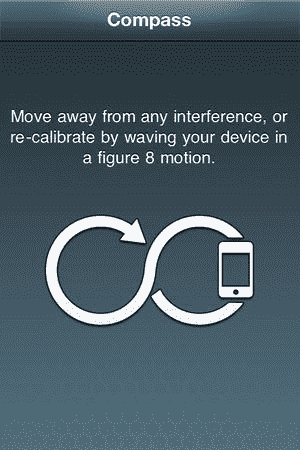

**图 4–18.** *朝向校准界面*

这是一个无法在模拟器中运行的应用，必须将其加载到实际设备上进行测试。

### Recipe 4–4：指定真方位

已经了解了如何获取磁北朝向，那么真北呢？磁北与真北之间的差异称为磁偏角。磁偏角随地球位置不同而变化很大，但如果知道所在位置，就可以计算磁偏角。对于 iPhone 或 iPad 2，如果设备知道自己的位置，它会为您计算并返回`CLHeading`对象的`trueHeading`属性。

明确来说，如果将位置跟踪服务与朝向跟踪服务结合使用，就能找到设备相对于真北的方向。只需在`CLLocationManager`上调用`startUpdatingLocation`方法即可获取真北朝向。

可以新建一个项目，或在上一个 Recipe 的基础上扩展。选择`Chapter4HeadingTrackingViewController.xib`文件，为真方位添加第二个标签，如图 4–19 所示。

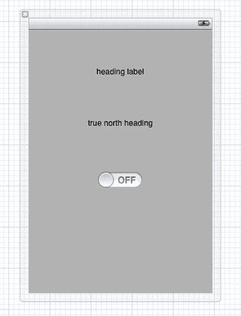

**图 4–19.** *新增标签后的用户界面*

通过显示 Assistant Editor 面板，并从标签 ^-点击拖拽到接口文件（`.h`），将此新标签连接到名为`labelTrueHeading`的出口，如图 4–20 所示。

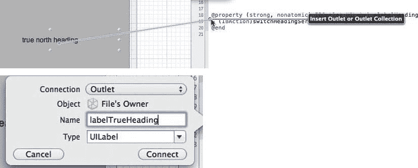

**图 4–20.** *配置额外标签的出口*

接口文件（`.h`）现在应类似以下代码块。如果 Xcode 版本未在属性之外自动生成`UILabel`实例变量，无需担心，这些是可选的。

```
//  Chapter4HeadingTrackingViewController.h
//  Chapter4HeadingTracking

#import <UIKit/UIKit.h>
#import <CoreLocation/CoreLocation.h>

@interface Chapter4HeadingTrackingViewController : UIViewController
<CLLocationManagerDelegate>{
    CLLocationManager *_locationManager;
    UILabel *labelHeading;
    UILabel *labelTrueHeading;
}

@property (strong, nonatomic) IBOutlet UILabel *labelHeading;
@property (strong, nonatomic) IBOutlet UILabel *labelTrueHeading;
- (IBAction)switchHeadingServices:(id)sender;
@end
```

代码只需做少量修改。首先，需要在`switchHeadingServices`方法中调用`startUpdatingLocation`和`stopUpdatingLocation`：

```
if(headingSwitch.on){
    if(_locationManager==nil){
        _locationManager=[[CLLocationManager alloc] init];
        _locationManager.headingFilter=5;
        _locationManager.purpose=@"We will use your location to tell you where you are headed";
        _locationManager.delegate=self;
    }
    [_locationManager startUpdatingHeading];
    [_locationManager startUpdatingLocation];
    self.labelHeading.text=@"Starting heading tracking…";
}else{
    self.labelHeading.text=@"Turned heading tracking off";
    if(_locationManager!=nil){
        [_locationManager stopUpdatingHeading];
        [_locationManager stopUpdatingLocation];
    }
}
```

现在，在`didUpdateHeading`方法中，添加一条新语句来检查`trueHeading`值。如果`trueHeading`为负值，则无效，因此仅在`trueHeading`大于或等于 0 时使用该属性：

```
if(newHeading.headingAccuracy<0)
    return;

if(newHeading.trueHeading>=0){
    self.labelTrueHeading.text=[NSString stringWithFormat:@"Your true heading is: %.1f°", newHeading.trueHeading];
}

self.labelHeading.text=[NSString stringWithFormat:@"Your magnetic heading is: %.1f°", newHeading.magneticHeading];
```

实现文件（`.m`）中的自定义方法如下所示：

```
//
//  Chapter4HeadingTrackingViewController.m

#import "Chapter4HeadingTrackingViewController.h"
```


`@implementation Chapter4HeadingTrackingViewController`  
`@synthesize labelHeading;`  
`@synthesize labelTrueHeading;`  
`- (IBAction)switchHeadingServices:(id)sender {`  
`    if([CLLocationManager headingAvailable]){`  
`        if([sender isKindOfClass:[UISwitch class]]){`  
`            UISwitch *headingSwitch=(UISwitch *)sender;`  
`            if(headingSwitch.on){`  
`                if(_locationManager==nil){`  
`                    _locationManager=[[CLLocationManager alloc] init];`  
`                    _locationManager.headingFilter=5;`  
`                    _locationManager.purpose=@"We will use your location to tell you where you are headed";`  
`                    _locationManager.delegate=self;`  
`                }`  
`                [_locationManager startUpdatingHeading];`  
`                [_locationManager startUpdatingLocation];`  
`                self.labelHeading.text=@"正在开始方向追踪…";`  
`            }else{`  
`                self.labelHeading.text=@"已关闭方向追踪";`  
`                if(_locationManager!=nil){`  
`                    [_locationManager stopUpdatingHeading];`  
`                    [_locationManager stopUpdatingLocation];`  
`                }`  
`            }`  
`        }`  
`    }else{`  
`        self.labelHeading.text=@"方向服务不可用";`  
`    }`  
`}`  
`-(void)locationManager:(CLLocationManager *)manager didFailWithError:(NSError *)error{`  
`    if(error.code==kCLErrorDenied){`  
`        [manager stopUpdatingHeading];`  
`        self.labelHeading.text=@"错误：方向追踪被拒绝";`  
`    }`  
`}`  
`-(void)locationManager:(CLLocationManager *)manager didUpdateHeading:(CLHeading *)newHeading{`  
`    NSDate *headingDate=newHeading.timestamp;`  
`    NSTimeInterval headingInterval=[headingDate timeIntervalSinceNow];`  
`    if(abs(headingInterval)<30){`  
`        if(newHeading.headingAccuracy<0)`  
`            return;`  
`        if(newHeading.trueHeading>=0){`  
`            self.labelTrueHeading.text=[NSString stringWithFormat:@"您的真北方向为：%.1f°", newHeading.trueHeading];`  
`        }`  
`        self.labelHeading.text=[NSString stringWithFormat:@"您的磁北方向为：%.1f°", newHeading.magneticHeading];`  
`    }`  
`}`  
`-(BOOL)locationManagerShouldDisplayHeadingCalibration:(CLLocationManager *)manager{`  
`    return YES;`  
`}`  

测试该应用程序后，您将能够获得设备方向的简单读数，该读数同时基于磁方向和真方向。与本章中其他使用磁力计的操作方法一样，此功能仅在物理设备上有效，在模拟器上无效。

## 操作指南 4–5：区域监测

Core Location 提供了一种监测设备进入或离开圆形区域的方法。应用程序可以利用此功能，在设备进入某个特定位置附近时触发提醒，例如，当您接近杂货店时提醒购买牛奶。您也可以利用它，在您离开公司时向家人发送通知，告知他们您正在回家的路上。只要发挥一点想象力，就会发现这种功能有众多应用可能性。

#### 关于区域的一些要点

区域由中心坐标和以米为单位的半径（同样，一米略多于三英尺或一码）来定义。监测方法仅在您跨越区域边界时触发事件。如果设备在监测启动时已位于区域内，则不会触发事件。只有在设备进入或离开区域时才会触发事件。

一旦创建了`CLLocationManager`对象，您就可以使用`startMonitoringForRegion:desiredAccuracy:`方法注册多个需要监测的区域。您注册用于监测的区域在应用程序的多次启动之间是持久存在的。如果当边界事件发生时您的应用程序没有运行，则应用程序会在后台自动重新启动，以便处理该事件。您之前设置的所有区域都将通过`CLLocationManager`对象的`monitoredRegions`属性获取。

区域是系统全局共享的，并且在任何给定时间可以监测的区域数量有限。您应始终限制当前正监测的区域数量，以免消耗系统资源。您应该移除那些不在设备当前位置附近区域的监测。例如，如果设备在西海岸，就无需监测马里兰州的区域。当您尝试注册新区域进行监测而空间不足时，会向`locationManager:monitoringDidFailForRegion:withError:`委托方法返回错误`kCLErrorRegionMonitoringFailure`。


#### 欢迎来到巴尔的摩！

在本项目中，你将创建一个针对马里兰州巴尔的摩市的区域，并在游客进入该区域时向他们表示欢迎。首先创建一个名为 `Chapter4RegionMonitoring` 的新单视图应用程序。如果你的 Xcode 版本允许设置类前缀，请使用相同的名称 `Chapter4RegionMonitoring`。首先要做的是在项目中包含 Core Location 框架，方法是在导航窗格中选择项目，然后选择项目的目标。转到 Build Phases 选项卡，展开 Link Binary With Libraries 区域以查看已包含的框架，并像之前章节中那样添加该框架。

添加库后，你可以创建 `.xib` 文件。在导航窗格中选择 `Chapter4RegionMonitoringViewController.xib` 以打开 Interface Builder。添加一个 `UILabel` 和一个 `UISwitch`。将 `UISwitch` 的初始状态设置为 `Off`。它应类似于图 4-21。

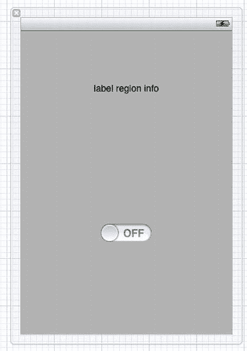

**图 4-21.** *你非常熟悉的用户界面*

使用助理编辑器，通过从 `.xib` 文件到接口文件（`.h`）执行 `^-单击-拖拽` 来连接输出口和操作。按照图 4-22、图 4-23、图 4-24 和图 4-25 的步骤，创建一个名为 `labelRegionInfo` 的 `UILabel` 输出口，以及一个名为 `regionMonitoringToggle` 的 `UISwitch` 的 `IBAction`。

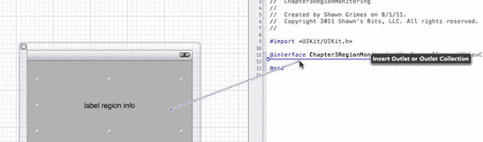

**图 4-22.** *将 `UILabel` 连接到输出口*

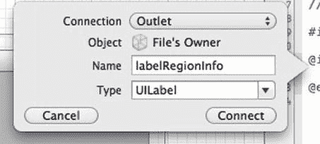

**图 4-23.** *配置 `UILabel` 输出口*

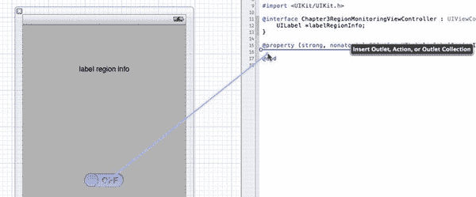

**图 4-24.** *连接 `UISwitch` 的操作*

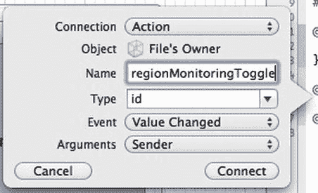

**图 4-25.** *配置切换操作*

你需要将 Core Location 框架导入到接口文件（`.h`）中，并创建一个 `CLLocationManager` 实例变量。然后将你的视图控制器声明为遵循 `CLLocationManagerDelegate` 协议。现在，你的视图控制器的接口文件（`.h`）如下所示：

```
//  Chapter4RegionMonitoringViewController.h
#import <UIKit/UIKit.h>
#import <CoreLocation/CoreLocation.h>

@interface Chapter4RegionMonitoringViewController : UIViewController
<CLLocationManagerDelegate>{
    CLLocationManager *_locationManager;
    UILabel *labelRegionInfo;
}

@property (strong, nonatomic) IBOutlet UILabel *labelRegionInfo;
- (IBAction)regionMonitoringToggle:(id)sender;

@end
```

切换到实现文件（`.m`），你可以实现区域跟踪方法。首先要确保区域监控可用且已启用。滚动到 `Chapter4RegionMonitoringViewController.m` 的底部，并将以下内容添加到 `- (IBAction)regionMonitoringToggle:(id)sender` 方法中：

```
//检查区域监控是否可用
if([CLLocationManager regionMonitoringAvailable] && [CLLocationManager
regionMonitoringEnabled]){

        ….
}else{
        self.labelRegionInfo.text=@"此设备不支持区域监控";
}
```

在同一方法中，如果 `CLLocationManager` 实例变量尚未创建，你需要实例化它，并确保是你的 `UISwitch` 调用了该方法：

```
    //检查区域监控是否可用
    if([CLLocationManager regionMonitoringAvailable] && [CLLocationManager
regionMonitoringEnabled]){
        //确保发送者是 UISwitch
        if([sender isKindOfClass:[UISwitch class]]){
            UISwitch *regionSwitch=(UISwitch *) sender;
            //如果 UISwitch 处于打开状态
            if(regionSwitch.on){
                if(_locationManager==nil){
                    _locationManager=[[CLLocationManager alloc] init];
                    _locationManager.purpose=@"欢迎来到巴尔的摩";
                    _locationManager.delegate=self;
                }
…
```

你需要定义要监控的区域中心坐标和半径。指定半径时要小心，因为如果半径太大，监控将会失败。你可以通过将半径与 `CLLocationManager` 对象的 `maximumRegionMonitoringDistance` 属性进行比较，来确保半径在边界范围内。一旦有了中心坐标和半径，就可以创建 `CLRegion` 对象，并为其提供一个标识符以便将来引用：

```
CLLocationCoordinate2D baltimoreCoordinate=CLLocationCoordinate2DMake(39.2963, -76.613);
int regionRadius=3000;
if(regionRadius>_locationManager.maximumRegionMonitoringDistance){
regionRadius=_locationManager.maximumRegionMonitoringDistance;
}
CLRegion *baltimoreRegion=[[CLRegion alloc]
initCircularRegionWithCenter:baltimoreCoordinate
        radius:regionRadius
        identifier:@"baltimoreRegion"];
```

创建区域后，你可以通过将区域告知 `CLLocationManager` 实例对象并设置监控事件的精度，来开始监控该区域的边界事件：

```
[_locationManager startMonitoringForRegion:baltimoreRegion
        desiredAccuracy:kCLLocationAccuracyHundredMeters];
```

最后要做的一件事是，如果用户将 `UISwitch` 滑动到 `Off` 位置，则关闭区域监控。为此，你将访问 `CLLocationManager` 实例变量的 `monitoredRegions` 属性，并为所有当前监控的区域关闭区域监控。你也可以选择利用 `CLRegion` 的 `identifier` 属性，有选择地关闭特定区域。

```
}else{
                //如果 UISwitch 处于关闭状态
                if(_locationManager!=nil){
                    for (CLRegion *monitoredRegion in [_locationManager
monitoredRegions]) {
                        [_locationManager stopMonitoringForRegion:monitoredRegion];
                        self.labelRegionInfo.text=[NSString stringWithFormat:@"已关闭区域监控：%@", monitoredRegion.identifier];
                    }
                }
}
```

还需要定义代理方法。有两个用于处理边界事件的代理方法和一个用于处理错误的代理方法：

`locationManager:didEnterRegion:`
`locationManager:didExitRegion:`
`locationManager:monitoringDidFailForRegion:withError:`

有两个与区域监控相关的主要错误代码。一个是 `kCLErrorRegionMonitoringDenied`，当设备用户明确拒绝访问区域监控时使用它。另一个是 `kCLErrorRegionMonitoringFailure`，当监控特定区域失败时使用它，通常是因为系统没有更多的区域资源可供应用程序使用。


`-(void)locationManager:(CLLocationManager *)manager monitoringDidFailForRegion:(CLRegion *)region withError:(NSError *)error {
    switch (error.code) {
        case kCLErrorRegionMonitoringDenied:
        {
            self.labelRegionInfo.text = @"此设备上禁止区域监控";
            break;
        }
        case kCLErrorRegionMonitoringFailure:
        {
            self.labelRegionInfo.text = [NSString stringWithFormat:@"区域监控失败，区域：%@", region.identifier];
            break;
        }
        default:
        {
            self.labelRegionInfo.text = [NSString stringWithFormat:@"发生未处理的错误：%@", error.description];
            break;
        }
    }
}
```

`didEnter` 和 `didExit` 可以执行你想要的任何功能。由于边界事件发生时应用程序可能处于后台，除了更新标签外，你还需要使用本地通知来让用户知道事件的发生：

```objc
-(void)locationManager:(CLLocationManager *)manager didEnterRegion:(CLRegion *)region {
    self.labelRegionInfo.text = @"欢迎来到巴尔的摩！";
    UILocalNotification *locationNotification = [[UILocalNotification alloc] init];
    locationNotification.alertBody = @"欢迎来到巴尔的摩！";
    locationNotification.alertAction = @"确定";
    locationNotification.soundName = UILocalNotificationDefaultSoundName;
    [[UIApplication sharedApplication] presentLocalNotificationNow:locationNotification];
}

-(void)locationManager:(CLLocationManager *)manager didExitRegion:(CLRegion *)region {
    self.labelRegionInfo.text = @"感谢访问巴尔的摩！欢迎再来！";
    UILocalNotification *locationNotification = [[UILocalNotification alloc] init];
    locationNotification.alertBody = @"感谢访问巴尔的摩！欢迎再来！";
    locationNotification.alertAction = @"确定";
    locationNotification.soundName = UILocalNotificationDefaultSoundName;
    [[UIApplication sharedApplication] presentLocalNotificationNow:locationNotification];
}
```

为了使用 iOS 模拟器测试此功能，你必须能够输入自定义坐标进行模拟。就像之前食谱中的高速公路模拟一样，你可以通过导航到 `Debug`  `Location`  `Custom Location…` 来输入自定义坐标，然后在此处输入你自己的坐标进行测试。

## 食谱 4–6：反向地理编码与正向地理编码

位置坐标对应用程序很有用，但对人类来说并不友好。你上一次用经纬度坐标写地址是什么时候？这实在不便于人类理解。人类的位置通常用国家、州、城市等名称来表示。因此，当设备用户询问“我在哪里？”时，用户并不想知道 GPS 坐标，而是想知道自己所在的城镇或城市。

幸运的是，Apple 提供了一种将位置坐标转换为人类可读格式的方法。这种方法称为反向地理编码，iOS 5 中的 `Core Location` 框架提供了这一功能。在 iOS 5 之前的版本中，`Map Kit` 框架提供了此功能。

以下是使用反向地理编码时需要注意的一些最佳实践：

-   一次只应发送一个地理编码请求。
-   如果用户执行的操作会导致对同一位置进行地理编码，应重用结果，而不是多次请求同一位置。
-   每分钟发送的地理编码请求不应超过一个。在发起下一个地理编码请求之前，应检查用户是否移动了足够远的距离。
-   如果用户看不到结果（例如，你的应用程序在后台运行），请不要执行地理编码请求。
-   设备必须具有网络访问权限才能执行地理编码请求。

地理编码使用 `CLGeocoder` 类执行。你实例化一个 `CLGeocoder` 对象，然后向其传递一个坐标和一个代码块，该代码块在地理编码完成后执行。这与目前讨论的其他使用委托方法的位置食谱略有不同。

让我们创建一个名为“Chapter4Geocoder”的新单视图应用程序，它将告诉我们所在的位置。如果你可以指定类前缀，请使用相同的名称“Chapter4Geocoder”。通过在导航器窗格中选择项目并选择目标，将 `Core Location` 框架添加到应用程序中。现在单击 `Build Settings` 选项卡，展开标记为 `Link Binary With Libraries` 的区域，然后像之前食谱中那样添加 `Core Location` 框架。

选择 `Chapter4GeocoderViewController.xib` 文件以加载 Interface Builder，并向 XIB 添加一个 `UILabel` 和一个圆角 `UIButton`，如图 4–26 所示。

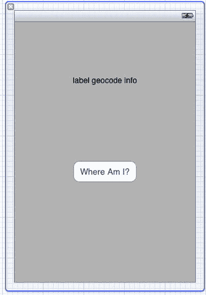

**图 4–26.** *地理编码用户界面*

使用助理编辑器，按住 `^` 键将 `UILabel` 拖拽到接口文件（`.h`）中，以创建一个名为 `labelGeocodeInfo` 的插座变量。对 `UIButton` 重复此过程，创建一个名为 `actionWhereAmI` 的操作。图 4–27、4–28 和 4–29 展示了这些步骤。

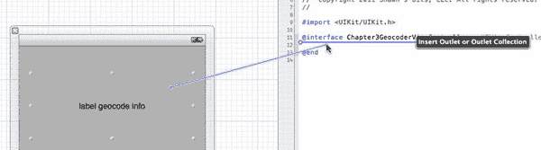

**图 4–27.** *连接你的 `UILabel` 的插座变量*

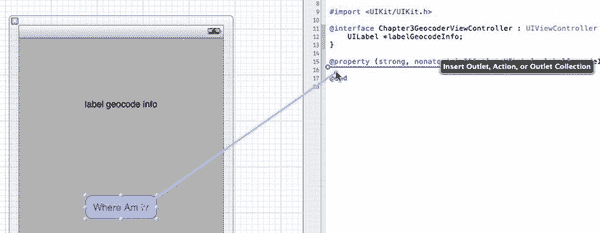

**图 4–28.** *连接 `UISwitch` 的操作*

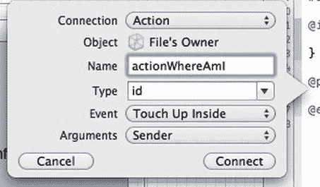

**图 4–29.** *配置操作的创建*

将 `Core Location` 库导入 `Chapter4GeocoderViewController` 接口文件（`.h`），并将视图控制器定义为遵循 `CLLocationManagerDelegate` 协议。这仅用于获取设备的当前位置，对于地理编码并非必需。

你还需要创建一个 `CLLocationManager` 类的实例变量来获取设备的当前位置，以及一个 `CLGeocoder` 的实例来执行地理编码。完成后，接口文件应如下所示：

```objc
//  Chapter4GeocoderViewController.h

#import <UIKit/UIKit.h>
#import <CoreLocation/CoreLocation.h>

@interface Chapter4GeocoderViewController : UIViewController
<CLLocationManagerDelegate> {
    CLLocationManager *_locationManager;
    CLGeocoder *_geoCoder;
    UILabel *labelGeocodeInfo;
}
```


`@property (strong, nonatomic) IBOutlet UILabel *labelGeocodeInfo;`
`- (IBAction)actionWhereAmI:(id)sender;`
`@end`

切换到 `Chapter4GeocoderViewController` 的实现文件 (`.m`)，滚动到底部以实现 `actionWhereAmI` 方法。由于本章之前的文章中已经介绍过这部分内容，在此不再赘述，不过我会重点强调一些关键点。你应该遵循地理编码的最佳实践，不要对距离已编码位置过近或时间过近的位置进行地理编码。因此，你需要在 `CLLocationManager` 对象上将其 `distanceFilter` 属性设置为 500 米。同时，将期望精度设置为常量 `kCLLocationAccuracyHundredMeters`，以便从位置跟踪服务中获得更快的响应，并限制电池消耗。

```objc
- (IBAction)actionWhereAmI:(id)sender {
    if([CLLocationManager locationServicesEnabled]){
        if([sender isKindOfClass:[UIButton class]]){
            if(_locationManager==nil){
                _locationManager=[[CLLocationManager alloc] init];
                _locationManager.purpose=@"为你提供当前位置信息";
                _locationManager.delegate=self;
                _locationManager.distanceFilter=500;
                _locationManager.desiredAccuracy=kCLLocationAccuracyHundredMeters;
            }
            [_locationManager startUpdatingLocation];
            self.labelGeocodeInfo.text=@"获取位置中…";
        }
    }else{
        self.labelGeocodeInfo.text=@"位置服务不可用";
    }
}
```

现在，你需要为 `CLLocationManager` 对象添加代理方法。第一个是 `didFailWithError` 方法：

```objc
-(void)locationManager:(CLLocationManager *)manager didFailWithError:(NSError *)error{
    if(error.code==kCLErrorDenied){
        self.labelGeocodeInfo.text=@"位置信息访问被拒绝";
    }
}
```

接下来是待定义的 `didUpdateToLocation` 代理方法。首先进行标准检查，确保 `newLocation` 的时间戳属性是最近且精确的：

```objc
-(void)locationManager:(CLLocationManager *)manager didUpdateToLocation:(CLLocation *)newLocation fromLocation:(CLLocation *)oldLocation{
    NSDate *locationDate=newLocation.timestamp;
    NSTimeInterval locationInterval=[locationDate timeIntervalSinceNow];
    if(abs(locationInterval)<30){
        if(newLocation.horizontalAccuracy<0)
            return;
```

你需要检查 `_geoCoder` 实例变量是否已实例化，如果没有，则创建它。然后，在执行新的地理编码之前，确保停止任何现有的地理编码服务：

```objc
//如果尚未实例化，则实例化 _geoCoder
if(_geoCoder==nil)
_geoCoder=[[CLGeocoder alloc] init];

//每个操作只允许一个地理编码实例
//因此，在开始新的地理编码操作前，先停止之前的操作
if([_geoCoder isGeocoding])
[_geoCoder cancelGeocode];
```

最后，启动反向地理编码过程并定义完成处理程序。完成处理程序接收两个对象：一个名为 `placemarks` 的 `NSArray`（包含 `CLPlacemarks` 对象）和一个 `NSError`。如果数组中包含一个或多个对象，则表示反向地理编码成功。如果没有，则可以检查错误码以获取详细信息。最终的 `didUpdateToLocation` 方法如下：

```objc
-(void)locationManager:(CLLocationManager *)manager didUpdateToLocation:(CLLocation *)newLocation fromLocation:(CLLocation *)oldLocation{
    NSDate *locationDate=newLocation.timestamp;
    NSTimeInterval locationInterval=[locationDate timeIntervalSinceNow];
    if(abs(locationInterval)<30){
        if(newLocation.horizontalAccuracy<0)
            return;

        //如果尚未实例化，则实例化 _geoCoder
        if(_geoCoder==nil)
            _geoCoder=[[CLGeocoder alloc] init];

        //每个操作只允许一个地理编码实例！
        //因此，在开始新的地理编码操作前，先停止之前的操作
        if([_geoCoder isGeocoding])
            [_geoCoder cancelGeocode];

        [_geoCoder reverseGeocodeLocation:newLocation
                        completionHandler:^(NSArray* placemarks, NSError* error){
                            if([placemarks count]>0){
                                CLPlacemark *foundPlacemark=[placemarks objectAtIndex:0];
                                self.labelGeocodeInfo.text=[NSString stringWithFormat:@"你
当前位于: %@", foundPlacemark.description];
                            }else if(error.code==kCLErrorGeocodeCanceled){
                                NSLog(@"地理编码已取消");
                            }else if(error.code==kCLErrorGeocodeFoundNoResult){
                                self.labelGeocodeInfo.text=@"未找到地理编码结果";
                            }else if(error.code==kCLErrorGeocodeFoundPartialResult){
                                self.labelGeocodeInfo.text=@"部分地理编码结果";
                            }else{
                                self.labelGeocodeInfo.text=[NSString
stringWithFormat:@"未知错误: %@", error.description];
                            }
                        }];

        //停止更新位置，直到用户再次点击按钮
        [manager stopUpdatingLocation];
    }
}
```

测试此应用后，你应该能够接收到设备的位置信息，包括街道名称、城市、国家以及其他有价值的信息。当然，这可以在物理设备上测试，也可以在模拟器中使用之前使用过的相同位置模拟功能进行测试。

### 根据地名获取坐标

iOS 5 也引入了正向地理编码功能。这意味着你可以向 `CLGeocoder` 对象传递一个地址，并接收该地址的坐标作为结果。`CLGeocoder` 将地址字符串作为参数进行处理，你提供的地址信息越详细，得到的正向地理编码结果就越精确。如果地理编码过程识别出多个可能匹配的坐标，这些坐标将通过 `completionHandler` 的 `NSArray` 的 `placemarks` 返回。一个示例实现如下：

```objc
CLGeocoder *_geoCoder=[[CLGeocoder alloc] init];
[_geoCoder geocodeAddressString:@"2400 Boston Street, Baltimore, MD, USA"
        completionHandler:^(NSArray* placemarks, NSError* error){
                        for (CLPlacemark* aPlacemark in placemarks)
                        {
                                // 处理 placemark。
                        }
}];
```

### 总结

Core Location 框架是一个强大的框架，可以被许多应用功能所使用。正如本章所示，你可以确定设备的位置、设备面朝的方向，以及设备进入或离开特定区域的时间。除了这些强大的功能之外，你还可以对地理坐标执行查询，以确定人类可读的位置信息，呈现给你的最终用户，并提供补充服务来执行反向操作。

苹果公司在为开发者提供强大功能的同时，也尊重用户的隐私并注意设备的电池消耗，这之间取得了很好的平衡。作为开发者，我们在开发应用、提供令人兴奋的特性和功能时，也应当对用户保持同样的尊重。在 `CLLocationManager` 对象上使用 `purpose` 属性以及审慎地使用位置服务，正是朝着正确方向迈出的步骤。

# 第 5 章


# 地图套件使用指南

Map Kit 框架是一套极其强大且实用的工具集，它为设备提供的位置服务增添了丰富的功能。该框架的核心在于能在应用程序中放置用户可交互的地图，并通过无数其他扩展功能实现近乎完全可定制的地图界面。iOS 5 继续提升了 Map Kit 的能力，增强了开发者的开发能力，使基于地图的应用更加动态且实用。

与本书其他章节相同，本章所有项目都应确保已启用 ARC（自动引用计数）。

## 配方 5–1：在地图上显示设备位置

任何 Map Kit 应用的基础核心都是世界地图的实际显示。在本节中，你将了解如何创建一个 Map Kit 应用、显示地图，并让地图显示用户的位置。

首先，使用**单视图应用**模板创建一个新项目，如图 图 5–1 所示。

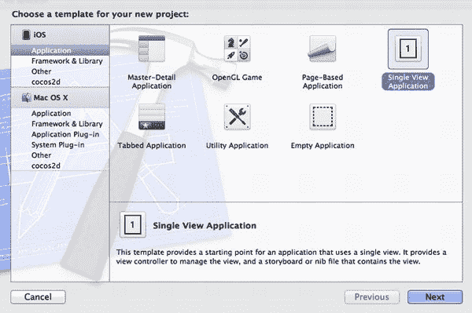

**图 5–1.** *选择单视图应用*

图 5–2 显示了此项目将使用的配置设置。你的 Xcode 版本可能还包含“使用自动引用计数”复选框，请确保始终勾选该复选框。你可以将项目命名为 `Chapter5Recipe1`。

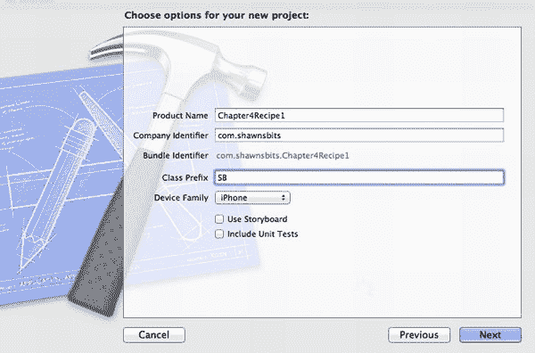

**图 5–2.** *配置项目*

首先，你需要将 Map Kit 框架和 Core Location 框架添加到项目中。在导航窗格中，选择 `Chapter5Recipe1` 项目文件，然后在编辑器视图中确保已选中 `Chapter5Recipe1` 目标（如果未选中）。点击`构建阶段`标签，展开`将二进制文件与库链接`部分。点击`+`按钮将框架添加到列表中，如图 图 5–3 中高亮所示，并使用弹出的窗口（类似图 5–4）添加所需框架。

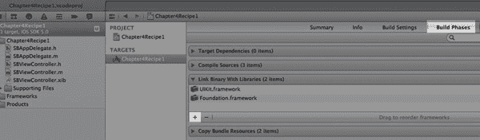

**图 5–3.** *点击 + 按钮添加框架*

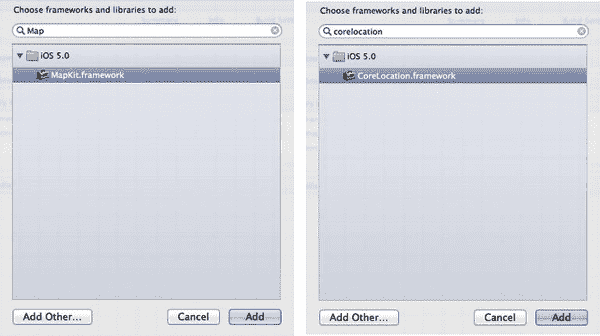

**图 5–4.** *选择 Core Location 和 Map Kit 框架*

添加框架后，可以开始构建界面。从导航窗格中选择视图控制器的 `.xib` 文件，并从对象浏览器中拖拽一个 `MKMapView` 到工作区，使其填满视图。

接下来，在 `MKMapView` 顶部添加一个 `UILabel`，用于显示设备的纬度和经度。图 5–5 展示了用户界面的示例样式。

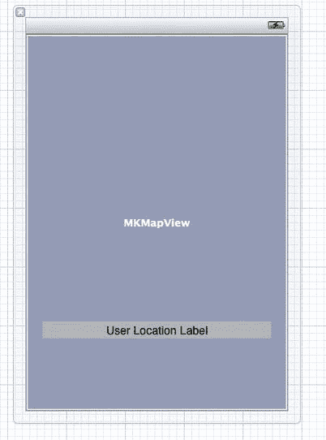

**图 5–5.** *包含 `MKMapView` 和 `UILabel` 的 `.xib` 文件*

使用助理编辑器，通过从 `MKMapView` 按住 ^-键拖拽到 `SBViewController` 文件的方式，将 `MKMapView` 连接到 `SBViewController` 接口文件（`.h`），如 图 5–6 和 图 5–7 所示。

**注意：** 如果接口文件未显示在助理编辑器的第二个窗格中，请确保你在工作区中点击了视图控制器。

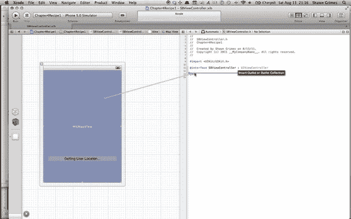

**图 5–6.** *将 `MKMapView` 连接到 Outlet*

将 `MKMapView` 的 Outlet 命名为 `mapViewUserMap`。

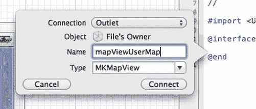

**图 5–7.** *配置地图视图 Outlet*

对 `UILabel` 重复相同步骤，并将 Outlet 命名为 `labelUserLocation`。

至此，用户界面已完全设置好，你可以直接专注于接口文件（`.h`）的编写。在导航窗格中选择 `SBViewController.h` 文件。在进入实现文件之前，需要对此类接口进行两处补充。首先，通过导入语句将 `MapKit/MapKit.h` 框架库添加到类中；其次，将类定义为遵循 `MKMapViewDelegate` 协议。苹果建议，当你使用 `MapView` 时，应为其指定一个委托对象。完整的接口文件（`.h`）如下所示：

```
//  SBViewController.h
//  Chapter5Recipe1
#import <UIKit/UIKit.h>
#import <MapKit/MapKit.h>

@interface SBViewController : UIViewController <MKMapViewDelegate> {
    MKMapView *mapViewUserMap;
    UILabel *labelUserLocation;
}

@property (strong, nonatomic) IBOutlet MKMapView *mapViewUserMap;
@property (strong, nonatomic) IBOutlet UILabel *labelUserLocation;

@end
```


切换到实现文件`SBViewController.m`，让我们开始在`viewDidLoad`方法中设置`MKMapView`。每当你使用`MKMapView`对象时，都应设置其委托（delegate）和区域（region）。

区域是当前显示的地图部分，由一个中心坐标以及围绕中心坐标的纬度和经度距离构成。如果你和大多数人一样不习惯用经纬度来思考距离，可以使用`MKCoordinateRegionMakeWithDistance`方法，通过中心坐标和围绕该坐标的米数来创建区域。如果你对公制单位不熟悉，1 米比 1 码稍长一点。

在本示例中，我选择将地图初始平移到显示我的家乡马里兰州巴尔的摩。我为该位置定义了一个坐标，然后定义一个包含该中心坐标周围 10 公里×10 公里区域的区域。

```
// 设置 MKMapView 委托
self.mapViewUserMap.delegate=self;

// 设置 MKMapView 起始区域
CLLocationCoordinate2D coordinateBaltimore = CLLocationCoordinate2DMake(39.303, -76.612);
self.mapViewUserMap.region=
    MKCoordinateRegionMakeWithDistance(coordinateBaltimore,
                                       10000,
                                       10000);
```

两个可选属性值得一提：`.zoomEnabled`和`.scrollEnabled`。这两个属性分别控制用户与地图的交互，可以防止用户缩放或平移地图。

```
// 可选控制
//    self.mapViewUserMap.zoomEnabled=NO;
//    self.mapViewUserMap.scrollEnabled=NO;
```

最后，你需要将地图设置为显示用户位置。这可以通过`.showUserLocation`属性轻松完成。将此属性设置为`YES`将启动核心位置跟踪方法，并提示用户授权该应用程序进行位置跟踪。

**注意：**仅仅因为`showUserLocation`被设置为`YES`，用户的位置不会自动在地图上可见。要判断该位置是否在当前地图区域内可见，请使用`userLocationVisible`属性。

告知地图要显示用户位置后，你还可以通过设置`.userTrackingMode`属性或使用`setUserTrackingMode:animated:`方法告知地图跟踪用户位置。该属性接受三个可能的值：

* `MKUserTrackingModeNone`：不跟踪用户位置；地图可以移动到不包含用户位置的区域。
* `MKUserTrackingModeFollow`：地图将平移以保持用户位置在中心。地图顶部始终指向北方。如果用户手动平移地图，跟踪将停止。
* `MKUserTrackingModeFollowWithHeading`：地图将平移以保持用户位置在中心，并且地图会旋转，使得用户朝向位于地图顶部。如果用户手动平移地图，跟踪将停止。

最初，你将`userTrackingMode`设置为`MKUserTrackingModeFollow`，但稍后我将展示如何让用户自行控制跟踪模式。下面的`if`语句将确认设备上已启用位置服务。

```
// 控制地图上的用户位置
if ([CLLocationManager locationServicesEnabled])
{
    mapViewUserMap.showsUserLocation = YES;
    [mapViewUserMap setUserTrackingMode:MKUserTrackingModeFollow animated:YES];
}
```

完整的`viewDidLoad`方法如下所示：

```
- (void)viewDidLoad
{
    [super viewDidLoad];

    // 设置 MKMapView 委托
    self.mapViewUserMap.delegate=self;

    // 设置 MKMapView 起始区域
    CLLocationCoordinate2D coordinateBaltimore = CLLocationCoordinate2DMake(39.303, -76.612);
    self.mapViewUserMap.region=
        MKCoordinateRegionMakeWithDistance(coordinateBaltimore,
                                           10000,
                                           10000);

    // 可选控制
    //    self.mapViewUserMap.zoomEnabled=NO;
    //    self.mapViewUserMap.scrollEnabled=NO;

    // 控制地图上的用户位置
    if ([CLLocationManager locationServicesEnabled])
    {
        mapViewUserMap.showsUserLocation = YES;
        [mapViewUserMap setUserTrackingMode:MKUserTrackingModeFollow animated:YES];
    }
}
```

下一个重要的事情是`viewDidUnload`方法。每当你为一个对象设置委托时，应该在释放该对象之前将委托设为`nil`，以避免任何内存问题。因此，你需要在`viewDidUnload`中添加一行，将`self.mapViewUserMap`的委托设为`nil`：

```
- (void)viewDidUnload
{
    self.mapViewUserMap.delegate=nil;
    [self setMapViewUserMap:nil];
    [self setLabelUserLocation:nil];
    [super viewDidUnload];
}
```

最后要做的事情是设置一个`mapView`委托方法，以更新显示用户当前位置的标签。你将使用`-mapView:didUpdateUserLocation:`委托方法。你的方法实现如下：

```
-(void)mapView:(MKMapView *)mapView didUpdateUserLocation:(MKUserLocation *)userLocation{
    self.labelUserLocation.text=
        [NSString
            stringWithFormat:@"Current Location: %.5f°, %.5f°",
                userLocation.coordinate.latitude,
                userLocation.coordinate.longitude];
}
```

你已经有了足够的起点，现在可以在模拟器上运行你的应用。你可以使用键盘快捷键`⌘R`来运行应用。当应用在模拟器上启动时，系统将提示用户允许该应用访问其位置。图 5–8 显示了你的应用程序展示这个确切的提示信息。

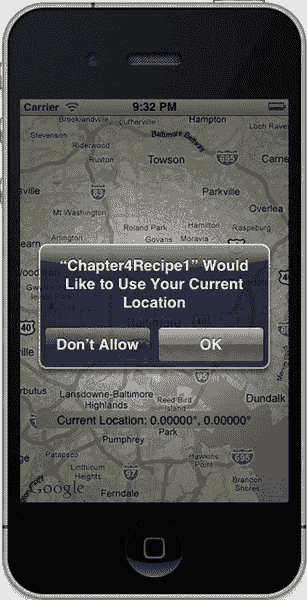

**图 5–8.** *应用程序访问位置的提示*

如果你点击“OK”，并且在你的设备上看到巴尔的摩市（但地图上没有你的位置标记），那么你可能需要启动位置调试服务。在模拟器上，前往菜单选项**Debug**  **Location**  **Freeway Drive**，这将启动模拟器上的位置模拟服务。地图应平移到新位置（在加利福尼亚州记录的一段驾驶路线）并更新位置标签。

用户在本示例中会遇到的其中一个问题是：如果他们尝试手动平移地图，用户位置跟踪就会停止。Apple 提供了一个新的`UIBarButtonItem`类，名为`MKUserTrackingBarButtonItem`。此按钮可以添加到任何`UIToolBar`或`UINavigationBar`中，并会在指定的地图视图上切换用户跟踪模式。

你可以通过使用`initWithMapView:`方法，将你想要控制的`MKMapView`传递给`MKUserTrackingBarButtonItem`来进行初始化。

为此，你需要在 Interface Builder 中向你的`.xib`文件添加一个`UIToolbar`，并为其创建一个名为`toolbarMapTools`的插座。你可以删除工具栏默认添加的`BarButtonItem`，否则你的`viewDidLoad`方法会覆盖它。如果你从`.xib`文件中删除它，你的用户界面将类似于图 5–9。

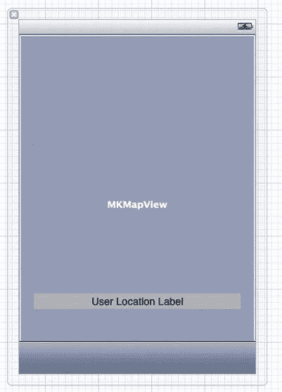

**图 5–9.** *向`.xib`底部添加工具栏*

现在你将通过代码添加`MKUserTrackingBarButtonItem`。切换到视图控制器实现文件`SBViewController.m`，并滚动到`viewDidLoad`方法。在`viewDidLoad`底部添加以下代码：


// 为用户位置追踪控件创建 BarButtonItem
`MKUserTrackingBarButtonItem *trackingBarButton = [[MKUserTrackingBarButtonItem alloc] initWithMapView:self.mapViewUserMap];`

// 将 UserTrackingBarButtonItem 添加到 UIToolbar
`[self.toolbarMapTools setItems:[NSArray arrayWithObject:trackingBarButton] animated:YES];`

借助这个新增的控件，用户可以手动平移地图，然后只需按下这个新的工具栏按钮，即可重新追踪自己的位置。图 5–10 演示了你已实现的用户追踪功能。

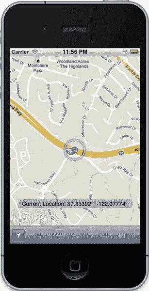

**图 5–10.** *支持平移和用户追踪的模拟应用*

**注意：** `MKUserLocationFollowWithHeading` 在 iOS 模拟器中无法正常工作。

## 范例 5–2：使用大头针标记位置

通常，地图最实用的功能之一，不仅在于能看到用户所在位置，还能看到用户正在寻找的目标位置。为此，你需要在地图上添加标注。本范例将基于前面的范例进行构建。

首先，你需要通过创建 `NSObject` 的子类来定义标注。为此，前往 **文件**  **新建**  **新建文件**，在 Cocoa Touch 类别下，选择 "Objective-C class"，如图 图 5–11 所示。

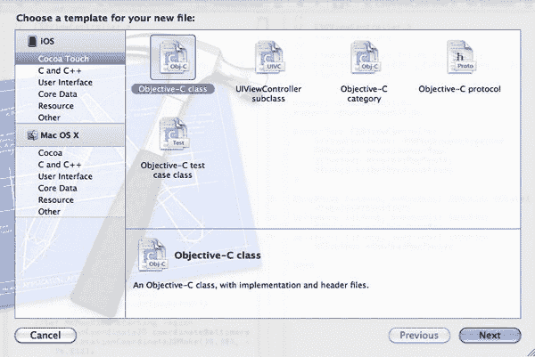

**图 5–11.** *创建一个充当标注的 Objective-C 类*

为你的类指定一个清晰的名称，比如 "MyAnnotation"，并确保它是 `NSObject` 的子类，如 图 5–10 所示。

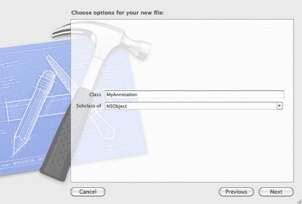

**图 5–12.** *配置你的 `NSObject` 子类*

点击下一步，然后点击创建，将该类添加到你的项目中。

接下来要做的是让你的 `MyAnnotation` 遵循 `MKAnnotation` 协议。这需要在你的头文件中导入 `<MapKit/MapKit.h>`，并添加一个必需的 `coordinate` 属性。你还需要实现可选的 `title` 和 `subtitle` 属性，并创建一个 `initWithCoordinate` 方法。实现代码如下：

```
#import <Foundation/Foundation.h>
#import <MapKit/MapKit.h>

@interface MyAnnotation : NSObject <MKAnnotation>
{
    NSString *title;
    NSString *subtitle;
}

@property (nonatomic) CLLocationCoordinate2D coordinate;
@property (nonatomic, copy) NSString *title;
@property (nonatomic, copy) NSString *subtitle;

-(id) initWithCoordinate:(CLLocationCoordinate2D) aCoordinate;

@end
```

确保在你的 `MyAnnotation.m` 实现文件中合成这三个属性。该文件内容如下：

```
#import "MyAnnotation.h"

@implementation MyAnnotation

@synthesize coordinate, title, subtitle;

-(id) initWithCoordinate:(CLLocationCoordinate2D) aCoordinate
{
    self=[super init];
     if (self){
        coordinate = aCoordinate;
    }
    return self;
}

@end
```

现在你需要在你的视图控制器实现文件中，定义你的 `MKMapView` 如何处理标注。为此，你需要实现以下 `- mapView:viewForAnnotation:` 方法。此方法与用于创建 `TableView` 单元格视图的方法非常相似。请确保将 `MyAnnotation.h` 导入到你的视图控制器中，否则代码将无法编译。

```
- (MKAnnotationView *)mapView:(MKMapView *)mapView
viewForAnnotation:(id<MKAnnotation>)annotation
{
    if ([annotation isKindOfClass:[MyAnnotation class]]) //确保不影响用户的位置。
    {
        static NSString *annotationIdentifier=@"annotationIdentifier";
        //尝试获取一个未使用的标注，类似于 uitableviewcells
        MKAnnotationView *annotationView=[self.mapViewUserMap
dequeueReusableAnnotationViewWithIdentifier:annotationIdentifier];
        annotationView.annotation = annotation;
        //如果没有可复用的，则创建一个新的
        if(!annotationView)
        {
            annotationView=[[MKPinAnnotationView alloc] initWithAnnotation:annotation
reuseIdentifier:annotationIdentifier];
        }

        //可选的属性修改
        annotationView.canShowCallout = YES;
        annotationView.rightCalloutAccessoryView = [UIButton
buttonWithType:UIButtonTypeDetailDisclosure]; //在标注气泡右侧创建按钮
        return annotationView;
    }
    return nil;
}
```

你的两个可选属性 `canShowCallout` 和 `rightCalloutAccessoryView` 对于制作交互式地图非常有用。第一个属性使得按下大头针时弹出一个小标注气泡，第二个属性则改变标注气泡右侧的外观。默认情况下，标注气泡中的文本是标注的标题和副标题，这意味着如果你打算显示标注气泡，你的标注应该至少包含一个标题。

最后，最后一步是创建带有信息的标注并将其添加到地图中。你创建一个可变数组来存储你的标注，然后将标注数组添加到你的 `mapView` 中，代码如下。这段代码应放在你的 `viewDidLoad` 方法中。

```
//创建并添加标注
    NSMutableArray *annotations = [[NSMutableArray alloc] initWithCapacity:2];    
    MyAnnotation *ann1 = [[MyAnnotation alloc]
initWithCoordinate:CLLocationCoordinate2DMake(25.802, -80.132)];
    ann1.title = @"迈阿密";
    ann1.subtitle = @"标注 1";
    MyAnnotation *ann2 = [[MyAnnotation alloc]
initWithCoordinate:CLLocationCoordinate2DMake(39.733, -105.018)];
    ann2.title = @"丹佛";
    ann2.subtitle = @"标注 2";    
    [annotations addObject:ann1];
    [annotations addObject:ann2];

    [self.mapViewUserMap addAnnotations:annotations];
```

我选择让大头针落在迈阿密和丹佛，但任何坐标都能正常工作。如果你现在运行这个应用，你应该能看到常规的地图，不过上面插了几根大头针，如 图 5–13 所示。你可能需要缩小地图才能看到它们；在模拟器中，可以通过按住  模拟捏合手势并拖动来实现缩放。

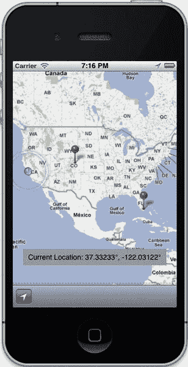

**图 5–13.** *带有地图和大头针的应用*

很多时候，让应用的地图标注可以通过在地图上拖拽来移动，这可能非常有用。实现这一功能极其简单，只需在你的 `-viewForAnnotation:` 委托方法中添加一行代码即可：

`annotationView.draggable = YES;`

只要你合成了标注的 `coordinate` 属性，你的大头针（或你决定使用的任何其他 `AnnotationView`）就变得可拖拽了。


### 食谱 5–3：创建自定义标注

虽然大多数情况下，默认的 `MKPinAnnotationView` 对象非常有用，但有时你可能希望在地图上使用不同的图像来代替图钉来表示标注。这可以是代表朋友家乡的朋友头像，也可以是代表公司位置的公司 Logo。为了创建自定义标注视图，你需要继承 `MKAnnotationView` 类。你还将自定义标注弹窗，使其显示不仅仅是标题和副标题。

首先，你需要像本章前面那样创建项目，将其命名为 `customAnnotationViews`，并添加 Map Kit 和 Core Location 框架。然后，将 Map Kit 添加到视图控制器中，确保使用 `#import` 语句导入 `<MapKit/MapKit.h>` 和 `<CoreLocation/CoreLocation.h>`，并将视图控制器设置为遵循 `MKMapViewDelegate` 协议（有关如何执行这些任务，请参阅本章开头）。你还需要通过修改`-viewDidLoad`方法来设置 `MapView` 的委托为你的视图控制器，具体如下：

```
- (void)viewDidLoad
{
    [super viewDidLoad];
    self.mapViewUserMap.delegate = self;
}
```

在进一步操作之前，你需要将要用作图钉替代图像的图片导入到项目中。为此，我选择了一个名为 `avatar.png` 的小图片，如下面的图 5–14 所示。


**图 5–14.** *自定义标注图像*

显然，这张图片对于地图来说太大了，所以你稍后会将其缩小。

导入文件的最佳方式是直接将文件从 Finder 拖拽到你的导航窗格中。我倾向于将此类文件放在 Supporting Files 组下。在出现的对话框中，确保勾选“将项目复制到目标组的文件夹中（如果需要）”选项。图 5–15 应该类似于显示此选项的窗口，该特定复选框位于顶部。


**图 5–15.** *添加文件时确保勾选“复制项目”复选框*

接下来，你将创建标注类。选择**File**  **New**  **New File**…，然后在“Cocoa Touch”下选择“Objective-C class”。在下一个屏幕中，将类命名为 `MyAnnotation`，并确保它是 `NSObject` 的子类。图 5–16 显示了此配置。


**图 5–16.** *继承 `NSObject` 以创建标注*

单击 Next 然后 Create 后，你将开始编辑此类。

首先需要做的，是用以下行引入框架：

```
#import <CoreLocation/CoreLocation.h>
#import <MapKit/MapKit.h>
```

接下来，你需要确保你的类遵循 `MKAnnotation` 协议。为此，在类的头部添加 `<MKAnnotation>`，并声明三个属性：`coordinate`、`title` 和 `subtitle`。你还将声明一个指定的初始化方法，以便通过坐标创建标注。完成所有这些更改后，你的头文件将如下所示：

```
#import <Foundation/Foundation.h>
#import <CoreLocation/CoreLocation.h>
#import <MapKit/MapKit.h>

@interface MyAnnotation : NSObject <MKAnnotation>

@property (nonatomic) CLLocationCoordinate2D coordinate;
@property (nonatomic, copy) NSString *title;
@property (nonatomic, copy) NSString *subtitle;

-(id)initWithCoordinate:(CLLocationCoordinate2D)coord;
@end
```

现在，你只需构建实现文件。由于你通过这些标注所做的操作并不复杂，仅仅涉及它们的视图，所以你的 `MyAnnotation.m` 文件将如下所示：

```
#import "MyAnnotation.h"

@implementation MyAnnotation

@synthesize coordinate, title, subtitle;
-(id)initWithCoordinate:(CLLocationCoordinate2D)coord
{
    self = [super init];
    if (self)
    {
        self.coordinate = coord;
    }
    return self;
}
@end
```

现在，你可以继续创建 `MKAnnotationView` 的子类了。首先，依次进入 **File**  **New**  **New File**…，然后在“Cocoa Touch”下选择“Objective-C class”，与之前一样。在下一个屏幕中，将类命名为 `CustomAnnotationView`。这里的关键是确保正确设置父对象。在“Subclass of”下，将 `NSObject` 替换为 `MKAnnotationView`，如图 5–17 所示。


**图 5–17.** *继承 `MKAnnotationView`*

单击 Next 然后 Create 继续。

在 `CustomAnnotationView` 的头文件中，你只需要声明一个方法来初始化你的类，因此你的头文件将如下所示：

```
#import <MapKit/MapKit.h>

@interface CustomAnnotationView : MKAnnotationView
-(id)initWithAnnotation:(id <MKAnnotation>) annotation reuseIdentifier:(NSString
*)annotationIdentifier;
@end
```

你可能会注意到，这与 `MKAnnotationView` 的指定初始化器名称完全相同。这是有意为之，目的是让你的子类化过程尽可能简单。在实现文件中，你将通过调用父类的指定初始化器来启动此方法，就像初始化一个普通的 `MKAnnotationView` 一样：

```
-(id)initWithAnnotation:(id <MKAnnotation>) annotation reuseIdentifier:(NSString
*)annotationIdentifier
{
    self = [super initWithAnnotation:annotation reuseIdentifier:annotationIdentifier];
    return self;
}
```

现在，你可以向这个 `initWithAnnotation:reuseIdentifier:` 方法中添加代码来定制你的视图。首先，创建将用作视图图像以替代图钉的 `UIImage`，并将其设置为你的图像。

```
UIImage *myImage = [UIImage imageNamed:@"avatar.png"];
self.image = myImage;
```

你使用的图像尺寸很可能不适合在地图上使用。为了解决这个问题，你可以通过设置视图的 frame 来标准化这些自定义视图的大小，并更改内容缩放模式以达到最佳的图像缩放效果。

```
self.frame = CGRectMake(0, 0, 40, 40);
self.contentMode = UIViewContentModeScaleAspectFill;
```

如果需要，你还可以使用 `centerOffset` 属性来调整图像相对于坐标的位置。如果你使用的图像有一个特定的点（例如图钉或箭头）需要精确位于坐标上，这个属性尤其有用。`centerOffset` 属性接受一个 `CGPoint` 值，创建该值最简单的方式是通过 `CGPointMake()` 函数。

```
self.centerOffset = CGPointMake(1, 1);
```

总的来说，你完整的方法，加上一个快速检查以确保标注被正确初始化，将如下所示：

```
-(id)initWithAnnotation:(id <MKAnnotation>) annotation reuseIdentifier:(NSString
*)annotationIdentifier
{
    self = [super initWithAnnotation:annotation reuseIdentifier:annotationIdentifier];
    if (self)
    {
        //创建要使用的 UIImage。
        UIImage *myImage = [UIImage imageNamed:@"avatar.png"];
        //设置视图的图像
        self.image = myImage;
        //标准化 AnnotationView 的尺寸。
        self.frame = CGRectMake(0, 0, 40, 40);
        //使用 contentMode 确保最佳的图像缩放
        self.contentMode = UIViewContentModeScaleAspectFill;
        //使用 centerOffset 调整图像位置
        self.centerOffset = CGPointMake(1, 1);

    }
    return self;
}
```


**注意：** 所有自定义点都应放置在 `if (self){}` 代码块中，以确保视图已正确初始化。这并非绝对必要，但属于良好的编程实践。如果 `self` 未正确初始化，该条件将判断为假，导致方法直接返回 `nil`。

现在自定义类已全部设置完成，您可以返回视图控制器来实现地图的代理方法。其实现方式与常规实现几乎完全相同，但需要将 `MKPinAnnotationView` 创建 `MKAnnotationView` 的类型改为您的 `CustomAnnotationView`。请记住，如果未导入 `MyAnnotation.h` 和 `CustomAnnotationView.h` 文件，应用程序将无法运行。

```
- (MKAnnotationView *)mapView:(MKMapView *)mapView
viewForAnnotation:(id<MKAnnotation>)annotation
{
    if ([annotation isKindOfClass:[MyAnnotation class]])
    {
        static NSString *annotationIdentifier=@"annotationIdentifier";
        MKAnnotationView *annotationView=[self.mapViewUserMap
dequeueReusableAnnotationViewWithIdentifier:annotationIdentifier];
        annotationView.annotation = annotation;
        if(!annotationView)
        {
            annotationView=[[CustomAnnotationView alloc] initWithAnnotation:annotation
reuseIdentifier:annotationIdentifier];
        }

        annotationView.canShowCallout = YES;
        return annotationView;
    }
    return nil;
}
```

最后，您只需要一些测试数据即可运行。在 `-viewDidLoad` 方法中，添加以下代码来创建几个标注并将其添加到地图中。为了测试，您还需要为每个标注提供标题和副标题。

```
MyAnnotation *test1 = [[MyAnnotation alloc]
initWithCoordinate:CLLocationCoordinate2DMake(37.68, -97.33)];
test1.title = @"test1";
test1.subtitle = @"subtitle";
MyAnnotation *test2 = [[MyAnnotation alloc]
initWithCoordinate:CLLocationCoordinate2DMake(41.500, -81.695)];
test2.title = @"test2";
test2.subtitle = @"subtitle2";
[self.mapViewUserMap addAnnotation:test1];
[self.mapViewUserMap addAnnotation:test2];
```

**注意：** 即使 `MKAnnotationView` 的 `canShowCallout` 属性设置为 YES，如果视图的标注未设置标题，信息框也不会显示。副标题是可选的。

此时，运行应用程序，您应该会看到两个标注出现在地图上，并带有您的图片（已缩小到合理尺寸），分别位于堪萨斯州威奇托和俄亥俄州克利夫兰。图 5–18 是该应用的模拟效果。


**图 5–18.** *带地图和自定义标注的应用程序*

现在，您将添加几行额外的代码来定制信息框。

首先，在标注标题和副标题的左侧放置一张图片。这通过使用 `annotationView` 的 `leftCalloutAccessoryView` 属性实现。您的 `CustomAnnotationView` 类从 `MKAnnotationView` 继承了该属性的 getter 方法，因此我们将重写此方法，使所有自定义视图显示特定图片。您需要在 `CustomAnnotationView.m` 文件中添加以下方法。

```
-(UIView *)leftCalloutAccessoryView
{
    UIImageView *imageView = [[UIImageView alloc] initWithImage:[UIImage
imageNamed:@"avatar.png"]];
    imageView.frame = CGRectMake(0, 0, 20, 20);
    imageView.contentMode = UIViewContentModeScaleAspectFill;
    return imageView;
}
```

这与您为标注视图设置图片的方式非常相似，但多了一个步骤：需要创建一个 `UIImageView` 来承载 `avatar.png` 图片。您再次将其缩小（这次更小），然后返回它。由于 `UIImageView` 是 `UIView` 的子类，这完全可行。

正如您可以编辑 `leftCalloutAccessoryView` 一样，您也可以在信息框的右侧做同样的事情。这里，您只需放置一个小的展开按钮，该按钮可用于执行进一步的功能。

```
-(UIView *)rightCalloutAccessoryView
{
    return [UIButton buttonWithType:UIButtonTypeDetailDisclosure];
}
```

添加此功能后，您的标注信息框将类似于图 5–19 所示。


**图 5–19.** *带自定义标注和信息框的地图*

至此，您的信息框在视觉上已全部设置完成，但信息框内的按钮还蕴含着巨大的潜力，您尚未充分利用。大多数基于地图的应用会在信息框上使用按钮，通常用于将另一个视图控制器推送到屏幕上。以显示特定商业地点在地图上位置的应用为例，它可能允许用户查看特定地点的所有详细信息或图片。

为了增加功能，您将实现地图的另一个代理方法 `-mapView:annotationView:calloutAccessoryControlTapped:`，并让它呈现一个模态视图控制器。出于演示目的，我们将让它只显示您特定标注的标题和副标题，但很容易看出它的应用远不止于此。

首先，创建一个新的视图控制器，用于模态呈现。转到 **文件**  **新建**  **新建文件…**。在“Cocoa Touch”下，选择“UIViewController subclass”。将文件命名为“DetailViewController”，确保“Targeted for iPad”复选框未选中（除非您正在为 iPad 开发），并且“With XIB for User Interface”复选框已选中，如图 5–20 所示。


**图 5–20.** *配置详情视图控制器*

接下来，进入 `DetailViewController` 的 `.xib` 文件，添加标签。从对象库中拖拽两个 `UILabel` 到视图中。将它们分别命名为“title”和“subtitle”。您的用户界面将如图 5–21 所示。


**图 5–21.** *`DetailViewController` 的 `.xib` 视图*

现在，将这两个标签连接到 `DetailViewController` 的头文件。就像处理 `MKMapView` 一样，按住 ^ 键并将标签拖拽到头文件中。将它们的属性分别命名为 `titleLabel` 和 `subtitleLabel`。

接下来，在 `DetailViewController` 的其余部分中，您需要几个 `NSString` 变量来存储标题和副标题，因此只需将它们声明为实例变量。您还需要声明一个指定的初始化方法，该方法接受两个 `NSString` 参数，用于设置标签的文本。您的头文件现在将如下所示：

```
#import <UIKit/UIKit.h>

@interface DetailViewController : UIViewController {
    UILabel *titleLabel;
    UILabel *subtitleLabel;
    NSString *myTitle;
    NSString *mySubtitle;
}

@property (strong, nonatomic) IBOutlet UILabel *titleLabel;
@property (strong, nonatomic) IBOutlet UILabel *subtitleLabel;

-(id)initWithTitle:(NSString *)title subtitle:(NSString *)subtitle;
@end
```

指定初始化方法的实现将如下所示：

```
-(id)initWithTitle:(NSString *)title subtitle:(NSString *)subtitle
{
    self = [super init];
    if (self)
    {
        myTitle = title;
        mySubtitle = subtitle;
    }
    return self;
}
```

最后，您需要在 `-viewDidLoad` 方法中添加以下两行代码，以便在视图加载后设置标签的文本。

```
self.titleLabel.text = myTitle;
self.subtitleLabel.text = mySubtitle;
```


最后，你准备在主导航视图控制器中实现地图的委托方法。在这个方法中，你将创建 `DetailViewController` 并为其提供必要的文本，将其设置为仅执行部分卷曲过渡，然后展示它。使用 `#import "DetailViewController.h"` 正确导入头文件后，你的方法实现将如下所示：

```
-(void)mapView:(MKMapView *)mapView annotationView:(MKAnnotationView *)view
calloutAccessoryControlTapped:(UIControl *)control
{
    MyAnnotation *ann = view.annotation;
    DetailViewController *dvc = [[DetailViewController alloc] initWithTitle:ann.title
subtitle:ann.subtitle];
    dvc.modalTransitionStyle = UIModalTransitionStylePartialCurl;
    [self presentViewController:dvc animated:YES completion:^{}];
}
```

**注意：** 必须将变量 `ann` 声明为 `MyAnnotation` 的实例，以确保编译器知道你正在获取的标注将具有你请求的 `.title` 和 `.subtitle` 属性。

添加此代码后，当点击详情披露按钮时，你的应用程序应类似于图 5–22。


**图 5–22.** *应用程序响应点击标注气泡*

### 食谱 5–4：向地图添加覆盖层

标注并非唯一能添加到地图上的内容。本食谱将介绍如何向地图添加覆盖层，这些覆盖层可以呈现多种形状，从圆形到多边形再到线条。本食谱将基于本章的第一个食谱进行扩展。

你将为你的 `MapView` 添加两种类型的覆盖层：多边形覆盖层和线条覆盖层。添加这些覆盖层的过程与添加标注非常相似，但你不必像处理标注那样为覆盖层创建单独的类。

首先，你将实现 `MapView` 的委托方法，以告诉你的 `MapView` 如何处理覆盖层。你将设置方法，通过使用 `class` 方法来检查覆盖层的类型，从而处理多边形和线条。

```
-(MKOverlayView *)mapView:(MKMapView *)mapView viewForOverlay:(id )overlay{
    if([overlay isKindOfClass:[MKPolygon class]]){
        MKPolygonView *view = [[MKPolygonView alloc] initWithOverlay:overlay];

        //显示设置
        view.lineWidth=1;
        view.strokeColor=[UIColor blueColor];
        view.fillColor=[[UIColor blueColor] colorWithAlphaComponent:0.5];
        return view;
    }
    else if ([overlay isKindOfClass:[MKPolyline class]])
    {
        MKPolylineView *view = [[MKPolylineView alloc] initWithOverlay:overlay];

        //显示设置
        view.lineWidth = 3;
        view.strokeColor = [UIColor blueColor];
        return view;
    }
    return nil;
}
```

现在，你只需创建覆盖层并将它们添加到 `MapView` 中，通过将以下代码添加到 `-viewDidLoad` 中。

```
//创建并添加覆盖层
    NSMutableArray *overlays = [[NSMutableArray alloc] initWithCapacity:2];
    CLLocationCoordinate2D polyCoords[5]={
        CLLocationCoordinate2DMake(39.9, -76.6),
        CLLocationCoordinate2DMake(36.7, -84.0),
        CLLocationCoordinate2DMake(33.1, -89.4),
        CLLocationCoordinate2DMake(27.3, -80.8),
        CLLocationCoordinate2DMake(39.9, -76.6)
    };
    MKPolygon *Poly = [MKPolygon polygonWithCoordinates:polyCoords count:5];
    [overlays addObject:Poly];
    CLLocationCoordinate2D pathCoords[2] = {
        CLLocationCoordinate2DMake(46.8, -100.8),
        CLLocationCoordinate2DMake(43.7, -70.4)
    };
    MKPolyline *pathLine = [MKPolyline polylineWithCoordinates:pathCoords count:2];
    [overlays addObject:pathLine];
    [self.mapViewUserMap addOverlays:overlays];
```

**警告：** 在创建 `MKPolygon` 时，你的最后一个坐标点应与第一个坐标点相同。否则，你将无法获得正确的形状。

现在运行应用程序，当你缩小地图时，应该会看到图 5–23 中的画面。你还会注意到，我们设置的多边形和线条在形状和位置上相当奇怪，因为这仅仅是为了演示你在 `MapView` 上可以使用覆盖层做些什么。


**图 5–23.** *带有几何图形和路径覆盖层的地图*

覆盖层在 Map Kit 应用中非常有用，而且也非常容易自定义。大多数属性（例如颜色或线宽）都可以更改，从而允许你完全自定义应用的外观和行为。覆盖层也可以通过圆形以及其他用户定义的形状来创建。有关如何使用这些其他功能的详细信息，请参考 Apple 文档。


#### 方案 5-5：按位置对标注进行分组

在地图视图上使用标注时，一个常见问题是大量标注可能彼此非常接近，导致屏幕杂乱，使应用难以使用。解决方案是基于位置和可见地图的大小对标注进行分组。你将使用一个简单的算法，每次可见区域发生变化时都会比较位置坐标。

首先，你需要创建项目，将其命名为“HotspotMap”，类前缀为“CSD”，添加`Map Kit`和`Core Location`框架，并确保在类中导入它们。有关具体操作步骤，请参考本章的方案 5-1。

如同向地图添加标注时所必需的（参见方案 5-2），你需要创建一个遵守`MKAnnotation`协议的`NSObject`子类。通过创建新文件，选择“Objective-C class”，并确保它是`NSObject`的子类来创建该类。你将把这个类命名为“`Hotspot`”，如图 5-24 所示。


**图 5-24.** *配置`Hotspot`类*

你将用几个不同的属性来定义你的类。由于它遵守`MKAnnotation`协议，你将需要一个`coordinate`属性，以及两个`NSString`属性：`title`和`subtitle`。你还需要一个指定初始化方法来创建带有坐标的标注。你将在头文件中定义这些内容，如下所示：

```objc
#import <Foundation/Foundation.h>
#import <MapKit/MapKit.h>
#import <CoreLocation/CoreLocation.h>

@interface Hotspot : NSObject <MKAnnotation>

@property (nonatomic) CLLocationCoordinate2D coordinate;
@property (nonatomic, copy) NSString *title;
@property (nonatomic, copy) NSString *subtitle;
-(id)initWithCoordinate:(CLLocationCoordinate2D) c;

@end
```

**注意：** 请密切关注此代码中的导入语句，以及接口头文件中的协议指令`<MKAnnotation>`。没有这些，你的应用将无法正常运行。

现在，你只需在你的`.m`文件中综合这些属性并实现你的初始化方法，如下所示：

```objc
@synthesize coordinate, title, subtitle;
-(id)initWithCoordinate:(CLLocationCoordinate2D) c
{
    self=[super init];
    if(self){
        coordinate = c;
    }
    return self;
}
```

接下来，你将转到视图控制器。首先要做的是使用 Interface Builder 放入你的`MapView`，并将其链接到你的头文件。在这个示例中，我将你的`MKMapView`命名为“mapViewUserMap”。（如何操作请参考本章的方案 5-1。）同时，确保在`-viewDidLoad`方法中将你的`MapView`的委托设置为视图控制器，使用如下代码行：

```objc
self.mapViewUserMap.delegate = self;
```

在整个程序中，你还需要一些辅助变量。首先，你需要一个`CLLocationDegrees`类型的变量，用于跟踪当前的缩放级别。其次，你需要一个可变数组属性，用于存储所有的热点。你的头文件将如下所示：

```objc
#import <UIKit/UIKit.h>
#import <MapKit/MapKit.h>

#import "Hotspot.h"

@interface CSDViewController : UIViewController <MKMapViewDelegate>
{
    MKMapView *mapViewUserMap;
    CLLocationDegrees zoom;
}

@property (strong, nonatomic) IBOutlet MKMapView *mapViewUserMap;
@property (strong, nonatomic) NSMutableArray *places;
@end
```

接下来，在你的实现文件中，在综合了`places`属性之后，你将定义一些常量来设置起始坐标和分组参数。这些常量还将用于帮助生成一些随机位置以便演示。将以下语句放在`.m`文件中你的导入语句之前。

```objc
#define centerLat  39.2953
#define centerLong -76.614
#define spanDeltaLat    4.9
#define spanDeltaLong   5.8
#define scaleLat   9.0
#define scaleLong   11.0
```

在继续之前，你需要记住处理作为属性的`NSArray`时一个非常重要的方面：它们不会在综合的访问器方法中自动分配或初始化自己。你需要定义自己的访问器方法，以便实现数组的惰性实例化。由于你很快将创建 1,000 个测试位置，你将给数组一个初始容量为 1,000，如下所示：

```objc
-(NSMutableArray *)places
{
    if (!places)
    {
        places = [[NSMutableArray alloc] initWithCapacity:1000];
    }
    return places;
}
```

接下来，你需要一些测试数据。以下两个方法将为你生成 1,000 个可用的热点，它们彼此之间距离相当接近，这样你就可以看到你正在处理的是何种问题。

```objc
-(float)RandomFloatStart:(float)a end:(float)b
{
    float random = ((float) rand()) / (float) RAND_MAX;
    float diff = b - a;
    float r = random * diff;
    return a + r;
}
-(void)loadDummyPlaces
{
    srand((unsigned)time(0));

    for (int i=0; i<1000; i++)
    {
        Hotspot *place=[[Hotspot alloc]
initWithCoordinate:CLLocationCoordinate2DMake([self RandomFloatStart:37.0
end:42.0],[self RandomFloatStart:-72.0 end:-79.0])];
        place.title = [NSString stringWithFormat:@"Place %d title",i];
        place.subtitle = [NSString stringWithFormat:@"Place %d subtitle",i];
        [self.places addObject:place];
    }
}
```

现在你有了测试数据，你将确保你的`-viewDidLoad`方法已完全设置好以完成所需工作。它应该如下所示：

```objc
- (void)viewDidLoad
{
    [super viewDidLoad];
    self.mapViewUserMap.delegate = self;
    [self loadDummyPlaces];
    [self.mapViewUserMap addAnnotations:self.places]; //仅用于设置目的。实现分组后，这行代码将不再需要。
    CLLocationCoordinate2D centerPoint = {centerLat, centerLong};
        MKCoordinateSpan coordinateSpan = MKCoordinateSpanMake(spanDeltaLat,
spanDeltaLong);
        MKCoordinateRegion coordinateRegion = MKCoordinateRegionMake(centerPoint,
coordinateSpan);

        [self.mapViewUserMap setRegion:coordinateRegion];
        [self.mapViewUserMap regionThatFits:coordinateRegion];
}
```

在完成初始设置之前，你将跳转到`-viewDidUnload`方法，并添加几行代码以保持内存清洁。如果你以后想在更大的应用中使用此类，以下两行代码将有助于回收内存。

```objc
[self.places removeAllObjects];
self.places = nil;
```

最后，你需要实现你的地图的`viewForAnnotation`方法，以便正确显示大头针。这与之前的方案非常相似，如下所示：

```objc
- (MKAnnotationView *)mapView:(MKMapView *)mV viewForAnnotation:(id
<MKAnnotation>)annotation{

    // 如果它是用户位置，则返回 nil。
    if ([annotation isKindOfClass:[MKUserLocation class]]){
        return nil;
    }
        else{
        static NSString *StartPinIdentifier = @"PinIdentifier";
        MKPinAnnotationView *startPin = (id)[mV
dequeueReusableAnnotationViewWithIdentifier:StartPinIdentifier];
                if (startPin == nil) {
            startPin = [[MKPinAnnotationView alloc] initWithAnnotation:annotation
reuseIdentifier:StartPinIdentifier];
        }
        startPin.canShowCallout = YES;
        return startPin;
        }
}
```

此时，如果你运行应用程序，应该会看到一个类似于图 5-25 的视图，它完美地说明了你要解决的问题。现在你已经设置好了测试数据，接下来将着手实现解决方案。


**图 5–25.** *一张注释过多的地图*

为了正确地遍历你的注释并将它们分组，你需要遍历每个热点并确定其放置方式。如果某个热点靠近已经放置的其他图钉，它就会被视为“已找到”，并从地图上移除。否则，你将把它添加到地图上已有的图钉列表中，并将其作为注释添加到地图本身。以下方法提供了一个高效的实现，应放在视图控制器的 `.m` 文件中。

```
-(void)group:(NSArray *)hotspots{
    float latDelta=self.mapViewUserMap.region.span.latitudeDelta/scaleLat;
    float longDelta=self.mapViewUserMap.region.span.longitudeDelta/scaleLong;
    NSMutableArray *visibleHotspots=[[NSMutableArray alloc] initWithCapacity:0];

    for (Hotspot *current in hotspots) {
        CLLocationDegrees lat = current.coordinate.latitude;
        CLLocationDegrees longi = current.coordinate.longitude;

        bool found=FALSE;
        for (Hotspot *tempHotspot in visibleHotspots) {
            if(fabs(tempHotspot.coordinate.latitude-lat) < latDelta &&
fabs(tempHotspot.coordinate.longitude-longi)<longDelta ){
                [self.mapViewUserMap removeAnnotation:current];
                found=TRUE;
                break;
            }
        }
        if (!found) {
            [visibleHotspots addObject:current];
            [self.mapViewUserMap addAnnotation:current];
        }
    }
}
```

**注意：** 在此方法中，你使用了 `fabs` 函数。这与 `abs` 函数不同，因为它专门用于浮点数。在这里使用 `abs` 函数将导致仅在整数级别的坐标上进行分组，从而导致你的应用无法正常工作。

接下来，你需要处理每当地图可视区域发生变化时，应用重新对点进行分组的问题。通过实现以下委托方法，可以很容易地做到这一点：

```
-(void)mapView:(MKMapView *)mapView regionDidChangeAnimated:(BOOL)animated{
    if (zoom!=mapView.region.span.longitudeDelta) {
        [self group:places];
        zoom=mapView.region.span.longitudeDelta;
    }
}
```

**注意：** 在实现这些方法时，请确保任何使用了 `-group:` 方法的方法都放在其后面实现，否则编译器会报错。解决此问题的另一种方法是在头文件中简单地声明 `-(void)group(NSArray *)hotspots;`。

此方法将检查用户是否进行了缩放操作，如果是，则相应地重新分组注释。现在，你只需要对 `-viewDidLoad` 方法做一处修改。你可以移除下面这一行，因为它的功能将由你的 `group:` 方法执行。

`[self.mapViewUserMap addAnnotations:self.places];`

实际上，你不应该在 `viewDidLoad` 方法的末尾调用 `[self group:self.places];`，因为当地图首次显示时，你的委托方法 `-mapView: regionDidChangeAnimated:` 会被调用，并且会自动完成初始分组。

现在运行应用，你会看到地图上的注释显著减少，它们之间保持着一个相对规则的距离，如图 图 5–26 所示。当你缩放地图时，注释会随着地图的变化而相应地出现或消失。


**图 5–26.** *按位置分组后的注释*

既然你已成功对注释进行了分组，你可以选择在添加图钉时添加动画效果使其落下，这样分组转换看起来会更加平滑。这可以通过在你的 `viewForAnnotation:` 方法中，在 “`startPin.canShowCallout = YES;`” 这行代码之后，简单地添加 “`startPin.animatesDrop = YES;`” 来实现。

虽然此时你的注释能够正确分组，但出现了一个新问题：你很难区分某个单独的注释代表一个单一热点，还是包含了多个热点。为了解决这个问题，你将增加一种功能，使得热点能够记录它代表的其它热点的数量。

首先，你需要进入 `Hotspot` 类，添加一个 `NSMutableArray` 属性 “`places`”。你还需要添加一些方法定义，稍后将用于管理这个数组。需要将以下几行代码添加到 “`Hotspot.h`” 中。

```
@property (nonatomic, strong) NSMutableArray *places;
-(void)addPlace:(Hotspot *)hotspot;
-(int)placesCount;
```

你不仅需要实现这些方法，还需要修改 `-initWithCoordinate:` 方法，以确保能正确创建你的 `places` 数组。你还需要实现你自己的 `title` 属性的 getter 方法，这样标注的标题将显示所代表的热点数量。你的实现文件现在看起来像这样：

```
#import "Hotspot.h"
@implementation Hotspot
@synthesize coordinate, title, subtitle;
@synthesize places;
-(id)initWithCoordinate:(CLLocationCoordinate2D) c
{
    self=[super init];
    if(self){
        coordinate = c;
        self.places = [[NSMutableArray alloc] initWithCapacity:0];
    }
    return self;
}
-(NSString *)title
{
    if ([self placesCount] == 1)
    {
        return title;
    }
    else
        return [NSString stringWithFormat:@"%i Places", [self.places count]];
}
-(void)addPlace:(Hotspot *)hotspot
{
    [self.places addObject:hotspot];
}
-(int)placesCount{
    return [self.places count];
}
-(void)cleanPlaces{
    [self.places removeAllObjects];
    [self.places addObject:self];
}
@end
```

上述 `-placesCount` 方法并非必需，它只是让访问单个热点所代表的地点数量变得稍微简单一些。你的 `-cleanPlaces` 方法将用于在重新分组注释时重置 places 数组。现在你所要做的就是确保你的 `-group:` 方法正确调用了 `-cleanPlaces`，只需在适当位置添加以下两行代码，你将在后面完整的方法实现中看到它们的位置。

`[hotspots makeObjectsPerformSelector:@selector(cleanPlaces)];`
`[tempHotspot addPlace:current];`

你完整的 `-group:` 方法现在应该如下所示：

```
-(void)group:(NSArray *)hotspots{
    float latDelta=self.mapViewUserMap.region.span.latitudeDelta/scaleLat;
    float longDelta=self.mapViewUserMap.region.span.longitudeDelta/scaleLong;
    //新增代码行：
    [hotspots makeObjectsPerformSelector:@selector(cleanPlaces)];
    //新增代码行结束。
    NSMutableArray *visibleHotspots=[[NSMutableArray alloc] initWithCapacity:0];

    for (Hotspot *current in hotspots) {
        CLLocationDegrees lat = current.coordinate.latitude;
        CLLocationDegrees longi = current.coordinate.longitude;
        bool found=FALSE;
        for (Hotspot *tempHotspot in visibleHotspots) {
            if(fabs(tempHotspot.coordinate.latitude-lat) < latDelta &&
fabs(tempHotspot.coordinate.longitude-longi)<longDelta ){
                [self.mapViewUserMap removeAnnotation:current];
                found=TRUE;
                //新增代码行：
                [tempHotspot addPlace:current];
                //新增代码行结束。
                break;
            }
        }
        if (!found) {
            [visibleHotspots addObject:current];
            [self.mapViewUserMap addAnnotation:current];
        }
    }
}
```


现在，你已经有了一种相当简单的方法，通过选中特定热点来判断某个热点是否代表其他热点。但如果你能轻松看出哪些热点是集合，哪些是单个个体，那就更好了。为此，你需要为每个热点提供一个指向自身`MKPinAnnotationView`的指针。这样一来，你就可以根据它们所代表地点的数量来控制其颜色。

首先，在你的热点文件中添加以下属性。不要忘记在`.m`文件中使用`@synthesize`进行合成！

```
@property (nonatomic, strong) MKPinAnnotationView *annotationView;
```

接下来，你需要告诉地图的委托如何正确显示图钉，如下面`-viewForAnnotation:`方法的新版本所示。

```
- (MKAnnotationView *)mapView:(MKMapView *)mV viewForAnnotation:(id
<MKAnnotation>)annotation{

    // 如果是用户位置，直接返回 nil。
    if ([annotation isKindOfClass:[MKUserLocation class]]){
        return nil;
    }
        else{
        static NSString *StartPinIdentifier = @"PinIdentifier";
        MKPinAnnotationView *startPin = (id)[mV
dequeueReusableAnnotationViewWithIdentifier:StartPinIdentifier];
                if (startPin == nil) {
            startPin = [[MKPinAnnotationView alloc] initWithAnnotation:annotation
reuseIdentifier:StartPinIdentifier];      
        }
        startPin.canShowCallout = YES;
        startPin.animatesDrop = YES;
        // 新增代码
        Hotspot *place = annotation;
        place.annotationView = startPin;
        if ([place placesCount] > 1)
        {
            startPin.pinColor = MKPinAnnotationColorGreen;
        }
        else if ([place placesCount] == 1)
        {
            startPin.pinColor = MKPinAnnotationColorRed;
        }
        // 新增代码结束
        return startPin;
        }
}
```

这将使你的所有标注根据它们是集合还是单个个体，正确地显示为绿色或红色。但是，如果你放大一个绿色的标注，它并不会在从集合变为单个个体时正确地改变颜色。作为最后一步，为了修正这个问题，你需要在`-mapView:regionDidChangeAnimated:`方法中添加代码，根据代表地点的数量来改变图钉颜色，如下所示。

```
-(void)mapView:(MKMapView *)mapView regionDidChangeAnimated:(BOOL)animated{
    if (zoom!=mapView.region.span.longitudeDelta) {     
        [self group:places];
        zoom=mapView.region.span.longitudeDelta;
        // 新增代码
        NSSet *visibleAnnotations = [mapView
annotationsInMapRect:mapView.visibleMapRect];
        for (Hotspot *place in visibleAnnotations)
        {
            if ([place placesCount] > 1)
                place.annotationView.pinColor = MKPinAnnotationColorGreen;
            else
                place.annotationView.pinColor = MKPinAnnotationColorRed;
        }
        // 新增代码结束
    }
}
```

现在，任何代表热点集合的图钉都将显示为绿色，而单个热点的图钉则为红色，如图 5–27 所示。


**图 5–27.** *带有数量特定颜色的分组标注*

### 总结

Map Kit 框架可能是最常用的框架之一，这纯粹是因为它强大且极其灵活的能力，能够提供一个完全可定制而又简单的地图界面。在本章中，你讨论了 Map Kit 的主要功能，从定位用户，到添加标注和覆盖层，甚至包括标注分组这一重要问题。然而，你仅仅是触及了 Map Kit 功能的皮毛，特别是在基于地图的问题解决领域。快速浏览 Map Kit 文档，你会发现各种其他命令、方法和属性，这些内容并未涉及，涵盖范围从隔离地图的特定部分到完全自定义地图如何处理触摸事件。这些无数功能的效力，仅受限于开发者的想象力。

# 第 6 章

# 相机秘籍

有大量移动应用需要与设备相机交互，包括拍摄图像、录制视频，以及提供叠加层（例如增强现实应用）等任务。iOS 开发者在与任何给定设备硬件的交互方式上拥有极大的控制权。在本章中，你将介绍访问和使用这些功能的多种方式，从简单的预定义界面到极其灵活的自定义实现。

**注意：** iOS 模拟器不支持相机硬件。要测试本章中的大多数秘籍，必须在物理设备上运行。


### 食谱 6-1：拍照

iOS 内置了极其便捷且简单易用的界面，通过相当标准的预定义设置，即可使用设备的摄像头。利用这些功能，你可以创建基本的拍照应用，让用户从应用内部拍照和录像。接下来，你将学习启动相机界面以捕捉静态图像的基础知识。

同样，你需要先使用"单视图应用"模板创建一个新项目，如图 6-1 所示。


**图 6-1.** *创建单视图应用*

将项目命名为"Chapter6Recipe1"。将类前缀设置为`Capture`，如图 6-2 所示，并且如果你的 Xcode 版本包含该选项，请确保启用"使用自动引用计数"。


**图 6-2.** *指定项目设置*

点击"下一步"，然后点击"创建"以启动项目。

为了通过你将要使用的预定义方式访问摄像头，你不需要向项目中导入任何额外的框架，因此可以直接构建用户界面。

你将创建一个简单的项目，允许你调出摄像头拍照，然后在屏幕上显示最近拍摄的照片。

首先，需要切换到视图控制器的`.xib`文件，如果你使用了与图 6-3 相同的命名，该文件将被称为`CaptureViewController.xib`。从屏幕右侧的对象库中，将一个`UIImageView`拖拽到你的视图中，并调整其大小以填充整个视图。接下来，将一个`UIButton`拖入视图，该按钮将用于访问摄像头，因此你需要双击按钮的文本，将其设置为"Change Image"。


**图 6-3.** *`CaptureViewControlle`的用户界面*

接下来，通过选择屏幕右上角区域中间的"编辑"按钮（如图 6-4 所示），确保你处于"助理编辑器"模式。这将允许你同时查看界面文件和头文件，并在它们之间同步工作。


**图 6-4.** *选择助理编辑器*

进入助理编辑器模式后，为你的`UIImageView`创建一个名为`imageViewRecent`的输出口。重复此过程，为你的`UIButton`创建输出口，并命名为`cameraButton`。图 6-5 显示了这些操作的结果窗口。


**图 6-5.** *完成连接了输出口和操作的用户界面*

在完成此设置之前，你将通过向头文件中添加方法声明，然后将`UIButton`连接到该方法，来为按钮声明一个按下时执行的操作，命名为`cameraButtonPressed:`。连接时，按住 ^ (Ctrl) 键，点击按钮，将蓝线拖拽到头文件中的方法名上，然后释放。这样操作时，方法声明会高亮显示，并出现一个显示"连接操作"的小消息框。你的方法声明如下所示：

```
- (IBAction)cameraButtonPressed:(id)sender;
```

现在界面文件已经组合完成，你可以切换到`CaptureViewController.m`文件进行查看。

为了简单美观，你首先要将`UIImageView`的背景颜色改为灰色，这样当没有设置背景图片时，可以更容易地与`UIButton`区分开。为此，请将以下代码行放入`viewDidLoad`方法中。

```
self.imageViewRecent.backgroundColor = [UIColor lightGrayColor];
```

接下来，你将处理应用在按下"Change Image"按钮时的行为。由于按钮已经连接到`cameraButtonPressed:`方法，你只需要实现该方法即可。你将使用`UIImagePickerController`类的实例来访问摄像头。

在处理 iOS 上的摄像头硬件时，作为开发者，必须包含一个功能，让应用检查硬件是否可用。这是通过静态的`UIImagePickerController`方法`isSourceTypeAvailable:`实现的，该方法接受几个预定义的常量作为参数。该方法的选项如下：

```
UIImagePickerControllerSourceTypeCamera
UIImagePickerControllerSourceTypePhotoLibrary
UIImagePickerControllerSourceTypeSavedPhotosAlbum
```

你将在这里使用第一个选项`UIImagePickerControllerSourceTypeCamera`。`UIImagePickerControllerPhotoLibrary`用于访问设备上存储的所有照片，而`UIImagePickerControllerSavedPhotosAlbum`仅用于访问"相机胶卷"相册。

对于你的应用，你将在`viewDidLoad`方法中使用以下代码检查相机源类型是否可用，如果不可用，则显示一个`UIAlertView`提示。

```
if ([UIImagePickerController
isSourceTypeAvailable:UIImagePickerControllerSourceTypeCamera] == NO)
    {
        UIAlertView *alert = [[UIAlertView alloc] initWithTitle:@"Error"
message:@"Camera Unavailable" delegate:self cancelButtonTitle:@"Cancel"
otherButtonTitles:nil, nil];
        [alert show];
        return;
    }
```

如果你在模拟器中运行此应用，会注意到此条件始终为真，导致出现错误信息，如图 6-6 所示。如前所述，模拟器没有摄像头功能，因此要全面测试此应用，你需要在物理设备上进行测试。


**图 6-6.** *应用模拟，不支持相机使用*

现在，你可以处理实际期望的情况，即摄像头可用时。首先，创建一个`UIImagePickerController`实例，命名为`imagePicker`。

```
    UIImagePickerController *imagePicker = [[UIImagePickerController alloc] init];
```

接下来，将`imagePicker`的委托和源类型分别设置为你的视图控制器和`UIImagePickerControllerSourceTypeCamera`。

```
imagePicker.delegate = self;
    imagePicker.sourceType = UIImagePickerControllerSourceTypeCamera;
```

最后，以模态方式呈现你的`UIImagePickerController`。

```
[self presentModalViewController:imagePicker animated:YES];
```

完整的按钮按下处理方法现在应如下所示：

```
-(IBAction)cameraButtonPressed:(id)sender
{
    if ([UIImagePickerController isSourceTypeAvailable:UIImagePickerControllerSourceTypeCamera] == NO)
    {
        UIAlertView *alert = [[UIAlertView alloc] initWithTitle:@"Error"
message:@"Camera Unavailable" delegate:self cancelButtonTitle:@"Cancel"
otherButtonTitles:nil, nil];
        [alert show];
        return;
    }
    UIImagePickerController *imagePicker = [[UIImagePickerController alloc] init];
    imagePicker.delegate = self;
    imagePicker.sourceType = UIImagePickerControllerSourceTypeCamera;
    [self presentModalViewController:imagePicker animated:YES];
}
```

由于将视图控制器设置为`UIImagePickerController`的委托，你需要确保视图控制器遵循几个协议，特别是`UIImagePickerController`和`UINavigationController`协议。你将这些协议添加到类的头文件中，使其现在看起来如下所示：


`#import <UIKit/UIKit.h>`
`@interface CaptureViewController : UIViewController <UIImagePickerControllerDelegate, UINavigationControllerDelegate>`
`{`
`    UIImageView *imageViewRecent;`
`    UIButton *cameraButton;`
`}`

`@property (strong, nonatomic) IBOutlet UIImageView *imageViewRecent;`
`@property (strong, nonatomic) IBOutlet UIButton *cameraButton;`
`-(IBAction)cameraButtonPressed:(id)sender;`
`@end`

现在你已经将视图控制器设置为成功展示`UIImagePickerController`，你需要处理视图控制器如何响应`UIImagePickerController`选择完成后的事件，即拍摄并选定一张图片以供使用时。你将通过委托方法`-imagePickerController:didFinishPickingMediaWithInfo:`来实现这一点。该方法向委托对象提供了一个名为`info`的`NSDictionary`实例，其中的键指向被选中的媒体。

首先，你创建一个`UIImage`实例来指向被选中的图片。

```
UIImage *originalImage = (UIImage *) [info
objectForKey:UIImagePickerControllerOriginalImage];
```

接下来，你将这张图片保存到设备的相册中，以便该图片可以在应用之外使用。或者，如果你不希望应用在测试过程中保存多张图片，可以注释掉这行代码：

```
UIImageWriteToSavedPhotosAlbum (originalImage, nil, nil , nil);
```

现在，你将`UIImageView`的图片设置为选中的图片，并同时更改`UIImageView`的内容模式。

```
self.imageViewRecent.image = originalImage;
self.imageViewRecent.contentMode = UIViewContentModeScaleAspectFill;
```

**注意：** `UIImagePickerController`类不支持横屏拍摄照片。你可以通过将`UIImageView`的`contentMode`更改为`UIViewContentModeScaleAspectFill`来补偿这一点，从而使图片填满屏幕。或者，也可以使用`UIViewContentModeScaleAspectFit`将整个横屏图片适配到屏幕上，但不会填满视图。

最后，你将关闭`UIImagePickerController`。

```
[self dismissModalViewControllerAnimated:YES];
```

整体来看，你的委托方法实现如下所示：

```
- (void) imagePickerController: (UIImagePickerController *) picker
 didFinishPickingMediaWithInfo: (NSDictionary *) info
{
    UIImage *originalImage = (UIImage *) [info objectForKey:
        UIImagePickerControllerOriginalImage];
    UIImageWriteToSavedPhotosAlbum (originalImage, nil, nil , nil);
    self.imageViewRecent.image = originalImage;
    self.imageViewRecent.contentMode = UIViewContentModeScaleAspectFill;
    [self dismissModalViewControllerAnimated:YES];
}
```

你还需要实现另一个`UIImagePickerController`委托方法，来处理取消图片选择的情况：

```
- (void) imagePickerControllerDidCancel: (UIImagePickerController *) picker
{
    [self dismissModalViewControllerAnimated:YES];
}
```

作为可选设置，你还可以让相机界面支持编辑，允许用户裁剪或调整拍摄的图片。为此，你只需将`UIImagePickerController`的`allowsEditing`属性设置为`YES`；为了获取编辑后的图片，你需要将之前`-imagePickerController:didFinishPickingMediaWithInfo:`方法中的前三行代码替换为以下内容：

```
UIImage *editedImage = (UIImage *)[info
objectForKey:UIImagePickerControllerEditedImage];
UIImageWriteToSavedPhotosAlbum (editedImage, nil, nil , nil);
self.imageViewRecent.image = editedImage;
```

假设你能够在物理设备上运行此应用，那么你的应用现在应该能够正确访问设备的相机、选择图片并将其设置为背景，如图 6-7 所示。


**图 6-7.** *已设置照片为背景的应用*

### 菜谱 6-2：录制视频

实际上，`UIImagePickerController` 的用途远比目前所介绍的更加灵活，尤其是此前你几乎只将其用于静态图片。接下来，你将学习如何设置 `UIImagePickerController` 以同时处理静态图片和视频。

对于本菜谱，你将基于上一个菜谱中已经搭建好的代码进行开发，因为它已经包含了所需的所有基础设置。你的应用将新增录制和保存视频的功能。

首先，你需要编辑 `UIImagePickerController` 的属性，通过使用 `UIImagePickerController` 的类方法 `+availableMediaTypesForSourceType:` 来指定允许的媒体类型，这样你的 `-cameraButtonPressed:` 方法将如下所示：

```
-(IBAction)cameraButtonPressed:(id)sender
{
    if ([UIImagePickerController isSourceTypeAvailable:UIImagePickerControllerSourceTypeCamera] == NO)
    {
        UIAlertView *alert = [[UIAlertView alloc] initWithTitle:@"Error"
message:@"Camera Unavailable" delegate:self cancelButtonTitle:@"Cancel"
otherButtonTitles:nil, nil];
        [alert show];
        return;
    }
    UIImagePickerController *imagePicker = [[UIImagePickerController alloc] init];
    imagePicker.delegate = self;
    imagePicker.sourceType = UIImagePickerControllerSourceTypeCamera;
    imagePicker.mediaTypes = [UIImagePickerController
availableMediaTypesForSourceType:UIImagePickerControllerSourceTypeCamera];
    [self presentModalViewController:imagePicker animated:YES];
}
```

接下来，你需要指示你的应用如何处理用户录制和使用视频的情况。你将在 `UIImagePickerController` 的委托方法中添加以下代码：

```
NSString *mediaType = [info objectForKey: UIImagePickerControllerMediaType];

    if (CFStringCompare ((__bridge CFStringRef) mediaType, kUTTypeMovie, 0)
        == kCFCompareEqualTo) {

        NSString *moviePath = [[info objectForKey: UIImagePickerControllerMediaURL] path];

        if (UIVideoAtPathIsCompatibleWithSavedPhotosAlbum (moviePath))
        {
            UISaveVideoAtPathToSavedPhotosAlbum (moviePath, nil, nil, nil);
        }
    }
```

你可能首先会注意到 `kUTTypeMovie` 处出现了一个错误，提示它未定义。要修复此问题，你需要将 Mobile Core Services 框架添加到项目中，然后在视图控制器的头文件中添加以下导入语句。如果你不熟悉此过程，菜谱 6-4 的开头部分详细演示了如何向项目添加框架。

```
#import <MobileCoreServices/MobileCoreServices.h>
```

本质上，你在这里所做的只是比较保存文件的媒体类型。主要问题在于，你试图将类型为 `NSString` 的 `mediaType` 与类型为 `CFStringRef` 的 `kUTTypeMovie` 进行比较。你可以通过将 `NSString` 向下转型为 `CFStringRef` 来实现这一点。iOS 5 引入了自动引用计数（ARC），这使该过程变得稍微复杂一些，因为 ARC 处理的是 Objective-C 对象类型（如 `NSString`），而不是 C 类型（如 `CFStringRef`）。你需要在 `CFStringRef` 前面加上 `__bridge` 来创建桥接转换，如上所示，以指示 ARC 不再管理这个对象。

如果一切顺利，你的应用现在应该能够录制视频了！


### 技巧 6–3：编辑视频

尽管您的 `UIImagePickerController` 提供了一种极其便捷的方式来录制和保存视频文件，但它并不能让您对视频进行编辑。幸运的是，iOS 内置了另一个名为 `UIVideoEditorController` 的控制器，您将使用它来让录制的视频能够被编辑。

您将基于第二个项目来构建这个相当简单的技巧，在该项目中您已经为 `UIImagePickerController` 添加了视频功能。

首先，您需要在视图控制器的界面文件中创建第二个按钮，将其标题设为“Edit Video”，并命名为 `editButton`。同时，您需要将其连接到名为 `-editButtonPressed:` 的操作上，如图 Figure 6–8 所示。


**图 6–8.** *添加了编辑按钮的新用户界面*

接下来，您需要定义一个 `NSString` 属性来存储最近选择/编辑的视频路径，如图 Figure 6–8 右侧所示。请记得使用 `@synthesize` 合成该属性，并在 `-viewDidUnload` 方法中将其设置为 `nil`：

`@property (nonatomic, strong) NSString *recentMovie;`

您需要在 `UIImagePickerController` 的委托方法中添加一条语句，用于存储最近创建的视频路径，具体方法是添加以下代码行：

`self.recentMovie = moviePath;`

现在，您的委托方法看起来是这样的：

```
- (void) imagePickerController: (UIImagePickerController *) picker
 didFinishPickingMediaWithInfo: (NSDictionary *) info
{
    NSString *mediaType = [info objectForKey: UIImagePickerControllerMediaType];

    if (CFStringCompare ((__bridge CFStringRef) mediaType, kUTTypeMovie, 0)
        == kCFCompareEqualTo) {

        NSString *moviePath = [[info objectForKey: UIImagePickerControllerMediaURL]
path];
        self.recentMovie = moviePath;

        if (UIVideoAtPathIsCompatibleWithSavedPhotosAlbum (moviePath))
        {
            UISaveVideoAtPathToSavedPhotosAlbum (moviePath, nil, nil, nil);
        }
    }

    else
    {
    UIImage *originalImage = (UIImage *) [info objectForKey:
        UIImagePickerControllerOriginalImage];

    UIImageWriteToSavedPhotosAlbum (originalImage, nil, nil , nil);
    self.imageViewRecent.image = originalImage;
    }
    [self dismissModalViewControllerAnimated:YES];
}
```

现在您将实现 `-editButtonPressed:` 操作，以便在有视频时显示一个可编辑的视频，否则显示一个提示用户错误的警告视图。

```
-(void)editButtonPressed:(id)sender
{
    if (self.recentMovie)
    {
        UIVideoEditorController *editor = [[UIVideoEditorController alloc] init];
        editor.videoPath = self.recentMovie;
        editor.delegate = self;
        [self presentModalViewController:editor animated:YES];
    }
    else
    {
        UIAlertView *alert = [[UIAlertView alloc] initWithTitle:@"错误" message:@"尚未录制视频" delegate:self cancelButtonTitle:@"取消" otherButtonTitles:nil, nil];
        [alert show];
    }
}
```

请记住，此时您需要确保在头文件中将您的视图控制器声明为遵循 `UIVideoEditorControllerDelegate` 和 `UINavigationControllerDelegate` 协议。

最后，您只需要为 `UIVideoEditorController` 实现几个委托方法。首先，是一个处理成功编辑/修剪视频的委托方法：

```
-(void)videoEditorController:(UIVideoEditorController *)editor
didSaveEditedVideoToPath:(NSString *)editedVideoPath
{
    self.recentMovie = editedVideoPath;
    if (UIVideoAtPathIsCompatibleWithSavedPhotosAlbum (editedVideoPath))
    {
        UISaveVideoAtPathToSavedPhotosAlbum (editedVideoPath, nil, nil, nil);
    }
    [self dismissModalViewControllerAnimated:YES];
}
```

如您所见，您的应用程序会将新编辑的视频设置为下一次要编辑的视频，这样您就可以创建越来越短的剪辑片段。同时，如果可能的话，它还会将每个编辑后的版本保存到您的相册中。

最后，您还需要一个委托方法来处理 `UIVideoEditorController` 的取消操作。

```
-(void)videoEditorControllerDidCancel:(UIVideoEditorController *)editor
{
    [self dismissModalViewControllerAnimated:YES];
}
```

在实际设备上测试时，您的应用程序现在应该能够成功编辑视频了！Figure 6–9 显示了您的应用程序提供一个选项，让您可以编辑录制的视频。


**图 6–9.** *录制视频时看到的视图*


```markdown
