# 配方 6–4：自定义相机覆盖层

有很多应用实现了相机界面，同时也实现了自定义覆盖层，例如用于显示天空中的星座，或者只是实现自己的自定义相机控件。在这里，您将学习如何在相机屏幕上实现一个基本的自定义覆盖层，继续上一个配方的项目。

您需要以编程方式构建自定义的 `UIView` 作为覆盖层，这意味着您不会使用 XIB 界面。您将调整放入按钮的某些特定属性，因此首先要做的是将 `QuartzCore` 界面导入到您的项目中，即在头文件中添加一条 import 语句。

```
#import <QuartzCore/QuartzCore.h>
```

您将创建一个方法 `-customView:`，该方法将 `UIImagePicker` 作为参数，并返回您的 `UIView`。

```
-(UIView *)customView:(UIImagePickerController *)imagePicker;
{
    UIView *view = [[UIView alloc] initWithFrame:CGRectMake(0, 0, 280, 480)];
    view.backgroundColor = [UIColor clearColor];

    UIButton *flashButton = [[UIButton alloc] initWithFrame:CGRectMake(10, 10, 120, 44)];
    flashButton.backgroundColor = [UIColor colorWithRed:.5 green:.5 blue:.5 alpha:.5];
    [flashButton setTitle:@"Flash Auto" forState:UIControlStateNormal];
    [flashButton setTitleColor:[UIColor whiteColor] forState:UIControlStateNormal];
    flashButton.layer.cornerRadius = 10.0;

    UIButton *changeCameraButton = [[UIButton alloc] initWithFrame:CGRectMake(190, 10, 120, 44)];
    changeCameraButton.backgroundColor = [UIColor colorWithRed:.5 green:.5 blue:.5 alpha:.5];
    [changeCameraButton setTitle:@"Rear Camera" forState:UIControlStateNormal];
    [changeCameraButton setTitleColor:[UIColor whiteColor] forState:UIControlStateNormal];
    changeCameraButton.layer.cornerRadius = 10.0;

    UIButton *takePictureButton = [[UIButton alloc] initWithFrame:CGRectMake(100, 432, 120, 44)];
    takePictureButton.backgroundColor = [UIColor colorWithRed:.5 green:.5 blue:.5 alpha:.5];
    [takePictureButton setTitle:@"Click!" forState:UIControlStateNormal];
    [takePictureButton setTitleColor:[UIColor whiteColor] forState:UIControlStateNormal];
    takePictureButton.layer.cornerRadius = 10.0;

    [flashButton addTarget:self action:@selector(toggleFlash:) forControlEvents:UIControlEventTouchUpInside];
    [changeCameraButton addTarget:self action:@selector(toggleCamera:) forControlEvents:UIControlEventTouchUpInside];
    [takePictureButton addTarget:imagePicker action:@selector(takePicture) forControlEvents:UIControlEventTouchUpInside];

    [view addSubview:flashButton];
    [view addSubview:changeCameraButton];
    [view addSubview:takePictureButton];

    return view;
}
```

在这里，您定义了 `UIView` 以及要放入其中的按钮，为它们分配了要执行的操作，并将它们添加到了视图中。您将每个按钮的标题设置为初始值或功能描述。您还设置了 `cornerRadius`，以便按钮具有圆角。这里最重要的细节之一是，您将按钮设置为半透明，因为它们将放置在相机显示屏上方。您不希望遮挡任何画面，因此它们至少需要部分透明。

现在，您只需实现两个切换方法：`-toggleCamera:` 和 `-toggleFlash:`。您需要在类中添加一些额外的实例变量来正确处理它们，包括两个用于跟踪设置的 `BOOL` 变量，以及一个指向 `UIImagePickerController` 的指针，用于传递相机界面。您的视图控制器头文件现在应如下所示：

```
#import <UIKit/UIKit.h>
#import <MobileCoreServices/MobileCoreServices.h>
#import <QuartzCore/QuartzCore.h> //需要这个！

@interface CaptureViewController : UIViewController <UIImagePickerControllerDelegate, UINavigationControllerDelegate>
{
    UIImageView *imageViewRecent;
    UIButton *cameraButton;
    UIImagePickerController *currentPicker;
    BOOL flashOn;
    BOOL frontCameraUsed;
}

@property (strong, nonatomic) IBOutlet UIImageView *imageViewRecent;
@property (strong, nonatomic) IBOutlet UIButton *cameraButton;

-(IBAction)cameraButtonPressed:(id)sender;
@end
```

接下来，在 `-cameraButtonPressed:` 方法中创建 `imagePicker` 之后，添加以下代码行。

```
currentPicker = imagePicker;
```

另外，在相机的 `-imagePickerController:didFinishPickingMediaWithInfo:` 委托方法中添加以下代码行，以“释放” `currentPicker` 的值。这可以放在方法的最后，即在视图控制器被关闭之后。

```
currentPicker = nil;
```

现在，您可以成功定义 `-toggleFlash:` 和 `-toggleCamera:` 方法，如下所示：

```
-(void)toggleFlash:(UIButton *)sender
{
    if (flashOn)
    {
        currentPicker.cameraFlashMode = UIImagePickerControllerCameraFlashModeOff;
        flashOn = NO;
        [sender setTitle:@"Flash Off" forState:UIControlStateNormal];
    }
    else
    {
        currentPicker.cameraFlashMode = UIImagePickerControllerCameraFlashModeOn;
        flashOn = YES;
        [sender setTitle:@"Flash On" forState:UIControlStateNormal];
    }
}
```

```
-(void)toggleCamera:(UIButton *)sender
{
    if (frontCameraUsed)
    {
        currentPicker.cameraDevice = UIImagePickerControllerCameraDeviceRear;
        frontCameraUsed = NO;
        [sender setTitle:@"Rear Camera" forState:UIControlStateNormal];
    }
    else
    {
        currentPicker.cameraDevice = UIImagePickerControllerCameraDeviceFront;
        frontCameraUsed = YES;
        [sender setTitle:@"Front Camera" forState:UIControlStateNormal];
    }
}
```

最后，您只需在 `-cameraButtonPressed:` 方法中添加两行代码来改变相机控件的可见性，这两行代码放在控制器展示之前即可。

```
imagePicker.showsCameraControls = NO;
imagePicker.cameraOverlayView = [self customView:imagePicker];
```

现在，您的相机应该有一个漂亮的小覆盖层，上面有几个按钮，可以改变相机的工作方式，如图 6–10 所示。您可以看到，从这里开始，您可以创建自己的自定义覆盖层，并轻松更改其功能以适应几乎任何情况。


**图 6–10.** *相机上的自定义覆盖层视图*
```


### 食谱 6–5：AV 框架与采集会话

尽管 `UIImagePickerController` 和 `UIVideoEditorController` 接口非常实用，但它们的可定制性显然不够。使用 AV 框架，你可以创建可定制性更强的相机接口。在此，你将创建本质上属于自己的相机版本，但通过一种称为 `AVCaptureSession` 的不同方法，后续定制将变得极其简便。

首先，你将创建一个名为 "Chapter6Recipe5" 的新项目，并使用 "CustomCamera" 作为类前缀。

你需要将多种不同的框架链接到项目中。导航到项目的主设置，在 Targets 下选择 `CustomCamera`，然后切换到 Build Phases 标签页，如图 Figure 6–11 所示。

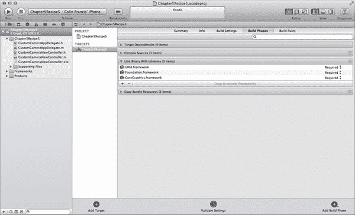

**图 6–11.** *准备向项目中添加框架*

在 "Link Binary With Libraries" 选项下，使用 `+` 按钮添加其他几个框架。搜索并添加以下框架：

- AV Foundation
- Core Graphics
- Core Video
- Core Media

实际上，除了 AV Foundation 框架外，你无需为其他框架编写任何 import 语句。继续，将以下 import 行添加到主视图控制器的头文件中。

```
#import <AVFoundation/AVFoundation.h>
#import <AVFoundation/AVCaptureInput.h>
```

接下来，切换到视图控制器的 `.xib` 文件进行一些快速设置。在这里，你只需要将一个 `UIButton` 拖到视图中，然后将其连接到头文件，并命名为 `startButton`。你需要为该按钮创建一个动作，因此声明以下方法头，并将 `startButton` 连接到它。

```
-(IBAction)startPressed:(id)sender;
```

完成这些更改后，用户界面和代码在 Assistant Editor 中应类似于 Figure 6–12。

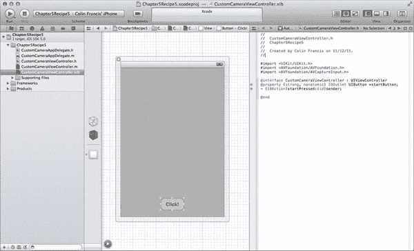

**图 6–12.** *已配置 Outlet 和 Action 的用户界面*

接下来，从 XIB/头文件组合切换到视图控制器的头和实现文件，为视图控制器定义一种新的属性，如下所示。

```
@property (strong, nonatomic) AVCaptureSession *captureSession;
```

务必记得在实现文件中 `@synthesize captureSession;`，并在 `-viewDidUnload` 中设置 `self.captureSession = nil`。

接下来，你将编写 `-viewDidLoad` 方法，用于准备视图、创建 `AVCaptureSession` 并按需设置。在调用 `[super viewDidLoad];` 之后，向方法中添加以下几组代码。

首先，必须创建 `AVCaptureSession` 并为其指定一个分辨率预设，如下所示：

```
self.captureSession = [[AVCaptureSession alloc] init];
self.captureSession.sessionPreset = AVCaptureSessionPresetMedium;
```

接着，创建 `AVCaptureDevice` 的实例，用于指定输入设备。在此例中，输入设备将是设备的后置摄像头（假设可访问）。通过使用 `AVCaptureDevice` 类方法 `+defaultDeviceWithMediaType:` 来指定，该方法可根据所需媒体类型接收多种不同参数，其中最常用的是 `AVMediaTypeVideo` 和 `AVMediaTypeAudio`。

```
AVCaptureDevice *device = [AVCaptureDevice defaultDeviceWithMediaType:AVMediaTypeVideo];
```

然后，创建 `AVCaptureDeviceInput` 的实例，以将所选设备指定为采集会话的输入。你还需要进行检查，确保输入已正确创建，然后再将其添加到会话中。

```
NSError *error = nil;
AVCaptureDeviceInput *input = [AVCaptureDeviceInput deviceInputWithDevice:device
                                                                    error:&error];
if (!input) {
    NSLog(@"Input Error");
} else {
    [self.captureSession addInput:input];
}
```

接下来，为采集会话设置一个输出，如下所示：

```
AVCaptureVideoDataOutput *output = [[AVCaptureVideoDataOutput alloc] init];
[self.captureSession addOutput:output];
output.videoSettings =
    [NSDictionary dictionaryWithObject:[NSNumber numberWithInt:kCVPixelFormatType_32BGRA]
                                forKey:(id)kCVPixelBufferPixelFormatTypeKey];

dispatch_queue_t queue = dispatch_queue_create("MyQueue", NULL);
[output setSampleBufferDelegate:self queue:queue];
dispatch_release(queue);
```

在这里，你创建了一个 `AVCaptureVideoDataOutput`。当开发者的目标是逐帧处理原始视频输入，而非简单地将视频整体保存时，常会使用此类型。其他类型的 `AVCaptureOutput` 包括：

- `AVCaptureMovieFileOutput`：用于保存整个视频文件
- `AVCaptureAudioDataOutput`：用于处理音频数据
- `AVCaptureStillImageOutput`：用于从会话中提取特定的静态图像（此输出类型也可用于实现当前目标）

你还分发了一个额外的队列来处理稍后将会看到的帧数据。

`-viewDidLoad` 的最后一部分是创建 `AVCaptureVideoPreviewLayer`，通过它你可以在应用中实时看到相机拍摄的内容。将预览层设置为主视图的图层，但高度稍作调整，以免遮挡按钮。

```
AVCaptureVideoPreviewLayer *previewLayer = [AVCaptureVideoPreviewLayer
    layerWithSession:self.captureSession];
UIView *aView = self.view;
previewLayer.frame = CGRectMake(0, 0, self.view.frame.size.width,
                                self.view.frame.size.height-70);
[aView.layer addSublayer:previewLayer];
```


#### 关于 `AVCaptureVideoPreviewLayer` 的说明

`AVCaptureVideoPreviewLayer` 概念中最关键的部分并非其视觉输出，而是其可被操作的强大能力。与任何其他 `CALayer` 一样，它可以被重新定位、旋转和调整大小。此时，你不再像使用 `UIImagePicker` 那样受限于使用整个屏幕来录制视频，这意味着你可以将预览层放在屏幕的一个区域，而将其他信息显示在另一个区域。与 iOS 开发的几乎所有部分一样，其用途的可能性仅受开发者想象力的限制。

由于你将当前视图控制器设置为 `AVCaptureVideoDataOutput` 的代理，因此你需要实现 `AVCaptureVideoDataOutputSampleBufferDelegate` 协议。你的头文件现在应如下所示：

```
#import <UIKit/UIKit.h>
#import <AVFoundation/AVFoundation.h>
#import <AVFoundation/AVCaptureInput.h>

@interface CustomCameraViewController : UIViewController
<AVCaptureVideoDataOutputSampleBufferDelegate>{
    UIImageView *imageViewDisplay;
    UIButton *startButton;
    BOOL capture;
}

@property (strong, nonatomic) IBOutlet UIButton *startButton;
@property (strong, nonatomic) AVCaptureSession *captureSession;
-(IBAction)startPressed:(id)sender;
@end
```

请确保注意还新增了 `BOOL` 类型的实例变量 `capture`。你将使用它来跟踪会话的帧是否会被处理。

接下来，你将实现 `AVCaptureVideoDataOutputSampleBuffer` 的代理方法，如下所示：

```
- (void)captureOutput:(AVCaptureOutput *)captureOutput
didOutputSampleBuffer:(CMSampleBufferRef)sampleBuffer
       fromConnection:(AVCaptureConnection *)connection {

    if (capture)
    {
        UIImage *chosenImage = [self imageFromSampleBuffer:sampleBuffer];
        UIImageWriteToSavedPhotosAlbum (chosenImage, nil, nil , nil);
        capture = NO;
    }
}
```

如你所见，你只需检查 `capture` 这个 `BOOL` 值是否为"YES"，如果是，则获取给定视频帧的图像，然后将其保存到设备的相册中。通过立即将 `capture` 设置为"NO"，你限制了应用每次按下按钮仅捕获一帧。很容易看出如何扩展此功能以包含任意数量的帧。

你还必须像下面这样定义刚刚使用过的 `-imageFromSampleBuffer:` 方法，并确保它定义在你的代理方法之上。

```
- (UIImage *) imageFromSampleBuffer:(CMSampleBufferRef) sampleBuffer
{
    // 获取 CMSampleBuffer 的核心视频图像缓冲区，用于媒体数据
    CVImageBufferRef imageBuffer = CMSampleBufferGetImageBuffer(sampleBuffer);
    // 锁定像素缓冲区的基地址
    CVPixelBufferLockBaseAddress(imageBuffer, 0);

    // 获取像素缓冲区的每行字节数
    void *baseAddress = CVPixelBufferGetBaseAddress(imageBuffer);

    // 获取像素缓冲区的每行字节数
    size_t bytesPerRow = CVPixelBufferGetBytesPerRow(imageBuffer);
    // 获取像素缓冲区的宽度和高度
    size_t width = CVPixelBufferGetWidth(imageBuffer);
    size_t height = CVPixelBufferGetHeight(imageBuffer);

    // 创建设备相关的 RGB 色彩空间
    CGColorSpaceRef colorSpace = CGColorSpaceCreateDeviceRGB();

    // 使用样本缓冲区数据创建位图图形上下文
    CGContextRef context = CGBitmapContextCreate(baseAddress, width, height, 8,
                                                 bytesPerRow, colorSpace,
kCGBitmapByteOrder32Little | kCGImageAlphaPremultipliedFirst);
    // 从位图图形上下文中的像素数据创建 Quartz 图像
    CGImageRef quartzImage = CGBitmapContextCreateImage(context);
    // 解锁像素缓冲区
    CVPixelBufferUnlockBaseAddress(imageBuffer,0);

    // 释放上下文和色彩空间
    CGContextRelease(context);
    CGColorSpaceRelease(colorSpace);

    // 从 Quartz 图像创建图像对象
    UIImage *image = [UIImage imageWithCGImage:quartzImage];

    // 释放 Quartz 图像
    CGImageRelease(quartzImage);

    return (image);
}
```

现在，你将实现一个相当简单的捕获切换方法，以处理你的按钮按下事件。

```
-(void)startPressed:(id)sender
{
    if (!capture)
    {
        capture = YES;
    }
    else
    {
        capture = NO;
    }
}
```

要记住的最重要的步骤之一是实际“启动”和“停止”你的 `AVCaptureSession`。由于你希望摄像头显示在应用打开的任何时候都可见，你将在 `-viewWillAppear` 方法中启动会话，并在 `-viewWillDisappear` 方法中停止会话，这两个方法现在看起来像这样：

```
- (void)viewWillAppear:(BOOL)animated
{
    [super viewWillAppear:animated];
    [self.captureSession startRunning];
}
- (void)viewWillDisappear:(BOOL)animated
{
    [super viewWillDisappear:animated];
    [self.captureSession stopRunning];
}
```

如果现在在你的设备上运行此应用，你可能会注意到所有拍摄的已保存图像看起来像是在横屏模式下拍摄的，然后旋转以适应竖屏，显然不再填满整个屏幕。你可以通过更改会话输出连接的视频方向来解决此问题，将你的 `-viewWillAppear:` 方法修改如下：

```
- (void)viewWillAppear:(BOOL)animated
{
    [super viewWillAppear:animated];
    [self.captureSession startRunning];

    NSArray *array = [[self.captureSession.outputs objectAtIndex:0] connections];
    for (AVCaptureConnection *connection in array)
    {
        connection.videoOrientation = AVCaptureVideoOrientationPortrait;
    }
}
```

如果现在在你的设备上运行该应用，你将能够看到摄像头正在录制的内容的预览，并且每当你按下按钮时，当前帧将保存到你的照片库中，如图 6–13 所示。虽然你还没有添加任何花哨的动画使其看起来像相机，但就基本相机而言，这已经非常有用，特别是考虑到你现在能够完全自定义其行为——无论是逐帧处理还是作为整个视频（如果你添加第二个输出）。


**图 6–13.** *你的应用显示摄像头视图的预览*


### 食谱 6–6：通过编程录制视频

现在你已经了解了使用 `AVFoundation` 的一些基础知识，接下来将实现一个稍微复杂的项目。这次，你的应用程序将录制完整的视频，而不仅仅是捕获特定的帧。你还需要添加一个音频输入设备，以便视频中包含声音。

首先，你必须创建一个新项目，这次命名为“Chapter6Recipe6”，类前缀为“CustomVideo”。

像往常一样，首先要做的是通过项目 `Build Phases` 选项卡中的 `Link Binary With Libraries` 部分获取以下必要的框架。

*   *AV Foundation*：你将使用它来处理摄像头和麦克风。
*   *Assets Library*：用于将录制好的视频保存到你的设备上。

在 Interface Builder 中，向视图控制器的视图底部中央添加一个 `UIButton`，就像上一个食谱一样，将其默认标签设置为“Record”。当你将其连接到头文件时，请为这个 `UIButton` 命名为 `button`。确保还要为此按钮创建一个名为 `-recordPressed:` 的操作（有关如何执行此操作，请参阅之前的食谱）。

与上一个食谱类似，你将构建 `AVCaptureSession` 来管理摄像头的输入和视频的输出，因此你需要先在视图控制器的头文件中添加一些变量、属性和协议。

*   首先，你需要一个 `BOOL` 类型的实例变量 `recording`，它用于跟踪视频是否正在录制。
*   其次，你需要创建两个属性，用于存储指向 `AVCaptureSession` 会话和 `AVCaptureMovieFileOutput` 输出的指针，后者将是你的 `AVCaptureOutput` 设备。
*   第三，你需要在头文件中包含 `AV Foundation` 框架的导入语句。
*   最后，你需要告诉编译器你的视图控制器遵循 `AVCaptureFileOutputRecordingDelegate` 协议。

完成所有这些更改后，你的视图控制器的头文件将如下所示：

```
#import <UIKit/UIKit.h>
#import <AVFoundation/AVFoundation.h>
#import <AssetsLibrary/AssetsLibrary.h>

@interface CustomVideoViewController : UIViewController
<AVCaptureFileOutputRecordingDelegate>{
    UIButton *button;
    BOOL recording;
}

@property (strong, nonatomic) IBOutlet UIButton *button;

@property (strong, nonatomic) AVCaptureSession *session;
@property (strong, nonatomic) AVCaptureMovieFileOutput *output;

-(IBAction)recordPressed:(id)sender;
@end
```

现在，头文件已经全部设置好，接下来切换到实现文件。

首先，由于你设置了自己的两个属性 `session` 和 `output`，你绝对必须记住在实现文件的顶部对它们进行 `@synthesize`。你还应该记住在 `-viewDidUnload` 方法中将它们都设置为 `nil`。

接下来，与上一个食谱一样，你将开始构建 `-viewDidLoad` 方法。

首先，你必须像这样分配你的 `AVCaptureSession`：

```
self.session = [[AVCaptureSession alloc] init];
self.session.sessionPreset = AVCaptureSessionPresetMedium;
```

接下来，你将创建两个 `AVCaptureDevice` 实例，一个用于后置摄像头，一个用于麦克风，然后为它们中的每一个创建 `AVCaptureDeviceInput`，并将它们添加到你的会话中。

```
AVCaptureDevice *device = [AVCaptureDevice defaultDeviceWithMediaType:AVMediaTypeVideo];

NSError *error = nil;
AVCaptureDeviceInput *input = [AVCaptureDeviceInput deviceInputWithDevice:device
error:&error];

NSArray *devices = [AVCaptureDevice devicesWithMediaType:AVMediaTypeAudio];
AVCaptureDeviceInput *mic = [[AVCaptureDeviceInput alloc] initWithDevice:[devices
objectAtIndex:0] error:nil];
if (!input || !mic)
    {
        NSLog(@"Input Error");
    }
    else
    {
        [self.session addInput:input];
        [self.session addInput:mic];
    }
```

现在，你创建 `AVCaptureOutput` 并将其添加到会话中。你将确保输出的任何连接都正确设置了视频方向。

```
self.output = [[AVCaptureMovieFileOutput alloc] init];

    NSArray *connections = self.output.connections;
    for (AVCaptureConnection *connection in connections)
    {
        if ([connection isVideoOrientationSupported])
             connection.videoOrientation = AVCaptureVideoOrientationPortrait;
    }
    if ([self.session canAddOutput:self.output])
        [self.session addOutput:self.output];
```

你需要能够看到摄像头的视图，因此你将设置一个 `AVCaptureVideoPreviewLayer` 实例。

```
AVCaptureVideoPreviewLayer *previewLayer = [AVCaptureVideoPreviewLayer
layerWithSession:self.session];
UIView *aView = self.view;
previewLayer.frame = CGRectMake(0, 0, self.view.frame.size.width,
self.view.frame.size.height-70);
[aView.layer addSublayer:previewLayer];
```

最后，你只需启动 `AVCaptureSession`。你还需要将 `recording` 实例设置为 `NO`，以确保它具有正确的起始值。

```
[self.session startRunning];
    recording = NO;
```

完整的 `-viewDidLoad` 方法现在看起来是这样的：

```
- (void)viewDidLoad
{
    [super viewDidLoad];

    self.session = [[AVCaptureSession alloc] init];
    self.session.sessionPreset = AVCaptureSessionPresetMedium;
    AVCaptureDevice *device = [AVCaptureDevice
defaultDeviceWithMediaType:AVMediaTypeVideo];

    NSError *error = nil;
    AVCaptureDeviceInput *input = [AVCaptureDeviceInput deviceInputWithDevice:device
error:&error];

    NSArray *devices = [AVCaptureDevice devicesWithMediaType:AVMediaTypeAudio];

    AVCaptureDeviceInput *mic = [[AVCaptureDeviceInput alloc] initWithDevice:[devices
objectAtIndex:0] error:nil];

    if (!input || !mic)
    {
        NSLog(@"Input Error");
    }
    else
    {
        [self.session addInput:input];
        [self.session addInput:mic];
    }

    self.output = [[AVCaptureMovieFileOutput alloc] init];

    NSArray *connections = self.output.connections;
    for (AVCaptureConnection *connection in connections)
    {
        if ([connection isVideoOrientationSupported])
             connection.videoOrientation = AVCaptureVideoOrientationPortrait;
    }
    if ([self.session canAddOutput:self.output])
        [self.session addOutput:self.output];

    AVCaptureVideoPreviewLayer *previewLayer = [AVCaptureVideoPreviewLayer
layerWithSession:self.session];
    UIView *aView = self.view;
    previewLayer.frame = CGRectMake(0, 0, self.view.frame.size.width,
self.view.frame.size.height-70);
    [aView.layer addSublayer:previewLayer];

    [self.session startRunning];
    recording = NO;
}
```

**提示：** 使用这种方法为视频添加声音并不复杂！所需要做的只是将音频输入设备添加到你的会话中，其余的 `AVCaptureSession` 会替你完成。

你当然需要定义你的应用程序如何处理用户按下 `UIButton` 的情况。这将是一个相当简单的切换函数，用于启动和停止你的 `AVCaptureOutput`。

```
-(IBAction)recordPressed:(id)sender
{
    if (!recording)
    {
        [self.button setTitle:@"Stop" forState:UIControlStateNormal];
        recording = YES;
        NSURL *fileURL = [self
tempFileURL];
        [self.output startRecordingToOutputFileURL:fileURL recordingDelegate:self];
    }
    else
    {
        [self.button setTitle:@"Record" forState:UIControlStateNormal];
        [self.output stopRecording];
        recording = NO;
    }
}
```


你很可能已经注意到，你在早期调用了`-tempFileURL`方法来设置`AVCaptureOutput`。简单来说，这个方法会返回一个路径，用于在你的设备上临时保存录制的视频。如果该位置已经存在一个文件，它将会删除该文件。（这样，你永远不会使用超过一个视频所需的磁盘空间。）

```
- (NSURL *) tempFileURL
{
    NSString *outputPath = [[NSString alloc] initWithFormat:@"%@%@",
NSTemporaryDirectory(), @"output.mov"];
    NSURL *outputURL = [[NSURL alloc] initFileURLWithPath:outputPath];
    NSFileManager *manager = [[NSFileManager alloc] init];
    if ([manager fileExistsAtPath:outputPath])
    {
        [manager removeItemAtPath:outputPath error:nil];
    }
    return outputURL;
}
```

设置视频的最后一步是设置`AVCaptureMovieFileOutput`的代理。它会检查将视频录制到文件时是否有任何错误，然后将你的视频文件保存到资产管理库中。

```
- (void)captureOutput:(AVCaptureFileOutput *)captureOutput
didFinishRecordingToOutputFileAtURL:(NSURL *)outputFileURL
      fromConnections:(NSArray *)connections
                error:(NSError *)error {

    BOOL recordedSuccessfully = YES;
    if ([error code] != noErr) {
        // A problem occurred: Find out if the recording was successful.
        id value = [[error userInfo] objectForKey:AVErrorRecordingSuccessfullyFinishedKey];
        if (value) {
            recordedSuccessfully = [value boolValue];
        }
    }
    ALAssetsLibrary *library = [[ALAssetsLibrary alloc] init];

    [library writeVideoAtPathToSavedPhotosAlbum:outputFileURL
            completionBlock:^(NSURL *assetURL, NSError *error)
    {
        if (error)
           {
               NSLog(@"Error writing") ;

           }
    }];
}
```

最后，为了提升应用设计的功能性，你将让`-viewWillAppear:`和`-viewWillDisappear:`参与会话的开始和停止，这样就不会出现会话在后台运行或在你可见时未运行的情况。

```
- (void)viewWillAppear:(BOOL)animated
{
    [super viewWillAppear:animated];
    if (![self.session isRunning])
    {
        [self.session startRunning];
    }
}
- (void)viewWillDisappear:(BOOL)animated
{
        [super viewWillDisappear:animated];
    if ([self.session isRunning])
    {
        [self.session stopRunning];
    }
}
```

这个应用看起来与之前示例中的应用几乎一样，主要区别在于保存的媒体类型。在之前的示例中，你是将单个帧作为图像保存到图库，而此处你将保存带有声音的录制视频。

### Recipe 6–7: Capturing Video Frames

对于大量使用视频的应用，缩略图通常被用来“代表”给定的视频。在之前示例的基础上，你将添加一项功能，即基于视频中的特定时间点创建缩略图。你将实现两种不同的方法来完成此操作，一种基于`AVCaptureSession`，另一种基于你保存的视频。

首先，你将使用一种不同类型的`AVCaptureOutput`（称为`AVCaptureStillImageOutput`）从`AVCaptureSession`中捕获静态图像。

**提示：** 这种图像捕获方法还有一个额外功能，即在拍摄图像时自动播放快门声。

首先，你需要在视图控制器的 XIB 文件中添加几个`UIImageView`，用于显示你捕获的静态图像。像往常一样，将它们连接到头文件，并命名为`imageViewThumb`和`imageViewThumb2`。如果需要，你可以将其背景色设置为默认颜色以外的其他颜色，以便在图像放入之前与视图区分。Figure 6–14 显示了最终的 XIB 文件。

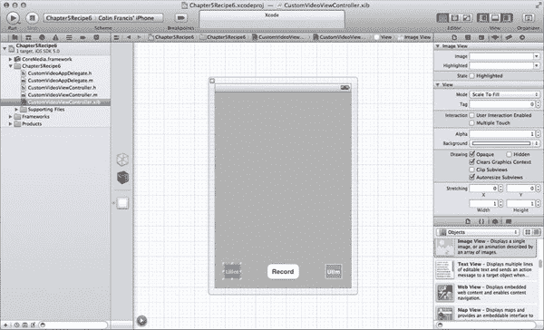

**Figure 6–14.** *为缩略图设置用户界面*

接下来，你需要一个属性来跟踪你的`AVCaptureStillImageOutput`，你将在视图控制器中将其声明并综合为`stillImageOutput`，并确保在`-viewDidUnload`中将其设置为`nil`。

第三步，在`-viewDidLoad`方法中将此输出添加到`AVCaptureSession`中，现在该方法如下所示：

```
- (void)viewDidLoad
{
    [super viewDidLoad];

    self.imageViewThumb.backgroundColor = [UIColor whiteColor];

    self.session = [[AVCaptureSession alloc] init];
    self.session.sessionPreset = AVCaptureSessionPresetMedium;

    AVCaptureDevice *device = [AVCaptureDevice defaultDeviceWithMediaType:AVMediaTypeVideo];

    NSError *error = nil;
    AVCaptureDeviceInput *input = [AVCaptureDeviceInput deviceInputWithDevice:device
error:&error];

    NSArray *devices = [AVCaptureDevice devicesWithMediaType:AVMediaTypeAudio];
    AVCaptureDeviceInput *mic = [[AVCaptureDeviceInput alloc] initWithDevice:[devices
objectAtIndex:0] error:nil];

    if (!input || !mic)
    {
        NSLog(@"Input Error");
    }
    else
    {
        [self.session addInput:input];
        [self.session addInput:mic];
    }

    self.output = [[AVCaptureMovieFileOutput alloc] init];

    NSArray *connections = self.output.connections;
    for (AVCaptureConnection *connection in connections)
    {
        if ([connection isVideoOrientationSupported])
            connection.videoOrientation = AVCaptureVideoOrientationPortrait;
    }
    if ([self.session canAddOutput:self.output])
        [self.session addOutput:self.output];

    /////////NEW STILL IMAGE OUTPUT CODE
    self.stillImageOutput = [[AVCaptureStillImageOutput alloc] init];
    NSDictionary *outputSettings = [[NSDictionary alloc] initWithObjectsAndKeys:
                                    AVVideoCodecJPEG, AVVideoCodecKey, nil];
    [self.stillImageOutput setOutputSettings:outputSettings];

    if ([self.session canAddOutput:stillImageOutput])
    {
        [self.session addOutput:stillImageOutput];
    }
    else
    {
        NSLog(@"Unable to add still image output");
    }
    /////////END OF NEW STILL IMAGE OUTPUT CODE
    AVCaptureVideoPreviewLayer *previewLayer = [AVCaptureVideoPreviewLayer
layerWithSession:self.session];
    UIView *aView = self.view;
    previewLayer.frame = CGRectMake(0, 0, self.view.frame.size.width,
self.view.frame.size.height-70);
    [aView.layer addSublayer:previewLayer];

    [self.session startRunning];
    recording = NO;
        // Do any additional setup after loading the view, typically from a nib.
}
```


接下来，你将定义实际捕获图像并将其保存到设备的方法。

```
- (void) captureStillImage
{
    AVCaptureConnection *stillImageConnection = [self.stillImageOutput.connections
objectAtIndex:0];
    if ([stillImageConnection isVideoOrientationSupported])
        [stillImageConnection setVideoOrientation:AVCaptureVideoOrientationPortrait];

    [[self
stillImageOutput]
captureStillImageAsynchronouslyFromConnection:stillImageConnection

completionHandler:^(CMSampleBufferRef imageDataSampleBuffer, NSError *error)
     {
         ALAssetsLibraryWriteImageCompletionBlock completionBlock = ^(NSURL *assetURL,
NSError *error)
         {};

        if (imageDataSampleBuffer != NULL)
        {
            NSData *imageData = [AVCaptureStillImageOutput jpegStillImageNSDataRepresentation:imageDataSampleBuffer];
            ALAssetsLibrary *library = [[ALAssetsLibrary alloc] init];

            UIImage *image = [[UIImage alloc] initWithData:imageData];
            self.imageViewThumb.image = image;
            [library writeImageToSavedPhotosAlbum:[image CGImage]
                 orientation:(ALAssetOrientation)[image imageOrientation]
                 completionBlock:completionBlock];
        }
        else
            completionBlock(nil, error);

        }];
}
```

最后，你只需告诉应用程序何时执行`-captureStillImage`，方法是在`recordPressed:`方法中调用它。我选择让它在录制开始时拍照，当然也可以放在结束时。你的方法现在如下所示：

```
-(IBAction)recordPressed:(id)sender
{
    if (!recording)
    {
        [self.button setTitle:@"Stop" forState:UIControlStateNormal];
        recording = YES;
        NSURL *fileURL = [self tempFileURL];
        [self.output startRecordingToOutputFileURL:fileURL recordingDelegate:self];

        //////CAPTURE IMAGE
        [self captureStillImage];
    }
    else
    {
        [self.button setTitle:@"Record" forState:UIControlStateNormal];
        [self.output stopRecording];
        recording = NO;
    }
}
```

此时，如果在设备上运行，你的应用将成功录制视频，并在录制开始时（或结束时，取决于你的选择）拍摄一张静态图像。虽然这非常有用，但它还没有达到你可能期望的完全自定义程度。接下来，你将实现`AVAssetImageGenerator`类的一个用法，该类不仅可以从单个视频生成多个图像，还可以在视频中指定的不同时间点创建它们。

首先，你需要将二进制文件与`Core Media`框架链接起来。像链接其他所有框架一样进行操作。你不需要为此框架添加任何导入语句。它只会作为编译器的引用。

接下来，你需要在类中添加一个`AVAssetImageGenerator`类型的属性，确保合成属性，并在之后正确将其设置为`nil`。将此属性命名为`imageGenerator`。

你已经定义了委托方法来处理视频成功保存到 URL 的情况，因此你需要在`-captureOutput:didFinishRecordingToOutputFileAtURL:fromConnections:error:`方法中添加代码，以便访问 URL 并从中生成图像。你的方法现在应如下所示，并通过注释标识新添加的行：

```
- (void)captureOutput:(AVCaptureFileOutput *)captureOutput
didFinishRecordingToOutputFileAtURL:(NSURL *)outputFileURL
      fromConnections:(NSArray *)connections
                error:(NSError *)error {

    BOOL recordedSuccessfully = YES;
    if ([error code] != noErr) {
        // A problem occurred: Find out if the recording was successful.
        id value = [[error userInfo]
objectForKey:AVErrorRecordingSuccessfullyFinishedKey];
        if (value) {
            recordedSuccessfully = [value boolValue];
        }
    }
    ALAssetsLibrary *library = [[ALAssetsLibrary alloc] init];
    [library writeVideoAtPathToSavedPhotosAlbum:outputFileURL
                                completionBlock:^(NSURL *assetURL, NSError *error)
     {
         if (error)
         {
             NSLog(@"Error writing") ;
         }

     }];

    ////////////START OF NEW STILL IMAGE CODE
    AVURLAsset *myAsset = [[AVURLAsset alloc] initWithURL:outputFileURL
options:[NSDictionary dictionaryWithObject:@"YES"
forKey:AVURLAssetPreferPreciseDurationAndTimingKey]];

    self.imageGenerator = [AVAssetImageGenerator assetImageGeneratorWithAsset:myAsset];
    self.imageGenerator.appliesPreferredTrackTransform = YES; //Makes sure images are correctly rotated.

    Float64 durationSeconds = CMTimeGetSeconds([myAsset duration]);
    CMTime half = CMTimeMakeWithSeconds(durationSeconds/2.0, 600);
    NSArray *times = [NSArray arrayWithObjects: [NSValue valueWithCMTime:half], nil];
    [self.imageGenerator generateCGImagesAsynchronouslyForTimes:times
                    completionHandler:^(CMTime requestedTime, CGImageRef image, CMTime
actualTime,AVAssetImageGeneratorResult result, NSError *error)
    {
        NSString *requestedTimeString = (__bridge NSString *)CMTimeCopyDescription(NULL,
requestedTime);
        NSString *actualTimeString = (__bridge NSString *)CMTimeCopyDescription(NULL,
actualTime);
        NSLog(@"Requested: %@; actual %@", requestedTimeString, actualTimeString);

        if (result == AVAssetImageGeneratorSucceeded)
            {
                self.imageViewThumb2.image = [UIImage imageWithCGImage:image];
            }

        if (result == AVAssetImageGeneratorFailed)
            {
                NSLog(@"Failed with error: %@", [error localizedDescription]);
            }
        if (result == AVAssetImageGeneratorCancelled)
            {
                NSLog(@"Canceled");
            }
    }];
    ///////END OF STILL IMAGE CODE
}
```

现在，你的应用可以通过两种不同的方式正确从视频中捕获静态图像，并且你应该能够在设备上清楚地看到每种方法的效果，如图 6–15 所示。


**图 6–15.** *具有两个不同缩略图的录制应用程序*

**注意：** 你可能注意到，使用第二种方法创建图像所需的时间明显长于第一种。这可能是一种更适合在用户无法看到正在创建的图像时使用的方法，直到图像成功创建。

### 总结

作为开发者，在处理设备摄像头时你有大量选择。预定义的接口（如`UIImagePickerController`和`UIVideoEditorController`）非常有用且设计精良，但苹果对`AV Foundation`框架的实现提供了无限多的可能性。从处理视频、音频到静态图像，一切皆有可能。即使快速浏览完整文档，也会发现这里未涉及的无数其他功能，包括从设备能力（如视频摄像头的 LED 手电筒）到实现自定义的“触摸对焦”功能。我们生活在一个图像、音频和视频在几秒钟内环游世界的时代，作为开发者，我们必须能够设计和创造适合我们基于媒体的社区的创新解决方案。

## 第 7 章


# 多媒体食谱

阿尔道斯·赫胥黎曾言：“除却静默，最能表达难以言传之意的便是音乐。”我们生活在一个被声音和音乐包围的世界里。从广告中最微妙的背景曲调，到摇滚音乐会上电吉他的巨大轰鸣，声音以其千变万化的形式在我们的世界中扮演着不可或缺的角色。在开发过程中忽视这一事实，无论对用户体验还是开发者社区都将是莫大的损失。音乐和音频对我们的生活有着巨大影响，作为开发者，我们有责任将这种力量融入我们的应用，从而为用户带来最完整、最理想的体验——即便他们自己都未曾察觉。

本章的多个食谱将涉及访问应用运行设备上的 iPod 资料库。为了充分测试这些内容，请确保你的设备音乐资料库中至少存有几首歌曲。

## 食谱 7–1：播放音频

如果你随机问一个人，听到“iPhone”和“音频”这两个词时会想到什么，他们很可能联想到自己的 iPod 和下载的数千首歌曲。然而，尽管背景音频和音效极其重要，却往往被大多数用户所忽视。这些音效片段和曲调在日常使用中可能完全不被用户注意，但就应用的功能和设计而言，它们能极大地提升应用品质。可能是拍照时那声细微的“快门咔嗒声”，也可能是游戏里玩得太久而萦绕脑海的背景音乐——无论用户是否察觉，它们都能带来天壤之别。iOS 的“AV Foundation”框架提供了一种极其简单的方式来访问、播放和操作声音文件，即 `AVAudioPlayer`。接下来，你将创建一个示例项目，既能播放音频文件，也允许用户操控音轨的播放。

首先，创建一个新项目，命名为“Chapter7Recipe1”。此处，我使用了类前缀“Player”。与之前大部分食谱一样，你可以使用“单视图应用”模板来创建项目。确保“使用故事板”复选框未选中，而“使用自动引用计数”复选框已选中，这样你的配置就如图 7–1 所示。

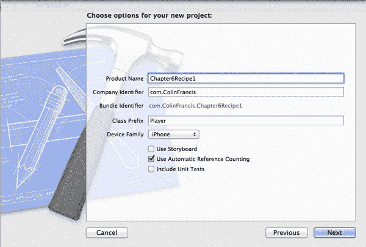

**图 7–1.** *配置项目设置*

你需要做的第一件事是将项目与将要用于播放声音的几个框架进行链接。在导航窗格中选择你的项目，然后导航至 **Targets**  **SoundCheck**。选择“构建阶段”标签页，展开“Link Binary With Libraries”部分，如图 7–2 所示。

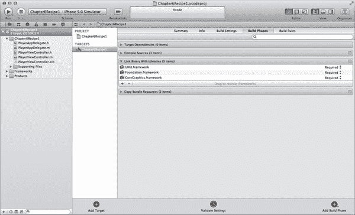

**图 7–2.** *添加框架前的项目*

接下来，点击 + 按钮，添加以下两个框架：

1.  *AV Foundation*：包含 `AVAudioPlayer` 类，你将用它来播放音频。
2.  *Audio Toolbox*：你将使用此框架实现一个按钮，用于在设备上播放“震动”音效。

接着，切换到视图控制器的头文件。你需要通过添加以下导入语句来导入框架的头文件：

```
#import <AVFoundation/AVFoundation.h>
#import <AudioToolbox/AudioToolbox.h>
```

现在，你将在视图控制器的 XIB 文件中构建视图。你将创建的视图包含用于控制音频播放器 `pan`、`volume` 和 `rate` 属性的滑块，以及播放和暂停的按钮，还有一个用于播放设备“震动”系统声音的按钮。你还将通过视图顶部的标签来监控音频播放器的声道电平。请将你的视图设置成如图 7–3 所示。

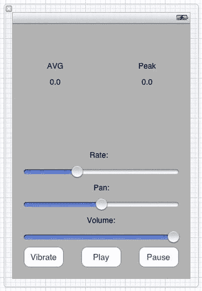

**图 7–3.** *设置了默认值的视图控制器 XIB 文件*

你需要确保滑块的值与其控制的属性可能的值相匹配。使用属性检查器，将“rate”滑块的最小值和最大值分别调整为 0.5 和 2.0（对应半速和 2 倍速），并将“pan”滑块的最小值和最大值分别调整为 -1 和 1（对应左声道和右声道）。“volume”滑块的默认值应该没问题，因为音量属性的范围是 0 到 1。


如同你在之前的代码中做过的那样，你需要按住 ^（Ctrl）键，将视图像素从元素拖拽到视图控制器的头文件中，从而将一些视图对象连接到头文件。根据情况将 `UISlider` 命名为 `sliderRate`、`sliderPan` 和 `sliderVolume`。你的 `UIButton` 将命名为 `vibrateButton`、`playButton` 和 `pauseButton`。顶部的两个用于电平监测的 `UILabel`（目前我已为其设置了默认值 "0.0"）将命名为 `averageLabel` 和 `peakLabel`。你需要在头文件中定义三个方法（类型为 `IBAction`，而非 `void`），分别对应三个按钮，并通过按住 ⌃ 键从按钮拖拽到方法定义处，将它们与按钮连接起来。你还需要再定义三个方法，用于连接你的 `UISlider`。现在，你的头文件应如下所示：

```objc
#import <UIKit/UIKit.h>
#import <AVFoundation/AVFoundation.h>
#import <AudioToolbox/AudioToolbox.h>

@interface PlayerViewController : UIViewController
@property (strong, nonatomic) IBOutlet UIButton *vibrateButton;
@property (strong, nonatomic) IBOutlet UIButton *playButton;
@property (strong, nonatomic) IBOutlet UIButton *pauseButton;
@property (strong, nonatomic) IBOutlet UISlider *sliderVolume;
@property (strong, nonatomic) IBOutlet UISlider *sliderPan;
@property (strong, nonatomic) IBOutlet UISlider *sliderRate;
@property (strong, nonatomic) IBOutlet UILabel *averageLabel;
@property (strong, nonatomic) IBOutlet UILabel *peakLabel;
-(IBAction)vibratePressed:(id)sender;
-(IBAction)playPressed:(id)sender;
-(IBAction)pausePressed:(id)sender;

-(IBAction)volumeSliderChanged:(UISlider *)sender;
-(IBAction)panSliderChanged:(UISlider *)sender;
-(IBAction)rateSliderChanged:(UISlider *)sender;

@end
```

你还需要在头文件中添加一个属性来跟踪你的 `AVAudioPlayer`，具体写法如下：

```objc
@property (nonatomic, strong) AVAudioPlayer *player;
```

在实现文件中合成这个新属性，并将以下代码行添加到你的 `-viewDidUnload` 方法中，以确保你的应用程序在内存使用上尽可能高效。

```objc
self.player.delegate = nil;
[self setPlayer:nil];
```

头文件中的最后一步是让你的视图控制器遵循 `AVAudioPlayerDelegate` 协议。

```objc
@interface PlayerViewController : UIViewController <AVAudioPlayerDelegate>
```

在继续之前，你需要选择并导入你的应用程序将要播放的声音文件。我使用的文件名为 `systemCheck.mp3`，以下代码将反映这个文件名。你需要根据自己选择的文件更改文件名或文件类型。你应该查阅 Apple 的文档，了解哪些文件类型是合适的，但可以相当安全地假设，大多数常用文件类型（如 `.wav` 或 `.mp3`）都能正常工作。

为了捕获播放文件时可能出现的任何错误，你可以实现 `AVAudioPlayerDelegate` 协议中的一个方法：

```objc
-(void)audioPlayerDecodeErrorDidOccur:(AVAudioPlayer *)player error:(NSError *)error
{
    NSLog(@"播放文件时出错：%@", [error localizedDescription]);
}
```

在访达中找到你的音频片段，然后点击并将其拖拽到 Xcode 的项目中。我个人倾向于将此类文件放在 Supporting Files 组中，但这完全是可选的。随后会弹出一个对话框，提示你选择添加文件的选项。你可能唯一需要修改的是，确保“将项目复制到目标组的文件夹中（如果需要）”旁边的复选框已勾选，如图 7-4 所示。

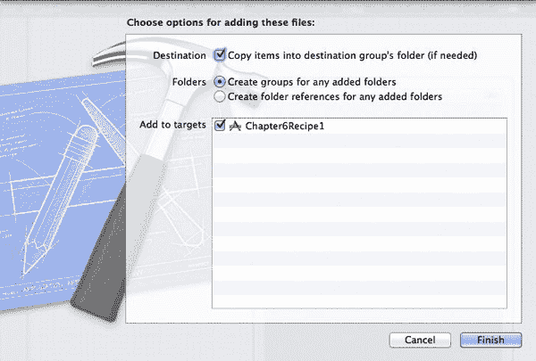

**图 7-4.** *导入文件的弹出对话框——确保第一个复选框已勾选。*

现在你有了声音文件，就可以实现 `-viewDidLoad` 方法来设置你的 `AVAudioPlayer` 了。

```objc
- (void)viewDidLoad
{
    [super viewDidLoad];
    NSString *fileName = @"systemCheck";
    NSString *fileType = @"mp3";
    NSString *soundFilePath = [[NSBundle mainBundle] pathForResource:fileName ofType:fileType];
    NSURL *soundFileURL = [NSURL fileURLWithPath:soundFilePath];

    NSError *error;
    self.player = [[AVAudioPlayer alloc] initWithContentsOfURL:soundFileURL error:&error];
    self.player.enableRate = YES; // 允许我们改变播放速率
    self.player.meteringEnabled = YES; // 允许我们监测电平
    self.player.delegate = self;
    self.sliderVolume.value = self.player.volume;
    self.sliderRate.value = self.player.rate;
    self.sliderPan.value = self.player.pan;

    [self.player prepareToPlay]; // 预加载音频以减少延迟

    NSTimer *timer = [NSTimer scheduledTimerWithTimeInterval:0.1 target:self
    selector:@selector(updateLabels) userInfo:nil repeats:YES];

    [timer fire];
}
```

如你所见，你已获取了声音文件的 URL，并用它创建了 `AVAudioPlayer`。你设置了 `enableRate` 属性以允许更改播放速率，并设置了 `meteringEnabled` 属性以允许监测播放器的电平。你调用了播放器上的可选方法 `-prepareToPlay` 来预加载声音文件，这有望让你的应用程序运行得更快一些。最后，你创建了一个定时器，它会以每秒十次的频率执行你的 `-updateLabels` 方法。这样，你就能让标签以近乎恒定的速率更新了。

现在，我们来为 `-updateLabels` 方法提供一个简单的实现。

```objc
-(void)updateLabels
{
    [self.player updateMeters];
    self.averageLabel.text = [NSString stringWithFormat:@"%f", [self.player
    averagePowerForChannel:0]];
    self.peakLabel.text = [NSString stringWithFormat:@"%f", [self.player
    peakPowerForChannel:0]];
}
```

任何时候使用 `-averagePowerForChannel` 或 `-peakPowerForChannel` 方法时，你都需要调用 `-updateMeters`，才能获取最新的信息，因为这些值不会自动刷新。这两个方法都接受一个 `NSUInteger` 类型的参数，用于指定要检索信息的声道。传入值 0 表示指定立体声轨道的左声道，或单声道轨道的唯一声道。鉴于你只是对该功能进行基本使用，声道 0 是一个很好的默认值。

接下来，你将实现你的 `UISlider` 的操作方法，这些方法会在滑块值每次改变时执行。

```objc
-(void)volumeSliderChanged:(UISlider *)sender
{
    self.player.volume = sender.value;
}
-(void)panSliderChanged:(UISlider *)sender
{
    self.player.pan = sender.value;
}
-(void)rateSliderChanged:(UISlider *)sender
{
    self.player.rate = sender.value;
}
```

现在，你将实现你的按钮操作方法，这些方法也同样简单。

```objc
-(void)vibratePressed:(id)sender
{
    AudioServicesPlaySystemSound(kSystemSoundID_Vibrate);
}
-(void)playPressed:(id)sender
{
    [self.player play];
}
-(void)pausePressed:(id)sender
{
    [self.player pause];
}
```

`AudioServicesPlaySystemSound()` 是 Audio Toolbox 中定义的一个函数，用于播放预定义的系统声音，例如刚刚演示的让手机振动的声音。你也可以使用某些文件类型注册自己的系统声音。

**注意：** 虽然当前使用的大部分 AV Foundation 功能可以在模拟器上通过电脑的麦克风和扬声器正常工作，但上述的振动声音则不行。你需要使用实体设备来测试此功能。

至此，你的应用程序应该能够成功播放和暂停音乐，并且你可以调整播放速率、声像和音量，以及监测你的输出电平。


每当处理包含声音或音乐的应用程序时，总会担心应用被电话或短信中断。您应该始终包含处理这些问题的功能。这可以通过`AVAudioPlayer`委托方法来实现。由于您已将视图控制器设置为`AVAudioPlayer`的委托，只需实现这些方法，即可在中断开始或结束时分别暂停和播放声音片段。

```
-(void)audioPlayerBeginInterruption:(AVAudioPlayer *)player
{
    [self.player pause];
}
-(void)audioPlayerEndInterruption:(AVAudioPlayer *)player
{
    [self.player play];
}
```

这是这些委托方法的一个极其简单的实现。对于您的应用，您可能选择添加更多功能，例如在应用被中断前保存数据或执行其他必要任务。

现在您应该能够看到使用`AVAudioPlayer`的灵活性，尽管它使用简单。通过使用多个`AVAudioPlayer`实例，您可以实现使用多个声音同时播放的复杂音频设计。例如，可以在一个`AVAudioPlayer`中运行背景音乐曲目，并使用另外一到两个来处理基于事件的声音效果。`AVAudioPlayer`类的强大、简洁和灵活性使其在 iOS 开发者中广受欢迎。

## 食谱 7–2：录制音频

既然您已经处理了播放音频的关键概念，接下来可以处理相反的操作：录制音频。这个过程在结构和实现上与播放音频非常相似。您将使用`AVAudioRecorder`类进行录音，并结合另一个`AVAudioPlayer`来处理录制的回放。

创建一个新项目，命名为“Chapter7Recipe2”，类前缀为“Recording”，使用单视图应用程序模板。

您需要再次将 AV Foundation 框架导入到项目中。请参考之前的食谱了解如何操作。与之前的食谱不同，本项目中不需要 Audio Toolbox 框架，因为您不会包含设备震动功能。确保在视图控制器的头文件中添加以下导入语句：

```
#import <AVFoundation/AVFoundation.h>
```

接下来，在控制器的 XIB 文件中设置视图，使其看起来如图 7-5 所示。

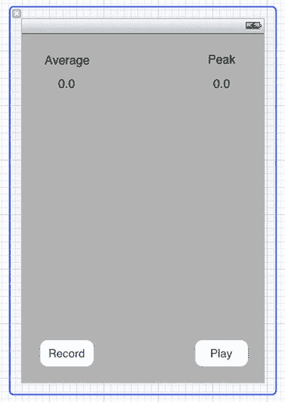

**图 7–5.** 录制和播放音频的用户界面

接下来，将两个按钮以及两个监控标签连接到头文件。切换到助理编辑器。按住^（Ctrl）并从视图元素拖到头文件，将按钮和标签连接到头文件。在本项目中，我将按钮命名为`recordButton`、`playButton`，标签命名为`averageLevel`和`peakLevel`。

您还需要为按钮定义两个操作方法，分别命名为`recordPressed:`和`playPressed:`，并将按钮连接到它们。为此，再次按住^（Ctrl），从 XIB 文件中的每个按钮拖到其对应的头文件操作。

在进入实现文件之前，需要在头文件中添加一个名为`url`的实例变量，类型为`NSURL`，用于跟踪录制保存的位置。最后，需要添加两个属性，一个用于`AVAudioPlayer`，命名为`player`，另一个用于`AVAudioRecorder`，命名为`audioRecorder`。确保在实现文件中正确合成它们，并在`viewDidUnload`方法中将它们（以及它们的委托）设置为`nil`。此时，您的头文件应如下所示：

```
#import <UIKit/UIKit.h>
#import <AVFoundation/AVFoundation.h>

@interface RecordingViewController : UIViewController {
    NSURL *url;
}

@property (strong, nonatomic) IBOutlet UIButton *recordButton;
@property (strong, nonatomic) IBOutlet UIButton *playButton;
@property (strong, nonatomic) IBOutlet UILabel *averageLevel;
@property (strong, nonatomic) IBOutlet UILabel *peakLevel;

@property (strong, nonatomic) AVAudioRecorder *audioRecorder;
@property (strong, nonatomic) AVAudioPlayer *player;

-(IBAction)recordPressed:(id)sender;
-(IBAction)playPressed:(id)sender;

@end
```

现在，编写`viewDidLoad`方法，它与上一个食谱中的方法非常相似。

```
-(void)viewDidLoad
{
    [super viewDidLoad];
    url = [self tempFileURL];
    self.audioRecorder = [[AVAudioRecorder alloc] initWithURL:url settings:nil error:nil];
    self.audioRecorder.meteringEnabled = YES;

    NSTimer *timer = [NSTimer scheduledTimerWithTimeInterval:0.01 target:self
    selector:@selector(updateLabels) userInfo:nil repeats:YES];
    [timer fire];

    [self.audioRecorder prepareToRecord];
}
```

与上一个食谱一样，您向`AVAudioRecorder`发送`prepareToRecord`操作，以帮助提高应用的运行速度。您还设置了一个定时器来重复更新电平监控标签。

上述实现使用了`tempFileURL`方法来获取 URL，该方法的实现如下。为了避免编译器警告，请确保在`viewDidLoad`方法之前包含此方法，或者简单地在头文件中声明其处理程序`-(NSURL *)tempFileURL:`。


`- (NSURL *)tempFileURL`
```
{
    NSString *outputPath = [[NSString alloc] initWithFormat:@"%@%@", NSTemporaryDirectory(), @"recording.wav"];
    NSURL *outputURL = [[NSURL alloc] initFileURLWithPath:outputPath];
    NSFileManager *manager = [[NSFileManager alloc] init];
    if ([manager fileExistsAtPath:outputPath])
    {
        [manager removeItemAtPath:outputPath error:nil];
    }
    return outputURL;
}
```

你的 `-updateLabels` 方法再次实现如下：

```
-(void)updateLabels
{
    [self.audioRecorder updateMeters];
    self.averageLevel.text = [NSString stringWithFormat:@"%f", [self.audioRecorder
averagePowerForChannel:0]];
    self.peakLevel.text = [NSString stringWithFormat:@"%f", [self.audioRecorder
peakPowerForChannel:0]];
}
```

最后，你只需要实现按钮的动作。

```
-(void)recordPressed:(id)sender
{
    if ([self.audioRecorder isRecording])
    {
        [self.audioRecorder stop];
        [self.recordButton setTitle:@"Record" forState:UIControlStateNormal];
    }
    else
    {
        [self.audioRecorder record];
        [self.recordButton setTitle:@"Stop" forState:UIControlStateNormal];
    }
}
```
```
-(void)playPressed:(id)sender
{
    NSFileManager *manager = [[NSFileManager alloc] init];
    NSString *outputPath = [[NSString alloc] initWithFormat:@"%@%@", NSTemporaryDirectory(), @"recording.wav"];
    if (![self.player isPlaying])
    {
        if ([manager fileExistsAtPath:outputPath])
        {
            self.player = [[AVAudioPlayer alloc] initWithContentsOfURL:url error:nil];
            [self.player play];
            [self.playButton setTitle:@"Pause" forState:UIControlStateNormal];
        }
    }
    else
    {
        [self.player pause];
        [self.playButton setTitle:@"Play" forState:UIControlStateNormal];
    }
}
```

**注意：** 在上述实现中，包含一个检查以确认给定路径下文件是否存在的步骤极其重要，以防用户在尚未录制任何声音时按下“播放”按钮。使用没有文件的 URL 初始化 `AVAudioPlayer` 会导致应用程序抛出异常。

至此，你的应用程序将能成功录制和播放声音。在完成之前，你需要实现一个 `AVAudioPlayerDelegate` 方法来处理播放结束。首先，你需要确保视图控制器遵循 `AVAudioPlayerDelegate` 协议，因此视图控制器头文件的顶部现在看起来像这样：

`@interface RecordingViewController : UIViewController <AVAudioPlayerDelegate>`

现在，你需要在 `-playPressed:` 方法中创建 `player` 后，通过以下代码行将其委托设置为你的视图控制器。

`self.player.delegate = self;`

最后，你可以实现委托方法。

```
-(void)audioPlayerDidFinishPlaying:(AVAudioPlayer *)player successfully:(BOOL)flag
{
    [self.playButton setTitle:@"Play" forState:UIControlStateNormal];
}
```

与之前的示例一样，你可以为你的 `AVAudioRecorder` 和 `AVAudioPlayer` 实现委托方法，通过暂停和重新开始录制或播放来处理诸如电话或短信之类的中断。

你在此处未实现的 `AVAudioRecorder` 的其他有用方法包括 `-pause` 方法（它会暂停录制，但允许再次调用 `-play` 方法以继续录制到同一文件），以及 `-recordForDuration` 方法（它允许你指定录制时间的限制）。

如你所见，`AVAudioRecorder` 和 `AVAudioPlayer` 可以出色地协同工作，为用户提供一个完整而简单的音频接口。

### 菜谱 7–3：访问 iPod 资料库

到目前为止，你已经能够处理播放和操作项目中包含的声音文件，但有一种简单的方法可以访问数量多得多的声音文件：访问用户的音乐资料库。

这里你将创建另一个新项目，这次命名为“MusicPick”。首先，你需要将项目与 Media Player 框架链接，并像往常一样在视图控制器中添加它的导入语句。

你将把视图设置为一个基本的音乐播放器，因此它看起来像图 7–6。

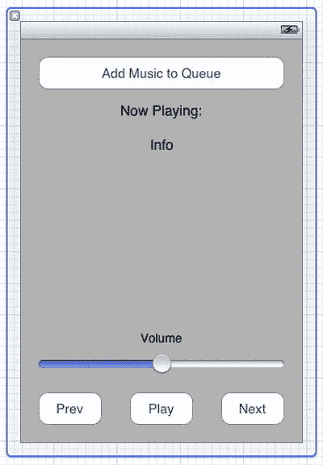

**图 7–6.** *用于从 iPod 资料库排队播放音乐的用户界面*

确保连接所有四个按钮，并将它们命名为 `playButton`、`prevButton`、`nextButton` 和 `queueButton`。你的滑块将命名为 `sliderVolume`，而你的“信息”`UILabel` 将命名为 `infoLabel`。

你还需要为你的元素定义五个动作，分别是 `-playPressed:`、`-prevPressed:`、`-nextPressed:`、`-queuePressed:` 和 `-volumeChanged:`。确保将每个元素连接到其对应的动作。

你还需要在头文件中定义两个属性，一个类型为 `MPMusicPlayerController`，名为 `player`，用于播放音乐；另一个类型为 `MPMediaItemCollection`，名为 `myCollection`，用于帮助你追踪所选的要播放的曲目。最后，你将通过遵循 `MPMediaPickerControllerDelegate` 协议，使视图控制器成为名为 `MPMediaPickerController` 的类的委托，从而允许用户选择要播放的音乐。总体而言，你的头文件现在应该如下所示：

```
#import <UIKit/UIKit.h>
#import <MediaPlayer/MediaPlayer.h>

@interface MainViewController : UIViewController <MPMediaPickerControllerDelegate>

@property (strong, nonatomic) IBOutlet UIButton *queueButton;
@property (strong, nonatomic) IBOutlet UIButton *prevButton;
@property (strong, nonatomic) IBOutlet UIButton *playButton;
@property (strong, nonatomic) IBOutlet UIButton *nextButton;
@property (strong, nonatomic) IBOutlet UISlider *sliderVolume;
@property (strong, nonatomic) IBOutlet UILabel *infoLabel;

@property (strong, nonatomic) MPMediaItemCollection *myCollection;
@property (strong, nonatomic) MPMusicPlayerController *player;

-(IBAction)queuePressed:(id)sender;
-(IBAction)prevPressed:(id)sender;
-(IBAction)playPressed:(id)sender;
-(IBAction)nextPressed:(id)sender;

-(IBAction)volumeChanged:(id)sender;
@end
```

确保同时合成 `player` 和 `myCollection`，并像往常一样在 `-viewDidUnload` 中妥善处理它们。

现在，你可以设置你的 `-viewDidLoad` 方法。

```
-(void)viewDidLoad
{
    [super viewDidLoad];

    self.infoLabel.text = @"...";

    self.player = [MPMusicPlayerController applicationMusicPlayer];

    [self setNotifications];

    [self.player beginGeneratingPlaybackNotifications];

    [self.player setShuffleMode:MPMusicShuffleModeOff];
    self.player.repeatMode = MPMusicRepeatModeNone;

    self.sliderVolume.value = self.player.volume;
}
```

`MPMusicPlayerController` 类有两个重要的类方法，可以让你访问该类的实例。你之前使用的 `+applicationMusicPlayer` 返回一个特定于应用程序的音乐播放器。这个选项对于将你的音乐与设备的实际 iPod 分开管理很有用，但缺点是应用程序进入后台后无法播放。或者，你可以使用 `+iPodMusicPlayer`，它允许即使在后台也能持续播放。然而，在这种情况下要记住的主要一点是，你的 `player` 可能已经有一个来自实际 iPod 的 `nowPlayingItem`，你应该能够处理它。


每当你使用 `MPMusicPlayerController` 实例时，建议注册通知，以监听播放状态的变化或当前播放歌曲的变化。你可以在 `setNotifications` 方法中实现，如下所示：

```
-(void)setNotifications
{
    NSNotificationCenter *notificationCenter = [NSNotificationCenter defaultCenter];
    [notificationCenter
     addObserver: self
     selector:    @selector (handle_NowPlayingItemChanged:)
     name:        MPMusicPlayerControllerNowPlayingItemDidChangeNotification
     object:      self.player];

    [notificationCenter
     addObserver: self
     selector:    @selector (handle_PlaybackStateChanged:)
     name:        MPMusicPlayerControllerPlaybackStateDidChangeNotification
     object:      self.player];

    [notificationCenter addObserver:self
                           selector:@selector(volumeChangedHardware:)
name:@"AVSystemController_SystemVolumeDidChangeNotification"
                             object:nil];
}
```

此外，你还添加了第三个通知注册，以确保能感知用户通过设备侧边按钮调整设备音量的任何操作。这样，你的应用程序就能像普通音乐播放器一样被使用。

每个通知都会触发一个选择器方法，这些方法定义如下：

```
-(void)volumeChangedHardware:(id)sender
{
    [self.sliderVolume setValue:self.player.volume animated:YES];
}
- (void) handle_PlaybackStateChanged: (id) notification
{
    MPMusicPlaybackState playbackState = [self.player playbackState];

    if (playbackState == MPMusicPlaybackStateStopped)
    {
        [self.playButton setTitle:@"播放" forState:UIControlStateNormal];
        self.infoLabel.text = @"...";
        [self.player stop];
    }
    else if (playbackState == MPMusicPlaybackStatePaused)
    {
        [self.playButton setTitle:@"播放" forState:UIControlStateNormal];
    }
    else if (playbackState == MPMusicPlaybackStatePlaying)
    {
        [self.playButton setTitle:@"暂停" forState:UIControlStateNormal];
    }
}
- (void) handle_NowPlayingItemChanged: (id) notification
{
    MPMediaItem *currentItemPlaying = [self.player nowPlayingItem];
    if (currentItemPlaying)
    {
        NSString *info = [NSString stringWithFormat:@"%@ - %@", [currentItemPlaying valueForProperty:MPMediaItemPropertyTitle], [currentItemPlaying valueForProperty:MPMediaItemPropertyArtist]];
        self.infoLabel.text = info;
    }
    else
    {
        self.infoLabel.text = @"...";
    }
    if (self.player.playbackState == MPMusicPlaybackStatePlaying)
    {
        [self.playButton setTitle:@"暂停" forState:UIControlStateNormal];
    }
}
```

如你所见，当设备音量改变时，你只需通过动画将滑块调整到新值。当设备播放状态改变时，你只需根据新状态调整视图。每当当前播放的歌曲发生变化时，你都会更新用户界面，以显示当前播放媒体项的基本信息。

接下来，你将定义 `MPMediaPickerController` 的两个委托方法，以处理取消和成功选择媒体项的情况：

```
-(void)mediaPickerDidCancel:(MPMediaPickerController *)mediaPicker
{
    [self dismissModalViewControllerAnimated:YES];
}
-(void)mediaPicker:(MPMediaPickerController *)mediaPicker didPickMediaItems:(MPMediaItemCollection *)mediaItemCollection
{
    [self updateQueueWithMediaItemCollection:mediaItemCollection];
    [self dismissModalViewControllerAnimated:YES];
}
```

`MPMediaItemCollection` 是所选媒体项的集合，你可以将其排入 `MPMusicPlayerController` 的队列，并迭代播放。你需要通过定义 `updateQueueWithMediaItemCollection:` 方法来更新 `player` 的队列：

```
-(void)updateQueueWithMediaItemCollection:(MPMediaItemCollection *)collection
{
    if (collection)
    {
        if (self.myCollection == nil)
        {
            self.myCollection = collection;
            [self.player setQueueWithItemCollection: self.myCollection];
            [self.player play];
        }
        else
        {
            BOOL wasPlaying = NO;
            if (self.player.playbackState == MPMusicPlaybackStatePlaying) {
                wasPlaying = YES;
            }

            MPMediaItem *nowPlayingItem        = self.player.nowPlayingItem;
            NSTimeInterval currentPlaybackTime = self.player.currentPlaybackTime;

            NSMutableArray *combinedMediaItems =
            [[self.myCollection items] mutableCopy];
            NSArray *newMediaItems = [collection items];
            [combinedMediaItems addObjectsFromArray: newMediaItems];

            [self setMyCollection:
             [MPMediaItemCollection collectionWithItems:
              (NSArray *) combinedMediaItems]];

            [self.player setQueueWithItemCollection:self.myCollection];

            self.player.nowPlayingItem      = nowPlayingItem;
            self.player.currentPlaybackTime = currentPlaybackTime;

            if (wasPlaying)
            {
                [self.player play];
            }
        }
    }
}
```

这个方法看起来可能有些复杂，但实际上逻辑相当线性。首先，在确认集合不为 `nil` 后，检查是否已有先前的队列设置。如果没有，就将 `player` 的队列设置为此集合。如果有，则将两个集合合并，将 `player` 的队列设置为合并结果，然后将播放状态恢复到之前的位置。

**提示：** 如果在 `MPMusicPlayerController` 正在播放时更新队列，你可能会注意到播放过程中出现短暂的中断。可以通过使用 `BOOL` 标志位，仅在歌曲之间更新队列来规避此问题。

你可以相当简单地定义由按钮和滑块执行的所有方法，以执行各自的命令：

```
-(void)queuePressed:(id)sender
{
    MPMediaPickerController *picker = [[MPMediaPickerController alloc] initWithMediaTypes:MPMediaTypeMusic];
    picker.delegate = self;
    picker.allowsPickingMultipleItems = YES;
    picker.prompt =
    NSLocalizedString (@"添加要播放的歌曲",
                       "媒体项选择器中的提示");
    [self presentModalViewController:picker animated:YES];
}
-(void)prevPressed:(id)sender
{
if ([self.player currentPlaybackTime] > 5.0)
    {
        [self.player skipToBeginning];   
    }
    else
    {
        [self.player skipToPreviousItem];
    }
}
-(void)volumeChanged:(id)sender
{
    if (self.player.volume != self.sliderVolume.value)
    {
        self.player.volume = self.sliderVolume.value;
    }
}
-(void)playPressed:(id)sender
{
    if ((myCollection != nil) && (self.player.playbackState != MPMusicPlaybackStatePlaying))
    {
        [self.player play];
        [self.playButton setTitle:@"暂停" forState:UIControlStateNormal];
    }
    else if (self.player.playbackState == MPMusicPlaybackStatePlaying)
    {
        [self.player pause];
        [self.playButton setTitle:@"播放" forState:UIControlStateNormal];
    }
}
-(void)nextPressed:(id)sender
{
        [self.player skipToNextItem];
}
```

如你所见，你为用户提供了一个五秒钟的时间窗口，在此期间按下“上一首”按钮会跳转到上一首歌曲，超出此时间窗口则会先跳转到当前歌曲的开头。


你的最后一步是完整实现 `-viewDidUnload` 方法，以正确处理 `player` 的设置。由于你在应用启动时注册为三种不同通知的观察者，你需要将视图控制器移除为这些值的观察者。同时，你还要确保 `-stop` 你的 `MPMusicPlayerController`，并将其队列设置为 `nil`。完整的方法如下所示：

```
- (void)viewDidUnload`
`{
    [self.player stop];
    [self.player setQueueWithItemCollection:nil];
    [[NSNotificationCenter defaultCenter]
     removeObserver: self
     name:           MPMusicPlayerControllerNowPlayingItemDidChangeNotification
     object:         self.player];

    [[NSNotificationCenter defaultCenter]
removeObserver: self
     name:           MPMusicPlayerControllerPlaybackStateDidChangeNotification
     object:         self.player];

    [[NSNotificationCenter defaultCenter] removeObserver:self name:@"AVSystemController_SystemVolumeDidChangeNotification"  object:nil];

    [self.player endGeneratingPlaybackNotifications];
    self.myCollection = nil;
    self.player = nil;
    [self setQueueButton:nil];
    [self setPrevButton:nil];
    [self setPlayButton:nil];
    [self setNextButton:nil];
    [self setSliderVolume:nil];
    [self setInfoLabel:nil];
    [super viewDidUnload];
}
```

运行此应用时需要注意一点：在开始播放音乐之前，你将无法通过外部音量按钮调整 `AVAudioPlayer` 的音量，因为这些按钮仍会控制铃声音量，而非播放音量。一旦你选择一首歌曲播放，这些按钮就会完全控制播放音量。

你可能已经看到这个框架为开发者提供的强大功能。通过访问用户自己的媒体库，你可以为用户的应用打开一个全新的音频定制层级，可能性包括选择闹钟音乐，或为游戏指定背景音乐。通过赋予用户选择和个性化的能力，你的应用的市场竞争力和功能性将显著提升。

#### 查询媒体

现在你已经了解了让用户选择音乐的简单方法，接下来可以实现更强大的方法来查询、过滤和排序用户媒体库中的音乐。

此处你只需在前一个配方的基础上添加功能，具体地，允许用户输入艺术家名称，然后查询媒体库中该艺术家的音乐。

首先，在前一个配方剩余的 XIB 中添加一个 `UIButton` 和一个 `UITextField`，使视图看起来像图 7-7。

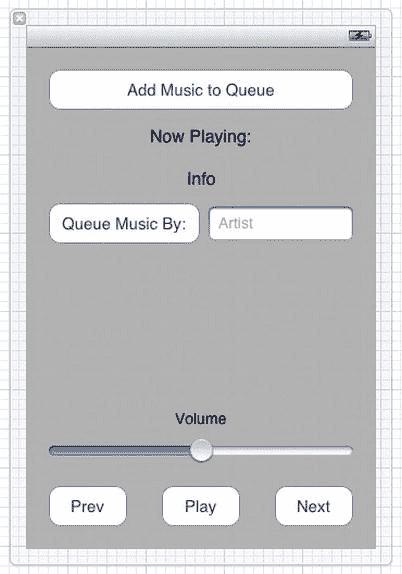

**图 7-7.** *用于查询音乐的用户界面*

确保正确将此按钮连接到名为 `-queryPressed:` 的操作，并将文本字段连接到名为 `textFieldArtist` 的属性。

你首先要对新添加的 `UITextField` 设置其代理为你的视图控制器，在 `-viewDidLoad` 中添加以下代码：

```
self.textFieldArtist.delegate = self;
self.textFieldArtist.enablesReturnKeyAutomatically = YES;
```

确保调整你的头文件，声明视图控制器遵循 `UITextFieldDelegate` 协议。

接下来，你需要实现以下 `UITextField` 代理方法，以便在按下返回键时正确关闭键盘：

```
-(BOOL)textFieldShouldReturn:(UITextField *)textField
{
    [textField resignFirstResponder];
    return NO;
}
```

你也可以选择在 `-textFieldShouldReturn:` 方法中包含对 `-queryPressed:`（稍后实现）的调用，这样当按下返回键时自动执行查询。我选择不这样做，以防用户希望在当前歌曲播放完后才执行查询。

接下来实现 `-queryPressed:` 方法：

```
-(void)queryPressed:(id)sender
{
    NSString *artist = self.textFieldArtist.text;
    if (artist != nil && artist != @"")
    {
        MPMediaPropertyPredicate *artistPredicate = [MPMediaPropertyPredicate predicateWithValue:artist forProperty:MPMediaItemPropertyArtist comparisonType:MPMediaPredicateComparisonContains];
        MPMediaQuery *query = [[MPMediaQuery alloc] init];
        [query addFilterPredicate:artistPredicate];

        NSArray *result = [query items];
if ([result count] > 0)
        {
            [self updateQueueWithMediaItemCollection:[MPMediaItemCollection collectionWithItems:result]];
        }
        else
            self.infoLabel.text = @"Artist Not Found.";
    }
}
```

可以看到，查询媒体库是一个相当简单的过程，其最低要求仅需要一个 `MPMediaQuery` 类的实例。然后你可以向查询添加 `MPMediaPropertyPredicates` 以使其更具体。

使用 `MPMediaPropertyPredicates` 需要对不同的 `MPMediaItemProperties` 有充分的了解，以便准确知道可以获取哪些信息。并非所有 `MPMediaItemProperties` 都是可过滤的，而且如果你处理的是播客，可过滤的属性也不同。你应该查阅关于 `MPMediaItem` 的 Apple 文档以获取完整属性列表，但以下是常用属性列表：

*   `MPMediaItemPropertyMediaType`
*   `MPMediaItemPropertyTitle`
*   `MPMediaItemPropertyAlbumTitle`
*   `MPMediaItemPropertyArtist`
*   `MPMediaItemPropertyArtwork`

**提示：** 使用 `MPMediaItemPropertyArtwork` 时，可以使用 `MPMediaItemPropertyArtwork` 中定义的 `-imageWithSize:` 方法来创建 `UIImage`。


#### `MPMediaPropertyPredicates` 的几点说明：

**3.**  当向查询添加多个指定不同属性的筛选谓词时，这些谓词会使用“与”（AND）运算符进行求值。这意味着，如果你指定了艺术家姓名和专辑名称，你将只会收到该艺术家**并且**来自该特定专辑的歌曲。

**4.**  不要向一个查询添加两个针对同一属性的筛选谓词，因为其行为结果是未定义的。如果你想针对同一属性的多个特定值查询数据库，例如筛选来自两位不同艺术家的所有歌曲，更好的方法是简单地创建两个查询，然后将它们的结果合并起来。

**5.**  `MPMediaPropertyPredicate` 的 `comparisonType` 属性有助于指定你的谓词匹配的精确程度。值为 `MPMediaPredicateComparisonEqualTo` 时，仅返回字符串与给定字符串完全匹配的项目；而值为 `MPMediaPredicateComparisonContains` 时（如前所示），则返回包含给定字符串的项目，这通常意味着搜索精度较低。

作为一项附加功能，`MPMediaQuery` 还可以被赋予一个“分组属性”，以便其自动对结果进行分组。例如，你可以按特定艺术家筛选查询，但根据专辑名称进行分组。通过这种方式，你可以检索特定艺术家的所有歌曲，但像按专辑分组那样进行迭代处理，如下列代码所示。你可以将这些代码添加到你的 `-queryPressed:` 方法中，在该方法中创建了以下 `query` 对象。

```
[query setGroupingType: MPMediaGroupingAlbum];
        NSArray *albums = [query collections];
        for (MPMediaItemCollection *album in albums)
        {
            MPMediaItem *representativeItem = [album representativeItem];
            NSString *albumName = [representativeItem valueForProperty: MPMediaItemPropertyAlbumTitle];
            NSLog (@"%@", albumName);
        }
```

你也可以通过使用类方法来设置分组类型，例如 `MPMediaQuery` 的 `+albumsQuery`，这将会为你创建一个预先设置了分组属性的 `query` 实例。

### 技巧 7–4：后台播放与正在播放信息

到目前为止，你已经了解了在 iOS 中处理音频的多种技术：从播放单个音效，到访问媒体库，再到使用 iPod 播放器。每种技术根据你应用的目标，都各有其优缺点和特定用途。

然而，当所有这些功能结合使用时，你应用的潜力将变得几乎是无限的。在这里，你将结合使用 `AVFoundation`、`MPMediaQuery`、`MPMediaPickerController` 和 `MPNowPlayingInfoCenter`（iOS 5.0 的新特性！），来创建你自己版本的 iPod 用户界面（尽管不如原版美观），以便即使你的应用在后台运行，音乐也能继续播放。

使用“单视图应用程序”（Single View Application）模板创建一个新项目，将其命名为“Chapter7Recipe3”，类前缀为“Main”。

接下来，你需要确保所有必需的框架都已导入。继续将以下框架链接到你的项目中，操作方式与你本章中之前的所有技巧完全相同。

- `AVFoundation.framework`：你将使用此框架来播放音频文件。
- `MediaPlayer.framework`：此框架将允许你访问媒体库和媒体文件。
- `CoreMedia.framework`：你不会使用此框架中的任何类，但你需要用到一些 `CMTime` 函数来帮助你处理音频播放器。

在你的视图控制器头文件中添加以下导入语句。在这个项目中，你不需要为 Core Media 框架添加导入语句。

```
#import <MediaPlayer/MediaPlayer.h>
#import <AVFoundation/AVFoundation.h>
```

你的视图控制器最终还将成为多个对象的代理，因此请为以下协议在你的头文件中添加协议声明：

- `UITextFieldDelegate`
- `AVAudioSessionDelegate`
- `MPMediaPickerControllerDelegate`

接下来，你将设置你的应用，使其在进入设备后台后能够继续播放音乐。你需要做的第一件事是声明一个类型为 `AVAudioSession` 的属性，命名为 `session`。确保使用 `@synthesize` 合成它，然后像往常一样，在你的 `-viewDidUnload` 方法中将其设置为 `nil`。

```
@property (nonatomic, strong) AVAudioSession *session;
```

然后，在你的 `-viewDidLoad` 方法中添加以下代码：

```
self.session = [AVAudioSession sharedInstance];
self.session.delegate = self;
[self.session setCategory:AVAudioSessionCategoryPlayback error:nil];
[self.session setActive:YES error:nil];
```

通过将你的 `session` 的类别指定为 `AVAudioSessionCategoryPlayback`，你是在告知设备你的应用主要功能是播放音乐，因此应允许应用在后台时继续播放音频。

你还需要确保在完成使用后停用你的会话，因此请在 `-viewDidUnload` 方法中添加以下代码行。

```
[self.session setActive:NO error:nil];
```

现在你已经配置好了 `AVAudioSession`，你需要编辑应用的 `.plist` 文件，以指定你的应用在后台时必须允许运行音频。你通常可以在项目的“支持文件”（Supporting Files）组中找到这个文件。如果找不到，你可以在项目的文件夹中找到它，如图 7–8 所示。

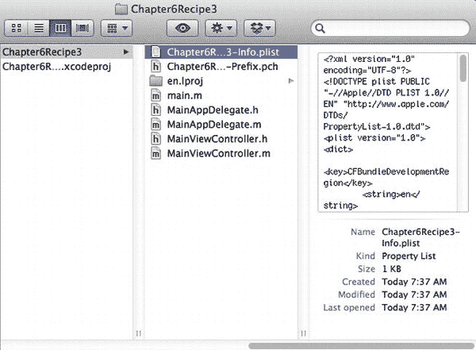

**图 7–8.** *查找 `.plist` 文件*

默认情况下，该文件应在 Xcode 中打开，类似于图 7–9。

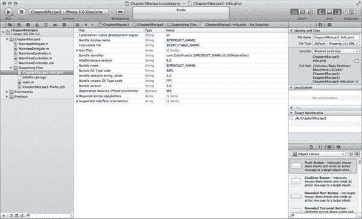

**图 7–9**. *编辑 `.plist` 文件*

在“编辑器”（Editor）菜单下，选择**添加项目（Add Item）**。应该会出现一个新项目，看起来像图 7–10。

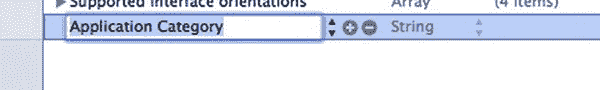

**图 7–10.** *设置应用类别*

对于“应用类别”（Application Category）项目，点击箭头对打开下拉菜单，然后选择“所需的后台模式”（Required Background modes）。


点击该项目新项的左侧箭头，展开值列表。您将编辑“Item 0”的值。点击右侧下拉菜单，选择“App plays audio”，如图 7–11 所示。或者，您也可以在值字段中键入`audio`，按下回车键后，Xcode 将自动更正该值。

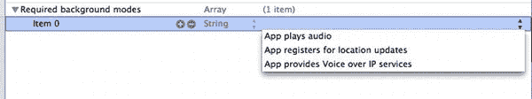

**图 7–11.** *指定后台音频功能*

现在，您的应用程序已准备好支持在后台状态下播放音频！

接下来，您将在 XIB 文件中构建用户界面。设置您的视图，使其外观如图 7–12 所示。

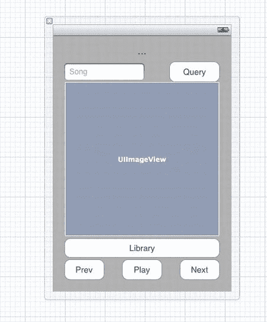

**图 7–12.** *自定义音乐播放器的用户界面*

在本项目中，将为显示的视图元素分配以下变量名，请按所示名称将每个元素连接到您的头文件中：

*   `infoLabel`：视图顶部的`UILabel`，用于显示当前歌曲信息。
*   `textFieldSong`：您的`UITextField`，为其设置了占位符文本“Song”。
*   `queryButton`：标题为“Query”的上方`UIButton`。
*   `artworkImageView`：您的`UIImageView`，用于显示歌曲的专辑封面。
*   `libraryButton`：大的“Library”`UIButton`。
*   `playButton`：中间的“Play”`UIButton`。
*   `nextButton`：右侧的“Next”`UIButton`。
*   `prevButton`：左侧的“Prev”`UIButton`。

为您将使用的五个按钮定义操作，并将每个按钮连接到其对应的方法。您的方法声明应如下所示：

```
-(IBAction)queryPressed:(id)sender;
-(IBAction)nextPressed:(id)sender;
-(IBAction)prevPressed:(id)sender;
-(IBAction)playPressed:(id)sender;
-(IBAction)libraryPressed:(id)sender;
```

接下来，您将声明运行应用程序所需的其他属性对象。对于以下每个属性，请确保对其进行合成，并在应用程序结束时将其正确设置为`nil`。首先，您将使用`AVQueuePlayer`类的实例来播放和排队声音文件，因此将其声明为一个属性：

```
@property (nonatomic, strong) AVQueuePlayer *player;
```

为了管理您的`player`，您需要两个`NSMutableArray`类型的副本来管理其播放列表。一个数组包含所有已排队的原始`MPMediaItem`类项（您可以从中访问媒体信息），另一个数组包含它们全部转换为`AVPlayerItem`实例后的项（您可以通过`AVQueuePlayer`播放它们）。您还需要一个`NSUInteger`类型的属性来帮助跟踪当前播放的项。这些属性将按如下方式声明，确保正确合成并将每个属性设为`nil`：

```
@property (nonatomic, strong) NSMutableArray *playlist;
@property (nonatomic, strong) NSMutableArray *myCollection;
@property (nonatomic) NSUInteger currentIndex;
```

现在，您要在实现文件中完成的第一件事是编写`-viewDidLoad`方法，使其如下所示：

```
- (void)viewDidLoad
{
    [super viewDidLoad];
    self.session = [AVAudioSession sharedInstance];
    self.session.delegate = self;
    [self.session setCategory:AVAudioSessionCategoryPlayback error:nil];
    [self.session setActive:YES error:nil];

    self.textFieldSong.delegate = self;
    [self.playButton setTitle:@"Play" forState:UIControlStateNormal];
}
```

这里新增的代码只是确认`playButton`的标题设置正确，并将您的视图控制器设置为`UITextField`的代理。实现`UITextFieldDelegate`方法来处理键盘的关闭，如下所示：

```
-(BOOL)textFieldShouldReturn:(UITextField *)textField
{
    [textField resignFirstResponder];
    return NO;
}
```

您还需要重写`playlist`的 getter 方法，以确保其正确初始化。

```
-(NSMutableArray *)playlist
{
    if (!playlist)
    {
        playlist = [[NSMutableArray alloc] initWithCapacity:5];
    }
    return playlist;
}
```

您还需要重写`currentIndex`的 getter 方法，使其始终返回当前播放项的正确索引。

```
-(NSUInteger)currentIndex
{
    currentIndex = [self.playlist indexOfObject:self.player.currentItem];
    return currentIndex;
}
```

接下来，您将实现一个方法，该方法会在每次歌曲切换时更新用户界面。

```
-(void)updateNowPlaying
{
    if (self.player.currentItem != nil)
    {
        MPMediaItem *nowPlaying = [self.myCollection objectAtIndex:self.currentIndex];
//        NSLog(@"%@", [nowPlaying valueForProperty:MPMediaItemPropertyTitle]);

        self.infoLabel.text = [NSString stringWithFormat:@"%@ - %@", [nowPlaying valueForProperty:MPMediaItemPropertyTitle],  [nowPlaying valueForProperty:MPMediaItemPropertyArtist]];

        UIImage *artwork = [[nowPlaying valueForProperty:MPMediaItemPropertyArtwork] imageWithSize:self.artworkImageView.frame.size];
        if (artwork)
        {
            self.artworkImageView.image = artwork;
        }
        else
        {
            self.artworkImageView.image = nil;
        }
        if ([MPNowPlayingInfoCenter class])  
        {
            NSString *title = [nowPlaying valueForProperty:MPMediaItemPropertyTitle];
            NSString *artist = [nowPlaying valueForProperty:MPMediaItemPropertyArtist];
            NSDictionary *currentlyPlayingTrackInfo = [NSDictionary
dictionaryWithObjects:[NSArray arrayWithObjects:title, artist, nil] forKeys:[NSArray
arrayWithObjects:MPMediaItemPropertyTitle, MPMediaItemPropertyArtist, nil]];
            [MPNowPlayingInfoCenter defaultCenter].nowPlayingInfo =
currentlyPlayingTrackInfo;
        }
    }
    else
    {
        self.infoLabel.text = @"...";
        [self.playButton setTitle:@"Play" forState:UIControlStateNormal];
        self.artworkImageView.image = nil;
    }
}
```

刚才展示的方法除了更新用户界面以显示当前歌曲信息外，还利用了 iOS 5 的一个新功能，即`MPNowPlayingInfoCenter`！这个类允许开发者将信息放置在设备的锁屏上，或者当应用程序通过 AirPlay 显示信息时放置在其他设备上。您可以通过将`+defaultCenter`的`nowPlayingInfo`属性设置为您创建的字典值来向其传递信息。

要利用上述的`MPNowPlayingInfoCenter`实现，您必须在代码中进行一些特定的添加。具体来说，如果您的应用程序无法处理远程控制事件，所有这些功能都将无法工作。为此，首先实现处理远程事件的`-remoteControlReceivedWithEvent:`方法。

```
- (void) remoteControlReceivedWithEvent: (UIEvent *) receivedEvent {
    if (receivedEvent.type == UIEventTypeRemoteControl) {

        switch (receivedEvent.subtype) {

            case UIEventSubtypeRemoteControlTogglePlayPause:
                [self playPressed:nil];
                break;

            case UIEventSubtypeRemoteControlPreviousTrack:
                [self prevPressed:nil];
                break;

            case UIEventSubtypeRemoteControlNextTrack:
                [self nextPressed:nil];
                break;

            default:
                break;
        }
    }
}
```

当用户在锁屏或多任务屏幕上点击暂停、上一首和下一首按钮时，将调用上述方法。您只需让它们调用您稍后将实现的播放、前进和后退方法即可。


接下来，为了接收这些远程控制事件，你需要修改 `-viewDidAppear:animated:` 和 `-viewWillDisappear:animated:` 方法。

```
- (void)viewDidAppear:(BOOL)animated
{
    [super viewDidAppear:animated];
    [[UIApplication sharedApplication] beginReceivingRemoteControlEvents];
    [self becomeFirstResponder];
}
- (void)viewWillDisappear:(BOOL)animated
{
    [[UIApplication sharedApplication] endReceivingRemoteControlEvents];
    [self resignFirstResponder];
    [super viewWillDisappear:animated];
}
```

最后，为了使上述两个方法正常工作并让你的视图控制器成为第一响应者，你需要像这样重写 `-canBecomeFirstResponder` 方法：

```
-(BOOL)canBecomeFirstResponder
{
    return YES;
}
```

如果未遵循这些额外步骤，你的应用程序将无法在锁屏或多任务栏中使用任何“Now Playing”信息。

为了帮助保持你的两个 `NSMutableArray` 同步，你需要定义一个方法，该方法接收一个 `MPMediaItem` 的 `NSArray`，并返回一个包含相同项目但已转换为 `AVPlayerItem` 的 `NSArray`。

```
-(NSArray *)AVPlayerItemsFromArray:(NSArray *)items
{
    NSMutableArray *array = [[NSMutableArray alloc] initWithCapacity:[items count]];
    NSURL *url;
    for (MPMediaItem *current in items)
    {
        url = [current valueForProperty:MPMediaItemPropertyAssetURL];
        AVPlayerItem *playerItem = [AVPlayerItem playerItemWithURL:url];

        [[NSNotificationCenter defaultCenter]
         addObserver:self
         selector:@selector(playerItemDidReachEnd:)
         name:AVPlayerItemDidPlayToEndTimeNotification
         object:playerItem];

        if (playerItem != nil)
            [array addObject:playerItem];
    }
    return array;
}
```

为了后续能够判断歌曲何时播放完毕并做出相应处理，你需要像前面展示的那样，将视图控制器添加为观察者。在这个方法中包含 `-addObserver` 调用相当方便，因为你可以轻松访问即将使用的所有 `AVPlayerItem`。

在处理 `NSNotificationCenter` 时，请确保刚刚添加的所有观察者都能被正确移除。将以下代码添加到你的 `-viewDidUnload` 方法中。

```
for (AVPlayerItem *playerItem in self.playlist)
    {
        [[NSNotificationCenter defaultCenter] removeObserver:self name:AVPlayerItemDidPlayToEndTimeNotification object:playerItem];
    }
```

你指定在歌曲播放结束时执行的 `-playerItemDidReachEnd:` 方法的实现非常简单，如下所示。

```
- (void)playerItemDidReachEnd:(NSNotification *)notification
{
    [self performSelector:@selector(updateNowPlaying) withObject:nil afterDelay:
0.5];
}
```

我在这里加入了半秒延迟，以确保在 `AVQueuePlayer` 完全切换到播放下一项目之后，`-updateNowPlaying` 调用才会执行。

接下来，你将实现两个方法，每当需要更新或添加播放列表时都会用到它们。

```
-(void)updatePlaylistWithArray:(NSArray *)collection
{
if (([self.playlist count] == 0) || (self.player.currentItem == nil))
    {
        [self.myCollection removeAllObjects];
        self.playlist = [NSMutableArray arrayWithArray:collection];
        self.player = [[AVQueuePlayer alloc] initWithItems:self.playlist];
        [self.player play];
    }
    else
    {
        AVPlayerItem *currentItem = [self.playlist lastObject];
        for (AVPlayerItem *item in collection)
        {
            if ([self.player canInsertItem:item afterItem:currentItem])
            {
                [self.player insertItem:item afterItem:currentItem];
                currentItem = item;
            }
        }
        [self.playlist addObjectsFromArray:collection];
    }
}
```

```
-(void)updateMyCollectionWithArray:(NSArray *)mediaItems
{
if ([self.myCollection count] == 0)
    {
        self.myCollection = [NSMutableArray arrayWithArray:mediaItems];
    }
    else
    {
        [self.myCollection addObjectsFromArray:mediaItems];
    }
}
```

你的 `-playPressed:` 和 `-nextPressed:` 方法实现非常简单，因为 `AVQueuePlayer` 继承自 `AVPlayer` 类，并且拥有一个方便的小方法用于前进到队列中的下一项目。

```
-(void)playPressed:(id)sender
{
if (self.playlist.count > 0)
    {
        if ([[self.playButton titleForState:UIControlStateNormal] isEqualToString:@"Play"])
        {
            [self.player play];
            [self.playButton setTitle:@"Pause" forState:UIControlStateNormal];
        }
        else
        {
            [self.player pause];
            // 回退半秒，以便用户在恢复播放时有一点引导时间
            [self.player seekToTime:CMTimeSubtract(self.player.currentTime, CMTimeMakeWithSeconds(0.5, 1.0)) completionHandler:^(BOOL finished)
             {
                 [self.playButton setTitle:@"Play" forState:UIControlStateNormal];
             }];
        }
     [self updateNowPlaying];
    }
}
-(void)nextPressed:(id)sender
{
    [self.player advanceToNextItem];
    if (self.player.currentItem == nil)
    {
        [self.playlist removeAllObjects];
        [self.myCollection removeAllObjects];
    }
    [self updateNowPlaying];
}
```

遗憾的是，`AVQueuePlayer` 没有提供任何简单的方法来在队列中向后移动，因此你的 `-prevPressed:` 方法实现稍显复杂，只是涉及一些 `AVPlayerItem` 的交换操作。

```
-(void)prevPressed:(id)sender
{
    if (CMTimeCompare(self.player.currentTime, CMTimeMake(5.0, 1)) > 0)
    {
        [self.player seekToTime:kCMTimeZero];
    }
    else
    {
        [self.player pause];

        AVPlayerItem *current = self.player.currentItem;
        if (current != [self.playlist objectAtIndex:0])
        {
            AVPlayerItem *previous = [self.playlist objectAtIndex:[self.playlist indexOfObject:current]-1];
            if ([self.player canInsertItem:previous afterItem:current])
            {
                [current seekToTime:kCMTimeZero];
                [previous seekToTime:kCMTimeZero];

                [self.player insertItem:previous afterItem:current];
                [self.player advanceToNextItem];
                [self.player removeItem:current];
                [self.player insertItem:current afterItem:previous];
            }
            else
            {
                NSLog(@"Error: Could not insert");
            }
        }
        else
        {
            [self.player seekToTime:kCMTimeZero];
        }

        [self.player play];
    }
    [self updateNowPlaying];
}
```

你刚刚使用的 `CMTimeMake()` 函数是一个非常灵活的函数，它接受两个输入参数。第一个参数代表你想要的时间单位数量，第二个参数代表时间刻度，其中 1 表示一秒，2 表示半秒，依此类推。调用 `CMTimeMake(100, 10)` 将创建 100 个 (1/10) 秒的单位，总共为 10 秒。

你的查询按钮的功能将是使用 `MPMediaQuery` 来检索库中包含 `UITextField` 中单词或短语的任何歌曲。一旦你记得之后要更新你的两个 `NSMutableArray`，这个实现就相当直接了当。


`-(void)queryPressed:(id)sender`
{
    MPMediaQuery *query = [[MPMediaQuery alloc] init];
    NSString *title = self.textFieldSong.text;
    MPMediaPropertyPredicate *songPredicate = [MPMediaPropertyPredicate predicateWithValue:title forProperty:MPMediaItemPropertyTitle comparisonType:MPMediaPredicateComparisonContains];
    [query addFilterPredicate:songPredicate];

    [self updatePlaylistWithArray:[self AVPlayerItemsFromArray:[query items]]];
    [self updateMyCollectionWithArray:[query items]];

    [self.playButton setTitle:@"Pause" forState:UIControlStateNormal];

    [self updateNowPlaying];
    if ([self.textFieldSong isFirstResponder])
        [self.textFieldSong resignFirstResponder];
}

最后，你可以设置你的 `-libraryPressed:` 方法，该方法将会弹出一个 `MPMediaPickerController`，允许你选择多首歌曲进行排队。

`-(void)libraryPressed:(id)sender`
{
    MPMediaPickerController *picker = [[MPMediaPickerController alloc] initWithMediaTypes:MPMediaTypeMusic];
    picker.delegate = self;
    picker.allowsPickingMultipleItems = YES;
    picker.prompt = @"Choose Some Music!";
    [self presentModalViewController:picker animated:YES];
}

你需要实现两个代理方法才能正确处理 `MPMediaPickerController`。首先，这是处理取消操作的代理方法：

`-(void)mediaPickerDidCancel:(MPMediaPickerController *)mediaPicker`
{
    [self dismissModalViewControllerAnimated:YES];
}

其次，你还需要处理成功选择媒体后的代理方法，它看起来与 `-queryPressed:` 方法非常相似。

`-(void)mediaPicker:(MPMediaPickerController *)mediaPicker didPickMediaItems:(MPMediaItemCollection *)mediaItemCollection`
{
    [self updatePlaylistWithArray:[self AVPlayerItemsFromArray:[mediaItemCollection items]]];
    [self updateMyCollectionWithArray:[mediaItemCollection items]];
    [self.playButton setTitle:@"Pause" forState:UIControlStateNormal];
    [self updateNowPlaying];

    [self dismissModalViewControllerAnimated:YES];
}

在测试这个应用时，你可能会注意到一个细微的问题：你还没有提供一种方法来清空队列并重置应用，除非播放或跳过直到队列末尾。如果你的队列只有几首歌，这不算什么问题，但如果你排队了更多歌曲，你很可能希望加入某种方法，通过重置你的 `NSMutableArray` 并移除 `player` 队列中的所有项目来清空队列。不过，出于测试目的，只需双击设备的 Home 键，长按应用图标，然后关闭即可。

现在，你的音乐排队播放器应该已经功能完整了！当你测试这个应用时，即使应用进入设备的后台，它也应该继续播放音乐！图 7–13 展示了你的应用正在播放一首歌，以及它的“正在播放”功能和接收远程控制事件的能力。


**图 7–13.** *你的应用正在播放歌曲，同时在多任务栏中显示“正在播放”信息*

### 总结

完整的多媒体体验不仅仅是用户能否听音乐这么简单。作为一种产品，声音更多地关乎那些能让其变得稍微更好一些的微小细节，无论是暂停时的快速淡出，还是更快速地找到歌曲。从录制音乐到过滤媒体项目，再到创建音量渐变，作为开发者，你用心在应用中加入的每一个额外细节，最终都会让你的用户享受到一个更加强大的工具。在 iOS 开发中，Apple 提供了一套极其强大的基于多媒体的功能供我们使用，正如在 iTunes App Store 中快速搜索所显示的那样，开发社区已经超越了本职要求，充分利用这些功能为我们的用户打造了一个超乎想象的多媒体环境。

## 第 8 章

## 用户数据秘籍

没有两个人是相同的，同样地，没有两台 iOS 设备是相同的，因为一台设备存储的信息极度依赖于使用它的人。我们将自己的生活填满设备，包括照片、日历、备忘录、联系人和音乐。作为开发者，能够访问所有这些信息（无论设备类型如何）至关重要，这样我们才能将这些信息整合到应用中，并提供更独特、更个性化的用户界面。在本章中，我们将介绍多种处理用户数据的方法，首先处理日历，然后处理通讯录。


### 配方 8-1：使用 `NSCalendar` 和 `NSDate`

许多不同的应用常常用于基于时间和日期的计算。这可能涉及从日历转换、待办事项列表排序，到告知用户闹钟响起前还剩多少时间等各种场景。为了使用更复杂的基于事件的用户界面，你必须扎实掌握更基础的 `NSDate` 相关 API。在这里，你将通过实现一个简单的应用程序，演示如何利用 `NSDate`、`NSCalendar` 和 `NSDateComponents` 类，将流行的公历日期转换为希伯来历日期。

创建一个名为 `Chapter8Recipe1` 的新项目，类前缀设为 `Main`，并使用“单视图应用”模板。你不需要使用任何额外的框架。切换到你的视图控制器的 XIB 文件。将 XIB 文件设置为类似于图 8-1 所示的样子。

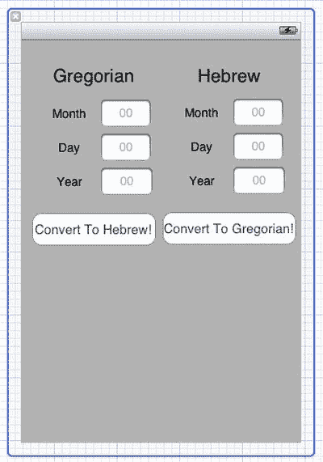

**图 8-1.** *日历转换的用户界面*

你需要设置代表每个 `UITextField` 的属性。视图设置完成后，使用如下适当的属性名将每个 `UITextField` 连接到你的头文件。

- `textFieldGMonth`
- `textFieldGDay`
- `textFieldGYear`
- `textFieldHMonth`
- `textFieldHDay`
- `textFieldHYear`

这些属性名中的 `G` 和 `H` 分别指代给定的 `UITextField` 位于应用的公历侧还是希伯来历侧。

你不需要将 `UIButton` 连接到输出口，但请确保它们分别连接到对应的操作 `-convertToHebrew:` 和 `-convertToGregorian:`。

请始终牢记，当你处理接受用户输入的应用（例如这里的 `UITextField`）时，键盘总有可能弹出并覆盖屏幕的下半部分。因此，请将布局规划好，将所有 `UITextField` 放置在视图的上半部分！

为了更好地控制所有这些 `UITextField`，你需要让你的视图控制器成为它们的代理。首先，将 `<UITextFieldDelegate>` 添加到控制器的头文件行中，使其现在看起来像这样：

```
@interface MainViewController : UIViewController <UITextFieldDelegate>
```

接下来，通过将以下代码添加到你的 `-viewDidLoad` 方法中，将所有 `UITextField` 的代理设置为你的视图控制器：

```
for (UITextField *field in self.view.subviews)
{
    if ([field respondsToSelector:@selector(setDelegate:)])
    {
        field.delegate = self;
    }
}
```

在这个 `for` 循环中，调用 `-respondsToSelector:` 方法是必要的，否则你的应用会抛出一个 `NSException`。通常，当你处理数组中可能出现多种类型对象的情况时，这是一个相当不错的方法。

接下来，定义 `UITextFieldDelegate` 方法 `-textFieldShouldReturn:`，以便正常关闭键盘。

```
-(BOOL)textFieldShouldReturn:(UITextField *)textField
{
    [textField resignFirstResponder];
    return NO;
}
```

你将在这里看到的第一个新类是 `NSCalendar`。它主要用于为你稍后引用的日期设定一个标准。`NSCalendar` 方法还允许你执行几个处理日历的有用功能，例如更改一周从哪一天开始，或更改使用的时区。`NSCalendar` 类也充当了你稍后将看到的 `NSDate` 和 `NSDateComponents` 类之间的桥梁。

你将使用 `NSCalendar` 类的两个实例来将日期从公历转换为希伯来历。你将把它们设为类的属性。

```
@property (nonatomic, strong) NSCalendar *gregorianCalendar;
@property (nonatomic, strong) NSCalendar *hebrewCalendar;
```

像处理其他属性一样，继续为这两个属性添加 `@synthesize`。不过，你需要为每个属性的 getter 方法提供自定义实现。

```
-(NSCalendar *)gregorianCalendar
{
    if (!gregorianCalendar)
    {
        gregorianCalendar = [[NSCalendar alloc]
initWithCalendarIdentifier:NSGregorianCalendar];
    }
    return gregorianCalendar;
}

-(NSCalendar *)hebrewCalendar
{
    if (!hebrewCalendar)
    {
        hebrewCalendar = [[NSCalendar alloc]
initWithCalendarIdentifier:NSHebrewCalendar];
    }
    return hebrewCalendar;
}
```

这些方法重写是必要的，以确保你的日历以其正确的日历类型进行初始化。或者，你也可以简单地在 `-viewDidLoad` 方法中初始化你的日历，使其在应用启动时创建。

有大量不同的日历类型可供使用，包括但不限于以下几种：

- `NSBuddhistCalendar`
- `NSIslamicCalendar`
- `NSJapaneseCalendar`

鉴于当今技术世界巨大的多元文化特性，你可能会发现非常有必要使用其中一些日历！请查阅 Apple 文档以获取所有可能的日历类型的完整列表。

现在，设置工作已经完成，你可以开始实现转换方法了，首先从公历到希伯来历的转换开始。

```
-(void)convertToGregorian:(id)sender
{
    NSDateComponents *hComponents = [[NSDateComponents alloc] init];
    [hComponents setDay:[self.textFieldHDay.text integerValue]];
    [hComponents setMonth:[self.textFieldHMonth.text integerValue]];

    [hComponents setYear:[self.textFieldHYear.text integerValue]];

    NSDate *hebrewDate = [self.hebrewCalendar dateFromComponents:hComponents];

    NSUInteger unitFlags = NSDayCalendarUnit | NSMonthCalendarUnit |
    NSYearCalendarUnit;

    NSDateComponents *hebrewDateComponents = [self.gregorianCalendar
components:unitFlags fromDate:hebrewDate];

    self.textFieldGDay.text = [[NSNumber numberWithInteger:hebrewDateComponents.day]
stringValue];
    self.textFieldGMonth.text = [[NSNumber numberWithInteger:hebrewDateComponents.month]
stringValue];
    self.textFieldGYear.text = [[NSNumber numberWithInteger:hebrewDateComponents.year]
stringValue];
}
```

如你所见，你结合使用了 `NSDateComponents`、`NSDate` 和 `NSCalendar` 来执行此转换。

`NSDateComponents` 类用于定义构成 `NSDate` 的详细信息，例如日、月、年、时间等。这里只指定了月、日和年。

如前所述，你使用 `NSCalendar` 的一个实例，根据已定义的组件来创建 `NSDate` 的一个实例。

此方法中较为令人困惑的部分之一是使用 `NSUInteger` `unitFlags`，其格式非常特殊。每当你指定基于一个 `NSDate` 创建 `NSDateComponents` 实例时，都需要精确指定要从该日期中包含哪些组件。你可以像示例所示，通过 `NSUInteger` 来指定这些标志，这些标志被称为 `NSCalendarUnit`。

其他类型的 `NSCalendarUnit` 包括以下内容（以及许多其他内容）：

- `NSSecondCalendarUnit`
- `NSWeekOfYearCalendarUnit`
- `NSEraCalendarUnit`
- `NSTimeZoneCalendarUnit`

如你所见，创建 `NSDate` 实例时的具体程度具有高度可定制性，这使你能够执行独特的计算和比较。有关 `NSCalendarUnit` 值的完整列表，请参阅 Apple 开发者 API 中的 `NSCalendar` 类参考。

由于 `NSDateComponents` 的值是 `NSInteger` 类型，在将它们设置到文本字段之前，必须先将它们转换为 `NSNumber` 实例，然后获取它们的 `-stringValue`。

一旦你定义了一个日历到另一个日历的转换，反向转换就非常简单了，你只需要更改所使用的文本字段和日历即可。


# 排版后

```objc
- (void)convertToHebrew:(id)sender
{
    NSDateComponents *gComponents = [[NSDateComponents alloc] init];
    [gComponents setDay:[self.textFieldGDay.text integerValue]];
    [gComponents setMonth:[self.textFieldGMonth.text integerValue]];
    [gComponents setYear:[self.textFieldGYear.text integerValue]];

    NSDate *gregorianDate = [self.gregorianCalendar dateFromComponents:gComponents];

    NSUInteger unitFlags = NSDayCalendarUnit | NSMonthCalendarUnit |
    NSYearCalendarUnit;

    NSDateComponents *hebrewDateComponents = [self.hebrewCalendar components:unitFlags
                                                                  fromDate:gregorianDate];

    self.textFieldHDay.text = [[NSNumber numberWithInteger:hebrewDateComponents.day]
                               stringValue];
    self.textFieldHMonth.text = [[NSNumber numberWithInteger:hebrewDateComponents.month]
                                 stringValue];
    self.textFieldHYear.text = [[NSNumber numberWithInteger:hebrewDateComponents.year]
                                stringValue];
}
```

现在，你的应用应该能够正确地跨历法转换 `NSDate` 实例，正如图 8–2 展示的那样！尝试使用不同的日期甚至不同历法进行试验，探索强大的日期转换功能。

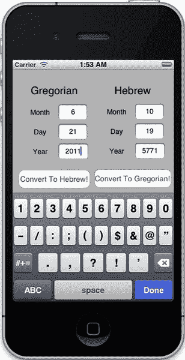

**图 8–2.** *应用成功转换日历日期*

### 食谱 8–2：获取事件

既然你已经了解了如何处理基本的日期转换和计算，接下来可以更深入地研究如何具体处理事件和日历，包括与用户自己的事件和日程进行交互。接下来的几个食谱将逐步结合，最终完整地使用 Event Kit 框架。

首先，使用“单视图应用”模板创建一个新项目。我将其命名为“Chapter8Recipe2”，类前缀为“Main”。

接下来，你需要将 Event Kit 框架导入到项目中。关于具体操作方法，请参考之前的食谱。

为了使用 Event Kit 框架，你需要将以下代码添加到主视图控制器的头文件中：

```objc
#import <EventKit/EventKit.h>
```

在本食谱中，你只需要访问并记录设备上已安排的事件，因此完全不涉及视图控制器的 XIB 文件。

每当处理 Event Kit 框架时，你最常使用的主要元素是 `EKEventStore`。这个类将是一个非常强大的工具，可以让你访问、删除和保存日历中的事件。你需要在头文件中声明一个该类型的属性，如下所示：

```objc
@property (strong, nonatomic) EKEventStore *eventStore;
```

确保对该属性进行 `@synthesize`，并在 `-viewDidUnload` 方法中将其设置为 `nil`。

这个用于记录事件的第一个食谱的实现非常简单。你只需要修改 `-viewDidLoad` 方法。在初始化 `eventStore` 属性后，你需要创建一个特定版本的 `NSPredicate` 类，以便查询事件。具体来说，你要查询设备日历中未来 *48 小时* 内的所有日期。你的方法如下所示：

```objc
- (void)viewDidLoad
{
    [super viewDidLoad];
    self.eventStore = [[EKEventStore alloc] init];
    NSDate *now = [NSDate date];
    NSDate *tomorrow = [NSDate dateWithTimeIntervalSinceNow:(2*24.0*60*60)];
    NSPredicate *predicate = [self.eventStore predicateForEventsWithStartDate:now
                                                                     endDate:tomorrow
                                                                   calendars:nil];
    NSArray *events = [self.eventStore eventsMatchingPredicate:predicate];
    for (EKEvent *event in events)
    {
        NSLog(@"%@", event.title);
    }
}
```

`+date` 方法是一种非常便捷的方式，能轻松地以 `NSDate` 形式获取当前日期和时间。`+dateWithTimeIntervalSinceNow:` 方法接受一个浮点值作为参数，表示你要包含的时间间隔（以秒为单位）。快速计算一下 2*24*60*60 秒，就能得到一个两天的查询范围。

你使用 `EKEventStore` 类的 `-predicateForEventsWithStartDate:endDate:calendars:` 方法来创建谓词。通过将 `calendars` 参数设为 `nil`，你指定该谓词应用于所有日历。

最后，要获取 `EKEvents` 数组，你只需调用 `EKEventStore` 的 `-eventsMatchingPredicate:` 方法，如前面的代码片段所示。然后你就可以遍历事件并根据需要处理。

你需要在一台物理设备上测试此应用，以便它访问你的日历并打印有效信息。请确保你的设备上确实已安排了一些事件作为测试数据。由于此处只输出日志，你还需要通过 Xcode 在设备上运行此应用，以便捕获输出。


### 技巧 8–3：在 `UITableView` 中显示事件

现在你已经能够访问事件了，接下来将创建一个更好的界面来处理它们。你将实现一个分组的 `UITableView` 来显示事件。

首先，你需要在 XIB 文件中添加 `UITableView`。从组件库中拖拽一个 `UITableView` 元素，并让它占据整个视图。在属性检查器中，确保表格视图的“样式”设置为“分组”，如图 8–3 所示。

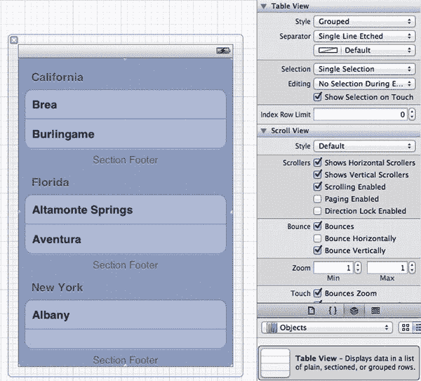

**图 8–3.** *配置分组的 `UITableView`*

接下来，将你的 `UITableView` 连接到视图控制器的头文件。这里使用的属性将命名为 `tableViewEvents`。

在切换到实现文件之前，你还需要定义两个将要使用的属性。首先，一个名为 `calendars` 的 `NSArray` 将用于保存对 `EKEventStore` 中所有日历的引用。其次，一个 `NSMutableDictionary` 实例将用于存储所有事件，并根据它们所属的日历进行归类。确保正确合成这些属性，并在 `-viewDidUnload` 方法中将其设置为 `nil`。

```
@property (nonatomic, strong) NSMutableDictionary *events;
@property (nonatomic, strong) NSArray *calendars;
```

你要做的第一件事是设置一个更新版本的 `-viewDidLoad` 方法，以正确填充数组和字典，同时确保 `UITableView` 已正确设置。

```
- (void)viewDidLoad
{
    [super viewDidLoad];

    self.tableViewEvents.delegate = self;
    self.tableViewEvents.dataSource = self;

    self.eventStore = [[EKEventStore alloc] init];
    self.calendars = [self.eventStore calendars];

    [self fetchEvents];
}
```

新的 `-fetchEvents` 方法将包含实际查询 `eventStore` 以获取事件的代码。由于你将按事件所属的日历进行排序，因此需要为每个日历执行不同的查询，而不是对所有事件执行一次查询。

```
-(void)fetchEvents
{
    self.events = nil;
    self.events = [[NSMutableDictionary alloc] initWithCapacity:[self.calendars count]];

    for (EKCalendar *cal in self.calendars)
    {
        NSPredicate *calPredicate = [self.eventStore
predicateForEventsWithStartDate:[NSDate date] endDate:[NSDate
dateWithTimeIntervalSinceNow:(2*24.0*60*60)] calendars:[NSArray arrayWithObject:cal]];
        //将日历参数设为 nil 表示搜索所有日历。

        NSArray *eventsInThisCalendar = [self.eventStore eventsMatchingPredicate:calPredicate];
        if (eventsInThisCalendar != nil)
        {
            [self.events setObject:eventsInThisCalendar forKey:cal.title];
        }
    }
}
```

如你所见，你将使用日历的标题作为键，将事件存储在 `NSMutableDictionary` 中，对应的值则是属于该特定日历的事件数组。

在继续之前，你需要指定视图控制器遵循某些协议，以便编译器允许将其设置为视图控制器的委托和数据源。添加 `UITableViewDelegate` 和 `UITableViewDataSource` 协议后，你的头文件应类似于如下内容：

```
#import <UIKit/UIKit.h>
#import <EventKit/EventKit.h>

@interface MainViewController : UIViewController <UITableViewDelegate,
UITableViewDataSource>{
    UITableView *tableViewEvents;
}

@property (nonatomic, strong) EKEventStore *eventStore;
@property (strong, nonatomic) IBOutlet UITableView *tableViewEvents;

@property (nonatomic, strong) NSMutableDictionary *events;
@property (nonatomic, strong) NSArray *calendars;
@end
```

为了正确实现分组的 `UITableView`，你需要实现一个方法来指定所需的分区数量。由于每个日历对应一个分区，这个方法既简单又方便。

```
-(NSInteger)numberOfSectionsInTableView:(UITableView *)tableView
{
    return [self.calendars count];
}
```

同样，你还可以实现一个方法来指定分区的标题，操作同样简单。

```
-(NSString *)tableView:(UITableView *)tableView
titleForHeaderInSection:(NSInteger)section
{
    return [[self.calendars objectAtIndex:section] title];
}
```

你还需要实现一个方法来确定每个分组中的行数，该数值由字典中对应分区的数组计数给出。

```
-(NSInteger)tableView:(UITableView *)tableView numberOfRowsInSection: (NSInteger)section
{
    NSString *title = [[self.calendars objectAtIndex:section] title];
    NSArray *eventsInThisCalendar = [self.events objectForKey:title];
    return [eventsInThisCalendar count];
}
```

最后，你可以构建处理 `UITableView` 时最重要的方法，该方法将定义表格单元格的创建方式。

```
- (UITableViewCell *)tableView:(UITableView *)tableView
cellForRowAtIndexPath:(NSIndexPath *)indexPath {
    static NSString *CellIdentifier = @"Cell";

    UITableViewCell *cell = [tableView
dequeueReusableCellWithIdentifier:CellIdentifier];
    if (cell == nil)
    {
         cell = [[UITableViewCell alloc] initWithStyle:UITableViewCellStyleValue1
reuseIdentifier:CellIdentifier];
    }

    cell.accessoryType = UITableViewCellAccessoryDetailDisclosureButton;
    cell.textLabel.backgroundColor = [UIColor clearColor];
    cell.textLabel.font = [UIFont systemFontOfSize:19.0];

    cell.textLabel.text = [[[self.events objectForKey:[[self.calendars
objectAtIndex:indexPath.section] title]] objectAtIndex:indexPath.row] title];

    return cell;
}
```

如你所见，除了对单元格视图进行相当通用的设置外，你所做的只是通过对数组和字典的一次简短（尽管略显复杂）调用来指定任何给定行的标题。

现在，你的应用应该能够很好地显示当前日历中的所有事件了！


### 配方 8–4：查看、编辑和删除事件

接下来，你可以了解如何允许用户通过 Event Kit UI 框架中的预定义类来查看、编辑和删除事件。

延续之前的配方，你需要做的第一件事是为项目添加另一个框架。这次，添加 `EventKitUI.framework`。使用 import 语句将框架的头文件导入到你的类中。

```
#import <EventKitUI/EventKitUI.h>
```

在本配方中，你将把你的视图控制器设置为其他几个视图控制器的委托，因此需要将它们的协议添加到头文件中。以下是你视图控制器现在应包含的完整协议列表：

- `UITableViewDelegate`
- `UITableViewDataSource`
- `EKEventViewDelegate`
- `EKEventEditViewDelegate`

首先，你将实现当用户在 `UITableView` 中选择特定行时的行为。你将使用 `EKEventViewController` 的实例来显示所选事件的信息。为此，你需要使用 `UITableView` 的数据源方法 `-tableView:DidSelectRowAtIndexPath:`。

```
-(void)tableView:(UITableView *)tableView didSelectRowAtIndexPath:(NSIndexPath
*)indexPath
{
    EKEventViewController *eventVC = [[EKEventViewController alloc] init];
    eventVC.event = [[self.events objectForKey:[[self.calendars
objectAtIndex:indexPath.section] title]] objectAtIndex:indexPath.row];
    eventVC.delegate = self;
    eventVC.allowsEditing = YES;
    UINavigationController *navcon = [[UINavigationController alloc]
initWithRootViewController:eventVC];
    [self presentModalViewController:navcon animated:YES];
    [tableView deselectRowAtIndexPath:indexPath animated:YES];
}
```

你需要实现 `EKEventViewController` 的委托方法 `-eventViewController:didCompleteWithAction:`，以便正确处理事件详情的使用结束。这里有一个相当简单的实现，它根据给定的操作在事件存储中保存或删除事件。

```
-(void)eventViewController:(EKEventViewController *)controller
didCompleteWithAction:(EKEventViewAction)action
{
    EKEvent *event = controller.event;
    if (action == EKEventViewActionDeleted)
        {
            [self.eventStore removeEvent:event span:EKSpanThisEvent error:nil];
        }
    else
    {
        [self.eventStore saveEvent:event span:EKSpanFutureEvents error:nil];
    }
    [self fetchEvents];
    [self.tableViewEvents reloadData];
    [self dismissModalViewControllerAnimated:YES];
}
```

你为保存和删除方法的 `span:` 参数使用的值仅限于此处已使用的两个值之一。正如你可能猜到的，它们指定保存或删除操作是仅应用于特定事件，还是同时应用于该事件的所有重复事件。

请记住，用户在 `EKEventViewController` 中删除事件并不意味着该事件已从 `eventStore` 中移除。你需要手动删除它，然后调用 `-fetchEvents` 方法以及表格的 `-reloadData` 方法来更新 `UITableView`。

作为额外功能，你还将让单元格的详情披露按钮允许用户通过 `EKEventEditViewController` 直接进入编辑事件信息的流程。首先，你将实现一个方法来处理披露按钮的按下。

```
-(void)tableView:(UITableView *)tableView
accessoryButtonTappedForRowWithIndexPath:(NSIndexPath *)indexPath
{
    EKEventEditViewController *eventEditVC = [[EKEventEditViewController alloc] init];
    eventEditVC.event = [[self.events objectForKey:[[self.calendars
objectAtIndex:indexPath.section] title]] objectAtIndex:indexPath.row];
    eventEditVC.eventStore = self.eventStore;
    eventEditVC.editViewDelegate = self;
    [self presentModalViewController:eventEditVC animated:YES];
}
```

与 `EKEventViewController` 类似，你需要为 `EKEventEditViewController` 定义一个委托方法。

```
-(void)eventEditViewController:(EKEventEditViewController *)controller
didCompleteWithAction:(EKEventEditViewAction)action
{
    if (action == EKEventEditViewActionDeleted)
    {
        [self.eventStore removeEvent:controller.event span:EKSpanThisEvent error:nil];
    }
    else if (action == EKEventEditViewActionSaved)
    {
        [self.eventStore saveEvent:controller.event span:EKSpanThisEvent error:nil];
    }
    [self fetchEvents];
    [self.tableViewEvents reloadData];
    [self dismissModalViewControllerAnimated:YES];
}
```

最后，你需要额外定义一个方法才能使用 `EKEventEditViewController`，该方法允许你指定一个日历用于创建新事件。在此实现中，你将简单地返回设备已使用的默认日历来执行此任务。

```
-(EKCalendar
*)eventEditViewControllerDefaultCalendarForNewEvents:(EKEventEditViewController
*)controller
{
    return [self.eventStore defaultCalendarForNewEvents];
}
```

为了确保视图始终显示最新信息，你将在 `-viewWillAppear:` 方法中添加内容，以便持续刷新当前数据以及 `UITableView`。方法现在应如下所示：

```
- (void)viewWillAppear:(BOOL)animated
{
    [self fetchEvents];
    [self.tableViewEvents reloadData];
    [super viewWillAppear:animated];
}
```

至此，你的应用程序已成功允许用户通过 `EKEventViewController`（图 8-4）或 `EKEventEditViewController`（图 8-5）以两种不同方式查看和编辑事件详情。

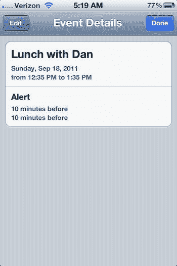

**图 8-4.** *`EKEventViewController`*

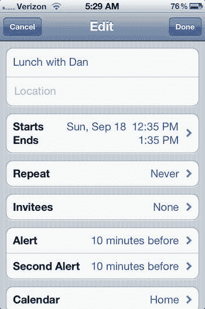

**图 8-5.** *`EKEventEditViewController`*


### 食谱 8–5：创建简单事件

虽然允许用户自行创建事件相当简单，但作为开发者，我们应始终尝试简化用户的操作。用户需要自行完成的操作越少，他们对最终产品的满意度通常就越高。为此，能够通过编程方式创建和编辑事件至关重要，这样用户甚至无需看到 `EKEventEditViewController`。

同样，基于上一个食谱，你首先需要进入视图控制器的 XIB 文件。

在视图顶部添加一个 `UIToolbar` 元素。你需要将 `UITableView` 的顶部向下移动工具栏的高度，默认为 44 点。请继续删除工具栏中默认包含的 `UIBarButtonItem`；你将通过编程方式实现工具栏内的项目。

使用属性名称 `toolBarTop` 将你的 `UIToolbar` 连接到视图控制器的头文件。

你将向 `toolBarTop` 添加一个按钮，以便创建新的 `EKEvent`，因此你需要预先定义用于执行此任务的方法的头文件。

`-(void)addPressed:(UIButton *)sender;`

接下来，你将编辑 `-viewDidLoad` 方法以适配你的最新功能。

```
- (void)viewDidLoad
{
    [super viewDidLoad];

    ///////////////新代码开始
    UIBarButtonItem *addButton = [[UIBarButtonItem alloc]
initWithBarButtonSystemItem:UIBarButtonSystemItemAdd target:self
action:@selector(addPressed:)];
    UIBarButtonItem *fixedSpace = [[UIBarButtonItem alloc]
initWithBarButtonSystemItem:UIBarButtonSystemItemFixedSpace target:nil action:NULL];
    fixedSpace.width = 265;
    [self.toolBarTop setItems:[NSArray arrayWithObjects:fixedSpace, addButton, nil]];
    ///////////////新代码结束

    self.tableViewEvents.delegate = self;
    self.tableViewEvents.dataSource = self;

    self.eventStore = [[EKEventStore alloc] init];
    self.calendars = [self.eventStore calendars];

    [self fetchEvents];
}
```

当按下 `addButton` 时，你的应用程序将呈现一个模态视图控制器，以便获取用户输入的要创建的新事件的名称。为此，你需要从头开始创建另一个视图控制器。

前往 **File**  **New File…**，并确保选择“UIViewController subclass”选项，如图 8–6 所示。

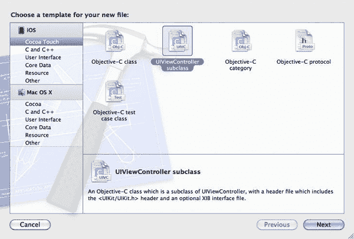

**图 8–6.** *子类化 `UIViewController`*

将你的子类命名为“EventAddViewController”，确保它会同时创建一个 XIB 文件，如图 8–7 所示。

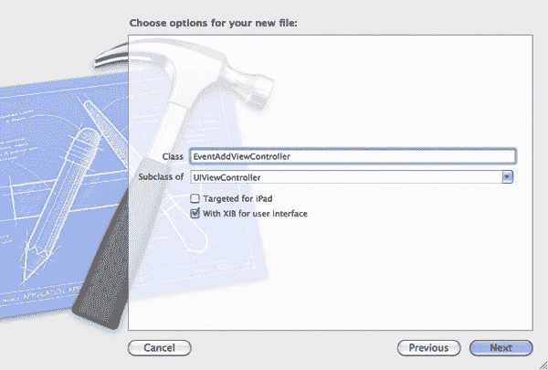

**图 8–7.** *配置你的新视图控制器*

将新视图控制器的 XIB 文件设置为类似于图 8–8 中的样式。

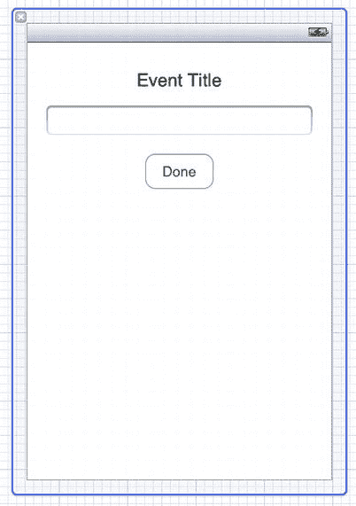

**图 8–8.** *用于创建事件的用户界面*

请记住，这里你使用了 `UITextField`，这意味着视图的下半部分在某个时刻会被键盘占据，因此你必须注意不要让任何内容被键盘不必要地遮挡。

将你的 `UITextField` 和 `UIButton` 分别使用属性名称 `textFieldTitle` 和 `doneButton` 连接到视图控制器的头文件。同时，定义一个名为 `-donePressed:` 的操作的头文件，如下所示，并将 `doneButton` 连接到该操作。

`-(IBAction)donePressed:(id)sender;`

与其让这个类处理 Event Kit 的具体工作，不如简单地让它将提交的字符串返回给委托视图控制器。为此，你首先必须声明一个供委托遵循的协议，方法是在头文件顶部添加以下协议声明：

```
@protocol EventAddViewControllerDelegate <NSObject>

-(void)EventAddViewController:(EventAddViewController *)controller
didSubmitTitle:(NSString *)title;

@end
```

你的编译器会报错，因为在对类进行声明之前就出现了对自身的循环引用，因此请在协议声明上方添加这行额外的代码，以确保编译器知道 `EventAddViewController` 实际上已经被声明。

`@class EventAddViewController;`

如前所述，由于你使用了 `UITextField`，你应该让新视图控制器遵循 `UITextFieldDelegate` 协议。请实现这一点。

最后，为这个视图控制器声明一个类型为 `id` 且遵循你的协议的属性，命名为 `delegate`。请像往常一样，确保在实现文件中正确合成并处理它。

`@property (strong, nonatomic) id <EventAddViewControllerDelegate> delegate;`

完整来说，你的头文件现在应如下所示：

```
#import <UIKit/UIKit.h>

@class EventAddViewController;

@protocol EventAddViewControllerDelegate <NSObject>
-(void)EventAddViewController:(EventAddViewController *)controller
didSubmitTitle:(NSString *)title;
@end

@interface EventAddViewController : UIViewController <UITextFieldDelegate>

@property (strong, nonatomic) IBOutlet UITextField *textFieldTitle;
@property (strong, nonatomic) IBOutlet UIButton *doneButton;
@property (strong, nonatomic) id <EventAddViewControllerDelegate> delegate;
-(IBAction)donePressed:(id)sender;

@end
```

这个视图控制器的实现将非常简单，因为其功能将完全由一个委托方法提供。

首先，你必须修改 `-viewDidLoad` 方法来设置你的 `UITextField` 的委托。

```
- (void)viewDidLoad
{
    [super viewDidLoad];
    self.textFieldTitle.delegate = self;
}
```

其次，你实现一个非常简单的 `UITextField` 委托方法来处理“return”按钮的按下。

```
-(BOOL)textFieldShouldReturn:(UITextField *)textField
{
    [textField resignFirstResponder];
    return NO;
}
```

最后，你实现 `-donePressed:` 方法来调用视图控制器的委托方法。

```
-(void)donePressed:(id)sender
{
    [self.delegate EventAddViewController:self didSubmitTitle:self.textFieldTitle.text];
}
```

现在你可以切换回 `MainViewController`。首先要记住的是，将新创建的协议添加到你的视图控制器中，这样，在最终阶段，你的头文件应如下所示：

```
#import <UIKit/UIKit.h>
#import <EventKit/EventKit.h>
#import <EventKitUI/EventKitUI.h>
#import "EventAddViewController.h"

@interface MainViewController : UIViewController <UITableViewDelegate,
UITableViewDataSource, EKEventViewDelegate, EKEventEditViewDelegate,
EventAddViewControllerDelegate>

@property (strong, nonatomic) IBOutlet UIToolbar *toolBarTop;

@property (nonatomic, strong) EKEventStore *eventStore;
@property (strong, nonatomic) IBOutlet UITableView *tableViewEvents;

@property (nonatomic, strong) NSMutableDictionary *events;
@property (nonatomic, strong) NSArray *calendars;
-(void)addPressed:(UIButton *)sender;
@end
```

现在你可以实现之前暗示过的 `-addPressed:` 方法来显示你的新视图控制器。

```
-(void)addPressed:(UIButton *)sender
{
    EventAddViewController *addVC = [[EventAddViewController alloc] init];
    addVC.delegate = self;
    [self presentModalViewController:addVC animated:YES];
}
```

最后，你可以创建你的 `EventAddViewController` 的委托方法，该方法将获取提交的字符串，并用它创建一个新事件。


```objc
- (void)EventAddViewController:(EventAddViewController *)controller
didSubmitTitle:(NSString *)title
{
    EKEvent *event = [EKEvent eventWithEventStore:self.eventStore];
    event.title = title;
    event.calendar = [self.eventStore defaultCalendarForNewEvents];
    event.startDate = [NSDate dateWithTimeIntervalSinceNow:60*60*24.0];
    event.endDate = [NSDate dateWithTimeInterval:60*60.0 sinceDate:event.startDate];
    [self.eventStore saveEvent:event span:EKSpanThisEvent error:nil];
    [self fetchEvents];
    [self.tableViewEvents reloadData];
    [self dismissModalViewControllerAnimated:YES];
}
```

为了演示，我选择了一种极其简单的方法来创建这些新事件。正如你所见，这种方法只是让所有以此方式创建的事件都提前一天，且仅持续一小时。在您的实际应用中，很可能需要选择更复杂的或基于用户输入的方法来创建 `EKEvent`。

**注意：** 我们在此处使用的代码可能会在 Xcode 中生成一条 "Could not load source: 6" 日志。无需为此担心，因为它不会妨碍你的应用正常运行。

## 秘籍 8–6：重复事件

Event Kit 框架为开发者提供了一个极其强大的 API，使其能够以编程方式处理重复事件。接下来，你将在前面秘籍的基础上进行扩展，让应用也能在你的日历中添加一个重复事件。

在你之前创建的 `-EventAddViewController:didSubmitTitle:` 方法中，你需要添加额外的代码，基于与普通事件相同的标题，来创建一个重复的 `EKEvent`。首先添加以下代码来配置这个新的 `EKEvent`。

```objc
EKEvent *recurringEvent = [EKEvent eventWithEventStore:self.eventStore];
    recurringEvent.title = [NSString stringWithFormat:@"Recurring %@", title];
    recurringEvent.calendar = [self.eventStore defaultCalendarForNewEvents];
    recurringEvent.startDate = [NSDate dateWithTimeIntervalSinceNow:60*60*24.0];
    recurringEvent.endDate = [NSDate dateWithTimeInterval:60*60.0
sinceDate:event.startDate];
```

接下来，你必须创建一个 `EKRecurrenceRule` 类的实例，并将其提供给你的事件。由于重复组合的可能性极为多样，这个类提供了一种极为灵活的方法来以编程方式实现重复事件。仅通过一个方法，开发者就能创建出几乎任何能想到的重复组合。我们将在此处定义一个稍微复杂一点的规则：

```objc
EKRecurrenceRule *rule = [[EKRecurrenceRule alloc]
                              initRecurrenceWithFrequency:EKRecurrenceFrequencyDaily
                              interval:2
                              daysOfTheWeek:[NSArray
arrayWithObjects:[EKRecurrenceDayOfWeek dayOfWeek:2], [EKRecurrenceDayOfWeek
dayOfWeek:3], nil]
                              daysOfTheMonth:nil
                              monthsOfTheYear:nil
                              weeksOfTheYear:nil
                              daysOfTheYear:nil
                              setPositions:nil
                              end:[EKRecurrenceEnd
recurrenceEndWithOccurrenceCount:20]];
```

然后，你可以通过下面这行代码将此规则添加到你的事件中。使用的 `recurrenceRules` 属性是从 iOS 5.0 开始从 `EKCalendarItem` 类继承而来的。

```objc
recurringEvent.recurrenceRules = [NSArray arrayWithObject:rule];
```

此方法每个参数的功能如下所述。对于任何参数，传入 `nil` 都表示不加以限制。

- `InitRecurrenceWithFrequency`：指定事件重复的基本频率，可以是每天、每周、每月或每年重复。
- `Interval`：根据频率指定重复的时间间隔。一个频率为每周、间隔为 3 的重复事件将每隔三周重复一次。
- `DaysOfTheWeek`：此属性接受一个 `NSArray` 对象数组，这些对象必须通过 `EKRecurrenceDayOfWeek` 的 `+dayOfWeek` 方法来获取。该方法接受一个代表星期几的整数参数，其中 1 表示星期日。通过设置此参数，开发者可以创建一个事件每隔几天重复一次，但仅当事件落在指定星期几时才会发生。
- `MonthsOfTheYear`：类似于 `DaysOfTheWeek`，此参数用于指定将重复事件限制在哪些月份。它仅对频率为年的事件有效。
- `WeeksOfTheYear`：与 `MonthsOfTheYear` 一样，此参数也仅适用于频率为年的事件，但限制的是具体的周数，而非月份。
- `DaysOfTheYear`：另一个仅限于每年重复事件的参数，它允许你仅指定某些天数（从年初或年末开始计算）来过滤特定事件。
- `SetPositions`：此参数是最终的过滤器，允许你将创建的事件完全限制在一年中的特定日期。例如，一个每天重复的事件可以通过此参数被限制为仅在某年的第 28 天、第 102 天和第 364 天发生，具体取决于开发者的选择。
- `End`：此参数需要对 `EKRecurrenceEnd` 类进行一次类调用，并指定你的事件何时停止重复。可供选择的两个类方法如下：
  - `+recurrenceEndWithEndDate`：允许开发者指定一个日期，在此日期之后事件将不再重复。
  - `+recurrenceEndWithOccurenceCount`：将事件的重复次数限制为有限的次数。

基于以上所有信息，你可以看到，我们为演示而创建的重复事件将每两天重复一次，但仅限于周一或周二，总共重复 20 次。

根据你所实现的不同功能，你应该能清楚地看到，使用 Event Kit 框架与用户的日程和事件进行交互是多么充满可能。无论你是希望允许用户与其日程进行交互，还是更喜欢通过编程在后台处理，实现目标所需的工具都唾手可得，而且尽管功能极其灵活，使用起来却异常简单。


### 食谱 8–7：基本通讯录访问

在任何现代设备中，最基本的功能之一就是存储联系人信息的能力，因此，你应该注意开发能够利用这些重要数据的应用。在本食谱中，你将学习访问和处理设备通讯录列表的三项基本功能。

首先，创建一个名为“Chapter8Recipe7”的新项目，类前缀设为“Main”，并使用“单视图应用程序”模板。

为本食谱，你需要在项目中添加两个额外的框架：`AddressBook.framework` 和 `AddressBookUI.framework`。

接下来，切换到视图控制器的 XIB 文件，创建一个与图 8–9 类似的视图。

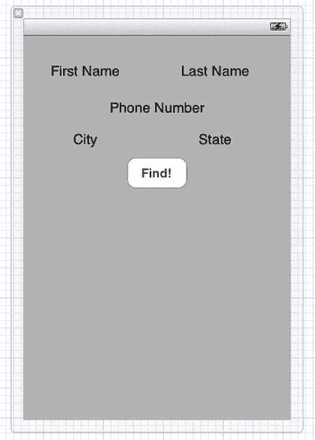

**图 8–9.** *用于访问联系人信息的 XIB 文件*

使用以下属性名称将这些元素连接到你的头文件：

* `firstLabel`
* `lastLabel`
* `phoneLabel`
* `cityLabel`
* `stateLabel`

你不需要为 `UIButton` 创建属性，因为在本食谱中无需对其进行任何修改。

在你的头文件中为按钮定义一个名为 `-findPressed:` 的动作，如下所示：

`-(IBAction)findPressed:(id)sender;`

现在接口已设置完毕，你需要确保头文件编写正确。首先，添加以下两个导入语句，以确保你可以使用通讯录和通讯录 UI 框架。

`#import <AddressBook/AddressBook.h>`
`#import <AddressBookUI/AddressBookUI.h>`

你将使用 `ABPeoplePickerNavigationController` 类的一个实例，并将其 `peoplePickerDelegate` 属性设置为你的视图控制器，因此需要在头文件中添加协议实现。让你的视图控制器遵循 `ABPeoplePickerNavigationControllerDelegate` 协议。现在，你的头文件完整内容应如下所示：

`#import <UIKit/UIKit.h>`
`#import <AddressBook/AddressBook.h>`
`#import <AddressBookUI/AddressBookUI.h>`

`@interface MainViewController : UIViewController`
`<ABPeoplePickerNavigationControllerDelegate>`

`@property (strong, nonatomic) IBOutlet UILabel *firstLabel;`
`@property (strong, nonatomic) IBOutlet UILabel *lastLabel;`
`@property (strong, nonatomic) IBOutlet UILabel *phoneLabel;`
`@property (strong, nonatomic) IBOutlet UILabel *stateLabel;`
`@property (strong, nonatomic) IBOutlet UILabel *cityLabel;`
`-(IBAction)findPressed:(id)sender;`
`@end`

切换到你的实现文件，实现一个简单的 `-viewDidLoad` 方法，用于重置 `UILabel` 上的文本。

```
- (void)viewDidLoad
{
    [super viewDidLoad];
    self.firstLabel.text = @"...";
    self.lastLabel.text = @"...";
    self.phoneLabel.text = @"...";
    self.cityLabel.text = @"...";
    self.stateLabel.text = @"...";
}
```

你将实现之前定义的 `-findPressed:` 方法，用于创建 `ABPeoplePickerNavigationController` 的实例，设置其委托，然后以模态方式呈现它。

```
-(void)findPressed:(id)sender
{
    ABPeoplePickerNavigationController *picker =[[ABPeoplePickerNavigationController alloc] init];
    picker.peoplePickerDelegate = self;
    [self presentModalViewController:picker animated:YES];
}
```

现在你只需要创建委托方法，其中需要实现三个方法。第一个也是最简单的方法，用于处理选择器控制器被取消的情况。

```
-(void)peoplePickerNavigationControllerDidCancel:(ABPeoplePickerNavigationController *)peoplePicker
{
    [self dismissModalViewControllerAnimated:YES];
}
```

接下来，你将定义主要的委托方法，用于处理联系人的选择。我们将逐步讲解该方法实现的每个部分。

首先，你的方法头如下所示：

`-(BOOL)peoplePickerNavigationController:(ABPeoplePickerNavigationController *)peoplePicker shouldContinueAfterSelectingPerson:(ABRecordRef)person`

关于这个方法头，你可能注意到的第一件奇怪的事情是变量 `person` 的类型是 `ABRecordRef`，它后面没有“*”。这基本上意味着 `person` 不是一个指针，因此不会用于调用方法。相反，你将使用预定义的函数来利用和访问它。正如你将看到的，通讯录框架的许多部分都采用了这种更“基于 C 语言”的风格。

在方法体内部，你将首先执行最简单的访问，即所选联系人的名字和姓氏。

```
self.firstLabel.text = (__bridge_transfer NSString *)ABRecordCopyValue(person, kABPersonFirstNameProperty);
self.lastLabel.text = (__bridge_transfer NSString *)ABRecordCopyValue(person, kABPersonLastNameProperty);
```

在本节中，`ABRecordCopyValue()` 函数将是用于任何类型数据访问的首选调用。它接受两个参数，第一个参数是你想要访问的 `ABRecordRef`，第二个参数是一个预定义的 `PropertyID`，用于指示函数检索哪一部分数据。

该函数可以处理两种类型的值：单值和多值。对于前两次调用，你只处理单值，`ABRecordCopyValue()` 函数返回的类型是 `CFStringRef`。你可以在值前面添加 `(__bridge_transfer NSString *)` 代码，将其转换为 `NSString`。

`__bridge_transfer` 命令是 iOS 5 中配合自动引用计数（ARC）引入的新命令，它简单地指定 ARC 现在将处理被“桥接”的值。

接下来你可以访问的是联系人的电话号码，这是一个多值。多值通常用于可以给出多个条目的联系人属性，例如地址、电话号码或电子邮件。当你复制它时，你将收到一个类型为 `ABMultiValueRef` 的变量，然后你可以使用它来访问特定的值。

```
ABMultiValueRef multi = ABRecordCopyValue(person, kABPersonPhoneProperty);
CFStringRef phoneNumber = ABMultiValueCopyValueAtIndex(multi, 0);
self.phoneLabel.text = (__bridge_transfer NSString *)phoneNumber;
CFRelease(phoneNumber);
```

通过使用 `ABMultiValueCopyValueAtIndex(multi, 0);` 调用，你指定了要获取给定用户存储的第一个电话号码。然后，你可以像之前一样设置标签的文本。

由于你创建了一个新的 `CFStringRef` `phoneNumber` 来指向你的值，你应该使用 `CFRelease()` 命令来释放它，如前面的代码片段所示。

接下来要处理的多值是所选联系人的主地址。处理地址时，需要额外一步，因为地址是作为 `CFDictionary` 存储的。你将再次使用 `ABMultiValueCopyValueAtIndex()` 函数检索这个字典，然后查询其值：

```
ABMultiValueRef address = ABRecordCopyValue(person, kABPersonAddressProperty);
    if (ABMultiValueGetCount(address) > 0)
    {
        CFDictionaryRef dictionary = ABMultiValueCopyValueAtIndex(address, 0);
        CFStringRef cityKey = kABPersonAddressCityKey;
        CFStringRef stateKey = kABPersonAddressStateKey;
        self.cityLabel.text = (__bridge_transfer NSString *)CFDictionaryGetValue(dictionary, (void *)cityKey);
        self.stateLabel.text = (__bridge_transfer NSString *)CFDictionaryGetValue(dictionary, (void *)stateKey);

        CFRelease(dictionary);
        CFRelease(cityKey);
        CFRelease(stateKey);
    }
    else
    {
        self.cityLabel.text = @"...";
        self.stateLabel.text = @"...";
    }
```

最后，你可以关闭你的模态视图控制器，并为该方法添加返回值。整体来看，你的方法应如下所示：


`-(BOOL)peoplePickerNavigationController:(ABPeoplePickerNavigationController *)peoplePicker shouldContinueAfterSelectingPerson:(ABRecordRef)person
{
    self.firstLabel.text = (__bridge_transfer NSString *)ABRecordCopyValue(person, kABPersonFirstNameProperty);
    self.lastLabel.text = (__bridge_transfer NSString *)ABRecordCopyValue(person, kABPersonLastNameProperty);

    ABMultiValueRef multi = ABRecordCopyValue(person, kABPersonPhoneProperty);
    CFStringRef phoneNumber = ABMultiValueCopyValueAtIndex(multi, 0);
    self.phoneLabel.text = (__bridge_transfer NSString *)phoneNumber;
    CFRelease(phoneNumber);

    ABMultiValueRef address = ABRecordCopyValue(person, kABPersonAddressProperty);
    if (ABMultiValueGetCount(address) > 0)
    {
        CFDictionaryRef dictionary = ABMultiValueCopyValueAtIndex(address, 0);
        CFStringRef cityKey = kABPersonAddressCityKey;
        CFStringRef stateKey = kABPersonAddressStateKey;
        self.cityLabel.text = (__bridge_transfer NSString *)CFDictionaryGetValue(dictionary, (void *)cityKey);
        self.stateLabel.text = (__bridge_transfer NSString *)CFDictionaryGetValue(dictionary, (void *)stateKey);

        CFRelease(dictionary);
        CFRelease(cityKey);
        CFRelease(stateKey);
    }
    else
    {
        self.cityLabel.text = @"...";
        self.stateLabel.text = @"...";
    }

    [self dismissModalViewControllerAnimated:YES];
    return NO;
}
`
为了正确遵循协议，你必须实现第三个方法，该方法处理特定联系人属性的选择。然而，由于本示例在选中联系人后直接返回，此方法实际上不会被调用。你将为其提供一个简单的实现，类似于你的取消方法。

```
-(BOOL)peoplePickerNavigationController:(ABPeoplePickerNavigationController *)peoplePicker shouldContinueAfterSelectingPerson:(ABRecordRef)person property:(ABPropertyID)property identifier:(ABMultiValueIdentifier)identifier
{
    [self dismissModalViewControllerAnimated:YES];
    return NO;
}
```

**注意：** 当你从`ABRecordRef`复制值时，务必像处理地址那样，添加检查以确保值存在。前面的代码假设名字、姓氏和电话号码都存在，但空查询可能导致你的应用程序抛出异常。

现在，你的应用程序应该能够访问通讯录、选择用户，并显示你查询到的信息，如图 8–10 和图 8–11 所示。

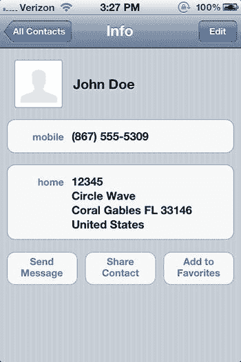

**图 8–10.** *通讯录联系人列表*

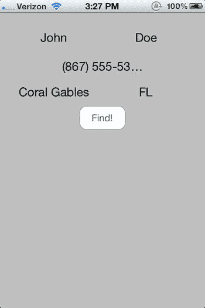

**图 8–11.** *你的应用程序显示的联系人信息*

虽然我们尚未包含访问`ABRecordRef`所有可能值的代码，但你应该能够使用所调用函数的任意组合，来访问你需要的任何值。

### 配方 8–8：设置联系人信息

与读取值同等重要的是能够设置值。为此，你将实现两种不同的方法，用于创建和设置联系人的值，并将其添加到设备的通讯录中。

首先，使用“Single View Application”模板创建一个名为“Chapter8Recipe8”的新项目，类前缀设为“Main”。

像之前一样，将`AddressBook.framework`和`AddressBookUI.framework`添加到你的项目中。

我们将从一个极其简单的用户界面开始，该界面允许用户自行创建新联系人。因此，在视图控制器的 XIB 文件中，添加一个连接到名为`-newContactPressed:`的操作的`UIButton`，如图 8–12 所示。

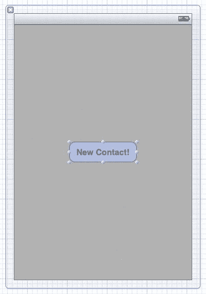

**图 8–12.** *用于创建联系人的简单 XIB 设置*

接下来，你需要将框架导入到你的头文件中，并配置视图控制器的协议以遵循。让你的视图控制器遵循`ABNewPersonViewControllerDelegate`协议，然后添加通常的两条导入语句。

```
#import <AddressBook/AddressBook.h>
#import <AddressBookUI/AddressBookUI.h>
```

现在，你将创建一个极其简单的实现，只需定义两个方法：处理按钮选择的操作方法，以及`ABNewPersonViewController`的代理方法。

你的操作方法将如下所示：

```
-(void)newContactPressed:(id)sender
{
    ABNewPersonViewController *view = [[ABNewPersonViewController alloc] init];
    view.newPersonViewDelegate = self;

    UINavigationController *newNavigationController = [[UINavigationController alloc] initWithRootViewController:view];
    [self presentModalViewController:newNavigationController animated:YES];
}
```

这是代理方法：

```
-(void)newPersonViewController:(ABNewPersonViewController *)newPersonView didCompleteWithNewPerson:(ABRecordRef)person
{
    if (person == NULL)
    {
        NSLog(@"用户取消了创建");
    }
    else
        NSLog(@"成功创建新联系人");
    [self dismissModalViewControllerAnimated:YES];
}
```

与你处理的大多数模态视图控制器不同，`ABNewPersonViewController`只有一个代理方法，同时处理成功和取消两种情况，而其他控制器通常为每种情况各有一个方法。如你所见，你可以通过检查`ABRecordRef`参数`person`是否为`NULL`来区分每种结果。由于此参数不是指针，因此你需要将其与`NULL`值进行比较，而不是`nil`。

此时，你应该能够允许用户创建新联系人并添加到通讯录中，正如你的模拟应用在图 8–13 中所示。

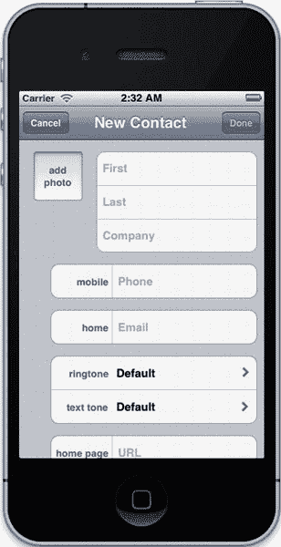

**图 8–13.** *空白的`ABNewPersonViewController`*

虽然你为用户提供了极大的灵活性，让他们可以自行设置联系人的各项信息，但这也意味着他们需要手动输入所有想要的值。接下来，你将学习如何通过编程方式创建记录并设置其值。

首先，修改你的用户界面，添加一系列`UITextField`控件，每个控件都包含一个描述其用途的`Placeholder`文本值，类似于图 8–14。

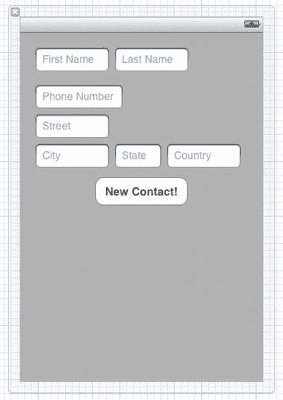

**图 8–14.** *用于指定新联系人信息的用户界面*

将每个`UITextField`连接到你的头文件，并分别使用以下属性名称：

* `textFieldFirst`
* `textFieldLast`
* `textFieldPhone`
* `textFieldStreet`
* `textFieldCity`
* `textFieldState`
* `textFieldZip`


现在，你可以实现代码来创建新联系人。为此，必须通过`ABPersonCreate()`函数获取`ABRecordRef`，然后设置其值。整体代码如下所示，可将其添加到`-newContactPressed:`方法中。

```
ABMutableMultiValueRef multi =
    ABMultiValueCreateMutable(kABMultiStringPropertyType);
    CFErrorRef anError = NULL;
    ABMultiValueIdentifier multivalueIdentifier;
    bool didAdd, didSet;

    didAdd = ABMultiValueAddValueAndLabel(multi, (__bridge
CFStringRef)self.textFieldPhone.text,
                                          kABPersonPhoneMobileLabel,
&multivalueIdentifier);
    if (!didAdd)
    {
        NSLog(@"Error Adding Phone Number");
    }

    ABRecordRef aRecord = ABPersonCreate();

    ABRecordSetValue(aRecord, kABPersonFirstNameProperty, (__bridge
CFStringRef)self.textFieldFirst.text, nil);
    ABRecordSetValue(aRecord, kABPersonLastNameProperty, (__bridge
CFStringRef)self.textFieldLast.text, nil);

    didSet = ABRecordSetValue(aRecord, kABPersonPhoneProperty, multi, &anError);
    if (!didSet)
    {
        NSLog(@"Error Setting Phone Value");
    }
    CFRelease(multi);

    ABMutableMultiValueRef address =
    ABMultiValueCreateMutable(kABDictionaryPropertyType);

    // 为字典设置键和值。
    CFStringRef keys[5];
    CFStringRef values[5];
    keys[0] = kABPersonAddressStreetKey;
    keys[1] = kABPersonAddressCityKey;
    keys[2] = kABPersonAddressStateKey;
    keys[3] = kABPersonAddressZIPKey;
    keys[4] = kABPersonAddressCountryKey;
    values[0] = (__bridge CFStringRef)self.textFieldStreet.text;
    values[1] = (__bridge CFStringRef)self.textFieldCity.text;
    values[2] = (__bridge CFStringRef)self.textFieldState.text;
    values[3] = (__bridge CFStringRef)self.textFieldZip.text;
    values[4] = CFSTR("USA");

    CFDictionaryRef aDict = CFDictionaryCreate(kCFAllocatorDefault,(void *)keys,
                                               (void *)values,5,
                                               &kCFCopyStringDictionaryKeyCallBacks,
                                               &kCFTypeDictionaryValueCallBacks);

    ABMultiValueIdentifier dictionaryIdentifier;
    bool didAddAddress;
    didAddAddress = ABMultiValueAddValueAndLabel(address, aDict, kABHomeLabel,
&dictionaryIdentifier);
    if (!didAddAddress)
    {
        NSLog(@"Error Adding Address");
    }

    CFRelease(aDict);

    ABRecordSetValue(aRecord, kABPersonAddressProperty, address, nil);
```

通过检查这段代码，你可以看到创建和设置每种属性类型（从单值、多值到基于字典的地址多值）的不同技术。

和之前一样，你必须使用`__bridge`命令来将你的`NSString`变量移出 ARC。

你有两种选择来实现设备上新联系人的创建。一种非常用户友好的方法是像之前一样加载`ABNewPersonViewController`，但这次将已创建的`ABPersonRef`传递给它以供其填充。你可以通过设置控制器的`displayedPerson`属性来实现，添加如下代码行。

```
    view.displayedPerson = aRecord;
```

如果选择此选项，你的应用将显示如图 8-15 所示的视图来创建新联系人。请注意，新联系人的信息必须由用户批准才能完成创建。如果“完成”按钮显示为灰色，请点击编辑联系人中的任何文本字段。

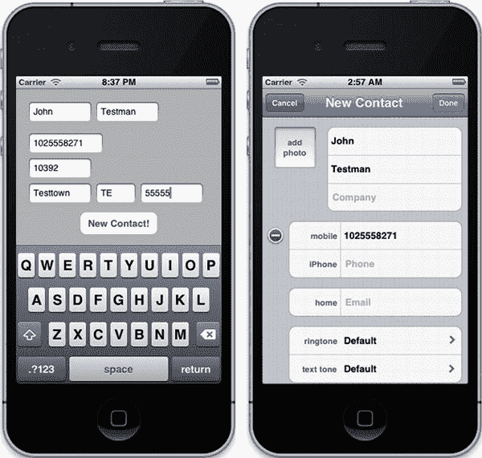

**图 8–15.** *左侧为你的应用指定新联系人信息，右侧为创建的联系人结果*

第二个选项是放弃使用`ABNewPersonViewController`，直接以编程方式创建联系人，从而省去用户批准联系的额外步骤。由于你已经拥有`ABPersonRef`，实际上只需几行代码即可完成，这些代码将替换设置和显示`ABNewPersonViewController`的代码。

```
ABAddressBookRef addressBook = ABAddressBookCreate();
ABAddressBookAddRecord(addressBook, aRecord, nil);
ABAddressBookSave(addressBook, nil);
```

`ABAddressBookCreate()`函数非常简单，它返回设备通讯录的`ABAddressBookRef`。使用`ABAddressBookAddRecord()`添加记录后，只需保存更改即可。

无论选择哪个选项，你仍然需要在方法结束前释放两个变量，如下所示：

```
CFRelease(aRecord);
CFRelease(address);
```


# 配方 8–9：查看联系人

在介绍了如何访问和设置值之后，下一步非常简单的操作是讨论如何设置一个视图控制器来查看联系人的详细信息。

在一个名为 `Chapter8Recipe9` 的新项目中，使用类前缀 `MainViewController`，在导入 Address Book 和 Address Book UI 框架并为每个框架添加相应的 `#import` 语句后，向你的视图控制器添加一个 `UITableView`。使用属性名 `tableViewContacts` 将其连接到你的头文件。同时让你的视图控制器遵循 `UITableViewDelegate`、`UITableViewDataSource` 和 `ABPersonViewControllerDelegate` 协议。

创建一个类型为 `(NSArray *)` 的属性，名为 `contacts`，用于存储你的联系人列表。

总体而言，你的头文件应该如下所示：

```
#import <UIKit/UIKit.h>
#import <AddressBook/AddressBook.h>
#import <AddressBookUI/AddressBookUI.h>

@interface MainViewController : UIViewController <UITableViewDelegate, UITableViewDataSource, ABPersonViewControllerDelegate>

@property (strong, nonatomic) IBOutlet UITableView *tableViewContacts;
@property (strong, nonatomic) NSArray *contacts;
@end
```

在继续之前，你需要将你的主视图控制器放入一个 `UINavigationController` 中。切换到你的应用委托的实现文件，并将你的 `-application:DidFinishLaunchingWithOptions:` 方法修改为如下所示：

```
- (BOOL)application:(UIApplication *)application
didFinishLaunchingWithOptions:(NSDictionary *)launchOptions
{
    self.window = [[UIWindow alloc] initWithFrame:[[UIScreen mainScreen] bounds]];
    // 应用启动后的自定义覆盖点。
    self.viewController = [[MainViewController alloc]
initWithNibName:@"MainViewController" bundle:nil];
    UINavigationController *navcon = [[UINavigationController alloc]
initWithRootViewController:self.viewController];
    self.window.rootViewController = navcon;
    [self.window makeKeyAndVisible];
    return YES;
}
```

现在，回到视图控制器的实现文件，创建一个更新联系人数组的方法，如下所示：

```
-(void)updateContacts
{
    ABAddressBookRef addressBook = ABAddressBookCreate();
    CFArrayRef people = ABAddressBookCopyArrayOfAllPeople(addressBook);
    self.contacts = (__bridge NSArray *)people;
    CFRelease(people);
}
```

这将使你的 `-viewDidLoad` 方法实现起来非常简单。

```
- (void)viewDidLoad
{
    [super viewDidLoad];

    self.tableViewContacts.delegate = self;
    self.tableViewContacts.dataSource = self;
    self.title = @"联系人表格";
    [self updateContacts];
}
```

你还应该修改你的 `-viewWillAppear:` 方法，以便在应用程序外部发生任何更改时刷新你的表格。

```
- (void)viewWillAppear:(BOOL)animated
{
    [self updateContacts];
    [self.tableViewContacts reloadData];
    [super viewWillAppear:animated];
}
```

现在实现你的 `UITableView` 数据源方法。你需要一个方法来指定你拥有的行数：

```
-(NSInteger)tableView:(UITableView *)tableView numberOfRowsInSection:(NSInteger)section
{
    return [[NSNumber numberWithInt:[self.contacts count]] intValue];
}
```

基于你在之前配方中使用的访问代码，你将有一个相当简单的方法来创建你的单元格。

```
-(UITableViewCell *)tableView:(UITableView *)tableView
cellForRowAtIndexPath:(NSIndexPath *)indexPath
{
    static NSString *CellIdentifier = @"Cell";

    UITableViewCell *cell = [tableView
dequeueReusableCellWithIdentifier:CellIdentifier];
    if (cell == nil)
    {
         cell = [[UITableViewCell alloc] initWithStyle:UITableViewCellStyleValue1
reuseIdentifier:CellIdentifier];
    }

    cell.accessoryType = UITableViewCellAccessoryDisclosureIndicator;
    cell.textLabel.backgroundColor = [UIColor clearColor];
    cell.textLabel.font = [UIFont systemFontOfSize:19.0];

    ABRecordRef current = (__bridge ABRecordRef)[self.contacts
objectAtIndex:indexPath.row];

    NSString *firstName = (__bridge_transfer NSString *)ABRecordCopyValue(current,
kABPersonFirstNameProperty);
    NSString *lastName = (__bridge_transfer NSString *)ABRecordCopyValue(current,
kABPersonLastNameProperty);

    cell.textLabel.text = [NSString stringWithFormat:@"%@ %@", firstName, lastName];

    return cell;
}
```

你需要实现的第三个数据源方法用于单元格的选中，这将显示一个包含所选联系人信息的 `ABPersonViewController` 实例。

```
-(void)tableView:(UITableView *)tableView didSelectRowAtIndexPath:(NSIndexPath
*)indexPath
{
    ABRecordRef chosen = (__bridge ABRecordRef)[self.contacts
objectAtIndex:indexPath.row];

    ABPersonViewController *view = [[ABPersonViewController alloc] init];
    view.personViewDelegate = self;
    view.displayedPerson = chosen;
    view.allowsEditing = NO;

    [self.navigationController pushViewController:view animated:YES];
    [tableView deselectRowAtIndexPath:indexPath animated:NO];
}
```

最后，你只需要实现 `ABPersonViewController` 的代理方法，处理属性的选中。该方法可以简单地返回一个 BOOL 值，该值将决定用户是否能够从你的应用程序中拨打或发送短信给一个电话号码，或执行任何其他值的默认属性操作。

```
-(BOOL)personViewController:(ABPersonViewController *)personViewController
shouldPerformDefaultActionForPerson:(ABRecordRef)person property:(ABPropertyID)property
identifier:(ABMultiValueIdentifier)identifier
{
    return YES;
}
```

假设你的联系人列表中只列出了个人，而没有群组，你的应用程序应该有一个非常基本的表格视图，显示手机上所有联系人的姓名。图 8–16 展示了在你自定义的联系人列表中选择一条记录后的结果视图。当处理一个你不确定是 `ABPersonRef` 还是 `ABGroupRef` 的 `ABRecordRef` 时，你应该始终包含代码来检查每种情况并相应处理。

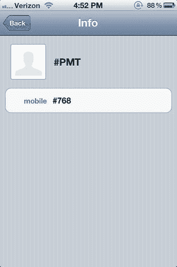

**图 8–16.** *在表格中选择一行后显示的联系人信息*

### 总结

如你所见，与任何特定用户的个人数据进行交互有着种类繁多的方法和功能。从重复事件，到多个日历，再到大多数用户拥有的海量联系人和电话号码，所有这些信息都可以用来为每个客户个性化应用，同时为所有客户进行通用开发。在用户体验方面，能够访问、显示和编辑所有这些信息，使我们作为开发者能够创建更强大、更独特、更有用的应用程序，最终将转化为更满意的客户和更高质量的产品。

## 第 9 章

## UITableView 配方

每一天，每时每刻，我们都在接收信息。无论是视频、广播、音乐、电子邮件、140 个字符的消息，甚至是视觉和声音，总有新的数据需要获取和处理。作为开发者，我们通过数据组织和展示，致力于在信息和最终用户之间创建并管理媒介。我们必须能够获取可用的海量信息流，并将其处理成简洁明了、符合特定受众兴趣的内容。除此之外，我们还必须让数据在视觉上具有吸引力，同时保持效率和条理性。在 iOS 开发中，实现这一目标最强大的工具之一就是 `UITableView`：一种极其灵活但又简单的界面，旨在为开发者和客户提供易用性。在本章中，我们将重点介绍创建、实现和定制这些实用工具的分步方法。


### 配方 9-1：创建无分组表格

在 iOS 中，你可以使用两种 `UITableView`：**分组表格**和**无分组表格**。具体使用哪一种取决于具体的应用程序需求，但我们将从无分组表格入手，因为它更容易实现。

为了构建一个功能完整且可定制的基于 `UITableView` 的应用程序，你将从一个空应用程序开始，逐步构建出一个能够显示各国信息的实用表格。新建一个项目，选择**空应用程序**模板，如图 9-1 所示。这样你只会得到一个应用程序委托，你可以在此基础上构建所有视图控制器。

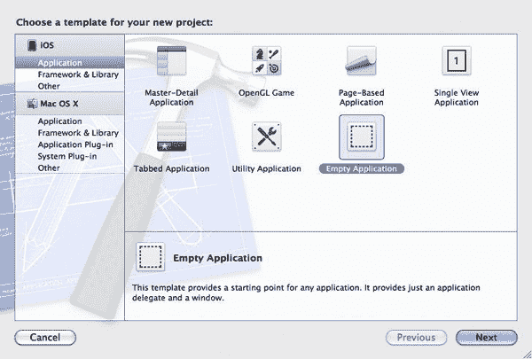

**图 9-1.** 选择空应用程序以从头开始

你将在本章中全程使用同一个项目，因此不必按照配方名称来命名项目，而是根据你的喜好命名（我选择了 "Countries"，因为该应用程序将专注于显示不同国家的信息），然后创建项目。我使用了类前缀 "Main"，它仅会应用于你的应用程序委托文件，因为你使用的是空应用程序。

由于你使用了空应用程序，你需要从创建主视图控制器开始，该控制器将包含你的 `UITableView`。

新建一个文件，选择 **UIViewController Subclass** 模板。

在下一个屏幕上，为你的视图控制器输入一个名称，并确保该类是 `UIViewController` 的子类。将其命名为 `MainTableViewController`。

**注意：** 有些人可能认为创建 `UITableViewController` 的子类更方便，因为你会立即获得一个 `UITableView` 以及使用它所需的一些方法。这种方法的缺点是，控制器 XIB 文件中提供的 `UITableView` 更难配置和调整框架。因此，你将使用 `UIViewController` 的子类，并自行添加 `UITableView` 及其方法。

由于你将专注于应用程序中表格的概念，首先从库中拖拽一个 `UITableView` 到你的视图中。为了让表格不占满整个视图，你可以将其稍微缩小，并在四周保留 20 点的边距。切换到主视图，将背景颜色改为浅灰色，以便与 `UITableView` 区分开。最终显示效果将如图 9-2 所示。

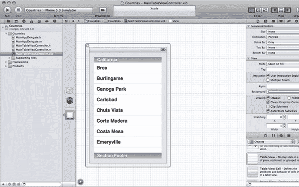

**图 9-2.** 在 XIB 文件中配置 `UITableView`

使用属性名 `tableViewCountries` 将你的 `UITableView` 连接到头文件中的属性。

接下来，切换到视图控制器的头文件。你需要让你的视图控制器遵循几个协议，以便完全实现你的 `UITableView`。添加 `UITableViewDelegate` 和 `UITableViewDataSource` 协议，这样你的头文件现在看起来如下：

```
@interface MainTableViewController : UIViewController <UITableViewDelegate, UITableViewDataSource>
```

接着，你需要一个类型为 `NSArray` 的属性，用于存储显示表格信息所需的数据，命名为 `countries`。确保正确合成该数组，并在 `-viewDidUnload` 方法中将其指针设为 `nil`。

```
@property (strong, nonatomic) NSMutableArray *countries;
```

在继续实现你的视图控制器之前，你需要设置好模型来存储数据。

像之前一样新建一个文件，但选择 "Objective-C class" 模板。将你的类命名为 `Country`，并确保它是 `NSObject` 的子类，如图 9-3 所示。

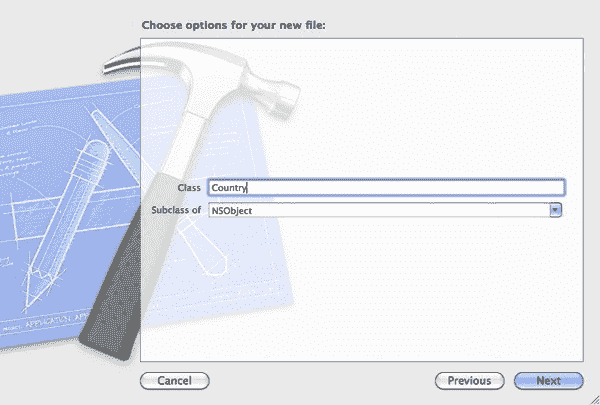

**图 9-3.** 创建 `Country` 类作为 `NSObject` 的子类

对于你的应用程序，你将让 `Country` 对象拥有四个属性：三个 `NSString` 分别表示国家名称、首都和格言，以及一个包含该国国旗的 `UIImage`。在 `Country.h` 头文件中按如下方式定义这些属性：

```
@property (nonatomic, strong) NSString *name;
@property (nonatomic, strong) NSString *capital;
@property (nonatomic, strong) NSString *motto;
@property (nonatomic, strong) UIImage *flag;
```

与你的视图控制器一样，你需要在实现文件中合成所有这些属性。但与视图控制器不同的是，你无需在任何方法中将它们设为 `nil`，因为没有 `-viewDidUnload` 方法。

```
@synthesize name, capital, motto, flag;
```

现在模型已设置好，你可以返回视图控制器了。编译器需要能够访问你刚刚创建的 `Country` 类的方法，因此在视图控制器的头文件中添加以下导入语句。

```
#import "Country.h"
```

现在，你可以设置要在 `UITableView` 中使用的数据了。在继续之前，请确保你已下载了要添加的国家所使用的国旗图片文件。这里，我将使用美国、英格兰（而非英国）、苏格兰、法国和西班牙的国旗。我使用了一些来自维基百科的公共领域国旗图片，更多图片可在 [`http://en.wikipedia.org/wiki/Gallery_of_country_flags`](http://en.wikipedia.org/wiki/Gallery_of_country_flags) 找到。

**注意：** 在处理图片时，请务必留意所有版权问题。公共领域图片（例如此处来自维基百科的图片）可以免费使用，且容易找到。

将所有文件下载到 Finder 中后，选中它们并全部拖入 Xcode 项目中 "Supporting Files" 文件夹下。将出现一个对话框，提供将文件添加到项目的选项。确保勾选了 "Copy items into destination group's folder (if needed)" 选项，如图 9-4 所示。

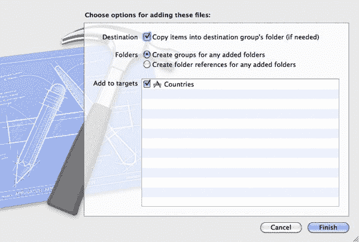

**图 9-4.** 添加文件的对话框；确保第一个复选框已勾选。

在你的 `-viewDidLoad` 方法中，通过添加以下代码，用我之前提到的五个国家创建测试数据：

```
Country *usa = [[Country alloc] init];
usa.name = @"United States of America";
usa.motto = @"E Pluribus Unum";
usa.capital = @"Washington, D.C.";
usa.flag = [UIImage imageNamed:@"usa.png"];

Country *france = [[Country alloc] init];
france.name = @"French Republic";
france.motto = @"Liberté, Égalité, Fraternité";
france.capital = @"Paris";
france.flag = [UIImage imageNamed:@"france.png"];

Country *england = [[Country alloc] init];
england.name = @"England";
england.motto = @"Dieu et mon droit";
england.capital = @"London";
england.flag = [UIImage imageNamed:@"england.png"];

Country *scotland = [[Country alloc] init];
scotland.name = @"Scotland";
scotland.motto = @"In My Defens God Me Defend";
scotland.capital = @"Edinburgh";
scotland.flag = [UIImage imageNamed:@"scotland.png"];

Country *spain = [[Country alloc] init];
spain.name = @"Kingdom of Spain";
spain.motto = @"Plus Ultra";
spain.capital = @"Madrid";
spain.flag = [UIImage imageNamed:@"spain.png"];
```

确保使用以下代码行将所有 `Country` 对象添加到你的数组中：

```
self.countries = [NSMutableArray arrayWithObjects:usa, france, england, scotland, spain, nil];
```

现在测试数据已全部设置完毕，接下来你将专注于通过使用 `delegate` 和 `data source` 方法来构建你的 `UITableView`。首先，在 `-viewDidLoad` 中使用以下代码行将这两个属性设置为你的视图控制器。


`self.tableViewCountries.delegate = self;`  
`self.tableViewCountries.dataSource = self;`

你也可以通过一条简单的命令为视图控制器设置标题，该标题将显示在导航栏顶部。

`self.title = @"Countries";`

为了便于组织，`UITableView` 可以调用的所有方法分为两组：`delegate` 方法和 `data source` 方法。`Delegate` 方法用于处理 `UITableView` 的任何视觉元素，例如单元格的行高。而 `data source` 方法则处理 `UITableView` 中显示的信息，例如任意给定单元格信息的配置。

为了正确创建一个无分组的 `UITableView`，你必须正确实现两个主要方法。

首先，你需要通过 `-tableView:numberOfRowsInSection:` 方法指定 `UITableView` 中要显示的行数。

```
-(NSInteger)tableView:(UITableView *)tableView numberOfRowsInSection:(NSInteger)section
{
    return [self.countries count];
}
```

由于你的表格是无分组的，只有一个分区，因此这个方法非常简单易用。

其次，你必须创建一个方法，通过 `-tableView:cellForRowAtIndexPath:` 方法指定 `UITableView` 的单元格如何配置。以下是该方法的通用实现，你可以根据数据进行修改。

```
- (UITableViewCell *)tableView:(UITableView *)tableView cellForRowAtIndexPath:(NSIndexPath *)indexPath
{
    static NSString *CellIdentifier = @"Cell";

    UITableViewCell *cell = [tableView dequeueReusableCellWithIdentifier:CellIdentifier];
    if (cell == nil)
    {
        cell = [[UITableViewCell alloc] initWithStyle:UITableViewCellStyleDefault reuseIdentifier:CellIdentifier];
        cell.accessoryType = UITableViewCellAccessoryDisclosureIndicator;
        cell.textLabel.font = [UIFont systemFontOfSize:19.0];
        cell.detailTextLabel.font = [UIFont systemFontOfSize:12];
    }

    cell.textLabel.text=[NSString stringWithFormat:@"Cell %i", indexPath.row];

    return cell;
}
```

每当你处理 `UITableView` 时，“复用”单元格几乎总是一个好主意。由于大多数情况下，`UITableView` 中并非所有单元格都同时显示在用户视野中，你可以通过 `UITableView` 方法 `-dequeueReusableCellWithIdentifier:` 复用当前未显示的单元格，从而节省内存和时间，因为你只需在初始创建单元格时执行任何通用设置（如字体大小、背景颜色等）。

在上面的示例中，你可以看到首先尝试出列一个可复用的单元格。如果没有可用的（即 `cell` 为 `nil`），则创建一个新单元格并为其进行通用设置，这些设置可以用于所有单元格。然后，无论单元格是出列还是新建的，你都将文本更新为适当的值。

你甚至可以通过 `CellIdentifier` 设置多个配置不同的单元格，并指定使用或复用哪一个。

要让程序运行起来，最后需要做的是确保应用程序委托在程序启动时呈现你的视图控制器。Xcode 没有自动完成这一步，因为你选择了空模板。

在你的应用程序委托实现中，导入视图控制器的头文件，这样编译器就不会报错。

```
#import "MainTableViewController.h"
```

你需要在应用程序委托的头文件中设置属性，以存储你的 `UINavigationController` 和主视图控制器。请按如下方式创建：

```
@property (nonatomic, strong) UINavigationController *navcon;
@property (nonatomic, strong) MainTableViewController *tableVC;
```

确保在应用程序委托的实现文件中使用以下代码对两者进行合成。

```
@synthesize navcon, tableVC;
```


现在你只需要创建你的 `UINavigationController` 来显示和管理视图控制器，并将其视图添加为应用窗口的子视图。总的来说，你的 `-application:didFinishLaunchingWithOptions:` 方法应该如下所示：

```
- (BOOL)application:(UIApplication *)application didFinishLaunchingWithOptions:(NSDictionary *)launchOptions
{
    self.window = [[UIWindow alloc] initWithFrame:[[UIScreen mainScreen] bounds]];
    self.tableVC = [[MainTableViewController alloc] init];
    self.navcon = [[UINavigationController alloc] initWithRootViewController:tableVC];
    [self.window addSubview:navcon.view];
    [self.window makeKeyAndVisible];
    return YES;
}
```

在模拟器中运行该项目时，你将看到一个包含一些通用信息的 `UITableView` 基本视图，如图 图 9–5 所示。

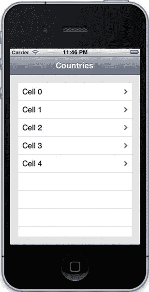

**图 9–5.** *包含 `UITableView` 的基本应用*

现在你的应用已经启动并运行，并且显示了一些信息，你可以进行具体的实现了。

要配置你的 `-tableView:cellForRowAtIndexPath:` 方法，使其正确适配你的数据，首先需要更改行的显示样式。修改方法中的分配/初始化行，使其如下所示：

```
cell = [[UITableViewCell alloc] initWithStyle:UITableViewCellStyleSubtitle
reuseIdentifier:CellIdentifier];
```

有四种不同的 `UITableViewCell` 样式可供使用，每种样式的显示略有不同：

* `UITableViewCellStyleDefault`：仅有一个标签，如图 图 9–5 所示
* `UITableViewCellStyleSubtitle`：与 Default 样式类似，但在主文本下方多了一个副标题行
* `UITableViewCellStyleValue1`：两行文本，主文本位于单元格左侧，次要详细文本标签位于右侧
* `UITableViewCellStyleValue2`：两行文本，重点在详细文本标签上

在这四种样式中，只有 `UITableViewCellStyleDefault` 样式只有一行文本。

接下来，你可以将单元格的文本标签设置为国家名称，而不是简单的单元格计数。将方法中最后设置 `cell.textLabel.text` 属性的部分调整为以下内容：

```
    cell.textLabel.text = [(Country *)[self.countries objectAtIndex:indexPath.row]
name];
```

这里你只需要获取对应的 `Country` 对象，并调用其通过属性合成生成的 `-name` 方法即可。

你可以使用单元格的 `detailTextLabel` 属性，以非常类似的方式设置副标题。

```
    cell.detailTextLabel.text = [(Country *)[self.countries objectAtIndex:indexPath.row]
capital];
```

`UITableViewCell` 类还有一个名为 `imageView` 的属性，当为其设置图片时，该图片会显示在标题标签的左侧。通过在单元格配置中添加以下代码行来实现：

```
    cell.imageView.image = [(Country *)[self.countries objectAtIndex:indexPath.row]
flag];
```

你可能会注意到，如果现在运行程序，所有旗帜都会显示，但宽高比差异很大，这会让视图看起来不够专业。设置单元格 `imageView` 的 frame 无法解决这个问题，这里提供一个快速的解决方案。

首先，定义一个方法，将 `UIImage` 重绘为指定大小，如下所示：

```
+ (UIImage *)scale:(UIImage *)image toSize:(CGSize)size
{
    UIGraphicsBeginImageContext(size);
    [image drawInRect:CGRectMake(0, 0, size.width, size.height)];
    UIImage *scaledImage = UIGraphicsGetImageFromCurrentImageContext();
    UIGraphicsEndImageContext();
    return scaledImage;
}
```

将该方法的声明放入头文件中，以避免潜在的编译器问题。该声明编写如下：

```
+ (UIImage *)scale:(UIImage *)image toSize:(CGSize)size;
```

然后，你可以调整设置 `image` 的代码行来使用该方法。

```
UIImage *flag = [(Country *)[self.countries objectAtIndex:indexPath.row] flag];
cell.imageView.image = [MainTableViewController scale:flag toSize:CGSizeMake(115, 75)];
```

完成所有这些配置后，你新配置的 `-tableView:cellForRowAtIndexPath:` 方法应如下所示：

```
- (UITableViewCell *)tableView:(UITableView *)tableView cellForRowAtIndexPath:(NSIndexPath *)indexPath {
    static NSString *CellIdentifier = @"Cell";
    UITableViewCell *cell = [tableView dequeueReusableCellWithIdentifier:CellIdentifier];
    if (cell == nil)
    {
        cell = [[UITableViewCell alloc] initWithStyle:UITableViewCellStyleSubtitle reuseIdentifier:CellIdentifier];
        cell.accessoryType = UITableViewCellAccessoryDisclosureIndicator;
        cell.textLabel.font = [UIFont systemFontOfSize:19.0];
        cell.detailTextLabel.font = [UIFont systemFontOfSize:12];
    }

    cell.textLabel.text = [(Country *)[self.countries objectAtIndex:indexPath.row] name];
    cell.detailTextLabel.text = [(Country *)[self.countries objectAtIndex:indexPath.row] capital];

    UIImage *flag = [(Country *)[self.countries objectAtIndex:indexPath.row] flag];
    cell.imageView.image = [MainTableViewController scale:flag toSize:CGSizeMake(115, 75)];

    return cell;
}
```

如果运行你的最终应用，它应该看起来像 图 9–6，展示着国家信息和旗帜图片！

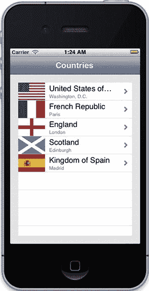

**图 9–6.** *填充了国家信息的表格*


#### 关于圆角的小提示

每当你查看任何制作精良的 iOS 应用时，很可能会注意到几乎每个元素都有圆角。这是大多数人不会注意到的细节之一，但它能显著提升应用的视觉质量，而且通过两步操作就能相当简单地实现。

首先，将下面这行导入语句添加到视图控制器的头文件中：

```
#import <QuartzCore/QuartzCore.h>
```

完成之后，你就可以访问任何继承自 `UIView` 的类的 `layer` 属性，该属性有一个可设置的 `cornerRadius`。下面我们将通过在你的 `-viewDidLoad` 方法中添加以下这行代码，来为 `UITableView` 设置圆角，使你的应用看起来如同图 9–7 所示。

```
self.tableViewCountries.layer.cornerRadius = 8.0;
```
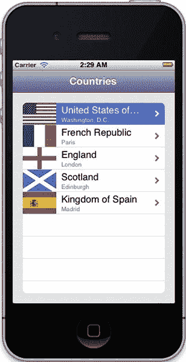

**图 9–7.** *你的已设置新圆角的 `UITableView`*

现在你已经建立了一个包含五个国家、外观漂亮的表格，可以进一步扩展 `UITableView` 的基本功能了。首先，我们将专注于 `UITableView` 最直接的功能：响应特定行的选中操作。

为了完成本教程的目标，你将这样构建应用：当选中某一行时，会显示一个独立的视图控制器，展示所选国家的所有已知信息。

首先，创建一个新文件，和之前一样选择“UIViewController subclass”模板，并将其命名为“CountryInfoViewController”。

通过组合使用 `UILabel`、`UITextField` 和 `UIImageView`，在该控制器的 XIB 文件中构建一个如图 9–8 所示的视图。我通过属性检查器为“Country Title”的 `UILabel` 添加了细微的阴影，如图 9–8 所示。虽然这不是必须的，但它显著提升了布局的视觉设计效果。

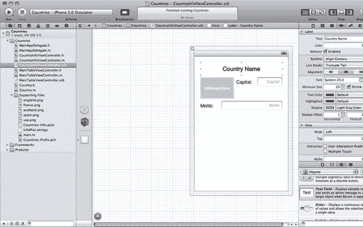

**图 9–8.** *`CountryInfoViewController` 的 XIB 文件与配置*

将每个 `UITextField`、`UIImageView` 以及顶部的“Country Name”`UILabel` 分别连接到你的视图控制器，对应的属性名称如下：

- `nameLabel`
- `textFieldCapital`
- `textFieldMotto`
- `imageViewFlag`

切换到新视图控制器的头文件后，添加 `UITextFieldDelegate` 协议，因为你需要能够控制 `UITextField` 的行为。

为了使视图控制器尽可能通用，你需要为其添加一个 `Country` 类的属性，用于保存当前显示的数据。这样，你可以简单地用必要的数据填充视图，如果需要，甚至可以轻松更换不同的数据而无需更改视图。添加导入 `Country` 类的语句。

```
#import "Country.h"
```

按如下方式创建 `Country` 属性，然后确保在实现文件中使用 `@synthesize` 并在 `-viewDidUnload` 中将其设置为 `nil`。

```
@property (strong, nonatomic) Country *currentCountry;
```

稍后你将为这个 `CountryInfoViewController` 实现一个可调用的委托方法，因此在头文件声明之前添加以下类和协议声明来创建一个协议。

```
@class CountryInfoViewController;

@protocol CountryInfoDelegate <NSObject>
-(void)countryInfoViewControllerDidFinish:(CountryInfoViewController *)countryVC;
@end
```

现在，为你的 `CountryInfoViewController` 添加一个 `delegate` 属性，并确保它必须遵循你刚创建的协议。和其他属性一样，别忘了使用 `@synthesize` 并在卸载时将其置空。

```
@property (strong, nonatomic) id <CountryInfoDelegate> delegate;
```

完整来看，你的头文件应该类似于以下代码。


```objc
#import <UIKit/UIKit.h>
#import "Country.h"

@class CountryInfoViewController;
@protocol CountryInfoDelegate <NSObject>

-(void)countryInfoViewControllerDidFinish:(CountryInfoViewController *)countryVC;

@end

@interface CountryInfoViewController : UIViewController <UITextFieldDelegate>

@property (strong, nonatomic) IBOutlet UILabel *nameLabel;
@property (strong, nonatomic) IBOutlet UIImageView *imageViewFlag;
@property (strong, nonatomic) IBOutlet UITextField *textFieldCapital;
@property (strong, nonatomic) IBOutlet UITextField *textFieldMotto;

@property (strong, nonatomic) Country *currentCountry;
@property (strong, nonatomic) id <CountryInfoDelegate> delegate;

@end
```

现在，在`CountryInfoViewController`的实现文件中，创建一个填充视图的方法。

```objc
-(void)populateViewWithCountry:(Country *)country
{
    self.currentCountry = country;

    self.imageViewFlag.image = country.flag;
    self.nameLabel.text = country.name;
    self.textFieldCapital.text = country.capital;
    self.textFieldMotto.text = country.motto;
}
```

你希望这个方法在视图加载之后、显示之前被调用，因此需要像这样实现`-viewWillAppear:animated:`方法：

```objc
-(void)viewWillAppear:(BOOL)animated
{
    [self populateViewWithCountry:self.currentCountry];
}
```

为了能在编辑`UITextField`后关闭键盘，你需要实现`-textFieldShouldReturn:`委托方法。

```objc
-(BOOL)textFieldShouldReturn:(UITextField *)textField
{
    [textField resignFirstResponder];
    return NO;
}
```

在`-viewDidLoad`方法中，通过将两个`UITextField`的委托设置为视图控制器，来配置它们。

```objc
self.textFieldMotto.delegate = self;
self.textFieldCapital.delegate = self;
```

由于允许用户修改数据，你应该添加一个“Revert”（还原）按钮，以便在数据被覆盖前恢复到原始数据。通过在`-viewDidLoad`方法中添加以下代码，可以将该按钮添加到导航栏右侧。

```objc
UIBarButtonItem *revertButton = [[UIBarButtonItem alloc] initWithTitle:@"Revert"
style:UIBarButtonItemStyleBordered target:self action:@selector(revert)];

self.navigationItem.rightBarButtonItems = [NSArray arrayWithObject:revertButton];
```

> **注意：** `UINavigationItem`类的`rightBarButtonItems`属性是 iOS 5 中新增的功能。它允许用户在`UINavigationBar`右侧设置多个对象。这在之前的 iOS 版本中也可以实现，但稍微困难一些，因为它需要一个由`UIToolbar`包含所需项目所构成的、自定义视图的`UIBarButtonItem`。

你完整的`-viewDidLoad`方法应该如下所示：

```objc
- (void)viewDidLoad
{
    [super viewDidLoad];

    self.textFieldMotto.delegate = self;
    self.textFieldCapital.delegate = self;

    UIBarButtonItem *revertButton = [[UIBarButtonItem alloc] initWithTitle:@"Revert"
style:UIBarButtonItemStyleBordered target:self action:@selector(revert)];
    self.navigationItem.rightBarButtonItems = [NSArray arrayWithObject:revertButton];
}
```

你为`revertButton`指定的选择器“revert”很容易实现：

```objc
-(void)revert
{
    [self populateViewWithCountry:self.currentCountry];
}
```

最后需要做的是，在返回`MainTableViewController`时，实现对给定`Country`对象所做的任何更改进行保存的功能。你将通过实现`-viewWillDisappear:animated:`方法来完成此操作。

```objc
-(void)viewWillDisappear:(BOOL)animated
{
    self.currentCountry.capital = self.textFieldCapital.text;
    self.currentCountry.motto = self.textFieldMotto.text;
    [self.delegate countryInfoViewControllerDidFinish:self];
}
```

切换回`MainTableViewController`的头文件，并将你创建的`CountryInfoDelegate`协议添加到头文件中。你需要先导入你创建的类。

```objc
#import "CountryInfoViewController.h"
```

为了更方便地实现`CountryInfoViewController`的委托方法，你需要创建一个实例变量来引用所选行的索引路径，这样只需刷新那一行即可节省处理资源。添加类型为`NSIndexPath`、名为`selectedIndexPath`的变量后，你的头文件现在应该如下所示：

```objc
#import <UIKit/UIKit.h>
#import <QuartzCore/QuartzCore.h>
#import "Country.h"
#import "CountryInfoViewController.h"

@interface MainTableViewController : UIViewController <UITableViewDelegate, UITableViewDataSource, CountryInfoDelegate>{
    NSIndexPath *selectedIndexPath;
}

@property (strong, nonatomic) IBOutlet UITableView *tableViewCountries;
@property (strong, nonatomic) NSMutableArray *countries;

@end
```

现在你可以像这样实现`CountryInfoViewController`的委托方法：

```objc
-(void)countryInfoViewControllerDidFinish:(CountryInfoViewController *)countryVC
{
    if (selectedIndexPath)
    {
        [tableViewCountries beginUpdates];
        [self.tableViewCountries reloadRowsAtIndexPaths:[NSArray arrayWithObject:selectedIndexPath] withRowAnimation:UITableViewRowAnimationNone];
        [tableViewCountries endUpdates];
    }
    selectedIndexPath = nil;
}
```

`-beginUpdates`和`-endUpdates`方法虽然在此处并非必要，但在`UITableView`中重新加载数据时非常有用，因为它们指定了其间对重新加载数据的任何调用都应带有动画效果。由于你的所有数据重新加载都发生在`UITableView`处于屏幕外时，所以这不是必需的，但也不会对应用程序造成损害。

最后，为了实际响应`UITableView`中某一行的选中操作，你只需要实现`UITableView`的委托方法`-tableView:didSelectRowAtIndexPath:`即可。

```objc
-(void)tableView:(UITableView *)tableView didSelectRowAtIndexPath:(NSIndexPath *)indexPath
{
    [tableView deselectRowAtIndexPath:indexPath animated:YES];

    selectedIndexPath = indexPath;

    Country *chosenCountry = [self.countries objectAtIndex:indexPath.row];
    CountryInfoViewController *infoVC = [[CountryInfoViewController alloc] init];
    infoVC.delegate = self;
    infoVC.currentCountry = chosenCountry;

    [self.navigationController pushViewController:infoVC animated:YES];
}
```

`UITableView`类还有其他多个用于处理选中或取消选中行的方法，包括`-tableView:willSelectRowAtIndexPath:`（在其对应的`-tableView:didSelectRowAtIndexPath:`之前调用），以及`-tableView:willDeselectRowAtIndexPath:`和`-tableView:didDeselectRowAtIndexPath:`。通过使用这四个委托方法，你可以完全自定义`UITableView`的行为以适配任何应用程序。

现在运行此项目，你将能够查看和编辑国家信息，如图 9–9 所示。

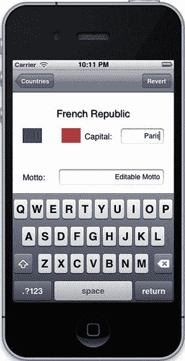

**图 9–9.** *`CountryInfoViewController`的最终显示效果*


#### 增强的用户交互

当你处理以 `UITableView` 为核心的应用程序时，通常可能希望允许用户从同一个表格中访问多个不同的视图。例如，iPhone 上的“电话”应用有一个“语音留言”标签页，其中显示一个包含各种语音留言的 `UITableView`。用户既可以通过选择表格中的某一行来播放语音留言，也可以通过选择行右侧的一个较小的蓝色按钮，来查看原始呼叫者的联系信息。你可以通过实现另一个 `UITableView` 委托方法来实现类似的行为。

首先，你必须更改 `UITableView` 中单元格的“附件”类型。这指的是任何给定行最右侧显示的图标。在你的 `-tableView:cellForRowAtIndexPath:` 方法中，找到下面这行代码：

```
        cell.accessoryType = UITableViewCellAccessoryDisclosureIndicator;
```

将此值更改为 `UITableViewCellAccessoryDetailDisclosureButton`。这将为我们提供那个漂亮的、可以响应触摸的小蓝色按钮。此属性可能的四个值如下所示：

- `UITableViewCellAccessoryNone`：表示没有附件
- `UITableViewCellAccessoryDisclosureIndicator`：在行的右侧添加一个灰色箭头，就像你一直使用的那样
- `UITableViewCellAccessoryDetailDisclosureButton`：你刚刚选择的值，指定了一个可交互的按钮
- `UITableViewCellAccessoryCheckmark`：在特定行添加一个勾选标记；这在结合 `-tableView:didSelectRowAtIndexPath:` 方法、根据需要从列表中添加或移除勾选标记时特别有用

**注意：** 虽然这四种可用的附件类型非常有用，并且几乎可以覆盖所有通用场景，但肯定很容易想到需要在你行的右侧放置完全不同内容的情况。你可以通过 `accessoryView` 属性轻松地将 `UITableViewCell` 的附件自定义为任何其他 `UIView` 的子类。

现在你已经将附件变成了一个按钮，实际上，实现一个处理此交互的动作非常容易。你只需实现另一个 `UITableView` 委托方法：`-tableView:accessoryButtonTappedForRowWithIndexPath:`。为了测试目的，我们将让这个动作与行选择动作完全相同，只是额外添加一个 `NSLog()`，不过你应该很容易看到如何实现不同的行为。

```
-(void)tableView:(UITableView *)tableView accessoryButtonTappedForRowWithIndexPath:(NSIndexPath *)indexPath
{
    [tableView deselectRowAtIndexPath:indexPath animated:YES];

    selectedIndexPath = indexPath;

    Country *chosenCountry = [self.countries objectAtIndex:indexPath.row];
    CountryInfoViewController *infoVC = [[CountryInfoViewController alloc] init];
    infoVC.delegate = self;
    infoVC.currentCountry = chosenCountry;

    NSLog(@"Accessory Button Tapped");
    [self.navigationController pushViewController:infoVC animated:YES];
}
```

当你运行此应用时，点击附件按钮即可运行你的最新功能，如图 9–10 所示。

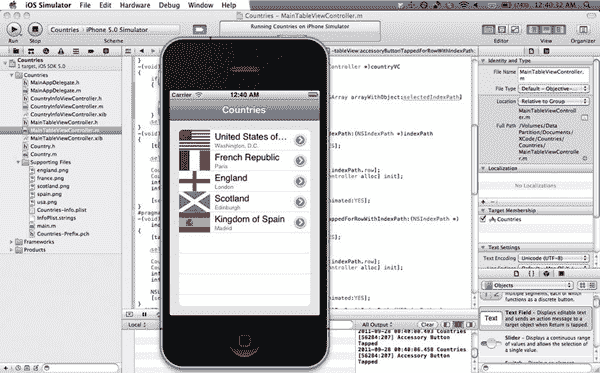

**图 9–10.** *你的带有详细信息公开按钮的 `UITableView` 响应事件*

#### 关于单元格视图自定义的说明

与附件视图一样，`UITableViewCell` 的其它几个部分也可以通过其视图进行自定义。`UITableViewCell` 类包含几个你可以编辑的其他视图的属性，包括以下内容：

- `imageView`：单元格中位于 `textLabel` 左侧的 `UIImageView`，如之前示例中的国旗所示；如果没有给此视图提供图像，单元格将表现得像 `UIImageView` 不存在一样（而不是一个占用空间的空白 `UIImageView`）。
- `contentView`：`UITableViewCell` 的主要 `UIView`，包含所有文本；你可能希望自定义此视图以实现功能更强大或更通用的 `UITableViewCell`。
- `backgroundView`：在平铺风格表格中设置为 `nil` 的 `UIView`（就像你目前使用的那样），而在分组表格中则不然；此视图将出现在表格中所有其他视图的背后，因此非常适合专门自定义单元格的视觉显示。
- `selectedBackgroundView`：当单元格被选中时，此 `UIView` 会插入到 `backgroundView` 之上、但位于所有其他视图之下。它也可以借助 `-setSelected:animated:` 操作轻松实现 alpha 动画（淡入或淡出）。
- `multipleSelectionBackgroundView`：此 `UIView` 的行为与 `selectedBackgroundView` 类似，但在 `UITableView` 允许选择多行时使用。
- `accessoryView`：如前所述，这允许你为行的附件创建完全不同的视图，因此你可以在预设值之外实现自己的自定义显示和行为。
- `editingAccessoryView`：这与 `accessoryView` 属性类似，但专门用于 `UITableView` 处于“编辑”模式时，你很快会详细看到这一点。

虽然大多数开发者坚持使用相当通用的 `UITableView`，因为它与 iOS 设计主题非常契合，但如果你留意一下，可以找到一些非常有创意的自定义视图实现。所有这些额外的自定义可能会为你的项目增加大量开发时间，但一个高质量、自定义的 `UITableView` 肯定会因其独特性而在应用中脱颖而出。


### 技巧 9–2：编辑 `UITableView`

如果你观察一下常用应用（比如设备上的音乐播放器）中的任何一个 `UITableView`，你很可能会发现可以以某种方式编辑表格。在音乐应用中，你可以滑动某一行来显示删除按钮，然后从表格中移除条目。在邮件应用中，你可以点击右上角的编辑按钮，以便选择多条消息进行删除、移动或其他操作。这两种功能都基于“编辑”`UITableView` 的概念。

首先要考虑的是将 `UITableView` 置于“编辑”模式，因为用户需要使用你的编辑功能，就必须能够访问它。你可以在视图的右上角添加一个编辑按钮来实现这一点。令人惊讶的是，这非常简单，只需在 `-viewDidLoad` 方法中添加以下代码行即可。

`self.navigationItem.rightBarButtonItem = self.editButtonItem;`

这个 `editButtonItem` 属性实际上并不是你需要定义的属性，因为它对每个 `UIViewController` 子类都是预置的。这个按钮特别棒的地方在于，它不仅已经编程为会自动调用一个特定方法，还能在“编辑”和“完成”之间切换文本。

默认情况下，`editButtonItem` 被设置为调用 `-setEditing:animated:` 方法，你可以为其创建一个简单的实现：

```
-(void)setEditing:(BOOL)editing animated:(BOOL)animated
{
    [super setEditing:editing animated:animated];
    [self.tableViewCountries setEditing:editing animated:animated];
}
```

这个方法的主要思路很简单：首先调用 `super` 方法，它会处理按钮文本的切换，然后根据给定的参数设置 `UITableView` 的编辑模式。

此时，应用中的编辑按钮将触发 `UITableView` 的编辑模式，从而允许显示任意行的删除按钮。但是，由于你实际上还没有为这些按钮实现任何行为，因此你还无法从表格中删除任何行。为此，你必须先实现另一个委托方法 `-tableView:commitEditingStyle:forRowAtIndexPath:`。

以下是你将采用的此方法的一个基本实现：

```
-(void)tableView:(UITableView *)tableView commitEditingStyle:(UITableViewCellEditingStyle)editingStyle forRowAtIndexPath:(NSIndexPath *)indexPath
{
    if (editingStyle == UITableViewCellEditingStyleDelete)
    {
        Country *deletedCountry = [self.countries objectAtIndex:indexPath.row];
        [self.countries removeObject:deletedCountry];

        [tableViewCountries deleteRowsAtIndexPaths:[NSArray arrayWithObject:indexPath] withRowAnimation:UITableViewRowAnimationAutomatic];
    }
}
```

在这个方法中，*非常*重要的是，在从 `UITableView` 中删除行之前，务必先从模型中删除实际的数据元素，就像之前的示例中先删除数组中的国家，然后再删除其行一样。否则，你的应用将抛出异常。

现在运行你的应用，你可以点击编辑按钮将 `UITableView` 置于编辑模式，如图所示图 9–11。

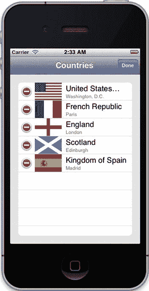

**图 9–11.** *处于编辑模式并具备删除行功能的 `UITableView`*

#### `UITableView` 行动画

在你刚刚添加的方法中，你指定了一种特定的动画类型，用于在删除行时执行，即 `UITableViewRowAnimationAutomatic`。接受此值的参数还有其他各种预置值，你可以用它们自定义行的视觉行为，包括：

*   `UITableViewRowAnimationBottom`
*   `UITableViewRowAnimationFade`
*   `UITableViewRowAnimationLeft`
*   `UITableViewRowAnimationMiddle`
*   `UITableViewRowAnimationNone`
*   `UITableViewRowAnimationRight`
*   `UITableViewRowAnimationTop`

你选择的动画类型不会对应用性能产生显著影响，但确实可以改变应用在最终用户眼中的外观和体验。最好多尝试这些动画，看看哪种在你的应用中看起来效果最佳。

此时，你的方法应该已经能够处理从表格中删除行的操作了！由于你编写的程序会在每次应用运行时重新创建数据，因此测试这一点应该相当容易。当你即将从表格中删除一行时，你的表格将如图所示图 9–12。

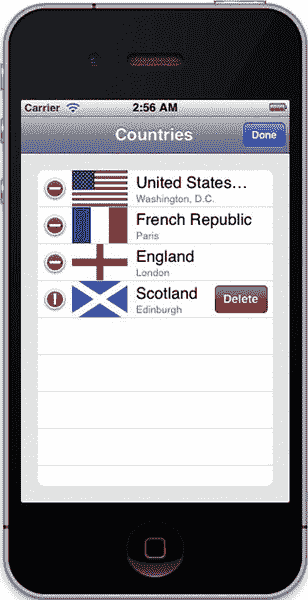

**图 9–12.** *从表格中删除一行*


#### 但等等，还有更多！

删除并不是`UITableView`中唯一可进行的编辑操作。尽管使用频率没那么高，但 iOS 包含了与删除相同的方法来创建和插入行的功能。

`UITableView`中任何一行的默认编辑样式是`UITableViewCellEditingStyleDelete`，因此要实现行的插入，你需要修改这一设置。为了增加趣味性，你可以通过实现`-tableView:editingStyleForRowAtIndexPath:`方法，让每隔一行拥有“插入”编辑样式。

```
-(UITableViewCellEditingStyle)tableView:(UITableView *)tableView editingStyleForRowAtIndexPath:(NSIndexPath *)indexPath
{
    if ((indexPath.row % 2) == 1)
    {
        return UITableViewCellEditingStyleInsert;
    }
    return UITableViewCellEditingStyleDelete;
}
```

和之前一样，你需要指定点击插入按钮时的行为。你将在`-tableView:commitEditingStyle:forRowAtIndexPath:`方法中添加一个分支，现在该方法看起来是这样的：

```
-(void)tableView:(UITableView *)tableView
commitEditingStyle:(UITableViewCellEditingStyle)editingStyle
forRowAtIndexPath:(NSIndexPath *)indexPath
{
    if (editingStyle == UITableViewCellEditingStyleDelete)
    {
        Country *deletedCountry = [self.countries objectAtIndex:indexPath.row];
        [self.countries removeObject:deletedCountry];

        [tableViewCountries deleteRowsAtIndexPaths:[NSArray arrayWithObject:indexPath]
withRowAnimation:UITableViewRowAnimationAutomatic];
    }
    else if (editingStyle == UITableViewCellEditingStyleInsert)
    {
        Country *copiedCountry = [self.countries objectAtIndex:indexPath.row];
        Country *newCountry = [[Country alloc] init];
        newCountry.name = copiedCountry.name;
        newCountry.flag = copiedCountry.flag;
        newCountry.capital = copiedCountry.capital;
        newCountry.motto = copiedCountry.motto;

        [self.countries insertObject:newCountry atIndex:indexPath.row+1];

        [self.tableViewCountries insertRowsAtIndexPaths:[NSArray arrayWithObject:[NSIndexPath indexPathForRow:indexPath.row+1 inSection:indexPath.section]] withRowAnimation:UITableViewRowAnimationRight];
    }
}
```

你可以看到，我们采用了一种相当简单的插入实现方式，即只是复制了所选行。需要注意的是，通过修改此方法中的索引值，你可以轻松地将对象插入到表格中的几乎任何行；并非必须只插入到紧随其后的行。

与删除操作一样，你必须确保在更新表格视图之前先更新数据模型，因此在向`UITableView`插入新行之前，你已将新的`Country`对象添加到了数组中。

运行应用并编辑表格时，你将能够同时看到删除和插入按钮，如图 9-13 所示。

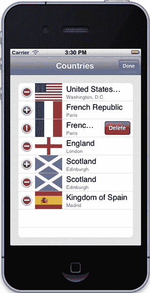

**图 9-13.** *编辑带有插入或删除功能的`UITableView`*

另外还有两个`UITableView`的委托方法可以与编辑功能结合使用，以进一步自定义应用的行为。

- `-tableView:willBeginEditingRowAtIndexPath:` 方法允许你“预览”被选中进行编辑的行，并据此采取相应操作。
- `-tableView:didEndEditingRowAtIndexPath:` 方法可以作为完成块使用，你可以在其中指定任何你认为必要的、在行编辑完成后需要执行的操作。

### 食谱 9–3：对 UITableView 进行重新排序

现在我们已经讨论了行的删除和插入，表格功能的下一步逻辑自然就是让行能够移动。鉴于我们已经设置好了应用，实现这一功能其实相当简单。

首先，你必须使用`-tableView:canMoveRowAtIndexPath:` 方法精确指定哪些行允许移动。

```
-(BOOL)tableView:(UITableView *)tableView canMoveRowAtIndexPath:(NSIndexPath *)indexPath
{
    return YES;
}
```

我选择了最简单的方式，即让所有行都可移动，但你可以根据应用需求轻松更改这一设置。

现在，你只需要实现一个委托，在行成功移动后更新数据模型。

```
-(void)tableView:(UITableView *)tableView moveRowAtIndexPath:(NSIndexPath *)sourceIndexPath toIndexPath:(NSIndexPath *)destinationIndexPath
{
    [self.countries exchangeObjectAtIndex:sourceIndexPath.row withObjectAtIndex:destinationIndexPath.row];
    [self.tableViewCountries reloadData];
}
```

与插入操作一样，你必须确保更新数组以匹配重新排序，而`UITableView`会自动处理行的实际交换。

为了对表格的重新排序进行额外控制，你可以实现一个额外的方法，名为`-tableView:targetIndexPathForMoveFromRowAtIndexPath:`。每当一个单元格被拖到另一个单元格上方作为可能的移动目标时，就会调用这个委托方法，其常规用途是“重新定位”目标行。通过这种方式，你可以检查建议的目标位置，并确认或拒绝建议的移动，然后返回一个不同的目标位置。

尽管你尚未实现确认或拒绝建议移动的功能，但你的应用现在除了之前具备的删除和复制功能外，已经能够成功移动和重新排序行，如图 9-14 所示。

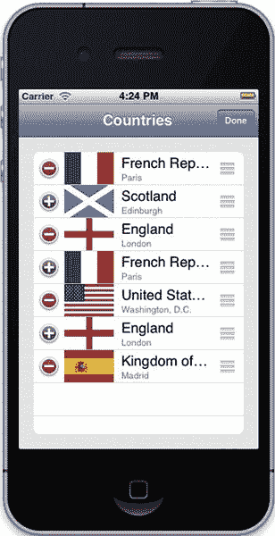

**图 9-14.** *你的表格进行了一些单元格的重新排序*


### 技巧 9–4：创建分组 UITableView

现在你几乎已经完全掌握了使用未分组 `UITableView` 的所有基础知识，接下来可以调整应用程序，采用“分组”方式。你在未分组表格中实现的所有功能同样适用于分组表格，因此你无需进行大量修改即可实现这一目标。

要使用分组表格，首先需要将 `UITableView` 的“样式”从“Plain”切换为“Grouped”。最简单的方法是在视图控制器的 XIB 文件中选中 `UITableView`，然后在属性检查器中更改样式，结果将显示为类似图 9–15 的效果。

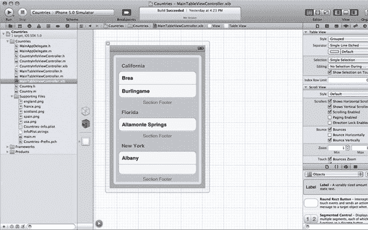

**图 9–15.** *配置“分组”`UITableView`*

你所需的具体选项位于属性检查器顶部，在“Table View”的“Style”下，如下方图 9–16 所示。

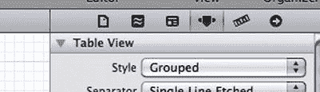

**图 9–16.** *修改表格的“Style”以创建分组 `UITableView`*

虽然这是更改表格样式的唯一必要操作，但问题在于到目前为止，你的数据模型是为未分组样式设计的，甚至根本没有对数据进行分组。为了解决这个问题，你需要改变数据的存储组织方式。

你不再使用一个包含全部五个国家的数组，而是将国家分为若干组，每组作为一个 `NSMutableArray`，然后将这些数组放入一个更大的 `NSMutableArray` 中。（虽然更好的做法是使用不可变数组，但我选择了可变版本，以便从表格中编辑数据模型时更简单。）

对于你的应用程序，你将把五个 `Country` 对象分为两类：一类是英国（United Kingdom）的国家，另一类是其他所有国家。

首先，你需要创建两个额外的 `NSMutableArray` 作为子数组，因此添加这两个属性，并确保在实现文件中正确处理它们（使用 `@synthesize`！）。最终你将拥有三个 `NSMutableArray` 属性。

```
@property (strong, nonatomic) NSMutableArray *countries;
@property (strong, nonatomic) NSMutableArray *unitedKingdomCountries;
@property (strong, nonatomic) NSMutableArray *nonUKCountries;
```

现在，你需要修改 `-viewDidLoad` 方法以适应这一变化。从该方法中删除以下代码行：

```
    self.countries = [NSMutableArray arrayWithObjects:usa, france, england, scotland, spain, nil];
```

然后将该行替换为以下代码，以正确组织你的国家：

```
    self.unitedKingdomCountries = [NSMutableArray arrayWithObjects:england, scotland, nil];
    self.nonUKCountries = [NSMutableArray arrayWithObjects:usa, france, spain, nil];
    self.countries = [NSMutableArray arrayWithObjects:unitedKingdomCountries, nonUKCountries, nil];
```

现在进入稍微棘手的部分：你需要确保所有数据源和委托方法都调整为新格式。在每个方法中，你必须先获取分组的数组，然后再从中获取特定的国家。首先，修改 `-tableView:cellForRowAtIndexPath:`。修改后应如下所示：

```
- (UITableViewCell *)tableView:(UITableView *)tableView cellForRowAtIndexPath:(NSIndexPath *)indexPath {

static NSString *CellIdentifier = @"Cell";

    UITableViewCell *cell = [tableView dequeueReusableCellWithIdentifier:CellIdentifier];
    if (cell == nil)
    {
        cell = [[UITableViewCell alloc] initWithStyle:UITableViewCellStyleSubtitle reuseIdentifier:CellIdentifier];
        cell.accessoryType = UITableViewCellAccessoryDetailDisclosureButton;
cell.textLabel.font = [UIFont systemFontOfSize: 19.0];
cell.detailTextLabel.font = [UIFont systemFontOfSize: 12];
    }

    NSArray *group = [self.countries objectAtIndex:indexPath.section];
    Country *country = [group objectAtIndex:indexPath.row];
    cell.textLabel.text = country.name;
    cell.detailTextLabel.text = country.capital;
    UIImage *flag = country.flag;
cell.imageView.image = [MainTableViewController scale:flag toSize:CGSizeMake( 115, 75)];

    return cell;
}
```

接下来是 `-tableView:numberOfRowsInSection:`：

```
-(NSInteger)tableView:(UITableView *)tableView numberOfRowsInSection:(NSInteger)section
{
    NSArray *group = [self.countries objectAtIndex:section];
    return [group count];
}
```

以下是 `-tableView:didSelectRowAtIndexPath:`：

```
-(void)tableView:(UITableView *)tableView didSelectRowAtIndexPath:(NSIndexPath *)indexPath
{
    [tableView deselectRowAtIndexPath:indexPath animated:YES];

    selectedIndexPath = indexPath;
    /////BEGIN MODIFIED CODE FOR GROUPED TABLE
    NSArray *group = [self.countries objectAtIndex:indexPath.section];
    Country *chosenCountry = [group objectAtIndex:indexPath.row];
    /////END OF MODIFIED CODE
    CountryInfoViewController *infoVC = [[CountryInfoViewController alloc] init];
    infoVC.delegate = self;
    infoVC.currentCountry = chosenCountry;

    [self.navigationController pushViewController:infoVC animated:YES];
}
```

以下是 `-tableView:accessoryButtonTappedForRowWithIndexPath:`：

```
-(void)tableView:(UITableView *)tableView
accessoryButtonTappedForRowWithIndexPath:(NSIndexPath *)indexPath
{
    [tableView deselectRowAtIndexPath:indexPath animated:YES];

    selectedIndexPath = indexPath;
    ////BEGIN MODIFIED CODE FOR GROUPED TABLE
    NSArray *group = [self.countries objectAtIndex:indexPath.section];
    Country *chosenCountry = [group objectAtIndex:indexPath.row];
    ////END MODIFIED CODE FOR GROUPED TABLE
    CountryInfoViewController *infoVC = [[CountryInfoViewController alloc] init];
    infoVC.delegate = self;
    infoVC.currentCountry = chosenCountry;

    NSLog(@"Accessory Button Tapped");
    [self.navigationController pushViewController:infoVC animated:YES];
}
```

对于 `-tableView:moveRowAtIndexPath:toIndexPath:` 方法，为了简化编码，我们假设只移动同一分区内的行。稍后运行应用程序时你会发现，在当前实现中，`UITableView` 不允许 `Country` 切换分组，这正好符合该特定应用的需求。对于可能需要让对象更改分组的应用，你应确保包含相应的代码。

```
-(void)tableView:(UITableView *)tableView moveRowAtIndexPath:(NSIndexPath *)sourceIndexPath toIndexPath:(NSIndexPath *)destinationIndexPath
{
    NSMutableArray *group = [self.countries objectAtIndex:sourceIndexPath.section]; //Assume same Section
    if (destinationIndexPath.row < [group count])
    {
        [group exchangeObjectAtIndex:sourceIndexPath.row withObjectAtIndex:destinationIndexPath.row];
    }
    [self.tableViewCountries reloadData];
}
```

最后一个需要修复的方法是 `-tableView:commitEditingStyle:forRowAtIndexPath:`，修改后如下所示：

```
-(void)tableView:(UITableView *)tableView commitEditingStyle:(UITableViewCellEditingStyle)editingStyle forRowAtIndexPath:(NSIndexPath *)indexPath
{
    if (editingStyle == UITableViewCellEditingStyleDelete)
    {
        //////Changed code
        NSMutableArray *group = [self.countries objectAtIndex:indexPath.section];
        Country *deletedCountry = [group objectAtIndex:indexPath.row];
        [group removeObject:deletedCountry];
        //////End of changed code
```


```objectivec
[tableViewCountries deleteRowsAtIndexPaths:[NSArray arrayWithObject:indexPath] withRowAnimation:UITableViewRowAnimationAutomatic];
}
else if (editingStyle == UITableViewCellEditingStyleInsert)
{
    //////更多修改的代码！
    NSMutableArray *group = [self.countries objectAtIndex:indexPath.section];
    Country *copiedCountry = [group objectAtIndex:indexPath.row];
    Country *newCountry = [[Country alloc] init];
    newCountry.name = copiedCountry.name;
    newCountry.flag = copiedCountry.flag;
    newCountry.capital = copiedCountry.capital;
    newCountry.motto = copiedCountry.motto;

    [group insertObject:newCountry atIndex:indexPath.row+1];
    //////修改代码结束

    [self.tableViewCountries insertRowsAtIndexPaths:[NSArray arrayWithObject:[NSIndexPath indexPathForRow:indexPath.row+1 inSection:indexPath.section]] withRowAnimation:UITableViewRowAnimationRight];
}
```

最后，由于你已将 `UITableView` 切换为“分组”样式，你需要额外实现两个方法，以确保功能正确。

首先，你需要通过以下方法精确指定 `UITableView` 共有多少个分区：

```objectivec
-(NSInteger)numberOfSectionsInTableView:(UITableView *)tableView
{
    return [self.countries count];
}
```

其次，你需要为每个分区指定“标题”，这些标题将是各个组的名称。既然你已经清楚数据的格式，这一步很容易做到。

```objectivec
-(NSString *)tableView:(UITableView *)tableView titleForHeaderInSection:(NSInteger)section
{
    if (section == 0)
    {
        return @"英国国家";
    }
    return @"非英国国家";
}
```

如果你的数据模型更复杂，你可能希望将组的名称与组本身一起存储。使用 `NSDictionary` 是一种特别好的方式，可以将标题（作为字符串）设置为 `NSArray` 组对象的键。

`UITableViewDelegate` 协议还包含一个方法，允许开发者在编辑 `UITableView` 时自定义删除按钮中显示的文本。该方法完全可选，其使用方式将根据具体应用的需求而有所不同。

```objectivec
-(NSString *)tableView:(UITableView *)tableView titleForDeleteConfirmationButtonForRowAtIndexPath:(NSIndexPath *)indexPath
{
    return NSLocalizedString(@"移除", @"删除");
}
```

完成所有这些修改后，运行你的应用，视图应类似于图 9–17 所示。


**图 9–17.** *包含分组项和分区标题的应用界面*

作为表格的最后一个补充，你还可以为分区添加“页脚”。它们的工作原理与标题类似，但正如你可能猜到的，它们会出现在分组的底部。以下是一个快速方法，用于为你的 `UITableView` 添加一些（略显滑稽的）页脚。

```objectivec
-(NSString *)tableView:(UITableView *)tableView titleForFooterInSection:(NSInteger)section
{
    if (section == 0)
        return @"我是一个页脚！";
    return @"我想我也是……";
}
```

与 `UITableView` 其他高度可定制的部分一样，这些标题和页脚也极其容易定制，远不止使用简单的 `NSString`。如果使用 `-tableView:viewForHeaderInSection:` 和 `-tableView:viewForFooterInSection:` 方法，你可以通过编程方式创建自己的子视图，用作标题或页脚，从而完全控制 `UITableView` 的显示。

至此，你已经拥有了一个功能完备的分组 `UITableView`，其能力与未分组的表格完全相同！图 9–18 展示了设置的最终结果。

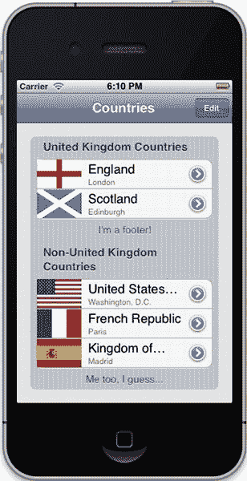

**图 9–18.** *完成后的分组 `UITableView`，同时带有标题和页脚*

### 摘要

在本章中，你逐步学习了如何以编程方式创建 `UITableView`，并了解了两种样式：“普通”和“分组”。你还初步了解了开发者对 `UITableView` 视图和显示所拥有的广泛定制控制权，尽管 Apple 的完整文档对此主题还有更多内容。你甚至为你的 `UITableView` 添加了大量功能，使其拥有最强大的用户界面。然而，`UITableView` 的关键不在于它如何工作，而在于它所展示的数据。作为开发者，你需要找到用户想要或需要的信息，并以最高效、最灵活的方式呈现给他们。`UITableView` 是一个出色的工具，但其服务的目的更为重要，这最终将是你交付给客户的最终产品。

## 第 10 章

## 数据存储方案

在处理 iOS 开发时，最重要的主题之一就是理解数据持久化的概念、使用和实现。这个术语指的是信息在应用关闭或重启时能够被保存和检索，即“持久化”。就像几千年前书籍中的页面至今仍可阅读一样，我们可以利用 iOS 中的关键概念，让我们的信息——从最简单的数值到最复杂的数据结构——在设备中无限期地保存。本章将介绍多种持久化方法，它们各有优缺点、通用用途和复杂程度，以便我们全面理解在任何特定情况下最佳的存储方法。


### 配方 10-1：使用 `NSUserDefaults`

开发应用时，我们经常会遇到需要存储简单值（如字符串、数字或布尔值）的场景。虽然存储数据的方式有很多种，但最简单的方式就是使用专为此类需求而设计的 `NSUserDefaults`。

`NSUserDefaults` 类是一个简单的实现，用于存储 `NSString`、`NSNumber`、BOOL 等实例这类基础值。它也可以用来存储更复杂的数据结构，比如 `NSArray` 或 `NSDictionary`，只要它们不包含大量数据即可。任何类型的图片都不应使用 `NSUserDefaults` 来存储。因此，它非常适合存储应用中的各种偏好设置或选项。

首先，创建一个名为“Stubborn”（因为你希望你的信息能够持久保留）的新项目。

选择单视图应用模板来创建一个简单的应用供你配置。输入你的名称并确保设备设置为 iPhone 系列后，就像图 10-1 所示那样，点击下一步直到完成项目创建。

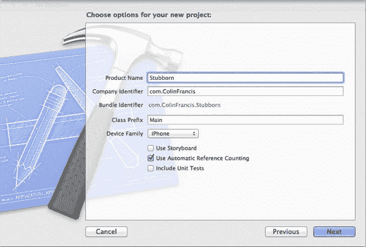

**图 10-1.** *配置你的 Stubborn 项目*

现在，在你新创建的视图控制器的 XIB 文件中，你将开始设置基本的用户界面。拖放三个 `UILabel`、两个 `UITextField`、一个 `UISwitch` 和一个 `UIActivityIndicatorView`，以创建如图 10-2 所示的视图。

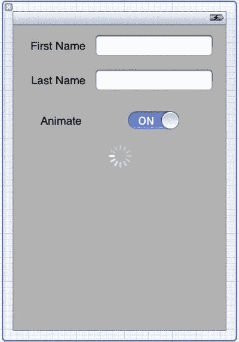

**图 10-2.** *用于存储值的视图控制器 XIB*

你大概能猜到，我们将简单地使用文本字段来设置标签的文本，并使用开关来控制活动指示器视图是否在动画。

接下来，按住 ^ (Ctrl) 键并从 XIB 文件中的每个元素拖拽到视图控制器的头文件中，连接每个元素到对应的属性。这将自动创建属性，合成它，并在应用的 `-viewDidUnload` 方法中添加一条将其置空的语句。下面的头文件摘录展示了你将用于管理每个元素的属性名称。

```
#import <UIKit/UIKit.h>

@interface MainViewController : UIViewController

@property (strong, nonatomic) IBOutlet UILabel *firstLabel;
@property (strong, nonatomic) IBOutlet UILabel *secondLabel;
@property (strong, nonatomic) IBOutlet UILabel *animateLabel;
@property (strong, nonatomic) IBOutlet UITextField *firstNameTextField;
@property (strong, nonatomic) IBOutlet UITextField *lastNameTextField;
@property (strong, nonatomic) IBOutlet UISwitch *animateSwitch;
@property (strong, nonatomic) IBOutlet UIActivityIndicatorView *activityIndicator;

@end
```

接下来，你需要让你的视图控制器遵循 `UITextFieldDelegate` 协议，以便更好地控制每个 `UITextField` 的操作。你视图控制器头文件中的头行（前述代码中的第二行）现在看起来像这样：

```
@interface MainViewController : UIViewController<UITextFieldDelegate>
```

然后，更新视图控制器接口文件中的 `-viewDidLoad` 方法，以设置两个文本字段的委托。

```
- (void)viewDidLoad
{
    [super viewDidLoad];
self.firstNameTextField.delegate = self;
self.lastNameTextField.delegate = self;
}
```

现在，你可以编写一个方法来访问 `NSUserDefaults` 类并保存视图所需的数值。

```
(void)updateDefaults
{
// 获取值
NSString *first = self.firstNameTextField.text;
NSString *last = self.lastNameTextField.text;
BOOL animating = self.activityIndicator.isAnimating;

// 获取共享实例
NSUserDefaults *userDefaults = [NSUserDefaults standardUserDefaults];

// 设置需要持久化的对象/值
    [userDefaults setObject:first forKey:@"firstName"];
    [userDefaults setObject:last forKey:@"lastName"];
    [userDefaults setBool:animating forKey:@"animating"];

// 保存更改
    [userDefaults synchronize];
}
```

如该方法所示，在对 `NSUserDefaults` 对象完成更改后，务必记得调用 `-synchronize` 方法以保存数据。

除了用于获取 `NSUserDefaults` 类共享实例的 `+standardUserDefaults` 方法外，该类还有一个类方法 `+resetStandardUserDefaults`，用于完全清除应用的所有已保存存储值。

现在，你可以实现你的 `UITextFieldDelegate` 协议方法来处理数据的输入，以自动保存新输入的文本。

```
-(BOOL)textFieldShouldReturn:(UITextField *)textField
{
    [textField resignFirstResponder];
return NO;
}

-(void)textFieldDidEndEditing:(UITextField *)textField
{
if (textField == self.firstNameTextField)
    {
self.firstLabel.text = textField.text;
    }
else if (textField == self.lastNameTextField)
    {
self.secondLabel.text = textField.text;
    }
    [self updateDefaults];
}
```

对于你的 `UISwitch`，你还需要创建一个方法来处理其值的变化。

```
-(void)switchValueChanged:(UISwitch *)sender
{
if (sender.on)
    {
        [self.activityIndicator startAnimating];
self.animateLabel.text = @"Animating";
    }
else
    {
        [self.activityIndicator stopAnimating];
self.animateLabel.text = @"Stopped";
    }
    [self updateDefaults];
}
```

为了将此方法分配给 `UISwitch` 调用，你需要再次修改 `-viewDidLoad`。

```
- (void)viewDidLoad
{
    [super viewDidLoad];
self.firstNameTextField.delegate = self;
self.lastNameTextField.delegate = self;

    [self.animateSwitch addTarget:self action:@selector(switchValueChanged:)
forControlEvents:UIControlEventValueChanged];
}
```

至此，你的应用应该能够轻松保存你输入的值，但你还需要包含在应用关闭时重新加载这些值的功能。你将创建一个单独的方法，再次访问 `NSUserDefaults` 类，检查是否有任何存储的值，并相应地显示它们。

```
-(void)setValuesFromDefaults
{
// 获取共享实例
NSUserDefaults *userDefaults = [NSUserDefaults standardUserDefaults];

// 获取值
NSString *first = [userDefaults objectForKey:@"firstName"];
NSString *last = [userDefaults objectForKey:@"lastName"];
BOOL animating = [userDefaults boolForKey:@"animating"];

// 相应地显示值
if (first != nil)
    {
self.firstNameTextField.text = first;
self.firstLabel.text = first;
    }
if (last != nil)
    {
self.lastNameTextField.text = last;
self.secondLabel.text = last;
    }
if (animating)
    {
self.animateLabel.text = @"Animating";
if (self.activityIndicator.isAnimating == NO)
        {
            [self.activityIndicator startAnimating];
        }
    }
else
    {
self.animateLabel.text = @"Stopped";
if (self.activityIndicator.isAnimating == YES)
        {
            [self.activityIndicator stopAnimating];
        }
    }
    [self.animateSwitch setOn:animating animated:NO];
}
```

最后，你只需要再次调整 `-viewDidLoad` 方法，以便在应用运行时加载已保存的偏好设置。

```
- (void)viewDidLoad
{
    [super viewDidLoad];
self.firstNameTextField.delegate = self;
self.lastNameTextField.delegate = self;

    [self.animateSwitch addTarget:self action:@selector(switchValueChanged:)
forControlEvents:UIControlEventValueChanged];

    [self setValuesFromDefaults];
}
```


```markdown

此时，你的应用已经能够成功保存数据了！如果你在 iOS 模拟器或设备上运行应用，修改数据后关闭并重新打开，数据应该会保持原样。请注意，在较新设备上完全关闭应用的方法是：双击主屏幕按钮，按住出现的应用图标，然后点击目标应用上的“-”标记。另外需注意，如果通过 Xcode 运行项目，通过此方式关闭应用可能会导致崩溃，此时应使用 Xcode 中的“停止”按钮来关闭应用。虽然无法直观看到，但图 10-3 展示了一个多次关闭并重新打开后数据仍然保留的应用示例！

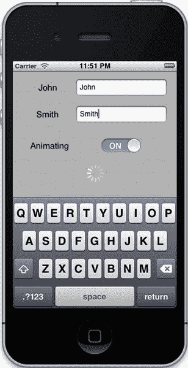

**图 10-3.** 应用持久化数据

> **注意：** 尽管在本简短示例中你并未使用多种类型的值通过 `NSUserDefaults` 存储数据，但实际上存在多种方法可以存储几乎所有类型的轻量数据，包括 `Bool`、`Float`、`Integer`、`Double` 和 `URL`。对于更复杂的对象（如 `NSString`、`NSArray` 或 `NSDictionary`），需要使用通用的 `-setObject:forKey:` 方法。

### 方案 10-2：管理文件

虽然 `NSUserDefaults` 类对于快速持久化轻量数据特别有用，但在处理视频、音乐或图像等大型对象时效率并不高。对于这些更复杂的项目，你可以利用 iOS 的文件管理系统。

你将创建一个新应用，用于显示“热点”（Hotspots）表格，并能够编辑、添加内容，同时持久化所有数据。虽然这些对象本身较轻量，理论上可以存储在 `NSUserDefaults` 中，但出于演示目的，你将使用文件管理系统。

首先，你将构建应用的用户界面，暂不考虑数据持久化。使用“单视图应用”模板创建一个新项目，步骤与上一个方案完全相同。

首先，创建 `Hotspot` 类。新建文件，确保在对话框中选择“Objective-C class”模板，如图 10-4 所示。

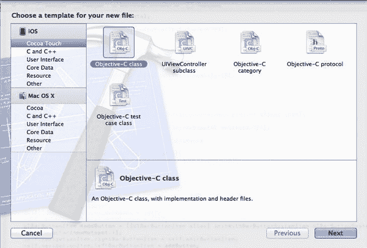

**图 10-4.** 创建 `NSObject` 子类

在下一个界面中，将文件名设为“Hotspot”，并确保“Subclass of”字段设置为“NSObject”。点击完成创建文件。

在 `Hotspot` 类的头文件 `Hotspot.h` 中，定义一系列 `NSString` 属性来表示该对象的数据。

```objc
#import <Foundation/Foundation.h>

@interface Hotspot : NSObject

@property (nonatomic, strong) NSString *name;
@property (nonatomic, strong) NSString *address;
@property (nonatomic, strong) NSString *city;
@property (nonatomic, strong) NSString *state;

@end
```

在实现文件 `Hotspot.m` 中，为这四个属性添加一条 `@synthesize` 指令。

```objc
@synthesize name, city, state, address;
```

接下来，你将创建另一个视图控制器，用于管理用户创建和编辑 `Hotspot` 对象。新建文件，选择“UIViewController subclass”模板。将类名设为“HotspotInfoViewController”，并确保“Subclass of”字段设置为 `UIViewController`，如图 10-5 所示。同时确保勾选“With XIB for user interface”复选框。

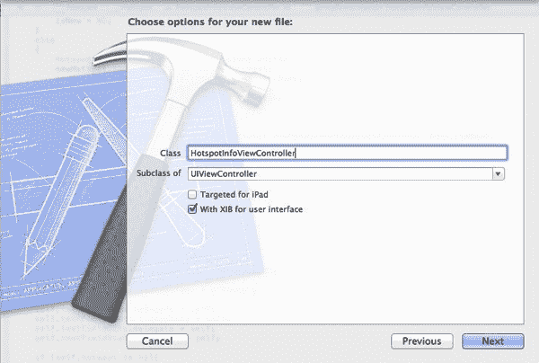

**图 10-5.** 配置新的视图控制器

在新创建的控制器的 XIB 文件 `HotspotInfoViewController.xib` 中，按照图 10-6 所示构建用户界面。

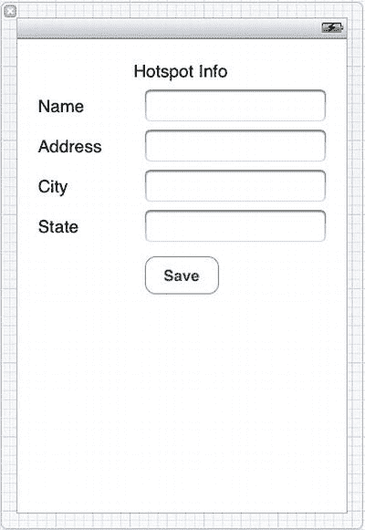

**图 10-6.** 配置 `HotspotInfoViewController.xib` 文件

将每个 `UITextField` 元素连接到视图控制器的头文件，分别使用属性标识符 `textFieldName`、`textFieldAddress`、`textFieldCity` 和 `textFieldState`。你无需为 `UIButton` 定义属性，但需要将其连接到一个 `IBAction` 方法 `-saveButtonPressed:`。这些修改应在头文件中添加以下属性和方法声明。

```objc
@property (strong, nonatomic) IBOutlet UITextField *textFieldName;
@property (strong, nonatomic) IBOutlet UITextField *textFieldAddress;
@property (strong, nonatomic) IBOutlet UITextField *textFieldCity;
@property (strong, nonatomic) IBOutlet UITextField *textFieldState;
- (IBAction)saveButtonPressed:(id)sender;
```

此类需要一个 `Hotspot` 属性来引用当前正在查看的 `Hotspot` 对象。添加 `Hotspot` 类的导入语句。

```objc
#import "Hotspot.h"
```

声明 `Hotspot` 属性。

```objc
@property (strong, nonatomic) IBOutlet Hotspot *hotspot;
```

你还将创建一个 `delegate` 属性，用于处理此类使用完成后的回调。通过在头文件的 `@interface` 部分上方添加以下代码，定义协议 `HotspotInfoDelegate`。
```

```objc
@class HotspotInfoViewController;
@protocol HotspotInfoDelegate <NSObject>
-(void)HotspotInfoViewController:(HotspotInfoViewController *)hotspotInfoVC
didReturnHotspot:(Hotspot *)hotspot isNew:(BOOL)isNew;
@end
```

现在，你可以像这样声明 `delegate` 属性：

```objc
@property (strong, nonatomic) id<HotspotInfoDelegate> delegate;
```

请确保 `delegate` 和 `hotspot` 属性都已正确合成，并且在控制器的 `-viewDidUnload` 方法中均被设置为 `nil`。

最后，你将让这个视图控制器成为所添加的四个 `UITextField` 元素的委托。因此，请在接口行中添加 `<UITextFieldDelegate>` 代码，以确保该类遵循 `UITextFieldDelegate` 协议。

现在，你的 `HotspotInfoViewController.h` 文件整体上应该如下所示：

```objc
#import <UIKit/UIKit.h>
#import "Hotspot.h"

@class HotspotInfoViewController;

@protocol HotspotInfoDelegate <NSObject>
-(void)HotspotInfoViewController:(HotspotInfoViewController *)hotspotInfoVC
didReturnHotspot:(Hotspot *)hotspot isNew:(BOOL)isNew;
@end

@interface HotspotInfoViewController : UIViewController<UITextFieldDelegate>

@property (strong, nonatomic) IBOutlet UITextField *textFieldName;
@property (strong, nonatomic) IBOutlet UITextField *textFieldAddress;
@property (strong, nonatomic) IBOutlet UITextField *textFieldCity;
@property (strong, nonatomic) IBOutlet UITextField *textFieldState;
- (IBAction)saveButtonPressed:(id)sender;

@property (strong, nonatomic) Hotspot *hotspot;

@property (strong, nonatomic) id<HotspotInfoDelegate> delegate;

@end
```

在 `HotspotInfoViewController` 的实现文件中，你需要添加一个方法，用给定的 `Hotspot` 信息填充视图。

```objc
-(void)populateWithHotspot
{
    self.textFieldName.text = hotspot.name;
    self.textFieldAddress.text = hotspot.address;
    self.textFieldCity.text = hotspot.city;
    self.textFieldState.text = hotspot.state;
}
```

此方法将在 `-viewDidLoad` 方法中被调用，该方法还会配置你的用户界面。

```objc
- (void)viewDidLoad
{
    [super viewDidLoad];
    self.textFieldName.placeholder = @"名称";
    self.textFieldAddress.placeholder = @"地址";
    self.textFieldCity.placeholder = @"城市";
    self.textFieldState.placeholder = @"州/省";

    self.textFieldName.delegate = self;
    self.textFieldAddress.delegate = self;
    self.textFieldCity.delegate = self;
    self.textFieldState.delegate = self;

    if (self.hotspot != nil)
    {
        [self populateWithHotspot];
    }
}
```

如果你没有将 `-populateWithHotspot` 方法的代码放在 `-viewDidLoad` 方法之前，那么你需要在头文件中为前者添加一个方法签名。

包含一个简单的方法，当用户完成对 `UITextField` 的编辑时，用于关闭键盘：

```objc
-(BOOL)textFieldShouldReturn:(UITextField *)textField
{
    [textField resignFirstResponder];
    return NO;
}
```

最后，`-saveButtonPressed:` 方法将根据情况，保存当前的 `Hotspot`（如果已提供）或创建一个新的。然后，该对象将通过 `-HotspotInfoViewController:didReturnHotspot:isNew:` 方法传递回你的 `delegate` 属性，以便妥善处理。

```objc
- (IBAction)saveButtonPressed:(id)sender
{
    BOOL isNew;
    if (self.hotspot != nil)
    {
        self.hotspot.name = self.textFieldName.text;
        self.hotspot.address = self.textFieldAddress.text;
        self.hotspot.city = self.textFieldCity.text;
        self.hotspot.state = self.textFieldState.text;
        isNew = NO;
    }
    else
    {
        Hotspot *newHotspot = [[Hotspot alloc] init];
        newHotspot.name = self.textFieldName.text;
        newHotspot.address = self.textFieldAddress.text;
        newHotspot.city = self.textFieldCity.text;
        newHotspot.state = self.textFieldState.text;
        self.hotspot = newHotspot;
        isNew = YES;
    }
    [self.delegate HotspotInfoViewController:self didReturnHotspot:self.hotspot isNew:isNew];
}
```

__________

现在，你将构建主视图控制器。在这个类的 XIB 文件中，添加一个 `UITableView` 来填充整个视图，如图 10–7 所示。

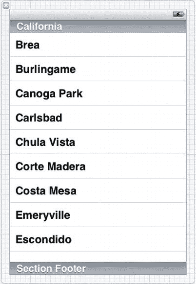

**图 10–7.** *向主视图控制器添加 `UITableView`*

使用属性名 `tableViewHotspots` 将此 `UITableView` 连接到你的头文件。

在主视图控制器的头文件中创建一个 `NSMutableArray` 属性，用于存放 `Hotspot` 对象。

```objc
@property (strong, nonatomic) NSMutableArray *hotspots;
```

在此头文件中添加以下两条 import 语句。

```objc
#import "HotspotInfoViewController.h"
#import "Hotspot.h"
```

最后，确保告知此控制器遵循 `UITableViewDelegate` 和 `UITableViewDataSource` 协议，以及你创建的 `HotspotsInfoDelegate` 协议。

完成所有这些更改后，你的头文件应如下所示：

```objc
#import <UIKit/UIKit.h>
#import "HotspotInfoViewController.h"
#import "Hotspot.h"

@interface MainViewController : UIViewController<UITableViewDelegate,
UITableViewDataSource, HotspotInfoDelegate>

@property (strong, nonatomic) IBOutlet UITableView *tableViewHotspots;
@property (strong, nonatomic) NSMutableArray *hotspots;

@end
```

在该类的实现文件中，在合成 `hotspots` 属性之后，你需要声明一个自定义的 getter 方法，以确保数组被正确创建。

```objc
-(NSMutableArray *)hotspots
{
    if (!hotspots)
    {
        hotspots = [[NSMutableArray alloc] initWithCapacity:10];
    }
    return hotspots;
}
```

你将编写 `-viewDidLoad` 方法来设置 `UITableView` 的 `delegate` 和 `dataSource` 属性，并配置用户界面以在 `UINavigationController` 中工作。

```objc
- (void)viewDidLoad
{
    [super viewDidLoad];
    self.title = @"热点";

    self.tableViewHotspots.delegate = self;
    self.tableViewHotspots.dataSource = self;

    UIBarButtonItem *addButton = [[UIBarButtonItem alloc]
                                  initWithBarButtonSystemItem:UIBarButtonSystemItemAdd target:self
                                  action:@selector(newHotspot:)];
    self.navigationItem.rightBarButtonItem = self.editButtonItem;
    self.navigationItem.leftBarButtonItem = addButton;
}
```

所使用的 `-newHotspot:` 选择器将很容易实现，以显示一个未预设 `hotspot` 的 `HotspotInfoViewController` 实例。

```objc
-(void)newHotspot:(id)sender
{
    HotspotInfoViewController *hotspotVC = [[HotspotInfoViewController alloc] init];
    hotspotVC.delegate = self;
    [self.navigationController pushViewController:hotspotVC animated:YES];
}
```

为了响应 `HotspotInfoViewController` 完成使用的情况，你应该实现之前指定的 `HotspotInfoDelegate` 方法。

```objc
-(void)HotspotInfoViewController:(HotspotInfoViewController *)hotspotInfoVC
didReturnHotspot:(Hotspot *)hotspot isNew:(BOOL)isNew
{
    if (isNew)
    {
        [self.hotspots addObject:hotspot];
    }
    [self.tableViewHotspots reloadData];

    [self.navigationController popViewControllerAnimated:YES];
}
```

您将需要调整视图控制器的行为，以处理视图的消失和重新出现，方法是重写以下两个方法。

```
- (void)viewWillAppear:(BOOL)animated
{
    self.title = @"Hotspots";
    [super viewWillAppear:animated];
}

- (void)viewDidDisappear:(BOOL)animated
{
    self.title = @"Cancel";
    [super viewDidDisappear:animated];
}
```

现在，要配置`UITableView`，您必须指定要显示的行数，该行数将基于`hotspots`数组的计数。

```
- (NSInteger)tableView:(UITableView *)tableView numberOfRowsInSection:(NSInteger)section
{
    return [self.hotspots count];
}
```

您将配置表格单元格的显示，以简单地显示每个`Hotspot`对象的`name`和`address`。

```
- (UITableViewCell *)tableView:(UITableView *)tableView
         cellForRowAtIndexPath:(NSIndexPath*)indexPath
{
    static NSString *CellIdentifier = @"Cell";

    UITableViewCell *cell = [tableView dequeueReusableCellWithIdentifier:CellIdentifier];
    if (cell == nil)
    {
        cell = [[UITableViewCell alloc] initWithStyle:UITableViewCellStyleSubtitle
                                       reuseIdentifier:CellIdentifier];
        cell.accessoryType = UITableViewCellAccessoryDisclosureIndicator;
    }

    Hotspot *currentHotspot = [self.hotspots objectAtIndex:indexPath.row];

    cell.textLabel.text = currentHotspot.name;
    cell.detailTextLabel.text = currentHotspot.address;

    return cell;
}
```

您将实现表格，使得选择某一行会显示一个`HotspotInfoViewController`，其中包含该行的信息，以便用户可以轻松编辑任何给定的对象。

```
- (void)tableView:(UITableView *)tableView didSelectRowAtIndexPath:(NSIndexPath*)indexPath
{
    [self.tableViewHotspots deselectRowAtIndexPath:indexPath animated:YES];

    HotspotInfoViewController *hotspotVC = [[HotspotInfoViewController alloc] init];
    hotspotVC.delegate = self;
    hotspotVC.hotspot = [self.hotspots objectAtIndex:indexPath.row];
    [self.navigationController pushViewController:hotspotVC animated:YES];
}
```

最后，您还需要使`UITableView`支持对象的重新排列和删除。要允许编辑和删除，您需要实现以下两个方法。

```
- (BOOL)tableView:(UITableView *)tableView canEditRowAtIndexPath:(NSIndexPath*)indexPath
{
    return YES;
}

- (void)tableView:(UITableView *)tableView
    commitEditingStyle:(UITableViewCellEditingStyle)editingStyle
     forRowAtIndexPath:(NSIndexPath *)indexPath
{
    if (editingStyle == UITableViewCellEditingStyleDelete)
    {
        [self.hotspots removeObjectAtIndex:indexPath.row];
        [tableView deleteRowsAtIndexPaths:[NSArray arrayWithObject:indexPath]
                         withRowAnimation:UITableViewRowAnimationFade];
    }
}
```

您还必须重写`-setEditing:animated:`方法，以正确地将`UITableView`和编辑按钮结合起来。

```
-(void)setEditing:(BOOL)editing animated:(BOOL)animated
{
    [super setEditing:editing animated:animated];
    [self.tableViewHotspots setEditing:editing animated:animated];
}
```

为了允许重新排列单元格，还将添加以下两个方法。

```
- (BOOL)tableView:(UITableView *)tableView canMoveRowAtIndexPath:(NSIndexPath*)indexPath
{
    return YES;
}

- (void)tableView:(UITableView *)tableView
    moveRowAtIndexPath:(NSIndexPath*)fromIndexPath
           toIndexPath:(NSIndexPath *)toIndexPath
{
    Hotspot *movingHotspot = [self.hotspots objectAtIndex:fromIndexPath.row];
    [self.hotspots removeObject:movingHotspot];
    [self.hotspots insertObject:movingHotspot atIndex:toIndexPath.row];
    [self.tableViewHotspots reloadData];
}
```

最后，在测试应用之前，您需要修改应用程序委托的实现文件，将视图控制器放入`UINavigationController`中。调整`-application:didFinishLaunchingWithOptions:`方法如下所示。

```
- (BOOL)application:(UIApplication *)application
didFinishLaunchingWithOptions:(NSDictionary *)launchOptions
{
    self.window = [[UIWindow alloc] initWithFrame:[[UIScreen mainScreen] bounds]];
    self.viewController = [[MainViewController alloc]
                            initWithNibName:@"MainViewController"
                                     bundle:nil];
    __strong UINavigationController *navcon = [[UINavigationController alloc]
                                                initWithRootViewController:self.viewController];
    self.window.rootViewController = navcon;
    [self.window makeKeyAndVisible];
    return YES;
}
```

您的用户界面现已完全设置，允许您创建要在`UITableView`中显示、编辑或删除的`Hotspot`对象，如在图 10-8 中创建一些示例数据后所示。

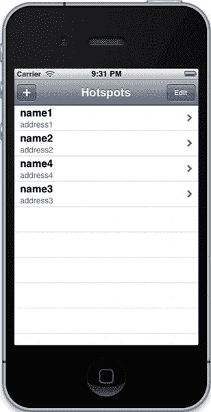

**Figure 10–8.** *您的应用带有示例数据的`UITableView`*

现在，使用此应用程序唯一剩下的任务就是能够保存数据，使其在应用间持久化。

为了实现应用程序中的持久化，您将使用文件系统以及“归档”和“解档”对象的概念。

要归档（即“编码”）任何给定的对象，它及其内部存储的所有属性都必须被明确告知如何编码。对于任何预制的 iOS 对象，例如`NSArray`或`NSDictionary`，这已经完成。但是，为了编码您的`Hotspot`对象，您需要添加一些关于如何处理它们的具体指令。

在`Hotspot.h`类中，通过将`@interface`行更改为以下内容，指定您的类将遵守`NSCoding`协议：

```
@interface Hotspot : NSObject<NSCoding>
```

现在，您必须实现`-encodeWithCoder:`方法，以指定如何编码`Hotspot`对象以进行保存。

```
- (void) encodeWithCoder:(NSCoder *)encoder
{
    [encoder encodeObject:self.name forKey:@"name"];
    [encoder encodeObject:self.address forKey:@"address"];
    [encoder encodeObject:self.city forKey:@"city"];
    [encoder encodeObject:self.state forKey:@"state"];
}
```

在加载数据的反向过程中，您必须实现`-initWithCoder:`方法，以使用归档数据创建`Hotspot`类的实例。通过使用与前一个方法相同的键，您可以轻松提取所需的`NSString`对象。

```
- (id)initWithCoder:(NSCoder *)decoder
{
    self = [super init];
    if (self)
    {
        self.name = [decoder decodeObjectForKey:@"name"];
        self.address = [decoder decodeObjectForKey:@"address"];
        self.city = [decoder decodeObjectForKey:@"city"];
        self.state = [decoder decodeObjectForKey:@"state"];
    }
    return self;
}
```

现在，回到您的主视图控制器，您可以创建一个方法，将数据保存到特定文件。

```
-(void)saveData
{
    NSString *rootPath = [NSSearchPathForDirectoriesInDomains(NSDocumentDirectory,
                                    NSUserDomainMask, YES) objectAtIndex:0];
    NSString *savePath = [rootPath stringByAppendingPathComponent:@"hotspotsData"];
    NSFileManager *fileManager = [NSFileManager defaultManager];
    NSMutableData *saveData = [[NSMutableData alloc] init];

    NSKeyedArchiver *archiver = [[NSKeyedArchiver alloc] initForWritingWithMutableData:saveData];
    [archiver encodeObject:self.hotspots forKey:@"DataArray"];
    [archiver finishEncoding];

    [fileManager createFileAtPath:savePath contents:saveData attributes:nil];
}
```

此方法包含以下步骤：


1. 获取用于保存数据的根目录路径。您已经指定了“Documents Directory”，但根据应用程序的需求，还有其他可能的目录可供使用。
2. 将文件名`hotspotsData`附加到根路径上，以创建数据文件的路径。
3. 获取`NSFileManager`类的共享实例。
4. 获取一个空的`NSMutableData`实例。
5. 使用`NSKeyedArchiver`类，通过键“DataArray”编码您的`hotspots NSArray`。生成的编码数据将保存在您获取的`NSMutableData saveData`对象中。
    1.  尽管您无法看到其实际代码，但`-encodeObject:forKey:`调用将使用您在`Hotspot.m`文件中定义的`-encodeWithCoder:`方法来归档数组中的所有`Hotspot`对象。
6. 使用`NSFileManager`，在指定路径使用编码数据创建文件。如果该路径已存在文件，它将被覆盖，这对您的应用程序非常适用。

现在，要执行反向过程，您可以创建一个`-loadData`方法，如下所示：

```
-(void)loadData
{
NSString *rootPath = [NSSearchPathForDirectoriesInDomains(NSDocumentDirectory,
NSUserDomainMask, YES) objectAtIndex:0];
NSString *savePath = [rootPath stringByAppendingPathComponent:@"hotspotsData"];
NSFileManager *fileManager = [NSFileManager defaultManager];
if ([fileManager fileExistsAtPath:savePath])
    {
NSData *data = [fileManager contentsAtPath:savePath];
NSKeyedUnarchiver *unarchiver = [[NSKeyedUnarchiver alloc] initForReadingWithData:data];
self.hotspots = [unarchiver decodeObjectForKey:@"DataArray"];
    }
}
```

此方法与之前的反向方法几乎相同，它从特定文件路径获取`NSData`，解档它，然后从解码后的数据重新创建`NSArray`。正如`encodeObject:forKey:`方法使用了您的`-encodeWithCoder:`，`decodeObjectForKey:`方法将为其解码对象中的所有对象（包括`NSArray`及其包含的所有`Hotspot`）使用`-initWithCoder:`方法。

现在，您只需将对这两个新方法的调用放在正确的位置。在您的`-viewDidLoad`方法中添加对`-loadData`的调用。

```
[self loadData];
```

将`-saveData`和`-loadData`方法的方法签名添加到视图控制器的头文件中，以避免任何编译器问题。

每次数组被修改时，您都需要添加对`-saveData`方法的调用，包括在以下方法中：

```
-(void)HotspotInfoViewController:(HotspotInfoViewController *)hotspotInfoVC
didReturnHotspot:(Hotspot *)hotspot isNew:(BOOL)isNew
{
    if (isNew)
    {
        [self.hotspots addObject:hotspot];
    }
    [self.tableViewHotspots reloadData];
    //New call to save data
    [self saveData];

    [self.navigationController popViewControllerAnimated:YES];
}
- (void)tableView:(UITableView *)tableView
commitEditingStyle:(UITableViewCellEditingStyle)editingStyle
forRowAtIndexPath:(NSIndexPath *)indexPath
{
    if (editingStyle == UITableViewCellEditingStyleDelete)
    {
        [self.hotspots removeObjectAtIndex:indexPath.row];
        [tableView deleteRowsAtIndexPaths:[NSArray arrayWithObject:indexPath]
withRowAnimation:UITableViewRowAnimationFade];
        //New call to save data
        [self saveData];
    }
}
- (void)tableView:(UITableView *)tableView moveRowAtIndexPath:(NSIndexPath
*)fromIndexPath toIndexPath:(NSIndexPath *)toIndexPath
{
    Hotspot *movingHotspot = [self.hotspots objectAtIndex:fromIndexPath.row];
    [self.hotspots removeObject:movingHotspot];
    [self.hotspots insertObject:movingHotspot atIndex:toIndexPath.row];
    [self.tableViewHotspots reloadData];
    //New call to save data
    [self saveData];
}
```

一旦添加了这些调用，您的应用程序将能够自动将对数据的任何新更改保存到外部文件，以便在重新打开应用程序时读取！

在您的演示应用程序中，您没有实现将图像保存到文件，尽管这是 iOS 文件管理系统最有效和最常见的用途之一。这个过程甚至比前面的实现更简单。要保存图像，请获取表示图像的`NSData`对象，然后使用`NSFileManager`方法`-createFileAtPath:contents:attributes`写出数据。或者，您也可以使用`NSData`方法`-writeToFile:atomically:`执行相同的任务。

要获取表示`UIImage`的数据，您可以使用`UIImagePNGRepresentation()`或`UIImageJPEGRepresentation()`函数，这两个函数都返回`NSData`。要使用从文件读取的`NSData`重新构建`UIImage`，请使用`+imageWithData:`或`-initWithData:`方法。

### Core Data

到目前为止，您已经接触了用于轻量级值的`NSUserDefaults`的快速实现，以及用于更复杂或更大量数据的文件管理系统。尽管使用文件管理系统存储数据非常强大，但在处理交织类的复杂数据模型时，它很容易变得相当笨重。对于由轻量级对象组成的复杂数据模型，持久化的最佳选择是`Core Data`。这个基于 MySQL 表系统的框架，允许轻松创建、操作和持久化复杂的类交互和属性。这个类的使用相当复杂，因此将在下一章中详细介绍。


### 方案 10–3：利用 iCloud 实现数据持久化

iOS 5.0 发布时带来的最重大的扩展之一，便是能够创建访问全新 iCloud 服务的应用程序。通过运用与上一方案中文件管理系统类似的概念，你不仅能在本地设备上保存、持久化存储和加载数据，还能在使用同一应用的多个设备之间实现数据同步。

在本节的所有方案中，你都需要拥有 iOS 开发计划的访问权限，以及一台实体 iOS 设备。

为了配置应用以使用 iCloud，必须首先完成一系列配置任务。首先，像之前一样，使用 `Single View Application` 模板创建一个新项目。请确保你的项目名称为 `iCloudTest`，类前缀为 `iCloudStore`。虽然这些值通常对你的应用影响不大，但如果你按照本方案中的名称来命名，将有助于简化本次演示。你的项目配置应类似于图 10–9。

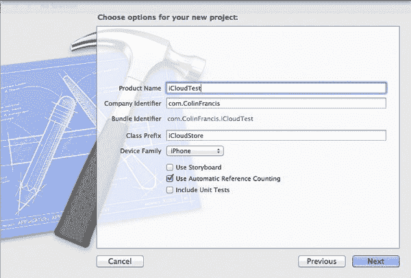

**图 10–9.** *配置应用以配合 iCloud 工作*

首先，你必须配置项目以启用“授权”。在你的新项目中，导航到项目的 Target 设置，向下滚动到名为“Entitlements”的底部区域。勾选标记为“Enable Entitlements”的复选框，如图 10–10 底部所示，让 Xcode 自动生成你的授权文件。

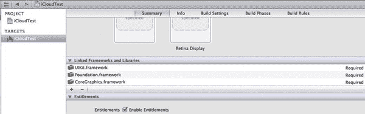

**图 10–10.** *启用授权以允许与 iCloud 通信*

接下来，你需要为此应用生成一个特殊的“App ID”。在浏览器中，登录 iOS 开发者会员中心：[`http://developer.apple.com/membercenter/`](http://developer.apple.com/membercenter/)。导航到 iOS 预置描述文件门户，然后进入 App IDs 部分。点击标有“New App ID”的按钮。

接下来你会看到一个屏幕，提示你输入描述以及包标识符。将描述设置为 `iCloudTest`。对于包标识符，你需要输入与 Xcode 分配给应用的完全相同的标识符。这可以在项目 Target 设置的顶部、Entitlements 部分上方找到，如图 10–11 所示。其格式很可能类似于 `com.domainName.iCloudTest`。将“Identifier”下显示的文本复制到浏览器的包标识符行中。

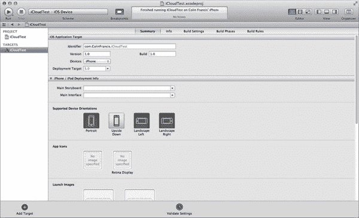

**图 10–11.** *查找应用标识符以进行配置*

在图 10–11 中，我的标识符是 `com.ColinFrancis.iCloudTest`，因此我将把它作为包标识符复制到浏览器中，如图 10–12 所示。

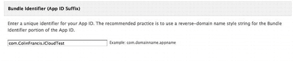

**图 10–12.** *将项目的标识符复制到包标识符字段中*

创建这个新的 App ID 后，你会返回到已创建的 App ID 列表中。找到刚创建的那个，点击 `Configure` 链接。

在此屏幕中，你只需要勾选标记为“Enable for iCloud”的复选框，如图 10–13 所示。如果有对话框弹出，警告你需要手动重新生成预置描述文件，只需点击 OK 即可。

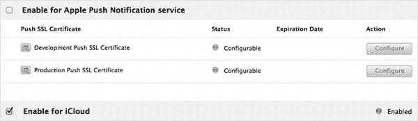

**图 10–13.** *为你的证书启用 iCloud*

点击 **Done** 完成 App ID 的配置。

接下来，向下移动到屏幕左侧 App IDs 选项卡下方的 `Provisioning` 选项卡。点击 `New Profile` 按钮开始创建新的预置描述文件。

将此新预置描述文件命名为 `iCloudProfile`。选择你作为 iOS 开发者应已拥有的证书。将 App ID 字段设置为你刚刚创建的 `iCloudTest` App ID，并确保勾选你希望在其上测试此应用的设备旁边的复选框。图 10–14 显示了我的配置屏幕，你的屏幕应与之类似，只是使用你自己的信息。

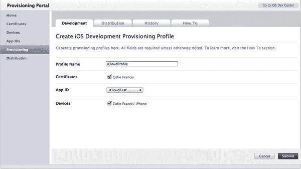

**图 10–14.** *为你的 iCloud 应用创建新的预置描述文件*

点击 **Submit** 返回预置描述文件列表。你应该会看到新列出的预置描述文件。如果其状态显示为“Pending”，只需刷新页面直至显示为“Active”。

接下来，点击你新创建的预置描述文件旁边的 **Download** 按钮，将其下载到你的电脑。

文件下载完成后（应该不会花很长时间），将文件从 Finder 拖拽到 Dock 中的 Xcode 图标上，以将其导入 Xcode。这也会打开 `Organizer` 窗口，其中会列出你所有的预置描述文件。

最后，在 `Organizer` 中，当你的设备已连接到电脑时，将新预置描述文件从显示的列表中拖拽到你设备下的 `Provisioning Profiles` 部分，如图 10–15 所示。

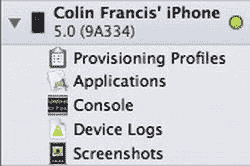

**图 10–15.** *将新预置描述文件复制到设备的预置描述文件部分*

此时，你的设备已完全配置好，可以运行你创建的项目了。

你必须在项目中执行最后一步，才能使应用真正能够使用 iCloud 服务。你需要在视图控制器中定义一个包含“通用容器 URL”的常量。这个 `NSString` 本质上就是你的开发者帐户 ID 加上你的包标识符作为前缀。例如，如果你的包标识符是 `com.domainName.iCloudTest`，帐户 ID 是 `12345ABCDE`，那么 URL 将是 `12345ABCDE.com.domainName.iCloudTest`。如果不确定你的帐户 ID，可以再次导航到 `Member Center` 并进入 **Your Account** 选项卡来查找。如果你使用的是个人帐户，它将在你的姓名旁边显示为 **Individual ID**。

在整个项目中，你将使用示例 URL `12345ABCDE.com.domainName.iCloudTest`。请确保根据你自己的帐户 ID 和域名进行修改。

将以下定义添加到你的 `iCloudStoreViewController.m` 文件顶部，以便稍后引用。

```
#define UBIQUITY_CONTAINER_URL @"12345ABCDE.com.domainName.iCloudTest"
```

为了使你的应用正常工作，你还必须确保你的授权文件已使用相同的 URL 正确配置。导航到你的授权文件，确保 `com.apple.developer.ubiquity-container-identifiers`（第 0 项）和 `com.apple.developer.ubiquity-kvstore-identifier` 的值都设置为此值。Xcode 应该会自动设置这些值，但最好总是确认一下。如果没有，请按图 10–16 所示进行设置。

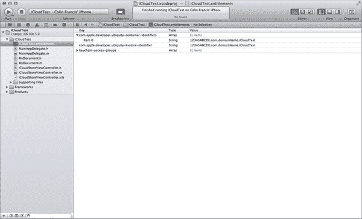

**图 10–16.** *确认授权文件的正确配置*

现在，你的应用和设备已配置好以配合 iCloud 工作，你可以继续构建实际的应用了。

为了构建一个简单的程序来将文本文档保存到 iCloud，你需要使用 `UIDocument` 抽象类。你的子类将包含将所有文本信息编码成可在线保存的文件所需的全部信息。创建一个新文件，并选择“Objective-C class”模板。配置此文件最简单的方法是先将 `NSObject` 类命名为父类。稍后你将更改实际的父类。将文件命名为 `MyDocument`。


创建好类后，修改 `MyDocument.h` 文件的 `@interface` 行，将其指定为 `UIDocument` 的子类，代码如下：

```
@interface MyDocument : UIDocument
```

你将只给这个类一个属性，即类型为 `NSString` 的 `userText`，用于存储待编码和解码的文本。请确保在实现文件中合成（synthesize）该属性。你的 `MyDocument.h` 文件应如下所示：

```
#import <Foundation/Foundation.h>

@interface MyDocument : UIDocument

@property (strong, nonatomic) NSString *userText;

@end
```

现在，你至少必须实现两个方法才能正确继承 `UIDocument` 的子类：`-contentsForType:error:` 和 `-loadFromContents:ofType:error:`。这两个方法将分别充当你的编码和解码方法，类似于之前的示例。

第一个方法将返回一个 `NSData` 对象，表示你的 `userText` 属性。

```
-(id)contentsForType:(NSString *)typeName error:(NSError *__autoreleasing *)outError
{
return [NSData dataWithBytes:[self.userText UTF8String] length:[self.userText length]];
}
```

第二个方法则执行反向操作，从原始数据构建一个 `NSString` 并将其赋值给属性。

```
-(BOOL) loadFromContents:(id)contents ofType:(NSString *)typeName error:(NSError
*__autoreleasing *)outError
{
if ([contents length] >0)
    {
self.userText = [[NSString alloc] initWithBytes:[contents bytes] length:[contents
length] encoding:NSUTF8StringEncoding];
    }
else
    {
self.userText = @"";
    }
return YES;
}
```

现在你的数据模型已配置完成（没错，就是这么简单！），就可以开始构建用户界面了。切换到 `iCloudStoreViewController.xib` 文件，使用 `UITextView` 和 `UIButton`，设置如图 10–17 所示的视图。

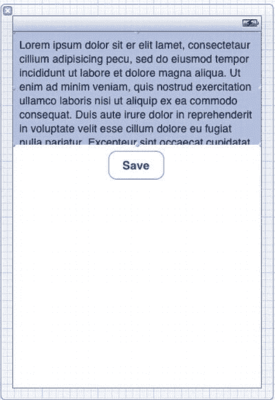

**图 10–17.** *一个用于保存文本的简单用户界面*

请确保视图的下半部分完全留空，因为用于编辑 `UITextView` 的键盘会覆盖这个区域。

你或许还想更改主 `UIView` 和 `UITextView` 的部分背景颜色，以便清晰区分它们。我将它们设为不同的灰色阴影，如后文图 10–19 所示。

使用 `textViewDisplay` 属性将 `UITextView` 连接到视图控制器的头文件。请确保像往常一样合成并妥善处理该属性。将 `UIButton` 连接到处理程序为 `-savePressed:` 的 `IBAction`。

你还需要几个其他属性来帮助执行 iCloud 操作。为 `MyDocument.h` 文件添加一个导入语句。

```
#import "MyDocument.h"
```

同时添加以下三个属性，确保像往常一样合成每个属性，并在 `-viewDidUnload` 中将它们设为 `nil`。

```
@property (strong, nonatomic) MyDocument *document;
@property (strong, nonatomic) NSURL *ubiquityURL;
@property (strong, nonatomic) NSMetadataQuery *metadataQuery;
```

接下来，实现 `-viewDidLoad` 方法，通过使用 `NSFileManager` 和 `NSMetadataQuery` 类创建查询，让 iCloud 搜索文档的任何已保存版本。

```
- (void)viewDidLoad
{
    [super viewDidLoad];

NSFileManager *filemgr = [NSFileManager defaultManager];

self.ubiquityURL = [[filemgr URLForUbiquityContainerIdentifier:UBIQUITY_CONTAINER_URL]
URLByAppendingPathComponent:@"Documents"];

if (self.ubiquityURL != nil)
    {
if ([filemgr fileExistsAtPath:[self.ubiquityURLpath]] == NO)
            [filemgr createDirectoryAtURL:self.ubiquityURL
withIntermediateDirectories:YES
attributes:nil
error:nil];

self.ubiquityURL = [self.ubiquityURL URLByAppendingPathComponent:@"document.doc"];

self.metadataQuery = [[NSMetadataQuery alloc] init];
        [self.metadataQuery setPredicate:[NSPredicate
predicateWithFormat:@"%K like 'document.doc'",
NSMetadataItemFSNameKey]];
        [self.metadataQuery setSearchScopes:[NSArray
arrayWithObjects:NSMetadataQueryUbiquitousDocumentsScope,nil]];

        [[NSNotificationCenter defaultCenter]
addObserver:self
selector:@selector(metadataQueryDidFinishGathering:)
name: NSMetadataQueryDidFinishGatheringNotification
object:metadataQuery];
        [self.metadataQuery startQuery];
    }
}
```

该方法包含以下步骤，用于创建查询以查找任何已保存的数据：

1.  使用 `-URLForUbiquityContainerIdentifier:` 方法获取 `ubiquityURL`。此调用使用了你之前根据账户 ID 和域名定义的标识符。如果该值不为 `nil`，则说明你的设备和应用已正确配置，可以将文档存储到 iCloud 中。
2.  使用 `-createDirectoryAtURL:withIntermediateDirectories:attributes:error:` 方法确保目标 URL 处存在必要的属性目录。
3.  将文件名 `"document.doc"` 附加到完整 URL 上。
4.  创建一个 `NSMetadataQuery` 实例，设置用于文件名的谓词以及用于通用文档的搜索范围。
5.  将视图控制器添加为查询完成的通知观察者。
6.  启动查询。

调用该方法后，你的应用将开始尝试查找存储在 iCloud 中的任何信息。为了响应查询结果，你必须实现先前在通知注册中提到的 `-metadataQueryDidFinishGathering:` 选择器。

```
- (void)metadataQueryDidFinishGathering: (NSNotification *)notification
{
NSMetadataQuery *query = [notification object];
    [query disableUpdates];

    [[NSNotificationCenter defaultCenter]
removeObserver:self
name:NSMetadataQueryDidFinishGatheringNotification
object:query];

    [query stopQuery];
NSArray *results = [[NSArray alloc] initWithArray:[query results]];

if ([results count] == 1)
    {
self.ubiquityURL = [[results lastObject] valueForAttribute:NSMetadataItemURLKey];
self.document = [[MyDocument alloc] initWithFileURL:ubiquityURL];

        [self.document openWithCompletionHandler:^(BOOL success)
        {
if (success)
             {
NSLog(@"已打开 iCloud 文档");
self.textViewDisplay.text = self.document.userText;
             }
else {
NSLog(@"无法打开 iCloud 文档");
   }
         }];
    }
else
    {
self.document = [[MyDocument alloc] initWithFileURL:self.ubiquityURL];
        [self.document saveToURL:self.ubiquityURL forSaveOperation:
UIDocumentSaveForCreating completionHandler:^(BOOL success)
        {
if (success)
              {
NSLog(@"文件已创建并保存到 iCloud");
              }
else
              {
NSLog(@"错误，无法将文件保存到 iCloud");
              }
        }];
    }
}
```

该方法通过执行以下步骤完成对 iCloud 中先前存储信息的搜索：

1.  获取原始的 `NSMetadataQuery` 对象，以禁用任何进一步更新，移除视图控制器的观察者身份，并停止查询。
2.  使用 `NSMetadataQuery` 的 `results` 属性创建一个包含找到的文档的 `NSArray`。
3.  获取该数组中的最后一个（也是唯一一个）对象，然后使用其键值 URL 创建一个 `UIDocument`。
4.  打开文档，完成后向用户显示文档中的文本。

该方法还包含了未找到文档（或找到多个文档）时的处理代码。在这种情况下，程序会尝试将一个空文件直接保存到 iCloud，以便该文件将来存在。

此时，你的应用将能够从 iCloud 加载任何先前存储的文本，因此你只需实现保存功能，就可以有信息可以检索了！保存数据的过程比检索它要简单得多。

```objc
- (void)savePressed:(id)sender
{
    self.document.userText = self.textViewDisplay.text;
    [self.document saveToURL:self.ubiquityURL
           forSaveOperation:UIDocumentSaveForOverwriting
          completionHandler:^(BOOL success) {
              if (success) {
                  NSLog(@"已写入 iCloud");
              } else {
                  NSLog(@"写入 iCloud 时出错");
              }
          }];
}
```

在继续测试应用程序之前，你需确保测试设备已正确配置以便与 iCloud 协同工作。在设备的“设置”应用中，导航至 iCloud 部分。为了让该应用正常存储数据，你的 iCloud 账户必须正确配置并已验证。这将要求你验证电子邮件地址并将其注册为 Apple ID。标记为 `Documents & Data` 的选项也应设为 `On`，如图 Figure 10–18 所示。当然，一旦账户通过验证，你可以轻松配置该选项。

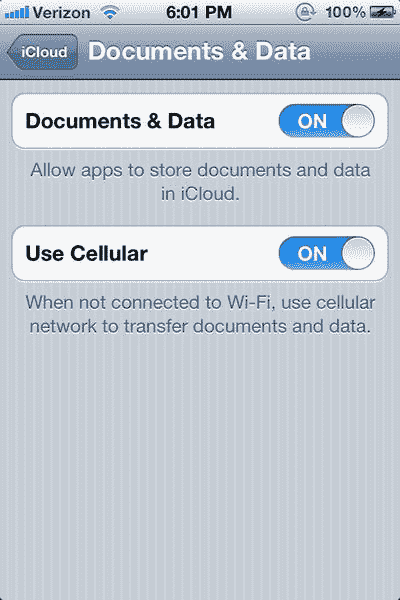

**图 10–18.** *必须启用“文档与数据”才能在 iCloud 中存储信息。*

假设你的设备已正确配置，简单的应用程序应能使用用户的 iCloud 账户正确地存储文档，从而使你能够轻松地在多台设备、应用关闭甚至系统重置后持久化数据，如 Figure 10–19 所示，其中背景颜色如前所述略有调整。

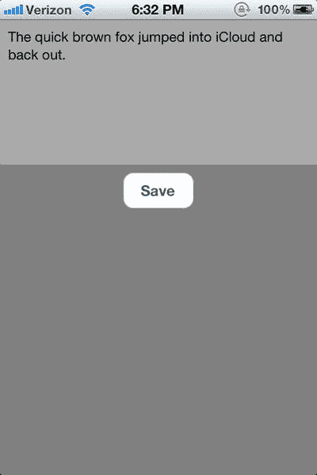

**图 10–19.** *你的应用程序通过 iCloud 保存和加载文本*

### 配方 10–4：在 iCloud 中存储键值数据

正如你在本章开头能够使用 `NSUserDefaults` 类轻松持久化各种轻量级对象一样，你也可以通过 iCloud 服务实现同类型的存储。你将通过记录文本被保存的次数，将此功能添加到应用程序中。虽然这看似微不足道，但能在多台设备上的同一应用中保持如此简单的值同步，将开启一个全新的开发潜能世界。

所有与 iCloud 的键值数据处理都是通过 `NSUbiquitousKeyValueStore` 类完成的。你将把一个实例作为属性添加到 `iCloudStoreViewController` 文件中，并确保进行合成并适当地将其设为 `nil`。

```objc
@property (strong, nonatomic) NSUbiquitousKeyValueStore *keyStore;
```

接下来，你将稍微调整用户界面，加入两个 `UILabel`，其中一个将显示保存次数。此时你的视图将类似于 Figure 10–20。

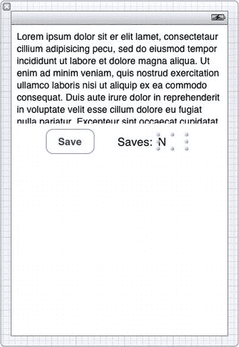

**图 10–20.** *通过两个新的 `UILabel` 重新排列 XIB 文件*

将右侧的 `UILabel`（在 Figure 10–20 中显示文本 `N`）通过属性 `countLabel` 连接到你的头文件。

```objc
@property (strong, nonatomic) IBOutlet UILabel *countLabel;
```

你可以通过将以下代码添加到 `-viewDidLoad` 方法的末尾，来配置应用程序在加载时立即检查任何计数。

```objc
self.keyStore = [[NSUbiquitousKeyValueStore alloc] init];
double count = [self.keyStore doubleForKey:@"count"];
self.countLabel.text = [NSString stringWithFormat:@"%f", count];
```

在上述代码之后添加以下行，将使你能够在 `NSUbiquitousKeyValueStore` 中的任何值发生更改时收到通知，从而让你在多台设备上保持信息更新。

```objc
[[NSNotificationCenter defaultCenter] addObserver:self selector:
    @selector(countChangeExternally:) name:
    NSUbiquitousKeyValueStoreDidChangeExternallyNotification object:self.keyStore];
```

你可以非常简单地实现 `-countChangeExternally:` 方法来设置 `UILabel` 的文本。

```objc
-(void)countChangeExternally:(id)sender
{
    double count = [self.keyStore doubleForKey:@"count"];
    self.countLabel.text = [NSString stringWithFormat:@"%f", count];
}
```

最后，你需要指示 `savePressed:` 方法正确更新该值。你仅在文本成功保存时才执行此操作，因此更新后的方法如下所示:

```objc
- (void)savePressed:(id)sender
{
    self.document.userText = self.textViewDisplay.text;
    [self.document saveToURL:self.ubiquityURL
           forSaveOperation:UIDocumentSaveForOverwriting
          completionHandler:^(BOOL success) {
              if (success) {
                  NSLog(@"已写入 iCloud");
                  double count = [self.countLabel.text doubleValue];
                  count += 1;
                  self.countLabel.text = [NSString stringWithFormat:@"%f", count];
                  [self.keyStore setDouble:count forKey:@"count"];
                  [self.keyStore synchronize];
              } else {
                  NSLog(@"写入 iCloud 时出错");
              }
          }];
}
```

现在，你的应用程序应能轻松存储轻量级的 double 值，以记录保存次数，如图 Figure 10–21 所示！

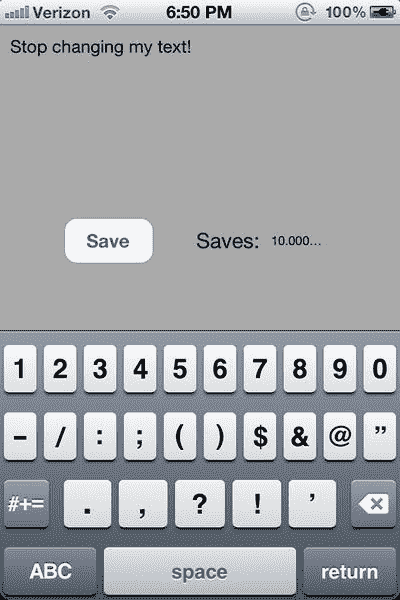

**图 10–21.** *通过 iCloud 同时存储文本和键值信息的应用*

### 总结

数据持久性几乎始终是开发应用程序时最重要的考虑因素之一。开发者必须考虑他们想要存储的数据类型、数据量、数据间如何关联，以及他们的应用程序是否可能跨越多个设备。在此基础上，必须选择存储数据的方法，无论是简单的 `NSUserDefaults` 方法、强大的文件管理系统，还是复杂的 Core Data 框架（如下一章所述）。在 iOS 5.0 中，新增的 iCloud 服务访问彻底改变了应用程序存储数据的方式，允许在运行同一应用的多个设备之间近乎实时地持久化数据。随着内存、存储和移动应用在技术世界中的规模、重要性和相关性不断增长，这些主题将变得更加重要。通过深入理解 iOS 中数据持久化的最新概念，你能够始终以最快、最高效、最强大的方法让用户的数据保持最新。

## 第 11 章

## Core Data 配方

开发者面临的最常见问题之一是持久化概念，或更简单地说，是存储数据。对于很大比例的应用程序而言，简单地在变量中存储信息是不够的，因为一旦应用程序关闭，所有内容都将丢失。虽然前一章涵盖了在多次使用之间存储数据的多种选项，但没有一个能比得上 Core Data 的多功能性、强大性和简洁性。

有大量的资源，包括整本书（我强烈推荐 Michael Privat 和 Robert Warner 所著的 *Pro Core Data for iOS*），它们仅专注于 Core Data 这一主题。指望在一章中涵盖如此多面化概念的每个部分是不现实的。因此，你不是从头开始构建 Core Data 接口，而是使用预构建的 Xcode 模板，以便提供对 Core Data 概念的最简单演示。这样，作为开发者的你可以更轻松地掌握 Core Data 应用，然后通过其他更专门的来源，专注于该主题更具体、更复杂的要点。


### 什么是 Core Data？

`Core Data` 是一种持久化方案。它不仅是一种持久化方案，而且是目前在 iOS 中实现持久化最佳的方法之一。

简而言之，`Core Data` 与 `Xcode` 相结合，允许开发者执行三项主要任务：

1.  创建数据模型
2.  持久化信息
3.  访问数据

首先，准确理解什么是数据模型非常重要。这个术语本质上指的是任何给定应用程序数据所围绕构建的结构。在简单的应用程序中，它可以是像 `NSString` 或 `NSArray` 这样简单的东西，一直到复杂、相互连接的对象类型系统，每种类型都有其自身的属性、方法和指向其他对象的指针。

其次，当您需要创建、保存和检索信息时，您应该对 `Core Data` 中涉及的各种对象和类有一个基本的了解，以及如何使用它们。

1.  `NSManagedObjectModel`：这是一个不常见的类，因为如果您使用模板，在编写代码时几乎不会直接处理它。这是 iOS 引用您数据模型（稍后将创建）的方式。当您为第一个示例创建项目时，您会在应用程序委托中看到此类型的实例，并在一些预生成的方法中看到它的使用，但除此之外，您没有理由以编程方式处理这个类。
2.  `NSPersistentStoreCoordinator`：这是一个您很少需要处理的类。它主要在应用程序的后台工作，用于“协调”您的应用程序与底层数据库或“持久化存储”之间的交互，但您无需向其发送任何操作。关于这个类，您需要了解的最重要部分是所使用的持久化存储的“类型”。持久化存储有三种类型：
    1.  `NSSQLiteStoreType`
    2.  `NSBinaryStoreType`
    3.  `NSInMemoryStoreType`

    默认值是第一种，`NSSQLiteStoreType`，指定您正在使用基于 `SQLite` 基础的持久化存储。您将在应用程序中继续使用此类型。

    根据您的应用程序，您可能还会发现 `NSInMemoryStoreType` 很有用，尽管它实际上不会在应用程序使用之间持久化数据。这可能更适合于缓存来自远程源信息的应用程序，因此需要一个基于 `Core Data` 构建的数据模型，但实际不需要存储信息，因为它可以从远程源重新检索。

3.  `NSManagedObjectContext`：与前两个不同，这个类是您会经常处理的类。简单来说，这个类充当了您信息的“工作区”。任何时候您需要检索或存储信息，都需要一个指向此类的指针来执行操作。因此，在基于 `Core Data` 的应用程序中，一个非常常见的做法是通过为每个视图控制器提供一个 `NSManagedObjectContext` 属性，在应用程序的各个部分之间“传递”一个指向此类的指针。
4.  `NSFetchedResultsController`：这是真正通过 `NSManagedObjectContext` “获取”结果的主要类。它不仅非常强大，而且非常易于使用，特别是与 `UITableView` 结合使用时。您将在本章中看到大量使用此类的示例。

在本章中，您还将使用各种其他特定于 `Core Data` 的类，但一旦您完成了数据模型的创建，这些类会更容易解释。

### 示例 11-1：创建数据模型

在本章中，您将创建一个名为“MusicSchool”的新项目。请确保选择“Empty Application”（空应用程序）模板，如图 11-1 所示。

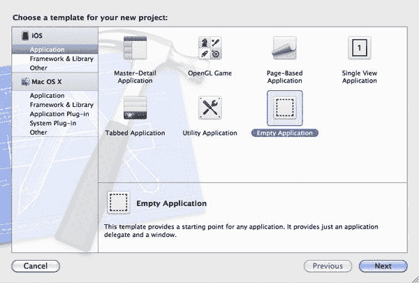

**图 11-1.** *从头开始创建一个空应用程序*

在下一个屏幕上，当您输入项目名称“MusicSchool”时，请务必选中标记为“Use Core Data”（使用 Core Data）的复选框。这是获得一个方便的 `Core Data` 模板的最简单方法，它可以大大简化您的工作，并预生成大量必要的代码。将类前缀设置为“Main”，并确保也勾选了“Use Automatic Reference Counting”（使用自动引用计数）复选框，如图 11-2 所示。“Company Identifier”（公司标识符）应更改为您自己的名称或公司名称。

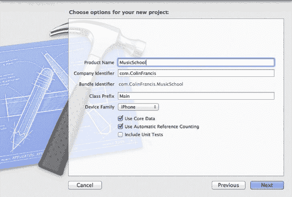

**图 11-2.** *配置项目以使用 Core Data*

在下一个屏幕上点击“Create”（创建），像往常一样完成项目的创建。

既然您已设置好项目以使用 `Core Data` 模板，那么使用 `Core Data` 框架所需的大量工作实际上已经为您完成了，因此您可以直接进入构建数据模型的阶段。

您可能已经猜到，您的数据模型将用于表示音乐学校的概念，特别关注教师和学生。在您开始在 `Xcode` 中做任何事之前，您需要精确规划您的模型将如何工作。

在处理数据模型时，您首先要创建的一种项目是“实体”。实体本质上等同于 `Core Data` 中的对象，并以完全相同的方式表示一个对象。

就像对象（或 Objective-C 中的 `NSObject`）具有属性一样，实体具有“属性”。这些是与任何给定实体相关的较简单的数据片段，例如姓名、年龄或生日，它们不需要指向任何其他实体的指针。

每当您希望一个实体拥有指向另一个实体的指针时，您就使用“关系”。关系可以是“对一”或“对多”，指的是一个实体是指向另一个实体的一个实例还是多个实例。当处理“对多”关系时，您会注意到该实体将拥有一个指向多个其他实体集合的指针。实体可以很容易地拥有指向自身的关系，例如，一个 `Person` 实体可能以配偶的形式拥有与另一个 `Person` 的关系。您还可以设置“反向关系”，它充当实体之间的往返路径。例如，一个 `Teacher` 实体可能有一个名为“students”的对 `Student` 实体的“对多”关系，而 `Student` 对 `Teacher` 的关系（称为“teachers”）将是它的反向关系。这样，您就可以非常轻松地访问任何 `Teacher` 的 `Student` 列表以及它们各自的 `Teacher` 列表。

因此，对于您的数据模型，您将拥有三个实体及其各自的属性和关系，如下所示：

1.  `Teacher`（教师）
    1.  属性：姓名、年龄、主要语言和教学年限
    2.  关系：Students（对多）和 Instruments（对多）
2.  `Student`（学生）
    1.  属性：姓名、年龄、主要语言和技能水平
    2.  关系：Teacher（对一）和 Instrument（对一）
3.  `Instrument`（乐器）
    *   属性：名称和类别
    *   关系：Students（对多）和 Teachers（对多）

虽然这些在对象之间来回定义的关系看起来可能有点复杂，但这实际上将允许您创建一个非常定义明确的数据模型，您可以从中查询几乎任何您需要的、来自另一个对象的信息。例如，您也许可以轻松地找到所有会弹钢琴的教师，然后访问他们各自的名字。


现在你已经规划好数据模型，可以在 Xcode 中进行构建。切换到你的数据模型文件，如果你使用了“MusicSchool”项目名称，该文件通常名为 `MusicSchool.xcdatamodeld`。你的视图应类似于 Figure 11-3。

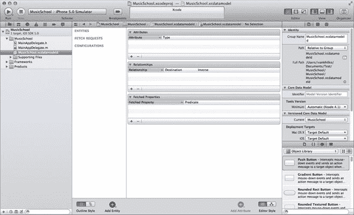

**图 11–3.** *你的空白数据模型*

如果窗口看起来像 Figure 11-4，你应切换为 Xcode 窗口右下角两个选项中的第一种编辑器样式。在本教程中，你只会使用第一种编辑器样式来实际配置数据模型。

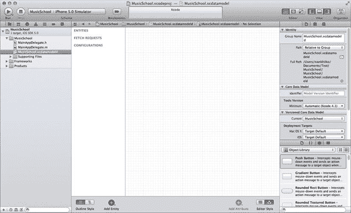

**图 11–4.** *图形编辑器样式*

你可以通过屏幕右下角的选项轻松更改数据模型的编辑器样式。选择两个选项中的左侧那个（即前两幅图中的第一个），使选择器看起来像 Figure 11-5。

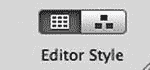

**图 11–5.** *确保为本食谱选择第一种编辑器样式。*

接下来，你将添加三个实体。你可以从“Editor”菜单中执行此操作，也可以使用视图中央下方的“Add Entity”按钮，该按钮如 Figure 11-6 所示。


**图 11–6.** *使用此按钮创建新实体。*

你将立即可以更改实体的名称，将其重命名为“Teacher”并按回车。

重复此操作两次以创建“Student”和“Instrument”实体。先创建所有实体再逐个配置会更容易，因为你需要它们来构建关系。之后，如果你选择“Teacher”实体，其实体列表应类似于 Figure 11-7。

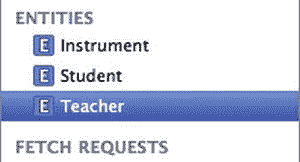

**图 11–7.** *将实体重命名以匹配你的数据计划。*

你将从配置“Teacher”实体开始，请确保选中此实体。

接下来，在“Teacher”实体的“Attributes”区域下，单击“+”按钮四次，为你的每个属性添加一次。根据你的计划命名每个属性（“name”、“age”、“language”和“years”即可）。对于每个属性，你还必须选择“Type”。对“name”和“language”属性使用“String”类型，对其他属性使用“Integer 16”类型，如 Figure 11-8 所示。

**注意：** 不同类型的整数（如 Integer 16、32、64）指的是用于存储每个值的位数。这些数字限制了你可使用的最大值，16 位值只能存储到 65,535。32 位值可存储到 4,294,967,295，而 64 位值可存储 10¹⁸ 量级的巨大数值。由于你的数字相当小，直接使用“Integer 16”类型即可。

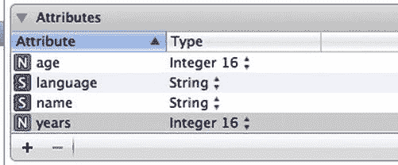

**图 11–8.** *配置 Teacher 实体的属性*

现在，在“Relationships”区域下，使用“+”按钮添加两个关系。将它们命名为“students”和“instruments”，并确保它们的 destination 值设置正确，如 Figure 11-9 所示（“students”关系对应“Student”，以此类推）。在你在其他实体中创建更多关系之前，你还无法设置“Inverse”关系。

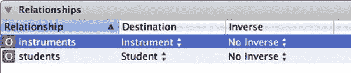

**图 11–9.** *配置 Teacher 实体的关系*

像为 XIB 文件中的任何视图元素调出“Attributes inspector”一样，调出“Data Model inspector”。选择创建的关系之一后，在检查器中勾选“To-Many Relationship”复选框，如 Figure 11-10 所示。请确保对 Teacher 的两个关系都执行此操作，因为根据你的计划，它们都是“to-many”关系。

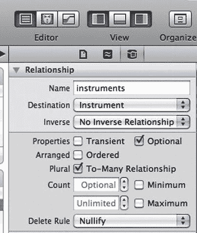

**图 11–10.** *将关系配置为“To-Many”*

尽管你可能不需要担心此检查器中的大多数其他值（至少从你的目的来看），但一个较重要的值是“Delete Rule”下拉菜单，如 Figure 11-10 所示。该值指定了当给定实体的实例从 `NSManagedObjectContext` 中删除时，此关系将如何处理。它有四个可能的值：

1.  *No Action*：这可能是最危险的值，因为它只是允许相关对象继续尝试访问已删除的对象，如果不小心处理，很容易导致访问问题。
2.  *Nullify*：默认值，指定关系在删除时将被空值化，因此会返回 `nil` 值。
3.  *Cascade*：使用此值可能有些危险，因为它指定如果某个对象被删除，所有通过此 Delete Rule 与之关联的对象也会被删除，以避免产生 `nil` 值。如果不小心使用，可能会意外删除大量数据，但它也非常适合保持数据清洁。例如，在包含多个对象的“文件夹”场景中可以使用此规则。当删除文件夹时，你通常也希望删除其中所有包含的对象。
4.  *Deny*：只要关系未指向 `nil`，此规则将阻止对象被删除。

在本教程中，你将 Delete Rule 保留为“Nullify”。

现在，选择你将进行配置的“Student”实体，添加你的四个属性（“age”、“language”、“name”和“skill”），并为它们指定适当的类型，如 Figure 11-11 所示（除了 `age` 再次使用“Integer 16”外，其余均使用“String”）。

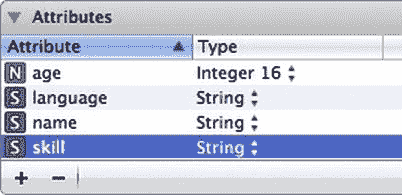

**图 11–11.** *配置 Student 实体的属性*

再创建两个关系“instrument”和“teacher”，并设置它们各自的 destination。你现在还可以将“teacher”关系的“Inverse”设置为“students”，如 Figure 11-12 所示。Teacher 实体中的“students”关系将自动将你刚创建的“teacher”关系设置为其 inverse。

**注意：** 逆关系并非总是必需的，但它们往往能让应用的组织和流程变得更好，使你能够更轻松地从任意数据访问所需的任何其他数据。

回顾你最初的数据模型计划，你会看到 Student 的两个关系不应是“to-many”，因此你无需进行此更改。

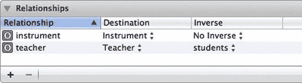

**图 11–12.** *配置 Student 实体的关系*

现在，你将配置第三个实体“Instrument”。它将拥有两个“String”类型的属性，分别名为“name”和“family”，如 Figure 11-13 所示。

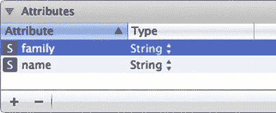

**图 11-13.** *配置 Instrument 实体的属性*

你将创建两个关系“teachers”和“students”，并指定它们各自的 destination。你应该能为这两个关系设置 inverse，如 Figure 11-14 所示。

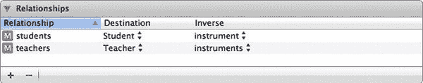

**图 11-14.** *配置 Instrument 实体的关系*

最后，请确保在“Data Model inspector”中将这两个关系都指定为“to-many”，与之前操作相同。


实际上，这就是创建数据模型所需的全部操作！如果切换到第二种 `Editor` 样式，你甚至可以看到实体间相互关联、属性及关系的一幅精美小型关系图，其中单箭头表示“对一”关系，双箭头表示“对多”关系。这些块最初可能全部堆叠在一起，但如果你将它们拖开，显示效果应该类似于图 11-15。

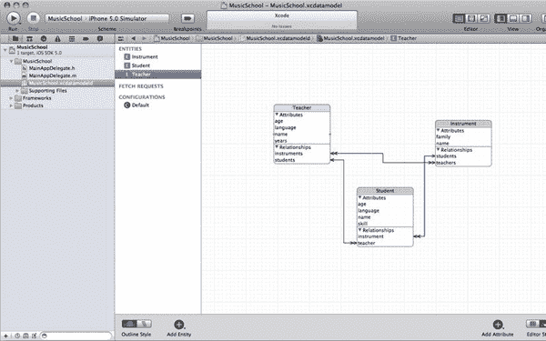

**图 11-15.** *完成数据模型后的最终图形视图*

### 食谱 11-2：使用 NSManagedObjects

现在你已经设置好了数据模型，可以开始构建应用程序的实际用户界面了。

你将以这种方式构建应用程序：能够查看三个不同的标签页，每个标签页都包含一个 `UITableView`，显示数据中某个实体的所有内容，并且每个标签页显示不同的实体。与其构建三个具有几乎完全相同设置的视图控制器，不如只构建一个，然后自定义显示的信息。

在你的项目中，创建一个名为“MainTableViewControlle”的新的 `UIViewController` 子类文件。在 XIB 文件中，向视图添加一个 `UITableView`，并使用属性名称 `tableViewMain` 将其连接到视图控制器的头文件。有关具体操作方法，请参考第 8 章。

你可以直接让这个 `UITableView` 填满整个视图，并将其保留为“Plain”样式，如图 11-16 所示。

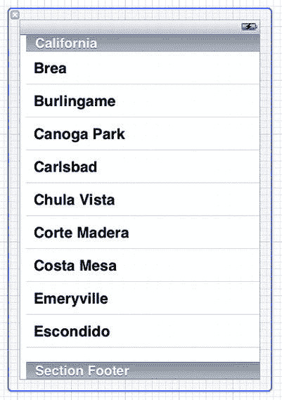

**图 11-16.** *设置你的 `UITableView`*

接下来，在 `-viewDidLoad` 方法中使用以下两行代码为表格设置委托和数据源：

```
self.tableViewMain.delegate = self;
self.tableViewMain.dataSource = self;
```

当然，你还需要将 `UITableViewDelegate` 和 `UITableViewDataSource` 协议添加到视图控制器的头文件中。

此外，在 `-viewDidLoad` 方法中添加以下代码行，以便在导航栏中创建一个“添加”按钮。稍后你将实现其触发的操作。

```
self.navigationItem.rightBarButtonItem = [[UIBarButtonItem alloc]
initWithBarButtonSystemItem:UIBarButtonSystemItemAdd target:self action:@selector(add)];
```

你需要为视图控制器添加更多属性，以跟踪 Core Data 对象。添加以下三个属性，并确保正确合成和处理它们。

```
@property (nonatomic, strong) NSEntityDescription *entityDescription;
@property (nonatomic, strong) NSFetchedResultsController *fetchedResultsController;
@property (nonatomic, strong) NSManagedObjectContext *managedObjectContext;
```

`NSEntityDescription` 类的一个实例，用通俗的话说，就是一个实体的描述。在其最简单的使用方式中，你只需给它一个 `name`。然后，当你通过 `NSManagedObjectContext` 使用这个 `NSEntityDescription` 查询数据库时，它会专门获取指定实体的实例。

你的 `entityDescription` 属性将帮助你轻松跟踪某个视图控制器正在获取的是教师、学生还是乐器数据。`fetchedResultsController` 将跟踪你获取的数据，而 `managedObjectContext` 属性则允许你进行任何必要的数据请求。

接下来，你需要为你的 `UITableView` 实现必需的委托和数据源方法。首先，是指定行数的方法：

```
-(NSInteger)tableView:(UITableView *)tableView numberOfRowsInSection:(NSInteger)section
{
     return [[self.fetchedResultsController fetchedObjects] count];
}
```

如上所示，`NSFetchedResultsController` 类包含一个方法 `-fetchedObjects`，该方法返回一个 `NSArray`，其中包含查询到的对象。

以下是配置 `UITableView` 单元格的方法：

```
-(UITableViewCell *)tableView:(UITableView *)tableView
cellForRowAtIndexPath:(NSIndexPath *)indexPath
{
    static NSString *CellIdentifier = @"Cell";

    UITableViewCell *cell = [tableView
dequeueReusableCellWithIdentifier:CellIdentifier];
    if (cell == nil)
{
        cell = [[UITableViewCell alloc] initWithStyle:UITableViewCellStyleSubtitle reuseIdentifier:CellIdentifier];
        cell.accessoryType = UITableViewCellAccessoryDetailDisclosureButton;
        cell.textLabel.font = [UIFont systemFontOfSize:19.0];
        cell.detailTextLabel.font = [UIFont systemFontOfSize:12];
    }
```


```
NSManagedObject *object = [self.fetchedResultsController
objectAtIndexPath:indexPath];
cell.textLabel.text = [object valueForKey:@"name"];

if ([object.entity.name isEqualToString:@"Instrument"])
{
    cell.detailTextLabel.text = [object valueForKey:@"family"];
}
else
{
    cell.detailTextLabel.text = [[object valueForKey:@"age"] stringValue];
}
return cell;
```

如您所见，您可以通过使用 `NSManagedObject` 类指向实体实例，然后使用 `-valueForKey:` 方法查询特定属性，从而访问实体的属性。稍后您将看到更简单、更自然的实现方式，但理解 `NSManagedObject` 作为一个可以代表任何实体的类的概念非常重要。

您可能还会注意到，无需访问 `indexPath` 的 `row` 值来传递给 `NSFetchedResultsController`。这是使用 Core Data 的好处之一，即获取请求的结果可以非常容易地集成到 `UITableView` 中。

现在您的 `UITableView` 已经设置好，您只需确保视图控制器能够获取其需要显示的信息即可。为此，您将设置一个单独的方法，如下所示：

```
-(void)fetchResults
{
    NSFetchRequest *fetchRequest = [NSFetchRequest
fetchRequestWithEntityName:self.entityDescription.name];
    NSString *cacheName = [self.entityDescription.name
stringByAppendingString:@"Cache"];

    NSSortDescriptor *sortDescriptor = [NSSortDescriptor sortDescriptorWithKey:@"name"
ascending:YES];
    [fetchRequest setSortDescriptors:[NSArray arrayWithObject:sortDescriptor]];

    self.fetchedResultsController = [[NSFetchedResultsController alloc]
initWithFetchRequest:fetchRequest managedObjectContext:self.managedObjectContext
sectionNameKeyPath:nil cacheName:cacheName];
    BOOL success;
    NSError *error;
    success = [self.fetchedResultsController performFetch:&error];
    if (!success)
    {
        NSLog(@"%@", [error localizedDescription]);
    }
}
```

如有必要，请将此方法的处理程序添加到您的头文件中，以避免任何编译器警告（例如，如果您在 `-viewDidLoad` 之后实现此方法）。

考虑到前述方法的重要性，理解执行数据“获取”所需的确切步骤至关重要。

1.  获取所需的第一件事是 `NSFetchRequest` 类的一个实例。这里，您使用了一个指定初始化器来指定一个 `NSEntityDescription`，不过您也可以稍后使用 `-setEntity:` 方法添加它。
2.  虽然不是必须的，但您为获取请求设置了一个“缓存名称”，每个实体使用不同的缓存。如果您频繁进行获取请求，这可以稍微提升应用程序的速度，因为首先会检查本地缓存是否已经执行过该请求。
3.  每个 `NSFetchRequest` 实例必须至少关联一个 `NSSortDescriptor`。这里，您为每个实体的 `name` 属性指定了一个非常简单的字母排序。创建好所有 `NSSortDescriptor` 后，必须使用 `-setSortDescriptors:` 方法将它们附加到 `NSFetchRequest` 上。
4.  一旦您的 `NSFetchRequest` 完全配置好，您就可以使用 `NSFetchRequest` 和 `NSManagedObjectContext` 来完全初始化您的 `NSFetchedResultsController`。最后两个参数都是可选的，不过您为了优化而指定了一个 `cacheName`。如果您希望忽略它们，可以将两者都设置为 `nil`。
5.  最后，您必须使用 `performFetch:` 方法实际完成您的获取请求并检索存储的数据。使用此方法，您可以传递一个指向 `NSError` 的指针（如前所示），以跟踪并记录获取过程中发生的任何错误。

最后，您将在 `-viewDidLoad` 方法中添加一行代码来调用此方法。

`[self fetchResults];`

总的来说，您的 `-viewDidLoad` 方法应如下所示：

```
- (void)viewDidLoad
{
    [super viewDidLoad];

    self.tableViewMain.delegate = self;
    self.tableViewMain.dataSource = self;

    self.navigationItem.rightBarButtonItem = [[UIBarButtonItem alloc]
initWithBarButtonSystemItem:UIBarButtonSystemItemAdd target:self action:@selector(add)];

    [self fetchResults];
}
```

现在您已完成视图控制器的配置，需要返回应用委托并设置基本的导航系统来使用它。

首先，在您的应用委托头文件中，为视图控制器的头文件添加一条导入语句，以安抚编译器。

`#import "MainTableViewController.h"`

现在，您将把所有视图控制器声明为应用委托的属性。您还将把每个视图控制器放在一个 `UINavigationController` 中，并将这三个导航控制器都放在一个 `UITabBarController` 中，以确保信息流顺畅。将所有以下属性添加到您的应用委托中，并确保一如既往地合成它们。

```
@property (strong, nonatomic) MainTableViewController *teacherTable;
@property (strong, nonatomic) MainTableViewController *studentTable;
@property (strong, nonatomic) MainTableViewController *instrumentTable;
@property (strong, nonatomic) UINavigationController *teacherNavcon;
@property (strong, nonatomic) UINavigationController *studentNavcon;
@property (strong, nonatomic) UINavigationController *instrumentNavcon;

@property (strong, nonatomic) UITabBarController *tabBarController;
```

现在，您需要修改 `Application` `Delegate` 类中的 `-application:didFinishLaunchingWithOptions:` 方法，以正确配置所有视图控制器。整体上，它将如下所示：

```
- (BOOL)application:(UIApplication *)application
didFinishLaunchingWithOptions:(NSDictionary *)launchOptions
{
    self.window = [[UIWindow alloc] initWithFrame:[[UIScreen mainScreen] bounds]];
    self.window.backgroundColor = [UIColor whiteColor];

    self.teacherTable = [[MainTableViewController alloc] init];
    self.teacherTable.entityDescription = [NSEntityDescription entityForName:@"Teacher"
inManagedObjectContext:self.managedObjectContext];
    self.teacherTable.managedObjectContext = self.managedObjectContext;
    self.teacherTable.title = @"Teachers";

    self.studentTable = [[MainTableViewController alloc] init];
    self.studentTable.entityDescription = [NSEntityDescription entityForName:@"Student"
inManagedObjectContext:self.managedObjectContext];
    self.studentTable.managedObjectContext = self.managedObjectContext;
    self.studentTable.title = @"Students";

    self.instrumentTable = [[MainTableViewController alloc] init];
    self.instrumentTable.entityDescription = [NSEntityDescription entityForName:@"Instrument" inManagedObjectContext:self.managedObjectContext];
    self.instrumentTable.managedObjectContext = self.managedObjectContext;
    self.instrumentTable.title = @"Instruments";

    self.teacherNavcon = [[UINavigationController alloc]
initWithRootViewController:self.teacherTable];
    self.studentNavcon = [[UINavigationController alloc]
initWithRootViewController:self.studentTable];
    self.instrumentNavcon = [[UINavigationController alloc]
initWithRootViewController:self.instrumentTable];

    self.tabBarController = [[UITabBarController alloc] init];
    [self.tabBarController setViewControllers:[NSArray
arrayWithObjects:self.teacherNavcon, self.studentNavcon, self.instrumentNavcon, nil]];

    [self.window addSubview:self.tabBarController.view];
    [self.window makeKeyAndVisible];
    return YES;
}
```


```markdown

每个`MainTableViewController`的配置都相当简单，只需设置一个`NSEntityDescription`，为其提供一个指向`NSManagedObjectContext`的指针，然后给它一个在`UITabBarController`中显示的标题。

此时，如果运行应用程序，你只会看到几个空表格（如图 11-17 所示），这是有原因的——你还没有任何数据！不幸的是，你还没有构建`-add`方法，所以在完成之前不要按那个 + 按钮，否则应用程序会崩溃。

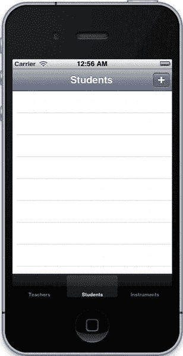

**Figure 11-17.** *三个空的`UITableView`*

对于初步的尝试，你可以先从在每个视图控制器中以编程方式创建一个新对象开始，以便显示数据。将以下代码添加到`MainViewController`的`-viewDidLoad`方法中，并确保它位于对`-fetchResults`的调用之前。

```
NSManagedObject *add = [[NSManagedObject alloc] initWithEntity:self.entityDescription
insertIntoManagedObjectContext:self.managedObjectContext];
    if (![self.entityDescription.name isEqualToString:@"Instrument"])
    {
        [add setValue:@"Jim" forKey:@"name"];
        [add setValue:[NSNumber numberWithInt:42] forKey:@"age"];
    }
    else
    {
        [add setValue:@"Trumpet" forKey:@"name"];
        [add setValue:@"Brass" forKey:@"family"];
    }
```

现在，当你运行应用程序时，会显示一些临时数据，如图 11-18 所示。

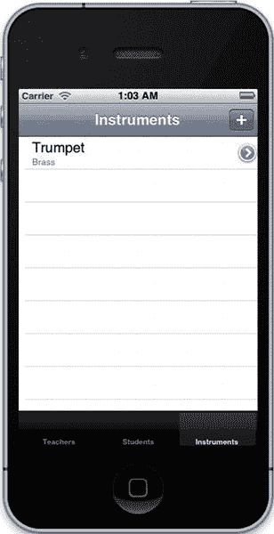

**Figure 11–18.** *半填充的`UITableView`*

虽然你已经在`NSManagedObjectContext`中为每个实体创建了一个新实例，但你可能会注意到，每次运行应用程序时，这些对象并不会持久保存——你不会看到每次运行都会增加一个列表。这是因为你没有保存对`NSManagedObjectContext`所做的更改。你可以通过在之前的添加代码之后（但在对`-fetchRequest`的调用之前）添加以下代码来实现保存。

```
NSError *error;
    BOOL success = [self.managedObjectContext save:&error];
    if (!success)
    {
        NSLog(@"%@", [error localizedDescription]);
    }
```

你会注意到，这与你在`-fetchResults`中使用的`-performFetch:`方法非常相似：你向它发送一个指向`NSError`实例的指针，以便记录任何问题。与之前一样，这完全是可选的，你可以传递`nil`作为此参数，但为了最佳实践，包含日志记录更为安全。

如果你多次运行应用程序并更改名称，可以累积一些不同的数据来显示。图 11-19 显示了应用程序在运行几次以收集一些数据后的情况。

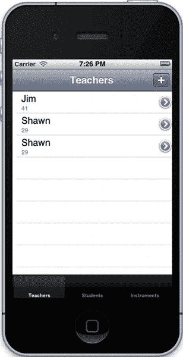

**Figure 11–19.** *应用程序保存并创建新数据*

为了让程序运行得更好，你可以继续实现`-add`方法，以便从应用程序内部创建新数据。通常，你会希望创建单独的视图控制器，允许用户输入新对象的信息，但就本教程而言，关键概念仅仅是能够添加对象。

```
-(void)add
{
    NSManagedObject *add = [[NSManagedObject alloc]
initWithEntity:self.entityDescription
insertIntoManagedObjectContext:self.managedObjectContext];
    if (![self.entityDescription.name isEqualToString:@"Instrument"])
    {
        [add setValue:@"Peter" forKey:@"name"];
        [add setValue:[NSNumber numberWithInt:35] forKey:@"age"];
    }
    else
    {
        [add setValue:@"Guitar" forKey:@"name"];
        [add setValue:@"Strings" forKey:@"family"];
    }

    NSError *error;
    BOOL success = [self.managedObjectContext save:&error];
    if (!success)
    {
        NSLog(@"%@", [error localizedDescription]);
    }

    [self fetchResults];

    [self.tableViewMain reloadData];
}
```

在上述方法中，你必须确保在创建新对象后、重新加载`UITableView`的数据之前调用`-fetchResults`方法，以确保你的`NSFetchedResultsController`包含最新的更改。

正如 Core Data 使得`UITableView`的填充变得非常容易一样，结合 Core Data 类实现从`UITableView`中删除项目也非常简单。你可以像这样实现`UITableView`的`-tableView:commitEditingStyle:forRowAtIndexPath:`方法：

```
-(void)tableView:(UITableView *)tableView commitEditingStyle:(UITableViewCellEditingStyle)editingStyle forRowAtIndexPath:(NSIndexPath *)indexPath
{
    if (editingStyle == UITableViewCellEditingStyleDelete)
    {
        NSManagedObject *deleted = [self.fetchedResultsController
objectAtIndexPath:indexPath];
        [self.managedObjectContext deleteObject:deleted];
        NSError *error;
        BOOL success = [self.managedObjectContext save:&error];
        if (!success)
        {
            NSLog(@"%@", [error localizedDescription]);
        }
        [self fetchResults];
        [self.tableViewMain deleteRowsAtIndexPaths:[NSArray arrayWithObject:indexPath]
withRowAnimation:UITableViewRowAnimationRight];
    }
}
```

虽然允许用户通过滑动行来删除肯定是可行的，但通常最好也提供一个编辑按钮，以防用户不熟悉滑动功能。为此，你首先需要对`-viewDidLoad`方法进行简单的调整，以创建该按钮，调整后的方法如下：

```
- (void)viewDidLoad
{
    [super viewDidLoad];

    self.tableViewMain.delegate = self;
    self.tableViewMain.dataSource = self;

    /////Adjusted code to add Edit button
    UIBarButtonItem *addButton = [[UIBarButtonItem alloc]
initWithBarButtonSystemItem:UIBarButtonSystemItemAdd target:self action:@selector(add)];
    UIBarButtonItem *editButton = self.editButtonItem;
    self.navigationItem.rightBarButtonItems = [NSArray arrayWithObjects:addButton,
editButton, nil];
    /////End of adjusted code

    [self fetchResults];
}
```

现在，你只需要快速实现`-setEditing:animated:`方法，就能获得漂亮的动画效果。

```
-(void)setEditing:(BOOL)editing animated:(BOOL)animated
{
    [super setEditing:editing animated:animated];
    [self.tableViewMain setEditing:editing animated:animated];
}
```

现在运行你的应用程序，你会注意到不仅可以添加，还可以从表格中删除信息，如图 11-20 所示。

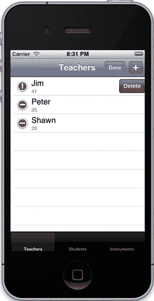

**Figure 11-20.** *应用程序，添加和删除数据*

```


### 技巧 11-3：创建 `NSManagedObject` 的子类

现在你已经设置好基础的 `UITableView` 来显示通过 Core Data 存储的信息，是时候进一步优化你的程序设计了。首先，有一项能极大节省时间的方法，能让 Core Data 编程变得简单得多：为创建的每个实体创建 `NSManagedObject` 的子类。不过，与大多数子类化操作不同，这种设置极其简单。

首先，切换回 `MusicSchool.xcdatamodeld` 文件，查看你创建的实体。

下一步可以单独操作，但这里我们将一次性创建三个子类。按住 "Command" 键并点击每个实体，将它们全部选中，这样三个实体都会被高亮显示。你还会注意到，它们所有的属性和关系也会一并显示，如图 Figure 11-21 所示。

你将使用的 `NSManagedObject` 子类化技术会基于所选实体创建子类，因此务必确保所有需要创建子类的实体都被选中。

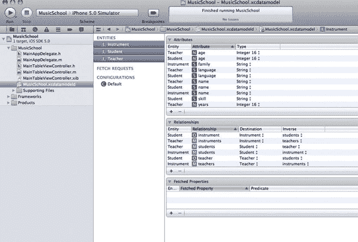

**图 11–21.** *选中全部三个实体，准备生成 `NSManagedObject` 子类*

接下来，在 "File" 菜单下，选择 `New` `New File...`，打开新建文件对话框。导航到 iOS 部分的 Core Data 栏目，选择 "NSManagedObject subclass" 选项，如图 Figure 11-22 所示。


**图 11-22.** *选择 "NSManagedObject subclass" 模板，自动为你的实体生成类*

点击继续，然后点击 "Create"，让 Xcode 为你创建三个 `NSManagedObject` 子类。

通过子类化 `NSManagedObject`，你实际上已将实体转化为可以正常使用和操作的类，尤其是在访问其属性时。现在，无需再使用 `-setValue:forKey:` 和 `-valueForKey:` 方法，只需调用 setter 和 getter 方法，或者更简单地说，直接使用与属性同名的属性即可。这还能让你更轻松地指定任意 `NSManagedObject` 实例关联的具体实体，从而让编译器帮你验证该实体的属性和方法访问是否正确。

为了演示这些功能，你可以重写 `-tableView:cellForRowAtIndexPath:` 方法，先将 `NSManagedObject` 向下转型为对应的子类，再使用子类属性填充单元格内容。

首先，确保在视图控制器中导入新创建的头文件。

```
#import "Instrument.h"
#import "Student.h"
#import "Teacher.h"
```

完成这一步后，就可以实现简化后的方法了。

```
-(UITableViewCell *)tableView:(UITableView *)tableView cellForRowAtIndexPath:(NSIndexPath *)indexPath
{
    static NSString *CellIdentifier = @"Cell";

    UITableViewCell *cell = [tableView dequeueReusableCellWithIdentifier:CellIdentifier];
    if (cell == nil)
    {
        cell = [[UITableViewCell alloc] initWithStyle:UITableViewCellStyleSubtitle reuseIdentifier:CellIdentifier];
        cell.accessoryType = UITableViewCellAccessoryDetailDisclosureButton;
        cell.textLabel.font = [UIFont systemFontOfSize:19.0];
        cell.detailTextLabel.font = [UIFont systemFontOfSize:12];
    }

    NSManagedObject *object = [self.fetchedResultsController objectAtIndexPath:indexPath];

    if ([object.entity.name isEqualToString:@"Instrument"])
    {
        Instrument *instrument = (Instrument *)object;
        cell.textLabel.text = instrument.name;
        cell.detailTextLabel.text = instrument.family;
    }
    else if ([object.entity.name isEqualToString:@"Student"])
    {
        Student *student = (Student *)object;
        cell.textLabel.text = student.name;
        cell.detailTextLabel.text = [student.age stringValue];
    }
    else
    {
        Teacher *teacher = (Teacher *)object;
        cell.textLabel.text = teacher.name;
        cell.detailTextLabel.text = [teacher.age stringValue];
    }

    return cell;
}
```

你还可以像这样简化创建测试数据的 `-add` 方法。

```
-(void)add
{
    NSManagedObject *add = [[NSManagedObject alloc]
initWithEntity:self.entityDescription
insertIntoManagedObjectContext:self.managedObjectContext];
    if ([self.entityDescription.name isEqualToString:@"Teacher"])
    {
        Teacher *teacher = (Teacher *)add;
        teacher.name = @"Peter";
        teacher.age = [NSNumber numberWithInt:36];
    }
    else if ([self.entityDescription.name isEqualToString:@"Instrument"])
    {
        Instrument *instrument = (Instrument *)add;
        instrument.name = @"Guitar";
        instrument.family = @"Strings";
    }
else
    {
        Student *student = (Student *)add;
        student.name = @"Andrew";
        student.age = [NSNumber numberWithInt:18];
    }

    NSError *error;
    BOOL success = [self.managedObjectContext save:&error];
    if (!success)
    {
        NSLog(@"%@", [error localizedDescription]);
    }

    [self fetchResults];

    [self.tableViewMain reloadData];
}
```

再次强调，这并不会真正影响应用的运行方式，但它能大大简化你的编码和调试工作。

通过使用这种子类化技术，你在使用 Core Data 时遇到的运行时错误将大幅减少，因为编译器现在能够确认你是否为某个子类访问了正确的属性。

就像你可以访问和编辑子类化 `NSManagedObject` 的属性一样，你也能对实体之间的关系进行同样的操作。接下来，我们将修改程序：当选中一个教师时，会显示已录入的乐器列表；当选中其中一个乐器时，该乐器会被添加到该教师的 `instruments` 集合中。你可能还会注意到，由于设置了逆关系，单向设置的关系也会自动反向设置。在这个例子中，当你把乐器添加到教师的 `instruments` 集合时，该教师也会被添加到该乐器的 `teachers` 集合中。

为演示起见，我们只在教师和乐器之间实现这一行为，但你应该能很容易地看出如何在这三个实体之间完全实现类似功能，从而允许用户将任意教师与其学生和乐器关联起来。

首先，在 `MainTableViewController` 的头文件中声明一个类型为 Teacher 的实例变量，用于跟踪选中的教师。

```
__strong Teacher *selectedTeacher;
```

接下来，你需要声明一个与类类型相同的新属性 `delegate`，用于连接多个视图控制器。请确保适当地合成并将此属性置为 nil。

```
@property (nonatomic, strong) MainTableViewController *delegate;
```

同时，为 `delegate` 属性声明一个方法头，如下所示：

```
-(void)MainTableViewController:(MainTableViewController *)mainTableVC
didSelectInstrument:(Instrument *)instrument;
```

你的头文件（`MainTableViewController.h`）现在应如下所示：

```
#import <UIKit/UIKit.h>
#import "Instrument.h"
#import "Student.h"
#import "Teacher.h"
```


#### `@interface MainTableViewController : UIViewController <UITableViewDelegate, UITableViewDataSource>`

```
{
    __strong Teacher *selectedTeacher;
}
```

`@property (strong, nonatomic) IBOutlet UITableView *tableViewMain;`

`@property (nonatomic, strong) NSEntityDescription *entityDescription;`

`@property (nonatomic, strong) NSFetchedResultsController *fetchedResultsController;`

`@property (nonatomic, strong) NSManagedObjectContext *managedObjectContext;`

`@property (nonatomic, strong) MainTableViewController *delegate;`

`-(void)MainTableViewController:(MainTableViewController *)mainTableVC didSelectInstrument:(Instrument *)instrument;`

`@end`

接下来，你将结合使用 `delegate` 属性和 `UITableView` 的行选择方法，来构建你的新功能——尽管是选择性的功能。

`-(void)tableView:(UITableView *)tableView didSelectRowAtIndexPath:(NSIndexPath *)indexPath`
```
{
    [self.tableViewMain deselectRowAtIndexPath:indexPath animated:YES];
    if ([self.entityDescription.name isEqualToString:@"Teacher"])
    {
        selectedTeacher = [self.fetchedResultsController objectAtIndexPath:indexPath];
        MainTableViewController *selectInstrument = [[MainTableViewController alloc] init];
        selectInstrument.entityDescription = [NSEntityDescription entityForName:@"Instrument" inManagedObjectContext:self.managedObjectContext];
        selectInstrument.managedObjectContext = self.managedObjectContext;
        selectInstrument.delegate = self;
        [self.navigationController pushViewController:selectInstrument animated:YES];
    }
    else if ([self.entityDescription.name isEqualToString:@"Instrument"] && (self.delegate != nil))
    {
        [self.delegate MainTableViewController:self didSelectInstrument:[self.fetchedResultsController objectAtIndexPath:indexPath]];
        [self.navigationController popViewControllerAnimated:YES];
    }
}
```

现在，你可以实现刚才声明的 `delegate` 方法，将选中的 Instrument 添加到 `selectedTeacher` 中，然后将更改保存到 `NSManagedObjectContext`。

`-(void)MainTableViewController:(MainTableViewController *)mainTableVC didSelectInstrument:(NSManagedObject *)instrument`
```
{
    [selectedTeacher addInstrumentsObject:instrument];
    NSError *saveError;
    BOOL success = [self.managedObjectContext save:&saveError];
    if (!success)
    {
        NSLog(@"%@", [saveError localizedFailureReason]);
    }
}
```

由于你尚未为用户构建一个完整的自定义数据创建系统，你需要多次调整 `-add` 方法，每次运行应用程序，以创建一些不同的数据，从而充分测试此功能。

## 技巧 11–4：过滤你的提取请求

当你使用 `NSFetchRequest` 实例从 `NSManagedObjectContext` 中获取信息时，你绝不局限于仅请求某个特定实体的全部数据。通过使用 `NSPredicate` 类，你可以根据应用需求轻松地将结果精确到几乎任何子集。

对于你的应用，你将实现过滤行为，使其在点击 `UITableView` 中的附件按钮时生效，并根据所点击的 `NSManagedObject` 类型执行不同的操作。

*   如果在教师表中点击了附件按钮，你将显示另一个 `UITableView`，其中包含所选教师关联的所有乐器。
*   在学生表中点击附件按钮，将显示一个表格，列出与所选学生同龄的所有其他学生。
*   在乐器表中，你将过滤数据，以显示与所选乐器具有相同 `family` 的所有其他乐器。

所有这些行为都将通过为你的 `NSFetchRequest` 设置一个 `NSPredicate` 并指定谓词来实现。

首先，你将向 `MainTableViewController` 中添加一个属性来跟踪这个 `NSPredicate`，以便能够轻松创建并使用它来执行提取请求。

`@property (nonatomic, strong) NSPredicate *predicate;`

你可以像这样实现 `UITableView` 的委托方法：

`-(void)tableView:(UITableView *)tableView accessoryButtonTappedForRowWithIndexPath:(NSIndexPath *)indexPath`
```
{
    if (![self.title isEqualToString:@"Filtered"])
    {
        MainTableViewController *filtered = [[MainTableViewController alloc] init];
        filtered.title = @"Filtered";
        filtered.managedObjectContext = self.managedObjectContext;

        if ([self.entityDescription.name isEqualToString:@"Teacher"])
        {
            filtered.entityDescription = [NSEntityDescription entityForName:@"Instrument" inManagedObjectContext:self.managedObjectContext];
            NSSet *instruments = [(Teacher *)[self.fetchedResultsController objectAtIndexPath:indexPath] instruments];
            filtered.predicate = [NSPredicate predicateWithFormat:@"self IN %@", instruments];
        }
        else if ([self.entityDescription.name isEqualToString:@"Student"])
        {
            filtered.entityDescription = self.entityDescription;
            filtered.predicate = [NSPredicate predicateWithFormat:@"age=%i", [[(Student *)[self.fetchedResultsController objectAtIndexPath: indexPath] age] intValue]];
        }
        else
        {
            filtered.entityDescription = self.entityDescription;
            filtered.predicate = [NSPredicate predicateWithFormat:@"family=%@", [(Instrument *)[self.fetchedResultsController objectAtIndexPath:indexPath]family]];
        }

        [self.navigationController pushViewController:filtered animated:YES];
    }
}
```

正如你所见，你在实现中使用了两种不同风格的谓词。一种是简单的比较谓词，将 `family` 属性与一个值进行比较；另一种是检查集合中是否包含某个对象的谓词，用于教师。

无论何时需要在谓词中指定某个值，你都可以使用 `"%@”`，然后传入该值，如前面代码块所示。如果你对这些称为“格式说明符”的值不太熟悉，一些常见的格式说明符包括：

*   `%@`：可以用来表示 `NSString` 值，或者简单地对一个对象的引用，就像你之前使用的那样。
*   `%i`：表示一个整数。
*   `%f`：表示一个浮点数。
*   `%d`：表示一个双精度浮点值。


这些说明符源自 C 语言的格式化字符串打印功能，通常与 `NSLog()` 命令一起使用，或在向用户显示信息时使用。例如，你可能有一段用于测试的代码来记录一个简单的计数器，如下所示：

```
for (int n=0; n < 100; n++)
{
    NSLog(@"%i", n);
}
```

当你引用通过谓词求值的对象时，使用关键字 `self`，如第一个 `NSPredicate` 所示。

有大量关于使用不同格式和方法创建 `NSPredicate` 的文档，这使得开发者能够在为结果创建过滤器时拥有强大的能力。有关创建更复杂谓词的更多信息，请参阅 Apple 文档。

在即将完成此设置之前，你还需要修改 `-fetchResults` 方法，使其考虑 `NSPredicate`。新方法如下所示：

```
-(void)fetchResults
{
    NSFetchRequest *fetchRequest = [NSFetchRequest fetchRequestWithEntityName:self.entityDescription.name];
    NSString *cacheName = [self.entityDescription.name stringByAppendingString:@"Cache"];

    ////////////New Predicate code
    if (self.predicate != nil)
    {
        [fetchRequest setPredicate:self.predicate];
    }
    ////////////End of new code

    NSSortDescriptor *sortDescriptor = [NSSortDescriptor sortDescriptorWithKey:@"name" ascending:YES];
    [fetchRequest setSortDescriptors:[NSArray arrayWithObject:sortDescriptor]];

    self.fetchedResultsController = [[NSFetchedResultsController alloc] initWithFetchRequest:fetchRequest managedObjectContext:self.managedObjectContext sectionNameKeyPath:nil cacheName:cacheName];

    BOOL success;
    NSError *error;
    success = [self.fetchedResultsController performFetch:&error];
    if (!success)
    {
        NSLog(@"%@", [error localizedDescription]);
    }
}
```

此时，如果你运行应用程序，可以看到一些过滤结果的示例，例如按系列过滤 Instruments，如图 Figure 11-23 所示。

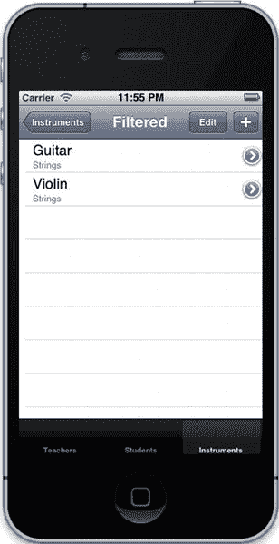

**Figure 11-23.** *你的应用程序显示过滤后的结果*

### Recipe 11–5: 版本控制

对于几乎任何应用程序，你很可能需要在某个时候对 Core Data 模型进行更改。Xcode 提供了一种非常简单的方法来做到这一点，通过一个称为“版本控制”的过程，你可以轻松保留所有旧模型，以防出现问题。

第一步是创建数据模型的新版本，可以基于现有版本创建。首先，在左侧导航器窗格中选择 `MusicSchool.xcdatamodeld` 文件。

在 Editor 菜单中，选择 `Add Model Version…`。将出现一个简单的对话框，允许你指定新版本的名称，以及新版本所基于的模型。由于目前只有一个模型，它将是唯一的选择。将新模型命名为 `MusicSchool2`，如图 Figure 11-24 所示。

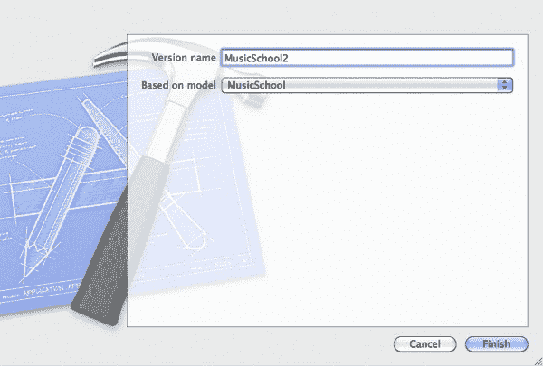

**Figure 11-24.** *创建新版本*

点击 Finish，新模型将被创建。

现在，你可以对数据模型进行一些更改。就本应用程序而言，你只会进行相当简单的更改，以便稍后处理的迁移是一个简单的过程。为了保持轻量级迁移，你应该只遵循以下可能的更改：

*   添加或删除实体、属性或关系
*   重命名属性或实体
*   更改属性是否为可选

对于新数据模型，你只需添加两个属性：首先，在 Instrument 实体中添加一个名为 `size` 的 `NSString`，然后在 Instrument 实体中添加另一个名为 `range` 的 `NSString`。结果属性表将类似于 Figure 11-25。

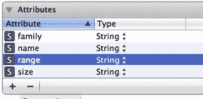

**Figure 11-25.** *向 Instrument 实体添加新属性*

接下来，你需要指定这个最新模型版本为应用程序实际使用的版本。首先，选择 `.xcdatamodel` 文件的顶层，该文件将显示为文件类型 `xcdatamodeld`，并带有两个实际数据模型文件的下拉菜单，如图 Figure 11-26 所示。（这指定了实际选择的是哪个文件。）

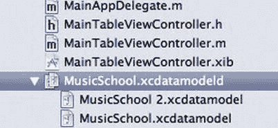

**Figure 11-26.** *查看项目的数据模型；当前使用的模型被列为主文件。*

接下来，你需要调出 File inspector。可以通过在 View 菜单中导航到 `Utilities`  `Show File Inspector`，或者调出屏幕右侧的 Utilities 面板，然后选择第一个选项卡来实现，如图 Figure 11-27 所示。

**注意：** Xcode 当前不允许你从项目中删除数据模型文件。创建新版本时要小心，因为一旦创建，你将无法轻松删除它们。在图 Figure 11-27 中，你可以看到多个不需要或未使用的数据模型文件堆积在一起。

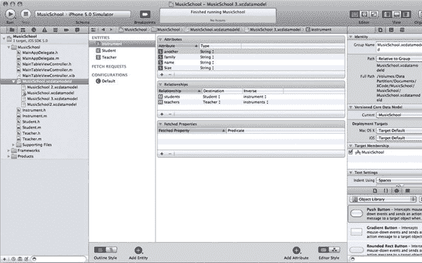

**Figure 11-27.** *使用 File inspector 设置当前版本*

在 Versioned Core Data Model 部分，你需要将当前模型更改为新的 `MusicSchool2`，具体如图 Figure 11-28 所示。

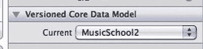

**Figure 11-28.** *选择不同的当前版本*

此时，你会注意到新模型版本旁边出现了一个小的绿色勾号，表示它现在是当前版本，如图 Figure 11-29 所示。


**Figure 11-29.** *新的模型文件被设置为当前版本*

如果你立即尝试运行此应用程序，根据更改的复杂程度，应用程序可能会在运行时崩溃，并出现一个非常奇怪的原因：“The model used to open the store is incompatible with the one used to create the store”。这 essentially 意味着你正在尝试将数据从旧模型迁移到新模型，但系统不知道如何处理。幸运的是，对于这些轻量级迁移，这很容易修复。

导航到你的应用程序委托实现文件，找到 `-persistentStoreCoordinator` 方法。查找以下行：

```
if (![__persistentStoreCoordinator addPersistentStoreWithType:NSSQLiteStoreType configuration:nil URL:storeURL options:nil error:&error])
```

你需要指定一个 `NSDictionary` 实例作为此方法的 `options` 参数。在之前的 `if` 语句之前添加以下代码：

```
NSDictionary *options = [NSDictionary dictionaryWithObjectsAndKeys:[NSNumber numberWithBool:YES], NSMigratePersistentStoresAutomaticallyOption, [NSNumber numberWithBool:YES], NSInferMappingModelAutomaticallyOption, nil];
```

确保将此字典设置为实际参数，以便 `if` 语句现在读作：

```
if (![__persistentStoreCoordinator addPersistentStoreWithType:NSSQLiteStoreType configuration:nil URL:storeURL options:options error:&error])
```

现在，所有轻量级迁移将自动进行，极大地简化了你的工作。

如果你的应用程序在没有此更改的情况下运行完全正常，那么你无需担心此步骤，但要知道你可能在某个时候必须这样做。


### 令人恼火的错误

有时在处理版本控制时，你可能会遇到一个由方法抛出的错误，提示无法找到持久化存储。一个简单但令人沮丧的解决方案是，在出现错误时，通过在前面提到的 `if` 语句中添加以下代码行，使用以下命令删除你的持久化存储。

```
[[NSFileManager defaultManager] removeItemAtURL:storeURL error:nil];
```

在这种情况下，你的 `if` 语句将类似以下代码。请记住，除非你遇到这个特定问题，否则你完全不需要也不应该添加这段代码。

```
if (![__persistentStoreCoordinator addPersistentStoreWithType:NSSQLiteStoreType configuration:nil URL:storeURL options:options error:&error])
{
    NSLog(@"Unresolved error %@, %@", error, [error userInfo]);
    [[NSFileManager defaultManager] removeItemAtURL:storeURL error:nil];
    abort();
}
```

在运行此应用程序一次后，你的持久化存储将被重置，因此一旦你的应用程序恢复正常工作，你应从方法中移除这行代码。这样，你的应用就不会在你未明确预期的情况下重置你的数据。

虽然这应该能解决问题，但不幸的是，你会丢失所有已保存的数据，因此通常最好避免这种极端的措施。

此时，你的应用程序将再次正常工作，你可以添加代码以利用更新的模型版本。然而，由于你尚未更新你的 `NSManagedObject` 子类，你将无法使用 `-valueForKey:` 方法之外的方式访问任何新属性。因为你只对 Instrument 实体进行了更改，所以只需刷新你的 Instrument 子类。

首先，删除 Instrument 子类文件。你可以选择完全删除文件，而不仅仅是移除其引用，因为你不再需要这个版本，并且如果必要，你始终可以从数据模型重新创建它。执行此操作的对话框将类似于图 11-30。

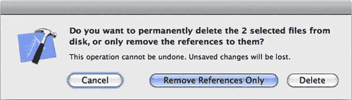

**图 11-30.** *删除你的 Instrument 子类文件；使用“删除”选项，因为你将重新创建它们。*

现在，你可以按照与之前完全相同的步骤来创建你的子类。

在你的数据模型文件中，选择 Instrument 实体，然后导航到 `File`  `New`  `New File...`。

在“iOS 的 Core Data”下，选择“NSManagedObject subclass”模板（如图 11-31 所示），然后点击完成以创建你的新子类。

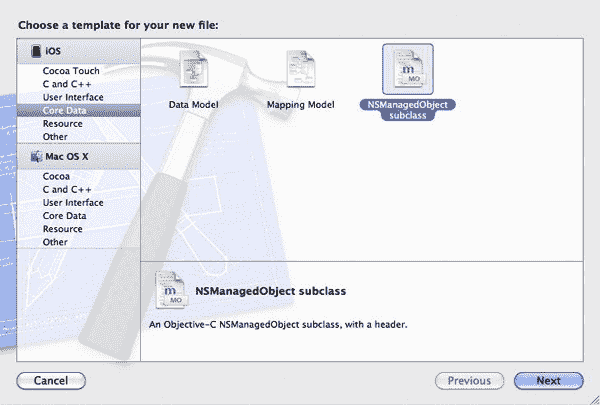

**图 11-31.** *为你最新的版本重新创建 `NSManagedObject` 子类*

现在你将看到，你的 `Instrument` 类包含了所有必要的属性和方法，来处理新版版本化数据模型中新增的属性！

### 总结

在本章中，我们介绍了 Core Data 的基础知识。由于其强大功能和在使用数据建模、持久化和访问时的简易性，它是 iOS 开发中最核心的部分之一。然而，我们绝没有详细描述 Core Data 框架的每一个方面，甚至没有触及与之相关的每一个主题。你可以轻松找到专门讨论 Core Data 的整本书，而且你可能确实应该这么做，以便更全面地了解你在控制数据存储方面究竟拥有多大的能力。这里的概述演示了该框架的基本用法，并解释了开始使用 Core Data 所需的关键概念，以便你能够在应用程序中实现简单的持久化，而无需担心更复杂的细节。

## 第 12 章

## Core Motion 实例

前两章花了大量篇幅讨论存储在设备内存中并持久化的信息。现在，我们将处理一个完全相反的主题：来自外部世界的数据——不是指用户提供的数据，而是设备在任何特定时刻关于其所处宇宙收集到的数据。通过获取外部世界的信息，开发者可以根据用户的物理情境，专门构建专注于增强用户体验的应用程序。这可以是从简单地检测设备方向，到将旋转整合到赛车游戏的转向系统中，再到使用加速度计测量过山车的加速度等任何功能。通过使用 Core Motion 框架，我们能够轻松访问 iOS 设备中内置的各种硬件，从而获取关于设备特定情境的独特信息，包括磁场、重力以及其他加速度、旋转速率等。

除本章的第一个实例外，你需要一台物理设备来测试功能，因为你将处理由设备的物理存在所生成的信息。


### 配方 12–1：注册摇晃事件

在深入探讨 Core Motion 框架之前，我们可以先处理一个相关主题：设备的摇晃。大量应用以各种方式利用此功能，其效果从随机播放歌曲到刷新信息不一而足。虽然此实现不一定依赖 Core Motion 框架，但其能够检测设备物理变化这一关键概念使其成为一项需要理解的重要功能。

我们将创建一个非常简单的应用来检测并记录设备的摇晃。在此基础上，我们将开始构建一个能够读取并显示运动信息的应用。

首先创建一个名为 `Measurements` 的新项目，该项目的成果将贯穿本章使用。对于这个简单应用，我们会使用单视图应用模板，如图 12-1 所示，这样能省去一些组装应用委托的工作。

选择模板后，输入项目名称，确保类前缀设置为 `Main`，并且仅勾选了“使用自动引用计数” (Use Automatic Reference Counting) 复选框，然后点击下一步创建项目。

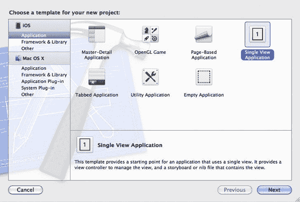

**图 12-1.** 配置你的 `UIWindow` 子类

配置摇晃功能的第一项任务是，你需要指示你的应用在设备被摇晃（而非搅动）时发布一条通知。为此，你需要继承 `UIWindow` 类。创建一个新文件，使用 iOS Cocoa Touch 部分下的 `Objective-C 类` 模板，如图 12-2 所示。

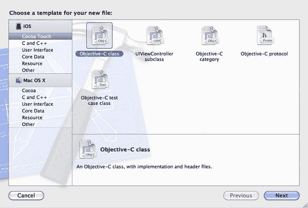

**图 12-2.** 通过创建 Objective-C 类来继承 `UIWindow`

继续操作，将类命名为 `MainWindow`，并确保在“继承自” (Subclass of) 字段中输入 `UIWindow`，如图 12-3 所示。

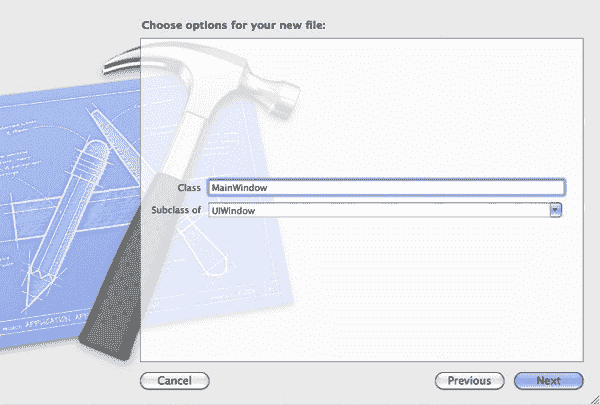

**图 12-3.** 配置你的 `UIWindow` 子类

点击创建该子类，然后切换到它的实现文件 `MainWindow.m`。

在这个类中，我们将重写 `-motionEnded:withEvent:` 方法，以便正确处理设备摇晃。每当设备被摇晃时，此方法会被自动调用。我们将编写代码让它发布一条通知，以便在其他类中跟踪该通知。

```
-(void)motionEnded:(UIEventSubtype)motion withEvent:(UIEvent *)event
{
    if (motion == UIEventSubtypeMotionShake)
    {
        [[NSNotificationCenter defaultCenter] postNotificationName:@"NOTIFICATION_SHAKE" object:event];
    }
}
```

如果你对 `NSNotificationCenter` 和发布通知的概念不太熟悉，你很快就会明白它们其实非常简单。任何给定的类都可以向 `NSNotificationCenter` 发布通知。任何“观察”着通知中心、寻找具有相同“名称”通知的类都会被通知到，并可以据此做出相应动作。这是一种根据实时事件在类之间传递信息的绝佳方式，通常用于处理用户输入的外部变化，例如调整设备音量或使用遥控器控制音乐应用。

接下来，你需要指定你的应用使用这个新的 `UIWindow` 子类。切换到你的应用委托，你会发现它已经有一个用于显示所有视图的 `UIWindow` 属性。

首先，在你的应用委托头文件中添加一条导入语句，以包含 `MainWindow` 类。

```
#import "MainWindow.h"
```

现在，在应用委托的实现文件中，将 `-application:DidFinishLaunchingWithOptions:` 方法修改如下：

```
- (BOOL)application:(UIApplication *)application
didFinishLaunchingWithOptions:(NSDictionary *)launchOptions
{
    //////////唯一改变的行！
    self.window = [[MainWindow alloc] initWithFrame:[[UIScreen mainScreen] bounds]];
    //////////只需更改上一行。

    self.viewController = [[MainViewController alloc] initWithNibName:@"MainViewController" bundle:nil];
    self.window.rootViewController = self.viewController;
    [self.window makeKeyAndVisible];
    return YES;
}
```

通过将分配并初始化 `window` 属性的类从 `UIWindow` 修改为 `MainWindow`，你在代码中巧妙运用了多态：`window` 属性的类型是 `UIWindow`，但其行为却像一个 `MainWindow`。由于 `MainWindow` 是 `UIWindow` 的子类，这不会给你带来任何问题，也省去了你同时更改属性类型的麻烦。

现在，你可以切换到主视图控制器，通过修改 `-viewDidLoad` 方法来注册 `NOTIFICATION_SHAKE` 通知。

```
- (void)viewDidLoad
{
    [super viewDidLoad];

    [[NSNotificationCenter defaultCenter] addObserver:self
    selector:@selector(shakeDetected:) name:@"NOTIFICATION_SHAKE" object:nil];

}
```

由于你在上一步中将 `shakeDetected:` 选择器指定为这些通知的动作，你需要实现这个方法以避免任何运行时异常。现在，它的实现会非常简单，但你稍后会在其基础上添加更多功能。

```
-(void)shakeDetected:(NSNotification *)paramNotification
{
    NSLog(@"小心别把设备掉地上！");
}
```

虽然看起来可能有点奇怪，但实际你并不需要物理设备来测试这项功能。iOS 模拟器包含一个模拟设备摇晃动作的功能，以便你查看应用是否正确响应。

在查看模拟器时，在“硬件” (Hardware) 菜单中导航到“摇动手势” (Shake Gesture) (`Ctrl+Z`) 选项，如图 12-4 所示。

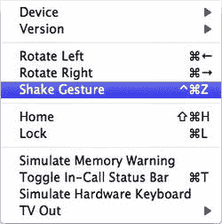

**图 12-4.** 模拟摇动手势

你不会在模拟器中看到任何摇晃动画，但它应该会正确响应并记录下你简单的日志。图 12-5 展示了在“摇晃”模拟器几次后应用的输出结果。

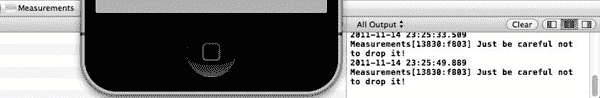

**图 12-5.** “摇晃”模拟器后的输出结果

如果你将 iOS 设备连接到 Xcode 并运行，一旦你轻轻摇晃设备，你将得到相同的结果！


# 配方 12–2：访问原始 Core Motion 数据

现在你的应用已经具备了一些基本的摇动检测功能，你可以开始集成 Core Motion 框架，它将允许你访问加速度计、陀螺仪和磁力计的信息。

首先，选择你的项目，然后导航到 **Build Phases** 选项卡。在 **Link Binary With Libraries** 下，点击 **+** 按钮，选择名为 `CoreMotion.framework` 的项，如图 12–6 所示。

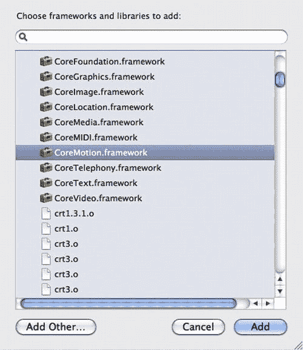

**图 12–6.** *添加 CoreMotion 框架*

现在回到你的主视图控制器的头文件中，添加以下导入语句，以便你可以访问 Core Motion API。

```
#import <CoreMotion/CoreMotion.h>
```

Core Motion 框架非常依赖一个名为 `CMMotionManager` 的单一类。这个类作为一个中心枢纽，通过它可以访问任何给定设备上所有可用的硬件。你将在视图控制器中创建一个该类的实例作为属性，以便持续跟踪它。

```
@property (nonatomic, strong) CMMotionManager *motionManager;
```

在你的视图控制器中，确保合成了这个属性，并按照标准做法，在 `-viewDidUnload` 方法中将其设置为 `nil`。

不幸的是，仅仅合成一个 `CMMotionManager` 对象并不足以确保其初始化（就像 `NSArray` 一样），因此你将创建一个修改过的 getter 方法来解决这个问题。幸运的是，这样做不需要任何复杂的配置。

```
-(CMMotionManager *)motionManager
{
    if (motionManager == nil)
    {
        motionManager = [[CMMotionManager alloc] init];
    }
    return motionManager;
}
```

接下来，你将开始设置用户界面。首先，测量三种不同仪器的输出：加速度计、陀螺仪和磁力计。稍后你会更详细地了解这些仪器的用途，但现在你必须知道，每种仪器都会提供三个不同的值供你查看。因此，你将按照图 12–7 所示设置你的视图。

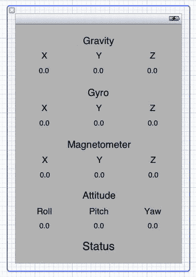

**图 12–7.** *你的视图控制器的 XIB 设置*

请确保将所需的 `UILabel` 作为属性连接到你的视图控制器，以便你可以更改它们的文本！你可以保留所有设备名称标签以及 `X`、`Y` 和 `Z` 标签不动，因此你只需连接那些将显示数值的 `UILabel`（它们当前显示为 `0.0`），以及底部的 **Status** 标签。你将在代码中使用以下按行组织的属性名称：

*   `xAccLabel`, `yAccLabel`, `zAccLabel`
*   `xGyroLabel`, `yGyroLabel`, `zGyroLabel`
*   `xMagLabel`, `yMagLabel`, `zMagLabel`
*   `statusLabel`

你还需要在头文件中定义一个方法来切换当前是否正在获取硬件更新，因此添加以下方法声明。

```
-(void)toggleUpdates;
```

完成后，你的用户界面应该已经为初始应用完全设置好了，你的视图控制器的头文件整体应该如下所示：

```
#import <UIKit/UIKit.h>
#import <CoreMotion/CoreMotion.h>

@interface MainViewController : UIViewController
@property (nonatomic, strong) CMMotionManager *motionManager;
@property (strong, nonatomic) IBOutlet UILabel *xAccLabel;
@property (strong, nonatomic) IBOutlet UILabel *yAccLabel;
@property (strong, nonatomic) IBOutlet UILabel *zAccLabel;

@property (strong, nonatomic) IBOutlet UILabel *xGyroLabel;
@property (strong, nonatomic) IBOutlet UILabel *yGyroLabel;
@property (strong, nonatomic) IBOutlet UILabel *zGyroLabel;

@property (strong, nonatomic) IBOutlet UILabel *xMagLabel;
@property (strong, nonatomic) IBOutlet UILabel *yMagLabel;
@property (strong, nonatomic) IBOutlet UILabel *zMagLabel;

@property (strong, nonatomic) IBOutlet UILabel *statusLabel;

-(void)toggleUpdates;
@end
```

### Core Motion 详解

在 Core Motion 中，假设设备足够新并配备了相关硬件，你可以访问设备上的三种不同硬件。

1.  *加速度计*：该硬件测量设备的加速度（由重力或用户加速度引起），以提供关于设备当前方向以及用户沿特定方向施加的加速度的信息。这对于检测设备是否倾斜（并可能因此旋转视图）特别有用。
    加速度计的数据以 `CMAccelerometerData` 对象的形式呈现。该对象只有一个属性 `acceleration`，包含 `x`、`y`、`z` 三个值，分别表示沿任何给定轴的方向或加速度。
2.  *陀螺仪*：陀螺仪测量设备沿多个轴的旋转速率。
    来自陀螺仪的信息封装在 `CMGyroData` 实例中。该类具有属性 `rotationRate`，包含 `x`、`y`、`z` 三个值，分别表示围绕特定轴的旋转速率。
3.  *磁力计*：该设备提供关于穿过设备的磁场数据，通常基于地球磁场以及附近的其他任何磁场。请记住，在测试此功能时要小心，因为将任何类型的强磁铁靠近设备可能会对其造成损害。
    当从磁力计接收信息时，你访问 `CMMagnetometerData` 类，该类有一个属性 `magneticField`，包含 `x`、`y`、`z` 三个值，用于表示沿每个轴穿过设备的磁场。

对于所有三个设备，所有轴都是相同的。如果你手持设备面向自己，底部朝下，那么 x 轴水平穿过设备，y 轴从上到下运行，z 轴穿过设备中心指向你。

你将首先实现视图控制器以显示每个硬件的原始数据。

每当处理任何内部硬件时，开发者都有责任包含某种方式来确认所访问的硬件在实际运行应用的任何给定设备上是否可用。因此，每次访问 Core Motion 硬件时，你都需要使用以下方法：

*   `-isAccelerometerAvailable`
*   `-isGyroAvailable`
*   `-isMagnetometerAvailable`

这三个方法都简单地返回一个 `BOOL` 值，其中 `YES` 表示该硬件确实可访问。

你还会使用另外三个方法来检查任何给定硬件当前是否已经处于活动状态，以便正确切换更新。

*   `-isAccelerometerActive`
*   `-isGyroActive`
*   `-isMagnetometerActive`

每当你想要从特定硬件获取更新时，必须设置一个“更新间隔”，以指定你接收更新的频率，如下例所示：

```
[self.motionManager setAccelerometerUpdateInterval:1.0/2.0]; // 每秒更新两次
```

有两种不同的方法可以接收来自特定硬件组件的更新。首先，你可以简单地告诉 `CMMotionManager` 使用 `-startAccelerometerUpdates`、`-startGyroUpdates` 和 `-startMagnetometerUpdates` 开始从某个设备接收更新，然后通过 `accelerometerData`、`gyroData` 和 `magnetometerData` 属性查询信息。如果你不打算每次刷新都使用更新数据，这种方法很有用。

第二种方法更适合希望始终使用最新可用数据的用户，就像你在此实现的那样。你可以使用三种不同的方法，这些方法不仅启动更新，还指定了更新时要执行的代码处理块，以及执行该处理块的队列。它们列举如下：


-   `startAccelerometerUpdatesToQueue:withHandler:`
-   `startGyroUpdatesToQueue:withHandler:`
-   `startMagnetometerUpdatesToQueue:withHandler:`

对于简单使用，您将使用主队列来执行处理程序。

综合所有讨论的方法，您可以构建一段简单的代码，如果运行，它将开始从加速度计更新数据。这段代码将用于构建`-toggleUpdates`方法。

```
if ([self.motionManager isAccelerometerAvailable] && ![self.motionManager isAccelerometerActive])
    {
        [self.motionManager setAccelerometerUpdateInterval:1.0/2.0]; //Update twice per second
        [self.motionManager startAccelerometerUpdatesToQueue:[NSOperationQueue mainQueue] withHandler:^(CMAccelerometerData *accelerometerData, NSError *error)
         {
self.xAccLabel.text = [NSString stringWithFormat:@"%f", accelerometerData.acceleration.x];
self.yAccLabel.text = [NSString stringWithFormat:@"%f", accelerometerData.acceleration.y];
self.zAccLabel.text = [NSString stringWithFormat:@"%f", accelerometerData.acceleration.z];
         }];
    }
```

如前所述，您首先检查硬件是否可用且未激活。接下来，您设置更新间隔，然后开始请求更新。您指定的简单处理程序将更新视图的信息，以包含您收到的原始数据。

由于您实际上是在构建一个方法来切换这些更新的开启和关闭，您可以添加以下条件来关闭您的更新。

```
else if ([self.motionManager isAccelerometerActive])
    {
        [self.motionManager stopAccelerometerUpdates];
self.xAccLabel.text = @"...";
self.yAccLabel.text = @"...";
self.zAccLabel.text = @"...";
    }
```

另外两个仪器的工作原理完全相同。总体而言，您的`-toggleUpdates`方法将编写如下：

```
-(void)toggleUpdates
{
if ([self.motionManager isAccelerometerAvailable] && ![self.motionManagerisAccelerometerActive])
    {
        [self.motionManager setAccelerometerUpdateInterval:1.0/2.0]; //Update twice per second
        [self.motionManager startAccelerometerUpdatesToQueue:[NSOperationQueue mainQueue] withHandler:^(CMAccelerometerData *accelerometerData, NSError *error)
         {
self.xAccLabel.text = [NSString stringWithFormat:@"%f", accelerometerData.acceleration.x];
self.yAccLabel.text = [NSString stringWithFormat:@"%f", accelerometerData.acceleration.y];
self.zAccLabel.text = [NSString stringWithFormat:@"%f", accelerometerData.acceleration.z];
         }];
    }
else if ([self.motionManager isAccelerometerActive])
    {
        [self.motionManager stopAccelerometerUpdates];
self.xAccLabel.text = @"...";
self.yAccLabel.text = @"...";
self.zAccLabel.text = @"...";
    }

if ([self.motionManager isGyroAvailable] && ![self.motionManager isGyroActive])
    {
        [self.motionManage rsetGyroUpdateInterval:1.0/2.0];
        [self.motionManager startGyroUpdatesToQueue:[NSOperationQueue mainQueue] withHandler:^(CMGyroData *gyroData, NSError *error)
         {
self.xGyroLabel.text = [NSString stringWithFormat:@"%f", gyroData.rotationRate.x];
self.yGyroLabel.text = [NSString stringWithFormat:@"%f", gyroData.rotationRate.y];
self.zGyroLabel.text = [NSString stringWithFormat:@"%f", gyroData.rotationRate.z];
         }];
    }
else if ([self.motionManager isGyroActive])
    {
        [self.motionManager stopGyroUpdates];
self.xGyroLabel.text = @"...";
self.yGyroLabel.text = @"...";
self.zGyroLabel.text = @"...";
    }

if ([self.motionManager isMagnetometerAvailable] && ![self.motionManager isMagnetometerActive])
    {
        [self.motionManager setMagnetometerUpdateInterval:1.0/2.0];
        [self.motionManager startMagnetometerUpdatesToQueue:[NSOperationQueue mainQueue] withHandler:^(CMMagnetometerData *magData, NSError *error)
         {
self.xMagLabel.text = [NSString stringWithFormat:@"%f", magData.magneticField.x];
self.yMagLabel.text = [NSString stringWithFormat:@"%f", magData.magneticField.y];
self.zMagLabel.text = [NSString stringWithFormat:@"%f", magData.magneticField.z];
         }];
    }
else if ([self.motionManager isMagnetometerActive])
    {
        [self.motionManager stopMagnetometerUpdates];
self.xMagLabel.text = @"...";
self.yMagLabel.text = @"...";
self.zMagLabel.text = @"...";
    }
}
```

为了增加一点趣味，您将继续实现让切换基于设备的摇晃，因此您将修改`-shakeDetected:`方法。

```
-(void)shakeDetected:(NSNotification *)paramNotification
{
if ([self.statusLabel.text isEqualToString:@"Updating"])
    {
self.statusLabel.text = @"Stopped";
        [self toggleUpdates];
    }
else
    {
self.statusLabel.text = @"Updating";
        [self toggleUpdates];
    }
}
```

每当您处理`CMMotionManager`时，应始终确保在应用程序结束时停止所有更新，因此您将设置`-viewDidUnload:`方法如下：

```
- (void)viewDidUnload
{
if ([self.motionManager isAccelerometerAvailable] && [self.motionManager isAccelerometerActive])
    {
        [self.motionManager stopAccelerometerUpdates];
    }
if ([self.motionManager isGyroAvailable] && [self.motionManager isGyroActive])
    {
        [self.motionManager stopGyroUpdates];
    }
if ([self.motionManager isMagnetometerAvailable] && [self.motionManager isMagnetometerActive])
    {
        [self.motionManager stopMagnetometerUpdates];
    }

self.motionManager = nil;
    [self setXAccLabel:nil];
    [self setYAccLabel:nil];
    [self setZAccLabel:nil];
    [self setXGyroLabel:nil];
    [self setYGyroLabel:nil];
    [self setZGyroLabel:nil];
    [self setStatusLabel:nil];
    [self setXMagLabel:nil];
    [self setYMagLabel:nil];
    [self setZMagLabel:nil];
    [superview DidUnload];
}
```

您还应该确保应用程序在进入后台时停止更新，因此切换到您的应用程序委托并实现`-applicationDidEnterBackground:`。

```
- (void)applicationDidEnterBackground:(UIApplication *)application
{
if ([self.viewController.motionManager isAccelerometerAvailable] && [self.viewController.motionManager isAccelerometerActive])
    {
[self.viewController.motionManager stopAccelerometerUpdates];
    }
if ([self.viewController.motionManager isGyroAvailable] && [self.viewController.motionManager isGyroActive])
    {
        [self.viewController.motionManager stopGyroUpdates];
    }
if ([self.viewController.motionManager isMagnetometerAvailable] && [self.viewController.motionManager isMagnetometerActive])
    {
        [self.viewController.motionManager stopMagnetometerUpdates];
    }
}
```

如果您现在运行应用程序，快速摇晃将开始更新所有值，结果视图类似于图 12-8。

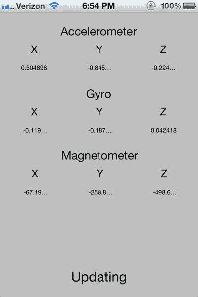

**图 12-8.** *您的应用程序正在接收原始设备信息*

您可能会注意到，此设置的主要问题是数据没有太大意义。它是原始的、有偏差的数据，不太容易使用。接下来，您将更改实现，以更好地利用可以从`CMMotionManager`访问的第四组值：`CMDeviceMotion`。


与加速度计、陀螺仪和磁力计一样，你可以通过启动和停止更新来访问`CMDeviceMotion`，使用的方法非常相似：`startDeviceMotionUpdates`和`startDeviceMotionUpdatesToQueue:withHandler:`。不过，除此之外，你还有两个额外的方法允许你指定一个“参考系”：`startDeviceMotionUpdatesUsingReferenceFrame:`和`startDeviceMotionUpdatesUsingReferenceFrame:toQueue:WithHandler:`。我们稍后会介绍参考系的概念。

当通过`CMDeviceMotion`实例（通过`CMMotionManager`中的`deviceMotion`属性）检索数据时，你可以访问五个不同的属性。

1. `attitude`：该属性是`CMAttitude`类的一个实例，它能让你极其详细地了解设备在给定时间点相对于参考系的方向。在这个类中，你可以访问`roll`、`pitch`和`yaw`等属性。这些值以弧度为单位，能够让你极其精确地测量设备的方向。
2. `rotationRate`：该值以弧度/秒为单位，与之前的`rotationRate`类似，但通过减少导致静止设备产生非零旋转值的设备偏差，提供了更准确的读数。
3. `gravity`：表示设备上仅由重力引起的加速度。
4. `userAcceleration`：表示用户施加在设备上、除去重力加速度之外的物理加速度。
5. `magneticField`：该值与之前用过的值类似；不过，它会消除任何设备偏差，从而得到比之前显著更准确的读数。

**注意：** 如果你不熟悉弧度，它是与更常用的度量单位“度”不同的一种旋转测量方式。它基于圆周率π（3.14...）的值。弧度为π（约等于 3.14）相当于 180 度旋转，因此任何弧度值都可以通过除以π再乘以 180 来转换为度。

你将遍历代码，并将其更新为仅从`deviceMotion`属性获取数据。

现在你可以访问两个不同的基于加速度的属性，你将具体使用`gravity`属性。我已经将视图中顶部的`UILabel`从“Accelerometer”改为“Gravity”，当然，这是可选的。

现在，你的`toggleUpdates`方法将如下所示：

```
-(void)toggleUpdates
{
    if ([self.motionManager isDeviceMotionAvailable] && ![self.motionManager isDeviceMotionActive])
    {
        [self.motionManager setDeviceMotionUpdateInterval:1.0/2.0];
        [self.motionManager startDeviceMotionUpdatesToQueue:[NSOperationQueue mainQueue] withHandler:^(CMDeviceMotion *motion, NSError *error)
         {
            self.xAccLabel.text = [NSString stringWithFormat:@"%f", motion.gravity.x];
            self.yAccLabel.text = [NSString stringWithFormat:@"%f", motion.gravity.y];
            self.zAccLabel.text = [NSString stringWithFormat:@"%f", motion.gravity.z];

            self.xGyroLabel.text = [NSString stringWithFormat:@"%f", motion.rotationRate.x];
            self.yGyroLabel.text = [NSString stringWithFormat:@"%f", motion.rotationRate.y];
            self.zGyroLabel.text = [NSString stringWithFormat:@"%f", motion.rotationRate.z];

            self.xMagLabel.text = [NSString stringWithFormat:@"%f", motion.magneticField.field.x];
            self.yMagLabel.text = [NSString stringWithFormat:@"%f", motion.magneticField.field.y];
            self.zMagLabel.text = [NSString stringWithFormat:@"%f", motion.magneticField.field.z];
         }];
    }
    else if ([self.motionManager isDeviceMotionActive])
    {
        [self.motionManager stopDeviceMotionUpdates];

        self.xAccLabel.text = @"...";
        self.yAccLabel.text = @"...";
        self.zAccLabel.text = @"...";
        self.xGyroLabel.text = @"...";
        self.yGyroLabel.text = @"...";
        self.zGyroLabel.text = @"...";
        self.xMagLabel.text = @"...";
        self.yMagLabel.text = @"...";
        self.zMagLabel.text = @"...";
    }
}
```

你还需要按如下方式更改你的`viewDidUnload`方法：

```
- (void)viewDidUnload
{
    if ([self.motionManager isDeviceMotionAvailable] && [self.motionManager isDeviceMotionActive])
    {
        [self.motionManager stopDeviceMotionUpdates];
    }

    self.motionManager = nil;
    [self setXAccLabel:nil];
    [self setYAccLabel:nil];
    [self setZAccLabel:nil];
    [self setXGyroLabel:nil];
    [self setYGyroLabel:nil];
    [self setZGyroLabel:nil];
    [self setStatusLabel:nil];
    [self setXMagLabel:nil];
    [self setYMagLabel:nil];
    [self setZMagLabel:nil];
    [superview DidUnload];
}
```

在你的应用代理中，你还需要更新`applicationDidEnterBackground:`方法。

```
- (void)applicationDidEnterBackground:(UIApplication *)application
{
    if ([self.viewController.motionManager isDeviceMotionAvailable] && [self.viewController.motionManager isDeviceMotionActive])
    {
        [self.viewController.motionManager stopDeviceMotionUpdates];
    }
}
```

因此，如果你现在运行这个应用，可能会注意到大部分数值都稳定了不少。你可能还会看到磁力计读数全部为零。将你的设备以 8 字形运动移动，以校准磁力计，直到这些数值开始更新。

现在你已经切换到使用`DeviceMotion`，你还需要添加字段来显示来自`attitude`属性的`pitch`、`yaw`和`roll`值。请更新你的视图，使其类似于图 12-9，并将你的新值`UILabel`属性命名为`rollLabel`、`pitchLabel`和`yawLabel`。

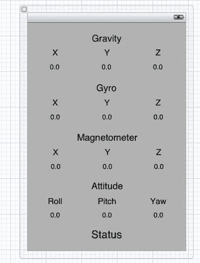

**图 12-9.** *用于显示姿态的新界面*


#### 姿态属性

在使用 `CMAttitude` 类时，你可以从中获取三个最简单的值来判断设备方向。

1. `roll`：表示绕 y 轴旋转的位置
2. `pitch`：表示绕 x 轴旋转的位置
3. `yaw`：表示绕 z 轴旋转的位置

这三个值均以弧度为单位测量，这意味着你显示的值范围将从 0 到大约 3.14 或 -3.14（即 π 弧度的旋转，相当于 180 度）。

现在你可以再次更新 `-toggleUpdates:` 方法，将新的显示值包含进来。

```
-(void)toggleUpdates
{
if ([self.motionManager isDeviceMotionAvailable] && ![self.motionManager isDeviceMotionActive])
    {
        [self.motionManager setDeviceMotionUpdateInterval:1.0/2.0];
        [self.motionManager startDeviceMotionUpdatesToQueue:[NSOperationQueue mainQueue] withHandler:^(CMDeviceMotion *motion, NSError *error)
         {
self.xAccLabel.text = [NSString stringWithFormat:@"%f", motion.gravity.x];
self.yAccLabel.text = [NSString stringWithFormat:@"%f", motion.gravity.y];
self.zAccLabel.text = [NSString stringWithFormat:@"%f", motion.gravity.z];

self.xGyroLabel.text = [NSString stringWithFormat:@"%f", motion.rotationRate.x];
self.yGyroLabel.text = [NSString stringWithFormat:@"%f", motion.rotationRate.y];
self.zGyroLabel.text = [NSString stringWithFormat:@"%f", motion.rotationRate.z];

self.xMagLabel.text = [NSString stringWithFormat:@"%f", motion.magneticField.field.x];
self.yMagLabel.text = [NSString stringWithFormat:@"%f", motion.magneticField.field.y];
self.zMagLabel.text = [NSString stringWithFormat:@"%f", motion.magneticField.field.z];

//////新的姿态代码
self.rollLabel.text = [NSString stringWithFormat:@"%f", motion.attitude.roll];
self.pitchLabel.text = [NSString stringWithFormat:@"%f", motion.attitude.pitch];
self.yawLabel.text = [NSString stringWithFormat:@"%f", motion.attitude.yaw];
//////新代码结束
         }];
    }
else if ([self.motionManager isDeviceMotionActive])
    {
        [self.motionManager stopDeviceMotionUpdates];

self.xAccLabel.text = @"...";
self.yAccLabel.text = @"...";
self.zAccLabel.text = @"...";
self.xGyroLabel.text = @"...";
self.yGyroLabel.text = @"...";
self.zGyroLabel.text = @"...";
self.xMagLabel.text = @"...";
self.yMagLabel.text = @"...";
self.zMagLabel.text = @"...";

//////新的姿态代码
self.rollLabel.text = @"...";
self.pitchLabel.text = @"...";
self.yawLabel.text = @"...";
//////新代码结束
    }
}
```

虽然不是必须的，但你最好还是为你的 `attitude` 指定一个参考坐标系，以便了解设备与什么进行比较。可以使用 `-startDeviceMotionUpdatesUsingReferenceFrame:toQueue:withHandler:` 方法来实现。从 iOS 5.0 开始，该方法的参考坐标系参数接受四个可选值。

* `CMAttitudeReferenceFrameXArbitraryZVertical`：指定一个参考坐标系，其 z 轴沿垂直方向，x 轴沿任意方向；更简单地说，设备平放且屏幕朝上。
* `CMAttitudeReferenceFrameXArbitraryCorrectedZVertical`：与上一个值相同，但使用了磁力计来提供更好的精度。该选项会增加 CPU 使用率，并且要求磁力计可用且已校准。
* `CMAttitudeReferenceFrameXMagneticNorthZVertical`：该参考坐标系的 z 轴仍然垂直，但 x 轴指向“磁北”方向。此选项要求磁力计可用且已校准，这意味着在应用程序中获取读数之前，你可能需要拿着设备画八字形晃动。
* `CMAttitudeReferenceFrameXTrueNorthZVertical`：该参考坐标系与上一个类似，但 x 轴指向“真北”方向，而非“磁北”。设备必须能够获取自身位置，才能计算两者之间的差异。

**注意：** 在使用磁力计时，务必理解“磁北”和“真北”的区别。磁北是地球的磁北极，是指南针所指的方向。然而，由于地核的变化，这个点并非固定不变，每年会移动超过 30 英里。真北指的是指向地球实际北极的方向，这个方向是固定不变的。

在应用程序中，你将选择第三个选项 `CMAttitudeReferenceFrameXMagneticNorthZVertical`。将对 `-startDeviceMotionUpdatesToQueue:withHandler:` 方法的调用修改为以下内容：

```
[self.motionManager startDeviceMotionUpdatesUsingReferenceFrame:CMAttitudeReferenceFrameXMagneticNorthZVertical toQueue:[NSOperationQueue mainQueue] withHandler:^(CMDeviceMotion *motion, NSError *error)
         {
self.xAccLabel.text = [NSString stringWithFormat:@"%f", motion.gravity.x];
self.yAccLabel.text = [NSString stringWithFormat:@"%f", motion.gravity.y];
self.zAccLabel.text = [NSString stringWithFormat:@"%f", motion.gravity.z];

self.xGyroLabel.text = [NSString stringWithFormat:@"%f", motion.rotationRate.x];
self.yGyroLabel.text = [NSString stringWithFormat:@"%f", motion.rotationRate.y];
self.zGyroLabel.text = [NSString stringWithFormat:@"%f", motion.rotationRate.z];

self.xMagLabel.text = [NSString stringWithFormat:@"%f", motion.magneticField.field.x];
self.yMagLabel.text = [NSString stringWithFormat:@"%f", motion.magneticField.field.y];
self.zMagLabel.text = [NSString stringWithFormat:@"%f", motion.magneticField.field.z];

self.rollLabel.text = [NSString stringWithFormat:@"%f", motion.attitude.roll];
self.pitchLabel.text = [NSString stringWithFormat:@"%f", motion.attitude.pitch];
self.yawLabel.text = [NSString stringWithFormat:@"%f", motion.attitude.yaw];
         }];
```

现在运行应用程序时，你可能会看到所有值都显示为“0.0”。如果你以画八字形的方式移动设备来校准磁力计，这些值应该会很快开始更新。你应该会注意到，如果你将设备平放在一个水平面上，然后绕 z 轴旋转设备，当 x 轴与地球磁场对齐时，你的 `yaw` 值应非常接近零，如图 12–10 所示。

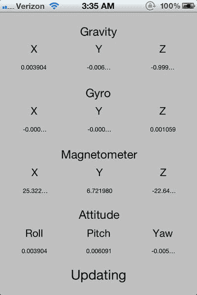

**图 12–10.** *你的应用程序正在接收校准后的设备信息*


### 食谱 12–3：使用加速计移动 `UILabel`

既然我们已经详细探讨了如何访问 Core Motion 提供的所有数据，那么你可以创建一个简单的实现，来实际演示其超越单纯数值访问的用途。你将直接修改现有应用，因此在继续之前，请务必保存一份项目的新副本。

你将修改应用，利用之前访问过的 `gravity` 属性，在视图中移动一个 `UILabel`。为此，你需要为设备运动信息设置一个非常小的更新间隔，因此需要尽量减少实际显示的数据量。你将移除视图中除 `statusLabel` 之外的所有内容，这样你的用户界面将如图 12–11 所示。为了匹配新功能的说明，我也修改了 `UILabel`。

当你从视图中移除所有其他 `UILabel` 时，如果你愿意，可以保留上一食谱中在头文件中设置的所有属性。虽然保留它们会占用少量内存，但这对于你的目的来说微不足道。

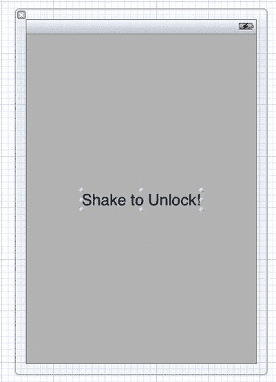

**图 12–11.** *用于移动 `UILabel` 的重新简化的用户界面*

接下来，你可以删除（或注释掉）`–toggleUpdates` 方法中类似于下面这行设置 `CMMotionManager` 更新间隔的代码。

`[self.motionManager setDeviceMotionUpdateInterval:1.0/2.0];`

如果你选择不设置更新间隔，设备将默认为一个极小的值，这意味着你的信息将更新得非常频繁。

你还需要将姿态的参考系改为不需要磁力计校准的值，以提高性能速度。具体来说，你将使用 `CMAttitudeReferenceFrameXArbitraryCorrectedZVertical` 值。

最后，你可以添加代码来获取重力值，然后基于这些值调整你的 `UILabel` 的框架。总体而言，你的 `–toggleUpdates` 方法将如下所示：

```
-(void)toggleUpdates
{
    if ([self.motionManager isDeviceMotionAvailable] && ![self.motionManager isDeviceMotionActive])
    {
        [self.motionManager setDeviceMotionUpdateInterval:1.0/2.0];
        [self.motionManager startDeviceMotionUpdatesUsingReferenceFrame:CMAttitudeReferenceFrameXArbitraryCorrectedZVertical toQueue:[NSOperationQueue mainQueue] withHandler:^(CMDeviceMotion *motion, NSError *error)
         {
            int scale = 5.0;
            CGRect labelRect = self.statusLabel.frame;
            labelRect.origin.x += motion.gravity.x * scale;
            if (!CGRectContainsRect(self.view.bounds, labelRect))
            {
                labelRect.origin.x = self.statusLabel.frame.origin.x;
            }
            labelRect.origin.y -= motion.gravity.y *scale;
            if (!CGRectContainsRect(self.view.bounds, labelRect))
            {
                labelRect.origin.y = self.statusLabel.frame.origin.y;
            }
            [self.statusLabel setFrame:labelRect];
         }];
    }
    else if ([self.motionManager isDeviceMotionActive])
    {
        [self.motionManager stopDeviceMotionUpdates];
    }
}
```

你还可以更新 `-shakeDetected:` 方法，使其文本更有意义：

```
-(void)shakeDetected:(NSNotification *)paramNotification
{
    if ([self.statusLabel.text isEqualToString:@"Unlocked"])
    {
        self.statusLabel.text = @"Locked";
        [self toggleUpdates];
    }
    else
    {
        self.statusLabel.text = @"Unlocked";
        [self toggleUpdates];
    }
}
```

如果你的应用默认没有链接到 CoreGraphics 框架，你将会遇到链接器错误，因此请确保在运行应用之前完成此操作。操作步骤与你之前为 CoreMotion 框架所做的相同，但你不需要使用任何实际的 `#import` 语句。

现在，你的最新应用应该会提供一个不错的小 `UILabel`，你可以通过倾斜设备来移动它，其截图如图 12–12 所示。

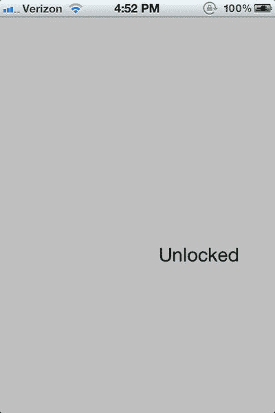

**图 12–12.** *你的应用中根据设备方向移动的 `UILabel`*

### 总结

我们非常详细地探讨了如何访问 Core Motion 框架提供的多种不同数值和信息。我们从原始数据入手，逐步获取到经过校准的函数值，并将这些值转化为一个有点用处（尽管可能略带娱乐性）的应用。然而，Core Motion 并非一个可以独立构成完整应用的框架。你可以用它来获取设备的数据，但必须发挥创造力来加以利用。从测量人体旋转速度的简单应用，到将磁力计集成到增强现实应用中，Core Motion 提供了一个用于访问信息的基本框架，而这些信息可以转化为 iOS 中最强大的软件组件。

## 第 13 章

## 数据传输食谱

随着时间推移和技术发展，最明显的趋势之一就是用户生成内容的增长。由于设计技术、互联网连接速度和网络可用性的提升，每年产生的电子数据量以近乎难以置信的速度增长。这一问题的核心在于让用户能够轻松地接收并重新分发信息。你可以通过多种内置类将同样的概念融入开发中，以提升应用的功能和实用性。

在本章中，你将仅需一台实体设备来实现短信功能，这将在你的第一个食谱中构建。所有其他功能都可以进行模拟。


### 配方 13-1：撰写短信

短信是目前个人间传输数据最为流行的方式之一，它快速、简便且强大，几乎覆盖所有年龄段的人群。在 iOS 中，你可以将短信功能整合到自己的应用中，轻松为用户提供跨应用的简单功能，从而显著提升应用的整体质量。

首先，创建一个名为`"SendItOut"`的新项目（本章将全程使用此项目），类前缀设为`"Main"`。选择"单视图应用"模板来创建简单项目，如图 13-1 所示。

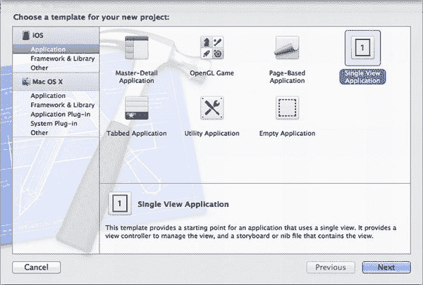

**图 13-1.** *创建单视图应用*

为了充分演示本主题的部分功能，你将专门为 iPad 而非 iPhone 开发应用。在输入项目名称后的下一个界面中，确保"设备家族"已相应设置。由于部分测试功能需要物理设备才能完全实现，你也可以将此应用设为 iPhone 版本，只需根据需求调整视图元素即可。将项目配置为名称`"SendItOut"`、类前缀`"Main"`，并确保勾选"使用自动引用计数"复选框，如图 13-2 所示。

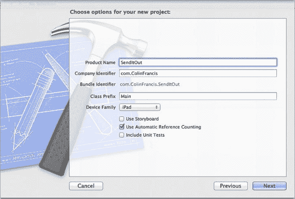

**图 13-2.** *配置项目设置*

点击创建项目后，切换到视图控制器的 XIB 文件。在工具面板中，将方向（位于"模拟指标"部分）设置为横向，并确保背景色设为灰色。

首先，在视图上半部分添加一个`UITextView`（使用默认的 Lorem Ipsum 文本），并在下半部分添加一个标有`"Text Message"`的`UIButton`。将这些控件连接到视图控制器，分别使用属性名称`textViewInput`和`textButton`，并将按钮连接到`IBAction`方法`-textPressed:`。

在继续之前，我们先为`UITextView`的边角添加圆角效果，以提升应用的视觉质量。在视图控制器的头文件中添加以下导入语句：

```
#import <QuartzCore/QuartzCore.h>
```

然后在`-viewDidLoad`方法的末尾添加以下代码行：

```
self.textViewInput.layer.cornerRadius = 15.0;
}

旋转模拟器后，你的视图应如图 13-3 所示。可通过 iOS 模拟器"硬件"菜单中的"向左旋转"（+左箭头）或"向右旋转"（+右箭头）命令完成此操作。

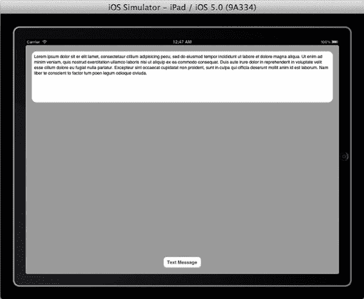

**图 13-3.** *用户界面的模拟视图*

接下来，将视图控制器配置为`UITextView`的委托。在`-viewDidLoad`方法中添加以下代码行：

```
self.textViewInput.delegate = self;
```

然后，向项目添加 MessageUI 框架。像往常一样在项目的"构建阶段"标签下完成此操作，并在视图控制器的头文件中添加所需的导入语句：

```
#import <MessageUI/MessageUI.h>
```

你需要指示视图控制器遵循特定协议。调整头文件，使其同时遵循`UITextViewDelegate`、`MFMessageComposeViewControllerDelegate`和`UINavigationControllerDelegate`协议。

此时，完整设置后的头文件内容如下：

```
#import <UIKit/UIKit.h>
#import <QuartzCore/QuartzCore.h>
#import <MessageUI/MessageUI.h>

@interface MainViewController : UIViewController <UITextViewDelegate, MFMessageComposeViewControllerDelegate, UINavigationControllerDelegate>

@property (strong, nonatomic) IBOutlet UITextView *textViewInput;
@property (strong, nonatomic) IBOutlet UIButton *textButton;
-(IBAction)textPressed:(id)sender;

@end
```

现在，你将实现`UITextView`的一个委托方法，以确保用户在点击回车键时键盘能正确收起。

```
- (BOOL)textView:(UITextView *)textView shouldChangeTextInRange:(NSRange)range
 replacementText:(NSString *)text
{
    if ([text isEqualToString:@"\n"])
    {
        [textView resignFirstResponder];
        return FALSE;
    }
    return TRUE;
}
```

接下来，实现`-textPressed:`方法，将`UITextView`中的文本转为短信内容。只需将收件人设置为一个虚拟号码即可。

```
-(void)textPressed:(id)sender
{
    if ([MFMessageComposeViewController canSendText])
    {
        MFMessageComposeViewController *messageVC = [[MFMessageComposeViewController alloc] init];
        messageVC.messageComposeDelegate = self;
        messageVC.recipients = [NSArray arrayWithObject:@"3015555309"];
        messageVC.body = self.textViewInput.text;
        [self presentModalViewController:messageVC animated:YES];
    }
    else
    {
        NSLog(@"错误，短信功能不可用");
    }
}
```

此方法的实现相当直观。在使用`+canSendText`方法检查短信可用性后，创建了一个`MFMessageComposeViewController`类的实例，并配置了虚拟收件人以及要发送的文本。最后，以模态方式呈现该控制器，让用户在发送前检查短信内容。

`MFMessageComposeViewController`及其后文会提到的对应类`MFMailComposeViewController`，都允许你设置初始条件并呈现它们，但一旦显示后，你便无法控制该类。这是为了确保用户对短信或邮件的发送拥有最终决定权，而不是应用在未告知用户的情况下擅自发送。

你可以实现`MFMessageComposeViewController`的`messageComposeDelegate`方法来处理短信发送完成后的操作，示例如下：

```
-(void)messageComposeViewController:(MFMessageComposeViewController *)controller didFinishWithResult:(MessageComposeResult)result
{
    if (result == MessageComposeResultSent)
    {
        self.textViewInput.text = @"短信已发送。";
    }
    else if (result == MessageComposeResultFailed)
    {
        NSLog(@"短信发送失败！");
    }
    [self dismissModalViewControllerAnimated:YES];
}
```

除了上述代码中演示的两种`MessageComposeResults`值外，还有第三种结果：`MessageComposeResultCancelled`，表示用户取消了短信发送。

iOS 5.0 新增的一项功能是接收有关短信可用性变化的通知。你可以通过在`-viewDidLoad`方法中添加以下代码行来注册此类通知：

```
[[NSNotificationCenter defaultCenter] addObserver:self
                                         selector:@selector(availabilityChange:)
                                             name:@"MFMessageComposeViewControllerTextMessageAvailabilityDidChangeNotification"
                                           object:nil];
```

此处指定的选择器可以轻松定义为仅通知你变化情况。在完整应用中，你可能还会使用`UIAlert`来通知用户这一变化，但出于演示目的，此处将省略此过程。

```
-(void)availabilityChange:(id)sender
{
    if ([MFMessageComposeViewController canSendText])
    {
        NSLog(@"短信功能可用");
    }
    else
    {
        NSLog(@"短信功能不可用");
    }
}
```


现在，你的应用程序可以将 `UITextView` 的正文复制到短信中，发送给你的模拟收件人！但如果你测试这一功能时，请记住 iOS 模拟器无法使用短信功能。你需要在支持 3G 的真实设备上进行测试。要像这样精确测试该应用，你需要一台支持 3G 的 iPad，不过你也可以修改项目，使其转而适用于 iPhone。

## 秘籍 13–2：编写电子邮件

就像你能够创建并配置从应用中发送的短信一样，你也可以使用上一秘籍中处理过的 `MessageUI` 框架，通过 `MFMessageComposeViewController` 类的对应类——`MFMailComposeViewController`——来配置邮件消息。

在现有应用的基础上，你将添加一个标签为“Mail”（邮件）的按钮。使用属性名称 `mailButton`，并为其分配一个名为 `-mailPressed:` 的动作。

你的 `-mailPressed:` 方法的设置与之前的 `-textPressed:` 方法非常相似。你将创建撰写视图控制器，配置它，然后呈现它。

```
-(void)mailPressed:(id)sender
{
    if ([MFMailComposeViewController canSendMail])
    {
        MFMailComposeViewController *mailVC = [[MFMailComposeViewController alloc] init];
        [mailVC setSubject:@"SendItOut"];
        [mailVC setToRecipients:[NSArray arrayWithObject:@"test@example.com"]];
        [mailVC setMessageBody:self.textViewInput.text isHTML:NO];
        mailVC.mailComposeDelegate = self;
        [self presentModalViewController:mailVC animated:YES];
    }
    else
    {
        NSLog(@"Error: Mail Unavailable");
    }
}
```

如你所见，与 `MFMessageComposeViewController` 相比，`MFMailComposeViewController` 拥有更多属性，用于专门配置更复杂的电子邮件。

由于你将 `mailComposeDelegate` 属性设置为了你的视图控制器，你需要指定它除了已经遵循的协议之外，还需遵循 `MFMailComposeViewControllerDelegate` 协议，因此请将其添加到你的头文件中。

`MFMailComposeViewControllerDelegate` 协议只定义了一个方法，你需要实现它，以便正确处理用户完成视图控制器使用后的操作。你将为其提供一个简单的实现来记录结果。

```
-(void)mailComposeController:(MFMailComposeViewController *)controller
didFinishWithResult:(MFMailComposeResult)result error:(NSError *)error
{
    if (result == MFMailComposeResultSent)
        NSLog(@"Mail Successfully Sent");
    else if (result == MFMailComposeResultCancelled)
        NSLog(@"Mail Cancelled");
    else if (result == MFMailComposeResultFailed)
        NSLog(@"Error, Mail Send Failed");
    else if (result == MFMailComposeResultSaved)
        NSLog(@"Mail Saved");
    [self dismissModalViewControllerAnimated:YES];
}
```

现在，你的新应用将能够呈现一个用于发送邮件的视图控制器，如图 13–4 所示。不过与 `MFMessageViewController` 不同，你实际上可以在 iOS 模拟器中测试这一功能。

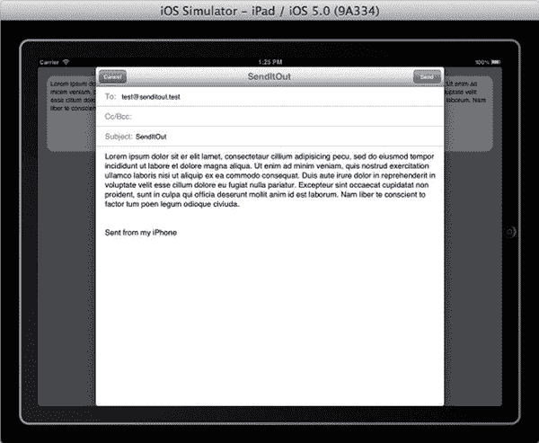

**图 13–4.** *你的应用正在撰写电子邮件*

非常方便的是，你可以使用模拟器轻松测试 `MFMailComposeViewController` 的所有功能，而无需担心会向任何真实或虚假地址发送多封电子邮件。模拟器不会真正通过网络发送你的测试消息，因此你可以轻松测试 `mailComposeDelegate` 方法对 `MailComposeResults` 的处理。

使用 `MFMailComposeViewController` 时可能遇到的另一个额外问题是，如果你允许根据用户输入设置收件人。用户很可能会错误地格式化邮件地址。这不会导致你的应用抛出异常，但可能会导致收件人被 `MFMailComposeViewController` 忽略。你可以格式化用户输入以尝试避免这种情况，或者简单地设置一个正则表达式来验证给定的地址是否符合要求的格式。


#### 将数据附加到邮件

`MFMailComposeViewController` 提供了功能，让你能够通过使用 `-addAttachmentData:mimeType:fileName:` 方法，从你的应用程序中将数据附加到电子邮件。该方法接受三个参数：

1.  `attachment`：此 `NSData` 实例指的是你想要发送的对象的实际数据。这意味着对于任何你想要附加的对象，你都需要获取它的 `NSData`。
2.  `mimeType`：此属性是一个 `NSString`，用于向控制器定义附件的数据类型。这些值并非 iOS 本地所有，因此未在 Apple 文档中定义。不过，你可以轻松地在网上找到它们。维基百科在 `http://en.wikipedia.org/wiki/Internet_media_type` 提供了一篇关于所有可能值的非常清晰的文章。例如，JPEG 图像的 MIME 类型是 `"image/jpeg"`。
3.  `fileName`：使用此 `NSString` 属性来为邮件中发送的文件设置首选名称。

你将向你的应用程序添加功能，以访问用户的图像库、选择一张图像，然后使用该图像附加到你的电子邮件中。

首先，在你的 `UITextView` 下方添加一个 `UIImageView`，并在其下方添加一个标签为“获取图像”的 `UIButton`。你的视图现在将类似于 图 13-5 中模拟的样子。

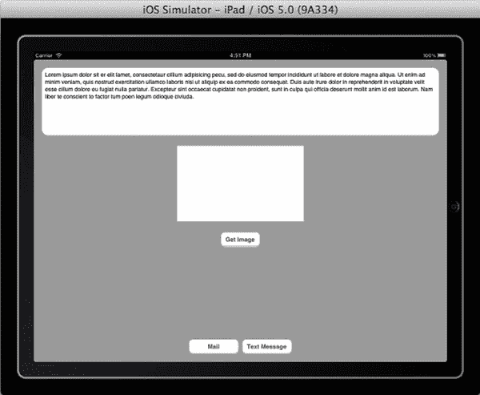

**图 13-5.** *具备选择图像能力的新用户界面*

你将为这些内容添加属性 `imageViewContent` 和 `getImageButton`，以及方法 `-getImagePressed:`。你将通过你的 `getImageButton` 呈现一个 `UIPopoverController`，因此请确保此方法的 `sender` 类型设置为 `UIButton*` 而不是 `id`。继续，再创建一个名为 `selectedImage` 的 `UIImage` 属性，用于存储对所选图像的引用，并确保正确综合（synthesize）它。

每当你想要访问 iPad 的照片库时，都需要使用一个设置在 `UIPopoverController` 内部的 `UIImagePickerController`。你需要创建一个名为 `pop` 的 `UIPopoverController` 属性，并确保也综合它。

在继续之前，指示你的视图控制器遵守 `UIImagePickerControllerDelegate` 和 `UIPopoverControllerDelegate` 协议。总的来说，你的头文件现在应该类似于以下内容：

```
#import <UIKit/UIKit.h>
#import <QuartzCore/QuartzCore.h>
#import <MessageUI/MessageUI.h>

@interface MainViewController : UIViewController <UITextViewDelegate,
MFMessageComposeViewControllerDelegate, UINavigationControllerDelegate,
MFMailComposeViewControllerDelegate, UIImagePickerControllerDelegate,
UIPopoverControllerDelegate>

@property (strong, nonatomic) IBOutlet UITextView *textViewInput;
@property (strong, nonatomic) IBOutlet UIButton *textButton;
@property (strong, nonatomic) IBOutlet UIButton *mailButton;
@property (strong, nonatomic) IBOutlet UIImageView *imageViewContent;
@property (strong, nonatomic) IBOutlet UIButton *getImageButton;
@property (strong, nonatomic) UIImage *selectedImage;
@property (strong, nonatomic) UIPopoverController *pop;

-(IBAction)textPressed:(id)sender;
-(IBAction)mailPressed:(id)sender;
-(IBAction)getImagePressed:(UIButton *)sender;
///请特别注意上面的 (UIButton *) 参数类型。

@end
```

如果你到目前为止已正确处理了所有新属性，那么你的 `-viewDidUnload:` 方法应类似于以下内容：

```
- (void)viewDidUnload
{
    [self setPop:nil];
    [self setSelectedImage:nil];
    [self setTextViewInput:nil];
    [self setTextButton:nil];
    [self setMailButton:nil];
    [self setImageViewContent:nil];
    [self setGetImageButton:nil];
    [super viewDidUnload];
}
```

现在，你可以编写你的 `-getImagePressed:` 方法来呈现你的弹出控制器，以便访问照片库。

```
-(void)getImagePressed:(UIButton *)sender
{
UIImagePickerController *picker = [[UIImagePickerController alloc] init];
if ([UIImagePickerController
isSourceTypeAvailable:UIImagePickerControllerSourceTypePhotoLibrary])
    {
        picker.sourceType = UIImagePickerControllerSourceTypePhotoLibrary;
        picker.delegate = self;

self.pop = [[UIPopoverController alloc] initWithContentViewController:picker];
pop.delegate = self;
        [pop presentPopoverFromRect:sender.frame inView:self.view
permittedArrowDirections:UIPopoverArrowDirectionAny animated:YES];
    }
}
```

现在你只需实现你的 `UIImagePickerControllerDelegate` 协议方法。

```
-(void)imagePickerControllerDidCancel:(UIImagePickerController *)picker
{
    [self.pop dismissPopoverAnimated:YES];
}

-(void)imagePickerController:(UIImagePickerController *)picker
didFinishPickingMediaWithInfo:(NSDictionary *)info
{
UIImage *image = [info valueForKey:@"UIImagePickerControllerOriginalImage"];
self.selectedImage = image;
self.imageViewContent.image = image;
self.imageViewContent.contentMode = UIViewContentModeScaleAspectFill;

    [self.pop dismissPopoverAnimated:YES];
}
```

至此，你的应用程序可以选择一张图像并将其设置在你的 `UIImageView` 中。如果你在模拟器中测试此应用程序，你将需要至少获取一张图像放入模拟器的照片库中。你可以通过访问模拟器上的 Safari 应用程序、在网上找到一张图像，然后点击并按住该图像将其保存到库中来实现。在 图 13-6 中，你的应用程序显示已选择了一张图像，并且“获取图像”按钮再次被按下。

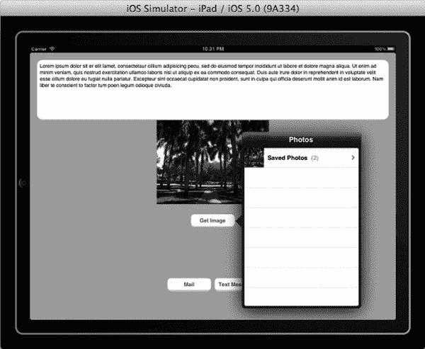

**图 13-6.** *运行你的应用程序并选择要显示的图像*

现在，你可以继续将选定的图像添加到你的电子邮件中。你将修改你的 `-mailPressed:` 方法，以在已选择图像时包含附加图像的功能。

```
-(void)mailPressed:(id)sender
{
if ([MFMailComposeViewController canSendMail])
    {
MFMailComposeViewController *mailVC = [[MFMailComposeViewController alloc] init];
        [mailVC setSubject:@"SendItOut"];
        [mailVC setToRecipients:[NSArray arrayWithObject:@"test@senditout.test"]];
        [mailVC setMessageBody:self.textViewInput.text isHTML:NO];
        mailVC.mailComposeDelegate = self;

/////新增图像代码
if (self.selectedImage != nil)
        {
NSData *imageData = UIImageJPEGRepresentation(self.selectedImage, 1.0);
            [mailVC addAttachmentData:imageData mimeType:@"image/jpeg" fileName:@"SelectedImage"];
        }
/////结束新增代码

        [self presentModalViewController:mailVC animated:YES];
    }
else
    {
NSLog(@"错误：邮件不可用");
    }
}
```

最后，你可以修改 `MFMailComposeViewController` 的委托方法，以便正确重置你的应用程序。

```
-(void)messageComposeViewController:(MFMessageComposeViewController *)controller
didFinishWithResult:(MessageComposeResult)result
{
if (result == MessageComposeResultSent)
    {
self.textViewInput.text = @"消息已发送。";
self.selectedImage = nil;
self.imageViewContent.image = nil;
    }
else if (result == MessageComposeResultFailed)
    {
NSLog(@"消息发送失败！");
    }
    [self dismissModalViewControllerAnimated:YES];
}
```

如果你现在在模拟器中测试应用程序，并且在选择图像后尝试发送电子邮件，你应该会看到选定的图像被放置在你的消息中，如 图 13-7 所示。

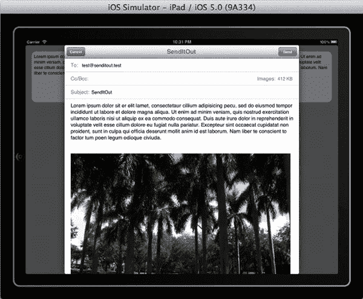

**图 13-7.** *你的应用程序正在编写带有附件的电子邮件*


