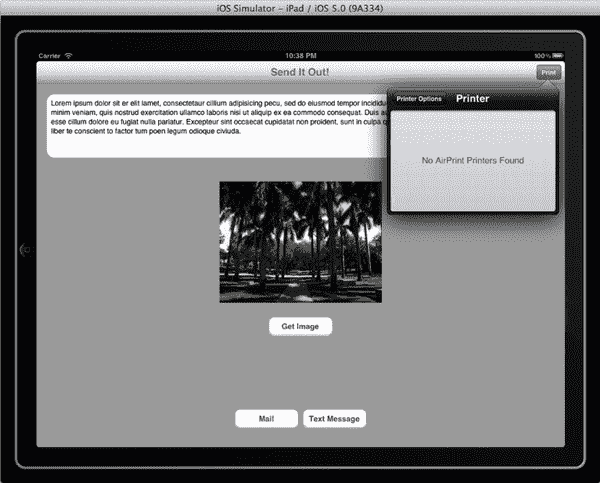
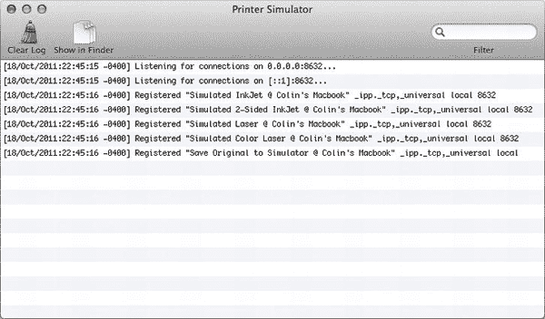
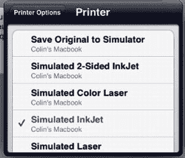
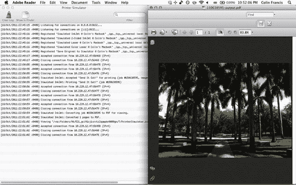
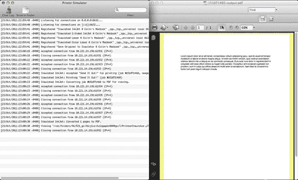
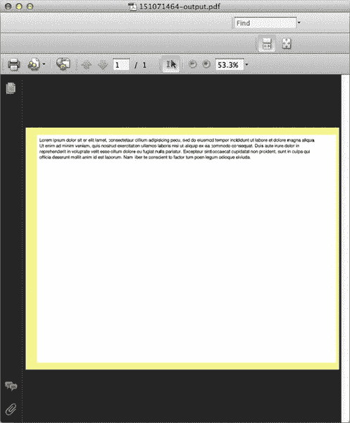
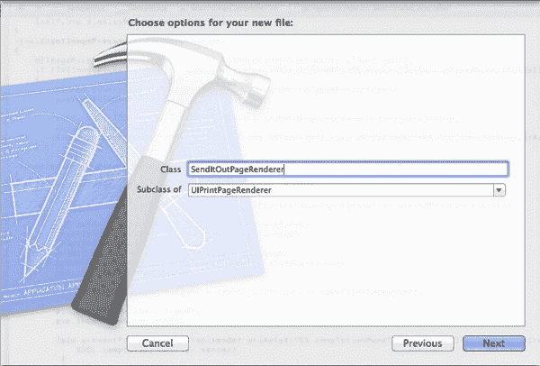
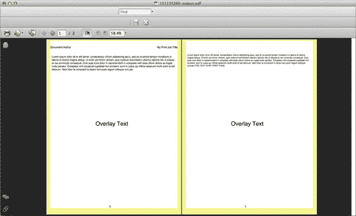

# 方案 13–3：打印图像

现在你的应用程序已设置好，既能访问文本也能访问图像，你可以通过添加打印功能来进一步增强其可用性。

在具体处理打印功能之前，你需要稍微重新配置应用程序的用户界面，将你的视图控制器嵌入 `UINavigationController` 中，以便在顶部获得一个漂亮的工具栏。为此，请调整你的应用程序委托中的 `-application:didFinishLaunchingWithOptions` 方法，如下所示：

```
- (BOOL)application:(UIApplication *)application
didFinishLaunchingWithOptions:(NSDictionary *)launchOptions
{
    self.window = [[UIWindow alloc] initWithFrame:[[UIScreen mainScreen] bounds]];
    // 覆盖点：应用程序启动后的自定义点。
    self.viewController = [[MainViewController alloc] initWithNibName:@"MainViewController"
                                                              bundle:nil];
    /////修改的代码
    __strong UINavigationController *navcon = [[UINavigationController alloc]
                                               initWithRootViewController:self.viewController];
    self.window.rootViewController = navcon;
    /////修改结束

    [self.window makeKeyAndVisible];
    return YES;
}
```

你可能还需要稍微向上移动视图下方的按钮，以确保它们不会被导航栏推出屏幕。

在 `-viewDidLoad` 方法的末尾添加以下几行代码，以配置你的导航栏。

```
self.title = @"发送出去！";

if ([UIPrintInteractionController isPrintingAvailable])
{
    UIBarButtonItem *printButton = [[UIBarButtonItem alloc]
                                    initWithTitle:@"打印"
                                    style:UIBarButtonItemStyleBordered
                                    target:self
                                    action:@selector(printPressed:)];

    self.navigationItem.rightBarButtonItem = printButton;
}
```

这个条件判断会在显示打印按钮之前，确认你运行应用的设备是否支持打印功能。

现在，你可以继续实现 `-printPressed:` 方法，以添加打印功能，主要通过使用 `UIPrintInteractionController` 类来实现。在配置打印任务时，这个类将成为你的活动“枢纽”。在查看完整方法之前，我们将逐步讨论如何设置这个类。

当你想要访问 `UIPrintInteractionController` 的实例时，只需通过 `+sharedPrintController` 类方法获取共享实例的引用。

```
UIPrintInteractionController *pic = [UIPrintInteractionController sharedPrintController];
```

接下来，你必须配置控制器的 `printInfo` 属性，该属性指定了打印任务的设置。

```
UIPrintInfo *printInfo = [UIPrintInfo printInfo];
printInfo.outputType = UIPrintInfoOutputPhoto;
printInfo.jobName = self.title;
printInfo.duplex = UIPrintInfoDuplexLongEdge;
```

如你所见，你将 `outputType` 设置为指定图像。此属性的三个可能值如下：

- `UIPrintInfoOutputPhoto`：专门用于打印照片
- `UIPrintInfoOutputGrayscale`：仅处理黑色文本时使用，以提高性能
- `UIPrintInfoOutputGeneral`：用于图形和文本的任何混合，无论是否包含颜色

你尚未将这个 `printInfo` 对象设置为控制器的 `printInfo`，因为你稍后会对其进行更多配置。

接下来，你需要为你的 `UIPrintInteractionController` 做一个有趣的指定操作。我说有趣，是因为你必须从四个可能任务中选择一个，且只能选择一个：

1. 设置要打印的单个项目。
2. 设置要打印的多个项目。
3. 向控制器指定一个 `UIPrintFormatter` 实例，以配置页面布局。
4. 指定一个 `UIPrintPageRenderer` 实例，然后可以将多个 `UIPrintFormatter` 实例分配给它，以实现跨多页内容布局的完全自定义。

我们将从最简单的选项开始——设置单个要打印的项目。使用这些更简单的选项时，该项目必须是图像或 PDF 文件，因此你将选择直接打印你的 `selectedImage`。

```
UIImage *image = self.selectedImage;
pic.printingItem = image;
```

现在你知道了要打印的内容，可以检查图像的方向并相应地配置你的 `printInfo`。

```
if (!pic.printingItem && image.size.width > image.size.height)
    printInfo.orientation = UIPrintInfoOrientationLandscape;

pic.printInfo = printInfo;
pic.showsPageRange = YES;
```

最后，你只需展示你的 `UIPrintInteractionController`。根据你的具体实现，这个类提供了三种不同的自展示方法。

- `-presentFromBarButtonItem:animated:completionHandler:`：如果你是为 iPad 编写，此方法适用于应用程序的“打印”按钮放置在工具栏中的情况（例如你的情况）。
- `-presentFromRect:inView:animated:completionHandler:`：此方法也仅适用于 iPad，但允许你从视图的任何部分展示控制器。通常，指定的 `rect` 是你“打印”按钮的 `frame`，无论它位于何处。
- `-presentAnimated:completionHandler:`：由于屏幕较小，在 iPhone 上实现打印时应使用此方法。

通过这最后的调用，你的 `-printPressed:` 方法的完整代码如下所示：

```
-(void)printPressed:(id)sender
{
    if ([UIPrintInteractionController isPrintingAvailable] && (self.selectedImage != nil))
    {
        UIPrintInteractionController *pic = [UIPrintInteractionController sharedPrintController];

        UIPrintInfo *printInfo = [UIPrintInfo printInfo];
        printInfo.outputType = UIPrintInfoOutputPhoto;
        printInfo.jobName = self.title;
        printInfo.duplex = UIPrintInfoDuplexLongEdge;

        UIImage *image = self.selectedImage;
        pic.printingItem = image;

        if (!pic.printingItem && image.size.width > image.size.height)
            printInfo.orientation = UIPrintInfoOrientationLandscape;

        pic.printInfo = printInfo;
        pic.showsPageRange = YES;

        [pic presentFromBarButtonItem:sender animated:YES
                    completionHandler:^(UIPrintInteractionController *printInteractionController, BOOL completed, NSError *error)
         {
             if (!completed && (error != nil))
             {
                 NSLog(@"错误原因：域：%@，代码：%@", error.domain, error.code);
             }
             else
             {
                 NSLog(@"打印已取消");
             }
         }];
    }
}
```

现在当你运行应用程序并选择图像后，点击打印按钮时，会出现一个小控制器，你可以从中选择打印机并进一步配置具体的打印任务！但遗憾的是，如果你在模拟器中测试，或者没有设置任何无线打印机，你将看不到任何可用的打印机，如图 13–8 所示。



**图 13–8.** *你的应用程序带有新的“打印”按钮，但无法找到任何 AirPrint 打印机*

幸运的是，当你安装最新版本的 Xcode 时，还获得了一个名为“打印机模拟器”（Printer Simulator）的出色应用程序。借助这个程序，你将能够从你的应用程序中完全模拟打印任务。它甚至会为你提供一份模拟输出的 PDF 文件，这样你就能确切地看到图像的打印效果，而无需浪费纸张！

你可以通过 Spotlight 轻松打开这个程序。

运行“打印机模拟器”应用程序后，系统会自动注册多种打印机类型供使用。界面将类似于图 13–9。



**图 13–9.** *打印机模拟器注册多种打印机类型以进行模拟*


现在，在测试您的应用程序时，您应该会看到多种不同类型的模拟打印机，可用于测试您的应用程序。您可以选择不同类型，查看打印输出如何受打印机样式影响，如图 13–10 所示。



**图 13–10.** *从您的应用中选择一台模拟打印机*

选择打印机后，您可以打印多份副本，并在打印前更改纸张类型。此时，您应该会看到您的打印机模拟器开始活动，随后，将打开一个 PDF 文件，其中包含您的最终打印输出，类似于图 13–11 所示。



**图 13–11.** *从模拟打印机打印图像的输出*

### 方案 13-4：打印纯文本

在前一个方案的基础上，您将添加功能，利用打印格式化器来打印简单的文本。

首先，您将修改`-viewDidLoad`方法，添加一个额外的按钮来打印`UITextView`中的文本。将您已有的方法中的条件语句修改为如下所示：

```
if ([UIPrintInteractionController isPrintingAvailable])
    {
UIBarButtonItem *printButton = [[UIBarButtonItemalloc] initWithTitle:@"Print Image"
style:UIBarButtonItemStyleBordered target:self action:@selector(printPressed:)];

UIBarButtonItem *printTextButton = [[UIBarButtonItem alloc] initWithTitle:@"Print Text"
style:UIBarButtonItemStyleBordered target:self action:@selector(printTextPressed:)];

self.navigationItem.rightBarButtonItems = [NSArray arrayWithObjects:printButton,
printTextButton, nil];
    }
```

然后，用于打印文本的新选择器将按如下方式实现：

```
-(void)printTextPressed:(id)sender
{
if ([UIPrintInteractionController isPrintingAvailable])
    {
UIPrintInteractionController *pic = [UIPrintInteractionController
sharedPrintController];

UIPrintInfo *printInfo = [UIPrintInfo printInfo];
        printInfo.outputType = UIPrintInfoOutputGeneral;
        printInfo.jobName = self.title;
        printInfo.duplex = UIPrintInfoDuplexLongEdge;
        pic.printInfo = printInfo;

UISimpleTextPrintFormatter *simpleTextPF = [[UISimpleTextPrintFormatter alloc]
initWithText:self.textViewInput.text];
        simpleTextPF.startPage = 0;
        simpleTextPF.contentInsets = UIEdgeInsetsMake(72.0, 72.0, 72.0, 72.0);
        simpleTextPF.maximumContentWidth = 6*72.0;

        pic.printFormatter = simpleTextPF;

        pic.showsPageRange = YES;

        [pic presentFromBarButtonItem:sender animated:YES
completionHandler:^(UIPrintInteractionController *printInteractionController, BOOL
completed, NSError *error)
         {
if (!completed && (error != nil))
             {
NSLog(@"Error due to Domain: %@, Code: %@", error.domain, error.code);
             }
else
             {
NSLog(@"Printing Cancelled");
             }
         }];
    }
}
```

此方法与其前身相比有两个主要区别：

1.  `UIPrintInfo`中的`outputType`属性被修改为`UIPrintInfoOutputGeneral`值，因为您不再打印照片。
2.  您没有将`UIImage`设置给`printingItem`属性，而是将`UISimpleTextPrintFormatter`的一个实例设置给了`printFormatter`属性。该对象使用所需文本进行初始化，然后通过其属性进行配置。
    *   值为 72.0 的边距相当于 1 英寸，因此您为输出设置了 1 英寸的边距，并为内容指定了 6 英寸的宽度。
    *   `startPage`属性将在后续有更多用途，但它允许您指定作业中应用格式化器的页面。

打印简单文本时，也很容易将上述方法应用于打印 HTML 格式的文本。要做到这一点，只需使用`UIMarkupTextPrintFormatter`代替`UISimpleTextPrintFormatter`即可。

与之前一样，通过使用打印机模拟器，您可以生成测试输出。由于您将文本视图的文本设置为打印格式化器的内容，您将简单地得到一个包含一些 Lorem Ipsum 文本的文档，如图 13–12 所示。



**图 13–12.** *模拟打印简单文本页面的输出*

### 方案 13-5：打印视图

就像您可以使用`UISimpleTextPrintFormatter`打印文本一样，您也可以轻松地使用`UIPrintFormatter`的另一个子类`UIViewPrintFormatter`来打印视图的内容。

首先修改您的`-viewDidLoad`的条件设置，使其现在看起来像这样：

```
if ([UIPrintInteractionController isPrintingAvailable])
    {
UIBarButtonItem *printButton = [[UIBarButtonItem alloc] initWithTitle:@"Print Image"
style:UIBarButtonItemStyleBorderedtarget:self action:@selector(printPressed:)];

UIBarButtonItem *printTextButton = [[UIBarButtonItem alloc] initWithTitle:@"Print Text"
style:UIBarButtonItemStyleBordered target:self action:@selector(printTextPressed:)];

UIBarButtonItem *printViewButton = [[UIBarButtonItem alloc] initWithTitle:@"Print View"
style:UIBarButtonItemStyleBordered target:self action:@selector(printViewPressed:)];

self.navigationItem.rightBarButtonItems = [NSArray arrayWithObjects:printButton,
printTextButton, printViewButton, nil];
    }
```

您最新的打印方法`-printViewPressed:`将与上一个方法非常相似，关键变化在于使用了`UIViewPrintFormatter`。

```
-(void)printViewPressed:(id)sender
{
if ([UIPrintInteractionController isPrintingAvailable])
    {
UIPrintInteractionController *pic = [UIPrintInteractionController
sharedPrintController];

UIPrintInfo *printInfo = [UIPrintInfo printInfo];
        printInfo.outputType = UIPrintInfoOutputGeneral;
        printInfo.jobName = self.title;
        printInfo.duplex = UIPrintInfoDuplexLongEdge;
        printInfo.orientation = UIPrintInfoOrientationLandscape;
        pic.printInfo = printInfo;

UIViewPrintFormatter *viewPF = [self.textViewInput viewPrintFormatter];

        pic.printFormatter = viewPF;
        pic.showsPageRange = YES;

        [pic presentFromBarButtonItem:sender animated:YES
completionHandler:^(UIPrintInteractionController *printInteractionController, BOOL
completed, NSError *error)
         {
if (!completed && (error != nil))
             {
NSLog(@"Error due to Domain: %@, Code: %@", error.domain, error.code);
             }
else
             {
NSLog(@"Printing Cancelled");
             }
         }];
    }
}
```

不幸的是，`UIViewPrintFormatter`目前仅配置为提供三种系统视图的打印视图：`UITextView`、`UIWebView`和`MKMapView`（来自 MapKit 框架，如第 4 章所述）。由于您的应用程序只使用了其中一种，您只需让它打印您的`UITextView`视图，结果输出如图 13–13 所示。



**图 13–13.** *模拟打印输出，具体为`UITextView`的输出*

尽管`UIViewPrintFormatter`有局限性，但它可以是一种极其简单的方式，用于轻松打印任何文本、地图或网页的内容。


### 技巧 13–6：使用页面渲染器进行格式化打印

页面渲染器本质上允许您完全自定义任何打印作业的内容。您不仅可以使用不同的打印格式化器格式化多个页面，还可以在任何页面的页眉、主体和页脚中绘制自定义内容。

要使用页面渲染器，您必须创建 `UIPrintPageRenderer` 类的自定义子类，并覆写其中的方法来自定义打印作业的内容。

使用 Objective-C 类模板创建一个新文件。当您输入文件名 `SendItOutPageRenderer` 时，请确保该文件是 `UIPrintPageRenderer` 的子类，如图 图 13–14 所示。



**图 13–14.** *创建一个 `UIPrintPageRenderer` 子类*

点击以创建您的新文件。

接下来，定义两个 `NSString` 属性 `title` 和 `author`，它们将被打印在渲染器的页眉中。

```
#import <UIKit/UIKit.h>

@interface SendItOutPageRenderer : UIPrintPageRenderer

@property (nonatomic, strong) NSString *title;
@property (nonatomic, strong) NSString *author;

@end
```

为了自定义特定页面渲染器的布局，您可以覆写从 `UIPrintPageRenderer` 类继承的方法。该类的设置方式是，`-drawPageAtIndex:inRect:` 方法会调用其他四个方法：

*   `-drawHeaderForPageAtIndex:inRect:`：用于指定页眉内容；如果渲染器的 `headerHeight` 属性为零，则不会调用此方法。
*   `-drawContentForPageAtIndex:inRect:`：在页面的内容矩形内绘制自定义内容。
*   `-drawFooterForPageAtIndex:inRect:`：指定页脚内容；如果渲染器的 `footerHeight` 属性为零，也不会调用此方法。
*   `-drawPrintFormatter:forPageAtIndex:`：使用打印格式化器和自定义内容的组合来覆盖或填充视图。

您可以覆写这五个方法中的任意一个（包括 `-drawPageAtIndex:inRect:`）来自定义打印内容。在本例中，您将覆写页眉、页脚和打印格式化器的方法。

您将让页眉在左侧打印文档的作者，在右侧打印标题。您的方法如下所示：

```
- (void)drawHeaderForPageAtIndex:(NSInteger)pageIndex  inRect:(CGRect)headerRect
{
    if (pageIndex != 0)
    {
        UIFont *font = [UIFont fontWithName:@"Helvetica" size:12.0];
        CGSize titleSize = [self.title sizeWithFont:font];

        CGFloat drawXTitle = CGRectGetMaxX(headerRect) - titleSize.width;
        CGFloat drawXAuthor = CGRectGetMinX(headerRect);
        CGFloat drawY = CGRectGetMinY(headerRect);
        CGPoint drawPointAuthor = CGPointMake(drawXAuthor, drawY);
        CGPoint drawPointTitle = CGPointMake(drawXTitle, drawY);

        [self.title drawAtPoint:drawPointTitle withFont:font];
        [self.author drawAtPoint:drawPointAuthor withFont:font];
    }
}
```

您的页脚实现方法看起来类似，将打印出一个居中的页码。由于页索引从 0 开始，您必须记得将所有值加 1。

```
- (void)drawFooterForPageAtIndex:(NSInteger)pageIndex inRect:(CGRect)footerRect
{
    UIFont *font = [UIFont fontWithName:@"Helvetica" size:12.0];
    NSString *pageNumber = [NSString stringWithFormat:@"%d.", pageIndex+1];

    CGSize pageNumSize = [pageNumber sizeWithFont:font];
    CGFloat drawX = CGRectGetMaxX(footerRect)/2.0 - pageNumSize.width - 1.0;
    CGFloat drawY = CGRectGetMaxY(footerRect) - pageNumSize.height;
    CGPoint drawPoint = CGPointMake(drawX, drawY);
    [pageNumber drawAtPoint:drawPoint withFont:font];
}
```

最后，为了处理交错的打印格式化器，您将实现 `-drawPrintFormatter:forPageAtIndex:` 方法，在视图上叠加一个简单的文本。在更针对性的应用中，这可以轻松用于在图像或文档上放置某种“专有内容”标签。


`-(void)drawPrintFormatter:(UIPrintFormatter *)printFormatter`
`forPageAtIndex:(NSInteger)pageIndex`
`{`
`CGRect contentRect = CGRectMake(self.printableRect.origin.x,`
`self.printableRect.origin.y+self.headerHeight, self.printableRect.size.width,`
`self.printableRect.size.height-self.headerHeight-self.footerHeight);`
`    [printFormatter drawInRect:contentRect forPageAtIndex:pageIndex];`

`NSString *overlayText = @"覆盖文本";`
`UIFont *font = [UIFont fontWithName:@"Helvetica"size:26.0];`
`CGSize overlaySize = [overlayText sizeWithFont:font];`

`CGFloat xCenter = CGRectGetMaxX(self.printableRect)/2.0 - overlaySize.width/2.0;`
`CGFloat yCenter = CGRectGetMaxY(self.printableRect)/2.0 - overlaySize.height/2.0;`
`CGPoint overlayPoint = CGPointMake(xCenter, yCenter);`

`    [overlayText drawAtPoint:overlayPoint withFont:font];`
`}`

在此方法中，需要注意的是，你必须使用其自身的 `-drawInRect:forPageAtIndex:` 方法手动绘制每个 `printFormatter` 的内容。为了避免覆盖页眉或页脚，你指定了一个由 `headerHeight` 和 `footerHeight` 限制的绘制区域。

现在，回到你的主视图控制器中，确保导入新创建的 `SendItOutPageRenderer.h` 文件。

`#import "SendItOutPageRenderer.h"`

添加一个额外的 `UIBarButtonItem`，向用户提供“自定义打印”选项。结合之前所有方法中的功能，你的 `-viewDidLoad` 方法现在应如下所示：

`- (void)viewDidLoad`
`{`
`    [super viewDidLoad];`

`    [[NSNotificationCenter defaultCenter] addObserver:self`
`selector:@selector(availabilityChange:)`
`name:@"MFMessageComposeViewControllerTextMessageAvailabilityDidChangeNotification"`
`object:nil];`

`self.textViewInput.layer.cornerRadius = 15.0;`
`self.textViewInput.delegate = self;`

`self.title = @"发送出去！";`

`if ([UIPrintInteractionController isPrintingAvailable])`
`    {`
`UIBarButtonItem *printButton = [[UIBarButtonItem alloc] initWithTitle:@"打印图片"`
`style:UIBarButtonItemStyleBordered target:self action:@selector(printPressed:)];`

`UIBarButtonItem *printTextButton = [[UIBarButtonItem alloc] initWithTitle:@"打印文本"`
`style:UIBarButtonItemStyleBordered target:self action:@selector(printTextPressed:)];`

`UIBarButtonItem *printViewButton = [[UIBarButtonItem alloc] initWithTitle:@"打印视图"`
`style:UIBarButtonItemStyleBordered target:self action:@selector(printViewPressed:)];`

`UIBarButtonItem *printCustomButton = [[UIBarButtonItem alloc] initWithTitle:@"打印自定义"`
`style:UIBarButtonItemStyleBordered target:self`
`action:@selector(printCustomPressed:)];`

`self.navigationItem.rightBarButtonItems = [NSArray arrayWithObjects:printButton,`
`printTextButton, printViewButton, printCustomButton, nil];`
`    }`
`}`

最后，你可以实现 `-printCustomPressed:` 操作。

`-(void)printCustomPressed:(id)sender`
`{`
`if ([UIPrintInteractionControllerisPrintingAvailable])`
`    {`
`UIPrintInteractionController *pic = [UIPrintInteractionController`
`sharedPrintController];`

`UIPrintInfo *printInfo = [UIPrintInfoprintInfo];`
`        printInfo.outputType = UIPrintInfoOutputGeneral;`
`        printInfo.jobName = self.title;`
`        printInfo.duplex = UIPrintInfoDuplexLongEdge;`
`        printInfo.orientation = UIPrintInfoOrientationPortrait;`
`        pic.printInfo = printInfo;`

`UISimpleTextPrintFormatter *simplePF = [[UISimpleTextPrintFormatter alloc]`
`initWithText:[self.textViewInput.text stringByAppendingString:@"这段文本是我的第一页"]];`
`UIViewPrintFormatter *viewPF = [self.textViewInputview PrintFormatter];`

`SendItOutPageRenderer *sendPR = [[SendItOutPageRendereralloc] init];`
`        sendPR.title = @"我的打印任务标题";`
`        sendPR.author = @"文档作者";`
`        sendPR.headerHeight = 72.0/2;`
`        sendPR.footerHeight = 72.0/2;`
`        [sendPR addPrintFormatter:simplePF startingAtPageAtIndex:0];`
`        [sendPR addPrintFormatter:viewPF startingAtPageAtIndex:1];`

`        pic.printPageRenderer = sendPR;`

`        pic.showsPageRange = YES;`

`        [pic presentFromBarButtonItem:sender animated:YES`
`completionHandler:^(UIPrintInteractionController *printInteractionController, BOOL`
`completed, NSError *error)`
`         {`
`if (!completed && (error != nil))`
`             {`
`NSLog(@"错误来自域: %@, 代码: %@", error.domain, error.code);`
`             }`
`else`
`             {`
`NSLog(@"打印已取消");`
`             }`
`         }];`
`    }`
`}`

此方法在你之前方法的基础上增加了以下额外步骤：

1.  创建多个打印格式化器以分配给不同页面。由于此应用中未使用 `UIWebView` 或 `MKMapView`，你仅选择了打印 `UITextView` 的文本及其整体视图。
2.  创建 `SendItOutPageRenderer` 类的实例，并使用 `title`、`author`、`headerHeight` 和 `footerHeight` 对其进行配置。如果未指定后两个属性，你的页眉和页脚自定义方法将不会被调用。
3.  将你的打印格式化器添加到页面渲染器，并将此渲染器分配给 `UIPrintInteractionController`。

在测试此新功能后，你的输出将是一个两页的文本文档，包含简单的页眉、页脚，甚至还有一个文本覆盖层，如图 13–15 所示。



**图 13–15.** *使用页面渲染器和多个打印格式化器的模拟打印输出*

由于应用的简单性，图 13–15 中的截图可能看起来并不起眼，但考虑到你对自定义页眉、页脚、覆盖内容以及页面格式化器的应用，它实际上很好地展示了在追求理想自定义打印时，利用页面渲染器进行打印的强大功能。

### 总结

在创建应用时，你有责任始终为用户着想。应用的每一个方面都应设计为允许并帮助用户完成某个目标，并且每个方面都应进行优化以加快实现这些目标。在开发过程中，发送短信、构建电子邮件或创建打印输出等数据传输功能往往被错误地视为不必要而忽略。开发者必须始终从用户的角度思考，并想象用户可能如何使用任一功能。仅仅是能够打印内容以备后用，或者能轻松将有趣的图片通过邮件发送给朋友，这种简单的可能性，就可能成为用户选择你的应用而非其他应用的关键分界线。通过理解并利用这些“额外”功能，你可以显著提升应用的功能性，从而更好地服务最终用户。

