# 第 14 章

## Twitter 范例

自诞生以来，Twitter 服务作为一种沟通、广告甚至组织工具迅速扩张。其应用已广泛应用于现代科技和娱乐领域，实现了前所未有的海量大众传播。随着 iOS 5.0 的发布，Twitter 框架的加入使开发者能够更高效地利用这一不可思议的接口进行工作和编程。这开启了应用开发的整个新类别，从发送简单推文到分析热门话题，再到向用户推荐文章无所不包。通过在我们的应用中利用这一框架，我们能够融入多种功能，使应用能够与 Twitter 服务进行通信，让用户为这个不断发展的全球通信网络做出更多贡献。


### 配方 14–1：编写简单的推文

Twitter 服务的核心基础是发送“推文”这一概念。推文由简短的信息片段组成，限制在 140 个字符以内，有时会附带一张图片或外部链接。在 Twitter 框架中，你可以使用一个预配置的类来轻松发送这些消息。

在使用 Twitter 框架时，你构建的任何围绕访问特定 Twitter 账号以发送或检索信息的功能，实际上都无法在 iOS 模拟器上运行，因为你无法将其连接到 Twitter 账号。因此，你将选择在物理设备上测试所有基于 Twitter 的配方。

为了测试那些需要在设备上拥有账号的功能，你需要确保设备至少配置了一个 Twitter 账号。你可以通过 Twitter 网站或 Twitter iOS 应用创建账号。一旦拥有账号，你必须向设备提供登录信息。此配置可以通过设备上的“设置”应用访问，效果类似于图 14-1。

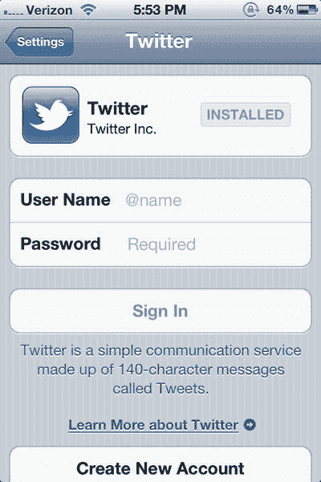

**图 14-1.** *在设备上配置你的 Twitter 账号*

通过在设备上配置一个 Twitter 账号，你将能够全面测试所创建的所有功能。

接下来，你将开始在 Xcode 中创建一个名为“Tweeter”的新项目。选择“SingleView Application”模板，然后点击创建项目。如果你运行的是最新版本的 Xcode，请确保勾选标记为“自动引用计数”的复选框，如图 14-2 所示。

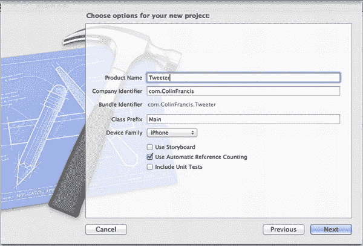

**图 14-2.** *配置项目设置*

对于本章中的所有配方，你需要将 Twitter 框架包含到项目中。

选择你的项目后，导航到“Build Phases”选项卡，在标记为“Link Binary With Libraries”的部分中，点击 + 按钮。找到名为 `Twitter.framework` 的项目，并将其添加进去，如图 14-3 所示。

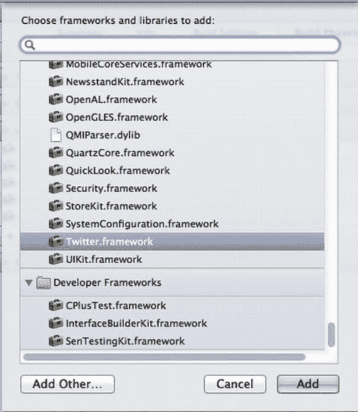

**图 14-3.** *添加 Twitter 框架*

稍后你还需要 Accounts 框架，因此重复此过程，添加名为 `Accounts.framework` 的项目。

将导入语句添加到视图控制器的头文件中，以便编译器允许你使用添加的框架。

```
#import <Twitter/Twitter.h>
#import <Accounts/Accounts.h>
```

接下来，你将设置初始用户界面。向视图中添加一个 `UIButton`，并使用属性名 `simpleTweetButton` 将其连接到控制器。将其连接到一个名为 `-simpleTweetPressed:` 的 `IBAction` 方法，如图 14-4 所示。

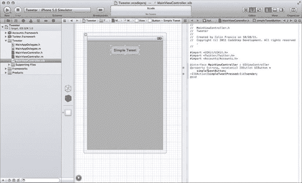

**图 14-4.** *设置简单的用户界面*

让我们创建一个便捷方法，用于检查应用程序在任意时刻是否可以发送推文。如果不行，你将禁用并使 `UIButton` 变暗。

```
-(BOOL)checkCanTweet
{
    if ([TWTweetComposeViewController canSendTweet])
    {
        self.simpleTweetButton.enabled = YES;
        self.simpleTweetButton.alpha = 1.0;
        return YES;
    }
    else
    {
        self.simpleTweetButton.enabled = NO;
        self.simpleTweetButton.alpha = 0.6;
        return NO;
    }
}
```

这个方法使用了 `TWTweetComposeViewController` 的 `+canSendTweet` 类方法。你很快将使用这个类来创建简单的推文。

为了确保视图控制器能正确重新检查功能，你会在 `-viewDidLoad` 和 `-viewWillAppear:animated:` 两个方法中调用此函数。

```
[self checkCanTweet];
```

你的应用程序所在的设备随时可能配置一个 Twitter 账号，因此你也可以注册通知，以便在账号信息发生变化时接收通知。将以下行添加到你的 `-viewDidLoad` 方法中。

```
[[NSNotificationCenter defaultCenter] addObserver:self selector:@selector(checkCanTweet)
        name:ACAccountStoreDidChangeNotification object:nil];
```

现在，你将实现 `-simpleTweetPressed:` 方法来配置并发送一条简单的推文。

```
-(void)simpleTweetPressed:(id)sender
{
    if ([self checkCanTweet])
    {
        TWTweetComposeViewController *tweet = [[TWTweetComposeViewController alloc] init];
        [tweet setInitialText:@"Posting a simple Tweet from my app!"];
        [tweet setCompletionHandler:^(TWTweetComposeViewControllerResult result)
        {
            if (result == TWTweetComposeViewControllerResultDone)
            {
                NSLog(@"Tweet Successfully Sent");
            }
            else
            {
                NSLog(@"Tweet Cancelled");
            }
            [self dismissModalViewControllerAnimated:YES];
        }];
        [self presentModalViewController:tweet animated:YES];
    }
}
```

如上所示，你可以为推文创建初始文本，并设置一个完成处理程序，在 `TWTweetComposeViewController` 被取消或完成后调用。

除了初始文本之外，你还可以使用 `-addImage:` 和 `addURL:` 方法向推文附加图片和链接。图 14-5 展示了你的当前配置，并附加了一个链接。

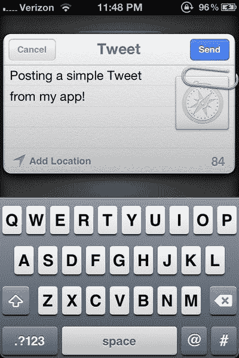

**图 14-5.** *你的视图展示了一个 `TWTweetComposeViewController`*

用于向推文添加内容的三个方法 `-setInitialText:`、`-addImage:` 和 `-addURL:` 都返回 BOOL 值，指示内容是否成功添加。如果内容不适合推文，或者控制器已经展示，这些值将为 `NO`。

为了确保用户始终对从此控制器发送的推文内容拥有最终决定权，开发者不允许在控制器展示后设置或添加任何内容。

如果你希望在展示前从控制器中移除内容，可以使用 `-removeAllImages` 和 `-removeAllURLs` 方法。

### 配方 14–2：创建简单的 TWRequest

除了 `TWTweetComposeViewController` 之外，Twitter 框架中唯一的另一个类是 `TWRequest` 类。这个类非常通用，并利用 Twitter 的特定 API 来发送和请求信息。通过使用它，你可以模仿 `TWTweetComposeViewController` 的基本功能，并执行几乎所有你想在应用程序中集成的、与 Twitter 服务相关的命令。

重要的是要记住，Twitter API 的变化与 iOS API 不同，因此本节中任何特定于 Twitter 的代码可能需要更新到最新版本。


#### 通过 `TWRequest` 发送推文

你需要在视图中添加另一个 `UIButton` 以实现更复杂的功能，该按钮标签为“发布推文”，属性名为 `postTweetButton`，操作处理器为 `-postTweetPressed:`。将其放置在第一个按钮下方，如图 14-6 所示。

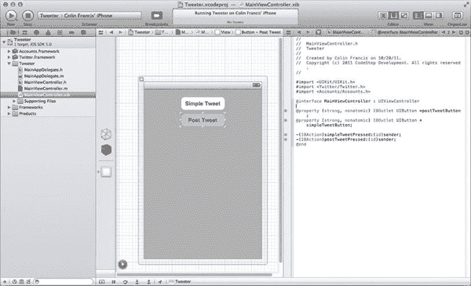

**图 14-6.** *在界面中添加另一个按钮*

接下来你将实现 `-postTweetPressed:` 方法。该方法将包含以下步骤：

1.  访问设备的帐户存储，该存储可访问设备上注册的所有帐户。
2.  创建 `ACAccountType` 实例，用于在请求中指定所有已存储的 Twitter 帐户。
3.  请求访问指定类型的所有帐户。`-requestAccessToAccountsWithType:withCompletionHandler:` 方法将提示用户是否允许应用程序访问这些帐户。如果应用程序之前已获得权限，则不会再次提示用户。
4.  从帐户存储中获取一个 `ACAccount` 对象数组，该数组引用设备上所有已注册的 Twitter 帐户。
5.  访问一个用于发布推文的特定帐户。
6.  初始化 `TWRequest` 实例。该类会接收关于所构建的特定请求的指令。
7.  将你选择的 `ACAccount` 设置给 `TWRequest`。
8.  执行请求，并利用完成处理器分析结果。

```
-(IBAction)postTweetPressed:(id)sender
{
    ACAccountStore *accountStore = [[ACAccountStore alloc] init];

    ACAccountType *accountType = [accountStore
        accountTypeWithAccountTypeIdentifier:ACAccountTypeIdentifierTwitter];

    [accountStore requestAccessToAccountsWithType:accountType
        withCompletionHandler:^(BOOL granted, NSError *error)
    {
        if (granted)
        {
            NSArray *accountsArray = [accountStore accountsWithAccountType:accountType];

            if ([accountsArray count] >0)
            {
                ACAccount *twitterAccount = [accountsArray objectAtIndex:0];

                TWRequest *postRequest = [[TWRequest alloc] initWithURL:[NSURLURL
                    WithString:@"http://api.twitter.com/1/statuses/update.json"]
                    parameters:[NSDictionary
                    dictionaryWithObject:@"Posted with a TWRequest!" forKey:@"status"]
                    requestMethod:TWRequestMethodPOST];

                [postRequest setAccount:twitterAccount];

                [postRequest performRequestWithHandler:^(NSData *responseData,
                    NSHTTPURLResponse *urlResponse, NSError *error)
                {
                    if ([urlResponse statusCode] == 200)
                    {
                        NSLog(@"Tweet Posted");
                    }
                    else
                    {
                        NSLog(@"Error Posting Tweet");
                    }
                }];
            }
        }
    }];
}
```

该方法的关键部分当然是 `TWRequest` 的初始化。这里你精心使用了 Twitter API，通过三个属性配置推文发布：

* **URL**：用于构建 URL 的字符串 `http://api.twitter.com/1/statuses/update.json`，专门用于告知 Twitter 服务你正在发起状态更新。
* **参数**：你指定了一个 `NSDictionary` 实例，其中包含一个键“status”，并为其分配一个包含推文实际文本的 `NSString`。
* **请求方法**：此参数指定你正在发出的请求类型。由于你在发布推文，因此使用 `TWRequestMethodPOST` 值。

使用此方法发布推文的一个有趣之处在于，用户在推文发送前实际上无法预览。事实上，在这种情况下，用户收到的唯一提示是请求访问 Twitter 帐户。在发送此类推文时，务必牢记用户的最佳利益，以免发布未经用户希望的更新。

**注意：** 如上述方法所示，你可以通过检查 `urlResponse` 的 `statusCode` 来评估 `TWRequest` 的结果。如果此值为 200，则表示请求已成功完成。否则，存在某种错误。请参阅 Twitter API `https://dev.twitter.com/docs/error-codes-responses` 了解各种错误代码的具体细节。

在测试此应用时，你将能够在获得权限后，无需使用 `TWTweetComposeViewController`，即可从设备已注册的帐户发送推文。


### 方案 14-3：检索推文

既然你已经掌握了两种在 Twitter 上发布更新的方法，接下来可以运用上一个方案中围绕 `TWRequest` 类所学的概念，构建一个能够获取并显示推文的应用程序。

你将构建一个用于显示多组不同推文的应用程序，因此需要使用 `UITabBarController` 来分隔不同的内容组。新建一个项目，首先选择标签栏应用程序模板，如图 14-7 所示。

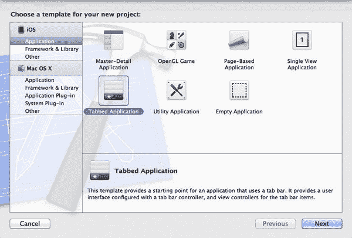

**图 14-7.** *创建标签栏应用程序*

在下一个界面中，输入你的项目名称。由于你将显示来自不同来源的推文组，请将项目命名为 `"PulseOfTheWorld"`，类前缀设为 `"Main"`。确保应用程序配置为 iPhone 设备系列，并启用自动引用计数，这样你的项目设置就与上一个方案相同。点击继续创建项目。

模板应用程序将与模拟界面相似。幸运的是，这个布局恰好也是你应用程序的起始布局，如图 14-8 所示，因此你可以直接显示从 Twitter 获取的原始数据。

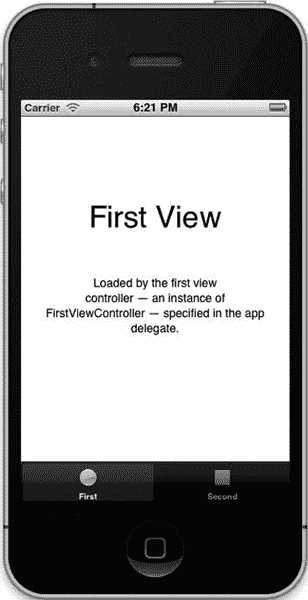

**图 14-8.** *你的通用标签栏应用程序*

**注意：** 由于你创建的模板应用程序包含两个格式相似的视图控制器，以下配置将同时对这两个控制器进行修改。请仔细按照步骤，对每个视图控制器进行所有必要的更改。

首先，你需要将用户界面配置为可通过编程方式进行编辑。因此，先进入两个预置视图控制器的 XIB 文件，将 `UILabel` 和 `UITextView` 连接到头文件中的属性。在第一个视图控制器中使用属性名 `publicLabel` 和 `publicTextView`，在第二个视图控制器中使用 `homeLabel` 和 `homeTextView`。

你可以修改视图元素的初始文本，使其更符合应用程序的需求。在第一个视图控制器的 `-viewDidLoad` 方法中添加以下代码：

```
self.publicLabel.text = @"公共时间线";
self.publicTextView.text = @"尚未获取公共时间线数据。";
```

在第二个视图控制器中添加等效代码：

```
self.homeLabel.text = @"主页时间线";
self.homeTextView.text = @"尚未获取主页时间线数据。";
```

同时，为每个视图控制器添加一个 `UIButton`，用于触发数据检索操作。根据功能分别将按钮命名为 `"获取公共时间线"` 或 `"获取主页时间线"`，并将其连接到 `IBAction` 方法（处理程序分别为 `-publicPressed:` 和 `-homePressed:`）以及属性 `publicButton` 和 `homeButton`。

在继续之前，请确保在项目中引入了 Twitter 和 Accounts 框架。按照之前方案中讨论的步骤添加这两个框架，并确保在两个视图控制器中添加了正确的导入语句：

```
#import <Twitter/Twitter.h>
#import <Accounts/Accounts.h>
```

回到 XIB 文件，你需要对 `UITextView` 进行一些微调，以确保其与应用程序正常工作。确保每个 `UITextView` 的“用户交互已启用”复选框已勾选（如图 14-9 所示），以便视图能够滚动。

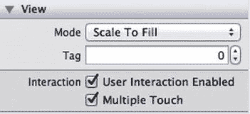

**图 14-9.** *为你的 `UITextView` 启用用户交互*

接下来，将每个 `UITextView` 的文本对齐方式设置为左对齐，使原始数据更易读。我还增加了这些视图的尺寸，以便一次性显示更多信息。

此时，你的视图应类似于图 14-10，每个控制器显示不同但适当的文本。

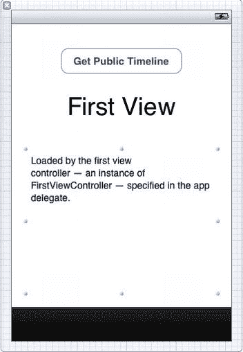

**图 14-10.** *配置好的用户界面*

以下是第一个视图控制器的头文件代码，你的程序应与此类似。第二个视图控制器的头文件除了属性名和动作名不同外，其余应完全一致。

```
#import <UIKit/UIKit.h>
#import <Twitter/Twitter.h>
#import <Accounts/Accounts.h>

@interface MainFirstViewController : UIViewController
@property (strong, nonatomic) IBOutlet UILabel *publicLabel;
@property (strong, nonatomic) IBOutlet UITextView *publicTextView;
@property (strong, nonatomic) IBOutlet UIButton *publicButton;
-(IBAction)publicPressed:(id)sender;
@end
```

按照之前方案的思路，你将创建一个方法来检查 Twitter 是否可用，并相应调整视图。这个方法只需要在第二个视图控制器中使用，具体如下：

```
-(BOOL)checkCanTweet
{
    if ([TWTweetComposeViewController canSendTweet])
    {
        self.homeButton.enabled = YES;
        self.homeButton.alpha = 1.0;
        return YES;
    }
    else
    {
        self.homeButton.enabled = NO;
        self.homeButton.alpha = 0.6;
        return NO;
    }
}
```

和之前一样，确保在 `-viewDidLoad` 和 `-viewWillAppear:animated:` 方法中都调用了 `-checkCanTweet` 方法。

现在，你可以着手实现请求推文的方法了。你可能已经猜到，首先需要在第一个视图控制器中从公共时间线获取数据，在第二个视图控制器中从主页时间线获取数据。此处的主页时间线指的是当前用户及其关注用户的帖子，而公共时间线仅显示公开推文。由于主页时间线是用户特定的，你需要再次使用 Accounts 框架来访问设备上注册的 Twitter 账户。

首先，在第一个视图控制器中实现 `-publicPressed:` 方法，用以下代码检索公共推文：

```
- (IBAction)publicPressed:(id)sender
{
    TWRequest *postRequest = [[TWRequest alloc] initWithURL:[NSURL
    URLWithString:@"http://api.twitter.com/1/statuses/public_timeline.json"]
    parameters:nilrequestMethod:TWRequestMethodGET];

    [postRequest performRequestWithHandler:^(NSData *responseData, NSHTTPURLResponse
    *urlResponse, NSError * error)
    {
        NSString *output;
        if ([urlResponse statusCode] == 200)
        {
            NSError *jsonParsingError;
            NSArray *publicTimeline = [NSJSONSerialization JSONObjectWithData:responseData
            options:0error:&jsonParsingError];

            output = [NSString stringWithFormat:@"公共时间线：\n%@",
            publicTimeline];
        }
        else
        {
            output = [NSString stringWithFormat:@"HTTP 响应状态：%i\n",
            [urlResponse statusCode]];
        }
        [self.publicTextView performSelectorOnMainThread:@selector(setText:)
        withObject:output waitUntilDone:NO];
    }];
}
```

此方法可分解为以下几个要点：

**1.** 由于公共时间线是公开可访问的，你不需要访问特定的 Twitter 账户来获取数据，因此可以直接配置你的 `TWRequest`。

**2.** 与上一个方案类似，创建 `TWRequest` 时，你使用了 Twitter 特定的 URL 来访问所需服务。此处使用的 URL `http://api.twitter.com/1/statuses/public_timeline.json` 旨在从公共时间线获取数据，并以 JSON 格式返回（由 `"json"` 后缀指定）。


**3.** 此外，在配置 `TWRequest` 时，必须指定“请求方法”值为 `TWRequestMethodGET`，而非之前的 `TWRequestMethodPOST`。最直观的理解是：使用“GET”值来获取信息，使用“POST”值来发送信息。

**4.** 确认收到成功响应后，需要将接收到的数据转换为 iOS 可用的格式。由于已指定数据使用 JSON 格式，因此可以调用 `NSJSONSerialization` 类方法 `+JSONObjectWithData:options:error:`。该方法会根据数据格式将接收到的 JSON 数据转换为 `NSDictionary` 或 `NSArray`。在本例中，您会收到一个 `NSArray`，随后将其内容放入 `NSStringoutput` 中。

**5.** 所有用户界面的更改都必须在主线程中执行，因此需要使用 `-performSelectorMainThread:withObject:waitUntilDone:` 方法，用给定的输出来更新用户界面。

同样重要的是，您可以通过指定参数进一步自定义 `TWRequest`，这些参数决定了您能获得哪些类型的结果。每种请求都有其专属的可选参数集，因此请参考 Twitter API 以获取关于特定选项的更多信息，这些选项将在 `NSDictionary` 中设置。

现在，在第二个视图控制器中，您可以实现类似的解决方案来获取用户的“主页时间轴”数据。

```
- (IBAction)homePressed:(id)sender
{
if ([self checkCanTweet])
    {
ACAccountStore *accountStore = [[ACAccountStore alloc] init];
ACAccountType *accountType = [accountStore
accountTypeWithAccountTypeIdentifier:ACAccountTypeIdentifierTwitter];

        [accountStore requestAccessToAccountsWithType:accountType
withCompletionHandler:^(BOOL granted, NSError *error)
        {
if (granted)
            {
NSArray *accountsArray = [accountStore accountsWithAccountType:accountType];
if ([accountsArray count] >0)
                {
ACAccount *twitterAccount = [accountsArray objectAtIndex:0];

TWRequest *postRequest = [[TWRequest alloc] initWithURL:[NSURL
URLWithString:@"http://api.twitter.com/1/statuses/home_timeline.json"] parameters:nil
requestMethod:TWRequestMethodGET];

                    [postRequest setAccount:twitterAccount];

                    [postRequest performRequestWithHandler:^(NSData *responseData,
NSHTTPURLResponse *urlResponse, NSError *error)
                     {
                         NSString *output;

if ([urlResponse statusCode] == 200)
                         {
                             NSError *jsonParsingError;
NSArray *homeTimeline = [NSJSONSerialization JSONObjectWithData:responseData options:0
error:&jsonParsingError];

                             output = [NSString stringWithFormat:@"Home timeline:\n%@",
homeTimeline];
                         }
else
                         {
                             output = [NSString stringWithFormat:@"HTTP response status:
%i\n", [urlResponse statusCode]];
                         }
                         [self.homeTextView
performSelectorOnMainThread:@selector(setText:) withObject:output waitUntilDone:NO];
                     }];
                }
            }
else
            {
self.homeTextView.text = @"Error, Twitter account access not granted.";
            }
        }];
    }
}
```

该方法遵循与上一个方法相同的路径，但有以下区别：

**6.** 您快速调用了 `-checkCanTweet` 方法，以确保您的设备已正确配置了 Twitter 账户。

**7.** 由于要访问特定用户的时间轴，您加入了代码来访问设备上已注册的 Twitter 账户，选择第一个账户，并将其包含在 `TWRequest` 中。

**8.** 这次使用了略有不同的 URL：`http://api.twitter.com/1/statuses/home_timeline.json`，用于请求“主页时间轴”，而不是“公共时间轴”。

此时，如果在设备上运行应用程序，您应该能够获取大约 20 条推文数据到手机上，并查看其原始数据。图 14-11 显示了撰写本文时“公共时间轴”数据的开头部分。

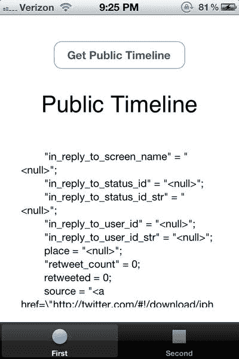

**图 14-11.** *示例公共时间轴数据*

当您滚动浏览这大量数据时，可以大致了解所接收推文数据的格式。您会得到一个包含一组推文的 `NSArray`，每条推文都存储为一个 `NSDictionary`。图 14-11 中显示的值代表键（左侧）及其相关的对象（右侧）。这些对象格式为 `NSString`、`NSNumber`、`NSNull` 实例，甚至是更复杂的 `NSArray` 或 `NSDictionary` 实例。例如，要访问推文发布者的名称，您必须访问数组中的嵌套字典。首先在数组中找到该推文，然后通过“user”键访问包含用户信息的 `NSDictionary`，最后通过“name”键获取姓名。利用这些信息，您可以开始构建一个更完整的应用程序来显示推文。

首先，您将创建一个简单的数据模型，将推文数据封装到自定义对象中。使用“Objective-C class”模板创建一个新文件。将类命名为“Post”，并确保子类字段设置为“NSObject”，如图 14-12 所示。

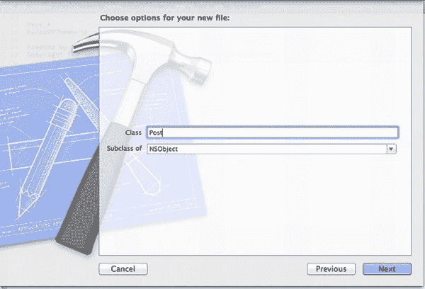

**图 14-12.** *配置名为“Post”的 `NSObject` 子类*

接下来，您可以为 Post 对象定义属性。您将为推文中最常用的一些属性指定属性，例如文本、用户名和转发计数。您还将设置属性来保存实际的 `NSDictionaries` 数据，以便稍后简化对任何附加值的访问。

为了创建 Post 对象，您将使用一个指定的初始化方法，该方法接受您之前看到的 `NSDictionary` 对象作为参数。定义这些属性和方法后，您的 `Post.h` 文件内容如下：

```
#import <Foundation/Foundation.h>

@interface Post : NSObject

@property (nonatomic, strong) NSDictionary *postData;
@property (nonatomic, strong) NSDictionary *user;
@property (nonatomic, strong) NSString *text;
@property (nonatomic, strong) NSString *screenName;
@property (nonatomic, strong) NSString *name;
@property (nonatomic, strong) NSString *userDescription;
@property (nonatomic, strong) id retweetCount; //可能是 NSString (100+) 或 NSNumber
@property (nonatomic, strong) UIImage *userImage;
-(Post *)initWithDictionary:(NSDictionary *)dictionary;

@end
```

如注释所示，您将属性 `retweetCount` 设置为“id”类型，因为它可能有两种不同类型的值。如果您之前浏览过原始数据，可能会注意到有些推文的“retweet_count”值是数字（如 0、10 等），而另一些则是字符串“100+”。通过将属性设为通用类型，您可以稍后检查每条推文的具体值。

您可以在 `Post.m` 文件中用一行代码合成所有这些属性。

```
@synthesize name, text, user, postData, screenName, retweetCount, userDescription,
userImage;
```

您的初始化方法设置起来相当简单，只需使用各种键从字典中查询即可。


#### 代码示例：自定义初始化方法

```objc
- (Post *)initWithDictionary:(NSDictionary *)dictionary
{
    self = [super init];
    if (self)
    {
        self.postData = dictionary;
        self.user = [dictionary objectForKey:@"user"];
        self.text = [dictionary objectForKey:@"text"];
        self.retweetCount = [dictionary objectForKey:@"retweet_count"];
        self.name = [self.user objectForKey:@"name"];
        self.screenName = [self.user objectForKey:@"screen_name"];
        self.userDescription = [self.user objectForKey:@"description"];
        NSString *imageURLString = [self.user objectForKey:@"profile_image_url"];
        NSURL *imageURL = [NSURL URLWithString:imageURLString];
        NSData *imageData = [NSData dataWithContentsOfURL:imageURL];
        self.userImage = [UIImage imageWithData:imageData];
    }
    return self;
}
```

在这个方法中，你可能会注意到没有选择为每个帖子分配一个备用线程来检索图像数据。这可能会阻塞主线程一两秒钟，但由于在检索到图像内容之前无需显示帖子，你可以暂时接受这个延迟。

现在文件已配置完成，你需要在两个视图控制器中使用它。在每个头文件中添加导入语句：

```objc
#import "Post.h"
```

接下来，在每个视图控制器中，添加一个`NSArray`属性来存储检索到的帖子：

```objc
@property (strong, nonatomic) NSMutableArray *retrievedTweets;
```

合成该属性后，创建一个自定义的 getter 方法以确保数组被正确初始化：

```objc
- (NSMutableArray *)retrievedTweets
{
    if (retrievedTweets == nil)
    {
        retrievedTweets = [NSMutableArray arrayWithCapacity:20];
    }
    return retrievedTweets;
}
```

现在，你需要重新调整用户界面。不再简单地使用`UITextView`输出，而是将信息组织到`UITableView`中。从每个视图控制器的 XIB 文件中移除之前创建的`UIButton`、`UILabel`和`UITextView`，并替换为`UITableView`，如图 Figure 14-13 所示。将其连接到每个视图控制器中的`tableViewPosts`属性。同时，我还移除了之前使用的属性（尽管这是可选的），这需要从实现文件中删除几行有问题的代码。

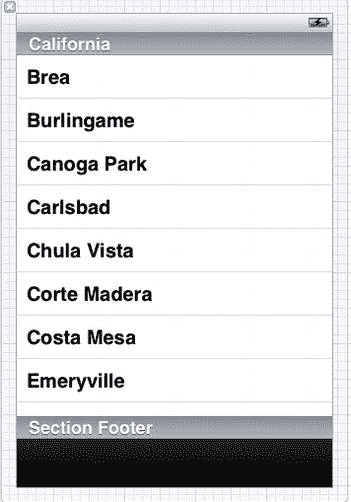

**Figure 14-13.** *向用户界面添加`UITableView`*

你需要返回并修改`-viewDidLoad`方法，以设置表视图的代理和数据源。由于已经构建了数据检索方法，你也可以将其包含在内。

```objc
- (void)viewDidLoad
{
    [super viewDidLoad];
    [self publicPressed:nil];
    self.tableViewPosts.delegate = self;
    self.tableViewPosts.dataSource = self;
}
```

第二个视图控制器的`-viewDidLoad`方法看起来类似，但会调用`-homePressed:`。

同时，确保视图控制器遵循`UITableViewDelegate`和`UITableViewDataSource`协议。

现在，第一个视图控制器中更新后的`-publicPressed:`方法如下所示：

```objc
- (IBAction)publicPressed:(id)sender
{
    [self.retrievedTweets removeAllObjects];

    TWRequest *postRequest = [[TWRequest alloc] initWithURL:[NSURL
        URLWithString:@"http://api.twitter.com/1/statuses/public_timeline.json"] parameters:nil
        requestMethod:TWRequestMethodGET];

    [postRequest performRequestWithHandler:^(NSData *responseData, NSHTTPURLResponse
        *urlResponse, NSError *error)
    {
        if ([urlResponse statusCode] == 200)
        {
            NSError *jsonParsingError;
            NSArray *publicTimeline = [NSJSONSerialization JSONObjectWithData:responseData options:0
                error:&jsonParsingError];
            for (NSDictionary *dict in publicTimeline)
            {
                Post *current = [[Post alloc] initWithDictionary:dict];
                [self.retrievedTweets addObject:current];
            }
        }
        else
        {
            NSLog(@"%@", [NSString stringWithFormat:@"HTTP response status: %i\n",
                [urlResponse statusCode]]);
        }
        [self.tableViewPosts reloadData];
    }];
}
```

类似地，`-homePressed:`方法将如下所示：

```objc
- (IBAction)homePressed:(id)sender
{
    if ([self checkCanTweet])
    {
        ACAccountStore *accountStore = [[ACAccountStore alloc] init];
        ACAccountType *accountType = [accountStore
            accountTypeWithAccountTypeIdentifier:ACAccountTypeIdentifierTwitter];

        [accountStore requestAccessToAccountsWithType:accountType
            withCompletionHandler:^(BOOL granted, NSError *error)
        {
            if (granted)
            {
                NSArray *accountsArray = [accountStore accountsWithAccountType:accountType];
                if ([accountsArray count] > 0)
                {
                    [self.retrievedTweets removeAllObjects];

                    ACAccount *twitterAccount = [accountsArray objectAtIndex:0];

                    TWRequest *postRequest = [[TWRequest alloc] initWithURL:[NSURL
                        URLWithString:@"http://api.twitter.com/1/statuses/home_timeline.json"] parameters:nil
                        requestMethod:TWRequestMethodGET];
                    [postRequest setAccount:twitterAccount];

                    [postRequest performRequestWithHandler:^(NSData *responseData,
                        NSHTTPURLResponse *urlResponse, NSError *error)
                    {
                        if ([urlResponse statusCode] == 200)
                        {
                            NSError *jsonParsingError;
                            NSArray *homeTimeline = [NSJSONSerialization JSONObjectWithData:responseData options:0 error:&jsonParsingError];
                            for (NSDictionary *dict in homeTimeline)
                            {
                                Post *current = [[Post alloc] initWithDictionary:dict];
                                [self.retrievedTweets addObject:current];
                            }
                        }
                        else
                        {
                            NSLog(@"%@", [NSString stringWithFormat:@"HTTP response status: %i\n", [urlResponse statusCode]]);
                        }
                        [self.tableViewPosts reloadData];
                    }];
                }
            }
            else
            {
                NSLog(@"Error, Twitter account access not granted.");
            }
        }];
    }
}
```

在上述两个方法中，你需要调用`-reloadData`方法，以确保所有数据完全检索后表格正确更新。否则，在数据尚未获取之前，表格将显示为空。

现在，你只需要实现代理和数据源方法来配置`UITableView`。

```objc
- (NSInteger)tableView:(UITableView *)tableView numberOfRowsInSection:(NSInteger)section
{
    return [self.retrievedTweets count];
}

- (UITableViewCell *)tableView:(UITableView *)tableView
         cellForRowAtIndexPath:(NSIndexPath *)indexPath
{
    static NSString *CellIdentifier = @"Cell";

    UITableViewCell *cell = [tableView dequeueReusableCellWithIdentifier:CellIdentifier];
    if (cell == nil)
    {
        cell = [[UITableViewCell alloc] initWithStyle:UITableViewCellStyleSubtitle
            reuseIdentifier:CellIdentifier];
        cell.accessoryType = UITableViewCellAccessoryDisclosureIndicator;
    }
```


`Post *current = [self.retrievedTweets objectAtIndex:indexPath.row];`  
`    cell.textLabel.text = current.text;`  
`    cell.detailTextLabel.text = current.screenName;`  
`    cell.imageView.image = current.userImage;`  

`return cell;`  
`}`  

这两个方法可以直接复制到两个视图控制器中，无需任何修改。  

现在运行你的应用程序，你将能够在两个不同的表格中查看 Twitter 动态，其中包含文本、用户名和用户图片！每个表格的加载时间取决于你设备的连接速度，可能需要几秒钟。  

如果在测试应用程序时，你希望表格能够更新，可以从 `-viewDidLoad` 方法中移除 `-publicPressed:` 或 `-homePressed:` 调用，并将它们移动到 `-viewWillAppear:animated:` 方法中。  

## 方案 14–4：过滤推文  

除了已经实现的获取推文功能外，你还可以根据多种条件对接收到的帖子进行特定过滤。  

基于之前的方案，在项目中添加一个新的视图控制器，命名为“MainSearchViewController”。  

你将构建这个控制器的用户界面，使其与第一个视图控制器类似，不同之处在于会添加一个 `UISearchBar` 用于指定搜索参数，如图 Figure 14-14 所示。请确保此搜索栏的“纠正”功能已关闭，以免自动更正打扰用户。  

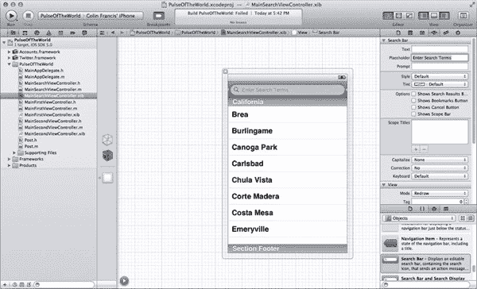  

**图 14-14.** *在 `MainSearchViewController.xib` 文件中添加 `UISearchBar`*  

将 `UISearchBar` 的出口名称设置为 `searchBarPosts`。  

确保正确导入框架和 `Post.h` 文件到新的视图控制器，并设置需要遵循的协议后，你可以从第一个视图控制器复制 `UITableView` 的委托/数据源方法。同时，务必设置 `NSMutableArray` 属性 `retrievedTweets`，并复制其自定义的 getter 方法。  

为了配置 `UISearchBar`，你还需要让视图控制器遵循 `UISearchBarDelegate` 协议。  

按如下方式设置 `-viewDidLoad` 方法：  

```
- (void)viewDidLoad
{
    [super viewDidLoad];

self.tableViewPosts.delegate = self;
self.tableViewPosts.dataSource = self;
self.searchBarPosts.delegate = self;
}
```

在应用程序委托的实现文件中，导入新控制器的头文件。  

```
#import "MainSearchViewController.h"
```

现在，你需要更新 `-application:didFinishLaunchingWithOptions:` 方法，以包含最新的视图控制器。  

```
- (BOOL)application:(UIApplication *)application
didFinishLaunchingWithOptions:(NSDictionary *)launchOptions
{
self.window = [[UIWindow alloc] initWithFrame:[[UIScreen mainScreen] bounds]];
// 应用启动后的自定义覆盖点
UIViewController *viewController1 = [[MainFirstViewController alloc]
initWithNibName:@"MainFirstViewController" bundle:nil];
UIViewController *viewController2 = [[MainSecondViewController alloc]
initWithNibName:@"MainSecondViewController" bundle:nil];
UIViewController *viewController3 = [[MainSearchViewController alloc]
initWithNibName:@"MainSearchViewController" bundle:nil];
self.tabBarController = [[UITabBarController alloc] init];
self.tabBarController.viewControllers = [NSArray arrayWithObjects:viewController1,
viewController2, viewController3, nil];
self.window.rootViewController = self.tabBarController;
    [self.window makeKeyAndVisible];
return YES;
}
```

你还可以在 `MainSearchViewController.m` 文件中添加一个稍作修改的指定初始化方法，以正确设置新的视图控制器：  

```
- (id)initWithNibName:(NSString *)nibNameOrNil bundle:(NSBundle *)nibBundleOrNil
{
self = [super initWithNibName:nibNameOrNil bundle:nibBundleOrNil];
if (self) {
self.title = NSLocalizedString(@"过滤后的帖子", @"First");
self.tabBarItem.image = [UIImage imageNamed:@"first"];
    }
return self;
}
```

为了完全配置 `UISearchBar`，你可以创建委托方法 `-shouldChangeTextInRange:replacementText:`，如下所示，假设该控制器中的数据检索方法名为 `-searchPressed:`。  

```
-(BOOL)searchBar:(UISearchBar *)searchBar shouldChangeTextInRange:(NSRange)range
replacementText:(NSString *)text
{
if ([text isEqualToString:@"\n"])
    {
        [searchBar resignFirstResponder];
        [self searchPressed:searchBar.text];
return NO;
    }
return YES;
}
```


现在，你必须考虑向 Twitter 发起请求的实际格式。根据 Twitter API，获取特定搜索 URL 的最佳方式是在 Twitter 网站上输入搜索词，然后修改重定向后得到的 URL。举个简单的例子，搜索单词“test”会将你重定向到 URL `http://twitter.com/#!/search/test`。然后，你将除了后缀搜索词以外的部分修改为 `http://search.twitter.com/search.json?q=test`。为了处理简单的搜索查询，你必须正确处理任何空格、井号（`#`）、`@` 符号和引号。在你的代码中，你将需要操作搜索词来实现此行为。

首先，你可以在一行代码中完成大部分字符替换。

```objc
searchText = [searchText stringByAddingPercentEscapesUsingEncoding:
NSUTF8StringEncoding];
```

此方法会正确转换除 `@` 符号之外的所有上述符号，你可以像这样手动替换 `@` 符号：

```objc
NSMutableString *mutableText = [[NSMutableString alloc] initWithString:searchText];
[mutableText replaceOccurrencesOfString:@"@" withString:[NSString
stringWithFormat:@"%%40"] options:NSLiteralSearch range:NSMakeRange(0, [mutableText
length])];
```

现在，你可以将此结果附加到通用搜索 URL 的末尾，从而完整组装你的 URL。

```objc
NSString *searchString = @"http://search.twitter.com/search.json?q=";
searchString = [searchString stringByAppendingString:mutableText];
NSURL *searchURL = [NSURL URLWithString:searchString];
```

将此功能添加到类似于 `-publicPressed:` 的方法中后，你最终得到的整体方法编写如下：

```objc
- (IBAction)searchPressed:(NSString *)searchText
{
    [self.retrievedTweets removeAllObjects];

    searchText = [searchText stringByAddingPercentEscapesUsingEncoding:
NSUTF8StringEncoding];

    NSMutableString *mutableText = [[NSMutableString alloc] initWithString:searchText];
    [mutableText replaceOccurrencesOfString:@"@"
withString:[NSStringstringWithFormat:@"%%40"] options:NSLiteralSearch
range:NSMakeRange(0, [mutableText length])];

//    NSLog(@"Searching: %@", mutableText);

    NSString *searchString = @"http://search.twitter.com/search.json?q=";
    searchString = [searchString stringByAppendingString:mutableText];
    NSURL *searchURL = [NSURLURLWithString:searchString];

    TWRequest *postRequest = [[TWRequest alloc] initWithURL:searchURL parameters:nil
requestMethod:TWRequestMethodGET];

    [postRequest performRequestWithHandler:^(NSData *responseData, NSHTTPURLResponse
*urlResponse, NSError *error)
     {
if ([urlResponse statusCode] == 200)
         {
             NSError *jsonParsingError;
NSDictionary *searchTimeline = [NSJSONSerialization JSONObjectWithData:responseData
options:0 error:&jsonParsingError];
NSArray *searchResults = [searchTimeline objectForKey:@"results"];
for (NSDictionary *dict in searchResults)
             {
Post *current = [[Post alloc] initWithSearchDictionary:dict];
                 [self.retrievedTweets addObject:current];
             }
//             NSLog(@"Data Retrieved: HTTP response code %i", [urlResponse
statusCode]);
         }
else
         {
NSLog(@"%@", [NSString stringWithFormat:@"HTTP response status: %i\n", [urlResponse
statusCode]]);
         }
         [self.tableViewPosts reloadData];
         [self.tableViewPosts reloadInputViews];
     }];
}
```

请注意，在这种情况下，将 JSON 格式数据转换为 Objective-C 对象后，初始结果并不在 `NSArray` 中。这一次，它们位于 `NSDictionary` 中，以便提供有关查询的额外信息。然后，你可以通过访问“results”键来获取你常用的 `NSArray`，如下所示。

当你以这种方式从搜索中检索帖子时，数据格式与之前使用的键不同。为了弥补这一点，你将为你 Post 对象创建第二个指定初始化器 `-initWithSearchDictionary:`，如前面方法中所使用的。这种格式在默认设置下不会提供太多关于用户的信息，因此你只能访问你能获取到的信息。确保同时将此方法的处理程序添加到你的 `Post.h` 文件中。

```objc
-(Post *)initWithSearchDictionary:(NSDictionary *)dictionary
{
self = [super init];
if (self)
    {
self.postData = dictionary;
self.screenName = [dictionary objectForKey:@"from_user"];
self.text = [dictionary objectForKey:@"text"];
NSString *imageURLString = [dictionary objectForKey:@"profile_image_url"];
NSURL *imageURL = [NSURL URLWithString:imageURLString];
NSData *imageData = [NSData dataWithContentsOfURL:imageURL];
self.userImage = [UIImage imageWithData:imageData];
    }
return self;
}
```

至此，你的应用程序现在应该能够搜索帖子中包含的特定文本、话题标签和用户了！你已经包含了涵盖最常用搜索词的基本功能，但 Twitter API 允许进行更复杂的查询。有关各种搜索格式的完整列表，请参阅 `https://dev.twitter.com/docs/using-search` 上的 Twitter API。

现在运行你的应用程序，你应该能够搜索不同的话题标签、短语和用户名。尝试搜索 `#miami` 并查看得到的结果！

**注意：** 如果在任何时候你不确定从 Twitter 检索到的 JSON 数据的格式，你可以直接使用发起请求的 URL 并在 Web 浏览器中打开它。你将看到与通过代码获取的完全相同的数据的文本视图。由于缺少空格格式，它可能有点难以阅读，但你可以从中找出构建应用程序所需的内容层次。

### 总结

在本章中，我们介绍了大量使用 Twitter 框架的示例代码，内容涵盖从发送推文的预定义用户界面，到自定义格式请求以直接从 Twitter 获取特定筛选数据。我们的基本实现可以轻松作为更复杂应用程序的基础。与 Twitter 服务的集成不仅限于发布和显示推文，还可以轻松增强几乎任何应用程序的功能和威力。考虑到 Twitter 本身的流行度和持续增长，可以肯定 iOS 的集成只会变得更加深入，让开发者能够更简单地访问这个现代世界中最强大的网络服务之一。

## 第 15 章

## 图像秘诀

开发者常常面临一个普遍问题：要显示的信息太多，而可用空间却不够。为此，你需要借助图像。图片和图形让你能够传达远超纯文本的各种信息，结合了情感、信息和风格。在 iOS 中，你有多种不同的方法来创建、使用、操作和显示图像。iOS 5.0 甚至新增了为图像应用滤镜的能力，允许用非常少的代码对显示效果进行大幅修改。通过理解 iOS 中的这些固有功能和技术，你能够更轻松地实现更强大、信息更丰富的应用程序。


### 菜谱 15-1：绘制简单形状

从幼年起，每个人都会被教导最基础的图像知识，涉及形状、颜色和图画。在 iOS 中，你也可以从在视图中绘制简单形状的基础开始。这些初始实现中涉及的许多概念最终会以更复杂的基于图像的功能中再次出现。

首先，创建一个名为 "ShapesAndSizes" 的新项目。选择 **单视图应用程序** 模板，如 图 15-1 所示，以构建最简单、可直接运行的预配置应用程序，并确保设备系列设置为 "iPhone"。同时勾选 "使用自动引用计数" 选项。图 15-1。

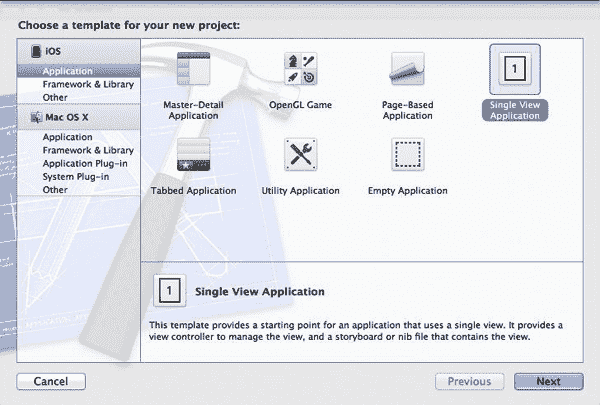

**图 15-1.** *创建一个单视图应用程序*

接下来，在构建用户界面之前，你将在 `UIView` 的子类中实现自定义绘图代码。

首先，通过导航到项目的 Target 设置，将 `QuartzCore.framework` 和 `CoreGraphics.framework` 添加到项目中。在 "构建阶段" 选项卡下的 "与库链接二进制文件" 部分，点击 + 按钮。在类似 图 15-2 的窗口中找到 Quartz Core 和 Core Graphics 框架，并分别添加它们。

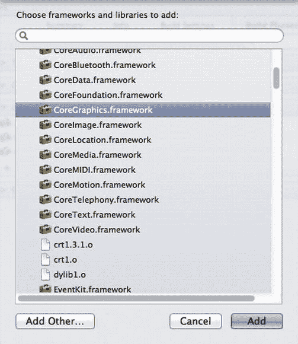

**图 15-2.** *添加 Core Graphics 和 Quartz Core 框架*

接下来，使用 "Objective-C 类" 模板创建一个名为 "MyView" 的新文件。输入名称时，确保 "子类为" 字段设置为 "UIView"。

在这个新类的头文件中，为额外的框架添加两个所需的导入语句。

```
#import <QuartzCore/QuartzCore.h>
#import <CoreGraphics/CoreGraphics.h>
```

现在，为了提供一个显示绘制矩形和正方形的简单视图，你将实现 `-drawRect:` 方法，如下所示：

```
- (void)drawRect:(CGRect)rect
{
    CGContextRef context = UIGraphicsGetCurrentContext();
    
    CGRect drawingRect = CGRectMake(0.0, 20.0f, 100.0f, 180.0f);
    const CGFloat *rectColorComponents = CGColorGetComponents([[UIColor greenColor] CGColor]);
    CGContextSetFillColor(context, rectColorComponents);
    CGContextFillRect(context, drawingRect);
    
    CGRect ellipseRect = CGRectMake(140.0f, 200.0f, 75.0f, 50.0f);
    const CGFloat *ellipseColorComponenets = CGColorGetComponents([[UIColor blueColor] CGColor]);
    CGContextSetFillColor(context, ellipseColorComponenets);
    CGContextFillEllipseInRect(context, ellipseRect);
}
```

此方法使用以下步骤绘制基本形状：

1.  获取当前 "上下文" 的引用，由 `CGContextRef` 表示。
2.  定义一个用于绘制的 `CGRect`。
3.  获取用于填充每个形状所需颜色的颜色分量。
4.  设置填充颜色。
5.  使用 `CGContextFillRect()` 和 `CGContextFillEllipseInRect()` 函数填充指定的形状。

为了在预配置的视图中实际显示，你必须在用户界面中添加此类的一个实例。这可以通过编程方式或通过 Interface Builder（后者将在此演示）完成。

在视图控制器的 XIB 文件中，从实用工具面板拖出一个 `UIView` 到你的视图中，将其放置在每个边缘有 20 点边距的位置，如 图 15-3 所示。

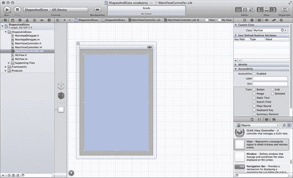

**图 15-3.** *使用 `UIView` 构建你的 XIB 文件*

选中你的 `UIView` 后，导航到右侧面板的第三个选项卡。在 "自定义类" 部分，确保将 "类" 字段从 "UIView" 更改为 "MyView"，以指定要使用的自定义 `UIView` 子类，如 图 15-4 所示。

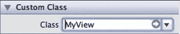

**图 15-4.** *将你的 `UIView` 类配置为 `MyView`*

运行此应用程序时，你将看到绘图命令的输出转换为可视化显示，最终在你的模拟视图中呈现 图 15-5 所示的结果。

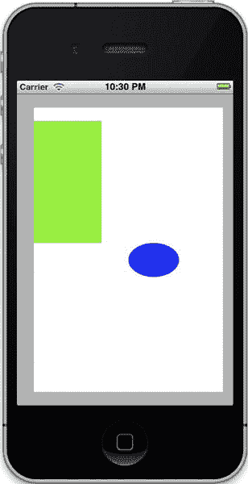

**图 15-5.** *你的简单应用程序绘制了一个矩形和一个椭圆*

值得庆幸的是，你绝不仅限于绘制矩形和椭圆！你可以使用其他一些函数通过创建 "路径" 来绘制自定义对象。这些路径由点之间的移动组成，通过线条连接，以绘制自定义形状。将以下代码添加到你的 `-drawRect:` 方法中，以绘制一个灰色平行四边形。

```
CGContextBeginPatsh(context);
CGContextMoveToPoint(context, 0.0f, 0.0f);
CGContextAddLineToPoint(context, 100.0f, 0.0f);
CGContextAddLineToPoint(context, 140.0f, 100.0f);
CGContextAddLineToPoint(context, 40.0f, 100.0f);
CGContextClosePath(context);
CGContextSetGrayFillColor(context, 0.4f, 0.85f);
CGContextSetGrayStrokeColor(context, 0.0, 0.0);
CGContextFillPath(context);
```

需要注意的是，创建这些路径时，不必添加一条最终线回到起点。通过调用 `CGContextClosePath()` 函数，你的形状将自动在其终点和起点之间闭合。

现在运行你的应用程序，你将看到视图中包含一个由路径创建的新平行四边形，如 图 15-6 所示。

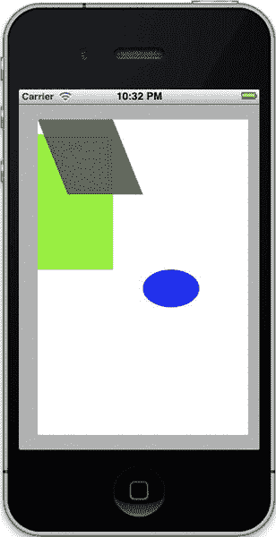

**图 15-6.** *你的应用程序中有一个由自定义路径创建的形状*

### 编程截图

正如你能够将内容放入 `CGContext` 一样，你也可以很容易地将它们取出。通过使用 `UIGraphicsGetImageFromCurrentImageContext()` 函数，你可以从当前绘制的任何内容中提取图像。

在 `MyView` 类中，添加一个 `UIImage` 属性，确保对其进行合成。

```
@property (nonatomic, strong) UIImage *image;
```

现在，在你的 `-drawRect:` 方法末尾，添加以下代码，以便在图像非 `nil` 时绘制它。

```
if (self.image)
    {
        CGRect imageRect = CGRectMake(200.0f, 50.0f, 100.0f, 300.0f);
        [image drawInRect:imageRect];
    }
```

将与前文相同的两个导入语句添加到你的视图控制器中，并添加第三个用于你的 `MyView` 类。

```
#import <QuartzCore/QuartzCore.h>
#import <CoreGraphics/CoreGraphics.h>
#import "MyView.h"
```

你还需要引用你的 `MyView` 对象，因此将已添加到用户界面的对象连接到视图控制器的头文件，并使用属性 `customView`。

```
@property (strong, nonatomic) IBOutlet MyView *customView;
```

在用户界面底部添加一个标记为 "快照" 的 `UIButton`。将其连接到一个名为 `-snapShotPressed:` 的 `IBAction` 方法。

```
- (IBAction)snapshotPressed:(id)sender;
```

此方法将按如下方式实现：

```
-(IBAction)snapshotPressed:(id)sender
{
    //获取当前层的图像
    UIGraphicsBeginImageContext(self.view.bounds.size);
    CGContextRef context = UIGraphicsGetCurrentContext();
    [self.view.layer renderInContext:context];
    UIImage *image = UIGraphicsGetImageFromCurrentImageContext();
    UIGraphicsEndImageContext();

    self.customView.image = image;
    [self.customView setNeedsDisplay];
}
```

此方法利用 `UIView` 类中的 `-setNeedsDisplay` 方法，指示 `UIView` 重新调用其 `-drawRect` 方法，以合并任何最近的更改。

现在，再次测试应用程序后，按下 "快照" 按钮，你应该会在视图右侧看到自己屏幕的较小截图，如 图 15-7 所示。

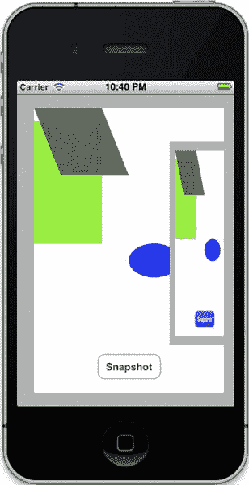

**图 15-7.** *你的应用程序拍摄了屏幕截图，然后将其缩放到视图中*

虽然你在本应用程序中构建的大多数功能都比较基础，但你会看到其中许多功能将以更复杂的形式出现在后续更复杂的图像菜谱中。


### 食谱 15–2：使用 UIImageView

在你的应用中显示图像的最简单方法，就是使用 `UIImageView` 类。你将首先创建一个简单的应用来显示用户选择的图像，然后在其基础上进行扩展，以充分利用 iOS 的图像处理能力。

为了增强应用的功能，你将专门为 iPad 设计它，并使用 `UISplitViewController`。创建一个新项目，选择“主-从应用程序模板”。在下一个界面中，输入项目名称“ImageRecipes”后，确保应用的设备族设置为“iPad”，并勾选“使用自动引用计数”复选框。其他复选框均不应勾选，使你的对话框与图 15–8 一致。

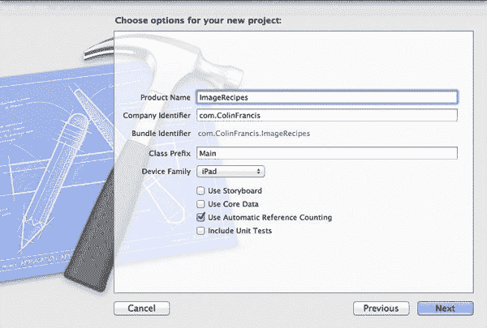

**图 15–8.** *配置项目设置*

创建应用后，你将得到一个配置完善的项目，其中已设置了一个包含主视图控制器和详细视图控制器的 `UISplitViewController`。如果你的模拟器或设备处于竖屏模式，你将只能看到详细视图控制器的视图；但如果旋转到横屏，你将看到两个视图的完美混合。在 Interface Builder 中工作时，你不会同时看到两个视图，但如果你模拟运行应用，通用视图将类似于图 15–9。

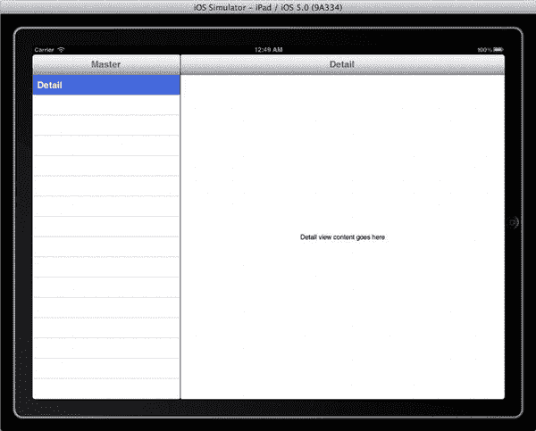

**图 15–9.** *一个空的 `UISplitViewController`*

现在，你将配置详细视图控制器，使其包含更多内容。在你的 XIB 界面中添加一个 `UIImageView` 以及两个 `UIButton`，以便你的模拟应用看起来像图 15–10。

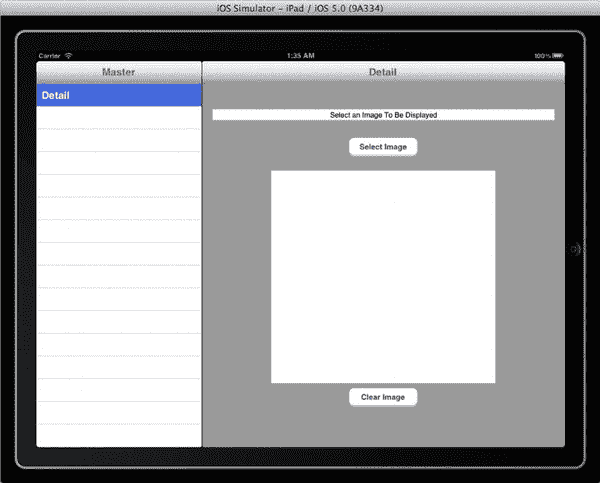

**图 15–10.** *你配置的用户界面的模拟视图*

为了确保你的按钮和图像视图在最终显示中正确居中，首先像往常一样将它们设置在 XIB 视图的中心。然后，为每个元素设置“自动调整大小”选项。打开屏幕右侧的实用工具面板，导航到第五个标签页，你可以在其中设置元素的框架，如图 15–11 所示。

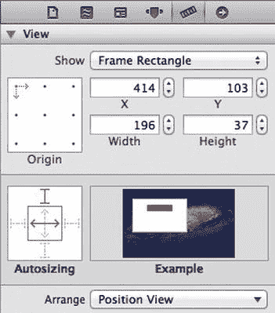

**图 15–11.** *配置自动调整大小以自定义缩放行为*

确保每个元素的“自动调整大小”框（带有各种红色线条和箭头）都严格按照图 15–11 所示进行配置。这将指定每个元素在视图变化时，保持其相对于视图顶部的相对位置，并水平拉伸以保持其大致位置。

使用属性名称 `selectImageButton`、`clearImageButton` 和 `imageViewContent` 将每个元素连接到你的头文件。每个 `UIButton` 都将有各自的操作方法 `-selectImagePressed:` 和 `-clearImagePressed:`。

你将配置应用以显示一个包含 `UIImagePickerController` 的 `UIPopoverController`，以便允许用户从手机中选择图像。为此，你需要让详细视图控制器遵循几个额外的协议：`UIImagePickerControllerDelegate`、`UINavigationControllerDelegate` 和 `UIPopoverControllerDelegate`。

```
@interface MainDetailViewController : UIViewController<UISplitViewControllerDelegate,
UIImagePickerControllerDelegate, UINavigationControllerDelegate,
UIPopoverControllerDelegate>
```

你还需要创建两个额外的属性，用于存储你选择的图像，以及一个你将使用的 `UIPopoverController` 的引用。确保这两个属性都已正确合成，并且已在 `-viewDidUnload` 方法中正确置空。

```
@property (strong, nonatomic) UIPopoverController *pop;
@property (strong, nonatomic) UIImage *selectedImage;
```

此时，在配置好基本用户界面后，你的详细视图控制器的完整头文件应类似于下面这样。

```
#import <UIKit/UIKit.h>

@interface MainDetailViewController : UIViewController<UISplitViewControllerDelegate,
UIImagePickerControllerDelegate, UIPopoverControllerDelegate,
UINavigationControllerDelegate>

@property (strong, nonatomic) id detailItem;

@property (strong, nonatomic) IBOutlet UILabel *detailDescriptionLabel;
@property (strong, nonatomic) IBOutlet UIButton *selectImageButton;
@property (strong, nonatomic) IBOutlet UIButton *clearImageButton;
@property (strong, nonatomic) IBOutlet UIImageView *imageViewContent;
-(IBAction)selectImagePressed:(id)sender;
-(IBAction)clearImagePressed:(id)sender;

@property (strong, nonatomic) UIPopoverController *pop;
@property (strong, nonatomic) UIImage *selectedImage;

@end
```

现在你可以实现 `-selectImagePressed:` 方法，以显示一个用于选择已保存图像进行显示的界面。

```
-(void)selectImagePressed:(UIButton *)sender
{
    UIImagePickerController *picker = [[UIImagePickerController alloc] init];
    if ([UIImagePickerController isSourceTypeAvailable:UIImagePickerControllerSourceTypePhotoLibrary])
    {
        picker.sourceType = UIImagePickerControllerSourceTypePhotoLibrary;
        picker.delegate = self;

        self.pop = [[UIPopoverController alloc] initWithContentViewController:picker];
        pop.delegate = self;
        [pop presentPopoverFromRect:sender.frame inView:self.view permittedArrowDirections:UIPopoverArrowDirectionAny animated:YES];
    }
}
```

然后，你可以实现 `UIImagePickerControllerDelegate` 协议方法，以正确处理图像的选择或取消操作。

```
-(void)imagePickerControllerDidCancel:(UIImagePickerController *)picker
{
    [self.pop dismissPopoverAnimated:YES];
}
-(void)imagePickerController:(UIImagePickerController *)picker didFinishPickingMediaWithInfo:(NSDictionary *)info
{
    UIImage *image = [info valueForKey:@"UIImagePickerControllerOriginalImage"];
    self.selectedImage = image;
    self.imageViewContent.image = image;
    self.imageViewContent.contentMode = UIViewContentModeScaleAspectFill;   

    [self.pop dismissPopoverAnimated:YES];
}
```

如你所见，你通过使用 `image` 属性将选定的图像配置为在 `UIImageView` 中显示。你还将 `contentMode` 属性设置为 `UIViewContentModeScaleAspectFill`，以确保 `UIImageView` 的边界始终至少被图像的大部分内容填满。

最后，你可以为 `-clearImagePressed:` 实现一个简单的方法，以允许重置你的视图：

```
- (IBAction)clearImagePressed:(id)sender
{
    self.selectedImage = nil;
    self.imageViewContent.image = nil;
}
```

此时，你可以运行你的应用，选择一张图像，并在 `UIImageView` 中显示它，如图 15–12 所示！

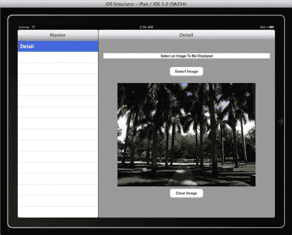

**图 15–12.** *你的应用在 `UIImageView` 中显示图像*

如果你在 iOS 模拟器上测试此应用，你需要实际保存一些图像以供显示。将图像保存到模拟器照片库的最简单方法是：在模拟器上使用 Safari 应用，导航到你想要的图像，然后按住鼠标左键点击该图像。你将看到一个保存图像的选项，执行此操作后，你就可以在你的应用中使用它了。


### 食谱 15–3：缩放图像

通常，你的应用需要处理的图像可能来自多种来源，而且往往无法完美适配特定视图的显示。为了解决这个问题，你可以实现图像缩放和调整大小的方法。

你需要配置应用，使第一个明细视图控制器（detail view controller）整体上只选中一张图像。当在主视图控制器（master view controller）的表格中选择不同的行时，你将在明细视图控制器中切换显示不同的图像。目前，你将配置视图，使图像以不同的大小比例显示。

首先，你需要创建一个方法来全面调整明细视图控制器的内容。将以下处理程序添加到明细视图控制器的头文件中：

`-(void)configureDetailsWithImage:(UIImage *)image label:(NSString *)label showsButtons:(BOOL)showButton;`

你需要按如下方式实现此方法：

```
-(void)configureDetailsWithImage:(UIImage *)image label:(NSString *)label showsButtons:(BOOL)showsButton
{
    self.selectedImage = image;
    self.imageViewContent.image = image;
    self.detailDescriptionLabel.text = label;
    if (showsButton == NO)
    {
        self.selectImageButton.enabled = NO;
        self.selectImageButton.hidden = YES;
        self.clearImageButton.enabled = NO;
        self.clearImageButton.hidden = YES;
    }
    else if (showsButton == YES)
    {
        self.selectImageButton.enabled = YES;
        self.selectImageButton.hidden = NO;
        self.clearImageButton.enabled = YES;
        self.clearImageButton.hidden = NO;
    }
}
```

你需要向明细视图控制器添加一个对主视图控制器的引用，以便将选中的图像传回。添加以下导入语句（或使用你的主视图控制器类名）：

`#import "MainMasterViewController.h"`

添加主视图控制器属性，并确保对其进行合成。

`@property (strong, nonatomic) MainMasterViewController *masterViewController;`

将以下代码行添加到你的 `-viewDidUnload` 方法中：

`[self setMasterViewController:nil];`

接下来，你需要在主视图控制器类中添加一个属性来存储选中的图像。请像平常一样正确合成并处理该属性。

`@property (strong, nonatomic) UIImage *mainImage;`

回到明细视图控制器，你需要更新 `-imagePickerController:didFinishPickingMediaWithInfo:` 方法，使其同时将选中的图像传回主视图控制器。

```
-(void)imagePickerController:(UIImagePickerController *)picker didFinishPickingMediaWithInfo:(NSDictionary *)info
{
    UIImage *image = [info valueForKey:@"UIImagePickerControllerOriginalImage"];
    self.selectedImage = image;

    //新增加的行
    self.masterViewController.mainImage = image;

    self.imageViewContent.image = image;
    self.imageViewContent.contentMode = UIViewContentModeScaleAspectFill;   

    [self.pop dismissPopoverAnimated:YES];
}
```

你还需要相应调整 `-clearImagePressed:` 方法的实现。

```
- (IBAction)clearImagePressed:(id)sender
{
    self.selectedImage = nil;
    self.imageViewContent.image = nil;
    self.masterViewController.mainImage = nil;
}
}

稍后，你将在主视图控制器中实现代码，以便在表格中使用这些图像。为此，你需要为 `mainImage` 属性实现一个自定义设置方法，用于重新加载 `UITableView` 的数据。

```
-(void)setMainImage:(UIImage *)image
{
    mainImage = image;
    NSIndexPath *currentIndexPath = self.tableView.indexPathForSelectedRow;
    [self.tableView reloadData];
    [self.tableView selectRowAtIndexPath:currentIndexPath animated:YES scrollPosition:UITableViewScrollPositionTop];
}
```

接下来，你将创建两个不同的方法来调整图像大小。将以下两个处理程序添加到明细视图控制器的头文件中。

`+ (UIImage *)scaleImage:(UIImage *)image toSize:(CGSize)size;`
`+ (UIImage *)aspectScaleImage:(UIImage *)image toSize:(CGSize)size;`


```markdown

第一种方法会在指定尺寸内简单地重新创建图像，完全忽略图像的宽高比。

```
+ (UIImage *)scaleImage:(UIImage *)image toSize:(CGSize)size
{
    UIGraphicsBeginImageContext(size);
    [image drawInRect:CGRectMake(0, 0, size.width, size.height)];
    UIImage *scaledImage = UIGraphicsGetImageFromCurrentImageContext();
    UIGraphicsEndImageContext();
    return scaledImage;
}
```

第二种方法会通过少量计算，确定最佳的图像缩放方式，以同时保留宽高比并适应给定的尺寸。

```
+ (UIImage *)aspectScaleImage:(UIImage *)image toSize:(CGSize)size
{
    UIGraphicsBeginImageContext(size);
    if (image.size.height < image.size.width)
    {
        float ratio = size.height/image.size.height;
        [image drawInRect:CGRectMake(0, 0, image.size.width*ratio, size.height)];
    }
    else
    {
        float ratio = size.width/image.size.width;
        [image drawInRect:CGRectMake(0, 0, size.width, image.size.height*ratio)];
    }
    UIImage *aspectScaledImage = UIGraphicsGetImageFromCurrentImageContext();
    UIGraphicsEndImageContext();
    return aspectScaledImage;
}
```

为确保视图控制器正确交互，请在应用程序委托的`-application:didFinishLaunchingWithOptions:`方法中，在两个视图控制器创建完成后添加以下两行代码：

```
detailViewController.masterViewController = masterViewController;
masterViewController.detailViewController = detailViewController;
```

现在，要完成主视图控制器行为的配置，请修改以下委托方法：

```
- (NSInteger)tableView:(UITableView *)tableView numberOfRowsInSection:(NSInteger)section
{
    if (self.mainImage == nil)
    {
        return 1;
    }
    else
    {
        return 3;
    }
}
- (UITableViewCell *)tableView:(UITableView *)tableView cellForRowAtIndexPath:(NSIndexPath *)indexPath
{
    static NSString *CellIdentifier = @"Cell";

    UITableViewCell *cell = [tableView dequeueReusableCellWithIdentifier:CellIdentifier];
    if (cell == nil) {
        cell = [[UITableViewCell alloc] initWithStyle:UITableViewCellStyleDefault reuseIdentifier:CellIdentifier];
    }

    if (indexPath.row == 0)
        cell.textLabel.text = NSLocalizedString(@"Selected Image", @"Detail");
    else if (indexPath.row == 1)
        cell.textLabel.text = NSLocalizedString(@"Resized Image", @"Detail");
    else if (indexPath.row == 2)
        cell.textLabel.text = NSLocalizedString(@"Scaled Image", @"Detail");
    return cell;
}
- (void)tableView:(UITableView *)tableView didSelectRowAtIndexPath:(NSIndexPath *)indexPath
{
    if (self.mainImage != nil)
    {
        UIImage *image;
        NSString *label;
        BOOL showsButtons;
        if (indexPath.row == 0)
        {
            image = self.mainImage;
            label = @"Select an Image to Display";
            showsButtons = YES;
        }
        else if (indexPath.row == 1)
        {
            image = [MainDetailViewController scaleImage:self.mainImage toSize:self.detailViewController.imageViewContent.frame.size];
            label = @"Chosen Image Resized";
            showsButtons = NO;
        }
        else if (indexPath.row == 2)
        {
            image = [MainDetailViewController aspectScaleImage:self.mainImage toSize:self.detailViewController.imageViewContent.frame.size];
            label = @"Chosen Image Scaled";
            showsButtons = NO;
        }
        [self.detailViewController configureDetailsWithImage:image label:label showsButtons:showsButtons];
    }
}
```

如前所示，原始图像为了保持宽高比，最终会扩展到`UIImageView`的框架之外。由于这可能会导致遮挡其他元素的问题，因此你可能更倾向于使用缩放后的图像。运行此应用程序时，你可以看到在展示不同尺寸图像时各选项的巨大差异。

Figure 15–13 展示了同一图像的示例，但已将其简单缩放以适应图像视图的框架。

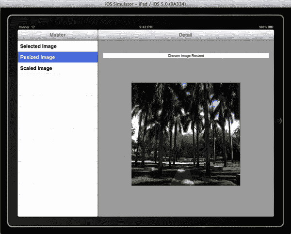

**Figure 15–13.** *你的应用程序展示未经缩放而调整大小的图像*

如你所见，你已经成功将整个图像放入一个更小的空间中，确保图像不会遮挡其他视图元素。然而，此选项的问题在于图像的尺寸发生了变化，导致图像略微变形。对于此特定图像，这或许不太明显，但在处理人物图像时，物理特征的扭曲将变得非常明显且不美观。为解决此问题，你可以使用“aspect-scaled”图像，如 Figure 15–14 所示。

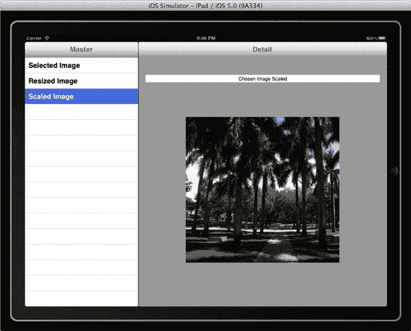

**Figure 15–14.** *一种替代的缩放方法以消除失真，但会导致裁剪*

与之前的图像和原始图像相比，你可以看到此图像明显质量更高，因为它不存在任何尺寸变形。不幸的是，由于你选择让图像“填满”`UIImageView`，最终得到的图像是从原始图像裁剪而来的。如果你需要从较大的图像创建小缩略图，这种缩放方式效果极佳，因为随着尺寸变小，图像裁剪的问题会变得微不足道。

显然，如果你处理的不是缩略图，而是需要展示大图，那么上述裁剪效果则远非理想。你可以优化图像缩放方法，让图像“适应”图像视图，并为视图的其余部分提供黑色背景。进行此更改后，你之前的“缩略图创建方法”将不再有效，因此如果你想保留之前的设置，请务必保存项目的新副本。

首先，将配置方法调整为以下代码，以更改`UIImageView`的`contentMode`属性。

```
- (void)configureDetailsWithImage:(UIImage *)image label:(NSString *)label showsButtons:(BOOL)showsButton
{
    self.selectedImage = image;
    self.imageViewContent.image = image;
    self.detailDescriptionLabel.text = label;
    /////BEGIN NEW CODE
    if ([label isEqualToString:@"Chosen Image Scaled"])
    {
        self.imageViewContent.contentMode = UIViewContentModeScaleAspectFit;
        self.imageViewContent.backgroundColor = [UIColor blackColor];
    }
    else
    {
        self.imageViewContent.contentMode = UIViewContentModeScaleAspectFill;
    }
    /////END NEW CODE
    if (showsButton == NO)
    {
        self.selectImageButton.enabled = NO;
        self.selectImageButton.hidden = YES;
        self.clearImageButton.enabled = NO;
        self.clearImageButton.hidden = YES;
    }
    else if (showsButton == YES)
    {
        self.selectImageButton.enabled = YES;
        self.selectImageButton.hidden = NO;
        self.clearImageButton.enabled = YES;
        self.clearImageButton.hidden = NO;
    }
}
```

你的图像缩放方法将需要略微不同的计算方式，才能以这种方式正确缩放图像。以下代码展示了新的实现。请特别注意，你已经更改了用于创建图像上下文的`CGSize`。

```
+ (UIImage *)aspectScaleImage:(UIImage *)image toSize:(CGSize)size
{
    if (image.size.height < image.size.width)
    {
        float ratio = size.height/image.size.height;
        CGSize newSize = CGSizeMake(image.size.width*ratio, size.height);

        UIGraphicsBeginImageContext(newSize);
        [image drawInRect:CGRectMake(0, 0, newSize.width, newSize.height)];
    }
    else
    {
        float ratio = size.width/image.size.width;
        CGSize newSize = CGSizeMake(size.width, image.size.height*ratio);
```

```


`UIGraphicsBeginImageContext(newSize);`
`[image drawInRect:CGRectMake(0, 0, newSize.width, newSize.height)];`
`UIImage *aspectScaledImage = UIGraphicsGetImageFromCurrentImageContext();`
`UIGraphicsEndImageContext();`
`return aspectScaledImage;`

凭借最新的改动，你的图片如今可以按比例缩小尺寸且不会被裁剪！通过在 `UIImageView` 中添加黑色背景，你为图片提供了一个简单的背景板，从而实现一种通用且全面的功能，用于展示调整尺寸后的图片，如图 Figure 15–15 所示。

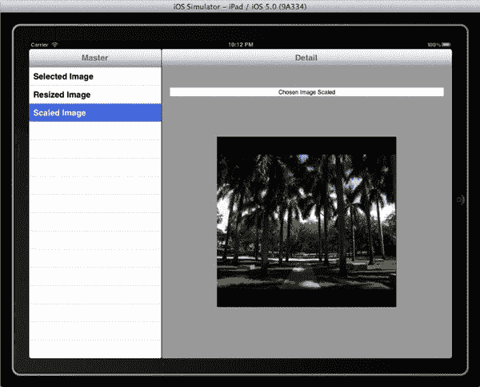

**图 15–15.** *将缩放后的图片适配进视图有助于避免裁剪，但会带来 `UIImageView` 背景可见的问题。*

#### 回顾总结

你已了解了三种简单但各不相同的调整 `UIImage` 尺寸的方法，每种方法都有自己的优点和问题。

1. 第一种方法直接忽略宽高比，将图片调整到指定尺寸。虽然这能避免图片遮挡其他元素，但会导致明显的形变。
2. 通过一些简单的数学计算，你手动维持宽高比，将图片缩小到合适尺寸。这种方法的缺点在于，为了填满给定空间，它往往会裁剪掉图片的部分内容。如果你需要创建一起展示的小尺寸缩略图，这是一个不错的实现方式。
3. 重新配置了宽高比调整方法后，你能够展示一个锁定宽高比且尺寸更小的图片，使其完全适配 `UIImageView`。当然，这会在图片周围留下空白区域，于是你应用了黑色背景。当在一个无法控制原始图片尺寸的应用程序中展示大图时，这是一种特别实用的技术。它能让任意图片舒适地适配给定空间，同时无论何种情况都能维持美观的黑色背景。

### 配方 15–4：使用滤镜处理图片

Core Image 框架是 iOS 5.0 中全新引入的一组类，它允许你创造性地将多种不同类型的“滤镜”应用于图片。

首先，将 `CoreImage.framework` 库导入你的项目。进入应用程序的 Build Phases 标签页，点击 Link Binary With Libraries 区域下方的 + 按钮。在弹出的对话框（如图 Figure 15–16 所示）中，找到 Core Image framework 并添加它。

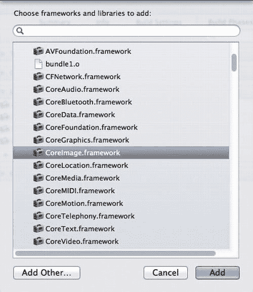

**图 15–16.** *将 Core Image 框架添加到项目中*

为主视图控制器的头文件添加对该框架的导入语句。

`#import <CoreImage/CoreImage.h>`

接下来，在同一个控制器中添加一个 `NSMutableArray` 属性，用于存储将要展示的过滤后的图片。记得照常正确合成（synthesize）并处理该属性。

`@property (strong, nonatomic) NSMutableArray *images;`

此外，需要为该属性编写一个自定义的 getter 方法，以确保它能正确初始化。

```
-(NSMutableArray *)images
{
    if (!images)
    {
        images = [[NSMutableArray alloc] initWithCapacity:3];
    }
    return images;
}
```

现在，你将再次修改 `-setMainImage:` 方法，加入对该数组的正确处理。

```
-(void)setMainImage:(UIImage *)image
{
    [self.images removeAllObjects];
    if (image != nil)
    {
        [self.images addObject:image];
        [self populateImagesWithImage:image];
    }

    mainImage = image;
    NSIndexPath *currentIndexPath = self.tableView.indexPathForSelectedRow;
    [self.tableView reloadData];
    [self.tableView selectRowAtIndexPath:currentIndexPath animated:YES scrollPosition:UITableViewScrollPositionTop];
}
```

包含大部分 Core Image 代码的方法 `-populateImagesWithImage:` 将按如下方式实现。记得也要将方法声明放在你的头文件中。

```
-(void)populateImagesWithImage:(UIImage *)image
{
    CIImage *main = [[CIImage alloc] initWithImage:image];

    CIFilter *hueAdjust = [CIFilter filterWithName:@"CIHueAdjust"];
    [hueAdjust setDefaults];
    [hueAdjust setValue:main forKey:@"inputImage"];
    [hueAdjust setValue:[NSNumber numberWithFloat: 3.14/2.0f]
                forKey:@"inputAngle"];
    CIImage *outputHueAdjust = [hueAdjust valueForKey:@"outputImage"];
    CIContext *context = [CIContext contextWithOptions:nil];
    UIImage *outputImage1 = [UIImage imageWithCGImage:[context createCGImage:outputHueAdjust
                                                                    fromRect:outputHueAdjust.extent]];
    [self.images addObject:outputImage1];

    CIFilter *strFilter = [CIFilter filterWithName:@"CIStraightenFilter"];
    [strFilter setDefaults];
    [strFilter setValue:main forKey:@"inputImage"];
    [strFilter setValue:[NSNumber numberWithFloat:3.14f] forKey:@"inputAngle"];
    CIImage *outputStr = [strFilter valueForKey:@"outputImage"];
    UIImage *outputImage2 = [UIImage imageWithCGImage:[context createCGImage:outputStr fromRect:outputStr.extent]];
    [self.images addObject:outputImage2];
}
```

正如你从这个方法中看到的，创建 `CIImage` 需要以下步骤：

1. 获取目标输入图片的 `CIImage` 对象。
2. 使用特定的名称键创建一个滤镜。名称决定了将应用哪种滤镜以及可以使用哪些参数。
3. 为了确保无误，将滤镜的所有参数重置为默认值。
4. 使用 `"inputImage"` 键将输入图片设置到滤镜中。
5. 设置与滤镜相关的任何额外值以自定义输出效果。
6. 使用 `"outputImage"` 键获取输出的 `CIImage`。
7. 通过 `CIContext` 从 `CIImage` 创建一个 `UIImage`。

在这里，你选择了应用两种不同的滤镜：“色相调整”（Hue Adjustment）和“纠直滤镜”（Straighten Filter）。前者会改变图片的色相，而后者用于旋转图片以将其摆正。


```markdown

**注意：**可应用于图像的滤镜数量极其庞大，每个滤镜都有其特定的参数和键。要查找特定滤镜的详细信息，请使用 Apple 文档：[`http://developer.apple.com/library/ios/#DOCUMENTATION/GraphicsImaging/Reference/CoreImageFilterReference/Reference/reference.html`](http://developer.apple.com/library/ios/#DOCUMENTATION/GraphicsImaging/Reference/CoreImageFilterReference/Reference/reference.html)。

现在，你可以通过再次修改`-tableView:didSelectRowAtIndexPath:`方法，将这些新创建的滤镜图像指定给你的视图控制器。

```
(void)tableView:(UITableView *)tableView didSelectRowAtIndexPath:(NSIndexPath
*)indexPath
{
    if (self.mainImage != nil)
    {
        UIImage *image;
        NSString *label;
        BOOL showsButtons;
        if (indexPath.row == 0)
        {
            image = self.mainImage;
            CGSize contentSize = self.detailViewController.imageViewContent.frame.size;
            image = [MainDetailViewController aspectScaleImage:image toSize:contentSize];
            label = @"Select an Image to Display";
            showsButtons = YES;
        }
        else
        {
            image = [self.images objectAtIndex:indexPath.row];
            CGSize contentSize = self.detailViewController.imageViewContent.frame.size;
            image = [MainDetailViewController aspectScaleImage:image toSize:contentSize];
            showsButtons = NO;

            if (indexPath.row == 1)
            {
                label = @"Hue Adjustment";
            }
            else if (indexPath.row == 2)
            {
                label = @"Straightening Filter";
            }
        }
        [self.detailViewController configureDetailsWithImage:image label:label showsButtons:showsButtons];
    }
}
```

如你所见，你已经更新了所有显示内容，现在显示的是应用了不同滤镜的原始图像，而不是同一图像的不同尺寸示例。你已经采用了第三种图像缩放方法，以便显示所有这些图像。

你还需要更新`-tableView:cellForRowAtIndexPath:`方法，以包含最新的实现。

```
-(UITableViewCell *)tableView:(UITableView *)tableView
cellForRowAtIndexPath:(NSIndexPath *)indexPath
{
    static NSString *CellIdentifier = @"Cell";

    UITableViewCell *cell = [tableView dequeueReusableCellWithIdentifier:CellIdentifier];
    if (cell == nil) {
        cell = [[UITableViewCell alloc] initWithStyle:UITableViewCellStyleDefault reuseIdentifier:CellIdentifier];
    }

    if (indexPath.row == 0)
        cell.textLabel.text = NSLocalizedString(@"Selected Image", @"Detail");
    else if (indexPath.row == 1)
        cell.textLabel.text = NSLocalizedString(@"Hue Adjust", @"Detail");
    else if (indexPath.row == 2)
        cell.textLabel.text = NSLocalizedString(@"Straighten Filter", @"Detail");
    return cell;
}
```

回到你的详细视图控制器，你需要做一些额外的修改来完全配置新功能。

现在你正在以类似的方式格式化所有显示图像，因此需要将配置方法调整为更通用的形式。

```
-(void)configureDetailsWithImage:(UIImage *)image label:(NSString *)label showsButtons:(BOOL)showsButton
{
    self.selectedImage = image;
    self.imageViewContent.image = image;
    self.detailDescriptionLabel.text = label;
    self.imageViewContent.contentMode = UIViewContentModeScaleAspectFit;
    self.imageViewContent.backgroundColor = [UIColor blackColor];
    if (showsButton == NO)
    {
        self.selectImageButton.enabled = NO;
        self.selectImageButton.hidden = YES;
        self.clearImageButton.enabled = NO;
        self.clearImageButton.hidden = YES;
    }
    else if (showsButton == YES)
    {
        self.selectImageButton.enabled = YES;
        self.selectImageButton.hidden = NO;
        self.clearImageButton.enabled = YES;
        self.clearImageButton.hidden = NO;
    }
}
```

最后，你的`UIImagePickerControllerDelegate`协议方法也需要一些调整。新代码将如下所示：

```
-(void)imagePickerController:(UIImagePickerController *)picker didFinishPickingMediaWithInfo:(NSDictionary *)info
{
    UIImage *image = [info valueForKey:@"UIImagePickerControllerOriginalImage"];
    self.selectedImage = image;

    self.masterViewController.mainImage = image;
    CGSize contentSize = self.imageViewContent.frame.size;
    self.imageViewContent.image = [MainDetailViewController aspectScaleImage:image toSize:contentSize];
    self.imageViewContent.contentMode = UIViewContentModeScaleAspectFit;   
    self.imageViewContent.backgroundColor = [UIColor blackColor];

    [self.pop dismissPopoverAnimated:YES];
}
```

现在运行你的应用程序，你将能够看到所使用的两种滤镜的输出效果。

图 15–17 展示了色调调整的示例。你选择的输入角度为`3.14/2.0`，这将极大地改变图像的色调。

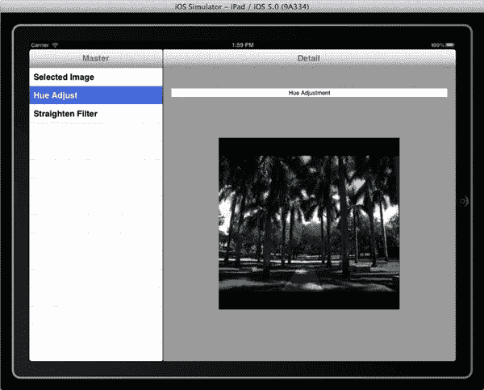

**图 15–17.** *你的新应用应用了色调调整滤镜*

在同一应用中，你的第二个滤镜使用指定的输入角度`3.14`，将给定图像旋转 180 度，如图 15–18 所示。

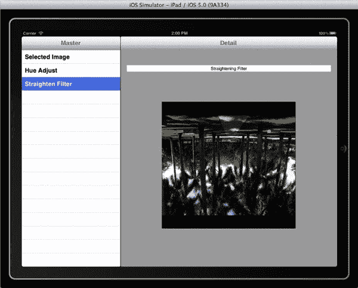

**图 15–18.** *应用拉直滤镜来旋转图像*

你也可以非常轻松地将多个滤镜串联组合，只需将一个滤镜的输出图像指定为另一个滤镜的输入图像即可。将以下代码添加到`-populateImagesWithImage:`方法中，以创建一个组合滤镜。

```
CIFilter *seriesFilter = [CIFilter filterWithName:@"CIStraightenFilter"];
[seriesFilter setDefaults];
[seriesFilter setValue:outputHueAdjust forKey:@"inputImage"];
[seriesFilter setValue:[NSNumber numberWithFloat:3.14/2.0f] forKey:@"inputAngle"];
CIImage *outputSeries = [seriesFilter valueForKey:@"outputImage"];
UIImage *outputImage3 = [UIImage imageWithCGImage:[context createCGImage:outputSeries
fromRect:outputSeries.extent]];
[self.images addObject:outputImage3];
```

更新`-tableView:numberOfRowsInSection:`方法，以显示第四个单元格。

```
- (NSInteger)tableView:(UITableView *)tableView numberOfRowsInSection:(NSInteger)section
{
    if (self.mainImage == nil)
    {
        return 1;
    }
    else
    {
        return 4;
    }
}
```

在`-tableView:cellForRowAtIndexPath:`方法中添加第四个分支，以显示第四个单元格的名称。

```
else if (indexPath.row == 3)
    cell.textLabel.text = NSLocalizedString(@"Series Filter", @"Detail");
```

最后，在`-tableView:didSelectRowAtIndexPath:`方法中，直接在用于设置第 1 行和第 2 行`label`的逻辑之后，添加另一个分支，以正确设置`UILabel`。

```
else if (indexPath.row == 3)
{
    label = @"Series Filter";
}
```

现在测试应用程序时，你的新双重滤镜将结合前两个滤镜的效果，生成一幅色调调整并旋转后的图像，如图 15–19 所示。

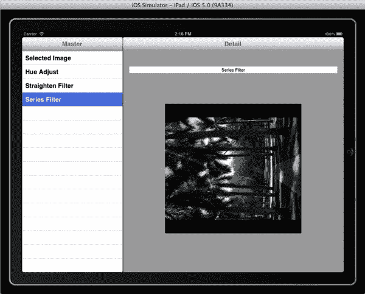

**图 15–19.** *色调调整与拉直滤镜的串联组合*

**注意：** 在使用`Core Image`框架时，大部分处理工作发生在使用`CIContext`从`CIImage`创建`UIImage`的过程。`CIImage`本身的创建是非常快速的操作。在你的应用中，你选择一次性创建所有滤镜图像，以便在各项显示之间快速导航。这就是为什么在选择图像时，你的模拟器可能需要几秒钟才能实际显示图像并刷新。如果你要构建此应用并发布，应该通过`UIActivityIndicatorView`或`UIProgressView`以某种方式向用户传达正在进行处理。

```


现在，你将利用之前的缩放功能，为每个经滤镜处理后的图像创建缩略图，以便能在主视图控制器的 `UITableView` 中显示它们。

由于你已将缩略图缩放方法从之前的秘方中分离出来，以下是你要用到的方法。

```
+ (UIImage *)scaleImageThumbnail:(UIImage *)image toSize:(CGSize)size
{
    UIGraphicsBeginImageContext(size);
    if (image.size.height< image.size.width)
    {
        float ratio = size.height/image.size.height;
        [image drawInRect:CGRectMake(0, 0, image.size.width*ratio, size.height)];
    }
    else
    {
        float ratio = size.width/image.size.width;
        [image drawInRect:CGRectMake(0, 0, size.width, image.size.height*ratio)];
    }
    UIImage *aspectScaledImage = UIGraphicsGetImageFromCurrentImageContext();
    UIGraphicsEndImageContext();
    return aspectScaledImage;
}
```

务必也将此方法的处理程序放在详情视图控制器的头文件中，以便主视图控制器能够调用它。

```
+ (UIImage *)scaleImageThumbnail:(UIImage *)image toSize:(CGSize)size;
```

现在，你只需再次修改 `-tableView:cellForRowAtIndexPath:` 方法，为单元格的 `imageView` 加入图像选择逻辑。完整的方法应类似于以下代码。

```
- (UITableViewCell *)tableView:(UITableView *)tableView
cellForRowAtIndexPath:(NSIndexPath *)indexPath
{
    static NSString *CellIdentifier = @"Cell";

    UITableViewCell *cell = [tableView dequeueReusableCellWithIdentifier:CellIdentifier];
    if (cell == nil) {
        cell = [[UITableViewCell alloc] initWithStyle:UITableViewCellStyleDefault reuseIdentifier:CellIdentifier];
    }

    /////新增缩略图代码
    if ([self.images count] >0)
    {
        CGSize thumbnailSize = CGSizeMake(120, 75);
        UIImage *displayImage = [self.images objectAtIndex:indexPath.row];
        if (displayImage)
        {
            UIImage *thumbnailImage = [MainDetailViewController scaleImageThumbnail:displayImage toSize:thumbnailSize];
            cell.imageView.image = thumbnailImage;
        }
    }
    /////缩略图代码结束

    if (indexPath.row == 0)
        cell.textLabel.text = NSLocalizedString(@"Selected Image", @"Detail");
    else if (indexPath.row == 1)
        cell.textLabel.text = NSLocalizedString(@"Hue Adjust", @"Detail");
    else if (indexPath.row == 2)
        cell.textLabel.text = NSLocalizedString(@"Straighten Filter", @"Detail");
    else if (indexPath.row == 3)
        cell.textLabel.text = NSLocalizedString(@"Series Filter", @"Detail");
    return cell;
}
```

现在测试你的应用时，主视图控制器的每个单元格都会显示其所引用的大图的缩放版缩略图，如图 15–20 所示。

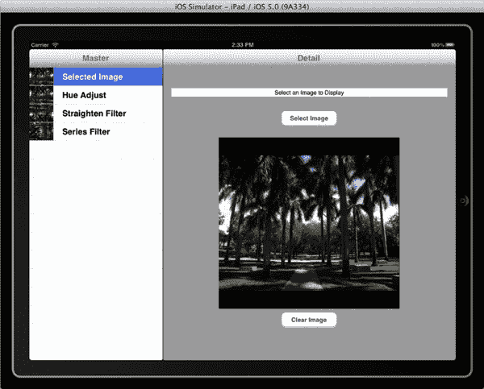

**图 15–20.** *带有缩放（裁剪）缩略图的应用*

## 秘方 15–5：检测特征

除了极其灵活的滤镜运用能力，Core Image 框架还为 iOS 5.0 带来了特征检测的功能，让你能有效“搜索”图像中的关键元素，比如人脸。

我们将新建一个较小的项目来实现这个面部检测应用，而不是继续沿用之前的秘方。为 iPhone 设备系列创建一个新项目，使用“单视图应用”模板，如图 15–21 所示。

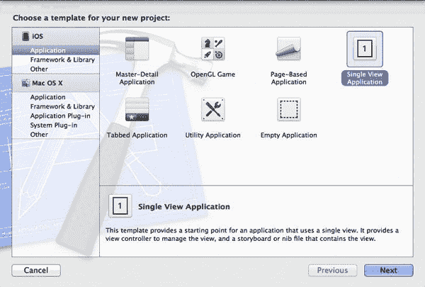

**图 15–21.** *创建单视图应用*

项目创建后，像之前的秘方一样，将 Core Image 框架添加到项目中。

在视图中添加两个 `UIImageView` 实例和一个 `UIButton`，布局应类似于图 15–22。

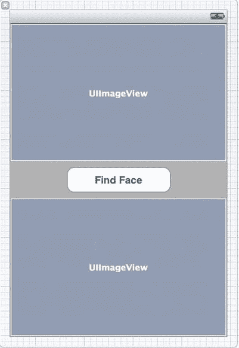

**图 15–22.** *视图控制器的 XIB 设置*

将每个元素连接到你的视图控制器。`UIButton` 的属性名应为 `findFaceButton`，并执行动作 `-findFacePressed:`。将上方的 `UIImageView` 命名为 `imageViewMain`，下方的命名为 `imageViewAlt`。

```
#import <UIKit/UIKit.h>

@interface MainViewController : UIViewController

@property (strong, nonatomic) IBOutlet UIImageView *imageViewMain;
@property (strong, nonatomic) IBOutlet UIImageView *imageViewAlt;
@property (strong, nonatomic) IBOutlet UIButton *findFaceButton;
- (IBAction)findFacePressed:(id)sender;

@end
```

接下来，找一张要在应用中显示的图片，并添加到项目中。你可以通过将文件从 Finder 拖拽到项目的导航面板来实现。当添加文件的对话框出现时，确保选中“将项目复制到目标组的文件夹（如果需要）”复选框，如图 15–23 所示。为了正确测试此应用，尽量找一张人脸清晰可见的图片。

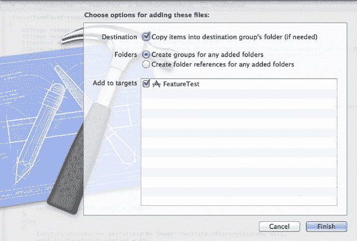

**图 15–23.** *向项目中添加文件时的弹出对话框*

现在，你可以构建 `-viewDidLoad` 方法来配置 `UIImageView` 元素，并将初始图像设置到主图像视图中。请务必将图像名称（以下代码中的 `"testImage.JPG"`）替换为你自己的文件名。

```
- (void)viewDidLoad
{
    [super viewDidLoad];

    self.imageViewMain.backgroundColor = [UIColor blackColor];
    self.imageViewMain.contentMode = UIViewContentModeScaleAspectFit;
    self.imageViewAlt.backgroundColor = [UIColor blackColor];
    self.imageViewAlt.contentMode = UIViewContentModeScaleAspectFit;

    UIImage *image = [UIImage imageNamed:@"testImage.JPG"];
    if (image != nil)
    {
        self.imageViewMain.image = image;
    }
    else
    {
        [self.findFaceButton setTitle:@"No Image" forState:UIControlStateNormal];
        self.findFaceButton.enabled = NO;
        self.findFaceButton.alpha = 0.6;
    }
}
```

最后，你可以实现 `-findFacePressed:` 方法来进行特征检测。该方法将确定给定图像中人脸的位置，从找到的最后一张人脸创建 `UIImage`，然后将其显示在备用的图像视图中。

```
-(IBAction)findFacePressed:(id)sender
{
    UIImage *image = self.imageViewMain.image;
    CIImage *coreImage = [[CIImage alloc] initWithImage:image];
    CIContext *context = [CIContext contextWithOptions:nil];
    CIDetector *detector = [CIDetector detectorOfType:@"CIDetectorTypeFace"context:context
        options:[NSDictionary dictionaryWithObjectsAndKeys:@"CIDetectorAccuracyHigh",
        @"CIDetectorAccuracy", nil]];
    NSArray *features = [detector featuresInImage:coreImage];

    if ([features count] >0)
    {
        CIImage *faceImage = [coreImage imageByCroppingToRect:[[features lastObject] bounds]];
        UIImage *face = [UIImage imageWithCGImage:[context createCGImage:faceImage fromRect:faceImage.extent]];
        self.imageViewAlt.image = face;
    }
}
```


```objc
[self.findFaceButton setTitle:[NSString stringWithFormat:@"%i Face(s) Found", [features count]] forState:UIControlStateNormal];
self.findFaceButton.enabled = NO;
self.findFaceButton.alpha = 0.6;
}
else
{
[self.findFaceButton setTitle:@"No Faces Found" forState:UIControlStateNormal];
self.findFaceButton.enabled = NO;
self.findFaceButton.alpha = 0.6;
}
```

该方法包含以下步骤：

1.  从初始的 `UIImage` 对象中获取一个 `CIImage` 对象。
2.  创建一个用于分析图像的 `CIContext`。
3.  使用类型和选项参数创建一个 `CIDetector` 实例。
    1.  `type` 参数用于指定要识别的特定特征。目前，该参数唯一可能的值是 `CIDetectorTypeFace`，它允许你专门寻找人脸。
    2.  `options` 参数允许你指定寻找特征的精确度。低精确度会更快，但高精确度会更精确。
4.  创建一个包含图像中所有被找到特征的数组。由于你指定了 `CIDetectorTypeFace` 类型，这些对象都将是 `CIFaceFeature` 类的实例。
5.  使用 `-imageByCroppingToRect:` 方法，配合原始图像以及由图像中最后找到的 `CIFaceFeature` 指定的边界，创建一个 `CIImage`。这些边界指定了人脸所在的 `CGRect`。
6.  从你的 `CIImage` 创建一个 `UIImage`（操作方式与上一个技巧完全相同），然后将其显示在你的 `UIImageView` 中。

运行你的应用程序后，你将能够检测到图像中的任何人脸，这些人脸会显示在下方的 `UIImageView` 中，如图 15–24 所示。

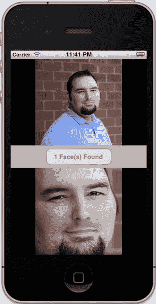

**图 15–24。** *你的应用程序从图像中检测并裁剪出人脸*

### 总结

图像构筑了我们的世界。从孩子们喜爱的最简单的图画书，到通过 Twitter、电子邮件、Facebook、Tumblr 以及其他所有网络服务在互联网上传输的海量视觉数据，图片和图像无疑已成为现代文化的关键基石之一。因此，通过学习在应用程序中创建、处理、操作和显示图像，你能够与用户建立更深入的联系，传达更强烈的情感反应，并以比以往更灵活、更具掌控力的方式进行交互。从构建彩色形状到显示照片，再到最新的 iOS 5.0 中新增的图像处理功能，你能够创建出更具趣味性和实用性的应用程序。Core Image 框架更是通过添加图像滤镜（可创造风格迥异的图像）和人脸检测软件（可从你的应用中提供更深入的信息）进一步增强了这种能力。就目前的技术发展水平而言，“一图胜千言”这种说法可以说是一种极大的保守说法。

## 第 16 章

## Game Kit 技巧

在本章中，你将使用一个简单的 Hangman 游戏，并将其与 Game Center 集成。Game Center 允许你通过提供简便的方法来实现社交功能，例如高分、游戏成就和多人游戏玩法，从而增强你的游戏。添加这些功能不仅能为你的游戏带来更多价值，还能延长游戏的“重复游玩性”。

你将从添加高分和成就开始，最终让你的游戏支持多人模式。你可以在此处找到该项目的起点：[`https://github.com/shawngrimes/HangmanMP`](https://github.com/shawngrimes/HangmanMP)。

### 技巧 16–1：从 Game Center 开始

在开始使用 Game Center 之前，你需要使用 iTunes Connect。如果你已经向 iTunes App Store 提交过应用程序或游戏，那么你已经知道 iTunes Connect 是什么了。对于那些尚未提交的人来说，iTunes Connect 是你管理所发布应用程序的地方。你将输入应用程序的元数据（描述、关键词、支持 URL 等），以及它将要使用的由 Apple 提供的任何功能，例如 iAd、应用内购买，或者（在此例中）Game Center。

为了使用 Game Center，你需要向 iTunes Connect 告知你的游戏信息，以便开始使用 Game Center 沙盒。Game Center 沙盒是一个开发环境，开发者可以在其中测试其 Game Center 集成，而不会影响正式环境下的分数或成就。

##### iTunes Connect 设置

启用 Game Center 集成的第一步是，如果你尚未为你的应用创建 bundle identifier，则在 iOS Provisioning Portal 中创建一个。Bundle identifier 用于标识一个应用的所有相关数据。例如，如果你的游戏有免费版和付费版，并且你希望它们使用同一个高分排行榜，那么你可以为它们赋予相同的 bundle identifier。

访问 `developer.apple.com` 上的 iOS Provisioning Portal，然后点击 “App IDs”。创建你的新 bundle identifier。图 16–1 中显示的信息就是你在本游戏中将使用的应用信息。

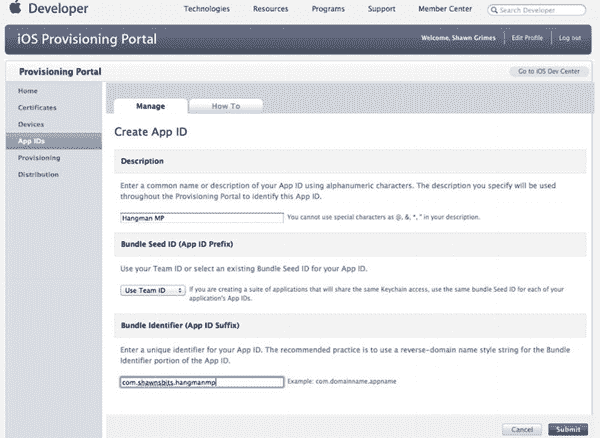

**图 16–1.** *配置你的 App ID*

现在，前往 `itunesconnect.apple.com`，点击 “Manage Your Applications”。如果你尚未提交应用以供审核，请点击 “Add New App” 按钮，此时会显示一个类似于图 16–2 的页面。输入你新应用的信息，然后点击 “Continue”。

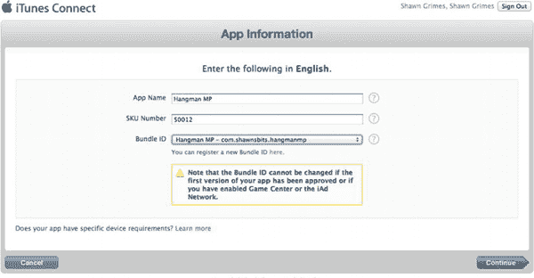

**图 16–2.** *输入你的应用信息*

一旦你输入了有关应用的所有元数据，包括截图和应用图标，你就可以启用 Game Center 了。点击图 16–3 中所示的 “Manage Game Center” 按钮，然后点击 “Enable”。

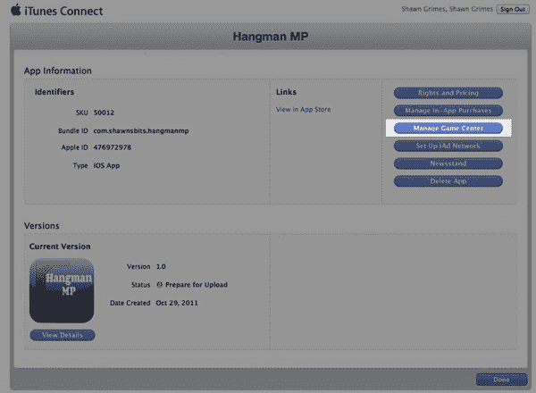

**图 16–3.** *访问 Game Center 管理页面*

启用后，你就可以配置排行榜和成就了（后续会有更多介绍）。


##### 项目设置

现在为你的游戏代码配置好 Game Center。在 Xcode 中打开你的项目（或本章提供的项目）。

Xcode 打开后，在项目导航器中点击你的项目名称，并选择所需的目标。转到 **Build Phases** 选项卡，展开 **Link Binaries With Libraries** 区域。你需要添加 Game Kit 框架，因此点击 图 16-4 中高亮显示的 `+` 按钮。

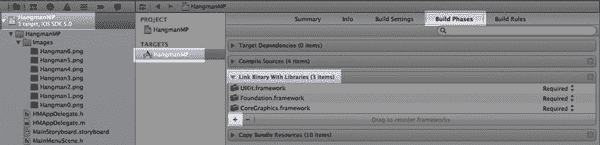

**图 16-4.** *用于添加框架的 Build Phases 选项卡*

在弹出的对话框（类似 图 16-5）中，搜索 **Game Kit** 并点击 **Add**。

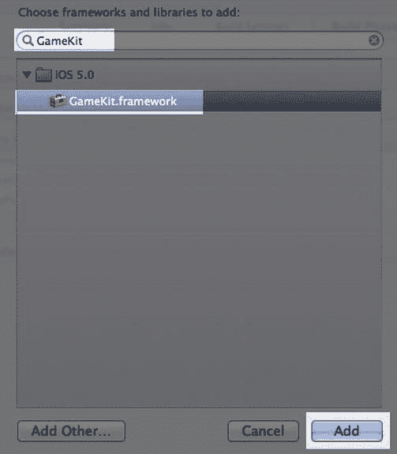

**图 16-5.** *向项目添加 Game Kit 框架*

如果你的游戏在没有 Game Center 的情况下也能运行，那么你可能希望将此框架设为可选，而非必需。在这种情况下，你的框架列表将类似于 图 16-6。

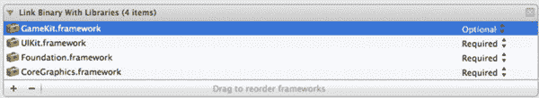

**图 16-6.** *将 Game Kit 框架配置为可选*

如果你需要强制要求 Game Center，那么可以将其保留为必需，但你需要额外一步来强制要求 Game Center。打开目标的 **Info** 选项卡，将 `gamekit` 添加到必需的设备功能列表中，如 图 16-7 所示。

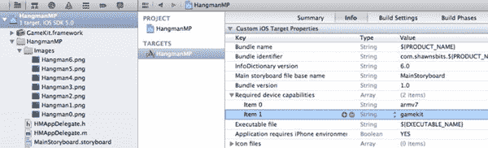

**图 16-7.** *添加 "gamekit" 作为必需的设备功能*

在编辑 **Info** 选项卡时，请确保你的 Bundle Identifier 与你在 iTunes Connect 中设置的保持一致，如 图 16-8 所示。

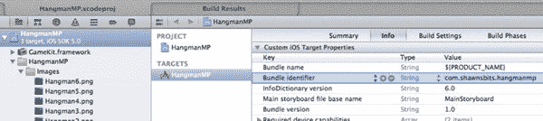

**图 16-8.** *确认应用中的 Bundle Identifier 与 iTunes Connect 中使用的一致*

现在，你可以通过在代码中添加语句 `#import <GameKit/GameKit.h>` 来包含 Game Center 功能。首先确认 Game Center 在此设备上可用。

#### 检查 Game Center 支持

首先，创建一个检查 Game Center 支持的方法。我将把它添加到应用委托中，这样你可以在游戏中的任何时刻检查状态。首先将 Game Kit 导入实现文件（`.m`）中，并创建一个检查 Game Center 可用性的方法：

```
#import "HMAppDelegate.h"
#import <GameKit/GameKit.h>

@implementation HMAppDelegate
@synthesize window = _window;

+(BOOL) isGameCenterAvailable
{
    // 检查 GKLocalPlayer 类是否存在
    BOOL localPlayerClassAvailable = (NSClassFromString(@"GKLocalPlayer")) != nil;

    // 设备必须运行 iOS 4.1 或更高版本
    NSString *reqSysVer = @"4.1";
    NSString *currSysVer = [[UIDevice currentDevice] systemVersion];
    BOOL osVersionSupported = ([currSysVer compare:reqSysVer
                                           options:NSNumericSearch] !=
NSOrderedAscending);

    return (localPlayerClassAvailable && osVersionSupported);
}
```

在你的接口文件（`.h`）中，为 `isGameCenterAvailable` 添加声明，以便其他类可以使用它，并且自动补全功能能够识别：

```
#import <UIKit/UIKit.h>

@interface HMAppDelegate : UIResponder <UIApplicationDelegate>

@property (strong, nonatomic) UIWindow *window;

+(BOOL) isGameCenterAvailable;

@end
```

#### 玩家认证

你需要尽快完成玩家认证。最好在游戏启动完成后立即进行，因此你将向应用委托的 `didFinishLaunchingWithOptions:` 方法中添加认证逻辑。不过，首先切换到你的接口文件，并为本地玩家添加一个属性到应用委托，以便在需要时可以随时访问。

由于你已将 `GameKit.h` 导入实现文件，因此需要告知接口文件存在一个名为 `GKLocalPlayer` 的类。你可以通过在接口文件中的 import 语句下方添加如下代码来实现：

`@class GKLocalPlayer;`

然后为 `GKLocalPlayer` 添加一个属性：

`@property(strong, nonatomic) GKLocalPlayer *localPlayer;`

最终的应用委托接口文件如下所示：

```
#import <UIKit/UIKit.h>

@class GKLocalPlayer;

@interface HMAppDelegate : UIResponder <UIApplicationDelegate>

@property (strong, nonatomic) UIWindow *window;
@property(strong, nonatomic) GKLocalPlayer *localPlayer;

+(BOOL) isGameCenterAvailable;

@end
```

切换回实现文件并合成你的新属性：

`@synthesize localPlayer;`

将你的 `didFinishLaunchingWithOptions:` 方法修改为如下代码。这将认证玩家并将 `localPlayer` 属性设置为本地玩家：

```
- (BOOL)application:(UIApplication *)application
didFinishLaunchingWithOptions:(NSDictionary *)launchOptions
{
    // 应用启动后的自定义覆盖点
    if([HMAppDelegate isGameCenterAvailable]){
        // 如果 GameCenter 可用，让我们认证用户
        GKLocalPlayer *_localPlayer=[GKLocalPlayer localPlayer];
        [_localPlayer authenticateWithCompletionHandler:^(NSError *error) {
            if(localPlayer.isAuthenticated){
                self.localPlayer=localPlayer;
            }
        }];
    }
    return YES;
}
```

关于此代码的一些说明：你应该始终检查 `isAuthenticated` 属性，而不是检查是否存在错误。即使出现错误，Game Kit 也可能利用缓存数据成功认证用户。你不应该向用户显示这些错误——Game Center 会替你做这些。错误信息主要用于调试。

玩家认证的大致流程就是这样。当你运行应用时，它会提示你登录或创建新账户，如 图 16-9 所示。已认证的用户可以在不同应用间传递，因此如果你或用户已在其他应用中完成了 Game Center 认证，该认证信息可以传递到你的应用，而无需再次提示登录。

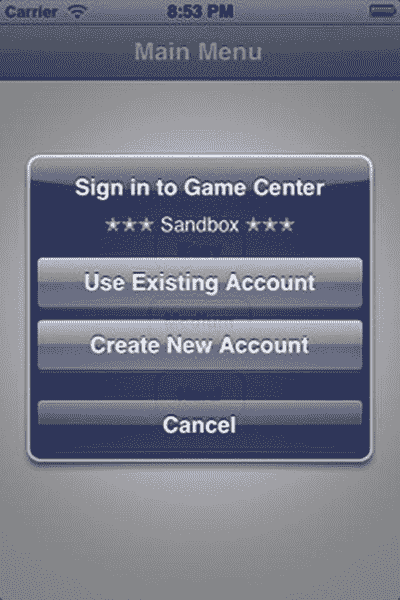

**图 16-9.** *你的应用提示输入 Game Center 账户*

### 技巧 16-2：排行榜

现在你已经能够认证用户了。让我们开始存储一些最高分。排行榜，也即最高分列表，是提升游戏重复可玩性并鼓励朋友间竞争的绝佳方式。你首先需要在 iTunes Connect 中创建一个排行榜，因此请访问 `itunesconnect.apple.com`。


#### 设置 iTunes Connect

点击“管理你的应用”，然后点击你启用了 Game Center 的应用。在“应用信息”页面，点击“管理 Game Center”，如图 16-10 所示。

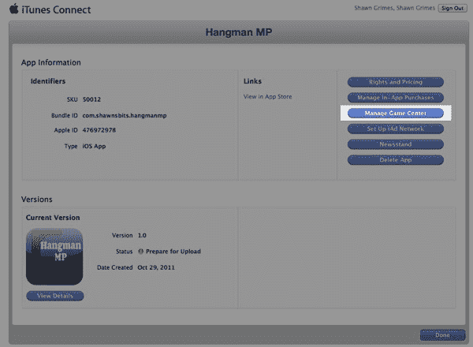

**图 16-10.** *进入“管理 Game Center”界面*

在“排行榜”标题下，点击“设置”，如图 16-11 所示。

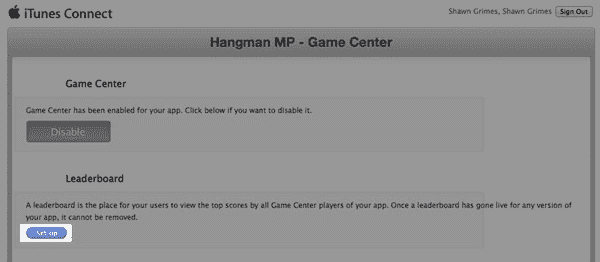

**图 16-11.** *Game Center 界面，你可以在其中设置排行榜*

一旦应用的排行榜上线，便无法删除，因此在创建时需谨慎考虑。每个应用最多可拥有 25 个排行榜。这允许你为不同难度创建多个排行榜，甚至可以为游戏的每个关卡创建一个，以最适合你的需求。在你的简单应用中，只需创建一个排行榜。

点击“添加排行榜”按钮，如图 16-12 所示，开始创建。

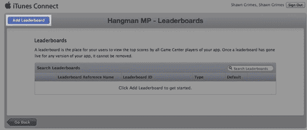

**图 16-12.** *你应用的待添加排行榜列表*

在“单个排行榜”下点击“选择”按钮，如图 16-13 所示，继续创建一个独立的排行榜。

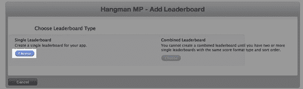

**图 16-13.** *选择排行榜类型*

为排行榜填写名称和标识符。名称是用于跟踪的内部名称，不会向玩家显示。（显示名称将在下一步添加语言时配置。）接下来选择分数格式类型；这里我将使用简单的整数，但你也可以使用基于时间、浮点数和货币的格式。选择排行榜的排序顺序。如果你希望高分排在最前面（通常如此），则选择“从高到低”排序；如果你希望低分排在最前面（例如在高尔夫游戏中），则选择“从低到高”排序。

你需要为排行榜设置至少一种语言。为此，点击“添加语言”按钮，如图 16-14 所示。

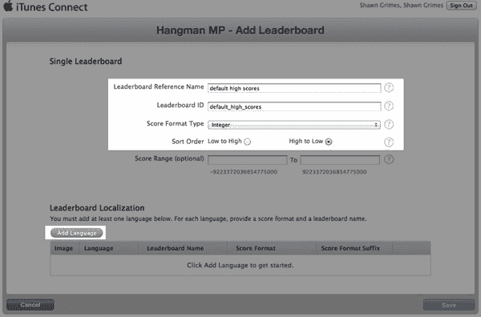

**图 16-14.** *配置排行榜*

现在，按照图 16-15 所示，为该分数配置本地化语言。选择语言，然后为排行榜输入显示名称；这是游戏中玩家将看到的名称。你可以设置分数的格式以及分数的单位（单数和复数）；在此例中，单位是“point”和“points”。

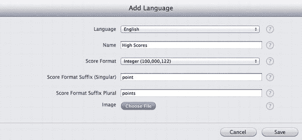

**图 16-15.** *排行榜的语言显示设置*

完成后，点击“保存”，然后也在排行榜页面上点击“保存”。

现在，让我们深入一些代码。

#### 设置你的代码

打开 HangmanMP 项目，进入 `GameScene.m` 文件。在文件顶部添加导入语句：`#import <GameKit/GameKit.h>`。

让我们在 `@synthesize` 和实例变量下方添加一个用于报告分数的方法：

```
- (void) reportScore: (int64_t) score forCategory: (NSString*) category
{
    GKScore *scoreReporter = [[GKScore alloc] initWithCategory:category];
    scoreReporter.value = score;
    [scoreReporter reportScoreWithCompletionHandler:^(NSError *error) {

        NSArray *paths = NSSearchPathForDirectoriesInDomains(NSDocumentDirectory,
NSUserDomainMask, YES);
        NSString *scoreFilePath = [NSString stringWithFormat:@"%@/scores.plist",[paths
objectAtIndex:0]];
        NSMutableDictionary *scoreDictionary=[NSMutableDictionary
dictionaryWithContentsOfFile:scoreFilePath];

        if (error != nil)
        {
            //出现错误，需要将分数保存在本地并稍后重新提交
            NSLog(@"保存分数以供后续处理");
            [scoreDictionary setValue:scoreReporter forKey:[NSDate date]];
            [scoreDictionary writeToFile:scoreFilePath atomically:YES];
        }
    }];
}
```

此方法会尝试报告分数，但如果失败，它会将分数保存到一个字典中，并将该字典写入文件，以便你之后可以加载这些分数。你可以在任何想要向 Game Center 报告分数的地方调用此方法，调用方式类似于：

```
[self reportScore:playerScore forCategory:@"default_high_scores"];
```

你还应该在应用启动时尝试报告已保存的分数，因此请切换到你的应用委托实现文件（`.m`）。

在 `didFinishLaunchingWithOptions` 方法的末尾，在读取到“return YES;”那一行之前，添加以下代码。

```
NSArray *paths = NSSearchPathForDirectoriesInDomains(NSDocumentDirectory,
NSUserDomainMask, YES);
    NSString *scoreFilePath = [NSString stringWithFormat:@"%@/scores.plist",[paths
objectAtIndex:0]];
    NSMutableDictionary *scoreDictionary=[NSMutableDictionary
dictionaryWithContentsOfFile:scoreFilePath];

    for (NSDate *dateID in [scoreDictionary allKeys]) {
        NSLog(@"报告旧分数: %@", dateID);
        GKScore *scoreToReport=(GKScore *)[scoreDictionary objectForKey:dateID];
        [scoreToReport reportScoreWithCompletionHandler:^(NSError *error) {
            NSArray *paths = NSSearchPathForDirectoriesInDomains(NSDocumentDirectory,
NSUserDomainMask, YES);
            NSString *scoreFilePath = [NSString
stringWithFormat:@"%@/scores.plist",[paths objectAtIndex:0]];
            NSMutableDictionary *scoreDictionary=[NSMutableDictionary
dictionaryWithContentsOfFile:scoreFilePath];

            if (error != nil)
            {
                //出现错误，需要将分数保存在本地并稍后重新提交
                [scoreDictionary setValue:scoreToReport forKey:scoreToReport.playerID];
                [scoreDictionary writeToFile:scoreFilePath atomically:YES];
            }
        }];

    }
```

这段代码会检查写入文件的旧分数，并尝试将它们发送到 Game Center。

#### 显示高分

如果没人看到，高分就没有意义。你的用户可以在 Game Center 应用内看到游戏的高分，但你也可以非常轻松地为他们提供一个直接链接到高分榜的入口。切换到 `MainMenuScene.h` 文件。

你需要导入 `GameKit.h`，并将 `MainMenuScene` 设置为 `GKLeaderboardViewControllerDelegate` 代理。

```
#import <UIKit/UIKit.h>
#import <GameKit/GameKit.h>

@interface MainMenuScene : UIViewController <GKLeaderboardViewControllerDelegate>

@end
```

现在，转到实现文件（`.m`），并在顶部添加两个新方法。第一个方法将在点击“完成”时关闭 `GKLeaderboardViewController`：

```
- (void)leaderboardViewControllerDidFinish:(GKLeaderboardViewController*)viewController
{
    [self dismissModalViewControllerAnimated:YES];
}
```

你需要添加的另一个方法将显示实际的 `GKLeaderboardViewController` 视图：

```
- (void) showLeaderboard
{
    GKLeaderboardViewController *leaderboardController = [[GKLeaderboardViewController
alloc] init];
    if (leaderboardController != nil)
    {
        leaderboardController.leaderboardDelegate = self;
        [self presentModalViewController: leaderboardController animated: YES];
    }
}
```

现在，你可以在主菜单场景上创建一个 `UIButton`，并将其连接到 `showLeaderboard` 方法，以显示游戏的排行榜。你可以在 `-viewDidLoad` 方法中创建这个按钮：

```
- (void)viewDidLoad
{
    [super viewDidLoad];
    UIButton *buttonShowHighScores=[UIButton buttonWithType:UIButtonTypeRoundedRect];
    [buttonShowHighScores addTarget:self action:@selector(showLeaderboard)
forControlEvents:UIControlEventTouchUpInside];
    buttonShowHighScores.frame=CGRectMake(104, 302, 112, 44);
    [buttonShowHighScores setTitle:@"高分榜" forState:UIControlStateNormal];

    [self.view addSubview:buttonShowHighScores];
}
```


### 配方 16-3：成就系统

游戏中的成就类似于其他应用和游戏中的徽章及可解锁内容。当玩家达到特定里程碑时，您需要为他们提供通知。在`HangmanMP`游戏中，一个很好的成就设定可以是：玩家完美猜中某个单词的全部字母（不犯任何错误）。让我们来看看如何实现这个功能。

#### 配置 iTunes Connect

与 Game Center 的其他功能一样，所有操作都从 iTunes Connect 开始。请访问 `itunesconnect.apple.com`，点击"管理你的应用"，然后选择已配置 Game Center 的应用，接着点击"管理 Game Center"。

在 Game Center 管理页面中，点击"成就"下的"设置"，如图 16-16 所示。

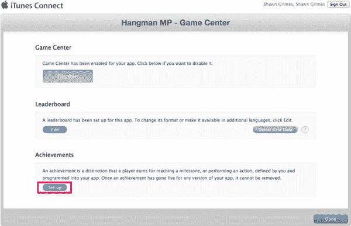

**图 16-16.** *从 Game Center 界面进入成就设置区*

每个游戏最多可设置 1000 个成就点。您可以根据需要将这些点数分配给不同的成就，但每个成就最多只能获得 100 成就点。

现在我们将创建一个 50 点成就，请继续点击"添加新成就"，如图 16-17 所示。

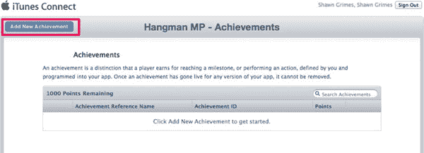

**图 16-17.** *为你的应用添加新成就*

该成就的条件是：在猜短单词（6 个字母或更少）时，全部猜对且不犯任何错误。具体配置如图 16-18 所示。

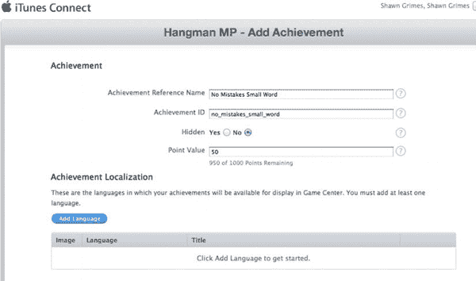

**图 16-18.** *配置成就详情*

在添加至少一种语言之前无法保存成就，请立即点击"添加语言"。生成的界面将如图 16-19 所示。在此处您可以设置成就标题和"达成前"描述。达成前描述应详细说明如何获得该成就。此外还有"已达成"描述，即获得成就后显示的描述。最后，您需要一张代表成就的图片，应为 512×512 像素、72 ppi 的`.png`文件。

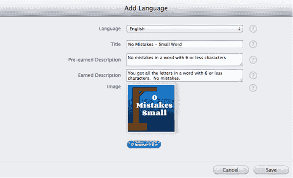

**图 16-19.** *在特定语言中配置成就详情*

点击"保存"，然后在成就信息页面上再次点击"保存"。接下来让我们编写代码...

#### 配置代码

这与配置排行榜非常相似。打开`GameScene.m`，添加以下方法：

```
- (void) reportAchievementIdentifier:(NSString*)identifier percentComplete:(float)percent
{
    GKAchievement *achievement = [[GKAchievement alloc] initWithIdentifier:identifier];
    if (achievement)
    {
        achievement.percentComplete = percent;
        [achievement reportAchievementWithCompletionHandler:^(NSError *error)
        {
            if (error != nil)
            {
                //出现错误，需在本地保存成就稍后重新提交
                NSLog(@"Saving achievement for later");
                NSArray *paths = NSSearchPathForDirectoriesInDomains(NSDocumentDirectory, NSUserDomainMask, YES);
                NSString *achievementFilePath = [NSString stringWithFormat:@"%@/achievements.plist",[paths objectAtIndex:0]];
                NSMutableDictionary *achievementDictionary=[NSMutableDictionary dictionaryWithContentsOfFile:achievementFilePath];

                [achievementDictionary setValue:achievement forKey:achievement.identifier];
                [achievementDictionary writeToFile:achievementFilePath atomically:YES];
            }
        }];
    }
}
```

现在只需用您的成就和完成百分比调用此方法即可。由于在此场景中要么获得成就要么不获得，完成百分比仅为 100 或 0，但您可以使用此代码片段报告任何成就的完成情况。请在`processGuess`方法中报告分数后添加这段代码：

```
if(unfoundLetters.location==NSNotFound){
            [self reportScore:playerScore forCategory:@"default_high_scores"];
            if(self.badGuessCount==0 && self.stringHiddenWord.length<=6){
                NSLog(@"Reporting achievement");
                [self reportAchievementIdentifier:@"no_mistakes_small_word" percentComplete:100];
            }
….
```

与应用委托中保存分数的方式类似，您也应该对成就做同样处理。转到`HMAppDelegate.m`，修改`didFinishLaunchingWithOptions`方法，在返回语句前添加以下代码：

```
    //Report saved achievements
    NSString *achievementFilePath = [NSString stringWithFormat:@"%@/achievements.plist",[paths objectAtIndex:0]];
    NSMutableDictionary *achievementDictionary=[NSMutableDictionary dictionaryWithContentsOfFile:achievementFilePath];
    for (id achievement in [achievementDictionary allKeys]){
        GKAchievement *achievementToReport=(GKAchievement *)[achievementDictionary objectForKey:achievement];
        [achievementToReport reportAchievementWithCompletionHandler:^(NSError *error)
         {
             if (error != nil)
             {
                 //出现错误，需在本地保存成就稍后重新提交
                 NSLog(@"Saving achievement for later");
                 NSArray *paths = NSSearchPathForDirectoriesInDomains(NSDocumentDirectory, NSUserDomainMask, YES);
                 NSString *achievementFilePath = [NSString stringWithFormat:@"%@/achievements.plist",[paths objectAtIndex:0]];
                 NSMutableDictionary *achievementDictionary=[NSMutableDictionary dictionaryWithContentsOfFile:achievementFilePath];

                 [achievementDictionary setValue:achievementToReport forKey:achievement];
                 [achievementDictionary writeToFile:achievementFilePath atomically:YES];
             }else{
                 NSLog(@"Achievement reported");
             }
         }];
    }
```

#### 显示成就

如果您已阅读过"排行榜"部分，这部分内容会让人感觉似曾相识。您希望向玩家展示他们在游戏中获得的成就，最简单的方法是将应用中的按钮与`GKAchievementsViewController`关联。前往`MainMenuScene.m`，添加以下方法：

```
-(void)achievementViewControllerDidFinish:(GKAchievementViewController *)viewController{
    [self dismissModalViewControllerAnimated:YES];
}
```

这将关闭您的`GKAchievementViewController`。为了显示它，请在`MainMenuScene.m`中添加以下函数：

```
- (void) showAchievements
{
    GKAchievementViewController *achievements = [[GKAchievementViewController alloc] init];
    if (achievements != nil)
    {
        achievements.achievementDelegate = self;
        [self presentModalViewController:achievements animated: YES];
    }
}
```

将`UIButton`的操作调用连接到该方法，然后别忘了在`MainMenuScene.h`文件中添加`GKAchievementViewControllerDelegate`协议：

```
//
//  MainMenuScene.h
//  HangmanMP

#import <UIKit/UIKit.h>
#import <GameKit/GameKit.h>

@interface MainMenuScene : UIViewController <GKLeaderboardViewControllerDelegate GKAchievementViewControllerDelegate>

- (IBAction)actionShowHighScores:(id)sender;

@end
```

现在在模拟器中启动应用进行测试。您将能够查看新创建的成就，如图 16-20 所示。

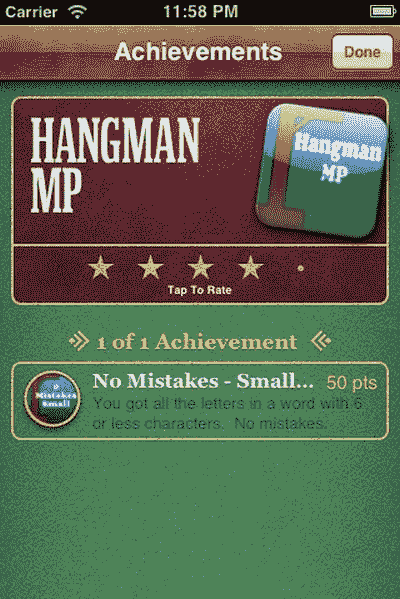

**图 16-20.** *您的应用显示已获得的成就*


### 配方 16–4：多人游戏

为游戏添加多人游戏选项可极大提升其重玩价值，因为玩家现在可以突破电脑的限制，在互联网上与真实玩家对战。

**注意：** 您无法在模拟器中测试多人游戏，而需要两台设备进行测试，因此可以借用朋友的设备或找一台旧 iPod touch。

#### 设置代码

在本配方中，您可以跳过 iTunes Connect 部分，因为如果您已启用 Game Center，只要游戏支持，多人游戏功能就会自动开放。那么，我们直接进入代码部分。

首先，您需要更新 `MainMenuScene.h` 文件。将其设置为 `GKMatchmakerViewControllerDelegate`，并添加一个用于主持多人游戏的新操作。文件内容应如下所示：

```
//  MainMenuScene.h
//  HangmanMP
//
#import <UIKit/UIKit.h>
#import <GameKit/GameKit.h>

@interface MainMenuScene : UIViewController <GKLeaderboardViewControllerDelegate,
GKAchievementViewControllerDelegate,GKMatchmakerViewControllerDelegate>

- (IBAction)actionShowHighScores:(id)sender;
- (IBAction)actionShowAchievements:(id)sender;
- (IBAction)actionHostMatch:(id)sender;

@end
```

现在切换到 `MainMenuScene.m` 文件。您需要创建 `GKMatchmakerViewControllerDelegate` 协议要求的两个标准方法：`matchmakerViewControllerWasCancelled` 和 `matchmakerViewController:didFailWithError`：

```
- (void)matchmakerViewControllerWasCancelled:(GKMatchmakerViewController*)viewController
{
    [self dismissModalViewControllerAnimated:YES];
}

- (void)matchmakerViewController:(GKMatchmakerViewController *)viewController
                didFailWithError:(NSError *)error
{
    [self dismissModalViewControllerAnimated:YES];
    [[[UIAlertView alloc] initWithTitle:@"Error" message:error.description delegate:nil
cancelButtonTitle:@"OK" otherButtonTitles:nil] show];
}
```

您还需要添加最后一个委托协议方法 `matchmakerViewController:didFindMatch:`，这是开始加载多人游戏的关键步骤。

```
- (void)matchmakerViewController:(GKMatchmakerViewController *)viewController
                    didFindMatch:(GKMatch *)match
{
    [self dismissModalViewControllerAnimated:YES];
//从故事板设置游戏场景
    GameScene *gameSceneVC=[self.storyboard
instantiateViewControllerWithIdentifier:@"GameScene"];
//将 GameScene 的 match 属性设置为 matchmaker 的匹配结果
    gameSceneVC.match=match;
//将 match 的委托设置为 GameScene，更多内容稍后说明…
    match.delegate = gameSceneVC;
[self.navigationController pushViewController:gameSceneVC animated:YES];
}
```

现在，您将创建使用 `matchmakerViewController` 实际开始寻找匹配的操作：

```
- (IBAction)actionHostMatch:(id)sender {
    if([GKLocalPlayer localPlayer].isAuthenticated){
        GKMatchRequest *request = [[GKMatchRequest alloc] init] ;
        request.minPlayers = 2;
        request.maxPlayers = 2;
        GKMatchmakerViewController *mmvc = [[GKMatchmakerViewController alloc]
initWithMatchRequest:request];
        mmvc.matchmakerDelegate = self;
        [self presentModalViewController:mmvc animated:YES];
    }
}
```

这会让我们开始寻找匹配，但如果您希望能响应邀请，则需要添加邀请处理程序。这应该在玩家通过身份验证后立即添加，以便尽快处理邀请请求。这段代码将处理您发送的邀请以及您收到的邀请。将以下代码添加到 `MainMenuScene.m` 的 `-viewDidLoad` 方法中：

```
- (void)viewDidLoad
{
    [super viewDidLoad];
    [GKMatchmaker sharedMatchmaker].inviteHandler = ^(GKInvite *acceptedInvite,
                                                      NSArray *playersToInvite) {
        // 在此处插入特定于应用程序的代码，清理正在进行的游戏。
        if (acceptedInvite)
        {
            GKMatchmakerViewController *mmvc = [[GKMatchmakerViewController alloc]
initWithInvite:acceptedInvite];
            mmvc.matchmakerDelegate = self;
            [self presentModalViewController:mmvc animated:YES];
        }
        else if (playersToInvite)
        {
            GKMatchRequest *request = [[GKMatchRequest alloc] init];
            request.minPlayers = 2;
            request.maxPlayers = 2;
            request.playersToInvite = playersToInvite;
            GKMatchmakerViewController *mmvc = [[GKMatchmakerViewController alloc]
initWithMatchRequest:request];
            mmvc.matchmakerDelegate = self;
            [self presentModalViewController:mmvc animated:YES];
        }
    };
}
```

现在，您需要在 `GameScene` 中实现多人游戏控制。打开 `GameScene.h`，将其设置为 `GKMatchDelegate`。也可以将其设置为 `UIAlertViewDelegate`（供稍后使用）。最后，添加两个新属性：`GKMatch *match` 和 `BOOL matchStarted`。`GameScene.h` 现在的样式如下：

```
//  GameScene.h
//  HangmanMP

#import <UIKit/UIKit.h>
#import <GameKit/GameKit.h>

@interface GameScene : UIViewController <UITextFieldDelegate, GKMatchDelegate, UIAlertViewDelegate>

@property (weak, nonatomic) IBOutlet UITextField *textFieldGuess;
@property (weak, nonatomic) IBOutlet UITextView *textViewGuesses;
@property (weak, nonatomic) IBOutlet UILabel *labelGuessedLetters;
@property (weak, nonatomic) IBOutlet UIImageView *imageViewHanger;
@property (weak, nonatomic) IBOutlet UILabel *labelLettersInWord;
@property (weak, nonatomic) IBOutlet UIScrollView *scrollViewContent;
@property (weak, nonatomic) IBOutlet UIActivityIndicatorView *activityIndicator;

@property(strong, nonatomic) NSMutableArray *arrayGuesses;
@property(strong, nonatomic) NSString *stringDifficulty;
@property(strong, nonatomic) NSString *stringHiddenWord;
@property(nonatomic) int badGuessCount;
@property(strong, nonatomic) GKMatch *match;
@property(nonatomic) BOOL matchStarted;

-(NSString *) getMagicWord;

@end
```

切换到 `GameScene.m`，您还需要进行几处修改，以确保游戏能处理多人会话。首先，需要合成您创建的两个新属性，因此在 `@synthesize` 列表底部添加以下内容：

```
@synthesize match;
@synthesize matchStarted;
```

现在，在 `GameScene.m` 中创建一个方法，用于向游戏中的所有用户发送数据。这是一个通用函数，用于编码 `NSDictionary` 并以 `NSData` 对象形式发送。

```
- (void) sendData:(NSDictionary *)dictionaryToSend
{
    NSError *error;

    NSMutableData *dataToSend = [[NSMutableData alloc] init];
        NSKeyedArchiver *archiver = [[NSKeyedArchiver alloc]
initForWritingWithMutableData:dataToSend];
        [archiver encodeObject:dictionaryToSend forKey:@"DataDictionary"];
        [archiver finishEncoding];

    [match sendDataToAllPlayers:dataToSend withDataMode:GKMatchSendDataReliable
error:&error];
    if (error != nil)
    {
        NSLog(@"Error sending data: %@", error.description);
    }
}
```

注意这一行：

`[match sendDataToAllPlayers:dataToSend withDataMode:GKMatchSendDataReliable error:&error];`


如果你不需要了解玩家的每一帧更新（例如，当玩家在屏幕上移动时，你只需知道当前位置，而非其历史轨迹），也可以用 `withDataMode:GKMatchSendDataUnreliable` 发送数据。在这种情况下，你依然需要确保玩家能收到你的数据（即他们正在猜测的单词），因此你应该使用 `GKMatchSendDataReliable` 发送。

在展示如何接收数据之前，我们先来看看如何配置比赛。添加以下委托方法，以便在玩家状态改变时通知你的游戏。当所有玩家都加入游戏后，`expectedPlayerCount` 将变为 0，此时即可开始游戏。你需要确定哪位玩家先手，因此让每位玩家用 `arc4random()` 生成一个 0 到 999 之间的随机数，然后通过你之前的 `sendData` 方法发送这个随机数。

```
- (void)match:(GKMatch *)match player:(NSString *)playerID
didChangeState:(GKPlayerConnectionState)state
{
    switch (state)
    {
        case GKPlayerStateConnected:
            // 处理新玩家连接。
            break;
        case GKPlayerStateDisconnected:
            [[[UIAlertView alloc] initWithTitle:@"警告" message:@"对手离开了游戏" delegate:nil cancelButtonTitle:@"确定" otherButtonTitles:nil] show];
            break;
    }
    if (!self.matchStarted && match.expectedPlayerCount == 0)
    {
        self.matchStarted = YES;
        // 处理初始比赛协商。
        randomPlayerStartKey=arc4random() % 1000;
        NSDictionary *dictionaryRandomStart=[NSDictionary
                                             dictionaryWithObject:[NSNumber
numberWithInt:randomPlayerStartKey]
                                             forKey:@"randomStartKey"];
        [self sendData:dictionaryRandomStart];

    }
}
```

现在，你收到了第一条数据——即刚才生成的随机数。你首先需要将接收到的 `NSData` 解码为字典。然后检查键 `randomStartKey`；如果存在，则比较该值与你自己生成的随机数。若你的数字更大，则将弹出一个输入框，由你输入一个单词并发送给对手猜测。为了完善实现，还需要添加几个其他处理器：`WordToGuess`、`gameWon` 和 `gameLost`。

```
- (void)match:(GKMatch *)match didReceiveData:(NSData *)data fromPlayer:(NSString
*)playerID
{
    NSKeyedUnarchiver *unarchiver = [[NSKeyedUnarchiver alloc]
initForReadingWithData:data];
    NSDictionary *myDictionary = [unarchiver decodeObjectForKey:@"DataDictionary"];
    [unarchiver finishDecoding];
    NSLog(@"收到字典: %@", myDictionary);

    if([myDictionary valueForKey:@"randomStartKey"]!=nil){
        NSNumber *otherRandomStartKey=[myDictionary valueForKey:@"randomStartKey"];
        if([otherRandomStartKey integerValue]>randomPlayerStartKey){
            // 如果对方的随机数更大，则由对方发送单词
        }else{
            // 我的随机数更大，因此由我发送单词
            UIAlertView *wordPrompt=[[UIAlertView alloc] initWithTitle:@"输入单词："
message:@"请输入对手需要解码的单词" delegate:self cancelButtonTitle:@"取消"
otherButtonTitles:@"确定", nil];
            wordPrompt.alertViewStyle=UIAlertViewStylePlainTextInput;
            [wordPrompt show];
        }
    }else if([myDictionary valueForKey:@"WordToGuess"]!=nil){
// 如果对方发送了待猜测的单词
        [self setWord:[myDictionary valueForKey:@"WordToGuess"]];
        [self.activityIndicator stopAnimating];
    }else if([myDictionary valueForKey:@"gameWon"]!=nil){
// 如果对方赢了游戏
        int guessCount=[[myDictionary valueForKey:@"gameWon"] integerValue];
        [[[UIAlertView alloc] initWithTitle:@"你的对手获胜！" message:[NSString
stringWithFormat:@"下次好运。错误猜测次数：%i", guessCount] delegate:nil
cancelButtonTitle:@"确定" otherButtonTitles:nil] show];
    }else if([myDictionary valueForKey:@"gameLost"]!=nil){
        [[[UIAlertView alloc] initWithTitle:@"你赢了！" message:@"他们没能猜出你的单词" delegate:nil cancelButtonTitle:@"确定" otherButtonTitles:nil] show];
    }
}
```

由于你需要提示输入要发送的单词，因此应该检查字典并确保其为合法单词。由于你已将类设置为 `.h` 文件中的 `UIAlertViewDelegate`，并将提示框的委托设置为 self，因此可以添加以下方法，在将提交的单词发送给对手之前对其进行处理：

```
- (void)alertView:(UIAlertView *)alertView
didDismissWithButtonIndex:(NSInteger)buttonIndex{
    if(buttonIndex==1){
        NSLog(@"提示框文本: %@", [alertView textFieldAtIndex:0].text);
        NSString *potentialWord=[alertView textFieldAtIndex:0].text;

        NSString *path = [[NSBundle mainBundle] pathForResource:@"wordlist"
                                                         ofType:@"txt"];
        NSString *content = [NSString stringWithContentsOfFile:path
                                                      encoding:NSUTF8StringEncoding
                                                         error:NULL];

        NSArray *lines = [content componentsSeparatedByString:@"\n"];

        BOOL wordMatch=NO;
        while(wordMatch==NO){
            for (NSString *word in lines) {
                if([word isEqualToString:potentialWord]){
                    NSDictionary *myDictionary = [NSDictionary
dictionaryWithObject:[alertView textFieldAtIndex:0].text forKey:@"WordToGuess"];
                    [self sendData:myDictionary];
                    wordMatch=YES;
                    break;
                }
            }
            if(wordMatch==NO){
                UIAlertView *wordPrompt=[[UIAlertView alloc] initWithTitle:@"未找到单词"
message:@"字典中未找到您的单词，请为对手输入一个新单词进行解码：" delegate:self cancelButtonTitle:@"取消"
otherButtonTitles:@"确定", nil];
                wordPrompt.alertViewStyle=UIAlertViewStylePlainTextInput;
                [wordPrompt show];
            }
        }
    }
}
```

现在你已经实现了数据的双向发送，可以使用 `sendData` 方法发送游戏通知（例如胜负结果），但首先需要确认是否处于比赛状态。以下示例代码展示了如何检查是否在比赛中：

```
if(self.match){

                NSDictionary *dictionaryGameWon=[NSDictionary
                                                     dictionaryWithObject:[NSNumber
numberWithInt:self.badGuessCount]
                                                     forKey:@"gameWon"];
                [self sendData:dictionaryGameWon];

            }
```

上述代码应放置在 `GameScene.m` 的 `-processGuess` 方法末尾附近。


`-(void) processGuess:(NSString *)guessedLetter{`
`…`
`        if(unfoundLetters.location==NSNotFound){`
`            [self reportScore:playerScore forCategory:@"default_high_scores"];`
`            if(self.badGuessCount==0 && self.stringHiddenWord.length<=6){`
`                NSLog(@"Reporting achievement");`
`                [self reportAchievementIdentifier:@"no_mistakes_small_word"`
`percentComplete:100];`
`            }`

`            [[[UIAlertView alloc] initWithTitle:@"WINNER!" message:[NSString`
`stringWithFormat:@"You Win!\nScore:%i", playerScore] delegate:nil`
`cancelButtonTitle:@"OK" otherButtonTitles:nil] show];`
`            if(self.match){`

`                NSDictionary *dictionaryGameWon=[NSDictionary`
`                                                     dictionaryWithObject:[NSNumber`
`numberWithInt:self.badGuessCount]`
`                                                     forKey:@"gameWon"];`
`                [self sendData:dictionaryGameWon];`

`            }`
`        }`
`    }`
`}`

这是多人游戏的开端，展示了玩家信息、移动操作以及其他数据的来回发送。如果你对上述代码有任何疑问，可以在 [`github.com/shawngrimes/HangmanMP-Complete`](https://github.com/shawngrimes/HangmanMP-Complete) 找到完整的项目。

### 总结

在本章中，你已学习了如何使用 Game Center 和 Game Kit 扩展你的游戏。你应该能够在游戏中加入**高分榜**，以此激励玩家之间的竞争并建立炫耀资本。你还应该能够实现**成就系统**，让玩家在漫长的关卡中获得成就感，甚至轻松地在游戏中嵌入**小游戏**。最后，你在游戏中实现了基本的**多人游戏**功能，以鼓励与真人对手进行更具社交性的游戏。

开发 iOS 应用程序是一个多方面的过程：它需要将视觉设计与程序功能相结合，这不仅要求多才多艺的技能组合，还需要极大的奉献精神。幸运的是，Apple 提供了优秀的开发工具集和编程语言，两者都在不断更新和改进。借助如此灵活的语言，从组织海量数据存储，到处理复杂的网络请求，再到图像滤镜，这些任务都可以被简化、设计并实现于我们这一代最广泛使用、最强大的设备上。无论你将本书作为简单的参考书还是完整的指南，我们都希望你能利用这些**现成方案**构建更强健的应用程序，为 iOS 技术世界做出贡献并助其进步。

## 索引

###  A

- `actionSheet:clickedButtonAtIndex:` 方法，124

- `actionSheetStyle` 属性，123

- `activityIndicatorViewStyle` 属性，96

- `addTarget:action:forControlEvents:` 方法，90，91，95，96

- `addTarget:selector:forControlEvents:` 方法，98，99

- `alertView:clickedButtonAtIndex:` 方法，123

- `allowableMovement` 属性，111

- `alwaysBounceHorizontal` 属性，103

- `alwaysBounceVertical` 属性，103

- `animationDuration` 属性，100

- `animationImages` 属性，100

- `animationRepeatCount` 属性，100

- 应用程序设计元素，87

- Cocoa Touch 控件 (*参见* Cocoa Touch 控件)

- 数据视图

- `MKMapView`，104

- `UIDatePickerView`，107

- `UIImageView`，99–101

- `UIPickerView`，105–106

- `UIScrollView`，103–104

- `UITableView`，104

- `UITextView`，101–102

- `UIWebView`，104

- 手势识别器 (*参见* 手势识别器)

- 临时用户界面元素

- `UIActionSheet`，123–124

- `UIAlertView`，122–123

- 视图控制器 (*参见* 视图控制器)

- 自动引用计数 (ARC)，20

- 自动补全，25

- 类文档，26

- 配置行为，27

- 文件打开，辅助编辑器，27

- 头文件与实现文件，26

- 项目转换，21

- 问题，22，24

- LLVM 3.0 编译器验证，24

- 目标选择，22

- 快速缩进/取消缩进，26

- 规则，21

- `availableMediaTypesForSourceType:` 方法，213

- `AVAudioRecorder`

- `-pause` 方法，252

- `-playPressed:` 方法，249，252

- `-prepareToRecord` 动作，250

- `recordPressed:` 方法，249

- `-tempFileURL`，250

- `-updateLabels` 方法，251–252

- 用户界面，249

- `viewDidUnload` 方法，249–250

- `AV Foundation`，222

- `AVCaptureAudioDataOutput`，224

- `AVCaptureMovieFileOutput`，224

- `AVCaptureStillImageOutput`，224

- `AVCaptureVideoDataOutput`，225

- `AVCaptureVideoDataOutputSampleBufferDelegate` 协议，225

- AV 框架与捕获会话

- 辅助编辑器，222

- `AVCaptureDeviceInput`，224

- `AVCaptureVideoDataOutput`，224

- `AVCaptureVideoPreviewLayer`，224–228

- `AVMediaTypeAudio`，223

- `AVMediaTypeVideo`，223

- 已配置的 outlet 和 action，223

- `CustomCamera`，221

- 框架添加，222

- `startButton`，222

- `UIButton`，222

- `UIImagePickerController` 接口，221

- `UIVideoEditorController` 接口，221

- `-viewDidLoad` 方法，223

- XIB/头文件，223

###  B

- `buttonPressed:` 方法，90


###  C

相机配方，205

AV 框架与捕获会话

| 条目 | 引用 |
|------|------|
| 助理编辑器 | 222 |
| `AVCaptureDeviceInput` | 224 |
| `AVCaptureVideoDataOutput` | 224 |
| `AVCaptureVideoPreviewLayer` | 224–228 |
| `AVMediaTypeAudio` | 223 |
| `AVMediaTypeVideo` | 223 |
| 配置的出口与动作 | 223 |
| `CustomCamera` | 221 |
| 添加框架 | 222 |
| `startButton` | 222 |
| `UIButton` | 222 |
| `UIImagePickerController` 接口 | 221 |
| `UIVideoEditorController` 接口 | 221 |
| `-viewDidLoad` 方法 | 223 |
| XIB/头文件 | 223 |

捕获视频帧

| 条目 | 引用 |
|------|------|
| `AVAssetImageGenerator` | 237 |
| `AVCaptureOutput` | 233 |
| `AVCaptureSession` | 233 |
| `AVCaptureStillImageOutput` | 233, 234 |
| `-captureOutput:didFinishRecordingToOutputFileAtURL:fromConnections:error:` 方法 | 237–238 |
| `captureStillImage` | 235–236 |
| `imageGenerator` | 237 |
| `imageViewThumb` 和 `imageViewThumb2` | 233 |
| 录制应用程序 | 239 |
| `recordPressed:` 方法 | 236 |
| 缩略图 | 234 |
| `UIImageViews` | 233 |
| `-viewDidLoad` 方法 | 234–235 |

自定义相机叠加层

| 条目 | 引用 |
|------|------|
| `-cameraButtonPressed:` 方法 | 219, 220 |
| `cornerRadius` | 219 |
| `currentPicker's` 值 | 219 |
| `customView` | 218 |
| 头文件 | 219 |
| `imagePicker` | 219 |
| `QuartzCore` 接口 | 218 |
| `-toggleFlash:` 和 `-toggleCamera:` 方法 | 219–220 |
| `UIImagePicker` | 218 |
| `UIView` | 218 |

编辑视频

| 条目 | 引用 |
|------|------|
| 委托方法 | 215–216 |
| `editButton` | 215 |
| `editButtonPressed` | 215, 216 |
| `NSString` 属性 | 215 |
| 录制视频 | 217 |
| `UIImagePickerController` | 214–215 |
| `UINavigationControllerDelegate` 协议 | 216 |
| `UIVideoEditorController` | 214, 216–217 |
| `UIVideoEditorControllerDelegate` 协议 | 216 |

通过编程方式录制视频

| 条目 | 引用 |
|------|------|
| 资源库 | 228 |
| AV Foundation | 228 |
| `AVCaptureDevice` | 229 |
| `AVCaptureDeviceInputs` | 229 |
| `AVCaptureFileOutputRecording` 委托协议 | 229 |
| `AVCaptureMovieFileOutput` | 229, 232–233 |
| `AVCaptureOutput` | 229–231 |
| `AVCaptureSession` | 229 |
| `AVCaptureVideoPreviewLayer` | 230 |
| `CustomVideo` | 228 |
| 头文件 | 229 |
| `recordPressed` | 228 |
| `tempFileURL` | 232 |
| `UIButton` | 228 |


`viewDidLoad`方法，第 230 页–第 231 页

`viewDidUnload`方法，第 229 页

`-viewWillAppear:` 和 `-viewWillDisappear:` 方法，第 233 页

录制视频，第 213 页–第 214 页

拍摄照片

`allowsEditing`属性，第 212 页

辅助编辑器模式，第 207 页–第 208 页

`cameraButton`按钮，第 208 页

`-cameraButtonPressed:`方法，第 208 页、第 209 页

`CaptureViewController.m`文件，第 208 页

`CaptureViewController.xib`文件，第 207 页

`Chapter6Recipe1`，第 206 页

已连接的输出口和动作，第 208 页

`contentMode`，第 212 页

`imagePicker`，第 210 页–第 211 页

`-imagePickerController:didFinishPickingMediaWithInfo:`方法，第 211 页、第 212 页

`imageViewRecent`，第 208 页

`NSDictionary`，第 211 页

设为背景的照片，第 213 页

项目设置，第 206 页

单视图应用模板，第 205 页、第 206 页

`UIButton`，第 207 页、第 208 页

`UIImagePickerController`类，第 209 页–第 212 页

`UIImageView`，第 207 页、第 208 页、第 211 页

`-viewDidLoad`方法，第 208 页、第 209 页

`-cameraButtonPressed:`方法，第 213 页

`CFStringRef`，第 214 页

`CGPointZero`值，第 110 页

`CGSizeMake()`函数，第 88 页

`Chapter4HeadingTrackingViewController.xib`文件，第 142 页

`Chapter4RegionMonitoringViewController.m`文件，第 154 页

Cocoa Touch 控件

`UIActivityIndicatorView`，第 96 页–第 97 页

`UIButton`，第 89 页–第 90 页

`UILabel`

`CGSizeMake()`函数，第 88 页

变暗/取消变暗标签，第 88 页

字体，第 88 页

基础控件，第 87 页

深阴影文本，第 88 页

`highlightedTextColor`属性，第 89 页

无阴影标签，第 88 页、第 89 页

单平方点阴影，第 89 页

`-setText:`方法，第 88 页

`shadowOffset`属性，第 88 页

`textAlignment`，第 88 页

`textColor`，第 88 页

`userInteractionEnabled`，第 89 页

`UIPageControl`，第 97 页–第 98 页

`UIProgressView`，第 97 页

`UISegmentedControl`类，第 90 页–第 91 页

`UISlider`，第 95 页

`UIStepper`，第 98 页–第 99 页

`UISwitch`，第 96 页

`UITextField`

启用功能的应用程序，第 94 页

配置，第 93 页

Interface Builder，第 92 页

通知，第 92 页

添加`UITextView`，XIB 界面，第 92 页

`-viewDidLoad`方法，第 91 页

`XIBfile`文件，第 91 页

`contentInset`和`contentOffset`，第 103 页

`contentMode`属性，第 100 页

Core Data

数据模型创建

自动引用计数框，第 393 页–第 394 页

编辑器样式，第 397 页


- `instrument` 实体, 395, 400–401
- `MusicSchool`, 393
- `MusicSchool.xcdatamodeld`, 395
- `NSManagedObjectContext`, 399
- `student` 实体, 395, 400
- `teacher` 实体, 394–395, 398–399
- `definition` 定义, 391
- `editor` 样式, 397
- 文件管理系统, 373
- `NSFetchedResultsController`, 393
- `NSManagedObjectContext`, 392
- `NSManagedObjectModel`, 392
- `NSManagedObjects`
  - `-add` 方法, 410
  - 添加和删除数据, 412–413
  - `-application:didFinishLaunchingWithOptions` 方法, 407
  - 委托, 418
  - 空表格, 407–408
  - 获取请求的过滤, 419–422
  - `-fetchedObjects`, 404
  - `MainTableViewController`, 402, 407, 417–418
  - `MainViewController` 的 `-viewDidLoad` 方法, 408
  - `MusicSchool.xcdatamodeld` 文件, 413–414
  - `NSFetchedResultsController`, 404, 405
  - `NSFetchRequest`, 419–422
  - `NSManagedObject`, 404
  - `NSManagedObjectContext`, 409
  - `setEditing:animated:` 方法, 412
  - 子类, 414–415
  - `-tableView:cellForRowAtIndexPath` 方法, 415–417
  - 临时数据, 409
  - `UINavigationController`, 406
  - `UITableView`, 402, 411
  - `UITableViewDelegate` 和 `UITableViewDataSource` 协议, 403
  - `viewDidLoad` 方法, 406
- `NSManagedObjectsNSEntityDescription`, 403
- `NSPersistentStoreCoordinator`, 392
- `NSString`/`NSArray`, 391
- 存储数据, 391
- `versioning` 版本控制
  - 属性, 423
  - 定义, 422
  - 文件检查器, 424–425
  - `if` 语句, 426
  - `instrument` 子类文件, 427
  - `MusicSchool2`, 422
  - 新模型文件集, 425
  - `NSDictionary`, 426
  - `NSManagedObject` 子类, 427
  - `NSString`, 423
  - `persistentStoreCoordinator` 方法, 425
  - `xcdatamodeld`, 424
- Core Graphics 核心图形, 222
- Core Media 核心媒体, 222
- Core motion 核心运动
  - 加速度计, 437, 449–451
  - `accessCMDeviceMotion`, 442
  - `-applicationDidEnterBackground` 方法, 441, 444
  - 姿态属性, 445–448
  - `CMAttitude`, 443
  - `CMMotionManager`, 438
  - 数据访问
    - `CMMotionManager`, 435
    - 框架, 434
    - `-toggleUpdates` 方法, 439–440, 443–444
    - `UILabels`, 439–440
    - XIB 设置, 436
  - 重力表示, 443
  - 陀螺仪, 437
  - 硬件, 438
  - `magneticField` 磁场, 443
  - 磁力计, 437
  - 原始设备信息, 442
  - 注册摇动事件
    - `MainWindow`, 431
    - 测量, 429
    - `-motionEndedwithEvent` 方法, 432
    - `NSNotificationCenter`, 432
    - 摇动手势, 433
    - `shakeDetected` 摇动检测, 433
    - 摇动中, 433
    - 单视图应用程序, 430
    - `UIWindow`, 430–431
    - `-viewDidLoad` 方法, 433
  - `rollLabel`、`pitchLabel` 和 `yawLabel`, 445
  - `rotationRate` 旋转速率, 443
  - `-shakeDetected` 方法, 440
  - `-startDeviceMotionUpdates`, 443
  - `startDeviceMotionUpdatesToQueue withHandler`, 443
  - `startDeviceMotionUpdatesUsingReferenceFrame`, 443
  - `UILabel`, 449–451
  - `userAcceleration` 用户加速度表示, 443
  - `-viewDidUnload` 方法, 441
- Core Video 核心视频, 222
- `CoreGraphics.framework` 库, 110


### D

#### 数据存储
- 核心数据、文件管理系统，373
- iCloud
- `12345ABCDE.com.domainName.iCloudTest`，378
- `App ID`，375
- `com.domainName.iCloudTest`，378
- `Documents & Data`，384
- `Enable Entitlements`，375
- `iCloudStoreViewController.m` 文件，378
- `iCloudStoreViewController.xib` 文件，380
- iOS 5.0，374
- `metadataQueryDidFinishGathering`，383
- `MyDocument.h` 文件，379
- `NSFileManager` 和 `NSMetadataQuery` 类，382
- `NSMetadataQuery`，384
- 项目配置，374
- `Provisioning Profiles` 部分，378
- 存储键值数据，386
- 文本的保存与加载，386
- `UIDocument`：`-contentsForType:error:` 和 `-loadFromContents:ofType: error:`，380
- `UIDocument` 抽象类，379
- `UITextView`，381

#### 文件管理
- 核心数据，373
- `delegate` 属性，362–363
- `-encodeWithCoder` 方法，370
- 文件管理系统，360
- `Hotspot` 属性，362
- `Hotspot.h`，360
- `Hotspot.m`，360
- `HotspotInfoViewController.h` 文件，363
- `HotspotInfoViewController.xib`，362–363
- `HotspotsInfoDelegate` 协议，365
- `initWithCoder` 方法，371
- iOS 的文件管理系统，359
- `-loadData` 方法，372
- `newHotspot`，366
- `NSArray`，372
- `NSDictionary`，370
- `NSFileManager`，371
- `NSIndexPath`，367–369
- `NSMutableArray`，365
- `NSObject` 子类，360
- `-populateWithHotspot` 方法，364
- `saveButtonPressed`，364
- `-saveData` 方法，372
- `Single View Application` 模板，360
- `UIApplication`，369
- `UINavigationController`，366
- `UITableView`，365, 367, 369
- `UITableViewCellEditingStyle`，373
- `UITableViewDelegate` 和 `UITableViewDataSource` 协议，365
- `<UITextFieldDelegate>`，363
- `UITextField` 元素，362
- `UIViewController` 子类，361
- `viewDidLoad` 方法，363
- 用于用户界面的 XIB，361
- `NSUserDefaults`，357
- 布尔值，353
- iOS 模拟器，358
- iPhone 系列，353–354
- 持久化，358
- `+resetStandardUserDefaults`，356
- `+standardUserDefaults` 方法，356
- `Stubborn`，353
- `synchronize` 方法，356
- `UISwitch`，357
- `UITextFieldDelegate` 协议方法，355, 356
- 视图控制器的 XIB，354, 355
- `viewDidLoad` 方法，356–358
- `viewDidUnload` 方法，355
- Xcode，358

#### 数据传输方案，453
- `attachment` 参数，461
- 编写电子邮件，459–460
- 数据作为邮件附件，461–467
- `fileName` 参数，461
- 使用页面渲染器进行格式化打印，478
- `drawPageAtIndex:inRect:` 方法，479–480
- `drawPrintFormatter:forPageAtIndex:` 方法，480
- `NSString` 属性，478
- `printCustomPressed` 操作，481–483
- `UIPrintPageRenderer` 类，478
- `getImagePressed` 方法，463
- 图像打印，467
- 打印机模拟器应用程序，471–473
- `UINavigationController`，467
- `UIPrintInfoOutputGeneral`，469
- `UIPrintInfoOutputGrayscale`，468
- `UIPrintInfoOutputPhoto`，468
- `UIPrintInteractionController`，469–470
- `mailPressed` 方法，459, 465–466
- `MFMailComposeViewController`，457–458, 461
- `MFMailComposeViewController` 的委托方法，466–467
- `mimeType` 参数，461
- 纯文本打印，473
- `printFormatter` 属性，474–475
- `viewDidLoad` 方法，473–474
- 短信，453
- 配置，455
- 描述，453
- `MFMessageComposeViewController`，457–458
- 单视图应用程序，454
- `textPressed` 方法，457
- `UITextView` 的委托方法，457
- `viewDidLoad` 方法，455–456
- `UIImagePickerControllerDelegate` 协议方法，463–465
- 视图打印，475–477
- `dataDetectorTypes`，101
- `datePickerMode` 属性，107
- `defersCurrentPageDisplay` 属性，98
- `directionalLockEnabled` 属性，103
- `-dismissModalViewControllerAnimated:` 方法，121
- `-dismissWithClickedButtonIndex:animated:` 方法，123, 124

### E
- 电子邮件编写，459–460

### F
- `-flashScrollIndicators` 方法，104
- 格式化打印，478–483


### G

游戏成就，569

代码设置，572–573

`GKAchievementsViewController`，574–575

##### iTunes Connect 设置

配置，570–572

Game Center 管理，569

添加新成就，570

`MainMenuScene`，574–575

#### Game Center，555

成就（*参见* 游戏成就）

检查，561

##### iTunes Connect 设置

App ID 配置，556

应用程序信息，556

管理，557–558

排行榜（*参见* 排行榜）

多人游戏，575–581

玩家认证，561–563

##### 项目设置

构建阶段标签页，558

Game Kit 框架，559

iTunes Connect，560

#### 手势识别器

- `addGestureRecognizer:` 方法，108
- `isKindOfClass` 方法，108
- `locationInView:` 方法，109
- `locationOfTouch:inView:` 方法，109
- `UIGestureRecognizerDelegate` 协议，109
- `UIGestureRecognizerStateBegan`，108
- `UIGestureRecognizerStateCancelled`，108
- `UIGestureRecognizerStateChanged`，108
- `UIGestureRecognizerStateEnded`，108
- `UIGestureRecognizerStatePossible`，108
- `UIGestureRecognizerStateRecognized`，108
- `UILongPressGestureRecognizer`，110–111
- `UIPanGestureRecognizer`，110
- `UIPinchGestureRecognizer`，111
- `UIRotationGestureRecognizer`，111
- `UISwipeGestureRecognizer`，109–110
- `UITapGestureRecognizer`，108、109
- `userInteractionEnabled` 属性，108

GitHub，18–20

### H

`handleGesture` 方法，109、110

`hidesForSinglePage` 属性，98

`hidesWhenStopped` 属性，96

`highlightedAnimationImages` 属性，100

`highlightedImage` 属性，99

`highlightedTextColor` 属性，89

`horizontalAccuracy` 属性，133


### I, J

`(IBAction)regionMonitoringToggle:(id)sender`方法，154

#### iCloud

- `12345ABCDE.com.domainName.iCloudTest`，378
- `App ID`，375
- `com.domainName.iCloudTest`，378
- `Documents & Data`，384
- `Enable Entitlements`，375
- `iCloudStoreViewController.m`文件，378
- `iCloudStoreViewController.xib`文件，380
- iOS 5.0，374
- `metadataQueryDidFinishGathering`，383
- `MyDocument.h`文件，379
- `NSFileManager`和`NSMetadataQuery`类，382
- `NSMetadataQuery`，384
- 项目配置，374
- `Provisioning Profiles`部分，378
- 存储键值数据，386
- 文本保存与加载，386
- `UIDocument`：`-contentsForType:error:`和`-loadFromContents:ofType:error:` `UIDocument`抽象类，379
- `UITextView`，381

#### 图像特征检测

- 添加文件，550–551
- `-findFacePressed`方法，551–552
- 单视图应用模板，548
- 视图控制器的 XIB 设置，550
- `-viewDidLoad`方法，551
- `+imageNamed:`方法，99

#### 图像打印，467–473

#### 图像食谱

##### 滤镜

- `CIImage`创建，539
- `CoreImage.framework`库，537
- 色调调整，542–543
- 图像旋转，543
- `NSMutableArray`属性，538
- `populateImagesWithImage`，539，544
- `-setMainImage`，538
- `-tableView:didSelectRowAtIndexPath:`，540
- `-tableView:cellForRowAtIndexPath:`，541
- `UIImagePickerControllerDelegate`协议，542
- 编程截图，520–522
- 图像缩放（*见* 图像缩放）

##### 简单形状

- 路径创建，519–520
- `QuartzCore`和`CoreGraphics.framework`，516–518
- 矩形和椭圆，519
- 单视图应用，515–516
- `UIView`，518–519
- `UIImageViews`（*见* UIImageViews）

#### `imageForSegmentAtIndex:`方法，91

#### `imageFromSampleBuffer`，226

#### `-imagePickerController:didFinishPickingMediaWithInfo:`委托方法，219

#### `-initWithContentViewController:`初始化器，119

#### `initWithCoordinate`方法，175

#### `-initWithItems:`方法，91

#### `inputAccessoryView`，102

#### `inputView`属性，102

#### `-insertSegmentWithImage:atIndex:animated:`方法，91

#### `insertSegmentWithTitle:atIndex:animated:`方法，91

#### Interface Builder

- 助理编辑器，30
- 检查器面板，30
- 导航器面板，29
- 插座连接
    - 动作创建与配置，33
    - `labelHelloWorld`更新，34
    - 插座创建，32
    - 占位符，34
- 故事板（*见* 故事板）
- 色调控件，42
- 触摸手势识别器，36
    - 调整属性，39
    - 属性检查器，38
    - 添加手势识别器，36
    - 大纲视图，38
    - 占位符，40
    - `tapTheLabel`动作，41

#### iPod 库

- `+applicationMusicPlayer`，254
- 按钮，253
- 元素，253
- `+iPodMusicPlayer`，254
- `MPMediaItemCollection`，253
- `MPMediaPickerController`的委托方法，256
- `MPMusicPlayerController`，253
- `MusicPick`，252
- 播放器队列，257
- `-setNotifications`方法，254–256
- `-updateQueueWithMediaItemCollection`，256–257
- 用户界面，252
- `-viewDidLoad`方法，254
- `-viewDidUnload`方法，258–259

### K

`kCLLocationAccuracyHundredMeters`，160

`kUTTypeMovie`，214


### L

排行榜

- 代码设置，567–568
- 高分榜，568

iTunes 设置

- 配置，566
- Game Center 管理，561–563
- 语言显示设置，566
- 设置，564
- 类型选择，565

本地 Git 仓库，Xcode 4

- 提交信息，13
- 创建，9
- 禁用的版本控制，13
- 文件更改，12
- 筛选的已修改文件，12
- 已修改和新增的项目文件，10

位置功能食谱，125

- `CLGeocoder` 对象，162
- `CLLocationManager` 对象，127
- `completionHandler`，162
- Core Location 框架，125
- 设备位置信息，136
- `locationManager:didUpdateToLocation:fromLocation:` 方法，132
- 无位置数据的应用程序，135
- `Chapter4SampleProject`，127
- `Chapter4SampleProjectViewController` 接口文件（`.h`），130
- `CLLocation` 对象，133
- `CLLocationManager` 对象，131–132
- `CLLocationManagerDelegate`，130
- Core Location 框架的添加，127, 128
- `description` 属性，133
- `desiredAccuracy` 属性，131
- `distanceFilter` 属性，131
- Interface Builder，128
- 接口文件，130
- `kCLDistanceFilterNone` 属性，131
- `labelLocation`，133–135
- 位置权限请求，134
- `newLocation.description` 值，133
- `NSString`，133
- `purpose` 属性，131, 134
- `startUpdatingLocation` 方法，131
- `stopUpdatingLocation` 方法，131, 132
- `toggleLocationServices:sender:` 操作，130
- `UILabel`，128–129
- `UISwitch`，128, 129, 134
- Xcode 4，127
- 位置服务要求，126

磁方位

- `_locationManager`，144
- `Chapter4HeadingTracking`，141
- `Chapter4HeadingTrackingViewController`，143–144
- `CLLocationManager` 对象，141
- `CLLocationManagerDelegate` 协议，143
- 委托方法，145
- `didFailWithError` 方法，145
- `didUpdateHeading` 方法，145
- 航向校准屏幕，146
- 航向跟踪服务，144–145
- `headingAccuracy` 属性，145
- `headingFilter` 属性，144, 145
- `headingOrientation` 属性，141
- `headingSwitch`，144
- `labelHeading`，145
- `locationManagerShouldDisplayHeadingCalibration`，146
- 磁极，141


`magneticHeading`，145

`purpose` 属性，144

`startUpdatingHeading`，144

`switchHeadingService` 方法，143，144

`UILabel` 与 `UISwitch`，142–143

`NSArray placemarks`，162

#### 区域监控

`Chapter4RegionMonitoring`，151

`Chapter4RegionMonitoringViewController.xib`，151

`CLLocationManager` 对象，151

`CLLocationManagerDelegate` 协议，153

`CLRegion` 对象，154–155

自定义坐标，156

委托方法，155

进入和退出事件，156

`identifier` 属性，155

实现文件 (`.m`)，154

接口文件 (`.h`)，153–154

`kCLErrorRegionMonitoringDenied`，155–156

`kCLErrorRegionMonitoringFailure` 错误，151，155–156

`locationManager:monitoringDidFailForRegion:withError:` 委托方法，151

`maximumRegionMonitoringDistance` 属性，154

`monitoredRegions` 属性，151，155

`startMonitoringForRegion:desiredAccuracy:` 方法，151

切换操作，153

`UILabel` 与 `UISwitch`，151–153

#### 反向地理编码与正向地理编码

操作的创建，159

`actionWhereAmI` 方法，158，160

`Chapter4Geocoder`，157

`Chapter4GeocoderViewController` 实现文件 (`.m`)，160

`Chapter4GeocoderViewController` 接口文件 (`.h`)，159–160

`Chapter4GeocoderViewController.xib` 文件，157

`CLGeocoder`，157

`CLPlacemarks`，161

`didFailWithError` 方法，160

`didUpdateToLocation` 委托方法，160

`didUpdateToLocation` 方法，161

`distanceFilter` 属性，160

GPS 坐标，156

`labelGeocodeInfo`，158

经纬度坐标，156

`newLocation` 时间戳属性，160

`NSArray`，161

`NSError`，161

`placemarks`，161

`UIButton`，157–158

`UILabel`，157–158

`UISwitch`，159

#### 重大位置变更

126，127

`(IBAction)toggleLocationServices:(id)sender` 方法，138

`application:didReceiveLocalNotification:` 方法，140

`Chapter4SignificantLocationTracker`，136

委托方法，140–141

`desiredAccuracy` 属性，139

`distanceFilter` 属性，139

实现文件 (`.m`)，138

`Info.plist`，136

接口文件 (`.h`)，138

`labelLocation`，138

`newLocation`，140

`purpose` 属性，139

所需后台模式，136，137

`self.labelLocation.text = newLocation.description;`，140

`startMonitoringSignificantLocationChanges` 方法，139–140

`toggleLocationServices`，138

切换操作，138

`UIAlertView`，138

`UIBackgroundModes`，136

`UILabel`，138

`UILocalNotification`，140

#### 标准定位服务

126–127

支持的设备，125

#### 真方位

`Chapter4HeadingTrackingViewController.xib` 文件，147

`CLHeading` 对象，147

磁偏角，146

`didUpdateHeading` 方法，149

实现文件 (`.m`)，149–150

接口文件 (`.h`)，148

`labelTrueHeading`，147

`startUpdatingLocation` 方法，147，148

`stopUpdatingLocation`，148

`switchHeadingServices` 方法，148–149

`trueHeading` 属性，147

带标签的用户界面，147


###  M

地图工具包食谱，163

注解分组，位置，199

`abs` 函数，198

`-cleanPlaces` 方法，200

`CLLocationDegrees`，194

委托方法，198

`fabs` 函数，198

`full -group:` 方法，200–201

`-group:` 方法，198

头文件，193

`Hotspot` 类，193，199

`HotspotMap`，193

热点，195

实现文件，200

初始化方法，194

`-initWithCoordinate:` 方法，200

带有过多注解的地图，197

`-mapView: regionDidChangeAnimated:` 方法，198，202

`.m` 文件，194

`MKAnnotation` 协议，193

`MKMapView`，194

`MKPinAnnotationView`，201

`NSArrays`，195

`.NSMutableArray` 属性，199

`NSObject` 子类，193

`places` 属性，194

`-placesCount` 方法，200

视图控制器的 `.m` 文件，197–198

`-viewDidLoad` 方法，194–196

`-viewDidUnload` 方法，196

`viewForAnnotation` 方法，196，201–202

`viewForAnnotation:` 方法，199

`-(void)group(NSArray *)hotspots`，198

带数字特定颜色，203

#### 自定义注解

应用，184

`avatar.png` 图像，178，185

标注框，186，190

`canShowCallout` 属性，184

`centerOffset` 属性，182

`CGPoint` 值，182

`CGPointMake()` 函数，182

坐标、标题和副标题属性，180

“将项目复制到目标组文件夹（如果需要）”，178，179

`CustomAnnotationView` 类，181–182

`CustomAnnotationView.m` 文件，184–185

`DetailViewController .xib`，187，188

完整方法，182–183

头文件，180

`#import "DetailViewController.h"`，189

`initWithAnnotation:reuseIdentifier:` 方法，182

`leftCalloutAccessoryView`，184，185

`-mapView:annotationView: calloutAccessoryControlTapped:` 方法，186

`MKAnnotationView` 类，178，182

`MKAnnotationView` 子类，181

`MKPinAnnotationView` 对象，177，183

`MyAnnotation.h` 和 `CustomAnnotationView.h` 文件，183

`MyAnnotation.m` 文件，181

`NSObject` 子类，180

`NSString`，188–189

`Objective-C` 类，179

叠加层的添加，190–192


`titleLabel` 和 `subtitleLabel` 属性，188

`UIImage`，182

`UIImageView`，185

`UIViewController` 子类，186

`viewDidLoad` 方法，178，183，189

带设备位置的`map`

带平移和用户跟踪的`application`，173

`BarButtonItem`，171

`+` 按钮，框架添加，165

配置设置，164

Core Location 和 Map Kit 框架选择，165

`if` 语句，169–170

`initWithMapView:` 方法，171

`labelUserLocation`，167

位置访问，171

`MapKit/MapKit.h` 框架库，167

`-mapView:didUpdateUserLocation:` 委托方法，170

`MKCoordinateRegionMakeWithDistance` 方法，168

`MKMapView` 插座变量，167

`MKUserLocationFollowWithHeading`，173

`MKUserTrackingBarButtonItem`，171，172

`MKUserTrackingModeFollow`，169

`SBViewController` 接口文件（`.h`），166，167

`SBViewController.h` 文件，167

`self.mapViewUserMap`，170

`setUserTrackingMode:animated:` 方法，169

`showUserLocation`，168–169

单一视图应用程序模板，163，164

`toolbarMapTools`，171

`userLocationVisible` 属性，169

`.userTrackingMode` 属性，169

`viewDidLoad` 方法，168，171，172

`viewDidUnload` 方法，170

包含 `MKMapView` 和 `UILabel` 的 `.xib` 文件，165–166

`.zoomEnabled` 和 `.scrollEnabled` 属性，168

用大头针标记位置

注解添加，176

注解的 `coordinate` 属性，177

带地图和大头针的应用程序，177

`canShowCallout` 属性，176

`MyAnnotation`，175–176

`NSObject` 子类，173，174

Objective-C 类，173，174

`rightCalloutAccessoryView` 属性，176

`-viewForAnnotation:` 委托方法，177

`-mapView:viewForAnnotation:` 方法，175

`maximumNumberOfTouches` 属性，110

`maximumZoomScale` 和/或 `minimumZoomScale` 属性，104

`mediaType`，214

`minimumNumberOfTouches` 属性，110

`minimumPressDuration`，111

`MKMapViewDelegate` 协议，167，178

`MKUserTrackingBarButtonItem`，171

`MKUserTrackingModeFollow`，169

`MKUserTrackingModeFollowWithHeading`，169

`MKUserTrackingModeNone`，169

`modalPresentationStyle` 属性，121

`modalTransitionStyle` 属性，121

### 多媒体

`-addObserver`，270

应用程序类别，265

音频工具箱，243

`AudioServicesPlaySystemSound()`，248

AV Foundation，243

`AVAudioPlayer` 委托方法，248

`AVAudioPlayerDelegate` 协议，245

#### `AVAudioRecorder`

`-pause` 方法，252

`-playPressed:` 方法，249，252

`-prepareToRecord` 操作，250

`recordPressed:` 方法，249

`-tempFileURL`，250

`-updateLabels` 方法，251–252

用户界面，249

`viewDidUnload` 方法，249–250

`-canBecomeFirstResponder`，270

`CMTimeMake()` 函数，273

`currentIndex`，268

`+defaultCenter`，269

`enableRate` 属性，247

框架添加，242，243

框架头文件导入，243

iPod 库（*参见* iPod 库）

`-libraryPressed:` 方法，273–274

#### `MPMediaPropertyPredicates`

`comparisonType` 属性，262

`MPMediaQuery`，262

`NSArray`，270

`NSMutableArray`，267

`NSNotificationCenter`，270

`NSUInteger` 参数，247

`playButton`，267

`-playerItemDidReachEnd`，270

`playlist`，267

`-playPressed:` 和 `-nextPressed:` 方法，271

`plist` 文件，264–265

`-prevPressed:` 方法，272–273

#### 查询媒体

`MPMediaItemProperties`，261

`textFieldArtist`，260

`UIButton`，259

`UITextField`，259

用户界面，260

`-viewDidLoad`，260

`-queryPressed:` 方法，260，261，274

`-remoteControlReceivedWithEvent`，269

所需的后台模式，265

单一视图应用程序模板，241，242

滑块值，244，245

声音片段，245

`UISliders`，247

`updateLabels` 方法，247

`-updateNowPlaying`，271

用户界面，266，268

视图控制器的 XIB 文件，243，244

`viewDidLoad` 方法，246，263

`viewDidUnload` 方法，245

`-viewWillDisappear:animated:` 方法

多人游戏，575–581


### N, O

- `numberOfComponentsInPickerView:` 方法，105
- `numberOfSegments` 属性，91
- `numberOfTapsRequired` 属性，109，111
- `numberOfTouchesRequired` 属性，109–111

`NSManagedObjects`
- `-add` 方法，410
- 添加和删除数据，412–413
- `-application:didFinishLaunchingWithOptions` 方法，407
- 委托，418
- 空表格，407–408
- 获取请求过滤，419–422
- `-fetchedObjects`，404
- `MainTableViewController`，402，407，417–418
- `MainViewController` 的 `-viewDidLoad` 方法，408
- `MusicSchool.xcdatamodeld` 文件，413–414
- `NSFetchedResultsController`，404，405
- `NSFetchRequest`，419–422
- `NSManagedObject`，404
- `NSManagedObjectContext`，409
- `setEditing:animated:` 方法，412
- 子类，414–415
- `-tableView:cellForRowAtIndexPath` 方法，415–417
- 临时数据，409
- `UINavigationController`，406
- `UITableView`，402，411
- `UITableViewDelegate` 和 `UITableViewDataSource` 协议，403
- `viewDidLoad` 方法，406

`NSUserDefaults`，357
- 布尔值，353
- iOS 模拟器，358
- iPhone 系列，353–354
- 持久化，358
- `+resetStandardUserDefaults`，356
- `+standardUserDefaults` 方法，356
- `Stubborn`，353
- `synchronize` 方法，356
- `UISwitch`，357
- `UITextFieldDelegate` 协议方法，355，356
- 视图控制器的 XIB，354，355
- `viewDidLoad` 方法，356–358
- `viewDidUnload` 方法，355
- `Xcode`，358

### P, Q

- `pagingEnabled` 属性，103
- `pickerView:didSelectRow:inComponent:` 方法，105
- `-pickerView:numberOfRowsInComponent:` 方法，105
- `pickerView:rowHeightForComponent:` 方法，105
- `pickerView:titleForRow:forComponent:` 方法，105
- `pickerView:viewForRow:forComponent:reusingView:` 方法，105
- `pickerView:widthForComponent:` 方法，105
- 纯文本打印，473–475
- `-presentModalViewController:animated:` 方法，121
- `-presentPopoverFromBarButtonItem:permittedArrowDirections:animated:` 方法，119
- `-presentPopoverFromRect:inView:permittedArrowDirections:animated:` 方法，119
- 打印
  - 格式化打印，478–483
  - 图像打印，467–473
  - 纯文本打印，473–475
  - 视图打印，475–477
- `progressViewStyle` 属性，97

### R

- `-removeAllSegments:` 方法，91
- `-removeSegmentAtIndex:animated:` 方法，91
- 必需的设备功能，126
- `-resignFirstResponder` 方法，94，102


###  S

**缩放图像**

配置，529

详情视图控制器，529

图像大小调整，530–531

优势与问题，536–537

`UIImageView`，532–536

`imagePickerController`，530

`MasterViewController`，529–530

`scrollEnabled` 属性，103

`-scrollRectToVisible:animated:` 方法，103

`scrollsToTop` 属性，103

`-selectedRowInComponent:` 方法，106

`selectedSegmentIndex`，91

`-setBackgroundImage:forState:` 和 `setImage:forState:` 方法，90

`-setContentOffset:animated:` 方法，103

`-setContentViewController:animated:` 方法，119

`-setDate:animated:` 方法，107

`-setImage:forSegmentAtIndex:` 方法，91

`-setOn:animated:` 方法，96

`-setPopoverContentSize:animated:` 方法，119

`-setProgress:animated:` 方法，97

`setTitle:forSegmentAtIndex:` 方法，91

`-setTitle:forState:` 属性，89

`-setValue:animated:` 方法，95

`shadowColor` 和 `shadowOffset` 属性，88

摇动手势，433

`showsSelectionIndicator` 属性，106

`-sizeForNumberOfPages:` 方法，98

`-startAnimating` 方法，96

`-stopAnimating` 方法，96

**故事板**

`aboutUsViewController` 视图，48

`aboutUsViewController` 实现，85

返回按钮，84

配置，46

控制器界面，80

`UIButton` 动作，81

联系信息视图，53

自定义单元格，56

复制单元格，56

文件复制，82

文件加载，47

分组单元格，56

已加载的故事板，84

主故事板文件基本名称，46

`performSegueWithIdentifier`，51

项目配置，79

`ProjectViewController`，83

重命名，82

场景，43

跳转标识符设置，53

跳转，45

单视图应用程序选择，78

静态单元格配置，55

添加子组，80

目标设置，47

`UINavigationBar`，52

`UITableView`，57

`UITableViewCell` 原型，72

App `UITableViewCellClass` 添加，76，77

单元格标识符，75

配置单元格，75

动态原型重新选择，74

`MyAppClass`，77

新建表格视图，74

输出口连接，75

跳转重新配置，75

子类，73

`UILabel` 和 `UIimage` 输出口属性，73

`UITableViewController`，54

`UIViewController`，50

`-stringValue`，281


### ` T`

- `tableView:cellForRowAtIndexPath:` 方法，326
- `TableView` 单元格，175
- `tapGesture`，108
- 短信，453–458
- `textField:shouldChangeCharactersInRange:replacementString:` 方法，93
- `-textFieldDidBeginEditing:` 方法，93
- `-textFieldDidEndEditing:` 方法，93
- `-textFieldShouldBeginEditing:` 方法，93
- `-textFieldShouldEndEditing:` 方法，93
- `-textFieldShouldReturn:` 方法，94
- `-textView:shouldChangeTextInRange:replacementText:` 方法，102
- `-titleColorForState:` 方法，90
- `titleForSegmentAtIndex:` 方法，91
- `-titleShadowColorForState:` 方法，90
- 触摸手势识别器，36
  - 调整属性，39
  - 属性检查器，38
  - 添加手势识别器，36
  - 大纲视图，38
  - 占位符，40
  - `tapTheLabel` 动作，41
- `-translationInView:` 方法，110
- 推文
  - 撰写，485
    - 配置，485–487
    - 描述，485
    - `simpleTweetPressed` 方法，488–490
    - `Twitter.framework`，487
    - `TWTweetComposeViewController`，491
  - 过滤，508–512
  - 获取，494
    - `homePressed` 方法，506–508
    - `IBAction` 方法，497
    - `NSObject`，502–504
    - 公共时间线数据，502
    - `publicPressed` 方法，499–501
    - 标签页应用模板，494–496
    - `UITableView`，505
    - `UITextViews`，497–499
  - Twitter 攻略，485
    - 描述，485
    - 过滤推文，508–512
    - 获取推文，494
    - `homePressed` 方法，506–508
    - `IBAction` 方法，497
    - `NSObject`，502–504
    - 公共时间线数据，502
    - `publicPressed` 方法，499–501
    - 标签页应用模板，494–496
    - `UITableView`，505
    - `UITextViews`，497–499
    - `searchPressed` 方法，510–512
    - 推文撰写，485
      - 配置，485–487
      - 描述，485
      - `simpleTweetPressed` 方法，488–490
      - `Twitter.framework`，487
      - `TWTweetComposeViewController`，491
- `TWRequests` 的创建，491
  - 描述，491
  - `postTweetPressed` 方法，492–493
  - 通过其发送推文，492–494
- `UISearchBar`，508–510


#### `UIActionSheetDelegate` 协议，124

`UIActionSheetStyleAutomatic` 值，123

`UIActionSheetStyleBlackOpaque` 值，123

`UIActionSheetStyleBlackTranslucent` 值，123

`UIActionSheetStyleDefault` 值，123

`UIActivityIndicatorView`，97

`UIActivityIndicatorViewStyleGray`，96

`UIActivityIndicatorViewStyleWhite`，96

`UIActivityIndicatorViewStyleWhiteLarge`，96

`UIAlertViewDelegate` 协议，123

`UIAlertViewStyleDefault`，122

`UIAlertViewStyleLoginAndPasswordInput`，122

`UIAlertViewStylePlainTextInput`，122

`UIAlertViewStyleSecureTextInput`，122

`UIBarButtonItem` 类，171

`UIButtonTypeContactAdd`，89

`UIButtonTypeCustom`，89

`UIButtonTypeDetailDisclosure`，89

`UIButtonTypeInfoDark`，89

`UIButtonTypeInfoLight`，89

`UIButtonTypeRoundedRect`，89

`UIControlEventValueChanged`，99

`UIControlEventValueChanged` 事件，107

`UIControlState`，89

`UIDatePickerModeCountDownTimer`，107

`UIDatePickerModeDate`，107

`UIDatePickerModeDateAndTime`，107

`UIDatePickerModeTime`，107

`UIGestureRecognizerDelegate` 协议，109

`UIGestureRecognizerStateBegan` 状态，111

`UIGestureRecognizerStateChanged` 状态，110

`UIGestureRecognizerStateEnded` 状态，109，110

`UIImagePickerControllerPhotoLibrary`，209

`UIImagePickerControllerSavedPhotosAlbum`，209

`UIImagePickerControllerSourceTypeCamera`，209

`UIImageViews`，522

- 自动调整大小，525–526
- `clearImagePressed`，528
- iOS 模拟器，528
- 项目设置配置，523
- 模拟应用，524–525

`UIImagePickerControllerDelegate` 协议，527

`UIPopoverController`，526

`UISplitViewController`，523–524

`UIKeyboardDidHideNotification`，92

`UIKeyboardDidShowNotification`，92

`UIKeyboardWillHideNotification`，92

`UIKeyboardWillShowNotification`，92

`UILabel`

- `CGSizeMake()` 函数，88
- 变暗/取消变暗标签，88
- 字体，88
- 基础控件，87
- 强阴影文本，88
- `highlightedTextColor` 属性，89
- 无阴影标签，88，89
- 单平方点阴影，89
- `-setText:` 方法，88
- `shadowOffset` 属性，88
- `textAlignment`，88
- `textColor`，88
- `userInteractionEnabled`，89

`UIModalPresentationCurrentContext`，121

`UIModalPresentationFormSheet`，121

`UIModalPresentationFullScreen`，121

`UIModalPresentationPageSheet`，121


`UIModalTransitionStyleCoverVertical`，121

`UIModalTransitionStyleCrossDissolve`，121

`UIModalTransitionStyleFlipHorizontal`，121

`UIModalTransitionStylePartialCurl`，121

`UIModalTransitionStylePartialCurl` 过渡样式，121

`UIModalTransitionStylePartialCurl` 样式，121

#### `UINavigationController`

返回按钮，113

配置，113

`-initWithRootViewController:`，112

`-pushViewController:animated:` 方法，112

右侧栏按钮项，114

根视图控制器，112

`-setToolbarHidden:animated:` 方法，114

`-setToolbarItems:` 方法，114

标题，113

`UINavigationControllerDelegate` 协议，114

`-viewDidLoad` 方法，114

`-viewWillAppear:animated:` 方法，114

`viewWillDisappear:animated:` 方法，114

## `UIPageControl`，97–98

#### `UIPageViewController`，120

#### `UIPickerViewDataSource` 协议，105

#### `UIPickerViewDelegate` 协议，105

## `UIPopoverController`，118–120

#### `UIProgressView`，97

`UIProgressViewStyleBar`：样式，97

`UIProgressViewStyleDefault`：标准样式，97

#### `UIRequiredDeviceCapabilities`，126

#### `UIScrollViewDelegate` 协议，104

## `UISegmentedControl` 类，90–91

#### `UISlider`，95

#### `UISplitViewController`

详细面板，116

iPad 专用的 `UISplitViewController`，117

主面板，116

主从应用模板，117，118

`NSArray`，118

`-splitViewController:shouldHideViewController:inOrientation:` 方法，118

`UISplitViewControllerDelegate` 协议，118

## `UIStepper`，98–99

#### `UISwipeGestureRecognizerDirectionDown`，110

#### `UISwipeGestureRecognizerDirectionLeft`，110

#### `UISwipeGestureRecognizerDirectionRight`，110

#### `UISwipeGestureRecognizerDirectionUp`，110

#### `UISwitch`，96

#### `UITabBarController`

配置，115–116

`UITabBarItem`，115

`-viewDidLoad` 方法，115

#### `UITableView`

配置，284，285

编辑

- 删除，340
- `editButtonItem` 属性，337
- 行动画，339–340
- `-setEditing:animated:` 方法，338
- `-tableView:commitEditingStyle:forRowAtIndexPath:`，341–342
- `UITableView` 委托方法，342

`-fetchEvents` 方法，286

分组创建

- `accessoryButtonTappedForRowWithIndexPath:`，347
- `commitEditingStyle:forRowAtIndexPath:`，348
- `didSelectRowAtIndexPath`，347
- `moveRowAtIndexPath:toIndexPath:`，347
- `NSDictionary`，349
- `NSMutableArray`，345


`numberOfRowsInSection`，346

表格的“样式”（Style），345

`-tableView:viewForFooterInSection:`，350

`-tableView:cellForRowAtIndexPath:`，346

`viewForHeaderInSection`，350

`NSMutableDictionary`，286

`tableViewEvents`，285

`UITableViewDataSource` 协议，286

未分组的表格创建  
添加文件，321  
基本应用，324  
`-beginUpdates`，333  
自定义单元格视图，336–337  
`cell.textLabel.text` 属性，325  
`cellForRowAtIndexPath:` 方法，322  
`CellIdentifier`，323  
国家对象，320  
`CountryInfoViewController`，328，330，332  
委托方法，322  
`-dequeueReusableCellWithIdentifier`，323  
`didFinishLaunchingWithOptions`，324  
空应用程序，317–318  
`-endUpdates`，333  
增强的用户交互，334–336  
国旗图片，326  
`imageView`，325  
`layer` 属性，327  
`MainTableViewController`，318  
`numberOfRowsInSection:` 方法，322  
`revertButton`，331  
`-tableView:cellForRowAtIndexPath:`，325  
`tableViewCountries`，319–320  
`UIImage`，325  
`UINavigationController`，323–324  
`UITextFieldDelegate` 协议，329  
`-viewDidLoad` 方法，321–322  
`-viewWillAppear:animated:` 方法，330  
XIB 文件，319  
`-viewDidUnload`，285  
`UITableViewCell` 原型，72  
`AppUITableViewCellClass` 添加，76，77  
单元格标识符，75  
配置单元格，75  
动态原型重新选择，74  
`MyAppClass`，77  
新建表格视图，74  
输出口连接，75  
Segue 重新配置，75  
子类，73  
`UILabel` 和 `UIImage` 输出口属性，73

`UITextField`  
启用了功能的应用程序，94  
配置，93  
Interface Builder，92  
通知，92  
添加 `UITextView`，XIB 界面，92  
`-viewDidLoad` 方法，91  
XIB 文件，91  
`UITextFieldDelegate` 协议，93–94，102  
`UITextViewDelegate` 协议，102  
`UITextViewTextDidBeginEditingNotification`，102  
`UITextViewTextDidChangeNotification`，102  
`UITextViewTextDidEndEditingNotification`，102  
`UIViewContentModeScaleAspectFill`，101，212  
`UIViewContentModeScaleAspectFit`，101，212  
`-updateCurrentPageDisplay` 方法，98

用户数据  
通讯录  
`__bridge_transfer`，302  
`ABMultiValueCopyValueAtIndex()` 函数，302–303  
`ABPeoplePickerNavigationController`，300–301  
`ABRecordCopyValue()`，301  
`ABRecordRef`，301  
`CFRelease()` 命令，302  
`-findPressed`，300  
属性名称，300  
XIB 文件，299  
联系人信息设置，305–311  
重复事件，297–299  
获取事件，282–284

`NSCalendar` 和 `NSDate`  
日历类型，280  
`NSDateComponents` 类，279  
`NSUInteger` `unitFlags`，281  
`UITextField`，278–279  
用户界面，日历转换，277，278

简单事件创建  
委托，295  
`EKEvent`，291  
`EventAddViewController`，293，296  
`MainViewController`，296  
`toolBarTop`，291  
`UITextField`，294  
`UIToolbar`，291  
`UIViewController` 子类，292  
用户界面，293，294  
`-viewDidLoad` 方法，291–292

`UITableView`  
配置，284，285  
`-fetchEvents` 方法，286  
`NSMutableDictionary`，286  
`tableViewEvents`，285  
`UITableViewDataSource` 协议，286  
`-viewDidUnload`，285  
查看联系人，312–315  
查看、编辑和删除事件，288–291


###  V, W

- `velocityInView`: 方法，110
- `verticalAccuracy` 属性，133

**视图控制器**

- 模态控制器，120–122
- `UINavigationController`
    - 返回按钮，113
    - 配置，113
    - `-initWithRootViewController:`，112
    - `-pushViewController:animated:method`，112
    - 右侧栏项目，114
    - 根视图控制器，112
    - `-setToolbarHidden:animated:` 方法，114
    - `-setToolbarItems:` 方法，114
    - 标题，113
    - `UINavigationControllerDelegate` 协议，114
    - `-viewDidLoad` 方法，114
    - `-viewWillAppear:animated:` 方法，114
    - `viewWillDisappear:animated:` 方法，114
- `UIPageViewController`，120
- `UIPopoverController`，118–120
- `UISplitViewController`
    - 详情面板，116
    - iPad 专用的 `UISplitViewController`，117
    - 主面板，116
    - 主从应用模板，117，118
    - `NSArray`，118
    - `-splitViewController:shouldHideViewController:inOrientation:` 方法，118
    - `UISplitViewControllerDelegate` 协议，118
- `UITabBarController`
    - `UITabBarItem`，115
    - `-viewDidLoad` 方法，115
- 视图打印，475–477
- `-viewWillAppear` 方法，227
- `-viewWillDisappear` 方法，227
- `-(void)locationManager:(CLLocationManager *)manager didUpdateToLocation:(CLLocation *)newLocation fromLocation:(CLLocation *)oldLocation` 方法，140

###  X, Y

**Xcode 4**

- ARC *（参见* 自动引用计数 (ARC)）
- 精简版与完整版，5–7
- 用户界面，1 (*参见* 也参考界面生成器)
    - 助理编辑器，4
    - 界面生成器，2，3
    - 时间线编辑器，4
- 版本控制
    - 分支与合并，13–17
    - GitHub，18–20
    - 本地 Git 仓库 *（参见* Xcode 4 中的本地 Git 仓库）
    - 远程仓库，17，18
    - 源代码控制实践，20

###  Z

- Zombie Hunter（僵尸猎手），7–9
