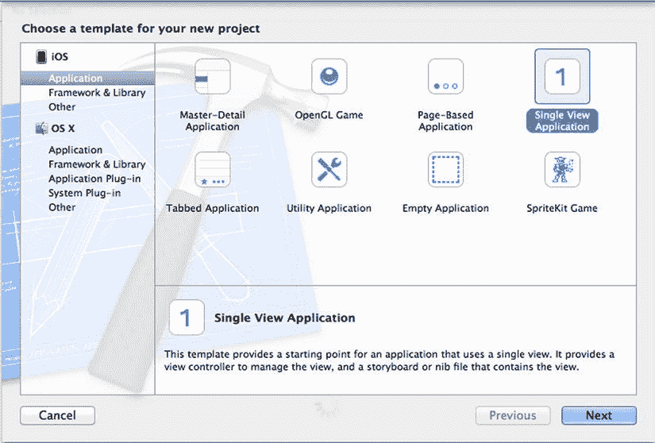
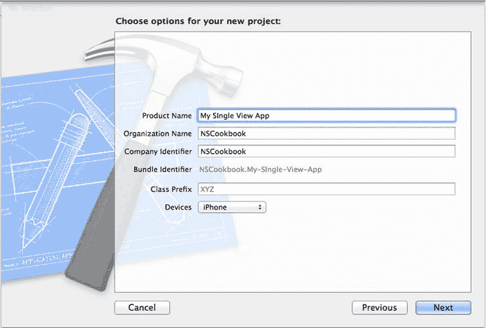
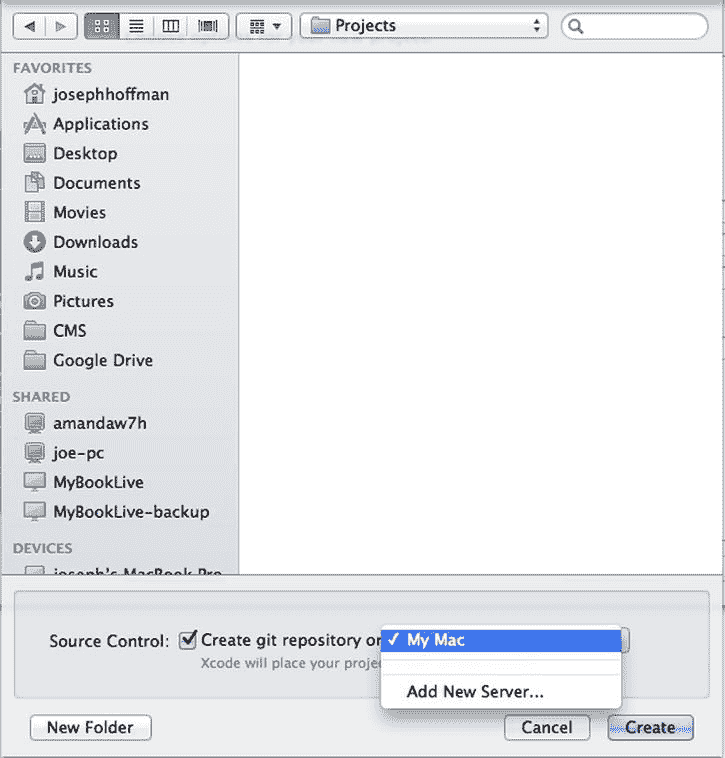
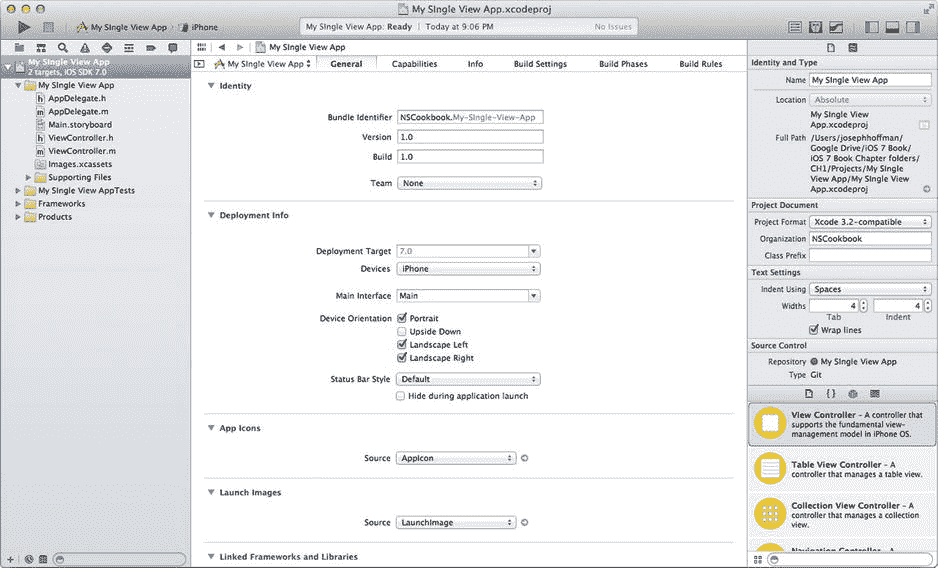
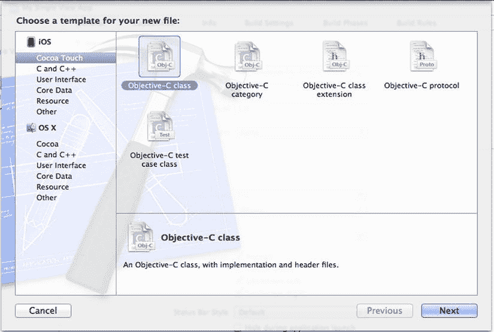
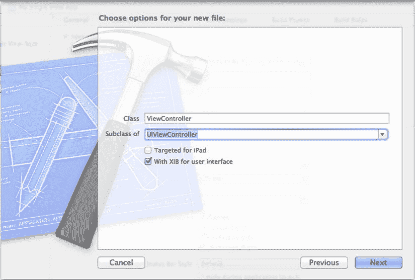
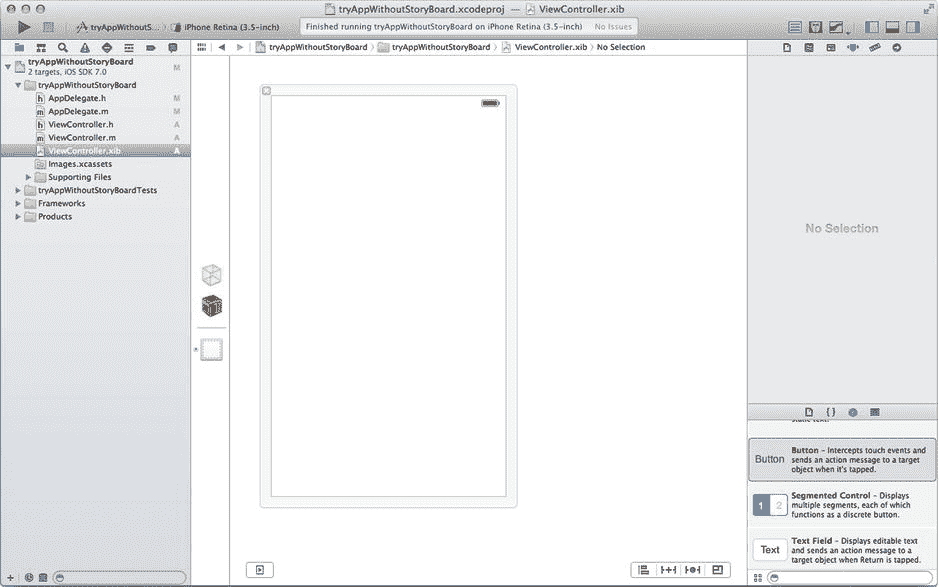
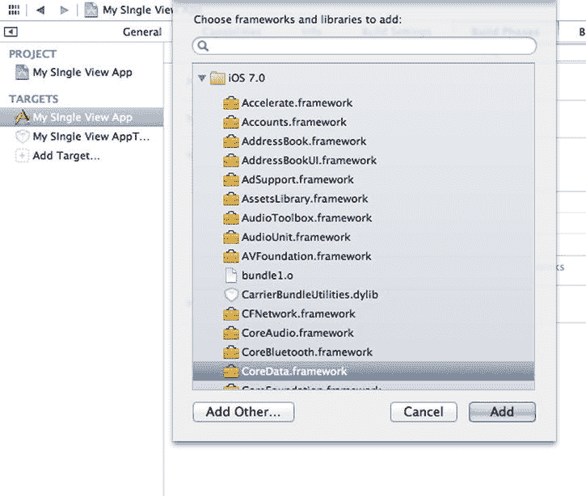
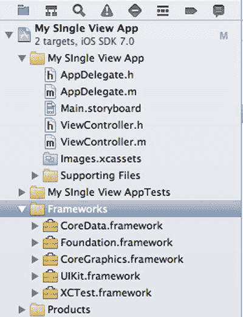

# 应用开发实例

## 摘要

本章既是对为 iOS 创建应用的一次知识回顾，也为完成本书中反复出现的基础任务奠定了基础。前八个实例将引导你完成基本任务，例如设置应用程序、在代码中连接和引用用户界面元素，以及向项目中添加图像和声音文件。你将从本章实例中获得的知识，对于完成本书其他章节的许多任务是必不可少的。

本章的最后四个实例涉及一些精选的实用任务，例如为默认错误和异常处理设置简单的 API、在项目中包含应用程序的“精简”版本，以及让应用启动在用户眼中显得快速而顺畅。在大多数情况下，本书其余部分将不会重复这些任务；然而，我们认为这些知识对于任何开发者来说都是必不可少的。

## 实例 1-1：设置单视图应用程序

本书中的许多实例都是在具有单个视图的测试应用程序中实现的。使用 Xcode 中的“单视图应用程序”模板可以轻松设置此类项目。此模板允许你使用 Storyboard。

Storyboard 是一种构建包含多个场景及其连接关系的界面的方法。在 iOS 5 引入 Storyboard 之前，通常使用 `.xib` 文件来构建单个场景的界面；换句话说，每个场景对应一个 `.xib` 文件。`.xib` 文件之间的连接在代码中处理。虽然你仍然可以使用 `.xib` 文件，但苹果正在推动开发者转而使用 Storyboard。因此，本书大部分内容将使用 Storyboard。

要创建新的单视图应用程序，请转到主菜单并选择“文件” ➤ “新建” ➤ “项目”。这将弹出一个包含可用项目模板的对话框（参见图 1-1）。你需要的模板位于 iOS 部分下的“Application”页面。选择“Single View Application”并点击“下一步”。



**图 1-1.** iOS 应用程序部分中的单视图应用程序模板

为你的应用程序填写一些属性：

*   产品名称，例如 `My Test App`
*   组织名称，可以是你的姓名，除非你已有组织名称
*   公司标识符，最好是你拥有的互联网域名（如果有的话）

如果你愿意，还可以输入一个类前缀，该前缀将应用于你使用 Objective-C 文件模板创建的所有类。如果你想避免将来与第三方代码发生名称冲突，这是一个好主意；但是，如果此应用仅用于测试某项功能，你可以将类前缀项留空。

你还需要指定你的应用程序针对的设备类型：iPad、iPhone 或两者（通用）。如果只是测试，请选择 iPhone 或 iPad。你也可以选择 Universal，但这样模板会生成更多代码，如果你唯一目的是尝试新功能，可能并不需要这些代码。图 1-2 显示了你在项目选项窗口中需要填写的属性。



**图 1-2.** 配置项目

点击“下一步”按钮，然后选择一个用于存储项目的文件夹。请记住，Xcode 会在你选择的文件夹内为项目创建一个新文件夹，因此请选择项目的根文件夹。

将项目置于版本控制之下通常有充分的理由。它允许你检查代码的更改，以便在出现问题时回退到以前的版本，或者只是想查看应用程序的更改历史。Xcode 附带了 Git，这是一个功能丰富的开源版本控制系统，允许多个开发者轻松地同时处理一个项目。要为你项目初始化 Git，请勾选“为此项目创建本地 git 存储库”复选框，如图 1-3 所示。从 Xcode 5 开始，你可以为此存储库指定服务器以及你的 Mac。



**图 1-3.** 选择项目的父文件夹

现在点击“创建”按钮。将为你生成一个包含应用代理、Storyboard 和视图控制器类的应用程序（参见图 1-4）。

至此设置完成，你可以构建并运行该应用程序（此时它仅显示一个空白屏幕）。



**图 1-4.** 一个包含应用代理和视图控制器的基本应用程序

此时，你已经拥有了一个良好的基础，可以在接下来的七个实例中继续构建。


### 另一种方式

是否使用故事板一直是开发者们争论的话题。有些开发者喜爱故事板，而另一些则反感它。作为开发者，你很可能参与一些不使用故事板、或混合使用了`.xib`文件与故事板的项目。我们不会争论故事板的利弊，但许多开发者倾向于认为，故事板在使用版本控制以及多个开发者需要同时编辑同一个故事板时可能会带来困难。有鉴于此，学习`.xib`方法或许会有所裨益。学习这种方法完全可选，如果你愿意，可以直接进入配方 1-2。

要创建一个空应用并添加一个附带`.xib`文件的`ViewController`类，你首先需要创建一个新项目。选择“Empty Application”而不是“Single View Application”（参考图 1-1），然后点击“Next”。

接下来的界面与图 1-2 几乎相同。这次会出现一个名为“Use Core Data”的新复选框。保持其未选中状态，然后点击“Next”。随后，系统会提示你选择保存位置。找到一个合适的位置保存，然后点击“Create”。

创建完这个新的空应用后，你会发现没有`ViewController.m`或`ViewController.h`文件；你需要自行创建它们。点击 Xcode 窗口左下角的“+”号，选择“new file”（见图 1-5）。你也可以按下`Cmd + N`。


图 1-5. 在 Xcode 中创建新文件

接下来，系统会提示你为新文件选择模板。选择“Objective-C class”，如图 1-6 所示。



图 1-6. 在 Xcode 中创建新文件

系统会提示你进行文件选项设置。将新类命名为“ViewController”，并从下拉框中选择“UIViewController”（见图 1-7）。请确保选中“With XIB for user interface”复选框。然后点击“Next”。



图 1-7. 为新文件选择选项

现在你已经创建了该类，需要从左侧的项目导航器中选择`AppDelegate.m`和`AppDelegate.h`文件，然后修改代码，如代码清单 1-1 所示。

**代码清单 1-1.** 向单视图 `AppDelegate.h` 文件添加属性

`AppDelegate.h`

```
#import <UIKit/UIKit.h>

@class ViewController;

#import "ViewController.h"

@interface AppDelegate : UIResponder<UIApplicationDelegate>

@property (strong, nonatomic) UIWindow *window;
@property (strong, nonatomic) ViewController *viewController;

@end
```

`AppDelegate.m`

```
#import "AppDelegate.h"

@implementation AppDelegate

- (BOOL)Application recipes:(UIApplication *)application didFinishLaunchingWithOptions:(NSDictionary *)launchOptions
{
    self.window = [[UIWindowalloc] initWithFrame:[[UIScreenmainScreen] bounds]];
    // Override point for customization after application launch.
    self.viewController = [[ViewControlleralloc] initWithNibName:@"ViewController" bundle:nil];
    self.window.rootViewController = self.viewController;
    [self.windowmakeKeyAndVisible];
    returnYES;
}
```

完成后，你应该得到一个包含单个`.xib`文件的单视图应用，如图 1-8 所示。



图 1-8. 采用`.xib`方法的单视图应用

## 配方 1-2：链接框架

iOS 操作系统由多个框架组成。框架是一个包含支持库所需的代码库和资源的目录。要使用某个框架的功能，你需要将相应的二进制文件链接到你的项目。对于`UIKit`、`Foundation`和`CoreGraphics`框架，Xcode 在创建新项目时会自动完成此操作。然而，许多重要的特性和功能位于诸如`CoreMotion`、`CoreData`、`MapKit`等框架中。对于这些类型的框架，你需要按照以下步骤添加它们：



图 1-9. 添加 Core Data 框架

1. 在 Xcode 项目窗口左侧的项目导航面板中选择项目节点（根节点）（图 1-4）。这将打开项目编辑器面板。
2. 在 Targets 停靠栏中选择目标，如图 1-9 左侧所示。如果你有多个目标，例如单元测试目标，则需要对每个目标执行这些步骤。
3. 导航到 Build Phases 选项卡，展开 Link Binary with Libraries 部分。你会看到当前已链接框架的列表。或者，你也可以滚动到 General 选项卡下的页面底部。
4. 点击列表底部的“Add items (+)”按钮。这会弹出一个可用框架列表。
5. 选择你想要链接的框架，然后使用“Add”按钮将其包含进来（见图 1-9）。

> **提示：** 为了更容易找到特定框架，你可以使用搜索字段来过滤列表。

当你将框架添加到项目时，项目树中会放置一个对应的框架引用节点（见图 1-10）。



图 1-10. 添加框架时，会在项目树的框架组内创建一个引用节点

现在，要在代码中使用这些函数和类，你只需要导入该框架。通常在项目中的头文件（`.h`）中进行此操作，如代码清单 1-2 所示，我们在`ViewController.h`文件中导入了`CoreData`。

**代码清单 1-2.** 导入`CoreData`框架

```
//
//  ViewController.h
//  My Single View App
//

#import <UIKit/UIKit.h>
#import <CoreData/CoreData.h>

@interface ViewController : UIViewController

@end
```

> **注意：** 如果你不知道某个框架的头文件，也不用担心。所有框架的 API 都遵循相同的模式，即 `#import <FrameworkName/FrameworkName.h>`。

在链接了框架二进制文件并导入 API 后，你就可以开始在代码中使用其函数和类了。


