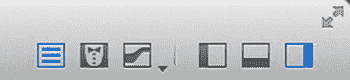
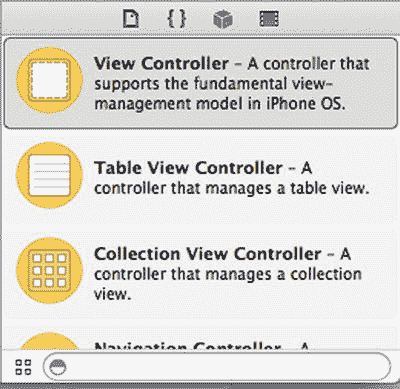
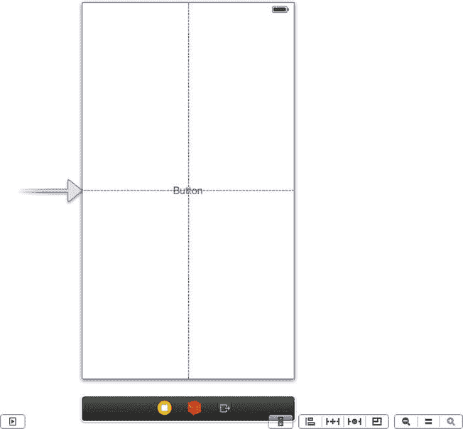
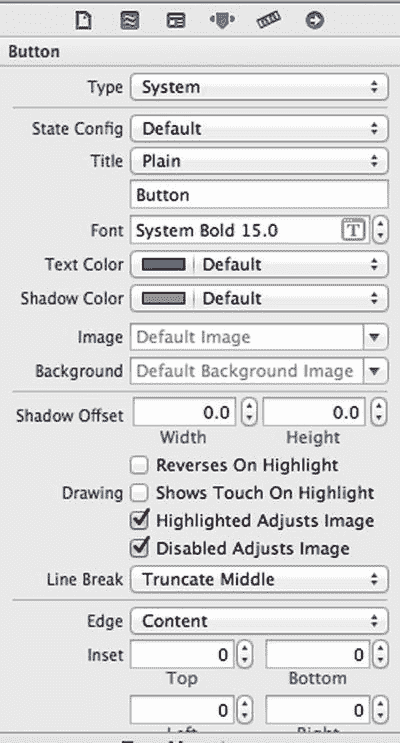

# 食谱 1-3：添加用户界面控件视图

iOS 提供了许多内置控件视图，例如按钮、标签、文本字段等，你可以用它们来构建用户界面。Xcode 通过内置编辑器 Interface Builder 让用户界面设计变得简单。Interface Builder 是一个图形化编辑器，允许你通过拖放组件来编辑 `.xib` 文件和故事板。你只需从对象库中拖出所需的控件，并按你想要的方式在视图中定位它们。该编辑器会通过对齐到标准间距来帮助你制作美观的用户界面。

在本食谱中，我们将向你展示如何向视图中添加一个系统按钮。系统按钮是带有默认 iOS 样式的按钮。我们假设你已经创建了一个单视图应用程序，并准备在其中尝试此操作。

要创建一个新按钮，请选择 `Main.storyboard` 文件以打开故事板。确保“实用工具视图”（右侧面板）可见。如果不可见，请在工具栏中选择相应的按钮（参见图 1-11）。

图 1-11. 隐藏或显示实用工具视图的按钮位于 Xcode 的右上角

确保对象库在实用工具视图（Xcode 右下角）中可见。如果不可见，请单击“显示对象库”按钮（参见图 1-12）。

图 1-12. 对象库包含内置的用户界面控件

现在，在对象库中找到按钮并将其拖到视图中。蓝色引导线将帮助你将其居中，如图 1-13 所示。

图 1-13. 从对象库拖出系统按钮

通过双击按钮或在属性检查器中设置相应属性来更改文本，如图 1-14 所示。在属性检查器中，你还可以更改其他属性，例如颜色或字体。在 iOS 的早期版本中，按钮有边框。Apple 在 iOS 7 中提出的新设计理念则采用了无边框按钮。

图 1-14. 在属性检查器中设置按钮文本

现在你可以构建并运行你的应用程序。你的按钮会显示出来，但点击它不会响应。为此，你需要通过出口和操作将其连接到代码，这是接下来两个食谱的主题。

