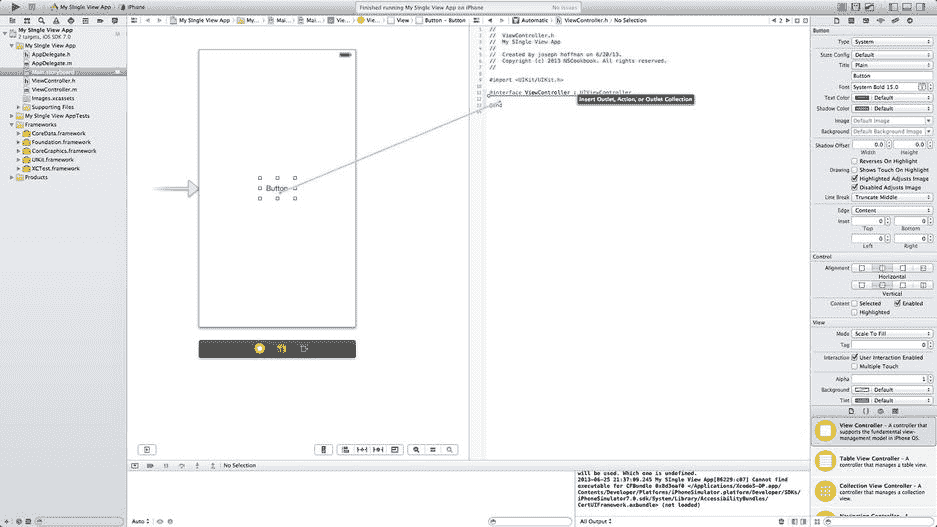
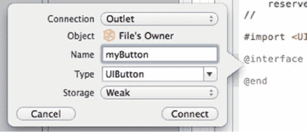
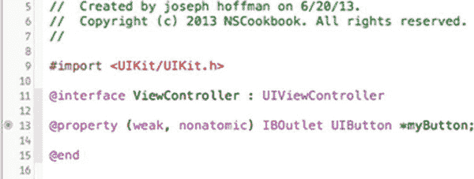
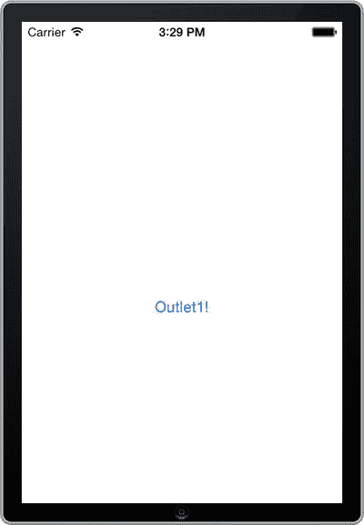

# 食谱 1-4：创建出口

iOS 建立在模型-视图-控制器设计模式之上。其结果之一是视图与操作视图的代码（即所谓的控制器）完全分离。要从视图控制器引用视图，你需要在控制器中创建一个出口，并将其与视图连接起来。出口是一个带注释的属性，它将故事板对象连接到类，以便你可以在代码中引用它。连接出口可以通过多种方式完成，但最简单的方法是使用 Xcode 的助理编辑器。

我们将基于你在食谱 1-3 中的操作，为按钮创建一个出口。虽然本例中被引用的视图是一个按钮，但步骤对于任何其他类型的视图（如标签、文本字段、表格视图等）都是相同的。

要创建出口，请打开 `main.storyboard` 文件，选择包含按钮的视图控制器，然后点击 Xcode 右上角的“助理编辑器”按钮（参见图 1-15）。


图 1-15. 编辑器组中的中间按钮用于激活助理编辑器

激活助理编辑器后，编辑区域会分为两部分，左侧显示 Interface Builder，右侧显示视图控制器的头文件。按住 `Ctrl` 键，同时从按钮拖出一条蓝线到代码窗口。应该会出现一个提示，显示文本"`Insert Outlet, Action, or Outlet Collection`"，如图 1-16 所示。



图 1-16. 使用 Ctrl-拖拽在助理编辑器中创建出口

**注意：** 因为出口实际上只是 Objective-C 属性的一种特殊形式，所以你需要将蓝线拖到代码中可以声明属性的位置；也就是说，位于 `@interface` 和 `@end` 声明之间的某个位置。

在出现的对话框中（如图 1-17 所示），为出口命名。这将是你稍后从代码中引用按钮时使用的属性名称，因此请相应地命名。确保“连接”设置为“Outlet”，并且类型正确（对于系统按钮，应为 `UIButton`）。此外，由于你默认使用 ARC（自动引用计数进行内存管理），出口应始终使用 `Weak` 存储类型。

**注意：** 虽然 Objective-C 属性通常应使用 `Strong` 存储类型，但出口是个例外。具体细节超出了本书的范围，但简而言之，原因与内部内存管理有关；使用 `Weak` 可以让你免于编写一些本需要编写的清理代码。在本书中，我们假设你使用 `Weak` 存储类型来创建出口。



图 1-17. 配置出口

点击“连接”按钮。这样，Xcode 就会创建一个属性并将其与按钮连接起来。你的视图控制器头文件现在应该类似于图 1-18；属性旁边的小点表示它已连接到 `storyboard` 或 `.xib` 文件中的视图。



图 1-18. 连接到故事板中按钮的出口属性

出口现已准备就绪，你可以使用该属性从代码中引用按钮。为了演示这一点，请将代码清单 1-3 中的代码添加到 `ViewController.m` 文件的 `viewDidLoad` 方法中。

**代码清单 1-3.** 演示引用的出口

```
- (void)viewDidLoad
{
    [super viewDidLoad];
    // Do any additional setup after loading the view, typically from a nib.
    [self.myButton setTitle:@"Outlet1!" forState:UIControlStateNormal];
}
```

如果你构建并运行你的应用程序，如图 1-19 所示，按钮的标题现在应该显示为“Outlet1!”，而不是“Click Me!”



图 1-19. 通过出口引用从代码更改按钮标题

下一步是让按钮在被点击时触发某些操作。这就是操作的作用，将是下一个食谱的主题。


