# 食谱 1-5：创建动作

动作是用户界面控件通知代码（通常是视图控制器）用户事件已发生的方式；例如，当按钮被点击或值被更改时。控件通过调用你提供的动作方法来响应此类事件。

在本食谱中，你将基于食谱 1-3 和 1-4 的内容继续构建。接下来的几页将帮助你创建并连接一个动作方法，以接收来自按钮的“Touch Up Inside”事件。然后你添加代码，当用户点击按钮时显示一个警告框。

要创建动作，你的 Xcode 应仍处于助理编辑器模式，同时显示用户界面和头文件。如果不是，请点击图 1-15 所示的按钮使其显示。

按住 Ctrl 键并点击，从按钮拖动一条线到视图控制器的 `@interface` 部分，就像之前创建插座变量时一样。只不过这次将连接类型改为 `Action`，如图 1-20 所示。

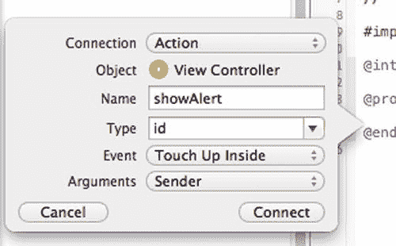

**图 1-20.** 配置动作方法

当你将连接类型设置为 `Action` 时，你会注意到对话框会发生变化，显示一组不同的属性。这些属性与插座变量连接类型不同。（对比图 1-20 和图 1-17。）新属性是 `Type`、`Event` 和 `Arguments`。通常，Xcode 提供的默认值就可以了，但在某些情况下你可能需要更改它们。这三个属性可以简要描述如下：

*   `Type`：发送者参数的类型；即动作的参数输入类型。可以是通用类型 `id`，也可以是特定类型（本例中为 `UIButton`）。通常使用通用类型是个好主意，这样你就可以在其他情况下调用该动作方法，而无需强制提供 `UIButton`（本例中）。
*   `Event`：这是你希望动作方法响应的事件类型。最常见的事件是触摸事件和指示值已更改的事件。有多种触摸事件可供选择。
*   `Arguments`：此属性决定动作方法将具有哪些参数。可能的值如下：
    *   `None`，表示无参数
    *   `Sender`，具有你在 `Type` 属性中输入的类型
    *   `Sender and Event`，一个包含所发生事件附加信息的对象

出于本食谱的目的，将属性分别保留为 `id`、`Touch Up Inside` 和 `Sender`，但将名称输入为 `showAlert`。

> **注意**  
> iOS 中的约定是根据事件触发时将发生的操作来命名动作，而不是采用传达事件类型的名称。选择诸如 `showAlert`、`playCurrentTrack` 和 `shareImage` 之类的名称，而不是 `buttonClicked` 或 `textChanged` 之类的名称。

通过在对话框中点击“Connect”按钮来完成动作的创建。然后 Xcode 会在视图控制器类中创建一个动作方法，并将其与按钮连接起来。你的 `ViewController.h` 文件现在应该如图 1-21 所示。

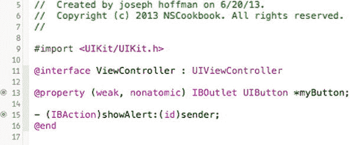

**图 1-21.** 连接到故事板中对象的插座变量和动作

现在你可以实现当用户点击按钮时你想要的响应行为了。在本例中，你显示一个显示“Hello Brother！”的警告视图。将列表 1-4 中的代码添加到你的 `ViewController.h` 文件中。

**列表 1-4.** 实现警告行为

```
@implementation ViewController

// ...

- (IBAction)showAlert:(id)sender

{

UIAlertView *alert = [[UIAlertView alloc] initWithTitle:@"Testing Actions"

message:@"Hello Brother!"

delegate:nil

cancelButtonTitle:@"Dismiss"

otherButtonTitles:nil];

[alert show];

}

@end
```

现在你可以构建并运行应用程序了。当你点击按钮时，应该会看到问候语警告框，如图 1-22 所示。

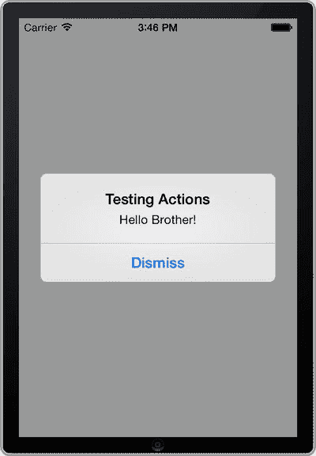

**图 1-22.** 点击按钮时显示警告框的动作方法

有时代码和 `storyboard` 文件会因连接的插座变量和动作不同步而出现问题。通常当你删除代码中的动作方法或插座变量属性并替换为新属性时会发生这种情况。在这些情况下，你会遇到运行时错误。要修复此问题，请在连接检查器中移除 Interface Builder 中的连接。连接检查器位于属性检查器同一窗格中，带有箭头的圆圈下。图 1-23 显示了连接检查器中连接到同一事件的两个动作方法。你可以通过点击旁边的“×”图标来移除残留的动作方法。

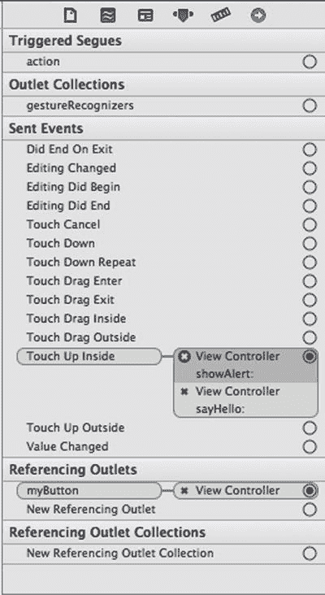

**图 1-23.** 连接到同一事件的两个不同动作方法（`showAlert:` 和 `sayHello:`）的按钮


## 方案 1-6：创建类

在 iOS 编程中，一项常见任务是创建新类。无论你的目标是继承现有类，还是创建一个新的领域模型类来保存数据，都可以使用 Objective-C 类模板来生成必要的文件。

在本方案中，我们将向你展示如何创建新类并将其添加到项目中。如果你没有合适的项目来尝试，请创建一个新的单视图应用程序。

对于新类，请转到项目导航器，选择要存储新类文件的组文件夹。通常，这是与项目同名的组文件夹，但随着应用程序的增长，你可能希望将文件组织到子文件夹中。

转到主菜单并选择 **文件** ➤ **新建** ➤ **文件**（或直接使用快捷键 **Command**+**N**）。然后，在 iOS Cocoa Touch 部分中选择 `Objective-C class` 模板（参见图 1-24）。

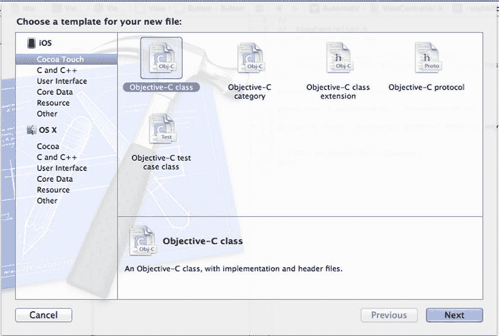

**图 1-24.** 使用 `Objective-C class` 模板创建新类

在下一页中，在类字段中输入 `MyClass`，并从子类的下拉列表中选择 `NSObject`。Objective-C 的约定是使用 PascalCase 风格来命名类。

这里，你正在创建一个名为 `MyClass` 的新类，并将 `NSObject` 作为其父类。`NSObject` 类是通用类的最佳选择，但你可能需要根据自己的需求选择不同类型的父类。例如，如果你想创建一个新的视图控制器，父类应为 `UIViewController`。

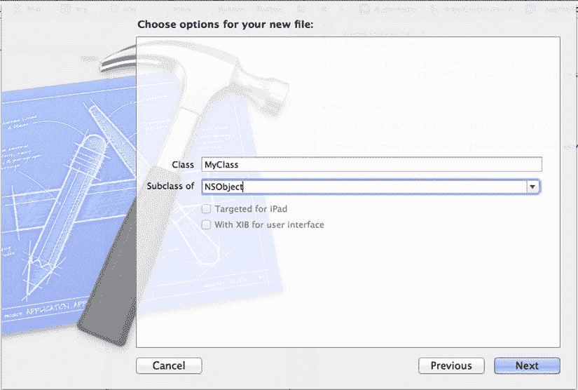

**图 1-25.** 配置新类

> **注意：** 根据你选择的父类，你可能可以设置或无法设置其他设置，例如**针对 iPad 优化**或**附带用于用户界面的 XIB**。如果你继承的是某种视图控制器，这些选项将处于可用状态。

下一步是为你的新类选择硬盘上的物理位置和项目内的逻辑位置；即文件文件夹和组文件夹。在此步骤（参见图 1-26）中，你还可以决定你的类是否应包含在目标（可执行文件）中。这通常是你的期望，但有时你可能希望排除某些文件，例如当你有多个目标（如单元测试目标）时。

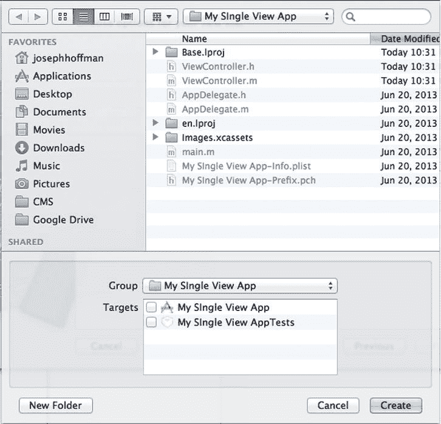

**图 1-26.** 为类选择物理位置（文件文件夹）和逻辑位置（组文件夹）

大多数情况下，你可以直接接受位置的默认值，因此，请继续并点击**创建**。Xcode 随后会为你的项目生成两个新文件：`MyClass.h` 和 `MyClass.m`。它们包含一个空类的代码，如清单 1-5 和清单 1-6 所示的头文件和实现文件。

**清单 1-5.** 新类的头文件

```
//
//  MyClass.h
//  My App
//
#import <Foundation/Foundation.h>

@interface MyClass : NSObject

@end
```

**清单 1-6.** 新类的实现文件

```
//
//  MyClass.m
//  My App
//
#import "MyClass.h"

@implementation MyClass

@end
```

## 方案 1-7：添加 Info.plist 属性

iOS 平台使用一个名为 `Info.plist` 的特殊文件来存储应用程序范围的属性。该文件位于项目的 **Supporting Files** 文件夹中，其命名方式为项目名称后跟 `-Info.plist` 后缀。文件格式为 XML，但你可以在 Xcode 的属性列表编辑器中更方便地编辑值，如图 1-27 所示。

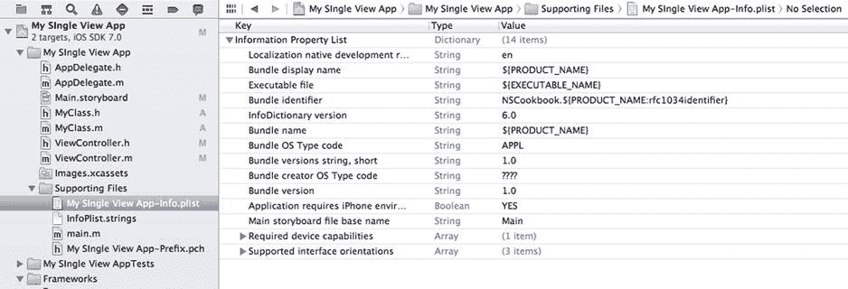

**图 1-27.** Xcode 中的 `.plist` 编辑器

属性列表文件的结构是：根元素是一个字典，包含由字符串键标识的值。这些值通常是字符串，但也可能是其他类型，例如布尔值、日期、数组，甚至是字典。

如果你在项目导航器中选择 `Info.plist`，你会看到它已经包含了几项。这些是最常用的键。然而，有时你需要添加一个默认情况下不包含的值，例如，如果你的应用使用了定位服务，并且你想要设置 `NSLocationUsageDescription` 属性。

请按照以下步骤添加新的应用程序属性键和值：

1. 展开项目导航器中的 **Supporting Files** 文件夹。
2. 选择文件 `<应用程序名称>-Info.plist`。这会打开属性列表编辑器。
3. 选择根项目，即**信息属性列表**。
4. 按下 **Return** 键。Xcode 会向字典中添加一个新行。
5. 输入属性的键标识符，或从呈现给你的列表中选择一个。请注意，如果你输入一个标识符且 Xcode 将其识别为标准属性，它会显示一个更具描述性的键。例如，`NSLocationUsageDescription` 在按下 **Return** 后变成了**隐私 - 定位使用说明**。不过，在后台，实际存储的是你输入的那个标识符。
6. 如果属性键未在 iOS 中定义（例如，你自己的自定义键），你可以更改属性类型。只需点击**类型**列中的类型，将显示一个可能值的列表。
7. 通过双击新行的值列并输入新值，为键输入一个值。


## 配方 1-8：添加资源文件

大多数应用都需要访问资源文件，例如图片或声音文件。通过将这些文件添加到项目中，然后通过它们的名称进行引用，即可实现这一功能。在本配方中，你将向项目中添加一个图片文件，并用它来填充一个图片视图。虽然本例中使用的是图片文件，但其他类型的文件处理流程完全相同。

像往常一样，你需要一个单视图项目来进行尝试。如果你还没有合适的项目，请先创建一个。

导入文件的最佳方法是将其从 Finder、iPhoto 或任何其他支持文件拖拽的应用程序中直接拖入。将你喜欢的图片文件拖入 Xcode 的项目导航器中。资源文件放在 `Supporting Files` 分组文件夹中是个好地方，但你也可以将其添加到项目中的任何分组文件夹内。

注意

你也可以使用“文件”➤“将文件添加到我的应用”菜单项，向项目添加资源文件。

在出现的对话框中，务必勾选“将项目复制到目标组的文件夹中（如果需要）”复选框，如图 1-28 所示。这可以确保即使你将项目移动到其他位置，图片也会保留在项目中。

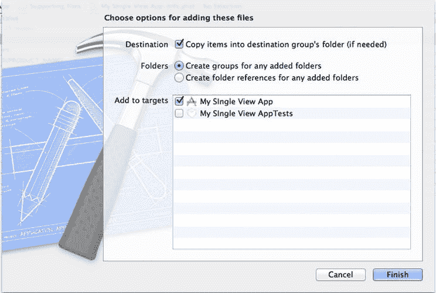

图 1-28. 添加文件时，选中“复制项目”复选框

如图 1-29 所示，你的图片现在已成为项目的一部分，并可以通过其文件名进行引用。

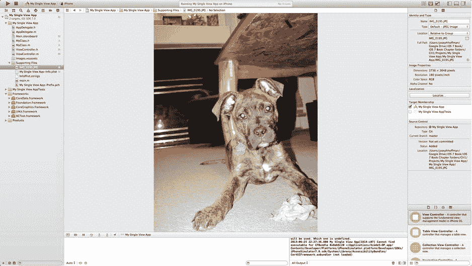

图 1-29. 嵌入了图片文件的应用

要查看如何在应用中引用该图片，请向用户界面添加一个图片视图，并使其填充整个视图。确保选中该图片视图，然后转到属性检查器，通过从图片属性的下拉菜单中选择你的文件，将其连接到你的图片文件。你可能还应该将 `Mode` 属性更改为 Aspect Fill，否则图片可能会看起来被拉伸。如果你是从配方 1-1 一路跟过来的，之前创建的按钮现在可能被图片视图遮住了。要将图片视图置于底层，请选中该图片视图，然后从文件菜单中选择“编辑器”➤“排列”➤“置于底层”。如有必要，将按钮移动到照片中颜色较浅、更易看清的区域。

你的应用现在应该与图 1-30 中的类似。

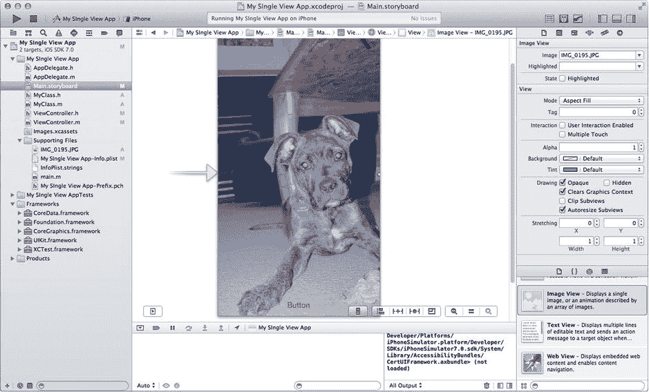

图 1-30. 一个包含图片视图、引用嵌入式图片文件的用户界面

### 使用资源目录

处理图标和按钮的一个好方法是使用新的 Xcode 资源目录功能。处理多种设备时遇到的问题在于屏幕分辨率可能会发生变化，例如 Retina 与非 Retina iPhone 的区别。为了让应用在这两种设备上都能有良好表现，每件艺术作品都需要提供 1x 和 2x 两种分辨率的副本。资源目录会为你组织这些不同分辨率的副本，因此你只需通过一个名称来引用它。

在你的项目导航器中，你会看到一个名为 `images.xcassets` 的文件。选中该文件；你应该会在 Xcode 的编辑器窗口中看到一个界面，如图 1-31 所示。这里你会看到两个图片集，一个用于应用图标，一个用于启动图片。

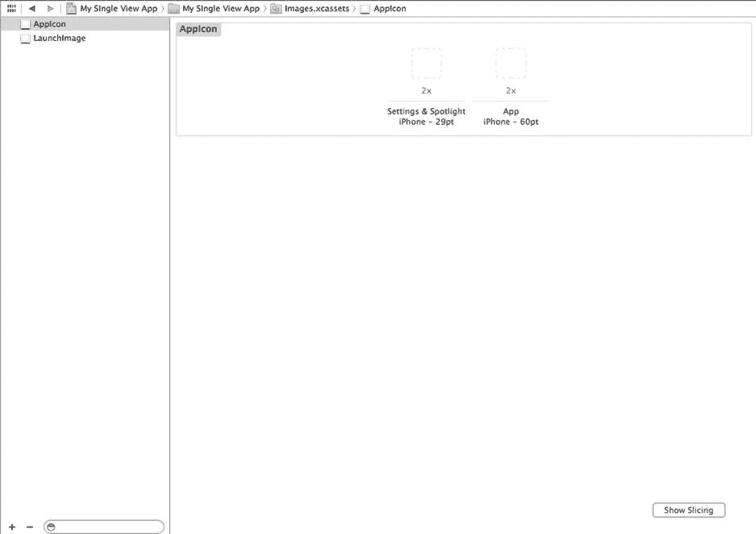

图 1-31. 通过在项目导航器中选择 `image.xcassets` 看到的图片资源文件

要创建一个图片集，请点击编辑器屏幕左下角的 `+` 按钮，并选择“New Image Set”（新建图片集），如图 1-32 所示。

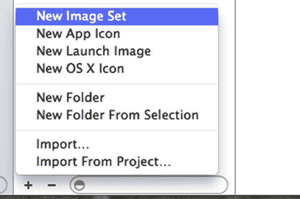

图 1-32. 创建一个新的图片集

一旦使用通用名称创建了新的图片集，双击该名称即可重命名图片集。现在你会注意到，你有了一个位置可以放入 1x 和 2x 两种分辨率的图片到图片集中，如图 1-33 所示。

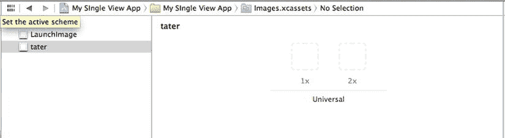

图 1-33. 一个新创建的图片集

只需从你的 Finder 中拖拽图片，放入 1x 或 2x 图片占位框中即可添加图片。这些图片必须是`.PNG`文件，否则你将无法将它们添加到资源目录中。选择“完成”，你的图片集应该会显示图片，而不是占位符。

## 配方 1-9：处理错误

应用处理错误的好坏，很可能直接决定用户体验上的成败。尽管如此，错误处理却是软件开发中经常被忽视的部分，iOS 应用也不例外。那些在崩溃时不给出任何解释，或者静默失败并出现各种奇怪行为的应用并不少见。

你应该多花一点时间来处理错误，以确保正确无误。和所有乏味的事情一样，最好立即着手处理。为了让这项工作更容易，你可以创建一个默认的错误处理器——一段可以处理大部分错误的统一代码。

本配方将向你展示如何设置一个简单的错误处理器，它会根据你提供的错误对象，向用户发出警告，甚至在可用时为用户提供恢复选项。


### 建立错误处理框架

按照 iOS 的惯例，致命且不可恢复的错误使用异常来实现。但对于可能可恢复的错误，则采用更传统的方法：使用布尔返回值和一个包含错误详情信息的输出参数。清单 1-7 展示了在 Core Data 的 `NSManagedObjectContext:save:` 方法中应用此模式的示例。

**清单 1-7.** 处理可能可恢复错误的模式

```
NSError *error = nil;
if ([managedObjectContext save:&error] == NO)
{
    NSLog(@"未处理的错误:\n%@, %@", error, [error userInfo]);
}
```

上述示例中的错误处理将错误详情转储到标准输出，然后像什么都没发生一样静默继续执行。显然，这种方法相当拙劣，从用户体验角度来看也并非最佳策略。

对于本篇指南，我们将构建一个小型框架，帮助你以与上述代码同样的便利性处理错误，但能提供更好的用户体验。完成后，你的错误处理代码将如清单 1-8 所示。

**清单 1-8.** 使用框架处理可能可恢复错误的更好方法

```
NSError *error = nil;
if ([managedObjectContext save:&error] == NO)
{
    [ErrorHandler handleError:error fatal:NO];
}
```

让我们为内部错误处理框架搭建基础结构。首先创建一个新的单视图应用程序项目。在此新项目中，创建一个继承自 `NSObject` 的新类文件。将新类命名为 `ErrorHandler`。打开 `ErrorHandler.h` 并添加清单 1-9 中所示的声明。

**清单 1-9.** 为 `handleErrors:fatal:` 类方法添加声明

```
//
//  ErrorHandler.h
// Default Error Handling
//
#import <Foundation/Foundation.h>
@interface ErrorHandler : NSObject
+(void)handleError:(NSError *)error fatal:(BOOL)fatalError;
@end
```

清单 1-9 中 `handleError:fatal:` 方法旁边的 “`+`” 表示这是一个类方法。这意味着你无需创建类的实例即可调用它。

现在，只需在 `ErrorHandler.m` 文件中为该类方法添加一个空存根（即一个空白的方法实现）。这个未完成的方法如清单 1-10 所示。如果没有这个存根，Xcode 会因实现不完整而发出警告。

**清单 1-10.** 为 `handleErrors:fatal:` 类方法创建存根

```
//
//  ErrorHandler.m
// Default Error Handling
//
#import "ErrorHandler.h"
@implementation ErrorHandler
+(void)handleError:(NSError *)error fatal:(BOOL)fatalError
{
    // TODO: 处理错误
}
@end
```

在实现清单 1-10 所示的方法之前，你需要设置用于测试它的代码。你将创建一个简单的用户界面，包含两个按钮，分别模拟非致命错误和致命错误。完成后，你将返回并完善此方法。

打开 `Main.storyboard` 并选择主视图。从对象库中拖出两个按钮，使其外观类似于图 1-34 中的按钮。

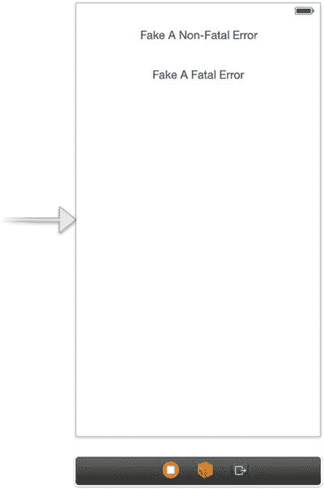

**图 1-34.** 模拟错误并调用错误处理方法的按钮

按照指南 1-5 中的方法，为“模拟非致命错误”和“模拟致命错误”这两个按钮创建操作。分别使用以下名称：

- `fakeNonFatalError`
- `fakeFatalError`

确保在视图控制器的头文件中导入 `ErrorHandler.h`。此时 `ViewController.h` 应类似于清单 1-11 中的代码。

**清单 1-11.** 包含导入语句和两个操作的 `ViewController.h` 文件

```
//
//  569ViewController.h
//  Recipe 1-10: Default Error Handling
//
#import <UIKit/UIKit.h>
#import "ErrorHandler.h"
@interface ViewController : UIViewController
- (IBAction)fakeNonFatalError:(id)sender;
- (IBAction)fakeFatalError:(id)sender;
@end
```

现在，切换到 `ViewController.m` 并添加清单 1-12 中所示 `fakeNonFatalError:` 操作方法的具体实现。它简单地创建一个带有单一恢复选项（重试）的虚假 `NSError` 对象。然后将该错误对象连同非致命错误的标志（意味着它不应导致应用程序关闭）一起传递给错误处理类。

**清单 1-12.** 实现 `fakeNonFatalError:` 操作方法

```
- (IBAction)fakeNonFatalError:(id)sender
{
    NSString *description = @"连接错误";
    NSString *failureReason = @"似乎无法建立连接。";
    NSArray *recoveryOptions = @[@"重试"];
    NSString *recoverySuggestion = @"请检查你的 Wi-Fi 设置并重试。";
    NSDictionary *userInfo =
    [NSDictionary dictionaryWithObjects:
     @[description, failureReason, recoveryOptions, recoverySuggestion, self]
                                forKeys:
     @[NSLocalizedDescriptionKey,NSLocalizedFailureReasonErrorKey,
       NSLocalizedRecoveryOptionsErrorKey, NSLocalizedRecoverySuggestionErrorKey,
       NSRecoveryAttempterErrorKey]];
    NSError *error = [[NSError alloc] initWithDomain:@"NSCookbook.iOS7recipesbook"code:42
                                            userInfo:userInfo];
    [ErrorHandler handleError:error fatal:NO];
}
```

我们不会解释所有内容，但需要指出的是，你为此虚假错误构建的 `userInfo` 字典包含了键 `NSRecoveryAttempterErrorKey`，其值设置为 `self`。这意味着该视图控制器充当此错误的恢复尝试者对象。出于后续将明确的某些原因，你需要实现 `NSRecoveryAttempting` 协议中的一个方法，即 `attemptRecoveryFromError:optionIndex:`。该方法会在你稍后实现的恢复尝试中被调用。为满足本篇指南的目的，你只需通过返回 `NO` 来模拟一次失败的恢复尝试，如清单 1-13 所示。

**清单 1-13.** 在 `attemptRecoveryFromError:` 方法中通过返回 `NO` 模拟失败的恢复尝试

```
- (BOOL)attemptRecoveryFromError:(NSError *)error optionIndex:(NSUInteger)recoveryOptionIndex
{
    return NO;
}
```

接下来，实现 `fakeFatalError:` 操作方法。它创建一个更简单的、没有恢复选项的错误，但在错误处理方法中将此错误标记为致命错误。具体实现如清单 1-14 所示。

**清单 1-14.** 实现 `fakeFatalError:` 操作方法

```
- (IBAction)fakeFatalError:(id)sender
{
    NSString *description = @"数据错误";
    NSString *failureReason = @"数据已损坏。应用程序必须关闭。";
    NSString *recoverySuggestion = @"请联系支持！";
    NSDictionary *userInfo = [NSDictionary dictionaryWithObjects:
                              @[description, failureReason,recoverySuggestion]
                                                         forKeys:
                              @[NSLocalizedDescriptionKey, NSLocalizedFailureReasonErrorKey,NSLocalizedRecoverySuggestionErrorKey]];
    NSError *error = [[NSError alloc] initWithDomain:@"NSCookbook.iOS7recipesbook"
                                                code:22 userInfo:userInfo];
    [ErrorHandler handleError:error fatal:YES];
}
```

现在，你已经建立了默认错误处理 API 的接口并了解了测试方法，可以开始实现实际的错误处理逻辑了。


### 通知用户

一个体面的默认错误处理方法至少应该做到通知用户发生了错误。切换回`ErrorHandler.m`文件，将代码清单 1-15 中的代码添加到你在代码清单 1-10 中创建的`handleError:fatal:`方法存根中。

**代码清单 1-15.** 向`handleError: fatal`方法添加通知以提醒用户发生错误

```
+(void)handleError:(NSError *)error fatal:(BOOL)fatalError
{
    NSString *localizedCancelTitle = NSLocalizedString(@"Dismiss", nil);
    if (fatalError)
        localizedCancelTitle = NSLocalizedString(@"Shut Down", nil);

    // 通知用户
    UIAlertView *alert = [[UIAlertView alloc] initWithTitle:[error localizedDescription]
                                                    message:[error localizedFailureReason]
                                                   delegate:nil
                                          cancelButtonTitle:localizedCancelTitle
                                          otherButtonTitles:nil];
    [alert show];

    // 记录到标准输出
    NSLog(@"未处理的错误:\n%@, %@", error, [error userInfo]);
}
```

现在你可以构建并运行应用程序，看看效果如何。先试着点击非致命错误按钮，应该会显示一个类似图 1-35 中的警告框。

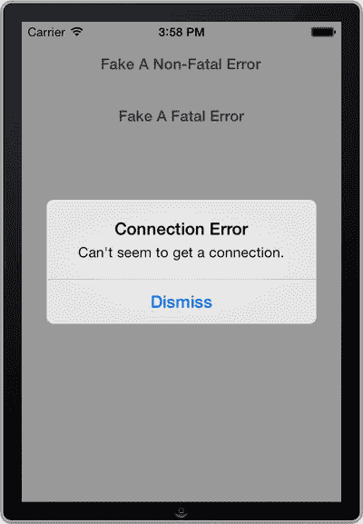

**图 1-35.** 显示虚假错误的警告框

如果你点击模拟致命错误的按钮，你会看到一个类似的警告框。然而，对于标记为致命的错误，你希望在通知用户后应用程序自动关闭。现在让我们来实现这个功能。

首先，我们要为警告视图提供一个委托。委托是一种设计模式，其中一个对象（委托）代表另一个对象（委托对象）行事。代表另一对象行动的对象可以向委托对象发送消息，以便委托对象据此做出相应动作。

通过委托，你可以拦截用户关闭警告视图的时刻。这样，你就可以在此处中止执行。将代码添加到`handleError:fatal:`方法中，如代码清单 1-16 所示。此时你的代码将无法编译，但别担心——我们很快会解决这个问题。

**代码清单 1-16.** 添加委托以拦截警告视图的关闭

```
+(void)handleError:(NSError *)error fatal:(BOOL)fatalError
{
    NSString *localizedCancelTitle = NSLocalizedString(@"Dismiss", nil);
    if (fatalError)
        localizedCancelTitle = NSLocalizedString(@"Shut Down", nil);

    // 通知用户
    ErrorHandler *delegate = [[ErrorHandler alloc] initWithError:error fatal:fatalError];
    if (!retainedDelegates) {
        retainedDelegates = [[NSMutableArray alloc] init];
    }
    [retainedDelegates addObject:delegate];

    UIAlertView *alert = [[UIAlertView alloc] initWithTitle:[error localizedDescription]
                                                    message:[error localizedFailureReason]
                                                   delegate:delegate
                                          cancelButtonTitle:localizedCancelTitle
                                          otherButtonTitles:nil];
    [alert show];

    // 记录到标准输出
    NSLog(@"未处理的错误:\n%@, %@", error, [error userInfo]);
}
```

`retainedDelegates`这个技巧需要一些解释。警告视图的委托属性是一个所谓的弱引用。这意味着，如果所有其他对该委托的引用都被释放，它不会阻止委托被释放。

为了防止委托被过早释放（由 ARC 执行），你将使用一个静态数组。只要委托是`retainedDelegates`数组的成员，就会保持一个强引用来确保委托存活。正如你稍后将看到的，一旦委托的任务完成，它会将自己从数组中移除，从而允许自己被释放。

将`retainedDelegates`数组的声明添加到`ErrorHandler`类的`@implementation`块顶部，如代码清单 1-17 所示。

**代码清单 1-17.** 向`ErrorHandler.m`的`@implementation`块添加`retainedDelegates`声明

```
//
//  ErrorHandler.m
//  Recipe 1-10 Default Error Handling
//

#import "ErrorHandler.h"

@implementation ErrorHandler

static NSMutableArray *retainedDelegates = nil;

// ...

@end
```

现在，再次打开`ErrorHandler.h`文件，添加代码清单 1-18 所示的代码。

**代码清单 1-18.** 声明`UIAlertView`委托

```
//
//  ErrorHandler.h
//  Recipe 1-10: Default Error Handling
//

#import <Foundation/Foundation.h>

@interface ErrorHandler : NSObject <UIAlertViewDelegate>

@property (strong, nonatomic) NSError *error;
@property (nonatomic) BOOL fatalError;

- (id)initWithError:(NSError *)error fatal:(BOOL)fatalError;
+ (void)handleError:(NSError *)error fatal:(BOOL)fatalError;

@end
```

代码清单 1-18 将`ErrorHandler`类变成了一个警告视图委托。当然，你也可以为此目的创建一个新类，但这种方法更简单一些。

现在，切换到`ErrorHandler.m`并实现`initWithError:`方法，如代码清单 1-19 所示。

**代码清单 1-19.** 向`ErrorHandler.m`文件添加`initWithError:`方法

```
- (id)initWithError:(NSError *)error fatal:(BOOL)fatalError
{
    self = [super init];
    if (self) {
        self.error = error;
        self.fatalError = fatalError;
    }
    return self;
}
```

最后，实现`clickedButtonAtIndex:`委托方法，以便在发生致命错误时中止。从下面的代码可以看出，你还通过从`retainedDelegates`数组中移除委托来释放它，如代码清单 1-20 所示。

**代码清单 1-20.** 实现`clickedButtonAtIndex:`委托方法

```
- (void)alertView:(UIAlertView *)alertView clickedButtonAtIndex:(NSInteger)buttonIndex
{
    if (self.fatalError) {
        // 如果是致命错误，中止执行
        abort();
    }

    // 任务完成，释放此委托
    [retainedDelegates removeObject:self];
}
```

如果现在重新运行应用程序并点击“模拟致命错误”按钮，那么当你点击“关闭”按钮关闭错误消息后，应用程序将立即中止执行（见图 1-36）。

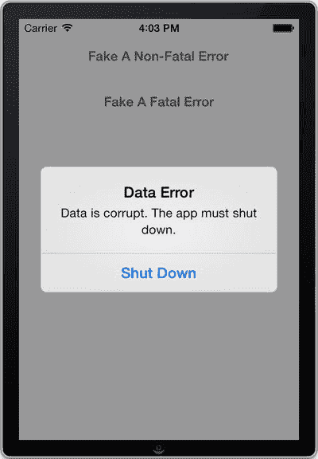

**图 1-36.** 显示模拟致命错误的警告视图

通知用户并记录错误，是我们在处理意外错误时至少应该做的事情，因此到目前为止你实现的代码是默认错误处理方法的一个很好的候选方案。但是，`NSError`类还有一个你应该支持的特性：恢复选项。


### 实现恢复选项

`NSError` 为通知方法提供了一种提供自定义恢复选项的方式。例如，某个用于建立某种连接的方法，在超时失败时可能会提供一个“重试”选项。

`NSObject` 的 `localizedRecoveryOptions` 数组保存了由调用方法定义的可用的恢复选项标题。此外，`localizedRecoverySuggestion` 属性可用于向用户提供如何处理错误的提示。这些选项标题以及恢复建议都适合直接与用户沟通，例如在警告视图中。

`NSError` 恢复功能的最后一部分是 `recoveryAttempter` 属性。它引用了一个符合 `NSErrorRecoveryAttempting` 非正式协议的对象，你将使用该对象来调用特定的恢复操作。

让我们将这些信息整合到 `handleError:fatalError:` 方法中，如代码清单 1-21 所示。

**代码清单 1-21.** 为 `handleError:fatal:` 方法添加恢复选项

```
+(void)handleError:(NSError *)error fatal:(BOOL)fatalError

{

NSString *localizedCancelTitle = NSLocalizedString(@"Dismiss", nil);

if (fatalError)

localizedCancelTitle = NSLocalizedString(@"Shut Down", nil);

// 通知用户

ErrorHandler *delegate = [[ErrorHandler alloc] initWithError:error fatal:fatalError];

if (!retainedDelegates) {

retainedDelegates = [[NSMutableArray alloc] init];

}

[retainedDelegates addObject:delegate];

UIAlertView *alert = [[UIAlertView alloc] initWithTitle:[error localizedDescription]

message:[error localizedFailureReason]

delegate:delegate

cancelButtonTitle:localizedCancelTitle

otherButtonTitles:nil];

if ([error recoveryAttempter])

{

// 将恢复建议附加到错误消息中

alert.message = [NSString stringWithFormat:@"%@\n%@", alert.message,

error.localizedRecoverySuggestion];

// 为恢复选项添加按钮

for (NSString * option in error.localizedRecoveryOptions)

{

[alert addButtonWithTitle:option];

}

}

[alert show];

// 记录到标准输出

NSLog(@"Unhandled error:\n%@, %@", error, [error userInfo]);

}
```

代码清单 1-21 中添加的代码会检查是否存在 `recoveryAttempter` 对象。如果存在，则添加恢复建议以及相应的按钮。

通过进行代码清单 1-22 所示的更改，在 `alertView:clickedButtonAtIndex:` 方法中实现实际的恢复尝试。

**代码清单 1-22.** 处理警告按钮点击事件

```
-(void)alertView:(UIAlertView *)alertView clickedButtonAtIndex:(NSInteger)buttonIndex

{

if (buttonIndex != [alertView cancelButtonIndex])

{

NSString *buttonTitle = [alertView buttonTitleAtIndex:buttonIndex];

NSInteger recoveryIndex = [[self.error localizedRecoveryOptions]

indexOfObject:buttonTitle];

if (recoveryIndex != NSNotFound)

{

if ([[self.error recoveryAttempter] attemptRecoveryFromError:self.error

optionIndex:recoveryIndex] == NO)

{

// 恢复尝试失败，重新显示警告

[ErrorHandler handleError:self.error fatal:self.fatalError];

}

}

}

else

{

// 点击了取消按钮

if (self.fatalError)

{

// 如果是致命错误，终止执行

abort();

}

}

// 任务完成，释放此委托

[retainedDelegates removeObject:self];

}
```

在代码清单 1-22 中，你处理了用户点击“重试”按钮的情况。如果点击此按钮，它将重试任务，如果再次失败，则重新显示警告。当然，由于你创建了这个错误，它总会失败，但在实际应用中，这个错误可能会被清除。例如，在获取连接的情况下，一旦连接建立，错误可能就会被清除。

现在你已经完成了默认的错误处理方法。要测试这最后一个特性，请构建并运行应用，再次点击“模拟一个非致命错误”按钮。这次，错误警告应类似于图 1-37 所示。

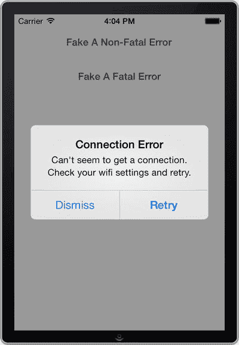

**图 1-37.** 带有“重试”选项的错误警告

现在你有了一个便捷的默认错误处理方法，它从 `NSError` 对象中提取信息，并执行以下操作：

- 向用户发出警告
- 如果可用，为用户提供恢复选项
- 将错误记录到标准错误输出

在下一个方法中，我们将展示如何以同样简便的方式处理异常。

## 方法 1-10：处理异常

在 iOS 中，按照惯例，异常保留用于不可恢复的错误。当引发异常时，它最终应导致程序终止。因此，iOS 应用很少在内部捕获异常，而是让默认的异常处理方法处理它们。

默认的异常处理方法会捕获所有未捕获的异常，将一些调试信息写入控制台，然后终止程序。尽管这是处理 iOS 异常的安全方式，但这种方法存在严重的可用性问题。由于实际设备上看不到控制台，应用在用户手中就这样消失了，没有任何解释。

本方法将向你展示如何既保持一个在大多数情况下都能安全运行的异常处理方法，又能稍微改善用户体验。

### 处理异常的策略

作为通用策略，在未捕获异常时终止应用是一个好的解决方案，因为它安全，并且可以防止数据损坏等不良事件发生。然而，我们希望对 iOS 的默认异常处理进行一些改进。

我们首先要做的是通知用户存在未捕获异常。从用户的角度来看，最好是在异常发生时，就在程序终止之前进行通知。然而，此时程序可能由于致命错误（如内存不足或指针错误）而在恶劣环境中运行。在这种情况下，应避免执行复杂的操作，例如用户界面编程。

一个良好的折中方案是记录错误，并在下次应用启动时通知用户。为了实现这一点，你需要拦截未捕获的异常，并设置一个在两次会话之间持久存在的标志。

### 设置测试应用

与上一个方法一样，你将设置一个测试应用来尝试这个方案。首先，创建一个新的单视图应用。然后向主视图添加一个按钮，使其看起来类似于图 1-38。

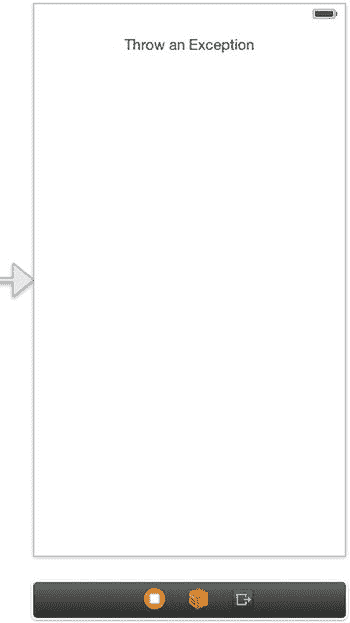

**图 1-38.** 用于抛出虚假异常的按钮

为按钮添加一个名为 `throwFakeException` 的操作，并按代码清单 1-23 所示实现它。

**代码清单 1-23.** 实现 `throwFakeException:` 方法

```
- (IBAction)throwFakeException:(id)sender

{

    NSException *e = [[NSException alloc] initWithName:@"FakeException"

reason:@"The developer sucks!" userInfo:[NSDictionary dictionaryWithObject:@"Extra info"

forKey:@"Key"]];

    [e raise];

}
```

测试代码就绪后，你可以继续实现异常处理部分。


### 拦截未捕获的异常

在 iOS 中拦截未捕获异常的方法是通过 `NSSetUncaughtException` 函数注册一个处理程序。该处理程序是一个 void 函数，其唯一参数是一个 `NSException` 引用，如代码清单 1-24 所示。

**代码清单 1-24.** 异常处理程序示例

```
void myExceptionHandler(NSException *exception)
{
    // 处理异常
}
```

您将要实现的异常处理程序应设置一个标志，告知应用在上一次运行时发生了异常。为此，您将使用 `NSUserDefaults`，它专用于在应用会话之间持久化设置。现在，在 `AppDelegate.m` 文件中，添加代码清单 1-25 所示的方法。

**代码清单 1-25.** 添加一个方法，用于在最后一次运行发生错误时在 `NSUserDefaults` 中设置标志

```
void exceptionHandler(NSException *exception)
{
    // 设置标志
    NSUserDefaults *settings = [NSUserDefaults standardUserDefaults];
    [settings setBool:YES forKey:@"ExceptionOccurredOnLastRun"];
    [settings synchronize];
}
```

接下来，在 `Application recipes:didFinishLaunchingWithOptions:` 方法中注册异常处理程序，如代码清单 1-26 所示。

**代码清单 1-26.** 注册异常处理程序

```
-(BOOL)Application recipes:(UIApplication *)application
didFinishLaunchingWithOptions:(NSDictionary *)launchOptions
{
    NSSetUncaughtExceptionHandler(&exceptionHandler);
    // 正常设置代码
    // ...
}
```

接下来要做的，是在 `Application recipes:didFinishLaunchingWithOptions:` 中添加一个自检逻辑，以查看上一个会话是否因异常而结束。如果是，您的应用应重置该标志，并通过一个警告视图通知用户。在注册处理程序的那行代码之前添加此代码，如代码清单 1-27 所示。

**代码清单 1-27.** 检查异常标志是否已设置，并通过警告视图进行处理

```
- (BOOL)Application recipes:(UIApplication *)application didFinishLaunchingWithOptions:(NSDictionary *)launchOptions
{
    // 默认的异常处理代码
    NSUserDefaults *settings = [NSUserDefaults standardUserDefaults];
    if ([settings boolForKey:@"ExceptionOccurredOnLastRun"])
    {
        // 重置异常发生标志
        [settings setBool:NO forKey:@"ExceptionOccurredOnLastRunKey"];
        [settings synchronize];
        // 通知用户
        UIAlertView *alert = [[UIAlertView alloc] initWithTitle:@"抱歉"
            message:@"上一次运行时发生了一个错误。" delegate:nil
            cancelButtonTitle:@"忽略" otherButtonTitles:nil];
        [alert show];
    }
    NSSetUncaughtExceptionHandler(&exceptionHandler);
    // ...
}
```

现在，您已经搭建好了改进后的默认处理方法的基本结构。如果您现在运行应用并点击按钮触发一个伪异常，您的应用将会终止。但是，如果您再次启动它，将会看到一个警告，如图 1-39 所示，通知您之前发生的错误。

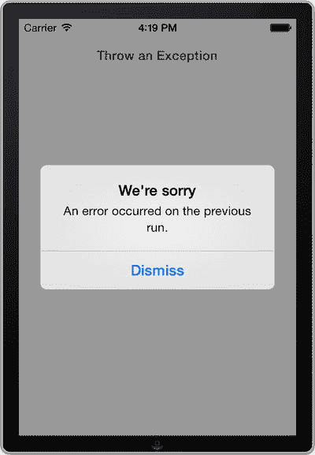

**图 1-39.** 一条错误消息，通知用户发生了导致应用在上一次运行时关闭的错误

这很好，但让我们让这个功能更有用一些。

### 报告错误

iOS 应用中的许多未捕获异常纯粹是编程错误——如果能获得关于它们的足够信息，您就可以修复这些 bug。出于这个原因，当应用因未捕获异常而终止时，iOS 会生成一份崩溃报告。

然而，尽管开发者可以提取崩溃信息，但他们需要将设备连接到电脑才能做到。如果您的应用已经交付到真实用户手中，获取崩溃报告可能是不可能的，或者充其量也是很不方便的。

作为一种替代方案，我们希望用户能够将这些错误报告直接发送给我们。您可以通过在错误警告中添加一个“邮件报告”按钮来实现这一点。

首先，您需要存储关于异常的信息，以便用户在决定发送错误报告时，能够在下次运行时检索到这些信息。一个好的方法是使用日志记录的自然来源——`stderr` 流。

`stderr` 流是 `NSLog` 发送日志消息的通道。默认情况下，这是控制台，但可以使用 `freopen` 函数将 `stderr` 流重定向到一个文件。为此，将代码清单 1-28 中的代码添加到 `Application recipes:didFinishLaunchingWithOptions:` 方法中。

**代码清单 1-28.** 将 `stderr` 错误流重定向到一个文件

```
- (BOOL)Application recipes:(UIApplication *)application didFinishLaunchingWithOptions:(NSDictionary *)launchOptions
{
    // 默认的异常处理代码
    NSUserDefaults *settings = [NSUserDefaults standardUserDefaults];
    if ([settings boolForKey:@"ExceptionOccurredOnLastRun"])
    {
        // 重置异常发生标志
        [settings setBool:NO forKey:@"ExceptionOccurredOnLastRunKey"];
        [settings synchronize];
        // 通知用户
        UIAlertView *alert = [[UIAlertView alloc] initWithTitle:@"抱歉" message:@"上一次运行时发生了一个错误。" delegate:nil cancelButtonTitle:@"忽略" otherButtonTitles:nil];
        [alert show];
    }
    NSSetUncaughtExceptionHandler(&exceptionHandler);
    // 将 stderr 输出流重定向到文件
    NSArray *paths = NSSearchPathForDirectoriesInDomains(NSDocumentDirectory,
                                                         NSUserDomainMask, YES);
    NSString *documentsPath = [paths objectAtIndex:0];
    NSString *stderrPath = [documentsPath stringByAppendingPathComponent:@"stderr.log"];
    freopen([stderrPath cStringUsingEncoding:NSASCIIStringEncoding], "w", stderr);
    // ...
}
```

代码清单 1-28 使得所有写入 `NSLog` 的内容都被写入设备上应用文档目录下名为 `stderr.log` 的文件中。由于使用了 `"w"` 参数，该文件会在每个新会话中被重新创建，因此文件中只包含上一次运行的信息和错误日志，这正是错误报告所需要的。

对于未捕获的异常，iOS 会写入一些关于崩溃的基本信息，并将其发送到 `stderr`（进而写入您的文件）。但是，有两个重要的信息不会被记录：即异常的 `userInfo` 字典和符号化（即可读的）调用栈。幸运的是，您可以从您的异常处理函数中添加这些信息，如代码清单 1-29 所示。

**代码清单 1-29.** 修改异常处理程序，将异常的 `userInfo` 和符号化调用栈写入文件

```
void exceptionHandler(NSException *exception)
{
    NSLog(@"未捕获的异常: %@\n 原因: %@\n 用户信息: %@\n 调用栈: %@",
          exception.name, exception.reason, exception.userInfo, exception.callStackSymbols);
    // 设置标志
    NSUserDefaults *settings = [NSUserDefaults standardUserDefaults];
    [settings setBool:YES forKey:@"ExceptionOccurredOnLastRun"];
    [settings synchronize];
}
```

现在您已经持久化了异常数据，接下来可以继续添加一个按钮，用户可以通过该按钮将信息发送给您。


### 添加按钮

要添加一个“通过电子邮件发送报告”按钮，您需要对清单 1-30 中创建警告视图的代码进行两处小幅修改。

清单 1-30. 向警告视图添加“通过电子邮件发送报告”按钮

```
UIAlertView *alert = [[UIAlertView alloc] initWithTitle:@"我们很抱歉"
message:@"上次运行时发生了错误。" delegate: self
cancelButtonTitle:@"关闭" otherButtonTitles:nil];
[alert addButtonWithTitle:@"通过电子邮件发送报告"];
[alert show];
```

您向警告视图添加了一个按钮，并指示它将所有事件发送给 `AppDelegate` 对象（通过将 `self` 声明为委托）。为了避免编译器警告，您还需要通过声明 `UIAlertViewDelegate` 协议，使 `AppDelegate` 成为警告视图的委托。为此，请打开 `AppDelegate.h` 并进行以下修改：

```
@interface AppDelegate : UIResponder <UIApplicationDelegate , UIAlertViewDelegate >
//...
@end
```

现在您可以添加 `alertView:didDismissWithButtonIndex:` 警告视图委托方法，该方法将拦截用户点击“通过电子邮件发送报告”按钮的操作。返回 `AppDelegate.m` 并添加清单 1-31 中的代码。

清单 1-31. 添加委托方法以拦截“通过电子邮件发送报告”按钮按下事件

```
-(void)alertView:(UIAlertView *)alertView didDismissWithButtonIndex:(NSInteger)buttonIndex
{
    if (buttonIndex == 1)
    {
        //待办事项：在此处通过电子邮件发送报告
    }
}
```

在编写电子邮件报告的代码之前，您需要修复当前代码中的一个问题。由于 iOS 中的警告视图是异步显示的，用于重定向 `stderr` 输出的代码会在调用 `Application recipes:didDismissWithButtonIndex:` 之前运行。这会过早地清空文件内容。要修复此问题，您需要进行两项修改。首先，在 `Application recipes:didFinishLaunchingWithOptions:` 中，通过添加清单 1-32 中的代码，确保异常处理设置代码仅在未发生异常时运行。

清单 1-32. 在处理设置之前添加代码以检查是否未发生异常

```
- (BOOL)Application recipes:(UIApplication *)application didFinishLaunchingWithOptions:(NSDictionary *)launchOptions
{
    // 默认异常处理代码
    NSUserDefaults *settings = [NSUserDefaults standardUserDefaults];
    if ([settings boolForKey:@"ExceptionOccurredOnLastRun"])
    {
        // 重置异常发生标志
        [settings setBool:NO forKey:@"ExceptionOccurredOnLastRunKey"];
        [settings synchronize];
        // 通知用户
        UIAlertView *alert = [[UIAlertView alloc] initWithTitle:@"我们很抱歉" message:@"上次运行时发生了错误。" delegate:self cancelButtonTitle:@"关闭" otherButtonTitles:nil];
        [alert addButtonWithTitle:@"通过电子邮件发送报告"];
        [alert show];
    }
    else
    {
        NSSetUncaughtExceptionHandler(&exceptionHandler);
        // 将 stderr 输出流重定向到文件
        NSArray *paths = NSSearchPathForDirectoriesInDomains(NSDocumentDirectory,
        NSUserDomainMask, YES);
        NSString *documentsPath = [paths objectAtIndex:0];
        NSString *stderrPath = [documentsPath stringByAppendingPathComponent:@"stderr.log"];
        freopen([stderrPath cStringUsingEncoding:NSASCIIStringEncoding], "w", stderr);
    }
    // ...
}
```

您需要执行的第二项任务是，将设置代码添加到 `alertView:didDismissWithButtonIndex:` 中，以便在发生异常的情况下设置异常处理。必要的修改已在清单 1-33 中展示。

清单 1-33. 添加代码以处理存在异常的情况

```
-(void)alertView:(UIAlertView *)alertView didDismissWithButtonIndex:(NSInteger)buttonIndex
{
    NSArray *paths = NSSearchPathForDirectoriesInDomains(NSDocumentDirectory,
    NSUserDomainMask, YES);
    NSString *documentsPath = [paths objectAtIndex:0];
    NSString *stderrPath = [documentsPath stringByAppendingPathComponent:@"stderr.log"];
    if (buttonIndex == 1)
    {
        //待办事项：在此处通过电子邮件发送报告
    }
    NSSetUncaughtExceptionHandler( & exceptionHandler);
    // 将 stderr 输出流重定向到文件
    freopen([stderrPath cStringUsingEncoding:NSASCIIStringEncoding], "w", stderr);
}
```

现在您已经准备好进行最后一步：编写错误报告电子邮件。


### 通过电子邮件发送报告

当用户点击“电子邮件报告”按钮时，你将使用 `MFMailComposeViewController` 类来处理邮件。该类属于 `MessageUI` 框架，因此请将其链接到项目中（有关如何链接框架二进制文件的详细信息，请参见技巧 1-2）。

接下来，你需要将 `MessageUI.h` 和 `MFMailComposeViewController.h` 导入到你的 `AppDelegate.h` 文件中。同时，由于你需要响应邮件视图控制器的事件，请将 `MFMailComposeViewControllerDelegate` 添加到支持的协议列表中。修改后的 `AppDelegate.h` 文件应如代码清单 1-34 所示。

**代码清单 1-34.** 导入框架并添加 `MFMailComposeViewController` 委托

```objc
#import <UIKit/UIKit.h>
#import <MessageUI/MessageUI.h>
#import <MessageUI/MFMailComposeViewController.h>

@interface AppDelegate : UIResponder <UIApplicationDelegate, UIAlertViewDelegate, MFMailComposeViewControllerDelegate>
// ...
@end
```

现在，你可以创建并呈现携带错误报告的 `MFMailComposeViewController`。将代码清单 1-35 中的代码添加到 `alertView:didDismissWithButtonIndex:` 方法中。

**代码清单 1-35.** 创建并呈现携带错误报告的 `MFMailComposeViewController` 所需代码

```objc
-(void)alertView:(UIAlertView *)alertView didDismissWithButtonIndex:(NSInteger)buttonIndex
{
    NSArray *paths = NSSearchPathForDirectoriesInDomains(NSDocumentDirectory,
        NSUserDomainMask, YES);
    NSString *documentsPath = [paths objectAtIndex:0];
    NSString *stderrPath = [documentsPath stringByAppendingPathComponent:@"stderr.log"];

    if (buttonIndex == 1)
    {
        // 通过电子邮件发送报告
        MFMailComposeViewController *mailComposer = [[MFMailComposeViewController alloc] init];
        mailComposer.mailComposeDelegate = self;
        [mailComposer setSubject:@"错误报告"];
        [mailComposer setToRecipients:[NSArray arrayWithObject:@"support@mycompany.com"]];

        // 附加日志文件
        NSArray *paths = NSSearchPathForDirectoriesInDomains(NSDocumentDirectory,
            NSUserDomainMask, YES);
        NSString *documentsPath = [paths objectAtIndex:0];
        NSString *stderrPath = [documentsPath stringByAppendingPathComponent:@"stderr.log"];
        NSData *data = [NSData dataWithContentsOfFile:stderrPath];
        [mailComposer addAttachmentData:data mimeType:@"Text/XML" fileName:@"stderr.log"];

        UIDevice *device = [UIDevice currentDevice];
        NSString *emailBody =
            [NSString stringWithFormat:@"我的型号: %@\n 我的操作系统: %@\n 我的版本: %@",
            [device model], [device systemName], [device systemVersion]];
        [mailComposer setMessageBody:emailBody isHTML:NO];
        [self.window.rootViewController presentViewController:mailComposer animated:YES
            completion:nil];
    }

    NSSetUncaughtExceptionHandler(&exceptionHandler);

    // 将 stderr 输出流重定向到文件
    freopen([stderrPath cStringUsingEncoding:NSASCIIStringEncoding], "w", stderr);
}
```

要关闭邮件撰写控制器，你还需要响应 `mailComposeController:didFinishWithResult:error:` 消息，该消息由控制器在发送或取消事件时发送。将代码清单 1-36 中的代码添加到你的 `AppDelegate.m` 文件中。

**代码清单 1-36.** 添加响应 `mailComposeController` 错误消息的方法

```objc
-(void)mailComposeController:(MFMailComposeViewController *)controller didFinishWithResult:(MFMailComposeResult)result error:(NSError *)error
{
    [self.window.rootViewController dismissViewControllerAnimated:YES completion:nil];
}
```

你的应用现在拥有一个强大且用户友好、实用且安全的默认异常处理器。当你测试时，会看到警告视图多了一个按钮，允许你通过电子邮件发送报告。图 1-40 展示了示例。

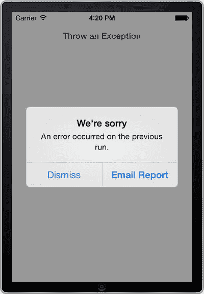

**图 1-40.** 带有通过电子邮件发送错误报告选项的错误警告

### 最终润色

在实现本技巧时，还有一点你可能需要考虑。由于你将 `stderr` 重定向到了文件，输出控制台中不会再显示错误日志。这在你主要在模拟器中进行测试的开发阶段可能会成为问题。在此期间，你可能更希望错误信息显示在控制台中，而不是存储在文件中。

幸运的是，有一个简单的解决方案。你可以使用预定义的条件编译 `TARGET_IPHONE_SIMULATOR`，让异常处理代码仅在应用运行于真机时生效。这样，你就可以将错误记录到控制台。代码清单 1-37 展示了如何实现这一点。

**代码清单 1-37.** 添加仅在真机上运行时处理异常的条件编译

```objc
- (BOOL)Application recipes:(UIApplication *)application didFinishLaunchingWithOptions:(NSDictionary *)launchOptions
{
    #if !TARGET_IPHONE_SIMULATOR
    // 默认异常处理代码
    // ...
    #endif

    returnYES;
}
```

至此，我们的默认异常处理技巧就结束了。通过制定一个考虑周全的错误处理策略，你不仅能为自己节省时间，还能给予用户应有的尊重。我们希望在这两个技巧的帮助下，你已经看到了优秀异常处理的价值，并且它实际上并不难实现。你可能已经想到了改进这些简单示例的方法。为什么不去尝试一下呢？毕竟，你越早将这些功能集成到应用中，它们对你的帮助就越大。

## 技巧 1-11：添加精简版

为你的应用提供精简版是让顾客在购买前有机会试用应用的好方法。然而，维护两个代码库可能会相当繁琐，并且随着你在应用中添加新功能，情况可能会变得难以控制。本技巧将展示如何在一个代码库中设置项目，使其同时包含两个版本。


### 添加构建目标

在本教程中，我们创建了一个名为“`Recipe 1-11: Adding A Lite Version`”的新单视图应用程序。

在项目和目标列表中选择你的项目文件，然后选择项目的构建目标，如图 1-41 所示。现在按下  `+D` 来复制该目标。系统会提示你选择“仅复制”或“复制并转换为 iPad”，如图 1-42 所示。点击“仅复制”以创建一个新的目标，用于你的精简版构建。这将产生一个独立的构建目标，你可以用它来实现第二个版本。

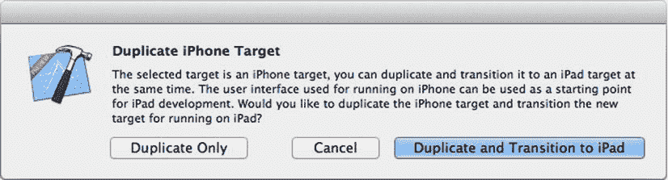

图 1-42. 项目复制选项

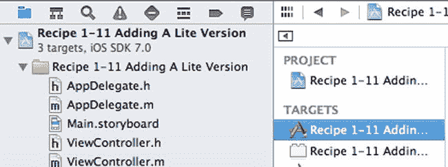

图 1-41. 为项目选择构建目标

通过双击目标名称，在标题后追加“Lite”来重命名新目标。你还应该更改新目标的 `Product Name` 属性，以表明它是精简版。你可以在构建设置选项卡的“打包”标题下找到 `Product Name` 属性（见图 1-43）。

提示

查找特定构建属性的最简单方法是使用构建设置选项卡左上角的搜索字段。只需输入 `Product Name`，属性就会随着你的输入而被过滤出来。

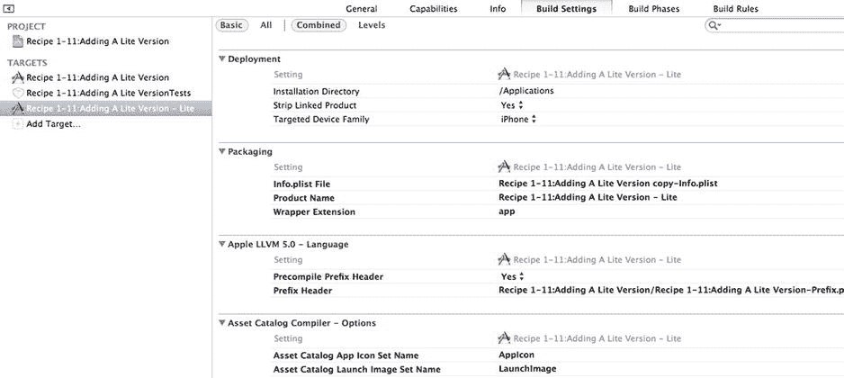

图 1-43. 在目标名称和 `Product Name` 构建设置后追加“Lite”

现在你可以构建并运行精简版了。为此，你需要更改活动方案。当你之前复制常规目标时，Xcode 为你创建了一个新的构建方案。这个新方案的名称与被复制目标的初始名称相同，即“Recipe1-11: Adding a Lite Version copy”。即使你已经将目标名称更改为“Recipe 1-11: Adding a Lite Version–Lite”，Xcode 也不会相应更改方案名称。如果这让你感到困扰，你可以在“管理方案”窗口中重命名它，该窗口可通过位于停止按钮右侧的“活动方案”按钮访问（见图 1-44）。要重命名它，请选中该副本并单击名称一次。

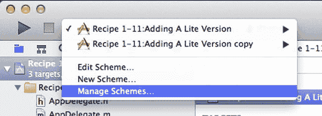

图 1-44. 如果你想更改精简版构建方案的名称，请转到“管理方案”

注意

请记住，两个目标必须具有不同的捆绑标识符，才能在设备（或模拟器）上安装和运行时显示为单独的应用程序。Xcode 默认会设置不同的捆绑标识符，但在进行更改时请务必小心。

### 为特定版本编码

现在你需要一种方法来区分源代码中的两个构建版本。例如，你可能想限制精简版中的某些功能，或者向非付费用户显示广告。精简版中的某些代码不应编译到完整版中，反之亦然。这时预处理宏就派上用场了。

你需要做的是向精简版目标添加一个名为 `LITE_VERSION` 的预处理宏。同样，这可以在构建设置选项卡中的编译器预处理头下完成。你需要展开构建设置选项卡以查看所有构建设置，方法是按下窗口左上角的“全部”按钮。将鼠标悬停在调试宏上，点击旁边出现的添加图标（`+`），然后在编辑字段中输入 `LITE_VERSION`。务必对发布宏也执行相同操作。图 1-45 展示了这些更改的示例。

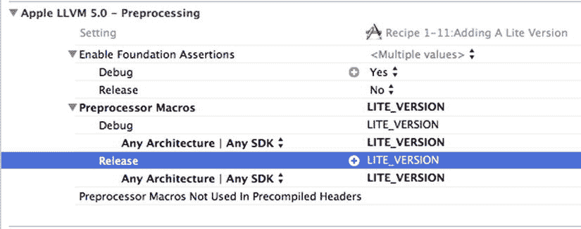

图 1-45. 在预处理宏中定义 `LITE_VERSION` 条件

要为你的应用程序构建不同的功能，你需要使用你创建的预处理宏。在代码中任何你想为精简版与完整版指定不同代码的地方，请使用以下 `#ifdef` 指令：

```
#ifdef LITE_VERSION

// 精简版的内容

#else

// 完整版的内容

#endif
```

或者，如果更方便，你可以使用否定形式：

```
#ifndef LITE_VERSION

// 专门用于完整版的代码

#endif
```

注意

你还可以控制每个构建中包含哪些文件。例如，你可能不需要在精简版中包含完整版的素材。点击你的精简版项目目标，然后转到“构建阶段”选项卡。展开“复制捆绑资源”功能区，然后移除或添加任何特定于精简版的文件。

## 配方 1-12：添加启动图像

为了用户体验，通常认为在应用程序启动时显示所谓的“启动画面”是一种不好的做法。用户通常渴望开始使用你的应用程序，并且对你的品牌信息不感兴趣。他们也并不特别急于观看你酷炫的视频，无论你花了多少时间和金钱。

用户查看和/或关闭启动画面所需的额外几秒钟可能会相当烦人，并且可能对整体体验不利。

不过，这条规则有一个例外。许多应用程序需要一点时间来加载，在这几秒钟内它保持无响应且无聊。因为这在用户体验方面可能和启动画面一样糟糕，所以你的应用程序应该尽力减轻这种影响。一种方法是在启动完成且应用程序准备好响应用户操作时立即移除一张图片。

这些图片被称为启动图像，并且在 iOS 中非常容易实现。在应用程序加载时显示图片的功能已经内置。你所要做的就是提供合适的图片。

### 设计启动图像

关于启动图像，苹果的理念是它们应该尽可能多地类似于应用程序的主视图。这使得加载时间感觉稍快一些，因此响应性更强。这是比带有品牌或启动画面风格的设计更好的选择。

例如，如果你的应用程序的主视图由表格视图组成，你的启动图像可能看起来像图 1-46。

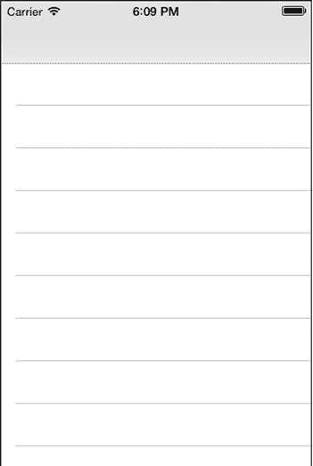

图 1-46. 启动图像应该类似于应用程序的主视图

此外，建议启动图像不要包含那些可能需要在本地化过程中翻译或更改的元素。例如，图 1-46 中的启动图像不包含任何导航栏按钮。这些已经被编辑掉了，状态栏中的元素也是如此。

尽管支持特定语言版本的启动图像，但建议你不要使用它，因为额外的启动图像会占用更多空间。


### 启动图像文件

根据应用的性质以及它支持的设备类型，你需要创建一个或多个启动图像。在应用中包含启动图像只需将其添加到项目中即可。过去，简单的命名约定就能告诉 iOS 如何根据使用的设备对图像及其适当尺寸进行分类。

可以通过首先选择 `Images.xcassets` 文件来创建启动图像，该文件默认应包含在新的单视图应用中。

你会看到已经创建了两个图像集。一个图像集用于应用图标，另一个用于启动图像。选择“LaunchImage”图像集，你将看到如图 1-47 所示的界面。

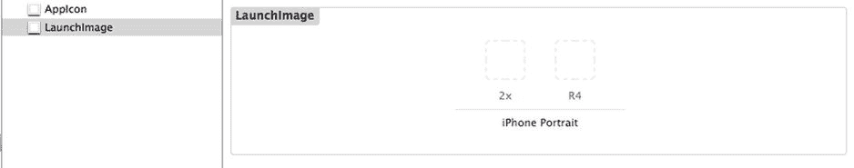

*图 1-47. 素材目录图像集视图*

如果你单击其中一个图像占位符方块，你将在属性检查器中看到预期的图像类型，以及你正在支持的 iOS 版本。对于我们的 2x 图像，你会看到它期望的尺寸是 640 x 960 像素，如图 1-48 所示。

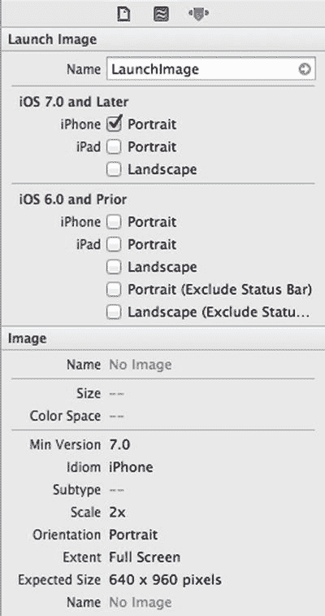

*图 1-48. 素材目录属性检查器视图，显示预期尺寸*

一旦你创建了预期尺寸的图像，只需将其拖放到图 1-49 所示的图像占位符框上，即可将其添加到项目中。请注意，你的启动图像必须是 `.PNG` 类型，否则将无法工作。此外，如果你尝试将尺寸不正确的图像添加到该框中，将会收到编译器警告。

拖放之后，图像会保存到 `Images.xcassets ➤ LaunchImage.launchimage` 文件夹中。你还需要为图 1-49 中的 R4 图像空间创建一个图像，就像你为 2x 图像所做的那样。

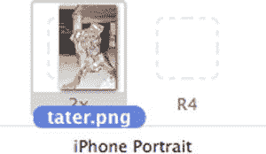

*图 1-49. 素材目录图像拖放*

如果你恰好有多个启动图像，你可以通过从项目导航器中选择根项目节点，并更改启动图像源（位于编辑器窗口的 General 选项卡下）来选择要使用的启动图像集，如图 1-50 所示。

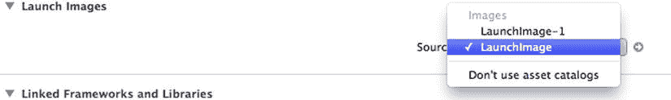

*图 1-50. 选择用于启动图像的图像集*

## 本章小结

在本章中，你已获得（或重新回顾了）一些基础知识，这些知识是你在阅读本书其余教程时所必需的。你已经了解了如何搭建一个基本应用、如何构建用户界面以及如何通过代码控制它们。此外，你还学习了 iOS 中错误与异常的区别，并了解了如何实现相应的处理策略。

