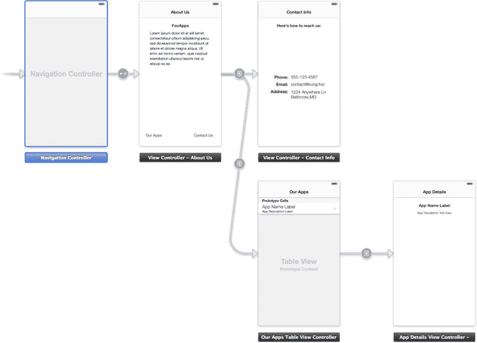
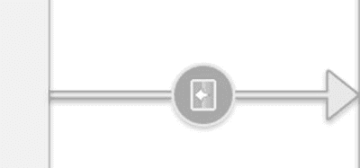

# 2. Storyboard 精粹

**摘要**

在移动开发初期，人们使用纸和笔来绘制应用的流程草图。随后出现了流程图软件，你可以用数字方式记录工作流程和进程。现在，开发者拥有了一个名为“Storyboard”的 Xcode 工具，它提供了应用工作流的可视化表示，并能为你的应用生成一个可运行的框架。

在本章的前两个教程中，你将使用 storyboard 在 iOS 7 中构建一个简单的多页面应用，该应用包含一个虚构应用制作公司的信息。本章的最后一个教程将向你展示如何使用 storyboard 创建一个标签栏应用。

## 那么，Story（board）里面有什么？

一个 storyboard 是多个 `.xib` 文件的集合，这些文件连同一些关于视图及其相互关系的元数据被打包在一起。它实现了视图与模型和控制器之间的终极分离，这种理念自模型-视图-控制器（MVC）编程早期就已存在。Storyboard 提供了一种方式，让你只需通过拖放组件就能轻松创建多个场景以及它们之间的连接。使用 storyboard 的好处是，你只需编写很少的代码就能完成所有工作。

Storyboard 有两个主要组成部分：场景和跳转。

### 场景

场景是填充设备屏幕的任何视图。场景包含用户界面（UI）对象，并由视图控制器控制。图 2-1 显示了在 storyboard 中的五个不同场景，你马上就会构建它。

*图 2-1. 包含五个场景的 storyboard*

### 跳转

跳转本质上是两个场景之间的连接，允许一个场景导向另一个场景。当一个场景导向另一个场景时，我们说第一个场景正在呈现第二个。同样，第二个场景是被呈现的场景。

你可以创建以下几种类型的跳转：

*   Push 跳转 – Push 跳转需要一个导航控制器或标签栏控制器才能运行。当从一个视图控制器移动到另一个时，你是将一个视图控制器推送到该导航控制器或标签栏控制器的堆栈上。其好处是，导航控制器或标签栏控制器可以跟踪堆栈上的其他视图控制器，并自动提供它们之间的导航。当你使用导航控制器或标签栏控制器时，应使用此类型的跳转。
*   Modal 跳转 – Modal 跳转不需要导航控制器来执行跳转。但需要注意的是，你会失去自动导航的功能，因为 modal 跳转仅仅是一个视图控制器呈现另一个视图控制器。
*   Pop-over 跳转 – Pop-over 跳转类似于 modal 跳转，但它会创建一个显示在当前场景上方的小窗口。Pop-over 仅在 iPad 应用中可用。
*   自定义跳转 – 自定义跳转用于编写场景之间的自定义过渡动画。

跳转属于 `UIStoryboardSegue` 类，并包含三个属性：`sourceViewController`、`destinationViewController` 和 `identifier`。`identifier` 是一个 `NSString`，可用于从代码中识别特定的跳转。

应用通常会根据用户的操作发起跳转。这可以是触摸按钮或表格视图单元格，也可能是手势识别器的结果。跳转在 storyboard 上用连接两个场景的线表示，如图 2-2 所示。

多个场景可以通过跳转连接到单个场景，正如你将在本章后面看到的那样。根据你如何组织 storyboard，跳转可以从右向左或从左向右。

*图 2-2. 连接两个场景的跳转*

