# 食谱 2-1：实现导航控制器

在本例中，你将构建一个简单的项目，用于展示公司的相关信息。该项目使用导航栏来显示当前页面的标题。

除了空项目模板外，`Xcode` 中的所有应用模板都提供了`故事板`。对于本食谱，你将使用`单视图应用程序`模板。将项目命名为`"食谱 2-1 至 2-2：关于我们"`，如图 2-3 所示。

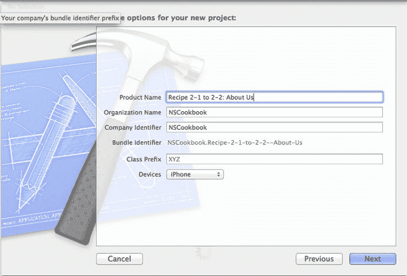

图 2-3. 配置使用故事板的项目

创建项目后，你将在项目导航器中看到，如图 2-4 所示，你的项目包含一个名为`"Main.storyboard"`的文件。点击此文件将其加载到 Interface Builder 中，并开始构建你的故事板。

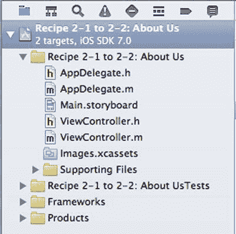

图 2-4. 包含故事板文件的项目

你要做的第一件事是将主视图嵌入到导航控制器中。通过选中该视图，然后在主菜单中选择 **Editor** ➤ **Embed In** ➤ **Navigation Controller** 来完成此操作。这将创建一个导航控制器，并将其连接到现有的故事板视图。图 2-5 展示了一个示例。

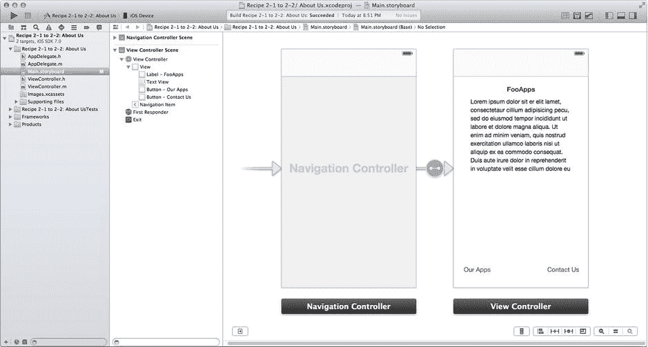

图 2-5. 嵌入到视图控制器中的故事板主视图

最后，创建主视图的用户界面。添加一个标签、一个文本视图和两个按钮，使其类似于图 2-6。为节省空间，示例中的视图控制器已移动至与导航控制器重叠。

> **注意：** 通常，当你从对象库中拖拽导航控制器时，它会直接与一个表视图控制器绑定。这是对象库中导航控制器的默认配置。由于我们目前还不想深入探讨表视图控制器的复杂细节，我们选择了将导航控制器连接到一个普通视图。

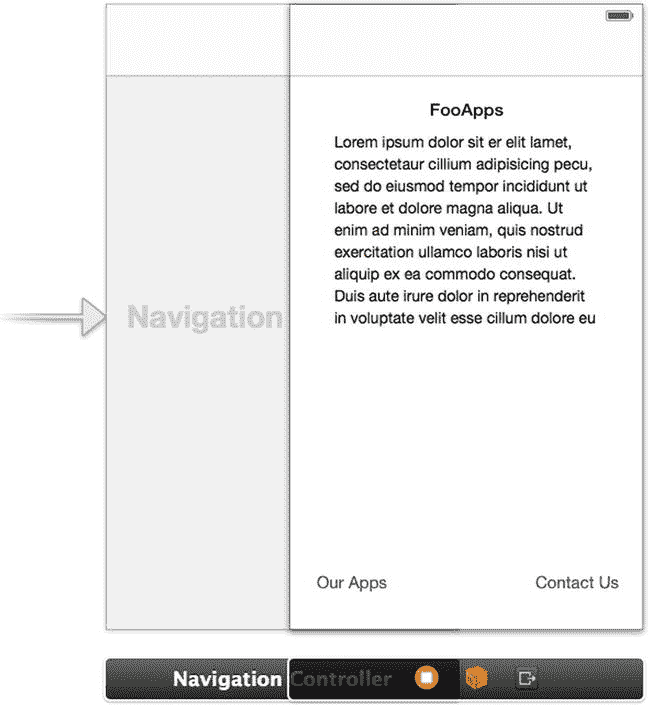

图 2-6. 用于显示公司信息的简单用户界面

当你在 3.5 英寸屏幕上运行此应用程序时，两个按钮将被截断。要解决此问题，请选中这两个按钮，然后点击编辑器右下角如图 2-7 所示的按钮，并选择“重置为建议的约束”。这是一个自动布局功能，我们将在第 3 章中详细讨论。

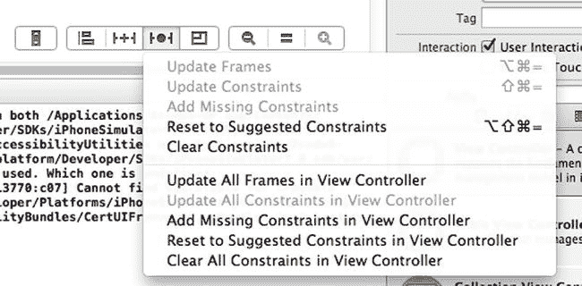

图 2-7. 应用建议的约束，以便按钮在 3.5 英寸屏幕上显示

### 向故事板添加新场景

下一步是添加一个新场景，当点击“联系我们”按钮时，该场景将显示公司的联系信息。为此，请从对象库中将一个视图控制器拖放到故事板上。

首先，设置新场景的用户界面，使其类似于图 2-8 右侧的视图。

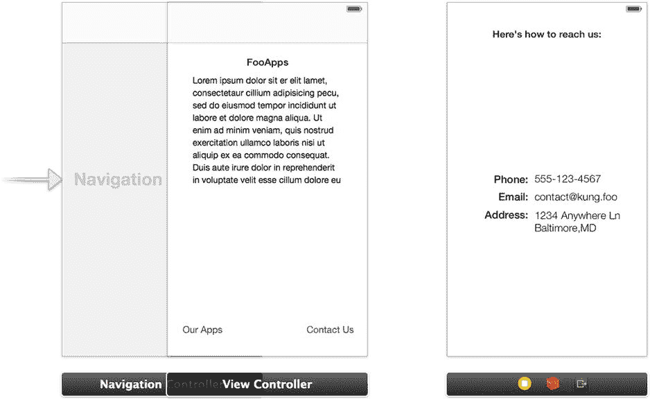

图 2-8. 包含用于显示联系信息新场景的故事板

要将新的联系信息视图连接到“关于我们”视图，请按住 Ctrl 键并点击“联系我们”按钮，然后拖一条线到“联系信息”视图，如图 2-9 所示。这与连接插座的操作相同，只是这次你用它来创建两个场景之间的过渡（或称为转场 Segue）。

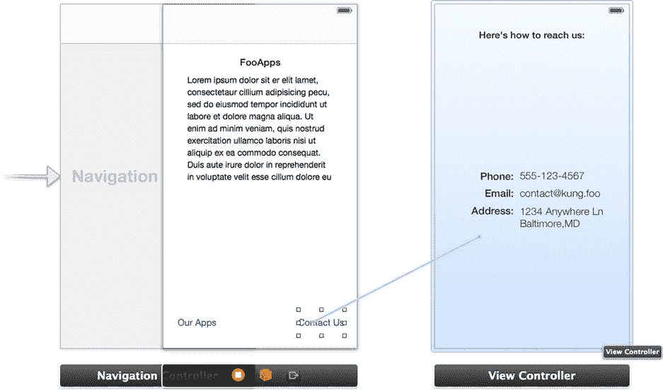

图 2-9. 在按住“Ctrl”键的同时，在按钮和场景之间拖拽线条即可创建过渡

释放鼠标按钮时，会弹出一个菜单，询问你希望如何执行过渡。你可以在推入、模态和自定义转场之间进行选择。由于你使用的是导航控制器，请选择“推入”（如图 2-10 所示），这样系统会自动为你设置一个“返回”按钮。连接建立后，你会注意到导航栏会自动添加到新视图中。

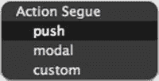

图 2-10. 选择“推入”操作转场

让导航栏显示当前场景的标题。一种方法是在视图控制器导航器中选择“导航项”（见图 2-11）。另一种方法是直接点击导航栏。

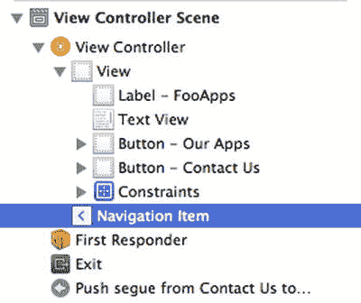

图 2-11. 选择故事板视图控制器的导航项

在属性检查器中，选中视图后设置`标题`属性，如图 2-12 所示。将主视图控制器的标题设置为“关于我们”。然后选中包含联系信息的视图，并将其导航项的标题设置为“联系信息”。

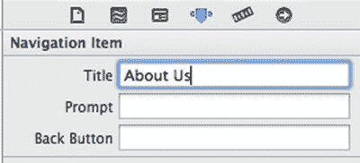

图 2-12. 设置导航项的标题

设置转场标识符的方法是：在故事板中选中它，然后在属性检查器中查看其属性，如图 2-13 所示。

一个值得养成的好习惯是为你的转场提供标识符。如果你最终将多个转场连接到一个视图，这有助于让你的应用具备更好的前瞻性。你可以检查调用转场的标识符，以了解用户到达当前场景的路径。通常，你可以利用 `prepareForSegue` 方法来获取该标识符。

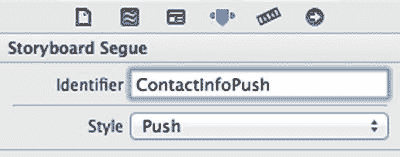

图 2-13. 在属性检查器中设置转场标识符

如果你现在运行这个应用，如图 2-14 和图 2-15 所示，“联系我们”按钮将起作用并显示联系信息视图。请注意，这一切无需编写任何一行代码即可实现！

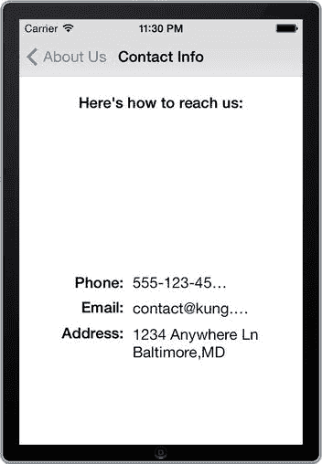

图 2-15. 点击“联系我们”按钮后得到的结果视图

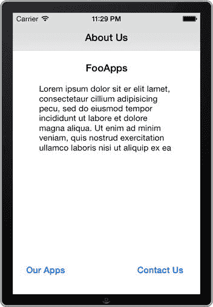

图 2-14. 模拟器中的主视图


## 配方 2-2：实现 `UITableViewController`

现在让我们扩展配方 2-1 中的示例，实现一个管理表视图的类——`UITableViewController`。本配方将展示如何创建一个根据表视图中选中的单元格而动态变化的详细信息视图。在 iOS 中考虑列表时，首先想到的应该是 `UITableViewController`。故事板将 `UITableViewController` 的便利性提升到了全新水平（关于在故事板外部使用表视图的详细介绍，请参考第 4 章）。

首先，从对象库中拖一个 `UITableViewController` 到故事板，创建一个应用列表视图。

在表视图场景中，顶部有一个名为“原型单元格”的区域（见图 2-16）。借助故事板，你可以通过称为原型的方式自定义 `UITableViewCell` 的布局和对象。我们将在本配方后面进一步讨论这个问题。

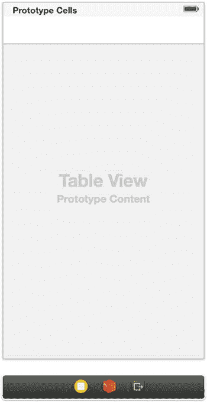

图 2-16. 表视图控制器场景

选择表视图，在属性检查器中，将表视图的 `Content` 属性从“动态原型”改为“静态单元格”。同时，将 `Style` 属性改为“分组”，这能很好地分隔各组。图 2-17 显示了这些设置以及生成的表视图。

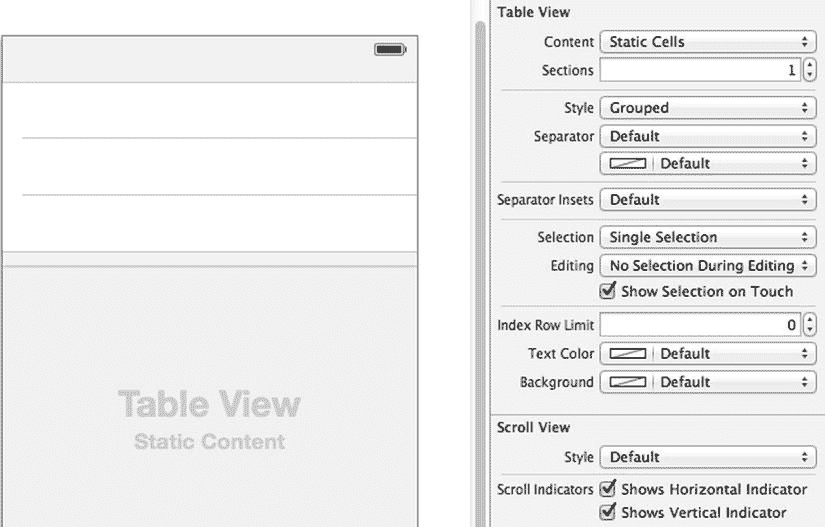

图 2-17. 一个将 `Content` 设置为“静态单元格”、`Style` 设置为“分组”的表视图场景

由于每个单元格的布局相同，删除底部两个单元格，这样你可以自定义然后快速复制顶部单元格。你可以像对待任何其他容器视图一样，通过从对象库拖放对象来自定义单元格。

选择该单元格，并在属性检查器的 `Style` 下拉菜单中选择“副标题”。这会在表视图单元格上创建标题和副标题。通过双击每个值，将这些值更改为图 2-18 所示的样子。

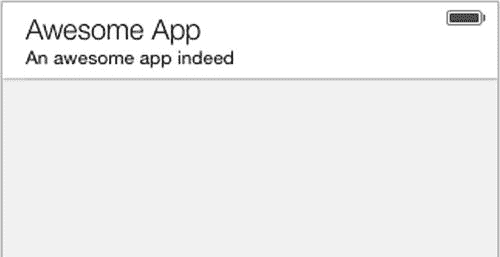

图 2-18. 一个自定义的表视图单元格

现在你将复制该单元格以创建三个实例。按住“Alt”键（  ），同时将单元格向下拖动。再次重复操作，为表视图添加第三行。现在你可以自定义这两个新单元格，使其包含独特的信息，如图 2-19 所示。

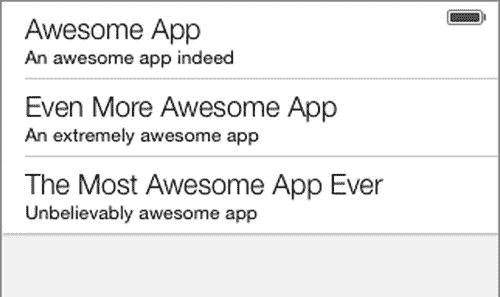

图 2-19. 一个包含三个自定义单元格的表视图

剩下的工作就是将“我们的应用”按钮连接到这个新视图。在“关于我们”视图中选择该按钮，按住 Ctrl 键并点击拖动到你刚刚创建的表视图场景。然后在“我们的应用”按钮和表视图场景之间设置一个推入类型连线。你的故事板应该类似于图 2-20。

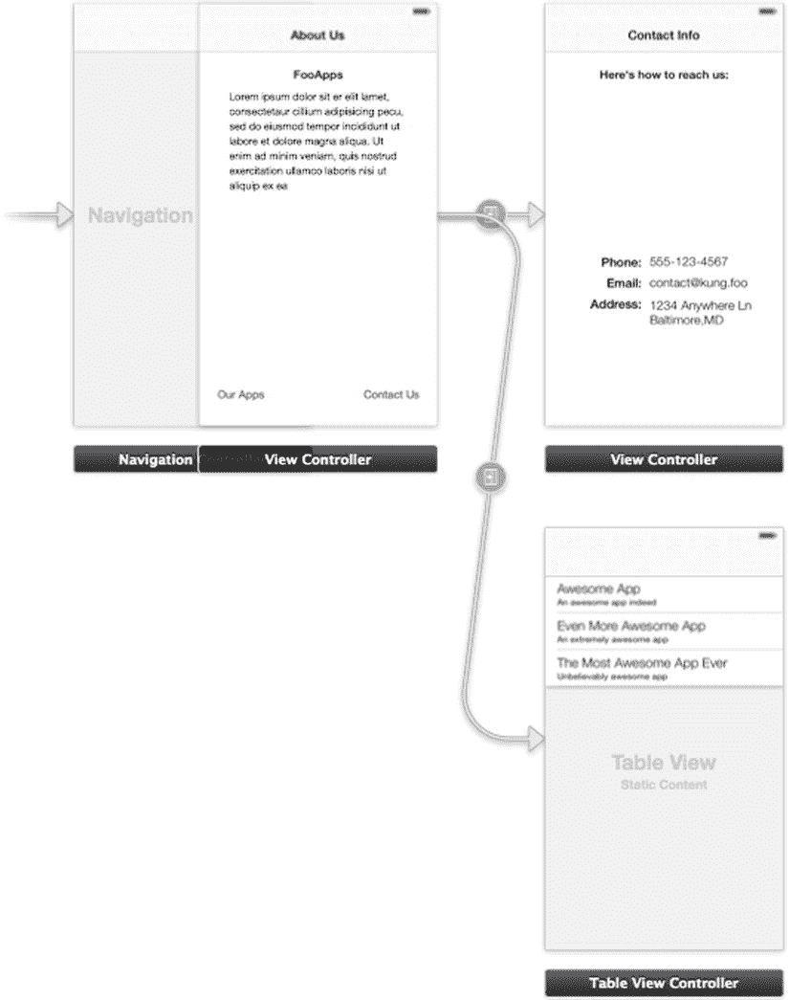

图 2-20. 包含三个场景的故事板

**注意：** 你可能从图 2-20 中注意到，故事板需要大量的屏幕空间。随着应用的增长，有效操作用户界面可能会变得相当困难，尤其是对于 iPad 应用而言。这就是尽管故事板具有诸多优势，但一些开发者仍倾向于坚持使用 `.xib` 文件并单独设计用户界面的原因之一。

现在运行应用时，你可以点击“我们的应用”按钮，表视图场景将如图 2-21 所示。你没写任何代码就实现了所有这些功能。太棒了！

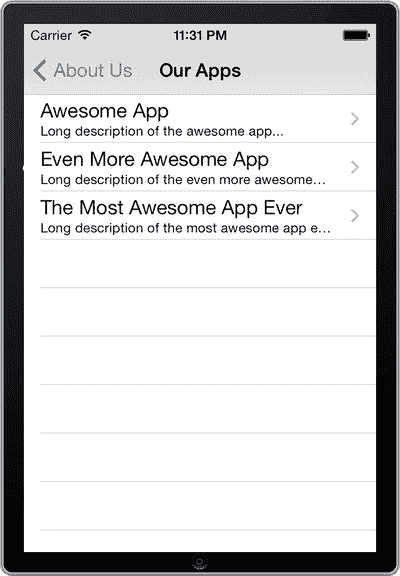

图 2-21. 显示“超棒”应用列表的表视图场景


### 添加详情视图

前面的应用部分无需任何代码即可正常运行，但只需在后台添加少量代码，就能在极短时间内创建出更强大的界面。在开始编码之前，你需要先设置好界面。当看到表格视图时，你会本能地意识到，点击某个单元格后很可能会出现一个详情视图。现在就来添加这个详情视图吧。

要创建详情视图，首先需要拖放一个新的视图控制器到故事板上。按照图 2-22 所示，添加一个标题标签和一个用于显示描述文字的文本视图。

在实际场景中，这个页面可能还会包含其他信息，比如一个可以购买相关应用的网页链接。不过，我们将尽量保持这个示例的简洁性，只显示名称和描述。

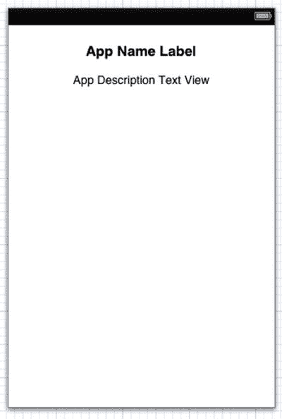

图 2-22. 详情视图用户界面

你希望点击每个表格视图单元格时都能跳转到此视图，因此按住 Ctrl 键，从三个单元格中的每一个都拖出一条连线到详情视图。这次释放鼠标按钮时，你会注意到可以在“选择转场”或“附件操作”之间进行选择（参见图 2-23）。不过，就本教程而言，请创建“推送”选择转场，这样当单元格被选中时（而不是点击其附件按钮时）就会触发界面切换。

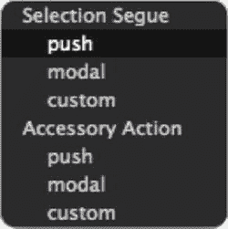

图 2-23. 一个弹出窗口，提供为表格视图单元格创建选择转场或附件按钮操作的选项

再次提醒，一旦使用“推送”方法将单元格连接到详情视图后，视图将显示导航栏。按照之前的方式，在对应的导航栏项目中设置标题为“应用详情”。

如图 2-24 所示，现在应该有三个转场将表格视图连接到应用详情场景。

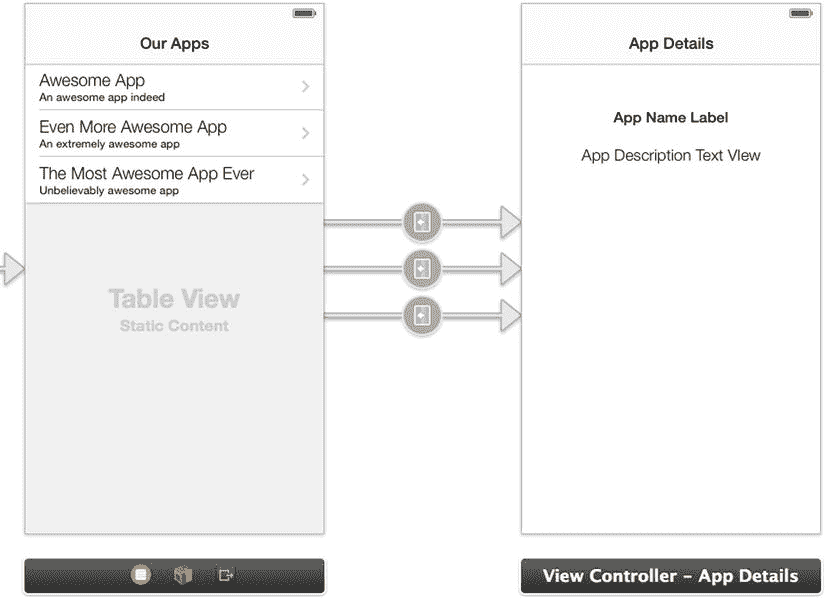

图 2-24. 多个转场将表格视图连接到详情视图

选择第一个转场，在属性检查器中为其输入一个标识符。将其设置为“PushAppDetailsFromCell1”，如图 2-25 所示。

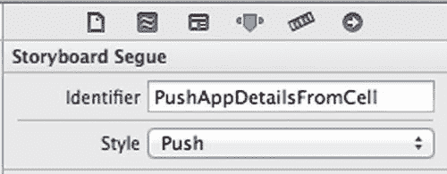

图 2-25. 为推送详情视图的转场设置标识符

对其他两个转场重复此过程，分别将其标识符设置为“PushAppDetailsFromCell2”和“PushAppDetailsFromCell3”。稍后将使用这些标识符来识别是哪个转场触发了到应用详情场景的切换。

到目前为止，你还没有使用任何代码就完成了这些工作，但这种便捷即将结束。你需要开始为应用详情视图控制器生成一些动态内容，而这需要深入编写代码。

创建一个模型类来保存应用的信息。创建一个新类（CMD + N），使其成为 `NSObject` 的子类，并命名为“AppDetails”。（关于创建新类的信息，请参考配方 1-6。）

如代码清单 2-1 所示，将以下属性和 `init` 方法声明添加到新类的头文件中。

代码清单 2-1. 添加自定义初始化方法声明及相应属性

```
//
//  AppDetails.h
//  Recipe 2-1 to 2-2: About Us
//

#import <Foundation/Foundation.h>

@interface AppDetails : NSObject

@property(strong, nonatomic) NSString *name;
@property(strong, nonatomic) NSString *description;

-(id)initWithName:(NSString *)name description:(NSString *)descr;

@end
```

如代码清单 2-2 所示，`initWithName:description:` 方法的实现放在 `AppDetails.m` 文件中。

代码清单 2-2. 实现自定义初始化方法

```
//
//  AppDetails.m
//  Recipe 2-1 to 2-2: About Us
//

#import "AppDetails.h"

@implementation AppDetails

-(id)initWithName:(NSString *)name description:(NSString *)descr
{
self = [super init];
if (self)
{
self.name = name;
self.description = descr;
}
return self;
}

@end
```

在上述代码中，你只是创建了一个自定义初始化方法，当创建该类的新实例时，该方法会设置详情视图控制器的名称和描述。


### 设置自定义视图控制器

有了数据对象后，您可以让详情视图控制器显示 `AppDetails` 对象的属性。为此，您需要将一个自定义视图控制器类附加到详情视图上。

具体做法是，创建一个名为 "AppDetailsViewController" 的新 Objective-C 类，并使其成为 `UIViewController` 的子类。请确保取消选中 "With XIB for user interface" 复选框。该复选框的位置请参考图 1-25。

现在，将新的视图控制器类附加到应用详情场景。返回故事板编辑器，并选择应用详情场景底部的视图控制器对象（参见图 2-26）。

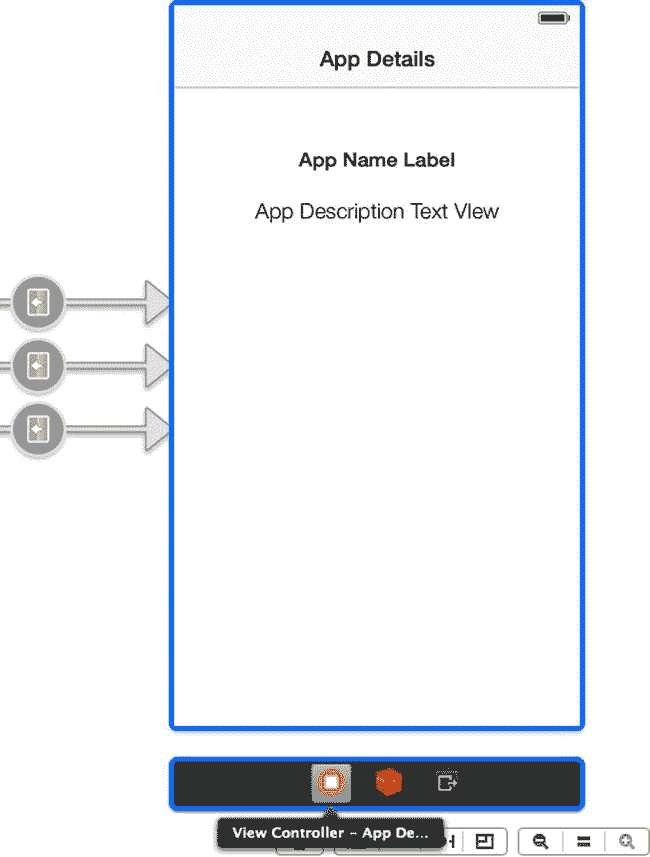

图 2-26. 选择场景的视图控制器对象

选中视图控制器对象后，转到身份检查器，将 `Class` 属性设置为 "AppDetailsViewController"，如图 2-27 所示。

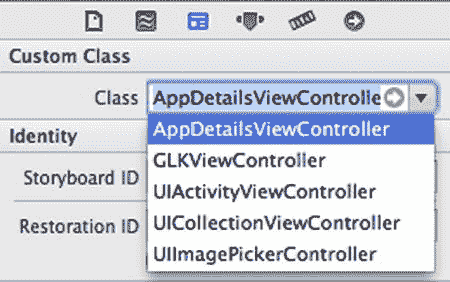

图 2-27. 将自定义视图控制器类附加到场景

为名称标签和描述文本视图创建输出口。请使用助理编辑器（参见技巧 1-4）执行此操作。使用以下各自的输出口名称：

* `nameLabel`
* `descriptionTextView`

您还需要一个属性来保存当前的应用详情对象。将代码清单 2-3 中的代码添加到 `AppDetailsViewController.h` 文件中。

代码清单 2-3. 导入 AppDetails 类并为其创建属性

```
//
//  AppDetailsViewController.h
//  About Us
//

#import <UIKit/UIKit.h>
#import "AppDetails.h"

@interface AppDetailsViewController : UIViewController

@property (weak, nonatomic) IBOutlet UILabel *nameLabel;
@property (weak, nonatomic) IBOutlet UITextView *descriptionTextView;
@property (strong, nonatomic) AppDetails *appDetails;

@end
```

在 `AppDetailsViewController.m` 中，将代码清单 2-4 中的代码添加到 `viewDidLoad` 方法中。

代码清单 2-4. 从 AppDetails 类设置名称标签和描述文本输出口

```
- (void)viewDidLoad
{
    [super viewDidLoad];
    // Do any additional setup after loading the view.
    self.nameLabel.text = self.appDetails.name;
    self.descriptionTextView.text = self.appDetails.description;
}
```

应用详情场景现已准备好接受 `AppDetails` 对象，并从中获取数据填充其标签和文本视图。剩下的工作是为该场景提供一个合适的对象。为此，您需要再创建一个自定义视图控制器类，这次是为表格视图场景。

因此，就像之前处理应用详情场景一样，创建一个新的 Objective-C 类。这次使其成为 `UITableViewController` 的子类，并将其命名为 "OurAppsTableViewController"。通过从故事板中选择其视图控制器对象，将新类附加到 "Our Apps" 场景。在身份检查器中，将 `OurAppsTableViewController` 设置为其类。

打开新的 `OurAppsTableViewController.m` 文件。您需要做的第一件事是删除默认存在的现有表格视图数据源和委托方法。这是因为您正在使用在故事板中定义的静态表格视图内容。因此，请删除或注释掉以下方法：

* `numberOfSectionsInTableView:`
* `tableView:numberOfRowsInSection:`
* `tableView:cellForRowAtIndexPath:`
* `tableView:didSelectRowAtIndexPath:`

现在，您需要将三个转场之一连接到应用详情场景。您需要通过确定选择了哪个表格视图单元格来了解调用了哪个转场。这可以通过重写 `prepareForSegue:sender:` 方法来实现。

> **注意**：在我们的示例中，我们只是简单地确定哪个转场触发了哪个过渡，但 `prepareForSegue:sender:` 方法对于将数据从一个视图控制器传递到下一个视图控制器也非常有用。

将代码清单 2-5 中的代码添加到 `OurAppsTableViewController.m` 文件中。

代码清单 2-5. 实现 "prepare for segue" 方法

```
//
//  OurAppsTableViewController.m
//  Recipe 2-1 to 2-2: About Us
//

#import "OurAppsTableViewController.h"
#import "AppDetailsViewController.h"
#import "AppDetails.h"

@implementation OurAppsTableViewController

- (void)prepareForSegue:(UIStoryboardSegue *)segue sender:(id)sender
{
    NSString *name;
    NSString *description;

    if ([segue.identifier isEqualToString:@"PushAppDetailsFromCell1"])
    {
        name = @"Awesome App";
        description = @"Long description of the awesome app...";
    }
    else if ([segue.identifier isEqualToString:@"PushAppDetailsFromCell2"])
    {
        name = @"Even More Awesome App";
        description = @"Long description of the even more awesome app...";
    }
    else if ([segue.identifier isEqualToString:@"PushAppDetailsFromCell3"])
    {
        name = @"The Most Awesome App Ever";
        description = @"Long description of the most awesome app ever seen...";
    }
    else
    {
        return;
    }

    AppDetailsViewController *appDetailsViewController = segue.destinationViewController;
    appDetailsViewController.appDetails =
        [[AppDetails alloc] initWithName:name description:description];
}

// ...

@end
```

从代码中可以看出，您正在通过其标识符识别每个转场，并创建一个包含相应应用信息的 `AppDetails` 对象。然后，您将该对象传递给应用详情场景的视图控制器。

现在运行您的应用，您将看到每个表格视图单元格在应用详情场景中都会显示不同的信息。图 2-28 演示了此应用的模拟结果。

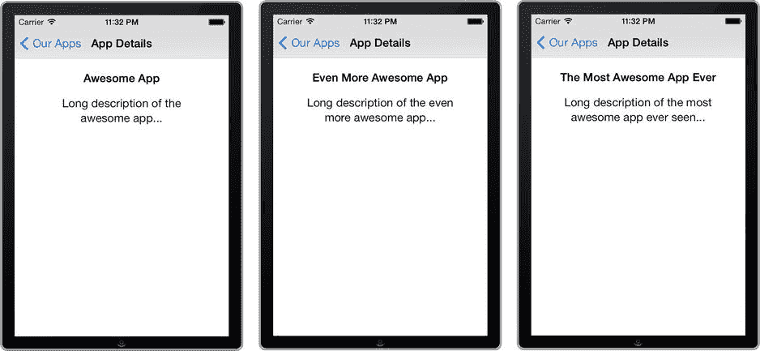

图 2-28. 三个包含三个应用信息的应用详情场景


### 使用单元格原型

到目前为止，应用运行符合预期，但如果你要向库存中添加新应用呢？按照当前的实现方式，你需要为每个新应用项目更新表格视图并添加新的单元格。在本节中，我们将向你展示如何通过使用单元格原型而非静态单元格，动态地更新表格视图。

首先，将表格视图从静态模式改为动态模式。为此，请返回“我们的应用”场景，并删除那三行。这也会移除相关联的三个转场。现在选中表格视图，在属性检查器中，将 `Content` 属性从“静态单元格”改为“动态原型”，如图 2-29 所示。确保 `Prototype Cells` 字段也设置为“1”。

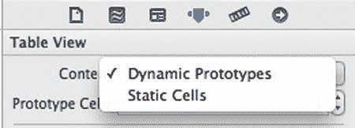

图 2-29. 将表格视图内容从“静态单元格”改为“动态原型”

接下来，你需要修改原型单元格，它将成为之后动态添加单元格的模板。你可以像设计静态单元格那样设计这个单元格；不过，你需要做一处改动：为其添加一个展开指示器图标。可以通过单元格的 `Accessory` 属性来实现。图 2-30 展示了带有灰色展开指示器图标（看起来像一个指向右侧的箭头）的原型单元格。

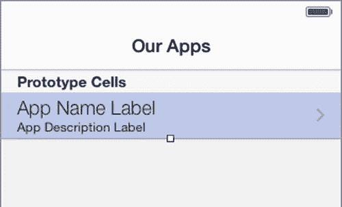

图 2-30. 带有两个标签和一个展开指示器的表格视图单元格原型

接下来，你需要设置一个复用标识符，之后将用它来基于原型单元格获取实例。选中原型单元格，进入属性检查器，在 `Identifier` 属性中输入“AppCell”，如图 2-31 所示。

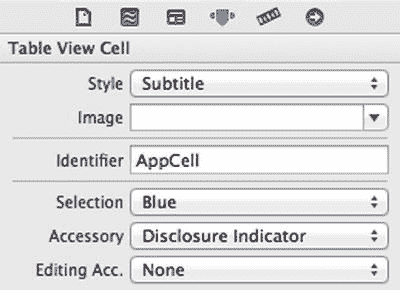

图 2-31. 为单元格原型设置复用标识符

现在创建用于跳转到应用详情场景的转场。按住 Ctrl 键从原型单元格拖拽到应用详情场景。和之前操作静态单元格时一样，使用“push”选择转场类型。

选中你刚刚创建的转场，将其 `Identifier` 属性设置为 `"PushAppDetails"`。

至此，原型单元格的设置已完成。剩下的任务是为动态显示表格视图内容编写代码。切换到 `OurAppsTableViewController.m`，添加如代码清单 2-6 所示的代码。

**代码清单 2-6.** 添加表格视图委托方法

```
- (NSInteger)numberOfSectionsInTableView:(UITableView *)tableView
{
    return 1;
}

- (NSInteger)tableView:(UITableView *)tableView numberOfRowsInSection:(NSInteger)section
{
    return 3;
}

- (UITableViewCell *)tableView:(UITableView *)tableView cellForRowAtIndexPath:(NSIndexPath *)indexPath
{
    // 设置在故事板中设置的 CellIdentifier
    static NSString *CellIdentifier = @"AppCell";
    UITableViewCell *cell = [tableView dequeueReusableCellWithIdentifier:CellIdentifier];
    
    switch (indexPath.row)
    {
        case 0:
            cell.textLabel.text = @"Awesome App";
            cell.detailTextLabel.text = @"Long description of the awesome app...";
            break;
        case 1:
            cell.textLabel.text = @"Even More Awesome App";
            cell.detailTextLabel.text = @"Long description of the even more awesome app...";
            break;
        case 2:
            cell.textLabel.text = @"The Most Awesome App Ever";
            cell.detailTextLabel.text = @"Long description of the most awesome app ever seen...";
            break;
        default:
            cell.textLabel.text = @"Unkown";
            cell.detailTextLabel.text = @"Unknown";
            break;
    }
    return cell;
}
```

现在，你可以利用单元格中存储的信息，让 `prepareForSegue:sender:` 方法变得更加简洁。更新 `prepareForSegue:sender:` 方法的实现，如代码清单 2-7 所示。

**代码清单 2-7.** 简化 `prepareForSegue:sender:` 方法

```
- (void)prepareForSegue:(UIStoryboardSegue *)segue sender:(id)sender
{
    if ([segue.identifier isEqualToString:@"PushAppDetails"])
    {
        AppDetailsViewController *appDetailsViewController = segue.destinationViewController;
        UITableViewCell *cell = sender;
        appDetailsViewController.appDetails =
            [[AppDetails alloc] initWithName:cell.textLabel.text
                                 description:cell.detailTextLabel.text];
    }
}
```

现在运行应用时，表格视图会像之前一样加载内容，但这次使用的是一个原型单元格和数据源。图 2-32 展示了应用最新更新的模拟结果。在此示例中，你仍然为 `AppDetails` 类使用静态数据，但此应用可以轻松扩展，以使用核心数据对象模型，甚至从服务器上的远程文件中拉取应用列表。这些功能将在第 14 章中更详细地介绍。

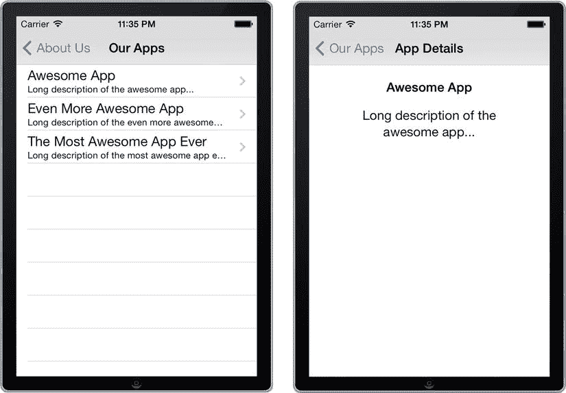

图 2-32. 同一个表格视图通过其视图控制器，使用原型单元格加载内容


