# 食谱 2-3：实现 UITabBarController

标签栏控制器是另一种便捷的控制器，用于将应用程序划分为多个部分。理想情况下，这些部分应包含一系列彼此相关的视图。`UITabViewController` 的一个典型示例是 iTunes 应用当前使用的控制器。在应用的底部，你会看到“音乐”、“电影”、“电视节目”等标签。本食谱将演示如何创建一个显示新闻类别的标签栏控制器应用。

首先，我们需要创建一个新的“单视图应用”项目。是的，我们本可以创建一个“标签页应用”，但那样就失去了乐趣。将新项目命名为“食谱 2-3：新闻应用”。当新的单视图项目打开后，从项目导航器中选择 `Main.storyboard` 文件，并删除已为你创建的视图。保持 `Main.storyboard` 文件打开，从对象库中拖拽一个标签栏控制器对象到故事板中。此时，你的故事板应类似于图 2-33。

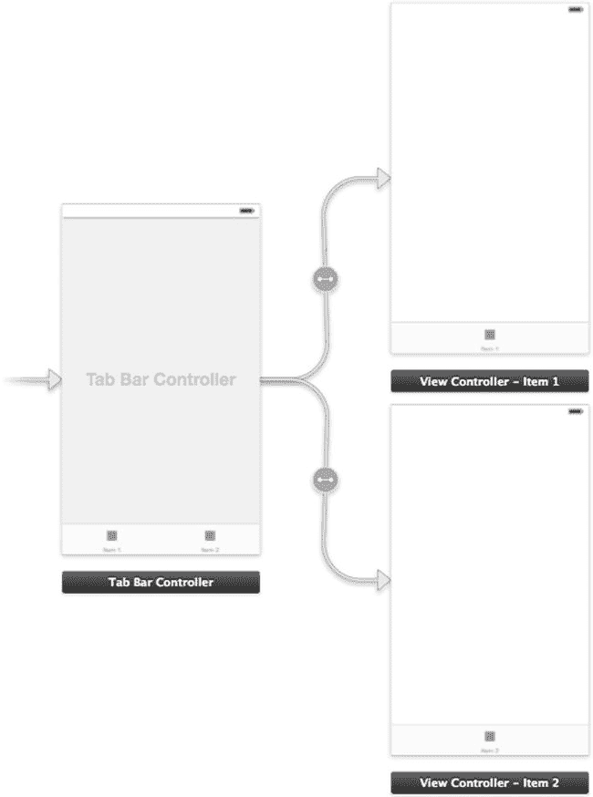

图 2-33. 包含新标签栏控制器对象的故事板

前两个场景已经为你创建好了，因此再拖拽两个视图控制器到屏幕上，以便总共拥有四个场景。

当两个新的视图控制器被放入故事板后，按住 Control 键，从标签栏控制器点击并拖动到其中一个新的视图控制器。当系统提示选择连接类型时，从对话框中选择“关系连接” ➤ “view controllers”，如图 2-34 所示。对你添加到屏幕上的另一个视图控制器重复此操作。

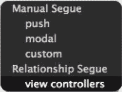

图 2-34. 为标签栏控制器选择正确的连接类型

此时，所有连接都应该已经在视图控制器和标签栏控制器之间建立好了。如果你操作正确，应该能看到如图 2-35 所示的连接。

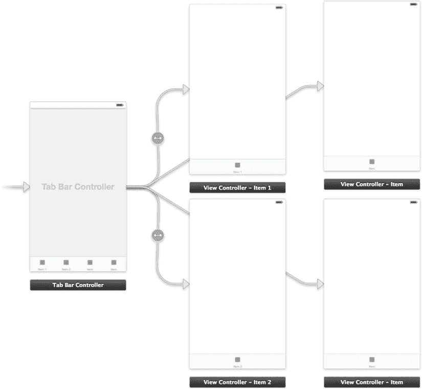

图 2-35. 所有连接都已建立的标签栏控制器

如果你查看图 2-36 中标签栏控制器的底部，会发现标签已经相应地更新了。你还会注意到所有图标都是相同的，并且标签描述性不强。接下来我们将修复这些问题。

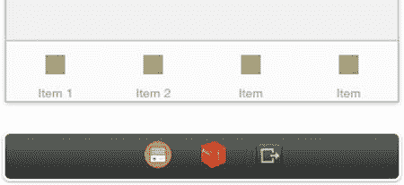

图 2-36. 连接视图控制器后更新显示的图标

对于这个应用，我们将创建四个新类别：头条、体育、科技和政治。要更改这些图标和标签，我们只需要更改各个视图的图标属性即可。

要更改图像图标，我们首先需要向项目中添加图像。Apple 的 iOS 人机界面指南规定，标签栏图标在 Retina 设备上应为 60 x 60 像素，在非 Retina 设备上应为 30 x 30 像素。任何需要与非 Retina 设备保持兼容的项目都需要两种尺寸。文件必须为 PNG 格式，并且黑白效果最佳。你可以在 [`https://developer.apple.com/library/ios/documentation/userexperience/conceptual/mobilehig/`](https://developer.apple.com/library/ios/documentation/userexperience/conceptual/mobilehig/) 找到 iOS 人机界面指南。

如果你自己创建图像，可以任意命名 30 x 30 像素的图标，而 60 x 60 像素的图标则使用相同的名称，但在文件名末尾添加 `@2x`。例如：`anImage.png` 和 `anImage@2x.png`。在 Xcode 5 之前，这种命名约定是编译器为 Retina 设备选择合适尺寸的必要条件。现在，随着图像资源的引入，这不再是必需的。不过，从组织角度来看，这仍然是一个良好的命名习惯。

由于我们将创建四个类别，因此需要四个图标。选择项目导航器中的 `images.xcassets` 文件，并通过按下编辑器窗口左下角的“+”按钮并选择“新建图像集”来创建四个新的图像集，如图 2-37 所示。

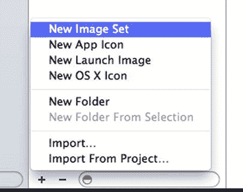

图 2-37. 创建新的图像集

通过双击编辑器窗口左侧窗格中的每个图像集，将图像集分别命名为 `headlinesIcon`、`politicsIcon`、`sportsIcon` 和 `techIcon`（图 2-38）。

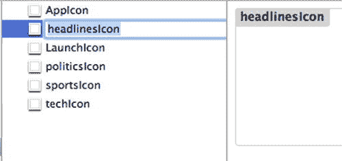

图 2-38. 创建新的图像集

创建好图像后，从访达中将 `.png` 图标文件拖放到图像集提供的其中一个框中，如图 2-39 所示。`1x` 框对应 30 x 30 像素的图像，`2x` 框对应 60 x 60 像素的图像。对每个图像集都执行此操作。

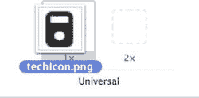

图 2-39. 将 30 x 30 像素图像拖放到 `1x` 位置

现在我们已经有了所有图像集，可以开始编辑视图控制器上的图标属性了。选择 `Main.storyboard` 文件，然后通过点击选择第一个视图项（项目 1）上的图标，如图 2-40 所示。

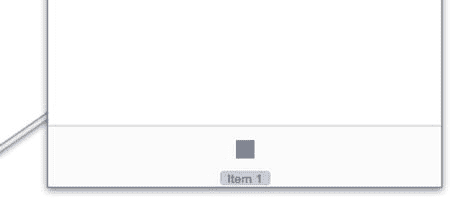

图 2-40. 选择要编辑的标签栏图标

从属性检查器中，你可以更改标题、图像、标记、标识符和标签。对于此示例，你只需设置标题和图像。将第一个视图图标的标题设置为“头条”，并将图像标题更改为 `headlinesIcon`（图 2-41）。对其他三个视图的标签栏图标重复此过程。

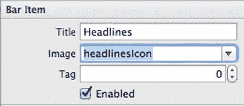

图 2-41. 更改图标属性

接下来，你应该为每个视图控制器添加一个标签，以便确定视图已更改。添加标签并设置其标题，如图 2-42 所示。

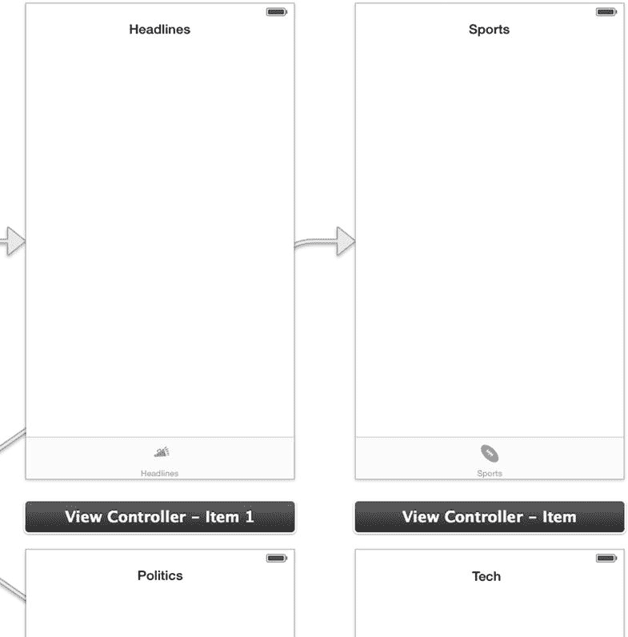

图 2-42. 更改图标属性

现在你可以运行应用程序了。你会注意到在图 2-43 的屏幕底部，四个图标显示了我们指定的图像。当该视图控制器处于活动状态时，选中的图标默认会高亮显示。

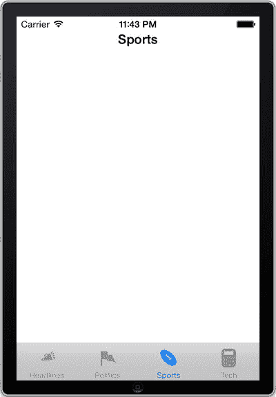

图 2-43. 最终的标签栏控制器应用

## 总结

在本章中，我们涵盖了导航控制器、表格视图控制器和标签视图控制器。到目前为止，你应该已经很好地掌握了如何导航和使用故事板。在下一章中，我们将演示自动布局，这是我们在本章中简要提及的一个主题。自动布局可以帮助你在视图中定位对象，以便它们能在所有屏幕尺寸和各种方向下正确显示。

