# 3. 布局指南

## 摘要

用户界面及其布局对大多数应用至关重要，尤其是在 iOS 这种需要适配设备方向的场景中。用户通常期望应用同时支持竖屏和横屏模式，并且能够在 iPhone 和 iPad 上运行。换句话说，他们期待你的应用拥有动态布局。

本章将介绍如何使用 Auto Layout（自动布局）——在 iOS 7 中构建动态用户界面的绝佳方式。Auto Layout 是 Xcode 4 首次引入的功能，它提供了一种通过界面构建器或编程方式处理 iOS 应用中视图布局的方法。Auto Layout 采用非常强大的模型，使你能够构建可缩放且能适应屏幕旋转的布局，而无需编写复杂的代码。此外，Auto Layout 还能轻松处理诸如支持从右到左阅读的多语言等任务。

Xcode 5 引入了许多新功能，使创建布局的过程更加灵活且不易出错。开发者现在对布局有了更多控制权，但更多的控制权也带来了更多出错的可能。

在本章中，你将学习如何使用 Auto Layout 创建灵活的界面。我们将涵盖通过界面构建器以及编程方式创建这些界面的方法。最后，我们还将介绍可能出现的错误类型以及如何排查这些错误。

## 方案 3-1：使用 Auto Layout

在本方案中，我们将展示 Auto Layout 的工作原理。你将学习如何以多种方式添加约束（即视图之间的关系），还将了解如何禁用自动约束以及如何利用预览工具。预览工具允许你在不模拟的情况下实时渲染布局。

### Auto Layout 约束

Auto Layout 的本质由两部分组成：一是“约束”，用于描述用户界面元素之间的关系；二是布局引擎，用于强制执行这些约束。约束是一种规则，决定了当附近的其他元素（如容器视图）发生变化时，元素应如何表现。根据这一定义，布局引擎负责执行这些规则。

在第 1 章中，我们使用 Xcode 5 的便捷功能为一些按钮设置了建议约束。默认开启的 Auto Layout 允许你设置约束，使应用在各种尺寸和方向下都能呈现良好效果。为了解 Auto Layout 的工作原理，你将创建一个带有简单用户界面的应用，该界面可自动适应竖屏和横屏两种方向。

首先，创建一个新的单视图应用，然后在提供的视图控制器中构建用户界面（如图 3-1 所示），使用标签、文本字段和文本视图。为了使边界更清晰，请为视图控制器设置灰色背景。你可以在故事板中选择视图控制器，然后在属性检查器中修改背景属性。

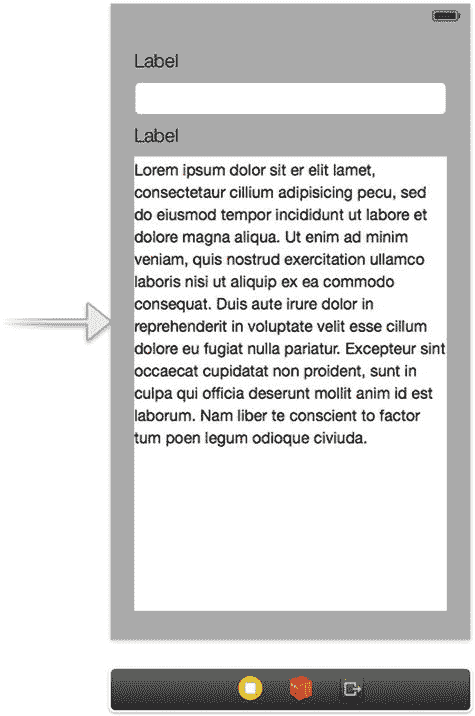

图 3-1. 竖屏方向的用户界面

在定位和调整元素大小时，请确保在元素与主视图边界之间、以及元素与子视图之间使用默认间距；换句话说，即界面构建器在拖拽过程中自动吸附的位置，如图 3-2 所示。

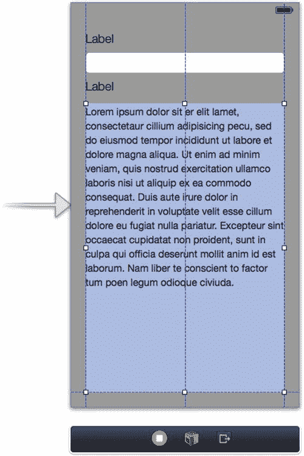

图 3-2. 界面构建器中的虚线表示默认间距

与 Xcode 4 不同，Xcode 5 不会在你准备好之前就自动添加约束。相反，如果你未指定任何约束，Xcode 将在构建时添加固定的位置和尺寸约束。这能确保你的界面与界面构建器窗口中的显示完全一致。这在原型设计阶段非常方便，因为你并不关心界面在不同屏幕分辨率或旋转方向下的表现。

当你准备好添加约束时，有多种方法可供选择。在以下小节中，我们将演示三种不同的方法。

#### 使用 Control-点击并拖拽的方法添加约束

首先选中文本字段，按住 Control 键从文本字段左侧点击并拖拽到视图控制器，然后从弹出菜单中选择“Leading Space to Container”（前导空间到容器），如图 3-3 和图 3-4 所示。

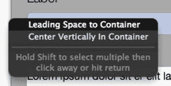

图 3-4. 从弹出菜单中选择“Leading Space to Container”

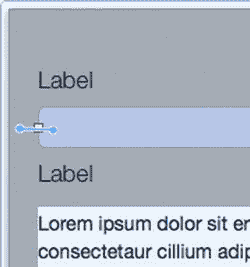

图 3-3. 按住 Control 键从文本字段点击并拖拽到视图控制器

现在你应该能看到约束已成功添加到文本字段，界面上会显示一条橙色线条（如图 3-5 所示）。线条是橙色而非蓝色，说明存在问题（状态窗口中的警告图标也会提示）。简而言之，橙色线条表示我们尚未添加足够的约束。

**注意：** 橙色线条是 Xcode 5 新增的功能；在之前的版本中，约束会自动添加。由于你现在拥有更大的灵活性，因此可能出现这类错误。我们将在方案 3-3 中更深入地介绍错误处理。

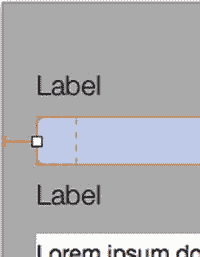

图 3-5. 从弹出菜单中选择“Leading Space to Container”

如果你按住 Control 键从一个对象点击并拖拽到另一个对象（例如从标签到文本字段），你会发现弹出菜单会显示不同的选项，如图 3-6 所示。

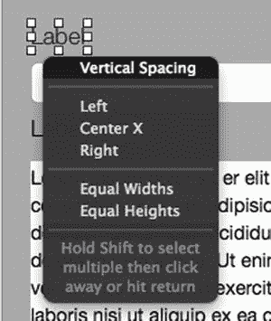

图 3-6. 在文本字段和标签之间按住 Control 键点击时显示的选项

现在，我们可以逐一按住 Control 键点击每个项目并手动添加约束，或者利用 Xcode 5 的一些新功能来加快这一过程。


### 使用自动布局问题解决菜单添加约束

Apple 在 `Xcode 5` 中新增了一个菜单，帮助我们快速添加约束。通过使用自动布局问题解决菜单，我们可以使用多种工具来建议约束。选择所有对象，然后从问题解决菜单中选择"重置为建议的约束"选项，如图 3-7 所示。

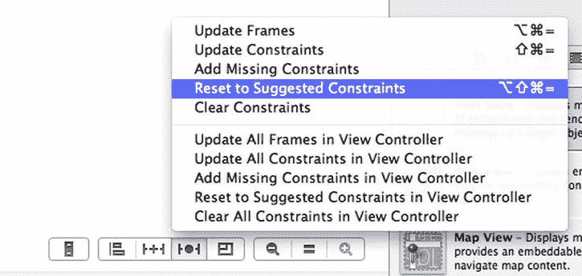

图 3-7. 从问题解决菜单重置为建议的约束

现在，视图控制器应该有了许多新约束，如图 3-8 所示。您还会看到状态栏中不再显示问题。请注意，这些对象都没有指定高度和宽度约束。这是因为一个称为**固有内容大小**的巧妙小特性。固有内容大小将根据其包含的内容确定高度和宽度。通常，您不希望添加显式的宽度或高度约束，因为如果内容大小发生变化，您可能会遇到文本被裁剪或其他异常结果。

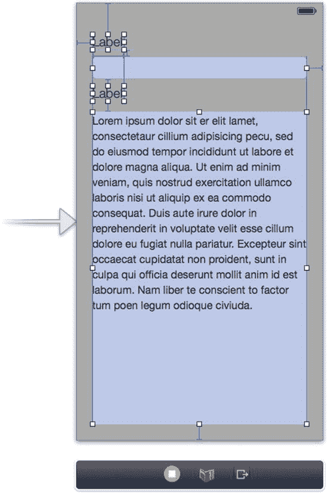

图 3-8. 从问题解决菜单添加了约束后的视图控制器

现在所有问题都已清除，您可以构建并运行应用程序，查看其在竖屏和横屏模式下的效果（图 3-9）。要将模拟器切换到横屏视图，请从模拟器文件菜单中选择 `hardware ➤ rotate right`。

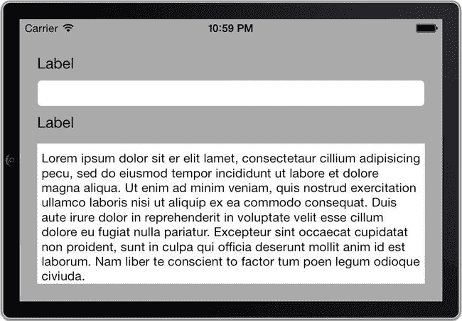

图 3-9. 利用自动布局的横屏模式下的模拟应用程序

现在您已经知道如何使用建议的约束作为起点，也知道了如何使用 Control-点击并拖动的方法添加约束。还有一种添加和操作约束的方法，即使用 Pin 菜单。

### 使用 Pin 菜单添加约束

由于我们已经有了场景所需的所有约束，因此需要先删除一些约束才能演示 Pin 菜单。选择文本视图，然后从问题解决菜单中选择"清除约束"。

> **注意：** 您可以通过选中约束线并按下 `delete` 键来单独删除约束。

从文本视图中移除所有约束后，选中文本视图（如果尚未选中），然后按下 `Pin` 按钮调出其菜单，如图 3-10 所示。填入顶部、右侧、左侧和底部到最近邻居的距离值。如果没有邻居，那么到最近邻居的距离将变为到父视图边缘的距离。也就是说，如果某个标签与其屏幕边缘（父视图）之间没有其他元素，那么最近的邻居就是屏幕边缘。

请注意，已经提供了建议值。尽管如此，您实际上必须手动输入它们才能生效。因此，请输入以下值并点击"添加约束"：

- **顶部：** 13
- **左侧：** 20
- **右侧：** 20
- **底部：** 20

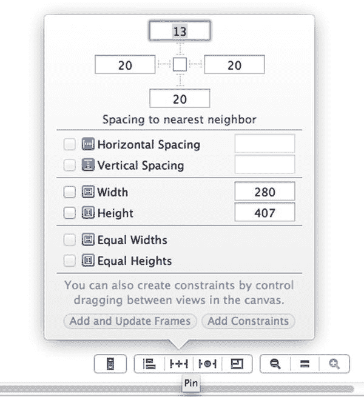

图 3-10. 使用 Pin 菜单向文本视图添加缺失的约束

现在再次选择文本视图，查看已添加的约束。您应该会看到四个新约束，如图 3-11 所示。

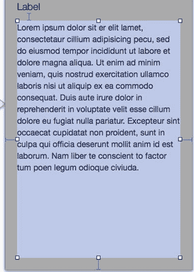

图 3-11. 从 Pin 菜单添加的约束

### 约束优先级

与 `Xcode 4` 版本的自动布局相比，`Xcode 5` 中这些新的自动布局更改极大地节省了时间。但是，如果您想让`名称`文本字段具有稍有不同的布局行为，例如，在不希望它在设备方向切换时宽度超过某个特定值时，该怎么办？（人机交互中有一个常见原则：输入字段的大小应反映预期内容的大小）。假设您希望`名称`文本字段在屏幕旋转时宽度增加，但最多不超过 350 像素。这正是自动布局开始大放异彩的地方。

转换为约束的语言，您想要添加一个约束，规定文本字段的宽度不得超过 350 像素。然而，添加此约束会产生一个逻辑问题。当屏幕旋转时，系统无法同时满足这两个约束。固定文本字段右边缘的约束与其最大宽度的约束冲突。

对此您能做什么呢？一种想法是移除 Interface Builder 插入的约束。然而，无需多想就能意识到，这会让您得到一个对许多值都成立、但不足以确定一个值的约束。不，您需要这两个约束：您希望文本字段的右边缘固定在屏幕右边缘，除非这导致其宽度超过 350 像素。解决方案是约束优先级。

自动布局提供了为单个约束设置介于 0 和 1000 之间的优先级值的可能性。值为 1000 表示该约束是必需的，但对于任何其他值，优先级较高的约束具有优先权。在这种情况下，这意味着您可以将宽度约束设为必需，但为"固定到右边缘"约束设置较低的优先级。然后，当屏幕旋转时，宽度约束将"胜出"，您将获得所寻求的效果。

首先添加宽度约束。选择文本字段，然后点击位于 Interface Builder 右下角的自动布局栏中的 `Pin` 按钮。然后选择宽度约束，如图 3-12 所示。现在，您可以保持宽度值不变。点击"添加约束"按钮。

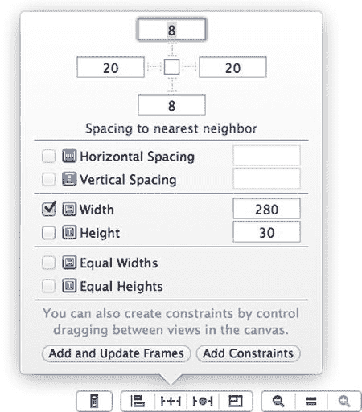

图 3-12. Interface Builder 中的自动布局栏允许您添加自己的约束

现在通过点击选择新添加的宽度约束。在新建宽度约束的属性检查器中，将关系设置为"小于或等于"，常数值设为 `350`。将优先级保持为 `1,000`（必需），如图 3-13 所示。

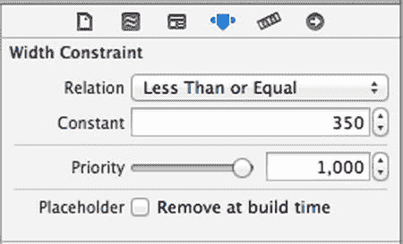

图 3-13. 将宽度约束设置为"小于或等于" `350`

现在剩下的工作是降低"尾部间距到父视图"约束的优先级。确保文本字段被选中，然后选择右侧约束，即文本字段边缘和视图控制器边缘之间的那个约束。将其属性值更改为 `500`，如图 3-14 所示。

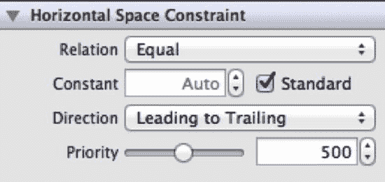

图 3-14. 将约束优先级降低至 `500`

如果您正确完成了最后一步，您的新约束应该类似于图 3-15。宽度约束上出现了一个表示"小于或等于"大小的圆圈，而较低优先级的约束现在显示为虚线。

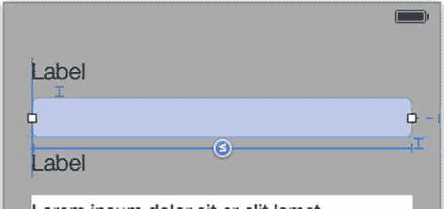

图 3-15. 表示"小于或等于"大小的约束，右侧约束具有较低优先级


如果你现在构建并运行应用程序，你会发现在旋转设备时，文本字段会增大，但最大宽度仍保持在 350 像素，如图 3-16 所示。

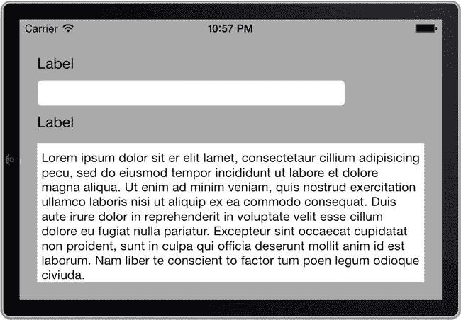

图 3-16. 一个包含宽度约束为 350 像素的文本字段的用户界面

### 添加尾部按钮

让我们让事情变得稍微复杂一点。如果希望在保持当前宽度约束的同时，在文本字段右侧添加一个按钮，该怎么办？你可以使用 Auto Layout 来实现。在本节中，我们将创建一个尾部按钮，该按钮将固定在文本字段的尾部（此处为右侧）边缘。

在开始添加约束之前，最好先停下来，从约束的角度思考布局。你应该执行以下操作：

-   允许文本字段的宽度小于或等于 350。
-   将文本字段的尾部边缘固定到按钮的前导边缘。
-   将按钮的尾部边缘固定到屏幕的尾部边缘，除非第一个约束被违反。

**注意：** 我们之所以使用“前导”和“尾部”而不是“左”和“右”（它们同样是有效的属性），是因为“尾部”和“前导”被定义为能够适应文本方向的变化，例如，在从右向左阅读的希伯来语中，前导变成了右，尾部变成了左，用户界面也会相应调整。这是使用 Auto Layout 的另一个原因。

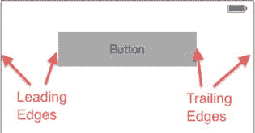

图 3-17. 在从左到右的语言环境中，前导和尾部边缘

在将按钮添加到用户界面之前，请删除文本字段上的尾部边缘约束，并将文本字段的宽度调整为 199 点。你可以在实用工具面板的尺寸检查器中轻松更改此值。目前，不要担心移除该约束后出现的警告。

现在，在文本字段的右侧添加一个新按钮，并将其吸附到右侧的默认吸附线上。你可以使用“重置为建议约束”来添加约束，这也能正常工作，但为了更好地理解，我们使用 Control-单击方法，步骤如下：

-   Control-单击并从文本字段拖拽到按钮，然后从弹出菜单中选择“Center Y”。
-   Control-单击并从按钮拖拽到视图控制器的边缘，然后选择“Trailing Space to Container”。
-   Control-单击并从文本字段的尾部边缘拖拽到按钮的前导边缘，然后选择“Horizontal Spacing”。
-   选中按钮，然后从 Pin 菜单中选择“添加宽度和高度”。你无需输入值，直接使用默认值即可。
-   选中在按钮尾部边缘和右侧容器之间创建的约束，并将其优先级更改为 500。

如果你操作正确，你的约束应该类似于图 3-18。

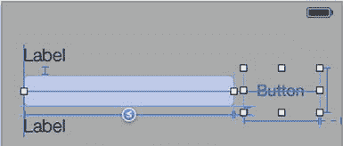

图 3-18. 正确的尾部按钮约束

**注意：** 虽然通常不应该为内容大小可能变化的对象添加固定宽度，但我们在此示例中不得不添加固定宽度。这是因为，如果文本字段和按钮都没有固定宽度，Auto Layout 将不知道应该拉伸哪一个。

所有约束都就位后，构建并运行你的应用程序。当旋转时，用户界面应完美地适应，将文本字段保持在最大宽度，同时按钮固定在它的右侧，如图 3-19 所示。

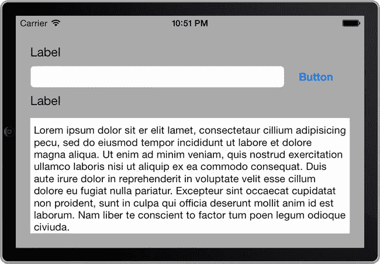

图 3-19. 一个包含宽度约束为 350 像素的文本字段且按钮在其右侧的用户界面

#### 禁用 Auto Layout

相比之下，我们来看看禁用 Auto Layout 后应用程序的行为。选择整个视图控制器，转到 Xcode 右侧“实用工具”视图面板中的文件检查器。在“Interface Builder 文档”部分（见图 3-20），取消选中“Use Auto Layout”。

**注意：** 通常不建议禁用 Auto Layout 然后重新启用，因为这会清除你所有的约束。

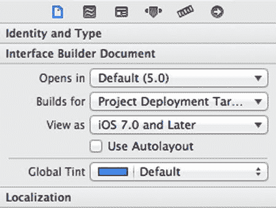

图 3-20. 新项目默认启用了 Auto Layout

现在再次构建并运行应用程序。如图 3-21 所示，旋转设备会导致用户体验显著变差。

**注意：** 这种行为与你一开始从未添加任何约束时看到的情况完全一致。

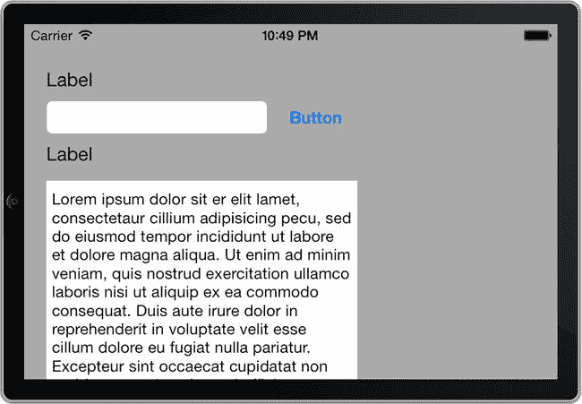

图 3-21. 未启用 Auto Layout 的横向用户界面

#### 使用预览工具

Xcode 5 新增的一个便捷功能是预览工具，它允许你在不模拟的情况下预览其他方向或设备上的 Auto Layout 效果。你可以通过点击“Related Files”按钮，导航到“Preview”，然后按住“Option”和“Shift”键的同时点击“Main.storyboard”来打开预览工具，如图 3-22 所示。

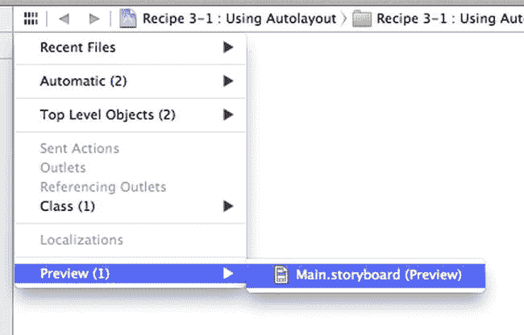

图 3-22. 打开预览工具

接下来，你会看到一个弹出对话框。点击“+”按钮（如图 3-23 中高亮所示），然后按下“Enter”键。这会将你的故事板编辑器窗口拆分为一个预览窗口。

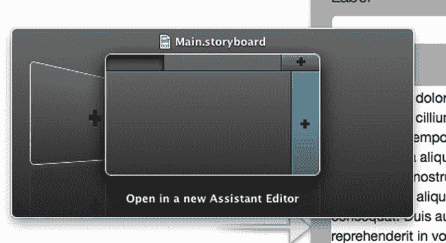

图 3-23. 打开预览工具

你可以从新预览窗口的右下角选择方向和设备，如图 3-24 所示。你会注意到约束已被我们重新添加。

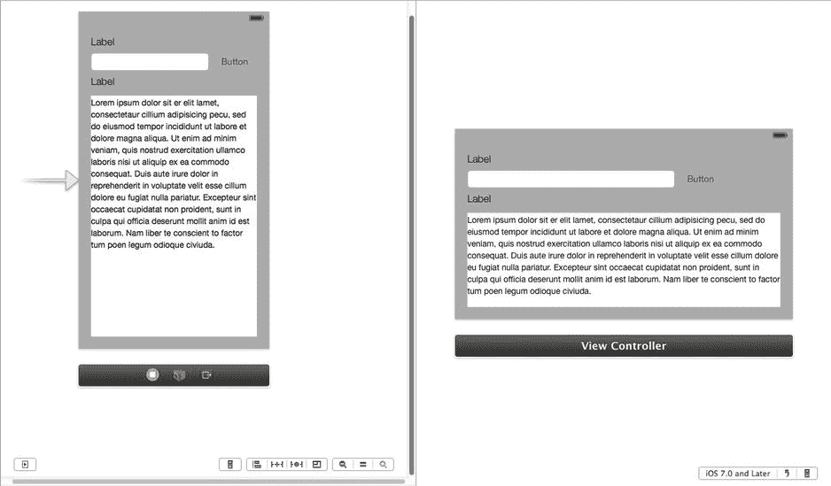

图 3-24. 右侧带有横向布局预览的故事板编辑器窗口

尽管简单，但我们希望前面的示例能让你看到 Auto Layout 的各种可能性。下一个技巧将其提升到一个新的水平，你将从代码中创建约束，从而构建真正动态的布局。

## 技巧 3-2：用代码编写 Auto Layout

设置 Auto Layout 约束的首选方法是使用 Interface Builder，如技巧 3.2 所示。主要原因是 Interface Builder 更容易诊断错误的约束，而且速度也快得多。

然而，在某些情况下你无法在 Interface Builder 中定义 Auto Layout 约束，例如，如果你在代码中动态创建用户界面组件。对于这些情况，你需要回归到代码来设置约束。在这个技巧中，我们将向你展示如何操作。


### 设置应用程序

在本教程中，你将构建一个简单的应用，其中包含三个按钮：一个用于向屏幕添加新的图像视图，一个用于移除最后添加的图像视图，还有一个用于移除所有已添加的图像视图。你将使用 **Auto Layout** 将按钮排列在屏幕顶部的一行中。你还将使用 Auto Layout 来定位图像视图，使它们相互重叠，最后添加的图像视图位于最上方，并且每个图像视图的尺寸相比前一个增加 10%。

首先，创建一个新的单视图应用程序，然后向其视图控制器添加以下属性，如代码清单 3-1 所示。

**代码清单 3-1.** 向 `ViewController.h` 添加界面属性

```
//
//  ViewController.h
//  Recipe 2.2 Coding Auto Layout
//
#import <UIKit/UIKit.h>

@interface ViewController : UIViewController

@property (strong, nonatomic) UIButton *addButton;
@property (strong, nonatomic) UIButton *removeButton;
@property (strong, nonatomic) UIButton *clearButton;
@property (strong, nonatomic) NSMutableArray *imageViews;
@property (strong, nonatomic) NSMutableArray *imageViewConstraints;

@end
```

直接通过代码使用一个 `helper` 方法来创建这三个按钮，以减少代码重复。切换到 `ViewController.m` 并添加代码清单 3-2 所示的代码。

**代码清单 3-2.** 在 `ViewController.m` 文件中添加一个辅助方法来创建三个按钮

```
- (UIButton *)addButtonWithTitle:(NSString *)title action:(SEL)selector
{
    UIButton *button = [UIButton buttonWithType:UIButtonTypeSystem];
    [button setTitle:title forState:UIControlStateNormal];
    [button addTarget:self action:selector forControlEvents:UIControlEventTouchUpInside];
    button.translatesAutoresizingMaskIntoConstraints = NO;
    [self.view addSubview:button];
    return button;
}
```

代码清单 3-2 使用提供的标题和动作方法创建了一个新按钮。这里值得注意的是，它将按钮的 `translatesAutoresizingMaskIntoConstraints` 属性设置为 `NO`。如果你要定义自己的 Auto Layout 约束，这一点非常重要；否则，你很可能会遇到约束冲突。代码清单 3-3 对此有更详细的说明。

> **注意：** 使用 Auto Layout 时，你不必显式设置视图的 frame。相反，视图的位置和大小由你定义的约束决定。

有了 `helper` 方法后，你可以转向 `viewDidLoad` 方法，并添加代码来创建按钮，如代码清单 3-3 所示。

**代码清单 3-3.** 调用辅助方法来创建三个按钮

```
- (void)viewDidLoad
{
    [super viewDidLoad];
    self.addButton = [self addButtonWithTitle:@"Add" action:@selector(addImageView)];
    self.removeButton = [self addButtonWithTitle:@"Remove" action:@selector(removeImageView)];
    self.clearButton = [self addButtonWithTitle:@"Clear" action:@selector(clearImageViews)];
}
```

接下来，如代码清单 3-4 所示，为三个按钮的每个动作方法添加存根。你将在稍后实现这些方法，但暂时将它们留空。

**代码清单 3-4.** 为按钮动作添加占位存根

```
- (void)addImageView
{
}

- (void)removeImageView
{
}

- (void)clearImageViews
{
}
```

如果现在运行你的应用程序，你将只会看到一片白屏。按钮不会显示，因为你还没有定义任何 Auto Layout 约束来指定它们的位置和大小。那么，让我们继续完成这项工作。

从代码中创建约束有两种主要方式。你可以使用 **视觉格式语言**，这是一种用于定义 Auto Layout 约束的视觉描述性语法；或者你可以使用 `constraintWithItem:attribute:relatedBy:toItem:attribute:multiplier:constant:` 方法。前者的优势在于能更好地可视化所创建的约束；而后者则提供了完整性（并非所有约束都能通过视觉格式语言表达）。

通常，你会混合使用这两种方式来创建约束。在此案例中，我们将使用格式语言来定位按钮，并混合使用两种方法来放置图像视图。


### 可视化格式语言

在继续创建约束之前，让我们快速了解一下可视化格式语言。例如，以下字符串定义的约束将 `button2` 紧邻 `button1` 放置，两者间距为 20 像素：

```
[button1]-20-[button2]
```

单个连字符表示默认间距：

```
[button1]-[button2]
```

以下是相同约束，但用于垂直布局：

```
V:[button1]-[button2]
```

虽然水平是默认方向，但你可以显式声明：

```
H:[button1]-[button2]
```

朝向父视图的间距使用 `|` 字符表示。以下示例表明 `textField` 应固定到父视图的头部和尾部两端，并使用默认间距：

```
|-[textField]-|
```

你也可以定义组件的尺寸。此示例指定 `button1` 宽度为 50 像素，`button2` 与 `button1` 宽度相同：

```
[button1(50)]-[button2(==button1)]
```

还可以使用不等式，如下例所示，它指定 `button1` 的宽度至少为 50 像素：

```
[button1(>=50)]
```

你可以同时设置最小宽度和最大宽度：

```
[button1(>=50, <=100)]
```

你也可以在尺寸约束上设置优先级。例如，`button1` 的宽度至少为 50 像素，但优先级为 500，这使其成为非必需但期望的约束：

```
[button1(>=50@500)
```

表 3-1 展示了可视化格式语言的语法元素和一些额外示例。

**表 3-1.** 可视化格式语言语法元素

| 语法元素 | 示例 | 描述 |
| --- | --- | --- |
| `H:`, `V:` | `H:\|-[statusLabel]-\|` `V:\|[textView]\|` | 水平或垂直方向。默认方向为水平，因此 `H:` 可以省略。 |
| `\|` | `\|[textView]\|` | 表示父视图；位于左侧则表示其头部，位于右侧则表示其尾部 |
| `-` | `[button1]-[button2]` | 标准间距 |
| `-N-` | `\|-20-[view]` | 大小为 N 的间距 |
| `[view]` | | 表示一个子视图 |
| `==`, `>=`, `<=` | `[view1(==view2)]` `[view(>=30, <=100)]` | 关系运算符。仅能用于尺寸约束 |
| `@N` | `[view(==50@500)]` `[view1(==view2@500, >=30)]` | 约束优先级。仅能用于尺寸约束。默认优先级为 1000（即必需约束） |

现在，让我们添加约束，将三个按钮在屏幕顶部排成一行。由于这些约束始终相同，我们直接在 `viewDidLoad` 方法中添加它们。首先创建一个包含按钮及其标识键的字典，如代码清单 3-5 所示。自动布局使用该字典将格式语言字符串中的标识符映射到对应的视图（此例中为按钮）。

**代码清单 3-5.** 为按钮及其标识键创建字典

```
NSDictionary *viewsDictionary =
[[NSDictionary alloc] initWithObjectsAndKeys:
self.addButton, @"addButton",
self.removeButton, @"removeButton",
self.clearButton, @"clearButton", nil];
```

然后，添加约束将这些按钮在一行中彼此固定。这是通过调用主视图的 `addConstraints:constraintsWithVisualFormat:options:metrics:views:` 方法实现的，并提供可视化格式字符串（以粗体标示），如代码清单 3-6 所示。

**代码清单 3-6.** 添加约束以将按钮彼此固定

```
[self.view addConstraints:[NSLayoutConstraint
constraintsWithVisualFormat:@"H:|-[addButton]-[removeButton]-[clearButton]"
options:0 metrics:nil views:viewsDictionary]];
```

接下来，将按钮固定到屏幕顶部，如代码清单 3-7 所示。

**代码清单 3-7.** 将按钮固定到屏幕顶部

```
[self.view addConstraints:[NSLayoutConstraint
constraintsWithVisualFormat:@"V:|-[addButton]"
options:0 metrics:nil views:viewsDictionary]];

[self.view addConstraints:[NSLayoutConstraint
constraintsWithVisualFormat:@"V:|-[removeButton]"
options:0 metrics:nil views:viewsDictionary]];

[self.view addConstraints:[NSLayoutConstraint
constraintsWithVisualFormat:@"V:|-[clearButton]"
options:0 metrics:nil views:viewsDictionary]];
```

此时 `viewDidLoad` 方法应如代码清单 3-8 所示。

**代码清单 3-8.** 将代码清单 3-5 至 3-7 添加后的 `viewDidLoad` 方法

```
- (void)viewDidLoad
{
[super viewDidLoad];
self.addButton = [self addButtonWithTitle:@"Add" action:@selector(addImageView)];
self.removeButton = [self addButtonWithTitle:@"Remove" action:@selector(removeImageView)];
self.clearButton = [self addButtonWithTitle:@"Clear" action:@selector(clearImageViews)];

NSDictionary *viewsDictionary =
[[NSDictionary alloc] initWithObjectsAndKeys:
self.addButton, @"addButton",
self.removeButton, @"removeButton",
self.clearButton, @"clearButton", nil];

[self.view addConstraints:[NSLayoutConstraint
constraintsWithVisualFormat:@"H:|-[addButton]-[removeButton]-[clearButton]"
options:0 metrics:nil views:viewsDictionary]];

[self.view addConstraints:[NSLayoutConstraint
constraintsWithVisualFormat:@"V:|-[addButton]"
options:0 metrics:nil views:viewsDictionary]];

[self.view addConstraints:[NSLayoutConstraint
constraintsWithVisualFormat:@"V:|-[removeButton]"
options:0 metrics:nil views:viewsDictionary]];

[self.view addConstraints:[NSLayoutConstraint
constraintsWithVisualFormat:@"V:|-[clearButton]"
options:0 metrics:nil views:viewsDictionary]];
}
```

现在你可以构建并运行应用程序了。你的屏幕应类似于图 3-25。

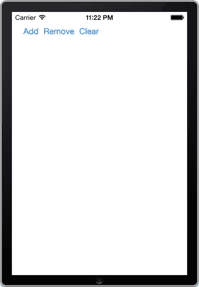

**图 3-25.** 使用自动布局定位的一行按钮

确认布局符合预期后，接下来需要实现各个按钮的操作方法。我们将从添加图像视图开始。


### 添加图像视图

在继续实现 `addImageView` 操作方法之前，你需要进行一些额外的设置和初始化工作。首先，你需要准备一张用于填充图像视图的图片。（为简化操作，所有图像视图将使用同一张图片。）通过访达窗口，将你喜欢的 PNG 格式图片拖拽到项目的 Supporting Files 文件夹中。（第一章详细介绍了如何向 Xcode 项目添加图片等资源文件。）在以下代码中，请务必将图片名称“`sweflag`”（这是我们选择的图片名称）替换为你自己的图片文件名。

接下来，初始化你在本教程开头添加到视图控制器头文件中的两个数组属性。将代码清单 3-9 中的代码添加到 `viewDidLoad` 方法中。为简洁起见，创建三个按钮及其约束的代码已被移除。

**代码清单 3-9.** 初始化用于存放图像视图及其约束的两个数组属性

```
- (void)viewDidLoad
{
    [super viewDidLoad];
    // ...
    self.imageViews = [[NSMutableArray alloc]initWithCapacity:10];
    self.imageViewConstraints = [[NSMutableArray alloc]initWithCapacity:10];
}
```

现在实现 `addImageView` 操作方法，如代码清单 3-10 所示。

**代码清单 3-10.** 实现 addImageView 操作方法

```
- (void)addImageView
{
    UIImage *image = [UIImage imageNamed:@"sweflag"];
    UIImageView *imageView = [[UIImageView alloc] initWithImage:image];
    [self.view addSubview:imageView];
    imageView.translatesAutoresizingMaskIntoConstraints = NO;
    [self.imageViews addObject:imageView];
    [self rebuildImageViewsConstraints];
}
```

代码清单 3-10 的实现很直接：创建图像视图并添加到主视图中；将其 `translatesAutoresizingMaskIntoConstraints` 属性设置为 `NO`，以避免与你稍后设置的自定义约束冲突；将自身添加到 `imageViews` 数组以便后续引用；最后触发对所有图像视图约束的重建。

### 定义图像视图的约束

`rebuildImageViewsConstraints` 辅助方法会移除所有旧的图像视图约束并重新创建它们。不含实际约束创建逻辑的基本结构如代码清单 3-11 所示。

**代码清单 3-11.** rebuildImageViewsConstraints 方法的起点

```
- (void)rebuildImageViewsConstraints
{
    [self.view removeConstraints:self.imageViewConstraints];
    [self.imageViewConstraints removeAllObjects];
    if (self.imageViews.count == 0)
        return;
    // TODO: 构建 imageViewConstraints 数组
    [self.view addConstraints:self.imageViewConstraints];
}
```

要构建 `imageViewConstraints` 数组（从代码清单 3-11 中的代码注释处开始），首先创建约束将第一个图像视图固定在屏幕左侧，并紧挨在按钮行下方。同时，将第一个图像视图的大小设置为 50x50 点。代码清单 3-12 展示了这段代码。

**代码清单 3-12.** 构建 imageViewConstraints 数组

```
UIImageView *firstImageView = [self.imageViews objectAtIndex:0];
NSDictionary *viewsDictionary = [[NSDictionary alloc]
    initWithObjectsAndKeys:self.addButton, @"firstButton", firstImageView, @"firstImageView", nil];

// 将第一个视图固定到左上角
[self.imageViewConstraints addObjectsFromArray:[NSLayoutConstraint
    constraintsWithVisualFormat:@"H:|-[firstImageView(50)]"
    options:0 metrics:nil views:viewsDictionary]];
[self.imageViewConstraints addObjectsFromArray:[NSLayoutConstraint
    constraintsWithVisualFormat:@"V:[firstButton]-[firstImageView(50)]"
    options:0 metrics:nil views:viewsDictionary]];
```

剩余的每个图像视图（如果有）都会相对于前一个图像视图向右和向下偏移 10 像素。此外，为了视觉效果，每个图像都比前一个大 10%。用伪代码表示，你应该这样做：

```
imageView(N).X = imageView(N-1).X + 10;
imageView(N).Y = imagView(N-1).Y + 10;
imageView(N).Width = imageView(N-1).Width * 1.1;
imageView(N).Height = imageView(N-1).Height * 1.1;
```

遗憾的是，你无法使用可视化格式语言将其转换为 Auto Layout 约束。相反，你必须显式创建相应的约束，如代码清单 3-13 所示。

**代码清单 3-13.** 显式创建用于图像重叠和偏移的约束

```
if (self.imageViews.count > 1)
{
    UIImageView *previousImageView = firstImageView;
    for (int i=1; i < self.imageViews.count; i++)
    {
        UIImageView *imageView = [self.imageViews objectAtIndex:i];
        [self.imageViewConstraints addObject:[NSLayoutConstraint
            constraintWithItem:imageView attribute:NSLayoutAttributeLeading
            relatedBy:NSLayoutRelationEqual
            toItem:previousImageView attribute:NSLayoutAttributeLeading
            multiplier:1 constant:10]];
        [self.imageViewConstraints addObject:[NSLayoutConstraint
            constraintWithItem:imageView attribute:NSLayoutAttributeTop
            relatedBy:NSLayoutRelationEqual
            toItem:previousImageView attribute:NSLayoutAttributeTop
            multiplier:1 constant:10]];
        [self.imageViewConstraints addObject:[NSLayoutConstraint
            constraintWithItem:imageView attribute:NSLayoutAttributeWidth
            relatedBy:NSLayoutRelationEqual
            toItem:previousImageView attribute:NSLayoutAttributeWidth
            multiplier:1.1 constant:0]];
        [self.imageViewConstraints addObject:[NSLayoutConstraint
            constraintWithItem:imageView attribute:NSLayoutAttributeHeight
            relatedBy:NSLayoutRelationEqual
            toItem:previousImageView attribute:NSLayoutAttributeHeight
            multiplier:1.1 constant:0]];
        previousImageView = imageView;
    }
}
```

> **注意：** Auto Layout 的可视化格式语言在设计时更注重可读性而非完备性。因此，你无法用它来表达重叠、倍率属性引用等特殊情况。对于这些情况，你必须使用 `constraintWithItem:attribute:relatedBy:toItem:attribute:multiplier:constant:` 方法显式创建约束。

完整的 `rebuildImageViewsConstraints` 方法完成后应如代码清单 3-14 所示。


### 清单 3-14. 完整的 `rebuildImageViewsConstraints` 方法

```objective-c
- (void)rebuildImageViewsConstraints
{
    [self.view removeConstraints:self.imageViewConstraints];
    [self.imageViewConstraints removeAllObjects];
    if (self.imageViews.count == 0)
        return;
    UIImageView *firstImageView = [self.imageViews objectAtIndex:0];
    // 将第一个视图固定在左上角
    NSDictionary *viewsDictionary =
        [[NSDictionary alloc] initWithObjectsAndKeys:
         self.addButton, @"firstButton",
         firstImageView, @"firstImageView", nil];
    [self.imageViewConstraints addObjectsFromArray:[NSLayoutConstraint
        constraintsWithVisualFormat:@"H:|-[firstImageView(50)]"
                            options:0 metrics:nil views:viewsDictionary]];
    [self.imageViewConstraints addObjectsFromArray:[NSLayoutConstraint
        constraintsWithVisualFormat:@"V:[firstButton]-[firstImageView(50)]"
                            options:0 metrics:nil views:viewsDictionary]];
    if (self.imageViews.count > 1)
    {
        UIImageView *previousImageView = firstImageView;
        for (int i=1; i < self.imageViews.count; i++)
        {
            UIImageView *imageView = [self.imageViews objectAtIndex:i];
            [self.imageViewConstraints addObject:[NSLayoutConstraint
                constraintWithItem:imageView attribute:NSLayoutAttributeLeading
                        relatedBy:NSLayoutRelationEqual
                           toItem:previousImageView attribute:NSLayoutAttributeLeading
                       multiplier:1 constant:10]];
            [self.imageViewConstraints addObject:[NSLayoutConstraint
                constraintWithItem:imageView attribute:NSLayoutAttributeTop
                        relatedBy:NSLayoutRelationEqual
                           toItem:previousImageView attribute:NSLayoutAttributeTop
                       multiplier:1 constant:10]];
            [self.imageViewConstraints addObject:[NSLayoutConstraint
                constraintWithItem:imageView attribute:NSLayoutAttributeWidth
                        relatedBy:NSLayoutRelationEqual
                           toItem:previousImageView attribute:NSLayoutAttributeWidth
                       multiplier:1.1 constant:0]];
            [self.imageViewConstraints addObject:[NSLayoutConstraint
                constraintWithItem:imageView attribute:NSLayoutAttributeHeight
                        relatedBy:NSLayoutRelationEqual
                           toItem:previousImageView attribute:NSLayoutAttributeHeight
                       multiplier:1.1 constant:0]];
            previousImageView = imageView;
        }
    }
    [self.view addConstraints:self.imageViewConstraints];
}
```

现在剩下的唯一任务是实现删除最后一个图像视图和删除所有图像视图的动作方法。该实现如清单 3-15 所示。

### 清单 3-15. 删除和清除图像视图的动作方法实现

```objective-c
- (void)removeImageView
{
    if (self.imageViews.count > 0)
    {
        [self.imageViews.lastObject removeFromSuperview];
        [self.imageViews removeLastObject];
        [self rebuildImageViewsConstraints];
    }
}

- (void)clearImageViews
{
    if (self.imageViews.count > 0)
    {
        for (int i=self.imageViews.count - 1; i >= 0; i--)
        {
            UIImageView *imageView = [self.imageViews objectAtIndex:i];
            [imageView removeFromSuperview];
            [self.imageViews removeObjectAtIndex:i];
        }
        [self rebuildImageViewsConstraints];
    }
}
```

清单 3-15 中的方法相当直接明了。在 `removeImageView` 动作中，检查是否有任何图像视图。如果存在图像视图，则从视图中移除该对象，然后从包含它的数组中移除它。`clearImageViews` 执行与 `removeImageView` 动作相同的操作，区别在于它会遍历数组中的每个图像视图，并逐个移除它们。这两个方法在完成图像视图移除后都会重建约束。

你的应用现在已经完成。如果你构建并运行它，应该能够使用三个按钮反复添加和删除图像视图。图 3-26 展示了一个已添加多个图像视图的示例。

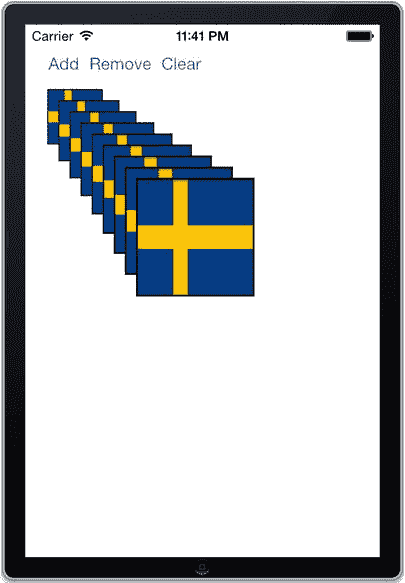

**图 3-26.** 使用 Auto Layout 定位的重叠图像视图

如图 3-27 所示，得益于 Auto Layout，该应用在横向模式下同样运行良好。

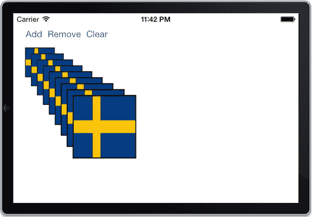

**图 3-27.** 旋转至横向模式时，Auto Layout 自动调整布局

## 方案 3-3：调试 Auto Layout 代码

代码中的 Auto Layout 错误可能很难处理，因为你无法像在 Interface Builder 中那样直观地看到错误。一般的建议是在开始编写约束代码之前仔细思考。然而，为了尽量减少试错模式下的时间，了解有问题的布局到底出了什么问题至关重要。换句话说，你需要知道如何调试它。

除了可视化格式字符串中的语法错误之外，Auto Layout 代码失败主要有两种方式。第一种是**不满足性**，这意味着存在两个或更多相互冲突的约束，导致布局引擎无法同时满足它们。第二种方式是由**歧义性**引起的。当定义的约束不够具体，导致布局引擎对某个属性有多种可能的值时，就会发生这种情况。

> **注意**  
> 当你以编程方式使用自动布局时，错误属于不满足性（约束冲突）或在 Interface Builder 中可视化创建布局时产生的歧义两类。还有第三种错误类型称为**视图位置错误**，表示位置或大小不匹配。可视化编辑器中的橙色线条指示了所有这些错误。

在本方案中，我们将展示不满足约束和歧义约束的示例。我们将向你展示如何识别和处理它们。


### 处理歧义布局

首先，你需要新建一个项目，请使用“单视图应用”模板创建。我们将从一个简单的歧义布局示例开始。假设你想通过代码在屏幕顶部添加三个等大的按钮。在视图控制器的 `viewDidLoad` 方法中，添加清单 3-16 中的代码来创建按钮并将其添加到主视图中。

**清单 3-16.** 创建按钮并添加到主视图

```
- (void)viewDidLoad
{
    [superviewDidLoad];
    UIButton *button1 = [UIButtonbuttonWithType:UIButtonTypeSystem];
    [button1 setTitle:@"Button 1"forState:UIControlStateNormal];
    button1.translatesAutoresizingMaskIntoConstraints = NO;
    [self.viewaddSubview:button1];
    UIButton *button2 = [UIButtonbuttonWithType:UIButtonTypeSystem];
    [button2 setTitle:@"Button 2"forState:UIControlStateNormal];
    button2.translatesAutoresizingMaskIntoConstraints = NO;
    [self.viewaddSubview:button2];
    UIButton *button3 = [UIButtonbuttonWithType:UIButtonTypeSystem];
    [button3 setTitle:@"Button 3"forState:UIControlStateNormal];
    button3.translatesAutoresizingMaskIntoConstraints = NO;
    [self.viewaddSubview:button3];
}
```

然后添加约束，将按钮固定到屏幕顶部，如清单 3-17 所示。

**清单 3-17.** 添加约束将按钮固定到屏幕顶部

```
- (void)viewDidLoad
{
    [super viewDidLoad];
    // ...
    NSDictionary *viewsDictionary = NSDictionaryOfVariableBindings(button1, button2, button3);
    [self.view addConstraints:[NSLayoutConstraint constraintsWithVisualFormat:@"V:|-[button1]"
                                                     options:0 metrics:nil views:viewsDictionary]];
    [self.view addConstraints:[NSLayoutConstraint constraintsWithVisualFormat:@"V:|-[button2]"
                                                     options:0 metrics:nil views:viewsDictionary]];
    [self.view addConstraints:[NSLayoutConstraint constraintsWithVisualFormat:@"V:|-[button3]"
                                                     options:0 metrics:nil views:viewsDictionary]];
}
```

**注意：** `NSDictionaryOfVariableBindings()` 是一个便捷函数，用于创建 `NSLayoutConstraint` 所需的字典，从而将可视化格式字符串中的标识符映射到对应的视图。它会以变量名作为键，为提供的视图创建条目。

最后，添加水平布局约束，将按钮相互固定，并与屏幕边界固定，如清单 3-18 所示。

**清单 3-18.** 添加约束水平固定按钮相互之间以及与屏幕边界的关系

```
- (void)viewDidLoad
{
    [super viewDidLoad];
    // ...
    [self.view addConstraints:[NSLayoutConstraint
        constraintsWithVisualFormat:@"|-[button1]-[button2]-[button3]-|"
        options:0 metrics:nil views:viewsDictionary]];
}
```

构建并运行应用，你期望看到按钮在屏幕顶部整齐地排成一行。按钮确实出现了，但当你旋转屏幕时，如图 3-28 所示，其中一个按钮明显比其他两个宽。

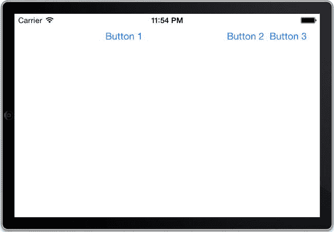

**图 3-28.** 由于歧义约束，其中一个按钮比其他两个宽

这是怎么回事？当出现这种情况时，你的第一反应可能是约束存在歧义。为了验证是否如此，保持应用运行，返回 Xcode 并点击调试区域工具栏中的“暂停程序执行”按钮（见图 3-29）。

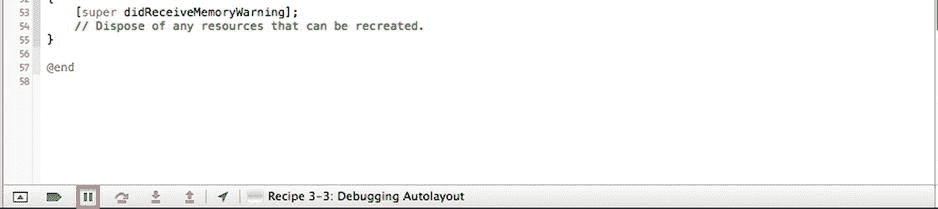

**图 3-29.** Xcode 中的“暂停程序执行”按钮

程序暂停后，你可以在 `(lldb)` 提示符下输入以下命令：

```
po [[UIWindow keyWindow] _Auto LayoutTrace]
```

然后你会得到一个追踪信息，显示这三个按钮确实存在歧义布局（见图 3-30）。

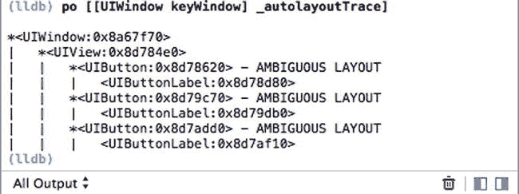

**图 3-30.** 指示歧义布局的 Auto Layout 追踪信息

**注意：** `po`（或 `print-object`）是一个调试器命令，用于打印对象的描述文本。在调试应用时，它是一个非常有用的工具。

那么问题到底是什么？通常，当出现歧义布局时，问题意味着你缺少一个或多个约束。本例的问题在于你未足够明确地指定按钮的宽度。你只说了按钮应该相互固定并与屏幕边缘固定，所以当屏幕尺寸增大时，布局引擎有多种选择：它可以增加第一个按钮的宽度、增加第二个按钮的宽度，等等。

然而，你想要的是所有按钮宽度相等。要解决这个问题，只需添加约束，指定 `button2` 和 `button3` 与 `button1` 宽度相同，如清单 3-19 所示。

**清单 3-19.** 设置 `button2` 和 `button3` 宽度相等

```
- (void)viewDidLoad
{
    [super viewDidLoad];
    // ...
    NSDictionary *viewsDictionary = NSDictionaryOfVariableBindings(button1, button2, button3);
    [self.view addConstraints:[NSLayoutConstraint constraintsWithVisualFormat:@"V:|-[button1]"
                                                     options:0 metrics:nil views:viewsDictionary]];
    [self.view addConstraints:[NSLayoutConstraint constraintsWithVisualFormat:@"V:|-[button2]"
                                                     options:0 metrics:nil views:viewsDictionary]];
    [self.view addConstraints:[NSLayoutConstraint constraintsWithVisualFormat:@"V:|-[button3]"
                                                     options:0 metrics:nil views:viewsDictionary]];
    [self.view addConstraints:[NSLayoutConstraint
        constraintsWithVisualFormat:@"|-[button1]-[button2(==button1)]-[button3(==button1)]-|"
        options:0 metrics:nil views:viewsDictionary]];
}
```

这样，布局引擎只剩一个选项：等比例增加所有三个按钮的宽度。现在当你构建并运行时，将得到预期结果，如图 3-31 所示。

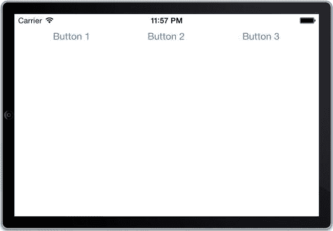

**图 3-31.** 使用约束指定按钮等宽的用户界面


### 处理约束不满足

与约束模糊相反的是约束不满足。在这类情况中，问题原因不是约束太少，而是约束过多，或者两个约束相互冲突。解决起来可能更棘手一些，因为你添加这些约束是有目的的。因此，约束不满足可能表明你犯了逻辑错误，需要重新考虑整个布局。

不过，我们先从一个在约束不满足中常见却简单的错误开始。假设你忘了为某个按钮将 `translatesAutoresizingMaskIntoConstraints` 设置为 `NO`。这通常会导致框架添加的约束（用于自动调整大小掩码）与你自己的约束之间产生冲突。

为了看清会发生什么，请注释掉代码清单 3-20 中设置第三个按钮 `translatesAutoresizingMaskIntoConstraints` 属性的那行代码。

**代码清单 3-20.** 注释掉 `button3` 的 `translatesAutoresizingMaskIntonContraints` 属性

```objc
- (void)viewDidLoad
{
    [super viewDidLoad];
    // ...
    UIButton *button3 = [UIButton buttonWithType:UIButtonTypeRoundedRect];
    [button3 setTitle:@"Button 3" forState:UIControlStateNormal];
    // button3.translatesAutoresizingMaskIntoConstraints = NO;
    [self.view addSubview:button3];
    // ...
}
```

如果现在构建并运行，你会看到按钮似乎从屏幕上消失了，如图 3-32 所示。

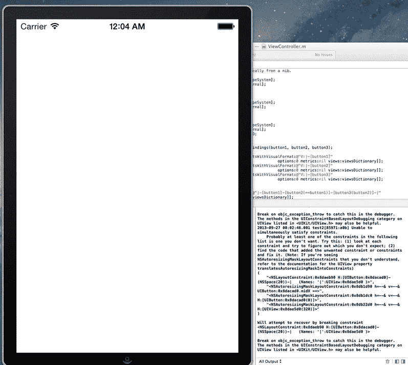

**图 3-32.** 忘记关闭自动创建 autoresizing mask 约束可能导致约束不满足错误

如果查看错误日志，你会看到一段很长的错误文本，开头是失败原因：

`2013-07-05 17:15:53.268 Recipe 3-3: Debugging Auto Layout[40301:c07] Unable to simultaneously satisfy constraints.`

日志列表中至少有一个约束是你不需要的。试试这样做：（1）查看每个约束，找出你不希望出现的那个；（2）找到添加了多余约束的代码并修复它。

> **注意**
> 如果你看到了无法理解的 `NSAutoresizingMaskLayoutConstraints`，请参阅 `UIView` 属性 `translatesAutoresizingMaskIntoConstraints` 的文档。

```
(
    "<NSLayoutConstraint:0x8ded860 H:|-(NSSpace(20))-[UIButton:0x8df8070]   (Names: '|':UIView:0x8df7ee0 )>",
    "<NSLayoutConstraint:0x8ded8b0 H:[UIButton:0x8df8070]-(NSSpace(8))-[UIButton:0x8d75230]>",
    "<NSLayoutConstraint:0x8def8a0 UIButton:0x8d75230.width == UIButton:0x8df8070.width>",
    "<NSLayoutConstraint:0x8def8d0 H:[UIButton:0x8d75230]-(NSSpace(8))-[UIButton:0x8ddf420]>",
    "<NSLayoutConstraint:0x8def910 UIButton:0x8ddf420.width == UIButton:0x8df8070.width>",
    "<NSAutoresizingMaskLayoutConstraint:0x8d6f390 h=--& v=--& UIButton:0x8ddf420.midX ==>"
)
```

确实，你的某个按钮关联了 `NSAutoresizingMaskLayoutConstraints`。问题就在这里。取消注释之前注释掉的那行代码，重新运行应用程序。现在它应该能像之前一样正常工作了。

现在，让我们创建另一个约束不满足布局的例子。假设你想改变前面章节的布局（那个有三个按钮的布局），使得屏幕旋转时按钮宽度不超过 100 点。添加代码清单 3-21 所示的宽度约束。

**代码清单 3-21.** 为所有按钮创建约束，限制其宽度不超过 100 点

```objc
[self.view addConstraints:[NSLayoutConstraint
    constraintsWithVisualFormat:@"|-[button1(<=100)]-[button2(==button1)]-[button3(==button1)]-|"
    options:0 metrics:nil views:viewsDictionary]];
```

如果构建并运行，按钮在竖屏模式下看起来很好，但旋转屏幕时会发生奇怪的事情。如图 3-33 所示，前两个按钮对齐到左侧，而第三个按钮固定在了屏幕右侧。

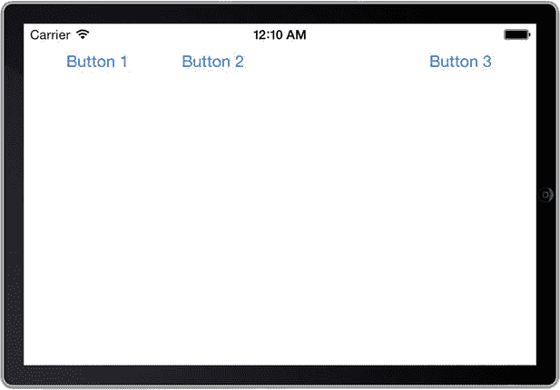

**图 3-33.** 随意添加宽度约束可能导致意外结果

错误日志再次表明你遇到了约束不满足的问题。让我们仔细看看涉及的约束：

```
(
    "<NSLayoutConstraint:0x8da7220 H:|-(NSSpace(20))-[UIButton:0x8da3bd0]   (Names: '|':UIView:0x8da3a40 )>",
    "<NSLayoutConstraint:0x8da7370 H:[UIButton:0x8da3bd0(<=100)]>",
    "<NSLayoutConstraint:0x8da73b0 H:[UIButton:0x8da3bd0]-(NSSpace(8))-[UIButton:0x8d38fd0]>",
    "<NSLayoutConstraint:0x8da73e0 UIButton:0x8d38fd0.width == UIButton:0x8da3bd0.width>",
    "<NSLayoutConstraint:0x8da7410 H:[UIButton:0x8d38fd0]-(NSSpace(8))-[UIButton:0x8d3e3f0]>",
    "<NSLayoutConstraint:0x8da7440 UIButton:0x8d3e3f0.width == UIButton:0x8da3bd0.width>",
    "<NSLayoutConstraint:0x8da7470 H:[UIButton:0x8d3e3f0]-(NSSpace(20))-|   (Names: '|':UIView:0x8da3a40 )>",
    "<NSAutoresizingMaskLayoutConstraint:0x8da7160 h=--& v=--& V:[UIView:0x8da3a40(480)]>"
)
```

两个 `NSAutoresizingMaskLayoutConstraint` 条目与主视图关联，这没问题（你不应该对根视图开启 `translatesAutoresizingMaskIntoConstraints`）。但其他条目提供了线索，说明问题出在哪里。这里的问题在于，你将按钮组固定到了屏幕边缘。所以当屏幕旋转时，按钮宽度会超过 100 像素，布局引擎无法满足你添加的宽度约束。

你需要做的是重新考虑布局。你想要什么？
- 等宽的按钮？
- 按钮之间以默认间距相邻排列？
- 左右按钮分别固定到屏幕边缘，除非这会导致按钮宽度超过 100 像素？如果那样，你是否希望按钮组保持在屏幕中央？

关键在第三点，“除非”表明你应该使用非必需约束；不过，我们先从前两点开始。它们可以用同一个可视化格式字符串表示，如代码清单 3-22 中的粗体所示。

**代码清单 3-22.** 新的可视化格式字符串

```objc
[self.view addConstraints:[NSLayoutConstraint
    constraintsWithVisualFormat:@"[button1(<=100)]-[button2(==button1)]-[button3(==button1)]"
    options:0 metrics:nil views:viewsDictionary]];
```

你可能想知道与代码清单 3-21 相比，我们究竟做了什么改动。仔细看，你会发现左侧和右侧屏幕边缘的约束已被移除（分别由“`|-`”和“`-|`”表示）。

> **注意**
> 你可能想知道为什么在上述格式字符串中没有将 `button1` 固定到屏幕左侧边缘，`button3` 固定到右侧。原因是这些约束不应是必需的，但在可视化格式语言中，你只能对尺寸约束设置优先级（例如，使其非必需）。无法对作用于前缘和后缘等属性的约束设置优先级。

接下来，你需要将按钮组松散地固定到屏幕边缘（间距 20 点），如代码清单 3-23 所示。

**代码清单 3-23.** 添加间距为 20 点的屏幕边缘松散约束

```objc
NSLayoutConstraint *pinToLeft =
    [NSLayoutConstraint
        constraintWithItem:button1 attribute:NSLayoutAttributeLeading
        relatedBy:NSLayoutRelationEqual
        toItem:self.view attribute:NSLayoutAttributeLeading
        multiplier:1 constant:20];
pinToLeft.priority = 500;
[self.view addConstraint:pinToLeft];

NSLayoutConstraint *pinToRight =
    [NSLayoutConstraint
        constraintWithItem:button3 attribute:NSLayoutAttributeTrailing
        relatedBy:NSLayoutRelationEqual
        toItem:self.view attribute:NSLayoutAttributeTrailing
        multiplier:1 constant:20];
pinToRight.priority = 500;
[self.view addConstraint:pinToRight];
```


最后，你需要一个约束来告诉这个组在屏幕中居中。这个约束可以是必需的，因为即使该组被固定在屏幕边缘，它依然成立。添加如代码清单 3-24 所示的代码。

**代码清单 3-24** 为组创建居中约束

```
NSLayoutConstraint *center =
[NSLayoutConstraint
constraintWithItem:button2 attribute:NSLayoutAttributeCenterX
relatedBy:NSLayoutRelationEqual toItem:self.view attribute:NSLayoutAttributeCenterX
multiplier:1 constant:0];
[self.view addConstraint:center];
```

以下是最终的 `viewDidLoad` 方法，所做改动已用**粗体**标出：

```
- (void)viewDidLoad
{
[super viewDidLoad];
UIButton *button1 = [UIButton buttonWithType:UIButtonTypeRoundedRect];
[button1 setTitle:@"Button 1" forState:UIControlStateNormal];
button1.translatesAutoresizingMaskIntoConstraints = NO;
[self.view addSubview:button1];
UIButton *button2 = [UIButton buttonWithType:UIButtonTypeRoundedRect];
[button2 setTitle:@"Button 2" forState:UIControlStateNormal];
button2.translatesAutoresizingMaskIntoConstraints = NO;
[self.view addSubview:button2];
UIButton *button3 = [UIButton buttonWithType:UIButtonTypeRoundedRect];
[button3 setTitle:@"Button 3" forState:UIControlStateNormal];
button3.translatesAutoresizingMaskIntoConstraints = NO;
[self.view addSubview:button3];
NSDictionary *viewsDictionary = NSDictionaryOfVariableBindings(button1, button2, button3);
[self.view addConstraints:
[NSLayoutConstraint constraintsWithVisualFormat:@"V:|-[button1]" options:0 metrics:nil views:viewsDictionary]];
[self.view addConstraints:
[NSLayoutConstraint constraintsWithVisualFormat:@"V:|-[button2]" options:0 metrics:nil views:viewsDictionary]];
[self.view addConstraints:
[NSLayoutConstraint constraintsWithVisualFormat:@"V:|-[button3]" options:0 metrics:nil views:viewsDictionary]];
[self.view addConstraints:[NSLayoutConstraint
constraintsWithVisualFormat:@"[button1(<=100)]-[button2(==button1)]-[button3(==button1)]"
options:0 metrics:nil views:viewsDictionary]];
NSLayoutConstraint *pinToLeft = [NSLayoutConstraint
constraintWithItem:button1 attribute:NSLayoutAttributeLeading
relatedBy:NSLayoutRelationEqual
toItem:self.view attribute:NSLayoutAttributeLeading
multiplier:1 constant:20];
pinToLeft.priority = 500;
[self.view addConstraint:pinToLeft];
NSLayoutConstraint *pinToRight = [NSLayoutConstraint
constraintWithItem:button3 attribute:NSLayoutAttributeTrailing
relatedBy:NSLayoutRelationEqual
toItem:self.view attribute:NSLayoutAttributeTrailing
multiplier:1 constant:20];
pinToRight.priority = 500;
[self.view addConstraint:pinToRight];
NSLayoutConstraint *center = [NSLayoutConstraint
constraintWithItem:button2 attribute:NSLayoutAttributeCenterX
relatedBy:NSLayoutRelationEqual
toItem:self.view attribute:NSLayoutAttributeCenterX
multiplier:1 constant:0];
[self.view addConstraint:center];
}
```

现在你可以再次构建并运行应用程序。当旋转到横屏方向时，它应该看起来和竖屏时一样，并且错误日志中不应有任何错误。用户界面应该类似于图 3-34。

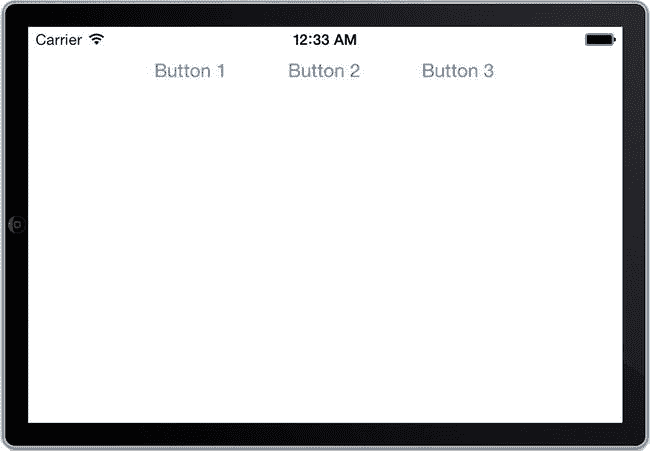

**图 3-34** 正确设置最大按钮宽度的布局

## 总结

在本章中，你学习了 Auto Layout 的基础知识，以及如何使用它来构建能够适应屏幕尺寸和方向变化的动态用户界面。你不仅在 Interface Builder 中设置了约束，也在代码中进行了设置。你还了解了两种错误状态：模糊约束和无法满足的约束，以及如何调试它们。

