# 4. 表格和集合视图方案

**摘要**

日复一日，我们无时无刻不在接收信息。无论是视频、广播、音乐、电子邮件、140 字符的消息，甚至是视觉和听觉信号，总有新的数据需要获取和处理。作为开发者，我们致力于通过数据组织和显示，在信息与最终用户之间创建和管理媒介。我们必须能够从海量信息流中提取并处理出简洁明了的片段，这些片段正是我们特定用户群体所感兴趣的。除此之外，我们还必须让数据在视觉上具有吸引力，同时保持效率和条理性。

在 iOS 开发中，有两个出色的工具可以实现这些目标：`UITableView` 及其广为人知的用户界面，它几乎已成为用户对数据驱动应用的期待；以及 `UICollectionView`，它为表格带来了多列支持。

`UITableView`（或简称为表格视图）是显示信息列表最常用的方式。例如，音乐应用使用表格视图来显示用户音乐库中的歌曲。表格视图由可配置的单元格组成，这些单元格构成了表格视图中的各个行。

`UICollectionView`（或简称为集合视图）与 `UITableView` 类似；不过，它既有行也有列。集合视图的网格结构使其更适合显示照片及此类性质的项目。例如，照片应用中相册的内容就是集合视图的一个示例。集合视图同样由可配置的单元格组成，每个单元格都有对应的列和行。

在本章中，我们将重点介绍创建、实现和自定义这两种视图的分步方法。

## 方案 4-1：创建非分组表格

在 iOS 中，你可以使用两种 `UITableView`：分组表格和非分组表格。选择使用哪一种取决于你应用的需求，但在这里，我们将从非分组表格开始讲解，因为它实现起来更简单。


### 设置应用程序

要构建一个功能完备且可定制的、基于`UITableView`的应用程序，我们将从空白应用开始，逐步构建出一个用于展示各国信息的实用表格。与第 2 章中使用的故事板方法不同，本章将采用`.xib`文件来演示多场景开发。

在 Xcode 中，创建一个新项目并选择“空应用程序”（Empty Application）模板。这样只会得到一个应用代理，你可以在此基础上构建所有视图控制器。本章大部分内容都将使用同一个项目，因此请为你项目取一个你喜欢的名称。同时，务必取消勾选“使用 Core Data”选项，因为本章不会用到它。图 4-1 展示了这些选项。

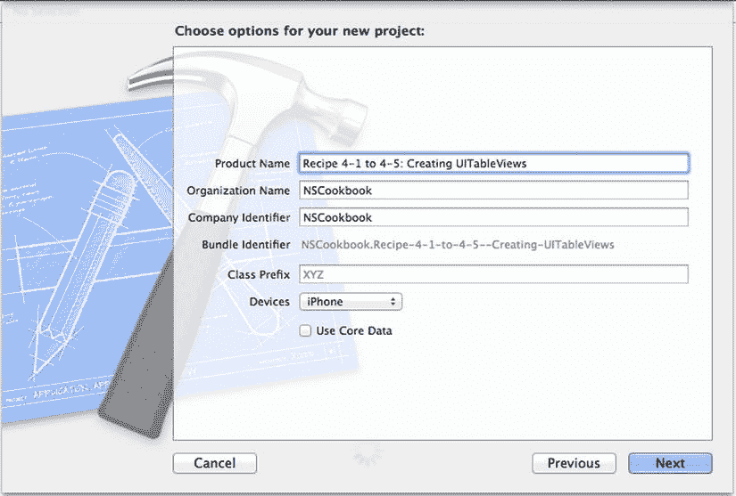

图 4-1. 国家项目的选项

因为是从空应用程序开始，所以你需要先创建包含表格视图的主视图控制器。

使用 `Objective-C` 类模板创建一个新文件。在下一个屏幕上，输入 `MainTableViewController` 作为类名，并选择 `UIViewController` 作为子类。同时务必勾选“附带 XIB 用户界面”选项，这样 Xcode 就会为你的视图控制器创建一个用户界面文件。关于创建类的更详细说明，请参考方案 1-6。

注意

有些人可能会觉得创建 `UITableViewController` 的子类更方便，因为这样会立即获得一个 `UITableView` 以及一些使用它所需的方法。但这种方法的缺点在于，控制器 `.xib` 文件中提供的 `UITableView` 更难以配置和调整大小。因此，在本方案中，我们将使用 `UIViewController` 的子类，并自行添加 `UITableView` 及其方法。

现在，选择 `MainTableViewController.xib` 文件以打开界面构建器。接着，从对象库中拖拽一个表格视图到你的视图中，并调整其大小，使其位于状态栏下方。最终显示的效果如图 4-2 所示。

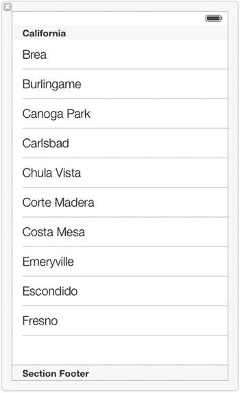

图 4-2. 四周有 20 点内边距的表格视图

现在，切换到 `MainViewController.m` 文件，在 `viewDidLoad` 方法中设置标题，如代码清单 4-1 所示。

代码清单 4-1. 在 `MainViewController.m` 中设置标题

```
- (void)viewDidLoad
{
    [super viewDidLoad];
    // 从 nib 文件加载视图后，执行任何额外的设置。
    self.title = @"国家";
}
```

该标题会显示在接下来要设置的导航栏中。这一步需要在应用代理中完成，因此请切换到你的 `AppDelegate.h` 文件，并添加代码清单 4-2 所示的代码。

代码清单 4-2. 向 `AppDelegate.h` 添加属性

```
//
//  AppDelegate.h
//  方案 4-1 到 4-5 创建 UITableViews
//

#import <UIKit/UIKit.h>
#import "MainTableViewController.h"

@interface AppDelegate : UIResponder <UIApplicationDelegate>

@property (strong, nonatomic) UIWindow *window;
@property (nonatomic, strong) UINavigationController *navigationController;
@property (nonatomic, strong) MainTableViewController *tableViewController;

@end
```

现在，切换到 `AppDelegate.m`，并将代码清单 4-3 中的代码添加到 `application:didFinishLaunchingWithOptions:` 方法中。

代码清单 4-3. 为 `UINavigationController` 设置必要代码

```
- (BOOL)application:(UIApplication *)application didFinishLaunchingWithOptions:(NSDictionary *)launchOptions
{
    self.window = [[UIWindow alloc] initWithFrame:[[UIScreen mainScreen] bounds]];
    // 覆盖点，用于在应用程序启动后进行自定义。
    self.window.backgroundColor = [UIColor whiteColor];
    self.tableViewController = [[MainTableViewController alloc] init];
    self.navigationController = [[UINavigationController alloc]
        initWithRootViewController:self.tableViewController];
    self.window.rootViewController = self.navigationController;
    [self.window makeKeyAndVisible];
    return YES;
}
```

代码清单 4-3 中的代码只是创建了 `MainTableViewController` 和 `UINavigationController` 的实例。`UINavigationController` 将 `MainTableViewController` 设置为根视图控制器。然后，只需将窗口的根视图控制器设置为这个 `UINavigationController` 即可。

现在，应用程序的骨架已经搭建完成。它包含一个导航控制器，并将 `MainTableViewController` 设为根视图控制器。在 iOS 模拟器中运行该项目时，你应该会看到如图 4-3 所示的界面。

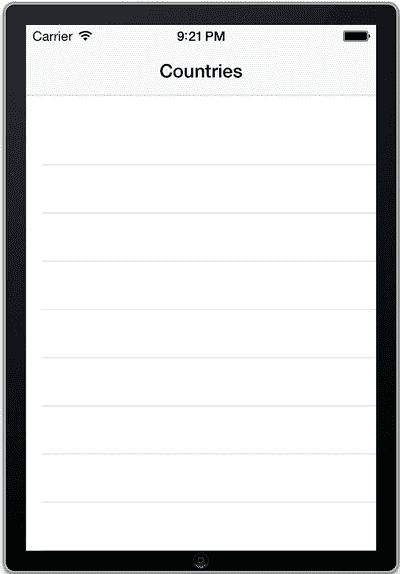

图 4-3. 带有空 `UITableView` 的基础应用程序


### 为国家添加模型

接下来，你将会使用一个数组来存储显示表格信息所需调用的数据。将其声明为视图控制器的一个属性，类型为 `NSMutableArray`，名称为 `countries`，如代码清单 4-4 所示。

**清单 4-4.** 为国家创建 `NSMutableArray` 属性

```
//
//  Country.h
//  Recipe 4-1 to 4-5 Creating UITableViews
//

#import <UIKit/UIKit.h>

@interface MainTableViewController : UIViewController

@property (strong, nonatomic) NSMutableArray *countries;

@end
```

在这个数组中，你将存储代表国家的对象，因此我们来为其创建一个模型。像之前一样，使用 `Objective-C` 类模板创建一个新文件。将新类命名为 `Country`，并确保它继承自 `NSObject`。

你将在 `Country` 类中存储四项信息：名称、首都、格言，以及包含该国国旗的 `UIImage`。在 `Country.h` 类中定义这些属性，如代码清单 4-5 所示。

**清单 4-5.** 在新的 `Country.h` 类中设置国家信息属性

```
//
//  Country.h
//  Recipe 4-1 to 4-5 Creating UITableViews
//

#import <Foundation/Foundation.h>

@interface Country : NSObject

@property (nonatomic, strong) NSString *name;
@property (nonatomic, strong) NSString *capital;
@property (nonatomic, strong) NSString *motto;
@property (nonatomic, strong) UIImage *flag;

@end
```

现在模型已经设置好了，你可以回到视图控制器。编译器需要访问你刚设置好的新 `Country` 类的方法，因此将以下导入语句添加到 `MainTableViewController.h` 中：

```
#import "Country.h"
```

在继续创建测试数据之前，请确保你已经下载了要添加的国家的国旗图片文件。在本示例中，你将使用美国、英格兰（与联合王国不同）、苏格兰、法国和西班牙的国旗。我们从维基百科下载了一些公共领域的国旗图片：美国、法国和西班牙来自 [`en.wikipedia.org/wiki/Gallery_of_sovereign-state_flags`](http://en.wikipedia.org/wiki/Gallery_of_sovereign-state_flags)，英格兰和苏格兰来自 [`commons.wikimedia.org/wiki/Flags_of_formerly_independent_states`](http://commons.wikimedia.org/wiki/Flags_of_formerly_independent_states)。大约 200 像素的图片尺寸足以满足你的需求。

**注意**：在处理图片时，请务必留意所有版权问题。公共领域的图片（例如这里从维基百科获取的图片）可以免费使用，且相对容易找到。

将所有文件下载完毕并在访达中可见后，选中它们并将其拖入 Xcode 项目中“Supporting Files”文件夹下。此时会弹出一个对话框，提供添加文件到项目的选项。请确保勾选了“如果需要，将项目复制到目标组文件夹中”这一选项，如图 4-4 所示。

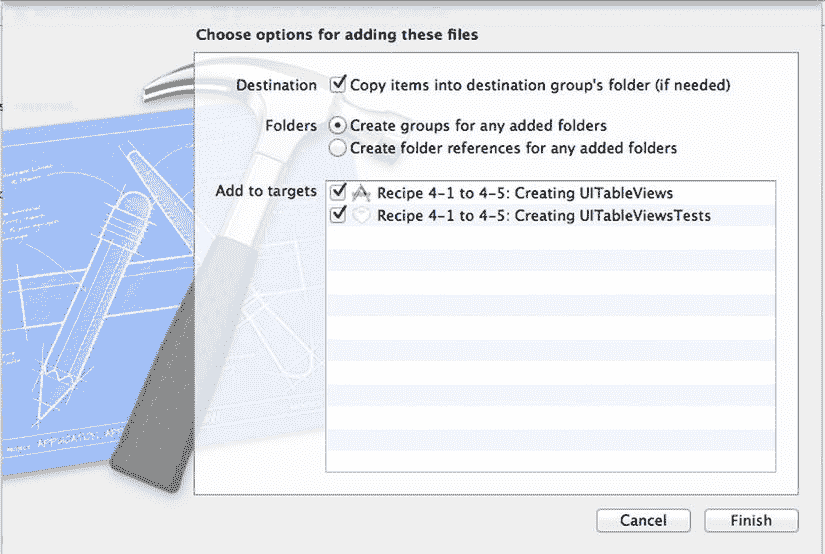

**图 4-4.** 添加文件的对话框；确保第一个选项已被勾选

在 `MainTableViewController.m` 文件的 `viewDidLoad` 方法中设置你的测试数据——即前面提到的五个国家，如代码清单 4-6 所示。

**清单 4-6.** 设置国家属性并将其添加到 `countries` 数组

```
- (void)viewDidLoad
{
    [super viewDidLoad];
    self.title = @"Countries";

    Country *usa = [[Country alloc] init];
    usa.name = @"United States of America";
    usa.motto = @"E Pluribus Unum";
    usa.capital = @"Washington, D.C.";
    usa.flag = [UIImage imageNamed:@"usa.png"];

    Country *france = [[Country alloc] init];
    france.name = @"French Republic";
    france.motto = @"Liberté, Égalité, Fraternité";
    france.capital = @"Paris";
    france.flag = [UIImage imageNamed:@"france.png"];

    Country *england = [[Country alloc] init];
    england.name = @"England";
    england.motto = @"Dieu et mon droit";
    england.capital = @"London";
    england.flag = [UIImage imageNamed:@"england.png"];

    Country *scotland = [[Country alloc] init];
    scotland.name = @"Scotland";
    scotland.motto = @"In My Defens God Me Defend";
    scotland.capital = @"Edinburgh";
    scotland.flag = [UIImage imageNamed:@"scotland.png"];

    Country *spain = [[Country alloc] init];
    spain.name = @"Kingdom of Spain";
    spain.motto = @"Plus Ultra";
    spain.capital = @"Madrid";
    spain.flag = [UIImage imageNamed:@"spain.png"];

    self.countries =
    [NSMutableArray arrayWithObjects:usa, france, england, scotland, spain, nil];
}
```


### 在表格视图中显示数据

要在表格视图中显示测试数据，您需要一种从代码中引用它的方式。因此，您需要添加一个名为`countriesTableView`的出口。打开 `.xib` 文件，然后按住 Control 键并单击，从表格视图拖拽到接口文件，操作方式与为按钮创建出口时相同。

为了便于组织，`UITableView` 可以调用的所有方法分为两组：`delegate`（委托）方法和 `datasource`（数据源）方法。一方面，`Delegate` 方法用于处理 `UITableView` 的任何视觉元素，例如单元格的行高。另一方面，`Datasource` 方法则处理在 `UITableView` 中显示的信息，例如任何给定单元格信息的配置。

您的表格视图通过两个协议与程序通信：`UITableViewDelegate` 和 `UITableViewDataSource`。您需要在接口行中添加少量代码，让类知道它遵循了这些协议，因此请将它们添加到其头文件中，如代码清单 4-7 所示。

**代码清单 4-7. 声明协议的使用**

```
//
//  MainTableViewController.h
//  Recipe 4-1 to 4-5: Creating UITableViews
//
#import <UIKit/UIKit.h>
#import "Country.h"
@interface MainTableViewController : UIViewController <UITableViewDelegate, UITableViewDataSource>
@property (weak, nonatomic) IBOutlet UITableView *countriesTableView;
@property (strong, nonatomic) NSMutableArray *countries;
@end
```

下一步是将视图控制器连接到表格视图。切换到 `MainTableViewController.m`，并在 `viewDidLoad` 方法中设置表格视图的 `delegate` 和 `dataSource` 属性，如代码清单 4-8 所示。设置这些属性可以让表格视图知道数据的填充和交互处理将在 `MainTableViewController` 中进行。

**代码清单 4-8. 在 `MainTableViewController.m` 中将表格视图的委托和数据源设置为 "self"**

```
- (void)viewDidLoad
{
    [super viewDidLoad];
    // 从 nib 加载视图后的其他设置
    self.title = @"国家/地区";
    self.countriesTableView.delegate = self;
    self.countriesTableView.dataSource = self;
    Country *usa = [[Country alloc] init];
    usa.name = @"美利坚合众国";
    usa.motto = @"合众为一";
    usa.capital = @"华盛顿";
    usa.flag = [UIImage imageNamed:@"usa.png"];
    // ...
}
```

**注意：** 选中表格视图后，也可以通过从 Connections Inspector（连接检查器）中的圆圈拖动到文档大纲中“占位符”下的“文件所有者”来设置委托和数据源，如图 4-5 所示。在使用故事板时，“文件所有者”会变成视图控制器的名称。

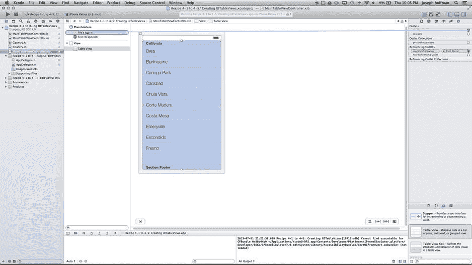

**图 4-5.** 连接委托和数据源的另一种方式

要创建一个非分组（平面）的 `UITableView`，您必须正确实现两个主要方法。

首先，您需要指定表格视图中将显示多少行。这通过 `tableView:numberOfRowsInSection:` 方法完成。由于表格视图是非分组的，因此只有一个分区，所以无需查阅 section 参数。您只需返回数组中国家/地区的数量，如代码清单 4-9 所示。

**代码清单 4-9. 实现 `tableView:numberOfRowsInSection:` 方法**

```
-(NSInteger)tableView:(UITableView *)tableView numberOfRowsInSection:(NSInteger)section
{
    return [self.countries count];
}
```

其次，您必须创建一个方法，使用 `tableView:cellForRowAtIndexPath:` 方法来指定 `UITableView` 的单元格如何配置。代码清单 4-10 是该方法的通用实现，您可以根据自己的数据进行修改。

**代码清单 4-10. `tableView:cellForRowAtIndexPath:` 方法的通用实现**

```
- (UITableViewCell *)tableView:(UITableView *)tableView cellForRowAtIndexPath:(NSIndexPath *)indexPath
{
    static NSString *CellIdentifier = @"Cell";
    UITableViewCell *cell =
        [tableView dequeueReusableCellWithIdentifier:CellIdentifier];
    if (cell == nil)
    {
        cell = [[UITableViewCell alloc] initWithStyle:UITableViewCellStyleDefault
                                      reuseIdentifier:CellIdentifier];
        cell.accessoryType = UITableViewCellAccessoryDisclosureIndicator;
        cell.textLabel.font = [UIFont systemFontOfSize:19.0];
        cell.detailTextLabel.font = [UIFont systemFontOfSize:12];
    }
    cell.textLabel.text = [NSString stringWithFormat:@"单元格 %i", indexPath.row];
    return cell;
}
```

如果您现在运行应用程序，您会看到表格视图中有五个单元格，每个对应 `countries` 数组中的一条记录。如图 4-6 所示，每个单元格都有一个通用标题（Cell 0、Cell 1、Cell 2 等）和一个展开指示器。展开指示器是单元格右侧的小灰色箭头，它让用户知道点击该单元格将显示该单元格的详细信息。

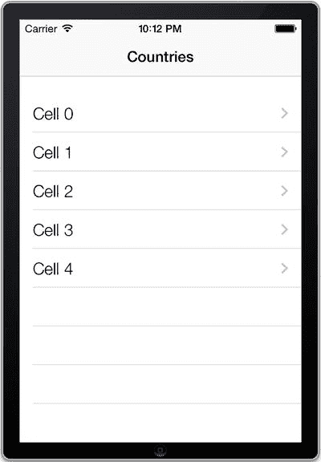

**图 4-6.** 您的应用程序显示了五个带有通用文本和展开指示器的单元格

由于您尚未为附件视图实现任何功能，因此点击单元格时什么也不会发生。我们稍后会处理这个问题，同时还会自定义单元格的外观和内容，但首先我们将讨论单元格复用。

### 关于缓存单元格和复用的注意事项

上述代码值得解释一下。iOS 中的表格视图尝试通过复用当前不在用户视野中的单元格来节省内存和时间。它会获取一个已经滚动出视野的单元格，并复用它来显示另一个变得可见的单元格。

然而，实现复用方案取决于您。首先，您必须定义表格视图支持的不同类型的单元格（即，具有相同外观和组件的单元格）。每种这样的单元格类型都由您选择的复用标识符来标识。

您的应用程序必须做的第二件事是在分配新单元格之前，调用 `dequeueReusableCellWithIdentifier:` 方法来查看是否有空闲的单元格可供复用。在上面的示例中，您可以看到首先尝试出列一个可复用的单元格。如果没有可用的（即，如果 `cell` 为 `nil`），那么您创建一个新单元格，并对其进行通用设置，以便可以将其复用于所有单元格。然后，无论单元格是被出列还是新创建的，您都将文本更新为适当的值。


### 配置单元格

现在你的应用已经启动、运行并显示了一些信息，你可以着手进行具体的实现了。

要配置单元格以使其正确适配数据，你首先要做的是更改行的显示样式。修改 `tableView:cellForRowAtIndexPath:` 方法中的分配/初始化代码行，如代码清单 4-11 所示。

**代码清单 4-11.** 更新行的显示样式

```
cell = [[UITableViewCell alloc] initWithStyle:UITableViewCellStyleSubtitle reuseIdentifier:CellIdentifier];
```

有四种不同的 `UITableViewCell` 样式可供使用，每种样式的显示效果略有不同：

- `UITableViewCellStyleDefault`：只有一个标签，如图 4-5 所示。
- `UITableViewCellStyleSubtitle`：与 Default 样式类似，但在主文本下方增加了一行副标题。
- `UITableViewCellStyleValue1`：包含两行文本，主文本位于单元格左侧，次要详细文本标签位于右侧。
- `UITableViewCellStyleValue2`：包含两行文本，重点放在详细文本标签上。

接下来，你可以将单元格的文本标签设置为国家名称，而不是简单的单元格计数。调整 `cell.textLabel.text` 属性的设置，如代码清单 4-12 所示。

**代码清单 4-12.** 设置单元格文本标签

```
Country *item = [self.countries objectAtIndex:indexPath.row];
cell.textLabel.text = item.name;
```

你可以使用单元格的 `detailTextLabel` 属性以非常相似的方式设置文本的副标题。将其设置为国家的首都，如代码清单 4-13 所示。

**代码清单 4-13.** 设置单元格副标题标签

```
cell.detailTextLabel.text = item.capital;
```

`UITableViewCell` 类还有一个名为 `imageView` 的属性，当为其赋予图片时，图片会显示在标题标签的左侧。通过在单元格配置中添加代码清单 4-14 来实现此功能。

**代码清单 4-14.** `tableView:cellForRowAtIndexPath:` 方法的通用实现

```
cell.imageView.image = item.flag;
```

你可能会注意到，如果现在运行程序，所有国旗都会显示，但宽高比各不相同，这会使你的视图看起来不那么专业。设置单元格 `imageView` 的 frame 无法解决这个问题，因此这里提供一个快速解决方案。

首先，在你的视图控制器实现文件中，定义一个绘制指定大小 `UIImage` 的类方法，如代码清单 4-15 所示。

**代码清单 4-15.** 创建一个在指定大小内绘制 `UIImage` 的类方法

```
+ (UIImage *)scale:(UIImage *)image toSize:(CGSize)size
{
    UIGraphicsBeginImageContext(size);
    [image drawInRect:CGRectMake(0, 0, size.width, size.height)];
    UIImage *scaledImage = UIGraphicsGetImageFromCurrentImageContext();
    UIGraphicsEndImageContext();
    return scaledImage;
}
```

将此方法的处理程序放在视图控制器的私有 `@interface` 声明中，以避免潜在的编译器问题。私有 `@interface` 声明用于放置你的私有方法声明；它位于视图控制器实现文件的顶部，如代码清单 4-16 所示。

**代码清单 4-16.** 为 `scale:image:toSize:` 方法创建私有方法处理程序

```
//
//  MainTableViewController.h
//  Recipe 4-1 to 4-5 Creating UITableViews
//

#import "MainTableViewController.h"

@interface MainTableViewController ()
+ (UIImage *)scale:(UIImage *)image toSize:(CGSize)size;
@end

@implementation MainTableViewController

// ...
// 缩放方法的实现写在这里
+ (UIImage *)scale:(UIImage *)image toSize:(CGSize)size
{
    // ...
}

@end
```

然后，你可以调整设置图片的代码行，以使用此方法，如代码清单 4-17 所示。

**代码清单 4-17.** 使用 `scale:image:toSize:` 方法调整图片大小

```
cell.imageView.image =
[MainTableViewController scale: item.flag toSize:CGSizeMake(115, 75)];
```

完成所有这些配置后，最终的 `tableView:cellForRowAtIndexPath:` 方法应该如代码清单 4-18 所示。

**代码清单 4-18.** 完整的 `tableView:cellForRowAtIndexPath:` 方法

```
- (UITableViewCell *)tableView:(UITableView *)tableView cellForRowAtIndexPath:(NSIndexPath *)indexPath
{
    static NSString *CellIdentifier = @"Cell";
    UITableViewCell *cell = [tableView dequeueReusableCellWithIdentifier:CellIdentifier];

    if (cell == nil)
    {
        cell = [[UITableViewCell alloc] initWithStyle:UITableViewCellStyleSubtitle reuseIdentifier:CellIdentifier];
        cell.accessoryType = UITableViewCellAccessoryDisclosureIndicator;
        cell.textLabel.font = [UIFont systemFontOfSize:19.0];
        cell.detailTextLabel.font = [UIFont systemFontOfSize:12];
    }

    Country *item = [self.countries objectAtIndex:indexPath.row];
    cell.textLabel.text = item.name;
    cell.detailTextLabel.text = item.capital;
    cell.imageView.image =
        [MainTableViewController scale: item.flag toSize:CGSizeMake(115, 75)];

    return cell;
}
```

构建并运行你的应用程序；它应该像图 4-7 一样，显示完整的国家信息和国旗图片。

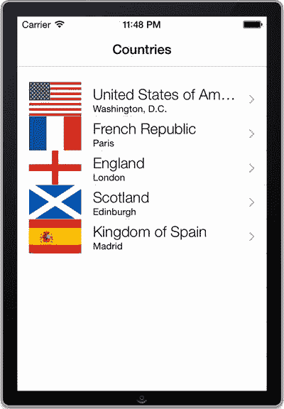

**图 4-7.** 填入国家信息的表格


### 实现附属视图

现在你已拥有一个包含五个国家且外观美观的表格，接下来可以扩展表格视图的基本功能。首先，你需要关注最直接的功能：对特定行的选中操作做出响应。

为实现本教程的目的，你将构建这样一个应用：当用户选中某一行时，会弹出一个独立的视图控制器，展示该选定国家的所有已知信息。

首先，创建一个新的视图控制器，方法与本教程开头类似：使用 `Objective-C` 类模板，并选择 `UIViewController` 作为父类。将新类命名为 `CountryDetailsViewController`，并确保勾选"附带 XIB 用户界面"选项。

接着，在控制器的 `.xib` 文件中构建其视图，使其外观与图 4-8 所示一致。组合使用标签、文本字段和图像视图。在本示例中，我们将 `UIImage` 视图的尺寸设置为宽 111 点、高 68 点。在尺寸检查器中选中 `UIImage` 视图即可轻松完成此操作。

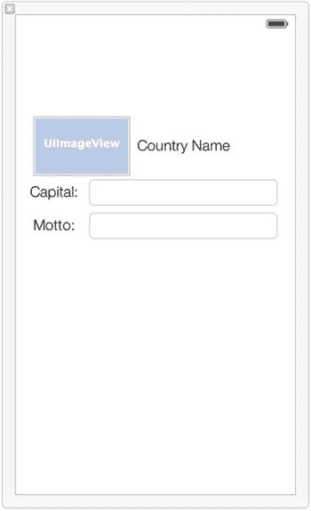

图 4-8. `CountryDetailsViewController` 的 `.xib` 文件与配置

为需要动态更改的组件（即国家标签、图像视图和两个文本字段）创建出口。请使用以下属性名称：

- `nameLabel`
- `capitalTextField`
- `mottoTextField`
- `flagImageView`

你需要能够控制这两个文本字段的行为。为了让视图控制器能响应这些文本字段的事件，请在其头文件中添加 `UITextFieldDelegate` 协议声明，如代码清单 4-19 所示。

代码清单 4-19. 在视图控制器头文件中添加 `UITextFieldDelegate`

```
@interface CountryDetailsViewController : UIViewController <UITextFieldDelegate>
```

为了使视图控制器尽可能通用，请为其添加一个 `Country` 类的属性，用于保存当前显示的数据。这样，你可以直接用必要的数据填充视图，如果需要，甚至可以在不切换视图的情况下轻松重新填充不同数据。添加 `Country` 类的导入语句，如代码清单 4-20 所示。

代码清单 4-20. 导入国家类

```
#import "Country.h"
```

声明属性，如代码清单 4-21 所示。

代码清单 4-21. 声明 `currentCountry` 属性

```
@property (strong, nonatomic) Country *currentCountry;
```

你的详细视图控制器需要一种方式，告知调用它的对象它已完成任务并应从视图中移除。在 iOS 中，通常的做法是为这一目的设置自定义协议和委托属性。因此，请对 `CountryDetailsViewController.h` 文件进行补充，如代码清单 4-21 所示。

代码清单 4-21. 在 `CountryDetailsViewController.h` 中设置自定义协议和委托属性

```
//
//  CountryDetailsViewsController.h
//  Recipe 4-1 to 4-5 Creating UITableViews
//

#import <UIKit/UIKit.h>
#import "Country.h"

/* 前向声明，供协议使用 
   CountryDetailsViewController 类型 */
@class CountryDetailsViewController;

@protocol CountryDetailsViewControllerDelegate <NSObject>
-(void)countryDetailsViewControllerDidFinish:(CountryDetailsViewController *)sender;
@end

@interface CountryDetailsViewController : UIViewController<UITextFieldDelegate>
//...
```

为委托创建一个属性，如代码清单 4-22 所示，以便后续设置委托的拥有者。

代码清单 4-22. 在 `CountryDetailsViewController.h` 中创建委托属性

```
#import <UIKit/UIKit.h>
#import "Country.h"

//...

@property (weak, nonatomic) IBOutlet UILabel *nameLabel;
@property (weak, nonatomic) IBOutlet UIImageView *flagImageView;
@property (weak, nonatomic) IBOutlet UITextField *capitalTextField;
@property (weak, nonatomic) IBOutlet UITextField *mottoTextField;
```


`@property (strong, nonatomic) Country *currentCountry;`

`@property (strong, nonatomic) id<CountryDetailsViewControllerDelegate> delegate;`

`@end`

现在，将注意力转向详情视图控制器的实现文件。那里有很多工作要做，所以我们先添加一个填充视图的方法，如代码清单 4-23 所示。

**代码清单 4-23.** 实现 `populateViewWithCountry:` 方法

```
-(void)populateViewWithCountry:(Country *)country
{
    self.currentCountry = country;
    self.flagImageView.image = country.flag;
    self.nameLabel.text = country.name;
    self.capitalTextField.text = country.capital;
    self.mottoTextField.text = country.motto;
}
```

你会希望这个方法在视图加载后被调用，但要在视图显示之前，也就是 `viewWillAppear:animated:` 被调用的时候。因此，将调用新委托方法的代码添加到你的详情视图控制器中，如代码清单 4-24 所示。

**代码清单 4-24.** 在 `viewWillAppear` 方法中调用 `populateViewWithCountry:` 委托

```
-(void)viewWillAppear:(BOOL)animated
{
    [self populateViewWithCountry:self.currentCountry];
}
```

接下来，我们考虑一下文本字段。当用户完成编辑时，你应该收起键盘，因此实现 `textFieldShouldReturn:` 委托方法，如代码清单 4-25 所示。

**代码清单 4-25.** 实现 `textFieldShouldReturn:` 方法

```
-(BOOL)textFieldShouldReturn:(UITextField *)textField
{
    [textField resignFirstResponder];
    return NO;
}
```

为了能够调用上述委托方法，你需要将你的视图控制器连接到文本字段的委托属性。在 `viewDidLoad` 方法中完成此操作，如代码清单 4-26 所示。

**代码清单 4-26.** 在 `viewDidLoad` 方法中设置委托

```
self.mottoTextField.delegate = self;
self.capitalTextField.delegate = self;
```

由于你允许用户修改数据，你应该包含一个按钮来恢复到原始数据，以取消编辑。通过将代码清单 4-27 中的代码添加到 `viewDidLoad` 方法，将其添加到导航栏的右侧。

**代码清单 4-27.** 创建一个用于恢复到原始数据的导航栏按钮

```
- (void)viewDidLoad
{
    [super viewDidLoad];
    // 从 nib 加载视图后进行任何额外的设置
    self.mottoTextField.delegate = self;
    self.capitalTextField.delegate = self;
    UIBarButtonItem *revertButton =
        [[UIBarButtonItem alloc] initWithTitle:@"恢复"
                                        style:UIBarButtonItemStyleBordered
                                       target:self
                                       action:@selector(revert)];
    self.navigationItem.rightBarButtonItems =
        [NSArray arrayWithObject:revertButton];
}
```

你指定为 `revertButton` 动作的 `revert` 选择器很容易实现。它只需用 `currentCountry` 属性中的数据重新填充视图。将代码清单 4-28 所示的实现添加到你的 `CountryDetailsViewController.m` 文件中。

**代码清单 4-28.** 实现 `revert` 方法

```
-(void)revert
{
    [self populateViewWithCountry:self.currentCountry];
}
```

你需要做的最后一件事是在返回 `MainTableViewController` 时，实现保存对给定 `Country` 所做任何更改的功能。你通过实现 `viewWillDisappear:animated:` 方法来完成此操作。将代码清单 4-29 中的代码添加到 `CountryDetailsViewController.m` 文件中。

**代码清单 4-29.** 添加 `viewWillDisappear` 方法重写

```
-(void)viewWillDisappear:(BOOL)animated
{
    // 结束此时可能正在进行的任何编辑
    [self.view.window endEditing: YES];
    // 使用新值更新 Country 对象
    self.currentCountry.capital = self.capitalTextField.text;
    self.currentCountry.motto = self.mottoTextField.text;

    [self.delegate countryDetailsViewControllerDidFinish:self];
}
```

详情视图控制器暂时完成了；切换回 `MainTableViewController` 的头文件，并将你创建的 `CountryDetailsViewControllerDelegate` 协议添加到头文件中。你需要先导入你创建的类。

```
#import "CountryDetailsViewController.h"
```

为了使 `CountryDetailsViewController` 委托方法的实现更容易，你应该创建一个实例变量，该变量指向被选中行的索引路径，这样你可以只刷新那一行，从而节省处理能力。在添加了类型为 `NSIndexPath`、名为 `selectedIndexPath` 的变量后，你的头文件现在应该如代码清单 4-30 所示，最近的更改已用粗体标记。

**代码清单 4-30.** 向 `MainTableViewController.h` 添加委托声明和实例变量

```
//
//  MainTableViewController.h
//  Recipe 4-1 to 4-5 Creating UITableViews
//

#import <UIKit/UIKit.h>
#import "Country.h"
#import "CountryDetailsViewController.h"

@interface MainTableViewController : UIViewController<UITableViewDelegate,
    UITableViewDataSource, CountryDetailsViewControllerDelegate>
{
    NSIndexPath *selectedIndexPath;
}

@property (weak, nonatomic) IBOutlet UITableView *countriesTableView;
@property (strong, nonatomic) NSMutableArray *countries;

@end
```

现在你可以实现 `CountryDetailsViewController` 的委托了。切换到 `MainTableViewController.m` 并添加委托方法，如代码清单 4-31 所示。

**代码清单 4-31.** 添加 `countryDetailsViewControllerDidFinish:` 委托方法

```
-(void)countryDetailsViewControllerDidFinish:(CountryDetailsViewController *)sender
{
    if (selectedIndexPath)
    {
        [self.countriesTableView beginUpdates];
        [self.countriesTableView reloadRowsAtIndexPaths:
            [NSArray arrayWithObject:selectedIndexPath] withRowAnimation:UITableViewRowAnimationNone];
        [self.countriesTableView endUpdates];
    }
    selectedIndexPath = nil;
}
```

`beginUpdates` 和 `endUpdates` 方法虽然在这里有些多余，但对于在表视图中重新加载数据非常有用。它们指定在 `beginUpdates` 和 `endUpdates` 调用之间对重新加载数据的调用应进行动画处理。因为你的所有数据重新加载都是在 `UITableView` 不在屏幕中时发生的，所以这不是必需的，但它对你的应用程序没有害处。

最后，为了实际响应对 `UITableView` 中某一行的选择，你只需要实现 `UITableView` 的委托方法 `tableView:didSelectRowAtIndexPath:`，如代码清单 4-32 所示。

**代码清单 4-32.** 实现 `tableView:didSelectRowAtIndexPath:` 方法

```
-(void)tableView:(UITableView *)tableView
didSelectRowAtIndexPath:(NSIndexPath *)indexPath
{
    [tableView deselectRowAtIndexPath:indexPath animated:YES];
    selectedIndexPath = indexPath;
    Country *chosenCountry = [self.countries objectAtIndex:indexPath.row];
    CountryDetailsViewController *detailedViewController =
        [[CountryDetailsViewController alloc] init];
    detailedViewController.delegate = self;
    detailedViewController.currentCountry = chosenCountry;
    [self.navigationController pushViewController:detailedViewController animated:YES];
}
```

`UITableView` 类还有许多其他用于处理行选中或取消选中的委托方法，包括以下这些：

*   `tableView:willSelectRowAtIndexPath:` – 通知委托即将选中某一行
*   `tableView:didSelectRowAtIndexPath:` – 通知委托已经选中某一行
*   `tableView:willDeselectRowAtIndexPath:` – 通知委托即将取消选中某一行
*   `tableView:didDeselectRowAtIndexPath:` – 通知委托已经取消选中某一行

使用这四个委托方法，你可以完全自定义 `UITableView` 的行为，以适应任何应用程序。

现在运行此项目时，你可以查看和编辑国家信息，如图 4-9 所示。

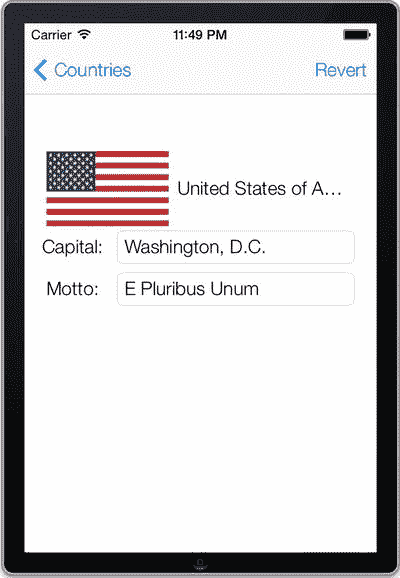

**图 4-9.** `CountryDetailsViewController` 的最终显示效果


### 增强的用户交互

当处理以 `UITableView` 为核心的应用程序时，通常希望允许用户从同一个表格中访问多个视图。例如，iPhone 上的电话应用有一个语音邮件标签页，它显示一个包含手机上各种语音邮件的 `UITableView`。用户可以通过选择表格中的某一行来播放语音邮件，或者通过选择行右侧的一个较小的信息图标来查看原始呼叫者的联系信息。你可以通过实现另一个 `UITableView` 委托方法来实现类似的行为。

首先，必须更改 `UITableView` 中单元格“辅助视图”的类型。这里指的是任何给定行最右侧显示的图标。在 `tableView:cellForRowAtIndexPath:` 方法中，找到下面这行代码：

`cell.accessoryType = UITableViewCellAccessoryDisclosureIndicator;`

将此值更改为 `UITableViewCellAccessoryDetailDisclosureButton`。这会提供一个可以响应触摸的信息图标。该属性有四种可能的取值如下：

*   `UITableViewCellAccessoryNone`：指定没有辅助视图。
*   `UITableViewCellAccessoryDisclosureIndicator`：在行右侧添加一个灰色箭头，就像你一直使用的那样。
*   `UITableViewCellAccessoryDetailDisclosureButton`：你最新的选择，指定一个可交互的按钮。
*   `UITableViewCellAccessoryCheckmark`：在指定行添加一个勾选标记；此选项与 `tableView:didSelectRowAtIndexPath:` 方法配合使用时特别有用，可以按需从列表中添加和移除勾选标记。

注意：虽然这四种可用的辅助视图类型非常有用，几乎涵盖了所有通用用途，但显然很容易想到需要完全不同的东西出现在行右侧的理由。你可以通过 `accessoryView` 属性轻松地将 `UITableViewCell` 的辅助视图自定义为任何其他 `UIView` 子类。

现在，既然已经将辅助视图变成了按钮，要实现一个处理该交互的动作就非常简单了。实现另一个 `UITableView` 委托方法 `tableView:accessoryButtonTappedForRowWithIndexPath:`。出于测试目的，让这个动作与行选择的动作完全相同，只是增加一个 `NSLog()`，如代码清单 4-33 所示，尽管你应该能很容易看出如何实现不同的动作。

**代码清单 4-33.** 实现 `tableView:accessoryButtonTappedForRowWithIndexPath:` 方法

```
-(void)tableView:(UITableView *)tableView accessoryButtonTappedForRowWithIndexPath:(NSIndexPath *)indexPath
{
    [tableView deselectRowAtIndexPath:indexPath animated:YES];
    selectedIndexPath = indexPath;
    Country *chosenCountry = [self.countries objectAtIndex:indexPath.row];
    CountryDetailsViewController *detailedViewController =
        [[CountryDetailsViewController alloc] init];
    detailedViewController.delegate = self;
    detailedViewController.currentCountry = chosenCountry;
    NSLog(@"Accessory Button Tapped");
    [self.navigationController pushViewController:detailedViewController animated:YES];
}
```

运行此应用程序时，点击辅助视图按钮应运行你的新功能，如图 4-10 所示。

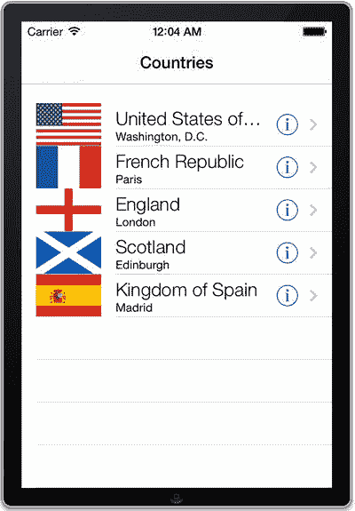
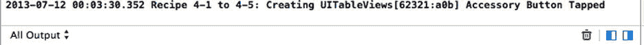

**图 4-10.** 带有响应事件的详细信息披露按钮的 `UITableView`

### 单元格视图自定义的注意事项

与辅助视图一样，`UITableViewCell` 的其他几个部分也可以通过其视图进行自定义。`UITableViewCell` 类包含了几个可供编辑的其他视图的属性，包括：

*   `imageView`：单元格中 `textLabel` 左侧的 `UIImageView`，如之前示例中的国旗所示；如果未向此视图提供图像，则单元格将显示为该 `UIImageView` 不存在（而不是一个占据空间的空白 `UIImageView`）。
*   `contentView`：`UITableViewCell` 的主要 `UIView`，包含所有文本；你可能希望自定义此视图以实现更强大或更通用的 `UITableViewCell`。
*   `backgroundView`：在普通样式表格中（就像你目前使用的）设置为 `nil` 的 `UIView`，否则用于分组表格；此视图出现在表格中所有其他视图的后面，因此非常适合专门自定义单元格的视觉显示。
*   `selectedBackgroundView`：当单元格被选中时，此 `UIView` 插入到 `backgroundView` 之上但在所有其他视图之后。它还可以通过使用 `setSelected:animated:` 动作轻松地赋予 alpha 动画（淡入或淡出不透明度）。
*   `multipleSelectionBackgroundView`：此 `UIView` 的行为类似于 `selectedBackgroundView`，但在启用 `UITableView` 以允许选择多行时使用。
*   `accessoryView`：如前所述，这允许你为行的辅助视图创建完全不同的视图，因此你可以实现超出预设值的自定义显示和行为。
*   `editingAccessoryView`：这类似于 `accessoryView` 属性，但专门用于 `UITableView` 处于“编辑”模式时，稍后你将更详细地了解这一点。

尽管大多数开发者坚持使用通用的 `UITableView`，因为它与 iOS 设计主题契合得很好，但如果你浏览一下应用商店，可以发现一些使用自定义视图的创意实现。所有这些额外的自定义可能会为项目增加大量开发时间，但一个高质量、自定义的 `UITableView` 肯定会因其独特性而在应用程序中脱颖而出。请访问 cocoacontrols.com 或在 `github.com` 上搜索自定义表格视图实现的代码示例。在创建自定义 `UITableView` 时，请务必注意它可能对应用程序性能产生的影响。


## 方案 4-2：编辑 `UITableView`

如果你查看常用应用（例如设备上的音乐播放器）中几乎所有的 `UITableView`，你可能会注意到，你可以通过某种方式编辑表格。在音乐应用中，你可以滑动某一行来显示“删除”按钮，点击该按钮即可移除相关项目。在邮件应用中，你可以点击右上角的“编辑”按钮，以选择多条消息进行删除、移动或其他操作。这两种功能都基于编辑 `UITableView` 的概念。

你首先应考虑将 `UITableView` 置于编辑模式，因为为了让用户使用编辑功能，他们需要能够访问它。为此，可在视图的右上角添加一个“编辑”按钮。这非常简单，只需在主导表格视图控制器的 `viewDidLoad` 方法中添加代码清单 4-34 所示的行即可。

代码清单 4-34 在导航栏中添加编辑按钮

```
- (void)viewDidLoad
{
    [super viewDidLoad];
    // 从 nib 加载视图后进行任何额外的设置
    self.title = @"Countries";
    self.countriesTableView.delegate = self;
    self.countriesTableView.dataSource = self;
    self.navigationItem.rightBarButtonItem = self.editButtonItem;
    // ...
}
```

这个 `editButtonItem` 属性实际上不需要你定义，因为它已为所有 `UIViewController` 子类预设。这个按钮的妙处在于，它不仅被编程为调用特定方法，还能在其文本“编辑”和“完成”之间切换。

`editButtonItem` 默认设置为调用 `setEditing:animated:` 方法，你需要为其创建一个简单的实现，如代码清单 4-35 所示。

代码清单 4-35. 实现 `setEditing:animated:` 重写方法

```
-(void)setEditing:(BOOL)editing animated:(BOOL)animated
{
    [super setEditing:editing animated:animated];
    [self.countriesTableView setEditing:editing animated:animated];
}
```

该方法的主要概念很简单：首先调用 `super` 方法，该方法负责切换按钮文本，然后根据给定的参数设置 `UITableView` 的编辑模式。

此时，应用中的“编辑”按钮会触发 `UITableView` 的编辑模式，从而显示任意行的“删除”按钮。但是，由于你尚未为这些按钮实现任何行为，因此还无法从表格中删除任何行。为此，你必须首先实现另一个委托方法 `tableView:commitEditingStyle:forRowAtIndexPath:`。

代码清单 4-36 是该方法的基础实现，你可以从这里开始。

代码清单 4-36. 实现 `tableView:commitEditingStyle:editingStyle:forRowAtIndexPath:` 方法

```
-(void)tableView:(UITableView *)tableView commitEditingStyle:(UITableViewCellEditingStyle)editingStyle forRowAtIndexPath:(NSIndexPath *)indexPath
{
    if (editingStyle == UITableViewCellEditingStyleDelete)
    {
        Country *deletedCountry = [self.countries objectAtIndex:indexPath.row];
        [self.countries removeObject:deletedCountry];
        [self.countriesTableView
            deleteRowsAtIndexPaths:[NSArray arrayWithObject:indexPath]
            withRowAnimation:UITableViewRowAnimationAutomatic];
    }
}
```

重要的是，在从 `UITableView` 移除行之前，要先从模型中删除实际的数据片段，类似于上一个方案中先删除数组中的国家对象，再移除其表格视图行的操作。如果不按此顺序操作，应用可能会抛出异常。

现在，运行应用，点击“编辑”按钮可将 `UITableView` 置于编辑模式，如图 4-11 所示。

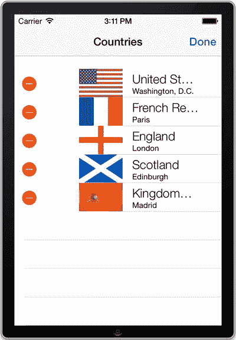

图 4-11. 处于编辑模式的 `UITableView`，具备移除行的功能

## `UITableView` 行动画

在刚刚添加的方法中，你指定了删除行时要执行的动画类型，即 `UITableViewRowAnimationAutomatic`。接受该值的参数还有其他各种预设值，你可以用它们自定义行的视觉行为，包括：

*   `UITableViewRowAnimationBottom`
*   `UITableViewRowAnimationFade`
*   `UITableViewRowAnimationLeft`
*   `UITableViewRowAnimationMiddle`
*   `UITableViewRowAnimationNone`
*   `UITableViewRowAnimationRight`
*   `UITableViewRowAnimationTop`

你所选择的动画类型不会对应用性能产生显著影响，但肯定能改变应用对用户的观感和体验。最好尝试不同的动画，以确定哪种动画在你的应用中看起来最佳。

至此，你的方法应该能够处理从表格中删除行的操作了。由于你编写的程序会在每次运行时重新创建数据，因此测试起来应该相对容易。当你准备从表格中删除一行时，表格应类似于图 4-12。

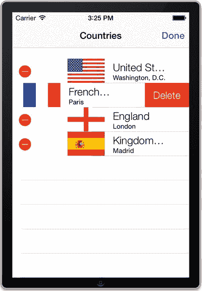

图 4-12. 从表格中删除一行


## 不过，还有更多！

删除并非 `UITableView` 中唯一可进行的编辑操作。尽管使用频率没那么高，但 iOS 内置了与删除行相同的方法来创建和插入行的功能。

`UITableView` 中任何行的默认编辑样式都是 `UITableViewCellEditingStyleDelete`，因此要实现行插入，你需要更改这一样式。为了增加趣味性，我们将通过实现 `tableView:editingStyleForRowAtIndexPath:` 方法，让每隔一行变为“插入”编辑样式，如代码清单 4-37 所示。

**代码清单 4-37.** 修改 `tableView:editingStyleForRowAtIndexPath:` 以添加插入功能

```
-(UITableViewCellEditingStyle)tableView:(UITableView *)tableView editingStyleForRowAtIndexPath:(NSIndexPath *)indexPath
{
    if ((indexPath.row % 2) == 1)
    {
        return UITableViewCellEditingStyleInsert;
    }
    return UITableViewCellEditingStyleDelete;
}
```

和之前一样，你需要指定点击“插入”按钮时的行为。在你的 `tableView:commitEditingStyle:forRowAtIndexPath:` 方法中增加一个分支，使其看起来像代码清单 4-38。

**代码清单 4-38.** 为处理“插入”按钮添加行为

```
-(void)tableView:(UITableView *)tableView commitEditingStyle:(UITableViewCellEditingStyle)editingStyle forRowAtIndexPath:(NSIndexPath *)indexPath
{
    if (editingStyle == UITableViewCellEditingStyleDelete)
    {
        Country *deletedCountry = [self.countries objectAtIndex:indexPath.row];
        [self.countries removeObject:deletedCountry];
        [countriesTableView
            deleteRowsAtIndexPaths:[NSArray arrayWithObject:indexPath]
            withRowAnimation:UITableViewRowAnimationAutomatic];
    }
    else if (editingStyle == UITableViewCellEditingStyleInsert)
    {
        Country *copiedCountry = [self.countries objectAtIndex:indexPath.row];
        Country *newCountry = [[Country alloc] init];
        newCountry.name = copiedCountry.name;
        newCountry.flag = copiedCountry.flag;
        newCountry.capital = copiedCountry.capital;
        newCountry.motto = copiedCountry.motto;
        [self.countries insertObject:newCountry atIndex:indexPath.row+1];
        [self.countriesTableView insertRowsAtIndexPaths:
            [NSArray arrayWithObject:[NSIndexPath indexPathForRow:indexPath.row+1
            inSection:indexPath.section]]
            withRowAnimation:UITableViewRowAnimationRight];
    }
}
```

可以看出我们选择了一种简单的插入实现方式，所做的只是在选定行之后插入一份副本。请注意，通过更改此方法中的索引值，你可以轻松地将对象插入到表格的几乎任意行；并不必非要插入到下一行。

与删除操作一样，你必须确保在更新表格视图之前更新数据模型，因此先将新的 `Country` 对象添加到数组，再向 `UITableView` 中插入新行。

运行应用并编辑表格时，你可以看到删除和插入按钮，如图 4-13 所示。

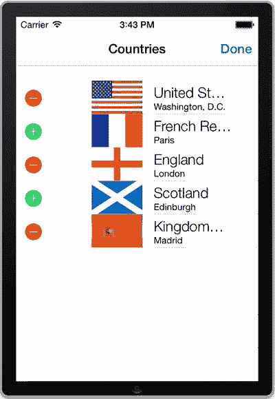

**图 4-13.** 通过插入或删除编辑 `UITableView`

你还可以结合使用另外两个 `UITableView` 委托方法，进一步自定义应用的行为。在结束本节并继续讲解表格视图重排序之前，我们先快速提一下它们。

*   `tableView:willBeginEditingRowAtIndexPath:` 方法让你能够“预览”将要编辑的行，并据此采取相应操作。
*   `tableView:didEndEditingRowAtIndexPath:` 方法可用作完成块，在此方法中，你可以指定在完成某行的编辑后，你认为需要对该行执行的任何操作。

## 秘方 4-3：对 `UITableView` 进行重排序

既然我们已经介绍了行的删除和插入，表格功能的下一步逻辑自然就是让行能够移动。考虑到应用的当前设置，实现这一点相当简单。

首先，你需要指定哪些行允许移动。通过实现 `tableView:canMoveRowAtIndexPath:` 委托方法来完成，如代码清单 4-39 所示。

**代码清单 4-39.** 实现 `tableView:canMoveRowAtIndexPath:` 方法

```
-(BOOL)tableView:(UITableView *)tableView canMoveRowAtIndexPath:(NSIndexPath *)indexPath
{
    return YES;
}
```

我们采取了最简单的方式，使所有行都可编辑，但你可以根据应用需求更改此设置。

现在，你只需实现一个委托，用于在成功移动行时更新数据模型，如代码清单 4-40 所示。

**代码清单 4-40.** 实现 `tableView:moveRowAtIndexPath:toIndexPath:` 方法

```
-(void)tableView:(UITableView *)tableView moveRowAtIndexPath:
(NSIndexPath *)sourceIndexPath toIndexPath:(NSIndexPath *)destinationIndexPath
{
    [self.countries exchangeObjectAtIndex:sourceIndexPath.row
        withObjectAtIndex:destinationIndexPath.row];
    [self.countriesTableView reloadData];
}
```

与插入操作一样，你必须确保更新数组以匹配重排序后的结果，但 `UITableView` 会自动处理行的实际交换。

为了对表格的重排序进行更精细的控制，你可以实现一个名为 `tableView:targetIndexPathForMoveFromRowAtIndexPath:` 的额外方法。当某个单元格被拖拽到另一个单元格上方（作为可能的移动目标）时，每次都会调用此委托方法，其常规用途是“重新定位”目标行。通过这种方式，你可以检查建议的目的地，并确认或拒绝建议的移动，然后返回一个不同的目的地。

尽管你没有实现确认或拒绝建议移动的功能，但你的应用现在已经成功支持了对行进行移动和重排序的功能，再加上之前的删除和复制功能，如图 4-14 所示。

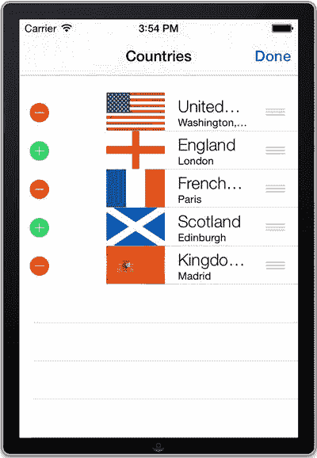

**图 4-14.** 具备单元格重排序功能的表格


## 配方 4-4：创建分组 UITableView

现在你已基本完成非分组 `UITableView` 的所有基础知识，可以调整应用以采用“分组”方式了。你在非分组表格中实现的所有功能同样适用于分组表格，因此无需进行大量修改。

使用分组表格首先要做的，就是将 `UITableView` 的“样式”从“plain（普通）”切换为“grouped（分组）”。最简单的方法是在视图控制器的 `.xib` 文件中，选中 `UITableView` 并在属性检查器中更改样式，效果将如图 4-15 所示。

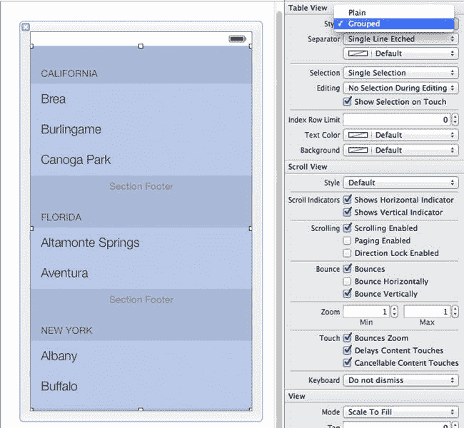

图 4-15. 配置“分组”UITableView

虽然这是更改表格样式所需的唯一步骤，但问题在于，到目前为止你的数据模型都是针对非分组样式设计的，数据完全没有分组。为解决此问题，你需要改变数据的组织方式。

与其用一个数组包含所有五个国家，不如将国家按组分开，每组作为一个 `NSMutableArray`，再将这些数组放入一个更大的 `NSMutableArray` 中。

对于你的应用，需要将五个 `Country` 对象分为两类：一类是英国国家，另一类是其他所有国家。

首先，你需要再创建两个 `NSMutableArray` 作为子数组，因此在 `MainTableViewController.h` 中添加这两个属性，如代码清单 4-41 所示。最终你将拥有三个 `NSMutableArray` 属性。

**代码清单 4-41.** 添加 `NSMutableArray` 属性以包含国家分组

```
@property (strong, nonatomic) NSMutableArray *countries;
@property (strong, nonatomic) NSMutableArray *unitedKingdomCountries;
@property (strong, nonatomic) NSMutableArray *nonUKCountries;
```

现在，修改 `viewDidLoad` 方法以适应这一变更。删除代码清单 4-42 中所示的行。

**代码清单 4-42.** 需要从 `viewDidLoad` 方法中移除的行

```
self.countries =
[NSMutableArray arrayWithObjects:usa, france, england, scotland, spain, nil];
```

然后，在删除代码清单 4-42 所示行的位置，添加代码清单 4-43 中的代码，以便正确组织国家。

**代码清单 4-43.** 创建国家分组并添加到国家数组

```
self.unitedKingdomCountries = [NSMutableArray arrayWithObjects:england, scotland, nil];
self.nonUKCountries = [NSMutableArray arrayWithObjects:usa, france, spain, nil];
self.countries = [NSMutableArray arrayWithObjects:self.unitedKingdomCountries, self.nonUKCountries, nil];
```

接下来是略显棘手的部分：你需要确保所有数据源和代理方法都适配新的格式。首先，每个方法中都要先获取分组数组，然后从分组数组中获取特定国家。首先修改 `tableView:cellForRowAtIndexPath`，如代码清单 4-44 所示。

**代码清单 4-44.** 更新 `tableView:cellForRowAtIndexPath:` 方法

```
- (UITableViewCell *)tableView:(UITableView *)tableView cellForRowAtIndexPath:(NSIndexPath *)indexPath
{
    static NSString *CellIdentifier = @"Cell";
    UITableViewCell *cell = [tableView dequeueReusableCellWithIdentifier:CellIdentifier];
    if (cell == nil)
    {
        cell = [[UITableViewCell alloc] initWithStyle:UITableViewCellStyleSubtitle
                                      reuseIdentifier:CellIdentifier];
        cell.accessoryType = UITableViewCellAccessoryDetailDisclosureButton;
        cell.textLabel.font = [UIFont systemFontOfSize:19.0];
        cell.detailTextLabel.font = [UIFont systemFontOfSize:12];
    }
    NSArray *group = [self.countries objectAtIndex:indexPath.section];
    Country *item = [group objectAtIndex:indexPath.row];
    cell.textLabel.text = item.name;
    cell.detailTextLabel.text = item.capital;
    cell.imageView.image =
```


```
[MainTableViewController scale: item.flag toSize:CGSizeMake(115, 75)];
return cell;
```

接下来，修改 `tableView:numberOfRowsInSection:`，如代码清单 4-45 所示。

**代码清单 4-45** 更新 `tableView:numberOfRowsInSection:` 方法

```
-(NSInteger)tableView:(UITableView *)tableView numberOfRowsInSection:(NSInteger)section
{
    NSArray *group = [self.countries objectAtIndex:section];
    return [group count];
}
```

代码清单 4-46 展示了 `tableView:didSelectRowAtIndexPath:` 的更新内容。

**代码清单 4-46** 更新 `tableView:didSelectRowAtIndexPath:` 方法

```
-(void)tableView:(UITableView *)tableView didSelectRowAtIndexPath:(NSIndexPath *)indexPath
{
    [tableView deselectRowAtIndexPath:indexPath animated:YES];
    selectedIndexPath = indexPath;
    NSArray *group = [self.countries objectAtIndex:indexPath.section];
    Country *chosenCountry = [group objectAtIndex:indexPath.row];
    CountryDetailsViewController *detailedViewController =
    [[CountryDetailsViewController alloc] init];
    detailedViewController.delegate = self;
    detailedViewController.currentCountry = chosenCountry;
    [self.navigationController pushViewController:detailedViewController animated:YES];
}
```

在 `tableView:accessoryButtonTappedForRowWithIndexPath:` 中可以看到同样的修改，如代码清单 4-47 所示。

**代码清单 4-47** 更新 `tableView:accessoryButtonTappedForRowWithIndexPath:` 方法

```
-(void)tableView:(UITableView *)tableView accessoryButtonTappedForRowWithIndexPath:(NSIndexPath *)indexPath
{
    [tableView deselectRowAtIndexPath:indexPath animated:YES];
    selectedIndexPath = indexPath;
    NSArray *group = [self.countries objectAtIndex:indexPath.section];
    Country *chosenCountry = [group objectAtIndex:indexPath.row];
    CountryDetailsViewController *detailedViewController =
    [[CountryDetailsViewController alloc] init];
    detailedViewController.delegate = self;
    detailedViewController.currentCountry = chosenCountry;
    NSLog(@"Accessory Button Tapped");
    [self.navigationController pushViewController:detailedViewController animated:YES];
}
```

对于 `tableView:moveRowAtIndexPath:toIndexPath:` 方法，为了简化编码，可以快速假设只移动同一分区内的行。后续运行应用时会发现这实际上效果良好。与当前实现一致，`UITableView` 不允许 `Country` 切换分组，这符合本特定应用的需求。如果某个应用需要合理支持对象切换分组，则应包含相应代码。

更新 `tableView:moveRowAtIndexPath:toIndexPath:` 方法的代码，如代码清单 4-48 所示。

**代码清单 4-48** 更新 `tableView:moveRowAtIndexPath:toIndexPath:` 方法

```
-(void)tableView:(UITableView *)tableView moveRowAtIndexPath:
    (NSIndexPath *)sourceIndexPath toIndexPath:(NSIndexPath *)destinationIndexPath
{
    //假设在同一分区
    NSMutableArray *group = [self.countries objectAtIndex:sourceIndexPath.section];
    if (destinationIndexPath.row < [group count])
    {
        [group exchangeObjectAtIndex:sourceIndexPath.row
        withObjectAtIndex:destinationIndexPath.row];
    }
    [self.countriesTableView reloadData];
}
```

最后一个需要修复的方法是 `tableView:commitEditingStyle:forRowAtIndexPath:`，其代码如代码清单 4-49 所示。

**代码清单 4-49** 更新 `tableView:commitEditingStyle:forRowAtIndexPath:`

```
-(void)tableView:(UITableView *)tableView commitEditingStyle:(UITableViewCellEditingStyle)editingStyle forRowAtIndexPath:(NSIndexPath *)indexPath
{
    if (editingStyle == UITableViewCellEditingStyleDelete)
    {
        NSMutableArray *group = [self.countries objectAtIndex:indexPath.section];
        Country *deletedCountry = [group objectAtIndex:indexPath.row];
        [group removeObject:deletedCountry];
        [self.countriesTableView deleteRowsAtIndexPaths:[NSArray arrayWithObject:indexPath] withRowAnimation:UITableViewRowAnimationAutomatic];
    }
    else if (editingStyle == UITableViewCellEditingStyleInsert)
    {
        NSMutableArray *group = [self.countries objectAtIndex:indexPath.section];
    }
}
```


`Country *copiedCountry = [` `group` `objectAtIndex:indexPath.row];`

`Country *newCountry = [[Country alloc] init];`

`newCountry.name = copiedCountry.name;`

`newCountry.flag = copiedCountry.flag;`

`newCountry.capital = copiedCountry.capital;`

`newCountry.motto = copiedCountry.motto;`

`[` `group` `insertObject:newCountry atIndex:indexPath.row+1];`

`[self.countriesTableView insertRowsAtIndexPaths:`

`[NSArray arrayWithObject:[NSIndexPath indexPathForRow:indexPath.row+1`

`inSection:indexPath.section]]`

`withRowAnimation:UITableViewRowAnimationRight];`

最后，因为你已将 `UITableView` 切换为分组样式，你需要再实现两个额外的方法来确保功能正确。

首先，你需要使用方法（如代码清单 4-50 所示）来指定 `UITableView` 将包含多少个分区。

```
-(NSInteger)numberOfSectionsInTableView:(UITableView *)tableView
{
    return [self.countries count];
}
```

其次，你需要为每个分区指定标题，这基本上就是各分组的名称。由于你已经知道数据是如何格式化的，这一步相当简单。添加如代码清单 4-51 所示的实现。

```
-(NSString *)tableView:(UITableView *)tableView titleForHeaderInSection:(NSInteger)section
{
    if (section == 0)
    {
        return @"英国国家";
    }
    return @"非英国国家";
}
```

如果你的数据模型更复杂，你可能希望将分组的名称与分组本身一起存储。实现这一目标的一个好方法是使用 `NSDictionary`，将分组名称作为字典键，分组项则作为字典对象。

`UITableViewDelegate` 协议还包含一个方法，允许开发者在编辑 `UITableView` 时自定义“删除”按钮中显示的文本。该方法（代码清单 4-52）是完全可选的，其具体用法根据应用程序的需求而变化。

```
-(NSString *)tableView:(UITableView *)tableView titleForDeleteConfirmationButtonForRowAtIndexPath:(NSIndexPath *)indexPath
{
    return NSLocalizedString(@"移除", @"删除");
}
```

完成所有这些更改后，运行应用应该会得到一个类似于图 4-16 的视图。

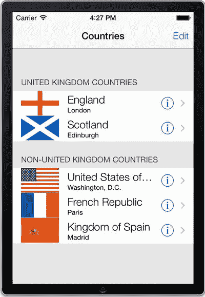

图 4-16. 显示有分组项和分区标题的应用界面

作为表格的最后一项修饰，你还可以为分区添加页脚。它们的工作原理与页眉类似，但正如你可能猜到的，它们出现在分组的底部。代码清单 4-53 展示了一个快速向 `UITableView` 添加页脚的方法。

```
-(NSString *)tableView:(UITableView *)tableView titleForFooterInSection:(NSInteger)section
{
    if (section == 0)
        return @"英国国家";
    return @"非英国国家";
}
```

与 `UITableView` 所有其他可自定义部分保持一致，这些页眉和页脚也可以轻松定制，而不局限于简单的 `NSString`。如果使用 `tableView:viewForHeaderInSection:` 和 `tableView:viewForFooterInSection:` 方法，你可以通过编程创建自己的子视图作为页眉或页脚，从而完全控制 `UITableView` 的显示效果。

至此，你已经拥有了一个功能完备的分组 `UITableView`，它具备与未分组表格完全相同的所有能力！图 4-17 展示了设置后的最终结果。

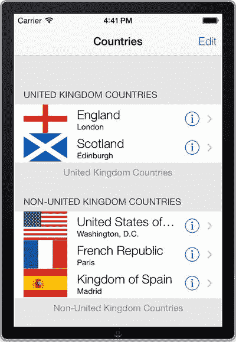

图 4-17. 完成的带页眉和页脚的分组 `UITableView`

## 技巧 4-5：注册自定义单元格类

暂时让我们回到负责创建和初始化表格视图单元格的方法。作为参考，代码清单 4-54 展示了之前技巧中的实现。

```
- (UITableViewCell *)tableView:(UITableView *)tableView cellForRowAtIndexPath:(NSIndexPath *)indexPath
{
    static NSString *CellIdentifier = @"Cell";
    UITableViewCell *cell =
        [tableView dequeueReusableCellWithIdentifier:CellIdentifier];
    if (cell == nil)
    {
        cell = [[UITableViewCell alloc] initWithStyle:UITableViewCellStyleSubtitle
                                      reuseIdentifier:CellIdentifier];
        cell.accessoryType = UITableViewCellAccessoryDetailDisclosureButton;
        cell.textLabel.font = [UIFont systemFontOfSize:19.0];
        cell.detailTextLabel.font = [UIFont systemFontOfSize:12];
    }
    NSArray *group = [self.countries objectAtIndex:indexPath.section];
    Country *item = [group objectAtIndex:indexPath.row];
    cell.textLabel.text = item.name;
    cell.detailTextLabel.text = item.capital;
    cell.imageView.image =
        [MainTableViewController scale: item.flag toSize:CGSizeMake(115, 75)];
    return cell;
}
```

这段代码遵循了 `tableView:cellForRowAtIndexPath:` 方法的常见实现模式，并且功能良好。然而，它存在几个问题。首先，代码非常冗长，而且快速浏览时不易看出其作用。更严重的问题是它的可复用性不佳；如果你创建另一个应用并希望拥有相似的表格视图单元格，你唯一的办法就是将上述代码复制粘贴到另一个项目中。

一个更好的解决方案是创建你自己的自定义表格视图单元格类，这样你就可以在项目之间重用，甚至在一个包含多个表格视图的项目内部重用。自定义类还能使设置代码更简洁、更易于理解。技巧 4-5 将向你展示如何将 Country 项目当前 `tableView:cellForRowAtIndexPath:` 方法的实现，改造成使用自定义表格视图单元格类的方式。


### 创建自定义表格视图单元格类

首先，使用 `Objective-C` 类模板创建一个新类。将新类命名为 `CountryCell`，并使其成为 `UITableViewCell` 的子类。打开 `CountryCell.h`，为该类添加一个 `country` 属性，如代码清单 4-55 所示。

**代码清单 4-55.** 向新的 `CountryCell.m` 接口中添加 `country` 属性

```
//
//  CountryCell.m
//  Recipe 4-1 to 4-5 Creating UITableViews
//

#import <UIKit/UIKit.h>
#import "Country.h"

@interface CountryCell : UITableViewCell

@property (strong, nonatomic) Country *country;

@end
```

现在，切换到 `CountryCell.m` 文件。表格视图单元格的指定初始化方法是 `initWithStyle:reuseIdentifier:` 方法。重写该方法，并提供所有国家单元格通用的初始化代码——即单元格样式、附件类型以及两个标签的字体，如代码清单 4-56 所示。

**代码清单 4-56.** 重写初始化方法以设置通用属性

```
- (id)initWithStyle:(UITableViewCellStyle)style reuseIdentifier:(NSString *)reuseIdentifier
{
    self = [super initWithStyle:UITableViewCellStyleSubtitle
                reuseIdentifier:reuseIdentifier];
    if (self)
    {
        // 初始化代码
        self.accessoryType = UITableViewCellAccessoryDetailDisclosureButton;
        self.textLabel.font = [UIFont systemFontOfSize:19.0];
        self.detailTextLabel.font = [UIFont systemFontOfSize:12];
    }
    return self;
}
```

接下来，我们将为 `country` 属性实现一个特殊的 setter 方法——即控制属性如何设置的方法。该方法会更新单元格中每个国家不同的部分，包括文本标签、详细文本标签和国旗图像。按照代码清单 4-57 所示实现该 setter 方法。

**代码清单 4-57.** 实现自定义的 `country` 属性 setter 方法

```
- (void)setCountry:(Country *)country
{
    if (country != _country)
    {
        _country = country;
        self.textLabel.text = _country.name;
        self.detailTextLabel.text = _country.capital;
        self.imageView.image =
            [CountryCell scale: _country.flag toSize:CGSizeMake(115, 75)];
    }
}
```

如果你现在尝试编译代码，将会失败，因为它无法识别 `scale:toSize:` 类方法，该方法当前在 `MainTableViewController` 中声明。在实际场景中，你可能希望将该方法移到一个在整个应用程序中共享的辅助类中，但就本教程而言，将其从 `MainTableViewController` 移至 `CountryCell` 类中已经足够。请确保同时移除 `MainTableViewController` 的 `@interface` 部分中的方法声明以及该方法本身。

你现在完整的实现文件应该类似于代码清单 4-58 所示的代码。

**代码清单 4-58.** 完整的 `CountryCell.m` 实现

```
//
//  CountryCell.m
//  Recipe 4-1 to 4-5 Creating UITableViews
//

#import "CountryCell.h"

@implementation CountryCell

- (id)initWithStyle:(UITableViewCellStyle)style reuseIdentifier:(NSString *)reuseIdentifier
{
    self = [super initWithStyle:UITableViewCellStyleSubtitle reuseIdentifier:reuseIdentifier];
    if (self)
    {
        // 初始化代码
        self.accessoryType = UITableViewCellAccessoryDetailDisclosureButton;
        self.textLabel.font = [UIFont systemFontOfSize:19.0];
        self.detailTextLabel.font = [UIFont systemFontOfSize:12];
    }
    return self;
}

+ (UIImage *)scale:(UIImage *)image toSize:(CGSize)size
{
    UIGraphicsBeginImageContext(size);
    [image drawInRect:CGRectMake(0, 0, size.width, size.height)];
    UIImage *scaledImage = UIGraphicsGetImageFromCurrentImageContext();
    UIGraphicsEndImageContext();
    return scaledImage;
}

- (void)setCountry:(Country *)country
{
    if (country != _country)
    {
        _country = country;
        self.textLabel.text = _country.name;
        self.detailTextLabel.text = _country.capital;
        self.imageView.image =
            [CountryCell scale: _country.flag toSize:CGSizeMake(115, 75)];
    }
}

@end
```

现在，你的自定义表格视图单元格类已经可以在表格视图控制器中使用。

### 注册你的单元格类

要注册你的单元格类，请切换到 `MainTableViewController.m`，并将代码清单 4-59 中的行添加到其 `viewDidLoad` 方法中。为了确保编译通过，你还需要导入 `CountryCell.h`。

**代码清单 4-59.** 将 `CountryCell` 类导入到 `MainTableViewController.m` 文件中

```
#import "MainTableViewController.h"
#import "CountryCell.h"

@implementation MainTableViewController

// ...
- (void)viewDidLoad
{
    [super viewDidLoad];
    // 加载 nib 文件后的任何其他设置
    self.title = @"Countries";
    self.countriesTableView.delegate = self;
    self.countriesTableView.dataSource = self;
    self.countriesTableView.layer.cornerRadius = 8.0;
    self.navigationItem.rightBarButtonItem = self.editButtonItem;
    [self.countriesTableView registerClass:CountryCell.class
                forCellReuseIdentifier:@"CountryCell"];
    // ...
}
```

上述代码向表格视图注册了你的 `CountryCell` 类。这利用了 iOS 7 的一个特性，该特性稍微改变了 `dequeueReusableCellWithIdentifier:` 方法的语义。该方法的新行为是，如果找不到合适的缓存单元格对象，只要存在具有给定标识符的已注册类，就会创建一个新的单元格。

现在是时候从你的修改中获益了，实现 `tableView:cellForRowAtIndexPath:` 方法。在这一点上，该方法可以精简为仅四行代码，如代码清单 4-60 所示。

**代码清单 4-60.** 更新 `tableView:cellForRowAtIndexPath:` 方法以利用新类

```
- (UITableViewCell *)tableView:(UITableView *)tableView cellForRowAtIndexPath:(NSIndexPath *)indexPath
{
    CountryCell *cell = [tableView dequeueReusableCellWithIdentifier:@"CountryCell"];
    NSArray *group = [self.countries objectAtIndex:indexPath.section];
    cell.country = [group objectAtIndex:indexPath.row];
    return cell;
}
```

现在，如果你构建并运行代码，它应该和之前一样正常工作。但你的代码现在封装得更好，也更便于复用。

## 方法 4-6：创建国旗选取器集合视图

iOS 6 中新增并在 iOS 7 中几乎没有变化的一个优秀功能是集合视图。它从经典的表格视图演变而来，并非为了取代它，而是作为其自然的补充。与以单列显示数据并基于该布局具有大量内置功能的表格视图不同，集合视图提供了对项目布局的完全控制，但内置功能较少。集合视图提供了更多可能性，但代价是开发者需要承担更多工作。

集合视图非凡的灵活性来源于视图与其布局的完全分离。这意味着你可以通过提供自定义布局对象来完全控制项目的布局。然而，Apple 提供了一个在任何情况下都可直接使用的现成布局类。该类提供了一种基本的多列布局，该布局可在一个方向上扩展（即支持水平或垂直滚动）。

在本方法中，我们将展示如何使用这个名为 `UICollectionViewFlowLayout` 的内置布局类来设置集合视图。你将用它创建一个选取器视图，用户可以在其中浏览国旗集合并选择其中一个。


### 设置应用程序

由于此应用需展示一组国旗，你应先收集一些国旗图像作为测试数据。从 [`http://en.wikipedia.org/wiki/Gallery_of_sovereign-state_flags`](http://en.wikipedia.org/wiki/Gallery_of_sovereign-state_flags) 下载任意数量的国旗图片，但为便于理解，至少应下载来自几个大洲的 15 张图片。作为参考，我们下载了以下国旗：

*   非洲国家：加纳、肯尼亚、摩洛哥、莫桑比克、卢旺达和南非
*   亚洲国家：中国、印度、日本、蒙古、俄罗斯和土耳其
*   大洋洲国家：澳大利亚和新西兰
*   欧洲国家：法国、德国、冰岛、爱尔兰、意大利、马耳他、波兰、西班牙、瑞典和英国
*   北美洲国家：加拿大、墨西哥和美国
*   南美洲国家：阿根廷、巴西和智利

**提示**

为减小应用体积，请下载 200 像素的 PNG 格式国旗。此格式和大小可通过点击维基百科国旗图库中的国旗图片获取，该操作会跳转至包含该图片可用尺寸和格式链接的页面。还建议你将文件名更改为仅包含国家名称，例如 `France.png`。

现在，创建一个新的单视图应用，并将国旗图片添加到项目中。一个简单的方法是将国旗图片收集到一个文件夹中，然后将其拖拽到项目导航器中。最好创建一个新的组文件夹来存放这些文件，建议放在 Supporting Files 文件夹中，如图 4-18 所示。

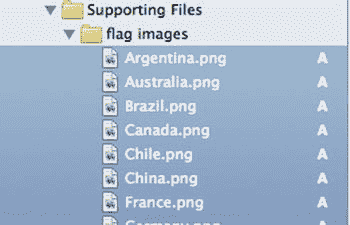

图 4-18。一个将国旗资源图片放在其专属组文件夹中的应用程序

接下来需要完成的任务是，创建一个简单的用户界面，用于显示一面大国旗及其所属国家的名称。国旗下方有一个按钮，用户可通过它使用你即将构建的国旗选择器来选取不同的国旗。选中 `Main.storyboard` 文件以编辑单视图控制器，并添加一个标签、一个图像视图和一个按钮到视图中，使其外观类似于图 4-19。在属性检查器中设置图像视图的 image 属性，从而用你的一张国旗图片来初始化该图像视图。

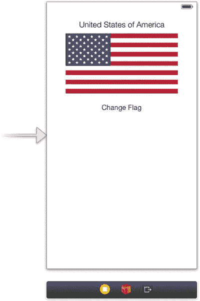

图 4-19。一个显示国家名称及其国旗的简单用户界面

由于你需要在运行时更改标签和图像视图的内容，因此代码中需要引用它们的输出口。分别创建名为 `countryLabel` 和 `flagImageView` 的输出口。类似地，为当用户点击按钮时创建名为 `pickFlag` 的操作方法。

你的 `ViewController.h` 文件现在应类似于代码清单 4-61。

代码清单 4-61。起始的 `ViewController.h` 文件

```
//
//  ViewController.h
//  Recipe 4-6 Creating a flag picker collection view
//

#import <UIKit/UIKit.h>

@interface ViewController : UIViewController

@property (weak, nonatomic) IBOutlet UILabel *countryLabel;
@property (weak, nonatomic) IBOutlet UIImageView *flagImageView;
- (IBAction)pickFlag:(id)sender;

@end
```

你稍后将暂时离开主用户界面，转而着手实现将从 `pickFlag:` 操作方法中显示的国旗选择器视图控制器。但在那之前，你需要创建一个简单的数据模型，用于在选择器和主视图之间传输数据。

### 创建数据模型

在本教程中，你将建立一个简单的模型来保存数据。你将创建一个类，用于保存一面国旗的图片及其所属国家的名称。创建一个名为 `Flag` 的新 Objective-C 类，继承自 `NSObject`。然后，在 `Flag.h` 中添加代码清单 4-62 中的代码，为该类声明属性和初始化方法。

代码清单 4-62。为 `Flag` 类声明属性和初始化方法

```
//
//  Flag.h
//  Recipe 4-6 Creating a flag picker collection view
//

#import <Foundation/Foundation.h>

@interface Flag : NSObject

@property (strong, nonatomic) NSString *name;
@property (strong, nonatomic) UIImage *image;
- (id)initWithName:(NSString *)name imageName:(NSString *)imageName;

@end
```

现在，切换到 `Flag.m` 文件，添加初始化方法的实现，如代码清单 4-63 所示。

代码清单 4-63。在 `Flag.m` 中实现自定义初始化方法

```
//
//  Flag.m
//  Recipe 4-6 Creating a flag picker collection view
//

#import "Flag.h"

@implementation Flag

- (id)initWithName:(NSString *)name imageName:(NSString *)imageName
{
    self = [super init];
    if (self) {
        self.name = name;
        NSString *imageFile = [[NSBundle mainBundle] pathForResource:imageName ofType:@"png"];
        self.image = [[UIImage alloc] initWithContentsOfFile:imageFile];
    }
    return self;
}

@end
```

**注意**

`initWithName:imageName:` 方法将图片资源文件加载到内存中。在实际场景中，你可能更愿意在自定义属性 getter 中使用懒初始化。这允许你在通过自定义 getter 访问属性时才初始化图片资源。通过这样做，你可以将加载推迟到实际需要图片的时刻。但对于本教程，在创建时加载国旗文件是可行的。

现在，你可以继续前进，开始实现国旗选择器了。


### 构建国旗选择器

当用户点击用户界面中的“更换国旗”按钮时，应用会显示一组国旗供用户选择。这是集合视图的理想应用场景，现在我们就来创建一个。

首先，你需要一个新的视图控制器来处理集合视图，因此创建一个 `UICollectionViewController` 的子类。将新类命名为 `FlagPickerViewController`。你不需要 `.xib` 文件来处理其用户界面，所以请确保“使用 XIB 创建用户界面”选项未被选中。

新类创建完成后，设置委托模式，用于通知主视图已选中某个国旗。进入新类的头文件，添加代码清单 4-64 中的内容。

**代码清单 4-64.** 为 `FlagPickerViewController` 设置委托模式

```
//
//  FlagPickerViewController.h
//  Recipe 4-6 创建国旗选择器集合视图
//

#import <UIKit/UIKit.h>
#import "Flag.h"

@class FlagPickerViewController;

@protocol FlagPickerViewControllerDelegate <NSObject>
-(void)flagPicker:(FlagPickerViewController *)flagPicker didPickFlag:(Flag *)flag;
@end

@interface FlagPickerViewController : UICollectionViewController
- (id)initWithDelegate:(id<FlagPickerViewControllerDelegate>)delegate;
@property (weak, nonatomic)id<FlagPickerViewControllerDelegate>delegate;
@end
```

你还需要一些实例变量来存储可用的国旗。由于你将根据国旗所属的大洲进行分组，因此需要六个数组，如代码清单 4-65 所示。

**代码清单 4-65.** 创建实例数组以存储各组国旗

```
//
//  FlagPickerViewController.h
//  Recipe 4-6 创建国旗选择器集合视图
//

// ...
@interface FlagPickerViewController : UICollectionViewController
{
@private
    NSArray *africanFlags;
    NSArray *asianFlags;
    NSArray *australasianFlags;
    NSArray *europeanFlags;
    NSArray *northAmericanFlags;
    NSArray *southAmericanFlags;
}
- (id)initWithDelegate:(id<FlagPickerViewControllerDelegate>)delegate;
@property (weak, nonatomic)id<FlagPickerViewControllerDelegate>delegate;
@end
```

现在，切换到 `FlagPickerViewController.m` 文件，添加初始化方法的实现，如代码清单 4-66 所示。

**代码清单 4-66.** 在 `FlagPickerViewController.m` 文件中添加自定义初始化方法

```
//
//  FlagPickerViewController.m
//  Recipe 4-6 创建国旗选择器集合视图
//

#import "FlagPickerViewController.h"

@implementation FlagPickerViewController

- (id)initWithDelegate:(id<FlagPickerViewControllerDelegate>)delegate
{
    UICollectionViewFlowLayout *layout =
        [[UICollectionViewFlowLayout alloc] init];
    self = [super initWithCollectionViewLayout:layout];
    if (self)
    {
        self.delegate = delegate;
    }
    return self;
}
// ...
@end
```

从上述代码可以看出，该方法创建了一个布局对象来处理单元格的定位。我们使用的是内置的 `UICollectionViewFlowLayout`，它提供了简单的多列布局，并沿一个方向（默认水平方向）流动。该方法还设置了 `delegate` 属性，后续将用于通知调用方已做出选择。

接下来，创建可用国旗的集合。找到 `viewDidLoad` 方法，添加代码清单 4-67 中的代码。请注意，你需要根据实际下载并导入到项目中的国旗来调整代码。

**代码清单 4-67.** 在各分组中添加并初始化国旗

```
- (void)viewDidLoad
{
    [super viewDidLoad];
    // 在此处添加从 nib 加载视图后的其他设置。
    africanFlags = [NSArray arrayWithObjects:
        [[Flag alloc] initWithName:@"加纳" imageName:@"Ghana"],
        [[Flag alloc] initWithName:@"肯尼亚" imageName:@"Kenya"],
        [[Flag alloc] initWithName:@"摩洛哥" imageName:@"Morocco"],
        [[Flag alloc] initWithName:@"莫桑比克" imageName:@"Mozambique"],
        [[Flag alloc] initWithName:@"卢旺达" imageName:@"Rwanda"],
        [[Flag alloc] initWithName:@"南非" imageName:@"South_Africa"],
        nil];
    asianFlags = [NSArray arrayWithObjects:
        [[Flag alloc] initWithName:@"中国" imageName:@"China"],
        [[Flag alloc] initWithName:@"印度" imageName:@"India"],
        [[Flag alloc] initWithName:@"日本" imageName:@"Japan"],
        [[Flag alloc] initWithName:@"蒙古" imageName:@"Mongolia"],
        [[Flag alloc] initWithName:@"俄罗斯" imageName:@"Russia"],
        [[Flag alloc] initWithName:@"土耳其" imageName:@"Turkey"],
        nil];
    australasianFlags = [NSArray arrayWithObjects:
        [[Flag alloc] initWithName:@"澳大利亚" imageName:@"Australia"],
        [[Flag alloc] initWithName:@"新西兰" imageName:@"New_Zealand"],
        nil];
    europeanFlags = [NSArray arrayWithObjects:
        [[Flag alloc] initWithName:@"法国" imageName:@"France"],
        [[Flag alloc] initWithName:@"德国" imageName:@"Germany"],
        [[Flag alloc] initWithName:@"冰岛" imageName:@"Iceland"],
        [[Flag alloc] initWithName:@"爱尔兰" imageName:@"Ireland"],
        [[Flag alloc] initWithName:@"意大利" imageName:@"Italy"],
        [[Flag alloc] initWithName:@"波兰" imageName:@"Poland"],
        [[Flag alloc] initWithName:@"俄罗斯" imageName:@"Russia"],
        [[Flag alloc] initWithName:@"西班牙" imageName:@"Spain"],
        [[Flag alloc] initWithName:@"瑞典" imageName:@"Sweden"],
        [[Flag alloc] initWithName:@"土耳其" imageName:@"Turkey"],
        [[Flag alloc] initWithName:@"英国" imageName:@"United_Kingdom"],
        nil];
    northAmericanFlags = [NSArray arrayWithObjects:
        [[Flag alloc] initWithName:@"加拿大" imageName:@"Canada"],
        [[Flag alloc] initWithName:@"墨西哥" imageName:@"Mexico"],
        [[Flag alloc] initWithName:@"美国" imageName:@"United_States"],
        nil];
    southAmericanFlags = [NSArray arrayWithObjects:
        [[Flag alloc] initWithName:@"阿根廷" imageName:@"Argentina"],
        [[Flag alloc] initWithName:@"巴西" imageName:@"Brazil"],
        [[Flag alloc] initWithName:@"智利" imageName:@"Chile"],
        nil];
}
```

集合视图的数据模式与表格视图相同，即允许将数据分组到多个分区中。你将看到，用于通知集合视图分区数量和每个分区包含项目数量的数据源方法与表格视图的非常相似。添加代码清单 4-68 中的以下两个方法来提供这些数据。

**代码清单 4-68.** 添加数据源方法设置分区和项目数量

```
//
//  FlagPickerViewController.m
//  Recipe 4-6 创建国旗选择器集合视图
//

// ...
@implementation FlagPickerViewController
// ...

-(NSInteger)numberOfSectionsInCollectionView:(UICollectionView *)collectionView
{
    return 6;
}

-(NSInteger)collectionView:(UICollectionView *)collectionView numberOfItemsInSection:(NSInteger)section
{
    switch (section) {
        case 0:
            return africanFlags.count;
        case 1:
            return asianFlags.count;
        case 2:
            return australasianFlags.count;
        case 3:
            return europeanFlags.count;
        case 4:
            return northAmericanFlags.count;
        case 5:
            return southAmericanFlags.count;
        default:
            return 0;
    }
}
@end
```

> **注意：** 你可能已经注意到，我们没有为集合视图显式分配数据源委托。集合视图控制器类会自动处理此问题；如果你没有提供特定的委托对象，它会将自身分配为此任务。这对于集合视图的 `UICollectionViewDelegate` 和 `UICollectionViewDataSource` 属性都适用。

现在你已经设置好集合视图，使其清楚应显示多少个分区以及多少个项目。下一步是让集合视图知道如何显示这些项目。这通过创建并注册单元格视图以及所谓的补充视图来完成。


### 定义集合视图接口

集合视图将实际显示项目和各区段详细信息的工作委托给你提供的视图。这些视图被称为**单元格视图**和**补充视图**。补充视图包括区段标题和页脚等内容，而单元格视图则是单个项目。你需要定义这些视图并将其注册到集合视图中。

你将通过编程方式设置这些单元格，先从单元格视图开始。它应包含一个国旗的缩略图以及一个显示国家名称的小标签。首先创建一个名为 `FlagCell` 的新 `UICollectionViewCell` 子类，然后在新的类头文件中添加属性声明，如代码清单 4-69 所示。

**代码清单 4-69.** 向 `FlagCell.h` 文件添加属性声明

```
//
//  FlagCell.h
//  Recipe 4-6 Creating a flag picker collection view
//

#import <UIKit/UIKit.h>

@interface FlagCell : UICollectionViewCell

@property (strong, nonatomic) UILabel *nameLabel;
@property (strong, nonatomic) UIImageView *flagImageView;

@end
```

在实现文件中，将初始化代码添加到 `initWithFrame:` 方法中，如代码清单 4-70 所示。该代码主要完成两件事：创建标签和图像视图并将其添加到单元格的内容视图中，同时修改单元格高亮时显示的背景视图颜色。

**代码清单 4-70.** 向 `FlagCell.m` 添加代码以创建并添加标签和图像，同时更改背景颜色

```
//
//  FlagCell.m
//  Recipe 4-6 Creating a flag picker collection view
//

#import "FlagCell.h"

@implementation FlagCell

- (id)initWithFrame:(CGRect)frame
{
    self = [super initWithFrame:frame];
    if (self) {
        // Initialization code
        self.nameLabel =
            [[UILabel alloc] initWithFrame:CGRectMake(0, 56, 100, 19)];
        self.nameLabel.textAlignment = NSTextAlignmentCenter;
        self.nameLabel.backgroundColor = [UIColor clearColor];
        self.nameLabel.textColor = [UIColor whiteColor];
        self.nameLabel.font = [UIFont systemFontOfSize:12.0];
        [self.contentView addSubview:self.nameLabel];

        self.flagImageView =
            [[UIImageView alloc] initWithFrame:CGRectMake(6, 6, 88, 49)];
        [self.contentView addSubview:self.flagImageView];

        self.selectedBackgroundView = [[UIView alloc] initWithFrame:frame];
        self.selectedBackgroundView.backgroundColor = [UIColor grayColor];
    }
    return self;
}

@end
```

现在，对标题补充视图重复此过程。它只需包含一个标签，用于在相应区段的标题中显示大洲名称。创建一个新类，这次作为 `UICollectionReusableView` 的子类，并命名为 `ContinentHeader`。然后在其头文件中添加属性声明，如代码清单 4-71 所示。

**代码清单 4-71.** 向 `ContinentHeader.h` 文件添加标签属性

```
//
//  ContinentHeader.h
//  Recipe 4-6 Creating a flag picker collection view
//

#import <UIKit/UIKit.h>

@interface ContinentHeader : UICollectionReusableView

@property (strong, nonatomic) UILabel *label;

@end
```

接下来，将初始化代码添加到实现文件中，如代码清单 4-72 所示。

**代码清单 4-72.** 向 `ContinentHeader.m` 添加初始化代码

```
//
//  ContinentHeader.m
//  Recipe 4-6 Creating a flag picker collection view
//

#import "ContinentHeader.h"

@implementation ContinentHeader

- (id)initWithFrame:(CGRect)frame
{
    self = [super initWithFrame:frame];
    if (self) {
        // Initialization code
        self.label = [[UILabel alloc] initWithFrame:
            CGRectMake(0, 0, frame.size.width, frame.size.height)];
        self.label.font = [UIFont systemFontOfSize:20];
        self.label.textColor = [UIColor whiteColor];
        self.label.backgroundColor = [UIColor clearColor];
        self.label.textAlignment = NSTextAlignmentCenter;
        [self addSubview:self.label];
    }
    return self;
}

@end
```


要使用这两个视图来显示内容，你需要将它们注册到集合视图中。回到 `FlagPickerViewController.m` 文件，并将代码清单 4-73 中的代码添加到 `viewDidLoad` 方法中（为简洁起见，已移除设置旗标数据的代码）。

**代码清单 4-73.** 在 `FlagPickerViewController.m` 中注册 `FlagCell` 和 `ContinentHeader` 视图

```
//
//  FlagPickerViewController.m
//  Recipe 4-6 Creating a flag picker collection view
//
#import "FlagPickerViewController.h"
#import "FlagCell.h"
#import "ContinentHeader.h"
@implementation FlagPickerViewController
// ...
- (void)viewDidLoad
{
[super viewDidLoad];
// Do any additional setup after loading the view from its nib.
// ...
[self.collectionView registerClass:FlagCell.class
forCellWithReuseIdentifier:@"FlagCell"];
[self.collectionView registerClass:ContinentHeader.class
forSupplementaryViewOfKind:UICollectionElementKindSectionHeader
withReuseIdentifier:@"ContinentHeader"];
}
// ...
@end
```

注册完单元格和补充视图后，你可以实现用于创建和设置它们的数据源与委托方法。仍在 `FlagPickerViewController.m` 文件中，添加代码清单 4-74 所示的委托方法。

**代码清单 4-74.** 实现 `collectionView:cellForItemAtIndexPath:` 方法

```
-(UICollectionViewCell*)collectionView:(UICollectionView *)collectionView cellForItemAtIndexPath:(NSIndexPath *)indexPath
{
FlagCell *cell =
[collectionView dequeueReusableCellWithReuseIdentifier:@"FlagCell"
forIndexPath:indexPath];
Flag *flag = [self flagForIndexPath:indexPath];
cell.nameLabel.text = flag.name;
cell.flagImageView.image = flag.image;
return cell;
}
```

`dequeueReusableCellWithReuseIdentifier:` 方法会检查是否能重用已创建的单元格，或者在无可用单元格时创建新单元格。无论如何，你都能获得一个已分配的单元格实例，只需在将其返回给集合视图前用当前数据更新即可。

此外，该方法使用了一个辅助方法 `flagForIndexPath:` 从数据模型中获取对应的旗标实例。该辅助方法的实现如代码清单 4-75 所示。

**代码清单 4-75.** 实现 `flagForIndexpath:` 辅助方法

```
-(Flag *)flagForIndexPath:(NSIndexPath *)indexPath
{
switch (indexPath.section) {
case 0:
return [africanFlags objectAtIndex:indexPath.row];
case 1:
return [asianFlags objectAtIndex:indexPath.row];
case 2:
return [australasianFlags objectAtIndex:indexPath.row];
case 3:
return [europeanFlags objectAtIndex:indexPath.row];
case 4:
return [northAmericanFlags objectAtIndex:indexPath.row];
case 5:
return [southAmericanFlags objectAtIndex:indexPath.row];
default:
return nil;
}
}
```

现在，用于补充视图（分区头部）的对应数据源方法如下所示。也将其添加到 `FlagPickerViewController` 类中：

```
- (UICollectionReusableView *)collectionView:(UICollectionView *)collectionView viewForSupplementaryElementOfKind:(NSString *)kind atIndexPath:(NSIndexPath *)indexPath
{
ContinentHeader *headerView = [collectionView dequeueReusableSupplementaryViewOfKind:UICollectionElementKindSectionHeader withReuseIdentifier:@"ContinentHeader" forIndexPath:indexPath];
headerView.label.text = [self nameForSection:indexPath.section];
return headerView;
}
```

再次，你使用一个辅助方法从数据模型中获取数据。这次，你通过代码清单 4-76 所示的实现来查询分区名称。

**代码清单 4-76.** 实现 `nameForSection:` 方法

```
- (NSString *)nameForSection:(NSInteger)index
{
switch (index)
{
case 0:
return @"African Flags";
case 1:
return @"Asian Flags";
case 2:
return @"Australasian Flags";
case 3:
return @"European Flags";
case 4:
return @"North American Flags";
case 5:
return @"South American Flags";
default:
return @"Unknown";
}
}
```

至此，在完成集合视图用户界面定义之前，还需设置单元格和补充视图的尺寸。在 `collectionView:collectionViewLayout:sizeForItemAtPath:` 和 `collectionView:collectionViewLayout:referenceSizeForHeaderInSection:` 数据源方法中完成此操作，如代码清单 4-77 所示。

**代码清单 4-77.** 实现设置单元格尺寸和补充视图的委托方法

```
- (CGSize)collectionView:(UICollectionView *)collectionView layout:(UICollectionViewLayout*)collectionViewLayout sizeForItemAtIndexPath:(NSIndexPath *)indexPath
{
return CGSizeMake(100, 75);
}
- (CGSize)collectionView:(UICollectionView *)collectionView layout:(UICollectionViewLayout*)collectionViewLayout referenceSizeForHeaderInSection:(NSInteger)section
{
return CGSizeMake(50, 50);
}
```

**注意**
在集合视图的流式布局中设置头部或脚部尺寸时，仅考虑一个维度。例如，如果流是垂直的，则仅使用 `CGSize` 的高度分量来确定补充视图的实际尺寸。宽度则由集合视图的宽度推断得出。水平流则相反，仅考虑你提供的宽度。

在旗标选择器中需要完成的最后一项任务是添加代码，在选定旗标时通知主视图。既然基础架构已就绪，这很容易做到。将委托方法添加到 `FlagPickerViewController`，如代码清单 4-78 所示。

**代码清单 4-78.** 添加 `collectionView:didSelectItemAtIndexPath:` 方法

```
-(void)collectionView:(UICollectionView *)collectionView didSelectItemAtIndexPath:(NSIndexPath *)indexPath
{
Flag *selectedFlag = [self flagForIndexPath:indexPath];
[self.delegate flagPicker:self didPickFlag:selectedFlag];
}
```

旗标选择器的实现已完成。现在，你需要将焦点转回主视图。


### 显示标志选择器

要使用你刚构建的标志选择器，首先需要让主视图控制器成为标志选择器的委托。通过使其遵循你之前定义的 `FlagPickerViewControllerDelegate` 协议来实现这一点。切换到 `ViewController.h` 并添加代码清单 4-79 中的代码。

**代码清单 4-79.** 使主视图控制器遵循 `FlagPickerViewControllerDelegate` 协议

```
//
//  ViewController.h
//  Recipe 4-6 Creating a flag picker collection view
//

#import <UIKit/UIKit.h>
#import "FlagPickerViewController.h"

@interface ViewController : UIViewController <FlagPickerViewControllerDelegate>

@property (weak, nonatomic) IBOutlet UILabel *countryLabel;
@property (weak, nonatomic) IBOutlet UIImageView *flagImageView;

- (IBAction)pickFlag:(id)sender;

@end
```

最后，你现在可以实现 `pickFlag:` 动作方法。转到 `ViewController.m` 并添加实现，如代码清单 4-80 所示。

**代码清单 4-80.** 在 `ViewController.m` 中实现 `pickFlag:` 动作方法

```
- (IBAction)pickFlag:(id)sender
{
    UICollectionViewController *flagPicker =
        [[FlagPickerViewController alloc] initWithDelegate:self];
    [self presentViewController:flagPicker animated:YES completion:NULL];
}
```

在代码清单 4-80 中，你首先创建了一个新的 `UICollectionViewController` 实例，并用 `ViewController` 类作为委托对其进行初始化。然后将新的 `UICollectionViewController` 作为当前视图呈现。

最后，添加响应来自标志选择器的选择事件的方法（代码清单 4-81）。该方法只是关闭标志选择器，并用新信息更新图像视图和标签。

**代码清单 4-81.** 实现 `flagPicker:didPickFlag:` 委托方法

```
-(void)flagPicker:(FlagPickerViewController *)flagPicker didPickFlag:(Flag *)flag
{
    self.flagImageView.image = flag.image;
    self.countryLabel.text = flag.name;
    [self dismissViewControllerAnimated:YES completion:NULL];
}
```

现在你可以构建并运行应用程序了。当你点击“更换标志”按钮时，应该会看到一个类似图 [4-20] 中的视图。

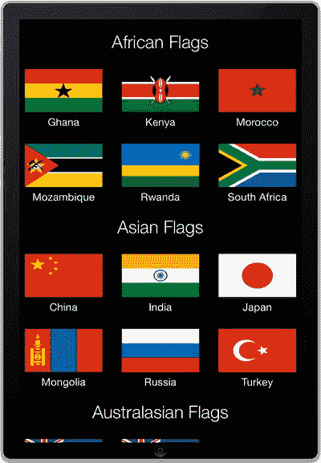

**图 4-20.** 显示一组标志的集合视图

你可以滚动浏览标志，并选择一个用于更新主视图，如图 [4-21] 所示。

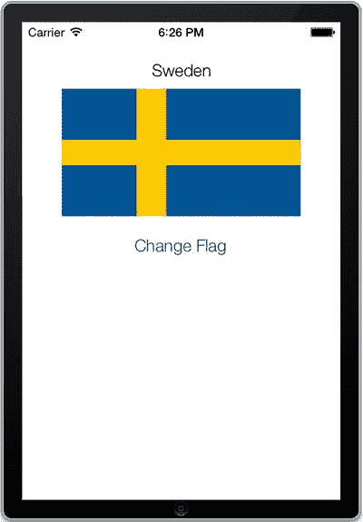

**图 4-21.** 在标志选择器中选中标志后更新的主视图

然而，如果你旋转设备（通过按 n + à）并激活标志选择器，你会注意到一个小问题。如图 [4-22] 所示，分区标题不再居中。

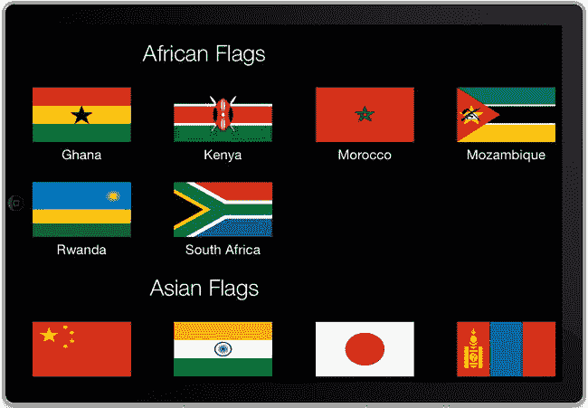

**图 4-22.** 标志选择器的标题文件在横屏方向未正确居中

### 使用自动布局居中标题

标题标签无法保持居中的原因是它们是以固定尺寸创建的。在应用程序保持竖屏模式时这没问题，但当屏幕旋转时，静态尺寸的标签无法跟随，导致你在图 [4-22] 中看到的效果。

要解决这个问题，你可以使用一点自动布局的魔法。转到 `ContinentHeader.m` 并在 `initWithFrame:` 方法中添加代码清单 4-82 中的代码。这段代码的作用是添加一个自动布局约束，指示标签扩展至其父视图（标题视图）的宽度，并且即使父视图的框架发生变化也保持此状态。

**代码清单 4-82.** 添加自动布局约束以修复旋转问题（新增内容以粗体显示）

```
//
//  ContinentHeader.m
//  Recipe 4-6 Creating a flag picker collection view
//

#import "ContinentHeader.h"

@implementation ContinentHeader

- (id)initWithFrame:(CGRect)frame
{
    self = [super initWithFrame:frame];
    if (self) {
        // Initialization code
        self.label = [[UILabel alloc] initWithFrame:
            CGRectMake(0, 0, frame.size.width, frame.size.height)];
        self.label.font = [UIFont systemFontOfSize:20];
        self.label.textColor = [UIColor whiteColor];
        self.label.backgroundColor = [UIColor clearColor];
        self.label.textAlignment = NSTextAlignmentCenter;
        [self addSubview:self.label];
        self.label.translatesAutoresizingMaskIntoConstraints = NO;
        NSDictionary *viewsDictionary =
            [[NSDictionary alloc] initWithObjectsAndKeys:
             self.label, @"label", nil];
        [self addConstraints:
            [NSLayoutConstraint constraintsWithVisualFormat:@"H:|[label]|"
            options:0 metrics:nil views:viewsDictionary]];
    }
    return self;
}

@end
```

如果现在运行应用程序，你会看到这个编辑对标题产生了预期效果。它们现在居中显示了，即使在横屏方向也是如此，如图 [4-23] 所示。

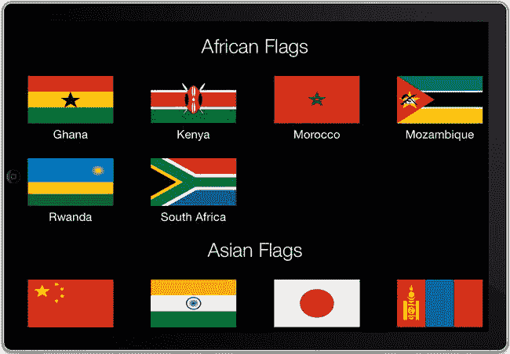

**图 4-23.** 此应用程序中的大洲标签通过自动布局实现居中

## 总结

在本章中，我们向你展示了 iOS 7 平台的两个核心组件：表视图和集合视图。我们向你展示了如何设置它们并在应用程序中使用它们。我们也让你初步了解开发者对这些视图的定制控制程度，不过完整的 Apple 文档对此主题有更详细的阐述。

然而，表视图和集合视图的关键不在于它们如何工作，而在于它们所呈现的数据。作为开发者，你需要找到用户想要或需要的信息，并以最高效、最灵活的方式呈现给他们。表视图和集合视图是出色的工具，但它们服务的目的是更为重要的，而这最终将是你交付给客户的最终产品。

