# 5. 位置相关代码

**摘要**

了解设备的准确位置和方向使开发者能够将应用程序提升到一个全新的水平。以新方式利用位置服务的应用程序不断涌现，其潜在用途似乎是无穷无尽的。你可以围绕这些功能构建完整的应用程序，例如路径导航或健身追踪应用，也可以在更传统的应用中使用位置服务来增强用户体验。后者一个很好的例子是内置的提醒事项应用，它可以在你到达某个位置时提醒你执行某些任务，例如在到家时给朋友打电话。

苹果公司最近非常关注这一领域，iOS 7 提供了比其前身更好的准确性和可用性，以及一些能改善电池续航的新默认行为。有了 iOS 7，你比以往任何时候都更有条件让应用程序具备位置感知能力。本章将向你展示如何开始。


## 关于 Core Location

Core Location 框架提供了在应用中实现位置感知功能所需的一切。具体来说，它支持以下功能：

- 位置追踪
- 监测重大位置变化
- 监测自定义区域的进出
- 获取当前方向
- 将坐标转换为地址（正向地理编码）
- 将地址转换为坐标（反向地理编码）

为了完成这些任务，Core Location 会利用来自多个数据源的信息，包括蜂窝信号塔、附近的 Wi-Fi 网络、GPS 以及磁力计。框架内部运行着一些非常复杂的机制，我们无需关心这些，因为它已经将这些封装到了一个易于使用、功能集成的 API 中。

## 标准定位服务与重大位置变化服务

获取设备位置主要有两种方法：**标准定位服务**和**重大位置变化服务**。选择哪一种取决于你对定位信息的精确度要求，以及你希望多频繁地接收到设备位置变化的通知。

标准定位服务能提供更精确的位置信息，如果请求的精度需要，它会调用 GPS。这种高精度的代价是获取位置所需的时间更长，并且会增加电池消耗。如果你打算使用标准定位服务，应谨慎使用，且仅在必要时启用。

重大位置变化服务则提供了一定的灵活性，推荐用于大多数不需要高精度位置信息的应用。例如，如果你只需要知道某人所在的城镇或城市，使用重大位置变化服务就完全足够了。它能提供快速响应，且不会消耗大量电量，因为它通过蜂窝信号来确定设备位置。重大位置变化服务的另一个好处是它能在设备后台运行。与标准定位服务不同，你的应用无需在前台运行也能接收来自此服务的位置更新。

## 技巧 5-1：获取基本位置信息

本技巧将演示如何使用标准定位服务来获取关于设备当前位置、航向和速度的基本信息。

### 设置应用程序

首先，创建一个新的单视图应用程序，并将 Core Location 框架添加到项目中。（关于如何创建项目和链接框架库的说明，请参见第 1 章）。

你将使用一个非常简单的用户界面，包括一个标题标签、一个用于显示位置信息的文本视图，以及一个让用户开启或关闭位置更新的开关控件。通过在项目导航器中选择 `Main.storyboard` 文件来打开故事板。从对象库中拖动标签和开关到你的单视图中。将文本视图调整到足够大，以容纳四行文字。同样，确保开关的初始状态设置为“关闭”。

你的用户界面现在应该类似于图 5-1 所示。

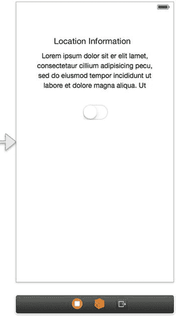

图 5-1. 技巧 5-1 的用户界面

现在为文本视图和开关创建 outlet 属性。将它们分别命名为 `locationInformationView` 和 `locationUpdatesSwitch`。你还需要知道用户何时点击了开关控件，因此请为开关创建一个 action。将其命名为 `toggleLocationUpdates`，并将事件类型设置为 `Value Changed`。（如果你对 outlet 和 action 不太确定，可以在第 1 章中找到如何创建它们的说明）。

所有与 Core Location 框架的交互都通过一个位置管理器进行。通过它，你可以启动和停止位置更新。为了方便起见，将视图控制器设置为位置管理器的委托；它是处理所有基于位置服务的“中枢”。因此，将 `CLLocationManagerDelegate` 添加为视图控制器类支持的协议，以及清单 5-1 中显示的导入语句。

清单 5-1. 声明使用 CLLocationManagerDelegate 并导入 CoreLocation 框架

```
// ...
#import <CoreLocation/CoreLocation.h>
@interface ViewController : UIViewController <CLLocationManagerDelegate>
// ...
@end
```

现在你需要为位置管理器创建一个实例变量。也将其添加到视图控制器中，并命名为 `_locationManager`（请参见清单 5-2）。

清单 5-2. 为位置管理器设置实例变量

```
// ...
@interface ViewController : UIViewController<CLLocationManagerDelegate>
{
    CLLocationManager *_locationManager;
}
// ...
@end
```

你的视图控制器的头文件现在应该类似于清单 5-3。

清单 5-3. 添加了清单 5-1 和 5-2 后的 ViewController.h 文件

```
//
//  ViewController.h
//  Recipe 5-1 Getting Basic Location Info
//
#import <UIKit/UIKit.h>
#import <CoreLocation/CoreLocation.h>
@interface ViewController : UIViewController<CLLocationManagerDelegate>
{
    CLLocationManager *_locationManager;
}
@property (weak, nonatomic) IBOutlet UITextView *locationInformationView;
@property (weak, nonatomic) IBOutlet UISwitch *locationUpdatesSwitch;
- (IBAction)toggleLocationUpdates:(id)sender;
@end
```

最后，由于你计划使用定位服务，你应该提供用途描述。这需要在应用程序的 `Info.plist` 文件中完成。添加键 `NSLocationUsageDescription`，其值为 `We're testing standard location services`（不含引号），如图 5-2 所示。当提示用户允许你的应用访问其位置时，这段文本会显示出来，告知用户你打算如何使用其设备的位置信息。一旦你输入 `NSLocationUsageDescription`，该键会自动更改为 `Privacy – Location Usage Description`。

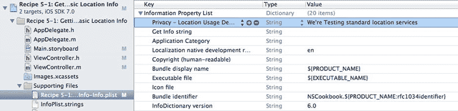

图 5-2. 设置位置用途描述

你的应用骨架已经准备就绪，现在是一个构建并运行它的好时机。不过，当你与用户界面交互时，不会发生什么有趣的事情；你还需要实现启动和停止定位服务的代码，以及接收位置更新的代码。让我们开始吧。


### 启动与停止位置更新

界面定义完成后，请移至视图控制器的实现文件（`.m`），开始实现这些方法和对象。您首先要处理的是 `toggleLocationUpdates:` 操作，该操作在用户触摸开关控件时被调用。

显然，您需要根据用户是开启还是关闭更新来采取不同的操作。如果开关被打开，您应检查定位服务是否已启用。如果未启用，则显示一个警告并将开关重新关闭。请将代码添加到 `toggleLocationUpdates:` 方法中，如代码清单 5-4 所示。

**代码清单 5-4.** 向 `toggleLocationUpdates:` 添加代码以创建用户警告

```
- (IBAction)toggleLocationUpdates:(id)sender

{

if (self.locationUpdatesSwitch.on == YES)

{

if ([CLLocationManager locationServicesEnabled] == NO)

{

UIAlertView *locationServicesDisabledAlert =

[[UIAlertView alloc] initWithTitle:@"定位服务已禁用"

message:@"此功能需要定位服务。请在你的设备隐私设置中启用它"

delegate:nil

cancelButtonTitle:@"关闭"

otherButtonTitles:nil];

[locationServicesDisabledAlert show];

self.locationUpdatesSwitch.on = NO;

return;

}

// ...

}

else

{

// 开关已关闭

}

}
```

接下来，如果定位服务已启用，请初始化位置管理器（如果尚未初始化）。对于标准定位服务，您应始终设置位置管理器的 `desiredAccuracy` 和 `distanceFilter` 属性。同时，建议您设置 `activityType`。

`desiredAccuracy` 属性告诉 Core Location 框架您希望位置信息的精确度（以米为单位）。然而，精确度并不保证，设备会尝试利用可用资源尽可能获取接近您所需精确度的信息。Apple 建议您在此设置上尽可能保守。如果您不需要知道当前设备的街道地址，请使用较低的精确度设置。以下是所有可用的常量：

- `kCLLocationAccuracyBestForNavigation`
- `kCLLocationAccuracyBest`
- `kCLLocationAccuracyNearestTenMeters`
- `kCLLocationAccuracyHundredMeters`
- `kCLLocationAccuracyKilometer`
- `kCLLocationAccuracyThreeKilometers`

> **注意：** 如果您不熟悉公制系统，1 米稍长于 1 码（1 码 = 0.9144 米），1 公里略超过半英里（1 英里 = 1.609 公里）。

`distanceFilter` 属性是指设备需要移动多远（同样以米为单位），您才会希望通过委托收到其新位置的通知。此属性提供的唯一常量是 `kCLDistanceFilterNone`，它会将所有位置变化报告给您的委托。

`activityType` 被 Core Location 框架用于更好地判断何时应自动暂停位置更新。因此，如果您选择了 `CLActivityTypeFitness` 类型，当跑步者停止跑步一段时间后，Core Location 可能会暂停更新。您有四种活动类型可供选择：

- `CLActivityTypeAutomotiveNavigation`：此类型最适合汽车导航。如果一段时间内距离没有显著变化，位置更新将暂停。
- `CLActivityTypeFitness`：此类型最适合步行或跑步。其行为与 `CLActivityTypeAutomotiveNavigation` 相同，区别在于相同时段内显著的距离变化量要小得多。
- `CLActivityTypeOtherNavigation`：此类型的工作方式与 `CLActivityTypeAutomotiveNavigation` 相同，但更适用于火车、船只或飞机旅行。
- `CLActivityTypeOther`：如果其他类型不满足您的需求，请使用此类型。

一旦您在 `ViewController.m` 文件中设置了这些属性和委托，您就可以通过调用 `CLLocationManager`（一个用于管理位置和航向更新传递的类）上的 `startUpdatingLocation` 方法来启动定位服务。为此，请添加代码清单 5-5 所示的代码。

**代码清单 5-5.** 修改 `toggleLocationUpdates:` 方法以开始更新位置

```
if (self.locationUpdatesSwitch.on == YES)

{

if ([CLLocationManager locationServicesEnabled] == NO)

{

// ...

}

if (_locationManager == nil)

{

_locationManager = [[CLLocationManager alloc] init];

_locationManager.desiredAccuracy = kCLLocationAccuracyBest;

_locationManager.distanceFilter = 1; // 米

_locationManager.activityType = CLActivityTypeOther;

_locationManager.delegate = self;

}

[_locationManager startUpdatingLocation];

}

else

// ...
```

以上是用户在开启更新时使用的代码。对于“关闭”部分，您只需在更新已启动时停止它们，如代码清单 5-6 所示。

**代码清单 5-6.** 修改 `toggleLocationUpdates:` 方法以处理开关处于“关闭”位置

```
- (IBAction)toggleLocationUpdates:(id)sender

{

if (self.locationUpdatesSwitch.on == YES)

{

// ...

}

else

{

// 开关已关闭

// 如果更新已启动，则停止更新

if (_locationManager != nil)

{

[_locationManager stopUpdatingLocation];

}

}

}
```


### 接收位置更新

接下来需要设置委托方法。当接收到位置更新或获取位置出现错误时，会调用这些方法。我们从错误委托方法（即 `locationManager:didFailWithError:`）开始。

最常见的错误来源是用户被提示允许你的应用使用定位服务，但用户拒绝了。如果发生这种情况，你可以通过将开关重新拨到关闭状态来停止更新。这会触发值改变事件，从而调用 `toggleLocationUpdates:` 方法，该方法会关闭位置更新。

对于其他任何错误，将其记录到控制台。你的代码应该类似于清单 5-7。

**清单 5-7.** 实现 `locationManager:didFailWithError:` 委托方法

```
- (void)locationManager:(CLLocationManager *)manager didFailWithError:(NSError *)error
{
    if (error.code == kCLErrorDenied)
    {
        // 将开关拨到关闭状态会触发
        // toggleLocationServices 操作，
        // 进而阻止后续更新
        self.locationUpdatesSwitch.on = NO;
    }
    else
    {
        NSLog(@"%@", error);
    }
}
```

处理位置更新的委托方法稍微复杂一些。`locationManager:didUpdateLocations:` 方法会传递一个数组，其中包含自上次更新以来记录的所有位置，最新的位置在最后。对于本示例，你只关心最近的事件，因此只需提取该位置，如清单 5-8 所示。

**清单 5-8.** 开始实现 `locationManager:didUpdateLocations:` 委托方法

```
- (void)locationManager:(CLLocationManager *)manager
didUpdateLocations:(NSArray *)locations
{
    CLLocation *lastLocation = [locations lastObject];
    // ...
}
```

位置由 `CLLocation` 对象表示，该对象包含大量有价值的信息，包括位置坐标、精度信息以及位置更新的时间戳。

在你的应用处理位置对象之前，应检查该位置对象的时间戳是否是最新的。Core Location 经常在锁定新位置之前，将最后已知的位置作为首次调用委托方法的结果呈现。当你需要知道设备当前的位置时，通常没有必要处理一个代表设备历史上某个时刻位置的对象。因此，应过滤掉超过 30 秒的位置事件，如清单 5-9 所示。

**清单 5-9.** 更新 `locationManager:didUpdateLocations:` 以包含过滤旧位置的逻辑

```
- (void)locationManager:(CLLocationManager *)manager
didUpdateLocations:(NSArray *)locations
{
    CLLocation *lastLocation = [locations lastObject];
    // 确保这是一个最近的位置事件
    NSTimeInterval eventInterval = [lastLocation.timestamp timeIntervalSinceNow];
    if(abs(eventInterval) < 30.0)
    {
        // 这是一个最近的事件
    }
}
```

在处理事件之前需要检查的另一个属性是它的精度。同样，如果事件不在你预期的精度范围内，则无需处理。等待设备获得更准确的读数，可能比向用户展示错误信息更好。位置对象包含两个精度属性：`horizontalAccuracy` 和 `verticalAccuracy`。

`horizontalAccuracy` 属性表示位置可能所在圆圈的半径（以米为单位）。当你在内置的“地图”应用中显示位置时，可以看到这个圆圈。负值表示坐标无效。

`verticalAccuracy` 属性表示设备海拔高度可能存在的误差范围（以米为单位，正负值）。同样，负值表示海拔高度读数无效。如果设备没有 GPS，`verticalAccuracy` 属性将始终为负数，因为需要 GPS 才能确定设备的海拔高度。

清单 5-10 是代码的扩展版本，增加了检查接收到的位置的水平精度是否有效且在 20 米以内的功能。

**清单 5-10.** 更新 `locationManager:didUpdateLocations:` 以检查低精度情况

```
- (void)locationManager:(CLLocationManager *)manager
didUpdateLocations:(NSArray *)locations
{
    // 确保这是一个最近的位置事件
    CLLocation *lastLocation = [locations lastObject];
    NSTimeInterval eventInterval = [lastLocation.timestamp timeIntervalSinceNow];
    if(abs(eventInterval) < 30.0)
    {
        // 确保事件精度足够
        if (lastLocation.horizontalAccuracy >= 0 &&
            lastLocation.horizontalAccuracy < 20)
        {
            self.locationInformationView.text = lastLocation.description;
        }
    }
}
```

位置对象的 `description` 属性会将所有信息以紧凑字符串的形式返回。这是一种非常简便的方法，用于查看设备返回了哪些位置信息。我们不建议直接将此字符串展示给最终用户，因为它包含大量信息，但可用于调试和验证位置信息是否正在更新且正确或准确。在此项目中，你将 `locationInfomationView` 的文本设置为 `lastLocation.description` 的值，从而完成了上述委托方法。

你的应用现在已经完成，可以准备测试了。

### 测试位置更新

iOS 模拟器提供了几种便捷的方式来测试位置事件。如图 5-3 所示，有设置自定义位置或模拟不同场景（如城市跑步或高速公路驾驶）的功能。

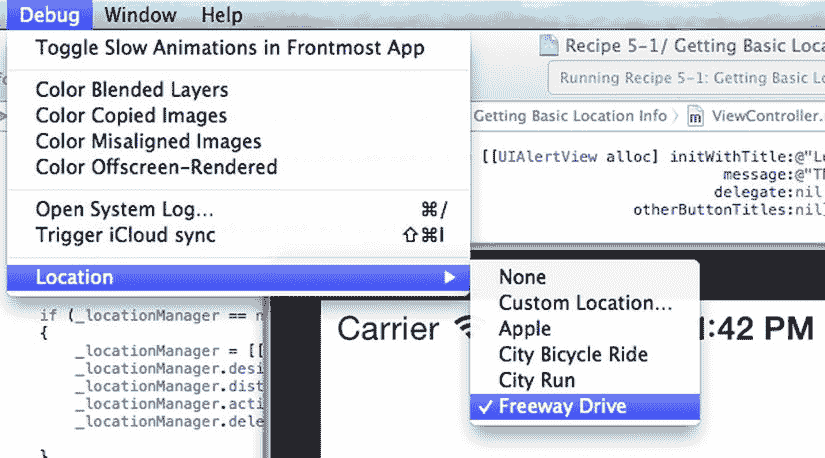

**图 5-3.** 模拟位置事件

在 iOS 模拟器上启动应用程序。当你触摸开关并将其拨到“开启”位置时，系统会提示你允许此应用访问设备的定位信息。请注意在图 5-4 中，显示的是你在应用程序属性列表中设置的字符串。

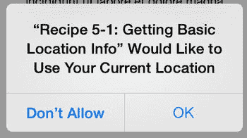

**图 5-4.** 你的应用程序请求定位权限

点击“允许”。请注意，即使开关已打开，位置信息标签也不会更新。这是因为你尚未启动任何位置模拟。在 iOS 模拟器中，转到菜单 Debug ➤ Location ➤ Freeway Drive，标签应开始更新，显示苹果提供的预录制驾驶相关信息。图 5-5 显示了模拟驾驶传递的信息示例。

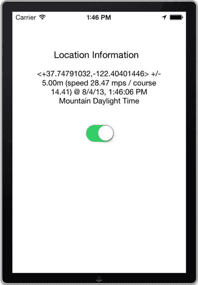

**图 5-5.** 显示模拟位置信息

示例 5-1 到此结束。下一个示例将介绍一种获取位置变化的方法，该方法耗电量要低得多。

## 示例 5-2：重大位置变化

作为一款定位感知应用，并不总是需要标准定位服务提供的高精度位置更新。许多应用仅需知道设备当前所在的城镇、城市甚至国家就足够了。对于这些应用，重大位置变化服务是获取位置的首选方式；它速度更快，耗电量显著降低，并且可以在后台运行。

本示例将向你展示如何设置一个应用，使其使用重大位置变化服务来获取位置。


### 设置应用程序

编程实现重大位置变化服务与编程实现标准位置服务非常相似，其设置过程几乎相同。你可以复制食谱 5-1 中的项目，或者创建一个新的单视图应用程序，并按照以下步骤进行准备：

- 将应用程序链接到 Core Location 框架。
- 为 `NSLocationUsageDescription Info.plist` 键（属性列表中的“隐私 - 位置使用说明”）设置使用说明（例如：“`测试重大位置变化服务`”）。
- 向主视图添加一个标签、一个文本视图和一个开关控件，其外观应类似于食谱 5-1 中的图 5-1。文本视图应包含大约五行内容，并且开关应初始设置为“`关闭`”。
- 为文本视图和开关创建插口，并分别命名为“`locationInformationView`”和“`locationUpdatesSwitch`”。
- 为开关创建一个操作，将其命名为“`toggleLocationUpdates`”，并将事件类型设置为“值更改”。
- 通过在视图控制器的头文件中添加以下声明来导入 Core Location 框架 API：`#import <CoreLocation/CoreLocation.h>`。
- 通过将 `CLLocationManagerDelegate` 协议添加到 `ViewController` 类，使视图控制器成为位置管理器委托。
- 最后，向视图控制器添加一个 `CLLocationManager *` 实例变量，并将其命名为“`_locationManager`”。

有关上述步骤的详细信息，请参阅食谱 5-1。你的视图控制器头文件现在应该类似于列表 5-11。

**列表 5-11.** 视图控制器头文件的初始设置

```
//
//  ViewController.h
//  Recipe 5-2: Significant Location Changes
//

#import <UIKit/UIKit.h>
#import <CoreLocation/CoreLocation.h>

@interface ViewController : UIViewController <CLLocationManagerDelegate>
{
    CLLocationManager *_locationManager;
}

@property (strong, nonatomic) IBOutlet UITextView *locationInformationView;
@property (strong, nonatomic) IBOutlet UISwitch *locationUpdatesSwitch;
- (IBAction)toggleLocationUpdates:(id)sender;

@end
```

构建并运行应用程序，确保已为下一步做好准备。

### 启用后台更新

在本食谱中，你将启用位置更新，使其即使应用程序处于后台模式时也能发生。为此，你需要向 `Info.plist` 文件添加另一个键，因此请键入“`UIBackgroundModes`”键（或者 Xcode 在用户界面中翻译的“`Required background modes`”）。确保将此项目的类型设置为“数组”。接下来，添加一个子项，其值为“`App registers for location updates`”，类型为“`string`”，如图 5-6 所示。

**注意**

在大多数情况下，苹果不希望你在后台使用位置跟踪，除非这对应用程序的功能绝对必要。他们绝对不希望你启动后台位置服务，但对于重大位置变化，他们破例允许。

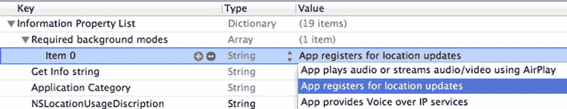

**图 5-6.** 将位置变化指定为必需的后台模式

现在将焦点切换到视图控制器的实现文件 (`.m`)。从 `toggleLocationUpdates:` 方法开始。每次用户更改开关控件的值时都会调用该方法。

你会认出大部分代码，因为它与食谱 5-1 中的代码几乎相同。唯一的区别是你使用了 `start` 和 `stopMonitoringSignificantLocationChanges` 而不是 `start` 和 `stopUpdatingLocation`。此外，重大位置变化服务不关心 `desiredAccuracy`、`distanceFilter` 和 `activityType` 属性，因此你可以忽略它们。

列表 5-12 展示了新的 `toggleLocationUpdates:` 方法，差异部分以粗体标记。继续在你的项目中实现它。

**列表 5-12.** 实现 toggleLocationUpdates 方法

```
- (IBAction)toggleLocationUpdates:(id)sender
{
    if (self.locationUpdatesSwitch.on == YES)
    {
        if ([CLLocationManager locationServicesEnabled] == NO)
        {
            UIAlertView *locationServicesDisabledAlert = [[UIAlertView alloc]
                initWithTitle:@"Location Services Disabled"
                message:@"This feature requires location services. Enable it in the privacy settings on your device"
                delegate:nil
                cancelButtonTitle:@"Dismiss"
                otherButtonTitles:nil];
            [locationServicesDisabledAlert show];
            self.locationUpdatesSwitch.on = NO;
            return;
        }

        if (_locationManager == nil)
        {
            _locationManager = [[CLLocationManager alloc] init];
            // Significant location change service does not use desiredAccuracy,
            // distanceFilter or activityType properties so no need to set them
            _locationManager.delegate = self;
        }

        [_locationManager startMonitoringSignificantLocationChanges];
    }
    else
    {
        // Switch was turned off
        // Stop updates if they have been started
        if (_locationManager != nil)
        {
            [_locationManager stopMonitoringSignificantLocationChanges];
        }
    }
}
```

现在你需要设置委托方法。它们与你上一个食谱中做的工作完全相同。列表 5-13 展示了 `locationManager:didFailWithError:` 方法的实现。

**列表 5-13.** 实现 locationManager:didFailWithError: 委托方法

```
- (void)locationManager:(CLLocationManager *)manager didFailWithError:(NSError *)error
{
    if (error.code == kCLErrorDenied)
    {
        // Turning the switch to off will trigger the toggleLocationServices action,
        // which in turn will stop further updates from coming
        self.locationUpdatesSwitch.on = NO;
    }
    else
    {
        NSLog(@"%@", error);
    }
}
```

列表 5-14 展示了 `locationManager:didUpdateLocations:` 方法的实现。

**列表 5-14.** 实现 locationManager:didUpdateLocations: 委托方法

```
- (void)locationManager:(CLLocationManager *)manager didUpdateLocations:(NSArray *)locations
{
    // Make sure this is a recent location event
    CLLocation *lastLocation = [locations lastObject];
    NSTimeInterval eventInterval = [lastLocation.timestamp timeIntervalSinceNow];
    if(abs(eventInterval) < 30.0)
    {
        // Make sure the event is accurate enough
        if (lastLocation.horizontalAccuracy >= 0 &&
            lastLocation.horizontalAccuracy < 20)
        {
            self.locationInformationView.text = lastLocation.description;
        }
    }
}
```

应用程序基本完成，现在可以构建并进行测试。同样，你可以通过进入模拟器菜单“调试 • 位置 • 高速公路驾驶”来模拟位置。当发生重大位置变化时，应用程序文本应该会更新。接下来，你将通过在其位置发生重大变化时向用户显示通知，让应用程序变得更有趣一些。


### 添加本地通知

现在，您将在 `locationManager:didUpdateLocations:` 方法中添加功能。如果应用程序当前处于后台状态，您将生成一条本地通知，以便用户在应用未运行时也能看到位置更新。清单 5-15 包含了这些更改。

**清单 5-15.** 更新 `locationManager:didUpdateLocations:` 方法以包含通知

```
- (void)locationManager:(CLLocationManager *)manager
didUpdateLocations:(NSArray *)locations
{
    // 确保这是最近的位置事件
    CLLocation *lastLocation = [locations lastObject];
    NSTimeInterval eventInterval = [lastLocation.timestamp timeIntervalSinceNow];
    if(abs(eventInterval) < 30.0)
    {
        // 确保事件精度足够
        if (lastLocation.horizontalAccuracy >= 0 &&
            lastLocation.horizontalAccuracy < 20)
        {
            self.locationInformationLabel.text = lastLocation.description;
            UILocalNotification *notification = [[UILocalNotification alloc] init];
            notification.alertBody =
              [NSString stringWithFormat:@"新位置: %.3f, %.3f",
               lastLocation.coordinate.latitude, lastLocation.coordinate.longitude];
            notification.alertAction = @"确定";
            notification.soundName = UILocalNotificationDefaultSoundName;
            // 增加应用图标角标数字
            notification.applicationIconBadgeNumber =
              [[UIApplication sharedApplication] applicationIconBadgeNumber] + 1;
            [[UIApplication sharedApplication]
              presentLocalNotificationNow: notification];
        }
    }
}
```

使用这个新应用，您可以在每次重大位置变化时收到本地通知，即使应用程序不在前台也是如此。这些变化会反映在应用图标的通知角标上，同时也会通过设备的常规通知来呈现。请注意，模拟器中可能需要稍等片刻才会发生重大变化，如图 5-7 所示。

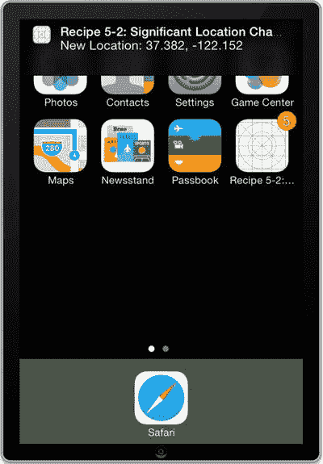

**图 5-7.** 后台发生的重大位置变化

## 配方 5-3：追踪磁航向

现代 iPhone 和 iPad 内置了磁力计——一种用于确定设备持握方向的硬件。其测量基于设备相对于地球磁北极的位置。

磁极与地球的地理极不同。磁北极位于加拿大北部，并且随着地核的变化，每年以大约 55–60 公里的速度向西缓慢移动。

尽管磁航向存在一定的误差，但对于大多数应用来说已经足够精确，而且它在电池功耗方面要经济得多。本配方将向您展示如何实现对设备磁航向的追踪。

### 关于航向追踪

航向追踪使我们能够实时追踪用户相对于北方的方向。实现航向追踪与实现目前讨论过的任何位置追踪服务非常相似：您需要在项目中引入 Core Location 框架，创建一个位置管理器对象，并定义其委托方法。

默认情况下，设备航向是在竖屏模式（顶部远离用户）下测量的。您可以通过设置 `CLLocationManager` 对象的 `headingOrientation` 属性来更改这一行为。

该属性的可选值如下：

* `CLDeviceOrientationPortrait`（默认值）
* `CLDeviceOrientationPortraitUpsideDown`
* `CLDeviceOrientationLandscapeLeft`
* `CLDeviceOrientationLandscapeRight`

### 设置应用程序

像往常一样，我们首先创建一个新的单视图应用项目。您将构建一个与前述两个配方非常相似的应用，因此您可以复制其中一个项目，或根据以下步骤创建一个新项目。如果您决定复制之前的项目，我们已用粗体标出了不同之处。

1. 将应用链接到 Core Location 框架。
2. 向主视图添加一个文本视图和一个开关控件，其外观应类似于配方 5-1 中的图 5-2。开关应初始设置为“关闭”。
3. 为标签和开关创建输出口，并分别命名为 `headingInformationView` 和 `headingUpdatesSwitch`。
4. 为开关创建一个操作，命名为 `toggleHeadingUpdates`，并将事件类型设置为“值已更改”。
5. 通过在视图控制器的头文件中添加以下声明来引入 Core Location 框架 API：`#import <CoreLocation/CoreLocation.h>`。
6. 通过向 `ViewController` 类添加 `CLLocationManagerDelegate` 协议，使视图控制器成为位置管理器的委托。
7. 最后，向视图控制器添加一个 `CLLocationManager *` 类型的实例变量，并将其命名为 `_locationManager`。

关于上述步骤的详细信息，请参考配方 5-1。现在，您的视图控制器的头文件应类似于清单 5-16。

**清单 5-16.** 完成后的视图控制器头文件

```
//
//  ViewController.h
//  Recipe 5-3 Determining Magnetic Bearing
//

#import <UIKit/UIKit.h>
#import <CoreLocation/CoreLocation.h>

@interface ViewController : UIViewController<CLLocationManagerDelegate>
{
    CLLocationManager *_locationManager;
}

@property (strong, nonatomic) IBOutlet UITextView *headingInformationView;
@property (strong, nonatomic) IBOutlet UISwitch *headingUpdatesSwitch;

- (IBAction) toggleHeadingUpdates :(id)sender;

@end
```

**注意：** 如果您复制了项目，则需要更改输出口和操作的名称。请务必使用 Xcode 中的“重命名重构”工具为您完成重命名。这样，您就不必在 Interface Builder 中重新连接它们。

要调出“重命名”工具，请选择要重命名的输出口（或操作）属性名称。按住 Ctrl 键单击以调出上下文菜单，然后选择 `Refactor` ➤ `Rename`，如图 5-8 所示。

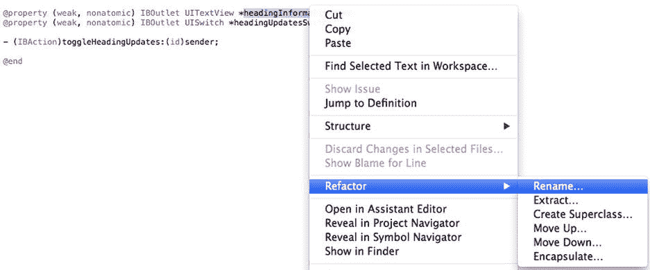

**图 5-8.** 导航至 `Refactor` ➤ `Rename`


### 开始和停止航向更新

切换到视图控制器的实现文件（`ViewController.m`），滚动到底部，开始定义 `toggleHeadingUpdates` 方法。

并非所有 iOS 设备都能提供航向信息。因此，当用户将开关打开时，需检查是否有可用的航向。如果没有，则将开关关闭，并通过标签告知用户，如代码清单 5-17 所示。

**代码清单 5-17.** 检查定位服务的可用性

```
- (IBAction)toggleHeadingUpdates:(id)sender
{
    if (self.headingUpdatesSwitch.on == YES)
    {
        // 航向数据并非在所有设备上都可用
        if ([CLLocationManager headingAvailable] == NO)
        {
            self.headingInformationView.text = @"航向服务不可用";
            self.headingUpdatesSwitch.on = NO;
            return;
        }
        // ...
```

现在初始化位置管理器，如代码清单 5-18 所示（如果尚未实例化的话）。在创建用于追踪航向变化的 `CLLocationManager` 实例时，应指定 `headingFilter` 属性。该属性指定航向必须变化多少距离（以度为单位）才会调用你的委托方法。

**代码清单 5-18.** 使用 5 度的追踪过滤器初始化位置管理器

```
if (_locationManager == nil)
{
    _locationManager = [[CLLocationManager alloc] init];
    _locationManager.headingFilter = 5; // 度
    _locationManager.delegate = self;
}
```

最后，使用 `startUpdatingHeading` 和 `stopUpdatingHeading` 方法开始和停止航向更新。完整的 `toggleHeadingUpdates` 方法应如代码清单 5-19 所示。

**代码清单 5-19.** 完整的 `toggleHeadingUpdates:` 方法

```
- (IBAction)toggleHeadingUpdates:(id)sender
{
    if (self.headingUpdatesSwitch.on == YES)
    {
        // 航向数据并非在所有设备上都可用
        if ([CLLocationManager headingAvailable] == NO)
        {
            self.headingInformationLabel.text = @"航向服务不可用";
            self.headingUpdatesSwitch.on = NO;
            return;
        }

        if (_locationManager == nil)
        {
            _locationManager = [[CLLocationManager alloc] init];
            _locationManager.headingFilter = 5; // 度
            _locationManager.delegate = self;
        }

        [_locationManager startUpdatingHeading];
        self.headingInformationView.text = @"正在开始航向追踪...";
    }
    else
    {
        // 开关已关闭
        self.headingInformationView.text = @"已停止航向追踪";
        // 如果已经开始更新，则停止
        if (_locationManager != nil)
        {
            [_locationManager stopUpdatingHeading];
        }
    }
}
```

### 实现委托方法

接下来需要定义委托方法。对于航向追踪服务，需要三个委托方法：

*   `locationManager:didFailWithError:`
*   `locationManager:didUpdateHeading:`
*   `locationManagerShouldDisplayHeadingCalibration:`

第一个方法 `didFailWithError`，与之前讨论定位追踪服务时实现的委托方法相同。不同的是，用户不能像拒绝定位服务那样拒绝航向追踪。所以如果发生错误，只需将错误记录到控制台，并希望这是临时性的。这对于测试目的而言是足够的，但在实际应用场景中，你可能需要找出可能发生的错误类型并采取相应措施。你可能还想阅读第 1 章中关于默认错误处理的专题，以了解通常如何处理错误。该实现如代码清单 5-20 所示。

**代码清单 5-20.** `locationManager:didFailWithError:` 消息的完整实现

```
-(void)locationManager:(CLLocationManager *)manager didFailWithError:(NSError *)error
{
    NSLog(@"追踪航向时出错：%@", error);
}
```

下一个方法 `didUpdateHeading`，在设备航向变化超过 `headingFilter` 属性值时被调用。与位置更新一样，首先检查更新是否为最近的读数。同时，通过检查 `headingAccuracy` 属性来确保读数有效——如果航向无效，该值将为负数。如果读数既新又有效，则用 `magneticHeading` 属性的值更新标签，并四舍五入保留一位小数。代码清单 5-21 展示了完整的实现。

**代码清单 5-21.** `locationManager:didUpdateHeading:` 方法的完整实现

```
-(void)locationManager:(CLLocationManager *)manager
didUpdateHeading:(CLHeading *)newHeading
{
    NSTimeInterval headingInterval = [newHeading.timestamp timeIntervalSinceNow];
    // 检查读数是否是最新的
    if(abs(headingInterval) < 30)
    {
        // 检查读数是否有效
        if(newHeading.headingAccuracy < 0)
            return;

        self.headingInformationView.text =
          [NSString stringWithFormat:@"%.1f°", newHeading.magneticHeading];
    }
}
```

**提示**

你可以按 Alt+Shift+8 插入度数 (°) 符号。

你需要实现的最后一个委托方法是 `locationManagerShouldDisplayHeadingCalibration`。此方法决定是否应显示航向校准界面。该场景会提示用户以数字“8”的形式移动设备以校准磁力计。这是一个相当有用的功能，所以直接返回 `YES`，如代码清单 5-22 所示。

**代码清单 5-22.** 显示校准界面的实现

```
-(BOOL)locationManagerShouldDisplayHeadingCalibration:(CLLocationManager *)manager
{
    return YES;
}
```

应用程序现已完成。不幸的是，模拟器不支持航向模拟，因此你需要在真实设备上进行测试。运行时，它看起来会类似于图 5-9。它显示的是相对于磁北极的航向。接近 0 或 360 的值代表北方，90 代表东方，180 代表南方，240 代表西方。

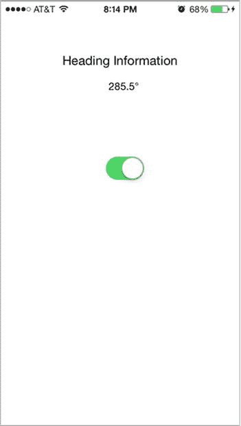

**图 5-9.** 显示磁方位的应用程序

至此，专题 5-3 结束。在下一个专题中，你将扩展此项目，使其除了追踪磁方位外，还包含真方位追踪。

**注意**

与本章其他使用磁力计的专题一样，此功能仅适用于物理设备，在模拟器中无效。

## 专题 5-4：追踪真北方

你已经了解了如何获取磁北方向，但真北方向呢？磁北与真北之间的差异称为磁偏角。磁偏角根据你在地球上的位置而有很大变化，但如果你知道自己的位置，就可以计算出它。Core Location 框架为你完成了这项工作，并将其提供在 `CLHeading` 对象的 `trueHeading` 属性中。你只需在位置管理器上额外调用 `startUpdatingLocation` 方法即可获取真北方向。

**警告**

在本专题中，你将扩展专题 5-3 的项目，使其包含真北方追踪以及磁方位。因此，在开始之前备份该项目可能是个好主意。


### 添加真北方向

由于你再次使用了位置服务，首先需要向 `info.plist` 中添加 `NSLocationUsageDescription` 键及其使用说明，例如“测试真北方向”。这与我们在图 5-2 中做的类似，只是说明文字现在应为“测试真北方向”。

接下来，在主视图中添加第二个文本视图及其标题，用于显示真北方向。此时你的用户界面应如图 5-10 所示。

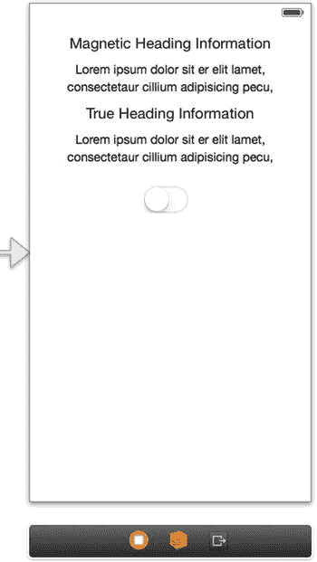

图 5-10. 新增了标签的新用户界面

为新的文本视图创建一个名为 `trueHeadingInformationView` 的连线。你的视图控制器接口文件（`.h`）现在应如列表 5-23 所示。

列表 5-23. 完整的视图控制器头文件

```
//
//  ViewController.h
//  Recipe 5-4: Tracking True Bearing
//
#import <UIKit/UIKit.h>
#import <CoreLocation/CoreLocation.h>
@interface ViewController : UIViewController<CLLocationManagerDelegate>
{
CLLocationManager *_locationManager;
}
@property (strong, nonatomic) IBOutlet UITextView *headingInformationView;
@property (strong, nonatomic) IBOutlet UITextView *trueHeadingInformationView;
@property (strong, nonatomic) IBOutlet UISwitch *headingUpdatesSwitch;
- (IBAction)toggleHeadingUpdates:(id)sender;
@end
```

只需对现有代码做少量修改。我们先从 `toggleHeadingUpdates:` 方法开始。

由于你将再次使用位置服务，需重新引入配方 5-1 中确保位置服务已启用的控制代码。代码如下列表 5-24 所示。

列表 5-24. 从列表 5-4 中添加位置服务控制代码

```
if (self.headingUpdatesSwitch.on == YES)
{
// ...
if ([CLLocationManager locationServicesEnabled] == NO)
{
UIAlertView *locationServicesDisabledAlert = [[UIAlertView alloc]
initWithTitle:@"Location Services Disabled"
message:@"This feature requires location services. Enable it in the privacy settings on your device"
delegate:nil
cancelButtonTitle:@"Dismiss"
otherButtonTitles:nil];
[locationServicesDisabledAlert show];
self.headingUpdatesSwitch.on = NO;
return;
}
// ...
```

然后，为了获取真北方向读数，除了启动方向更新外，还需要启动位置服务。列表 5-25 展示了完整的 `toggleHeadingUpdates:` 方法，其中修改部分已加粗。

列表 5-25. 完整的 `toggleHeadingUpdates:` 方法

```
- (IBAction)toggleHeadingUpdates:(id)sender
{
if (self.headingUpdatesSwitch.on == YES)
{
// Heading data is not available on all devices
if ([CLLocationManager headingAvailable] == NO)
{
self.headingInformationView.text = @"Heading services unavailable";
self.headingUpdatesSwitch.on = NO;
return;
}
if ([CLLocationManager locationServicesEnabled] == NO)
{
UIAlertView *locationServicesDisabledAlert =
[[UIAlertView alloc] initWithTitle:@"Location Services Disabled"
message:@"This feature requires location services. Enable it in the privacy settings on your device"
delegate:nil
cancelButtonTitle:@"Dismiss"
otherButtonTitles:nil];
[locationServicesDisabledAlert show];
self.headingUpdatesSwitch.on = NO;
return;
}
if (_locationManager == nil)
{
_locationManager = [[CLLocationManager alloc] init];
_locationManager.headingFilter = 5; // degrees
_locationManager.delegate = self;
}
[_locationManager startUpdatingHeading];
// Start location service in order to get true heading
[_locationManager startUpdatingLocation];
self.headingInformationView.text = @"Starting heading tracking...";
}
else
{
// Switch was turned off
self.headingInformationView.text = @"Stopped heading tracking";
// Stop updates if they have been started
if (_locationManager != nil)
{
[_locationManager stopUpdatingHeading];
[_locationManager stopUpdatingLocation];
}
}
}
```

此外，还需要在 `locationManager:didFailWithError:` 委托方法中插入错误处理代码，如列表 5-26 所示。

列表 5-26. 在 `locationManager:didFailWithError:` 方法中实现错误处理代码

```
- (void)locationManager:(CLLocationManager *)manager didFailWithError:(NSError *)error
{
if (error.code == kCLErrorDenied)
{
// Turning the switch to off will indirectly stop
// further updates from coming
self.headingUpdatesSwitch.on = NO;
}
else
{
NSLog(@"%@", error);
}
}
```

现在，在你的 `locationManager:didUpdateHeading:` 方法中，添加一条新语句来检查 `trueHeading` 值，如列表 5-27 所示。负的 `trueHeading` 值表示无效，因此只有当该属性大于等于 0 时才使用它。

列表 5-27. 在 `locationManager:didUpdateHeading:` 方法中添加无效读数的检查

```
-(void)locationManager:(CLLocationManager *)manager
didUpdateHeading:(CLHeading *)newHeading
{
NSTimeInterval headingInterval = [newHeading.timestamp timeIntervalSinceNow];
if(abs(headingInterval)<30)
{
if (newHeading.headingAccuracy < 0)
return;
self.headingInformationView.text =
[NSString stringWithFormat:@"Magnetic Heading: %.1f°",
newHeading.magneticHeading];
if(newHeading.trueHeading >= 0)
self.trueHeadingInformationView.text =
[NSString stringWithFormat:@"True Heading: %.1f°",
newHeading.trueHeading];
}
}
```

在测试此应用程序时，你可以获得设备真北方向和磁北方向的简单读数。如图 5-11 所示，这两个值存在一定差异，差异大小取决于你当前的位置。

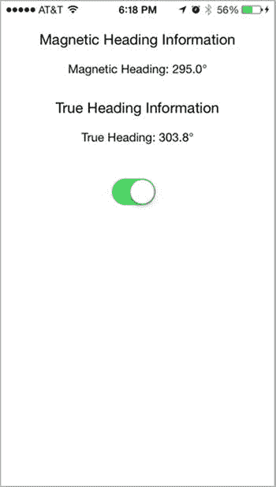

图 5-11. 同时显示磁北和真北方向值

## 配方 5-5：区域监控

Core Location 提供了一种用于监控设备进入或离开圆形区域的方法。这对于应用程序来说是一个非常实用的功能；例如，当设备进入某个地点的附近区域时，它可以触发警报，比如当你靠近杂货店时提醒你买牛奶。你也可以用它在你离开工作时向家人发送通知，让他们知道你正在回家的路上。只要发挥你的想象力，可以探索出很多可能性。


### 关于区域的一些要点

区域由中心坐标和以米为单位的半径定义。监测方法仅在你跨越区域边界时才会触发事件。如果监测开始时设备已经位于区域内，则不会触发事件。事件仅在设备进入或离开区域时才会触发。

一旦创建了 `CLLocationManager` 对象，你就可以使用 `startMonitoringForRegion:` 方法注册多个区域进行监测。你所注册的监测区域在应用程序多次启动期间是持久存在的。如果边界事件发生时你的应用程序未运行，它会在后台自动重新启动，以便处理该事件。你之前设置的所有区域都可以在 `CLLocationManager` 对象的 `monitoredRegions` 属性中找到。

区域是系统全局共享的，并且在任何特定时间只能监测有限数量的区域。你应始终限制当前所监测的已定义区域数量，以免消耗系统资源。你应该移除那些不在设备当前位置附近的监测区域。例如，如果设备位于西海岸，则没有必要监测马里兰州的区域。当你尝试注册新区域进行监测时，如果空间不足，错误 `kCLErrorRegionMonitoringFailure` 将传递给 `locationManager:monitoringDidFailForRegion:withError:` 委托方法。

### 欢迎来到丹佛！

在这个项目中，你将创建一个覆盖科罗拉多州丹佛市的区域，并在访客进入该城市时向他们表示欢迎。你将从创建一个新的单视图应用程序开始。

你将遵循与前几个方法相同的模式，并构建一个用户界面。请按照以下步骤设置应用程序：

- 将应用程序链接到 Core Location 框架。
- 在应用程序的属性列表中，为 `NSLocationUsageDescription` 键设置一个用途描述（例如“`测试区域监测`”）。
- 在主视图中添加一个标签、一个文本视图和一个开关控件，外观应类似于方法 5-1 中的图 5-2。开关应初始设置为“关”。
- 为文本视图和开关创建输出口。分别将文本视图和开关命名为“`regionInformationView`”和“`regionMonitoringSwitch`”。
- 为开关创建一个操作；将其命名为“`toggleRegionMonitoring`”，并确保事件类型设置为“`Value Change`”。
- 通过在视图控制器的头文件中添加以下声明来导入核心位置框架 API：`#import <CoreLocation/CoreLocation.h>`。
- 通过将 `CLLocationManagerDelegate` 协议添加到 `ViewController` 类，使视图控制器成为位置管理器的委托。
- 最后，向视图控制器添加一个 `CLLocationManager *` 实例变量，并将其命名为“`_locationManager`”。

你的视图控制器头文件现在应如代码清单 5-28 所示。

**代码清单 5-28.** 完整的视图控制器头文件

```
//
//  ViewController.h
//  Recipe 5-5: Region Monitoring
//

#import <UIKit/UIKit.h>
#import <CoreLocation/CoreLocation.h>

@interface ViewController : UIViewController<CLLocationManagerDelegate>

{
    CLLocationManager *_locationManager;
}

@property (strong, nonatomic) IBOutlet UITextView *regionInformationView;
@property (strong, nonatomic) IBOutlet UISwitch *regionMonitoringSwitch;

- (IBAction)toggleRegionMonitoring:(id)sender;

@end
```

切换到实现文件 (`.m`)，你可以实现区域跟踪方法。让我们从 `toggleRegionMonitoring:` 方法开始，如代码清单 5-29 所示。如果开关已打开，在开始监测之前，你应该检查区域监测是否可用且已被用户启用。请注意，你通过使用 `authorizationStatus` 类方法来检查监测是否已启用，如果状态是已授权或未确定，该方法会简单地返回一个布尔值。如果状态是 `kCLAuthorizationStatusNotDetermined`，操作系统将提示用户并请求其允许使用定位服务。

**代码清单 5-29.** 检查定位监测是否已授权

```
- (IBAction)toggleRegionMonitoring:(id)sender

{
    if (self.regionMonitoringSwitch.on == YES)
    {
        CLAuthorizationStatus status = [CLLocationManager authorizationStatus];
        if (status == kCLAuthorizationStatusAuthorized ||
            status == kCLAuthorizationStatusNotDetermined)
        {
            // 在此处开始监测
        }
        else
        {
            self.regionInformationView.text = @"区域监测已禁用";
            self.regionMonitoringSwitch.on = NO;
        }
    }
}
```

在同一方法中，在检查授权状态的“`if`”语句内，如果尚未创建位置管理器实例变量，你需要实例化它。你还需要设置 `desiredAccuracy` 和委托，如代码清单 5-30 所示。

**代码清单 5-30.** 初始化 `locationManager` 实例并设置委托和 `desiredAccuracy`

```
if (status == kCLAuthorizationStatusAuthorized ||
    status == kCLAuthorizationStatusNotDetermined)
{
    if(_locationManager == nil)
    {
        _locationManager = [[CLLocationManager alloc] init];
        _locationManager.desiredAccuracy = kCLLocationAccuracyHundredMeters;
        _locationManager.delegate = self;
    }
    // ...
}
```


你需要定义要监控区域的中线坐标以及区域的半径。指定半径时需要小心，因为如果半径过大，监控将会失败。你可以通过比较它和`CLLocationManager`对象的`maximumRegionMonitoringDistance`属性，来确保半径在半径界限之内。

一旦你获得了中心坐标和半径，就可以在`if`语句`if(_locationManager ==)`之后立即创建`CLCircularRegion`对象，并为其提供一个标识符以供将来引用，如列表 5-31 所示。

**列表 5-31.** 使用坐标和区域半径创建`CLCircularRegion`

```
if (status == kCLAuthorizationStatusAuthorized ||
    status == kCLAuthorizationStatusNotDetermined)
{
    if(_locationManager == nil)
    {
        _locationManager = [[CLLocationManager alloc] init];
        _locationManager.desiredAccuracy = kCLLocationAccuracyHundredMeters;
        _locationManager.delegate = self;
    }

    CLLocationCoordinate2D denverCoordinate =
        CLLocationCoordinate2DMake(39.7392, -104.9847);
    int regionRadius = 3000; // meters
    if (regionRadius > _locationManager.maximumRegionMonitoringDistance)
    {
        regionRadius = _locationManager.maximumRegionMonitoringDistance;
    }

    CLCircularRegion *denverRegion = [[CLCircularRegion alloc] initWithCenter:denverCoordinate
                                                                      radius:regionRadius
                                                                  identifier:@"denverRegion"];
    // ...
```

区域创建后，你可以在上一段代码段之后立即调用位置管理器的`startMonitoringForRegion:`方法，开始监控该区域的边界事件，如列表 5-32 所示。

**列表 5-32.** 添加到`toggleRegionMonitoring`以开始监控的代码行

```
[_locationManager startMonitoringForRegion: denverRegion];
```

最后一项任务是，如果用户将开关滑动到“关闭”位置，则关闭区域监控。为此，请访问`location manager`的`monitoredRegions`属性，并关闭当前所有被监控区域的区域监控，如列表 5-33 所示。你也可以选择利用`CLCircularRegion`的`identifier`属性，有选择地关闭特定区域。

**列表 5-33.** 添加到`toggleRegionMonitoring`以关闭被监控区域的代码

```
if (self.regionMonitoringSwitch.on == YES)
{
    // ...
}
else
{
    if (_locationManager!=nil)
    {
        for (CLCircularRegion *monitoredRegion in [_locationManager monitoredRegions])
        {
            [_locationManager stopMonitoringForRegion:monitoredRegion];
            self.regionInformationView.Text =
                [NSString stringWithFormat:@"Turned off region monitoring for: %@",
                 monitoredRegion.identifier];
        }
    }
}
```

还需要定义委托方法。有两个用于处理边界事件的委托方法，以及一个用于处理错误的委托方法：

* `locationManager:didEnterRegion:`
* `locationManager:didExitRegion:`
* `locationManager:monitoringDidFailForRegion:withError:`

有两个与区域监控相关的主要错误代码。一个是`kCLErrorRegionMonitoringDenied`，当设备的用户明确拒绝区域监控访问时使用。另一个是`kCLErrorRegionMonitoringFailure`，当对特定区域的监控失败时使用，通常是因为系统没有更多的区域资源可供应用程序使用。将列表 5-34 中的代码添加到`ViewController.m`文件的末尾。

**列表 5-34.** 实现`locationManager:monitoringDidFailForRegion:withError`委托方法

```
-(void)locationManager:(CLLocationManager *)manager
monitoringDidFailForRegion:(CLRegion *)region withError:(NSError *)error
{
    switch (error.code)
    {
        case kCLErrorRegionMonitoringDenied:
        {
            self.regionInformationView.text =
                @"Region monitoring is denied on this device";
            break;
        }
        case kCLErrorRegionMonitoringFailure:
        {
            self.regionInformationView.text =
                [NSString stringWithFormat:@"Region monitoring failed for region: %@",
                 region.identifier];
            break;
        }
        default:
        {
            self.regionInformationView.text =
                [NSString stringWithFormat:@"An unhandled error occured: %@",
                 error.description];
            break;
        }
    }
}
```

`locationManager:didEnterRegion:`和`locationManager:didExitRegion:`可以执行你想要的任何功能。由于边界事件发生时应用程序可能处于后台，除了更新标签之外，你还需要使用本地通知让用户知道事件发生了，如列表 5-35 所示。

**列表 5-35.** 添加用于检测进入和离开区域的委托实现

```
-(void)locationManager:(CLLocationManager *)manager didEnterRegion:(CLRegion *)region
{
    self.regionInformationView.text = @"Welcome to Denver!";
    UILocalNotification *entranceNotification = [[UILocalNotification alloc] init];
    entranceNotification.alertBody = @"Welcome to Denver!";
    entranceNotification.alertAction = @"Ok";
    entranceNotification.soundName = UILocalNotificationDefaultSoundName;
    [[UIApplication sharedApplication]
     presentLocalNotificationNow: entranceNotification];
}

-(void)locationManager:(CLLocationManager *)manager didExitRegion:(CLRegion *)region
{
    self.regionInformationView.text =
        @"Thanks for visiting Denver! Come back soon!";
    UILocalNotification *exitNotification = [[UILocalNotification alloc] init];
    exitNotification.alertBody=@"Thanks for visiting Denver! Come back soon!";
    exitNotification.alertAction=@"Ok";
    exitNotification.soundName = UILocalNotificationDefaultSoundName;
    [[UIApplication sharedApplication]
     presentLocalNotificationNow:exitNotification];
}
```

要使用 iOS 模拟器测试此功能，你必须能够输入自定义坐标进行模拟。与之前食谱中的高速公路模拟类似，你可以通过导航到**Debug** ➤ **Location** ➤ **Custom Location**来输入自定义坐标，然后输入自己的坐标进行测试。例如，你可以尝试输入纬度 39.7392 和经度 -104.9847，这应会将你带入丹佛区域，并使你的应用程序显示欢迎消息。然后将纬度更改为 39.0（保持与之前相同的经度），看看你的应用程序是否会再次欢迎你。你可能还想尝试将应用程序置于后台并切换位置，以验证通知是否会弹出。

## 食谱 5-6：实现地理编码

位置坐标对应用程序很有用，但对人类并不友好。你上一次用经纬度坐标写地址是什么时候？这完全不是人类友好的方式。人类的位置是用国家、州、城市等名称来表达的。因此，当设备用户问“我在哪里？”时，用户不想知道 GPS 坐标——用户想知道他所在城镇或城市的名称。

幸运的是，苹果提供了一种称为**反向地理编码**的方法，可以将位置坐标转换为人类可读的格式。此功能以前由`Map Kit`框架提供，但从 iOS 5 起已被整合到`Core Location`框架中。

地理编码，无论是正向的还是反向的，都是通过`CLGeocoder`类来执行的。你实例化一个`CLGeocoder`对象，然后将一个坐标和一个代码块传递给该对象，让其在地理编码完成后执行。这与到目前为止讨论的其他位置食谱略有不同，那些食谱使用了委托方法。

> **注意**：执行地理编码请求的设备必须具有网络访问权限。


### 实现反向地理编码

让我们创建一个新的单视图应用程序。要配置项目，请执行以下步骤：

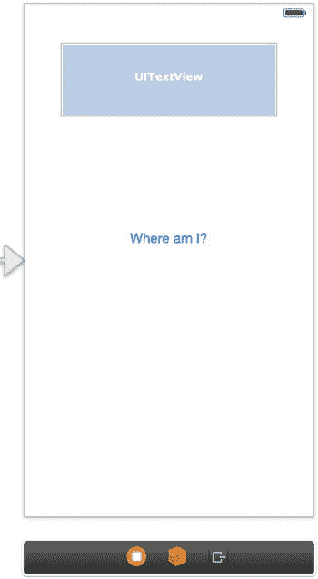

图 5-12. 反向地理编码的初始用户界面

将应用程序链接到 Core Location 框架。在应用程序的属性列表中，为 `NSLocationUsageDescription` 键设置一个用途描述（例如“`Testing geocoding`”）。在主视图中添加一个文本视图和一个按钮，其外观应类似于图 5-12。`TextView` 应包含大约五行文本（别忘了在属性检查器中设置 `Lines` 属性）。为标签和按钮创建输出口，并分别命名为“`geocodingResultsView`”和“`reverseGeocodingButton`”。为开关创建一个操作，命名为“`findCurrentAddress`”，并确保事件类型设置为“`Value Change`”。通过在视图控制器的头文件中添加以下声明来导入 Core Location 框架 API：`#import <CoreLocation/CoreLocation.h>`。通过将 `CLLocationManagerDelegate` 协议添加到 `ViewController` 类中，使视图控制器成为位置管理器委托。向视图控制器添加一个 `CLLocationManager *` 类型的实例变量，并命名为“`_locationManager`”。再添加第二个实例变量，这次是 `CLGeocoder *` 类型，命名为“`_geocoder`”。

现在，您的视图控制器的头文件应如代码清单 5-36 所示。

**代码清单 5-36.** 完成后的视图控制器头文件

```
//
//  ViewController.h
//  Recipe 5-6 Implementing Geocoding
//

#import <UIKit/UIKit.h>
#import <CoreLocation/CoreLocation.h>

@interface ViewController : UIViewController<CLLocationManagerDelegate>
{
    CLLocationManager *_locationManager;
    CLGeocoder *_geocoder;
}

@property (strong, nonatomic) IBOutlet UITextView *geocodingResultsView;
@property (strong, nonatomic) IBOutlet UIButton *reverseGeocodingButton;

- (IBAction)findCurrentAddress:(id)sender;

@end
```

切换到实现文件（`ViewController.m`），滚动到底部以实现 `findCurrentAddress` 方法。由于本章前面的食谱中已经介绍过相关内容，这里不再赘述细节，但我们会说明一些要点。

你应该遵循地理编码的最佳实践，避免对距离之前已编码位置过近或时间过近的位置进行地理编码。因此，你需要在 `CLLocationManager` 对象上将 `distanceFilter` 属性设置为 500 米。

在代码清单 5-37 中，你将所需精度设置为常量 `kCLLocationAccuracyHundredMeters`，以便从位置跟踪服务获得更快的响应，并限制电池消耗。

**代码清单 5-37.** 实现 `findCurrentAddress` 操作方法

```
- (IBAction)findCurrentAddress:(id)sender
{
    if([CLLocationManager locationServicesEnabled])
    {
        if(_locationManager==nil)
        {
            _locationManager=[[CLLocationManager alloc] init];
            _locationManager.distanceFilter = 500;
            _locationManager.desiredAccuracy = kCLLocationAccuracyHundredMeters;
            _locationManager.delegate = self;
        }
        [_locationManager startUpdatingLocation];
        self.geocodingResultsView.text = @"获取位置中...";
    }
    else
    {
        self.geocodingResultsView.text=@"位置服务不可用";
    }
}
```

现在为 `CLLocationManager` 对象添加代理方法。第一个是 `locationManager:didFailWithError:` 方法，如代码清单 5-38 所示。

**代码清单 5-38.** 实现 `locationManager:didFailWithError:` 方法

```
-(void)locationManager:(CLLocationManager *)manager didFailWithError:(NSError *)error
{
    if(error.code == kCLErrorDenied)
    {
        self.geocodingResultsView.text = @"位置信息被拒绝";
    }
}
```


接下来需要定义 `locationManager:didUpdateToLocations:` 委托方法。首先执行标准检查，确保 `newLocation` 的时间戳属性是最近的且有效，如列表 5-39 所示。

**列表 5-39** `location:didUpdateLocations:` 方法的初始实现

```
- (void)locationManager:(CLLocationManager *)manager
didUpdateLocations:(NSArray *)locations
{
    // Make sure this is a recent location event
    CLLocation *newLocation = [locations lastObject];
    NSTimeInterval eventInterval = [newLocation.timestamp timeIntervalSinceNow];
    if(abs(eventInterval) < 30.0)
    {
        // Make sure the event is valid
        if (newLocation.horizontalAccuracy < 0)
            return;
        // ...
    }
}
```

接下来检查 `_geocoder` 实例变量是否已被实例化，如果没有则创建它。同时，确保在执行新的地理编码之前停止任何正在进行的地理编码服务，如列表 5-40 所示。

**列表 5-40** 创建前检查地理编码器实例变量，并停止任何现有服务

```
- (void)locationManager:(CLLocationManager *)manager
didUpdateLocations:(NSArray *)locations
{
    // Make sure this is a recent location event
    CLLocation *newLocation = [locations lastObject];
    NSTimeInterval eventInterval = [newLocation.timestamp timeIntervalSinceNow];
    if(abs(eventInterval) < 30.0)
    {
        // Make sure the event is valid
        if (newLocation.horizontalAccuracy < 0)
            return;

        // Instantiate _geoCoder if it has not been already
        if (_geocoder == nil)
            _geocoder = [[CLGeocoder alloc] init];

        //Only one geocoding instance per action
        //so stop any previous geocoding actions before starting this one
        if([_geocoder isGeocoding])
            [_geocoder cancelGeocode];
    }
}
```

最后，启动反向地理编码进程并定义完成处理程序。完成处理程序接收两个对象：一个地标数组和一个错误对象。地标包含街道、城市等信息。如果数组包含一个或多个对象，则反向地理编码成功。如果没有，则可以检查错误代码以获取详细信息。

最终的 `location:didUpdateToLocations:` 方法如列表 5-41 所示。

**列表 5-41** 完整的 `locationManager:didUpdateLocations:` 方法

```
- (void)locationManager:(CLLocationManager *)manager didUpdateLocations:(NSArray *)locations
{
    // Make sure this is a recent location event
    CLLocation *newLocation = [locations lastObject];
    NSTimeInterval eventInterval = [newLocation.timestamp timeIntervalSinceNow];
    if(abs(eventInterval) < 30.0)
    {
        // Make sure the event is valid
        if (newLocation.horizontalAccuracy < 0)
            return;

        // Instantiate _geoCoder if it has not been already
        if (_geocoder == nil)
            _geocoder = [[CLGeocoder alloc] init];

        //Only one geocoding instance per action
        //so stop any previous geocoding actions before starting this one
        if([_geocoder isGeocoding])
            [_geocoder cancelGeocode];

        [_geocoder reverseGeocodeLocation: newLocation
            completionHandler: ^(NSArray* placemarks, NSError* error)
        {
            if([placemarks count] > 0)
            {
                CLPlacemark *foundPlacemark = [placemarks objectAtIndex:0];
                self.geocodingResultsView.text =
                    [NSString stringWithFormat:@"You are in: %@",
                     foundPlacemark.description];
            }
            else if (error.code == kCLErrorGeocodeCanceled)
            {
                NSLog(@"Geocoding cancelled");
            }
            else if (error.code == kCLErrorGeocodeFoundNoResult)
            {
                self.geocodingResultsView.text=@"No geocode result found";
            }
            else if (error.code == kCLErrorGeocodeFoundPartialResult)
            {
                self.geocodingResultsView.text=@"Partial geocode result";
            }
            else
            {
                self.geocodingResultsView.text =
                    [NSString stringWithFormat:@"Unknown error: %@",
                     error.description];
            }
        }
        ];

        //Stop updating location until they click the button again
        [manager stopUpdatingLocation];
    }
}
```

现在您拥有一个能够执行反向地理编码并查找当前位置地址的应用程序。构建并运行它以验证其工作正常，然后我们再继续扩展应用程序的功能，添加正向地理编码。

### 实现正向地理编码

在 iOS 5 中引入了正向地理编码。这意味着您可以将地址传递给地理编码器，并接收该地址的坐标。您能提供的地址信息越详细，最终的正向地理编码结果就越精确。

让我们为应用程序添加一个功能，将给定的地址转换为坐标。首先在用户界面中添加一个文本字段和另一个按钮。其效果应如图 5-13 所示。

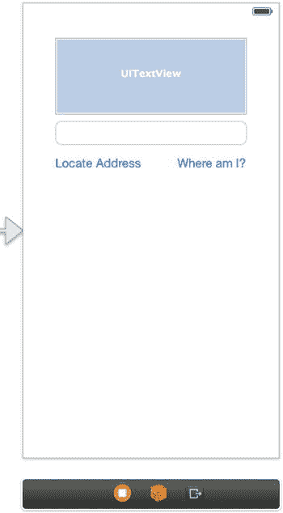

**图 5-13** 添加了正向地理编码的更新用户界面

现在，为文本字段添加一个名为 `addressTextField` 的插座变量。接下来，为按钮添加一个操作方法，并将其命名为 `findCoordinateOfAddress`。

在 `findCoordinateOfAddress:` 操作方法中，计划获取用户输入到文本字段中的文本，并将其发送给地理编码器对象以转换为坐标。地理编码过程可能会产生多个可能的坐标匹配结果，但最佳猜测总是排在第一位。列表 5-42 展示了该方法的实现。

**列表 5-42** `findCoordinateOfAddress:` 操作方法的实现

```
- (IBAction)findCoordinateOfAddress:(id)sender
{
    // Instantiate _geocoder if it has not been already
    if (_geocoder == nil)
        _geocoder = [[CLGeocoder alloc] init];

    NSString *address = self.addressTextField.text;
    [_geocoder geocodeAddressString:address
        completionHandler:^(NSArray *placemarks, NSError *error)
    {
        if ([placemarks count] > 0)
        {
            CLPlacemark *placemark = [placemarks objectAtIndex:0];
            self.geocodingResultsView.text = placemark.location.description;
        }
        else
        {
            self.geocodingResultsView.text = error.localizedDescription;
        }
    }
    ];
}
```

在发生错误的情况下，列表 5-43 中的实现会将错误消息输出到标签。但是，您的代码应该预期并处理几种错误。这些错误包括网络错误、用户拒绝核心位置服务的错误，以及未找到地理编码结果时的错误。列表 5-43 是一个更新的实现，它提取了这些错误，并在这些情况下提供（稍微）更好的错误消息。

**列表 5-43** 为 `findCoordinateOfAddress:` 操作方法添加错误处理

```
- (IBAction)findCoordinateOfAddress:(id)sender
{
    // Instantiate _geocoder if it has not been already
    if (_geocoder == nil)
        _geocoder = [[CLGeocoder alloc] init];

    NSString *address = self.addressTextField.text;
    [_geocoder geocodeAddressString:address
        completionHandler:^(NSArray *placemarks, NSError *error)
    {
        if ([placemarks count] > 0)
        {
            CLPlacemark *placemark = [placemarks objectAtIndex:0];
            self.geocodingResultsView.text = placemark.location.description;
        }
        else if (error.domain == kCLErrorDomain)
        {
            switch (error.code)
            {
                case kCLErrorDenied:
                    self.geocodingResultsView.text
                        = @"Location Services Denied by User";
                    break;
                case kCLErrorNetwork:
                    self.geocodingResultsView.text = @"No Network";
                    break;
                case kCLErrorGeocodeFoundNoResult:
                    self.geocodingResultsView.text = @"No Result Found";
                    break;
                default:
                    self.geocodingResultsView.text = error.localizedDescription;
                    break;
            }
        }
        else
        {
            self.geocodingResultsView.text = error.localizedDescription;
        }
    }
    ];
}
```

至此，秘诀 5-6 就介绍完了。最后，我们总结一些关于地理编码的最佳实践建议。


### 最佳实践

以下是使用反向或正向地理编码时需要注意的一些最佳实践：

- 每次只应发送一个地理编码请求。
- 如果用户执行的操作会导致对同一位置进行地理编码，则应复用之前的结果，而不是多次请求同一位置。
- 每分钟发送的地理编码请求不应超过一个。在发起新的地理编码请求之前，应检查用户是否已经移动了显著距离。
- 如果看不到结果（换言之，如果应用在后台运行），则不要执行地理编码请求。

## 摘要

Core Location 框架是一个功能强大的框架，可被众多应用功能所利用。如本章所示，你可以确定设备所在位置、设备朝向方向，以及设备进入或离开特定区域的时间。除了这些强大的功能之外，你还可以对地理坐标进行查询，以获取人类可读的位置信息并呈现给最终用户，同时提供补充服务来执行反向查询。

苹果在向开发者提供强大功能的同时，也充分尊重用户的隐私和设备的电池耗电，在两者之间取得了精妙的平衡。作为开发者，我们应在开发应用中打造令人兴奋的特性和功能，同时保持对用户的同等尊重。

