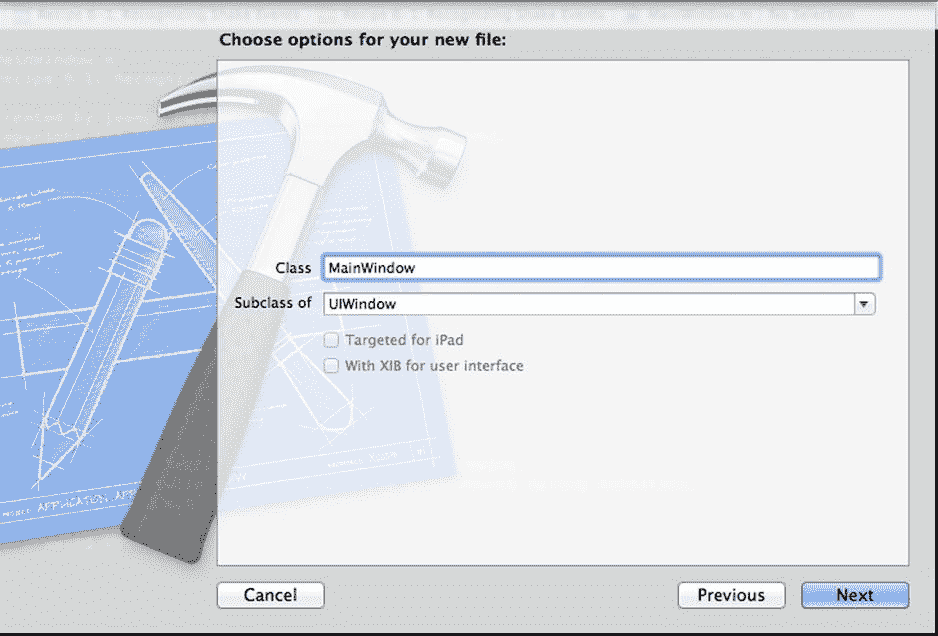
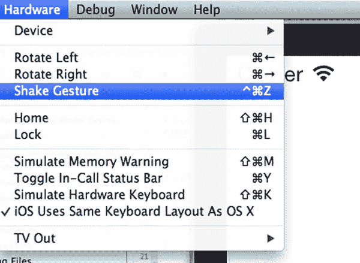
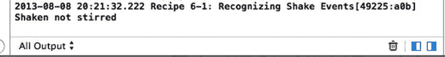
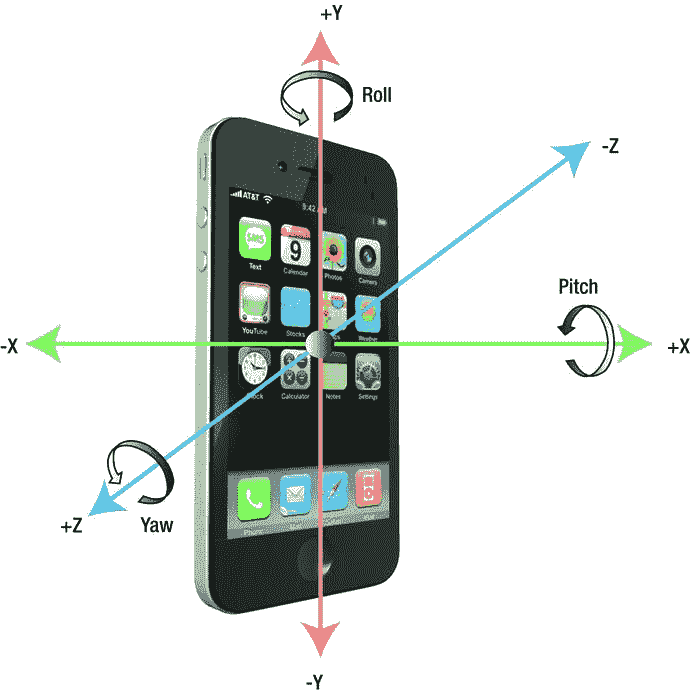
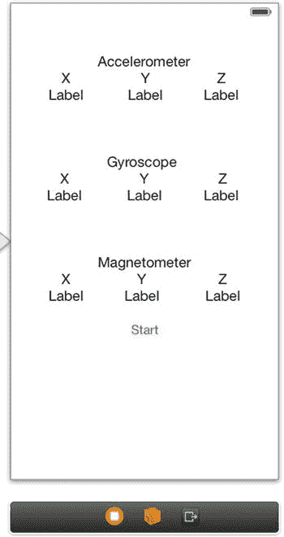
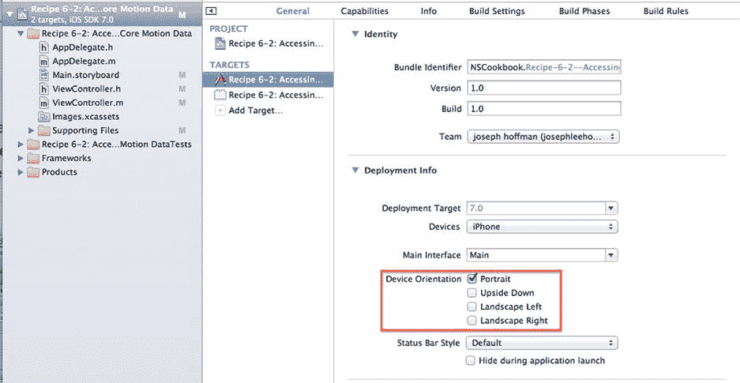
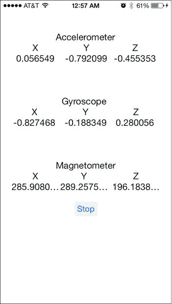
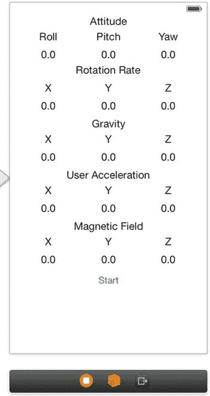
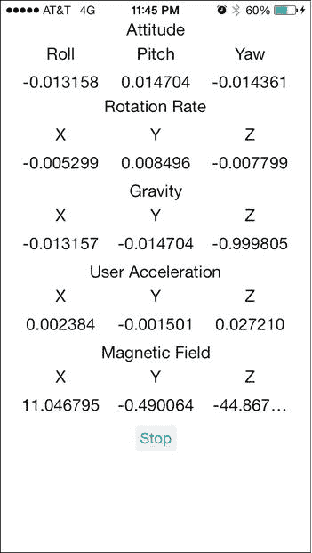
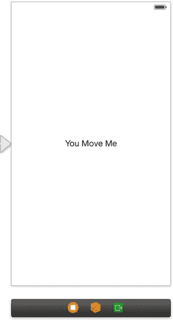

# 6. 运动秘籍

## 摘要

iOS 设备最令人印象深刻的功能之一便是内置的运动传感器。借助运动传感器，iOS 开发者可以创造出令人惊叹的应用——这些应用在 2000 年代初期我们只能梦想。如今，我们只需将手机指向夜空，就能立即了解恒星和星座的名称。我们可以玩虚拟弹珠迷宫游戏，其体验之逼真几乎令人难以置信。运动传感器真正丰富了应用开发领域。

通过 Core Motion 框架，你可以轻松访问设备的加速度计、陀螺仪和磁力计。你的任务是利用这些工具来增强用户体验，并创造新颖酷炫的功能。本章中的秘籍将帮助你入门。

除本章第一个秘籍外，其他所有秘籍都需要实体设备来测试功能，因为目前尚无方法模拟 Core Motion 框架的数据。

## 秘籍 6-1：识别摇动事件

在深入探讨 Core Motion 框架之前，我们先处理一个相关话题：设备的摇动。大量应用以各种方式利用这一功能，其结果涵盖从歌曲随机播放到信息刷新等多种用途。虽然这种实现并不一定依赖 Core Motion 框架，但其能够检测设备物理变化的关键动作，使其成为一项需要理解的重要功能。

### 拦截摇动事件

尽管你可以使用 Core Motion 框架来识别摇动事件，但我们将采用苹果为方便处理摇动事件而创建更为便捷的 `motionEnded:withEvent:` 消息。当用户摇动设备时，此消息会被发送到应用的第一响应者。第一响应者是一个对象（通常是视图控制器），它会首先接收到事件。

例如，你可以使用代码设置应用的主视图来接收摇动事件，如代码清单 6-1 所示。

**代码清单 6-1.** 接收摇动事件的一个示例

```
@implementation ViewController

// ...

- (BOOL) canBecomeFirstResponder
{
    return YES;
}

- (void) viewWillAppear: (BOOL)animated
{
    [self.view becomeFirstResponder];
    [super viewWillAppear:animated];
}

- (void) viewWillDisappear: (BOOL)animated
{
    [self.view resignFirstResponder];
    [super viewWillDisappear:animated];
}

- (void) motionEnded: (UIEventSubtype)motion withEvent: (UIEvent *)event
{
    if (event.subtype == UIEventSubtypeMotionShake)
    {
        // 设备被摇动
    }
}

// ...

@end
```

虽然代码清单 6-1 中的代码适用于大多数情况，但一个略微更复杂的解决方案允许你从应用内的任何位置识别摇动事件。下一节将展示如何实现。

### 创建窗口子类

如果在响应者链中没有 `motionEnded:withEvent:` 消息的接收者，该消息就会被发送到应用的窗口对象。你应该在窗口对象上拦截事件 `motionEnded:withEvent:`，并实现你自己的通知方案。这样，应用中任何观察对象都能在设备被摇动时得到通知。

首先，创建一个新的单视图应用，并将其命名为“Recipe 6-1 Recognizing Shake Events”。接着，创建应用窗口对象的子类。为此，创建一个新的 Objective-C 类，并将其命名为 `MainWindow`。确保将其设置为 `UIWindow` 的子类（见图 6-1）。



**图 6-1.** 通过创建 Objective-C 类来创建 `UIWindow` 的子类

接下来，修改应用的设置代码，以使用你的自定义窗口类。这只需对应用委托稍作修改即可。由于我们使用的是单视图应用模板（默认使用故事板），需要重写窗口的 getter 方法，让系统知道我们使用的是自定义的 `UIWindow`。代码清单 6-2 展示了如何修改 `AppDelegate.h` 和 `AppDelegate.m` 文件。

**代码清单 6-2.** 修改 `AppDelegate` 以使用自定义 `UIWindow`

```
//
//  AppDelegate.h
//  Recipe 6-1 Recognizing Shake Events
//

#import <UIKit/UIKit.h>
#import "MainWindow.h"

@interface AppDelegate : UIResponder <UIApplicationDelegate>
@property (strong, nonatomic) MainWindow *window;
@end

//
//  AppDelegate.m
//  Recipe 6-1 Recognizing Shake Events
//

#import "AppDelegate.h"

//...

- (MainWindow *)window
{
    if(!_window)
    {
        _window=[[MainWindow alloc] initWithFrame:[UIScreen mainScreen].bounds];
    }
    return _window;
}

//...
```

> **注意：** 如果你使用的是第 1 章中描述的 `.xib` 方法，则需要在 `AppDelegate.h` 文件中导入 `MainWindow.h` 文件。然后，需要修改代码清单 6-2 中显示的 `didFinishLaunchingWithOptions` 方法，而不是代码清单 6-1 中的内容。

**代码清单 6-3.** 不使用故事板设置 `application:didFinishLaunchingWithOptions:` 方法

```
- (BOOL)application:(UIApplication *)application didFinishLaunchingWithOptions:(NSDictionary *)launchOptions
{
    self.window = [[MainWindow alloc] initWithFrame:[[UIScreen mainScreen] bounds]];
    // 应用启动后的自定义覆盖点。
    self.viewController = [[ViewController alloc] initWithNibName:@"ViewController" bundle:nil];
    self.window.rootViewController = self.viewController;
    [self.window makeKeyAndVisible];
    return YES;
}
```

现在，你已经拥有了一个能够拦截发送至主窗口事件的架构。接下来是实现应用级别的摇动通知的时候了。


### 实现摇动通知

在 `MainWindow.m` 文件中，添加代码清单 6-4 中的代码。

**代码清单 6-4.** 向 `mainWindow.m` 添加代码以拦截摇动事件

```
@implementation MainWindow

// ...

- (void)motionEnded:(UIEventSubtype)motion withEvent:(UIEvent *)event
{
    if (event.type == UIEventTypeMotion && event.subtype == UIEventSubtypeMotionShake)
    {
        [[NSNotificationCenter defaultCenter] postNotificationName:@"NOTIFICATION_SHAKE"
                                                              object:self];
    }
}

// ...

@end
```

代码清单 6-4 中的代码拦截了一个摇动事件，并使用 `NSNotificationCenter` 类来发布一个通知。`NSNotificationCenter` 实现了一种观察者模式，用于从应用程序的任何部分均可访问的简单通知。通知的类型由其名称标识；本实践指南使用 `NOTIFICATION_SHAKE`，但你可以选择任何喜欢的名称。观察者模式是一种软件设计模式，其中一个对象（在本例中为 `NSNotificationCenter`）在事件发生时通知其观察者，通常是通过调用观察者的某个方法。稍后你将看到，观察者将是视图控制器。

任何对摇动通知感兴趣的对象都可以向通知中心注册一个操作方法。举个例子，假设你想在应用程序的主视图中收到摇动通知。那么你可以像代码清单 6-5 中的实现那样进行操作。

**代码清单 6-5.** `NSNotification` 观察者模式的实现

```
@implementation ViewController

// ...

- (void) viewWillAppear: (BOOL)animated
{
    [[NSNotificationCenter defaultCenter] addObserver:self
                                              selector:@selector(shakeDetected:)
                                                  name:@"NOTIFICATION_SHAKE" object:nil];
    [super viewWillAppear:animated];
}

- (void) viewWillDisappear: (BOOL)animated
{
    [[NSNotificationCenter defaultCenter] removeObserver:self];
    [super viewWillDisappear:animated];
}

-(void)shakeDetected:(NSNotification *)paramNotification
{
    NSLog(@"Shaken not stirred");
}

// ...

@end
```

正如你在上述代码中所见，如果视图从视野中移除，你需要在 `viewWillDisappear` 方法中取消注册监听摇动通知的观察者。这可能符合你的需求，也可能不符合。如果你希望在视图消失后仍然持续跟踪摇动事件，请去掉对 `removeObserver:` 的调用。

### 测试摇动事件

现在你已经完成了，可以运行并测试你的应用程序了。虽然 Core Motion 功能需要真机设备进行测试，但摇动事件可以在模拟器中测试。只需使用“硬件”菜单下的“摇动手势”选项，如图 6-2 所示。



**图 6-2.** 摇动事件可以被模拟

图 6-3 显示了测试应用程序在响应摇动事件后的效果。



**图 6-3.** 你的测试应用在收到摇动事件时向输出控制台写入信息

从图 6-3 中可以看出，当通知中心调用你提供的 `shakeDetected` 选择器方法时，文本 “Shaken not stirred” 会被记录到屏幕上。

## 实践指南 6-2：访问原始 Core Motion 数据

通过本实践指南，你将创建一个简单的应用程序，用于接收并显示来自加速度计、陀螺仪和磁力计传感器的原始数据。你需要一台具备这些传感器的真机设备（例如 iPhone 4 或更高版本）来测试该应用。

### Core Motion 传感器

在 Core Motion 中，你可以访问设备上的三种不同硬件，前提是设备足够新且配备了所述硬件（参见表 6-1）。

-   加速度计用于测量设备因重力或用户加速而产生的加速度。该信息可以提供关于设备当前方向以及当前一般移动情况的洞察。
-   陀螺仪用于测量设备沿多个轴的旋转。
-   磁力计提供穿过设备的磁场数据。这通常是地球磁场，但也可能是附近的其他磁场。附近的磁场可能会干扰指南针的校准。不过，这不是永久性的；只需重新校准即可修复。

**表 6-1.** 各种设备上的传感器支持

| 加速度计 | 所有 iPhone、iPad 和 iPod 均可用 |
| --- | --- |
| 陀螺仪 | iPhone 4、iPad 2、iPod 4 及更高版本可用 |
| 磁力计 | iPhone 3GS 及更高版本，以及所有 iPad 可用 |

**注意：** 虽然表 6-1 提到了 iPhone 3GS 和第一代 iPad，但 iOS 7 支持的最老设备是 iPhone 4 和 iPad 2。

对于所有三个传感器，数据都以三维向量的形式呈现，包含 `X`、`Y` 和 `Z` 分量。如果你手持设备正面朝向自己，底部朝下，那么 X 轴水平穿过设备，Y 轴从底部垂直向上延伸，Z 轴则穿过设备中心指向你。

对于陀螺仪，其数值是围绕这些轴的旋转速率。要确定哪个方向产生正旋转速率值，你可以使用右手定则。想象一下，你张开右手，拇指指向轴的正方向。那么，围绕该轴的正旋转方向就是当你握拳时手指弯曲的方向。

围绕 X、Y 和 Z 轴的旋转分别称为俯仰（pitch）、横滚（roll）和偏航（yaw）。图 6-4 显示了这些轴以及这些旋转的正方向。



**图 6-4.** iOS 中定义的方向和旋转


### 项目设置

你将创建一个简单的应用，用于显示来自三个传感器的当前数据。当你移动设备时，可以观察到移动如何影响其输出。

首先，创建一个新的单视图应用程序，并为其指定一个合适的项目名称，例如“原始运动数据测试”。由于你将使用 Core Motion 框架，因此需要将 `CoreMotion.framework` 二进制文件链接到你的项目中。

接下来，在主视图中添加标签和一个按钮，并进行布局，使视图类似于图 6-5。你需要 21 个标签，其中 9 个将成为输出口。确保标签宽度足够大，以免值被过多截断。



*图 6-5. 主视图界面*

你的应用将更新包含数值的标签（即图 6-4 中文本为 `0.0` 的那些标签）。因此，为这九个标签创建输出口，以便你能够在运行时更改它们的文本。

为输出口和操作指定以下名称：

- 加速度计数值标签：`xAccLabel`、`yAccLabel` 和 `zAccLabel`
- 陀螺仪数值标签：`xGyroLabel`、`yGyroLabel` 和 `zGyroLabel`
- 磁力计数值标签：`xMagLabel`、`yMagLabel` 和 `zMagLabel`
- 按钮输出口：`startButton`
- 按钮操作：`toggleUpdates`

关于如何为视图组件创建输出口和操作的说明，请参阅第 1 章中的相应方法。

完成后，你的视图控制器接口声明应类似于代码清单 6-6。

*代码清单 6-6. 包含所有操作和输出口的视图控制器头文件*

```
@interface ViewController : UIViewController

@property (weak, nonatomic) IBOutlet UILabel *xAccLabel;
@property (weak, nonatomic) IBOutlet UILabel *yAccLabel;
@property (weak, nonatomic) IBOutlet UILabel *zAccLabel;
@property (weak, nonatomic) IBOutlet UILabel *xGyroLabel;
@property (weak, nonatomic) IBOutlet UILabel *yGyroLabel;
@property (weak, nonatomic) IBOutlet UILabel *zGyroLabel;
@property (weak, nonatomic) IBOutlet UILabel *xMagLabel;
@property (weak, nonatomic) IBOutlet UILabel *yMagLabel;
@property (weak, nonatomic) IBOutlet UILabel *zMagLabel;
@property (weak, nonatomic) IBOutlet UIButton *startButton;

- (IBAction)toggleUpdates:(id)sender;

@end
```

现在，你已经有了应用程序的基本结构。是时候从 Core Motion 框架中挖掘数据了。

### 访问传感器数据

Core Motion 框架高度依赖于一个名为 `CMMotionManager` 的类。该类充当一个中心枢纽，通过它你可以访问运动传感器。你将设置一个懒加载属性（即需要时才初始化，而非立即初始化），以访问该类的单个实例。

对视图控制器的类声明进行代码清单 6-7 中的更改。请注意，为了简洁起见，输出口属性已被移除，因此在你的代码中不要移除它们。

*代码清单 6-7. 导入 CoreMotion 框架并创建 CMMotionManager 属性*

```
#import <UIKit/UIKit.h>
#import <CoreMotion/CoreMotion.h>

@interface ViewController : UIViewController

// ...
@property (strong, nonatomic) CMMotionManager *motionManager;

- (IBAction)toggleUpdates:(id)sender;

@end
```

现在切换到 `ViewController.m`，并将代码清单 6-8 中的代码添加到视图控制器的实现部分。同样，为了简洁起见，部分代码已被移除。

*代码清单 6-8. 实现懒加载属性*

```
@implementation ViewController

// ...

- (CMMotionManager *)motionManager
{
    // 懒加载
    if (_motionManager == nil)
    {
        _motionManager = [[CMMotionManager alloc] init];
    }
    return _motionManager;
}

// ...

@end
```

由于你将移动设备以获取不同的读数，因此应停止用户界面的自动旋转。通过将此应用程序支持的界面方向仅设置为纵向来实现。你可以在项目编辑器的摘要页面的“支持的界面方向”部分进行设置（见图 6-6）。



*图 6-6. 设置支持的界面方向*

接下来，你需要开始从传感器接收数据，并用这些信息更新相应的标签。为此，请执行以下步骤：

1. 检查相关传感器是否可用。
2. 设置更新间隔。
3. 开始更新，并提供每次更新时将调用的代码块。

例如，我们可以使用这些步骤来设置加速度计，如代码清单 6-9 所示（请先不要添加代码）。

*代码清单 6-9. 设置加速度计的示例代码*

```
// 如果加速度计可用，则启动
if ([self.motionManager isAccelerometerAvailable])
{
    // 每秒更新两次
    [self.motionManager setAccelerometerUpdateInterval:1.0/2.0];

    [self.motionManager startAccelerometerUpdatesToQueue:[NSOperationQueue mainQueue]
        withHandler:
        ^(CMAccelerometerData *data, NSError *error)
        {
            // 新数据到达，更新加速度计标签
            self.xAccLabel.text = [NSString stringWithFormat:@"%f",
                                   data.acceleration.x];
            self.yAccLabel.text = [NSString stringWithFormat:@"%f",
                                   data.acceleration.y];
            self.zAccLabel.text = [NSString stringWithFormat:@"%f",
                                   data.acceleration.z];
        }
    ];
}
```

`startAcceleratorUpdatesToQueue:withHandler:` 方法会保留代码块（即所谓的处理程序），并将其作为任务在给定的操作队列中反复执行，执行间隔为设定的更新间隔。在我们的例子中，它将导致加速度计标签被来自加速度计的最新值所更新。

其他传感器具有类似的编程接口。代码清单 6-10 显示了同时启动和停止所有三个传感器的方法。将它们添加到你的项目视图控制器实现文件中。

*代码清单 6-10. 启动和停止所有三个传感器的实现*

```
- (void)startUpdates
{
    // 如果加速度计可用，则启动
    if ([self.motionManager isAccelerometerAvailable])
    {
        [self.motionManager setAccelerometerUpdateInterval:1.0/2.0];

        [self.motionManager startAccelerometerUpdatesToQueue:
         [NSOperationQueue mainQueue]
            withHandler:
            ^(CMAccelerometerData *data, NSError *error)
            {
                self.xAccLabel.text = [NSString stringWithFormat:@"%f",
                                       data.acceleration.x];
                self.yAccLabel.text = [NSString stringWithFormat:@"%f",
                                       data.acceleration.y];
```


```objective-c
self.zAccLabel.text = [NSString stringWithFormat:@"%f",
                       data.acceleration.z];
}];
}

// 如果陀螺仪可用，则启动它
if ([self.motionManager isGyroAvailable])
{
    [self.motionManager setGyroUpdateInterval:1.0/2.0];
    [self.motionManager startGyroUpdatesToQueue:
     [NSOperationQueue mainQueue]
                                  withHandler:
     ^(CMGyroData *data, NSError *error)
     {
         self.xGyroLabel.text = [NSString stringWithFormat:@"%f",
                                 data.rotationRate.x];
         self.yGyroLabel.text = [NSString stringWithFormat:@"%f",
                                 data.rotationRate.y];
         self.zGyroLabel.text = [NSString stringWithFormat:@"%f",
                                 data.rotationRate.z];
     }];
}

// 如果磁力计可用，则启动它
if ([self.motionManager isMagnetometerAvailable])
{
    [self.motionManager setMagnetometerUpdateInterval:1.0/2.0];
    [self.motionManager startMagnetometerUpdatesToQueue:[NSOperationQueue mainQueue]
                                           withHandler:
     ^(CMMagnetometerData *data, NSError *error)
     {
         self.xMagLabel.text = [NSString stringWithFormat:@"%f",
                                data.magneticField.x];
         self.yMagLabel.text = [NSString stringWithFormat:@"%f",
                                data.magneticField.y];
         self.zMagLabel.text = [NSString stringWithFormat:@"%f",
                                data.magneticField.z];
     }];
}
}

-(void)stopUpdates
{
    if ([self.motionManager isAccelerometerAvailable] &&
        [self.motionManager isAccelerometerActive])
    {
        [self.motionManager stopAccelerometerUpdates];
    }
    if ([self.motionManager isGyroAvailable] &&
        [self.motionManager isGyroActive])
    {
        [self.motionManager stopGyroUpdates];
    }
    if ([self.motionManager isMagnetometerAvailable] &&
        [self.motionManager isMagnetometerActive])
    {
        [self.motionManager stopMagnetometerUpdates];
    }
}
```

现在，我们将通过一个绑定到按钮的切换方法来启动和停止运动服务。为此，请修改 `ViewController.m` 中的两个方法，如代码清单 6-11 所示。

**代码清单 6-11.** 修改 `viewDidLoad` 和 `toggleUpdates:` 方法以支持启动和停止按钮

```objective-c
- (void)viewDidLoad
{
    [super viewDidLoad];
    // 执行任何额外的视图加载后设置，通常从 nib 文件加载。
    [self.startButton setTitle:@"停止" forState:UIControlStateSelected];
    [self.startButton setTitle:@"启动" forState:UIControlStateNormal];
}

//...
- (IBAction)toggleUpdates:(id)sender {
    if(![self.startButton isSelected])
    {
        [self startUpdates];
        [self.startButton setSelected:YES];
    }
    else
    {
        [self stopUpdates];
        [self.startButton setSelected:NO];
    }
}
```

你的应用程序已完成，可以运行了。请记住，模拟器不支持这三种传感器中的任何一种，因此在模拟过程中不会发生任何有趣的事情。你需要一台真实设备来测试此应用程序。图 6-7 显示了该应用程序运行时的屏幕截图。



**图 6-7.** 显示原始 Core Motion 数据的应用程序

### 推送或拉取

有两种方法可以从传感器获取更新的数据。在本方法中，你使用了“推送”。这意味着运动管理器将在给定的时间间隔内调用你的代码，并向其提供新值。该系统在 `start<Sensor>UpdatesToQueue:withHandler` 方法中实现，你可以在其中以块的形式提供代码。

为了清晰说明“推送”的概念，可以想想你的电子邮件系统。启用“推送”后，每当有新邮件时，它就会立即显示。当然，这可能会导致电池消耗以及数据使用量增加。另一种策略是“拉取”，如果你的应用程序具有渲染循环，并且你可以定期从中查询值，那么这是一种更可取的方法。这种方式可能更高效，通常更适合游戏应用程序。使用电子邮件的类比，这更像是一个手动过程，用户必须先检查电子邮件才能获取更新。因此，仅在需要时才提供数据。

“拉取”在 `start<Sensor>Updates` 方法中实现。它会使运动管理器上的 `accelerometerData`、`gyroData` 和 `magnetometerData` 属性保持更新，以反映最新值。然后，你的应用程序可以在适当的时间从这些属性中检索值，如代码清单 6-12 所示。

**代码清单 6-12.** 使用拉取模式访问加速度计数据的示例

```objective-c
// 以拉取模式启动更新
[self.motionManager startAccelerometerUpdates];

// 从更新循环中的某个位置拉取值
self.xMagLabel.text = [NSString stringWithFormat:@"%f",
                       self.motionManager.magnetometerData.magneticField.x ];
self.yMagLabel.text = [NSString stringWithFormat:@"%f",
                       self.motionManager.magnetometerData.magneticField.y ];
self.zMagLabel.text = [NSString stringWithFormat:@"%f",
                       self.motionManager.magnetometerData.magneticField.z ];
```

### 选择更新间隔

你可以将更新间隔设置得小至每十毫秒一次（1/100）。但是，你应尽量使用适合你应用程序的最高可能值，因为这将延长电池续航时间。表 6-2 提供了更新间隔的通用指导。

**表 6-2.** 更新间隔的指导值

| 更新间隔 | 使用示例 |
| --- | --- |
| 10 毫秒 (1/100) | 用于检测高频运动 |
| 20 毫秒 (1/50) | 适用于使用实时用户输入的游戏 |
| 100 毫秒 (1/10) | 适用于确定设备的当前方向 |

### 原始运动数据的特性

在运行应用程序时，你可能已经发现传感器数据是多么难以理解。这是因为来自传感器的数据带有偏差；也就是说，它们受到不止一种力的影响。例如，加速度计既受到地球重力的影响，也受到用户手部运动的影响。磁力计不仅感知地球的磁场，还感知你附近所有其他磁场。

原始数据的偏差特性使得数据难以解释。你需要诸如高通和低通滤波器之类的技巧来隔离各种分量。幸运的是，Core Motion 提供了一种访问传感器无偏差数据的方法，这使得确定设备的真实方向和运动变得容易。方法 6-3 向你展示了如何使用这个便捷的功能。

## 方法 6-3：访问设备运动数据

前面提到的方法向你展示了如何从三个传感器访问原始运动数据。虽然访问起来很容易，但原始的带偏差数据并不容易使用。它们需要各种过滤技术来隔离影响传感器的不同力，以便真正利用这些数据。好消息是，苹果已经为你完成了这项艰巨的工作，可以通过运动管理器的 `deviceMotion` 属性来使用。本方法将向你展示如何操作。


### 设备运动类

与前文中的加速计、陀螺仪和磁力计类似，你可以通过使用非常相似的方法启动和停止更新来访问 `CMDeviceMotion`：`startDeviceMotionUpdates` 和 `startDeviceMotionUpdatesToQueue:withHandler:`。不过，你还有另外两种方法可以指定“参考坐标系”：`startDeviceMotionUpdatesUsingReferenceFrame:` 和 `startDeviceMotionUpdatesUsingReferenceFrame:toQueue:WithHandler:`。参考坐标系将在稍后讨论。

当通过 `CMDeviceMotion` 实例（通过 `CMMotionManager` 中的 `deviceMotion` 属性）检索数据时，你可以访问六个不同的属性。

-   `attitude` 属性是 `CMAttitude` 类的一个实例。它提供了设备在特定时间点相对于参考坐标系的朝向的详细信息。通过这个类，你可以访问 `roll`（横滚角）、`pitch`（俯仰角）和 `yaw`（偏航角）等属性。这些值以弧度为单位，可以精确测量设备朝向。
-   如前文图 6-4 所示，`roll` 指定设备绕 y 轴的旋转位置，`pitch` 指定绕 x 轴的旋转位置，`yaw` 指定绕 z 轴的旋转位置。
-   `rotationRate` 属性与前文食谱中的类似，但它能提供更精确的读数。这是通过减少设备偏差实现的，这种偏差会导致静止的设备产生非零的旋转值。
-   `gravity` 属性表示仅由重力作用在设备上引起的加速度。
-   `userAcceleration` 表示用户施加在设备上的、排除重力加速度之外的物理加速度。
-   `magneticField` 值与你在食谱 6-2 中看到的类似；但它消除了设备偏差，从而得到更准确的读数。

**注意：** 如果你不熟悉弧度，它是与更常用的度数不同的另一种测量旋转的方式。它基于圆周率（`π`）。弧度值为 pi（约 3.14）相当于旋转 180 度，因此任何弧度值都可以通过除以 pi 再乘以 180 来转换为度数，如下所示：`d = r * 180 / π`。

### 设置应用程序

你将创建一个与你在食谱 6-2 中构建的应用程序类似的应用程序。那么，继续创建一个新的单视图应用程序项目，并链接 Core Motion 框架。

**警告：** 如果未能链接 Core Motion 框架，稍后尝试构建应用程序时会导致链接器错误，如下所示。

```
Undefined symbols for architecture armv7:
  "_OBJC_CLASS_$_CMMotionManager", referenced from:
      objc-class-ref in ViewController.o
```

现在，创建一个如图 6-8 所示的用户界面。你需要 35 个标签对象，其中 15 个用于显示数值。你还需要一个按钮。由于你将在运行时更新这些标签，因此需要为它们创建输出口（outlet）。为输出口和操作使用以下名称：



**图 6-8.** 设备运动应用的用户界面

-   姿态值标签：`rollLabel`、`pitchLabel` 和 `yawLabel`
-   旋转速率值标签：`xRotLabel`、`yRotLabel` 和 `zRotLabel`
-   重力值标签：`xGravLabel`、`yGravLabel` 和 `zGravLabel`
-   用户加速度标签：`xAccLabel`、`yAccLabel` 和 `zAccLabel`
-   磁场标签：`xMagLabel`、`yMagLabel` 和 `zMagLabel`
-   按钮输出口：`startButton`
-   按钮操作：`toggleUpdates`

如同你在食谱 6-2 中所做的那样，向视图控制器接口文件添加一个运动管理器属性，如列表 6-13 所示。

**列表 6-13.** 向视图控制器接口添加 `CMMotionManager` 和 `CoreMotion` 导入语句

```
#import <UIKit/UIKit.h>
#import <CoreMotion/CoreMotion.h>

@interface ViewController : UIViewController

// ...

@property (strong,nonatomic) CMMotionManager *motionManager;
- (IBAction)toggleUpdates:(id)sender;

@end
```

该属性的惰性初始化实现应与前文食谱中的相同。这在列表 6-14 中再次展示。

**列表 6-14.** 实现惰性初始化属性

```
@implementation ViewController

// ...

-(CMMotionManager *)motionManager
{
    // 惰性初始化
    if (_motionManager == nil)
    {
        _motionManager = [[CMMotionManager alloc] init];
    }
    return _motionManager;
}

// ...

@end
```

此外，与食谱 6-2 一样，你的应用程序应仅支持竖屏方向（请参考图 6-6）。


### 访问设备运动数据

启动和停止更新，并从 `device-motion` 属性检索数据，与您访问三种传感器原始数据时使用的模式相同。不同之处在于，您只需要一个 `start` 语句，就可以一次性获取所有数据。

因此，请将代码清单 6-15 中的方法添加到您的视图控制器中。请务必同时将这些方法的声明添加到头文件中，因为稍后您将从应用委托中调用它们。

**代码清单 6-15.** 实现 `startUpdates` 和 `stopUpdates` 方法

```
- (void)startUpdates
{
    // 启动设备运动更新
    if ([self.motionManager isDeviceMotionAvailable])
    {
        // 每秒更新两次
        [self.motionManager setDeviceMotionUpdateInterval:1.0/2.0];
        [self.motionManager startDeviceMotionUpdatesToQueue:[NSOperationQueue mainQueue]
                                            withHandler:
         ^(CMDeviceMotion *deviceMotion, NSError *error)
         {
             // 更新姿态标签
             self.rollLabel.text =  [NSString stringWithFormat:@"%f",
                                     deviceMotion.attitude.roll];
             self.pitchLabel.text = [NSString stringWithFormat:@"%f",
                                     deviceMotion.attitude.pitch];
             self.yawLabel.text =   [NSString stringWithFormat:@"%f",
                                     deviceMotion.attitude.yaw];

             // 更新旋转速率标签
             self.xRotLabel.text = [NSString stringWithFormat:@"%f",
                                     deviceMotion.rotationRate.x];
             self.yRotLabel.text = [NSString stringWithFormat:@"%f",
                                     deviceMotion.rotationRate.y];
             self.zRotLabel.text = [NSString stringWithFormat:@"%f",
                                     deviceMotion.rotationRate.z];

             // 更新用户加速度标签
             self.xGravLabel.text = [NSString stringWithFormat:@"%f",
                                     deviceMotion.gravity.x];
             self.yGravLabel.text = [NSString stringWithFormat:@"%f",
                                     deviceMotion.gravity.y];
             self.zGravLabel.text = [NSString stringWithFormat:@"%f",
                                     deviceMotion.gravity.z];

             // 更新用户加速度标签
             self.xAccLabel.text = [NSString stringWithFormat:@"%f",
                                     deviceMotion.userAcceleration.x];
             self.yAccLabel.text = [NSString stringWithFormat:@"%f",
                                     deviceMotion.userAcceleration.y];
             self.zAccLabel.text = [NSString stringWithFormat:@"%f",
                                     deviceMotion.userAcceleration.z];

             // 更新磁场标签
             self.xMagLabel.text = [NSString stringWithFormat:@"%f",
                                     deviceMotion.magneticField.field.x];
             self.yMagLabel.text = [NSString stringWithFormat:@"%f",
                                     deviceMotion.magneticField.field.y];
             self.zMagLabel.text = [NSString stringWithFormat:@"%f",
                                     deviceMotion.magneticField.field.z];
         }];
    }
}

-(void)stopUpdates
{
    if ([self.motionManager isDeviceMotionAvailable] &&
        [self.motionManager isDeviceMotionActive])
    {
        [self.motionManager stopDeviceMotionUpdates];
    }
}
```

最后，像我们在代码清单 6-2 中那样，从 `toggleUpdates` 方法中调用 `start` 和 `stop` 更新方法，并更新 `viewDidLoad` 方法，如代码清单 6-16 所示。

**代码清单 6-16.** 更新 `viewDidLoad` 和 `toggleUpdates:` 方法以添加启动和停止功能

```
- (void)viewDidLoad
{
    [super viewDidLoad];
    // 执行任何额外的视图加载后设置，通常从 nib 文件加载。
    [self.startButton setTitle:@"停止" forState:UIControlStateSelected];
    [self.startButton setTitle:@"启动" forState:UIControlStateNormal];
}
//...
(IBAction)toggleUpdates:(id)sender
{
    if(![self.startButton isSelected])
    {
        [self startUpdates];
        [self.startButton setSelected:YES];
    }
    else
    {
        [self stopUpdates];
        [self.startButton setSelected:NO];
    }
}
//...
```

如果您运行此应用，您可能会注意到，您的多数值比代码清单 6-2 中的原始传感器数据更加稳定。您可能还会看到磁力计读数为全零。请以“8”字形运动移动您的设备以校准磁力计，直到这些值开始更新。

### 设置参考系

虽然不是必需的，但您可以为姿态数据指定一个参考系。如果您想切换坐标系，或使用磁北而非真北，这会很方便。更改参考系是通过使用 `startDeviceMotionUpdatesUsingReferenceFram:toQueue:withHandler:` 方法来完成的。

以下是参考系参数的可能值之一：

*   `CMAttitudeReferenceFrameXArbitraryZVertical`，该值指定参考系：z 轴沿垂直方向，x 轴沿任意方向；简单来说，就是设备平放且屏幕朝上。
*   `CMAttitudeReferenceFrameXArbitraryCorrectedZVertical`，该值与上一个值相同，区别在于使用磁力计来提高精度。此选项会增加中央处理单元（CPU）使用率，并且要求磁力计可用且已校准。
*   `CMAttitudeReferenceFrameXMagneticNorthZVertical`，该值引用一个参考系，其 z 轴垂直，而 x 轴指向“磁北”方向。此选项要求磁力计可用且已校准，这意味着您可能需要先晃动一下设备，然后才能在应用中获取读数。
*   `CMAttitudeReferenceFrameXTrueNorthZVertical`，该值与上一个类似，但 x 轴指向的是“真北”而非“磁北”。设备必须能够获取其位置，才能计算两者之间的差值。

**注意**

正如本章前面提到的，“磁北”和“真北”之间存在差异。磁北是地球的磁北极，任何指南针都指向该点。然而，由于地核的变化，这个点并非固定不变，并且每年移动超过 30 英里。真北指代指向地球实际北极的方向，该方向是恒定的。

您将为您的应用选择第三个选项 `CMAttitudeReferenceFrameXMagneticNorthZVertical`，因为方向精度并非那么重要，而且使用定位服务也超出了实际需求。修改您对 `startDeviceMotionUpdatesToQueue:withHandler:` 方法的调用，如代码清单 6-17 所示。

**代码清单 6-17.** 向 `startDeviceMotionUpdatesToQueue:withHandler` 方法添加磁北参考

```
[self.motionManager startDeviceMotionUpdatesUsingReferenceFrame:
                    CMAttitudeReferenceFrameXMagneticNorthZVertical
                    toQueue:[NSOperationQueue mainQueue]
                    withHandler:
  ^(CMDeviceMotion *deviceMotion, NSError *error)
  {
    // ... 在此处更新数值标签
  }];
```

当您运行应用时，您可能会看到所有值都为“0.0”。如果是这种情况，您可以以“8”字形移动设备来校准磁力计；数值应该会很快开始更新。

您现在应该会注意到，如果将设备平放在桌面上，然后绕 z 轴旋转设备，在您的 x 轴与地球磁场对齐的那一刻，您的偏航值应接近于零，如图 6-9 所示。



**图 6-9.** 您的应用接收已校准的设备信息

## 技巧 6-4：利用重力移动标签

技巧 6-2 和 6-3 向您展示了如何访问各种 Core Motion 数据。现在是时候将这些知识付诸实践，让它变得更有趣了。通过此技巧，您将创建一个包含单个标签的应用，您可以通过倾斜设备来移动这个标签。


### 设置应用程序

你将使用与前两个教程相同的基本架构。因此，再次从创建一个新的单视图应用程序并将其链接到 `CoreMotion.framework` 开始。然后，按照列表 6-18 所示，将以下声明添加到视图控制器的头文件中，这些声明你现在应该已经熟悉了。

**列表 6-18.** 设置 `ViewController.h` 文件

```
#import <UIKit/UIKit.h>
#import <CoreMotion/CoreMotion.h>

@interface ViewController : UIViewController

@property (strong, nonatomic) CMMotionManager *motionManager;

@end
```

现在切换到 `ViewController.m` 并使用惰性初始化实现该属性；为 `startUpdates` 和 `stopUpdates` 方法添加存根。列表 6-19 显示了这段代码。

**列表 6-19.** 创建自定义初始化器并添加方法存根

```
@implementation ViewController

- (CMMotionManager *)motionManager
{
    // 惰性初始化
    if (_motionManager == nil)
    {
        _motionManager = [[CMMotionManager alloc] init];
    }
    return _motionManager;
}

- (void)startUpdates
{
}

- (void)stopUpdates
{
}

// ...
@end
```

与前两个教程一样，你的应用程序应仅支持竖屏界面方向，因此请确保在项目设置中进行相应更改。

在本教程中，我们不会创建按钮，而是当视图加载时启动更新。因此，将列表 6-20 中的代码添加到你的 `ViewController.m` 文件中的 `viewDidLoad` 方法中。

**列表 6-20.** 修改 `viewDidLoad` 方法以启动更新

```
@implementation ViewController

- (void)viewDidLoad
{
    [super viewDidLoad];
    [self startUpdates];
}
```

接下来，你应该在视图消失时停止更新，因此在 `viewDidLoad` 方法之后立即添加列表 6-21 中的代码。

**列表 6-21.** 实现 `viewWillDisappear:` 方法以停止更新

```
-(void)viewWillDisappear:(BOOL)animated
{
    [self stopUpdates];
}
```

最后，转到 `Main.storyboard` 并添加一个标签及其输出口，以便你可以在运行时更改其位置。将标签的输出口命名为 `myLabel`。你的用户界面应类似于图 6-10 所示。



**图 6-10.** 包含你将使用重力移动的标签的用户界面

现在你的应用程序已经准备好进行下一步——实现由重力引起的标签移动。

### 用重力移动标签

在标签移动功能的初始版本中，你将使用一个非常简单的算法。稍后你会通过加入一点加速度来增强效果，但目前你只会使用一个与设备倾斜角度成比例的线性移动。

如你所见，你将更新频率提高到了每 20 毫秒一次（1/50）。这增强了应用的感觉和响应性。接下来要注意的是，你使用了 `CMAttitudeReferenceFrameXArbitraryCorrectedZVertical` 参考系。这为你提供了一个与地球重力方向对齐的 z 轴，这正好是你所需要的。实现 `startUpdates` 和 `stopUpdates` 方法，如列表 6-22 所示。

**列表 6-22.** `startUpdates` 方法和 `stopUpdates` 方法的实现

```
- (void)startUpdates
{
    if ([self.motionManager isDeviceMotionAvailable] &&
        ![self.motionManager isDeviceMotionActive])
    {
        [self.motionManager setDeviceMotionUpdateInterval:1.0/50.0];
        [self.motionManager startDeviceMotionUpdatesUsingReferenceFrame:
                            CMAttitudeReferenceFrameXArbitraryCorrectedZVertical
                            toQueue:[NSOperationQueue mainQueue]
                            withHandler:
         ^(CMDeviceMotion *motion, NSError *error)
         {
             CGRect labelRect = self.myLabel.frame;
             double scale = 5.0;

             // 计算 x 轴上的移动
             double dx = motion.gravity.x * scale;
             labelRect.origin.x += dx;

             // 不要移出视图的 x 边界
             if (labelRect.origin.x < 0)
             {
                 labelRect.origin.x = 0;
             }
             else if (labelRect.origin.x + labelRect.size.width >
                      self.view.bounds.size.width)
             {
                 labelRect.origin.x =
                      self.view.bounds.size.width - labelRect.size.width;
             }

             // 计算 y 轴上的移动
             double dy = motion.gravity.y * scale;
             labelRect.origin.y -= dy;

             // 不要移出视图的 y 边界
             if (labelRect.origin.y < 0)
             {
                 labelRect.origin.y = 0;
             }
             else if (labelRect.origin.y + labelRect.size.height >
                      self.view.bounds.size.height)
             {
                 labelRect.origin.y =
                      self.view.bounds.size.height - labelRect.size.height;
             }

             [self.myLabel setFrame:labelRect];
         }];
    }
}

- (void)stopUpdates
{
    if ([self.motionManager isDeviceMotionAvailable] &&
        [self.motionManager isDeviceMotionActive])
    {
        [self.motionManager stopDeviceMotionUpdates];
    }
}
```

上述代码中的算法是最简单的。它使用了 `deviceMotion.gravity` 属性作为速度值（尽管它实际上是一个加速度），并根据它计算增量移动。由于每个值仅在 -1.0 到 1.0 之间，因此使用缩放因子来调整移动的整体速度。

如果你现在运行应用程序，应该会看到标签朝着你倾斜设备的方向移动；倾斜角度越大，移动速度越快。但这种移动感觉有点不自然。这是因为它缺少一个重要的组成部分：加速度。加速度是下一节的主题。


### 添加加速效果

调整 `startUpdates` 方法以实现一个简单的加速算法。请根据代码清单 6-23 修改你的代码。

**代码清单 6-23.** 为 `startUpdates` 方法添加加速算法

```
- (void)startUpdates
{
    if ([self.motionManager isDeviceMotionAvailable] &&
        ![self.motionManager isDeviceMotionActive])
    {
        __block double accumulatedDx = 0;
        __block double accumulatedDy = 0;
        [self.motionManager setDeviceMotionUpdateInterval:1.0/50.0];
        [self.motionManager startDeviceMotionUpdatesUsingReferenceFrame:
                            CMAttitudeReferenceFrameXArbitraryCorrectedZVertical
                            toQueue:[NSOperationQueue mainQueue]
                            withHandler:
         ^(CMDeviceMotion *motion, NSError *error)
         {
             CGRect labelRect = self.myLabel.frame;
             double scale = 1.5;
             double dx = motion.gravity.x * scale;
             accumulatedDx += dx;
             labelRect.origin.x += accumulatedDx;
             if (labelRect.origin.x < 0)
             {
                 labelRect.origin.x = 0;
                 accumulatedDx = 0;
             }
             else if (labelRect.origin.x + labelRect.size.width >
                      self.view.bounds.size.width)
             {
                 labelRect.origin.x =
                     self.view.bounds.size.width - labelRect.size.width;
                 accumulatedDx = 0;
             }
             double dy = motion.gravity.y * scale;
             accumulatedDy += dy;
             labelRect.origin.y -= accumulatedDy;
             if (labelRect.origin.y < 0)
             {
                 labelRect.origin.y = 0;
                 accumulatedDy = 0;
             }
             else if (labelRect.origin.y + labelRect.size.height > self.view.bounds.size.height)
             {
                 labelRect.origin.y = self.view.bounds.size.height - labelRect.size.height;
                 accumulatedDy = 0;
             }
             [self.myLabel setFrame:labelRect];
         }];
    }
}
```

**注意**

你可能想知道 `accumulatedDx` 和 `accumulatedDy` 变量前面的 `__block` 声明是什么。它们使这些变量能够在代码块内部被访问。此外，即使外层方法已超出作用域，这些变量仍然可以访问。这提供了一种干净且简单的方式，让代码块共享变量，从而避免了为局部需求创建属性或全局变量。

另外值得注意的一点是，你降低了缩放因子。现在，如果标签初始移动缓慢就不是问题了；由于加速效果，它很快就会提速。你可以尝试不同的数值，找到最喜欢的那一个。

最后但也很重要，如果标签到达边界，你需要重置速度，如代码清单 6-23 所示。否则，即使运动已经停止，它也会继续累积速度（通过 `accumulatedXX` 变量），当你再次向相反方向倾斜设备时，响应会变得迟钝。

## 本章小结

本章讨论了访问 Core Motion 框架提供的多种数值和信息的细节。你从原始数据入手，然后使用了更具校准性、功能性的数值，并将其转化为一个稍微有用（甚至有点趣味性）的应用。然而，Core Motion 并非一个能够独立构成完整应用的框架。你可以用它来获取设备的相关数值，但随后你必须发挥创意来使用这些数据。从测量翻转过程旋转速度的简单应用，到将磁力计集成到增强现实应用中，Core Motion 提供了一个用于访问信息的基础框架，而这些信息最终可以转化为 iOS 中一些功能最强大的软件。

