# 7. 地图秘籍

Map Kit 框架是一个极其强大且实用的工具包，它为 iOS 设备提供的定位服务添加了巨大功能。该框架的核心功能是在应用中放置一个用户可交互的地图，并拥有无数其他特性来扩展功能，从而实现几乎完全可定制的映射界面。

随着 iOS 6 的推出，苹果做出了一个根本性的改变，用自家的地图引擎替换了谷歌地图后端。随着 iOS 6 中地图的引入，带来了许多改进，包括全新的制图系统，在任何缩放级别下都能提供外观精美的地图；得益于无缝渲染，带来更好的缩放体验；当然，还有逐向导航功能。

苹果在 iOS 7 中进一步扩展了地图工具，为你提供了更多创建沉浸式地图应用的方法。现在你可以使用 Maps 应用中的 3D API 来创建自己的 3D 地图应用。叠加层得到了改进，能够更好地显示内容可读性，并创建了一个新的类，用于从苹果请求基于方向的路由。在本章中，我们将介绍这些新特性以及许多常见的、真实世界的地图应用场景。

## 秘籍 7-1：显示带有当前位置的地图

任何 Map Kit 应用的核心基础都是实际显示世界地图。在本节中，你将学习如何创建一个带有地图的应用，以及如何让地图显示用户的位置。


### 设置应用程序

创建一个新的单视图应用，并将 Map Kit 框架和 Core Location 框架添加到项目中。你还需要在应用程序的属性列表中提供位置使用描述。这可以通过在应用的 `Info.plist` 文件中添加 `NSLocationUsageDescription` 键来完成（请参考第 5 章的图 5-2）。我们将其值设置为“测试地图视图”，当用户被提示并请求使用位置服务权限时，会显示该描述。图 7-3 展示了这个系统提示框的示例。

**注意：** 关于如何链接框架以及在应用程序属性列表中设置值的描述，可以在第 1 章中找到。

添加完框架后，你就可以开始构建用户界面了。从导航面板中选择 `Main.storyboard`，然后从对象库中将一个地图视图拖放到视图上。让它填满整个视图。

接下来，添加一个用于显示设备当前经纬度的标签。将其放置在地图顶部，靠近屏幕底部的位置。将标签的文本对齐方式设置为居中对齐。同时，为了让文字在地图上更易于阅读，设置一个背景颜色（例如白色）。你还需要让标签的宽度更大一些。此时，你的用户界面应该看起来类似于图 7-1 所示。

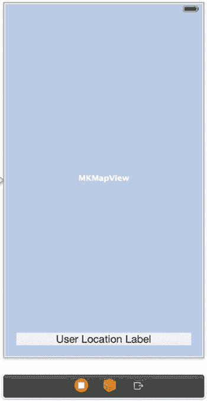

**图 7-1.** 包含地图和标签的主视图控制器

为确保在 3.5 英寸屏幕和 4 英寸屏幕之间切换时视图能够正确调整大小，请通过按住 Command 键并单击来选中 `MKMapView` 和标签，然后从“解决自动布局问题”菜单中选择“添加缺失的约束”。该菜单位于故事板的底部（请参见第 3 章的图 3-7）。你应该会看到约束线条被添加，如图 7-2 所示。

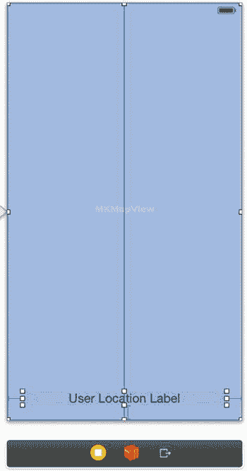

**图 7-2.** 添加了自动布局约束后的主视图控制器

为地图视图和标签分别创建输出口。将输出口命名为 `mapView` 和 `userLocationLabel`。由于你尚未导入 Map Kit API，在 `mapView` 属性旁边会出现一个错误指示。我们接下来会处理这个问题。

**注意：** 第 1 章提供了如何创建输出口的详细说明。

你的用户界面已完全设置好，现在可以将注意力转向视图控制器的接口文件（`ViewController.h`）。在进入实现文件之前，你需要对该类接口进行两项修改。第一项是通过导入语句将 `MapKit/MapKit.h` 和 `CoreLocation/CoreLocation.h` 框架库添加到类中；第二项是通过添加 `MKMapViewDelegate` 作为支持的协议，使视图控制器成为地图视图的委托。

你的 `ViewController.h` 现在应该看起来如代码清单 7-1 所示，上述更改已用粗体标出。

**代码清单 7-1.** 在 `ViewController.h` 中添加导入语句并声明 `MKMapViewDelegate`

```
//
//  ViewController.h
//  Recipe 7-1 Showing a Map with the Current Location
//
#import <UIKit/UIKit.h>
#import <MapKit/MapKit.h>
#import <CoreLocation/CoreLocation.h>
@interface ViewController : UIViewController <MKMapViewDelegate>
@property (weak, nonatomic) IBOutlet MKMapView *mapView;
@property (weak, nonatomic) IBOutlet UILabel *userLocationLabel;
@end
```

切换到实现文件 `ViewController.m`，找到 `viewDidLoad` 方法，你将在其中初始化地图视图。我们将先逐步说明这些步骤，然后提供完整的 `viewDidLoad` 方法。

首先，将视图控制器设置为地图视图的委托，如代码清单 7-2 所示。

**代码清单 7-2.** 将 `mapView` 的委托设置为 `viewController`


`self.mapView.delegate = self;`

接下来，设置地图视图的区域。区域是指当前显示的地图部分，由中心坐标以及围绕该中心坐标显示、以经纬度度量的距离组成。

如果你和大多数人一样，不习惯用经纬度度数来思考距离，可以使用 `MKCoordinateRegionMakeWithDistance()` 方法，通过中心坐标以及围绕坐标的米数来创建一个区域，如代码清单 7-3 所示。在本节中，我们从美国科罗拉多州丹佛市上方一个 10 x 10 公里的区域开始。

**代码清单 7-3.** 创建 `mapView` 区域

```
// 设置初始区域
CLLocationCoordinate2D denverLocation = CLLocationCoordinate2DMake(39.739, -104.984);
self.mapView.region =
MKCoordinateRegionMakeWithDistance(denverLocation, 10000, 10000);
```

有两个值得提及的可选属性 `zoomEnabled` 和 `scrollEnabled`。它们分别控制用户是否可以缩放或平移地图（如代码清单 7-4 所示）。

**代码清单 7-4.** 缩放和平滚动的可选属性

```
// 可选控制
//   self.mapView.zoomEnabled = NO;
//   self.mapView.scrollEnabled = NO;
```

最后，将地图定义为显示用户的位置。这通过将 `showUserLocation` 属性设置为 `YES` 即可轻松实现。但是，仅当设备上启用了定位服务时，才应设置此属性，如代码清单 7-5 所示。

**代码清单 7-5.** 检查定位服务并显示用户位置

```
// 控制地图上的用户位置
if ([CLLocationManager locationServicesEnabled])
{
self.mapView.showsUserLocation = YES;
}
```

请记住，在地图中显示用户位置的功能需要用户的授权，应用首次运行时将请求用户的许可。

**注意**

仅仅因为 `showUserLocation` 设置为 `YES`，用户的位置并不会自动在地图上可见。要确定该位置在当前区域是否可见，请使用 `userLocationVisible` 属性。

当你指定了要在地图上显示用户位置后，还可以通过设置 `userTrackingMode` 属性或调用 `setUserTrackingMode:animated:` 方法来使其跟踪用户位置。

跟踪模式可以是以下三个值之一：

*   `MKUserTrackingModeNone`：不跟踪用户位置；地图可以移动到一个不包含用户位置的区域。
*   `MKUserTrackingModeFollow`：地图会被平移，以保持用户位置居中。地图顶部朝北。如果用户手动平移地图，跟踪将停止。
*   `MKUserTrackingModeFollowWithHeading`：地图会被平移，以保持用户位置居中，并且地图会旋转，使面向用户的方向朝向地图顶部。如果用户手动平移地图，跟踪将停止。此设置在 iOS 模拟器中不起作用。

一开始，你将把 `userTrackingMode` 设置为 `MKUserTrackingModeFollow`，但稍后我们将展示如何让用户自己控制跟踪模式。设置用户跟踪模式，如代码清单 7-6 所示。

**代码清单 7-6.** 设置用户跟踪模式

```
// 控制地图上的用户位置
if ([CLLocationManager locationServicesEnabled])
{
self.mapView.showsUserLocation = YES;
[self.mapView setUserTrackingMode:MKUserTrackingModeFollow animated:YES];
}
```

你的 `viewDidLoad` 方法现在应该类似代码清单 7-7，它结合了代码清单 7-2 到 7-6。

**代码清单 7-7.** 完整的 `viewDidLoad` 方法

```
- (void)viewDidLoad
{
[super viewDidLoad];
self.mapView.delegate = self;

// 设置初始区域
CLLocationCoordinate2D baltimoreLocation =
CLLocationCoordinate2DMake(39.303, -76.612);
self.mapView.region =
MKCoordinateRegionMakeWithDistance(baltimoreLocation, 10000, 10000);

// 可选控制
//    self.mapView.zoomEnabled = NO;
//    self.mapView.scrollEnabled = NO;

// 控制地图上的用户位置
if ([CLLocationManager locationServicesEnabled])
{
self.mapView.showsUserLocation = YES;
[self.mapView setUserTrackingMode:MKUserTrackingModeFollow animated:YES];
}
}
```

最后，响应位置更新并使用新的位置数据更新标签。这是在添加到视图控制器的 `mapView:didUpdateUserLocation:` 委托方法中完成的。该方法的实现应该类似于代码清单 7-8。

**代码清单 7-8.** 实现 `mapView:didUpdateUserLocation:` 方法

```
-(void)mapView:(MKMapView *)mapView didUpdateUserLocation:(MKUserLocation *)userLocation
{
self.userLocationLabel.text =
[NSString stringWithFormat:@" 位置: %.5f°, %.5f°",
userLocation.coordinate.latitude, userLocation.coordinate.longitude];
}
```

现在你已经有了足够的起步条件，可以在模拟器上运行应用了。当应用在模拟器中启动时，会提示用户允许访问其位置。图 7-3 显示了你的应用弹出此提示。请注意，如果你在 `.plist` 文件中提供了位置使用说明，消息中会包含该说明。

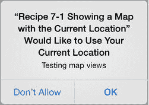

**图 7-3.** 应用请求访问位置的提示

如果你点击“允许”，但地图上没有显示你的位置，请通过选择 **调试** ➤ **位置** ➤ **高速公路行驶** 选项，启动模拟器中的一个位置调试服务。这会启动模拟器上的位置模拟服务，显示的地图应该会平移到新位置。因为你选择了高速公路行驶，你会看到位置在移动，就像你正在苹果公司附近的加利福尼亚州开车一样。当然，如果需要，你可以选择其他位置模拟。更多信息，请参见第 4 章中的“测试位置更新”。

### 用户控制的跟踪

如果用户尝试手动平移地图，他们可能会遇到一个问题，即用户位置跟踪停止。Apple 提供了一个名为 `MKUserTrackingBarButtonItem` 的 `UIBarButtonItem` 类。此按钮可以添加到任何 `UIToolBar` 或 `UINavigationbar` 中，并用于切换指定地图视图上的用户跟踪模式。

要进行设置，需要向用户界面添加一个工具栏。同时选中地图视图和位置标签，通过选择 **解决自动布局问题** 菜单中的“清除约束”来清除自动布局约束。在选中工具栏、标签和地图视图的情况下，从同一菜单中选择“添加缺少的约束”。然后创建一个名为 `mapToolbar` 的 outlet 来引用该工具栏。

删除默认添加到工具栏中的按钮，因为你不需要它。稍后你将通过编程方式添加一个按钮，但现在您的用户界面应类似于图 7-4。

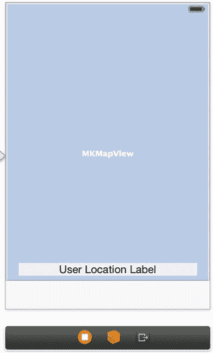

**图 7-4.** 在视图底部添加工具栏

现在，你将在代码中添加 `MKUserTrackingBarButtonItem`。切换到视图控制器的实现文件，滚动到 `viewDidLoad` 方法。将代码清单 7-9 中的代码添加到该方法的末尾。

**代码清单 7-9.** 将 `MKUserTrackingBarButtonItem` 添加到 `viewDidLoad` 方法

```
// 添加用于控制用户位置跟踪的按钮
MKUserTrackingBarButtonItem *trackingButton =
    [[MKUserTrackingBarButtonItem alloc] initWithMapView:self.mapView];
[self.mapToolbar setItems: [NSArray arrayWithObject: trackingButton] animated:YES];
```

通过这一新增功能，用户可以手动平移地图，并通过点击新的工具栏按钮恢复跟踪位置。图 7-5 演示了你已实现的用户跟踪功能。

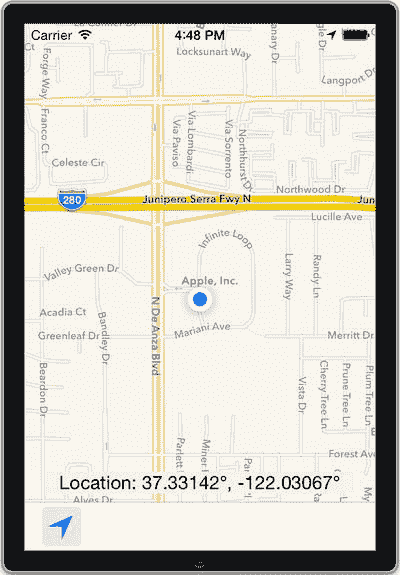

**图 7-5.** 具有平移和用户跟踪功能的模拟应用


## 配方 7-2：用图钉标记位置

地图的常见用途不仅在于标记当前所在位置和目的地，还能标记沿途的各种兴趣点。在 iOS 中，地图上这些高亮的点被称为标注（annotations）。默认情况下，标注看起来像图钉。本配方将展示如何将它们添加到地图上。

在本配方中，你将构建一个与配方 7-1 中类似的应用程序。请按照以下步骤设置应用：

- 创建一个新的单视图应用项目。
- 将 Map Kit 框架添加到项目中。
- 将 Core Location 框架添加到项目中。在本配方中，你不会使用定位服务，因此无需提供位置使用描述。不过，你仍需链接该框架，否则后续构建时会出现链接器错误。
- 从对象库中向应用的主视图添加一个地图视图。
- 在 `viewController.h` 文件中为地图视图创建一个输出口（outlet）。将输出口命名为 `mapView`。
- 导入 MapKit 框架，并使你的视图控制器类遵循 `MKMapViewDelegate` 协议。视图控制器的头文件现在应类似清单 7-10，其中本步骤的改动以粗体显示。

**清单 7-10.** 完整的 `ViewController.h` 文件

```
//
//  ViewController.h
//  Recipe 7-2 Marking Locations wiht Pins
//

#import <UIKit/UIKit.h>
#import <MapKit/MapKit.h>
#import <CoreLocation/CoreLocation.h>

@interface ViewController : UIViewController <MKMapViewDelegate>

@property (weak, nonatomic) IBOutlet MKMapView *mapView;

@end
```

最后，在视图控制器的 `viewDidLoad` 方法中初始化地图视图的委托属性，如清单 7-11 所示。

**清单 7-11.** 初始化 `mapView` 的委托属性

```
- (void)viewDidLoad
{
    [super viewDidLoad];
        // Do any additional setup after loading the view, typically from a nib.
    self.mapView.delegate = self;
}
```

你的应用已设置完成，在继续之前，建议构建并运行应用，确保一切正常。

### 添加标注对象

在地图上显示标注时涉及两个对象：标注对象和标注视图。标注视图的职责是绘制标注。标注视图会获得一个绘图上下文和一个标注对象，该对象保存与标注相关的数据。在最简单的形式中，标注对象包含一个标题和一个坐标。

要创建标注对象，你可以使用内置的 `MKPointAnnotation` 类，该类包含了标题、副标题和位置属性。然后，你只需使用地图视图的 `addAnnotation:` 或 `addAnnotations:` 方法将标注添加到地图视图中即可。

让我们向地图视图添加几个标注。将清单 7-12 中的代码添加到 `viewDidLoad` 方法中。

**清单 7-12.** 在 `viewDidLoad` 方法中创建标注

```
- (void)viewDidLoad
{
    [super viewDidLoad];
        // Do any additional setup after loading the view, typically from a nib.
    self.mapView.delegate = self;

    MKPointAnnotation *annotation1 = [[MKPointAnnotation alloc] init];
    annotation1.title = @"Miami";
    annotation1.subtitle = @"Annotation 1";
    annotation1.coordinate = CLLocationCoordinate2DMake(25.802, -80.132);

    MKPointAnnotation *annotation2 = [[MKPointAnnotation alloc] init];
    annotation2.title = @"Denver";
    annotation2.subtitle = @"Annotation 2";
    annotation2.coordinate = CLLocationCoordinate2DMake(39.733, -105.018);

    [self.mapView addAnnotation:annotation1];
    [self.mapView addAnnotation:annotation2];
}
```

我们选择让图钉落在迈阿密和丹佛，但任何坐标都同样有效。如果你现在运行这个应用，你会看到地图上插着两个图钉，如图 7-6 所示。你可能需要缩小视图才能看到它们；在模拟器中，可以按住 Alt (⌥) 模拟捏合手势，并从屏幕中间向外拖动。

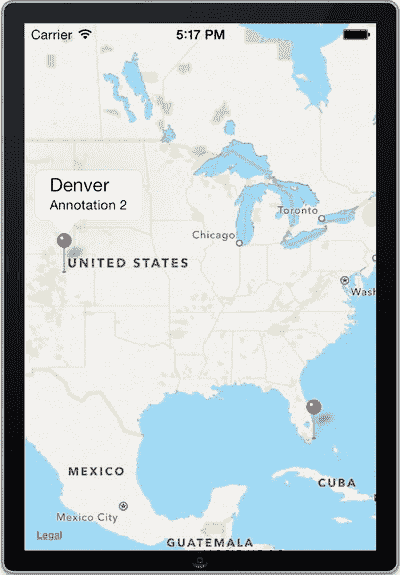

**图 7-6.** 带有地图和图钉的应用

在本节开头，我们提到显示标注需要两个对象。你可能在想第二个对象——标注视图去了哪里。我们还没有创建它，但标注对象仍然显示在地图上。原因在于，如果你没有提供标注视图，框架会自动创建 `MKPinAnnotationView` 类的实例，并将其用作标注视图。在下一节中，我们将创建一个标注视图。


### 更改图钉颜色

默认的标注视图在地图上以红色图钉显示您的标注。通常，红色表示目的地位置。`MKPinAnnotationView` 的其他两种可能的图钉颜色是绿色（表示起点）和紫色（表示用户定义点）。如果您希望图钉使用红色以外的颜色，则需要自行创建视图，这可以在 `mapView:viewForAnnotation:` 委托方法中完成。

让我们将标注的图钉颜色改为紫色。首先，在您的视图控制器中添加 `mapView:viewForAnnotation:` 方法，如列表 7-13 所示。

**列表 7-13.** 实现 `mapView:viewForAnnotation:` 方法

```
- (MKAnnotationView *)mapView:(MKMapView *)mapViewviewForAnnotation:(id<MKAnnotation>)annotation

{

    // 返回 nil 将使用默认的标注视图

    return nil;

}
```

地图视图会将其当前范围内的所有标注发送到 `mapView:viewForAnnotation:` 方法，以获取用于绘制的标注视图。用户位置作为一种特殊类型的标注，也会被发送到此方法，因此您需要确保提供的标注是您期望的类型。将列表 7-14 中的粗体代码添加到 `mapView:viewForAnnotation:` 方法中以检查这一点。

**列表 7-14.** 检查正确的标注类型

```
- (MKAnnotationView *)mapView:(MKMapView *)mapViewviewForAnnotation:(id<MKAnnotation>)annotation

{

    // 不要为用户位置标注创建标注视图

    if ([annotation isKindOfClass:[MKPointAnnotation class]])

    {

        // 在这里创建并返回我们自己的标注视图

    }

    // 返回 nil 将使用默认的标注视图

    return nil;

}
```

为了尽量减少所需的标注视图数量，地图视图提供了一种通过缓存来重复使用标注视图的方法。列表 7-15 中显示的缓存视图代码，与用于创建表格视图单元格的代码非常相似（参见第 4 章）。

**列表 7-15.** 在 `mapView:viewForAnnotation:` 方法中添加缓存标注视图的代码

```
- (MKAnnotationView *)mapView:(MKMapView *)mapView viewForAnnotation:(id<MKAnnotation>)annotation

{

    // 不要为用户位置标注创建标注视图

    if ([annotation isKindOfClass:[MKPointAnnotation class]])

    {

        static NSString *userPinAnnotationId = @"userPinAnnotation";

        // 创建一个标注视图，但如果可用则重复使用已缓存的视图

        MKPinAnnotationView *annotationView =

           (MKPinAnnotationView *)[self.mapView

           dequeueReusableAnnotationViewWithIdentifier:userPinAnnotationId];

        if(annotationView)

        {

            // 找到了缓存视图。它将设置图钉颜色，但未设置标注。

            annotationView.annotation = annotation;

        }

        else

        {

            // 没有可用的缓存视图，创建一个新的

            annotationView = [[MKPinAnnotationView alloc] initWithAnnotation:annotation

                              reuseIdentifier:userPinAnnotationId];

            // 紫色表示用户定义的图钉

            annotationView.pinColor = MKPinAnnotationColorPurple;

        }

        return annotationView;

    }

    return nil;

}
```

**注意：** 您创建的每种类型的标注视图，其标识符字符串都应不同。例如，绘制红色图钉的标注视图应与绘制紫色图钉的标注视图具有不同的 ID。否则，当您从缓存中检索视图时，可能会遇到意外行为。

如果现在构建并运行，您应该会看到与图 7-5 中相同的图钉，但它们将是紫色而非红色。除了更改图钉颜色，还可以做更多事情来自定义标注。这是方案 7-3 的主题。

## 方案 7-3：创建自定义标注

大多数时候，默认的 `MKPinAnnotationView` 对象非常有用，但您可能有时会希望使用不同的图像而不是图钉来表示地图上的标注。同样，当用户点击您的标注时，您可能希望显示更实用、更吸引人的标注气泡。要创建自定义标注视图，您需要对 `MKAnnotationView` 类进行子类化。使用方案 7-3，您还将创建一个自定义标注对象来保存附加数据以及一个详细视图，该视图在用户点击您的标注气泡时显示。

### 设置应用程序

要设置应用程序，您首先必须像之前的方案那样创建您的项目。按照以下步骤设置您的应用程序骨架：

1. 创建一个新的单视图应用程序项目。
2. 将 Map Kit 框架添加到项目中。
3. 将 Core Location 框架添加到项目中。在本方案中，您不会使用定位服务，因此无需提供位置使用说明。但您仍然需要链接该框架，否则在后续构建时会出现链接器错误。
4. 从对象库中向应用程序的主视图添加一个地图视图。
5. 创建一个用于从对象库引用地图视图的插座变量。将插座变量命名为 `mapView`。
6. 在 `ViewController.h` 中导入 Map Kit API。
7. 导入 MapKit 框架并使您的视图控制器类遵循 `MKMapViewDelegate` 协议。视图控制器的头文件现在应如列表 7-16 所示，其中此步骤的更改以粗体显示。

**列表 7-16.** 完成后的 `ViewController.h` 文件

```
//
//  ViewController.h
//  方案 7-3 创建自定义标注
//

#import <UIKit/UIKit.h>
#import <MapKit/MapKit.h>

@interface ViewController : UIViewController <MKMapViewDelegate>

@property (weak, nonatomic) IBOutlet MKMapView *mapView;

@end
```

8. 最后，在视图控制器的 `viewDidLoad` 方法中初始化地图视图的委托属性。

```
- (void)viewDidLoad

{

    [super viewDidLoad];

        // 执行任何其他设置，通常从 nib 加载视图后进行

    self.mapView.delegate = self;

}
```

在进一步操作之前，您必须添加一张用来替代图钉的图像。对于方案 7-3，我们选择了一张小图像 `overlay.png`，如下面的图 7-7 所示。您可以从 Apress 网站本书页面提供的源代码下载中获取此图像。当然，您也可以选择任何您喜欢的图像。

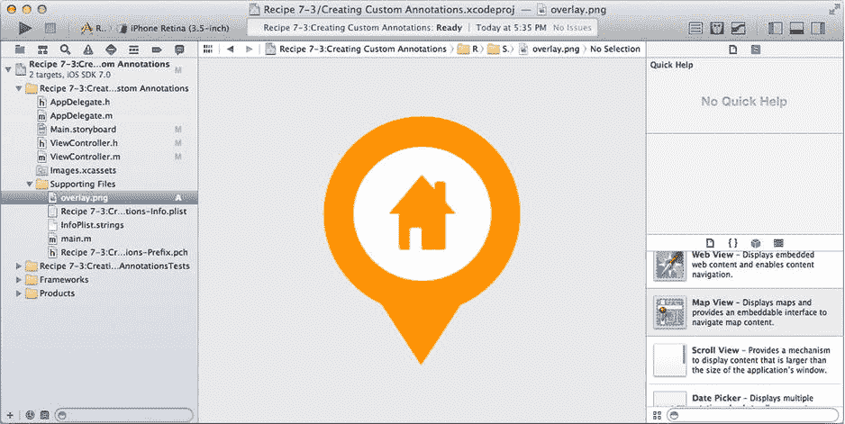

**图 7-7.** 添加到项目中的自定义标注图像

该图像对于地图使用来说有点大，稍后您会对其进行缩放。但是，在实际场景中，您应该在将图像添加到项目之前，将其缩放到标注的大小。这样，由于应用程序在运行时无需进行缩放，可以节省一些空间和时钟周期。


### 创建自定义标注类

下一步是创建你的自定义标注类。使用内置的 `Objective-C` 类模板创建一个 `MKPointAnnotation` 的新子类。将这个新类命名为 `MyAnnotation`。

`MKPointAnnotation` 已经包含了标题和副标题的属性，因此你无需在类中声明它们。然而，为了向你展示如何将自定义数据附加到标注对象上，你将通过添加一个额外的属性来扩展该类，以保存联系信息。你还会添加一个指定的初始化方法，将所有标注设置代码集中在一起。现在对 `MyAnnotation.h` 进行修改，如代码清单 7-17 所示。

**代码清单 7-17.** 向 `MyAnnotation.h` 文件添加自定义初始化方法和联系信息属性

```
//
//  MyAnnotation.h
//  Recipe 7-3 Customizing Annotations
//

#import <MapKit/MapKit.h>

@interface MyAnnotation : MKPointAnnotation

@property (nonatomic, strong) NSString *contactInformation;

-(id)initWithCoordinate:(CLLocationCoordinate2D)coord title:(NSString *)title subtitle:(NSString *)subtitle contactInformation:(NSString *)contactInfo;

@end
```

代码清单 7-18 展示了 `MyAnnotation.m` 中相应的修改。

**代码清单 7-18.** 实现自定义初始化方法并设置属性

```
//
//  MyAnnotation.m
//  Recipe 7-3 Creating Custom Annotations
//

#import "MyAnnotation.h"

@implementation MyAnnotation

-(id)initWithCoordinate:(CLLocationCoordinate2D)coord title:(NSString *)title subtitle:(NSString *)subtitle contactInformation:(NSString *)contactInfo

{
    self = [super init];
    if (self)
    {
        self.coordinate = coord;
        self.title = title;
        self.subtitle = subtitle;
        self.contactInformation = contactInfo;
    }

    return self;
}

@end
```

### 创建自定义标注视图

现在你可以继续创建自定义标注视图了。与之前一样，创建一个新的 `Objective-C` 类，这次命名为 `MyAnnotationView`，并以 `MKAnnotationView` 作为父类。

在自定义标注视图类中，你只需要重写 `initWithAnnotation:reuseIdentifier:` 方法。所有的定制工作都在这里完成。但在我们继续之前，先快速浏览一下 `MyAnnotationView.m` 中自动生成的代码，如代码清单 7-19 所示。

**代码清单 7-19.** `MyAnnotationView.m` 中自动生成的代码

```
// ...
@implementation MyAnnotationView

- (id)initWithFrame:(CGRect)frame
{
// ...
}

/*
// Only override drawRect: if you perform custom drawing.
// An empty implementation adversely affects performance during animation.
- (void)drawRect:(CGRect)rect
{
// Drawing code
}
*/

@end
```

Xcode 已经为你的类添加了一个 `initWithFrame:` 方法。你并不需要它，可以随意将其移除。为了方便起见，Xcode 还添加了 `drawRect:` 方法，但已将其注释掉。`drawRect:` 方法很有趣，因为它提供了完全控制标注绘制方式的能力。在本教程中我们不会使用它，因此你也可以将其移除。

添加代码清单 7-20 中的代码，替换掉先前提供的代码。这段代码创建了自定义标注图像，用以替代图钉。同时，标注视图的框架被调整为 40x40 点，图像按此尺寸缩小。

**代码清单 7-20.** 添加了自定义初始化方法的 `MyAnnotationView`

```
//
//  MyAnnotationView.m
//  Recipe 7-3 Creating Custom Annotations
//

#import "MyAnnotationView.h"

@implementation MyAnnotationView

- (id)initWithAnnotation:(id <MKAnnotation>)annotation
reuseIdentifier:(NSString *)reuseIdentifier

{
self = [super initWithAnnotation:annotation reuseIdentifier:reuseIdentifier];
if (self)
{
UIImage *myImage = [UIImage imageNamed:@"overlay.png"];
self.image = myImage;
self.frame = CGRectMake(0, 0, 40, 40);

// 使用 contentMode 确保图像的最佳缩放
self.contentMode = UIViewContentModeScaleAspectFill;

// 使用 centerOffset 调整图像的位置
self.centerOffset = CGPointMake(0, -20);
}

return self;
}

@end
```

如有必要，你还可以使用 `centerOffset` 属性调整图像相对于坐标的位置。当你使用的图像有一个特定的点（例如图钉或箭头）需要精确对准坐标时，这一功能尤其有用。如代码清单 7-20 所示，本示例中使用 `CGMake(0, -20)` 创建了一个偏移量，将图像的相对位置上移了 20 点。这对于将图像的尖端点对齐到坐标点是必需的。

现在你的自定义类已经全部设置完毕，可以返回视图控制器来实现地图的委托方法了（代码清单 7-21）。你可能会发现其中大部分内容与之前的教程很相似。主要的区别在于，你不再创建 `MKPinAnnotationView` 的实例，而是创建自定义 `MyAnnotationView` 类的实例。

**代码清单 7-21.** 实现地图委托方法

```
//
//  ViewController.m
//  Recipe 7-3 Creating Custom Annotations
//

#import "ViewController.h"
#import "MyAnnotation.h"
#import "MyAnnotationView.h"

// ...
@implementation ViewController

// ...
- (MKAnnotationView *)mapView:(MKMapView *)mapView viewForAnnotation:(id<MKAnnotation>)annotation

{
// 不要为用户位置标注创建标注视图
if ([annotation isKindOfClass:[MyAnnotation class]])
{
static NSString *myAnnotationId = @"myAnnotation";

// 创建一个标注视图，但如果存在缓存的可复用视图则复用
MyAnnotationView *annotationView =
(MyAnnotationView *)[self.mapView
dequeueReusableAnnotationViewWithIdentifier:myAnnotationId];

if(annotationView)
{
// 找到缓存视图，将其与标注关联
annotationView.annotation = annotation;
}
else
{
// 没有可用的缓存视图，创建一个新的
annotationView = [[MyAnnotationView alloc] initWithAnnotation:annotation
reuseIdentifier:myAnnotationId];
}

return annotationView;
}

// 为用户位置标注使用默认标注视图
return nil;
}

@end
```

最后，你只需要一些测试数据来运行它。在 `viewDidLoad` 方法中，添加代码清单 7-22 中加粗的行，以创建几个标注并将它们添加到地图中。

**代码清单 7-22.** 创建一些测试数据

```
@implementation ViewController

// ...
- (void)viewDidLoad

{
[super viewDidLoad];

// Do any additional setup after loading the view, typically from a nib.
self.mapView.delegate = self;

MyAnnotation *ann1 = [[MyAnnotation alloc]
initWithCoordinate: CLLocationCoordinate2DMake(37.68, -97.33)
title: @"Company 1"
subtitle: @"Something Catchy"
contactInformation: @"Call 555-123456"];

MyAnnotation *ann2 = [[MyAnnotation alloc]
initWithCoordinate:CLLocationCoordinate2DMake(41.500, -81.695)
title:@"Company 2"
subtitle:@"Even More Catchy"
contactInformation:@"Call 555-654321"];

NSArray *annotations = [NSArray arrayWithObjects: ann1, ann2, nil];
[self.mapView addAnnotations:annotations];
}

// ...
@end
```

此时，当你运行应用程序时，应该会看到你的两个标注出现在地图上，并带有你的图像（缩小到合理尺寸），分别位于堪萨斯州威奇托和俄亥俄州克利夫兰。图 7-8 提供了此应用的模拟效果。

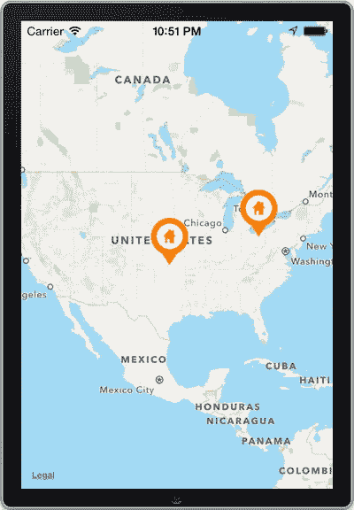

**图 7-8.** 带地图和自定义标注的应用程序


### 自定义标注气泡

现在，你将添加几行代码来自定义标注气泡。首先，你将在标注标题和副标题的左侧放置一张图片。这是通过使用 `annotationView` 的 `leftCalloutAccessoryView` 属性实现的。你还需要在标注气泡的右侧添加一个附属按钮，稍后将用它来显示标注的详细信息视图。

回到 `MyAnnotationView.m` 文件，使用清单 7-23 中的代码扩展 `initWithAnnotation:reuseidentifier:` 方法。

**清单 7-23. 在自定义初始化器中修改注释视图**

```
- (id)initWithAnnotation:(id <MKAnnotation>)annotation
reuseIdentifier:(NSString *)reuseIdentifier
{
    self = [super initWithAnnotation:annotation reuseIdentifier:reuseIdentifier];
    if (self)
    {
        UIImage *myImage = [UIImage imageNamed:@"overlay.png"];
        self.image = myImage;
        self.frame = CGRectMake(0, 0, 40, 40);
        //使用 contentMode 确保图片最佳缩放
        self.contentMode = UIViewContentModeScaleAspectFill;
        //使用 centerOffset 调整图片位置
        self.centerOffset = CGPointMake(1, 1);
        self.canShowCallout = YES;
        // 左侧标注附属视图
        UIImageView *leftAccessoryView = [[UIImageView alloc] initWithImage:myImage];
        leftAccessoryView.frame = CGRectMake(0, 0, 20, 20);
        leftAccessoryView.contentMode = UIViewContentModeScaleAspectFill;
        self.leftCalloutAccessoryView = leftAccessoryView;
        // 右侧标注附属视图
        self.rightCalloutAccessoryView =
            [UIButton buttonWithType:UIButtonTypeDetailDisclosure];
    }
    return self;
}
```

如你所见，我们复用了标注图片，但将其包装到图片视图中以缩小尺寸，这次缩小至 20x20 点。

如果你现在构建并运行应用，你的标注将会显示出类似图 7-9 所示的标注气泡。

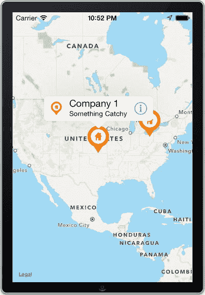

**图 7-9. 带有自定义标注的地图，其中一个正在显示标注气泡**

### 添加详细视图

至此，你的标注气泡在视觉上已设置完毕，但标注气泡内的按钮还有巨大的潜力尚未挖掘。大多数基于地图的应用，如果在其标注气泡上使用按钮，通常会利用该按钮将另一个视图控制器推送到屏幕上。一个专注于在地图上显示特定商家位置的应用，可能会允许用户查看某个特定地点的所有详细信息或图片。在 Apple 地图应用中，当你选择通过地图搜索提供的某个商家时，可以观察到类似的行为。点击信息按钮会显示该商家的详细信息，例如地址和评级。

为了增强功能，你将实现地图的另一个委托方法 `mapView:annotationView:calloutAccessoryControlTapped:`，并让它呈现一个模态视图控制器。在本教程中，我们将让它只显示特定标注的标题、副标题和联系信息文本。

在本示例中，我们将混合使用 Storyboard 和 `.xib` 视图文件。首先，创建一个新类。将新类命名为 `DetailedViewController`，并确保它是 `UIViewController` 的子类。在文件选项界面上，选择“With XIB for user interface”选项。这将创建一个新类，并且一个同名的 `.xib` 文件将随之出现。

从项目导航器中选择 `DetailedViewController` 的 `.xib` 文件，并向提供的视图中添加三个标签。将它们放置在视图底部附近，如图 7-10 所示。

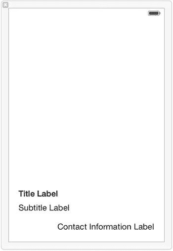

**图 7-10. DetailedViewController.xib 视图**

现在，为这三个标签创建输出口。分别将它们命名为 `titleLabel`、`subtitleLabel` 和 `contactInformationLabel`。同时，按清单 7-24 所示对头文件进行补充。

**清单 7-24. DetailedViewController.h 实现**

```
//
//  DetailedViewController.h
//  Recipe 7-3 Creating Custom Annotations
//

#import <UIKit/UIKit.h>
#import "MyAnnotation.h"

@interface DetailedViewController : UIViewController

@property (weak, nonatomic) IBOutlet UILabel *titleLabel;
@property (weak, nonatomic) IBOutlet UILabel *subtitleLabel;
@property (weak, nonatomic) IBOutlet UILabel *contactInformationLabel;
@property (strong, nonatomic) MyAnnotation *annotation;

-(id)initWithAnnotation:(MyAnnotation *)annotation;

@end
```

在 `DetailedViewController.m` 文件中，首先移除 Xcode 添加到类中的 `initWithNibName:bundle:` 方法。然后，按清单 7-25 所示，实现你之前声明的 `initWithAnnotation:` 方法。

**清单 7-25. 在 DetailViewController.m 文件中实现自定义初始化器**

```
//
//  DetailedViewController.m
//  Recipe 7-3 Creating Custom Annotations
//

// ...

@implementation DetailedViewController

// ...

-(id)initWithAnnotation:(MyAnnotation *)annotation
{
    self = [super init];
    if (self)
    {
        self.annotation = annotation;
    }
    return self;
}

// ...

@end
```

在详细视图控制器的 `viewDidLoad` 方法中，添加代码以便用存储的标注对象中的文本来初始化标签，如清单 7-26 所示。

**清单 7-26. viewDidLoad 实现**

```
- (void)viewDidLoad
{
    [super viewDidLoad];
    // 从 nib 文件加载视图后的任何其他设置
    self.titleLabel.text = self.annotation.title;
    self.subtitleLabel.text = self.annotation.subtitle;
    self.contactInformationLabel.text = self.annotation.contactInformation;
}
```

最后，你已准备好返回主视图控制器实现地图的委托方法。在此方法中，你将创建并呈现 `DetailedViewController`。在本教程中，我们选择了部分卷曲过渡效果，这是一个非常酷的效果。清单 7-27 展示了如何设置。别忘了在 `ViewController.m` 类中导入 `DetailedViewController`。

**清单 7-27. 实现 mapView:annotationView:calloutAccessoryControlTapped: 方法**

```
#import "ViewController.h"
#import "MyAnnotation.h"
#import "MyAnnotationView.h"
#import "DetailedViewController.h"

@interface ViewController ()

//...

-(void)mapView:(MKMapView *)mapView annotationView:(MKAnnotationView *)view calloutAccessoryControlTapped:(UIControl *)control
{
    DetailedViewController *dvc = [[DetailedViewController alloc]
        initWithAnnotation:view.annotation];
    dvc.modalTransitionStyle = UIModalTransitionStylePartialCurl;
    [self presentViewController:dvc animated:YES completion:^{}];
}

@end
```

至此，配方 7-3 完成。当你点击某个自定义标注气泡中的详情披露按钮时，你的应用应该类似于图 7-11 所示。

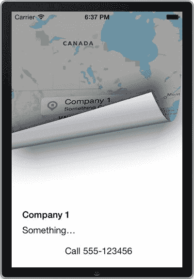

**图 7-11. 应用响应标注气泡的点击**


## 配方 7-4：拖拽图钉

通过本配方，你将制作一个小工具，能够在地图上拖拽图钉，并从控制台读取其位置。

首先，像之前的配方一样创建一个新的地图应用。步骤如下：

- 创建一个新的单视图应用项目。
- 将 Map Kit 框架添加到项目中。
- 将 Core Location 框架添加到项目中。
- 将地图视图添加到应用的主视图中。
- 创建一个用于引用地图视图的出口。将该出口命名为“`mapView`”。
- 导入`MapKit`框架，并使你的视图控制器类遵循`MKMapViewDelegate`协议。视图控制器的头文件现在应如列表 7-28 所示。

**列表 7-28. 完成的 `ViewController.h` 文件**

```
//
//  ViewController.h
//  Recipe 7-4 Dragging a Pin
//

#import <UIKit/UIKit.h>
#import <MapKit/MapKit.h>

@interface ViewController : UIViewController <MKMapViewDelegate>

@property (weak, nonatomic) IBOutlet MKMapView *mapView;

@end
```

最后，在视图控制器的 `viewDidLoad` 方法中初始化地图视图的委托属性，如列表 7-29 所示。

**列表 7-29. 在 `viewDidLoad` 方法中初始化委托属性**

```
- (void)viewDidLoad
{
    [super viewDidLoad];
        // 加载视图后执行任何额外设置，通常来自 nib 文件。
    self.mapView.delegate = self;
}
```

### 添加可拖拽的图钉

你将制作一个非常简单的工具，地图上只有一个图钉，用户可以拖拽它。让我们从修改 `viewDidLoad` 方法开始，在应用加载主视图时将图钉放置在地图上，如列表 7-30 所示。

**列表 7-30. 应用加载时在地图上放置图钉**

```
- (void)viewDidLoad
{
    [super viewDidLoad];
        // 加载视图后执行任何额外设置，通常来自 nib 文件。
    self.mapView.delegate = self;

    MKPointAnnotation *annotation = [[MKPointAnnotation alloc] init];
    annotation.coordinate = CLLocationCoordinate2DMake(39.303, -76.612);
    [self.mapView addAnnotation:annotation];
}
```

我们把图钉放在了丹佛，但很快你就能用这个工具将它替换成你自己的坐标。但首先你需要让图钉可拖拽。为此，你需要自定义显示图钉的标注视图，如列表 7-31 所示。代码与配方 7-2 和 7-3 中使用的几乎相同，只是你现在设置了 `draggable` 属性。

**列表 7-31. `mapView:viewForAnnotation:` 方法的实现**

```
- (MKAnnotationView *)mapView:(MKMapView *)mapView viewForAnnotation:(id<MKAnnotation>)annotation
{
    // 不要为用户位置标注创建标注视图
    if ([annotation isKindOfClass:[MKPointAnnotation class]])
    {
        static NSString *draggableAnnotationId = @"draggableAnnotation";

        // 创建标注视图，但如果可用则重用已缓存的视图
        MKPinAnnotationView *annotationView =
        (MKPinAnnotationView *)[self.mapView
            dequeueReusableAnnotationViewWithIdentifier:draggableAnnotationId];
        if(annotationView)
        {
            // 找到缓存的视图，将其与标注关联
            annotationView.annotation = annotation;
        }
        else
        {
            // 没有可用的缓存视图；创建一个新的
            annotationView = [[MKPinAnnotationView alloc] initWithAnnotation:annotation
                reuseIdentifier:draggableAnnotationId];
            annotationView.pinColor = MKPinAnnotationColorPurple;
            annotationView.draggable = YES;
        }

        return annotationView;
    }

    // 为用户位置标注使用默认标注视图
    return nil;
}
```

如果你现在运行应用，可以将图钉从丹佛拖拽到你选择的任何其他位置。不过，让我们把这个炫酷但有点无用的应用变成一个工具。你将拦截用户放下图钉的动作，并将新位置输出到控制台。为此，你将使用 `mapView:annotationView:didChangeDragState:fromOldState:` 委托方法。这个方法名很长，但不言自明。将列表 7-32 添加到你的视图控制器中。

**列表 7-32. 实现用于检测图钉状态变化的委托**

```
-(void)mapView:(MKMapView *)mapView annotationView:(MKAnnotationView *)view didChangeDragState:(MKAnnotationViewDragState)newState fromOldState:(MKAnnotationViewDragState)oldState
{
    if (newState == MKAnnotationViewDragStateEnding)
    {
        MKPointAnnotation *annotation = view.annotation;
        NSLog(@"\nPin Location: %f, %f (Lat, Long)",
              annotation.coordinate.latitude, view.annotation.coordinate.longitude);
    }
}
```

在模拟器中运行应用，并将图钉拖拽到新位置。控制台现在会显示图钉的世界坐标，如图 7-12 所示。如果你想创建自己的位置测试数据，这个工具会非常有用。

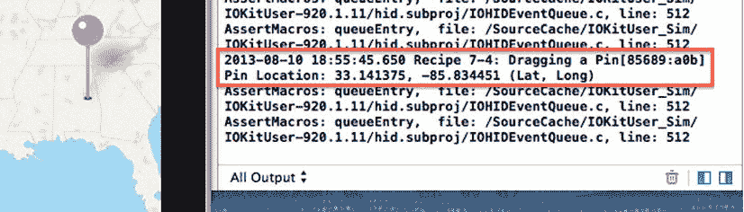

**图 7-12. 该工具将新的图钉位置打印到控制台**

几行代码就能做到这一点，还不错。接下来，我们继续在地图中添加覆盖层。

## 配方 7-5：向地图添加覆盖层

如之前的配方所示，标注是地图上的一个标记。由于标注与单个坐标关联，它们的大小始终保持不变，即使用户在地图上缩放也是如此。

本配方将介绍另一种地图标记类型，称为覆盖层。它们是圆形或多边形等形状，与标注不同，当地图缩放改变时，它们会随之缩放。

你将向你的 `MapView` 添加三种覆盖层：圆形、多边形和线条覆盖层。添加这些覆盖层的过程与添加标注非常相似，但这次你不会像在配方 7-3 中为标注创建自定义类那样为覆盖层创建自定义类。

再次从设置一个新的地图应用开始。我们相信你现在已经熟悉了这些步骤，但你仍然可以随时参考之前的配方以获得指导。


### 创建叠加层

同样，你需要在视图控制器的 `viewDidLoad` 方法中创建测试数据。首先，在墨西哥大部分地区上方创建一个圆形叠加层。将代码清单 7-33 添加到 `viewDidLoad` 方法中。

**代码清单 7-33 创建圆形叠加层**

```
CLLocationCoordinate2D mexicoCityLocation = CLLocationCoordinate2DMake(19.808, -98.965);

MKCircle *circleOverlay = [MKCircle circleWithCenterCoordinate:mexicoCityLocation

radius:500000];
```

接下来，创建一个多边形叠加层。请注意，多边形的起点和终点必须在同一位置。将代码清单 7-34 添加到 `viewDidLoad` 方法中。

**代码清单 7-34 创建多边形叠加层**

```
CLLocationCoordinate2D polyCoords[5] =

{

CLLocationCoordinate2DMake(39.9, -76.6),

CLLocationCoordinate2DMake(36.7, -84.0),

CLLocationCoordinate2DMake(33.1, -89.4),

CLLocationCoordinate2DMake(27.3, -80.8),

CLLocationCoordinate2DMake(39.9, -76.6)

};

MKPolygon *polygonOverlay = [MKPolygon polygonWithCoordinates:polyCoords count:5];
```

向 `viewDidLoad` 方法中添加一个线叠加层。代码清单 7-35 展示了这段代码。

**代码清单 7-35 创建线叠加层**

```
CLLocationCoordinate2D pathCoords[2] =

{

CLLocationCoordinate2DMake(46.8, -100.8),

CLLocationCoordinate2DMake(43.7, -70.4)

};

MKPolyline *pathOverlay = [MKPolyline polylineWithCoordinates:pathCoords count:2];
```

最后，将这三个叠加层添加到地图上。在 iOS 7 中，苹果为叠加层提供了一项新功能。现在你可以指定一个层级。对于叠加层，你有两种选择：它们要么绘制在道路之上，要么绘制在道路和标签之上。你可以分别使用属性 `MKOverlayLevelAboveRoads` 或 `MKOverlayLevelAboveLabels`。在我们的示例中，我们将把标签放在道路之上，以便文本更易阅读；换句话说，标签将位于叠加层之上。将代码清单 7-36 中的代码添加到 `viewDidLoad` 方法中以实现此功能。

**代码清单 7-36 将叠加层添加到地图的道路之上但标签之下**

```
[self.mapView addOverlays:[NSArray arrayWithObjects: circleOverlay, polygonOverlay, pathOverlay, nil]

level:MKOverlayLevelAboveRoads];
```

如果你此时构建并运行应用程序，你会看到一张地图，但你创建的所有叠加层都没有被添加。这是因为你还没有提供叠加层的视图对象。这需要在 `mapView:rendererForOverlay:` 委托方法中完成，你将把这个方法添加到视图控制器中。将代码清单 7-37 中的实现添加到视图控制器中。

**代码清单 7-37 实现 mapView:rendererForOverlay: 委托方法**

```
-(MKOverlayRenderer *)mapView:(MKMapView *)mapView rendererForOverlay:(id)overlay

{

if([overlay isKindOfClass:[MKCircle class]])

{

MKCircleRenderer *renderer = [[MKCircleRenderer alloc] initWithOverlay:overlay];

//显示设置

renderer.lineWidth = 1;

renderer.strokeColor = [UIColor blueColor];

renderer.fillColor = [[UIColor blueColor] colorWithAlphaComponent:0.5];

return renderer;

}

if([overlay isKindOfClass:[MKPolygon class]])

{

MKPolygonRenderer *renderer= [[MKPolygonRenderer alloc] initWithOverlay:overlay];

//显示设置

renderer.lineWidth=1;

renderer.strokeColor=[UIColor blueColor];

renderer.fillColor=[[UIColor blueColor] colorWithAlphaComponent:0.5];

return renderer;

}

else if ([overlay isKindOfClass:[MKPolyline class]])

{

MKPolylineRenderer *renderer = [[MKPolylineRenderer alloc] initWithOverlay:overlay];

//显示设置

renderer.lineWidth = 3;

renderer.strokeColor = [UIColor blueColor];

return renderer;

}

return nil;

}
```

从前面的代码可以看出，每种叠加层形状类型都有对应的叠加层视图类型，你使用它们来实例化视图对象。每个视图类都有类似的属性，用于自定义叠加层的外观，例如颜色和透明度（alpha）组件。

这个技巧到此就完成了。当你构建并运行应用程序时，应该会看到一个类似于图 7-13 所示的屏幕。

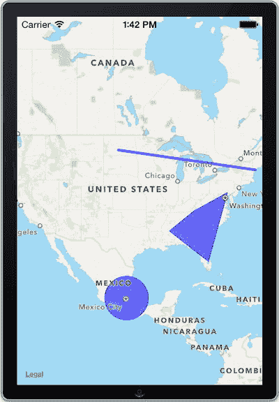

**图 7-13 一个包含圆形、多边形和线叠加层的应用程序**

## 技巧 7-6：动态分组标注

在将标注用于地图视图时，一个常见问题是有许多标注可能彼此非常接近，导致屏幕混乱，使应用程序难以使用。一种解决方案是基于可见地图的位置和大小对标注进行分组。技巧 7-6 采用一个简单的算法，当可见区域发生变化时，它会比较标注的位置，并临时移除那些与其他标注靠得太近的标注。

首先，你需要创建一个新的基于地图的应用程序项目。有关如何执行此操作的详细信息，请参考技巧 7-1。


### 图钉森林

首先，我们来创建测试数据：在地图中一个相对较小的区域内随机分布 1000 个图钉。首先，你需要几个实例变量：一个用于跟踪当前缩放级别，另一个是可变数组用于保存标注。请按照清单 7-38 中**加粗**显示的修改，更新你的 `ViewController.h` 文件。

**清单 7-38.** 添加了属性和实例变量的 `ViewController.h` 文件

```
//
//  ViewController.h
//  Recipe 7-6 Grouping Annotations Dynamically
//

#import <UIKit/UIKit.h>
#import <MapKit/MapKit.h>

@interface ViewController : UIViewController<MKMapViewDelegate>
{
    CLLocationDegrees _zoomLevel;
    NSMutableArray *_annotations;
}

@property (weak, nonatomic) IBOutlet MKMapView *mapView;

@end
```

现在切换到实现文件，并添加清单 7-39 中的代码来实例化 `_annotations` 数组。给该数组一个初始容量为 1000 个对象，因为你很快就要创建那么多标注了。

**清单 7-39.** 添加代码以实例化 `_annotations` 数组

```
- (void)viewDidLoad
{
    [super viewDidLoad];
    // Do any additional setup after loading the view, typically from a nib.
    self.mapView.delegate = self;
    _annotations = [[NSMutableArray alloc] initWithCapacity:1000];
}
```

接下来，创建一个自定义标注类。像往常一样，使用 `Objective-C` 类模板将文件添加到项目中。确保使用 `NSObject` 作为父类，并将新类命名为 `Hotspot`。

要 使这个新类成为标注类，需要让它遵循 `MKAnnotation` 协议。此外，为了方便使用新类实例化标注，添加一个初始化方法，该方法接受坐标、标题和副标题。头文件现在应该如清单 7-40 所示。

**清单 7-40.** 完成的 `Hotspot.h` 文件

```
//
//  Hotspot.h
//  Recipe 7-6 Grouping Annotations Dynamically
//

#import <Foundation/Foundation.h>
#import <MapKit/MapKit.h>

@interface Hotspot : NSObject <MKAnnotation>
{
    CLLocationCoordinate2D _coordinate;
    NSString *_title;
    NSString *_subtitle;
}

@property (nonatomic) CLLocationCoordinate2D coordinate;
@property (nonatomic, readonly, copy) NSString *title;
@property (nonatomic, readonly, copy) NSString *subtitle;

-(id)initWithCoordinate:(CLLocationCoordinate2D)coordinate title:(NSString *)title subtitle:(NSString *)subtitle;

@end
```

以及相应的实现，如清单 7-41 所示。

**清单 7-41.** `Hotspot.m` 文件的起始实现

```
//
//  Hotspot.m
//  Recipe 7-6 Grouping Annotations Dynamically
//

#import "Hotspot.h"

@implementation Hotspot

-(id)initWithCoordinate:(CLLocationCoordinate2D)coordinate
                 title:(NSString *)title subtitle:(NSString *)subtitle
{
    self = [super init];
    if (self) {
        self.coordinate = coordinate;
        self.title = title;
        self.subtitle = subtitle;
    }
    return self;
}

-(CLLocationCoordinate2D)coordinate
{
    return _coordinate;
}

-(void)setCoordinate:(CLLocationCoordinate2D)coordinate
{
    _coordinate = coordinate;
}

-(NSString *)title
{
    return _title;
}

-(void)setTitle:(NSString *)title
{
    _title = title;
}

-(NSString *)subtitle
{
    return _subtitle;
}

-(void)setSubtitle:(NSString *)subtitle
{
    _subtitle = subtitle;
}

@end
```

你还需要定义一些常量，用于设置起始坐标和分组参数。这些常量也将用于生成一些随机位置以进行演示。将清单 7-42 中的语句放在 `ViewController.m` 文件的导入语句之前。

**清单 7-42.** 常量定义

```
#define centerLat 39.7392
#define centerLong -104.9842
#define spanDeltaLat 4.9
#define spanDeltaLong 5.8
#define scaleLat 9.0
#define scaleLong 11.0
```

接下来，你需要一些测试数据。首先在 `ViewController.m` 文件的顶部导入 `Hotspot.h`（清单 7-43）。

**清单 7-43.** `Hotspot.h` 导入语句

```
#import "Hotspot.h"
```

清单 7-44 展示了两个方法，用于生成 1000 个热点供你使用，所有这些热点彼此之间距离非常近，以便你了解要处理的问题。将这些方法添加到视图控制器中。

**清单 7-44.** 生成 1000 个热点的 方法

```
-(float)randomFloatFrom:(float)a to:(float)b
{
    float random = ((float) rand()) / (float) RAND_MAX;
    float diff = b - a;
    float r = random * diff;
    return a + r;
}

-(void)generateAnnotations
{
    srand((unsigned)time(0));
    for (int i=0; i<1000; i++)
    {
        CLLocationCoordinate2D randomLocation = 
            CLLocationCoordinate2DMake(
                [self randomFloatFrom:37.0 to:42.0],
                [self randomFloatFrom:-103.0 to:-107.0]            );
        Hotspot *place = [
            [Hotspot alloc]
                initWithCoordinate:randomLocation
                title: [NSString stringWithFormat:@"Place %d title", i]
                subtitle: [NSString stringWithFormat:@"Place %d subtitle", i]
        ];
        [_annotations addObject:place];
    }
}
```

现在你有了生成测试数据的方法，接下来要确保在 `viewDidLoad` 方法中调用它，然后将标注添加到地图上并调整其区域以显示所有标注。清单 7-45 展示了实现此目的所需的代码。

**清单 7-45.** 更新 `viewDidLoad` 方法以调用新方法并添加标注

```
- (void)viewDidLoad
{
    [super viewDidLoad];
    // Do any additional setup after loading the view, typically from a nib.
    self.mapView.delegate = self;
    _annotations = [[NSMutableArray alloc] initWithCapacity:1000];
    [self generateAnnotations];

    // 下面这行仅用于设置目的。实现分组后就不需要了。
    [self.mapView addAnnotations:_annotations];

    CLLocationCoordinate2D centerPoint = {centerLat, centerLong};
    MKCoordinateSpan coordinateSpan = MKCoordinateSpanMake(spanDeltaLat, spanDeltaLong);
    MKCoordinateRegion coordinateRegion = 
        MKCoordinateRegionMake(centerPoint, coordinateSpan);
    [self.mapView setRegion:coordinateRegion];
    [self.mapView regionThatFits:coordinateRegion];
}
```

最后，你需要实现地图的 `viewForAnnotation` 方法，以便正确显示图钉。清单 7-46 与之前菜谱中使用的方法类似。

**清单 7-46.** 实现 `mapView:viewForAnnotation:` 方法

```
- (MKAnnotationView *)mapView:(MKMapView *)mapView viewForAnnotation:(id <MKAnnotation>)annotation
{
    // 如果是用户位置，直接返回 nil。
    if ([annotation isKindOfClass:[MKUserLocation class]])
        return nil;
    else
    {
        static NSString *startPinId = @"StartPinIdentifier";
        MKPinAnnotationView *startPin = 
            (id)[mapView dequeueReusableAnnotationViewWithIdentifier:startPinId];
        if (startPin == nil)
        {
            startPin = [[MKPinAnnotationView alloc]
                          initWithAnnotation:annotation
                          reuseIdentifier:startPinId];
            startPin.canShowCallout = YES;
            startPin.animatesDrop = YES;
        }
        return startPin;
    }
}
```

此时，如果运行应用程序，你应该会看到一个类似于图 7-14 的视图，这很好地说明了你要解决的问题。

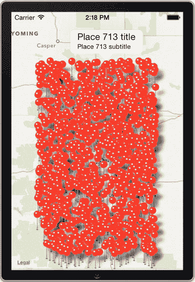

**图 7-14.** 标注过多 的地图


### 实现解决方案

为了正确遍历注释并将其分组，您需要逐一检查每个引脚，并确定如何放置它。如果它与已放置的另一个引脚接近，它将被视为“已找到”，并从地图中移除。如果不是，则将其添加到地图中已有引脚的列表，并将其作为注释添加到地图本身。清单 7-47 中的方法提供了一种高效的实现，应放置在您的视图控制器的 `.m` 文件中。

**清单 7-47.** 遍历注释并分组的方法

```
-(void)group:(NSArray *)annotations
{
    float latDelta = self.mapView.region.span.latitudeDelta / scaleLat;
    float longDelta = self.mapView.region.span.longitudeDelta / scaleLong;
    NSMutableArray *visibleAnnotations = [[NSMutableArray alloc] initWithCapacity:0];
    for (Hotspot *current in annotations)
    {
        CLLocationDegrees lat = current.coordinate.latitude;
        CLLocationDegrees longi = current.coordinate.longitude;
        bool found = FALSE;
        for (Hotspot *temp in visibleAnnotations)
        {
            if(fabs(temp.coordinate.latitude - lat) < latDelta &&
               fabs(temp.coordinate.longitude - longi) < longDelta)
            {
                [self.mapView removeAnnotation:current];
                found = TRUE;
                break;
            }
        }
        if (!found)
        {
            [visibleAnnotations addObject:current];
            [self.mapView addAnnotation:current];
        }
    }
}
```

> **注意：** 在此方法中，您使用了 `fabs` 函数。这与 `abs` 函数不同，它专门用于浮点数。在此处使用 `abs` 函数会导致仅在坐标的整数级别上进行分组，您的应用程序将无法正常工作。

接下来，您需要处理每当地图可见区域发生变化时重新分组点的问题。通过实现清单 7-48 所示的委托方法，这非常容易做到。

**清单 7-48.** 实现 `mapView:regionDidChangeAnimated:` 委托方法

```
-(void)mapView:(MKMapView *)mapView regionDidChangeAnimated:(BOOL)animated
{
    if (_zoomLevel != mapView.region.span.longitudeDelta)
    {
        [self group:_annotations];
        _zoomLevel = mapView.region.span.longitudeDelta;
    }
}
```

> **注意：** 实现这些方法时，请确保任何使用 `-group:` 方法的方法都位于其后实现，否则编译器会报错。解决此问题的另一种方法是在头文件或私有的 `@interface` 部分中直接声明 `(void)group(NSArray *)annotations` 方法。

现在，您可以从 `viewDidLoad` 方法中移除以下代码行，因为其功能将由 `group:` 方法执行：

```
[self.mapView addAnnotations:_annotations];
```

您无需在 `viewDidLoad` 方法末尾调用 `group:` 方法，因为当地图首次显示时，您的委托方法 `-mapView:regionDidChangeAnimated:` 会被自动调用，并执行初始分组。

现在运行应用程序，您应该会看到地图上标记的注释明显减少，且分布相对均匀，如图 7-15 所示。当放大或缩小时，您可以看到注释随着地图的变化而分别出现或消失。

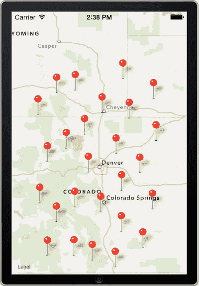

**图 7-15.** 按位置分组的注释

### 添加颜色编码

此时，您的注释已正确分组，但出现了一个新问题：您无法轻易判断单个注释是独立存在，还是封装了多个热点。要解决此问题，您可以添加功能，让热点跟踪其代表的其他热点的数量。

首先，您需要转到 `Hotspot` 类，并添加一个可变数组属性——`places`。您还需要添加一些方法定义，稍后可以使用这些定义来管理此数组。清单 7-49 显示了需要添加到 `Hotspot.h` 中的代码行（以粗体显示）。

**清单 7-49.** 修改 `Hotspot.h` 以添加方法定义和可变数组

```
//
//  Hotspot.h
//  Recipe 7-6 Grouping Annotations Dynamically
//

#import <MapKit/MapKit.h>

@interface Hotspot : NSObject<MKAnnotation>
{
    CLLocationCoordinate2D _coordinate;
    NSString *_title;
    NSString *_subtitle;
}

@property (nonatomic) CLLocationCoordinate2D coordinate;
@property (nonatomic, copy) NSString *title;
@property (nonatomic, copy) NSString *subtitle;
@property (nonatomic, strong) NSMutableArray *places;

-(void)addPlace:(Hotspot *)hotspot;
-(int)placesCount;
-(void)cleanPlaces;
-(id)initWithCoordinate:(CLLocationCoordinate2D)coordinate title:(NSString *)title subtitle:(NSString *)subtitle;

@end
```

您不仅需要实现这些方法，还需要修改 `-initWithCoordinate:title:subtitle:` 方法，以确保正确创建 `places` 数组。您还必须更改 `title` 属性的 getter，以便标注标题显示所代表的 hotspots 数量。您的实现文件现在应如下所示（为简洁起见，已移除一些未更改的 getter 和 setter）。

**清单 7-50.** 重构后的 `Hotspot.m` 文件

```
//
//  Hotspot.m
//  Recipe 7-6 Grouping Annotations Dynamically
//

#import "Hotspot.h"

@implementation Hotspot

-(id)initWithCoordinate:(CLLocationCoordinate2D)coordinate title:(NSString *)title subtitle:(NSString *)subtitle
{
    self = [super init];
    if (self) {
        self.coordinate = coordinate;
        self.title = title;
        self.subtitle = subtitle;
        self.places = [[NSMutableArray alloc] initWithCapacity:0];
    }
    return self;
}

// ...

-(NSString *)title
{
    if ([self placesCount] == 1)
    {
        return _title;
    }
    else
        return [NSString stringWithFormat:@"%i Places", [self.places count]];
}

-(void)addPlace:(Hotspot *)hotspot
{
    [self.places addObject:hotspot];
}

-(int)placesCount
{
    return [self.places count];
}

-(void)cleanPlaces
{
    [self.places removeAllObjects];
    [self.places addObject:self];
}

@end
```

上述 `placesCount` 方法不是必需的；它只是为了让访问单个热点所代表的位置数量稍微容易一些。`cleanPlaces` 方法用于在您重新分组注释时重置 `places` 数组。您现在要做的就是在 `group:` 方法中添加两行代码，如清单 7-51 所示。

**清单 7-51.** 修改 `group:` 方法以包含计数和清除位置的方法

```
-(void)group:(NSArray *)annotations
{
    float latDelta = self.mapView.region.span.latitudeDelta / scaleLat;
    float longDelta = self.mapView.region.span.longitudeDelta / scaleLong;
    [_annotations makeObjectsPerformSelector:@selector(cleanPlaces)];
    NSMutableArray *visibleAnnotations = [[NSMutableArray alloc] initWithCapacity:0];
    for (Hotspot *current in annotations)
    {
        CLLocationDegrees lat = current.coordinate.latitude;
        CLLocationDegrees longi = current.coordinate.longitude;
        bool found = FALSE;
        for (Hotspot *temp in visibleAnnotations)
        {
            if(fabs(temp.coordinate.latitude - lat) < latDelta &&
               fabs(temp.coordinate.longitude - longi) < longDelta)
            {
                [self.mapView removeAnnotation:current];
                found = TRUE;
                [temp addPlace:current];
                break;
            }
        }
        if (!found)
        {
            [visibleAnnotations addObject:current];
            [self.mapView addAnnotation:current];
        }
    }
}
```


现在你有一种相当简单的方法来确定任何给定的热点是否代表其他热点，但只能通过选择该特定热点来实现。如果你能轻松地看出哪些热点是群组、哪些是单独个体，那就更好了。为此，给每个热点一个指向其自身`MKPinAnnotationView`的指针。这让你能够根据热点代表的位置数量来控制注解的呈现方式。在这种情况下，你会使用这个引用来为个体显示红色大头针，为群组热点显示绿色大头针。

首先，你需要在`Hotspot.h`文件中添加以下属性：

`@property (nonatomic, strong) MKPinAnnotationView *annotationView;`

接下来，你需要告诉地图的委托如何正确显示大头针，正如`ViewController.m`文件中`viewForAnnotation:`方法的新版本所示。清单 7-52 展示了该委托方法的实现。

**清单 7-52.** `mapView:viewForAnnotation:`方法的新实现

```
- (MKAnnotationView *)mapView:(MKMapView *)mapView viewForAnnotation:(id <MKAnnotation>)annotation
{
    // if it's the user location, just return nil.
    if ([annotation isKindOfClass:[MKUserLocation class]])
        return nil;
    else
    {
        static NSString *startPinId = @"StartPinIdentifier";
        MKPinAnnotationView *startPin =
            (id)[mapView dequeueReusableAnnotationViewWithIdentifier:startPinId];
        if (startPin == nil)
        {
            startPin = [[MKPinAnnotationView alloc]
                initWithAnnotation:annotation reuseIdentifier:startPinId];
            startPin.canShowCallout = YES;
            startPin.animatesDrop = YES;
            Hotspot *place = annotation;
            place.annotationView = startPin;
            if ([place placesCount] > 1)
            {
                startPin.pinColor = MKPinAnnotationColorGreen;
            }
            else if ([place placesCount] == 1)
            {
                startPin.pinColor = MKPinAnnotationColorRed;
            }
        }
        return startPin;
    }
}
```

这样，所有注解都会根据它们是群组还是单个热点，正确显示为绿色或红色。然而，如果你放大某个特定的绿色注解，当它从群组变为单个个体时，颜色不会正确变化。作为解决这个问题的最后一步，在`mapView:regionDidChangeAnimated:`方法中添加代码，根据所代表的位置数量来改变大头针颜色，如清单 7-53 所示。

**清单 7-53.** 更新后的`mapView:regionDidChangeAnimated:`方法

```
-(void)mapView:(MKMapView *)mapView regionDidChangeAnimated:(BOOL)animated
{
    if (_zoomLevel != mapView.region.span.longitudeDelta)
    {
        [self group:_annotations];
        _zoomLevel = mapView.region.span.longitudeDelta;
        NSSet *visibleAnnotations =
            [mapView annotationsInMapRect:mapView.visibleMapRect];
        for (Hotspot *place in visibleAnnotations)
        {
            if ([place placesCount] > 1)
                place.annotationView.pinColor = MKPinAnnotationColorGreen;
            else
                place.annotationView.pinColor = MKPinAnnotationColorRed;
        }
    }
}
```

现在，任何代表热点群组的大头针都是绿色的，而单个热点的大头针是红色的，如图 7-16 所示。

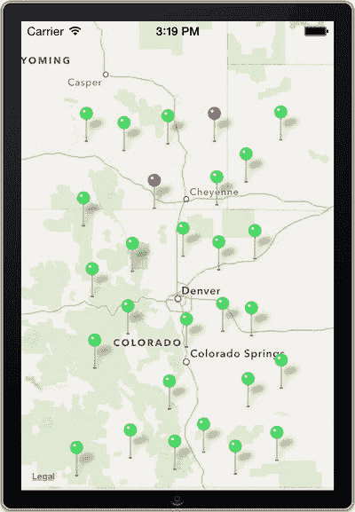

**图 7-16.** 带有数量特定颜色的群组注解

## 配方 7-7：从你的应用启动地图

在 iOS 7 中，有一个名为`MKMapItem`的 API 可用，它使得与内置地图应用交互变得简单。你不再需要构建自己半成品的地图功能，只需几行代码，就可以将用户引导到那个专门提供地图和导航的应用。对于许多应用来说，这非常有意义。毕竟，地图支持是一个不错的功能，但并不是大多数应用的主要焦点。

让我们构建一个非常简单的应用，其中包含三个按钮，它们以不同的方式启动地图。按照以下步骤开始：

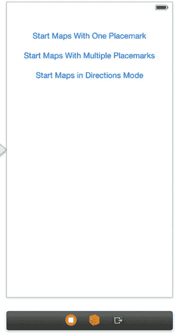

**图 7-17.** 三种方式启动地图的用户界面

1.  首先创建一个新的单视图应用，并将`Map Kit`和`Core Location`框架链接到它。
2.  在头文件中导入`Mapkit`框架。
3.  添加三个按钮，并将它们配置成如图 7-17 所示的样子。
4.  为按钮创建动作，分别命名为：

    *   按钮动作：`startWithOnePlacemark`
    *   按钮动作：`startWithMultiplePlacemarks`
    *   按钮动作：`startInDirectionsMode`


### 添加地图项目

我们从最简单的情况开始，即启动地图并显示单个地图项目。我们将首先向您展示步骤，然后展示 `startWithOnePlacemark:` 动作方法的完整实现。

首先，为伦敦著名的大本钟位置创建一个新的地图项目，如代码清单 7-54 所示。一个地图项目封装了一个地标，而地标又表示一个位置坐标，因此从定义坐标开始。

**代码清单 7-54.** 为大本钟位置创建地图项目

```
CLLocationCoordinate2D bigBenLocation =
CLLocationCoordinate2DMake(51.50065200, -0.12483300);
```

代码清单 7-55 展示了如何创建一个地标。地址字典可用于为地标提供地址信息，以传递给地图应用。不过，保持简单，这里传入 `nil`。

**代码清单 7-55.** 创建地标

```
MKPlacemark *bigBenPlacemark =
[[MKPlacemark alloc] initWithCoordinate:bigBenLocation addressDictionary:nil];
```

有了地标，你就可以创建稍后要发送给地图应用的地图项目了。代码清单 7-56 展示了如何创建它。除了地标对象的地址字典外，`MKMapItem` 还具有用于提供与地图项目相关的三项附加信息的属性：名称、电话和 URL。对于本示例，名称属性就足够了。

**代码清单 7-56.** 创建地图项目

```
MKMapItem *bigBenItem = [[MKMapItem alloc] initWithPlacemark:bigBenPlacemark];
bigBenItem.name = @"Big Ben";
```

> **注意：** 通常，你需要处理从 Core Location 框架接收到的地标。这些地标使用的类（`CLPlacemark`）与 Map Kit 框架中的类（`MKPlacemark`）不同。但是，你可以使用 `initWithPlacemark:` 方法，用 Core Location 的地标来初始化一个 Map Kit 的地标。

代码清单 7-57 展示了如何使用 `openInMapsWithLaunchOptions:` 方法请求地图应用启动并显示你的地图项目。

**代码清单 7-57.** 请求地图应用启动并显示地图项目

```
[bigBenItem openInMapsWithLaunchOptions:nil];
```

结合代码清单 7-54 到 7-57，完整的动作方法如代码清单 7-58 所示。

**代码清单 7-58.** 完整的 `startWithOnePlacemark:` 方法

```
- (IBAction)startWithOnePlacemark:(id)sender
{
    CLLocationCoordinate2D bigBenLocation = CLLocationCoordinate2DMake(51.50065200, -0.12483300);
    MKPlacemark *bigBenPlacemark = [[MKPlacemark alloc] initWithCoordinate:bigBenLocation addressDictionary:nil];
    MKMapItem *bigBenItem = [[MKMapItem alloc] initWithPlacemark:bigBenPlacemark];
    bigBenItem.name = @"Big Ben";
    [bigBenItem openInMapsWithLaunchOptions:nil];
}
```

如果你现在构建并运行，可以按下第一个按钮，启动地图应用，并在该位置显示一个大头针，指向伦敦著名钟楼的位置，如图 7-18 所示。

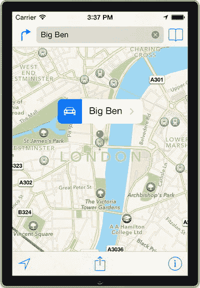

**图 7-18.** 启动地图并显示大本钟

当需要启动地图并显示多个地图项目时，你需要使用 `MKMapItem` 的类方法 `openMapsWithItems:launchOptions:`。该方法接收一个包含地图项目的数组，其余操作相同。

转到下一个动作方法 `startWithMultiplePlacemarks`，并按代码清单 7-59 所示实现它。

**代码清单 7-59.** `startWithMultiplePlacemarks:` 方法的实现

```
- (IBAction)startWithMultiplePlacemarks:(id)sender
{
    CLLocationCoordinate2D bigBenLocation = CLLocationCoordinate2DMake(51.50065200, -0.12483300);
    MKPlacemark *bigBenPlacemark = [[MKPlacemark alloc] initWithCoordinate:bigBenLocation addressDictionary:nil];
    MKMapItem *bigBenItem = [[MKMapItem alloc] initWithPlacemark:bigBenPlacemark];
    bigBenItem.name = @"Big Ben";
    
    CLLocationCoordinate2D westminsterLocation = CLLocationCoordinate2DMake(51.50054300, -0.13570200);
    MKPlacemark *westminsterPlacemark = [[MKPlacemark alloc] initWithCoordinate:westminsterLocation addressDictionary:nil];
    MKMapItem *westminsterItem = [[MKMapItem alloc] initWithPlacemark:westminsterPlacemark];
    westminsterItem.name = @"Westminster Abbey";
    
    NSArray *items = [[NSArray alloc] initWithObjects:bigBenItem, westminsterItem, nil];
    [MKMapItem openMapsWithItems:items launchOptions:nil];
}
```

如果你现在构建并运行，可以看到两个大头针，一个代表大本钟，一个代表威斯敏斯特教堂，如图 7-19 所示。

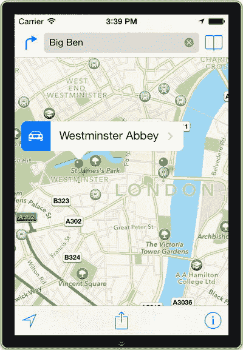

**图 7-19.** 启动地图并显示两个地图项目

### 启动导航模式

另一个酷炫的功能是在地图应用中为用户提供逐向导航。由此，用户可以选择任何地标，并询问地图如何开车或步行到达那里。你的应用可以使用这个很棒的功能，通过以导航模式启动地图，更直接地为用户提供价值。让我们在最后一个操作中实现它。

要以导航模式启动地图，你只需要提供一个选项字典，并将 `MKLaunchOptionsDirectionsModeKey` 设置为 `MKLaunchOptionsDirectionsModeWalking` 或 `MKLaunchOptionsDirectionsModeDriving`。代码清单 7-60 中的代码以导航模式启动地图，显示威斯敏斯特教堂和大本钟之间的步行路线，如图 7-20 所示。将其添加到 `startInDirectionsMode` 动作方法中，以便当用户点击应用中的第三个按钮时触发它，如代码清单 7-60 所示。

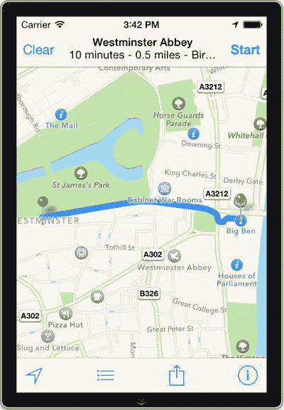

**图 7-20.** 以导航模式启动地图

**代码清单 7-60.** `startInDirectionsMode:` 方法的实现

```
- (IBAction)startInDirectionsMode:(id)sender
{
    CLLocationCoordinate2D bigBenLocation =
        CLLocationCoordinate2DMake(51.50065200, -0.12483300);
    MKPlacemark *bigBenPlacemark = [[MKPlacemark alloc]
        initWithCoordinate:bigBenLocation addressDictionary:nil];
    MKMapItem *bigBenItem = [[MKMapItem alloc] initWithPlacemark:bigBenPlacemark];
    bigBenItem.name = @"Big Ben";
    
    CLLocationCoordinate2D westminsterLocation =
        CLLocationCoordinate2DMake(51.50054300, -0.13570200);
    MKPlacemark *westminsterPlacemark = [[MKPlacemark alloc]
        initWithCoordinate:westminsterLocation addressDictionary:nil];
    MKMapItem *westminsterItem = [[MKMapItem alloc]
        initWithPlacemark:westminsterPlacemark];
    westminsterItem.name = @"Westminster Abbey";
    
    NSArray *items = [[NSArray alloc] initWithObjects:bigBenItem, westminsterItem, nil];
    NSDictionary *options =
        @{MKLaunchOptionsDirectionsModeKey: MKLaunchOptionsDirectionsModeWalking};
    [MKMapItem openMapsWithItems:items launchOptions:options];
}
```

当以导航模式启动时，地图应用将数组中的第一个项目视为起点，最后一个项目视为终点。但是，如果数组只包含一个地标，地图应用会将其视为终点，并将设备的当前位置视为起点。

但是，如果你想找到从一个点到你当前位置的路线呢？这也是可行的。`MKMapItem` 提供了一种创建指向当前位置的符号地图项目的方法。你只需将该地图项目添加到地图项目数组的末尾即可。以下是一个示例，请求地图应用提供从大本钟到当前位置的路线：

```
NSArray *items = [[NSArray alloc]
    initWithObjects:bigBenItem, [MKMapItem mapItemForCurrentLocation], nil];
[MKMapItem openMapsWithItems:items launchOptions:nil];
```

在结束本教程之前，我们想指出，还有更多选项可以控制地图应用的启动方式——例如，以卫星地图模式启动，或指定特定区域。有关这些及其他地图启动选项的详细信息，请参考 Apple 的文档。


## 配方 7-8：注册路线应用

前面的配方使用了 API 直接从你的应用中启动地图。iOS 7 的另一个特性是反向操作也成为可能：如果你的应用是已注册的路线应用，它可以从地图应用中被启动。

作为这一机制如何运作的示例，假设用户将大本钟标记为地图中的兴趣点。他们现在想知道如何乘坐公交车到达那里，因此按下路线按钮，选择出行方式，然后浏览可用的路线应用，找到一款似乎符合需求的应用。他们选择该应用，路线应用便被地图启动。

配方 7-8 展示了如何将你的应用注册为路线应用。

### 声明路线应用

对于配方 7-8，我们只需创建一个简单的虚拟应用，该应用仅显示启动时由地图提供的起点和终点。首先创建一个新的单视图应用，并将 Map Kit 和 Core Location 框架链接到其中。确保在头文件中导入 Map Kit 框架。

接下来，在用户界面中添加一个标签。将其设置得足够大，以容纳至少五行文本。你的主视图应类似于图 7-21 所示。同时，创建一个名为 `routingLabel` 的出口并连接到该标签。

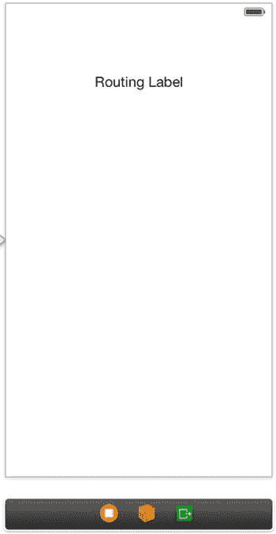

图 7-21. 带单一标签的虚拟路线应用

要允许你的应用从地图中被启动，你需要将其声明为路线应用。这在应用的`属性列表`文件中完成，但 Xcode 提供了便捷的用户界面。

选择项目导航器中的根节点，选择“功能”标签，向下滚动到“地图”部分。确保开关设置为“开”，并且由于该应用不支持任何可用的交通类型，请选择“其他”。（参见图 7-22。）

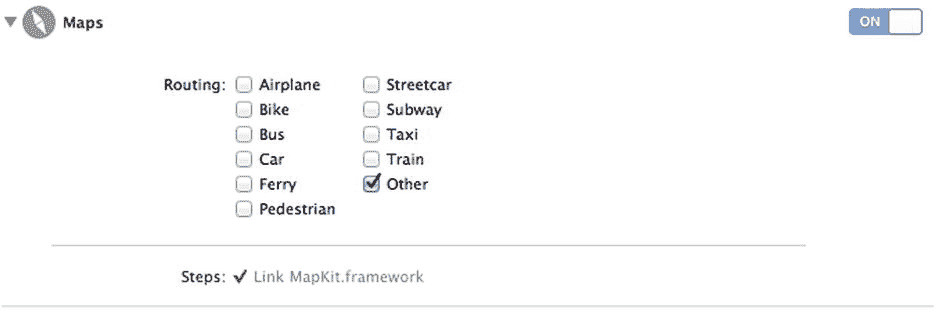

图 7-22. 声明路线应用

### 处理启动

现在你的应用已注册为路线应用，地图可以通过 URL 请求与其集成。要响应此类请求，请在应用委托中添加 `application:openURL:sourceApplication:annotation:` 委托方法。使用 `MKDirectionsRequest` 类的 `isDirectionsRequestURL:` 便捷方法确保该请求是路线请求，如代码清单 7-61 所示。

代码清单 7-61. `application:openURL:sourceApplication:annotation:` 委托的实现

```
- (BOOL)application:(UIApplication *)application openURL:(NSURL *)url sourceApplication:(NSString *)sourceApplication annotation:(id)annotation
{
    if ([MKDirectionsRequest isDirectionsRequestURL:url])
    {
        // 处理请求的代码写在这里
        return YES;
    }
    return NO;
}
```

该请求包含一个起点和一个终点，你的应用可以利用它们来适应用户的需求。使用 `initWithContentsOfURL:` 方法从 URL 中提取请求。修改代码清单 7-61 中的代码，如代码清单 7-62 所示。

代码清单 7-62. 提取请求

```
- (BOOL)application:(UIApplication *)application openURL:(NSURL *)url sourceApplication:(NSString *)sourceApplication annotation:(id)annotation
{
    if ([MKDirectionsRequest isDirectionsRequestURL:url])
    {
        MKDirectionsRequest *request = [[MKDirectionsRequest alloc]
            initWithContentsOfURL:url];
        MKMapItem *source = [request source];
        MKMapItem *destination = [request destination];
        return YES;
    }
    return NO;
}
```

本配方的目的仅是简单地在应用的路线标签中显示这些点。一个重要的方面是，任何提供的地图项都可能是符号化的“当前位置”项，它不会附加实际的地标。你可以使用 `isCurrentLocation` 属性来检测是否属于这种情况并采取适当措施。在这种情况下，你只需显示文本“Current Location”。代码清单 7-63 显示了最终的启动响应。

代码清单 7-63. 向代码清单 7-62 中的代码添加启动响应

```
- (BOOL)application:(UIApplication *)application openURL:(NSURL *)url sourceApplication:(NSString *)sourceApplication annotation:(id)annotation
{
    if ([MKDirectionsRequest isDirectionsRequestURL:url])
    {
        MKDirectionsRequest *request = [[MKDirectionsRequest alloc]
            initWithContentsOfURL:url];
        MKMapItem *source = [request source];
        MKMapItem *destination = [request destination];
        NSString *sourceString;
        NSString *destinationString;
        if (source.isCurrentLocation)
            sourceString = @"Current Location";
        else
            sourceString = [NSString stringWithFormat:@"%f, %f",
                source.placemark.location.coordinate.latitude,
                source.placemark.location.coordinate.longitude];
        if (destination.isCurrentLocation)
            sourceString = @"Current Location";
        else
            destinationString = [NSString stringWithFormat:@"%f, %f",
                destination.placemark.location.coordinate.latitude,
                destination.placemark.location.coordinate.longitude];
        self.viewController= (ViewController*)self.window.rootViewController;
        self.viewController.routingLabel.text =
            [NSString stringWithFormat:@"Start at: %@\nStop at: %@",
                sourceString, destinationString];
        return YES;
    }
    return NO;
}
```

别忘了更新 `AppDelegate.h` 文件，添加导入语句以及视图控制器类的属性，如代码清单 7-64 所示。

代码清单 7-64. 在 `AppDelegate.h` 文件中添加导入语句和视图控制器类的属性

```
//
//  AppDelegate.h
//  Recipe 7-8 Registering a Routing App
//

#import <UIKit/UIKit.h>
#import <MapKit/MapKit.h>
#import "ViewController.h"

@interface AppDelegate : UIResponder <UIApplicationDelegate>
@property (strong, nonatomic) UIWindow *window;
@property (strong,nonatomic) ViewController *viewController;
@end
```


### 测试路由应用

现在该对你的应用进行测试运行了。在模拟器中构建并运行它。应用启动后，点击“主屏幕”按钮关闭应用。你将测试伦敦威斯敏斯特教堂与大本钟之间的路线，因此首先将模拟器的当前位置设置为威斯敏斯特教堂的坐标。这可以在模拟器主菜单的 `Debug ➤ Location ➤ Custom Location` 中完成。在弹出的对话框中，为纬度输入 `51.500543`，经度输入 `-0.135702`（见图 7-23）。

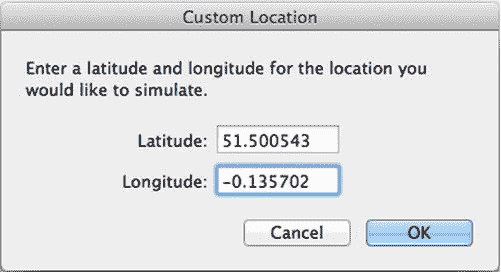

图 7-23. 为模拟器设置自定义位置

自定义位置设置完成后，找到并启动模拟器上的地图应用。在搜索字段中输入“Big Ben, London”，让地图应用找到它。最终你应该会看到类似图 7-24 的画面（你需要向左平移一点，以便让威斯敏斯特教堂进入可视区域）。

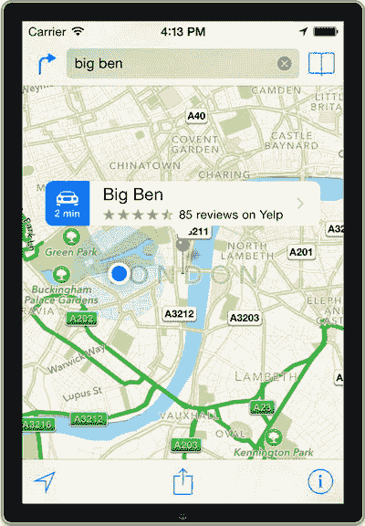

图 7-24. 选中大本钟兴趣点且当前位置点位于威斯敏斯特教堂的模拟器

选中大本钟地标后，点击地图应用屏幕顶部搜索字段左侧的“路线”按钮，如图 7-25 所示。

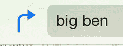

图 7-25. 地图应用中的“路线”按钮

在路线界面中，选择“路由应用模式”按钮。该按钮看起来像一辆公交车，位于“步行模式”按钮旁边（见图 7-26）。选中路由应用模式后，点击屏幕右上角的路由按钮。如果列表项旁边有公交车图标，你也可以点击该列表项。

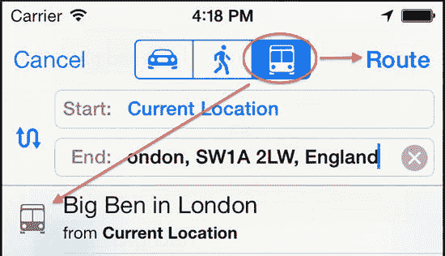

图 7-26. 选中路由应用模式的地图路线界面

现在你将看到一个可用路由应用的列表。如果一切设置正确，你的应用应该出现在列表中，旁边有一个“路线”按钮，如图 7-27 所示。

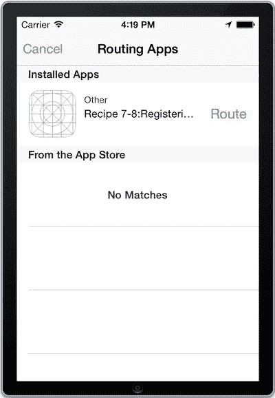

图 7-27. 你的应用作为地图中的路由选项

现在，如果你点击“路线”按钮，你的应用将会启动，并且如果你正确实现了 `application:openURL:sourceApplication:annotation:` 方法，你的应用应该看起来像图 7-28 所示。

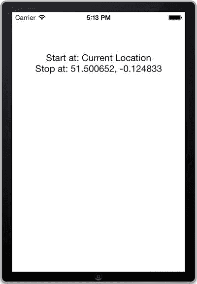

图 7-28. 从地图应用内启动你的路由应用

### 指定覆盖区域

尽管你的路由应用已成功与地图应用集成，但实际上还缺少一个关键部分：你需要告诉地图应用你的应用在哪个区域提供路由服务。这通过一个特殊的文件（`GeoJSON` 文件）来声明地理覆盖区域。地图应用会利用此信息过滤可用的路由应用，以免用户被不相关的选项淹没。

没有 `GeoJSON` 文件也能工作的原因是：出于测试目的，模拟器上安装的所有路由应用都可视为有效可用。然而，如果不提交有效的 `GeoJSON` 文件，应用将无法通过应用商店的审核。

现在为你的应用创建一个 `GeoJSON` 文件。在项目导航器的 `Supporting Files` 文件夹中添加一个文件。选择资源部分下的 GeoJSON 模板（见图 7-29）。将文件命名为 `London.geojson`。你不需要将其添加到目标中，因为它应该与应用一起提交，而不是作为应用包的一部分。

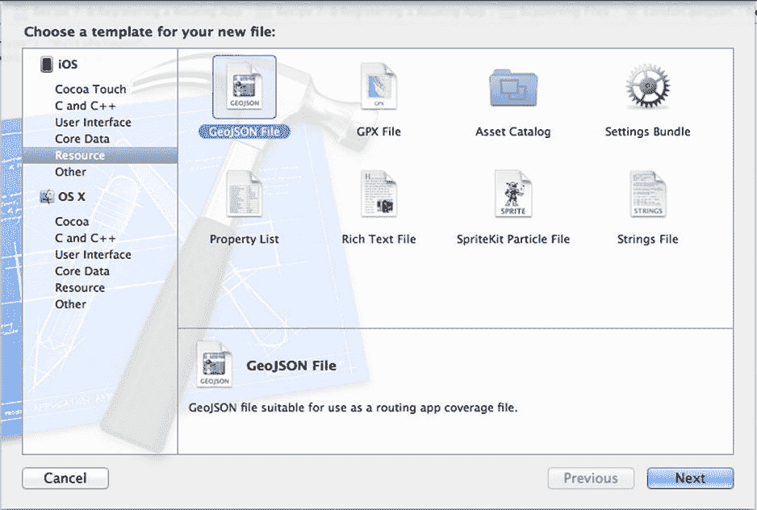

图 7-29. 你可以使用 GeoJSON 模板创建新的 GeoJSON 文件

将新文件的内容设置如下：

```
{
    "type": "MultiPolygon",
    "coordinates": [
                    [[[52.257770, -0.989542],
                      [51.001232, -0.943830],
                      [51.050521, 0.303471],
                      [51.848169, 0.362244],
                      [52.257770, -0.989542]]]
                    ]
}
```

文件中的数字代表世界坐标，它们共同构成一个闭合多边形。由于多边形必须是闭合的，因此第一个和最后一个坐标必须相同。

你可以通过在 Xcode 的 Scheme 中指定该文件来测试你的 `GeoJSON` 文件。前往菜单中的 `Product ➤ Scheme ➤ Edit Scheme`。在选项页面中，有一个 `Routing App Coverage` 文件的设置项。点击它并选择你的 `GeoJSON` 文件。（见图 7-30）

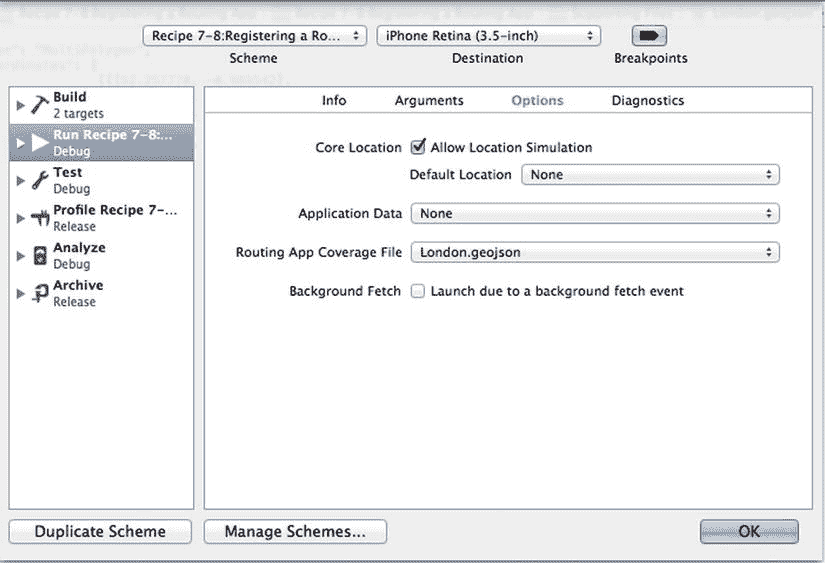

图 7-30. 为测试目的设置路由应用覆盖范围文件

现在你可以通过选中覆盖区域内外的兴趣点来测试你的文件是否有效。如果你希望测试你的应用是否出现在可用路由应用列表中，请确保起点和终点都在覆盖区域内。

**注意**：如果你的应用未能按预期显示为路由选项，你的 `GeoJSON` 文件中可能存在错误。检查控制台，因为地图应用会在那里报告 `GeoJSON` 文件的任何错误。

在结束本教程之前，还有最后一点说明。当你设计自己的 `GeoJSON` 文件时，我们建议保持简单。苹果建议不超过 20 个多边形，每个多边形最多包含 20 个点。无需非常精确，因此在大多数情况下，一个简单的边界矩形就足够了。

## 教程 7-9：获取路线

iOS 7 新增的 API 可让你从应用内部获取驾车或步行路线。这些路线提供了你对地图应用所期望的一切功能，包括备选路线和路线查找。额外的好处是，你还能获得基于当前交通状况甚至历史数据的时间估算。

### 设置应用

正如你在本章的许多地图应用中所做的那样，你需要创建一个带有地图视图的新单视图应用。为了方便，这里再次提供说明：

创建一个新的单视图应用项目。将 Map Kit 框架添加到项目中。将 Core Location 框架添加到项目中。在本教程中，你不会使用位置服务，因此无需提供位置使用描述。不过你仍然需要链接该框架，否则后续构建时会遇到链接器错误。将地图视图添加到应用的主视图中。创建一个用于引用地图视图的插座变量。将其命名为 `mapView`。将 Map Kit API 导入到 `ViewController.h` 中。将 `NSLocationUsageDescription` 键添加到 `application.info.plist` 文件中，并为其指定一个合适的标识，例如“测试获取路线”。使你的视图控制器类遵循 `MKMapViewDelegate` 协议。


### 在地图上绘制路线方向

首先，我们将创建一个新的方法来查找路线方向。在此方法中，我们需要使用起点和终点的坐标来发起请求。在我们的示例中，我们选择了红石露天剧场和丹佛的体育管理局球场分别作为路线的起点和终点。将代码清单 7-65 中的代码添加到 `ViewController.h` 和 `ViewController.m` 文件中。

代码清单 7-65. 设置 `ViewController.h` 和 `.m` 文件

```
//
//  ViewController.h
//  Recipe 7-9 Getting Directions
//

#import <UIKit/UIKit.h>
#import <MapKit/MapKit.h>
#import <CoreLocation/CoreLocation.h>

@interface ViewController : UIViewController <MKMapViewDelegate>

@property (weak, nonatomic) IBOutlet MKMapView *mapView;
@property (strong, nonatomic) MKDirectionsResponse *response;

@end

//
//  ViewController.m
//  Recipe 7-9 Getting Directions
//

//...

-(void)findDirectionsFrom: (MKMapItem *)source to:(MKMapItem *)destination
{
    //创建请求并提供起点和终点的 MKMapItem
    MKDirectionsRequest *request = [[MKDirectionsRequest alloc] init];
    request.source = source;
    request.destination = destination;
    request.requestsAlternateRoutes = NO;

    MKDirections *directions = [[MKDirections alloc] initWithRequest:request];

    //查找方向并调用方法显示方向
    [directions calculateDirectionsWithCompletionHandler:^(MKDirectionsResponse *response, NSError *error) {
        if(error)
        {
            NSLog(@"糟糕，我们遇到了错误：%@",error);
        }
        else
        {
            [self showDirectionsOnMap:response];
        }
    }];
}

-(void)showDirectionsOnMap:(MKDirectionsResponse *)response
{
    self.response = response;
    for (MKRoute *route in self.response.routes)
    {
        [self.mapView addOverlay:route.polyline level:MKOverlayLevelAboveRoads];
    }
    [self.mapView addAnnotation:self.response.source.placemark];
    [self.mapView addAnnotation:self.response.destination.placemark];
}
```

这里的两个方法接收路线方向请求，然后在地图上以折线的形式创建一条路线，并用大头针标记起点和终点。我们需要在视图控制器中添加一个委托方法，才能真正在地图上绘制路线。通过添加代码清单 7-66 中的代码即可完成此操作。

代码清单 7-66. 添加 `mapView:rendererForOverlay:` 委托方法

```
//
//  ViewController.m
//  Recipe 7-9 Getting Directions
//

//...

-(MKOverlayRenderer *)mapView:(MKMapView *)mapView rendererForOverlay:(id )overlay
{
    if([overlay isKindOfClass:[MKPolyline class]])
    {
        MKPolylineRenderer *renderer = [[MKPolylineRenderer alloc] initWithOverlay:overlay];
        renderer.lineWidth = 3;
        renderer.strokeColor = [UIColor blueColor];
        return renderer;
    }
    else
    {
        return nil;
    }
}
```

最后，我们需要在 `viewDidLoad` 方法中设置一些坐标，并调用新创建的方法来查找路线方向并将其显示在地图上。首先，在 `ViewController.m` 文件的 `#import` 上方添加一些常量，如代码清单 7-67 所示。

代码清单 7-67. 定义常量

```
#define centerLat 39.6653
#define centerLong -105.2058
#define spanDeltaLat .5
#define spanDeltaLong .5

#import "ViewController.h"

//...
```

然后，使用红石和体育管理局两者的坐标创建一些 `MKMapItem` 对象，并在 `viewDidLoad` 方法中使用它们调用我们刚刚创建的 `findDirectionsFrom: to:` 方法，如代码清单 7-68 所示。如前所述，`MKMapItem` 保存了一个地点的信息，例如地标和名称。

代码清单 7-68. 更新 `viewDidLoad` 方法以调用 `findDirectionsFrom: to:` 方法

```
- (void)viewDidLoad
{
    [super viewDidLoad];
    // 加载视图后执行任何额外的设置，通常从 nib 文件加载

    self.mapView.delegate = self;
    CLLocationCoordinate2D centerPoint = {centerLat, centerLong};
    MKCoordinateSpan coordinateSpan = MKCoordinateSpanMake(spanDeltaLat, spanDeltaLong);
    MKCoordinateRegion coordinateRegion =
        MKCoordinateRegionMake(centerPoint, coordinateSpan);
    [self.mapView setRegion:coordinateRegion];
    [self.mapView regionThatFits:coordinateRegion];

    CLLocationCoordinate2D redRocksAmphitheatre = CLLocationCoordinate2DMake(39.6653, -105.2058);
    MKPlacemark *redRocksPlacemark = [[MKPlacemark alloc] initWithCoordinate: redRocksAmphitheatre addressDictionary:nil];
    MKMapItem *redRocksItem = [[MKMapItem alloc] initWithPlacemark:redRocksPlacemark];
    redRocksItem.name = @"红石露天剧场";

    CLLocationCoordinate2D sportsAuthorityField = CLLocationCoordinate2DMake(39.7439, -105.0200);
    MKPlacemark *sportsAuthorityPlacemark = [[MKPlacemark alloc] initWithCoordinate:sportsAuthorityField addressDictionary:nil];
    MKMapItem *sportsAuthorityItem = [[MKMapItem alloc] initWithPlacemark:sportsAuthorityPlacemark];
    sportsAuthorityItem.name = @"体育管理局球场";

    [self findDirectionsFrom:redRocksItem to: sportsAuthorityItem];
}
```

如果你构建并运行应用程序，你将看到一条折线路线从红石露天剧场绘制到体育管理局球场，如图 7-31 所示。在本示例中我们没有演示，但你也可以通过将 `findDirectionsFrom: to:` 方法中的 `request.requestsAlternateRoutes` 从 `NO` 改为 `YES` 来绘制多条路线。

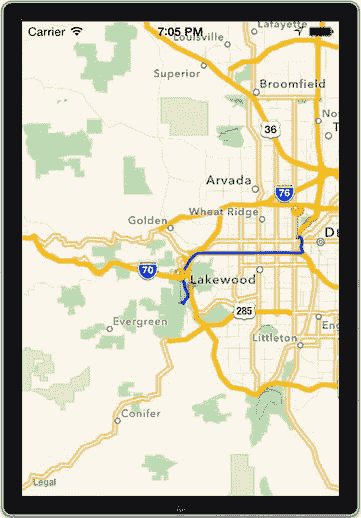

图 7-31. 在地图上绘制路线方向


### 添加预计到达时间

在本节结束之前，我们再探讨一个 `MKDirections` 类中包含的便捷功能，它能够让你获取预计到达时间（ETA）。预计到达时间基于当前交通状况，可以成为你地图应用中的一个实用功能。

清单 7-69 展示了如何修改 `findDirectionsFrom: to:` 方法来添加一个预计到达时间提醒。基本上，你只需要在 `calculateDirectionsWithCompletionHandler:` 方法的完成处理程序内部调用一个类方法 `calculateETAWithCompletionHandler`。之所以需要这样做，是因为 `calculateDirectionsWithCompletionHandler:` 方法是异步执行的，如果同时尝试执行两个 `MKDirections` 方法调用，就会出错。通过将第二个方法添加到第一个方法的完成块中，可以确保第一个方法先执行完毕。

**清单 7-69.** 创建显示预计到达时间的提示视图

```
-(void)findDirectionsFrom: (MKMapItem *)source to:(MKMapItem *)destination

{

//...

    [directions calculateDirectionsWithCompletionHandler:^(MKDirectionsResponse *response, NSError *error) {

        if(error)

        {

            NSLog(@"Bummer, we got an error: %@",error);

        }

        else

        {

            [self showDirectionsOnMap:response];

            [directions calculateETAWithCompletionHandler:^(MKETAResponse *response, NSError *error)                {

                NSLog(@"You will arive in: %.1f Mins%@", response.expectedTravelTime/60.0,error);

                UIAlertView *alert = [[UIAlertView alloc] initWithTitle:@"预计到达时间!"

                                                                message:[NSString stringWithFormat:@"预计到达时间：%.1f 分钟后。",response.expectedTravelTime/60.0]

                                                               delegate:nil

                                                      cancelButtonTitle:@"关闭"

                                                      otherButtonTitles: nil];

                [alert show];

            }];

        }

    }];

}
```

至此，本节内容结束。如果操作正确，你将看到一个包含预计到达时间的提示，如图 7-32 所示。

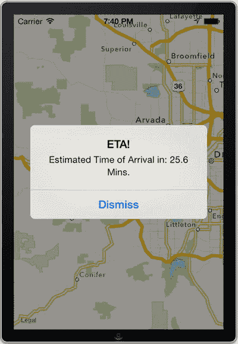

**图 7-32.** 在提示视图中显示预计到达时间

## 方案 7-10：使用 3-D 地图

在 iOS 7 之前，3-D 功能仅限于地图应用。现在，苹果提供了一些新的 API，让我们可以利用 3-D 地图功能，例如选择相机位置甚至实现 3-D 视图的动画效果。在本方案中，我们将探索两种显示 3-D 地图视图的方法，以及如何创建飞越效果。

### 使用属性方法

如同本章中的许多方案一样，你需要先设置一个新的地图视图单视图应用程序来开始。新的 `MKMapCamera` API 让你在查看地图时可以选择相机位置。你可以通过便捷方法或设置某些属性来设置相机。我们先从设置属性开始，然后向你展示如何使用便捷方法获得相同的效果。

`MKMapCamera` API 实际上让将地图置于 3-D 视图中变得非常简单。只需设置四个属性，然后将 mapView 的相机设置为我们创建的 `MKMapCamera` 对象即可。这四个属性如下：

- `Pitch`（俯仰角）：这是相机镜头与地面之间的角度（以度为单位）。值为零时表示垂直看向地面，非零值则表示朝向地平线。
- `Altitude`（高度）：这是距离地面的高度（以米为单位）。通常，如果你想看到建筑物，这个值应该在 600 左右或更低。该值会根据建筑物的高度而变化。
- `Heading`（航向）：这是方向角度，其中正北为 0 度，正南为 180 度。
- `centerCoordinate`（中心坐标）：这是一个 `CLLocationCoordinate` 类型的输入，用于指定相机所在的位置。

此外，还有一些属性可以在 `MKMapView` 对象上调用，以显示建筑物和兴趣点等项目，并允许缩放和俯仰角调整。在代码示例中，我们会用到其中一些。

本方案只需要对 `viewDidLoad` 方法稍作修改。修改 `viewDidLoad` 方法，如清单 7-70 所示。

**清单 7-70.** 修改 viewDidLoad 方法以创建 3-D 地图视图

```
- (void)viewDidLoad

{

    [super viewDidLoad];

    self.mapView.delegate = self;

    //创建一个新的 MKMapCamera 对象

    MKMapCamera *mapCamera = [[MKMapCamera alloc] init];

    //设置 MKMapCamera 属性

    mapCamera.centerCoordinate = CLLocationCoordinate2DMake(40.7130,-74.0085);

    mapCamera.pitch = 57;

    mapCamera.altitude = 650;

    mapCamera.heading = 90;

    //设置 MKmapView 的相机属性

    self.mapView.camera = mapCamera;

    //设置一些 MKMapView 属性，以允许俯仰、建筑视图、兴趣点和缩放

    self.mapView.pitchEnabled = YES;

    self.mapView.showsBuildings = YES;

    self.mapView.showsPointsOfInterest = YES;

    self.mapView.zoomEnabled = YES;

}
```

清单 7-70 中的代码首先初始化地图视图的委托，然后创建一个带有必要坐标、俯仰角、高度和航向的 `MKMapCamera` 实例。接着，将该相机添加到地图视图，并设置地图视图的属性，使其外观和交互效果更佳。

现在，如果你构建并运行该应用程序，你就会看到纽约市世界贸易中心一号楼的精美建筑视图，如图 7-33 所示。

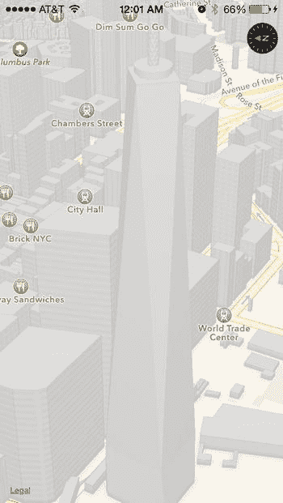

**图 7-33.** 使用 MKMapCamera 查看 3-D 地图

### 使用便捷方法

属性方法简洁易懂，但还有更快更简便的方法来显示 3-D 视图。苹果提供了一个便捷方法，在初始化 `MKMapCamera` 对象时就能完成所有设置。使用便捷方法时，`viewDidLoad` 方法将如清单 7-71 所示，而非清单 7-70。

**清单 7-71.** 使用便捷方法修改 viewDidLoad 方法以创建 3-D 地图视图

```
- (void)viewDidLoad

{

    [super viewDidLoad];

    self.mapView.delegate = self;

    //使用便捷方法

    CLLocationCoordinate2D ground = CLLocationCoordinate2DMake(40.7128,-74.0117);

    CLLocationCoordinate2D eye = CLLocationCoordinate2DMake(40.7132,-74.0150);

    MKMapCamera *mapCamera = [MKMapCamera cameraLookingAtCenterCoordinate:ground fromEyeCoordinate:eye eyeAltitude:740];

    //设置 MKmapView 的相机属性

    self.mapView.camera = mapCamera;

    //设置一些 MKMapView 属性，以允许俯仰、建筑视图、兴趣点和缩放

    self.mapView.pitchEnabled = YES;

    self.mapView.showsBuildings = YES;

    self.mapView.showsPointsOfInterest = YES;

    self.mapView.zoomEnabled = YES;

}
```

清单 7-71 中所示的便捷方法使用了两个坐标。第一个坐标是相机观察的目标点，第二个坐标是相机自身的位置。最后一个参数只是离地面的高度。如果你构建并运行这个应用，应该会看到世界贸易中心一号楼略有不同的视图。


### 创建飞越效果

由于 `MKMapView` 是一种视图类型，您实际上可以为其添加动画效果。您将利用这一特性，创建一个精美的飞越效果，让视角从一个摄像机位置移动到另一个位置。使用 `UIView animateWithDuration:` 方法实现这一点其实非常简单。

首先，您需要为第二个位置创建一个新的 `MKMapCamera` 实例。在本演示中，我们将使用便捷方法来创建 `MKMapCamera` 实例。请修改清单 7-71 中的代码，添加一个新的摄像机实例，如清单 7-72 所示。

**清单 7-72.** 在 `viewDidLoad` 方法中添加新的 `MKMapCamera` 实例

```
- (void)viewDidLoad
{
    [super viewDidLoad];
    self.mapView.delegate = self;
    //使用便捷方法
    CLLocationCoordinate2D ground = CLLocationCoordinate2DMake(40.7128,-74.0117);
    CLLocationCoordinate2D eye = CLLocationCoordinate2DMake(40.7132,-74.0150);
    MKMapCamera *mapCamera = [MKMapCamera cameraLookingAtCenterCoordinate:ground fromEyeCoordinate:eye eyeAltitude:740];
    CLLocationCoordinate2D ground2 = CLLocationCoordinate2DMake(40.7,-73.99);
    CLLocationCoordinate2D eye2 = CLLocationCoordinate2DMake(40.7,-73.98);
    MKMapCamera *mapCamera2 = [MKMapCamera cameraLookingAtCenterCoordinate:ground2 fromEyeCoordinate:eye2 eyeAltitude:700];
//...
}
```

在清单 7-72 中，您可以看到添加的代码与第一个摄像头的实现完全相同，只是坐标稍有不同。最后一步是创建动画。为了制作平滑流畅的动画，我们将用较长的时间（25 秒）覆盖一段较短的距离。将清单 7-73 中的代码添加到 `viewDidLoad` 方法中。

**清单 7-73.** 创建一段 25 秒的动画，切换到第二个摄像机视图

```
[UIView animateWithDuration:25.0 animations:^{
   self.mapView.camera = mapCamera2;
}];
```

如果现在构建并运行应用程序，您应该会看到一个非常漂亮的飞越效果，从世界贸易中心一号大楼飞越布鲁克林大桥。我们鼓励您调整坐标和高度，观察它们如何影响动画的视觉效果。

值得指出的是，如果您尝试过快移动过远距离，或者在地图上添加了过多的标注和细节，动画可能会出现卡顿，或者地图元素根本无法加载。调试这些问题超出了本书的讨论范围，但您可以观看 `https://developer.apple.com/wwdc/videos/` 上的“Putting Map Kit in Perspective”视频以获取更多详细信息。

## 总结

Map Kit 框架是最流行的框架之一，因为它功能强大且极其灵活，能够提供完全可定制且简洁的地图界面。在本章中，您已经了解了 Map Kit 的主要功能，从定位用户，到添加标注和叠加层，再到 Maps 新提供的 3D 功能。然而，您仅仅触及了 Map Kit 功能的表面，尤其是在基于地图的问题解决领域。快速浏览 Map Kit 文档¹ 可以发现各种其他命令、方法和属性，我们并未涵盖所有这些内容，它们从隔离地图的特定区域到完全自定义地图如何处理触摸事件，不一而足。这些无数功能的有效性，仅仅受限于开发者的想象力。

**脚注**

1. `http://developer.apple.com/library/ios/#documentation/MapKit/Reference/MapKit_Framework_Reference`

