# 8. 社交网络配方

## 摘要

社交网络或许是当下互联网上最强劲的趋势。拥有网络身份的人们正在众多提供此类服务的网站上分享和消费内容。由于形成社群是我们的天性，而互联网平台又使之变得如此简单，我们可以确信，随着越来越多的服务加入其中，这一趋势将持续并加强。

在 iOS 6 中，Apple 引入了 Social 框架，使得将您的应用与社交网络集成变得容易。在 iOS 7 中，该框架已得到扩展，除了支持 Facebook、Twitter 和基于中国的微博网络外，还支持 Vimeo 和 Flickr。

**注意**

在 iOS 5 中引入的 Twitter 框架现已弃用，已被 Social 框架取代。

在本章中，我们将向您展示如何使用便捷的 `UIActivityViewController` 将您应用中的内容分享到社交网络应用。我们还将向您展示如何使用新的 Social 框架实现与 Twitter 和 Facebook 更高级的集成。

## 配方 8-1：使用活动视图分享内容

大多数应用并非社交网络业务。然而，许多非社交网络应用确实拥有用户希望分享的内容。幸运的是，Apple 提供了一个 API 使这变得简单。`UIActivityViewController` 接收您提供的内容，并向用户呈现相关的“活动”，例如发布到 Facebook 或 Twitter。`UIActivityViewController` 是一个便捷的视图类，提供了一个可配置的界面。该界面允许您在社交网络上分享内容，或利用标准服务，例如发送电子邮件，甚至通过 Airdrop 与附近的 iOS 7 设备共享文件。`UIActivityViewController` 界面与您在 Safari 中点击“分享”按钮时出现的界面相同。唯一的区别是配置。在本配方中，我们将向您展示如何设置 `UIActivityViewController` 来分享一段文本和一个 URL。

首先，创建一个新的单视图应用程序。选择 `Main.storyboard`，向主视图添加一个文本视图、一个文本字段和一个导航栏，并将它们排列成如图 8-1 所示。要创建图 8-1 右上角带有活动图标的按钮，请将一个栏按钮拖到导航栏上。在属性检查器中，将按钮的 Identifier 属性设置为“Action”。

文本字段用于输入 URL 链接，因此在属性检查器中将其 Placeholder 属性设置为“要分享的 URL”。您可能还希望将其 Keyboard 属性更改为“URL”，以更好地匹配将在此处输入的数据。

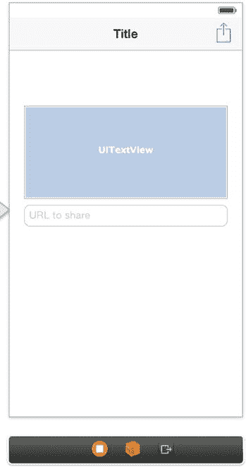

**图 8-1.** 用于分享文本和 URL 的简单用户界面

像往常一样，您需要从代码中引用编辑控件，因此请创建以下相应的输出口和操作：

* 输出口：`messageTextView`
* 输出口：`urlTextField`
* 导航按钮操作：`shareContent`


### 设置活动视图控制器

现在你已经设置好用户界面，可以前往 `ViewController.m` 实现 `shareContent` 操作方法。在 `shareContent:` 方法中添加代码，初始化并展示一个 `UIActivityViewController`，用于分享文本和 URL，如代码清单 8-1 所示。

**代码清单 8-1.** `shareContent:` 方法的实现

```
- (IBAction)shareContent:(id)sender
{
    NSString *text = self.messageTextView.text;
    NSURL *url = [NSURL URLWithString:self.urlTextField.text];
    NSArray *items = @[text, url];
    UIActivityViewController *vc = [[UIActivityViewController alloc]
        initWithActivityItems:items applicationActivities:nil];
    [self presentViewController:vc animated:YES completion:nil];
}
```

**注意**  
在这段代码中，我们使用了字面量语法来创建数组。从 Xcode 4.5 开始，你可以将数组写成 `@[object1, object2]`，而无需使用 `[NSArray arrayWithObjects:object1, object2, nil]` 的形式。

就是这样！这就是在 Facebook、Twitter 或 Apple 提供的任何其他方式上分享内容所需的全部代码。现在你可以构建并运行应用，输入一些文本和一个 URL，然后点击活动按钮调出活动视图，如图 8-2 所示。

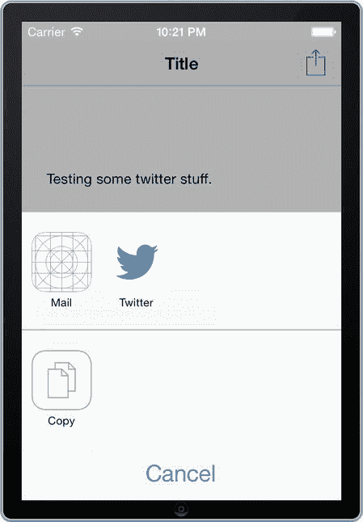

**图 8-2.** 用于分享内容的内置活动视图

一旦活动视图呈现出来，你便将分享的控制权交给了 iOS。它会使用设备上已设置的账户，如果账户尚未配置，则会要求用户提供登录详情。对于 Facebook、Twitter、Vimeo、Flickr 以及其他社交媒体网络的新用户，他们可以创建新账户，并根据所在地区获得无缝体验。你仅需大约五行代码即可实现这一切。

图 8-3 展示了一个示例：该应用的用户选择了将内容分享到 Twitter。用户在将内容发送到服务之前可以修改文本。用户还可以更改用于发送推文的账户（如果有多个可用账户）。Facebook 集成也有一个类似的界面，用户可以在其中进行最终调整。然而，由于 Facebook 的特性，每台设备只允许设置一个账户。

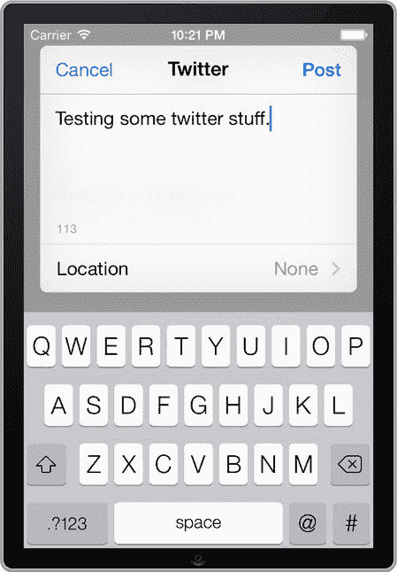

**图 8-3.** 推文编辑界面，用户可以在分享前对内容进行最后调整

### 排除活动视图项

当活动视图显示时，iOS 会查看内容并尝试解析，仅显示相关的选项。例如，只有当你安装了中文键盘时，微博服务才会显示。

**注意**  
选项的数量还取决于服务的可用性。例如，如果你在 iOS 模拟器中运行应用，发送短信功能不可用，因此它不会作为选项出现。

除了系统限制选项外，有时你可能希望进一步减少选项数量。例如，如果你知道用户绝不会通过电子邮件发送内容，那么保留该选项就没有意义。

幸运的是，你可以通过使用 `UIActivityViewController` 的 `excludeActivityTypes` 属性来排除活动视图中的项目。例如，如果你想排除“邮件”和“拷贝到剪贴板”服务，请在 `shareContent:` 方法中添加代码，如代码清单 8-2 所示。

**代码清单 8-2.** 更新 `shareContent:` 方法以排除拷贝和邮件选项

```
- (IBAction)shareContent:(id)sender
{
    NSString *text = self.messageTextView.text;
    NSURL *url = [NSURL URLWithString:self.urlTextField.text];
    NSArray *items = @[text, url];
    UIActivityViewController *vc = [[UIActivityViewController alloc]
        initWithActivityItems:items applicationActivities:nil];
    vc.excludedActivityTypes = @[UIActivityTypeMail, UIActivityTypeCopyToPasteboard];
    [self presentViewController:vc animated:YES completion:nil];
}
```

如果你进行代码清单 8-2 中的更改，然后再次构建并运行应用，你会看到（如图 8-4 所示）“邮件”和“拷贝”选项在活动视图中不再可见。

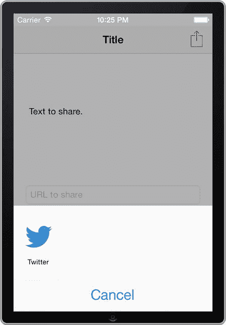

**图 8-4.** 不包含“邮件”和“拷贝”选项的活动视图

**表 3-1.** 活动类型

| 常量 | 有效数据项 | 用途 |
| --- | --- | --- |
| `UIActivityTypePostToFacebook` | `NSString`, `NSAttributedString`, `UIImage`, `AVAsset`, `NSURL` | 主要用于向 Facebook 发布文本和图片 |
| `UIActivityTypePostToTwitter` | `NSString`, `NSAttributedString`, `UIImage`, `AVAsset`, `NSURL` | 主要用于向 Twitter 发布文本和图片 |
| `UIActivityTypePostToWeibo` | `NSString`, `NSAttributedString`, `UIImage`, `AVAsset`, `NSURL` | 主要用于向中国的新浪微博发布文本和图片 |
| `UIActivityTypeMessage` | `NSString`, `NSAttributedString`, `NSURL` (使用 sms: 协议) | 用于发送短信 |
| `UIActivityTypeMail` | `NSString`, `UIImage`, `NSURL` (本地文件，或使用 mailto: 协议) | 用于在电子邮件中添加字符串、图片和 URL |
| `UIActivityTypePrint` | `UIImage`, `NSData`, `NSURL` (仅本地文件), `UIPrintPageRenderer`, `UIPrintFormatter`, `UIPrintInfo` | 用于向 AirPrint 打印机发送多种数据对象 |
| `UIActivityTypeCopyToPasteboard` | `NSString`, `UIImage`, `NSURL`, `UIColor`, `NSDictionary` | 用于将内容拷贝到剪贴板 |
| `UIActivityTypeAssignToContact` | `UIImage` | 用于将图片分配给联系人 |
| `UIActivityTypeSaveToCameraRoll` | `UIImage`, `NSURL` (用于视频) | 用于将图片或视频 URL 添加到相机胶卷 |
| `UIActivityTypeAddToReadingList` | `NSURL` | 用于将 URL 添加到阅读列表 |
| `UIActivityTypePostToFlickr` | `UIImage`, `ALAsset`, `NSURL` (使用 Image 和 file 协议), `NSData` (图片数据) | 用于向 Flickr 发布图片或图片 URL |
| `UIActivityTypePostToVimeo` | `ALAsset`, `NSURL` (使用 file 协议并指向视频), `NSData` (视频数据) | 主要用于向 Vimeo 发布视频或 URL |
| `UIActivityTypePostToTencentWeibo` | `NSString`, `NSAttributedString`, `UIImage`, `AVAsset`, `NSURL` (活动项数据) | 用于向腾讯微博发布字符串、URL 和图片 |
| `UIActivityTypeAirDrop` | `NSString`, `NSAttributedString`, `UIImage`, `AVAsset`, `NSURL` (活动项数据), `NSArray` (提供的内容为前五项), `NSDictionary` (提供的内容为前五项) | 用于与邻近用户分享多种文件 |


### 包含活动视图项目

从活动视图中排除项目很容易。相比之下，包含当前 iOS 不支持的 Activity 则需要你做更多工作。你需要创建一个 `UIActivity` 的子类（这是一个与 `UIActivityViewController` 配合使用的抽象类），以便向用户展示自定义服务。

为了展示如何实现，我们将实现一个简单的日志服务，它接受文本和 URL 对象，并将其发送到 `stdout`（标准输出流）。首先，创建一个名为 `MyLogActivity` 的 `UIActivity` 子类（通过前往文件 ➤ 新建 ➤ 文件... 并选择 Objective-C 类）。

在 `MyLogActivity.h` 中，添加清单 8-3 所示的属性，用于保存应发送到 `stdout` 的文本消息。

**清单 8-3.**  包含 `logMessage` 属性的 `MyLogActivity.h`

```
//
//  MyLogActivity.h
//  秘笈 8-1 使用活动视图分享内容
//

#import <UIKit/UIKit.h>

@interface MyLogActivity : UIActivity

@property (strong, nonatomic) NSString *logMessage;

@end
```

在你的项目中添加一张图片，用作活动的图标。为获得最佳效果，请使用 72 × 72 dpi 的 PNG 图片，仅使用白色并结合 alpha 通道来生成白色图标。（苹果公司目前还不允许自定义活动使用多色图标。）你也可以提供一张不带透明度的图片，本例中我们就是这么做的；不过你会得到一个纯白色的图标（稍后将在图 8-5 中展示）。为此图片创建一个图像资源，命名为 `nscup` 或你选择的任何名称。操作方法如下：从项目导航器中选择 `Image.xcassets` 文件，然后点击编辑器窗口左下角的 `+` 按钮。这将在 `.xcassets` 文件中添加一个新资源。点击该资源进行重命名，然后将你的图片拖拽到其中一个图片占位符上。关于此过程的更多细节，请参阅第 1 章中的秘笈 1-8。

在项目中创建好图标资源后，你就可以将注意力转向 `MyLogActivity` 类的实现了。一个 `UIActivity` 子类必须提供以下信息：

-   **活动类型：** 活动的唯一标识符，不会向用户显示。表 3-1 包含了内置服务标识符的常量。
-   **活动标题：** 活动视图中向用户显示的标题。
-   **活动图片：** 活动视图中与标题一同显示的图标。
-   **能否对活动项执行操作：** 活动是否能处理提供的数据对象。

为了提供上述信息，请修改 `MyLogActivity.m` 文件，如清单 8-4 所示。

**清单 8-4.**  修改 `MyLogActivity` 的实现以包含必要组件

```
//
//  MyLogActivity.m
//  秘笈 8-1 使用活动视图分享内容
//

#import "MyLogActivity.h"

@implementation MyLogActivity

-(NSString *)activityType
{
    return @"MyLogActivity";
}

-(NSString *)activityTitle
{
    return @"日志";
}

-(UIImage *)activityImage
{
    // 将文件名替换为你导入到项目中的文件名称
    return [UIImage imageNamed:@"nscup.png"];
}

-(BOOL)canPerformWithActivityItems:(NSArray *)activityItems
{
    for (NSObject *item in activityItems)
    {
        if (![item isKindOfClass:[NSString class]] && ![item isKindOfClass:[NSURL class]])
        {
            return NO;
        }
    }
    return YES;
}

@end
```

如果你的活动已被显示，并且用户点击了其按钮，自定义活动类将收到一条 `prepareWithActivityItems:` 消息。在这种情况下，我们只需追加每个项目的内容，并将结果存储在 `logMessage` 属性中。将清单 8-5 所示的方法实现添加到 `MyLogActivity.m` 文件中。

**清单 8-5.**  `prepareWithActivityItems:` 方法的实现

```
-(void)prepareWithActivityItems:(NSArray *)activityItems
{
    self.logMessage = @"";
    for (NSObject *item in activityItems)
    {
        self.logMessage = [NSString stringWithFormat:@"%@\n%@",
            self.logMessage, item];
    }
}
```

最后，活动会被要求执行它应做的操作。如果你的自定义活动想要显示额外的用户界面（就像 Twitter 活动在其推文界面中做的那样），自定义活动应该覆写 `UIActivity` 的 `activityViewController` 方法。

然而，由于我们不需要为日志服务显示用户界面，因此我们转而覆写 `performActivity` 方法，如清单 8-6 所示。

**清单 8-6.**  `performActivity` 覆写方法的实现

```
-(void)performActivity
{
    NSLog(@"%@", self.logMessage);
    [self activityDidFinish:YES];
}
```

你的自定义日志服务已完成，现在你可以返回 `ViewController.m` 文件中的 `shareContent:` 操作方法，以便设置视图控制器来包含这个新活动。新的更改如清单 8-7 所示。

**清单 8-7.**  在 `ViewController.m` 文件中为新的活动添加支持

```
//
//  ViewController.m
//  秘笈 8-1 使用活动视图分享内容
//

#import "ViewController.h"
#import "MyLogActivity.h"

@implementation ViewController

// ...
- (IBAction)shareContent:(id)sender
{
    NSString *text = self.messageTextView.text;
    NSURL *url = [NSURL URLWithString:self.urlTextField.text];
    NSArray *items = @[text, url];
    MyLogActivity *myLogService = [[MyLogActivity alloc] init];
    NSArray *customServices = @[myLogService];
    UIActivityViewController *vc = [[UIActivityViewController alloc]
        initWithActivityItems:items applicationActivities:customServices];
    vc.excludedActivityTypes = @[UIActivityTypeMail, UIActivityTypeCopyToPasteboard];
    [self presentViewController:vc animated:YES completion:nil];
}

@end
```

如果现在运行代码并点击活动按钮，你会看到你的日志活动出现在有效选项之中，如图 8-5 所示。

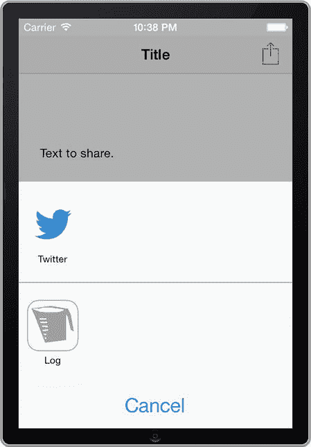

**图 8-5.**  包含一个用于在标准输出流上记录内容的自定义活动的活动视图

如果你点击“日志”图标，你的内容将被发送到标准输出流，如图 8-6 所示。

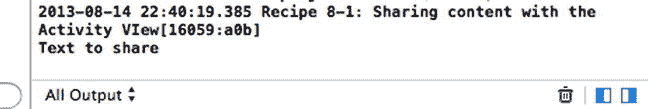

**图 8-6.**  分享测试应用将其内容发送到自定义日志活动项后的状态


## 食谱 8-2：使用 Compose 视图共享内容

如上一食谱所述，活动视图提供了一种标准化的方式，可通过多种渠道共享内容。在大多数情况下，这符合你的需求；用户能够识别出与其他应用相似的界面，并可以选择任何对他们有意义的方式来共享内容。但如果你希望跳过这一步，直接将用户带到撰写推文的界面呢？对于这种情况，你可以使用 `SLComposeViewController`，这个类会向用户呈现一个标准视图，用户可以在其中通过支持的社交网络撰写帖子。这与你在活动视图中点击"Twitter"按钮时所看到的撰写视图相同。

目前，`SLComposeViewController` 支持向 Facebook、Twitter 和微博发布内容。在本食谱中，你将在食谱 8-1 的基础上进行扩展，添加一个按钮，该按钮使用 `SLComposeViewController` 显示一个已填充内容的撰写视图，用户可直接通过该视图将内容发布到 Facebook。

`SLComposeViewController` 位于 Social 框架中，因此首先将其添加到你的项目中（请参考第 1 章的食谱 1-2）。然后在主视图中添加一个标题为"发布到 Facebook"的按钮。使新的用户界面看起来像图 8-7 所示。

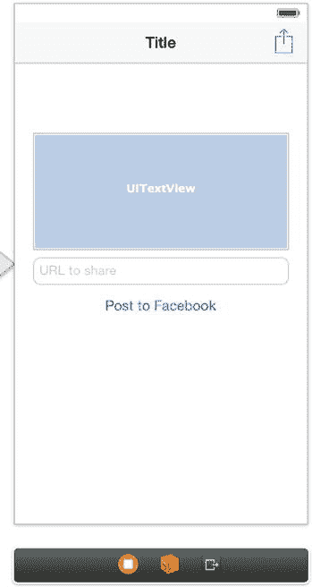

**图 8-7.** 包含直接定位 Facebook 共享按钮的用户界面

为新按钮创建一个名为 `shareOnFacebook` 的操作。同时，在视图控制器的头文件中导入 Social 框架 API。`ViewController.h` 文件应如代码清单 8-8 所示。

**代码清单 8-8.** 完整的 `ViewController.h` 文件

```
//
//  ViewController.h
//  Recipe 8-1 Sharing content with the Activity View
//

#import <UIKit/UIKit.h>
#import <Social/Social.h>

@interface ViewController : UIViewController

@property (weak, nonatomic) IBOutlet UITextView *messageTextView;
@property (weak, nonatomic) IBOutlet UITextField *urlTextField;

- (IBAction)shareContent:(id)sender;
- (IBAction)shareOnFacebook:(id)sender;

@end
```

最后，实现 `shareOnFacebook:` 操作方法。代码清单 8-9 显示了实现文件。

**代码清单 8-9.** `ViewController.m` 文件中 `shareOnFacebook:` 方法的修改

```
//
//  ViewController.m
//  Recipe 8-1 Sharing content with the Activity View
//

#import "ViewController.h"
#import "MyLogActivity.h"

@implementation ViewController

// ...

- (IBAction)shareOnFacebook:(id)sender
{
    NSString *text = self.messageTextView.text;
    NSURL *url = [NSURL URLWithString:self.urlTextField.text];
    SLComposeViewController *cv =
        [SLComposeViewController composeViewControllerForServiceType:SLServiceTypeFacebook];
    [cv setInitialText:text];
    [cv addURL:url];
    [self presentViewController:cv animated:YES completion:nil];
}

@end
```

> **注意：** 除了 URL 对象，撰写视图还支持通过 `addImage:` 方法添加图像对象。

如你所见，你使用文本视图中的文本和文本字段中的 URL 初始化了撰写视图。如果你现在构建并运行项目，并点击"发布到 Facebook"按钮，将会看到一个 Facebook 撰写表单，你可以通过它将内容发布到你的 Facebook 账户。与活动视图一样，你免费获得了所有内置的集成功能，因此如果用户没有安装账户，系统会询问是否要设置一个。图 8-8 展示了一个示例。

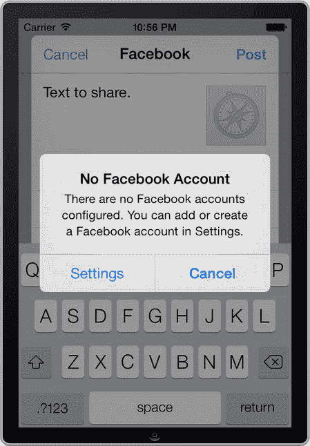

**图 8-8.** 如果用户没有所选服务的账户，iOS 会询问是否应设置一个

在这个示例中，你将撰写视图初始化为针对 Facebook。设置 Twitter 或微博的代码几乎相同。你唯一需要做的操作是分别将 `SLServiceTypeFacebook` 常量替换为 `SLServiceTypeTwitter` 或 `SLServiceTypeWeibo`，如下例所示：

```
SLComposeViewController *cv =
    [SLComposeViewController composeViewControllerForServiceType: SLServiceTypeTwitter ];
```

## 食谱 8-3：使用 SLRequest 共享内容

在食谱 8-1 和 8-2 中，你学习了如何使用内置用户界面共享内容。然而，对于某些应用来说，构建完全自定义的用户界面是合理的。例如，如果你计划构建有史以来最好的 Twitter 或 Facebook 应用，或者如果你的用户对内置撰写视图提供的最后编辑功能不感兴趣，他们可能会从更自动化的发布体验中受益。

这些应用希望使用相应社交网络服务的原生 API。幸运的是，iOS 7 通过 `SLRequest` 类提供了极大的帮助。它为你处理了复杂的认证处理，让你的工作轻松得多。

在本食谱中，我们将展示如何使用 `SLRequest` 发送推文。你需要创建一个新的单视图应用项目。你还需要使用两个外部框架：Social 框架和 Accounts 框架，后者被 Social 框架用于处理授权。在继续之前，请确保将这些框架添加到你的项目中。

### 设置主视图

首先设置用户界面，使其类似于图 8-9。你需要一个文本视图、一个按钮和一个标签。使标签居中、显示两行并自动换行。

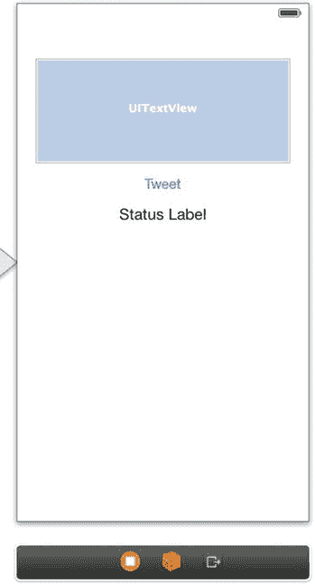

**图 8-9.** 用于发布到 Twitter 的简单用户界面

创建以下输出口和操作：
- 输出口：`textView`
- 输出口：`statusLabel`
- 按钮操作：`shareOnTwitter`

最后，导入 Social 和 Accounts 框架 API。你的 `ViewController.h` 现在应如代码清单 8-10 所示。

**代码清单 8-10.** 修改后的 `ViewController.h` 文件

```
//
//  ViewController.h
//  Recipe 8-3 Sharing Content Using SLRequest
//

#import <UIKit/UIKit.h>
#import <Social/Social.h>
#import <Accounts/Accounts.h>

@interface ViewController : UIViewController

@property (weak, nonatomic) IBOutlet UITextView *textView;
@property (weak, nonatomic) IBOutlet UILabel *statusLabel;

- (IBAction)shareOnTwitter:(id)sender;

@end
```


### 请求访问 Twitter 账户

在准备 `SLRequest` 对象时，你需要采取的第一个操作是请求访问相关账户类型。为此，你需要一个 `ACAccountStore` 实例。该实例的关键在于，它必须在整个发送请求的过程中保持活跃状态。最简单的方法就是将其赋值给一个属性以保持引用。

参照**代码清单 8-11** 中的粗体部分，将以下属性声明添加到 `ViewController.h` 文件中。

**代码清单 8-11.** 向 `ViewController.h` 文件添加 `ACAccountStore` 属性

```
//
//  ViewController.h
//  Recipe 8-3 Sharing Content Using SLRequest
//

#import <UIKit/UIKit.h>
#import <Social/Social.h>
#import <Accounts/Accounts.h>

@interface ViewController : UIViewController

@property (weak, nonatomic) IBOutlet UITextView *textView;
@property (weak, nonatomic) IBOutlet UILabel *statusLabel;
@property (strong, nonatomic) ACAccountStore *accountStore;

- (IBAction)shareOnTwitter:(id)sender;

@end
```

现在你可以在 `ViewController.m` 中开始实现 `shareOnTwitter:` 动作方法。首先，参照**代码清单 8-12** 中的粗体部分添加代码，以请求访问设备上已注册的 Twitter 账户。

**代码清单 8-12.** 完成 `shareOnTwitter:` 方法的实现

```
- (IBAction)shareOnTwitter:(id)sender
{
    self.accountStore = [[ACAccountStore alloc] init];
    ACAccountType *accountType =
        [self.accountStore accountTypeWithAccountTypeIdentifier:ACAccountTypeIdentifierTwitter];

    [self.accountStore requestAccessToAccountsWithType:accountType options:nil
        completion:^(BOOL granted, NSError *error)
        {
            if (granted)
            {
                //TODO: 获取 Twitter 账户并向其发送推文
            }
            else
            {
                //TODO: 处理未授权的情况
            }
        }
    ];
}
```

在**代码清单 8-12** 中，有趣的是 `requestAccessToAccountsWithType:options:completion:` 方法。它是异步的，因此你需要提供一个代码块，该方法执行完毕后会调用该代码块。然后，你可以通过检查同名参数来判断请求是否被授权。

如果访问 Twitter 账户的请求被拒绝，只需更新状态标签即可。然而，你位于代码块内部这一点使得事情稍显复杂。问题在于，完成代码块可能在任意线程上被调用，而你只能从主线程更新用户界面。为了处理这个问题，使用 `dispatch_async` 函数（它也接受一个代码块参数）来从主线程执行状态标签的更新，如**代码清单 8-13** 所示。

**代码清单 8-13.** 在 `requestAccessToAccountsWithType:options:completion:` 方法中添加代码以更新标签

```
[self.accountStore requestAccessToAccountsWithType:accountType options:nil
    completion:^(BOOL granted, NSError *error)
    {
        __block NSString *statusText = @"";

        if (granted)
        {
            //TODO: 获取 Twitter 账户并向其发送推文
        }
        else
        {
            statusText = @"Twitter 账户的访问请求未被授权";
        }

        dispatch_async(dispatch_get_main_queue(), ^(void)
        {
            self.statusLabel.text = statusText;
        });
    }
];
```

现在我们将切换重点，实现 `sendText:toTwitterAccount:` 辅助方法。这个方法实际上负责发布内容到 Twitter。它是本范例的主要内容，因此我们将对其各部分进行解释。

首先，它会为操作构建一个 `SLRequest` 对象。在本例中，你将请求 Twitter 更新状态文本，如**代码清单 8-14** 所示。

**代码清单 8-14.** 在 `sendText:toTwitterAccount:` 方法中添加 Twitter 请求

```
- (void)sendText:(NSString *)text toTwitterAccount:(ACAccount *)twitterAccount
{
    NSURL *requestURL = [NSURL URLWithString:@"http://api.twitter.com/1/statuses/update.json"];
    SLRequest *tweetRequest = [SLRequest requestForServiceType:SLServiceTypeTwitter
                                requestMethod:SLRequestMethodPOST URL:requestURL
                                parameters:[NSDictionary dictionaryWithObject:text forKey:@"status"]];
    // ...
}
```


接下来，将账户分配给请求。这一步非常重要，因为它允许 `Service` 框架处理与 Twitter 的所有认证通信。清单 8-15 展示了以粗体显示的新增代码。

**清单 8-15. 向清单 8-14 添加代码以设置 Twitter 账户**

```
- (void)sendText:(NSString *)text toTwitterAccount:(ACAccount *)twitterAccount
{
    NSURL *requestURL = [NSURL URLWithString:@"http://api.twitter.com/1/statuses/update.json"];
    SLRequest *tweetRequest = [SLRequest requestForServiceType:SLServiceTypeTwitter
                                                requestMethod:SLRequestMethodPOST
                                                          URL:requestURL
                                                   parameters:[NSDictionary dictionaryWithObject:text forKey:@"status"]];
    [tweetRequest setAccount:twitterAccount];
    // ...
}
```

最后，该方法异步发送请求，并提供一个在完成时被调用的代码块。这个新增内容如清单 8-16 所示。

**清单 8-16. 向清单 8-15 添加代码以发送异步请求**

```
- (void)sendText:(NSString *)text toTwitterAccount:(ACAccount *)twitterAccount
{
    NSURL *requestURL = [NSURL URLWithString:@"http://api.twitter.com/1/statuses/update.json"];
    SLRequest *tweetRequest = [SLRequest requestForServiceType:SLServiceTypeTwitter
                                                requestMethod:SLRequestMethodPOST
                                                          URL:requestURL
                                                   parameters:[NSDictionary dictionaryWithObject:text forKey:@"status"]];
    [tweetRequest setAccount:twitterAccount];
    [tweetRequest performRequestWithHandler:
     ^(NSData *responseData, NSHTTPURLResponse *urlResponse, NSError *error)
     {
         __block NSString *status;
         if ([urlResponse statusCode] == 200)
         {
             status = [NSString stringWithFormat:@"Tweeted successfully to %@",
                       twitterAccount.accountDescription];
         }
         else
         {
             status = @"Error occurred!";
             NSLog(@"%@", error);
         }
         dispatch_async(dispatch_get_main_queue(), ^(void)
         {
             self.statusLabel.text = status;
         });
     }];
}
```

> **注意：** 如上述方法所示，你可以通过检查 `urlResponse` 的 `statusCode` 来评估 `SLRequest` 的结果。如果该值为 200，则请求成功完成。否则，存在某种错误。有关各种错误码的详细信息，请参考 Twitter API：[`https://dev.twitter.com/docs/error-codes-responses`](https://dev.twitter.com/docs/error-codes-responses)。

现在 `sendText:toTwitterAccount` 方法已经完成，你将补全清单 8-12 中的“TODO” case。这里将利用这个新方法，尽管你可以使用账户存储的 `accountsWithAccountType` 方法来获取可用账户数组。用户可能在设备上安装了多个 Twitter 账户。目前，我们将简化处理，获取列表中的第一个账户，如清单 8-17 所示。稍后，你将添加允许用户选择使用哪个 Twitter 账户的代码。

**清单 8-17. 补全 `requestToAccountsWithType:completion:` 方法完成块中的“granted if”语句**

```
- (IBAction)shareOnTwitter:(id)sender
{
    self.accountStore = [[ACAccountStore alloc] init];
    ACAccountType *accountType =
        [self.accountStore accountTypeWithAccountTypeIdentifier:ACAccountTypeIdentifierTwitter];
    [self.accountStore requestAccessToAccountsWithType:accountType options:nil
                                           completion:^(BOOL granted, NSError *error)
     {
         __block NSString *statusText = @"";
         if (granted)
         {
             NSArray *availableTwitterAccounts =
                 [self.accountStore accountsWithAccountType:accountType];
             if (availableTwitterAccounts.count == 0)
             {
                 statusText = @"No Twitter accounts available";
             }
             else
             {
                 ACAccount *account = [availableTwitterAccounts objectAtIndex:0];
                 [self sendText:self.textView.text toTwitterAccount:account];
             }
         }
         else
         {
             statusText = @"Access to Twitter accounts was not granted";
         }
         dispatch_async(dispatch_get_main_queue(), ^(void)
         {
             self.statusLabel.text = statusText;
         });
     }];
}
```

如果你现在构建并运行（并且在设备上至少设置了一个 Twitter 账户），你应该能够从你的应用发送推文，如图 8-10 所示。


**图 8-10.** 从应用成功发送了一条推文


### 处理多个账户

如果用户在设备上设置了多个 Twitter 账户，该如何处理？目前，我们的应用会使用列表中的第一个账户，但您将为其添加一项功能，允许用户实际选择要使用的账户。

您将使用一个警示视图来展示可供用户选择的可用账户。这需要按以下步骤操作：

- 将当前是 `shareOnTwitter:` 方法中局部变量的 `availableTwitterAccounts` 数组提升为实例变量。
- 在警示视图的委托方法中引用该数组。
- 通过将 `UIAlertViewDelegate` 协议添加到视图控制器类，使视图控制器成为警示视图的委托。

要在代码中执行这些步骤，请将清单 8-18 中加粗的项目添加到您的 `ViewController.h` 文件中。

**清单 8-18.** 设置视图控制器头文件以允许账户选择警示视图

```
//
//  ViewController.h
//  Recipe 8-3 Sharing Content Using SLRequest
//

#import <UIKit/UIKit.h>
#import <Social/Social.h>
#import <Accounts/Accounts.h>

@interface ViewController : UIViewController <UIAlertViewDelegate>
{
@private
    NSArray *availableTwitterAccounts;
}

@property (weak, nonatomic) IBOutlet UITextView *textView;
@property (weak, nonatomic) IBOutlet UILabel *statusLabel;
@property (strong, nonatomic) ACAccountStore *accountStore;

- (IBAction)shareOnTwitter:(id)sender;
@end
```

然后，在 `ViewController.m` 文件的 `shareOnTwitter:` 方法中，进行清单 8-19 所示的更改。

**清单 8-19.** 更新 `shareOnTwitter` 方法来处理多个账户

```
- (IBAction)shareOnTwitter:(id)sender
{
    self.accountStore = [[ACAccountStore alloc] init];
    ACAccountType *accountType =
        [self.accountStore accountTypeWithAccountTypeIdentifier:ACAccountTypeIdentifierTwitter];

    [self.accountStore requestAccessToAccountsWithType:accountType options:nil
        completion:^(BOOL granted, NSError *error)
    {
        __block NSString *statusText = @"";

        if (granted)
        {
            availableTwitterAccounts = [self.accountStore accountsWithAccountType:accountType];

            if (availableTwitterAccounts.count == 0)
            {
                statusText = @"No Twitter accounts available";
            }

            if (availableTwitterAccounts.count == 1)
            {
                ACAccount *account = [availableTwitterAccounts objectAtIndex:0];
                [self sendText:self.textView.text toTwitterAccount:account];
            }
            else if (availableTwitterAccounts.count > 1)
            {
                dispatch_async(dispatch_get_main_queue(), ^(void)
                {
                    UIAlertView *alert =
                        [[UIAlertView alloc] initWithTitle:@"Select Twitter Account"
                                                    message:@"Select the Twitter account you want to use."
                                                   delegate:self
                                          cancelButtonTitle:@"Cancel"
                                          otherButtonTitles:nil];

                    for (ACAccount *twitterAccount in availableTwitterAccounts)
                    {
                        [alert addButtonWithTitle:twitterAccount.accountDescription];
                    }

                    [alert show];
                });
            }
        }
        else
        {
            statusText = @"Access to Twitter accounts was not granted";
        }

        dispatch_async(dispatch_get_main_queue(), ^(void)
        {
            self.statusLabel.text = statusText;
        });
    }];
}
```

请注意，您将警示视图包装在与更新状态标签时相同的 `dispatch_async()` 调用中。原因相同：警示视图必须在主线程上运行，否则可能会遇到问题。

剩下的唯一任务是在用户从警示视图中选择一个账户时做出响应。通过添加清单 8-20 所示的委托方法来实现这一点。

**清单 8-20.** `alertView:clickedButtonAtIndex:` 方法的实现

```
-(void)alertView:(UIAlertView *)alertView clickedButtonAtIndex:(NSInteger)buttonIndex
{
    if (buttonIndex == 0)
    {
        // 用户取消了
        return;
    }

    NSInteger indexInAvailableTwitterAccountsArray = buttonIndex - 1;
    ACAccount *selectedAccount = [availableTwitterAccounts
        objectAtIndex:indexInAvailableTwitterAccountsArray];
    [self sendText:self.textView.text toTwitterAccount:selectedAccount];
}
```

在您再次构建并运行应用之前，请确保在设备（或 iOS 模拟器）上设置了多个 Twitter 账户。下次您点击“推文”按钮时，您就可以选择使用哪个账户来发送推文。图 8-11 展示了一个警示视图的示例。

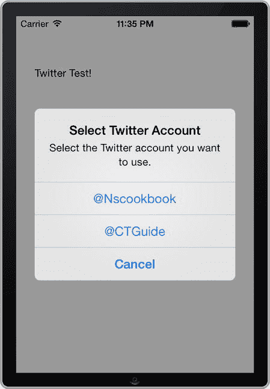

**图 8-11.** 允许用户选择发布推文所用 Twitter 账户的警示视图

## 秘方 8-4：检索推文

既然您已经了解了可以将更新发布到 Twitter 的几种不同方法，您就可以应用上一个秘方中围绕 `SLRequest` 类的概念，来构建一个能够获取并显示推文的应用程序。

在本秘方中，您将构建一个简单的 Twitter 阅读器应用，允许用户查看 Twitter 时间线上的最新推文。该时间线将根据用户在设备上安装的可用账户来显示。这将通过一个由导航控制器和多个表格视图控制器组成的新应用来实现，以进行基本的推文导航。

### 设置基于导航的应用程序

首先，从头开始设置新项目。这次使用“Empty Application”模板。您可以将项目命名为“Recipe 8-4 Retrieving Tweets”。对于本秘方，我们将以编程方式创建界面。与上一个秘方一样，您需要使用 Social 和 Accounts 框架，所以请继续将它们链接到您的项目中。稍后我们需要将这些框架导入到我们将创建的视图控制器中。

接下来，创建主视图控制器。它会显示 Twitter 订阅源列表，因此创建一个名为 `MainTableViewController` 的新类，并将其设置为 `UITableViewController` 的子类。您不需要 `.xib` 文件来设计任何用户界面，因此请确保“With XIB for user interface”选项未被选中。

在实现新视图控制器之前，请转到应用委托，添加实现导航控制器所需的代码。打开 `AppDelegate.h` 文件，并为导航控制器添加一个属性，如清单 8-21 所示。

**清单 8-21.** 修改 `AppDelegate.h` 文件以包含 `UINavigationController` 属性

```
//
//  AppDelegate.h
//  Recipe 8-4 Retrieving Tweets
//

#import <UIKit/UIKit.h>

@interface AppDelegate : UIResponder <UIApplicationDelegate>

@property (strong, nonatomic) UIWindow *window;
@property (strong, nonatomic) UINavigationController *navigationController;

@end
```

`AppDelegate.m` 文件对应的实现以粗体显示在清单 8-22 中。这里我们只是创建了我们创建的 `MainTableViewController` 类的一个实例。我们还将它设置为根视图控制器，并设置了一个导航控制器。

**清单 8-22.** 修改 `AppDelegate.m` 文件以创建 `MainTableViewController` 实例

```
//
//  AppDelegate.m
//  Recipe 8-4 Retrieving Tweets
//

#import "AppDelegate.h"
#import "MainTableViewController.h"

@implementation AppDelegate

- (BOOL)application:(UIApplication *)application didFinishLaunchingWithOptions:(NSDictionary *)launchOptions
{
    self.window = [[UIWindow alloc] initWithFrame:[[UIScreen mainScreen] bounds]];
    // 应用启动后的自定义覆盖点。

    UITableViewController *mainViewController =
        [[MainTableViewController alloc] initWithStyle:UITableViewStyleGrouped];

    self.navigationController =
        [[UINavigationController alloc] initWithRootViewController:mainViewController];

    self.window.rootViewController = self.navigationController;
    self.window.backgroundColor = [UIColor whiteColor];
    [self.window makeKeyAndVisible];

    return YES;
}

// ...
@end
```


### 显示可用的信息源

现在你已经连接了导航控制器和主表格视图控制器，可以开始实现表格视图了。表格视图会显示用户可以选择查看的若干 Twitter 信息源。在本节中，你将添加当前已安装 Twitter 账户的信息源。

要检索已安装的账户，你需要一个账户存储区和一个用于存储可用账户的数组。转到`MainTableViewController.h`文件，并添加声明，如代码清单 8-23 中粗体所示。

**代码清单 8-23.** 修改 `MainTableViewController.h` 文件以添加用于管理账户的属性

```
//
//  MainTableViewController.h
//  Recipe 8-4 Retrieving Tweets
//

#import <UIKit/UIKit.h>
#import <Accounts/Accounts.h>

@interface MainTableViewController : UITableViewController

@property (strong, nonatomic) ACAccountStore *accountStore;
@property (strong, nonatomic) NSArray *twitterAccounts;

@end
```

接下来，转到`MainTableViewController.m`文件，在`viewDidLoad`方法中添加代码，以设置导航标题，同时初始化并调用我们将要创建的`retrieveAccounts`方法。修改`viewDidLoad`方法，如代码清单 8-24 所示。

**代码清单 8-24.** 修改 `viewDidLoad` 方法以设置导航标题以及初始化和检索账户

```
- (void)viewDidLoad
{
    [super viewDidLoad];
    self.navigationItem.title = @"My Twitter Reader";
    self.accountStore = [[ACAccountStore alloc] init];
    [self retrieveAccounts];
}
```

在辅助方法`retrieveAccounts`中，我们将请求访问 Twitter 账户的权限。你可能会认出代码清单 8-25 中的实现，它与前一个食谱中的实现类似。

**代码清单 8-25.** 实现 `retrieveAccounts` 方法

```
- (void)retrieveAccounts
{
    ACAccountType *accountType =
        [self.accountStore accountTypeWithAccountTypeIdentifier:ACAccountTypeIdentifierTwitter];

    [self.accountStore requestAccessToAccountsWithType:accountType options:nil
        completion:^(BOOL granted, NSError *error)
    {
        if (granted)
        {
            self.twitterAccounts = [self.accountStore accountsWithAccountType:accountType];
            dispatch_async(dispatch_get_main_queue(), ^(void)
            {
                [self.tableView reloadData];
            });
        }
    }];
}
```

接下来，实现表格视图数据源的委托方法，让表格视图知道它应该显示多少行和多少分区。你只使用一个分区，在其中显示公共信息源以及可用的 Twitter 账户。代码清单 8-26 展示了这两个方法。

**代码清单 8-26.** 显示正确行数和分区数的委托方法实现

```
- (NSInteger)numberOfSectionsInTableView:(UITableView *)tableView
{
    // 返回分区数。
    return 1;
}

- (NSInteger)tableView:(UITableView *)tableView numberOfRowsInSection:(NSInteger)section
{
    // 返回该分区的行数。
    return self.twitterAccounts.count;
}
```

接下来，创建一个表格视图单元格类，用于显示表格视图中的项目。为此，创建一个新的`UITableViewCell`类，并将其命名为`TwitterFeedCell`。打开这个新类的头文件，并添加如代码清单 8-27 中粗体所示的代码。

**代码清单 8-27.** 修改 `AppDelegate.h` 文件以包含 `UINavigationController` 属性

```
//
//  TwitterFeedCell.h
//  Recipe 8-4 Retrieving Tweets
//

#import <UIKit/UIKit.h>
#import <Accounts/Accounts.h>

extern NSString * const TwitterFeedCellId;

@interface TwitterFeedCell : UITableViewCell

@property (strong, nonatomic) ACAccount *twitterAccount;

@end
```

> **注意：** 在代码清单 8-27 中，你会看到一种使用`extern`创建变量的新方式。这会创建一个可以在应用程序中任何位置访问的变量。其他编程语言可能称之为全局变量。在本文后续内容中，你会看到我们在另一个类中使用了这个变量。

现在你将设置一个具有默认外观的非常简单的单元格。但是，你需要添加一个公开指示器，以提示用户点击该单元格后会有详细视图。打开`TwitterFeedCell.m`文件，并修改 Xcode 为你生成的`initWithStyle:reuseIdentifier:`方法，如代码清单 8-28 所示。

**代码清单 8-28.** 在初始化方法中创建单元格公开指示器

```
- (id)initWithStyle:(UITableViewCellStyle)style reuseIdentifier:(NSString *)reuseIdentifier
{
    self = [super initWithStyle:style reuseIdentifier:reuseIdentifier];
    if (self) {
        // 初始化代码
        self.accessoryType = UITableViewCellAccessoryDisclosureIndicator;
    }
    return self;
}
```

你还将设置重用常量，稍后将用它从表格视图的单元格缓存中“出队”单元格。代码清单 8-29 显示了需要添加的那行代码。

**代码清单 8-29.** 设置单元格重用常量

```
//
//  TwitterFeedCell.m
//  Recipe 8-4 Retrieving Tweets
//

#import "TwitterFeedCell.h"

NSString * const TwitterFeedCellId = @"TwitterFeedCell";

@implementation TwitterFeedCell

// ...

@end
```

最后，你将在`TwitterFeedCell.m`文件中为`twitterAccount`属性添加一个自定义设置器方法。该设置器会设置属性，并更新单元格的标签文本。如果账户属性为`nil`，你可以假设该单元格代表公共 Twitter 信息源。代码清单 8-30 展示了该设置器的实现。

**代码清单 8-30.** 实现自定义设置器方法 `setTwitterAccount:`

```
- (void)setTwitterAccount:(ACAccount *)account
{
    _twitterAccount = account;
    if (_twitterAccount)
    {
        self.textLabel.text = _twitterAccount.accountDescription;
    }
    else
    {
        NSLog(@"未提供 Twitter 账户！");
    }
}
```

单元格类完成后，你可以返回主表格视图控制器来完成实现。首先，你需要在表格视图中注册`TwitterFeedCell`类。你可以在`viewDidLoad`方法中完成此操作，如代码清单 8-31 所示。

**代码清单 8-31.** 在 `MainTableViewController` 类中注册 `TwitterFeedCell` 类

```
//
//  MainTableViewController.m
//  Recipe 8-4 Retrieving Tweets
//

#import "MainTableViewController.h"
#import "TwitterFeedCell.h"

@implementation MainTableViewController

// ...

- (void)viewDidLoad
{
    [super viewDidLoad];
    //注意此处使用了 extern 变量
    [self.tableView registerClass:TwitterFeedCell.class
        forCellReuseIdentifier:TwitterFeedCellId];
    self.navigationItem.title = @"Twitter Feeds";
    self.accountStore = [[ACAccountStore alloc] init];
    [self retrieveAccounts];
}

// ...

@end
```

现在你可以在`tableView:cellForRowAtIndexPath:`委托方法中实现单元格的创建，如代码清单 8-32 所示。这段代码相对简单。首先，为每个账户创建一个单元格实例；由于这些是已注册的单元格，它们将使用我们创建的自定义类。对于每个单元格，设置`twitterAccount`属性，这反过来会调用自定义设置器来设置单元格的标签文本。

**代码清单 8-32.** `tableView:cellForRowAtIndexPath:` 委托方法的实现

```
- (UITableViewCell *)tableView:(UITableView *)tableView cellForRowAtIndexPath:(NSIndexPath *)indexPath
{
    TwitterFeedCell *cell = [tableView dequeueReusableCellWithIdentifier:TwitterFeedCellId forIndexPath:indexPath];

    // 配置单元格...
    cell.twitterAccount = [self.twitterAccounts objectAtIndex:indexPath.row];

    return cell;
}
```

现在，如果你构建并运行应用程序，你应该会看到类似于图 8-12 所示的屏幕。

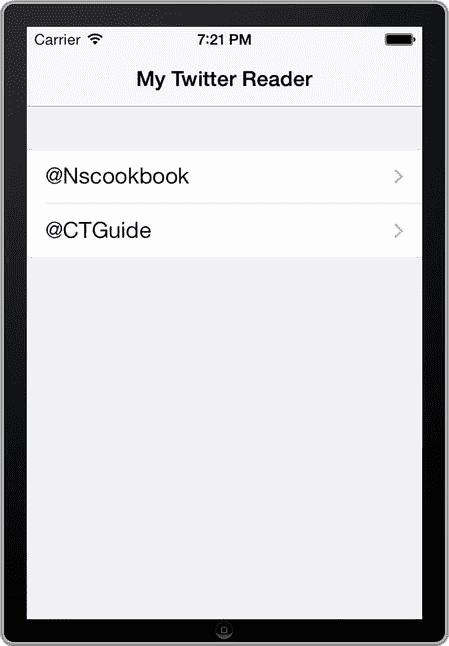

**图 8-12.** 一个显示可用 Twitter 信息源的简单 Twitter 阅读器


### 显示推文

主视图搭建完成并能正常运行后，你可以继续添加另一个视图来显示所选时间线。你仍将使用表格视图来实现这个视图，因此首先创建一个新的 `UITableViewController` 类，这次命名为 `TweetTableViewController`。同样，你不需要为用户界面创建 `.xib` 文件，因此取消该选项的勾选。

这个新视图接收一个 Twitter 账户，并在表格视图中显示其时间线。首先从设置头文件开始。将**清单 8-33** 中以粗体显示的代码添加到 `TweetTableViewController.h` 文件中。

**清单 8-33.** 设置 `TweetTableViewController.h` 头文件

```
//
//  TweetTableViewController.h
//  Recipe 8-4 Retrieving Tweets
//

#import <UIKit/UIKit.h>
#import <Accounts/Accounts.h>
#import <Social/Social.h>

@interface TweetTableViewController : UITableViewController

@property (strong, nonatomic) ACAccount *twitterAccount;
@property (strong, nonatomic) NSMutableArray *tweets;

- (id)initWithStyle:(UITableViewStyle)style;
- (id)initWithTwitterAccount:(ACAccount *)account;

@end
```

在实现文件中，首先实现初始化方法。将**清单 8-34** 中以粗体显示的代码添加进去。

**清单 8-34.** 实现初始化方法

```
- (id)initWithStyle:(UITableViewStyle)style
{
    self = [super initWithStyle:style];
    if (self) {
        // Custom initialization
        self.tweets = [[NSMutableArray alloc] initWithCapacity:50];
    }
    return self;
}

- (id)initWithTwitterAccount:(ACAccount *)account
{
    self = [self initWithStyle:UITableViewStylePlain];
    if (self) {
        self.twitterAccount = account;
    }
    return self;
}
```

稍后你会看到，我们使用 `initWithTwitterAccount:` 方法来设置视图控制器。然而，通过将初始化过程拆分为两个方法，也确保了视图控制器在默认设置场景下能够正常工作。如果你决定复用此类并尝试在不指定账户的情况下对其进行初始化（例如 `[[TweetTableViewController alloc] init]`），这种设计就会很有用。

在 `viewDidLoad` 方法中，更新导航栏的标题，并调用接下来将要实现的方法来获取时间线。按照**清单 8-35** 所示修改 `viewDidLoad` 方法。

**清单 8-35.** 修改 `viewDidLoad` 方法以设置导航标题并调用 `retrieveTweets` 方法

```
- (void)viewDidLoad
{
    [super viewDidLoad];
    self.navigationItem.title = self.twitterAccount.accountDescription;
    [self retrieveTweets];
}
```

`retrieveTweets` 方法是本范例的核心。它负责从指定的 Twitter 信息流中获取推文。该 Twitter 信息流将是用户的主页时间线。**清单 8-36** 展示了该方法的实现。

**清单 8-36.** 实现 `retrieveTweets` 方法

```
- (void)retrieveTweets
{
    [self.tweets removeAllObjects];
    SLRequest *request;

    if (self.twitterAccount)
    {
        // Get home timeline of the Twitter account
        NSURL *requestURL = [NSURL URLWithString:@"http://api.twitter.com/1.1/statuses/home_timeline.json"];
        request = [SLRequest requestForServiceType:SLServiceTypeTwitter
                                    requestMethod:SLRequestMethodGET
                                              URL:requestURL
                                       parameters:nil];
        [request setAccount:self.twitterAccount];
    }
    else
    {
        NSLog(@"Uh oh, there's no Twitter account!");
    }

    [request performRequestWithHandler:^(NSData *responseData, NSHTTPURLResponse *urlResponse, NSError *error)
    {
        if ([urlResponse statusCode] == 200)
        {
            NSError *jsonParsingError;
            self.tweets = [NSJSONSerialization JSONObjectWithData:responseData
                                                         options:0
                                                           error:&jsonParsingError];
        }
        else
        {
            NSLog(@"HTTP response status: %i\n", [urlResponse statusCode]);
        }

        dispatch_async(dispatch_get_main_queue(), ^(void)
        {
            [self.tableView reloadData];
        });
    }];
}
```


图 8-13 中有很多内容，我们来逐一分析。首先，我们从 `tweets` 数组中移除所有推文。如果有可用的账户，则使用 Twitter API URL 创建一个请求，以获取状态：`http://api.twitter.com/1.1/statuses/home_timeline.json`。然后执行请求，并在完成后填充 `tweets` 数组。

请注意，来自 Twitter 的响应是 `JSON` 格式，你可以使用 `NSJSONSerialization` 类对其进行解码。结果是一个字典数组，每个字典对应一条推文。

有了数据之后，你可以开始实现表格视图来显示它。与主表格视图一样，你将只有一个包含最新推文的区段。对 `numberOfSectionsInTableView:` 和 `tableView:numberOfRowsInSection:` 方法进行修改，如代码清单 8-37 所示。

**代码清单 8-37.** 实现用于显示正确行数和区段数的委托方法

```
- (NSInteger)numberOfSectionsInTableView:(UITableView *)tableView
{
    // Return the number of sections.
    return 1;
}

- (NSInteger)tableView:(UITableView *)tableView numberOfRowsInSection:(NSInteger)section
{
    // Return the number of rows in the section.
    return self.tweets.count;
}
```

由于此表格视图中的单元格在外观和内容上与主表格视图中的略有不同，你需要创建一个新的 `UITableViewCell` 子类。这一次，将类命名为 `TweetCell`。

打开 `TweetCell.h` 并进行修改，如代码清单 8-38 所示。

**代码清单 8-38.** 设置 `TweetCell.h` 文件

```
//
//  TweetCell.h
//  Recipe 8-4 Retrieving Tweets
//

#import <UIKit/UIKit.h>

extern NSString * const TweetCellId = @"TweetCell";

@interface TweetCell : UITableViewCell

@property (strong, nonatomic)NSDictionary *tweetData;

@end
```

此单元格类型使用带有副标题和公开指示器的标准外观。对 `initWithStyle:reuseIdentifier:` 方法（在 `TweetCell.m` 文件中）进行这些修改，如代码清单 8-39 所示。

**代码清单 8-39.** 实现自定义 `TweetCell` 初始化器

```
- (id)initWithStyle:(UITableViewCellStyle)style reuseIdentifier:(NSString *)reuseIdentifier
{
    self = [super initWithStyle:UITableViewCellStyleSubtitle reuseIdentifier:reuseIdentifier];
    if (self)
    {
        // Initialization code
        self.accessoryType = UITableViewCellAccessoryDisclosureIndicator;
    }
    return self;
}
```

当单元格接收到新的推文数据时，它会更新其标签。为了实现这一点，你需要为 `tweetData` 属性添加一个自定义的 setter 方法，如代码清单 8-40 所示。

**代码清单 8-40.** 实现 `setTweetData:` 方法

```
-(void)setTweetData:(NSDictionary *)tweetData
{
    _tweetData = tweetData;
    // Update cell
    NSDictionary *userData = [_tweetData objectForKey:@"user"];
    self.textLabel.text = [userData objectForKey:@"name"];
    self.detailTextLabel.text = [_tweetData objectForKey:@"text"];
}
```

接下来，完成表格视图的实现。返回 `TweetTableViewController.m` 并进行修改，如代码清单 8-41 所示。

**代码清单 8-41.** 注册 `TweetCell` 类并将单元格添加到表格中

```
//
//  TweetTableViewController.m
//  Recipe 8-4 Retrieving Tweets
//

#import "TweetTableViewController.h"
#import "TweetCell.h"

@implementation TweetTableViewController

- (void)viewDidLoad
{
    [super viewDidLoad];
    [self.tableView registerClass:TweetCell.class forCellReuseIdentifier:TweetCellId];
    self.navigationItem.title = self.twitterAccount.accountDescription;
    [self retrieveTweets];
}

// ...

- (UITableViewCell *)tableView:(UITableView *)tableView cellForRowAtIndexPath:(NSIndexPath *)indexPath
{
    TweetCell *cell = [tableView dequeueReusableCellWithIdentifier:TweetCellId forIndexPath:indexPath];
    // Configure the cell...
    cell.tweetData = [self.tweets objectAtIndex:indexPath.row];
    return cell;
}

// ...

@end
```

推文表格视图的代码暂时完成了，现在回到主表格视图，实现显示新视图控制器的代码。打开 `MainTableViewController.m` 并添加 `tableView:didSelectRowAtIndexPath:` 委托方法，如代码清单 8-42 所示。

**代码清单 8-42.** 向 `tableView:didSelectRowAtIndexPath:` 方法添加代码以显示推文表格视图

```
#import "TweetTableViewController.h"
#import "MainTableViewController.h"
#import "TwitterFeedCell.h"
#import "TweetTableViewController.h"

@interface MainTableViewController ()

//...

- (void)tableView:(UITableView *)tableView didSelectRowAtIndexPath:(NSIndexPath *)indexPath
{
    // Navigation logic may go here. Create and push another view controller.
    ACAccount *account = nil;
    account = [self.twitterAccounts objectAtIndex:indexPath.row];
    TweetTableViewController *detailViewController = [[TweetTableViewController alloc] initWithTwitterAccount:account];
    // ...
    // Pass the selected object to the new view controller.
    [self.navigationController pushViewController:detailViewController animated:YES];
}

//...
```

现在，再次构建并运行你的应用。这一次，你应该能够选择其中一个时间线，并获取最新推文的列表。图 8-13 展示了这个新表格视图的一个示例。

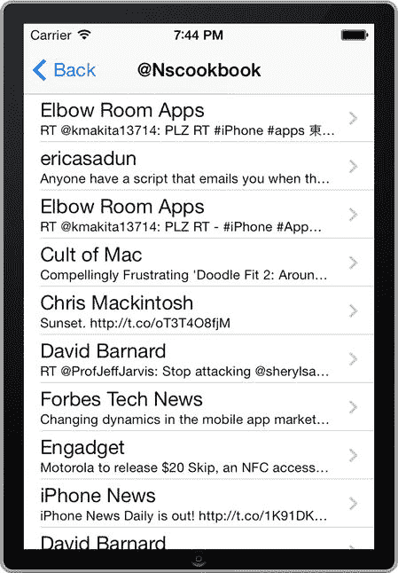

**图 8-13.**  
一个简单的推文阅读器应用，显示 Twitter 的公开推文流


### 显示单条推文

当用户点击某条推文单元格时，应显示该推文的详细视图。这将是一个简单的视图控制器，因此你需要创建一个名为“`TweetViewController`”的新 `UIViewController` 子类。不过，这次你将使用 Interface Builder 来构建其用户界面，因此请确保选中“With XIB for user interface”选项。

打开新的 `TweetViewController.xib` 文件以启动 Interface Builder。首先，你要确保在设计用户界面时考虑到导航栏。选中该视图，然后进入属性检查器。在“Simulated Metrics”部分，将“Top Bar”属性的值从“None”更改为“Translucent Navigation Bar”（见图 8-14）。这会在视图中显示一个导航栏，在创建布局时非常有用。

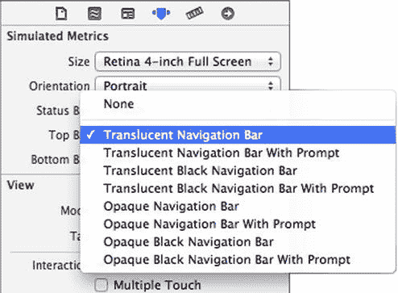

图 8-14. 模拟导航栏以辅助用户界面设计

接下来，你将创建一个用于显示推文详情的用户界面。你需要一个图像视图、四个标签和一个用于显示实际推文的文本视图。将这些控件从对象库拖到视图中，并按图 8-15 所示进行排列。请确保将“Description”标签改为两行，并稍微增大标签尺寸，以便有足够的空间容纳文本。图 8-15 中所示的图像视图尺寸为 64 点 x 64 点。

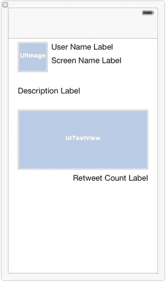

图 8-15. 用于显示单条推文的用户界面

完成用户界面的布局后，为所有组件创建输出口（outlet）。为这些输出口分别命名如下（关于创建输出口，请参考第 1 章中的“技巧 1-4”）：

- `userImageView`
- `userNameLabel`
- `userScreenNameLabel`
- `userDescriptionLabel`
- `tweetTextView`
- `retweetCountLabel`

创建好输出口后，你应在 `TweetViewController.h` 文件中看到每个输出口对应的属性。除此之外，还要添加一个 `NSDictionary` 属性，并声明一个自定义的初始化方法，如代码清单 8-43 所示。

代码清单 8-43. 在 `TweetViewController.h` 中添加 `NSDictionary` 属性和自定义初始化方法

```
//
//  TweetViewController.h
//  Recipe 8-4 Retrieving Tweets
//

#import <UIKit/UIKit.h>

@interface TweetViewController : UIViewController

@property (weak, nonatomic) IBOutlet UIImageView *userImageView;
@property (weak, nonatomic) IBOutlet UILabel *userNameLabel;
@property (weak, nonatomic) IBOutlet UILabel *userScreenNameLabel;
@property (weak, nonatomic) IBOutlet UILabel *userDescriptionLabel;
@property (weak, nonatomic) IBOutlet UITextView *tweetTextView;
@property (weak, nonatomic) IBOutlet UILabel *retweetCountLabel;
@property (strong, nonatomic) NSDictionary *tweetData;

-(id)initWithTweetData:(NSDictionary *)tweetData;

@end
```

初始化方法的实现非常简单。将初始化方法添加到 `TweetViewController.m` 文件中，如代码清单 8-44 所示。

代码清单 8-44. 在 `TweetViewController.m` 文件中添加自定义初始化方法

```
//
//  TweetViewController.m
//  Recipe 8-4 Retrieving Tweets
//

#import "TweetViewController.h"

@implementation TweetViewController

-(id)initWithTweetData:(NSDictionary *)tweetData
{
    self = [super initWithNibName:nil bundle:nil];
    if (self) {
        _tweetData = tweetData;
    }
    return self;
}

// ...

@end
```

如果有人修改了 `tweetData` 属性，你需要用新数据更新视图。因此，添加一个自定义 setter 方法，其实现如代码清单 8-45 所示。

代码清单 8-45. 实现 `setTweetData` 方法

```
-(void)setTweetData:(NSDictionary *)tweetData
{
    _tweetData = tweetData;
    [self updateView];
}
```

`updateView` 辅助方法获取推文数据并更新视图中的控件（包括图像视图）。实现该方法，如代码清单 8-46 所示。

代码清单 8-46. `updateView` 方法的实现

```
-(void)updateView
{
    NSDictionary *userData = [self.tweetData objectForKey:@"user"];
    NSString *imageURLString = [userData objectForKey:@"profile_image_url"];
    NSURL *imageURL = [NSURL URLWithString:imageURLString];
    NSData *imageData = [NSData dataWithContentsOfURL:imageURL];
    self.userImageView.image = [UIImage imageWithData:imageData];
    self.userNameLabel.text = [userData objectForKey:@"name"];
    self.userScreenNameLabel.text = [userData objectForKey:@"screen_name"];
    self.userDescriptionLabel.text = [userData objectForKey:@"description"];
    self.tweetTextView.text = [self.tweetData objectForKey:@"text"];
    self.retweetCountLabel.text = [NSString stringWithFormat:@"Retweet Count: %@",
                                   [self.tweetData objectForKey:@"retweet_count"]];
}
```

最后，在 `viewDidLoad` 方法中设置导航栏的标题，并调用代码清单 8-46 中的方法。现在的 `viewDidLoad` 方法应如代码清单 8-47 所示。

代码清单 8-47. 修改后的 `viewDidLoad` 方法

```
- (void)viewDidLoad
{
    [super viewDidLoad];
    // Do any additional setup after loading the view from its nib.
    self.navigationItem.title = @"Tweet";
    [self updateView];
}
```

你的推文视图控制器现已准备就绪。接下来，让我们实现用于显示它的代码。回到 `TweetTableViewController.m`，修改 `tableView:didSelectRowAtIndexPath:` 方法的实现，如代码清单 8-48 所示。这一步应该很熟悉，因为它与将 `TweetTableViewController` 添加到 `MainTableViewController` 的表格视图单元格中的过程几乎相同。

代码清单 8-48. 添加代码以显示 `tweetViewController`

```
#import "TweetTableViewController.h"
#import "TweetCell.h"
#import "TweetViewController.h"

@interface TweetTableViewController ()
//...

- (void)tableView:(UITableView *)tableView didSelectRowAtIndexPath:(NSIndexPath *)indexPath
{
    // Navigation logic may go here. Create and push another view controller.
    NSDictionary *tweetData = [self.tweets objectAtIndex:indexPath.row];
    TweetViewController *detailViewController =
        [[TweetViewController alloc] initWithTweetData:tweetData];
    // ...
    // Pass the selected object to the new view controller.
    [self.navigationController pushViewController:detailViewController animated:YES];
}

//...

@end
```

有了单条推文的视图，你的应用就完成了。现在你可以选择一个动态源，然后选择一条推文，查看其详情，如图 8-16 所示。


图 8-16. 显示推文的视图

## 总结

在本章中，你学习了在 iOS 7 中实现社交网络功能的三种主要方式。你了解了 `UIActivityViewController`，这是分享应用内容的最简单方法；你了解了另一种更直接的方法，即使用 `SLComposeViewController` 来针对 Twitter、Facebook 和其他社交媒体；最后，你还学习了如何使用 `SLRequest` 来调用这些社交网络原生 API 的各个方面。社交网络既是过去、现在，也是未来的重要组成部分，而 iOS 7 提供了你所需的工具，帮助用户通过你的应用进行分享与连接。


