# 9. 相机食谱

**摘要**

大量移动应用可以与设备相机交互，包括拍照、录像及提供叠加层（例如星座应用这类增强现实应用）的应用程序。iOS 开发者在与任意设备硬件交互方面拥有极大的控制权。自 iOS 7 起，新增了多项功能以提升拍摄质量并为开发者提供更多操作空间，例如更高的帧率和更平滑的自动对焦。其中一个令人兴奋的新功能是能够实时发现机器可读元数据（条码）。在本章中，你将学习从简单预定义界面到极度灵活的自定义实现等多种访问和使用这些功能的方法，以及如何捕获机器可读元数据。

大量移动应用可以与设备相机交互，包括拍照、录像及提供叠加层（例如星座应用这类增强现实应用）的应用程序。iOS 开发者在与任意设备硬件交互方面拥有极大的控制权。自 iOS 7 起，新增了多项功能以提升拍摄质量并为开发者提供更多操作空间，例如更高的帧率和更平滑的自动对焦。其中一个令人兴奋的新功能是能够实时发现机器可读元数据（条码）。在本章中，你将学习从简单预定义界面到极度灵活的自定义实现等多种访问和使用这些功能的方法，以及如何捕获机器可读元数据。

**注意**

iOS 模拟器不支持相机硬件。要测试本章中的大多数食谱，你需要在真实设备上运行它们。

## 食谱 9-1：拍照

iOS 为设备相机提供了一个极其便捷且简单的界面。通过此界面，你可以在应用中让用户拍照和录像。在此，你将学习启动相机界面以捕获静态图像的基础知识。

首先，你将创建一个简单的项目，允许你调出相机、拍照，然后在屏幕上显示最近拍摄的图像。首先新建一个单视图应用程序项目。对于本食谱，你无需在项目中导入任何额外的框架。

### 设置用户界面

创建一个包含图像视图和按钮的简单用户界面。切换到 `Main.storyboard` 文件中的视图。然后从对象库中拖出一个图像视图，使其填满整个视图。接着，拖出一个 `UIButton` 到视图中。该按钮用于访问相机，因此将其文本设置为“拍照”。此时，你的视图应类似于图 9-1。你可能需要将按钮位置调高或添加约束，使其在 3.5 英寸屏幕上不被截断（关于添加自动布局约束，请参见第 3 章）。

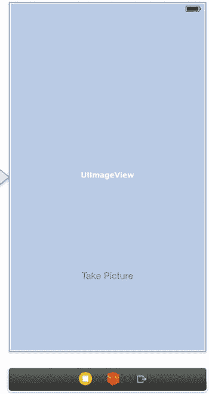

图 9-1。用于拍照的简单用户界面

为图像视图和按钮创建插座变量，并分别命名为 `imageView` 和 `cameraButton`。同时，为按钮创建一个名为 `takePicture` 的操作方法。

你的 `ViewController.h` 文件现在应类似于清单 9-1 中的代码。

清单 9-1。添加了插座变量和 `takePicture:` 方法的 `ViewController.h` 文件

```
//
//  ViewController.h
//  食谱 9-1 拍照
//

#import <UIKit/UIKit.h>

@interface ViewController : UIViewController

@property (weak, nonatomic) IBOutlet UIImageView *imageView;
@property (weak, nonatomic) IBOutlet UIButton *cameraButton;

- (IBAction)takePicture:(id)sender;

@end
```

### 访问相机

要访问相机，你将使用 `UIImagePickerController` 类，它提供一个用于选择照片或拍照的界面。每当处理 iOS 上的相机硬件时，作为开发者，必须包含一个让应用检查硬件可用性的函数。这通过 `UIImagePickerController` 的 `isSourceTypeAvailable:` 类方法实现。该方法接受以下预定义常量之一作为参数：

* `UIImagePickerControllerSourceTypeCamera`
* `UIImagePickerControllerSourceTypePhotoLibrary`
* `UIImagePickerControllerSourceTypeSavedPhotosAlbum`

对于本食谱，你将使用第一个选项 `UIImagePickerControllerSourceTypeCamera`。`UIImagePickerControllerPhotoLibrary` 用于访问设备上所有存储的照片，而 `UIImagePickerControllerSavedPhotosAlbum` 仅用于访问“相机胶卷”相册。

现在，切换到 `ViewController.m` 文件，找到已存根的 `takePicture:` 操作方法。在此，你将首先检查相机源类型是否可用，如果不可用，则显示一个 `UIAlertView` 告知用户。按清单 9-2 所示填写 `takePicture` 方法。

清单 9-2。`takePicture:` 方法的实现

```
- (IBAction)takePicture:(id)sender
{
    // 确保相机可用
    if ([UIImagePickerController
         isSourceTypeAvailable:UIImagePickerControllerSourceTypeCamera] == NO)
    {
        UIAlertView *alert = [[UIAlertView alloc] initWithTitle:@"错误"
                                                        message:@"相机不可用"
                                                       delegate:self
                                              cancelButtonTitle:@"取消"
                                              otherButtonTitles:nil, nil];
        [alert show];
        return;
    }
}
```

iOS 模拟器不具备相机功能。因此，当你在此运行应用时，只会看到错误信息，如图 9-2 所示。要全面测试此应用，你需要在真实设备上运行。

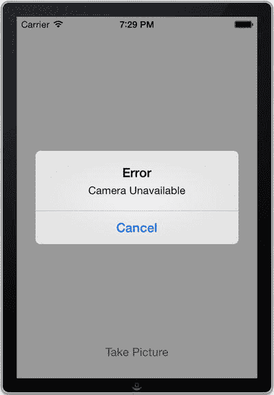

图 9-2。模拟器不支持相机，因此你需要在真实设备上测试你的应用

在扩展 `takePicture:` 方法中相机实际可用的情况之前，你需要在 `ViewController.h` 中进行几处修改。首先，添加一个属性来保存图像选择器实例，通过该界面你将访问相机。第二个修改是让视图控制器准备接收来自图像选择器的事件。这样的委托需要同时遵循 `UIImagePickerControllerDelegate` 和 `UINavigationControllerDelegate` 协议。用清单 9-3 中以粗体显示的更改更新头文件。

清单 9-3。更新后的带有委托和 `UIImagePickerController` 属性的 `ViewController.h` 文件

```
//
//  ViewController.h
//  食谱 9-1 拍照
//

#import <UIKit/UIKit.h>

@interface ViewController : UIViewController <UIImagePickerControllerDelegate,
UINavigationControllerDelegate>

@property (weak, nonatomic) IBOutlet UIImageView *imageView;
@property (weak, nonatomic) IBOutlet UIButton *cameraButton;
@property (strong, nonatomic) UIImagePickerController *imagePicker;

- (IBAction)takePicture:(id)sender;

@end
```

现在你可以填写 `ViewController.m` 中 `takePicture:` 操作方法里的代码。它会创建并初始化图像选择器实例（如果尚未创建），然后呈现它以处理相机设备（清单 9-4）。

清单 9-4。向 `takePicture:` 方法添加代码以初始化并呈现相机

```
- (IBAction)takePicture:(id)sender
{
    // 确保相机可用
    if ([UIImagePickerController
         isSourceTypeAvailable:UIImagePickerControllerSourceTypeCamera] == NO)
    {
        UIAlertView *alert = [[UIAlertView alloc] initWithTitle:@"错误"
                                                        message:@"相机不可用"
                                                       delegate:self
                                              cancelButtonTitle:@"取消"
                                              otherButtonTitles:nil, nil];
        [alert show];
        return;
    }

    if (self.imagePicker == nil)
    {
        self.imagePicker = [[UIImagePickerController alloc] init];
        self.imagePicker.delegate = self;
```


`self.imagePicker.sourceType = UIImagePickerControllerSourceTypeCamera;`

```
[self presentViewController:self.imagePicker animated:YES completion:NULL];
```

现在，在真实设备上运行你的应用程序并点击按钮，你应该会看到一个简单的相机界面。通过该界面，你可以拍摄照片并选择用于应用（如果不满意还可以重拍）。图 9-3 展示了 `UIImagePickerController` 的用户界面。

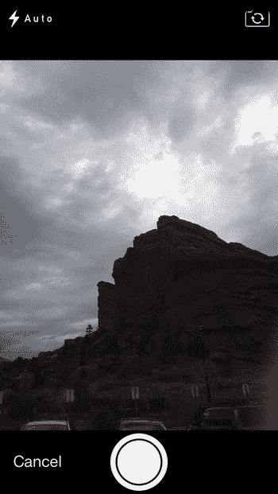

图 9-3. `UIImagePickerViewController` 的用户界面

### 获取照片

现在你已经配置好视图控制器，以成功呈现 `UIImagePickerController`，接下来需要处理当 `UIImagePickerController` 完成选择（即拍摄并选定照片后）时视图控制器如何响应。通过使用委托方法 `imagePickerController:didFinishPickingMediaWithInfo:` 来实现。获取照片、更新图像视图，最后关闭图像选择器，如代码清单 9-5 所示。

代码清单 9-5. 实现 `imagePickerController:didFinishPickingMediaWithInfo:` 委托方法

```
-(void)imagePickerController:(UIImagePickerController *)picker didFinishPickingMediaWithInfo:(NSDictionary *)info
{
    UIImage *image = [info objectForKey:UIImagePickerControllerOriginalImage];
    self.imageView.image = image;
    self.imageView.contentMode = UIViewContentModeScaleAspectFill;
    [self dismissViewControllerAnimated:YES completion:NULL];
}
```

注意

通过将图像视图的 content-mode 属性设置为 `UIViewContentModeScaleAspectFill`，可以确保图片填满整个视图，同时保持其宽高比。这通常会导致图片被裁剪，而不是拉伸变形。或者，你也可以使用 `UIViewContentModeScaleAspectFit`，它会在保持宽高比的情况下显示完整图片，但不一定填满整个视图。

还需要实现另一个委托方法来处理取消图像选择的情况。你只需关闭图像选择器视图即可。将代码清单 9-6 中的代码添加到实现文件中。

代码清单 9-6. 实现 `imagePickerControllerDidCancel:` 委托方法

```
- (void) imagePickerControllerDidCancel: (UIImagePickerController *) picker
{
    [self dismissViewControllerAnimated:YES completion:NULL];
}
```

现在，你的应用程序可以访问相机、拍摄照片，并将其设置为应用的背景，如图 9-4 所示。

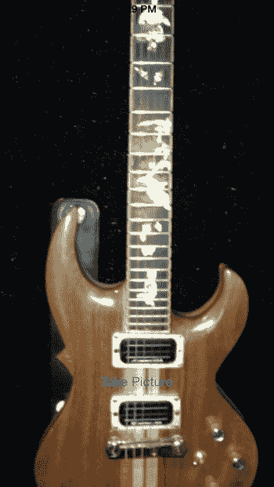

图 9-4. 将照片设置为背景的应用

注意

`UIImagePickerController` 类不支持横屏方向拍摄照片。虽然你可以用横屏方式拍照，但视图不会根据横屏方向进行调整，这会导致相当糟糕的用户体验。

### 实现基本编辑

作为可选设置，你可以让相机界面支持编辑功能，使用户能够裁剪和构图所拍摄的照片。为此，只需将 `UIImagePickerController` 的 `allowsEditing` 属性设置为 `YES`，如代码清单 9-7 所示。

代码清单 9-7. 修改 `takePicture:` 操作方法以允许编辑

```
- (IBAction)takePicture:(id)sender
{
    // ...
    if (self.imagePicker == nil)
    {
        self.imagePicker = [[UIImagePickerController alloc] init];
        self.imagePicker.delegate = self;
        self.imagePicker.sourceType = UIImagePickerControllerSourceTypeCamera;
        self.imagePicker.allowsEditing = YES;
    }
    [self presentViewController:self.imagePicker animated:YES completion:NULL];
}
```

然后，若要获取编辑后的图像，还需要修改 `imagePickerController:didFinishPickingMediaWithInfo:` 方法，如代码清单 9-8 所示。

代码清单 9-8. 修改 `imagePickerController:didFinishPickingMediaWithInfo:` 以接收编辑后的图像

```
-(void)imagePickerController:(UIImagePickerController *)picker didFinishPickingMediaWithInfo:(NSDictionary *)info
{
    UIImage *image = [info objectForKey: UIImagePickerControllerEditedImage ];
    self.imageView.image = image;
    self.imageView.contentMode = UIViewContentModeScaleAspectFill;
    [self dismissViewControllerAnimated:YES completion:NULL];
}
```

### 将照片保存到相簿

你可能希望将拍摄的照片保存到设备的相簿中。使用 `UIImageWriteToSavedPhotosAlbum()` 函数即可轻松实现。在 `imagePickerViewController:didFinishPickingMediaWithInfo:` 方法中添加一行代码，如代码清单 9-9 所示。

代码清单 9-9. 修改 `imagePickerController:didFinishPickingMediaWithInfo:` 方法以添加保存选项

```
-(void)imagePickerController:(UIImagePickerController *)picker didFinishPickingMediaWithInfo:(NSDictionary *)info
{
    UIImage *image = (UIImage *)[info objectForKey:UIImagePickerControllerEditedImage];
    UIImageWriteToSavedPhotosAlbum (image, nil, nil , nil);
    self.imageView.image = image;
    self.imageView.contentMode = UIViewContentModeScaleAspectFill;
    [self dismissViewControllerAnimated:YES completion:NULL];
}
```

然而，自 iOS 6 起，对相簿访问添加了隐私限制；需要访问相簿的应用必须获得用户的明确授权。因此，你还需要说明请求访问相簿的原因。这需要在应用的 `Info.plist` 文件（位于项目导航器的 Supporting Files 文件夹中）中添加键 `NSPhotoLibraryUsageDescription`（在属性列表中显示为“Privacy—Photo Library Usage Description”）。

你可以在用途描述中输入任何文字；我们输入了“Testing the camera.”。需要了解的是，当系统提示用户授权应用访问相簿时，这段文字将展示给用户，如图 9-5 所示。

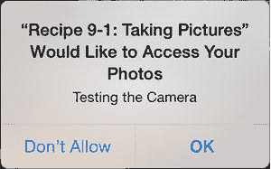

图 9-5. 将照片保存到相簿需要获得用户授权


## 食谱 9-2：录制视频

你的 `UIImagePickerController` 实际比你目前所见到的要灵活得多，尤其是因为你之前只将它用于静态图像。在这里，你将学习如何设置 `UIImagePickerController` 以同时处理静态图像和视频。

本食谱基于食谱 9-1 的代码进行构建，因为它已经包含了所需的基础设置。你将通过实现录制和保存视频的选项来扩展其功能。

首先，将图像选择器允许的媒体类型设置为相机所有可用的类型。这可以通过使用 `UIImagePickerController` 的类方法 `availableMediaTypesForSourceType:` 来实现，如代码清单 9-10 所示。

### 代码清单 9-10. 更新 `takePicture:` 方法以允许视频录制

```
- (IBAction)takePicture:(id)sender

{

// 确保相机可用

if ([UIImagePickerController

isSourceTypeAvailable:UIImagePickerControllerSourceTypeCamera] == NO)

{

UIAlertView *alert = [[UIAlertView alloc] initWithTitle:@"错误"

message:@"相机不可用"

delegate:self

cancelButtonTitle:@"取消"

otherButtonTitles:nil, nil];

[alert show];

return;

}

if (self.imagePicker == nil)

{

self.imagePicker = [[UIImagePickerController alloc] init];

self.imagePicker.delegate = self;

self.imagePicker.sourceType = UIImagePickerControllerSourceTypeCamera;

self.imagePicker.mediaTypes = [UIImagePickerController

availableMediaTypesForSourceType:UIImagePickerControllerSourceTypeCamera];

self.imagePicker.allowsEditing = YES;

}

[self presentViewController:self.imagePicker animated:YES completion:NULL];

}
```

接下来，你需要指示应用程序如何处理用户录制和使用视频的情况。为此，请将 Mobile Core Services 框架链接到你的项目，并将其 API 导入到视图控制器的头文件中，如代码清单 9-11 所示。

### 代码清单 9-11. 将框架导入 `ViewController.h` 文件

```
//
//  ViewController.h
//  Recipe 9-2 Recording Videos
//

#import <UIKit/UIKit.h>
#import <MobileCoreServices/MobileCoreServices.h>

@interface ViewController : UIViewController<UIImagePickerControllerDelegate, UINavigationControllerDelegate>

@property (weak, nonatomic) IBOutlet UIImageView *imageView;
@property (weak, nonatomic) IBOutlet UIButton *cameraButton;
@property (strong, nonatomic) UIImagePickerController *imagePicker;

- (IBAction)takePicture:(id)sender;

@end
```

现在，将代码清单 9-12 中的**粗体**代码添加到你的 `UIImagePickerController` 的委托方法中。

### 代码清单 9-12. 在 `imagePickerController:didFinishPickingMediaWithInfo:` 方法中添加视频比较逻辑

```
-(void)imagePickerController:(UIImagePickerController *)picker didFinishPickingMediaWithInfo:(NSDictionary *)info

{

NSString *mediaType = [info objectForKey: UIImagePickerControllerMediaType];

if (CFStringCompare((__bridge CFStringRef) mediaType, kUTTypeMovie, 0) ==

kCFCompareEqualTo)

{

// 视频已捕获

NSString *moviePath =

(NSString *) [[info objectForKey: UIImagePickerControllerMediaURL] path];

if (UIVideoAtPathIsCompatibleWithSavedPhotosAlbum (moviePath))

{

UISaveVideoAtPathToSavedPhotosAlbum (moviePath, nil, nil, nil);

}

}

else

{

// 图片已拍摄

UIImage *image =

(UIImage *)[info objectForKey:UIImagePickerControllerEditedImage];

UIImageWriteToSavedPhotosAlbum (image, nil, nil , nil);

self.imageView.image = image;

self.imageView.contentMode = UIViewContentModeScaleAspectFill;

}

[self dismissViewControllerAnimated:YES completion:NULL];

}
```

本质上，你在代码清单 9-12 中所做的是比较保存文件的媒体类型。主要问题出现在当你尝试将 `mediaType`（它是一个 `NSString`）与 `kUTTypeMovie`（类型为 `CFStringRef`）进行比较时。你通过将 `NSString` 向下转换为 `CFStringRef` 来解决这个问题。在 iOS 5+ 中，随着自动引用计数 (ARC) 的引入，这个过程变得稍微复杂了一些，因为 ARC 处理的是 `NSString` 这样的 Objective-C 对象类型，而不处理 `CFStringRef` 这样的 C 类型。你通过在 `CFStringRef` 之前放置 `__bridge` 来创建桥接转换，如上所示，以指示 ARC 不处理此对象。

如果一切顺利，你的应用程序现在应该能够通过在图像选择器视图中选择视频模式来录制视频，如图 9-6 所示。然后视频（如果用户允许）将被保存到私人照片库中。

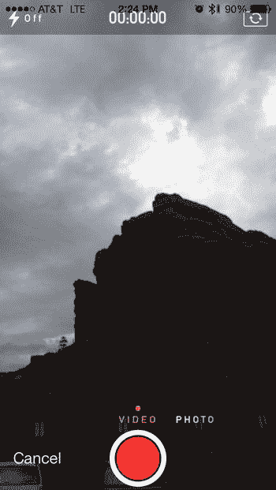

**图 9-6.** 带有照片和视频模式切换控件的图像选择器视图


## 配方 9-3：编辑视频

尽管你的 `UIImagePickerController` 提供了一种便捷的方式来录制和保存视频文件，但它无法让你对其进行编辑。幸运的是，iOS 提供了另一个内置控制器 `UIVideoEditorController`，你可以用它来编辑已录制的视频。

你可以基于配方 9-2 中的第二个项目来构建这个相对简单的配方，在那个项目中，你已为 `UIImagePickerController` 添加了视频功能。

首先，在你的视图控制器界面文件中添加一个标题为“编辑视频”的第二个按钮。如图 9-7 所示排列这两个按钮。

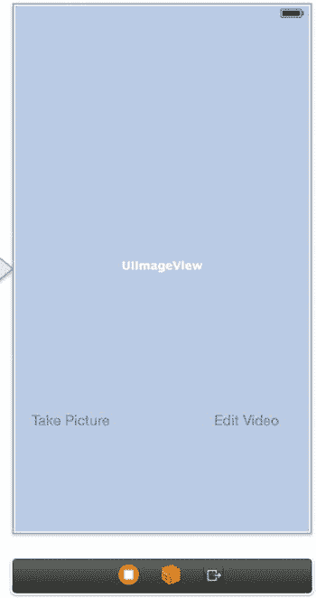

**图 9-7.** 带有编辑视频按钮的新用户界面

接下来，创建一个名为 `editVideo` 的操作，用于处理用户点击“编辑视频”按钮的事件。

你还需要一个属性来存储用户录制视频的路径。在视图控制器的头文件中定义它，如代码清单 9-13 所示。

**代码清单 9-13.** 添加了新增内容的 `ViewController.h` 文件

```
//
//  ViewController.h
//  Recipe 9-3 Editing Videos
//

#import <UIKit/UIKit.h>
#import <MobileCoreServices/MobileCoreServices.h>

@interface ViewController : UIViewController<UIImagePickerControllerDelegate, UINavigationControllerDelegate>

@property (weak, nonatomic) IBOutlet UIImageView *imageView;
@property (weak, nonatomic) IBOutlet UIButton *cameraButton;
@property (strong, nonatomic) UIImagePickerController *imagePicker;
@property (strong, nonatomic) NSString *pathToRecordedVideo;

- (IBAction)takePicture:(id)sender;
- (IBAction)editVideo:(id)sender;

@end
```

现在，在 `imagePickerController:didFinishPickingMediaWithInfo:` 方法中，确保 `pathToRecordedVideo` 属性更新为新录制视频的路径，如代码清单 9-14 所示。

**代码清单 9-14.** 为新录制视频添加视频路径

```
-(void)imagePickerController:(UIImagePickerController *)picker didFinishPickingMediaWithInfo:(NSDictionary *)info
{
    NSString *mediaType = [info objectForKey: UIImagePickerControllerMediaType];
    if (CFStringCompare((__bridge CFStringRef) mediaType, kUTTypeMovie, 0) ==
        kCFCompareEqualTo)
    {
        NSString *moviePath = (NSString *)[[info objectForKey: UIImagePickerControllerMediaURL] path];
        self.pathToRecordedVideo = moviePath;

        if (UIVideoAtPathIsCompatibleWithSavedPhotosAlbum (moviePath))
        {
            UISaveVideoAtPathToSavedPhotosAlbum (moviePath, nil, nil, nil);
        }
    }
    else
    {
        //...
    }
}
```

有了 `pathToRecordedVideo` 属性后，你可以将注意力转向 `editVideo` 操作。该操作会在视频编辑控制器中打开最后录制的视频进行编辑，如果没有录制视频，则显示错误。代码清单 9-15 展示了该方法的实现。

**代码清单 9-15.** `editVideo` 方法的实现

```
- (IBAction)editVideo:(id)sender
{
    if (self.pathToRecordedVideo)
    {
        UIVideoEditorController *editor = [[UIVideoEditorController alloc] init];
        editor.videoPath = self.pathToRecordedVideo;
        editor.delegate = self;
        [self presentViewController:editor animated:YES completion:NULL];
    }
    else
    {
        UIAlertView *alert = [[UIAlertView alloc] initWithTitle:@"Error"
                                                        message:@"No Video Recorded Yet"
                                                       delegate:self
                                              cancelButtonTitle:@"Cancel"
                                              otherButtonTitles:nil, nil];
        [alert show];
    }
}
```

由于视频编辑器的接收代理是你的视图控制器，你需要确保它遵循 `UIVideoEditorControllerDelegate` 协议。将该协议添加到头文件中，如代码清单 9-16 所示。

**代码清单 9-16.** 声明 `UIVideoEditorControllerDelegate` 协议

```
// ...
@interface ViewController : UIViewController<UIImagePickerControllerDelegate,
                                               UINavigationControllerDelegate,
                                               UIVideoEditorControllerDelegate>
// ...
@end
```

最后，你需要为 `UIVideoEditorController` 实现几个代理方法。首先，你需要一个代理方法来处理成功的编辑/修剪操作。代码清单 9-17 展示了该方法。

**代码清单 9-17.** `videoEditorController:didSaveEditedVideoToPath:` 代理方法的实现

```
-(void)videoEditorController:(UIVideoEditorController *)editor didSaveEditedVideoToPath:(NSString *)editedVideoPath
{
    self.pathToRecordedVideo = editedVideoPath;

    if (UIVideoAtPathIsCompatibleWithSavedPhotosAlbum (editedVideoPath))
    {
        UISaveVideoAtPathToSavedPhotosAlbum (editedVideoPath, nil, nil, nil);
    }

    [self dismissViewControllerAnimated:YES completion:NULL];
}
```

如你所见，你的应用程序将新编辑的视频设置为下一个要编辑的视频，这样你就可以创建越来越短的剪辑片段。如果可能，它还会将每个编辑后的版本保存到你的相册中。

你还需要一个代理方法来处理 `UIVideoEditorController` 的取消操作。添加代码清单 9-18 所示方法的实现。

**代码清单 9-18.** `videoEditorControllerDidCancel:` 代理方法的实现

```
-(void)videoEditorControllerDidCancel:(UIVideoEditorController *)editor
{
    [self dismissViewControllerAnimated:YES completion:NULL];
}
```

在物理设备上测试时，你的应用程序现在应该能够成功地让你编辑视频。图 9-8 显示了你的应用程序为你提供编辑已录制视频选项的视图。

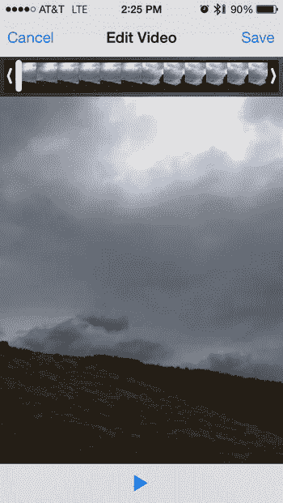

**图 9-8.** 使用 `UIVideoEditorController` 编辑（修剪）视频

**注意：** 你可能已经注意到，在编辑器中录制质量会稍低一些。默认视频质量设置为中等。如果你想要高质量，只需在 `takePicture:` 方法中设置视频质量属性即可；例如：`self.imagePicker.videoQuality = UIImagePickerControllerQualityTypeHigh`。


## 食谱 9-4：使用自定义相机覆盖层

有许多应用在实现相机界面的同时，也会添加自定义覆盖层——例如，用于在天空中显示星座，或者仅仅为了实现自己的相机控件。在本食谱中，你将基于前面食谱的项目继续构建，并实现一个非常基础的自定义相机屏幕覆盖层。具体来说，你将用自己版本的控件替换默认的按钮控件。尽管这个示例很简单，但它应该能让你了解如何创建更实用的自定义覆盖功能。

你将在名为 `customViewForImagePicker:` 的方法中直接通过代码构建自定义覆盖视图。该方法会创建一个覆盖视图，并在其中放入三个按钮：一个用于拍照，一个用于开关闪光灯，还有一个用于前后摄像头切换。代码清单 9-19 展示了这段代码，你需要将其添加到食谱 9-3 的 `ViewController.m` 文件中。

### 代码清单 9-19. `customViewForImagePicker:` 方法的实现

```
-(UIView *)customViewForImagePicker:(UIImagePickerController *)imagePicker;
{
    UIView *view = [[UIView alloc] initWithFrame:CGRectMake(0, 20, 280, 480)];
    view.backgroundColor = [UIColor clearColor];

    UIButton *flashButton =
    [[UIButton alloc] initWithFrame:CGRectMake(10, 10, 120, 44)];
    flashButton.backgroundColor = [UIColor colorWithRed:.5 green:.5 blue:.5 alpha:.5];
    [flashButton setTitle:@"闪光灯自动" forState:UIControlStateNormal];
    [flashButton setTitleColor:[UIColor whiteColor] forState:UIControlStateNormal];
    flashButton.layer.cornerRadius = 10.0;

    UIButton *changeCameraButton =
    [[UIButton alloc] initWithFrame:CGRectMake(190, 10, 120, 44)];
    changeCameraButton.backgroundColor =
    [UIColor colorWithRed:.5 green:.5 blue:.5 alpha:.5];
    [changeCameraButton setTitle:@"后置摄像头" forState:UIControlStateNormal];
    [changeCameraButton setTitleColor:[UIColor whiteColor]
                     forState:UIControlStateNormal];
    changeCameraButton.layer.cornerRadius = 10.0;

    UIButton *takePictureButton =
    [[UIButton alloc] initWithFrame:CGRectMake(100, 432, 120, 44)];
    takePictureButton.backgroundColor =
    [UIColor colorWithRed:.5 green:.5 blue:.5 alpha:.5];
    [takePictureButton setTitle:@"拍照！" forState:UIControlStateNormal];
    [takePictureButton setTitleColor:[UIColor whiteColor]
                     forState:UIControlStateNormal];
    takePictureButton.layer.cornerRadius = 10.0;

    [flashButton addTarget:self action:@selector(toggleFlash:)
          forControlEvents:UIControlEventTouchUpInside];
    [changeCameraButton addTarget:self action:@selector(toggleCamera:)
                 forControlEvents:UIControlEventTouchUpInside];
    [takePictureButton addTarget:imagePicker action:@selector(takePicture)
                forControlEvents:UIControlEventTouchUpInside];

    [view addSubview:flashButton];
    [view addSubview:changeCameraButton];
    [view addSubview:takePictureButton];

    return view;
}
```

在代码清单 9-19 中，你定义了 `UIView` 以及要放入其中的按钮，为它们指定了要执行的操作并添加到了视图中，将每个按钮的标题设置为初始值或功能说明，同时还设置了它们的 `cornerRadius`，使按钮具有圆角。这里最重要的细节之一是，你将这些按钮设置为半透明，因为它们覆盖在相机显示界面上。你不想遮挡任何画面，所以按钮至少需要部分透明。

你可能已经注意到，`takePictureButton` 的操作直接连接到了图像选择器的 `takePicture` 方法。而另外两个按钮则分别连接到了视图控制器的 `toggleFlash` 和 `toggleCamera` 方法。目前这两个方法还不存在，因此你需要实现它们。代码清单 9-20 展示了它们的实现。

### 代码清单 9-20. `toggleFlash:` 和 `toggleCamera:` 方法的实现

```
-(void)toggleFlash:(UIButton *)sender
{
```


```objc
if (self.imagePicker.cameraFlashMode == UIImagePickerControllerCameraFlashModeOff)
{
    self.imagePicker.cameraFlashMode = UIImagePickerControllerCameraFlashModeOn;
    [sender setTitle:@"Flash On" forState:UIControlStateNormal];
}
else
{
    self.imagePicker.cameraFlashMode = UIImagePickerControllerCameraFlashModeOff;
    [sender setTitle:@"Flash Off" forState:UIControlStateNormal];
}
```

```objc
-(void)toggleCamera:(UIButton *)sender
{
    if (self.imagePicker.cameraDevice == UIImagePickerControllerCameraDeviceRear)
    {
        self.imagePicker.cameraDevice = UIImagePickerControllerCameraDeviceFront;
        [sender setTitle:@"Front Camera" forState:UIControlStateNormal];
    }
    else
    {
        self.imagePicker.cameraDevice = UIImagePickerControllerCameraDeviceRear;
        [sender setTitle:@"Rear Camera" forState:UIControlStateNormal];
    }
}
```

接下来，隐藏默认的相机按钮，并为图像选择器提供自定义覆盖视图。将清单 9-21 中所示的两行代码添加到您的 `takePicture:` 方法中。您还可以注释掉 `allowsEditing` 属性的设置，因为新的拍照方式不支持该属性。

**清单 9-21.** 修改 `takePicture` 方法以隐藏默认相机按钮并设置自定义覆盖视图

```objc
- (IBAction)takePicture:(id)sender
{
    // 确保相机可用
    if ([UIImagePickerController
         isSourceTypeAvailable:UIImagePickerControllerSourceTypeCamera] == NO)
    {
        UIAlertView *alert = [[UIAlertView alloc] initWithTitle:@"错误"
                                                        message:@"相机不可用"
                                                       delegate:self
                                              cancelButtonTitle:@"取消"
                                              otherButtonTitles:nil, nil];
        [alert show];
        return;
    }
    if (self.imagePicker == nil)
    {
        self.imagePicker = [[UIImagePickerController alloc] init];
        self.imagePicker.delegate = self;
        self.imagePicker.sourceType = UIImagePickerControllerSourceTypeCamera;
        self.imagePicker.mediaTypes = [UIImagePickerController
                                       availableMediaTypesForSourceType:UIImagePickerControllerSourceTypeCamera];
        // self.imagePicker.allowsEditing = YES;
        self.imagePicker.showsCameraControls = NO;
        self.imagePicker.cameraOverlayView =
        [self customViewForImagePicker:self.imagePicker];
    }
    [self presentViewController:self.imagePicker animated:YES completion:NULL];
}
```

最后，您需要对 `imagePickerController:didFinishPickingMediaWithInfo:` 方法进行一个小改动。如前所述，图像选择器的 `takePicture` 方法不支持编辑。这意味着您必须使用 `UIImagePickerControllerOriginalImage` 键（而非 `UIImagePickerControllerEditedImage`）从信息字典中检索图片，如清单 9-22 所示。

**清单 9-22.** 修改 `imagePickerController:didFinishPickingMediaWithInfo:` 以使用原始图像

```objc
-(void)imagePickerController:(UIImagePickerController *)picker didFinishPickingMediaWithInfo:(NSDictionary *)info
{
    NSString *mediaType = [info objectForKey: UIImagePickerControllerMediaType];
    if (CFStringCompare((__bridge CFStringRef) mediaType, kUTTypeMovie, 0) ==
        kCFCompareEqualTo)
    {
        NSString *moviePath =
        (NSString *) [[info objectForKey: UIImagePickerControllerMediaURL] path];
        self.pathToRecordedVideo = moviePath;
        if (UIVideoAtPathIsCompatibleWithSavedPhotosAlbum (moviePath))
        {
            UISaveVideoAtPathToSavedPhotosAlbum (moviePath, nil, nil, nil);
        }
    }
    else
    {
        UIImage *image =
        (UIImage *)[info objectForKey: UIImagePickerControllerOriginalImage];
        UIImageWriteToSavedPhotosAlbum(image, nil, nil , nil);
        self.imageView.image = image;
        self.imageView.contentMode = UIViewContentModeScaleAspectFill;
    }
    [self dismissViewControllerAnimated:YES completion:NULL];
}
```

如果现在运行您的应用，您的相机应如图 9-9 所示，在覆盖视图中显示三个按钮。

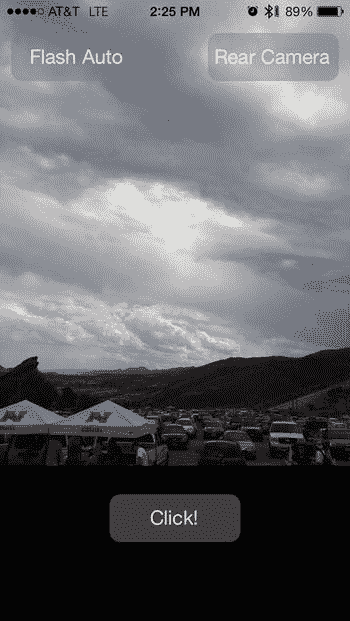

**图 9-9.** 一个图像选择器控制器，其覆盖视图替换了标准按钮

由此，您可以创建自己的自定义覆盖视图，并轻松更改其功能以适应几乎任何情况。接下来的实践将暂别图像选择器控制器，转而探究 Audiovisual (AV) Foundation 框架，以用于捕捉图片和视频。


## 食谱 9-5：使用 `AVCaptureSession` 显示相机预览

虽然 `UIImagePickerController` 和 `UIVideoEditorController` 接口非常有用，但它们显然无法做到完全可定制。然而，借助 AV Foundation 框架，你可以从头开始创建自己的相机接口，使其完全符合你的要求。AV Foundation 框架为你提供了更多的音频和视频工具，因此你可以完全自定义用户体验。

在本食谱及后续食谱中，你将使用 `AVCaptureSession` API 来创建你自己的相机版本。你将分步骤实现，首先从显示相机预览开始。

首先，创建一个新的单视图项目。你将使用同一个项目完成本章剩余内容，因此请为其命名（例如“`MyCamera`”）。同时，确保将 `AVFoundation` 框架添加到你的项目中，否则后续会出现链接器错误。

现在，按照列表 9-23 所示，对你的 `ViewController.h` 文件进行修改，向你的视图控制器添加一个属性来持有 `AVCaptureSession` 实例，以及一个属性来持有视频输入实例。

**列表 9-23.** 添加了 `AVCaptureSession` 和 `AVCaptureDeviceInput` 属性的 `ViewController.h` 文件

```
//
//  ViewController.h
//  Recipe 9-5 Displaying Camera Preview With AVCaptureSession
//

#import <UIKit/UIKit.h>
#import <AVFoundation/AVFoundation.h>

@interface ViewController : UIViewController

@property (strong, nonatomic) AVCaptureSession *captureSession;
@property (strong, nonatomic) AVCaptureDeviceInput *videoInput;

@end
```

接下来，切换到 `ViewController.m` 文件并找到 `viewDidLoad` 方法。在此方法中，你将设置捕获会话以接收来自相机的输入。我们将逐步展示，然后向你呈现完整的 `viewDidLoad` 实现。

首先，创建你的 `AVCaptureSession`。你也可以选择更改分辨率预设，其默认设置为 `AVCaptureSessionPresetHigh`。将列表 9-24 中的代码添加到 `viewDidLoad` 方法中。

**列表 9-24.** 创建并初始化一个 `AVCaptureSession` 实例

```
self.captureSession = [[AVCaptureSession alloc] init];
//Optional: self.captureSession.sessionPreset = AVCaptureSessionPresetMedium;
```

接下来，指定你的输入设备，即你的后置摄像头（假设可用），如列表 9-25 所示。你可以通过使用 `AVCaptureDevice` 类方法 `+defaultDeviceWithMediaType:` 来指定，该方法可以根据所需的媒体类型接受各种不同的参数，其中最常用的是 `AVMediaTypeVideo` 和 `AVMediaTypeAudio`。

**列表 9-25.** 指定捕获设备

```
AVCaptureDevice *device = [AVCaptureDevice defaultDeviceWithMediaType:AVMediaTypeVideo];
```

接下来，你需要设置 `AVCaptureDeviceInput` 实例，将你选择的设备指定为捕获会话的输入。同时，包含一个检查，以确保输入已正确创建，然后再将其添加到会话中。列表 9-26 展示了此实例和检查语句。

**列表 9-26.** 设置输入实例并在分配视频输入前检查其是否存在

```
NSError *error = nil;
self.videoInput = [AVCaptureDeviceInput deviceInputWithDevice:device error:&error];
if (self.videoInput)
{
    [self.captureSession addInput:self.videoInput];
}
else
{
    NSLog(@"Input Error: %@", error);
}
```

`viewDidLoad` 的最后一部分，如列表 9-27 所示，是创建一个预览层，通过它你可以看到摄像头正在拍摄的画面。将你的预览层设置为主视图的图层，但高度稍微调整，以免遮挡你将在下一个食谱中设置的按钮。

**列表 9-27.** 创建预览层

```
AVCaptureVideoPreviewLayer *previewLayer =
[AVCaptureVideoPreviewLayer layerWithSession:self.captureSession];
UIView *aView = self.view;
previewLayer.frame =
CGRectMake(0, 20, self.view.frame.size.width, self.view.frame.size.height-70);
[aView.layer addSublayer:previewLayer];
```

完成所有这些步骤后，`viewDidLoad` 方法应如列表 9-28 所示。

**列表 9-28.** 完整的 `viewDidLoad` 方法

```
- (void)viewDidLoad
{
    [super viewDidLoad];
    // Do any additional setup after loading the view, typically from a nib.

    self.captureSession = [[AVCaptureSession alloc] init];
    //Optional: self.captureSession.sessionPreset = AVCaptureSessionPresetMedium;

    AVCaptureDevice *device =
        [AVCaptureDevice defaultDeviceWithMediaType:AVMediaTypeVideo];
    NSError *error = nil;
    self.videoInput = [AVCaptureDeviceInput deviceInputWithDevice:device error:&error];
    if (self.videoInput)
    {
        [self.captureSession addInput:self.videoInput];
    }
    else
    {
        NSLog(@"Input Error: %@", error);
    }

    AVCaptureVideoPreviewLayer *previewLayer =
        [AVCaptureVideoPreviewLayer layerWithSession:self.captureSession];
    UIView *aView = self.view;
    previewLayer.frame =
        CGRectMake(0, 0, self.view.frame.size.width,
                   self.view.frame.size.height-70);
    [aView.layer addSublayer:previewLayer];
}
```

> **注意：** 与任何其他 `CALayer` 一样，`AVCaptureVideoPreviewLayer` 可以重新定位、旋转、调整大小，甚至进行动画处理。有了它，你不再像使用 `UIImagePicker` 时那样必须使用整个屏幕来录制视频，这意味着你可以将预览层放在屏幕的一部分，而将其他信息呈现给用户。与 iOS 开发的几乎每个部分一样，其用途的可能性仅受开发人员想象力的限制。

现在唯一需要添加的是用于启动和停止捕获会话的代码。在此应用中，你将在应用程序启动时显示相机预览，因此放置启动代码的一个好位置是在 `viewWillAppear:` 方法中，如列表 9-29 所示。

**列表 9-29.** `viewWillAppear:` 方法的实现

```
- (void)viewWillAppear:(BOOL)animated
{
    [super viewWillAppear:animated];
    [self.captureSession startRunning];
}
```

你还需要添加相应的停止捕获会话的代码，如列表 9-30 所示。

**列表 9-30.** `viewWillDisappear:` 方法的实现

```
- (void)viewWillDisappear:(BOOL)animated
{
    [super viewWillDisappear:animated];
    [self.captureSession stopRunning];
}
```

如果你现在构建并运行应用程序，它应该会显示一个实时的相机预览，如图 9-10 所示。

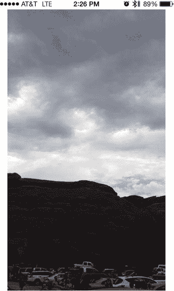

**图 9-10.** 使用 `AVCaptureSession` 显示相机预览

## 食谱 9-6：使用 `AVCaptureSession` 捕获静态图像

在前一个食谱中，你学习了如何设置一个带有相机输入的 `AVCaptureSession`。你还了解了如何连接一个 `AVCaptureVideoPreviewLayer` 来在你的应用中显示实时相机预览。现在，你将通过连接一个 `AVCaptureStillImageOutput` 对象来扩展项目，以拍摄静态图像并将其保存到设备上的“已保存照片”图库中。

在深入编码之前，你需要对项目进行一些修改。首先是将 `AssetsLibrary.framework` 添加到你的项目中。你将使用该框架的功能将照片写入照片图库。

由于你要访问设备的共享照片图库，因此需要在应用程序的 `Info.plist` 文件中提供使用说明描述。请继续添加 `NSPhotoLibraryUsageDescription` 键（在属性编辑器中显示为“Privacy—Photo Library Usage Description”），并附带一段简短的文字，说明你的应用寻求访问的原因（例如“Testing AVCaptureSession”）。有关此过程的复习，请参阅第 1 章的食谱 1-7。


### 添加拍照按钮

你需要一种触发静态图像捕捉的方式。首先，在视图控制器的故事板视图中添加一个标题为“Capture”的按钮。同时，确保为该按钮创建名为“`capture`”的操作（action）。为了让按钮能够随屏幕尺寸移动，选中该按钮，然后从故事板编辑器屏幕右下角的“解决自动布局问题（Resolve Auto Layout Issues）”菜单中选择“添加缺失约束（Add Missing Constraints）”。完成这些操作后，视图应类似于选中按钮时的图 9-11。

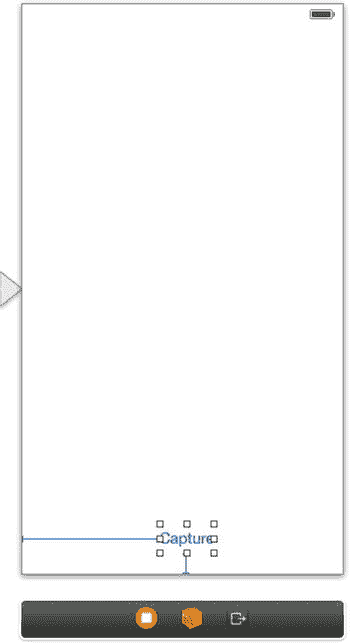

图 9-11. 带有视频帧捕捉按钮的用户界面

切换到你的 `ViewController.h` 文件，并导入 `AssetsLibrary` 框架。此外，添加一个属性来保存你的静态图像输出实例，如代码清单 9-31 中的粗体部分所示。

代码清单 9-31. 完成后的 `ViewController.h` 文件

```
//
//  ViewController.h
//  Recipe 9-6: Taking Still Images With AVCaptureSession
//

#import <UIKit/UIKit.h>
#import <AVFoundation/AVFoundation.h>
#import <AssetsLibrary/AssetsLibrary.h>

@interface ViewController : UIViewController

@property (strong, nonatomic) AVCaptureSession *captureSession;
@property (strong, nonatomic) AVCaptureDeviceInput *videoInput;
@property (strong, nonatomic) AVCaptureStillImageOutput *stillImageOutput;

- (IBAction)capture:(id)sender;

@end
```

在 `ViewController.m` 文件中，将代码清单 9-32 中的代码添加到 `viewDidLoad` 方法中。新代码（以粗体标记）用于分配并初始化你的静态图像输出对象，并将其连接到捕捉会话。

代码清单 9-32. 添加静态图像输出对象并连接到捕捉会话

```
- (void)viewDidLoad
{
    [super viewDidLoad];
    // Do any additional setup after loading the view, typically from a nib.

    self.captureSession = [[AVCaptureSession alloc] init];
    //Optional: self.captureSession.sessionPreset = AVCaptureSessionPresetMedium;

    AVCaptureDevice *device =
        [AVCaptureDevice defaultDeviceWithMediaType:AVMediaTypeVideo];

    NSError *error = nil;

    self.videoInput = [AVCaptureDeviceInput deviceInputWithDevice:device error:&error];
    if (self.videoInput)
    {
        [self.captureSession addInput:self.videoInput];
    }
    else
    {
        NSLog(@"Input Error: %@", error);
    }

    self.stillImageOutput = [[AVCaptureStillImageOutput alloc] init];
    NSDictionary *stillImageOutputSettings =
        [[NSDictionary alloc] initWithObjectsAndKeys:
            AVVideoCodecJPEG, AVVideoCodecKey, nil];
    [self.stillImageOutput setOutputSettings:stillImageOutputSettings];
    [self.captureSession addOutput:self.stillImageOutput];

    AVCaptureVideoPreviewLayer *previewLayer =
        [AVCaptureVideoPreviewLayer layerWithSession:self.captureSession];
    UIView *aView = self.view;

    previewLayer.frame =
        CGRectMake(0, 0, self.view.frame.size.width, self.view.frame.size.height-70);
    [aView.layer addSublayer:previewLayer];
}
```

**注意**：除了 `AVCaptureStillImageOutput`，你还可以使用其他多种输出格式——例如，下一个菜谱会用到的 `AVCaptureMovieFileOutput`；可以逐帧访问原始视频输出的 `AVCaptureVideoDataOutput`；用于保存音频文件的 `AVCaptureAudioFileOutput`；以及用于处理音频数据的 `AVCaptureAudioDataOutput`。

现在该实现操作（action）方法了。该方法只需要触发静态图像的捕捉。为了便于后续菜谱中的修改，我们将捕捉代码提取到一个辅助方法中。如代码清单 9-33 所示，在捕捉操作（capture action）方法中添加该方法调用。

代码清单 9-33. 实现 `capture:` 操作（action）方法

```
- (IBAction)capture:(id)sender
{
    [self captureStillImage];
}
```

`captureStillImage` 方法的实现初看可能有些复杂，因此我们将分步骤进行讲解，最后展示完整的方法。

首先，获取捕捉连接（connection），并确保使用竖屏方向来捕捉图像。代码清单 9-34 展示了这一步骤。


### 清单 9-34：启动`captureStillImage`方法并添加带有纵向方向的拍摄连接

```
- (void) captureStillImage
{
    AVCaptureConnection *stillImageConnection =
    [self.stillImageOutput.connections objectAtIndex:0];
    if ([stillImageConnection isVideoOrientationSupported])
        [stillImageConnection setVideoOrientation:AVCaptureVideoOrientationPortrait];
    // ...
}
```

然后，如清单 9-35 所示，运行`captureStillImageAsynchronouslyFromConnection`方法，并提供一个在静态图像拍摄完成时调用的代码块。

### 清单 9-35：添加用于拍摄静态图像的代码

```
[self.stillImageOutput
    captureStillImageAsynchronouslyFromConnection:stillImageConnection
    completionHandler:^(CMSampleBufferRef imageDataSampleBuffer, NSError *error)
    {
        // ...
    }
];
```

拍摄完成后，检查是否成功；否则，记录错误，如清单 9-36 所示。

### 清单 9-36：检查拍摄图像的成功或失败

```
[self.stillImageOutput
    captureStillImageAsynchronouslyFromConnection:stillImageConnection
    completionHandler:^(CMSampleBufferRef imageDataSampleBuffer, NSError *error)
    {
        if (imageDataSampleBuffer != NULL)
        {
            // ...
        }
        else
        {
            NSLog(@"Error capturing still image: %@", error);
        }
    }
];
```

如果拍摄成功，从缓冲区中提取图像，如清单 9-37 所示。

### 清单 9-37：完成图像拍摄成功的代码

```
if (imageDataSampleBuffer != NULL)
{
    NSData *imageData = [AVCaptureStillImageOutput
        jpegStillImageNSDataRepresentation:imageDataSampleBuffer];
    UIImage *image = [[UIImage alloc] initWithData:imageData];
    // ...
}
```

接下来，将图像保存到相册。这也是一个异步任务，因此请提供一个完成时的代码块。无论任务是成功完成还是出现错误（换句话说，如果用户不允许访问相册），都显示一个提醒以通知用户，如清单 9-38 所示。

### 清单 9-38：添加异步保存并提醒用户成功或错误的代码

```
ALAssetsLibrary *library = [[ALAssetsLibrary alloc] init];
[library writeImageToSavedPhotosAlbum:[image CGImage]
    orientation:(ALAssetOrientation)[image imageOrientation]
    completionBlock:^(NSURL *assetURL, NSError *error)
    {
        UIAlertView *alert;
        if (!error)
        {
            alert = [[UIAlertView alloc] initWithTitle:@"照片已保存"
                message:@"照片已成功保存到您的相册"
                delegate:nil
                cancelButtonTitle:@"确定"
                otherButtonTitles:nil, nil];
        }
        else
        {
            alert = [[UIAlertView alloc] initWithTitle:@"保存照片时出错"
                message:@"照片未保存到您的相册"
                delegate:nil
                cancelButtonTitle:@"确定"
                otherButtonTitles:nil, nil];
        }
        [alert show];
    }
];
```

清单 9-39 展示了完整的`captureStillImage`方法。

### 清单 9-39：完整的`captureStillImage`实现

```
- (void) captureStillImage
{
    AVCaptureConnection *stillImageConnection =
    [self.stillImageOutput.connections objectAtIndex:0];
    if ([stillImageConnection isVideoOrientationSupported])
        [stillImageConnection setVideoOrientation:AVCaptureVideoOrientationPortrait];

    [self.stillImageOutput
        captureStillImageAsynchronouslyFromConnection:stillImageConnection
        completionHandler:^(CMSampleBufferRef imageDataSampleBuffer, NSError *error)
        {
            if (imageDataSampleBuffer != NULL)
            {
                NSData *imageData = [AVCaptureStillImageOutput
                    jpegStillImageNSDataRepresentation:imageDataSampleBuffer];
                ALAssetsLibrary *library = [[ALAssetsLibrary alloc] init];
                UIImage *image = [[UIImage alloc] initWithData:imageData];
                [library writeImageToSavedPhotosAlbum:[image CGImage]
                    orientation:(ALAssetOrientation)[image imageOrientation]
                    completionBlock:^(NSURL *assetURL, NSError *error)
                    {
                        UIAlertView *alert;
                        if (!error)
                        {
                            alert = [[UIAlertView alloc] initWithTitle:@"照片已保存"
                                message:@"照片已成功保存到您的相册"
                                delegate:nil
                                cancelButtonTitle:@"确定"
                                otherButtonTitles:nil, nil];
                        }
                        else
                        {
                            alert = [[UIAlertView alloc] initWithTitle:@"保存照片时出错"
                                message:@"照片未保存到您的相册"
                                delegate:nil
                                cancelButtonTitle:@"确定"
                                otherButtonTitles:nil, nil];
                        }
                        [alert show];
                    }
                ];
            }
            else
            {
                NSLog(@"Error capturing still image: %@", error);
            }
        }
    ];
}
```

至此，食谱 9-6 完成。现在您可以运行应用程序，点击“拍摄”按钮拍照，照片将保存到您的相册中，如图 9-12 所示。

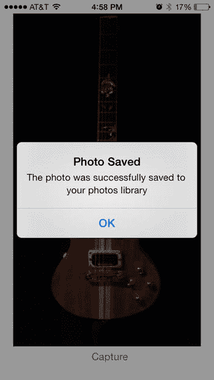

图 9-12. 拍摄并保存到相册的静态图像

虽然您还没有添加任何花哨的动画让它看起来像相机，但就基础相机功能而言，这已经相当有用了。食谱 9-7 将其提升到新的水平，向您展示如何使用`AVCaptureSession`录制视频。

## 食谱 9-7：使用`AVCaptureSession`捕捉视频

现在您已经了解了使用`AVFoundation`的一些基础知识，接下来将用它来实现一个稍微复杂的项目。这一次，您将扩展您的应用程序，使其包含视频捕捉模式。为此，您需要允许用户在拍照和录制视频之间切换。首先，您将构建切换模式的功能，然后使用`AVCaptureSession`实现视频捕捉。您将继续使用从食谱 9-5 开始一直在开发的项目。


### 添加视频录制模式

在用户界面中添加一个新组件，让用户能够在静态图像和视频录制模式之间切换。本食谱使用一个简单的分段控件即可实现，因此请从对象库中添加一个。将两个分段的默认文本分别改为“拍照”和“录制视频”，并放置好它们，使您的视图类似于图 9-13。

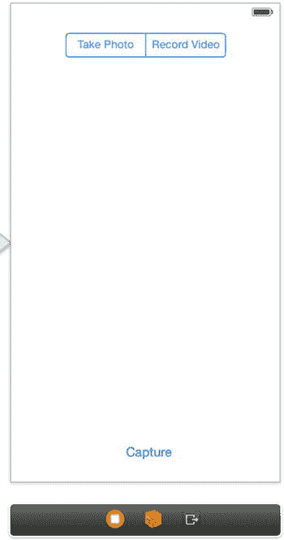

**图 9-13.** 一个简单的用户界面，允许用户在拍照和视频捕捉模式之间切换

为了在代码中访问分段控件和按钮，您需要为它们添加输出口。分别使用名称 `modeControl` 和 `captureButton`。当分段控件的值发生变化时，您还需要做出响应，因此请为该事件创建一个操作。将该操作命名为 `updateMode`。

现在切换到您的 `ViewController.h` 文件。添加几个属性，用于捕获会话的视频录制设置——一个用于音频输入，一个用于电影文件输出。此外，为了将视图控制器准备为电影文件录制的输出委托，您还需要在头文件中添加一个 `AVCaptureFileOutputRecordingDelegate` 协议。代码清单 9-40 显示了所有这些更改，并以粗体标出。

**代码清单 9-40.** 设置 `ViewController.h` 文件

```
//
//  ViewController.h
//  Recipe 9-7 Recording Video With AVCaptureSession
//

#import <UIKit/UIKit.h>
#import <AVFoundation/AVFoundation.h>
#import <AssetsLibrary/AssetsLibrary.h>

@interface ViewController : UIViewController <AVCaptureFileOutputRecordingDelegate>

@property (strong, nonatomic) AVCaptureSession *captureSession;
@property (strong, nonatomic) AVCaptureDeviceInput *videoInput;
@property (strong, nonatomic) AVCaptureDeviceInput *audioInput;
@property (strong, nonatomic) AVCaptureStillImageOutput *stillImageOutput;
@property (strong, nonatomic) AVCaptureMovieFileOutput *movieOutput;
@property (weak, nonatomic) IBOutlet UIButton *captureButton;
@property (weak, nonatomic) IBOutlet UISegmentedControl *modeControl;

- (IBAction)capture:(id)sender;
- (IBAction)updateMode:(id)sender;

@end
```

现在头文件已设置完毕，请切换到您的实现文件。首先，您需要对 `viewDidLoad` 方法进行几处更改。第一处是设置一个音频输入对象，以便在录制视频时从设备的麦克风捕获声音。这些更改在代码清单 9-41 中以粗体标出。

**代码清单 9-41.** 设置音频输入对象

```
- (void)viewDidLoad
{
    [super viewDidLoad];
    self.captureSession = [[AVCaptureSession alloc] init];
    //可选：self.captureSession.sessionPreset = AVCaptureSessionPresetMedium;
    AVCaptureDevice *videoDevice =
        [AVCaptureDevice defaultDeviceWithMediaType:AVMediaTypeVideo];
    AVCaptureDevice *audioDevice =
        [AVCaptureDevice defaultDeviceWithMediaType:AVMediaTypeAudio];
    NSError *error = nil;
    self.videoInput =
        [AVCaptureDeviceInput deviceInputWithDevice:videoDevice error:nil];
    self.audioInput =
        [[AVCaptureDeviceInput alloc] initWithDevice:audioDevice error:nil];
    // ...
}
```

现在，我们将替换上一个食谱中代码清单 9-26 添加的现有 `if-else` 语句。替换内容由一个 `if-else` 语句组成，该语句包含部分已编写的图像输出初始化代码，以及一个新的用于检查音频输入错误的 `if` 语句。代码清单 9-42 显示了这些更改。

**代码清单 9-42.** 为音频和视频输入添加错误检查

```
- (void)viewDidLoad
{
    [super viewDidLoad];
    self.captureSession = [[AVCaptureSession alloc] init];
    //可选：self.captureSession.sessionPreset = AVCaptureSessionPresetMedium;
    AVCaptureDevice *videoDevice =
        [AVCaptureDevice defaultDeviceWithMediaType:AVMediaTypeVideo];
    AVCaptureDevice *audioDevice =
        [AVCaptureDevice defaultDeviceWithMediaType:AVMediaTypeAudio];
    NSError *error = nil;
    self.videoInput =
        [AVCaptureDeviceInput deviceInputWithDevice:videoDevice error:&error];
    self.audioInput =
        [[AVCaptureDeviceInput alloc] initWithDevice:audioDevice error:&error];
    if (self.videoInput)
    {
        self.stillImageOutput = [[AVCaptureStillImageOutput alloc] init];
        NSDictionary *stillImageOutputSettings = [[NSDictionary alloc]
            initWithObjectsAndKeys:AVVideoCodecJPEG, AVVideoCodecKey, nil];
        [self.stillImageOutput setOutputSettings:stillImageOutputSettings];
        [self.captureSession addOutput:self.stillImageOutput];
    }
    else
    {
        NSLog(@"视频输入错误：%@", error);
    }
    if (!self.videoInput)
    {
        NSLog(@"音频输入错误：%@", error);
    }
    //...
}
```

接下来，设置一个输出对象，用于记录来自输入对象的数据并生成电影文件，如代码清单 9-43 所示。

**代码清单 9-43.** 设置电影输出对象

```
- (void)viewDidLoad
{
    // ...
    self.stillImageOutput = [[AVCaptureStillImageOutput alloc] init];
    NSDictionary *stillImageOutputSettings = [[NSDictionary alloc]
        initWithObjectsAndKeys:AVVideoCodecJPEG, AVVideoCodecKey, nil];
    [self.stillImageOutput setOutputSettings:stillImageOutputSettings];
    self.movieOutput = [[AVCaptureMovieFileOutput alloc] init];
    [self.captureSession addOutput:self.stillImageOutput];
    // ...
}
```

最后，将捕获会话设置为拍照模式，并调整预览图层的大小，使其不会覆盖新的分段控件。代码清单 9-44 显示了这一更改。

**代码清单 9-44.** 将视频输入添加到捕获会话并更改帧大小

```
if (self.videoInput)
{
    self.stillImageOutput = [[AVCaptureStillImageOutput alloc] init];
    NSDictionary *stillImageOutputSettings = [[NSDictionary alloc]
        initWithObjectsAndKeys:AVVideoCodecJPEG, AVVideoCodecKey, nil];
    [self.stillImageOutput setOutputSettings:stillImageOutputSettings];
    self.movieOutput = [[AVCaptureMovieFileOutput alloc] init];
    // 设置用于拍照的捕获会话
    [self.captureSession addInput:self.videoInput];
    [self.captureSession addOutput:self.stillImageOutput];
}
```

完成所有这些更改后，您的 `viewDidLoad` 方法应类似于代码清单 9-45。

**代码清单 9-45.** 完整的 `viewDidLoad` 方法

```
- (void)viewDidLoad
{
    [super viewDidLoad];
    self.captureSession = [[AVCaptureSession alloc] init];
    //可选：self.captureSession.sessionPreset = AVCaptureSessionPresetMedium;
    AVCaptureDevice *videoDevice =
        [AVCaptureDevice defaultDeviceWithMediaType:AVMediaTypeVideo];
    AVCaptureDevice *audioDevice =
        [AVCaptureDevice defaultDeviceWithMediaType:AVMediaTypeAudio];
    NSError *error = nil;
    self.videoInput =
        [AVCaptureDeviceInput deviceInputWithDevice:videoDevice error:&error];
    self.audioInput =
        [[AVCaptureDeviceInput alloc] initWithDevice:audioDevice error:&error];
    if (self.videoInput)
    {
        self.stillImageOutput = [[AVCaptureStillImageOutput alloc] init];
        NSDictionary *stillImageOutputSettings = [[NSDictionary alloc]
            initWithObjectsAndKeys:AVVideoCodecJPEG, AVVideoCodecKey, nil];
        [self.stillImageOutput setOutputSettings:stillImageOutputSettings];
        self.movieOutput = [[AVCaptureMovieFileOutput alloc] init];
        // 设置用于拍照的捕获会话
        [self.captureSession addInput:self.videoInput];
        [self.captureSession addOutput:self.stillImageOutput];
    }
    else
    {
        NSLog(@"视频输入错误：%@", error);
    }
    if (!self.videoInput)
    {
        NSLog(@"音频输入错误：%@", error);
    }
    AVCaptureVideoPreviewLayer *previewLayer =
        [AVCaptureVideoPreviewLayer layerWithSession:self.captureSession];
    UIView *aView = self.view;
    previewLayer.frame =
        CGRectMake(0, 70, self.view.frame.size.width, self.view.frame.size.height-140);
    [aView.layer addSublayer:previewLayer];
}
```


## 注意

请注意，您没有将 `audioInput` 和 `movieOutput` 对象添加到捕获会话中。稍后，您将根据用户选择的模式添加和移除输入对象，但目前假设为“拍照”模式。因此，在 `viewDidLoad` 方法中只添加了与该特定模式相关的输入和输出对象（出于同样的原因，确保分段控件设置了正确的选定索引值也很重要）。

现在，更新 `capture` 操作方法，如清单 9-46 所示。它现在应检查应用程序处于哪种模式；如果是“拍照”模式，则应执行之前的操作，即捕获静态图像。

**清单 9-46.** 为 `capture:` 方法添加条件语句

```
- (IBAction)capture:(id)sender
{
    if (self.modeControl.selectedSegmentIndex == 0)
    {
        // Picture Mode
        [self captureStillImage];
    }
    else
    {
        // Video Mode
    }
}
```

然而，如果处于视频录制模式，则应根据当前是否正在录制视频，在开始和停止录制模式之间切换，如清单 9-47 所示。

**清单 9-47.** 为 `capture:` 方法添加处理视频操作的代码

```
- (IBAction)capture:(id)sender
{
    if (self.modeControl.selectedSegmentIndex == 0)
    {
        // Picture Mode
        [self captureStillImage];
    }
    else
    {
        // Video Mode
        if (self.movieOutput.isRecording == YES)
        {
            [self.captureButton setTitle:@"Capture" forState:UIControlStateNormal];
            [self.movieOutput stopRecording];
        }
        else
        {
            [self.captureButton setTitle:@"Stop" forState:UIControlStateNormal];
            [self.movieOutput startRecordingToOutputFileURL:[self tempFileURL]
                                         recordingDelegate:self];
        }
    }
}
```

您可能已经注意到，您在之前调用了 `tempFileURL` 方法来设置 `AVCaptureOutput`。简而言之，此方法会返回一个路径，用于将录制的视频临时保存在设备上。如果该位置已存在文件，则会删除该文件（这样，您永远不会使用超过一个视频的磁盘空间）。在实际应用中，您可能需要提示用户并告知其文件将被覆盖，但为了简单起见，我们跳过提示代码。清单 9-48 展示了 `tempFileURL` 的实现。

**清单 9-48.** 实现 `tempFileURL` 方法

```
- (NSURL *) tempFileURL
{
    NSString *outputPath = [[NSString alloc] initWithFormat:@"%@%@",
                            NSTemporaryDirectory(), @"output.mov"];
    NSURL *outputURL = [[NSURL alloc] initFileURLWithPath:outputPath];
    NSFileManager *manager = [[NSFileManager alloc] init];
    if ([manager fileExistsAtPath:outputPath])
    {
        [manager removeItemAtPath:outputPath error:nil];
    }
    return outputURL;
}
```

下一步是设置 `AVCaptureMovieFileOutput` 的委托方法，当 `AVCaptureSession` 完成录制视频时调用该方法。该方法首先检查将视频录制到文件时是否存在错误，然后将视频文件保存到资源库中。将视频写入相册的过程与照片几乎相同，因此您可能会从之前的配方中认出很多代码。清单 9-49 展示了实现。

**清单 9-49.** `captureOutput:didFinishRecordingToOutputFileAtUrl:fromConnections:error:` 方法的实现

```
- (void)captureOutput:(AVCaptureFileOutput *)captureOutput
didFinishRecordingToOutputFileAtURL:(NSURL *)outputFileURL
        fromConnections:(NSArray *)connections
                  error:(NSError *)error
{
    BOOL recordedSuccessfully = YES;
    if ([error code] != noErr)
    {
        // A problem occurred: Find out if the recording was successful.
        id value = [[error userInfo]
                    objectForKey:AVErrorRecordingSuccessfullyFinishedKey];
        if (value)
            recordedSuccessfully = [value boolValue];
        // Logging the problem anyway:
        NSLog(@"A problem occurred while recording: %@", error);
    }
    if (recordedSuccessfully)
    {
        ALAssetsLibrary *library = [[ALAssetsLibrary alloc] init];
        [library writeVideoAtPathToSavedPhotosAlbum:outputFileURL
                                completionBlock:^(NSURL *assetURL, NSError *error)
        {
            UIAlertView *alert;
            if (!error)
            {
                alert = [[UIAlertView alloc] initWithTitle:@"视频已保存"
                                                    message:@"影片已成功保存到您的照片库"
                                                   delegate:nil
                                          cancelButtonTitle:@"确定"
                                          otherButtonTitles:nil, nil];
            }
            else
            {
                alert = [[UIAlertView alloc] initWithTitle:@"保存视频时出错"
                                                    message:@"影片未能保存到您的照片库"
                                                   delegate:nil
                                          cancelButtonTitle:@"确定"
                                          otherButtonTitles:nil, nil];
            }
            [alert show];
        }];
    }
}
```

最后，如清单 9-50 所示，实现当用户在两种模式之间切换时调用的操作方法。此方法使用与相应模式关联的正确输入和输出对象更新捕获会话。它还会为视频模式输出对象设置方向模式（静态图像模式已处理此问题，详见配方 9-6）。最后，它重置捕获按钮的标题。在 iOS 7 中，用户可以选择拒绝麦克风访问；还有一个 `if` 语句用于检查是否可以添加音频输入到会话。如果不能，它会向用户提示如何解决该问题的说明，并将用户切换回相机。

**清单 9-50.** `updateMode:` 操作的实现

```
- (IBAction)updateMode:(id)sender
{
    [self.captureSession stopRunning];
    if (self.modeControl.selectedSegmentIndex == 0)
    {
        // Still Image Mode
        if (self.movieOutput.isRecording == YES)
        {
            [self.movieOutput stopRecording];
        }
        [self.captureSession removeInput:self.audioInput];
        [self.captureSession removeOutput:self.movieOutput];
        [self.captureSession addOutput:self.stillImageOutput];
    }
    else
    {
        if([self.captureSession canAddInput:self.audioInput])
        {
            // Video Mode
            [self.captureSession removeOutput:self.stillImageOutput];
            [self.captureSession addInput:self.audioInput];
            [self.captureSession addOutput:self.movieOutput];
            // Set orientation of capture connections to portrait
            NSArray *array = [[self.captureSession.outputs objectAtIndex:0] connections];
            for (AVCaptureConnection *connection in array)
            {
                connection.videoOrientation = AVCaptureVideoOrientationPortrait;
            }
        }
        else
        {
            self.modeControl.selectedSegmentIndex = 0;
            NSLog(@"User turned off access to microphone");
            UIAlertView *alert = [[UIAlertView alloc] initWithTitle:@"无法访问音频"
                                                            message:@"请验证麦克风访问权限是否已在“设置”>“隐私”>“麦克风”中开启"
                                                           delegate:nil
                                                  cancelButtonTitle:@"确定"
                                                  otherButtonTitles:nil];
            [alert show];
        }
    }
    [self.captureButton setTitle:@"Capture" forState:UIControlStateNormal];
    [self.captureSession startRunning];
}
```

现在，您可以构建并运行应用程序了。您应该能够在拍照和录制视频之间切换，并且结果应存储在设备的照片库中。图 9-14 显示了正在运行的应用程序。如果您通过“设置”>“隐私”>“麦克风”关闭麦克风访问权限，应用程序会提示您，并告知您添加音频输入失败以及如何修复。

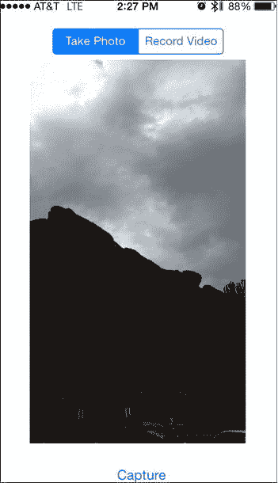

**图 9-14.** 一个可以拍照和录制视频的应用程序


## 方法 9-8：捕获视频帧

对于许多使用视频的应用程序而言，缩略图是一种很有用的方式来“代表”某个视频。在本方法中，你将扩展前面的方法，并在视频录制完成后生成并显示一张缩略图。

首先，将 `CoreMedia` 框架添加到你的项目中。你将使用它来生成缩略图。

接下来，在主视图用户界面的左下角添加一个图像视图，使其类似于图 9-15。同样，你需要通过从故事板窗口右下角的“解决自动布局问题”菜单中选择“添加缺失的约束”来为图像视图添加一些约束。这将确保它在 3.5 英寸设备上看起来正常。选中 `UIImage` 后，从 pin 菜单中添加一个宽度和高度约束，如图 9-16 所示。

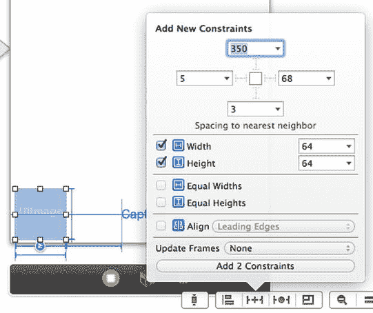

**图 9-16.** 添加宽度和高度约束

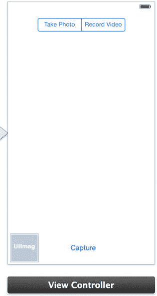

**图 9-15.** 左下角包含缩略图图像视图的用户界面

为图像视图添加一个名为 `thumbnailImageView` 的插座，以便稍后可以在代码中引用它。

现在，让我们进入本方法的核心内容。清单 9-51 中的方法从影片的中点提取一张图像并更新缩略图图像视图。该方法基本上使用一个 URL 来创建一个资产，并据此创建一个图像生成器。然后我们检查正确的旋转方向，并设置我们想要提取图像的剪辑时间。接着我们异步生成图像。

**清单 9-51.** `createThumbnailForVideoURL` 的实现

```
-(void)createThumbnailForVideoURL:(NSURL *)videoURL

{

AVURLAsset *myAsset = [[AVURLAsset alloc] initWithURL:videoURL options:[NSDictionary dictionaryWithObject:@"YES" forKey:AVURLAssetPreferPreciseDurationAndTimingKey]];

AVAssetImageGenerator *imageGenerator =

[AVAssetImageGenerator assetImageGeneratorWithAsset:myAsset];

//Make sure images are correctly rotated.

imageGenerator.appliesPreferredTrackTransform = YES;

Float64 durationSeconds = CMTimeGetSeconds([myAsset duration]);

CMTime half = CMTimeMakeWithSeconds(durationSeconds/2.0, 600);

NSArray *times = [NSArray arrayWithObjects: [NSValue valueWithCMTime:half], nil];

[imageGenerator generateCGImagesAsynchronouslyForTimes:times

completionHandler:^(CMTime requestedTime, CGImageRef image, CMTime actualTime,

AVAssetImageGeneratorResult result, NSError *error)

{

if (result == AVAssetImageGeneratorSucceeded)

{

self.thumbnailImageView.image = [UIImage imageWithCGImage:image];

}

else if (result == AVAssetImageGeneratorFailed)

{

NSLog(@"Failed with error: %@", [error localizedDescription]);

}

}

];

}
```

现在剩下的就是在视频录制完成后调用该方法，如清单 9-52 所示。我们在这里所做的只是添加一行代码，当视频成功捕获时，调用清单 9-51 中的方法。

**清单 9-52.** 修改 `captureOutput:didFinishRecordingToOutputFileAtURL:fromConnections:` 方法

```
- (void)captureOutput:(AVCaptureFileOutput *)captureOutput

didFinishRecordingToOutputFileAtURL:(NSURL *)outputFileURL

fromConnections:(NSArray *)connections

error:(NSError *)error

{

BOOL recordedSuccessfully = YES;

if ([error code] != noErr)

{

// A problem occurred: Find out if the recording was successful.

id value =

[[error userInfo] objectForKey:AVErrorRecordingSuccessfullyFinishedKey];

if (value)

recordedSuccessfully = [value boolValue];

// Logging the problem anyway:

NSLog(@"A problem occurred while recording: %@", error);

}

if (recordedSuccessfully)

{

[self createThumbnailForVideoURL:outputFileURL];

ALAssetsLibrary *library = [[ALAssetsLibrary alloc] init];

[library writeVideoAtPathToSavedPhotosAlbum:outputFileURL

completionBlock:^(NSURL *assetURL, NSError *error)

{

UIAlertView *alert;

if (!error)

{

alert = [[UIAlertView alloc] initWithTitle:@"Video Saved"

message:@"The movie was successfully saved to your photos library"

delegate:nil

cancelButtonTitle:@"OK"

otherButtonTitles:nil, nil];

}

else

{

alert = [[UIAlertView alloc] initWithTitle:@"Error Saving Video"

message:@"The movie was not saved to your photos library"

delegate:nil

cancelButtonTitle:@"OK"

otherButtonTitles:nil, nil];

}

[alert show];

}

];

}

}
```

现在构建并运行你的应用程序，启动后切换到“录制视频”模式。通过单击“捕获”按钮两次（一次开始，一次停止）来录制一段视频。几秒钟后，从影片中点提取的缩略图将显示在左下角，如图 9-17 所示。

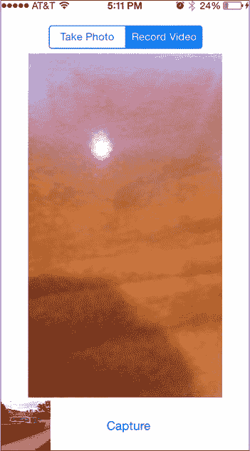

**图 9-17.** 你的应用程序在左下角显示一个影片缩略图

**注意：** 你可能已经注意到，方法 9-8 中使用的方法相当慢，通常需要几秒钟才能提取图像。还有其他方法你可以尝试——例如，在你的捕获会话中添加一个 `AVCaptureStillImageOutput`（可以连接多个输出对象），并在录制开始时拍摄快照。你可以使用方法 9-6 中学到的内容。另一种方法是使用前面提到的 `AVCaptureVideoDataOutput`。使用该方法，你可以在录制过程中捕获任何帧并提取图像。


## 配方 9-9：捕获机器可读码

从 iOS 7 开始，`AVCaptureMetadataOutput` 类提供了一项新功能，使得读取机器可读码变得非常容易实现。机器可读码基本上就是一维或二维条码，例如 UPC-E 码或 QR 码。举例来说，苹果的 Passbook 应用就使用此功能来读取各种类型的码。现在，你也能用很少的代码将这项功能添加到自己的应用中。这个类现在让我们能够读取以下任何一种机器可读码类型：

**一维码**
* UPC-E
* EAN-8、EAN-13
* Code 39（带校验和不带校验）
* Code 93
* Code 128

**二维码**
* PDF417
* QR
* Aztec

首先，你将创建一个类似于配方 9-5 的单视图应用。像之前一样，你需要添加 AssetsLibrary、AVFoundation 和 CoreGraphics 框架。将一个标签拖到屏幕上，并按图 9-18 所示进行排列。将标签设置为三行高，并将其宽度调整为屏幕宽度。选中标签，然后通过故事板编辑器右下角的“解决自动布局问题”菜单中选择“添加缺失的约束”来添加一些约束。

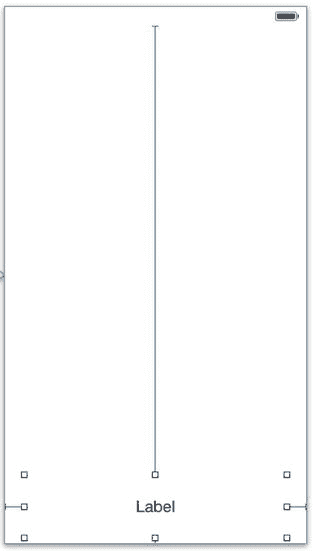

图 9-18. 完成的界面

接下来，为文本标签创建一个名为 `codeLabel` 的输出口。

现在你已经有了一个起点，接下来需要向视图控制器头文件中添加几个属性以及一个委托声明。这些属性将用于处理捕获会话、输入设备和元数据输出。我们需要向视图控制器添加一个委托，以便在扫描到条形码或二维码时获取信息。代码清单 9-53 展示了完整的 `ViewController.h` 文件。

代码清单 9-53. 包含所需属性和委托声明的完整 `ViewController.h` 文件

```
//
//  ViewController.h
//  Recipe 9-9 Capturing Machine-Readable Codes
//

#import <UIKit/UIKit.h>
#import <AVFoundation/AVFoundation.h>

@interface ViewController : UIViewController <AVCaptureMetadataOutputObjectsDelegate>

@property (weak, nonatomic) IBOutlet UILabel *codeLabel;
@property (strong, nonatomic) AVCaptureSession *captureSession;
@property (strong, nonatomic) AVCaptureDeviceInput *videoInput;
@property (strong, nonatomic) AVCaptureMetadataOutput *metadataOutput;

@end
```

接下来，我们需要向 `viewDidLoad:` 方法中添加一些代码，并添加委托。由于我们要向 `viewDidLoad` 方法中添加几个不同的内容，我们将先逐一解释每个部分，最后再展示完整的 `viewDidLoad` 方法。

首先，我们将创建一个 `AVCaptureSession`，并提供输入类型和输入设备，如代码清单 9-54 所示。和之前两个配方一样，我们在分配输入之前检查错误和视频输入是否存在。

代码清单 9-54. 添加 `AVCaptureSession` 和视频输入

```
//
//  ViewController.m
//  Recipe 9-9 Capturing Machine-Readable Codes
//

//...

- (void)viewDidLoad
{
    [super viewDidLoad];

    self.captureSession = [[AVCaptureSession alloc] init];

    AVCaptureDevice *device =
        [AVCaptureDevice defaultDeviceWithMediaType:AVMediaTypeVideo];

    NSError *error = nil;

    self.videoInput = [AVCaptureDeviceInput deviceInputWithDevice:device error:&error];

    if (self.videoInput)
    {
        [self.captureSession addInput:self.videoInput];
    }
    else
    {
        NSLog(@"Input Error: %@", error);
    }

    //...
}
```

接下来，你应该分配并初始化 `metadataOutput` 属性，然后设置委托和主线程的调度队列。由于二维码的处理强度并不高，主线程足以处理这些操作。你还需要设置一些元数据类型。在本例中，我们将使用 UPC-E 码和 QR 码类型。你可以随意使用前面列出的任何类型来扩展这些类型。将代码清单 9-55 中的代码添加到 `viewDidLoad` 方法中。

代码清单 9-55. 创建 `AVCaptureMetadataOutput` 实例并设置对象类型

```
self.metadataOutput = [[AVCaptureMetadataOutput alloc] init];
[self.captureSession addOutput:self.metadataOutput];
[self.metadataOutput setMetadataObjectsDelegate:self queue:dispatch_get_main_queue()];
self.metadataOutput.metadataObjectTypes = @[AVMetadataObjectTypeUPCECode, AVMetadataObjectTypeQRCode];
```

与我们在配方 9-5 中所做的类似，我们将创建一个新的预览层并将其设置到一个视图中，以便能够查看摄像头捕获的画面。同时将代码清单 9-56 中的代码添加到 `viewDidLoad` 方法中。

代码清单 9-56. 创建预览层以查看当前摄像头画面

```
AVCaptureVideoPreviewLayer *previewLayer =
    [AVCaptureVideoPreviewLayer layerWithSession:self.captureSession];

UIView *aView = self.view;
previewLayer.frame =
    CGRectMake(0, 20, self.view.frame.size.width,
               self.view.frame.size.height-100);

[aView.layer addSublayer:previewLayer];
```

完成后，你的 `viewDidLoad` 方法应该如代码清单 9-57 所示。

代码清单 9-57. 完整的 `viewDidLoad` 方法

```
- (void)viewDidLoad
{
    [super viewDidLoad];
    // Do any additional setup after loading the view, typically from a nib.

    self.captureSession = [[AVCaptureSession alloc] init];

    AVCaptureDevice *device =
        [AVCaptureDevice defaultDeviceWithMediaType:AVMediaTypeVideo];

    NSError *error = nil;

    self.videoInput = [AVCaptureDeviceInput deviceInputWithDevice:device error:&error];

    if (self.videoInput)
    {
        [self.captureSession addInput:self.videoInput];
    }
    else
    {
        NSLog(@"Input Error: %@", error);
    }

    self.metadataOutput = [[AVCaptureMetadataOutput alloc] init];
    [self.captureSession addOutput:self.metadataOutput];
    [self.metadataOutput setMetadataObjectsDelegate:self queue:dispatch_get_main_queue()];
    self.metadataOutput.metadataObjectTypes = @[AVMetadataObjectTypeUPCECode, AVMetadataObjectTypeQRCode];

    AVCaptureVideoPreviewLayer *previewLayer =
        [AVCaptureVideoPreviewLayer layerWithSession:self.captureSession];

    UIView *aView = self.view;
    previewLayer.frame =
        CGRectMake(0, 20, self.view.frame.size.width,
                   self.view.frame.size.height-70);

    [aView.layer addSublayer:previewLayer];
}
```

现在，剩下的唯一操作就是创建委托方法。这里我们要做的只是将文本标签设置为接收到的值。将代码清单 9-58 中的代码添加到实现文件中。

代码清单 9-58. `captureOutput:didOutputMetadataObjects:fromConnection:` 方法的实现

```
- (void)captureOutput:(AVCaptureOutput *)captureOutput didOutputMetadataObjects:(NSArray *)metadataObjects fromConnection:(AVCaptureConnection *)connection
{
    self.codeLabel.text = [NSString stringWithFormat:@" Type - %@: Value - %@", object.type, object.stringValue];
}
```

最后一步是使用 `viewWillAppear` 和 `viewWillDisappear` 方法来启动和停止捕获会话，就像我们在配方 9-5 中所做的那样。同时将代码清单 9-59 中所示的两个方法及其代码添加到视图控制器中。

代码清单 9-59. 添加 `viewWillAppear:` 和 `viewWillDisappear:` 方法的实现

```
- (void)viewWillAppear:(BOOL)animated
{
    [super viewWillAppear:animated];
    [self.captureSession startRunning];
}

- (void)viewWillDisappear:(BOOL)animated
{
    [super viewWillDisappear:animated];
    [self.captureSession stopRunning];
}
```

大功告成！如果你运行该应用并找到 UPC-E 或 QR 码，你的应用应该类似于图 9-19 所示。

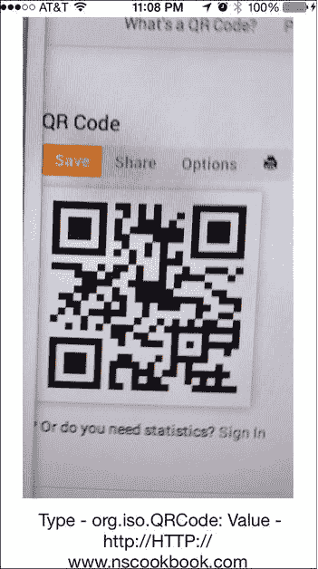

图 9-19. 完成的应用，显示码的类型和值的文本


## 摘要

作为开发者，在处理设备相机时你拥有丰富的选择空间。预定义的接口如 `UIImagePickerController` 和 `UIVideoEditorController` 既实用又设计精良，但苹果的 AV Foundation 框架实现带来了更多可能性。从处理视频和音频到应对条形码与静态图像，一切皆有可能。即便快速浏览完整文档，也会发现无数此处未讨论的功能，涵盖从设备能力（例如摄像头的 LED“闪光灯”）到实现自定义“触摸对焦”功能等方方面面。我们生活在这样一个世界：图像、音频和视频在数秒内穿梭全球，作为开发者，我们必须能够设计和创造符合媒体社区需求的创新解决方案。

