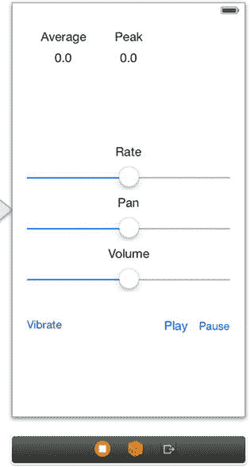
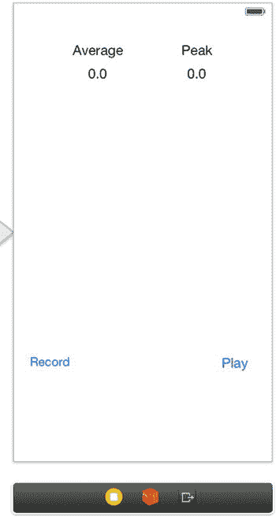
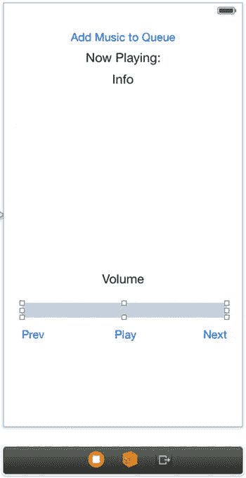
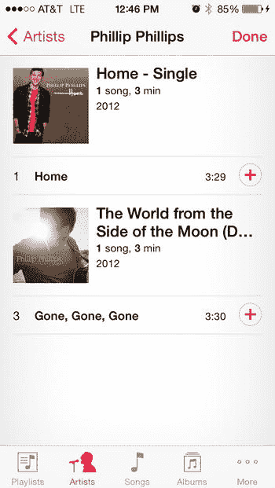
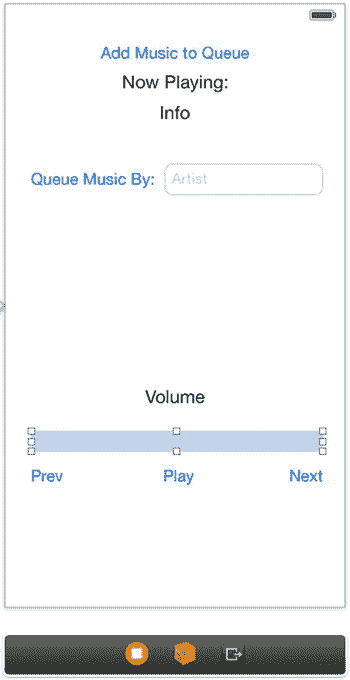
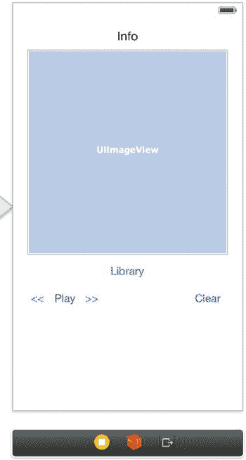
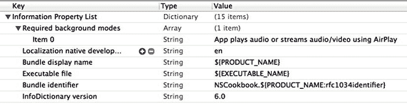
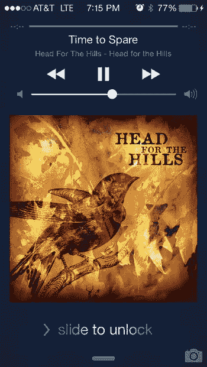
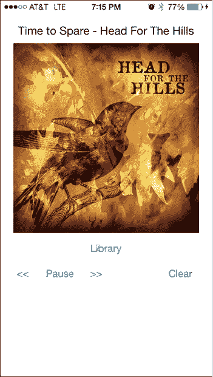

# 10. 多媒体实战食谱

## 概述

用奥尔德斯·赫胥黎的话来说：“静默之后，最接近表达不可言说之物的便是音乐。”我们生活在一个被声音和音乐包围的世界里。从广告中最微妙的背景旋律到摇滚音乐会上电吉他的巨大轰鸣，声音对我们的生活有着巨大的影响，并扮演着不可或缺的角色。作为开发者，我们有责任将这种力量融入应用，为用户带来最完整、最理想的体验。

本章的多个食谱都会用到对音乐库的访问。因此，要全面测试这些食谱，请确保你的设备音乐库中至少有几首歌曲。

## 食谱 10-1：播放音频

如果你问大多数人在听到“iPhone”和“音频”时会想到什么，他们很可能会联想到自己的 iPod 以及下载的数千首歌曲。大多数用户往往会忽略一个极其重要的概念——后台音频和音效。这些声音片段和曲调在正常使用中可能完全不被用户注意，但在应用功能与设计方面，它们能极大提升应用品质。可能是拍照时的“快门声”，或是玩游戏太久后萦绕脑中的背景音乐；无论用户是否注意到，声音都能带来天壤之别。iOS AV Foundation 框架利用 `AVAudioPlayer` 提供了一种访问、播放和操作声音文件的简便方式。在本食谱中，你将创建一个示例项目，让你能够播放音频文件，并允许用户操作音频剪辑的播放。

### 设置应用

首先创建一个新的单视图应用项目。本食谱中将使用两个默认未链接的框架，因此需要将它们添加到项目中。它们是 `AVFoundation.framework`（包含 `AVAudioPlayer` 类）和 `AudioToolbox.framework`（用于使设备振动）。

接下来，要导入这些框架的 API，请切换到视图控制器的头文件，并添加以下声明：

```
//
//  ViewController.h
//  Recipe 10-1 Playing Audio
//

#import <UIKit/UIKit.h>
#import <AVFoundation/AVFoundation.h>
#import <AudioToolbox/AudioToolbox.h>

@interface ViewController : UIViewController

@end
```

现在，在 `Main.storyboard` 文件中使用以下组件构建视图，使其与图 10-1 类似：



**图 10-1.** 控制 AVAudioPlayer 的用户界面

- 3 个滑块：Rate（速率）、Pan（声相）和 Volume（音量）
- 5 个标题标签：Average（平均）、Peak（峰值）、Rate（速率）、Pan（声相）和 Volume（音量）
- 2 个数值标签：均默认值为 "0.0"
- 3 个按钮：Vibrate（振动）、Play（播放）和 Pause（暂停）

你需要让滑块的值与其所控制属性的可能值匹配。使用属性检查器，将 Rate（速率）滑块的最小值和最大值分别调整为 0.5 和 2.0（对应半速和 2 倍速），并将其当前值设为 1。Pan（声相）滑块的值应设为 -1 和 1（对应左声相和右声相），当前值设为 0。Volume（音量）滑块的默认值应该已经合适，因为音量属性的范围是 0 到 1，只需将其当前值设为 1（最大音量）。

如之前的食谱所示，为代码中需要引用的控件创建输出口，并为需要响应的事件创建动作。创建以下输出口：

- 滑块对应的 `rateSlider`、`panSlider` 和 `volumeSlider`
- 两个电平监测标签对应的 `averageLabel` 和 `peakLabel`（即图 10-1 中显示 "0.0" 文本的标签）

创建以下动作：

- 各滑块值更改事件对应的 `updateRate`、`updatePan` 和 `updateVolume`
- 按钮触摸抬起事件对应的 `playVibrateSound`、`startPlayer` 和 `pausePlayer`

在头文件中添加两个属性，用于跟踪 `AVAudioPlayer` 和 `AVAudioSession`：

```
@property (strong, nonatomic) AVAudioPlayer *player;
```

头文件的最后一步是让视图控制器遵循 `AVAudioPlayerDelegate` 协议。你的 `ViewController.h` 文件现在应如清单 10-1 所示。

**清单 10-1.** 初始的 ViewController.h 设置

```
//
//  ViewController.h
//  Recipe 9.1 Playing Audio
//

#import <UIKit/UIKit.h>
#import <AVFoundation/AVFoundation.h>
#import <AudioToolbox/AudioToolbox.h>

@interface ViewController : UIViewController <AVAudioPlayerDelegate>

@property (weak, nonatomic) IBOutlet UISlider *rateSlider;
@property (weak, nonatomic) IBOutlet UISlider *panSlider;
@property (weak, nonatomic) IBOutlet UISlider *volumeSlider;
@property (weak, nonatomic) IBOutlet UILabel *averageLabel;
@property (weak, nonatomic) IBOutlet UILabel *peakLabel;
@property (strong, nonatomic) AVAudioPlayer *player;

- (IBAction)updateRate:(id)sender;
- (IBAction)updatePan:(id)sender;
- (IBAction)updateVolume:(id)sender;
- (IBAction)playVibrateSound:(id)sender;
- (IBAction)startPlayer:(id)sender;
- (IBAction)pausePlayer:(id)sender;

@end
```


在继续之前，你需要选择并导入应用程序将要播放的声音文件。我们使用的文件名为`midnight-ride.mp3`，代码中也对应了该文件名。你需要根据所选文件更改任何文件名或文件类型。建议查阅 Apple 文档，了解哪些文件类型是合适的，地址为 `https://developer.apple.com/library/ios/DOCUMENTATION/AudioVideo/Conceptual/MultimediaPG/UsingAudio/UsingAudio.html#//apple_ref/doc/uid/TP40009767-CH2`。不过，可以比较肯定地说，大多数常用文件类型（如 `.wav` 或 `.mp3`）都是可用的。

**提示**

我们从 Sound Jay 下载了声音文件，该网站免费提供声音和音乐文件。请务必阅读使用条款（`http://www.soundjay.com/tos.html`），了解如何在你的项目中合法使用 Sound Jay 的文件。

通过将声音文件拖放到“支持的文件夹”（Supported Files）中，将其添加到你的项目中。有关添加资源文件的更多信息，请参见第 1 章中的方法 1-8。

### 设置音频播放器

切换到`ViewController.m`文件，找到`viewDidLoad`方法。添加清单 10-2 中的代码来设置`AVAudioPlayer`。

**清单 10-2.** 更新`viewDidLoad`方法以设置`AVAudioPlayer`

```
- (void)viewDidLoad
{
[super viewDidLoad];
// 在从 nib 加载视图后执行任何额外的设置。

NSString *fileName = @"midnight-ride"; // 将此更改为你自己的文件名
NSString *fileType = @"mp3";
NSString *soundFilePath =
[[NSBundle mainBundle] pathForResource:fileName ofType:fileType];
NSURL *soundFileURL = [NSURL fileURLWithPath:soundFilePath];
NSError *error;

self.player =
[[AVAudioPlayer alloc] initWithContentsOfURL:soundFileURL error:&error];
if (error)
{
NSLog(@"创建音频播放器时出错: %@", error);
}

self.player.enableRate = YES; // 允许我们改变播放速率。
self.player.meteringEnabled = YES; // 允许我们监测音量电平
self.player.delegate = self;
self.volumeSlider.value = self.player.volume;
self.rateSlider.value = self.player.rate;
self.panSlider.value = self.player.pan;
[self.player prepareToPlay]; // 预加载音频以减少延迟
[NSTimer scheduledTimerWithTimeInterval:0.1
target:self selector:@selector(updateLabels) userInfo:nil repeats:YES];
}
```

从清单 10-2 中可以看出，你为声音文件设置了 URL，并用它初始化了`AVAudioPlayer`，设置了`enableRate`属性以允许更改播放速率，并设置了`meteringEnabled`属性以监测播放器的音量电平。可选地调用了播放器的`prepareToPlay`方法来预加载声音文件，这有望使你的应用程序运行得更快。最后你创建了一个计时器，它以每秒十次的频率执行`updateLabels`方法。这样你的标签将以几乎恒定的速率更新。

现在添加`updateLabels`方法的简单实现，如清单 10-3 所示。

**清单 10-3.** 实现`updateLabels`方法

```
-(void)updateLabels
{
[self.player updateMeters];
self.averageLabel.text =
[NSString stringWithFormat:@"%f", [self.player averagePowerForChannel:0]];
self.peakLabel.text =
[NSString stringWithFormat:@"%f", [self.player peakPowerForChannel:0]];
}
```

每当你使用`averagePowerForChannel`或`peakPowerForChannel`方法获取最新值时，都需要调用`updateMeters`方法。这两个方法都接受一个`NSUInteger`参数，这是一个无符号整数参数，用于指定要检索信息的声道。通过给它赋值为 0，即为立体声音轨指定左声道，或为单声道音轨指定单一声道。鉴于你只是在使用该功能的基本用法，声道 0 是一个很好的默认值。

接下来，为你的滑块实现动作方法，如清单 10-4 所示。每当相应滑块的值发生变化时，这些动作就会被调用。

**清单 10-4.** 实现`updateRate`、`updatePan`和`updateVolume`方法

```
- (IBAction)updateRate:(id)sender
{
self.player.rate = self.rateSlider.value;
}

- (IBAction)updatePan:(id)sender
{
self.player.pan = self.panSlider.value;
}

- (IBAction)updateVolume:(id)sender
{
self.player.volume = self.volumeSlider.value;
}
```

接下来，实现你的按钮动作方法，这些方法也非常简单。该实现如清单 10-5 所示。

**清单 10-5.** 实现`playVibrateSound`、`startPlayer`和`pausePlayer`动作方法

```
- (IBAction)playVibrateSound:(id)sender
{
AudioServicesPlaySystemSound(kSystemSoundID_Vibrate);
}

- (IBAction)startPlayer:(id)sender
{
[self.player play];
}

- (IBAction)pausePlayer:(id)sender
{
[self.player pause];
}
```

**注意**

虽然你目前使用的大部分 AV Foundation 功能都能在模拟器上运行（使用你电脑的麦克风和扬声器），但振动声音不会。你需要一台物理设备来测试此功能。

### 处理错误和中断

至此，你的应用程序可以成功播放和暂停音乐，你可以调整播放速率、声像和音量，并监测输出电平。然而，它缺乏一些基本的错误处理和中断处理。

要捕获播放文件时的任何错误，你可以实现来自`AVAudioPlayerDelegate`协议的清单 10-6 中的方法。

**清单 10-6.** 实现`audioPlayerDecodeErrorDidOccur:error:`委托方法

```
-(void)audioPlayerDecodeErrorDidOccur:(AVAudioPlayer *)player error:(NSError *)error
{
    NSLog(@"播放文件出错: %@", [error localizedDescription]);
}
```

每当处理带有声音或音乐的应用程序时，总会担心你的应用程序可能被电话或短信中断，因此你应该始终包含处理这些问题的功能。这可以通过几个`AVAudioPlayer`委托方法来实现。当音频播放器在播放过程中被中断时，会调用`audioPlayerBeginInterruption:`方法。在大多数情况下，你无需为该方法提供实现，因为你的播放器会被系统自动暂停。但是，如果希望你的播放器在中断后恢复播放，则需要实现`audioPlayerEndInterruption:`方法。在本方案中，你希望音频播放器恢复播放，因此将清单 10-7 中的代码添加到你的视图控制器中。

**清单 10-7.** 实现`audioPlayerEndInterruption:withOptions:`方法

```
- (void)audioPlayerEndInterruption:(AVAudioPlayer *)player withOptions:(NSUInteger)flags
{
    if (flags == AVAudioSessionInterruptionOptionShouldResume)
    {
        [player play];
    }
}
```

现在你可以看到，尽管`AVAudioPlayer`使用简单，但其灵活性很大。通过使用`AVAudioPlayer`的多个实例，你可以实现同时使用多种声音的复杂音频设计。例如，可以在一个`AVAudioPlayer`中播放背景音乐音轨，并用另外一两个来处理基于事件的音效。`AVAudioPlayer`类强大、简单且灵活的特性，使其在 iOS 开发者中如此受欢迎。


## 技巧 10-2：录制音频

你已经掌握了播放音频的核心概念，现在可以熟悉其逆向过程：录制音频。此过程在结构和实现上都与播放音频非常相似。你使用 `AVAudioRecorder` 类进行录制，并结合 `AVAudioPlayer` 来处理录制的回放。我们还通过设置两个多功能按钮来使这个项目稍微复杂一些：一个用于开始和停止录制，另一个用于播放和暂停录制。

首先，创建一个新的单视图应用程序项目。你需要像上一个技巧中那样，再次将 `AVFoundation` 框架链接并导入到你的项目中。但与前一个技巧不同的是，你不再需要 Audio Toolbox 框架。

现在设置用户界面，使其看起来像图 10-2，包含以下项目：



图 10-2. 录制和播放音频的用户界面

- 2 个标题标签：平均（Average）和峰值（Peak）
- 2 个数值标签：均设置为“0.0”
- 2 个按钮：录制（Record）和播放（Play）

创建以下输出口：

- `averageLabel` 和 `peakLabel` 用于电平监控标签
- `recordButton` 和 `playButton` 用于按钮

创建以下操作：

- `toggleRecording` 用于“录制”按钮的“值更改”事件
- `togglePlaying` 用于“播放”按钮的“值更改”事件

在进入实现文件之前，你将对 `ViewController.h` 文件进行一些额外的修改，如代码清单 10-8 所示。首先，通过遵循 `AVAudioPlayerDelegate` 和 `AVAudioRecorderDelegate` 协议，准备好让视图控制器成为音频播放器和音频录制器的代理。

代码清单 10-8. 在 ViewController.h 文件中声明代理

```
@interface ViewController : UIViewController <AVAudioPlayerDelegate,
                                             AVAudioRecorderDelegate>
```

接下来，添加一个实例变量来标记是否有新的录制可用，如代码清单 10-9 所示。

代码清单 10-9. 在 ViewController.h 文件中添加实例变量

```
@interface ViewController : UIViewController<AVAudioPlayerDelegate,
                                             AVAudioRecorderDelegate>
{
    @private
    BOOL _newRecordingAvailable;
}

// ...
@end
```

最后，添加四个属性，用于保存音频播放器、音频录制器、音频会话以及录制文件的文件路径的实例。通过这些更改以及前面的更改，你的 `ViewController.h` 文件应类似于代码清单 10-10，更改部分以粗体显示。

代码清单 10-10. 完整的 ViewController.h 文件

```
//
//  ViewController.h
//  技巧 9.2 录制音频
//

#import <UIKit/UIKit.h>
#import <AVFoundation/AVFoundation.h>

@interface ViewController : UIViewController <AVAudioPlayerDelegate, AVAudioRecorderDelegate>
{
    BOOL _newRecordingAvailable;
}

@property (weak, nonatomic) IBOutlet UILabel *averageLabel;
@property (weak, nonatomic) IBOutlet UILabel *peakLabel;
@property (weak, nonatomic) IBOutlet UIButton *recordButton;
@property (weak, nonatomic) IBOutlet UIButton *playButton;
@property (strong, nonatomic) AVAudioPlayer *player;
@property (strong, nonatomic) AVAudioRecorder *recorder;
@property (strong, nonatomic) AVAudioSession *session;
@property (strong, nonatomic) NSString *recordedFilePath;

- (IBAction)toggleRecording:(id)sender;
- (IBAction)togglePlaying:(id)sender;

@end
```

### 设置音频录制器

现在是时候在 `ViewController.m` 文件中实现 `viewDidLoad` 方法了。首先，你需要设置音频会话和一个错误变量。`AVAudioSession` 的初始化有所不同，因为我们是使用 `SharedInstance` 进行初始化的。系统会创建一个单例，即音频会话的单个实例，它由所有使用音频的应用程序共享。通过初始化它，你可以访问音频，但由于它是共享的，你可能会受到音乐应用或电话的中断。将代码清单 10-11 所示的代码添加到你的 `viewDidLoad` 方法中。

代码清单 10-11. 设置 AVAudioSession 和错误变量

```
self.session = [AVAudioSession sharedInstance];
[self.session setActive:YES error:nil];
NSError *error;
[[AVAudioSession sharedInstance] setCategory:AVAudioSessionCategoryRecord error:&error];
```

接下来，你需要定义录制文件的文件路径，如代码清单 10-12 所示。

代码清单 10-12. 定义录制文件路径

```
self.recordedFilePath = [[NSString alloc] initWithFormat:@"%@%@",
                        NSTemporaryDirectory(), @"recording.wav"];
```

接下来，你将使用转换为 URL 的文件路径初始化音频录制器。代码清单 10-13 展示了这一初始化过程。

代码清单 10-13. 初始化音频录制器

```
NSURL *url = [[NSURL alloc] initFileURLWithPath:self.recordedFilePath];
NSError *error;
self.recorder = [[AVAudioRecorder alloc] initWithURL:url settings:nil error:&error];
if (error)
{
    NSLog(@"Error initializing recorder: %@", error);
}
self.recorder.meteringEnabled = YES;
self.recorder.delegate = self;
[self.recorder prepareToRecord];
```

代码清单 10-13 中调用 `prepareToRecord` 确保了稍后当用户点击“录制”按钮时，录制会立即开始（假设用户已授予麦克风权限）。

最后，如技巧 10-1 中所示，启动一个计时器来触发电平监控标签的更新。现在 `viewDidLoad` 方法应如代码清单 10-14 所示。

代码清单 10-14. 完整的 viewDidLoad 方法

```
- (void)viewDidLoad
{
    [super viewDidLoad];
    self.session = [AVAudioSession sharedInstance];
    [self.session setActive:YES error:nil];
    NSError *error;
    [[AVAudioSession sharedInstance] setCategory:AVAudioSessionCategoryPlayAndRecord error:&error];
    self.recordedFilePath = [[NSString alloc] initWithFormat:@"%@%@",
                             NSTemporaryDirectory(), @"recording.wav"];
    NSURL *url = [[NSURL alloc] initFileURLWithPath:self.recordedFilePath];
    self.recorder = [[AVAudioRecorder alloc] initWithURL:url settings:nil error:&error];
    if (error)
    {
        NSLog(@"Error initializing recorder: %@", error);
    }
    self.recorder.meteringEnabled = YES;
    self.recorder.delegate = self;
    [self.recorder prepareToRecord];
    [NSTimer scheduledTimerWithTimeInterval:0.01 target:self
                                  selector:@selector(updateLabels) userInfo:nil repeats:YES];
}
```

你可能想知道为什么不在 `viewDidLoad` 方法中也初始化音频播放器。原因是播放器的初始化需要一个指向音频文件的 URL，但在视图加载时，还没有录制任何音频文件。因此，正如你稍后将看到的，当用户点击“播放”按钮时，你会创建播放器。

添加 `updateLabels` 方法，如代码清单 10-15 所示，该方法与技巧 10-1 中的类似，不同之处在于，现在被监控的是音频录制器，而不是音频播放器。

代码清单 10-15. updateLabels 方法的实现

```
-(void)updateLabels
{
    [self.recorder updateMeters];
    self.averageLabel.text =
        [NSString stringWithFormat:@"%f", [self.recorder averagePowerForChannel:0]];
    self.peakLabel.text =
        [NSString stringWithFormat:@"%f", [self.recorder peakPowerForChannel:0]];
}
```


现在让我们转向操作方法。先从 `toggleRecording:` 开始，它只有两种情况：如果录音机当前处于活跃状态，则应停止录音并重置"录音"按钮的标题；否则，应开始录音并将"录音"按钮的标题更改为"停止"。由于用户现在可能拒绝麦克风访问权限，我们还添加了用于测试这种情况的完成块。如果授予录音权限，则开始录音；否则，会弹出一个警告，通知用户需要在隐私设置中启用麦克风。清单 10-16 展示了完整的方法。

**清单 10-16.** `toggleRecording:` 方法的实现

```
- (IBAction)toggleRecording:(id)sender
{
    if ([self.recorder isRecording])
    {
        [self.recorder stop];
        [self.recordButton setTitle:@"Record" forState:UIControlStateNormal];
    }
    else
    {
        [self.session requestRecordPermission:^(BOOL granted) {
            if(granted)
            {
                [self.recorder record];
                [self.recordButton setTitle:@"Stop" forState:UIControlStateNormal];
            }
            else
            {
                UIAlertView *alert = [[UIAlertView alloc] initWithTitle:@"Recording Permission Denied" message:@"Verify microphone access is turned on in Settings->Privacy->Microphone" delegate:nil cancelButtonTitle:@"OK" otherButtonTitles:nil];
                [alert show];
            }
        }];
    }
}
```

接下来，实现 `AVAudioRecorderDelegate` 方法协议，如清单 10-17 所示。当录音完成时，该方法会被调用，并带有一个指示录音是否成功完成的标志。

**清单 10-17.** 实现 `audioRecorderDidFinishRecording:successfully:` 委托方法

```
- (void)audioRecorderDidFinishRecording:(AVAudioRecorder *)recorder successfully:(BOOL)flag
{
    _newRecordingAvailable = flag;
    [self.recordButton setTitle:@"Record" forState:UIControlStateNormal];
}
```

如你所见，如果录音成功，你会通过设置实例变量标志来指示新录音可用。你还会将按钮的标题重置为"Record"。

现在来看稍微复杂一点的"播放"按钮。当用户点击它时，有四种可能的状态（我们只需考虑三种）：

- 音频播放器处于活跃状态，此时你暂停它，并将按钮标题重置为"播放"。
- 有新录音可用，这迫使你使用新文件重新创建音频播放器。然后启动播放器并将按钮标题设置为"暂停"。
- 已经创建了播放器，但当前不活跃，这意味着它已被暂停，应该重新启动。启动播放器并将按钮标题设置为"暂停"。
- 尚未创建播放器。这意味着没有可用的有效录音。直接忽略这种情况。

清单 10-18 将上述要点转换为代码。

**清单 10-18.** `togglePlaying:` 方法的实现

```
- (IBAction)togglePlaying:(id)sender
{
    if (self.player.playing)
    {
        [self.player pause];
        [self.playButton setTitle:@"Play" forState:UIControlStateNormal];
    }
    else if (_newRecordingAvailable)
    {
        NSURL *url = [[NSURL alloc] initFileURLWithPath:self.recordedFilePath];
        NSError *error;
        self.player = [[AVAudioPlayer alloc] initWithContentsOfURL:url error:&error];
        if (!error)
        {
            self.player.delegate = self;
            [self.player play];
        }
        else
        {
            NSLog(@"Error initializing player: %@", error);
        }
        [self.playButton setTitle:@"Pause" forState:UIControlStateNormal];
        _newRecordingAvailable = NO;
    }
    else if (self.player)
    {
        [self.player play];
        [self.playButton setTitle:@"Pause" forState:UIControlStateNormal];
    }
}
```

当播放器播放完毕时，按钮的标题应被重置。清单 10-19 中的委托方法负责处理此操作。

**清单 10-19.** 实现 `audioPlayerDidFinishPlaying:successfully:` 委托方法

```
-(void)audioPlayerDidFinishPlaying:(AVAudioPlayer *)player successfully:(BOOL)flag
{
    [self.playButton setTitle:@"Play" forState:UIControlStateNormal];
}
```

### 处理中断

此时，你的应用已能成功录制和播放声音。与之前的技巧一样，你应该实现委托方法来处理电话或短信等中断。清单 10-20 展示了处理音频播放器和录音机中断的方法。

**清单 10-20.** 处理中断的两个委托方法的实现

```
- (void)audioPlayerEndInterruption:(AVAudioPlayer *)player withOptions:(NSUInteger)flags
{
    if (flags == AVAudioSessionInterruptionOptionShouldResume)
    {
        [player play];
    }
}

- (void)audioRecorderEndInterruption:(AVAudioRecorder *)recorder withOptions:(NSUInteger)flags
{
    if (flags == AVAudioSessionInterruptionOptionShouldResume)
    {
        [recorder record];
    }
}
```

至此，你拥有了一个功能完整的应用，可以在设备上录制和播放声音。如你所见，`AVAudioRecorder` 和 `AVAudioPlayer` 协同工作，为用户提供了一个完整而简单的音频接口。

## 技巧 10-3：访问音乐库

到目前为止，你已经能够处理项目中包含的声音文件的播放和操作。然而，获取更大量声音文件的一种简便方式是访问用户的音乐库。

在本技巧中，你将创建另一个新的单视图应用。这次需要将其与 Media Player 框架链接，该框架允许你播放音乐、电影、播客和有声读物。另一个好处是它能让你访问 iPod 库。像往常一样，在你的视图控制器中添加该框架的 `import` 语句。


### 搭建基础音乐播放器

搭建一个基础音乐播放器的视图。添加以下组件，使其外观如图 10-3 所示：



图 10-3. 从音乐库排队选曲的用户界面

* 4 个按钮：添加到播放队列、上一首、播放、下一首
* 3 个标签：正在播放：、信息、音量
* 1 个视图：尺寸设为 20 点 × 276 点

为代码中引用的控件创建以下输出口：

* `infoLabel`
* `volumeView`；将属性类型改为 `MPVolumeView`，而非 `UIView`
* `playButton`

创建以下操作：

* `addItems`，用于“添加到播放队列”按钮的“Touch Up Inside”事件
* 分别为底部三个按钮创建 `prevTapped`、`playTapped` 和 `nextTapped` 操作

在头文件中定义两个属性——一个类型为 `MPMusicPlayerController`，名为“`player`”，用于播放音乐；另一个类型为 `MPMediaItemCollection`，名为“`myCollection`”，用于追踪所选曲目。最后，将视图控制器设置为名为“`MPMediaPickerController`”的类的委托，以允许用户选择要播放的音乐。总体而言，你的头文件现在应如列表 10-21 所示。

列表 10-21. 完成的 `ViewController.h` 文件

```
//
//  ViewController.h
//  Recipe 10-3 Accessing Music Library
//
#import <UIKit/UIKit.h>
#import <MediaPlayer/MediaPlayer.h>
@interface ViewController : UIViewController <MPMediaPickerControllerDelegate>
@property (weak, nonatomic) IBOutlet UILabel *infoLabel;
@property (weak, nonatomic) IBOutlet MPVolumeView *volumeView;
@property (weak, nonatomic) IBOutlet UIButton *playButton;
@property (strong, nonatomic) MPMediaItemCollection *myCollection;
@property (strong, nonatomic) MPMusicPlayerController *player;
- (IBAction)addItems:(id)sender;
- (IBAction)prevTapped:(id)sender;
- (IBAction)playTapped:(id)sender;
- (IBAction)nextTapped:(id)sender;
- (IBAction)updateVolume:(id)sender;
@end
```

现在可以在实现文件中设置 `viewDidLoad` 方法。列表 10-22 展示了如何设置播放器、调用 `setNotifications` 方法以及配置 `volumeView`。`MPVolumeView` 是一个用于插入音量滑块和播放按钮的类，支持在 Apple TV 或无线流媒体 AirPlay 标准设备上播放音乐。此视图的优势在于无需额外配置即可处理音量和 AirPlay 逻辑。

列表 10-22. `viewDidLoad` 实现

```
- (void)viewDidLoad
{
    [super viewDidLoad];
        // 加载视图后执行任何额外设置，通常来自 nib 文件
    self.infoLabel.text = @"...";
    self.player = [MPMusicPlayerController applicationMusicPlayer];
    [self setNotifications];
    [self.player beginGeneratingPlaybackNotifications];
    [self.player setShuffleMode:MPMusicShuffleModeOff];
    self.player.repeatMode = MPMusicRepeatModeNone;
    self.volumeView.backgroundColor = [UIColor clearColor];
    MPVolumeView *myVolumeView =
    [[MPVolumeView alloc] initWithFrame: self.volumeView.bounds];
    [self.volumeView addSubview: myVolumeView];
}
```

注意

`MPMusicPlayerController` 类有两个重要的类方法可让你获取该类实例。之前使用的 `applicationMusicPlayer` 返回一个特定于应用程序的音乐播放器。该选项有助于将音乐与设备音乐播放器分开，但缺点是应用进入后台后无法继续播放。此外，你也可以使用 `iPodMusicPlayer`，它允许在后台持续播放。但在此情况下，主要需留意的是你的 `player` 可能已包含来自实际 iPod 的 `nowPlayingItem`，你需要能够处理它。

### 处理通知

每当使用 `MPMusicPlayerController` 实例时，建议注册通知以监听播放状态变化或当前播放歌曲变化。我们将此代码提取到名为“`setNotifications`”的辅助方法中。列表 10-23 展示了 `setNotifications` 方法的实现。

列表 10-23. `setNotifications` 方法的实现

```
-(void)setNotifications
{
    NSNotificationCenter *notificationCenter = [NSNotificationCenter defaultCenter];
    [notificationCenter
     addObserver: self
     selector:    @selector(handleNowPlayingItemChanged:)
     name:        MPMusicPlayerControllerNowPlayingItemDidChangeNotification
     object:      self.player];
    [notificationCenter
     addObserver: self
     selector:    @selector(handlePlaybackStateChanged:)
     name:        MPMusicPlayerControllerPlaybackStateDidChangeNotification
     object:      self.player];
}
```

接下来，处理播放状态变化通知的方法仅更新“播放”按钮的标题以反映新状态，如列表 10-24 所示。

列表 10-24. `handlePlaybackStateChange:` 方法的实现

```
- (void) handlePlaybackStateChanged: (id) notification
{
    MPMusicPlaybackState playbackState = [self.player playbackState];
    if (playbackState == MPMusicPlaybackStateStopped)
    {
        [self.playButton setTitle:@"Play" forState:UIControlStateNormal];
    }
    else if (playbackState == MPMusicPlaybackStatePaused)
    {
        [self.playButton setTitle:@"Play" forState:UIControlStateNormal];
    }
    else if (playbackState == MPMusicPlaybackStatePlaying)
    {
        [self.playButton setTitle:@"Pause" forState:UIControlStateNormal];
    }
}
```

最后，每当当前播放歌曲发生变化时，信息标签应相应更新。列表 10-25 中的代码处理此情况。

列表 10-25. `handleNowPlayingItemChanged:` 方法的实现

```
- (void) handleNowPlayingItemChanged: (id) notification
{
    MPMediaItem *currentItemPlaying = [self.player nowPlayingItem];
    if (currentItemPlaying)
    {
        NSString *info = [NSString stringWithFormat:@"%@ - %@",
            [currentItemPlaying valueForProperty:MPMediaItemPropertyTitle],
            [currentItemPlaying valueForProperty:MPMediaItemPropertyArtist]];
        self.infoLabel.text = info;
    }
    else
    {
        self.infoLabel.text = @"...";
    }
}
```


### 选取要播放的媒体

要向音乐列表中添加曲目，请使用 `MPMediaPickerController` 类。如图 10-4 所示，该类提供了一种标准化的方式来选取音乐。将代码清单 10-26 中的代码添加到 `addItems` 操作方法中，以设置并显示媒体选择器。

**代码清单 10-26.** 完成 `addItems:` 操作方法的实现

```objc
- (IBAction)addItems:(id)sender
{
    MPMediaPickerController *picker =
        [[MPMediaPickerController alloc] initWithMediaTypes:MPMediaTypeMusic];
    picker.delegate = self;
    picker.allowsPickingMultipleItems = YES;
    picker.prompt = NSLocalizedString (@"添加要播放的歌曲",
                                       "媒体项目选择器中的提示");
    [self presentViewController:picker animated:YES completion:NULL];
}
```



**图 10-4.** `MPMediaPickerController` 用于选择歌曲的用户界面

媒体选择器通过你之前添加到头文件中的 `MPMediaPickerControllerDelegate` 协议与你的视图控制器通信。实现以下两个委托方法来处理取消和成功选取媒体的操作，如代码清单 10-27 所示。

**代码清单 10-27.** 实现处理取消和成功选取媒体操作的方法

```objc
-(void)mediaPickerDidCancel:(MPMediaPickerController *)mediaPicker
{
    [self dismissViewControllerAnimated:YES completion:NULL];
}

-(void)mediaPicker:(MPMediaPickerController *)mediaPicker didPickMediaItems:(MPMediaItemCollection *)mediaItemCollection
{
    [self updateQueueWithMediaItemCollection:mediaItemCollection];
    [self dismissViewControllerAnimated:YES completion:NULL];
}
```

`MPMediaItemCollection` 是用户选择的媒体项目集合。使用它在 `updateQueueWithMediaItemCollection:` 方法中更新媒体播放器的队列，如代码清单 10-28 所示。

**代码清单 10-28.** 实现 `updateQueueWithMediaItemCollection:` 方法

```objc
-(void)updateQueueWithMediaItemCollection:(MPMediaItemCollection *)collection
{
    if (collection)
    {
        if (self.myCollection == nil)
        {
            self.myCollection = collection;
            [self.player setQueueWithItemCollection: self.myCollection];
            [self.player play];
        }
        else
        {
            BOOL wasPlaying = NO;
            if (self.player.playbackState == MPMusicPlaybackStatePlaying)
            {
                wasPlaying = YES;
            }

            MPMediaItem *nowPlayingItem        = self.player.nowPlayingItem;
            NSTimeInterval currentPlaybackTime = self.player.currentPlaybackTime;

            NSMutableArray *combinedMediaItems =
                [[self.myCollection items] mutableCopy];
            NSArray *newMediaItems = [collection items];
            [combinedMediaItems addObjectsFromArray: newMediaItems];

            self.myCollection =
                [MPMediaItemCollection collectionWithItems:combinedMediaItems];
            [self.player setQueueWithItemCollection:self.myCollection];

            self.player.nowPlayingItem      = nowPlayingItem;
            self.player.currentPlaybackTime = currentPlaybackTime;

            if (wasPlaying)
            {
                [self.player play];
            }
        }
    }
}
```

代码清单 10-28 看起来可能有些复杂，但实际上流程相当线性。首先，在确认新选取的媒体项目集合不为 `nil` 后，检查是否已设置了之前的队列。如果没有，直接将 `player` 的队列设置为此集合。反之，如果已存在一个集合，则将两者合并，并将结果设置为 `player` 的队列，然后将播放恢复到之前的位置。

其余操作方法的实现相当直接。代码清单 10-29 显示了响应用户点击“上一首”按钮的方法。

**代码清单 10-29.** 实现 `prevTapped:` 操作方法

```objc
- (IBAction)prevTapped:(id)sender
{
    if ([self.player currentPlaybackTime] > 5.0)
    {
        [self.player skipToBeginning];
    }
    else
    {
        [self.player skipToPreviousItem];
    }
}
```

如你所见，在代码清单 10-29 中，我们为“上一首”按钮赋予了两种功能：如果媒体播放器位于当前歌曲的开头，点击该按钮将跳转到上一首歌曲；然而，如果当前歌曲的播放时间已超过五秒，点击该按钮将跳转到当前歌曲的开头。

下一个按钮则更为简单。它直接跳转到下一首歌曲，如代码清单 10-30 所示。

**代码清单 10-30.** `nextTapped:` 操作方法的实现

```objc
- (IBAction)nextTapped:(id)sender
{
    [self.player skipToNextItem];
}
```

“播放”按钮在“播放”和“暂停”之间切换，并相应地更新按钮标题，如代码清单 10-31 所示。

**代码清单 10-31.** `playTapped:` 操作方法的实现

```objc
- (IBAction)playTapped:(id)sender
{
    if ((self.myCollection != nil) &&
        (self.player.playbackState != MPMusicPlaybackStatePlaying))
    {
        [self.player play];
        [self.playButton setTitle:@"暂停" forState:UIControlStateNormal];
    }
    else if (self.player.playbackState == MPMusicPlaybackStatePlaying)
    {
        [self.player pause];
        [self.playButton setTitle:@"播放" forState:UIControlStateNormal];
    }
}
```

你的应用程序现在可以构建并运行了。运行此应用程序时需要注意的一点是，在音乐开始播放之前（无论是通过应用还是音乐播放器），你无法使用外部音量按钮调整 `AVAudioPlayer` 的音量。这些按钮仍然控制铃声音量，而不是播放音量。播放歌曲后，你就可以通过这些按钮完全控制播放音量。

接下来，你将添加搜索音乐库以查找媒体并将其添加到播放队列的功能。


### 查询媒体

媒体播放器内置了强大的查询功能，可用来搜索音乐库。为让你了解其潜力，我们将在应用中添加一个 `MPMediaQuery` 特性。该特性允许用户通过指定文本搜索音乐库中的项目，并将它们添加到媒体播放器的队列中。

首先，在视图中添加一个 `UIButton` 和一个 `UITextField`，使您的视图现在看起来如图 10-5 所示。



**图 10-5.** 具备按艺术家查询音乐功能的用户界面

创建一个名为 `artistTextField` 的插座变量（outlet）来引用文本字段，并为按钮创建一个名为 `queueMusicByArtist:` 的动作方法（action）。

你处理新 `UITextField` 的第一件事，就是通过将清单 10-32 中的代码行添加到 `viewDidLoad` 方法中，将其委托设置为你的视图控制器。

**清单 10-32.** 在 `viewDidLoad` 方法中添加 `artistTextField` 委托

```
- (void)viewDidLoad
{
    // ...
    self.artistTextField.delegate = self;
    self.artistTextField.enablesReturnKeyAutomatically = YES;
}
```

请确保调整你的头文件，声明你的视图控制器遵循 `UITextFieldDelegate` 协议，如清单 10-33 所示。

**清单 10-33.** 声明 `UITextFieldDelegate` 协议

```
@interface ViewController : UIViewController<MPMediaPickerControllerDelegate, UITextFieldDelegate>
    // ...
@end
```

接下来，实现委托方法，使得当用户点击返回键时，你的文本字段能关闭键盘并自动执行查询，如清单 10-34 所示。

**清单 10-34.** 实现 `textFieldShouldReturn:` 委托方法

```
-(BOOL)textFieldShouldReturn:(UITextField *)textField
{
    [textField resignFirstResponder];
    [self queueMusicByArtist:self];
    return NO;
}
```

最后，实现 `queueMusicByArtist:` 方法，如清单 10-35 所示。该方法主要获取文本字段中的值，并检查其是否为空。如果不为空，则创建一个谓词（predicate），这是一个用于测试媒体项并返回正确项目列表的逻辑条件。然后将查询结果填充到队列中。

**清单 10-35.** 实现 `queueMusicByArtist:` 方法

```
- (IBAction)queueMusicByArtist:(id)sender
{
    NSString *artist = self.artistTextField.text;
    if (artist != nil && ![artist isEqual: @""])
    {
        MPMediaPropertyPredicate *artistPredicate =
            [MPMediaPropertyPredicate
                predicateWithValue:artist
                forProperty:MPMediaItemPropertyArtist
                comparisonType:MPMediaPredicateComparisonContains];

        MPMediaQuery *query = [[MPMediaQuery alloc] init];
        [query addFilterPredicate:artistPredicate];
        NSArray *result = [query items];

        if ([result count] > 0)
        {
            [self updateQueueWithMediaItemCollection:
                [MPMediaItemCollection collectionWithItems:result]];
        }
        else
            self.infoLabel.text = @"Artist Not Found.";
    }
}
```

现在你可以运行并测试这个新功能。在艺术家文本字段中输入搜索字符串，然后按“Return”键（或点击“Queue Music By”按钮）；媒体播放器应开始播放所有名称中包含指定文本的艺术家的歌曲。

如你所见，查询媒体库是一个相当简单的过程，其最低要求仅需要一个 `MPMediaQuery` 类的实例。然后你可以向查询添加 `MPMediaPropertyPredicates` 来使其更具体。`MPMediaPropertyPredicates` 基本上是一个可配置的操作，用于根据操作条件查询媒体并返回媒体项列表。

使用 `MPMediaPropertyPredicates` 需要充分了解不同的 `MPMediaItemProperties`，这样才能确切知道可以获取哪些信息。并非所有的 `MPMediaItemProperties` 都是可过滤的，而且如果你专门处理播客（podcast），可过滤的属性也会不同。关于完整的属性列表，你应该参考 Apple 关于 `MPMediaItem` 的文档，但以下是几个最常用的属性：

- `MPMediaItemPropertyMediaType:` 媒体类型，例如 MP3、M4V 等
- `MPMediaItemPropertyTitle:` 媒体项标题，例如歌曲标题
- `MPMediaItemPropertyAlbumTitle`: 专辑标题
- `MPMediaItemPropertyArtist:` 艺术家
- `MPMediaItemPropertyArtwork:` 专辑封面图像

**提示：** 无论何时使用 `MPMediaItemPropertyArtwork`，你都可以使用 `MPMediaItemPropertyArtwork` 中定义的 `imageWithSize:` 方法，从封面图像创建一个 `UIImage`。

我们仅仅是触及了媒体项查询的皮毛，但以下是处理它们时需要记住的几点：

- 每当向一个查询添加多个指定不同属性的过滤谓词时，这些谓词会使用 `AND` 运算符进行求值，这意味着如果你指定了一个艺术家名称和一个专辑名称，你将只会收到该艺术家 **并且** 来自该特定专辑的歌曲。
- 不要向一个查询添加两个相同属性的过滤谓词，因为其结果行为是未定义的。如果你想查询数据库中同一属性的多个特定值，例如过滤两个不同艺术家的所有歌曲，更好的方法是创建两个查询，然后将它们的结果合并。
- `MPMediaPropertyPredicate` 的 `comparisonType` 属性有助于指定谓词的精确程度。值为 `MPMediaPredicateComparisonEqualTo` 时，仅返回字符串与给定字符串完全匹配的项；而如前所示，值为 `MPMediaPredicateComparisonContains` 时，返回包含给定字符串的项，这是一种不够精确的搜索。

`MPMediaQuery` 实例也可以赋予一个“分组属性”，以便自动对结果进行分组。例如，你可以按特定艺术家过滤查询，但按专辑名称进行分组：

```
[query setGroupingType: MPMediaGroupingAlbum];
```

通过这种方式，你可以检索特定艺术家的所有歌曲，但可以像它们属于不同专辑一样进行迭代，如清单 10-36 所示。

**清单 10-36.** 一个查询所有艺术家并如同专辑一样遍历它们的示例

```
NSArray *albums = [query collections];
for (MPMediaItemCollection *album in albums)
{
    MPMediaItem *representativeItem = [album representativeItem];
    NSString *albumName =
        [representativeItem valueForProperty: MPMediaItemPropertyAlbumTitle];
    NSLog (@"%@", albumName);
}
```

你也可以使用 `MPMediaQuery` 的类方法，例如 `albumsQuery` 来设置分组类型，该方法会创建一个预先设置了分组属性的 `query` 实例。

尽管我们还没有深入探讨 Media Player 框架，但你可能已经看到了它的强大之处。访问用户自己的库为你的应用开辟了一个全新的音频定制层级，例如可以选择起床音乐，或允许用户为你的游戏指定背景音乐。你现在可能自己就想到了几个其他用途。为什么不立即着手实现它们呢？


## 配方 10-4：播放后台音频

在本配方中，你将构建一个基本的音乐播放器应用，即使在后台模式下也能持续播放。此外，你还会使用 `MPNowPlayingInfoCenter`，让应用能够通过多任务栏进行控制，并在锁屏上显示当前曲目的信息。

首先，创建一个新的单视图应用项目。你需要以下框架，请确保将其二进制文件链接到你的项目中：

-   `AVFoundation.framework`：用于播放音频文件。
-   `MediaPlayer.framework`：用于访问媒体文件库。
-   `CoreMedia.framework`：虽然不会用到其中的任何类，但需使用部分 `CMTime` 函数来辅助处理音频播放器。

另外，在你的视图控制器头文件中添加以下导入语句。在这个项目中，你不需要为 Core Media 框架添加导入语句：

```
#import <MediaPlayer/MediaPlayer.h>
#import <AVFoundation/AVFoundation.h>
```

### 设置用户界面

通常，从用户界面的设计开始是一个好主意。你将构建一个包含以下功能的简单媒体播放器：

-   从音乐库添加项目到播放列表
-   开始和暂停播放
-   在播放列表中向前和向后导航
-   清空播放列表
-   提供当前歌曲和专辑的信息

如图 10-6 所示，创建包含一个信息标签、一个图像视图以及五个按钮（“音乐库”、“<<”、“播放”、“>>”和“清空”）的用户界面。



**图 10-6.** 一个支持后台播放的简单媒体播放器用户界面

创建以下输出口：

-   `playButton`
-   `infoLabel`
-   `artworkImageView`

创建以下操作：

-   `queueFromLibrary`
-   `goToPrevTrack`
-   `togglePlay`
-   `goToNextTrack`
-   `clearPlaylist`

### 声明后台模式播放

现在，设置你的应用使其在进入后台操作状态后仍能继续播放音乐。你需要做的第一件事是声明一个 `AVAudioSession` 类型的属性，命名为 `session`。

```
@property (nonatomic, strong) AVAudioSession *session;
```

接下来，将清单 10-37 中的代码添加到你的 `viewDidLoad` 方法中。

**清单 10-37.** 填充 ViewDidLoad 方法

```
- (void)viewDidLoad
{
    [super viewDidLoad];
    self.session = [AVAudioSession sharedInstance];
    NSError *error;
    [self.session setCategory:AVAudioSessionCategoryPlayback error:&error];
    if (error)
    {
        NSLog(@"Error setting audio session category: %@", error);
    }
    [self.session setActive:YES error:&error];
    if (error)
    {
        NSLog(@"Error activating audio session: %@", error);
    }
}
```

通过将你的 `session` 类别指定为 `AVAudioSessionCategoryPlayback`，你是在告诉设备，你的应用的主要焦点是播放音乐，因此当应用处于后台时，应该允许其继续播放音频。

既然你已经配置好了 `AVAudioSession`，接下来需要编辑应用的 .plist 文件，以指定你的应用在后台模式下必须被允许运行音频。你通过在属性列表（.plist 文件）中将音频添加为必需的后台模式来实现这一点，如图 10-7 所示。关于此过程的更多信息，请参考第 1 章，配方 1-7。



**图 10-7.** 将音频设置为必需的后台模式

为了允许用户远程控制你的媒体播放器——无论是通过耳机按钮还是活动栏——你需要响应远程控制事件。要使这些事件生效，你的视图控制器需要成为第一响应者，因此通过重写 `canBecomeFirstResponder` 方法来启用此功能，如清单 10-38 所示。

**清单 10-38.** `canBecomeFirstResponder`：重写方法的实现

```
-(BOOL)canBecomeFirstResponder
{
    return YES;
}
```

现在，实现 `viewDidAppear`：和 `viewWillDisappear`：方法来设置第一响应者状态并注册远程控制事件，如清单 10-39 所示。

**清单 10-39.** `viewDidAppear`：和 `viewWillDisappear`：方法的实现

```
- (void)viewDidAppear:(BOOL)animated
{
    [super viewDidAppear:animated];
    [[UIApplication sharedApplication] beginReceivingRemoteControlEvents];
    [self becomeFirstResponder];
}

- (void)viewWillDisappear:(BOOL)animated
{
    [[UIApplication sharedApplication] endReceivingRemoteControlEvents];
    [self resignFirstResponder];
    [super viewWillDisappear:animated];
}
```

要接收并响应远程控制事件，请实现清单 10-40 所示的方法。

**清单 10-40.** `remoteControlRecievedWithEvent`：方法的实现

```
- (void)remoteControlReceivedWithEvent: (UIEvent *) receivedEvent
{
    if (receivedEvent.type == UIEventTypeRemoteControl)
    {
        switch (receivedEvent.subtype)
        {
            case UIEventSubtypeRemoteControlTogglePlayPause:
                [self togglePlay:self];
                break;
            case UIEventSubtypeRemoteControlPreviousTrack:
                [self goToPrevTrack:self];
                break;
            case UIEventSubtypeRemoteControlNextTrack:
                [self goToNextTrack:self];
                break;
            default:
                break;
        }
    }
}
```

如你所见，你只需通过调用相应的操作方法（稍后你将实现这些方法）来重定向事件。


### 实现播放器

你需要通过 `AVPlayer` 来执行播放操作。它与上一节中介绍的 `MPMusicPlayerController` 不同，体现在它可以在后台模式下继续播放。不过，它无法直接处理音乐库中的项目，这比使用 `MPMusicPlayerController` 需要多一些编码工作。

在视图控制器中添加以下属性：

```objc
@property (nonatomic, strong) AVPlayer *player;
@property (nonatomic, strong) NSMutableArray *playlist;
@property (nonatomic) NSInteger currentIndex;
```

`playlist` 属性保存了一个音乐库项目的数组，`currentIndex` 则记录了当前曲目在播放列表中的索引。返回到 `viewDidLoad` 方法，并添加代码清单 10-41 中的代码，以初始化播放器和播放列表。

**代码清单 10-41.** 更新 `viewDidLoad` 方法以初始化播放列表和播放器

```objc
- (void)viewDidLoad
{
    [super viewDidLoad];
    // ...
    self.playlist = [[NSMutableArray alloc] init];
    self.player = [[AVPlayer alloc] init];
}
```

现在，我们开始实现“资料库”按钮。它需要呈现一个媒体选择控制器，如图 10-4 所示，并将选中的项目追加到播放列表中。代码清单 10-42 展示了这一实现过程。

**代码清单 10-42.** `queueFromLibrary:` 方法的实现

```objc
- (IBAction)queueFromLibrary:(id)sender
{
    MPMediaPickerController *picker =
        [[MPMediaPickerController alloc] initWithMediaTypes:MPMediaTypeMusic];
    picker.delegate = self;
    picker.allowsPickingMultipleItems = YES;
    picker.prompt = @"选择一些音乐吧！";
    [self presentViewController:picker animated:YES completion:NULL];
}
```

你还需要在视图控制器中添加 `MPMediaPickerControllerDelegate` 协议。请按代码清单 10-43 所示修改代码清单 10-5 中的那一行代码。

**代码清单 10-43.** 添加 `MPMediaPickerControllerDelegate` 协议

```objc
@interface ViewController : UIViewController <MPMediaPickerControllerDelegate>
```

现在实现接收选中项目的委托方法。该方法应将选中项目追加到列表中，并关闭媒体选择器。此外，如果这些是首次添加的项目，则应开始播放（代码清单 10-44）。

**代码清单 10-44.** `mediaPicker:didPickMediaItems:` 委托方法的实现

```objc
- (void)mediaPicker:(MPMediaPickerController *)mediaPicker didPickMediaItems:(MPMediaItemCollection *)mediaItemCollection
{
    BOOL shallStartPlayer = self.playlist.count == 0;
    [self.playlist addObjectsFromArray:mediaItemCollection.items];
    if (shallStartPlayer)
        [self startPlaybackWithItem:[self.playlist objectAtIndex:0]];
    [self dismissViewControllerAnimated:YES completion:NULL];
}
```

接下来是 `startPlaybackWithItem:` 方法。该方法会替换当前正在播放的项目（如果有的话），重置当前播放位置（如果该项目之前播放过），然后开始播放，如代码清单 10-45 所示。

**代码清单 10-45.** `startPlaybackWithItem:` 方法的实现

```objc
- (void)startPlaybackWithItem:(MPMediaItem *)mpItem
{
    [self.player replaceCurrentItemWithPlayerItem:[self avItemFromMPItem:mpItem]];
    [self.player seekToTime:kCMTimeZero];
    [self startPlayback];
}
```

由于 `AVPlayer` 处理的是 `AVPlayerItems` 而非 `MPMediaItems`，你需要创建一个 `AVPlayerItem`。这便是代码清单 10-46 中 `avItemFromMPItem:` 方法的职责。

**代码清单 10-46.** `avItemFromMPItem:` 方法的实现

```objc
- (AVPlayerItem *)avItemFromMPItem:(MPMediaItem *)mpItem
{
    NSURL *url = [mpItem valueForProperty:MPMediaItemPropertyAssetURL];
    AVPlayerItem *item = [AVPlayerItem playerItemWithURL:url];
    [[NSNotificationCenter defaultCenter]
        addObserver:self
           selector:@selector(playerItemDidReachEnd:)
               name:AVPlayerItemDidPlayToEndTimeNotification
             object:item];
    return item;
}
```


### 清单 10-46 至 10-53：媒体播放实现

清单 10-46 中值得关注的是，你不仅创建了 `AVPlayerItem`，而且还注册了一个方法，用于在歌曲播放结束时接收通知。这样，你就可以使用清单 10-47 中所示的 `playerItemDidReachEnd:` 方法继续播放播放列表中的下一首曲目。

```
清单 10-47. playerItemDidReachEnd: 方法的实现
- (void)playerItemDidReachEnd:(NSNotification *)notification
{
    [self goToNextTrack:self];
}
```

接下来是 `startPlayback` 方法。它会启动播放器，将“播放”按钮的标题更改为“暂停”，并调用 `updateNowPlaying`。该方法的实现如清单 10-48 所示。

```
清单 10-48. startPlayback 方法的实现
-(void)startPlayback
{
    [self.player play];
    [self.playButton setTitle:@"Pause" forState:UIControlStateNormal];
    [self updateNowPlaying];
}
```

最终，在此调用链中需要实现的最后一个方法是 `updateNowPlaying`，如清单 10-49 所示。该方法除了更新用户界面以显示当前歌曲信息外，还使用了 `MPNowPlayingInfoCenter`。该类允许开发者将信息放置在设备的锁屏上（示例见图 10-8），或在应用程序通过 AirPlay 显示信息时放置在其他设备上。你可以通过将 `defaultCenter` 的 `nowPlayingInfo` 属性设置为你创建的键值对字典来向其传递信息。

```
清单 10-49. updateNowPlaying 方法的实现
-(void)updateNowPlaying
{
    if (self.player.currentItem != nil)
    {
        MPMediaItem *currentMPItem = [self.playlist objectAtIndex:self.currentIndex];
        self.infoLabel.text =
        [NSString stringWithFormat:@"%@ - %@",
         [currentMPItem valueForProperty:MPMediaItemPropertyTitle],
         [currentMPItem valueForProperty:MPMediaItemPropertyArtist]];
        UIImage *artwork =
        [[currentMPItem valueForProperty:MPMediaItemPropertyArtwork]
         imageWithSize:self.artworkImageView.frame.size];
        self.artworkImageView.image = artwork;
        NSString *title = [currentMPItem valueForProperty:MPMediaItemPropertyTitle];
        NSString *artist =
        [currentMPItem valueForProperty:MPMediaItemPropertyArtist];
        NSString *album =
        [currentMPItem valueForProperty:MPMediaItemPropertyAlbumTitle];
        NSDictionary *mediaInfo =
        [NSDictionary dictionaryWithObjectsAndKeys:
         artist, MPMediaItemPropertyArtist,
         title, MPMediaItemPropertyTitle,
         album, MPMediaItemPropertyAlbumTitle,
         [currentMPItem valueForProperty:MPMediaItemPropertyArtwork],
         MPMediaItemPropertyArtwork,
         nil];
        [MPNowPlayingInfoCenter defaultCenter].nowPlayingInfo = mediaInfo;
    }
    else
    {
        self.infoLabel.text = @"...";
        [self.playButton setTitle:@"Play" forState:UIControlStateNormal];
        self.artworkImageView.image = nil;
    }
}
```



*图 10-8. 锁屏上关于当前曲目的信息*

下一个操作方法 `togglePlay` 应在播放和暂停模式之间切换。这里有一个边界情况：如果播放器尚未初始化，你需要使用播放列表中的第一个项目对其进行初始化。清单 10-50 显示了这一实现。

```
清单 10-50. togglePlay: 方法的实现
- (IBAction)togglePlay:(id)sender
{
    if (self.playlist.count > 0)
    {
        if (self.player.currentItem == nil)
        {
            [self startPlaybackWithItem:[self.playlist objectAtIndex:0]];
        }
        else
        {
            // 播放器有项目，暂停或恢复播放
            BOOL isPlaying = self.player.currentItem && self.player.rate != 0;
            if (isPlaying)
            {
                [self pausePlayback];
            }
            else
            {
                [self startPlayback];
            }
        }
    }
}
```

从清单 10-50 的代码中，你可以看到对尚未实现的 `pausePlayback` 方法的调用。这很容易修复。它只需要暂停播放器并更新“播放”按钮的标题，如清单 10-51 所示。

```
清单 10-51. pausePlayback 方法的实现
-(void)pausePlayback
{
    [self.player pause];
    [self.playButton setTitle:@"Play" forState:UIControlStateNormal];
}
```

接下来，添加清单 10-52 中所示的 `goToPrevTrack:` 和 `goToNextTrack:` 操作方法。它们相当简单直接。在这个方法中，我们创建了检查播放进度是否超过歌曲五秒的功能。如果超过五秒，“返回”按钮将倒回当前歌曲，而不会跳转到播放列表中的上一首项目。这是大多媒体播放器预期的行为。

```
清单 10-52. goToPrevTrack: 和 goToNextTrack: 方法的实现
- (IBAction)goToPrevTrack:(id)sender
{
    if (self.playlist.count == 0)
        return;
    if (CMTimeCompare(self.player.currentTime, CMTimeMake(5.0, 1)) > 0)
    {
        [self.player seekToTime:kCMTimeZero];
    }
    else
    {
        if (self.currentIndex == 0)
        {
            self.currentIndex = self.playlist.count - 1;
        }
        else
        {
            self.currentIndex -= 1;
        }
        MPMediaItem *previousItem = [self.playlist objectAtIndex:self.currentIndex];
        [self startPlaybackWithItem:previousItem];
    }
}

- (IBAction)goToNextTrack:(id)sender
{
    if (self.playlist.count == 0)
        return;
    if (self.currentIndex == self.playlist.count - 1)
    {
        self.currentIndex = 0;
    }
    else
    {
        self.currentIndex += 1;
    }
    MPMediaItem *nextItem = [self.playlist objectAtIndex:self.currentIndex];
    [self startPlaybackWithItem: nextItem];
}
```

你在清单 10-52 中使用的 `CMTimeMake()` 函数是一个非常灵活的函数，它接受两个输入。第一个表示你想要的时间单位数量，第二个表示时间刻度，其中 1 代表一秒，2 代表半秒，以此类推。调用 `CMTimeMake(100, 10)` 将创建 100 个单位，每个单位时长为 1/10 秒，结果总共为 10 秒。

只剩下一个功能尚未实现：清空播放列表。清单 10-53 显示了这一实现。

```
清单 10-53. clearPlaylist: 方法的实现
- (IBAction)clearPlaylist:(id)sender
{
    [self.player replaceCurrentItemWithPlayerItem:nil];
    [self.playlist removeAllObjects];
    [self updateNowPlaying];
    [self.playButton setTitle:@"Play" forState:UIControlStateNormal];
}
```

最后，你的应用程序现在可以构建并运行了。当你测试应用时，即使应用程序进入后台，它也应该继续播放音乐。图 10-9 显示了多任务栏，即使另一个应用处于活动状态，你也可以通过它控制媒体播放器。



*图 10-9. 多任务栏中的“远程”控件，可控制后台播放音频的应用程序*

本秘诀使用 `AVPlayer` 进行播放。它一次只能处理一个项目，这就是我们必须实现外部播放列表的原因。然而，还有一种替代播放器可用于播放排队项目。`AVQueuePlayer` 适用于需要播放一系列项目但不需要复杂播放列表导航的应用程序。

## 总结

完整的多媒体体验超越了单纯听音乐的范畴。声音作为一种产品，其价值在于那些让体验变得稍好一点的细微之处。从录制音乐到过滤媒体项目，再到创建音量渐变曲线，你作为开发者注意到的每一个小细节，最终都会带来更强大、更令人愉悦的工具。在 iOS 开发中，Apple 为我们提供了极其强大的基于多媒体的功能。我们不应该让其白白浪费。


